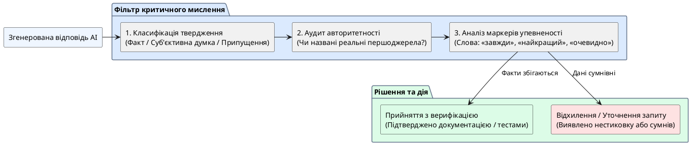

# Критичне мислення під час роботи з AI

::card-group

::card{title="🎯 Мета розділу" icon="i-lucide-target"}

- Розрізняти правдоподібність та достовірність інформації.
- Відрізняти факти від думок та припущень у відповідях AI.
- Навчитися формулювати перевірочні запитання.
- Виробити звичку аналізувати відповідь AI перед її використанням.

::

::card{title="🔑 Ключові терміни" icon="i-lucide-key"}

- **Правдоподібність:** інформація виглядає переконливо (але може бути неправдивою).
- **Достовірність:** інформація підтверджена надійними джерелами.
- **Факт:** об'єктивне твердження, яке можна перевірити.
- **Думка:** суб'єктивна оцінка, що відображає чиюсь позицію.
- **Припущення:** твердження без достатніх доказів.

::

::

{.diagram-img}

::plant-uml{alt="Фреймворк критичної оцінки генерацій AI"}



::

---

## Правдоподібність ≠ Достовірність

Це, мабуть, **найважливіше розмежування** у роботі з AI. AI генерує **правдоподібні** відповіді — такі, що звучать переконливо. Але правдоподібність не означає достовірність.

Приклад: «Дослідження Гарвардського університету 2022 року показало, що 73% студентів використовують AI для навчання.» Це звучить правдоподібно — відомий університет, конкретний рік, точна цифра. Але чи існує таке дослідження? Без перевірки ви не можете знати.

---

## Факт, думка та припущення

Аналізуючи відповідь AI, важливо класифікувати кожне твердження:

**Факт:** «Python — інтерпретована мова програмування.» → Можна перевірити, підтверджено документацією.

**Думка:** «Python — найкраща мова для початківців.» → Суб'єктивна оцінка, залежить від контексту.

**Припущення:** «Через 5 років Python витіснить усі інші мови.» → Прогноз без достатніх підстав.

::tip
Коли AI говорить «найкращий», «завжди», «ніколи», «очевидно» — це маркери думки або припущення, а не факту. Зверніть на них увагу та перевірте.
::

---

## Формулювання перевірочних запитань

Корисна техніка — після отримання відповіді задати AI **перевірочні запитання**:

- «Яке джерело цієї інформації?»
- «Чи може це бути неправдою? У яких випадках?»
- «Назви контраргумент до цього твердження»
- «Наскільки ти впевнений у цій відповіді?»

::warning
AI може відповісти на перевірочні запитання... ще однією галюцинацією. Наприклад, «вигадати» джерело. Тому перевірочні запитання — це лише перший крок. Справжня перевірка потребує зовнішніх джерел.
::

---

## Практичні завдання

::::accordion

:::accordion-item{label="📋 Завдання: Аналіз відповіді AI на факти/думки/припущення" icon="i-lucide-clipboard-list"}

Задайте AI запит:

```
Розкажи про майбутнє штучного інтелекту в освіті. 7-8 речень.
```

Для кожного речення у відповіді визначте: це **факт**, **думка** чи **припущення**? Заповніть таблицю:

| Речення | Тип | Чи можна перевірити? |
|---|---|---|
| ... | Факт / Думка / Припущення | Так / Ні |

Перевірте хоча б 2 «факти» через пошук в інтернеті.

:::

::::

---

## Запитання для самоконтролю

::::accordion

:::accordion-item{label="❓ Чому AI часто змішує факти та думки у відповідях?" icon="i-lucide-help-circle"}

AI не розрізняє факти та думки на семантичному рівні. Для моделі і «Земля обертається навколо Сонця», і «JavaScript — найкраща мова» — це просто послідовності токенів з певними ймовірностями. Модель відтворює патерни з навчальних даних, де факти та думки часто змішані, особливо в блогах, форумах та соціальних мережах.

:::

::::
