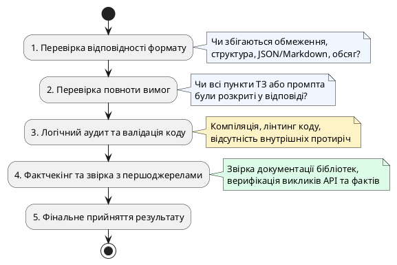

# Перевірка результатів роботи AI

::card-group

::card{title="🎯 Мета розділу" icon="i-lucide-target"}

- Опанувати систематичний підхід до перевірки результатів AI.
- Навчитися створювати особистий чек-лист перевірки.
- Зрозуміти, коли достатньо швидкої перевірки, а коли потрібна глибока.

::

::card{title="🔑 Ключові терміни" icon="i-lucide-key"}

- **Фактчекінг (*Fact-checking*):** перевірка фактичної правильності інформації.
- **Чек-лист перевірки:** структурований список критеріїв для оцінки результату.
- **Перехресна перевірка:** порівняння інформації з кількох незалежних джерел.

::

::

{.diagram-img}

::plant-uml{alt="Багаторівневий конвеєр верифікації результатів"}



::

---

## Алгоритм перевірки

::steps

### Перевірка відповідності завданню
Чи відповідає результат тому, що ви просили? Чи дотримані формат, обсяг, стиль?

### Перевірка повноти
Чи охоплені всі аспекти завдання? Чи немає пропущених пунктів?

### Перевірка логіки
Чи логічні висновки? Чи немає протиріч? Чи правильна послідовність кроків?

### Перевірка фактів
Чи правдиві конкретні факти, числа, дати, назви? Перевірте через незалежні джерела.

### Порівняння з незалежними джерелами
Чи підтверджується інформація іншими джерелами (Wikipedia, офіційна документація, підручники)?

### Виправлення та повторна перевірка
Виправте знайдені помилки та перевірте нову версію.

::

---

## Особистий чек-лист перевірки

Створіть власний чек-лист, адаптований під ваші типові задачі:

| ✅ | Критерій |
|---|---|
| ☐ | Відповідь відповідає моєму запиту |
| ☐ | Формат та обсяг відповідають вимогам |
| ☐ | Немає логічних протиріч |
| ☐ | Конкретні факти перевірені |
| ☐ | Немає «впевнених» тверджень без підстав |
| ☐ | Код (якщо є) протестований |
| ☐ | Немає персональних даних у вхідному промпті |

---

## Практичні завдання

::::accordion

:::accordion-item{label="📋 Завдання: Перевірте відповідь AI за чек-листом" icon="i-lucide-clipboard-list"}

Задайте AI запит:

```
Напиши короткий огляд 5 найпопулярніших мов програмування у 2024 році.
Для кожної: назва, рік створення, основне застосування, одна цікава особливість.
Формат: таблиця.
```

Перевірте відповідь за чек-листом:
1. Чи правильні роки створення? (Перевірте кожен)
2. Чи відповідає «основне застосування» реальності?
3. Чи «цікава особливість» — це факт чи думка?
4. Чи дійсно ці мови найпопулярніші? (Порівняйте з TIOBE Index або Stack Overflow Survey)

:::

::::

---

## Запитання для самоконтролю

::::accordion

:::accordion-item{label="❓ Чи потрібно перевіряти кожну відповідь AI?" icon="i-lucide-help-circle"}

Ступінь перевірки залежить від критичності задачі. Для мозкового штурму ідей достатньо швидкого огляду. Для фактичної інформації, коду або тексту, який буде опублікований — потрібна ретельна перевірка. Правило: чим серйозніші наслідки помилки, тим глибшою має бути перевірка.

:::

::::
