# Захист даних під час роботи з AI

::card-group

::card{title="🎯 Мета розділу" icon="i-lucide-target"}

- Зрозуміти, які дані не можна передавати AI-асистентам.
- Навчитися знеособлювати дані перед включенням у промпт.
- Виробити звичку перевіряти матеріали перед відправкою AI.

::

::card{title="🔑 Ключові терміни" icon="i-lucide-key"}

- **Персональні дані:** інформація, що ідентифікує конкретну людину.
- **Знеособлення (*Anonymization*):** видалення або заміна ідентифікуючих даних.
- **API-ключ:** секретний токен для доступу до програмних сервісів.

::

::

{.diagram-img}

::plant-uml{alt="Конвеєр знеособлення та безпечної передачі даних"}

```plantuml
@startuml
skinparam style plain
skinparam backgroundColor #FFFFFF
skinparam packageBackgroundColor #F8FAFC
skinparam packageBorderColor #64748B

rectangle "Вихідний текст / Код\n(Містить PII, паролі, API ключі)" as Raw #FEE2E2

package "Шар безпеки та знеособлення (Data Sanitizer)" #EFF6FF {
  rectangle "• Детекція секретів (.env, токени)\n• Маскування ПІБ та контактів -> [Користувач 1]\n• Знеособлення фінансових та медичних даних" as Filter #DBEAFE
}

rectangle "Безпечний промпт\n(Лише бізнес-логіка)" as Clean #DCFCE7
rectangle "Хмарний AI-сервіс\n(ChatGPT, Claude, Gemini API)" as AI #DBEAFE
rectangle "Отриманий результат\n(Код, аналіз або відповідь)" as Res #FEF3C7

Raw -> Filter : Автоматичний або ручний аудит
Filter -> Clean : Очищений запит
Clean -> AI : Безпечний HTTPS запит
AI -> Res : Генерація

@enduml
```



::

---

## Що не можна передавати AI

::caution
Все, що ви пишете в промпті, може бути використано для покращення моделі (залежно від налаштувань сервісу). Ставтеся до промпта як до публічного повідомлення.
::

**Категорично заборонено передавати:**
- Паролі та коди доступу
- API-ключі та токени
- Номери банківських карток
- Номери документів (паспорт, ІПН)
- Медичні дані
- Персональні фотографії та документи
- Дані інших людей без їхньої згоди

---

## Знеособлення даних

Якщо вам потрібно попросити AI допомогти з текстом, що містить персональні дані — **знеособіть** їх перед відправкою:

| Оригінал | Знеособлений варіант |
|---|---|
| Іван Петренко, вул. Хрещатик 22 | [Ім'я], [Адреса] |
| +380671234567 | [Телефон] |
| ivan@gmail.com | [Email] |
| ІПН 1234567890 | [ІПН] |

---

## Практичні завдання

::::accordion

:::accordion-item{label="📋 Завдання: Знеособіть текст" icon="i-lucide-clipboard-list"}

Нижче — текст з персональними даними. Знеособіть його, замінивши всі ідентифікуючі дані на плейсхолдери:

```
Шановний Олексій Коваленко! Підтверджуємо вашу реєстрацію на вебінар.
Дані для входу: логін — oleksiy.kovalenko@company.ua, пароль — Qwerty123!
Ваш обліковий номер: UA-2024-78543. Телефон для зв'язку: +380931234567.
```

Після знеособлення задайте AI: «Перевір, чи залишились у цьому тексті персональні дані.»

:::

::::

---

## Запитання для самоконтролю

::::accordion

:::accordion-item{label="❓ Чому навіть «безневинні» дані можуть бути небезпечними?" icon="i-lucide-help-circle"}

Окремі фрагменти інформації (ім'я, місто, місце роботи) можуть бути безпечними окремо, але в комбінації дозволяють ідентифікувати конкретну людину. Це називається «мозаїчний ефект» — набір «безневинних» деталей складається у повний портрет. Тому навіть часткові персональні дані потребують обережного поводження.

:::

::::
