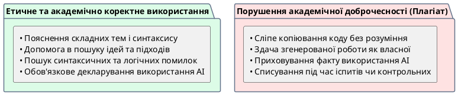

# Авторське право та навчальна доброчесність

::card-group

::card{title="🎯 Мета розділу" icon="i-lucide-target"}

- Зрозуміти правові та етичні аспекти використання AI-генерованого контенту.
- Навчитися коректно зазначати факт використання AI.
- Розрізняти допомогу AI та плагіат.

::

::card{title="🔑 Ключові терміни" icon="i-lucide-key"}

- **Авторське право (*Copyright*):** правова охорона оригінальних творів.
- **Плагіат:** видача чужої роботи за свою.
- **Академічна доброчесність:** дотримання етичних стандартів у навчанні та дослідженнях.

::

::

{.diagram-img}

::plant-uml{alt="Дерево рішень академічної доброчесності при роботі з AI"}



::

---

## Кому належить контент, створений AI

Правове питання авторства AI-контенту досі **не вирішене повністю**. У більшості юрисдикцій AI не може бути автором — автором може бути лише людина. Це означає:

- Текст, згенерований AI, формально не має автора.
- Ви не можете заявити повне авторство на контент, створений AI.
- Ви відповідаєте за використання AI-контенту, навіть якщо не є його «автором».

---

## Академічна доброчесність та AI

У навчальному контексті головне правило: **AI — це інструмент, а не автор вашої роботи**. Використовувати AI для навчання — нормально. Видавати роботу AI за свою — плагіат.

**Допустиме використання AI:**
- Пояснення складної теми для кращого розуміння.
- Генерація ідей для мозкового штурму (з подальшим власним розвитком).
- Перевірка граматики та стилю.
- Допомога з пошуком інформації (з перевіркою).

**Недопустиме використання AI:**
- Генерація повного тексту курсової/реферату та здача як власної роботи.
- Копіювання коду AI без розуміння та зазначення.
- Відповіді на екзамені за допомогою AI.

---

## Коректне зазначення використання AI

Коли ви використовуєте AI для створення контенту, зазначайте це:

```
При підготовці цього матеріалу використано AI-асистент ChatGPT для генерації
початкових ідей та структури. Фактична інформація перевірена через
[вказати джерела]. Текст відредагований та доповнений автором.
```

---

## Практичні завдання

::::accordion

:::accordion-item{label="📋 Завдання: Де межа між допомогою та плагіатом?" icon="i-lucide-clipboard-list"}

Для кожної ситуації визначте: це допустиме використання AI чи порушення доброчесності?

1. Використати AI для пояснення теорії перед написанням курсової
2. Згенерувати AI весь текст курсової та здати
3. Попросити AI перевірити граматику вашого тексту
4. Згенерувати AI план презентації, а потім написати зміст самостійно
5. Скопіювати код AI без розуміння його роботи
6. Попросити AI пояснити помилку у вашому коді
7. Здати відповідь AI на контрольну роботу

Обговоріть спірні випадки з одногрупниками.

:::

::::

---

## Запитання для самоконтролю

::::accordion

:::accordion-item{label="❓ Чому важливо зазначати використання AI, навіть якщо це не заборонено?" icon="i-lucide-help-circle"}

Прозорість — основа довіри. Зазначення використання AI показує вашу чесність, дозволяє іншим оцінити надійність інформації та встановлює правильну культуру використання технологій. Крім того, якщо AI допустив помилку — зазначення допомагає зрозуміти її джерело.

:::

::::
