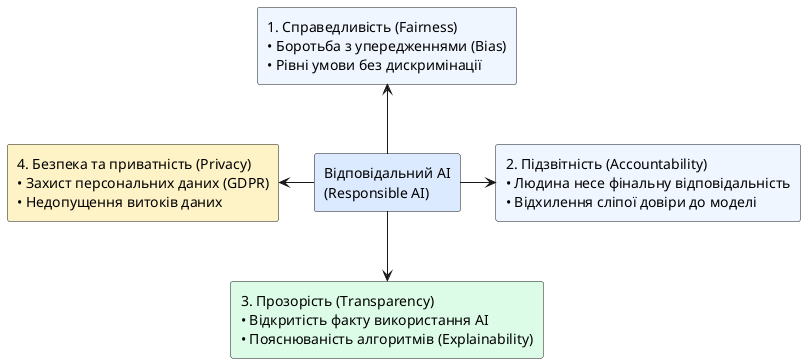

# Відповідальне використання AI

::card-group

::card{title="🎯 Мета розділу" icon="i-lucide-target"}

- Зрозуміти, що таке упередженість AI та як вона виникає.
- Усвідомити відповідальність за результати, створені з допомогою AI.
- Сформувати етичний підхід до використання AI-технологій.

::

::card{title="🔑 Ключові терміни" icon="i-lucide-key"}

- **Упередженість (*Bias*):** систематичне відхилення результатів AI, що дискримінує певні групи.
- **Відповідальність користувача:** обов'язок перевіряти та нести відповідальність за використаний AI-контент.
- **Етичний AI (*Responsible AI*):** підхід до розробки та використання AI з урахуванням етичних норм.

::

::

{.diagram-img}

::plant-uml{alt="Чотири стовпи відповідального AI"}

::

---

## Упередженість AI

AI-моделі навчаються на даних, створених людьми. Якщо ці дані містять упередження (расові, гендерні, вікові, культурні) — модель їх засвоїть та відтворить. Це не злий намір AI — це відображення упереджень суспільства в даних.

Приклади:
- Система автоматичного відбору резюме, що надавала перевагу чоловікам (Amazon, 2018).
- Генерація зображень, що відтворює стереотипи (керівник = чоловік, медсестра = жінка).
- Мовні моделі, що генерують різні відповіді залежно від згаданої етнічної групи.

---

## Відповідальність за результат

Фундаментальний принцип: **людина, яка використовує AI, несе повну відповідальність за результат**. «AI так порадив» — це не виправдання.

- **Користувач відповідає за:** перевірку результатів, захист даних, коректне зазначення використання AI, наслідки прийнятих рішень.
- **Розробник AI відповідає за:** безпеку моделі, зменшення упередженості, прозорість обмежень, захист даних користувачів.

---

## Практичні завдання

::::accordion

:::accordion-item{label="📋 Завдання: Виявіть упередженість AI" icon="i-lucide-clipboard-list"}

Протестуйте AI на наявність упередженості:

1. Попросіть AI описати «типового програміста» та «типового вчителя». Чи є гендерні стереотипи?
2. Попросіть AI порекомендувати книги з програмування. Чи є автори з різних країн та культур, чи переважно англомовні?
3. Задайте одне й те саме питання, змінюючи контекст (наприклад, «порадь кар'єру для Марії» vs «порадь кар'єру для Олександра»). Чи відрізняються рекомендації?

Зафіксуйте результати та обговоріть: чому виникає упередженість і як з нею боротися?

:::

::::

---

## Запитання для самоконтролю

::::accordion

:::accordion-item{label="❓ Чи можна повністю усунути упередженість AI?" icon="i-lucide-help-circle"}

Повністю — ні, оскільки будь-які дані відображають певну перспективу та контекст. Але можна значно зменшити упередженість: через різноманітні навчальні дані, аудит моделей, тестування на fairness та людський контроль. Ключова відповідальність — на розробниках моделей та на користувачах, які повинні усвідомлювати цей ризик і враховувати його при інтерпретації результатів.

:::

::::
