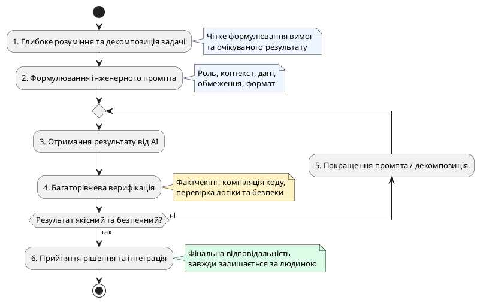

# AI Native Workflow

::card-group

::card{title="🎯 Мета розділу" icon="i-lucide-target"}

- Засвоїти повний алгоритм AI Native Workflow.
- Зрозуміти місце промпта у загальному робочому процесі.
- Навчитися систематично застосовувати workflow для будь-якої задачі.

::

::card{title="🔑 Ключові терміни" icon="i-lucide-key"}

- **AI Native Workflow:** послідовність кроків ефективної роботи з AI від постановки задачі до прийняття рішення.
- **Декомпозиція:** розбиття складної задачі на менші керовані частини.
- **Валідація:** систематична перевірка результату за чек-листом.

::

::

---

## Шість кроків AI Native Workflow

::steps

### Зрозуміти задачу та визначити користувача
Перш ніж звертатися до AI, чітко сформулюйте: що саме потрібно зробити? Для кого? Який результат вважатиметься успішним? Без відповідей на ці питання будь-який промпт буде неефективним.

### Передати AI контекст і сформулювати промпт
Зібрати необхідний контекст, обрати тип промпта, застосувати принципи та структуру, вивчені в Модулі 3. Підготувати вхідні матеріали, якщо потрібно.

### Декомпозувати задачу та отримати варіант розв'язання
Для складних задач — розбити на підзадачі та вирішувати послідовно. Отримати від AI один або кілька варіантів розв'язання.

### Перевірити результат
Застосувати чек-лист перевірки: відповідність завданню, повнота, логіка, факти. Для критичних задач — перехресна перевірка з незалежними джерелами.

### Покращити результат
На основі перевірки — уточнити промпт, виправити помилки, доопрацювати результат. Ітерувати до досягнення якісного результату.

### Прийняти остаточне рішення і взяти відповідальність
Людина приймає фінальне рішення: використати, відхилити або доопрацювати результат. Відповідальність за наслідки — на людині, не на AI.

::

---

## Місце промпта в робочому процесі

{.diagram-img}

::plant-uml{alt="Цикл AI Native Workflow"}

::

Промпт — це лише **один крок** із шести. Навіть ідеальний промпт не замінює розуміння задачі, перевірку результату та прийняття відповідальності. Workflow — це система, де кожен елемент підсилює інші.

---

## Практичні завдання

::::accordion

:::accordion-item{label="📋 Завдання: Пройдіть повний Workflow" icon="i-lucide-clipboard-list"}

Виберіть реальну задачу (наприклад, «підготувати конспект до заняття») та пройдіть усі 6 кроків:

1. **Зрозуміти задачу:** Що конкретно потрібно? Для кого? Який обсяг?
2. **Промпт:** Сформулюйте промпт із контекстом, метою, форматом та обмеженнями.
3. **Декомпозиція:** Розбийте задачу на 3-4 підзадачі.
4. **Перевірка:** Перевірте результат за чек-листом (мінімум 5 пунктів).
5. **Покращення:** Виправте знайдені недоліки (мінімум 1 ітерація).
6. **Рішення:** Зафіксуйте фінальний результат та що ви змінили.

Запишіть процес: які кроки зайняли найбільше часу? Де AI був найкориснішим?

:::

::::

---

## Запитання для самоконтролю

::::accordion

:::accordion-item{label="❓ Чому Workflow починається з розуміння задачі, а не з промпта?" icon="i-lucide-help-circle"}

Без розуміння задачі неможливо сформулювати якісний промпт. Якщо ви не знаєте, що саме хочете отримати, для кого та навіщо — жоден промпт не допоможе. Це як починати будівництво без проєкту: можна мати найкращі інструменти, але без плану результат буде хаотичним.

:::

::::
