# Застосування AI Native Workflow під час створення цифрового продукту

::card-group

::card{title="🎯 Мета розділу" icon="i-lucide-target"}

- Застосувати AI Native Workflow для розробки концепції цифрового продукту.
- Пройти повний цикл: проблема → ідея → функції → варіанти → вибір → перевірка.
- Визначити та задокументувати внесок людини та AI на кожному етапі.
- Підготуватися до виконання підсумкової роботи курсу.

::

::card{title="🔑 Ключові терміни" icon="i-lucide-key"}

- **Концепція продукту:** опис ідеї, цільової аудиторії, ключових функцій та цінності продукту.
- **Критерії оцінювання:** параметри, за якими оцінюється підсумкова робота.

::

::

{.diagram-img}

::plant-uml{alt="Практичний потік створення цифрового продукту з AI"}

```plantuml
@startuml
skinparam style plain
skinparam backgroundColor #FFFFFF
skinparam packageBackgroundColor #F8FAFC
skinparam packageBorderColor #64748B

package "1. Дослідження проблеми (Human Lead)" #EFF6FF {
  rectangle "Визначення болю користувача\n+ Інтерв'ю та валідація проблеми" as S1 #DBEAFE
}

package "2. AI-колаборація та концептуалізація" #DCFCE7 {
  rectangle "Брейншторм 10+ варіантів рішень\n+ Пріоритизація MVP (MoSCoW)" as S2 #DCFCE7
}

package "3. Швидке прототипування та генерація" #FEF3C7 {
  rectangle "Створення макетів UI, API-контрактів,\nкаркасу коду та схеми бази даних" as S3 #FEF3C7
}

package "4. Валідація та захист продукту (Human Gate)" #F3E8FF {
  rectangle "Аудит якості, фактчекінг фактів,\nоцінка власного внеску vs внеску AI" as S4 #F3E8FF
}

S1 -right-> S2 : Специфікація потреби
S2 -right-> S3 : Промпти та задачі
S3 -right-> S4 : Прототип на рев'ю

@enduml
```

::

---

## Покроковий процес створення концепції

Цей розділ — практикум, де ви застосовуєте все, що вивчили впродовж курсу, для створення концепції цифрового продукту.

::steps

### Вибір проблеми користувача
Визначте реальну проблему, яку ви хочете вирішити. Використайте AI для генерації ідей, але **оберіть проблему самостійно** — на основі власного досвіду та дослідження.

### Формування ідеї продукту
За допомогою AI згенеруйте кілька концепцій продукту. Порівняйте їх, оцініть реалістичність та оберіть одну.

### Визначення функцій продукту
Попросіть AI сформувати список функцій та пріоритизувати їх (must have / should have / nice to have). Перевірте та доповніть список.

### Отримання варіантів за допомогою AI
Для кожної ключової функції отримайте від AI опис реалізації. Порівняйте запропоновані варіанти.

### Вибір рішення
На основі аналізу та порівняння оберіть фінальний набір рішень. Зафіксуйте, **чому** ви обрали саме ці варіанти.

### Перевірка за чек-листом
Перевірте концепцію: чи вирішує вона проблему? Чи реалістичні функції? Чи немає фактичних помилок?

### Визначення внеску людини та AI
Для кожного етапу вкажіть: що зробив AI, що зробили ви. Це ключова частина підсумкової роботи.

::

---

## Критерії оцінювання підсумкової роботи

Підсумкова робота оцінюється за чотирма критеріями:

| Критерій | Що оцінюється |
|---|---|
| **Якість постановки задачі для AI** | Структурованість промптів, використання принципів, ітеративне покращення |
| **Глибина перевірки результату** | Використання чек-листа, фактчекінг, аналіз на факти/думки/припущення |
| **Дотримання вимог до даних і авторства** | Знеособлення даних, коректне зазначення AI, відсутність плагіату |
| **Самостійність рішень** | Чітке розмежування внеску AI та людини, обґрунтування вибору |

---

## Практичні завдання

::::accordion

:::accordion-item{label="📋 Завдання: Міні-версія підсумкової роботи" icon="i-lucide-clipboard-list"}

Створіть концепцію простого цифрового продукту за 7 кроків Workflow. Оформіть результат як документ:

**Структура документа:**

1. **Проблема** (2-3 речення): яку проблему вирішує продукт?
2. **Цільова аудиторія** (2-3 речення): для кого цей продукт?
3. **Ідея** (3-4 речення): що робить продукт?
4. **Ключові функції MVP** (5 пунктів із пріоритетами)
5. **Внесок AI vs Людини** (таблиця для кожного етапу)
6. **Перевірка** (чек-лист: що перевірено, які помилки знайдені)
7. **Висновок** (чому ви обрали саме цей продукт, 2-3 речення)

Для кожного етапу збережіть промпти, які ви використовували, та відповіді AI.

:::

::::

---

## Запитання для самоконтролю

::::accordion

:::accordion-item{label="❓ Навіщо документувати внесок AI та людини?" icon="i-lucide-help-circle"}

Документування внеску виконує кілька функцій: демонструє вашу академічну доброчесність, допомагає оцінити, де AI був корисним, а де ви приймали рішення самостійно, і формує навичку рефлексії — усвідомлення власного процесу мислення та роботи. У професійній діяльності ця навичка допоможе ефективніше використовувати AI та чіткіше розуміти свою цінність як спеціаліста.

:::

::::
