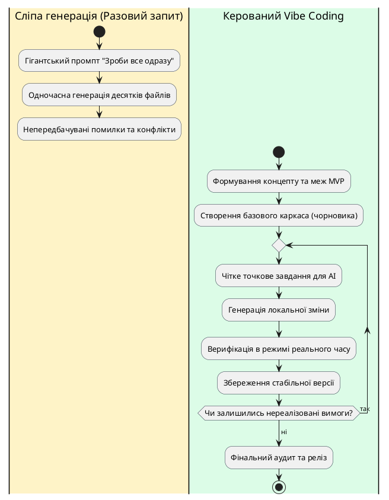

# Парадигма Vibe Coding Workflow

::card-group

::card{title="🎯 Мета розділу" icon="i-lucide-target"}

- Опанувати сутність парадигми Vibe Coding як керованого інженерного процесу створення цифрових рішень.
- Зрозуміти фундаментальну різницю між керованою ітеративною розробкою та наївною одноразовою генерацією коду.
- Засвоїти базовий цикл розробки: «Завдання → Зміна → Перевірка → Збереження».
- Усвідомити роль та межі відповідальності людини як головного архітектора й верифікатора результатів роботи штучного інтелекту.

::

::card{title="🔑 Ключові терміни" icon="i-lucide-key"}

- **Вайб-кодинг (*Vibe Coding*):** підхід до розробки програмного забезпечення, за якого розробник формулює наміри, архітектуру та вимоги природною мовою, а штучний інтелект реалізує конкретний код.
- **Керована розробка (*Guided Development*):** покроковий контроль процесу кодогенерації з обов'язковою верифікацією проміжних результатів людиною.
- **Робочий процес (*Workflow*):** формалізована послідовність дій і правил, що гарантує передбачуваність і повторюваність результату.
- **Точка збереження (*Snapshot / Commit*):** зафіксований робочий стан проєкту, до якого гарантовано можна безпечно повернутися у разі помилки.

::

::

---

## Еволюція взаємодії з кодовою базою

Традиційна розробка програмного забезпечення десятиліттями вимагала від інженера одночасного утримання в голові двох рівнів мислення: високорівневої архітектури продукту (що саме ми будуємо і навіщо) та низькорівневих синтаксичних деталей мови програмування (як саме розмістити дужки, викликати методи стандартної бібліотеки чи виділити пам'ять). Поява великих мовних моделей (*Large Language Models / LLM*) докорінно трансформувала цей розподіл уваги. 

Підхід, що отримав назву **Vibe Coding**, переносить фокус розробника на рівень мислення категоріями продукту, користувацького досвіду та архітектурних рішень. Замість ручного написання кожного рядка інженер описує бажану поведінку системи природною мовою, надаючи AI роль швидкого та досвідченого виконавця. Проте термін «вайб» не повинен вводити в оману: це не хаотичне клацання наосліп, а високодисциплінований інженерний процес, у якому чіткість формулювань визначає якість підсумкової системи.

Коли розробник взаємодіє з AI, якість результату залежить не від магії моделі, а від точності переданого контексту. Природна мова стає мовою специфікації та програмування найвищого рівня. Водночас зростає вимога до критичного мислення: що легше генерувати код, то вищою стає ціна помилки, пропущеної через неуважність.

::note
Вайб-кодинг не скасовує знання інженерних основ. Навпаки, що краще інженер розуміє принципи побудови веб-застосунків, модель DOM (*Document Object Model*) та механізми реактивності, то точніше він ставить завдання моделі та швидше діагностує приховані аномалії.
::

---

## Відмінність керованої розробки від сліпої генерації

Поширена помилка розробників-початківців полягає у спробі отримати готовий комплексний застосунок за один гігантський запит (*Single-Prompt Generation*): «Створи мені повноцінний маркетплейс із кошиком, оплатою та чатом». Такий підхід майже завжди призводить до появи монолітного, непрацездатного або крихкого коду, який надзвичайно важко налагоджувати.

На противагу цьому, **керована розробка** (*Guided Development*) спирається на декомпозицію складної системи на елементарні, легко перевірювані кроки. AI розглядається не як всезнаючий оракул, а як асистент із обмеженим контекстним вікном, якому потрібні ясні орієнтири та постійний зворотний зв'язок.

{.diagram-img}

::plant-uml{alt="Порівняння підходів до взаємодії з AI"}

::

Як видно з наведеної схеми, керована розробка створює неперервну петлю зворотного зв'язку. Якщо на якомусь кроці штучний інтелект запропонував невдале або помилкове рішення, розробник помічає це негайно, а не через години марних спроб розібратися у сотнях рядків заплутаного коду.

---

## Фундаментальний цикл: Завдання – Зміна – Перевірка – Збереження

Основою продуктивності у середовищі сучасних AI-інструментів є суворе дотримання чотириетапного циклу розробки. Порушення послідовності або пропуск будь-якого з цих етапів неминуче веде до втрати контролю над проєктом.

::steps

### Крок 1. Завдання (Task Definition)
Сформулюйте для AI одне конкретне завдання природною мовою. Опишіть поточний стан, бажану зміну та обмеження. На цьому етапі категорично забороняється поєднувати кілька різнорідних вимог (наприклад, одночасно змінювати стилістику форми та переписувати алгоритм валідації).

### Крок 2. Зміна (Code Generation)
AI генерує або модифікує фрагмент кодової бази. Уважно перегляньте диференційний перегляд (*diff*) змін: які саме файли було зачеплено і чи не видалив асистент випадково логіку, реалізовану на попередньому кроці.

### Крок 3. Перевірка (Interactive Verification)
Запустіть режим попереднього перегляду (*Live Preview*) та особисто здійсніть клік-тест. Перевірте, чи працює нова кнопка, чи змінюється стан інтерфейсу, чи з'являється очікуваний результат і чи не зламалися раніше перевірені функції продукту.

### Крок 4. Збереження (Snapshot / Checkpoint)
Щойно функція підтвердила свою працездатність, зафіксуйте стан проєкту у системі контролю версій або створіть збереження у робочому просторі. Тільки після фіксації робочого стану дозволяється переходити до наступного завдання.

::

::warning
Ніколи не переходьте до формулювання нового завдання для AI, доки ви не перевірили та не зберегли результати попереднього кроку. Накопичення неперевірених змін робить пошук першопричини багів практично неможливим.
::

---

## Людина як архітектор і фінальний арбітр якості

У контексті Vibe Coding штучний інтелект бере на себе рутинне кодування, проте повна відповідальність за продукт залишається на людині. AI не володіє власною суб'єктністю: він не розуміє болю користувача, не здатний оцінити комерційну доцільність функціоналу та не відчуває естетичної гармонії інтерфейсу так, як людина.

Розробник у цьому процесі виконує чотири ключові ролі:
1. **Продуктовий візіонер:** визначає, яку саме проблему розв'язує застосунок і хто є його кінцевим користувачем.
2. **Системний архітектор:** встановлює межі продукту, вибирає допустимий стек технологій та обмежує складність рішень.
3. **Промпт-інженер і координатор:** структурує вимоги у доступній для великих мовних моделей формі, мінімізуючи простір для неоднозначних трактувань.
4. **Офіцер якості (QA Lead):** критично оцінює кожен згенерований екран, тестує нестандартні користувацькі сценарії та приймає рішення про реліз.

---

## Практичні завдання та запитання для самоконтролю

::::accordion

:::accordion-item{label="📋 Практичне завдання: Моделювання Vibe Coding Workflow" icon="i-lucide-clipboard-list"}

Уявіть, що перед вами стоїть завдання створити інтерактивний калькулятор часу читання статті для онлайн-блогу.

1. Декомпозуйте створення цього мікрозастосунку на 4 послідовні ітерації відповідно до правила «одне завдання — одна зміна».
2. Для першої ітерації сформулюйте запит для AI, що відповідає стандарту керованої розробки (вкажіть контекст, очікувані елементи та обмеження).
3. Опишіть, як саме ви здійсните перевірку (клік-тест) після виконання першої ітерації.

:::

:::accordion-item{label="❓ Чому спроба згенерувати застосунок за один детальний промпт є хибною практикою?" icon="i-lucide-help-circle"}

При спробі одномоментної генерації складної системи ймовірність виникнення логічних колізій, синтаксичних помилок та галюцинацій зростає експоненційно. AI-модель має схильність спрощувати або опускати неочевидні деталі, а інженер втрачає можливість ізольованого тестування окремих компонентів. Керована розробка дозволяє локалізувати помилки на ранніх стадіях і зберігати повний контроль над архітектурою.

:::

:::accordion-item{label="❓ Що робити, якщо після чергової відповіді AI раніше робоча функція перестала працювати?" icon="i-lucide-help-circle"}

Це класичний прояв регресії. Не слід намагатися одразу писати хаотичні запити з проханням «полагодити все назад», оскільки це лише додатково засмітить контекст. Правильний алгоритм: зупинитися, відкотити проєкт до останнього зафіксованого стабільного збереження (Snapshot/Commit), переглянути формулювання завдання, зменшити масштаб запланованої зміни і повторити ітерацію з чіткішою вказівкою не зачіпати існуючі модулі.

:::

::::
