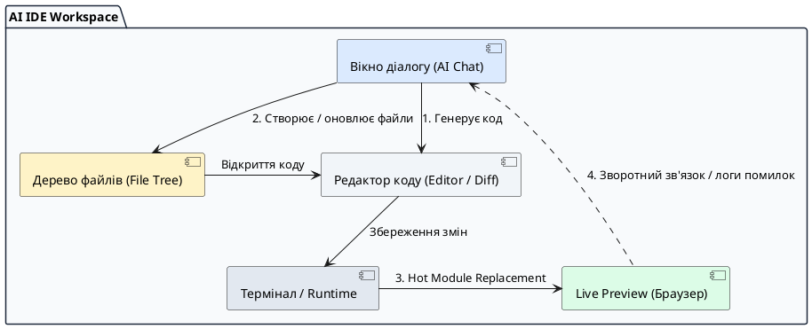

# AI-середовище швидкої розробки

::card-group

::card{title="🎯 Мета розділу" icon="i-lucide-target"}

- Вивчити внутрішню архітектуру та компоненти сучасних середовищ швидкої AI-розробки.
- Зрозуміти механізм синхронізації між вікном діалогу, файловою системою проєкту та режимом попереднього перегляду.
- Навчитися орієнтуватися у структурі проєкту та контролювати зміни у файлах.
- Засвоїти принципи роботи хмарного оточення без потреби локального розгортання складних стеків.

::

::card{title="🔑 Ключові терміни" icon="i-lucide-key"}

- **AI-середовище розробки (*AI Development Environment*):** інтегрована платформа, що поєднує редактор коду, генеративну модель, середовище виконання та інтерактивне вікно попереднього перегляду.
- **Режим попереднього перегляду (*Live Preview*):** вбудований у середовище браузерний фрейм, що автоматично відображає роботу веб-застосунку в реальному часі без перезапуску сервера.
- **Гаряче перезавантаження модулів (*Hot Module Replacement / HMR*):** технологія оновлення змінених модулів у браузері без повної втрати поточного стану програми.
- **Дерево файлів (*File Tree*):** ієрархічна структура файлів і папок, що формує проєкт.

::

::

---

## Анатомія сучасного AI-середовища

Традиційне робоче місце веб-розробника зазвичай вимагає тривалого процесу конфігурації: встановлення середовища виконання Node.js, пакетних менеджерів, налаштування локального веб-сервера, компіляторів, лінтерів та розширень редактора коду. У парадигмі швидкої AI-розробки (*AI-native development*) цей бар'єр знято завдяки платформам нового покоління, таким як Replit, Bolt.new, v0 або Cursor.

Ці інструменти надають так зване «все-в-одному» (*all-in-one*) хмарне оточення. Розробнику більше не потрібно витрачати години на усунення конфліктів версій чи встановлення системних залежностей: весь життєвий цикл коду відбувається у захищеному ізольованому контейнері безпосередньо у вікні браузера або через інтегровану клієнтську програму.

Центральною особливістю таких середовищ є безшовна інтеграція штучного інтелекту у файлову систему. AI виступає не просто пасивним генератором тексту, а повноцінним агентом, здатним читати існуючі файли, створювати нові каталоги, запускати консольні команди та аналізувати помилки компіляції.

---

## Ключові функціональні блоки робочого простору

Типовий інтерфейс сучасного хмарного AI-середовища логічно розділений на чотири взаємопов'язані зони. Ефективна робота інженера вимагає чіткого розуміння того, як інформація циркулює між цими блоками.

{.diagram-img}

::plant-uml{alt="Архітектурні блоки AI-середовища"}



::

### 1. Вікно діалогу з AI (Chat Interface)
Це командний центр вашого проєкту. Тут ви формулюєте вимоги, передаєте бізнес-правила, уточнюєте дизайн та надсилаєте повідомлення про знайдені дефекти. Важливо пам'ятати, що кожне нове повідомлення надсилається до мовної моделі разом із контекстом — системними інструкціями та інформацією про структуру ваших файлів.

### 2. Дерево файлів (File Tree)
Ієрархія вашого проєкту. Тут розміщуються HTML-файли структури, таблиці стилів CSS, JavaScript-модулі, зображення та конфігураційні файли. Навіть під час роботи через природну мову інженер повинен регулярно зазирати у дерево файлів, щоб контролювати чистоту структури: перевіряти, чи не створює AI дублікатів файлів або непотрібних тимчасових скриптів.

### 3. Редактор коду та перегляд диференціалу (Code Editor / Diff View)
Вікно, в якому відображається безпосередній програмний код. Сучасні AI-середовища автоматично підсвічують кольором різницю (*diff*) між старою та новою версіями: зелені рядки показують доданий код, червоні — видалений. Це дає змогу швидко переконатися, що AI не видалив важливу бізнес-логіку під час виконання косметичного завдання.

### 4. Режим попереднього перегляду (Live Preview)
Інтерактивне вікно веб-додатка, що працює паралельно з редактором. Завдяки технології гарячого оновлення модулів будь-яка зміна у коді миттєво відображається на екрані без необхідності оновлювати сторінку вручну. Це забезпечує надзвичайно короткий цикл зворотного зв'язку, дозволяючи тестувати гіпотези за лічені секунди.

---

## Організація клієнтського проєкту

У межах навчального курсу розробляється суто клієнтський інтерактивний застосунок. Це суттєво спрощує архітектуру проєкту та гарантує його швидку роботу на будь-яких пристроях.

::code-tree

```html [index.html]
<!-- Головний файл структури інтерфейсу -->
<!DOCTYPE html>
<html lang="uk">
<head>
  <meta charset="UTF-8">
  <title>Інтерактивний продукт</title>
  <link rel="stylesheet" href="style.css">
</head>
<body>
  <div id="app"></div>
  <script type="module" src="main.js"></script>
</body>
</html>
```

```css [style.css]
/* Таблиця стилів та змінні теми оформлення */
:root {
  --primary-color: #2563eb;
  --bg-color: #f8fafc;
}
```

```javascript [main.js]
// Клієнтська логіка: обробка подій та керування станом
console.log("Застосунок ініціалізовано");
```

::

Така мінімалістична структура дозволяє зосередитися на головному — логіці взаємодії з користувачем, не перевантажуючи початковий проєкт складними збирачами модулів чи конфігураційними файлами.

::tip
Якщо AI пропонує встановити важкі сторонні бібліотеки або створити серверний файл (наприклад, `server.js` чи конфігурацію бази даних), вчасно зупиніть його. Нагадуйте асистенту про встановлені межі проєкту: «Ми розробляємо суто клієнтський веб-додаток за допомогою стандартних веб-технологій».
::

---

## Практичні завдання та запитання для самоконтролю

::::accordion

:::accordion-item{label="📋 Практичне завдання: Дослідження робочого простору" icon="i-lucide-clipboard-list"}

1. Відкрийте обране AI-середовище розробки (наприклад, Bolt.new, Replit або Cursor).
2. Знайдіть у ньому вікно дерева файлів і відкрийте кореневий файл структури (`index.html` або головний компонент).
3. Надішліть у чат команду змінити головний заголовок сторінки та колір фону.
4. Зверніть увагу на вікно перегляду відмінностей (*diff*): які рядки було замінено?
5. Перевірте, чи оновився екран у режимі *Live Preview* автоматично.

:::

:::accordion-item{label="❓ Для чого потрібен перегляд відмінностей (Diff View), якщо можна просто подивитися на Live Preview?" icon="i-lucide-help-circle"}

Візуальний вигляд у Live Preview показує лише поверхневий результат рендерингу, але приховує якість внутрішньої реалізації. AI може вирішити проблему неоптимальним шляхом: наприклад, замість зміни одного параметра дублювати цілий блок коду, захардкодити значення або випадково видалити важливі обробники подій, які проявлять себе лише при нестандартних діях користувача. Перегляд diff дозволяє інженеру здійснювати повноцінний аудит коду до його фіксації.

:::

:::accordion-item{label="❓ Що робити, якщо вікно Live Preview демонструє білий екран або помилку під час завантаження?" icon="i-lucide-help-circle"}

Білий екран найчастіше свідчить про наявність критичної синтаксичної помилки або невизначеної змінної (*ReferenceError*), яка зупинила виконання сценарію JavaScript. Необхідно відкрити вбудовану консоль розробника у вікні Live Preview або панель терміналу, скопіювати точний текст помилки разом із номером рядка та надати його асистенту з проханням локалізувати і виправити несправність.

:::

::::
