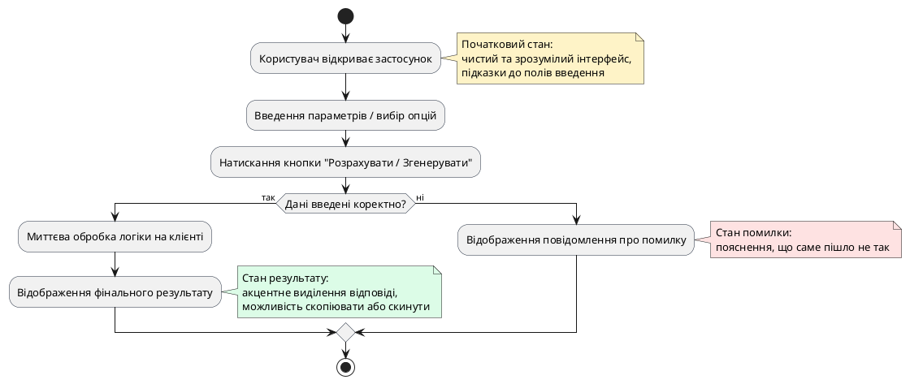

# Користувацьке завдання та межі першої версії

::card-group

::card{title="🎯 Мета розділу" icon="i-lucide-target"}

- Навчитися формулювати чітке прикладне завдання користувача, яке розв'язує цифровий продукт.
- Опанувати техніку побудови наскрізного користувацького сценарію (*User Journey / Happy Path*).
- Засвоїти принципи жорсткого обмеження обсягу першої версії продукту (*Scope Creep Prevention*).
- Встановити однозначні критерії готовності та успішності розробки мінімально життєздатного застосунку.

::

::card{title="🔑 Ключові терміни" icon="i-lucide-key"}

- **Межі продукту (*Product Scope*):** чітко зафіксований перелік можливостей, екранів та логічних операцій, які мають бути створені в межах ітерації.
- **Мінімально життєздатний продукт (*Minimum Viable Product / MVP*):** найбільш рання та лаконічна версія рішення, здатна надати користувачеві ключову цінність.
- **Головний сценарій (*Happy Path*):** ідеальний маршрут взаємодії користувача з інтерфейсом, за якого всі дії виконуються без помилок і приводять до бажаного результату.
- **Нефункціональні межі (*Non-Goals*):** свідомо зафіксовані речі, які проєкт категорично не реалізує на поточному етапі.

::

::

---

## Від проблеми користувача до ідеї рішення

Кожен життєздатний цифровий продукт починається не з технології чи вибору фреймворку, а з чіткого усвідомлення конкретної життєвої ситуації або труднощів певної групи людей. Програма, створена «просто так», швидко стає беззмістовним нагромадженням кнопок. На противагу цьому, продукт із фокусом на людині будується навколо простої тріади: **Користувач → Проблема → Результат**.

У межах навчального спринту кожен студент обирає компактну, але реальну проблему. Це може бути нова ідея або розвиток раніше розглянутого концепту. Головна вимога — результат має бути практичним і відчутним для користувача вже після кількох кліків у браузері.

Прикладами таких компактних продуктів можуть слугувати:
- **Калькулятор розрахунку добової норми води** з урахуванням ваги та рівня активності.
- **Генератор теми для навчального проєкту**, що допомагає студенту обрати напрям дослідження за заданими інтересами.
- **Конвертер одиниць вимірювання даних** для системних адміністраторів (біти, байти, гігабайти, мебібайти).
- **Таймер продуктивності за технікою Pomodoro** із налаштуванням персональних інтервалів відпочинку.

::note
Складність продукту не вимірюється кількістю екранів. Найкращі рішення часто складаються з одного-єдиного екрана, але виконують своє завдання бездоганно: швидко, зрозуміло та без зайвих запитань.
::

---

## Моделювання головного сценарію взаємодії

Коли користувач відкриває застосунок, у нього є чітка мета. Завдання розробника — провести його до цієї мети найкоротшим і найпростішим шляхом. Такий сценарій в інженерній практиці називають **Happy Path** (головний успішний сценарій).

{.diagram-img}

::plant-uml{alt="Головний користувацький сценарій"}

::

Як бачимо, логіка застосунку є абсолютно прозорою: користувач завжди розуміє, де він знаходиться, що йому потрібно зробити на кожному кроці та чому система зреагувала тим чи іншим чином.

---

## Мистецтво відсікання зайвого: Non-Goals та межі MVP

Найбільша небезпека для будь-якого розробника (особливо в умовах використання AI) має назву **Scope Creep** — неконтрольоване розростання функціоналу. Коли AI легко генерує код, виникає спокуса додати авторизацію через Google, хмарну синхронізацію, чат із друзями та платіжну систему.

У межах нашого курсу встановлюються жорсткі **архітектурні обмеження (Non-Goals)**:
1. **Ніякої авторизації:** жодної реєстрації, паролів, входу чи перевірки сесій.
2. **Ніякої бази даних:** дані обробляються виключно в пам'яті браузера або зберігаються у локальному сховищі (*LocalStorage*), якщо це необхідно.
3. **Ніякої серверної частини:** відсутній бекенд на Node.js, Python чи Go; застосунок є повністю клієнтським.
4. **Ніяких зовнішніх API:** розрахунки та логіка виконуються внутрішніми алгоритмами JavaScript без залежності від сторонніх платних ключів чи серверів.

::warning
Якщо у відповідь на ваш промпт штучний інтелект намагається згенерувати форму реєстрації, підключити Firebase чи вимагає ввести API-ключ від OpenAI — негайно зупиніть його. Нагадайте моделі: «Проєкт не має бекенду та зовнішніх залежностей; уся логіка має працювати виключно в браузері».
::

---

## Формулювання критеріїв готовності першої версії

Перед тим як написати перше слово у вікні AI-чату, інженер зобов'язаний зафіксувати список функціональних вимог. Вони мають бути настільки конкретними, щоб їх можна було перевірити за бінарним принципом: «працює» або «не працює».

| Вимога | Опис реалізації | Критерій перевірки |
|---|---|---|
| **Екрани** | 1 головний екран із карткою результату | Інтерфейс уміщується на одному екрані без горизонтального скролу |
| **Введення даних** | 2 числових поля введення та 1 випадний список | Користувач може ввести числа та вибрати параметр зі списку |
| **Дія** | Кнопка «Отримати розрахунок» | Натискання кнопки ініціює обчислення |
| **Результат** | Блок виведення даних із кольоровим акцентом | Результат з'являється плавно одразу після натискання |
| **Валідація** | Перевірка на порожні значення | При порожньому вводі з'являється червоне попередження |

---

## Практичні завдання та запитання для самоконтролю

::::accordion

:::accordion-item{label="📋 Практичне завдання: Складання паспорта продукту" icon="i-lucide-clipboard-list"}

Оберіть тему для вашого майбутнього навчального застосунку та заповніть наступну картку вимог:

1. **Назва продукту:** (наприклад, *QuickCalorie — калькулятор базового метаболізму*)
2. **Цільовий користувач:** (хто ця людина і в якій ситуації відкриває додаток?)
3. **Головне завдання:** (яку проблему розв'язує застосунок за 30 секунд?)
4. **Вхідні дані:** (які 2-3 параметри користувач вводить у форму?)
5. **Отримуваний результат:** (що саме відображається після натискання кнопки?)
6. **Список Non-Goals:** (підтвердіть відсутність бекенду, БД та авторизації).

:::

:::accordion-item{label="❓ Чому важливо свідомо фіксувати Non-Goals до початку розробки?" icon="i-lucide-help-circle"}

Фіксація того, чого в продукті *НЕ буде*, є найефективнішим інструментом захисту від ускладнення системи. Під час діалогу з AI модель дуже часто пропонує ускладнені патерни або сторонні бібліотеки. Маючи перед очима чіткий перелік обмежень, інженер може своєчасно відхиляти зайві пропозиції асистента та тримати фокус на робочому мінімумі.

:::

:::accordion-item{label="❓ Як зрозуміти, що межі першої версії визначено занадто широкими?" icon="i-lucide-help-circle"}

Якщо для перевірки базової цінності продукту користувачу необхідно зробити більше ніж 3-4 кроки, заповнити понад п'ять полів введення або перейти через три різні екрани — масштаб версії перевищено. Перша версія має надавати цінність практично миттєво: ввів два параметри, натиснув кнопку, отримав результат.

:::

::::
