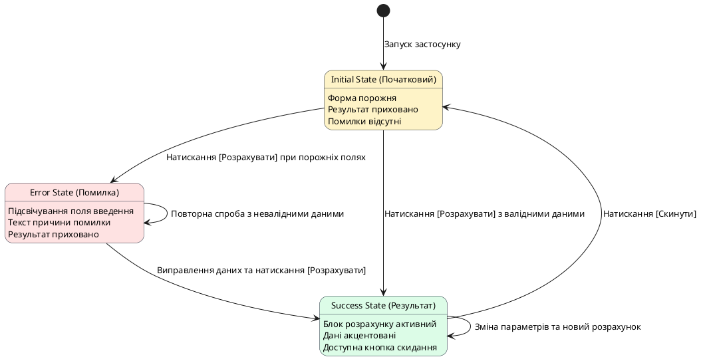

# Архітектура інтерфейсу та стани застосунку

::card-group

::card{title="🎯 Мета розділу" icon="i-lucide-target"}

- Опанувати концепцію станів користувацького інтерфейсу (*UI States*) у клієнтських веб-застосунках.
- Спроєктувати зв'язки між екранами та переходами без використання складних маршрутизаторів.
- Навчитися будувати кінцеві автомати станів (*State Machines*) для прогнозованої поведінки інтерфейсу.
- Скласти план декомпозиції розробки застосунку на послідовні перевірювані ітерації.

::

::card{title="🔑 Ключові терміни" icon="i-lucide-key"}

- **Стан інтерфейсу (*UI State*):** конфігурація екрана в певний момент часу, що визначає, які елементи відображаються, які приховані, а які заблоковані.
- **Початковий стан (*Initial / Empty State*):** вигляд застосунку до того, як користувач виконав будь-яку дію або ввів перші дані.
- **Стан результату (*Success State*):** вигляд інтерфейсу після успішного виконання обчислення чи операції з відображенням отриманих даних.
- **Стан помилки (*Error State*):** реакція системи на некоректні дії або недопустимі вхідні значення із поясненням причини.

::

::

---

## Концепція станів у веб-розробці

Початківці часто уявляють веб-сторінку як статичний малюнок, у якому текст просто замінюється новим текстом. Проте в сучасному програмуванні інтерфейс розглядається як **відображення поточного стану** програми (*UI as a Function of State*).

Якщо стан системи змінюється — наприклад, користувач натиснув кнопку розрахунку або ввів літери замість чисел — інтерфейс зобов'язаний негайно й коректно перебудуватися. У надійному продукті не може бути ситуацій, коли стара помилка продовжує висіти на екрані після введення правильних даних, або коли блок результату показує безглузді значення на кшталт `NaN` чи `undefined`.

Для нашого проєкту ми виділяємо три базові стани:
1. **Початковий стан (Initial):** поля введення містять плейсхолдери або значення за замовчуванням, блок результату прихований, кнопка дії активна.
2. **Стан успіху (Success):** блок результату стає видимим, дані підсвічуються, з'являється кнопка повторного розрахунку або очищення форми.
3. **Стан помилки (Error):** некоректні поля підсвічуються рамкою, виводиться зрозуміле текстове повідомлення, блок результату приховується.

---

## Діаграма переходів між станами

Найкращий спосіб захистити себе від логічних дірок в інтерфейсі — зафіксувати всі можливі стани та переходи між ними у вигляді діаграми станів (*State Diagram*).

{.diagram-img}

::plant-uml{alt="Діаграма станів клієнтського застосунку"}

::

Ця діаграма є бездоганною інструкцією як для інженера, так і для штучного інтелекту. Коли ви передаєте таку логіку в AI, він генерує чіткий і передбачуваний код обробників подій.

---

## Анатомія елементів управління та взаємодії

Клієнтський застосунок спирається на три базові групи елементів, з якими працює користувач:

1. **Елементи введення та селектори:**
   - Текстові або числові поля (`<input type="number">`): забезпечують первинне введення інформації.
   - Випадні списки (`<select>`): дозволяють обрати один із фіксованих варіантів без ризику помилитися в написанні.
   - Перемикачі та повзунки (`<input type="range">`, радіокнопки): дають змогу плавно змінювати числові коефіцієнти.

2. **Тригери дій:**
   - Головна кнопка дії (*Call to Action / CTA*): контрастна, чітко підписана дієсловом доконаного виду («Розрахувати витрати», «Отримати план»).
   - Допоміжні кнопки: кнопки очищення форми, копіювання результату або повернення на головний екран.

3. **Область виведення інформації:**
   - Картка результату: окремий візуальний блок із контрастним фоном або акцентною рамкою, де розміщується фінальне число, статус чи рекомендація.

---

## Декомпозиція плану створення продукту

Перед генерацією коду ми розбиваємо загальну задачу на чотири послідовні ітерації:

::steps

### Ітерація 1. Статичний каркас інтерфейсу (HTML + CSS)
Створення чистої розмітки екрана: контейнер, заголовок, опис, поля форми та застилізована заглушка для майбутнього блоку результату. Інтерфейс має мати привабливий та адаптивний вигляд ще до написання логіки.

### Ітерація 2. Зв'язування подій та базовий розрахунок (Happy Path)
Написання JavaScript-коду, що зчитує значення з форми при натисканні кнопки, виконує математичну формулу або логічне зіставлення та виводить результат у призначений блок.

### Ітерація 3. Обробка помилок та станів (Edge Cases)
Додавання перевірки на порожній ввід, некоректні або від'ємні значення. Реалізація появи та зникнення блоків попередження.

### Ітерація 4. Фінальний полішинг та взаємодія
Додавання кнопки очищення полів, плавних CSS-анімацій появи результату та перевірка читабельності на екрані смартфона.

::

---

## Практичні завдання та запитання для самоконтролю

::::accordion

:::accordion-item{label="📋 Практичне завдання: Проєктування таблиці станів" icon="i-lucide-clipboard-list"}

Для вашого обраного продукту складіть таблицю переходів станів:

| Подія користувача | Поточний стан | Умова переходу | Наступний стан | Що змінюється на екрані? |
|---|---|---|---|---|
| Клік на «Розрахувати» | Initial | Поле ваги порожнє | Error | З'являється червоний напис «Введіть вагу» |
| Клік на «Розрахувати» | Initial / Error | Усі поля заповнені | Success | Відкривається блок результату |
| Клік на «Скинути» | Success | Немає умов | Initial | Очищаються поля, приховується результат |

:::

:::accordion-item{label="❓ Чому інтерфейс не повинен відображати блок результату в початковому стані?" icon="i-lucide-help-circle"}

Якщо блок результату відображається одразу після відкриття сторінки, він міститиме або нулі, або статичні мокові дані, що заплутує користувача. Користувач не розуміє, чи застосунок уже щось порахував для нього, чи це просто приклад. Порожній початковий стан фокусує увагу виключно на заповненні полів введення.

:::

:::accordion-item{label="❓ Чому декомпозиція на 4 ітерації краща за спробу написати HTML, CSS і JS одночасно?" icon="i-lucide-help-circle"}

Поетапна розробка ізолює можливі помилки. Якщо ви спочатку затвердили якісну верстку (HTML + CSS), ви точно знаєте, що будь-який подальший збій викликаний суто логікою JavaScript, а не зламаними тегами чи зсунутими стилями. Це кардинально спрощує налагодження разом із AI.

:::

::::
