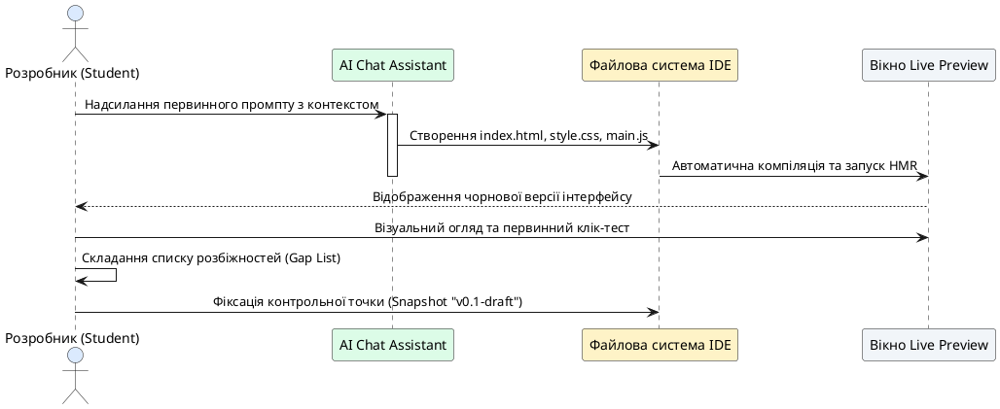

# Генерація та фіксація чорнової версії

::card-group

::card{title="🎯 Мета розділу" icon="i-lucide-target"}

- Навчитися створювати чистий робочий простір для нового проєкту в AI-середовищі.
- Сконструювати системний первинний промпт, що містить повний контекст, бізнес-правила та обмеження.
- Здійснити першу керовану генерацію чорнової версії (*Draft Version*).
- Провести зіставлення отриманого інтерфейсу з початковим архітектурним планом і зафіксувати перший знімок стану проєкту.

::

::card{title="🔑 Ключові терміни" icon="i-lucide-key"}

- **Чорнова версія (*Draft Version*):** базовий прототип застосунку, що містить каркас інтерфейсу та заготовки елементів введення, але ще може мати функціональні недоліки.
- **Первинний системний промпт (*Initial System Prompt*):** установчий запит до AI, який задає роль, контекст продукту, технологічні межі та правила поведінки асистента.
- **Невідповідність вимогам (*Discrepancy / Gap*):** розбіжність між запланованою в архітектурі логікою та фактичним результатом кодогенерації.
- **Знімок стану (*Snapshot*):** точка відновлення проєкту в хмарній IDE, що фіксує поточний вміст усіх файлів.

::

::

---

## Підготовка робочого простору проєкту

Початок роботи над новим цифровим продуктом вимагає створення ізольованого робочого простору. Незалежно від того, яку платформу ви використовуєте (Bolt.new, Replit або подібні), першим кроком є ініціалізація порожнього веб-проєкту без зайвих шаблонів.

Вкрай важливо перевірити, щоб у створеному проєкті були відсутні сторонні непотрібні файли: конфігурації бекенд-серверів, бази даних чи важкі сторонні залежності. Чистий старт гарантує, що AI зосередиться виключно на коді вашого продукту, а не витрачатиме токени контекстного вікна на аналіз стороннього коду.

::tip
Обирайте простий клієнтський стек: стандартний HTML5, модульний JavaScript (або чистий TypeScript) та Vanilla CSS. Це забезпечить миттєве завантаження в Live Preview та абсолютну автономність вашого застосунку.
::

---

## Конструювання первинного системного промпту

Перше повідомлення, яке ви надсилаєте у вікно діалогу з AI, є найважливішим у житті проєкту. Воно закладає фундамент, визначає правила та створює ментальну модель для мовної моделі. 

Професійний системний промпт повинен містити п'ять обов'язкових блоків:
1. **Роль і контекст:** ким виступає AI (досвідчений фронтенд-інженер) та яку задачу ми розв'язуємо.
2. **Опис продукту:** назва застосунку, користувач та ключова цінність.
3. **Функціональний обсяг першої версії:** точний перелік елементів введення, кнопки та блок результату.
4. **Технологічні обмеження (Non-Goals):** категорична заборона серверної частини, БД, авторизації та сторонніх API.
5. **Вимога до виконання:** прохання згенерувати спершу зрозумілу статичну верстку з базовою стилізацією без надмірної складності.

```markdown
Ти досвідчений frontend-розробник. Ми створюємо клієнтський веб-додаток: 
«Калькулятор часу фокусованого читання для студентів».

Функціональні вимоги першої версії:
1. Одне поле числового введення: кількість сторінок навчального матеріалу.
2. Випадний список зі складністю тексту: «Легкий (художній)», «Середній (стаття)», «Високий (підручник/монографія)».
3. Контрастна кнопка «Розрахувати час».
4. Блок відображення результату з акцентним числом хвилин та рекомендацією щодо перерв.
5. Блок помилки, якщо користувач залишив поле порожнім або ввів число менше 1.

Технічні обмеження:
- Суто клієнтська розробка (HTML, CSS, JavaScript).
- Жодного бекенду, бази даних чи авторизації.
- Акуратний сучасний дизайн на світлому фоні з хорошою читабельністю.

Згенеруй базову чорнову версію застосунку.
```

---

## Послідовність генерації та перевірки чорновика

Процес створення чорнової версії розгортається за чіткою послідовністю дій між розробником, асистентом та середовищем виконання:

{.diagram-img}

::plant-uml{alt="Послідовність створення чорнової версії"}



::

---

## Зіставлення результату з планом: фіксація розбіжностей

Після того як AI згенерував код і в Live Preview з'явився інтерфейс, категорично забороняється одразу приймати результат як готовий. Необхідно провести формальне зіставлення фактичного результату з вашим початковим планом.

Типові розбіжності, які виникають на етапі чорновика:
- **Зайві елементи:** AI додав додаткові кнопки, поля або посилання, про які ви не просили.
- **Відсутність валідації:** форма дозволяє натискати кнопку при порожніх полях і виводить `NaN хвилин`.
- **Проблеми зі шрифтами чи відступами:** текст на кнопках прилипає до меж або елементи зміщуються на вузьких екранах.
- **Стани інтерфейсу:** блок результату видно від самого початку з нулями замість того, щоб бути прихованим.

::warning
Зафіксуйте всі виявлені розбіжності у вигляді простого текстового списку в окремому блокноті чи файлі нотаток. Не намагайтеся виправити їх усі в одному наступному запиті. У Модулі 2 ми розберемо, як поетапно усувати ці дефекти через ітеративну стратегію завдань.
::

---

## Збереження контрольної точки (Snapshot)

Завершальним обов'язковим кроком першого модуля є створення знімка стану (*Snapshot* або *Commit*). 

Більшість хмарних середовищ мають спеціальну кнопку в інтерфейсі («Save Version», «Create Snapshot» або інтеграцію з Git). Дайте цьому знімку зрозумілу назву, наприклад: `v0.1-draft-created`. Тепер ви маєте безпечну точку відліку: хоч би які експерименти проводилися на наступних заняттях, ви завжди зможете повернутися до цього стабільного чорновика за один клік.

---

## Практичні завдання та запитання для самоконтролю

::::accordion

:::accordion-item{label="📋 Практичне завдання: Генерація чорновика вашого застосунку" icon="i-lucide-clipboard-list"}

1. Складіть первинний системний промпт для вашого продукту за зразком, наведеним у лекції.
2. Надішліть промпт в AI-середовище розробки та зачекайте завершення генерації файлів.
3. Відкрийте Live Preview і заповніть таблицю верифікації чорновика:
   - Чи присутні всі необхідні поля введення? (Так / Ні)
   - Чи спрацьовує кнопка при натисканні? (Так / Ні)
   - Що відображається в блоці результату?
   - Які 2-3 розбіжності з планом ви помітили?
4. Створіть перший Snapshot у середовищі з назвою `v0.1-draft`.

:::

:::accordion-item{label="❓ Чому не варто вимагати від AI ідеальної логіки розрахунків у першому промпті?" icon="i-lucide-help-circle"}

Первинний запит спрямований на створення міцного каркаса проєкту: розмітки, стилістики та базової структури файлів. Якщо ви одночасно зажадаєте складних математичних алгоритмів, адаптивної анімації та багаторівневої валідації, модель розсіє увагу між багатьма завданнями. Чорновик має підтвердити головне — концепт життєздатний, а інтерфейс зрозумілий.

:::

:::accordion-item{label="❓ Що робити, якщо AI згенерував код із помилкою компіляції одразу на старті?" icon="i-lucide-help-circle"}

Не панікуйте і не створюйте новий проєкт з нуля. Скопіюйте повідомлення про помилку з терміналу або консолі браузера, надішліть його асистенту з реплікою: «Під час запуску виникла наступна помилка: [текст помилки]. Виправ її, зберігши структуру index.html та style.css». У 95% випадків модель швидко виправляє друкарську помилку чи некоректний імпорт.

:::

::::
