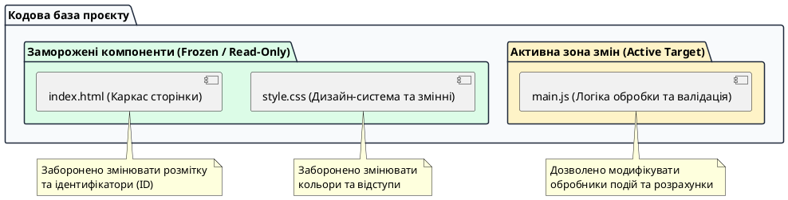

# Уточнення контексту проєкту для AI

::card-group

::card{title="🎯 Мета розділу" icon="i-lucide-target"}

- Навчитися аналізувати результати чорнової версії та виокремлювати невідповідності технічним вимогам.
- Опанувати патерн «заморожування компонентів» (*Code Freezing*) для захисту робочих модулів від небажаних правок AI.
- Сформувати оновлений структурований контекст проєкту для переходу до першої повноцінно робочої версії.
- Встановити чіткі критерії готовності (*Definition of Done*) для версії v1.0.

::

::card{title="🔑 Ключові терміни" icon="i-lucide-key"}

- **Контекст проєкту (*Project Context*):** сукупність відомостей про архітектуру, стан коду, бізнес-правила та обмеження, якими оперує мовна модель під час виконання завдань.
- **Фіксація коду (*Code Freezing*):** явна директива для AI або інженерне правило, що забороняє модифікувати певні перевірені файли чи функції.
- **Критерії готовності (*Definition of Done / DoD*):** вичерпний чек-лист вимог, виконання яких свідчить про повну працездатність та завершеність робочої версії.
- **Ізоляція завдань (*Task Scoping*):** обмеження зони відповідальності промпту суто одним компонентом або однією функцією.

::

::

---

## Перехід від чорновика до робочої системи

Чорнова версія, створена на попередньому етапі, виконала своє головне дидактичне завдання: вона довела життєздатність інтерфейсу та дала змогу побачити продукт на власні очі в режимі Live Preview. Проте між візуальним макетом і справжньою робочою системою існує принципова різниця. Чорновик може мати хаотичні стилі, частково непрацюючі кнопки або виводити нереалістичні дані.

Перехід до першої робочої версії вимагає від інженера зміни режиму взаємодії з мовною моделлю. Якщо на старті ми просили AI «створити щось схоже на калькулятор», то тепер ми вимагаємо суворої математичної та логічної точності. 

Щоб штучний інтелект не почав переписувати вже вдалі елементи дизайну чи заново винаходити структуру сторінки, необхідно оновити та уточнити контекст діалогу. Модель повинна точно знати, які рішення вже ухвалені остаточно, а що саме підлягає ретельному доопрацюванню.

---

## Стратегія фіксації готових рішень (Code Freezing)

Одна з найнеприємніших ситуацій у Vibe Coding — це коли ви просите AI додати обробку кнопки, а він разом із цим повністю змінює колірну гаму сторінки, видаляє шрифти або перейменовує класи у розмітці. Це трапляється через те, що великі мовні моделі за замовчуванням прагнуть оптимізувати весь переданий їм текст, якщо їм явно не вказано протилежне.

Для запобігання цьому використовується патерн **фіксації компонентів**:

{.diagram-img}

::plant-uml{alt="Патерн фіксації коду"}



::

Як показано на схемі, ми чітко розмежовуємо зони відповідальності: структура сторінки та базові стилі вважаються стабільними, а всі наступні завдання фокусуються виключно на логіці файлу `main.js`.

::warning
Завжди явно вказуйте в інструкціях для AI: «Не змінюй структуру index.html та не видаляй існуючі класи в style.css. Усі модифікації мають стосуватися виключно логіки обробки подій у файлі main.js».
::

---

## Формулювання оновленого контексту для моделі

Коли діалог з асистентом триває певний час, контекстне вікно накопичує застарілі варіанти коду та проміжні міркування. Щоб повернути системі високу продуктивність і точність, корисно надіслати коротке повідомлення-синхронізацію (*Context Refresh*).

Приклад структурованого оновлення контексту:

```markdown
Підсумок поточної версії та обмеження:
1. Статус проєкту: Чорнова версія створена та зафіксована у знімку v0.1-draft.
2. Незмінні компоненти: Розмітка index.html та базові змінні style.css зафіксовані (не змінювати без прямої вказівки).
3. Поточна мета: Перетворити чорновик на першу повністю робочу версію (v1.0-working).
4. Зона фокусу: Написання коректної логіки обробки дій користувача у main.js.
5. Правило розробки: Робимо одну функцію за один крок, перед кодом надавай короткий план дій.
```

Такий лаконічний бриф нагадує моделі правила гри та примушує її діяти в межах заданого інженерного коридору.

---

## Критерії готовності першої робочої версії (Definition of Done)

Щоб вважати першу робочу версію офіційно завершеною, проєкт повинен відповідати наступному контрольному списку:

::steps

### Критерій 1. Повна працездатність головного сценарію
Користувач може ввести коректні параметри, натиснути кнопку дії та без затримок отримати математично або логічно правильний результат.

### Критерій 2. Відсутність візуальних артефактів
Блок результату ніколи не показує значення `NaN`, `null`, `undefined` або порожні текстові блоки.

### Критерій 3. Контроль некоректного введення
Якщо користувач натискає кнопку без заповнення форми або вводить неприпустимі значення (наприклад, від'ємні числа), інтерфейс коректно виводить зрозуміле людині повідомлення про помилку.

### Критерій 4. Чистота консолі розробника
У вікні консолі браузера відсутні будь-які помилки виконання скрипта (*Uncaught TypeError*, помилки синтаксису тощо).

::

---

## Практичні завдання та запитання для самоконтролю

::::accordion

:::accordion-item{label="📋 Практичне завдання: Складання правил контексту для вашого проєкту" icon="i-lucide-clipboard-list"}

1. Відкрийте ваш проєкт і визначте 2 елементи, які вже виглядають добре і які ви категорично забороняєте штучному інтелекту змінювати.
2. Сформулюйте повідомлення для AI з оновленням контексту за шаблоном із цього розділу.
3. Надішліть це повідомлення в чат вашого середовища розробки і переконайтеся, що асистент підтвердив прийняття правил.

:::

:::accordion-item{label="❓ Чому AI-моделі схильні змінювати код, про який їх не просили?" icon="i-lucide-help-circle"}

Моделі працюють на основі статистичної ймовірності прогнозування наступного токена. Отримуючи файл цілком, асистент аналізує його з точки зору власних «уявлень» про найкращі практики й автоматично намагається «покращити» іменування класів, відступи або структуру тегів. Якщо не встановити явну заборону на зміну конкретних файлів, модель сприймає весь код як поле для вільної оптимізації.

:::

:::accordion-item{label="❓ Що робити, якщо попри пряму заборону AI все одно переписав index.html?" icon="i-lucide-help-circle"}

Негайно зупиніть генерацію або скасуйте запропоновані зміни через перегляд відмінностей (*diff / reject change*). Якщо зміни вже застосувалися, відновіть попередній знімок (*Snapshot*) або виконайте відкат файлу `index.html` через історію змін і повторіть запит із жорсткішим формулюванням: «Ти порушив обмеження і змінив index.html. Скасуй ці правки і реалізуй задачу виключно всередині функції обробника у main.js».

:::

::::
