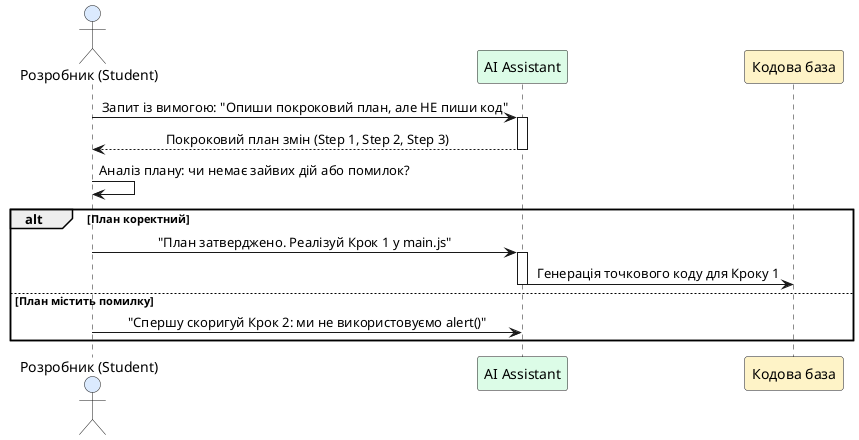

# Стратегія завдань для AI-розробки

::card-group

::card{title="🎯 Мета розділу" icon="i-lucide-target"}

- Опанувати патерн «Спочатку план — потім код» (*Plan-First Prompting*) для мінімізації галюцинацій та помилок AI.
- Засвоїти фундаментальне правило «одна функція — одна ітерація» у щоденній інженерній практиці.
- Навчитися формулювати чіткі негативні обмеження та заборони у тілі запиту.
- Опанувати алгоритм швидкого коригування відповідей асистента у разі неповного або неточного результату.

::

::card{title="🔑 Ключові терміни" icon="i-lucide-key"}

- **План перед кодом (*Plan-Before-Code*):** техніка взаємодії з мовною моделлю, за якої асистент зобов'язаний спершу сформулювати та погодити алгоритм дій природною мовою до генерації коду.
- **Атомарна ітерація (*Atomic Iteration*):** мінімальна неподільна зміна кодової бази, яка додає рівно одну функцію та може бути протестована ізольовано.
- **Коригуючий промпт (*Follow-up / Correction Prompt*):** точковий запит, що вказує на конкретну розбіжність або дефект у щойно згенерованому коді без переписування всього завдання заново.
- **Негативне обмеження (*Negative Constraint*):** явна вказівка на те, які дії моделі суворо заборонені (наприклад, заборона видаляти існуючі класи чи функції).

::

::

---

## Проблема поспішної генерації коду

Коли розробник ставить перед мовною моделлю комплексне завдання, модель намагається відповісти миттєво, прогнозуючи перші рядки коду без побудови цілісної картини змін. Такий підхід подібний до поведінки будівельника, який починає заливати бетон до того, як архітектор намалював креслення фундаменту. 

У результаті асистент може написати чудовий обробник подій, але випадково використати не ті ідентифікатори елементів, які вже прописані у вашому HTML, або припуститися логічної суперечності у розрахунках. Щоб запобігти цьому, в професійній інженерії застосовується техніка **декомпозиції через попереднє планування**.

{.diagram-img}

::plant-uml{alt="Послідовність роботи за патерном Plan-Before-Code"}



::

Як демонструє діаграма, розробник отримує повний контроль над намірами моделі ще до того, як хоча б один рядок потрапить у проєкт. Це економить колосальну кількість часу, запобігаючи руйнівним змінам у коді.

---

## Правило атомарної ітерації: одна функція за раз

Найчастіша причина втрати працездатності застосунку у новачків — спроба вирішити кілька завдань в одному повідомленні. 

Наприклад, запит: *«Зроби валідацію форми, додай анімацію появи блоку, зміни шрифт заголовка і додай розрахунок відсотків»* гарантовано призведе до помилок. Якщо після такого промпту застосунок перестане працювати, ви не зможете швидко зрозуміти, що саме зламалося: анімація зіпсувала стилі чи валідація заблокувала виклик математичної функції.

::tip
**Золоте правило Vibe Coding:** одна ітерація — це рівно одна перевірювана дія користувача.
- Ітерація 1: Зчитування чисел та виведення результату в консоль.
- Ітерація 2: Відображення результату в блоці інтерфейсу.
- Ітерація 3: Перевірка на порожні поля введення.
- Ітерація 4: Очищення форми кнопкою «Скинути».
::

---

## Анатомія ефективного інженерного промпту

Щоб завдання було виконане бездоганно з першої спроби, його формулювання має містити чотири структурні елементи:

1. **Цільова дія:** що саме потрібно зробити (дієслово в наказовій формі).
2. **Точна локалізація:** у якому саме файлі та якій функції відбуваються зміни.
3. **Очікувана поведінка:** як саме система має реагувати на дії користувача.
4. **Заборонені дії (негативні обмеження):** що категорично заборонено змінювати або видаляти.

```markdown
Завдання на ітерацію:
Реалізуй логіку розрахунку часу читання у файлі main.js.

Вимоги:
1. Отримай значення з поля введення #page-count та селектора #text-complexity.
2. При натисканні на кнопку #calc-btn обчисли загальний час за формулою:
   - Легкий текст: 2 хвилини на сторінку.
   - Середній текст: 3 хвилини на сторінку.
   - Складний текст: 5 хвилин на сторінку.
3. Виведи підсумкове число хвилин усередині елемента #result-value.
4. Зроби блок #result-container видимим (видали клас .hidden).

Обмеження:
- НЕ змінюй розмітку index.html.
- НЕ використовуй сторонні бібліотеки.
- Не чіпай стилі в style.css.
```

---

## Стратегія коригування при неповному результаті

Іноді модель реалізує лише частину вимог: наприклад, розрахунок працює, але блок результату залишається невидимим. У такій ситуації не слід надсилати весь великий початковий промпт знову — це може збити модель і змусити її переписати вже робочий фрагмент.

Замість цього застосовується **коригуючий промпт**:
1. Подякуйте за виконану частину або підтвердіть її працездатність: *«Розрахунок працює коректно, значення обчислюється правильно»*.
2. Вкажіть на конкретний відсутній елемент: *«Проте блок результату (#result-container) не з'являється на екрані, оскільки з нього не знімається клас .hidden»*.
3. Поставте точкову вимогу: *«Додай один рядок для зняття класу .hidden з контейнера при успішному розрахунку. Решту коду не змінюй»*.

---

## Практичні завдання та запитання для самоконтролю

::::accordion

:::accordion-item{label="📋 Практичне завдання: Промпт за технікою Plan-Before-Code" icon="i-lucide-clipboard-list"}

1. Сформулюйте запит для вашого AI-асистента на реалізацію головної математичної або логічної функції вашого застосунку.
2. Обов'язково додайте в кінці вимогу: *«Перед тим як писати код, опиши свій план із трьох кроків і перелічи ідентифікатори елементів, до яких ти звертатимешся»*.
3. Оцініть відповідь моделі: чи співпадають названі нею ID елементів із тими, що реально записані у вашому `index.html`?

:::

:::accordion-item{label="❓ Чому коригуючий промпт має бути коротким і точковим?" icon="i-lucide-help-circle"}

Якщо ви щоразу повторюєте велике завдання цілком, мовна модель переоцінює контекст заново і може згенерувати код із новою випадковою варіацією структури змінних чи алгоритму. Короткий точковий запит змушує асистента сфокусувати увагу на одному конкретному рядку коду, мінімізуючи ризик порушення решти робочої логіки.

:::

:::accordion-item{label="❓ Що робити, якщо AI ігнорує негативні обмеження і все одно видаляє коментарі чи класи?" icon="i-lucide-help-circle"}

Це трапляється при перевантаженні контексту. Найефективніший прийом — винести негативне обмеження на самий початок запиту або виділити його великими літерами чи окремим блоком «ВАЖЛИВО». Також допомагає формулювання: «Збережи всі наявні ідентифікатори та класи без змін. Реалізуй лише внутрішнє тіло функції event listener».

:::

::::
