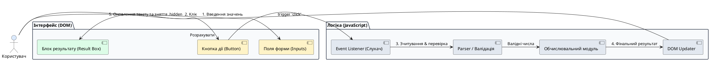

# Доопрацювання до першої робочої версії

::card-group

::card{title="🎯 Мета розділу" icon="i-lucide-target"}

- Перетворити статичний або напівробочий чорновик на повністю функціональний інтерактивний продукт.
- Реалізувати зчитування, типізацію та валідацію вхідних даних від користувача.
- Запрограмувати обробники дій (*Event Listeners*) та клієнтські обчислювальні алгоритми.
- Забезпечити безпомилкове динамічне оновлення елементів DOM (*Document Object Model*) та керування станами видимості.

::

::card{title="🔑 Ключові терміни" icon="i-lucide-key"}

- **Слухач подій (*Event Listener*):** механізм у JavaScript, що очікує настання певної дії (клік, введення тексту, вибір опції) та запускає функцію-обробник.
- **Маніпуляція DOM (*DOM Manipulation*):** програмна зміна структури, стилів або вмісту HTML-сторінки у відповідь на дії користувача.
- **Приведення типів (*Type Casting / Parsing*):** перетворення текстового рядка, отриманого з поля форми (`input.value`), на числове значення (`Number()` або `parseFloat()`).
- **Перемикання станів (*State Toggling*):** зміна візуального стану інтерфейсу через додавання або зняття допоміжних CSS-класів (наприклад, `.hidden` чи `.active`).

::

::

---

## Архітектура потоку даних у клієнтському застосунку

Коли користувач взаємодіє з інтерактивною сторінкою, інформація проходить чіткий шлях: від фізичного натискання клавіші чи кліку миші до перемалювання пікселів на екрані. Розуміння цього конвеєра дозволяє точно визначати, на якому саме етапі виник дефект.

{.diagram-img}

::plant-uml{alt="Потік даних клієнтського застосунку"}



::

Кожен вузол цієї схеми виконує строго ізольовану функцію. Якщо розрахунок неправильний — проблема в модулі обчислень. Якщо результат пораховано, але його не видно — проблема в модулі оновлення DOM.

---

## Зчитування та перетворення вхідних даних

Найпоширеніша помилка початківців під час взаємодії з AI — ігнорування природи даних із веб-форм. Усі значення, отримані через властивість `input.value`, за замовчуванням є **рядками** (*strings*), навіть якщо поле має атрибут `type="number"`.

Якщо AI згенерує код без явного перетворення типів, операція додавання перетвориться на конкатенацію рядків: `"10" + "5"` дасть `"105"`, а не `15`. 

::warning
Завжди вимагайте від AI використання явного математичного перетворення типів: `const count = Number(inputElement.value);` або `parseFloat()`. Також обов'язково перевіряйте результат на `isNaN(count)`, щоб відсікти порожні чи некоректні значення.
::

Приклад якісного коду обробки вхідних даних:

```javascript
const pageInput = document.querySelector('#page-count');
const complexitySelect = document.querySelector('#text-complexity');
const calculateBtn = document.querySelector('#calc-btn');
const resultContainer = document.querySelector('#result-container');
const resultValue = document.querySelector('#result-value');

calculateBtn.addEventListener('click', () => {
  // 1. Отримання та конвертація даних
  const pages = Number(pageInput.value);
  const multiplier = Number(complexitySelect.value);

  // 2. Базова перевірка коректності
  if (!pages || pages <= 0) {
    showError("Будь ласка, вкажіть коректну кількість сторінок (більше 0).");
    return;
  }

  // 3. Обчислення значення
  const totalMinutes = pages * multiplier;

  // 4. Оновлення інтерфейсу
  resultValue.textContent = `${totalMinutes} хв`;
  resultContainer.classList.remove('hidden');
});
```

---

## Керування переходами та станами без фреймворків

Оскільки наш проєкт не використовує важких бібліотек на кшталт React або Vue, найкращим і найнадійнішим способом перемикання станів є керування спеціальними CSS-класами видимості.

Найпростіший та найбільш стійкий патерн — використання класу `.hidden`:

```css
/* style.css */
.hidden {
  display: none !important;
}

.result-card {
  transition: opacity 0.3s ease;
  background-color: #f0fdf4;
  border: 1px solid #bbf7d0;
  border-radius: 8px;
  padding: 1.5rem;
}
```

Коли застосунок перебуває в початковому стані, елемент має клас `class="result-card hidden"`. Після успішного розрахунку функція виконує `element.classList.remove('hidden')`, і блок плавно з'являється перед очима користувача. Якщо ж виникає помилка, цей блок знову приховується, а натомість відображається блок попередження.

---

## Збереження першої робочої версії

Щойно ви перевірили, що основний користувацький сценарій успішно виконується від початку до кінця — вітаємо! Ви досягли критичної інженерної віхи. Ваш застосунок більше не є чорновиком або статичним макетом: це повноцінно працюючий цифровий продукт.

Негайно зафіксуйте цей стан у системі контролю версій або створіть збереження в AI IDE з тегом `v1.0-working`. Цей реліз є вашою гарантією успішного захисту курсу: навіть якщо всі подальші експерименти з додатковими функціями підуть не за планом, ви вже маєте готовий, працюючий прототип.

---

## Практичні завдання та запитання для самоконтролю

::::accordion

:::accordion-item{label="📋 Практичне завдання: Реалізація обробника дій" icon="i-lucide-clipboard-list"}

1. Перевірте файл `main.js` вашого проєкту: чи використовується там `addEventListener` для головної кнопки дії?
2. Переконайтеся, що всі значення полів форми явно перетворюються на числа за допомогою `Number()`.
3. Зробіть тестовий розрахунок у Live Preview і перевірте, чи оновлюється текст у блоці результату відповідно до заданої математичної формули.
4. Збережіть знімок стану проєкту з назвою `v1.0-working`.

:::

:::accordion-item{label="❓ Чому небезпечно використовувати inline-обробники в HTML (наприклад, onclick=\"calculate()\")?" icon="i-lucide-help-circle"}

Використання атрибутів `onclick` безпосередньо в HTML-тегах порушує фундаментальний принцип розділення відповідальностей (*Separation of Concerns*). Це змішує структуру представлення з виконуваним кодом, створює ризики для безпеки (*Content Security Policy*) та суттєво ускладнює читання коду як для людини, так і для штучного інтелекту. Сучасний стандарт вимагає роздільного оголошення розмітки в HTML та прив'язки слухачів подій у файлі JavaScript.

:::

:::accordion-item{label="❓ Чому після натискання кнопки сторінка іноді раптово перезавантажується і скидає результат?" icon="i-lucide-help-circle"}

Це класична поведінка браузера, якщо кнопка знаходиться всередині тегу `<form>`. За замовчуванням браузер намагається відправити форму на сервер і перезавантажує сторінку. Щоб запобігти цьому, необхідно або вказати атрибут кнопки `type="button"` (замість стандартного `submit`), або першим рядком в обробнику події викликати метод `event.preventDefault()`.

:::

::::
