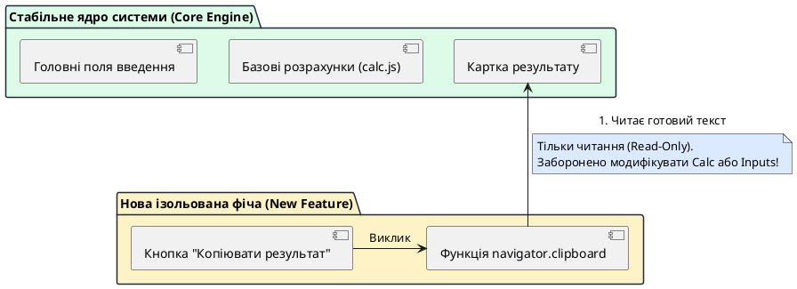

# Управління точковими змінами продукту

::card-group

::card{title="🎯 Мета розділу" icon="i-lucide-target"}

- Опанувати принципи безпечного внесення змін у стабільну кодову базу (*Change Management*).
- Навчитися локалізувати область модифікації та мінімізувати зону впливу нових функцій.
- Засвоїти алгоритм тестування побічних ефектів (*Side Effects*) на раніше створених функціях.
- Сформувати дисципліну створення регулярних контрольних точок після кожного успішного покращення.

::

::card{title="🔑 Ключові терміни" icon="i-lucide-key"}

- **Побічний ефект (*Side Effect*):** ненавмисна зміна в поведінці однієї частини системи внаслідок модифікації іншої, здавалося б, непов'язаної частини.
- **Зона впливу (*Blast Radius*):** сукупність компонентів, модулів або стилів, які можуть бути потенційно зачеплені або виведені з ладу запланованою зміною.
- **Ізоляція коду (*Code Isolation*):** архітектурне відокремлення нової функції, що унеможливлює її пряме втручання в критичні базові алгоритми.
- **Регресійний тест (*Regression Check*):** швидка повторна перевірка основного робочого сценарію для підтвердження того, що нова правка нічого не зламала.

::

::

---

## Чому зміни в робочому коді є небезпечними?

Коли перед розробником постає завдання покращити вже працюючий продукт — наприклад, додати кнопку копіювання результату, перемикач темної теми або розширену підказку — виникає хибне відчуття простоти: «Основне вже працює, зараз ми швиденько накинемо ще пару фіч».

Проте в реальній практиці внесення змін у працюючий код є найбільш ризикованою операцією. Коли ви просите AI додати нову кнопку, він може випадково змінити глобальні стилі CSS, що призведе до зсуву всієї розмітки на сторінці, або змінити імена спільних змінних у JavaScript. 

Управління змінами (*Change Management*) — це інженерна дисципліна, яка гарантує, що кожне покращення впроваджується з хірургічною точністю і не руйнує досягнутої стабільності.

---

## Контроль зони впливу (Blast Radius Control)

Перед тим як сформулювати нове завдання для асистента, інженер повинен оцінити так звану **зону впливу** запланованої зміни. Що вужчою є ця зона, то безпечнішим є оновлення.

{.diagram-img}

::plant-uml{alt="Ізоляція зони впливу змін"}

::

Як видно з діаграми, нова функція копіювання має статус **«тільки для читання»** стосовно ядра системи: вона може прочитати вже обчислений текст із блоку результату, але їй категорично заборонено змінювати алгоритм розрахунку чи втручатися в стан полів введення.

---

## Алгоритм впровадження одного суттєвого покращення

Процес додавання нового функціоналу має суворо відповідати наступній чотирикроковій процедурі:

::steps

### 1. Вибір однієї цільової модифікації
Оберіть одне конкретне покращення з вашого беклогу. Наприклад: «Додати кнопку копіювання отриманого розрахунку в буфер обміну з візуальним підтвердженням "Скопійовано!"».

### 2. Формулювання обмежень для AI
Явно опишіть, куди саме додається новий код і які частини проєкту чіпати суворо заборонено: «Додай обробник для нової кнопки #copy-btn. Не модифікуй логіку розрахунку та не змінюй поведінку кнопки розрахунку».

### 3. Перевірка нової функції
Протестуйте нову можливість: натисніть кнопку копіювання, відкрийте будь-який текстовий редактор або поле пошуку, натисніть `Ctrl+V` (або `Cmd+V`) і переконайтеся, що текст скопійовано коректно.

### 4. Обов'язкова перевірка регресії (Regression Check)
Це критичний крок, про який часто забувають: повторно запустіть головний сценарій. Змініть вхідні числа в полях форми, знову натисніть кнопку розрахунку і переконайтеся, що основний калькулятор працює так само бездоганно, як і до впровадження кнопки копіювання.

::

---

## Збереження нової робочої ітерації

Якщо обидва тести (тест нової фічі та регресійний тест ядра) пройшли успішно, зафіксуйте новий стан кодової бази. Створіть збереження з чітким коментарем про те, що саме було додано, наприклад: `v1.1-feature-copy-button`.

::tip
Ніколи не накопичуйте дві нові функції в одному незафіксованому стані. Додали одну фічу → перевірили регресію → зберегли знімок. Тільки такий ритм гарантує повну психологічну впевненість і контроль над проєктом.
::

---

## Практичні завдання та запитання для самоконтролю

::::accordion

:::accordion-item{label="📋 Практичне завдання: Впровадження допоміжної функції" icon="i-lucide-clipboard-list"}

1. Оберіть одне невелике покращення для вашого застосунку:
   - Кнопка копіювання результату в буфер обміну;
   - Або кнопка «Очистити все» для повернення застосунку в початковий стан;
   - Або виведення поточної дати та часу розрахунку.
2. Сформулюйте запит для AI з явною вказівкою зони ізоляції.
3. Перевірте роботу нової функції та здійсніть обов'язковий регресійний тест головного сценарію.
4. Створіть збереження стану версії з відповідною назвою (наприклад, `v1.1-feature-reset`).

:::

:::accordion-item{label="❓ Чому регресійний тест є обов'язковим навіть при найпростіших змінах стилів CSS?" icon="i-lucide-help-circle"}

Каскадні таблиці стилів (CSS) за своєю природою володіють глобальною областю видимості. Зміна одного правила для селектора тегу (наприклад, зміна `padding` або `display` для `button`) автоматично застосується до **всіх** кнопок на сторінці. У результаті додавання гарного стилю для другорядної кнопки може спотворити вигляд або приховати головну кнопку розрахунку.

:::

:::accordion-item{label="❓ Що робити, якщо нова функція працює, але зламала основний розрахунок?" icon="i-lucide-help-circle"}

Не намагайтеся «нашаровувати» нові промпти поверх зламаного коду. Найшвидший і найбезпечніший шлях: відкотіться до стабільного знімка `v1.0-verified`. Потім проаналізуйте, чому виник конфлікт (наприклад, було перевикористано однакову назву змінної), і поставте задачу штучному інтелекту з вимогою використовувати ізольовану функцію або унікальні ідентифікатори.

:::

::::
