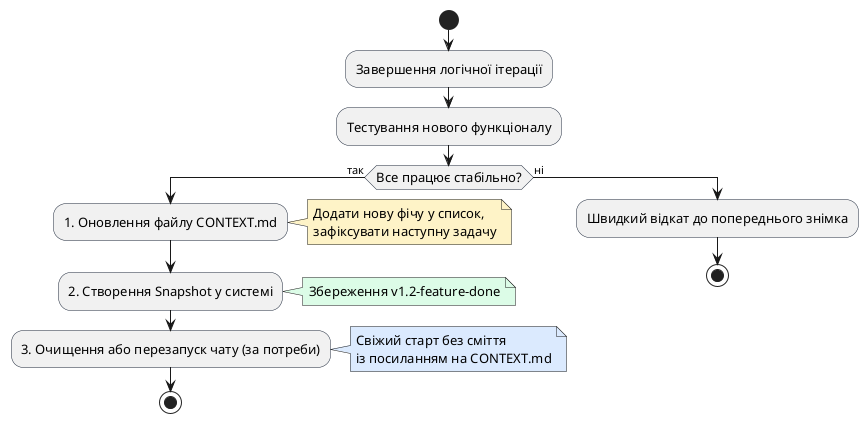

# Керування контекстом і збереження версій

::card-group

::card{title="🎯 Мета розділу" icon="i-lucide-target"}

- Опанувати принципи ведення лаконічної технічної документації проєкту безпосередньо у робочому просторі.
- Навчитися підтримувати чистоту контекстного вікна (*Context Window Hygiene*) великої мовної моделі.
- Засвоїти структуру фіксації ухвалених рішень (*Architecture Decision Records / ADR*) та переліку відомих проблем.
- Навчитись перезапускати або оновлювати діалог із AI без втрати накопиченого прогресу кодової бази.

::

::card{title="🔑 Ключові терміни" icon="i-lucide-key"}

- **Контекстне вікно (*Context Window*):** максимальний обсяг інформації (вимірюваний у токенах), який мовна модель здатна утримувати в оперативній пам'яті під час генерації відповіді.
- **Деградація контексту (*Context Degradation*):** погіршення якості та точності відповідей AI через накопичення застарілих версій коду, помилок і довгих діалогів.
- **Журнал версій (*Changelog / Version History*):** хронологічний список змін, реалізованих функцій та усунених дефектів між релізами.
- **Файл стану проєкту (*Project State File / CONTEXT.md*):** спеціальний короткий документ у корені репозиторію, що містить актуальну зведену інформацію про систему.

::

::

---

## Проблема «засмічення» контекстного вікна

Під час тривалої розробки веб-застосунку в AI-середовищі розробник неминуче надсилає десятки повідомлень: тести, запитання, спроби реалізації, помилки компіляції та їх виправлення. У результаті діалог перетворюється на довжелезну стрічку.

Сучасні мовні моделі мають фундаментальне обмеження: що довшим стає діалог, то вищою стає ймовірність **деградації уваги** моделі. Модель починає плутатися між старими назвами функцій і новими, забуває встановлені на початку обмеження (наприклад, знову намагається згенерувати серверний код або підключити базу даних) і починає повторювати раніше виправлені помилки.

::warning
Якщо ви відчуваєте, що AI став «неуважним», ігнорує прямі вказівки або раптом повертає старий код, який ви видалили годину тому — це чіткий сигнал: контекстне вікно перевантажене. Спроба сперечатися з моделлю в тому самому діалозі лише погіршить ситуацію.
::

---

## Файл CONTEXT.md як зовнішня пам'ять проєкту

Найефективніший інженерний спосіб підтримувати стабільність AI-розробки — винести ключові знання про проєкт із тимчасової пам'яті чату у постійний текстовий файл у корені проєкту, наприклад `CONTEXT.md` (або `README.md`).

Цей файл виконує роль «паспорта проєкту» і містить чотири обов'язкові блоки:

::code-tree

```markdown [CONTEXT.md]
# Паспорт проєкту: FocusReader

## 1. Поточний статус та версія
- Поточна стабільна версія: v1.1-validated
- Стек: Чистий HTML5, CSS3, Vanilla JS (без фреймворків)

## 2. Реалізовані функції
- Форма введення кількості сторінок із числовим парсингом.
- Випадний список складності тексту з коефіцієнтами (2, 3, 5 хв).
- Розрахунок часу читання та відображення картки результату.
- Валідація: підсвічування помилки при порожньому або від'ємному вводі.

## 3. Зафіксовані архітектурні рішення та обмеження
- Категорично заборонено додавати бекенд, базу даних або авторизацію.
- Стилі знаходяться виключно в style.css, розмітка — в index.html.
- Для приховування блоків використовується єдиний клас .hidden.

## 4. Відомі проблеми та наступні завдання (Next Tasks)
- Завдання на наступну ітерацію: додати кнопку копіювання результату в буфер обміну.
- Відома дрібна проблема: на екранах шириною менше 350px кнопка дещо зсувається вниз.
```

::

Коли такий файл присутній у проєкті, ви можете будь-якої миті очистити історію чату або почати новий діалог з AI, просто написавши: *«Прочитай файл CONTEXT.md і підтвердь розуміння поточного стану проєкту»*.

---

## Життєвий цикл керування версіями

Поєднання файлу контексту зі знімками стану (*Snapshots*) утворює надійну систему версіонування:

{.diagram-img}

::plant-uml{alt="Цикл керування контекстом і версіями"}



::

---

## Практичні завдання та запитання для самоконтролю

::::accordion

:::accordion-item{label="📋 Практичне завдання: Створення паспорта проєкту" icon="i-lucide-clipboard-list"}

1. Створіть у корені вашого проєкту новий файл `CONTEXT.md`.
2. Заповніть його чотирма секціями (поточний статус, реалізовані функції, обмеження, наступні завдання) відповідно до реального стану вашого застосунку.
3. Відкрийте новий сеанс діалогу з AI, попросіть його прочитати цей файл і назвати наступне завдання, яке потрібно виконати.
4. Переконайтеся, що асистент миттєво відновив повний контекст розробки без читання попередньої історії чату.

:::

:::accordion-item{label="❓ Чому перезапуск діалогу з AI покращує якість кодогенерації?" icon="i-lucide-help-circle"}

При перезапуску чату контекстне вікно звільняється від тисяч токенів застарілих помилок, невдалих спроб і довгих дискусій. Отримуючи свіжий старт із коротким концентрованим файлом `CONTEXT.md` та актуальним кодом, модель витрачає 100% своєї обчислювальної уваги суто на поставлену задачу, не відволікаючись на історичне сміття.

:::

:::accordion-item{label="❓ Які відомості про баги слід заносити до CONTEXT.md?" icon="i-lucide-help-circle"}

У файл вносяться лише некритичні відомі проблеми, які не заважають роботі головного сценарію, але які ви плануєте вирішити пізніше (наприклад, косметичні відступи або рідкісні крайові випадки). Критичні помилки, які блокують роботу застосунку, мають виправлятися негайно і не повинні залишатися у зафіксованій версії.

:::

::::
