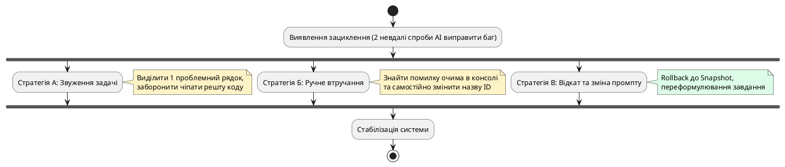
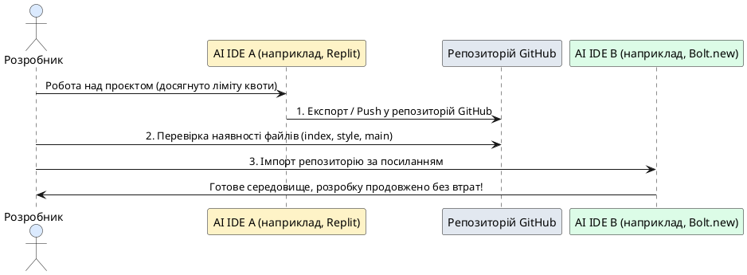

# Збої AI-розробки, ліміти та аварійне відновлення

::card-group

::card{title="🎯 Мета розділу" icon="i-lucide-target"}

- Навчитися своєчасно розпізнавати критичні збої у процесі AI-розробки: регресії та зациклення моделі.
- Опанувати алгоритм безпечного відкату кодової бази до останньої стабільної точки відновлення.
- Засвоїти техніку «ручного втручання» (*Manual Intervention*) для розриву нескінченних циклів помилок.
- Підготувати стратегію безперервності розробки в умовах вичерпання безкоштовних лімітів або квот AI-інструментів через експорт у GitHub.

::

::card{title="🔑 Ключові терміни" icon="i-lucide-key"}

- **Регресія (*Regression*):** дефект, за якого раніше перевірена та стабільна функція несподівано ламається після внесення нових змін до коду.
- **Зациклення моделі (*Error Loop / Hallucination Loop*):** стан, коли AI на кожну наступну вимогу виправити баг генерує новий варіант коду з тією самою або ще глибшою помилкою.
- **Відкат версії (*Rollback*):** повернення вмісту файлів проєкту до стану раніше збереженого знімка (*Snapshot*) або коміту.
- **Квота використання (*Rate Limit / Quota*):** обмеження на кількість безкоштовних повідомлень або обчислювальних ресурсів, встановлене AI-платформою.

::

::

---

## Діагностика регресії: коли зникає те, що працювало

Найбільш підступний тип помилок у швидкій розробці — це **регресія**. Ви попросили AI змінити радіус заокруглення кнопок, а після оновлення помічаєте, що клік по кнопці взагалі перестав викликати функцію розрахунку.

Причини регресій типові:
1. AI повністю переписав функцію замість точкового оновлення одного параметра.
2. Модель випадково перейменувала ID елемента у розмірці або слухачі подій.
3. Було видалено виклик функції ініціалізації або затерто глобальний обробник.

::warning
Перше правило при виявленні регресії: **НЕ просіть AI «полагодити назад» у наступному повідомленні**. Якщо система вже знаходиться в нестабільному стані, спроба виправлення поверх пошкодженого коду зазвичай множить хаос. Єдине правильне рішення — миттєвий **відкат (Rollback)**.
::

---

## Проблема зациклення AI на помилці (Error Looping)

Часто виникає ситуація, коли консоль видає специфічну помилку (наприклад, `TypeError: Cannot read properties of null`). Розробник відправляє текст помилки асистенту, той вибачається, переписує код... і консоль видає ту саму помилку. Розробник знову надсилає повідомлення — і знову отримує непрацююче рішення.

Це явище називається **зацикленням моделі**. Коли модель двічі поспіль не впоралася з дефектом, вона «застрягає» у локальному оптимумі свого контексту.

{.diagram-img}

::plant-uml{alt="Вихід із зациклення помилок AI"}

::

### Три правила розриву циклу:
1. **Звузьте фокус:** вкажіть конкретний рядок: *«Помилка виникає у рядку 14, тому що елемент #user-name не знайдено в DOM. Додай перевірку if (!element) return;»*.
2. **Перевірте очевидне самостійно:** у 80% випадків зациклення причина банальна — в HTML написано `id="pageCount"`, а в JS асистент шукає `#page-count`. Одне ручне виправлення назви рятує від годин безплідної генерації.
3. **Почніть із чистого аркуша:** зробіть Rollback до попередньої версії та сформулюйте промпт принципово іншими словами.

---

## Безперервність розробки: подолання лімітів і квот

Усі сучасні платформи швидкої розробки (Bolt.new, Replit, v0) мають обмеження безкоштовного тарифу: денні ліміти запитів, вичерпання токенів або блокування до наступного місяця. Професійний інженер завжди повинен мати план дій на випадок, якщо платформа раптово покаже повідомлення: *«You have reached your daily limit»*.

Рятівним мостом для забезпечення безперервності розробки є **GitHub**.

::plant-uml{alt="Міграція проєкту між AI-платформами"}

::

### Алгоритм безпечного перенесення проєкту:
1. **Регулярний експорт:** підключіть ваш проєкт до GitHub або регулярно завантажуйте ZIP-архів із робочою версією файлів.
2. **Автономність коду:** оскільки наш проєкт не використовує специфічних закритих бібліотек платформи, а побудований на стандартному клієнтському стеку (HTML/CSS/JS), він гарантовано запуститься у будь-якому іншому середовищі.
3. **Миттєвий імпорт:** якщо ліміти вичерпано на Replit — ви просто імпортуєте репозиторій у Bolt.new або відкриваєте його локально у VS Code / Cursor і продовжуєте роботу без жодної втрати прогресу.

---

## Практичні завдання та запитання для самоконтролю

::::accordion

:::accordion-item{label="📋 Практичне завдання: Налаштування плану аварійного відновлення" icon="i-lucide-clipboard-list"}

1. Знайдіть в інтерфейсі вашого робочого середовища кнопку експорту коду (завантаження у вигляді ZIP-архіву або синхронізація з GitHub).
2. Створіть резервну копію вашого проєкту на локальному комп'ютері або у вашому обліковому записі GitHub.
3. Відкрийте файл `index.html` локально у звичайному браузері подвійним кліком миші: переконайтеся, що навіть без AI-платформи ваш застосунок відображається та базово працює.

:::

:::accordion-item{label="❓ Що робити, якщо AI видалив великий шматок коду і відмовляється його згадувати?" icon="i-lucide-help-circle"}

Ніколи не намагайтеся відновити втрачений код «з пам'яті» моделі — вона згенерує іншу версію, яка не стикуватиметься з рештою системи. Скористайтеся вбудованою історією версій платформи (*Version History / Snapshots*) або командою `git checkout` і поверніть стан файлів до моменту перед шкідливою генерацією.

:::

:::accordion-item{label="❓ Чому ручне виправлення коду іноді є значно швидшим за продовження промптингу?" icon="i-lucide-help-circle"}

Штучний інтелект витрачає час на генерацію, аналіз повного файлу та мережеву передачу даних. Якщо помилка полягає у відсутній закриваючій дужці `}` або одній літері в назві класу, розробник виправляє це за 3 секунди клавіатурою. Вміння вчасно перехопити ініціативу і внести точкову правку власноруч — ключова навичка продуктивного AI-розробника.

:::

::::
