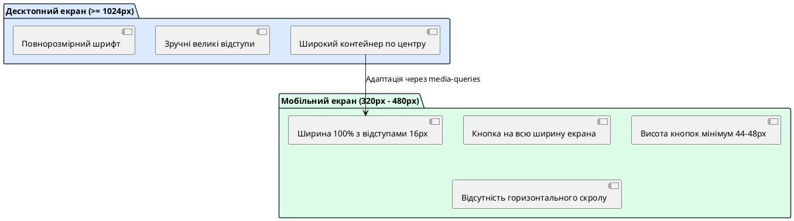

# Комплексний аудит та підсумкове тестування

::card-group

::card{title="🎯 Мета розділу" icon="i-lucide-target"}

- Опанувати методологію проведення фінального приймального тестування (*User Acceptance Testing / UAT*).
- Перевірити коректність адаптивного відображення інтерфейсу на десктопних і мобільних екранах.
- Провести аудит ергономіки, типографіки, контрастності та зрозумілості елементів взаємодії.
- Звірити підсумковий стан цифрового продукту з усіма вихідними навчальними вимогами.

::

::card{title="🔑 Ключові терміни" icon="i-lucide-key"}

- **Приймальне тестування (*Acceptance Testing / UAT*):** фінальна фаза перевірки системи на відповідність усім бізнес-вимогам та готовність до використання реальними людьми.
- **Адаптивний дизайн (*Responsive Web Design / RWD*):** підхід до верстки, за якого інтерфейс автоматично підлаштовується під будь-яку ширину екрана без горизонтального скролу.
- **Обрізання контенту (*Text Clipping / Layout Overflow*):** візуальний дефект, за якого частини слів або кнопок виходять за межі екрана або не вміщуються у свої блоки.
- **Коефіцієнт контрастності (*Contrast Ratio*):** співвідношення яскравості між кольором тексту та його фоном, що визначає зручність читання.

::

::

---

## Філософія фінального приймального аудиту

Розробка продукту завершується не тоді, коли написаний останній рядок коду, а тоді, коли застосунок перевірено з позиції реального користувача. Початківці часто тестують свій сайт виключно на тому моніторі, за яким працюють. Проте понад 70% користувачів сьогодні відкривають веб-застосунки зі смартфонів із різною роздільною здатністю, у транспорті або при яскравому сонячному світлі.

Фінальний аудит — це безкомпромісна перевірка надійності та зручності. Якщо на десктопі застосунок виглядає бездоганно, але на смартфоні текст зливається з фоном, а кнопки вилазять за межі екрана — продукт вважається недоробленим.

---

## Карта перевірки адаптивності та кросплатформності

Сучасні AI-середовища розробки мають спеціальні перемикачі у вікні Live Preview: десктопний режим (*Desktop Mode*), планшетний (*Tablet*) та мобільний (*Mobile Viewport*).

{.diagram-img}

::plant-uml{alt="Матриця перевірки адаптивності"}



::

### Ключові правила мобільної ергономіки:
1. **Зона дотику (Tap Target):** пальці значно товщі за курсор миші. Висота будь-якої інтерактивної кнопки чи поля введення має становити щонайменше `44px` (а краще `48px`), щоб по ній було зручно потрапляти однією рукою.
2. **Нульовий горизонтальний скрол:** на сторінці ніколи не повинно з'являтися нижньої горизонтальної смуги прокручування. Якщо елементи не вміщуються в один ряд, вони повинні автоматично переноситися вертикально (`flex-direction: column`).
3. **Розмір шрифтів:** розмір основного тексту має бути не менше `16px`. Менший шрифт змушує користувача мружитися або масштабувати екран щипком.

---

## Чек-лист підсумкового приймального тестування

Перед здачею проєкту пройдіться по наступному переліку та поставте внутрішні прапорці відповідності:

::steps

### 1. Функціональна цілісність
- Головний сценарій працює від початку до кінця за 1-2 кліки.
- Математичні обчислення точні, числа не містять безглуздих довгих хвостів після коми.
- Валідація спрацьовує на порожні поля та неприпустимі значення з виведенням зрозумілого тексту.

### 2. Візуальний та UX аудит
- Контрастність тексту: темний текст на світлому фоні (або білий на глибокому темному), текст легко читається без напруження очей.
- Зрозумілість дії: головна кнопка чітко підписана дієсловом і виділяється серед другорядних елементів.
- Стани: результат з'являється тільки після введення даних, стара помилка автоматично зникає при новому розрахунку.

### 3. Технічні обмеження (Non-Goals)
- У проєкті відсутні непотрібні сторонні бібліотеки, що уповільнюють завантаження.
- Немає жодних запитів до неіснуючих бекендів чи серверів.
- Консоль браузера (*DevTools Console*) залишається абсолютно чистою (нуль червоних помилок).

::

---

## Швидке усунення проблем із версткою через AI

Якщо під час перевірки на мобільному телефоні ви помітили, що картка обрізається, зверніться до асистента з чіткою CSS-інструкцією:

```markdown
Покращення адаптивності інтерфейсу:
- Проблема: на мобільних пристроях (ширина менше 480px) картка застосунку виходить за межі екрана, з'являється горизонтальний скрол.
- Завдання: 
  1. Додай у файл style.css медіа-запит @media (max-width: 480px).
  2. Встанови максимальну ширину контейнера width: 100% із бічними відступами padding: 1rem.
  3. Зроби головну кнопку шириною на весь екран (width: 100%) та висотою 48px для зручного натискання пальцем.
  4. Переконайся, що горизонтальний скрол повністю відсутній.

Не змінюй HTML-розмітку та JavaScript-файли.
```

---

## Практичні завдання та запитання для самоконтролю

::::accordion

:::accordion-item{label="📋 Практичне завдання: Мобільний аудит застосунку" icon="i-lucide-clipboard-list"}

1. Відкрийте ваш проєкт у браузері Google Chrome, натисніть `F12` (або `Cmd+Option+I`) та увімкніть режим емуляції мобільних пристроїв (*Toggle device toolbar*).
2. Оберіть режим перегляду `iPhone 12 / 14` або `Pixel 7` (ширина близько 390px).
3. Пройдіть весь користувацький сценарій від початку до кінця пальцем (кліками миші).
4. Перевірте, чи не виникає горизонтального скролу та чи всі тексти поміщаються на екрані.

:::

:::accordion-item{label="❓ Чому тестування у DevTools не замінює реальний телефон на 100%?" icon="i-lucide-help-circle"}

Емулятор браузера на комп'ютері імітує лише ширину вікна перегляду, але використовує потужний процесор комп'ютера та графічну підсистему десктопа. Справжній смартфон має фізичну сенсорну клавіатуру, яка при відкритті перекриває нижню половину екрана, а також іншу поведінку прокручування та масштабування. Якщо є технічна можливість, обов'язково відкрийте посилання на опублікований проєкт із реального телефона.

:::

:::accordion-item{label="❓ Як зрозуміти, що кнопка має достатній контраст стосовно фону?" icon="i-lucide-help-circle"}

За міжнародним стандартом доступності WCAG 2.1 співвідношення контрастності для тексту та кнопок має становити щонайменше **4.5:1** для звичайного тексту та **3:1** для великих інтерактивних елементів. На практиці це означає: уникайте сірого тексту на світло-сірому фоні або блідо-жовтих кнопок із білим шрифтом. Використовуйте насичені темні або яскраві акцентні кольори з високим контрастом.

:::

::::
