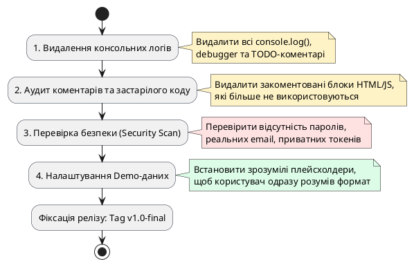

# Підготовка підсумкової версії коду

::card-group

::card{title="🎯 Мета розділу" icon="i-lucide-target"}

- Очистити кодову базу від технічного сміття, тимчасових заглушок і налагоджувальних логів.
- Провести експрес-аудит кібербезпеки: гарантувати відсутність персональних даних і витоку секретів.
- Підготувати оптимальні демонстраційні дані за замовчуванням для миттєвої презентації продукту.
- Сформувати та зафіксувати підсумковий офіційний реліз застосунку (*Release Candidate / v1.0-final*).

::

::card{title="🔑 Ключові терміни" icon="i-lucide-key"}

- **Релізна версія (*Release Version / Production Build*):** фінальний очищений стан коду, оптимізований для використання кінцевими користувачами та оцінювання.
- **Налагоджувальні артефакти (*Debug Artifacts*):** технічні виклики `console.log`, закоментовані шматки старого коду, тестові змінні, які використовувалися розробником у процесі створення.
- **Витік секретів (*Secret Leaks*):** випадкове потрапляння у відкритий код API-ключів, токенів доступу, паролів або реальних персональних даних користувачів.
- **Демонстраційні дані (*Demo / Placeholder Data*):** продумані типові значення за замовчуванням або плейсхолдери, що демонструють можливості продукту без зайвих зусиль з боку глядача.

::

::

---

## Культура фінального очищення кодової бази

Під час швидкої розробки та численних експериментів із штучним інтелектом у проєкті неминуче осідає велика кількість тимчасового сміття. Розробники пишуть `console.log("here", x)` для відстеження змінних, AI коментує старі функції «про всяк випадок», а в HTML-файлі залишаються мокові тексти на кшталт «Тестовий заголовок 123».

Залишати таке сміття у фінальній версії неприпустимо для інженера. Чистота коду — це прямий показник професійної зрілості автора. Крім того, наявність зайвих обробників або невикористаних стилів збільшує вагу застосунку та може спричинити приховані конфлікти під час запуску в іншому браузері.

---

## Чотири кроки передрелізної санітарії

Процес підготовки релізу здійснюється за суворою процедурою очищення:

{.diagram-img}

::plant-uml{alt="Етапи передрелізної санітарії"}

::

---

## Детальний чек-лист релізного аудиту

Перед тим як створити фінальний знімок стану, відкрийте код вашого проєкту та виконайте наступні інструкції:

::steps

### 1. Очищення файлу main.js
- Знайдіть і видаліть усі рядки з викликами `console.log()`, `console.warn()` чи `console.error()`.
- Перевірте, чи не залишилося тимчасових змінних із дивними назвами на кшталт `let temp = ...` або `let test123`.
- Видаліть будь-які закоментовані шматки коду — історія проєкту зберігається в системі контролю версій, тому тримати «мертвий код» у робочому файлі немає сенсу.

### 2. Очищення розмітки index.html
- Перевірте тег `<title>`: замість стандартного «Vite App» чи «Document» там повинна бути вказана реальна назва вашого продукту українською мовою.
- Переконайтеся, що на сторінці вказано коректний атрибут мови: `<html lang="uk">`.
- Видаліть усі тестові кнопки, які створювалися для перевірки окремих функцій, але не входять до фінального сценарію.

### 3. Аудит безпеки та конфіденційності
- Перевірте код на відсутність персональних номерів телефонів, особистих адрес електронної пошти чи реальних паролів.
- Якщо ви випадково вставляли будь-який тестовий API-ключ у код — негайно видаліть його та відкличте в кабінеті відповідного сервісу.

### 4. Встановлення розумних значень за замовчуванням
- Забезпечте інформативні плейсхолдери: замість пустого поля вкажіть сірим шрифтом зразок вхідних даних (наприклад: `placeholder="Наприклад: 15"`).
- Якщо це доречно, встановіть логічне значення за замовчуванням для першого елемента форми, щоб користувач міг протестувати продукт в один клік без тривалого набору тексту.

::

---

## Фіксація релізу: Final Snapshot

Коли всі файли очищено, створено акуратні відступи та перевірено безпеку, створіть підсумкове збереження проєкту. Присвойте йому офіційний тег: `v1.0-final-release`.

Також оновіть кореневий файл `CONTEXT.md`: встановіть статус «Завершено / Готово до оцінювання» та вкажіть посилання на збережену версію.

---

## Практичні завдання та запитання для самоконтролю

::::accordion

:::accordion-item{label="📋 Практичне завдання: Передрелізне прибирання коду" icon="i-lucide-clipboard-list"}

1. За допомогою пошуку по проєкту (`Ctrl+Shift+F` або `Cmd+Shift+F`) знайдіть усі входження слова `console`.
2. Видаліть усі знайдені налагоджувальні логи.
3. Перевірте файл `index.html` і вкажіть красиву назву вашого продукту у тегу `<title>`.
4. Створіть фінальний Snapshot у вашому середовищі з назвою `v1.0-final-release`.

:::

:::accordion-item{label="❓ Чому залишати console.log у робочому коді вважається поганою практикою?" icon="i-lucide-help-circle"}

По-перше, виклики `console.log()` уповільнюють виконання програми, оскільки вимагають синхронного виведення інформації у внутрішній буфер терміналу чи інструментів розробника. По-друге, вони засмічують консоль, заважаючи помітити реальні критичні помилки браузера. По-третє, це створює враження незавершеної, «сирої» роботи на етапі демонстрації чи код-рев'ю.

:::

:::accordion-item{label="❓ Що робити, якщо ви випадково закомітили приватний ключ або пароль у відкритий репозиторій?" icon="i-lucide-help-circle"}

Простого видалення рядка з коду в наступному коміті недостатньо: файл залишається у повній історії змін Git, де його можуть легко знайти автоматичні сканери ботів. Єдиний надійний протокол дій: негайно зайти на відповідний сервіс і **анулювати (Revoke / Rotate)** цей ключ або змінити скомпрометований пароль. Тільки після інвалідації секрету він стає марним для зловмисників.

:::

::::
