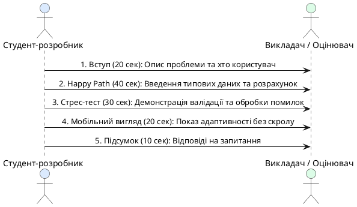

# Демонстрація, публікація та критерії оцінювання

::card-group

::card{title="🎯 Мета розділу" icon="i-lucide-target"}

- Опанувати базові способи публікації (*Deployment*) клієнтського веб-застосунку в мережі Інтернет.
- Підготувати переконливу 2-хвилинну демонстрацію продукту за структурою «Проблема → Рішення → Живий показ».
- Зрозуміти матрицю критеріїв оцінювання курсу та підготувати проєкт до успішного захисту.
- Підбити підсумки спринту та окреслити траєкторію подальшого розвитку навичок AI-розробника.

::

::card{title="🔑 Ключові терміни" icon="i-lucide-key"}

- **Публікація / Розгортання (*Deployment*):** процес розміщення файлів веб-застосунку на публічному веб-сервері або CDN для доступу через загальнодоступну URL-адресу.
- **Демонстрація продукту (*Product Demo / Pitch*):** коротка структурована презентація, що фокусується на цінності для користувача та практичній працездатності системи.
- **Статичний хостинг (*Static Web Hosting*):** хмарна інфраструктура (GitHub Pages, Vercel, Netlify), призначена для миттєвої роздачі файлів HTML, CSS та JS без потреби у власному сервері.
- **Критерії оцінювання (*Assessment Rubric*):** формалізований перелік інженерних і продуктових вимог, за якими виставляється підсумкова оцінка за курс.

::

::

---

## Публікація проєкту: як поділитися посиланням

Хоча публікація проєкту не є обов'язковою умовою для виставлення оцінки (оцінювання може проводитися безпосередньо у робочому середовищі AI IDE), вміння перетворити локальний код на працююче інтернет-посилання є важливою інженерною навичкою.

Сучасні AI-платформи та інструменти роблять публікацію справою одного кліку:

1. **Вбудоване розгортання в AI IDE (Bolt.new, Replit):**
   - Більшість середовищ мають кнопку **«Deploy»** або **«Publish»** у верхньому правому куті.
   - За лічені секунди система генерує унікальну публічну URL-адресу (наприклад, `my-app.bolt.app`), якою можна поділитися з викладачем, одногрупниками або відкрити з власного смартфона.

2. **Статичний хостинг через GitHub Pages або Vercel:**
   - Якщо ваш код синхронізовано з репозиторієм на GitHub, ви можете безкоштовно увімкнути функцію **GitHub Pages** у налаштуваннях репозиторію (`Settings → Pages → Branch: main`).
   - Альтернативно можна підключити обліковий запис до **Vercel** або **Netlify**, які автоматично збирають і публікують сайт при кожному новому коміті.

::tip
Обов'язково збережіть отримане публічне посилання на ваш працюючий застосунок у файлі `CONTEXT.md` та додайте його до навчального звіту.
::

---

## Структура 2-хвилинного продуктового пітчу

На захисті проєкту студенту важливо продемонструвати не просто факт наявності коду, а своє **продуктове та інженерне мислення**. Викладач або екзаменатор оцінює вміння автора чітко донести цінність розробки.

Найкраща структура короткої презентації триває рівно 120 секунд і складається з чотирьох блоків:

{.diagram-img}

::plant-uml{alt="Сценарій 2-хвилинної демонстрації продукту"}

::

### Приклад зразкового виступу:
1. **Проблема:** *«Студенти коледжу часто недооцінюють час, необхідний для підготовки до занять, і відкладають читання складних матеріалів на останню ніч. Мій продукт — QuickReader — допомагає за 10 секунд дізнатися реальну тривалість роботи з текстом»*.
2. **Головний сценарій:** *«Я обираю обсяг у 20 сторінок, тип складності "Наукова стаття" і натискаю кнопку. Застосунок розраховує 60 хвилин і рекомендує зробити одну перерву на відпочинок»*.
3. **Обробка помилок:** *«Якщо випадково натиснути кнопку без введення сторінок, застосунок не падає і не показує NaN, а ввічливо підсвічує поле червоним кольором»*.
4. **Адаптивність:** *«Інтерфейс оптимізовано під смартфони: кнопки мають великий розмір, а горизонтальний скрол повністю відсутній»*.

---

## Офіційна матриця оцінювання проєкту

Підсумкова оцінка за курс виставляється на підставі виконання практичних завдань та відповідності підсумкового застосунку критеріям якості:

| Критерій оцінювання | Вага | Що саме перевіряється? |
|---|---|---|
| **Працездатність головного сценарію** | 30% | Користувач вводить коректні дані, натискає кнопку та отримує правильний, зрозумілий результат без затримок і помилок. |
| **Клієнтська валідація та помилки** | 20% | Захист від порожнього вводу, нуля та від'ємних чисел; наявність інформативного повідомлення про помилку замість системного крашу. |
| **Архітектура станів UI** | 15% | Чітке розділення початкового стану (результат приховано), стану успіху та стану помилки; наявність кнопки скидання або повторної дії. |
| **Адаптивність та ергономіка** | 15% | Коректне відображення як на моніторі комп'ютера, так і на екрані смартфона; відсутність виходу елементів за межі екрана (*overflow*). |
| **Чистота кодової бази та безпека** | 10% | Відсутність сміття у коді, видалені `console.log`, відсутність витоку паролів, персональних даних чи секретних ключів. |
| **Дотримання архітектурних меж (Non-Goals)** | 10% | Суто клієнтська автономна робота без сервера, бази даних та авторизації; відсутність важких сторонніх бібліотек. |

---

## Практичні завдання та запитання для самоконтролю

::::accordion

:::accordion-item{label="📋 Практичне завдання: Репетиція фінального захисту" icon="i-lucide-clipboard-list"}

1. Запустіть таймер на смартфоні на 2 хвилини (120 секунд).
2. Відкрийте ваш продукт у вікні браузера.
3. Промовте вголос ваш презентаційний пітч, виконуючи кліки по інтерфейсу відповідно до структури: Проблема → Happy Path → Обробка помилок → Адаптивність.
4. Переконайтеся, що ви вклалися у відведений час і продемонстрували всі сильні сторони вашої інженерної розробки.

:::

:::accordion-item{label="❓ Чому демонстрація обробки помилок є обов'язковою на технічному захисті?" icon="i-lucide-help-circle"}

Будь-який новачок може створити застосунок, що працює з однією ідеальною цифрою. Проте зрілий інженер демонструє стійкість системи до непередбачуваних дій. Показ того, як застосунок перехоплює помилку та захищає інтерфейс від краху, переконує екзаменатора, що розробник володіє глибоким розумінням життєвого циклу продукту та логіки валідації.

:::

:::accordion-item{label="❓ Що є головним досягненням студента за підсумками Vibe Coding Sprint?" icon="i-lucide-help-circle"}

Головним результатом є не просто створення одного веб-додатка, а засвоєння **керованого Vibe Coding Workflow**: перетворення проблеми на інженерні вимоги, дисципліноване спілкування з AI через ітеративні запити «завдання – зміна – перевірка – збереження», вміння розпізнавати галюцинації моделі та повний контроль над кінцевим результатом за допомогою критичного інженерного мислення.

:::

::::
