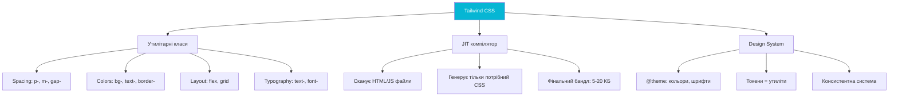
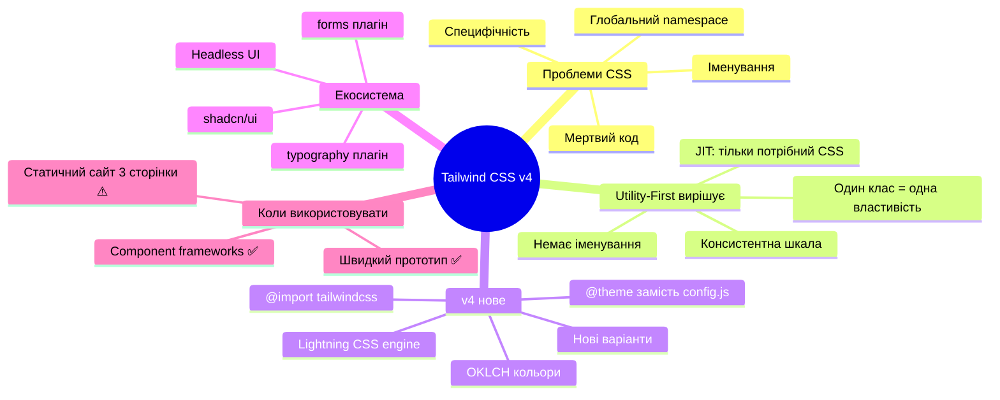

# Що таке Tailwind CSS і навіщо він потрібен

## Проблема, яку ніхто не хоче визнавати

Почнемо з чесного запитання: чому CSS — найбільш недооцінена і водночас найбільш болісна мова у веб-розробці?

Технічно CSS простий: пишеш `color: red` — і текст червоний. Але в реальному проєкті з 20 розробниками, 50 сторінками і роком розробки CSS перетворюється на хаос, який ніхто не наважується чіпати. Звучить знайомо?

Ось типовий сценарій: ви успадковуєте проєкт і бачите файл `styles.css` на 4000 рядків. Там є клас `.button-blue-hover-special-v2`. Ніхто не знає, де він використовується. Ніхто не знає, чи можна його видалити. Нікому не вистачає сміливості це зробити. І кожен новий розробник додає ще один `.button-blue-hover-special-v3`, бо безпечніше.

Tailwind CSS — відповідь на цю проблему. Але щоб зрозуміти відповідь, спочатку треба зрозуміти саму проблему.

---

## Чому CSS в команді стає хаосом

### Проблема 1: Глобальний простір імен

CSS — це єдиний простір імен. Клас `.title`, написаний для заголовка блогу, може випадково перекрити заголовок у модальному вікні, якщо хтось із колег використав те саме ім'я. Немає компілятора, який це перевірить. Немає імпорту, що обмежить видимість. Все глобальне — завжди.

В JavaScript `const title = ...` існує у своєму файлі. В CSS `.title { ... }` існує всюди.

### Проблема 2: Специфічність — невидимий ворог

Коли два CSS-правила конфліктують — браузер визначає переможця через **специфічність**: складний алгоритм підрахунку ваги селекторів. Новачки не розуміють специфічність. Досвідчені розробники знають її, але все одно іноді помиляються. І замість розбиратися — пишуть `!important`. А потім `!important` зустрічає `!important`...

```css
/* Чий стиль переможе? */
.nav .nav__link {
    color: blue;
} /* специфічність: 0,2,0 */
#header a {
    color: red;
} /* специфічність: 1,0,1 */
.nav__link.active {
    color: green;
} /* специфічність: 0,2,0 */
```

### Проблема 3: Мертвий код та CSS, що постійно росте

CSS легко додавати, але **дуже важко безпечно видаляти**. Ви додаєте стилі для нової фічі — це просто. Але коли фічу прибирають, ніхто не впевнений, чи використовуються стилі десь ще. Типова реакція: залишити все як є. Через рік CSS-бандл важить 400 КБ, з яких 60% — невикористані стилі.

### Проблема 4: Іменування — найважча проблема програмування

> "Є лише дві складні проблеми в програмуванні: анулювання кешу та іменування речей." — Phil Karlton

А в CSS іменування — ваша буденна задача. Як назвати цей блок? `.card`? `.article-card`? `.post-card`? `.content-box`? І що, якщо завтра дизайнер скаже "давай зробимо їх прямокутними, вони вже не схожі на картки"?

---

## Що таке Utility-First CSS

**Utility-First** (_утилітарний підхід_) — це методологія CSS, де замість семантичних класів-компонентів використовуються **атомарні класи**, кожен з яких відповідає **одній CSS-властивості**.

Замість:

```html
<button class="submit-button">Надіслати</button>
```

```css
.submit-button {
    display: inline-flex;
    align-items: center;
    padding: 0.5rem 1rem;
    background: #6366f1;
    color: white;
    border-radius: 0.5rem;
    font-weight: 600;
}
```

В Utility-First:

```html
<button class="inline-flex items-center px-4 py-2 bg-indigo-500 text-white rounded-lg font-semibold">Надіслати</button>
```

Тут немає CSS-файлу. Немає іменування. Кожен клас (`px-4`, `bg-indigo-500`, `rounded-lg`) — це одна CSS-властивість з конкретним значенням.

### Як це вирішує проблеми?

**Глобальний простір імен:** utility-класи вже визначені і незмінні. `bg-indigo-500` завжди означає `background-color: oklch(0.585 0.233 277.117)`. Конфліктів бути не може.

**Специфічність:** всі utility-класи мають однаковий рівень специфічності (один клас = `0,1,0`). Немає несподіванок.

**Мертвий код:** Tailwind **сканує** ваші HTML/JS файли і генерує CSS **тільки для тих класів, що реально використовуються**. Видалили елемент з HTML — відповідний CSS автоматично зник з бандлу.

**Іменування:** у компоненті не потрібно придумувати назву. Просто описуєте зовнішній вигляд через класи.

---

## Tailwind CSS — що це насправді?

**Tailwind CSS** — це утилітарний CSS-фреймворк, що надає великий набір готових utility-класів для стилізації HTML. На відміну від Bootstrap (де є готові компоненти), Tailwind дає вам **будівельні блоки**: класи для кольорів, відступів, типографіки, flexbox, grid і сотень інших CSS-властивостей.

Tailwind **не має компонентів**. Тут немає класу `.navbar` чи `.modal`. Є `flex`, `items-center`, `px-4`, `bg-white`, `shadow-md` — і з них ви будуєте все самостійно.

Ця відмінність ключова: Bootstrap дає вам будинок із зробленим плануванням. Tailwind дає цеглу, цементний розчин та інструменти. Ви самі вирішуєте, де будуть стіни.

::mermaid



::

---

## Як Tailwind генерує CSS

Розуміння принципу роботи Tailwind — ключ до його правильного використання. Без цього розуміння ви будете робити помилки, і вони здаватимуться магічними.

### Just-in-Time компілятор

Tailwind використовує **JIT-компілятор** (_Just-in-Time_, "прямо вчасно"). Ось що відбувається:

::steps

### Ви пишете HTML

```html
<div class="bg-indigo-500 p-4 rounded-lg text-white font-bold">Hello</div>
```

### Tailwind сканує файл

Компілятор знаходить рядок `"bg-indigo-500 p-4 rounded-lg text-white font-bold"` і розбиває його на окремі токени-класи.

### Генерує CSS тільки для цих класів

```css
.bg-indigo-500 {
    background-color: oklch(0.585 0.233 277.117);
}
.p-4 {
    padding: 1rem;
}
.rounded-lg {
    border-radius: 0.5rem;
}
.text-white {
    color: #fff;
}
.font-bold {
    font-weight: 700;
}
```

### Результат: мінімальний CSS

Фінальний CSS-файл містить **лише** ті утиліти, що реально використані. Незалежно від того, скільки всього є в Tailwind — у ваш бандл потрапить тільки потрібне. Типовий продакшн-бандл: **5–15 КБ** стиснутого CSS.

::

Цей принцип **фундаментальний**: клас, якого немає в HTML/JS — не потрапить у CSS. Якщо ви пишете клас у JavaScript рядком `'bg-' + color` — Tailwind не побачить його. Про це ми детально поговоримо у статті про довільні значення.

---

## Філософія дизайн-системи

Tailwind — це не просто "CSS через класи". Це **дизайн-система з чіткими правилами**.

Коли ви пишете `p-4` — ви не обираєте довільний відступ. Ви обираєте значення зі шкали, що кратна `0.25rem` (4px). Це означає, що всі відступи в проєкті будуть **консистентними** — бо всі вони з однієї шкали. Ніхто не напише `padding: 11px` або `padding: 7.5px` — просто тому, що такого класу не існує.

Аналогічно з кольорами: є `bg-blue-500`, `bg-blue-600`, `bg-blue-700` — але немає `bg-blue-543`. Ця обмеженість не обмежує вас — вона **захищає дизайн від непослідовності**.

::tip
Одна з найбільших переваг Tailwind — **дизайн-система "за замовчуванням"**. Навіть якщо у вас немає дизайнера або дизайн-системи — Tailwind навнав автоматично забезпечує консистентність через свої токени: однакові відступи, узгоджені кольори, пропорційна типографіка.
::

---

## Tailwind v4: що змінилося

Tailwind v4 (2025) — це повне переосмислення фреймворку. Не еволюція — революція. Кілька ключових змін, що вплинуть на те, як ви писатимете код:

### CSS-перша конфігурація через `@theme`

Раніше налаштування Tailwind відбувалося в JavaScript-файлі. Тепер — у CSS. Ваш головний CSS-файл:

```css
/* app.css — більше не потрібні окремі конфіг-файли */
@import 'tailwindcss';

@theme {
    /* Ваші кастомні токени — тут */
    --color-brand: oklch(0.6 0.2 270);
    --font-sans: 'Inter', system-ui, sans-serif;
    --breakpoint-3xl: 120rem;
}
```

Один файл — одне місце для всіх стилів і конфігурації. Це менш "магічно" і більш прозоро.

### `@import "tailwindcss"` — один рядок

```css
/* Старий підхід — три директиви */
/* @tailwind base; */
/* @tailwind components; */
/* @tailwind utilities; */

/* Новий підхід v4 — один рядок */
@import 'tailwindcss';
```

### Lightning CSS під капотом

Tailwind v4 побудований на [Lightning CSS](https://lightningcss.dev/) — Rust-написаний CSS-парсер і трансформер. Результат: компіляція **10x швидша**, ніж у v3. Великий проєкт обробляється за мілісекунди замість секунд.

Lightning CSS також автоматично додає vendor-префікси, обробляє нові CSS-функції та оптимізує вихідний CSS — без будь-яких плагінів.

### OKLCH кольори за замовчуванням

Tailwind v4 перейшов на простір кольорів **OKLCH** (_Oklab Lightness Chroma Hue_). Це перцептуально рівномірний колірний простір — кольори "поводяться" передбачувано при зміні яскравості чи насиченості. Детально розглянемо в окремій статті про кольори.

### Нові варіанти

`not-*`, `in-*`, `nth-*`, `starting:` — нові варіанти, що відображають нові CSS-можливості. Наприклад:

```html
<!-- Стиль тільки для кожного 2-го елемента -->
<li class="nth-2:bg-gray-100">...</li>

<!-- Стиль при @starting-style (анімація появи) -->
<dialog class="starting:opacity-0 opacity-100 transition-opacity">...</dialog>
```

---

## Коли Tailwind — правильний вибір

Tailwind підходить чудово для:

::card-group

::card{title="Компонентні фреймворки" icon="i-heroicons-puzzle-piece"}
React, Vue, Svelte, Angular — де UI розбитий на компоненти. Стилі живуть разом із компонентом, не в окремому CSS-файлі. Повторюваність вирішується через компоненти, а не через @apply.
::

::card{title="Швидке прототипування" icon="i-heroicons-rocket-launch"}
Старт нового проєкту, MVP, хакатон. Без витрат часу на іменування, структуру файлів та специфічність — фокус на функціональності.
::

::card{title="Продукти з дизайн-системою" icon="i-heroicons-swatch"}
Якщо є усталений дизайн і токени (кольори, відступи, шрифти) — Tailwind's `@theme` стає природним місцем для них. Зміна токену → автоматично оновлює весь UI.
::

::card{title="Команди без виділеного CSS-архітектора" icon="i-heroicons-users"}
BEM, SMACSS, OOCSS вимагають дотримання конвенцій усіма. Tailwind примушує консистентність технічно, а не через домовленості.
::

::

**Коли Tailwind може бути не кращим вибором:**

- **Невеликий статичний сайт без JS-фреймворку** — якщо у вас 3 сторінки і 200 рядків стилів, Tailwind додає зайву складність інструментарію.
- **Проєкт із готовою UI-бібліотекою** — якщо ви вже використовуєте Material UI або Ant Design, конфлікт підходів ускладнить розробку.
- **Команда категорично проти** — Tailwind вимагає ментальної перебудови. Якщо команда не готова — примусове впровадження створить більше проблем.

::note
Tailwind — інструмент, а не срібна куля. Він чудово вирішує проблеми великих компонентних проєктів. Але "правильним" є той інструмент, що вирішує вашу конкретну задачу. Завжди оцінюйте контекст.
::

---

## Популярні непорозуміння про Tailwind

### "Це ж просто inline-стилі!"

Це найпоширеніший аргумент проти Tailwind. Але різниця суттєва:

| Аспект            | Inline-стилі | Tailwind              |
| ----------------- | ------------ | --------------------- |
| Довільні значення | Будь-які     | З дизайн-системи      |
| Псевдокласи       | ❌ Неможливо | ✅ `hover:`, `focus:` |
| Media queries     | ❌ Неможливо | ✅ `md:`, `lg:`       |
| Dark mode         | ❌ Неможливо | ✅ `dark:`            |
| Анімації          | ❌ Неможливо | ✅ `animate-`         |
| Розмір CSS        | Весь у HTML  | JIT — тільки потрібне |

### "HTML стає нечитабельним"

Рядок `class="flex items-center gap-4 p-4 bg-white rounded-xl shadow-md hover:shadow-lg transition-shadow"` справді довший. Але він **самодокументований**: не потрібно відкривати CSS-файл, щоб зрозуміти, як виглядає елемент. Все тут.

При роботі з компонентами (React/Vue) цей рядок знаходиться в одному місці — у файлі компонента — і не дублюється.

### "Не можна зробити кастомний дизайн"

Tailwind — не Bootstrap. Тут немає фіксованого дизайну. `bg-indigo-500` — це ваш колір. Через `@theme` ви повністю замінюєте палітру, шрифти, розміри, відступи. Tailwind генерує utility-класи для ваших токенів.

### "Треба вивчати новий синтаксис"

Tailwind-класи — це **CSS-властивості з очевидними іменами**. `flex` = `display: flex`. `text-center` = `text-align: center`. `mt-4` = `margin-top: 1rem`. Якщо ви знаєте CSS — ви вже майже знаєте Tailwind.

---

## Екосистема Tailwind

Tailwind — не просто фреймворк. Навколо нього сформувалася ціла екосистема:

::card-group

::card{title="@tailwindcss/typography" icon="i-heroicons-document-text"}
Плагін для красивої стилізації markdown-контенту. Один клас `prose` на обгортці — і весь текст виглядає чудово. Незамінний для блогів, документації.
::

::card{title="@tailwindcss/forms" icon="i-heroicons-clipboard-document-list"}
Скидає браузерні стилі форм до розумних дефолтів, готових до стилізації через utility-класи. Checkbox, radio, select — виглядають однаково в усіх браузерах.
::

::card{title="shadcn/ui" icon="i-heroicons-squares-plus"}
Найпопулярніша UI-бібліотека на Tailwind (React). Компоненти копіюються у ваш проєкт — не встановлюються як залежність. Повний контроль над кодом.
::

::card{title="Headless UI" icon="i-heroicons-cog-6-tooth"}
Від команди Tailwind. Доступні (accessibility-ready) компоненти без стилів: dropdown, dialog, listbox. Ви додаєте Tailwind-класи — вони забезпечують логіку та доступність.
::

::card{title="Tailwind UI" icon="i-heroicons-sparkles"}
Платна бібліотека готових компонентів від творців Tailwind. Сотні готових блоків: заголовки, картки, форми, таблиці. Чудове джерело прикладів.
::

::card{title="Prettier plugin" icon="i-heroicons-code-bracket"}
Автоматично сортує Tailwind-класи у "офіційному" порядку: layout → sizing → spacing → визуальні. Консистентний порядок класів у всій команді.
::

::

---

## Ваш перший Tailwind-компонент

Теорія — добре. Але давайте подивимося на Tailwind у дії. Це — проста картка-профілю:

::html-preview

```html
<div class="min-h-screen bg-slate-100 flex items-center justify-center p-8" style="font-family: system-ui, sans-serif;">
    <div class="bg-white rounded-2xl shadow-lg overflow-hidden max-w-sm w-full">
        <!-- Обкладинка -->
        <div class="h-28 bg-gradient-to-br from-indigo-500 to-purple-600"></div>
        <!-- Контент -->
        <div class="px-6 pb-6">
            <!-- Аватар -->
            <div
                class="w-20 h-20 rounded-full border-4 border-white bg-indigo-100 flex items-center justify-center -mt-10 text-3xl shadow-md"
            >
                👨‍💻
            </div>
            <!-- Ім'я та роль -->
            <div class="mt-3">
                <h2 class="text-xl font-bold text-slate-900">Іван Кравченко</h2>
                <p class="text-sm text-indigo-600 font-medium">Frontend Developer</p>
                <p class="text-sm text-slate-500 mt-2 leading-relaxed">
                    Захоплений веб-розробкою, CSS та сучасними технологіями. Пишу код і навчаюся кожного дня.
                </p>
            </div>
            <!-- Теги -->
            <div class="flex flex-wrap gap-2 mt-4">
                <span class="px-3 py-1 bg-indigo-100 text-indigo-700 text-xs font-semibold rounded-full">React</span>
                <span class="px-3 py-1 bg-violet-100 text-violet-700 text-xs font-semibold rounded-full">Tailwind</span>
                <span class="px-3 py-1 bg-blue-100 text-blue-700 text-xs font-semibold rounded-full">TypeScript</span>
            </div>
            <!-- Кнопки -->
            <div class="flex gap-3 mt-5">
                <button
                    class="flex-1 bg-indigo-600 hover:bg-indigo-700 text-white text-sm font-semibold py-2.5 rounded-xl transition-colors"
                >
                    Підписатись
                </button>
                <button
                    class="flex-1 border-2 border-slate-200 hover:border-indigo-300 hover:bg-indigo-50 text-slate-700 text-sm font-semibold py-2.5 rounded-xl transition-colors"
                >
                    Повідомлення
                </button>
            </div>
        </div>
    </div>
</div>
```

::

Зверніть: **жодного CSS-файлу**. Весь дизайн — прямо в HTML через Tailwind-класи. Але це не хаос — кожен клас описує конкретну властивість, і читаючи класи, ви розумієте дизайн.

Розберемо ключові моменти:

- `rounded-2xl` — скруглені кути, але з дизайн-системи, не довільне значення
- `-mt-10` — від'ємний відступ: аватар "перекриває" обкладинку
- `hover:bg-indigo-700` — зміна кольору при наведенні через варіант `hover:`
- `transition-colors` — плавна анімація зміни кольорів
- `flex-1` на кнопках — рівна ширина обох кнопок через flexbox
- `gap-2`, `gap-3` — відступи між дочірніми елементами

---

## Резюме

::mermaid



::

---

## Завдання для самоперевірки

::accordion

::accordion-item{label="Рівень 1: Розуміння — Концепції utility-first"}

**Завдання 1.1.** Поясніть своїми словами: як JIT-компілятор Tailwind вирішує проблему "мертвого коду" у CSS? Що відбувається, якщо ви видалите HTML-елемент із класом `bg-indigo-500` — як зміниться CSS-бандл?

**Завдання 1.2.** Ви успадкували проєкт із таким CSS:

```css
.btn-blue {
    background: #3b82f6;
    color: white;
    padding: 8px 16px;
    border-radius: 6px;
}
.btn-blue-hover {
    background: #2563eb;
}
.btn-blue-lg {
    padding: 12px 24px;
    font-size: 18px;
}
.btn-green {
    background: #10b981;
    color: white;
    padding: 8px 16px;
    border-radius: 6px;
}
```

Якою була б еквівалентна реалізація через Tailwind? Перепишіть кнопку у двох варіантах: синя (`bg-blue-500`, medium) та зелена (`bg-emerald-500`, large). Доповніть hover-ефектом.

**Завдання 1.3.** Назвіть три реальних проблеми CSS у великих проєктах і поясніть, як Tailwind вирішує кожну з них. Чи є у нього власні недоліки?

::

::accordion-item{label="Рівень 2: Практика — Компонент з нуля"}

**Завдання 2.1.** Реалізуйте картку-статистики (stat card) через Tailwind без жодного CSS:

- Іконка (emoji або SVG)
- Число: `1,247` (великий, жирний)
- Підпис: `Активних користувачів`
- Зміна: `+12.5%` (зелений текст зі стрілкою вгору або `-3.2%` червоний)
- Hover-ефект: невеликий підйом (`-translate-y-1`) та тінь

**Завдання 2.2.** Зробіть **три варіанти** однієї кнопки через Tailwind:

- Primary: заповнений фон `bg-indigo-600`, hover: `bg-indigo-700`
- Secondary: прозорий фон, кольорова рамка, hover: фон забарвлюється
- Danger: червоний, hover: темніший червоний
  Всі три мають однакові розмір, padding, border-radius.

**Завдання 2.3.** Поясніть: чому `class="bg-' + colorName + '-500"` **не буде працювати** в продакшні Tailwind? Як правильно вирішити задачу динамічних кольорів?

::

::accordion-item{label="Рівень 3: Архітектура — Думаємо дизайн-системою"}

**Завдання 3.1.** Реалізуйте повну сторінку "Pricing" (тарифні плани) на чистому HTML + Tailwind:

**Структура:**

- Заголовок секції: `Оберіть свій план`
- 3 картки планів (Starter, Pro, Enterprise) в ряд
- Кожна картка: назва, ціна, список переваг (5-6 пунктів), кнопка
- Pro-план виділений: рамка, badge "Популярне", кнопка іншого кольору
- Адаптивність: на мобільних — одна колонка, 3+ — горизонтально

**Tailwind-вимоги:**

- Тільки утилітарні класи, жодного CSS
- `hover:` ефекти на кнопках
- `dark:` — базова підтримка темної теми

::

::

---

_Наступна стаття: [Встановлення та налаштування Tailwind v4](/21.tailwind/02.tailwind-installation-setup)_
