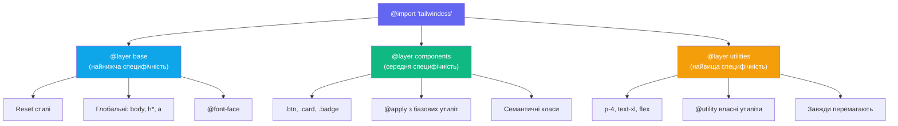

# Кастомізація теми через @theme у Tailwind v4

## Від конфігурації до декларації: революція CSS-first підходу

Впродовж перших трьох мажорних версій Tailwind CSS дотримувався єдиної архітектурної концепції: конфігурація дизайн-системи зберігалась у JavaScript-файлі `tailwind.config.js`. Розробник відкривав цей файл, визначав кольори, шрифти, breakpoints — і Tailwind генерував відповідні utility-класи під час компіляції. Підхід був функціональним, але мав принципову суперечність: конфігурація CSS-фреймворку існувала поза межами CSS.

Tailwind v4 усуває цю суперечність радикально і остаточно. JavaScript-файл конфігурації більше не є частиною архітектури фреймворку. Натомість уся конфігурація дизайн-системи переноситься безпосередньо до CSS через спеціальну директиву `@theme`. Цей підхід має назву **CSS-first configuration** і є ключовою концептуальною відмінністю v4 від усіх попередніх версій.

Практичне значення цього зсуву важко переоцінити. Коли новий розробник входить у проєкт і хоче зрозуміти його дизайн-систему — він відкриває CSS-файл, а не шукає JavaScript-конфіг у кореневій директорії. Конфігурація стає частиною того самого середовища, яким вона керує. Зменшується когнітивне навантаження, зникає необхідність у додатковому інструментарії, а сама система стає прозорою та передбачуваною.

::note
У Tailwind v4 файл `tailwind.config.js` залишається сумісним для міграції з v3, але нові проєкти його не потребують. Уся конфігурація може і повинна жити у CSS.
::

---

## Директива `@theme`: архітектура дизайн-токенів

**Дизайн-токен** — це фундаментальне поняття сучасного front-end розроблення. Токен є іменованою одиницею дизайн-рішення: конкретним значенням кольору, розміром шрифту, відступом або радіусом, яке несе смислове навантаження і може багаторазово використовуватись у системі. На відміну від довільного значення `#6366f1`, токен `--color-brand-500` повідомляє не лише колір, а й його роль у системі.

Директива **`@theme`** — це спеціальна конструкція Tailwind v4, у межах якої розробник оголошує дизайн-токени своєї системи у вигляді CSS Custom Properties з певними іменами-неймспейсами. Механізм фреймворку аналізує ці оголошення і автоматично генерує відповідний набір utility-класів.

```css
@import 'tailwindcss';

@theme {
    /* Кожна CSS-змінна тут → відповідний utility-клас */
    --color-brand: oklch(0.6 0.2 270);
    /* Генерує: bg-brand, text-brand, border-brand, fill-brand, ... */

    --font-display: 'Satoshi', system-ui, sans-serif;
    /* Генерує: font-display */

    --breakpoint-3xl: 120rem;
    /* Генерує: 3xl: варіант для адаптивного дизайну */

    --radius-card: 12px;
    /* Генерує: rounded-card */
}
```

Ключовий принцип полягає у тому, що Tailwind **розпізнає неймспейс** змінної — префікс до першого дефісу після `--`. Значення `--color-*` автоматично стають джерелом для всіх utility-класів, пов'язаних із кольором: `bg-*`, `text-*`, `border-*`, `ring-*`, `fill-*`, `stroke-*`. Значення `--font-*` генерують `font-*`. Значення `--breakpoint-*` стають адаптивними варіантами.

::tip
Директива `@theme` має бути розміщена **після** `@import 'tailwindcss'`. Tailwind обробляє `@theme` як частину системи токенів, а не як звичайний CSS.
::

---

## Таблиця неймспейсів: повний довідник

Tailwind v4 розпізнає наступні неймспейси CSS Custom Properties і для кожного генерує відповідний набір utility-класів:

| CSS-змінна (неймспейс) | Що генерується | Приклад утиліти |
| --- | --- | --- |
| `--color-{name}` | `bg-`, `text-`, `border-`, `fill-`, `stroke-`, ... | `bg-brand`, `text-primary` |
| `--font-{name}` | `font-{name}` | `font-sans`, `font-display` |
| `--text-{size}` | `text-{size}` | `text-hero` |
| `--breakpoint-{name}` | `{name}:` variant | `3xl:flex` |
| `--spacing` | Вся spacing-шкала | `p-4`, `m-6`, `gap-3` |
| `--spacing-{n}` | Конкретний крок шкали | `p-18`, `m-22` |
| `--radius-{name}` | `rounded-{name}` | `rounded-brand` |
| `--shadow-{name}` | `shadow-{name}` | `shadow-card` |
| `--animate-{name}` | `animate-{name}` | `animate-wiggle` |
| `--ease-{name}` | `ease-{name}` у transition | `ease-fluid` |
| `--blur-{name}` | `blur-{name}` | `blur-heavy` |

Зверніть увагу: система є **відкритою**. Якщо Tailwind не розпізнає неймспейс, він просто не генерує utility-клас — але й не видає помилки. Це дозволяє зберігати у `@theme` будь-які токени, навіть ті, що використовуються лише через `var()` безпосередньо у CSS.

### 🧪 Мінімальна практика: перший `@theme`

Відкрийте CodePen або будь-який HTML-файл із підключеним Tailwind через CDN. Додайте у `<style>`:

```css
@import url('https://cdn.jsdelivr.net/npm/tailwindcss@4/dist/tailwind.min.css');

@theme {
    --color-brand: oklch(0.6 0.2 270);
    --radius-brand: 12px;
}
```

Потім у HTML спробуйте класи `bg-brand`, `text-brand`, `rounded-brand`. Переконайтесь, що вони працюють. Змініть значення `oklch(0.6 0.2 270)` на `oklch(0.7 0.18 145)` — спостерігайте, як увесь UI адаптується автоматично. Це і є сила дизайн-токенів.

---

## Кольорова система: чому Tailwind v4 обрав OKLCH

### Проблема з sRGB та HSL

Щоб зрозуміти, чому Tailwind v4 перейшов на **OKLCH** (_OKLab Lightness Chroma Hue_), необхідно спочатку розглянути недоліки попередніх підходів. Класичний `rgb(99, 102, 241)` або `hsl(239, 84%, 67%)` — це описи кольору в термінах, зручних для екрана, але не для людського сприйняття. Колірний простір sRGB є рівномірним математично, але не перцептуально: якщо ви збільшите `L` у HSL на 10% для синього і для жовтого кольорів — візуальна різниця буде різною. Це робить програматичне маніпулювання кольорами непередбачуваним.

**OKLCH** вирішує цю проблему. Він побудований на математиці, яка враховує особливості людського зорового сприйняття. Зміна параметра `L` (яскравість) на фіксовану величину дає однаковий візуальний стрибок незалежно від відтінку `H`. Це робить генерацію колірних палітр алгоритмічно коректною і передбачуваною.

Додатковою перевагою є **ширший колірний охват**: сучасні дисплеї з підтримкою P3 та Rec2020 (всі MacBook з Retina, більшість новітніх мобільних пристроїв) здатні відображати кольори за межами sRGB. OKLCH дозволяє скористатися цими можливостями нативно, без необхідності у додаткових медіа-запитах.

### Анатомія OKLCH

OKLCH оперує трьома незалежними компонентами:

::field-group

::field{name="L — Lightness" type="float [0..1]"}
Перцептуальна яскравість. `0` — абсолютний чорний, `1` — абсолютний білий. На відміну від HSL, однакова зміна `L` дає однаковий візуальний ефект для будь-якого відтінку.
::

::field{name="C — Chroma" type="float [0..~0.4]"}
Насиченість або «живість» кольору. `0` — повністю сірий (ахроматичний), максимальне значення залежить від відтінку й досягає приблизно `0.37` для найнасиченіших кольорів.
::

::field{name="H — Hue" type="degrees [0..360]"}
Відтінок на колірному колі: `0°/360°` — червоний, `90°` — жовтий, `145°` — зелений, `230°` — синій, `270°` — фіолетовий, `320°` — рожевий.
::

::

```css
oklch(0.6 0.2 270)
/* L=0.6  → середня яскравість (не надто темний, не надто світлий) */
/* C=0.2  → помірна насиченість                                    */
/* H=270  → фіолетовий/індиго відтінок                            */
```

::tip
Для швидкого підбору OKLCH значень скористайтесь інструментом [oklch.com](https://oklch.com) — він дозволяє візуально вибирати колір і отримувати готовий код.
::

### Визначення кастомних кольорів: від простого до повної палітри

Найпростіший варіант — один бренд-колір:

```css
@theme {
    --color-brand: oklch(0.6 0.2 270);
    /* Генерує: bg-brand, text-brand, border-brand, ring-brand, ... */
}
```

Однак більшість реальних проєктів потребують повної **числової палітри** — набору відтінків від дуже світлого до дуже темного. Tailwind v4 слідує тій самій конвенції, що й вбудована палітра: суфікси від `50` (майже білий) до `950` (майже чорний):

```css
@theme {
    /* Повна палітра бренду (11 відтінків) */
    --color-brand-50:  oklch(0.97 0.03 270);   /* майже білий з легким фіолетовим */
    --color-brand-100: oklch(0.93 0.06 270);
    --color-brand-200: oklch(0.88 0.10 270);
    --color-brand-300: oklch(0.80 0.14 270);
    --color-brand-400: oklch(0.71 0.18 270);
    --color-brand-500: oklch(0.60 0.22 270);   /* основний бренд-колір */
    --color-brand-600: oklch(0.52 0.22 270);
    --color-brand-700: oklch(0.43 0.20 270);
    --color-brand-800: oklch(0.34 0.17 270);
    --color-brand-900: oklch(0.26 0.13 270);
    --color-brand-950: oklch(0.17 0.09 270);   /* майже чорний з фіолетовим */
}
```

Після цього оголошення у вашому HTML доступні: `bg-brand-50`, `bg-brand-500`, `text-brand-600`, `border-brand-200`, `ring-brand-300`, `shadow-brand-400` — і так далі для кожного з одинадцяти відтінків та кожного типу utility.

### Скидання дефолтних кольорів

Для проєктів із власною дизайн-системою часто бажано **повністю виключити** вбудовану палітру Tailwind і залишити лише власні кольори. Це досягається спеціальним синтаксисом `{namespace}-*: initial`:

```css
@theme {
    /* Крок 1: видалити всю вбудовану колірну палітру */
    --color-*: initial;

    /* Крок 2: визначити виключно власні кольори */
    --color-white:     #ffffff;
    --color-black:     #000000;
    --color-primary:   oklch(0.60 0.22 270);
    --color-secondary: oklch(0.55 0.18 180);
    --color-accent:    oklch(0.72 0.19 50);
    --color-neutral:   oklch(0.50 0.01 270);
    --color-success:   oklch(0.65 0.18 145);
    --color-warning:   oklch(0.80 0.18 85);
    --color-error:     oklch(0.60 0.22 25);
}
```

Результат — мінімалістична дизайн-система із семантичним набором кольорів. Жодних зайвих `slate-100`, `emerald-500`, `rose-300` — лише ті кольори, що відповідають вашому бренду.

::warning
Після `--color-*: initial` жоден вбудований клас кольору Tailwind не буде доступним. Переконайтесь, що ваш власний набір повний і покриває всі UI-стани.
::

### Семантичні токени: найкраща практика

Найдосвідченіші команди йдуть далі від простої числової палітри і впроваджують **семантичні токени** — кольори, що несуть смислове навантаження замість конкретного відтінку. Замість `text-slate-900` — `text-text-primary`. Замість `bg-indigo-500` — `bg-accent`. Така система має ключову перевагу: зміна кольору бренду відбувається в одному місці, а весь UI автоматично оновлюється.

```css
@theme {
    /* Рівень 1: примітивна палітра */
    --color-indigo-500: oklch(0.585 0.233 277.117);
    --color-indigo-600: oklch(0.511 0.262 276.966);
    --color-slate-900:  oklch(0.129 0.042 264.695);
    --color-slate-500:  oklch(0.554 0.046 257.417);
    --color-slate-50:   oklch(0.984 0.003 247.858);

    /* Рівень 2: семантичні аліаси */
    --color-bg-base:      oklch(1 0 0);            /* white */
    --color-bg-surface:   oklch(0.976 0.002 247);  /* slate-50 */
    --color-text-primary: oklch(0.129 0.042 264);  /* slate-900 */
    --color-text-muted:   oklch(0.554 0.046 257);  /* slate-500 */
    --color-accent:       oklch(0.585 0.233 277);  /* indigo-500 */
    --color-accent-dark:  oklch(0.511 0.262 277);  /* indigo-600 */
}
```

Тепер ваш HTML стає самодокументованим: `bg-bg-base text-text-primary text-text-muted bg-accent hover:bg-accent-dark`. Порівняйте це з `bg-white text-slate-900 text-slate-500 bg-indigo-500 hover:bg-indigo-600` — значення абсолютно ідентичні, але перший варіант описує **що це робить**, а не **яке значення має**.

::html-preview{tailwind}

```html
<!DOCTYPE html>
<html lang="uk">
<head>
<meta charset="UTF-8">
<script src="https://cdn.tailwindcss.com"></script>
<script>
tailwind.config = {
    theme: {
        extend: {
            colors: {
                'brand': {
                    50:  '#f5f3ff',
                    100: '#ede9fe',
                    200: '#ddd6fe',
                    300: '#c4b5fd',
                    400: '#a78bfa',
                    500: '#8b5cf6',
                    600: '#7c3aed',
                    700: '#6d28d9',
                    800: '#5b21b6',
                    900: '#4c1d95',
                }
            }
        }
    }
}
</script>
</head>
<body class="p-6 bg-gray-50 font-sans">
    <p class="text-xs font-bold text-gray-500 uppercase tracking-widest mb-3">Brand Palette</p>
    <div class="flex rounded-xl overflow-hidden mb-6 shadow-lg">
        <div class="h-14 flex-1 bg-brand-50 flex items-end justify-center pb-1"><span class="text-brand-300 text-xs">50</span></div>
        <div class="h-14 flex-1 bg-brand-100 flex items-end justify-center pb-1"><span class="text-brand-400 text-xs">100</span></div>
        <div class="h-14 flex-1 bg-brand-200 flex items-end justify-center pb-1"><span class="text-brand-500 text-xs">200</span></div>
        <div class="h-14 flex-1 bg-brand-300 flex items-end justify-center pb-1"><span class="text-white text-xs">300</span></div>
        <div class="h-14 flex-1 bg-brand-400 flex items-end justify-center pb-1"><span class="text-white text-xs">400</span></div>
        <div class="h-14 flex-1 bg-brand-500 flex items-end justify-center pb-1"><span class="text-white text-xs font-bold">500</span></div>
        <div class="h-14 flex-1 bg-brand-600 flex items-end justify-center pb-1"><span class="text-white text-xs">600</span></div>
        <div class="h-14 flex-1 bg-brand-700 flex items-end justify-center pb-1"><span class="text-white text-xs">700</span></div>
        <div class="h-14 flex-1 bg-brand-800 flex items-end justify-center pb-1"><span class="text-white text-xs">800</span></div>
        <div class="h-14 flex-1 bg-brand-900 flex items-end justify-center pb-1"><span class="text-white text-xs">900</span></div>
    </div>
    <p class="text-xs font-bold text-gray-500 uppercase tracking-widest mb-3">Semantic Tokens в дії</p>
    <div class="flex gap-2 flex-wrap">
        <span class="px-4 py-1.5 rounded-full text-sm font-semibold bg-brand-500 text-white shadow">bg-accent</span>
        <span class="px-4 py-1.5 rounded-full text-sm font-semibold bg-brand-100 text-brand-700">bg-surface</span>
        <span class="px-4 py-1.5 rounded-full text-sm font-semibold border-2 border-brand-300 text-brand-600">border-accent</span>
        <span class="px-4 py-1.5 rounded-full text-sm font-semibold bg-brand-50 text-brand-800">text-primary</span>
    </div>
</body>
</html>
```

::

### 🧪 Практика: власна брендова палітра

Побудуйте палітру для уявного стартапу у сфері **екології**. Виберіть зелений як основний відтінок (H ≈ 145°) і визначте 5 відтінків: `200`, `400`, `500`, `600`, `800`. Потім додайте семантичні токени: `--color-bg-base`, `--color-text-primary`, `--color-muted`, `--color-success`. Перевірте, що класи `bg-eco-500`, `text-eco-600`, `border-eco-200` з'являються в браузері.

---

## Типографіка: кастомні шрифти у `@theme`

### Принцип роботи `--font-*` токенів

Типографіка є другим за значимістю елементом дизайн-системи після кольорів. Tailwind надає базовий набір шрифтових стеків: `font-sans`, `font-serif`, `font-mono`. Однак будь-який реальний продукт потребує брендового шрифту. Директива `@theme` дозволяє визначити довільну кількість шрифтових сімей — кожна автоматично стає utility-класом `font-{name}`.

```css
@theme {
    /* Основний шрифт для body-тексту */
    --font-sans: 'Inter', system-ui, -apple-system, BlinkMacSystemFont, sans-serif;

    /* Дисплейний шрифт для заголовків */
    --font-display: 'Clash Display', 'Inter', sans-serif;

    /* Моноширинний для коду та терміналів */
    --font-mono: 'JetBrains Mono', 'Fira Code', 'Cascadia Code', monospace;

    /* Декоративний для маркетингових матеріалів */
    --font-serif: 'Playfair Display', Georgia, 'Times New Roman', serif;
}
```

### Підключення Google Fonts

Власні шрифти потребують завантаження. У проєктах із Tailwind v4 для цього використовується стандартний CSS `@import` перед усіма директивами Tailwind:

```css
/* ВАЖЛИВО: @import шрифтів — першим рядком, до @import 'tailwindcss' */
@import url('https://fonts.googleapis.com/css2?family=Inter:wght@300;400;500;600;700;800&display=swap');
@import url('https://fonts.googleapis.com/css2?family=Playfair+Display:wght@400;700;900&display=swap');
@import url('https://fonts.googleapis.com/css2?family=JetBrains+Mono:wght@400;500&display=swap');

@import 'tailwindcss';

@theme {
    --font-sans:    'Inter', system-ui, sans-serif;
    --font-display: 'Playfair Display', Georgia, serif;
    --font-mono:    'JetBrains Mono', monospace;
}
```

::caution
Порядок `@import` є критично важливим. Google Fonts **обов'язково** мають імпортуватися до `@import 'tailwindcss'`, інакше вони можуть не завантажитись або конфліктувати з обробкою Tailwind.
::

::html-preview{tailwind}

```html
<!DOCTYPE html>
<html lang="uk">
<head>
<meta charset="UTF-8">
<link rel="preconnect" href="https://fonts.googleapis.com">
<link rel="preconnect" href="https://fonts.gstatic.com" crossorigin>
<link href="https://fonts.googleapis.com/css2?family=Inter:wght@400;600;700&family=Playfair+Display:ital,wght@0,700;0,900;1,700&family=JetBrains+Mono&display=swap" rel="stylesheet">
<script src="https://cdn.tailwindcss.com"></script>
<script>
tailwind.config = {
    theme: {
        extend: {
            fontFamily: {
                'sans': ['Inter', 'system-ui', 'sans-serif'],
                'display': ['Playfair Display', 'Georgia', 'serif'],
                'mono': ['JetBrains Mono', 'monospace'],
            }
        }
    }
}
</script>
</head>
<body class="p-8 bg-slate-50">
    <p class="text-xs font-bold text-slate-400 uppercase tracking-widest mb-6 font-sans">Typographic System</p>
    <div class="space-y-5">
        <div class="flex items-baseline gap-4">
            <span class="text-xs text-slate-400 font-mono w-20">display</span>
            <h1 class="font-display font-black text-3xl text-slate-900 leading-tight">Дизайн системи починається<br>зі шрифту.</h1>
        </div>
        <div class="flex items-baseline gap-4">
            <span class="text-xs text-slate-400 font-mono w-20">sans</span>
            <p class="font-sans text-base text-slate-600 leading-relaxed">Основний текст — Inter. Нейтральний, читабельний, сучасний. Ідеально для параграфів та UI-елементів.</p>
        </div>
        <div class="flex items-baseline gap-4">
            <span class="text-xs text-slate-400 font-mono w-20">mono</span>
            <code class="font-mono text-sm text-violet-600 bg-violet-50 px-3 py-1 rounded-lg">--font-display: 'Playfair Display'</code>
        </div>
    </div>
    <div class="mt-8 p-6 bg-white rounded-2xl shadow-sm border border-slate-100">
        <p class="font-sans text-xs font-bold text-violet-500 uppercase tracking-widest mb-2">Premium Product</p>
        <h2 class="font-display font-black text-4xl text-slate-900 leading-tight mb-3">
            Слова стають<br>
            <span class="italic text-violet-600">дизайном.</span>
        </h2>
        <p class="font-sans text-slate-500 text-sm leading-relaxed">Поєднання Display + Sans створює чітку типографічну ієрархію, яку відчуває кожен відвідувач.</p>
    </div>
</body>
</html>
```

::

### 🧪 Практика: типографічна система

Реалізуйте типографічну систему для освітньої платформи. Визначте: `--font-heading` (serif, авторитетний — наприклад Merriweather), `--font-body` (sans-serif, читабельний — Source Sans 3), `--font-code` (моно — Fira Code). Підключіть через Google Fonts та застосуйте до трьох елементів: `<h1 class="font-heading">`, `<p class="font-body">`, `<code class="font-code">`.

---

## Адаптивна система: кастомні breakpoints

### Теоретичні засади responsive дизайну в Tailwind

**Breakpoint** — це значення ширини вьюпорту, при досягненні якого застосовується інша група стилів. Tailwind реалізує систему **mobile-first** breakpoints: кожен відповідний варіант застосовується від визначеної ширини і вище. Варіант `md:flex` означає `flex` при ширині `≥ 48rem (768px)`.

Tailwind v4 зберігає базові breakpoints (`sm`, `md`, `lg`, `xl`, `2xl`), але тепер їх можна легко доповнити або повністю замінити через `@theme`. Директива `--breakpoint-{name}` визначає нижню межу відповідного адаптивного варіанта.

### Додавання нових breakpoints

```css
@theme {
    /* Додати без заміни існуючих */
    --breakpoint-xs:  20rem;   /* 320px — дуже маленькі телефони */
    --breakpoint-3xl: 96rem;   /* 1536px — великі монітори       */
    --breakpoint-4xl: 120rem;  /* 1920px — ultra-wide дисплеї    */
}
```

Після цього стають доступними варіанти: `xs:block`, `3xl:grid-cols-6`, `4xl:text-xl`. Існуючі `sm`, `md`, `lg`, `xl`, `2xl` залишаються без змін.

### Повне перевизначення breakpoints

Якщо ваш проєкт потребує зовсім іншої системи breakpoints — можна повністю замінити вбудовані значення:

```css
@theme {
    /* Крок 1: скинути всі вбудовані breakpoints */
    --breakpoint-*: initial;

    /* Крок 2: визначити власну семантичну систему */
    --breakpoint-phone:   22.5rem;  /* 360px */
    --breakpoint-tablet:  48rem;    /* 768px */
    --breakpoint-laptop:  64rem;    /* 1024px */
    --breakpoint-desktop: 80rem;    /* 1280px */
    --breakpoint-wide:    100rem;   /* 1600px */
}
```

Тепер замість `md:flex` ви пишете `tablet:flex` — семантично точніше і зрозуміліше новим розробникам у команді.

::tip
При перевизначенні breakpoints вказуйте значення у `rem`, а не у `px`. Tailwind очікує відносні одиниці для коректної роботи масштабування у браузерах.
::

### 🧪 Практика: семантичні breakpoints

Визначте breakpoints для мобільного застосунку: `--breakpoint-compact` (360px), `--breakpoint-regular` (390px), `--breakpoint-large` (428px). Застосуйте до сітки: `compact:grid-cols-1 regular:grid-cols-2 large:grid-cols-3`. Перевірте, що сітка реагує на ширину вікна браузера.

---

## Система відступів: `--spacing` як фундамент

### Архітектура spacing-системи

**Spacing** — це, мабуть, найбільш використовуваний аспект будь-якої дизайн-системи. Відступи визначають ритм, дихання і ієрархію у інтерфейсі. Tailwind побудований навколо концепції **числової шкали відступів**: `p-1` = `4px`, `p-2` = `8px`, `p-4` = `16px` і так далі.

У Tailwind v4 ця шкала ґрунтується на **одній базовій змінній** `--spacing`. За замовчуванням її значення `0.25rem` (4px), і всі числові класи є її кратними: `p-N` = `N × --spacing`.

```css
@theme {
    --spacing: 0.25rem; /* default — 4px */
    /* p-1  = 1 × 0.25rem = 4px  */
    /* p-4  = 4 × 0.25rem = 16px */
    /* p-8  = 8 × 0.25rem = 32px */
    /* p-16 = 16 × 0.25rem = 64px */
}
```

Зміна єдиної змінної `--spacing` впливає **на всю spacing-систему одночасно**. Хочете компактніший UI? `--spacing: 0.2rem`. Просторіший? `--spacing: 0.3rem`. Весь продукт автоматично адаптується.

::note
`--spacing` впливає не лише на `padding` і `margin`, але й на `gap`, `width`, `height`, `inset`, `translate` та інші властивості, що використовують spacing-шкалу Tailwind.
::

### Додавання конкретних spacing-значень

Окрім базової одиниці, можна додавати конкретні іменовані значення відступів, яких немає у стандартній шкалі:

```css
@theme {
    /* Стандартна шкала зупиняється на 96 (24rem).
       Для великих layout-відступів додаємо власні: */
    --spacing-18:  4.5rem;  /* p-18, m-18, gap-18 */
    --spacing-22:  5.5rem;  /* p-22               */
    --spacing-128: 32rem;   /* hero-секції         */
    --spacing-144: 36rem;   /* великі відступи     */
}
```

::html-preview{tailwind}

```html
<!DOCTYPE html>
<html lang="uk">
<head>
<meta charset="UTF-8">
<script src="https://cdn.tailwindcss.com"></script>
</head>
<body class="p-6 bg-slate-50 font-sans">
    <p class="text-xs font-bold text-slate-400 uppercase tracking-widest mb-4">Spacing Scale — p-N = N × 4px</p>
    <div class="space-y-2">
        <div class="flex items-center gap-3">
            <span class="text-xs text-slate-400 w-8 font-mono">p-1</span>
            <div class="bg-violet-400 h-6 rounded" style="width:4px"></div>
            <span class="text-xs text-slate-400">= 4px</span>
        </div>
        <div class="flex items-center gap-3">
            <span class="text-xs text-slate-400 w-8 font-mono">p-2</span>
            <div class="bg-violet-400 h-6 rounded" style="width:8px"></div>
            <span class="text-xs text-slate-400">= 8px</span>
        </div>
        <div class="flex items-center gap-3">
            <span class="text-xs text-slate-400 w-8 font-mono">p-4</span>
            <div class="bg-violet-500 h-6 rounded" style="width:16px"></div>
            <span class="text-xs text-slate-400">= 16px</span>
        </div>
        <div class="flex items-center gap-3">
            <span class="text-xs text-slate-400 w-8 font-mono">p-6</span>
            <div class="bg-violet-500 h-6 rounded" style="width:24px"></div>
            <span class="text-xs text-slate-400">= 24px</span>
        </div>
        <div class="flex items-center gap-3">
            <span class="text-xs text-slate-400 w-8 font-mono">p-8</span>
            <div class="bg-violet-600 h-6 rounded" style="width:32px"></div>
            <span class="text-xs text-slate-400">= 32px</span>
        </div>
        <div class="flex items-center gap-3">
            <span class="text-xs text-slate-400 w-8 font-mono">p-12</span>
            <div class="bg-violet-600 h-6 rounded" style="width:48px"></div>
            <span class="text-xs text-slate-400">= 48px</span>
        </div>
        <div class="flex items-center gap-3">
            <span class="text-xs text-slate-400 w-8 font-mono">p-16</span>
            <div class="bg-violet-700 h-6 rounded" style="width:64px"></div>
            <span class="text-xs text-slate-400">= 64px</span>
        </div>
    </div>
    <p class="text-xs font-bold text-slate-400 uppercase tracking-widest mt-6 mb-3">Практичний приклад — gap між картками</p>
    <div class="flex gap-4">
        <div class="flex-1 p-4 bg-white rounded-xl border border-slate-200 shadow-sm text-center text-sm text-slate-600">Картка А</div>
        <div class="flex-1 p-4 bg-white rounded-xl border border-slate-200 shadow-sm text-center text-sm text-slate-600">Картка Б</div>
        <div class="flex-1 p-4 bg-white rounded-xl border border-slate-200 shadow-sm text-center text-sm text-slate-600">Картка В</div>
    </div>
    <p class="text-xs text-slate-400 mt-2">← gap-4 (16px) між картками</p>
</body>
</html>
```

::

### 🧪 Практика: компактний vs просторий UI

Створіть дві HTML-версії однакового компонента картки. У першій встановіть padding `p-2` (компактна). У другій — `p-8` (просторіша). Порівняйте візуальний ефект. Потім спробуйте довільне значення через синтаксис `p-[4.5rem]` — аналог `--spacing-18`.

---

## Радіуси, тіні та анімації у `@theme`

### Border Radius: форма як мова бренду

Радіус заокруглення кутів — це один з найбільш виразних візуальних елементів бренду. Гострі кути (0px) асоціюються з технологічністю та строгістю. Великі радіуси (20px+) — з дружністю та м'якістю. Правильно підібраний радіус формує «характер» інтерфейсу не менше, ніж колірна палітра.

Tailwind v4 дозволяє визначати кастомні значення радіусів через `--radius-{name}`:

```css
@theme {
    /* Маленький радіус для бейджів та тегів */
    --radius-sm:    4px;

    /* Середній — для кнопок та input-полів */
    --radius-md:    8px;

    /* Основний бренд-радіус (наприклад, для карток) */
    --radius-brand: 16px;

    /* Великий — для модальних вікон */
    --radius-xl:    24px;

    /* Повне заокруглення (pill-форма) */
    --radius-pill:  9999px;

    /* Органічна «blob»-форма для декоративних елементів */
    --radius-blob:  30% 70% 70% 30% / 30% 30% 70% 70%;
}
```

Тепер у HTML: `rounded-sm`, `rounded-md`, `rounded-brand`, `rounded-xl`, `rounded-pill`, `rounded-blob`.

### Box Shadow: глибина та матеріальність

Тіні у дизайн-системі — це не лише декорація, а інструмент передачі **глибини** та ієрархії. Елемент із сильнішою тінню «піднятий» над поверхнею. Правильно використані тіні роблять інтерфейс матеріальним і просторовим.

```css
@theme {
    /* Тонка тінь для карток (мінімальне піднесення) */
    --shadow-card: 0 1px 3px rgba(0, 0, 0, 0.08),
                   0 0 1px rgba(0, 0, 0, 0.05);

    /* Помірна тінь для активних елементів */
    --shadow-elevated: 0 8px 24px rgba(0, 0, 0, 0.12),
                       0 2px 8px rgba(0, 0, 0, 0.06);

    /* Виразна тінь для модальних вікон */
    --shadow-modal: 0 20px 60px rgba(0, 0, 0, 0.2),
                    0 8px 24px rgba(0, 0, 0, 0.1);

    /* Кольорова тінь — акцент на елементі */
    --shadow-brand: 0 8px 24px oklch(0.6 0.22 270 / 0.4);
}
```

Відповідні utility-класи: `shadow-card`, `shadow-elevated`, `shadow-modal`, `shadow-brand`.

### Кастомні анімації: рух як комунікація

Анімація у сучасному UI — це не прикраса, а засіб комунікації. Fade-in повідомляє про появу елементу. Slide-up надає відчуття легкості та стрімкості. Правильно підібрані анімації роблять інтерфейс живим і емоційним.

У Tailwind v4 кастомні анімації визначаються прямо всередині `@theme` з використанням вбудованого синтаксису `@keyframes`:

```css
@theme {
    /* Проста поява */
    --animate-fade-in: fade-in 0.3s ease-out both;

    /* Поява з підйомом */
    --animate-slide-up: slide-up 0.4s cubic-bezier(0.16, 1, 0.3, 1) both;

    /* Поява зі зменшення */
    --animate-scale-in: scale-in 0.2s ease-out both;

    /* Пульсація для завантаження */
    --animate-pulse-subtle: pulse-subtle 2s ease-in-out infinite;

    /* Коливання для геймінг-елементів */
    --animate-wiggle: wiggle 0.5s ease-in-out infinite;

    @keyframes fade-in {
        from { opacity: 0; }
        to   { opacity: 1; }
    }

    @keyframes slide-up {
        from { opacity: 0; transform: translateY(16px); }
        to   { opacity: 1; transform: translateY(0); }
    }

    @keyframes scale-in {
        from { opacity: 0; transform: scale(0.95); }
        to   { opacity: 1; transform: scale(1); }
    }

    @keyframes pulse-subtle {
        0%, 100% { opacity: 1; }
        50%       { opacity: 0.6; }
    }

    @keyframes wiggle {
        0%, 100% { transform: rotate(-4deg); }
        50%       { transform: rotate(4deg); }
    }
}
```

Тепер: `animate-fade-in`, `animate-slide-up`, `animate-scale-in`, `animate-pulse-subtle`, `animate-wiggle` — готові utility-класи.

::html-preview{tailwind}

```html
<!DOCTYPE html>
<html lang="uk">
<head>
<meta charset="UTF-8">
<script src="https://cdn.tailwindcss.com"></script>
<style>
    @keyframes fade-in {
        from { opacity: 0; }
        to   { opacity: 1; }
    }
    @keyframes slide-up {
        from { opacity: 0; transform: translateY(16px); }
        to   { opacity: 1; transform: translateY(0); }
    }
    @keyframes scale-in {
        from { opacity: 0; transform: scale(0.92); }
        to   { opacity: 1; transform: scale(1); }
    }
    @keyframes wiggle {
        0%, 100% { transform: rotate(-5deg); }
        50%       { transform: rotate(5deg); }
    }
    .animate-fade-in   { animation: fade-in 0.5s ease-out both; }
    .animate-slide-up  { animation: slide-up 0.5s cubic-bezier(0.16,1,0.3,1) both; }
    .animate-scale-in  { animation: scale-in 0.4s ease-out both; }
    .animate-wiggle    { animation: wiggle 0.7s ease-in-out infinite; }
    .delay-1 { animation-delay: 0.1s; }
    .delay-2 { animation-delay: 0.2s; }
    .delay-3 { animation-delay: 0.3s; }
</style>
</head>
<body class="p-8 bg-slate-50 font-sans">
    <p class="text-xs font-bold text-slate-400 uppercase tracking-widest mb-6">Анімації у @theme</p>
    <div class="grid grid-cols-2 gap-4">
        <!-- fade-in -->
        <div class="animate-fade-in p-5 bg-white rounded-2xl shadow-md border border-slate-100 text-center">
            <div class="text-2xl mb-2">👻</div>
            <p class="text-sm font-semibold text-slate-700">animate-fade-in</p>
            <p class="text-xs text-slate-400">opacity: 0 → 1</p>
        </div>
        <!-- slide-up -->
        <div class="animate-slide-up delay-1 p-5 bg-white rounded-2xl shadow-md border border-slate-100 text-center">
            <div class="text-2xl mb-2">🚀</div>
            <p class="text-sm font-semibold text-slate-700">animate-slide-up</p>
            <p class="text-xs text-slate-400">translateY(16px) → 0</p>
        </div>
        <!-- scale-in -->
        <div class="animate-scale-in delay-2 p-5 bg-white rounded-2xl shadow-md border border-slate-100 text-center">
            <div class="text-2xl mb-2">🔍</div>
            <p class="text-sm font-semibold text-slate-700">animate-scale-in</p>
            <p class="text-xs text-slate-400">scale(0.92) → 1</p>
        </div>
        <!-- wiggle -->
        <div class="delay-3 p-5 bg-white rounded-2xl shadow-md border border-slate-100 text-center">
            <div class="text-2xl mb-2 animate-wiggle inline-block">🔔</div>
            <p class="text-sm font-semibold text-slate-700">animate-wiggle</p>
            <p class="text-xs text-slate-400">rotate(-5°) ↔ rotate(5°)</p>
        </div>
    </div>
    <p class="text-xs text-slate-400 mt-4 text-center">↑ Перезавантажте сторінку, щоб побачити анімації знову</p>
</body>
</html>
```

::

### 🧪 Практика: анімаційна система

Визначте у `@theme` три власні анімації: `--animate-bounce-in` (пружний з'їзд зверху), `--animate-glow` (пульсація свічення для кнопок), `--animate-typewriter` (імітація друкарської машинки через ширину). Застосуйте кожну до відповідного елемента у HTML і налаштуйте тривалість через CSS-властивість `animation-duration`.

---

## Модифікатор `@theme inline`: генерація без CSS Custom Properties

### Відмінність між `@theme` та `@theme inline`

За замовчуванням директива `@theme` виконує дві операції одночасно:

1. **Генерує utility-класи** — `bg-brand`, `text-brand`, тощо
2. **Додає CSS Custom Properties у `:root`** — `--color-brand: oklch(...)` стає глобально доступною

Це корисно, коли ви хочете використовувати токени безпосередньо у CSS через `var(--color-brand)`. Однак іноді такий «витік» у глобальний простір небажаний. Уявіть ситуацію: ви визначаєте сотні внутрішніх токенів, які є суто технічними і ніколи не мають використовуватись напряму поза Tailwind-класами. Забруднення `:root` зайвими CSS Custom Properties збільшує розмір фінального CSS і ускладнює debugging.

Модифікатор `@theme inline` вирішує цю проблему:

```css
@theme inline {
    /* Генерує utility-клас animate-shimmer,
       але НЕ додає --animate-shimmer у :root */
    --animate-shimmer: shimmer 1.5s linear infinite;

    /* Генерує bg-primary-500,
       але НЕ додає --color-primary-500 у :root */
    --color-primary-500: oklch(0.6 0.22 270);
}
```

::note
Використовуйте `@theme` (без `inline`) для токенів, на які будете посилатись через `var()` у CSS. Використовуйте `@theme inline` для токенів, що потрібні виключно як Tailwind utility-класи.
::

### Практичне порівняння

```css
/* Варіант A: стандартний @theme */
@theme {
    --color-brand: oklch(0.6 0.2 270);
}
/* Результат у браузері:
   :root { --color-brand: oklch(0.6 0.2 270); }  ← видимо у DevTools
   .bg-brand { background-color: var(--color-brand); }  */

/* Варіант B: @theme inline */
@theme inline {
    --color-brand: oklch(0.6 0.2 270);
}
/* Результат у браузері:
   (немає CSS змінної у :root)
   .bg-brand { background-color: oklch(0.6 0.2 270); }  ← вбудовано напряму */
```

Різниця принципова: у варіанті A колір є **живою CSS-змінною**, яку можна змінити через JavaScript (`document.documentElement.style.setProperty`). У варіанті B — це статичне значення, яке не можна змінити без перекомпіляції.

### 🧪 Практика: `@theme` vs `@theme inline`

Визначте однаковий токен `--color-test: oklch(0.7 0.2 50)` у двох варіантах — стандартному `@theme` і `@theme inline`. Відкрийте DevTools браузера, перейдіть до `:root` у секції CSS. Переконайтесь, що перший варіант з'являється у `:root`, а другий — ні. Перевірте, що utility-клас `bg-test` працює в обох випадках.

---

## Архітектура CSS-шарів: `@layer` у взаємодії з `@theme`

### Три шари: ієрархія специфічності

Паралельно з системою токенів `@theme`, Tailwind v4 організовує весь CSS у три **іменовані шари** з чіткою ієрархією специфічності. Розуміння цієї ієрархії є критично важливим для правильної побудови CSS-архітектури проєкту.

::mermaid



::

**Практичне правило**: utility-класи завжди перемагають `@layer components`, а ті — перемагають `@layer base`. Це дозволяє писати `class="card text-red-500"` — і `text-red-500` перевизначить колір тексту, визначений у `.card` через `@layer components`.

### `@layer base`: глобальні стилі

Шар `base` призначений для **глобальних стилів без класів** — скидання браузерних дефолтів, стилізації семантичних HTML-елементів, підключення шрифтів. Ці стилі мають найнижчу специфічність і легко перевизначаються будь-яким utility-класом.

```css [src/styles/base.css]
@layer base {
    *,
    *::before,
    *::after {
        box-sizing: border-box;
    }

    html {
        scroll-behavior: smooth;
        -webkit-text-size-adjust: 100%;
    }

    body {
        /* Використання токенів @theme через font-family */
        font-family: var(--font-sans);
        color: oklch(0.15 0.02 270);
        line-height: 1.6;
        background: oklch(0.99 0 0);
    }

    h1, h2, h3, h4, h5, h6 {
        line-height: 1.2;
        font-weight: 700;
        font-family: var(--font-display, var(--font-sans));
    }

    a {
        color: var(--color-accent);
        text-decoration: underline;
        text-underline-offset: 3px;
    }

    img, video {
        max-width: 100%;
        display: block;
    }

    /* Стилізація вибору тексту через бренд-колір */
    ::selection {
        background: oklch(from var(--color-accent) l c h / 0.2);
    }
}
```

### `@layer components`: семантичні компоненти

Шар `components` — для **компонентних класів**: `.btn`, `.card`, `.badge`, `.input`. Тут використовується директива `@apply` для композиції utility-класів у семантичне ім'я. Ці класи мають вищу специфічність, ніж `base`, але нижчу, ніж прямі utility-класи.

```css [src/styles/components.css]
@layer components {
    /* Базова кнопка */
    .btn {
        @apply inline-flex items-center justify-center gap-2
               px-5 py-2.5 font-semibold rounded-xl
               transition-all duration-200 text-sm
               focus-visible:outline-none focus-visible:ring-2
               focus-visible:ring-offset-2 disabled:opacity-50
               disabled:cursor-not-allowed;
    }

    /* Варіанти кнопки через кастомні токени */
    .btn-primary {
        @apply bg-accent text-white hover:bg-accent-dark
               focus-visible:ring-accent shadow-sm;
    }

    .btn-outline {
        @apply bg-transparent border-2 border-accent text-accent
               hover:bg-accent hover:text-white;
    }

    .btn-ghost {
        @apply bg-transparent text-text-primary
               hover:bg-bg-surface;
    }

    /* Картка */
    .card {
        @apply bg-bg-base rounded-xl border border-slate-200
               shadow-card p-6;
    }

    /* Input */
    .input {
        @apply w-full px-4 py-2.5 rounded-lg border border-slate-300
               bg-white text-text-primary text-sm
               focus:outline-none focus:ring-2 focus:ring-accent
               focus:border-accent transition-colors;
    }
}
```

### `@utility`: кастомні utility-класи найвищого пріоритету

Директива `@utility` дозволяє додавати власні utility-класи, що за специфічністю рівні вбудованим Tailwind utility і завжди перевизначають `@layer components`:

```css
/* Glass morphism utility */
@utility glass {
    background: oklch(1 0 0 / 0.08);
    backdrop-filter: blur(12px) saturate(180%);
    border: 1px solid oklch(1 0 0 / 0.15);
}

/* Text clamp — обмеження рядків */
@utility line-clamp-2 {
    overflow: hidden;
    display: -webkit-box;
    -webkit-line-clamp: 2;
    -webkit-box-orient: vertical;
}

/* Gradient text */
@utility text-gradient {
    background: linear-gradient(135deg, var(--color-accent), oklch(0.65 0.22 320));
    -webkit-background-clip: text;
    -webkit-text-fill-color: transparent;
    background-clip: text;
}
```

::html-preview{tailwind}

```html
<!DOCTYPE html>
<html lang="uk">
<head>
<meta charset="UTF-8">
<script src="https://cdn.tailwindcss.com"></script>
<style>
    .btn {
        display: inline-flex; align-items: center; justify-content: center;
        gap: 8px; padding: 10px 20px; font-weight: 600; border-radius: 12px;
        font-size: 14px; transition: all 0.2s; cursor: pointer; border: none;
    }
    .btn-primary { background: #8b5cf6; color: white; box-shadow: 0 2px 8px rgba(139,92,246,0.3); }
    .btn-primary:hover { background: #7c3aed; transform: translateY(-1px); box-shadow: 0 4px 16px rgba(139,92,246,0.4); }
    .btn-outline { background: transparent; border: 2px solid #8b5cf6; color: #8b5cf6; }
    .btn-outline:hover { background: #8b5cf6; color: white; }
    .btn-ghost { background: transparent; color: #374151; }
    .btn-ghost:hover { background: #f3f4f6; }
    .card { background: white; border-radius: 16px; border: 1px solid #e5e7eb; box-shadow: 0 1px 3px rgba(0,0,0,0.08); padding: 24px; }
    .glass {
        background: rgba(255,255,255,0.08); backdrop-filter: blur(12px);
        border: 1px solid rgba(255,255,255,0.15); border-radius: 16px; padding: 20px; color: white;
    }
</style>
</head>
<body class="p-8 bg-slate-100 font-sans space-y-6">
    <div class="card">
        <p class="text-xs font-bold text-slate-400 uppercase tracking-widest mb-4">@layer components — Кнопки</p>
        <div class="flex gap-3 flex-wrap">
            <button class="btn btn-primary">✨ Primary</button>
            <button class="btn btn-outline">Outline</button>
            <button class="btn btn-ghost">Ghost</button>
        </div>
    </div>
    <div class="card">
        <p class="text-xs font-bold text-slate-400 uppercase tracking-widest mb-4">@layer base — Типографія</p>
        <h1 class="text-2xl font-bold text-slate-900 mb-2">Заголовок h1</h1>
        <p class="text-slate-600 mb-2">Основний параграф тексту. Читабельний, з правильним міжрядковим інтервалом.</p>
        <a href="#" class="text-violet-600 underline underline-offset-2">Посилання</a>
    </div>
    <div style="background: linear-gradient(135deg, #6366f1, #8b5cf6); border-radius: 16px; padding: 8px;">
        <div class="glass">
            <p class="text-xs font-bold uppercase tracking-widest mb-2 opacity-70">@utility glass</p>
            <p class="text-sm opacity-90">Glassmorphism ефект — blur + прозорість. Работає поверх градієнтного фону.</p>
        </div>
    </div>
</body>
</html>
```

::

### 🧪 Практика: компонентна бібліотека

Реалізуйте `@layer components` із трьома компонентами: `.card` (картка з тінню та заокругленням), `.badge` (маленький тег з кольором), `.alert` (алерт для success/warning/error). У кожному застосовуйте `@apply` із власними токенами з `@theme`. Переконайтесь, що utility-класи у HTML перевизначають стилі компонентів.

---

## Система кастомних варіантів: `@custom-variant`

### Варіант як умова застосування стилів

Якщо `@theme` визначає **що виглядає** (токени), то `@custom-variant` визначає **за яких умов** це застосовується. Варіант — це умовний префікс у Tailwind: `hover:`, `focus:`, `dark:`, `md:`. За допомогою `@custom-variant` ви можете створювати власні варіанти — будь-яку CSS-умову, виражену через CSS-селектор або медіа-запит.

```css
@import 'tailwindcss';

@theme {
    --color-brand-500: oklch(0.585 0.233 277);
    --color-surface: oklch(0.984 0.003 247);
    --color-surface-dark: oklch(0.145 0.022 264);
}

/* Стандартний dark mode — через клас .dark на батьківському елементі */
@custom-variant dark (&:is(.dark *));

/* Тематичний варіант — через атрибут data-theme */
@custom-variant ocean (&:is([data-theme="ocean"] *));

/* Компактний режим — через клас .compact */
@custom-variant compact (&:is(.compact *));

/* Режим RTL (справа наліво) — для мов арабська/іврит */
@custom-variant rtl (&:is([dir='rtl'] *));

/* Варіант для принтеру */
@custom-variant print (@media print);
```

Тепер у HTML доступні: `dark:bg-slate-900`, `ocean:bg-cyan-950`, `compact:p-2`, `rtl:text-right`, `print:hidden`.

### Повна система теми: `@theme` + `@custom-variant` + `:root`

Найбільш гнучкий підхід для динамічної зміни тем — комбінація трьох механізмів:

**Крок 1** — примітивні токени у `@theme` (фіксовані значення).
**Крок 2** — семантичні токени у `:root` (адресуються до примітивів).
**Крок 3** — перевизначення семантичних токенів у `.dark` (темна тема).
**Крок 4** — `@custom-variant dark` для застосування у Tailwind-класах.

```css [src/styles/theme.css]
/* Крок 1: Примітивна палітра */
@theme {
    --color-brand-50:  oklch(0.971 0.015 280);
    --color-brand-500: oklch(0.585 0.233 277);
    --color-brand-900: oklch(0.257 0.090 281);
    --color-neutral-50:  oklch(0.985 0.002 247);
    --color-neutral-900: oklch(0.129 0.042 264);
}

/* Крок 2: Семантичні токени (light theme — за замовчуванням) */
:root {
    --color-bg:      var(--color-neutral-50);
    --color-fg:      var(--color-neutral-900);
    --color-primary: var(--color-brand-500);
    --color-border:  oklch(0.9 0.01 270);
}

/* Крок 3: Dark theme перевизначає семантичні токени */
.dark {
    --color-bg:      var(--color-neutral-900);
    --color-fg:      var(--color-neutral-50);
    --color-primary: oklch(0.72 0.2 277); /* світліший для темного фону */
    --color-border:  oklch(0.25 0.02 270);
}

/* Крок 4: Реєстрація варіанта для Tailwind */
@custom-variant dark (&:is(.dark *));
```

Перемикання теми через JS — один рядок:

```html
<!-- Кнопка перемикання -->
<button onclick="document.documentElement.classList.toggle('dark')">
    🌙 Переключити тему
</button>

<!-- Контент використовує семантичні токени через синтаксис CSS-змінних v4 -->
<div class="bg-(--color-bg) text-(--color-fg) border border-(--color-border)">
    Вміст автоматично адаптується до теми
</div>
```

::tip
`bg-(--color-bg)` — скорочений синтаксис Tailwind v4 для `bg-[var(--color-bg)]`. Дужки навколо імені змінної вказують Tailwind, що це CSS Custom Property.
::

::html-preview{tailwind}

```html
<!DOCTYPE html>
<html lang="uk" id="root">
<head>
<meta charset="UTF-8">
<script src="https://cdn.tailwindcss.com"></script>
<style>
    :root {
        --color-bg: #f8fafc;
        --color-fg: #0f172a;
        --color-surface: #ffffff;
        --color-primary: #8b5cf6;
        --color-border: #e2e8f0;
        --color-muted: #64748b;
    }
    .dark {
        --color-bg: #0f172a;
        --color-fg: #f1f5f9;
        --color-surface: #1e293b;
        --color-primary: #a78bfa;
        --color-border: #334155;
        --color-muted: #94a3b8;
    }
    body { background: var(--color-bg); color: var(--color-fg); transition: background 0.3s, color 0.3s; }
    .surface { background: var(--color-surface); border: 1px solid var(--color-border); border-radius: 16px; padding: 24px; transition: all 0.3s; }
    .muted { color: var(--color-muted); }
    .primary-btn { background: var(--color-primary); color: white; border: none; padding: 10px 24px; border-radius: 10px; font-weight: 600; cursor: pointer; transition: opacity 0.2s; }
    .primary-btn:hover { opacity: 0.85; }
    .theme-toggle { float: right; padding: 8px 16px; border-radius: 8px; border: 1px solid var(--color-border); background: var(--color-surface); color: var(--color-fg); cursor: pointer; font-size: 13px; transition: all 0.3s; }
</style>
</head>
<body class="p-6 font-sans" style="min-height: 100vh;">
    <button class="theme-toggle" onclick="document.getElementById('root').classList.toggle('dark')">🌙 Тема</button>
    <p class="text-xs font-bold uppercase tracking-widest mb-4 muted">@custom-variant dark — динамічна тема</p>
    <div class="surface mb-4">
        <h2 style="font-size: 1.25rem; font-weight: 700; margin-bottom: 8px;">Семантичні токени</h2>
        <p class="muted" style="font-size: 14px; margin-bottom: 16px;">Натисніть кнопку теми — весь UI переключиться через CSS-змінні.</p>
        <div style="display: flex; gap: 12px; flex-wrap: wrap;">
            <button class="primary-btn">Primary Action</button>
            <div style="padding: 8px 16px; border: 1px solid var(--color-border); border-radius: 8px; font-size: 14px;">Outline Button</div>
        </div>
    </div>
    <div class="surface">
        <p class="muted" style="font-size: 12px; font-weight: 700; text-transform: uppercase; letter-spacing: 0.08em; margin-bottom: 8px;">Токени у дії</p>
        <div style="display: grid; grid-template-columns: 1fr 1fr; gap: 8px;">
            <div style="padding: 12px; background: var(--color-primary); border-radius: 8px; color: white; font-size: 12px; font-weight: 600;">--color-primary</div>
            <div style="padding: 12px; background: var(--color-border); border-radius: 8px; font-size: 12px; font-weight: 600; color: var(--color-muted);">--color-border</div>
        </div>
    </div>
</body>
</html>
```

::

### 🧪 Практика: власний `@custom-variant`

Реалізуйте варіант `high-contrast` для режиму підвищеного контрасту (accessibility). Визначте клас `.high-contrast` на `<html>`, який перевизначає `--color-bg: #000`, `--color-fg: #fff`, `--color-primary: #ffff00`. Додайте `@custom-variant high-contrast (&:is(.high-contrast *))`. Застосуйте `high-contrast:text-yellow-400 high-contrast:bg-black` до кількох елементів.

---

## Архітектура CSS-файлів: масштабований підхід

### Проблема монолітного CSS-файлу

У невеликих проєктах цілком прийнятно тримати весь CSS в одному файлі `main.css`. Однак зі зростанням кодової бази монолітний підхід починає демонструвати свої обмеження: важко знайти конкретний токен, складно онбордингувати нових розробників, виникають конфлікти при паралельній розробці різних частин системи.

Tailwind v4 підтримує **модульну архітектуру CSS** через нативний `@import`. Кожен тематичний файл можна розбити логічно і зібрати в єдиний `main.css`:

```
src/styles/
├── main.css              ← точка входу: @import tailwindcss + усіх модулів
├── theme/
│   ├── colors.css        ← @theme { --color-* }
│   ├── typography.css    ← @theme { --font-*, --text-* }
│   ├── spacing.css       ← @theme { --spacing, --spacing-* }
│   └── tokens.css        ← @theme { --radius-*, --shadow-*, --animate-* }
├── base.css              ← @layer base { ... }
├── components.css        ← @layer components { ... }
└── utilities.css         ← @utility { ... }
```

```css [src/styles/main.css]
/* Крок 1: Tailwind core */
@import 'tailwindcss';

/* Крок 2: Шрифти (перед @theme для коректного завантаження) */
@import url('https://fonts.googleapis.com/css2?family=Inter:wght@400;600;700&display=swap');

/* Крок 3: Токени теми (порядок важливий!) */
@import './theme/colors.css';
@import './theme/typography.css';
@import './theme/spacing.css';
@import './theme/tokens.css';

/* Крок 4: Варіанти */
@custom-variant dark (&:is(.dark *));

/* Крок 5: Шари стилів */
@import './base.css';
@import './components.css';
@import './utilities.css';
```

Ця структура дозволяє чітко відповісти на запитання «де знаходиться X?»:
- Колір? → `theme/colors.css`
- Стиль кнопки? → `components.css`
- Глобальний стиль `body`? → `base.css`
- Кастомна утиліта `glass`? → `utilities.css`

::note
Tailwind v4 використовує стандартний браузерний `@import`, а не PostCSS-плагіни. Порядок `@import` у `main.css` визначає порядок обробки — дотримуйтесь логічної послідовності.
::

---

## Живий приклад: повна дизайн-система SaaS-продукту

Зведемо воєдино всі концепції розділу у одному комплексному прикладі. Нижче представлена мінімальна, але повна дизайн-система для SaaS-продукту, що включає кольорову палітру, типографіку, компоненти та інтерактивні елементи:

::html-preview{tailwind}

```html
<!DOCTYPE html>
<html lang="uk">
<head>
<meta charset="UTF-8">
<link rel="preconnect" href="https://fonts.googleapis.com">
<link href="https://fonts.googleapis.com/css2?family=Inter:wght@400;500;600;700;800&display=swap" rel="stylesheet">
<script src="https://cdn.tailwindcss.com"></script>
<script>
tailwind.config = {
    theme: {
        extend: {
            fontFamily: { 'sans': ['Inter', 'system-ui', 'sans-serif'] },
            colors: {
                brand: {
                    50: '#f5f3ff', 100: '#ede9fe', 200: '#ddd6fe',
                    300: '#c4b5fd', 400: '#a78bfa', 500: '#8b5cf6',
                    600: '#7c3aed', 700: '#6d28d9', 800: '#5b21b6', 900: '#4c1d95',
                },
                success: { DEFAULT: '#10b981', light: '#d1fae5', text: '#065f46' },
                warning: { DEFAULT: '#f59e0b', light: '#fef3c7', text: '#92400e' },
                error:   { DEFAULT: '#ef4444', light: '#fee2e2', text: '#991b1b' },
            }
        }
    }
}
</script>
<style>
    * { font-family: 'Inter', system-ui, sans-serif; }
    @keyframes slide-up { from { opacity: 0; transform: translateY(12px); } to { opacity: 1; transform: translateY(0); } }
    .animate-slide-up { animation: slide-up 0.4s ease-out both; }
    .delay-1 { animation-delay: 0.05s; } .delay-2 { animation-delay: 0.1s; }
    .delay-3 { animation-delay: 0.15s; } .delay-4 { animation-delay: 0.2s; }
</style>
</head>
<body class="bg-slate-50 p-6 font-sans">
    <!-- Header -->
    <div class="animate-slide-up bg-white rounded-2xl border border-slate-200 shadow-sm p-5 mb-4 flex items-center justify-between">
        <div class="flex items-center gap-3">
            <div class="w-8 h-8 bg-brand-500 rounded-xl flex items-center justify-center">
                <span class="text-white text-sm font-black">S</span>
            </div>
            <div>
                <p class="font-bold text-slate-900 text-sm leading-tight">SaaS Product</p>
                <p class="text-xs text-slate-400">Design System v1.0</p>
            </div>
        </div>
        <div class="flex gap-2">
            <button class="px-3 py-1.5 text-xs font-semibold text-slate-600 hover:bg-slate-100 rounded-lg transition-colors">Docs</button>
            <button class="px-3 py-1.5 text-xs font-semibold bg-brand-500 text-white rounded-lg hover:bg-brand-600 transition-colors">Get Started</button>
        </div>
    </div>

    <!-- Color Palette -->
    <div class="animate-slide-up delay-1 bg-white rounded-2xl border border-slate-200 shadow-sm p-5 mb-4">
        <p class="text-xs font-bold text-slate-400 uppercase tracking-widest mb-3">Color Tokens</p>
        <div class="flex rounded-xl overflow-hidden mb-3">
            <div class="h-10 flex-1 bg-brand-100"></div>
            <div class="h-10 flex-1 bg-brand-200"></div>
            <div class="h-10 flex-1 bg-brand-300"></div>
            <div class="h-10 flex-1 bg-brand-400"></div>
            <div class="h-10 flex-1 bg-brand-500 flex items-center justify-center"><span class="text-white text-xs font-bold">500</span></div>
            <div class="h-10 flex-1 bg-brand-600"></div>
            <div class="h-10 flex-1 bg-brand-700"></div>
            <div class="h-10 flex-1 bg-brand-800"></div>
            <div class="h-10 flex-1 bg-brand-900"></div>
        </div>
        <div class="flex gap-2">
            <span class="px-2.5 py-1 rounded-full text-xs font-semibold bg-success-light text-success-text">Success</span>
            <span class="px-2.5 py-1 rounded-full text-xs font-semibold bg-warning-light text-warning-text">Warning</span>
            <span class="px-2.5 py-1 rounded-full text-xs font-semibold bg-error-light text-error-text">Error</span>
            <span class="px-2.5 py-1 rounded-full text-xs font-semibold bg-brand-100 text-brand-700">Brand</span>
        </div>
    </div>

    <!-- Components -->
    <div class="animate-slide-up delay-2 bg-white rounded-2xl border border-slate-200 shadow-sm p-5 mb-4">
        <p class="text-xs font-bold text-slate-400 uppercase tracking-widest mb-3">Components</p>
        <div class="flex gap-2 flex-wrap mb-4">
            <button class="px-4 py-2 bg-brand-500 text-white text-sm font-semibold rounded-xl hover:bg-brand-600 transition-colors shadow-sm">Primary</button>
            <button class="px-4 py-2 border-2 border-brand-500 text-brand-600 text-sm font-semibold rounded-xl hover:bg-brand-50 transition-colors">Outline</button>
            <button class="px-4 py-2 text-slate-600 text-sm font-semibold rounded-xl hover:bg-slate-100 transition-colors">Ghost</button>
            <button disabled class="px-4 py-2 bg-slate-100 text-slate-400 text-sm font-semibold rounded-xl cursor-not-allowed">Disabled</button>
        </div>
        <div class="space-y-2">
            <input type="text" placeholder="Input field — focus me" class="w-full px-3 py-2 text-sm border border-slate-300 rounded-lg focus:outline-none focus:ring-2 focus:ring-brand-500 focus:border-brand-500 transition-all">
            <div class="flex items-center gap-2 px-3 py-2 bg-slate-50 rounded-lg border border-slate-200">
                <input type="checkbox" class="accent-brand-500" id="check1" checked>
                <label for="check1" class="text-sm text-slate-700 font-medium">Checkbox елемент</label>
            </div>
        </div>
    </div>

    <!-- Stats Grid -->
    <div class="animate-slide-up delay-3 grid grid-cols-3 gap-3 mb-4">
        <div class="bg-white rounded-xl border border-slate-200 shadow-sm p-4 text-center">
            <p class="text-2xl font-black text-brand-500">98%</p>
            <p class="text-xs text-slate-500 mt-1">Uptime</p>
        </div>
        <div class="bg-white rounded-xl border border-slate-200 shadow-sm p-4 text-center">
            <p class="text-2xl font-black text-brand-500">4.2ms</p>
            <p class="text-xs text-slate-500 mt-1">Response</p>
        </div>
        <div class="bg-white rounded-xl border border-slate-200 shadow-sm p-4 text-center">
            <p class="text-2xl font-black text-brand-500">12k</p>
            <p class="text-xs text-slate-500 mt-1">Users</p>
        </div>
    </div>

    <!-- Alert -->
    <div class="animate-slide-up delay-4 px-4 py-3 bg-brand-50 border border-brand-200 rounded-xl flex items-start gap-3">
        <span class="text-brand-500 mt-0.5">💡</span>
        <div>
            <p class="text-sm font-semibold text-brand-800">Дизайн-система активна</p>
            <p class="text-xs text-brand-600 mt-0.5">Всі токени визначено через @theme. Компоненти використовують семантичні кольори.</p>
        </div>
    </div>
</body>
</html>
```

::

---

## Завдання для самоперевірки

::accordion

::accordion-item{label="Рівень 1: Базовий — синтаксис @theme" icon="i-lucide-circle-help"}

**Завдання 1.1. Перша дизайн-система.**

Створіть `@theme` для медичного сайту, що включає:
- Основний колір: зелений (H≈145) у OKLCH, 5 відтінків: `200`, `400`, `500`, `600`, `800`
- Акцентний: синій для CTA (H≈230)
- Семантичні токени: `--color-bg`, `--color-text`, `--color-muted`, `--color-border`
- Шрифт: Inter для body, Merriweather для заголовків

**Завдання 1.2. Різниця `@theme` vs `@theme inline`.**

Поясніть і продемонструйте різницю між:
```css
/* Варіант A */
@theme { --color-primary: oklch(0.6 0.2 270); }

/* Варіант B */
@theme inline { --color-primary: oklch(0.6 0.2 270); }
```
Відкрийте DevTools і порівняйте наявність змінної у `:root`.

**Завдання 1.3. Скидання та перевизначення.**

Скиньте всі кольори Tailwind (`--color-*: initial`) і визначте власні 7 семантичних кольорів. Перевірте, що `bg-sky-500` (вбудований Tailwind) більше не працює, а ваші власні класи — так.

::

::accordion-item{label="Рівень 2: Практика — Повна дизайн-система" icon="i-lucide-circle-help"}

**Завдання 2.1. Design System для SaaS-продукту.**

Побудуйте повну тему в окремих CSS-файлах за модульною архітектурою:

```
styles/
├── main.css
├── theme/colors.css      ← 2 бренд-кольори × 9 відтінків + семантика
├── theme/typography.css  ← font-display + font-sans + font-mono
├── theme/tokens.css      ← spacing, radius, shadow, animations
├── base.css              ← @layer base { body, h*, a }
└── components.css        ← .btn, .card, .badge, .alert, .input
```

**Завдання 2.2. Компонентна бібліотека.**

Реалізуйте у `@layer components`:
- Кнопки: `btn-primary`, `btn-outline`, `btn-ghost`, `btn-danger`
- Картки: `card-flat`, `card-elevated`, `card-bordered`
- Alert-компоненти: `alert-success`, `alert-warning`, `alert-error`, `alert-info`

Перевірте, що utility-класи у HTML перевизначають компонентні стилі.

**Завдання 2.3. Dark mode через @custom-variant.**

Реалізуйте dark mode без єдиного `dark:` класу у HTML:
- Визначте семантичні токени у `:root` (light) та `.dark` (dark)
- Зареєструйте `@custom-variant dark (&:is(.dark *))`
- Контент використовує `bg-(--color-bg) text-(--color-fg)` — через CSS-змінні
- Кнопка перемикання через `document.documentElement.classList.toggle('dark')`

::

::accordion-item{label="Рівень 3: Архітектура — Multibrand Design System" icon="i-lucide-circle-help"}

**Завдання 3.1. Multibrand тема.**

Побудуйте систему для двох брендів одного продукту:

- **Brand A**: індиго + мінімалістичний дизайн (гострі кути, тонкі тіні)
- **Brand B**: помаранчевий + виразний дизайн (заокруглення, яскравіші тіні)

```css
/* Структура: data-brand атрибут */
[data-brand='a'] { /* токени бренду A */ }
[data-brand='b'] { /* токени бренду B */ }
```

Один компонент `.btn-primary` — два різних візуальних результати через зміну токенів.

**Завдання 3.2. Система тем: light + dark + ocean.**

Розширте систему тематизації до трьох тем:
- `light` — стандартна світла
- `dark` — темна
- `ocean` — синьо-зелена акватична

Визначте `@custom-variant ocean (&:is(.theme-ocean *))` і перемикайте теми через JavaScript. Жодних умовних класів у компонентах — лише CSS-змінні.

**Завдання 3.3. Performance: мінімізація @theme.**

Проаналізуйте скомпільований CSS проєкту:
- Яку частину займають CSS Custom Properties від `@theme`?
- Які токени використовуються лише через utility-класи і можна перенести у `@theme inline`?
- Реалізуйте оптимізацію і порівняйте розмір CSS до і після.

::

::

---

_Попередня стаття: [Layout: Flexbox та Grid](/21.tailwind/04.tailwind-flexbox-grid)_
_Наступна стаття: [Варіанти: hover, focus, responsive та нові v4](/21.tailwind/06.tailwind-variants-states)_
