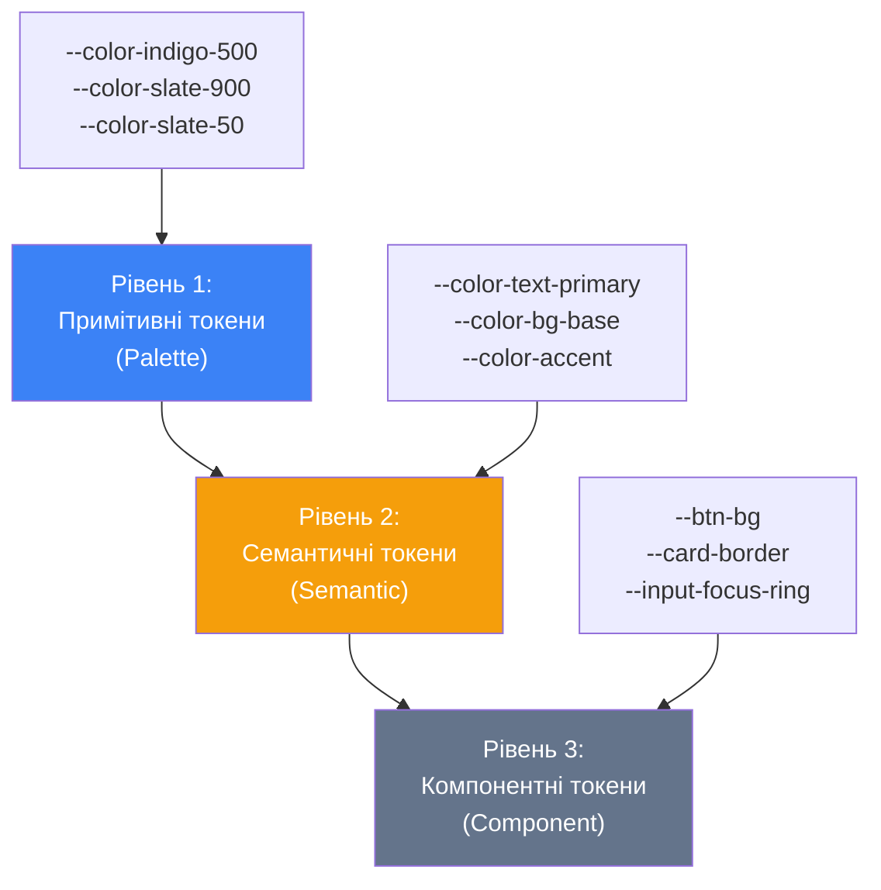
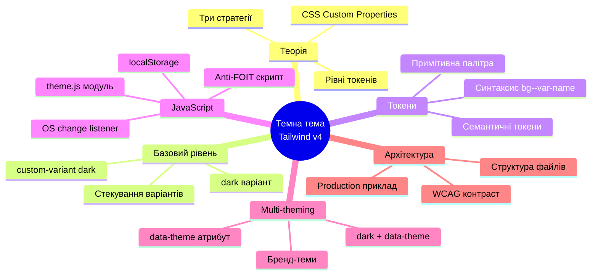

# Темна тема та система дизайн-токенів у Tailwind v4

## Вступ: чому темна тема — це не просто «інвертувати кольори»

Темна тема стала стандартною вимогою сучасного веб-інтерфейсу. Однак більшість розробників підходять до її реалізації надто спрощено: додають клас `dark:` до кожного кольорового класу і вважають роботу завершеною. Такий підхід, хоча й функціональний у малих масштабах, породжує низку серйозних архітектурних проблем у міру зростання проєкту.

Справжня темна тема — це **система дизайн-токенів**, де кожне кольорове рішення описане семантично, а не конкретним відтінком. Замість того, щоб думати «цей текст `slate-900` на світлому, а `slate-100` на темному» — ви думаєте «це `--color-text-primary`, і він автоматично адаптується до активної теми». Один клас у HTML. Нуль `dark:`-дублікатів.

У цій статті ми збудуємо повноцінну систему тем із нуля, пояснюючи кожне рішення з точки зору архітектури та практичного застосування.

::note
Ця стаття передбачає знайомство з матеріалом попередніх статей, зокрема з директивою `@theme` (стаття 05) та варіантами (стаття 06). Якщо ви ще не читали їх — рекомендуємо зробити це перед тим, як продовжувати.
::

---

## Частина І. Теоретична основа

### 1.1. CSS Custom Properties як рушій динамічних тем

Перш ніж говорити про Tailwind, необхідно розібратися з механізмом, на якому побудована будь-яка сучасна система тем — **CSS Custom Properties** (або CSS-змінні).

CSS Custom Properties — це змінні, оголошені у CSS та доступні по всьому дереву DOM. На відміну від препроцесорних змінних (Sass, Less), які розгортаються під час компіляції і є статичними, CSS Custom Properties **живуть у браузері** та можуть змінюватися під час виконання.

Базовий синтаксис:

```css
/* Оголошення — завжди починається з двох дефісів */
:root {
    --color-text: oklch(0.15 0.02 270);
}

/* Використання — через функцію var() */
p {
    color: var(--color-text);
}
```

Коли ви змінюєте значення `--color-text` (наприклад, перемикаєте клас на `:root`), **всі** елементи, що використовують `var(--color-text)`, миттєво оновлюються — без перезавантаження сторінки і без JavaScript-маніпуляцій зі стилями кожного елемента окремо.

::tip
Саме ця властивість CSS Custom Properties робить їх ідеальним інструментом для тематизації: ви змінюєте одну точку — і вся система реагує автоматично.
::

#### Успадкування та каскад

CSS Custom Properties підпорядковуються **каскаду та успадкуванню** CSS так само, як і звичайні властивості. Це означає:

```css
:root {
    --color-accent: oklch(0.585 0.233 277); /* індиго */
}

.card-promo {
    /* Локальне перевизначення — впливає тільки на нащадків .card-promo */
    --color-accent: oklch(0.72 0.19 50); /* помаранчевий */
}
```

::html-preview{tailwind}

```html
<!DOCTYPE html>
<html lang="uk">
<head>
<meta charset="UTF-8">
<script src="https://cdn.tailwindcss.com"></script>
<link href="https://fonts.googleapis.com/css2?family=Inter:wght@400;500;600;700&display=swap" rel="stylesheet">
<style>
    :root {
        --color-accent: oklch(0.585 0.233 277); /* Indigo */
    }

    .card-promo {
        /* Local variable override */
        --color-accent: oklch(0.72 0.19 50); /* Orange */
    }

    /* Apply colors dynamically using custom properties */
    .dynamic-bg {
        background-color: var(--color-accent);
    }
    .dynamic-text {
        color: var(--color-accent);
    }
    .dynamic-border {
        border-color: var(--color-accent);
    }
</style>
</head>
<body class="p-6 bg-slate-50" style="font-family: 'Inter', system-ui, sans-serif;">
    <div class="max-w-2xl mx-auto space-y-6">
        <p class="text-xs font-bold text-slate-400 uppercase tracking-widest text-center">CSS Variables Cascade & Inheritance</p>
        
        <div class="grid grid-cols-1 md:grid-cols-2 gap-6">
            <!-- Card 1: Default (Inherited Root Variables) -->
            <div class="bg-white rounded-2xl border border-slate-200 p-5 shadow-sm space-y-4 relative overflow-hidden">
                <div class="absolute top-3 right-3 text-[10px] font-bold text-slate-400 bg-slate-100 px-2 py-0.5 rounded">
                    Default Card
                </div>
                <div class="flex items-center gap-3">
                    <div class="w-10 h-10 rounded-xl dynamic-bg flex items-center justify-center text-white font-bold text-sm">
                        ★
                    </div>
                    <div>
                        <h4 class="text-sm font-bold text-slate-900">Стандартний тариф</h4>
                        <p class="text-xs text-slate-500">Використовує акцент з :root</p>
                    </div>
                </div>
                <div class="border-t border-slate-100 pt-3">
                    <p class="text-xs text-slate-600 leading-normal">
                        Ця картка успадковує акцентний колір <span class="font-bold dynamic-text">Indigo</span> безпосередньо з кореневого елемента сторінки.
                    </p>
                </div>
                <button class="dynamic-bg hover:opacity-90 active:scale-95 text-white font-semibold text-xs py-2 w-full rounded-xl transition-all">
                    Вибрати тариф
                </button>
            </div>

            <!-- Card 2: Promo (Overridden Local Variable) -->
            <div class="card-promo bg-white rounded-2xl border-2 dynamic-border p-5 shadow-sm space-y-4 relative overflow-hidden">
                <div class="absolute top-3 right-3 text-[10px] font-bold text-white dynamic-bg px-2 py-0.5 rounded">
                    Promo Card
                </div>
                <div class="flex items-center gap-3">
                    <div class="w-10 h-10 rounded-xl dynamic-bg flex items-center justify-center text-white font-bold text-sm">
                        🔥
                    </div>
                    <div>
                        <h4 class="text-sm font-bold text-slate-900">Промо пропозиція</h4>
                        <p class="text-xs text-slate-500">Локальне перевизначення</p>
                    </div>
                </div>
                <div class="border-t border-slate-100 pt-3">
                    <p class="text-xs text-slate-600 leading-normal">
                        Ця картка перевизначає акцентний колір на <span class="font-bold dynamic-text">Orange</span>. Жоден HTML клас нащадків не мінявся!
                    </p>
                </div>
                <button class="dynamic-bg hover:opacity-90 active:scale-95 text-white font-semibold text-xs py-2 w-full rounded-xl transition-all">
                    Активувати промо
                </button>
            </div>
        </div>
    </div>
</body>
</html>
```

::

Елемент всередині `.card-promo`, що використовує `var(--color-accent)`, отримає помаранчевий колір. Елемент поза `.card-promo` — індиго. Це фундаментальна поведінка, яку ми пізніше використаємо для **multi-theming**.

---

### 1.2. Семантичні токени проти примітивних токенів

Будь-яка зріла дизайн-система розрізняє два рівні токенів:

**Примітивні токени** (primitive tokens) — це конкретні значення кольорів, розмірів, відступів. Вони описують «що є», а не «навіщо»:

```css
--color-indigo-500: oklch(0.585 0.233 277.117);
--color-slate-900: oklch(0.129 0.042 264.695);
--color-slate-50: oklch(0.984 0.003 247.858);
```

**Семантичні токени** (semantic tokens) — це аліаси, що описують призначення. Вони посилаються на примітивні токени і відповідають на питання «навіщо використовується цей колір»:

```css
--color-text-primary: var(--color-slate-900);   /* основний текст */
--color-text-muted: var(--color-slate-500);     /* другорядний текст */
--color-bg-base: var(--color-white);            /* фон сторінки */
--color-bg-surface: var(--color-slate-50);      /* фон карток */
--color-border: var(--color-slate-200);         /* рамки */
--color-accent: var(--color-indigo-500);        /* акцентний колір */
```

Коли перемикається темна тема — змінюються **лише семантичні токени**:

```css
.dark {
    --color-text-primary: var(--color-slate-50);
    --color-text-muted: var(--color-slate-400);
    --color-bg-base: oklch(0.13 0.03 270);
    --color-bg-surface: oklch(0.19 0.03 270);
    --color-border: oklch(0.28 0.02 270);
    --color-accent: var(--color-indigo-400); /* трохи яскравіший для темного фону */
}
```

Компонент у HTML використовує лише семантичні токени — і **ніколи** не знає, яка тема активна:

```html
<p class="text-[--color-text-primary]">Це завжди правильний колір</p>
```

::note
Цей підхід повністю усуває необхідність писати `dark:text-slate-100` разом з `text-slate-900` для кожного текстового елемента. Один клас із семантичним токеном — і він сам знає, яким бути у будь-якій темі.
::

---

### 1.3. Три стратегії реалізації темної теми

Перед тим як переходити до коду, важливо визначитися зі стратегією. У Tailwind v4 та сучасному CSS існують три підходи:

::card-group

::card{title="Стратегія 1: Медіазапит prefers-color-scheme" icon="i-heroicons-computer-desktop"}

Тема визначається **системними налаштуваннями** користувача. CSS-медіазапит `@media (prefers-color-scheme: dark)` автоматично застосовує темні стилі, якщо система налаштована на темний режим.

**Переваги:** повністю автоматично, не потребує JavaScript, найдоступніший підхід.

**Недоліки:** користувач не може змінити тему на сайті незалежно від системних налаштувань.

::

::card{title="Стратегія 2: Клас на кореневому елементі" icon="i-heroicons-code-bracket"}

Темна тема активується додаванням класу `.dark` (або атрибута `data-theme="dark"`) до елемента `<html>`. JavaScript перемикає цей клас.

**Переваги:** повний контроль, легко зберігати у `localStorage`, підтримка ручного перемикання.

**Недоліки:** потребує JavaScript для початкового читання localStorage, можливий «спалах» неправильної теми при завантаженні.

::

::card{title="Стратегія 3: Гібридний підхід (рекомендований)" icon="i-heroicons-sparkles"}

Поєднує обидві стратегії: за замовчуванням слухає `prefers-color-scheme`, але якщо користувач явно обрав тему — зберігає вибір у `localStorage` та застосовує клас на `<html>`.

**Переваги:** найкраща UX: поважає системні налаштування, але дає можливість ручного вибору.

**Недоліки:** складніша реалізація, але варта зусиль для production.

::

::

У цій статті ми реалізуємо **гібридний підхід** — від простого до складного, пояснюючи кожен крок.

---

## Частина ІІ. Базовий `dark:` варіант у Tailwind v4

### 2.1. Як працює `dark:` у Tailwind

Перш за все, розберемо найпростіший механізм — вбудований варіант `dark:`.

У Tailwind CSS варіант `dark:` генерує CSS-правило, що застосовується лише за певної умови. За замовчуванням у Tailwind v4 ця умова — **CSS медіазапит**:

```css
/* Що генерує Tailwind для класу dark:bg-slate-900 */
@media (prefers-color-scheme: dark) {
    .dark\:bg-slate-900 {
        background-color: oklch(0.129 0.042 264.695);
    }
}
```

Написавши в HTML:

```html
<body class="bg-white dark:bg-slate-900">
```

Ви отримуєте елемент, що автоматично змінює фон залежно від системних налаштувань користувача. Жодного JavaScript.

#### Стекування `dark:` з іншими варіантами

Варіант `dark:` вільно комбінується з будь-якими іншими варіантами. Порядок написання — від зовнішнього контексту до конкретної утиліти:

```html
<!-- dark + hover -->
<button class="bg-indigo-600 hover:bg-indigo-700 dark:bg-indigo-500 dark:hover:bg-indigo-400">
    Кнопка
</button>

<!-- dark + responsive + hover -->
<div class="text-slate-900 md:text-slate-700 dark:text-slate-100 dark:md:text-slate-200">
    Текст
</div>

<!-- dark + group-hover -->
<div class="group">
    <span class="text-slate-600 group-hover:text-indigo-600 dark:text-slate-400 dark:group-hover:text-indigo-400">
        Реакція на hover батька в темній темі
    </span>
</div>
```

::html-preview{tailwind}

```html
<!DOCTYPE html>
<html lang="uk">
<head>
<meta charset="UTF-8">
<script src="https://cdn.tailwindcss.com"></script>
<link href="https://fonts.googleapis.com/css2?family=Inter:wght@400;500;600;700&display=swap" rel="stylesheet">
<style>
    @custom-variant dark (&:is(.dark *));
</style>
</head>
<body class="p-6 bg-slate-50" style="font-family: 'Inter', system-ui, sans-serif;">
    <div class="max-w-md mx-auto bg-white rounded-2xl border border-slate-200 p-6 shadow-sm space-y-6">
        <div class="flex items-center justify-between border-b border-slate-100 pb-3">
            <p class="text-xs font-bold text-slate-400 uppercase tracking-widest">Stacked Variants Playground</p>
            
            <!-- Dark Mode Toggle -->
            <button onclick="document.getElementById('playground-wrapper').classList.toggle('dark'); updateToggleBtn(this)" 
                    class="px-3 py-1 bg-slate-100 hover:bg-slate-200 text-slate-700 dark:bg-slate-800 dark:text-white dark:hover:bg-slate-700 text-xs font-semibold rounded-lg transition-all">
                🌙 Ввімкнути темну
            </button>
        </div>

        <!-- Playground Wrapper -->
        <div id="playground-wrapper" class="space-y-6 p-4 rounded-xl border border-slate-100 bg-slate-50/50 transition-colors duration-300">
            <!-- 1. dark + hover button -->
            <div class="space-y-2">
                <p class="text-[10px] font-bold text-slate-400 uppercase">1. dark + hover</p>
                <button class="w-full inline-flex items-center justify-center gap-2 px-5 py-2.5 bg-indigo-600 hover:bg-indigo-700 active:scale-95 text-white font-semibold rounded-xl transition-all text-sm shadow-sm dark:bg-indigo-500 dark:hover:bg-indigo-400">
                    Інтерактивна кнопка
                </button>
            </div>

            <!-- 2. dark + responsive + hover -->
            <div class="space-y-2">
                <p class="text-[10px] font-bold text-slate-400 uppercase">2. dark + responsive + hover</p>
                <div class="text-slate-900 md:text-slate-700 dark:text-slate-100 dark:md:text-slate-200 font-semibold text-center hover:underline cursor-pointer select-none">
                    Адаптивний текст (змінює відтінок на md екранах)
                </div>
            </div>

            <!-- 3. dark + group-hover -->
            <div class="space-y-2">
                <p class="text-[10px] font-bold text-slate-400 uppercase">3. dark + group-hover</p>
                <div class="group bg-white dark:bg-slate-900 border border-slate-200 dark:border-slate-800 p-4 rounded-xl cursor-pointer hover:shadow-md transition-all text-center">
                    <span class="text-slate-600 group-hover:text-indigo-600 dark:text-slate-400 dark:group-hover:text-indigo-400 font-medium transition-colors text-sm">
                        Реакція на hover батька в темній темі
                    </span>
                </div>
            </div>
        </div>
    </div>

    <script>
        function updateToggleBtn(btn) {
            const isDark = document.getElementById('playground-wrapper').classList.contains('dark');
            btn.textContent = isDark ? '☀️ Ввімкнути світлу' : '🌙 Ввімкнути темну';
        }
    </script>
</body>
</html>
```

::

::warning
Важливо розуміти: кожна пара `{клас} dark:{клас}` подвоює кількість класів у HTML. На великому проєкті це може призвести до надзвичайно довгих рядків класів, що важко читати та підтримувати. Саме тому для серйозних проєктів рекомендується підхід із семантичними токенами, описаний у Частині ІІІ.
::

---

### 2.2. Перемикання на клас: `@custom-variant dark`

Щоб `dark:` реагував не на медіазапит, а на CSS-клас (необхідно для ручного перемикання теми), у Tailwind v4 використовується директива `@custom-variant`.

Додайте у ваш головний CSS-файл одразу після `@import 'tailwindcss'`:

```css [src/styles/main.css]
@import 'tailwindcss';

/* Перевизначення поведінки dark: варіанту */
/* Тепер dark: спрацьовує, коли будь-який батьківський елемент має клас .dark */
@custom-variant dark (&:is(.dark *));
```

Тепер `dark:bg-slate-900` генерує:

```css
/* Замість @media — селектор класу */
.dark .dark\:bg-slate-900 {
    background-color: oklch(0.129 0.042 264.695);
}
```

А HTML виглядає так:

```html
<html class="dark">
    <body>
        <!-- dark: класи тепер активні -->
        <div class="bg-white dark:bg-slate-900">
            Темний фон завдяки .dark на <html>
        </div>
    </body>
</html>
```

Для перемикання теми — маніпулюємо класом на `<html>`:

```javascript
// Увімкнути темну тему
document.documentElement.classList.add('dark')

// Вимкнути темну тему
document.documentElement.classList.remove('dark')

// Перемикати
document.documentElement.classList.toggle('dark')
```

::tip
Використання класу на `<html>` (а не на `<body>` чи іншому елементі) є загальноприйнятою практикою. Це дозволяє стилізувати `<html>` та `<body>` теж, а також гарантує, що темна тема охоплює абсолютно всі елементи сторінки.
::

---

### 2.3. Живий приклад: базова темна тема через `dark:`

Подивімося на мінімальний повний приклад — проста картка з підтримкою темної теми через клас:

::html-preview{tailwind}

```html
<!DOCTYPE html>
<html lang="uk">
<head>
    <meta charset="UTF-8">
    <script src="https://cdn.tailwindcss.com/4.0"></script>
    <style type="text/tailwindcss">
        @custom-variant dark (&:is(.dark *));
    </style>
</head>
<body class="bg-slate-100 dark:bg-slate-950 min-h-screen flex items-center justify-center p-8 transition-colors duration-300"
      style="font-family: system-ui, sans-serif;">

    <!-- Перемикач теми -->
    <button
        id="theme-toggle"
        onclick="document.documentElement.classList.toggle('dark')"
        class="fixed top-4 right-4 size-10 rounded-full bg-white dark:bg-slate-800
               border border-slate-200 dark:border-slate-700
               flex items-center justify-center text-lg
               hover:shadow-md transition-all"
        aria-label="Перемкнути тему"
    >
        <span class="dark:hidden">🌙</span>
        <span class="hidden dark:block">☀️</span>
    </button>

    <!-- Картка -->
    <div class="bg-white dark:bg-slate-900 rounded-2xl shadow-lg dark:shadow-slate-900/50
                border border-slate-100 dark:border-slate-800 p-6 max-w-sm w-full
                transition-colors duration-300">

        <div class="flex items-center gap-3 mb-4">
            <div class="size-10 rounded-xl bg-indigo-600 dark:bg-indigo-500
                        flex items-center justify-center text-white font-bold text-sm">
                IK
            </div>
            <div>
                <p class="text-sm font-bold text-slate-900 dark:text-slate-50">Іван Кравченко</p>
                <p class="text-xs text-slate-500 dark:text-slate-400">Frontend Developer</p>
            </div>
        </div>

        <p class="text-sm text-slate-600 dark:text-slate-300 leading-relaxed">
            Розробляю інтерфейси на React та Tailwind CSS. Захоплений сучасним CSS та дизайн-системами.
        </p>

        <div class="flex gap-2 mt-4">
            <span class="px-2 py-0.5 bg-indigo-100 dark:bg-indigo-900/50
                         text-indigo-700 dark:text-indigo-300
                         text-xs font-semibold rounded-md">React</span>
            <span class="px-2 py-0.5 bg-violet-100 dark:bg-violet-900/50
                         text-violet-700 dark:text-violet-300
                         text-xs font-semibold rounded-md">Tailwind</span>
        </div>

        <button class="mt-5 w-full py-2 bg-indigo-600 hover:bg-indigo-700
                       dark:bg-indigo-500 dark:hover:bg-indigo-400
                       text-white text-sm font-semibold rounded-xl
                       transition-colors">
            Зв'язатися
        </button>
    </div>

</body>
</html>
```

::

Натиснувши кнопку 🌙, ви перемикаєте клас `.dark` на `<html>` — і вся картка змінює зовнішній вигляд. Зверніть увагу, скільки `dark:`-пар у кожному елементі. Для однієї картки це ще прийнятно, але для цілої сторінки — код стає важко підтримуваним.

---

## Частина ІІІ. Система семантичних токенів: правильний підхід

### 3.1. Архітектура токенів

Зріла система токенів складається з трьох рівнів:

::mermaid



::

**Рівень 1: Примітивна палітра** — всі доступні кольори у всіх відтінках. Це «словник» кольорів системи. Визначається один раз у `@theme` і не змінюється між темами.

**Рівень 2: Семантичні токени** — аліаси з описовими іменами (`text-primary`, `bg-surface`, `border-default`). Саме вони змінюються при перемиканні теми.

**Рівень 3: Компонентні токени** — специфічні для компонентів (`--btn-primary-bg`, `--card-shadow`). Опціональний рівень для складних систем.

Для більшості проєктів достатньо перших двох рівнів.

---

### 3.2. Визначення примітивної палітри в `@theme`

Розпочнемо з побудови примітивної палітри. Всі кольори визначаємо у `@theme` — так Tailwind автоматично генерує для них utility-класи:

```css [src/styles/theme/colors.css]
@theme {
    /* ===== ПРИМІТИВНА ПАЛІТРА ===== */

    /* Нейтральна шкала (основа для тексту, фонів, рамок) */
    --color-neutral-50:  oklch(0.984 0.003 247.858);
    --color-neutral-100: oklch(0.961 0.005 264.531);
    --color-neutral-200: oklch(0.929 0.008 264.542);
    --color-neutral-300: oklch(0.872 0.012 264.052);
    --color-neutral-400: oklch(0.704 0.026 264.436);
    --color-neutral-500: oklch(0.554 0.034 264.364);
    --color-neutral-600: oklch(0.446 0.030 264.139);
    --color-neutral-700: oklch(0.373 0.034 259.733);
    --color-neutral-800: oklch(0.279 0.029 256.848);
    --color-neutral-900: oklch(0.208 0.042 265.755);
    --color-neutral-950: oklch(0.130 0.028 261.692);

    /* Акцентний колір: Indigo (бренд) */
    --color-indigo-50:  oklch(0.962 0.018 272.314);
    --color-indigo-100: oklch(0.930 0.034 272.788);
    --color-indigo-200: oklch(0.870 0.065 274.039);
    --color-indigo-300: oklch(0.785 0.115 274.713);
    --color-indigo-400: oklch(0.673 0.182 276.935);
    --color-indigo-500: oklch(0.585 0.233 277.117);
    --color-indigo-600: oklch(0.511 0.262 276.966);
    --color-indigo-700: oklch(0.457 0.240 277.023);
    --color-indigo-800: oklch(0.398 0.195 277.366);
    --color-indigo-900: oklch(0.359 0.144 278.697);
    --color-indigo-950: oklch(0.257 0.090 281.288);

    /* Допоміжні кольори для статусів */
    --color-success-400: oklch(0.748 0.160 145.439);
    --color-success-500: oklch(0.652 0.168 145.497);
    --color-success-600: oklch(0.540 0.145 146.748);
    --color-success-100: oklch(0.962 0.044 156.743);
    --color-success-900: oklch(0.270 0.085 154.724);

    --color-warning-400: oklch(0.854 0.163 91.936);
    --color-warning-500: oklch(0.769 0.188 70.080);
    --color-warning-100: oklch(0.973 0.071 103.193);
    --color-warning-900: oklch(0.476 0.144 67.110);

    --color-error-400: oklch(0.704 0.191 22.182);
    --color-error-500: oklch(0.637 0.237 25.331);
    --color-error-600: oklch(0.577 0.245 27.325);
    --color-error-100: oklch(0.936 0.032 17.717);
    --color-error-900: oklch(0.391 0.155 27.518);
}
```

::note
Значення OKLCH у наведеному прикладі відповідають тим самим кольорам, що використовує Tailwind за замовчуванням (`slate`, `indigo`, `emerald`, `amber`, `red`). Якщо ви хочете повністю власну палітру — визначте свої значення OKLCH. Про те, як підбирати кольори в OKLCH, читайте у статті 07.
::

---

### 3.3. Семантичні токени та перемикання теми

Тепер визначаємо семантичні токени — окремо для світлої та темної теми. Їх **не** варто класти у `@theme`, оскільки вони не є частиною дизайн-системи як такої — вони змінюються залежно від контексту:

```css [src/styles/theme/semantic.css]
/* ===== СЕМАНТИЧНІ ТОКЕНИ: СВІТЛА ТЕМА (за замовчуванням) ===== */
:root {
    /* --- Фони --- */
    --color-bg-base:     var(--color-neutral-50);   /* Фон сторінки */
    --color-bg-surface:  oklch(1 0 0);               /* Фон карток, панелей */
    --color-bg-elevated: oklch(1 0 0);               /* Фон модальних вікон */
    --color-bg-inset:    var(--color-neutral-100);   /* Фон вкладених елементів */
    --color-bg-muted:    var(--color-neutral-100);   /* Приглушений фон */

    /* --- Текст --- */
    --color-text-primary:   var(--color-neutral-900);  /* Основний текст */
    --color-text-secondary: var(--color-neutral-700);  /* Другорядний текст */
    --color-text-muted:     var(--color-neutral-500);  /* Приглушений текст */
    --color-text-disabled:  var(--color-neutral-400);  /* Неактивний текст */
    --color-text-inverse:   oklch(1 0 0);              /* Текст на темному фоні */

    /* --- Рамки --- */
    --color-border-default:  var(--color-neutral-200); /* Стандартна рамка */
    --color-border-strong:   var(--color-neutral-300); /* Виражена рамка */
    --color-border-focus:    var(--color-indigo-500);  /* Рамка фокусу */

    /* --- Акцент (бренд) --- */
    --color-accent:          var(--color-indigo-500);
    --color-accent-hover:    var(--color-indigo-600);
    --color-accent-light:    var(--color-indigo-50);
    --color-accent-text:     var(--color-indigo-700);

    /* --- Статуси --- */
    --color-status-success-bg:   var(--color-success-100);
    --color-status-success-text: var(--color-success-600);
    --color-status-warning-bg:   var(--color-warning-100);
    --color-status-warning-text: var(--color-warning-900);
    --color-status-error-bg:     var(--color-error-100);
    --color-status-error-text:   var(--color-error-600);
}

/* ===== СЕМАНТИЧНІ ТОКЕНИ: ТЕМНА ТЕМА ===== */
/* Активується при наявності класу .dark на батьківському елементі */
.dark {
    /* --- Фони --- */
    --color-bg-base:     oklch(0.113 0.021 261);   /* Найтемніший — фон сторінки */
    --color-bg-surface:  oklch(0.179 0.027 261);   /* Трохи світліший — картки */
    --color-bg-elevated: oklch(0.225 0.025 264);   /* Ще світліший — модальні */
    --color-bg-inset:    oklch(0.145 0.025 262);   /* Темніший вкладений */
    --color-bg-muted:    oklch(0.152 0.022 262);   /* Приглушений */

    /* --- Текст --- */
    --color-text-primary:   var(--color-neutral-50);   /* Майже білий */
    --color-text-secondary: var(--color-neutral-200);  /* Світло-сірий */
    --color-text-muted:     var(--color-neutral-400);  /* Сірий */
    --color-text-disabled:  var(--color-neutral-600);  /* Темніший сірий */
    --color-text-inverse:   var(--color-neutral-900);  /* Темний текст */

    /* --- Рамки --- */
    --color-border-default:  oklch(0.300 0.025 264);   /* Темна рамка */
    --color-border-strong:   oklch(0.380 0.025 264);   /* Виразніша темна рамка */
    --color-border-focus:    var(--color-indigo-400);  /* Яскравіший фокус */

    /* --- Акцент (бренд) — трохи яскравіший для темного фону --- */
    --color-accent:       var(--color-indigo-400);
    --color-accent-hover: var(--color-indigo-300);
    --color-accent-light: oklch(0.257 0.090 281) / 0.2; /* приглушений indigo-950 */
    --color-accent-text:  var(--color-indigo-300);

    /* --- Статуси --- */
    --color-status-success-bg:   var(--color-success-900);
    --color-status-success-text: var(--color-success-400);
    --color-status-warning-bg:   oklch(0.476 0.144 67) / 0.2;
    --color-status-warning-text: var(--color-warning-400);
    --color-status-error-bg:     oklch(0.391 0.155 27) / 0.2;
    --color-status-error-text:   var(--color-error-400);
}
```

::tip
Зверніть увагу на закономірність: у темній темі текст стає світлим, а фони — темними. Але важливо, що ієрархія зберігається: `bg-surface` завжди трохи світліший за `bg-base`, `text-secondary` завжди менш контрастний за `text-primary`. Це забезпечує читабельність та візуальну ієрархію незалежно від теми.
::

---

### 3.4. Використання семантичних токенів у Tailwind v4

У Tailwind v4 є два способи використання CSS-змінних у класах.

**Спосіб 1: Синтаксис квадратних дужок** (arbitrary values):

```html
<div class="bg-[var(--color-bg-surface)] text-[var(--color-text-primary)]">
    ...
</div>
```

**Спосіб 2: Синтаксис круглих дужок з дефісами** (новинка Tailwind v4):

```html
<div class="bg-(--color-bg-surface) text-(--color-text-primary)">
    ...
</div>
```

Другий синтаксис є **скороченням**, введеним у Tailwind v4. Він коротший та читабельніший. `bg-(--color-bg-surface)` еквівалентний `bg-[var(--color-bg-surface)]`.

::note
Синтаксис `(--var-name)` — це справжня новинка Tailwind v4, яка суттєво спрощує роботу з CSS Custom Properties. Варто запам'ятати цей патерн — він знадобиться вам постійно у production-коді.
::

Відтепер компонент картки, що раніше виглядав так:

```html
<!-- ❌ Підхід dark: — багато класів, важко підтримувати -->
<div class="bg-white dark:bg-slate-900
            text-slate-900 dark:text-slate-50
            border border-slate-200 dark:border-slate-800
            shadow-sm">
```

Тепер виглядає так:

```html
<!-- ✅ Підхід семантичних токенів — лаконічно та підтримувано -->
<div class="bg-(--color-bg-surface)
            text-(--color-text-primary)
            border border-(--color-border-default)
            shadow-sm">
```

::html-preview{tailwind}

```html
<!DOCTYPE html>
<html lang="uk">
<head>
<meta charset="UTF-8">
<script src="https://cdn.tailwindcss.com"></script>
<link href="https://fonts.googleapis.com/css2?family=Inter:wght@400;500;600;700&display=swap" rel="stylesheet">
<style>
    @custom-variant dark (&:is(.dark *));

    /* Root and dark mode variables mimicking semantic tokens */
    :root {
        --color-bg-base: oklch(0.984 0.003 247.858);
        --color-bg-surface: oklch(1 0 0);
        --color-text-primary: oklch(0.208 0.042 265.755);
        --color-text-muted: oklch(0.554 0.034 264.364);
        --color-border-default: oklch(0.929 0.008 264.542);
        --color-accent: oklch(0.585 0.233 277);
    }
    .dark {
        --color-bg-base: oklch(0.113 0.021 261);
        --color-bg-surface: oklch(0.179 0.027 261);
        --color-text-primary: oklch(0.984 0.003 247.858);
        --color-text-muted: oklch(0.704 0.026 264.436);
        --color-border-default: oklch(0.300 0.025 264);
        --color-accent: oklch(0.673 0.182 276);
    }
</style>
</head>
<body class="p-6 bg-slate-50" style="font-family: 'Inter', system-ui, sans-serif;">
    <div id="comparison-wrapper" class="max-w-2xl mx-auto space-y-6">
        <div class="flex items-center justify-between border-b border-slate-200 pb-3">
            <p class="text-xs font-bold text-slate-400 uppercase tracking-widest">Semantic Tokens vs Raw dark: Classes</p>
            <button onclick="document.getElementById('comparison-wrapper').classList.toggle('dark'); updateToggleBtn(this)" 
                    class="px-3 py-1 bg-slate-100 hover:bg-slate-200 text-slate-700 dark:bg-slate-800 dark:text-white dark:hover:bg-slate-700 text-xs font-semibold rounded-lg transition-all">
                🌙 Ввімкнути темну
            </button>
        </div>

        <div class="grid grid-cols-1 md:grid-cols-2 gap-6">
            <!-- Left Card: Raw dark: classes -->
            <div class="space-y-3">
                <div class="flex justify-between items-center px-1">
                    <span class="text-xs font-bold text-red-500 flex items-center gap-1">❌ Підхід dark:</span>
                    <span class="text-[10px] text-slate-400 bg-slate-100 px-2 py-0.5 rounded font-mono">11 класів стилізації теми</span>
                </div>
                <div class="bg-white dark:bg-slate-900 text-slate-900 dark:text-slate-50 border border-slate-200 dark:border-slate-800 shadow-sm rounded-2xl p-5 space-y-3 transition-colors duration-250">
                    <h4 class="font-bold text-sm">Звичайні класи</h4>
                    <p class="text-xs text-slate-500 dark:text-slate-400 leading-normal">
                        Кожен колір дублюється парою класів. Велика кількість коду ускладнює читання структури.
                    </p>
                    <div class="pt-2 border-t border-slate-100 dark:border-slate-800 flex justify-between items-center text-[10px] text-slate-400 dark:text-slate-500 font-mono">
                        <span>class="..."</span>
                        <span>v3 style</span>
                    </div>
                </div>
            </div>

            <!-- Right Card: Semantic Tokens -->
            <div class="space-y-3">
                <div class="flex justify-between items-center px-1">
                    <span class="text-xs font-bold text-emerald-600 flex items-center gap-1">✅ Семантичні токени</span>
                    <span class="text-[10px] text-slate-400 bg-slate-100 dark:bg-slate-800 dark:text-slate-400 px-2 py-0.5 rounded font-mono">4 класи стилізації теми</span>
                </div>
                <div class="bg-(--color-bg-surface) text-(--color-text-primary) border border-(--color-border-default) shadow-sm rounded-2xl p-5 space-y-3 transition-colors duration-250">
                    <h4 class="font-bold text-sm">Семантичний підхід</h4>
                    <p class="text-xs text-(--color-text-muted) leading-normal">
                        Використовуємо змінні. HTML залишається лаконічним, а адаптація відбувається на рівні CSS.
                    </p>
                    <div class="pt-2 border-t border-(--color-border-default) flex justify-between items-center text-[10px] text-(--color-text-muted) font-mono">
                        <span>class="..."</span>
                        <span>v4 style</span>
                    </div>
                </div>
            </div>
        </div>
    </div>

    <script>
        function updateToggleBtn(btn) {
            const isDark = document.getElementById('comparison-wrapper').classList.contains('dark');
            btn.textContent = isDark ? '☀️ Ввімкнути світлу' : '🌙 Ввімкнути темну';
        }
    </script>
</body>
</html>
```

::

Один компонент. Жодних `dark:`-дублікатів. Тема змінюється автоматично через CSS Custom Properties.

---

### 3.5. Реєстрація семантичних токенів у `@theme`

Якщо ви хочете, щоб семантичні токени також генерували utility-класи Tailwind (наприклад, `bg-bg-surface`, `text-text-primary`), зареєструйте їх у `@theme`:

```css [src/styles/main.css]
@import 'tailwindcss';

@theme {
    /* Реєстрація семантичних токенів як Tailwind-утиліт */
    /* Тепер генеруються: bg-bg-base, bg-bg-surface, text-text-primary, тощо */
    --color-bg-base:          initial; /* Tailwind побачить цей токен */
    --color-bg-surface:       initial;
    --color-bg-elevated:      initial;
    --color-bg-inset:         initial;
    --color-text-primary:     initial;
    --color-text-secondary:   initial;
    --color-text-muted:       initial;
    --color-border-default:   initial;
    --color-border-focus:     initial;
    --color-accent:           initial;
    --color-accent-hover:     initial;
    --color-status-success-bg: initial;
}
```

Але зачекайте — тут є тонкість. `@theme` з `initial` лише **реєструє** назву токену, але не дає йому значення. Справжні значення визначаються у `:root` та `.dark` через звичайні CSS-правила (як у попередньому розділі).

Альтернативно, можна взагалі відмовитися від `@theme` для семантичних токенів і просто використовувати синтаксис `bg-(--color-bg-surface)` — він працює з будь-якими CSS-змінними без реєстрації в `@theme`.

::tip
На практиці для невеликих команд часто зручніше використовувати `bg-(--color-bg-surface)` напряму. Для великих команд — реєстрація у `@theme` дає автодоповнення в IntelliSense: редактор бачить усі токени та підказує їх.
::

---

## Частина IV. JavaScript для керування темою

### 4.1. Мінімальний перемикач теми

Перш ніж реалізовувати складну систему, розберемо найпростіший варіант — перемикач без збереження стану. Він підходить для демонстрацій та прототипів:

```javascript
// theme-toggle.js — мінімальний перемикач
const toggle = () => {
    document.documentElement.classList.toggle('dark')
}
```

```html
<button onclick="toggle()">Перемкнути тему</button>
```

Цей підхід має критичний недолік: при перезавантаженні сторінки тема скидається до системної. Для реального застосунку необхідне збереження вибору користувача.

---

### 4.2. Зберігання вибору у `localStorage`

`localStorage` — це браузерне сховище типу «ключ-значення», що зберігає дані між сесіями. Запис і читання з нього є синхронними операціями та виконуються миттєво.

Реалізуємо повноцінний модуль керування темою:

```javascript [src/theme.js]
/**
 * Модуль керування темою.
 *
 * Підтримує три стани:
 *   'light'  — примусово світла тема
 *   'dark'   — примусово темна тема
 *   'system' — відповідає системним налаштуванням (за замовчуванням)
 */

const STORAGE_KEY = 'app-theme'
const ROOT = document.documentElement

// --- Читання ---

/**
 * Повертає явний вибір користувача або null, якщо вибору не було.
 * @returns {'light' | 'dark' | null}
 */
function getSavedTheme() {
    return localStorage.getItem(STORAGE_KEY)
}

/**
 * Перевіряє, чи системна тема є темною.
 * @returns {boolean}
 */
function systemPrefersDark() {
    return window.matchMedia('(prefers-color-scheme: dark)').matches
}

/**
 * Визначає, яка тема має бути активна зараз.
 * Явний вибір користувача має пріоритет над системними налаштуваннями.
 * @returns {'light' | 'dark'}
 */
function getEffectiveTheme() {
    const saved = getSavedTheme()
    if (saved === 'light' || saved === 'dark') return saved
    return systemPrefersDark() ? 'dark' : 'light'
}

// --- Застосування ---

/**
 * Застосовує тему до DOM.
 * Клас .dark на <html> вмикає темну тему через @custom-variant dark.
 */
function applyTheme(theme) {
    if (theme === 'dark') {
        ROOT.classList.add('dark')
    } else {
        ROOT.classList.remove('dark')
    }

    // Зберігаємо в data-атрибуті для CSS та JS
    ROOT.setAttribute('data-theme', theme)
}

// --- Збереження ---

/**
 * Встановлює тему вручну та зберігає вибір у localStorage.
 * @param {'light' | 'dark' | 'system'} theme
 */
function setTheme(theme) {
    if (theme === 'system') {
        localStorage.removeItem(STORAGE_KEY)
        applyTheme(systemPrefersDark() ? 'dark' : 'light')
    } else {
        localStorage.setItem(STORAGE_KEY, theme)
        applyTheme(theme)
    }
}

/**
 * Перемикає між світлою та темною темою.
 * Якщо активна темна — переходить на світлу, і навпаки.
 */
function toggleTheme() {
    const current = getEffectiveTheme()
    setTheme(current === 'dark' ? 'light' : 'dark')
}

// --- Ініціалізація ---

/**
 * Ініціалізує систему тем.
 * Має викликатися якомога раніше, бажано в <head>.
 */
function initTheme() {
    applyTheme(getEffectiveTheme())

    // Слухаємо зміну системної теми
    // Якщо користувач не зробив явного вибору — реагуємо автоматично
    window.matchMedia('(prefers-color-scheme: dark)')
        .addEventListener('change', (e) => {
            if (!getSavedTheme()) {
                applyTheme(e.matches ? 'dark' : 'light')
            }
        })
}

// Публічний API
export { initTheme, setTheme, toggleTheme, getEffectiveTheme, getSavedTheme }
```

Використання у головному файлі:

```javascript [src/main.js]
import { initTheme, toggleTheme } from './theme.js'

// Ініціалізація якомога раніше
initTheme()

// Підключення перемикача
document.getElementById('theme-toggle')?.addEventListener('click', toggleTheme)
```

---

### 4.3. Проблема «спалаху» теми (Flash of Incorrect Theme)

**FOIT** (Flash of Incorrect Theme) — один із найнеприємніших артефактів при роботі з темами. Він виникає, коли:

1. Браузер починає відображати сторінку зі стандартними стилями (як правило, світла тема)
2. Завантажується JavaScript
3. JavaScript читає `localStorage` та застосовує темну тему
4. Відбувається **помітний стрибок** від світлого до темного

Цей стрибок відбувається лише на долі секунди, але помітний ока та дратує користувачів.

#### Вирішення: блокуючий скрипт у `<head>`

Єдиний надійний спосіб уникнути FOIT — виконати **синхронний** JavaScript у `<head>` **до** того, як браузер почне рендерити `<body>`. Такий скрипт блокує рендеринг, тому він має бути мінімальним та швидким:

```html [index.html]
<!DOCTYPE html>
<html lang="uk">
<head>
    <meta charset="UTF-8">
    <meta name="viewport" content="width=device-width, initial-scale=1.0">
    <title>Мій застосунок</title>

    <!--
        КРИТИЧНО: Цей скрипт виконується синхронно, до рендеру body.
        Він не повинен мати defer, async або type="module".
        Розмір: ~200 байт — практично не впливає на продуктивність.
    -->
    <script>
        (function() {
            var saved = localStorage.getItem('app-theme')
            var prefersDark = window.matchMedia('(prefers-color-scheme: dark)').matches
            var isDark = saved === 'dark' || (!saved && prefersDark)
            if (isDark) document.documentElement.classList.add('dark')
        })()
    </script>

    <link rel="stylesheet" href="/src/styles/main.css">
</head>
<body class="bg-(--color-bg-base) text-(--color-text-primary)">
    <!-- Сторінка рендериться вже з правильною темою -->
</body>
</html>
```

::warning
Скрипт навмисно написаний у форматі `var` та IIFE (Immediately Invoked Function Expression), а не `const`/`let` та стрілочних функцій. Це забезпечує сумісність зі старими браузерами, де цей скрипт може виконуватися до будь-яких поліфілів.
::

::note
У фреймворках на кшталт Nuxt або Next.js є власні механізми для вирішення FOIT. У Next.js це `next-themes`, у Nuxt — `useColorMode` з `@nuxtjs/color-mode`. Якщо ви використовуєте ці фреймворки — зверніться до їхньої документації замість реалізації власного рішення.
::

---

### 4.4. Компонент перемикача теми

Реалізуємо повноцінний UI-компонент перемикача з трьома станами: «Світла», «Темна», «Система»:

::html-preview{tailwind}

```html
<!DOCTYPE html>
<html lang="uk">
<head>
    <meta charset="UTF-8">
    <script>
        (function() {
            var saved = localStorage.getItem('app-theme')
            var prefersDark = window.matchMedia('(prefers-color-scheme: dark)').matches
            if (saved === 'dark' || (!saved && prefersDark)) {
                document.documentElement.classList.add('dark')
            }
        })()
    </script>
    <script src="https://cdn.tailwindcss.com/4.0"></script>
    <style type="text/tailwindcss">
        @custom-variant dark (&:is(.dark *));

        :root {
            --color-bg-base: oklch(0.984 0.003 247.858);
            --color-bg-surface: oklch(1 0 0);
            --color-text-primary: oklch(0.208 0.042 265.755);
            --color-text-muted: oklch(0.554 0.034 264.364);
            --color-border: oklch(0.929 0.008 264.542);
        }

        .dark {
            --color-bg-base: oklch(0.113 0.021 261);
            --color-bg-surface: oklch(0.179 0.027 261);
            --color-text-primary: oklch(0.984 0.003 247.858);
            --color-text-muted: oklch(0.704 0.026 264.436);
            --color-border: oklch(0.300 0.025 264);
        }
    </style>
</head>
<body class="bg-[--color-bg-base] min-h-screen flex items-center justify-center p-8 transition-colors duration-300"
      style="font-family: system-ui, sans-serif;">

<div class="flex flex-col items-center gap-6">
    <!-- Перемикач теми: три варіанти -->
    <div class="flex bg-[--color-bg-surface] border border-[--color-border] rounded-full p-1 gap-0.5"
         id="theme-switcher">
        <button data-theme-value="light"
                class="theme-btn px-4 py-1.5 rounded-full text-sm font-medium transition-all
                       text-[--color-text-muted]"
                onclick="selectTheme('light')">
            ☀️ Світла
        </button>
        <button data-theme-value="system"
                class="theme-btn px-4 py-1.5 rounded-full text-sm font-medium transition-all
                       text-[--color-text-muted]"
                onclick="selectTheme('system')">
            💻 Системна
        </button>
        <button data-theme-value="dark"
                class="theme-btn px-4 py-1.5 rounded-full text-sm font-medium transition-all
                       text-[--color-text-muted]"
                onclick="selectTheme('dark')">
            🌙 Темна
        </button>
    </div>

    <!-- Демонстраційна картка -->
    <div class="bg-[--color-bg-surface] border border-[--color-border] rounded-2xl p-6 max-w-xs w-full shadow-sm transition-colors duration-300">
        <p class="text-xs font-bold uppercase tracking-widest text-[--color-text-muted] mb-3">
            Поточна тема
        </p>
        <p class="text-2xl font-black text-[--color-text-primary]" id="current-theme-label">
            Визначається...
        </p>
        <p class="text-sm text-[--color-text-muted] mt-2 leading-relaxed">
            Цей текст та фон автоматично адаптуються до обраної теми через CSS Custom Properties.
        </p>
    </div>
</div>

<script>
    const STORAGE_KEY = 'app-theme'
    const ROOT = document.documentElement

    function getEffectiveTheme() {
        const saved = localStorage.getItem(STORAGE_KEY)
        if (saved === 'light' || saved === 'dark') return saved
        return window.matchMedia('(prefers-color-scheme: dark)').matches ? 'dark' : 'light'
    }

    function selectTheme(theme) {
        if (theme === 'system') {
            localStorage.removeItem(STORAGE_KEY)
        } else {
            localStorage.setItem(STORAGE_KEY, theme)
        }

        const effective = getEffectiveTheme()
        ROOT.classList.toggle('dark', effective === 'dark')
        updateUI(theme)
    }

    function updateUI(activeValue) {
        const effective = getEffectiveTheme()
        const labels = { light: '☀️ Світла', dark: '🌙 Темна', system: '💻 Системна' }

        document.getElementById('current-theme-label').textContent = labels[activeValue]
            + (activeValue === 'system' ? ` → ${effective === 'dark' ? '🌙' : '☀️'}` : '')

        document.querySelectorAll('.theme-btn').forEach(btn => {
            const isActive = btn.dataset.themeValue === activeValue
            btn.style.background = isActive ? (effective === 'dark' ? '#4338ca' : '#4f46e5') : ''
            btn.style.color = isActive ? '#ffffff' : ''
        })
    }

    // Ініціалізація
    const saved = localStorage.getItem(STORAGE_KEY) || 'system'
    updateUI(saved)
</script>

</body>
</html>
```

::

---

### 4.5. Слухання системної зміни теми

Важливий нюанс: якщо користувач обрав режим «Система», а потім змінив системну тему (наприклад, о 20:00 система автоматично перейшла у темний режим) — ваш застосунок має відреагувати без перезавантаження.

Для цього використовується `MediaQueryList.addEventListener`:

```javascript
// Відповідь на зміну системної теми
window.matchMedia('(prefers-color-scheme: dark)')
    .addEventListener('change', (event) => {
        // Реагуємо тільки якщо користувач не зробив явного вибору
        const saved = localStorage.getItem('app-theme')
        if (!saved) {
            const isDark = event.matches
            document.documentElement.classList.toggle('dark', isDark)
            console.log(`Системна тема змінилась на: ${isDark ? 'темна' : 'світла'}`)
        }
    })
```

::tip
Цей обробник варто додати під час `initTheme()` і зберегти посилання на нього, якщо вам колись знадобиться його видалити (`removeEventListener`). На практиці в більшості застосунків він живе протягом усієї сесії — видаляти не потрібно.
::

---

## Частина V. Складне: Multi-theming та компонентна ізоляція

### 5.1. Що таке multi-theming і коли він потрібен

Multi-theming (багатотемність) — це здатність застосунку підтримувати **більше двох тем** одночасно, або застосовувати різні теми до різних секцій сторінки незалежно.

Типові сценарії:

- **SaaS-платформа** з можливістю white-labeling: кожен клієнт має власну кольорову схему
- **Маркетинговий сайт** із різними кольоровими секціями (hero — темна, features — світла, pricing — brand-color)
- **Компонентна бібліотека** де кожен компонент має варіанти кольорів (`variant="primary"`, `variant="danger"`)

Механізм multi-theming заснований на тій самій поведінці CSS Custom Properties, що ми вже розглядали: значення змінних успадковуються від найближчого батька, де вони визначені.

---

### 5.2. Теми через `data-theme` атрибут

Найелегантніший підхід до multi-theming — використання атрибута `data-theme`:

```css [src/styles/themes/brands.css]
/* Тема: Ocean (синьо-бірюзова) */
[data-theme="ocean"] {
    --color-accent:       oklch(0.591 0.221 228); /* cyan-600 */
    --color-accent-hover: oklch(0.520 0.225 232); /* cyan-700 */
    --color-accent-light: oklch(0.951 0.052 240); /* cyan-50 */
    --color-accent-text:  oklch(0.398 0.170 241); /* cyan-800 */
}

/* Тема: Forest (зелена) */
[data-theme="forest"] {
    --color-accent:       oklch(0.527 0.154 150); /* emerald-700 */
    --color-accent-hover: oklch(0.446 0.130 150); /* emerald-800 */
    --color-accent-light: oklch(0.951 0.052 163); /* emerald-50 */
    --color-accent-text:  oklch(0.296 0.066 143); /* emerald-900 */
}

/* Тема: Sunset (помаранчева) */
[data-theme="sunset"] {
    --color-accent:       oklch(0.646 0.222 41);  /* orange-500 */
    --color-accent-hover: oklch(0.553 0.195 38);  /* orange-600 */
    --color-accent-light: oklch(0.980 0.016 73);  /* orange-50 */
    --color-accent-text:  oklch(0.408 0.153 38);  /* orange-800 */
}

/* Тема: Rose (рожева) */
[data-theme="rose"] {
    --color-accent:       oklch(0.645 0.246 16);  /* rose-500 */
    --color-accent-hover: oklch(0.586 0.253 17);  /* rose-600 */
    --color-accent-light: oklch(0.969 0.015 12);  /* rose-50 */
    --color-accent-text:  oklch(0.455 0.188 13);  /* rose-800 */
}
```

Використання: атрибут `data-theme` застосовується до будь-якого контейнера:

```html
<!-- Вся сторінка у темі "ocean" -->
<html data-theme="ocean">

<!-- Або тільки одна секція у темі "sunset" -->
<section data-theme="sunset" class="py-24">
    <button class="bg-(--color-accent) hover:bg-(--color-accent-hover) text-white px-6 py-3 rounded-xl">
        Ця кнопка помаранчева
    </button>
</section>

<!-- Рядом інша секція у темі "forest" -->
<section data-theme="forest" class="py-24">
    <button class="bg-(--color-accent) hover:bg-(--color-accent-hover) text-white px-6 py-3 rounded-xl">
        А ця — зелена
    </button>
</section>
```

Той самий клас `bg-(--color-accent)` — різні кольори залежно від `data-theme` батька. **Жодних умовних класів у HTML компонента.**

---

### 5.3. Поєднання dark mode та multi-theming

Що якщо потрібно поєднати довільні бренд-теми з підтримкою темного режиму? Кожна тема має мати варіант для темного режиму:

```css [src/styles/themes/brands.css]
/* Ocean — світла */
[data-theme="ocean"] {
    --color-accent:       oklch(0.591 0.221 228);
    --color-accent-light: oklch(0.951 0.052 240);
    --color-accent-text:  oklch(0.398 0.170 241);
}

/* Ocean — темна (через поєднання .dark та [data-theme]) */
.dark [data-theme="ocean"],
[data-theme="ocean"].dark {
    --color-accent:       oklch(0.706 0.165 228); /* яскравіший для темного фону */
    --color-accent-light: oklch(0.257 0.090 232); /* дуже темний cyan для фону */
    --color-accent-text:  oklch(0.823 0.120 235); /* світлий для темного фону */
}
```

::note
Специфічність CSS-правила `.dark [data-theme="ocean"]` вища за `[data-theme="ocean"]`, тому при наявності класу `.dark` темна версія акценту автоматично перемагає.
::

Живий приклад багатотемного підходу:

::html-preview{tailwind}

```html
<!DOCTYPE html>
<html lang="uk">
<head>
    <meta charset="UTF-8">
    <script>
        (function() {
            var saved = localStorage.getItem('app-theme')
            var prefersDark = window.matchMedia('(prefers-color-scheme: dark)').matches
            if (saved === 'dark' || (!saved && prefersDark)) {
                document.documentElement.classList.add('dark')
            }
        })()
    </script>
    <script src="https://cdn.tailwindcss.com/4.0"></script>
    <style type="text/tailwindcss">
        @custom-variant dark (&:is(.dark *));

        :root {
            --color-bg-base: oklch(0.961 0.005 264.531);
            --color-bg-surface: oklch(1 0 0);
            --color-text-primary: oklch(0.208 0.042 265.755);
            --color-text-muted: oklch(0.554 0.034 264.364);
            --color-border: oklch(0.929 0.008 264.542);
            --color-accent: oklch(0.585 0.233 277.117);
            --color-accent-hover: oklch(0.511 0.262 276.966);
            --color-accent-light: oklch(0.962 0.018 272.314);
        }

        .dark {
            --color-bg-base: oklch(0.113 0.021 261);
            --color-bg-surface: oklch(0.179 0.027 261);
            --color-text-primary: oklch(0.984 0.003 247.858);
            --color-text-muted: oklch(0.704 0.026 264.436);
            --color-border: oklch(0.300 0.025 264);
        }

        [data-theme="ocean"] {
            --color-accent: oklch(0.591 0.221 228);
            --color-accent-hover: oklch(0.520 0.225 232);
            --color-accent-light: oklch(0.951 0.052 240);
        }
        [data-theme="forest"] {
            --color-accent: oklch(0.527 0.154 150);
            --color-accent-hover: oklch(0.446 0.130 150);
            --color-accent-light: oklch(0.951 0.052 163);
        }
        [data-theme="sunset"] {
            --color-accent: oklch(0.646 0.222 41);
            --color-accent-hover: oklch(0.553 0.195 38);
            --color-accent-light: oklch(0.980 0.016 73);
        }
        [data-theme="rose"] {
            --color-accent: oklch(0.645 0.246 16);
            --color-accent-hover: oklch(0.586 0.253 17);
            --color-accent-light: oklch(0.969 0.015 12);
        }
    </style>
</head>
<body class="bg-[--color-bg-base] p-6 transition-colors duration-300 min-h-screen"
      style="font-family: system-ui, sans-serif;">

    <!-- Заголовок із перемикачами -->
    <div class="flex flex-wrap items-center justify-between gap-3 mb-6">
        <p class="text-xs font-bold uppercase tracking-widest text-[--color-text-muted]">
            Оберіть тему
        </p>
        <div class="flex items-center gap-2">
            <!-- Бренд-теми -->
            <div class="flex gap-1">
                <button onclick="setTheme('default')" data-brand="default"
                        class="size-6 rounded-full bg-indigo-500 ring-offset-2 ring-offset-[--color-bg-base] hover:ring-2 ring-indigo-500 transition-all"></button>
                <button onclick="setTheme('ocean')" data-brand="ocean"
                        class="size-6 rounded-full bg-cyan-500 hover:ring-2 ring-offset-2 ring-offset-[--color-bg-base] ring-cyan-500 transition-all"></button>
                <button onclick="setTheme('forest')" data-brand="forest"
                        class="size-6 rounded-full bg-emerald-600 hover:ring-2 ring-offset-2 ring-offset-[--color-bg-base] ring-emerald-600 transition-all"></button>
                <button onclick="setTheme('sunset')" data-brand="sunset"
                        class="size-6 rounded-full bg-orange-500 hover:ring-2 ring-offset-2 ring-offset-[--color-bg-base] ring-orange-500 transition-all"></button>
                <button onclick="setTheme('rose')" data-brand="rose"
                        class="size-6 rounded-full bg-rose-500 hover:ring-2 ring-offset-2 ring-offset-[--color-bg-base] ring-rose-500 transition-all"></button>
            </div>
            <!-- Dark mode -->
            <div class="w-px h-5 bg-[--color-border] mx-1"></div>
            <button onclick="document.documentElement.classList.toggle('dark')"
                    class="size-7 rounded-full flex items-center justify-center text-sm
                           bg-[--color-bg-surface] border border-[--color-border]
                           hover:border-[--color-accent] transition-all">
                <span class="dark:hidden">🌙</span>
                <span class="hidden dark:block">☀️</span>
            </button>
        </div>
    </div>

    <!-- Картки — той самий компонент, різні теми -->
    <div class="grid grid-cols-1 sm:grid-cols-3 gap-4" id="theme-container">
        <div class="bg-[--color-bg-surface] border border-[--color-border] rounded-xl p-4">
            <div class="size-8 rounded-lg bg-[--color-accent-light] flex items-center justify-center mb-3 text-base">✨</div>
            <h3 class="font-bold text-[--color-text-primary] text-sm">Один компонент</h3>
            <p class="text-xs text-[--color-text-muted] mt-1 leading-relaxed">Жодних умовних класів. Тема змінює CSS-змінні.</p>
            <button class="mt-3 w-full py-1.5 bg-[--color-accent] hover:bg-[--color-accent-hover] text-white text-xs font-semibold rounded-lg transition-colors">
                Кнопка
            </button>
        </div>
        <div class="bg-[--color-bg-surface] border border-[--color-border] rounded-xl p-4">
            <div class="size-8 rounded-lg bg-[--color-accent-light] flex items-center justify-center mb-3 text-base">🎨</div>
            <h3 class="font-bold text-[--color-text-primary] text-sm">Той самий клас</h3>
            <p class="text-xs text-[--color-text-muted] mt-1 leading-relaxed">bg-(--color-accent) завжди правильний колір.</p>
            <button class="mt-3 w-full py-1.5 bg-[--color-accent] hover:bg-[--color-accent-hover] text-white text-xs font-semibold rounded-lg transition-colors">
                Кнопка
            </button>
        </div>
        <div class="bg-[--color-bg-surface] border border-[--color-border] rounded-xl p-4">
            <div class="size-8 rounded-lg bg-[--color-accent-light] flex items-center justify-center mb-3 text-base">⚡</div>
            <h3 class="font-bold text-[--color-text-primary] text-sm">Нескінченно гнучко</h3>
            <p class="text-xs text-[--color-text-muted] mt-1 leading-relaxed">Додайте нову тему — HTML не чіпаєте.</p>
            <button class="mt-3 w-full py-1.5 bg-[--color-accent] hover:bg-[--color-accent-hover] text-white text-xs font-semibold rounded-lg transition-colors">
                Кнопка
            </button>
        </div>
    </div>

<script>
    function setTheme(brand) {
        const container = document.getElementById('theme-container')
        if (brand === 'default') {
            container.removeAttribute('data-theme')
        } else {
            container.setAttribute('data-theme', brand)
        }
    }
</script>
</body>
</html>
```

::

Зверніть: кнопка у всіх трьох картках має **ідентичний клас** `bg-[--color-accent]`. Зміна теми відбувається виключно через `data-theme` на батьківському контейнері — HTML компонентів не торкається.

---

## Частина VI. Структура файлів: production-ready проєкт

### 6.1. Рекомендована організація CSS

У реальному проєкті система токенів розподіляється по окремих файлах. Це спрощує підтримку: дизайнер або автор теми знає, де саме шукати потрібне значення.

::code-tree

```css [styles/main.css]
/* Точка входу — тільки імпорти */
@import 'tailwindcss';
@import './theme/primitives.css';
@import './theme/semantic.css';
@import './theme/brands.css';
@import './base.css';
@import './components.css';

/* Перевизначення dark: варіанту */
@custom-variant dark (&:is(.dark *));
```

```css [styles/theme/primitives.css]
/* Рівень 1: Примітивна палітра — всі конкретні кольори */
@theme {
    --color-neutral-50:  oklch(0.984 0.003 247.858);
    --color-neutral-100: oklch(0.961 0.005 264.531);
    /* ... решта відтінків ... */
    --color-indigo-400:  oklch(0.673 0.182 276.935);
    --color-indigo-500:  oklch(0.585 0.233 277.117);
    --color-indigo-600:  oklch(0.511 0.262 276.966);
    /* ... */
}
```

```css [styles/theme/semantic.css]
/* Рівень 2: Семантичні токени — світла тема */
:root {
    --color-bg-base:          oklch(0.984 0.003 247.858);
    --color-bg-surface:       oklch(1 0 0);
    --color-bg-elevated:      oklch(1 0 0);
    --color-text-primary:     oklch(0.208 0.042 265.755);
    --color-text-secondary:   oklch(0.373 0.034 259.733);
    --color-text-muted:       oklch(0.554 0.034 264.364);
    --color-border-default:   oklch(0.929 0.008 264.542);
    --color-border-focus:     var(--color-indigo-500);
    --color-accent:           var(--color-indigo-500);
    --color-accent-hover:     var(--color-indigo-600);
    --color-accent-light:     oklch(0.962 0.018 272.314);
    --color-accent-text:      oklch(0.457 0.240 277.023);
}

/* Семантичні токени — темна тема */
.dark {
    --color-bg-base:          oklch(0.113 0.021 261);
    --color-bg-surface:       oklch(0.179 0.027 261);
    --color-bg-elevated:      oklch(0.225 0.025 264);
    --color-text-primary:     oklch(0.984 0.003 247.858);
    --color-text-secondary:   oklch(0.872 0.012 264.052);
    --color-text-muted:       oklch(0.704 0.026 264.436);
    --color-border-default:   oklch(0.300 0.025 264);
    --color-border-focus:     var(--color-indigo-400);
    --color-accent:           var(--color-indigo-400);
    --color-accent-hover:     oklch(0.785 0.115 274.713);
    --color-accent-light:     oklch(0.257 0.090 281.288);
    --color-accent-text:      oklch(0.785 0.115 274.713);
}
```

```css [styles/theme/brands.css]
/* Рівень 3: Бренд-теми через data-theme */
[data-theme="ocean"] {
    --color-accent:       oklch(0.591 0.221 228);
    --color-accent-hover: oklch(0.520 0.225 232);
    --color-accent-light: oklch(0.951 0.052 240);
    --color-accent-text:  oklch(0.398 0.170 241);
}

[data-theme="forest"] {
    --color-accent:       oklch(0.527 0.154 150);
    --color-accent-hover: oklch(0.446 0.130 150);
    --color-accent-light: oklch(0.951 0.052 163);
    --color-accent-text:  oklch(0.296 0.066 143);
}
```

```css [styles/base.css]
/* Глобальні стилі: reset, типографіка, посилання */
@layer base {
    *, *::before, *::after { box-sizing: border-box; }

    html { scroll-behavior: smooth; }

    body {
        background-color: var(--color-bg-base);
        color: var(--color-text-primary);
        font-family: var(--font-sans, system-ui, sans-serif);
        line-height: 1.6;
        transition: background-color 300ms ease, color 300ms ease;
    }

    :focus-visible {
        outline: 2px solid var(--color-border-focus);
        outline-offset: 2px;
        border-radius: 4px;
    }
}
```

```css [styles/components.css]
/* Компонентні класи через @utility та @layer components */
@utility card {
    background-color: var(--color-bg-surface);
    border: 1px solid var(--color-border-default);
    border-radius: 0.75rem;
    padding: 1.5rem;
}

@utility btn-accent {
    background-color: var(--color-accent);
    color: white;
    font-weight: 600;
    padding: 0.5rem 1.25rem;
    border-radius: 0.5rem;
    transition: background-color 150ms ease;
}

@utility btn-accent:hover {
    background-color: var(--color-accent-hover);
}
```

```html [index.html]
<!DOCTYPE html>
<html lang="uk">
<head>
    <meta charset="UTF-8">
    <meta name="viewport" content="width=device-width, initial-scale=1.0">
    <title>Production App</title>

    <!-- Anti-FOIT: синхронний скрипт визначення теми -->
    <script>
        (function() {
            var s = localStorage.getItem('app-theme')
            var d = window.matchMedia('(prefers-color-scheme: dark)').matches
            if (s === 'dark' || (!s && d)) document.documentElement.classList.add('dark')
            var b = localStorage.getItem('app-brand')
            if (b) document.documentElement.setAttribute('data-theme', b)
        })()
    </script>

    <link rel="stylesheet" href="/styles/main.css">
</head>
<body>
    <!-- Вміст сторінки -->
</body>
</html>
```

```javascript [src/theme.js]
const THEME_KEY = 'app-theme'
const BRAND_KEY = 'app-brand'
const ROOT = document.documentElement

export function initTheme() {
    const effective = getEffectiveTheme()
    ROOT.classList.toggle('dark', effective === 'dark')

    window.matchMedia('(prefers-color-scheme: dark)')
        .addEventListener('change', e => {
            if (!localStorage.getItem(THEME_KEY)) {
                ROOT.classList.toggle('dark', e.matches)
            }
        })
}

export function getEffectiveTheme() {
    const saved = localStorage.getItem(THEME_KEY)
    if (saved) return saved
    return window.matchMedia('(prefers-color-scheme: dark)').matches ? 'dark' : 'light'
}

export function setTheme(theme) {
    if (theme === 'system') {
        localStorage.removeItem(THEME_KEY)
    } else {
        localStorage.setItem(THEME_KEY, theme)
    }
    ROOT.classList.toggle('dark', getEffectiveTheme() === 'dark')
}

export function setBrand(brand) {
    if (brand) {
        localStorage.setItem(BRAND_KEY, brand)
        ROOT.setAttribute('data-theme', brand)
    } else {
        localStorage.removeItem(BRAND_KEY)
        ROOT.removeAttribute('data-theme')
    }
}
```

::

---

### 6.2. Повна демонстраційна сторінка

Зберемо все воєдино: повноцінна сторінка зі стійкою системою токенів, перемикачем теми, перемикачем бренду та набором UI-компонентів.

::html-preview{tailwind}

```html
<!DOCTYPE html>
<html lang="uk">
<head>
    <meta charset="UTF-8">
    <script>
        (function() {
            var s = localStorage.getItem('app-theme')
            var d = window.matchMedia('(prefers-color-scheme: dark)').matches
            if (s === 'dark' || (!s && d)) document.documentElement.classList.add('dark')
        })()
    </script>
    <script src="https://cdn.tailwindcss.com/4.0"></script>
    <style type="text/tailwindcss">
        @custom-variant dark (&:is(.dark *));

        :root {
            --c-bg:       oklch(0.961 0.005 264);
            --c-surface:  oklch(1 0 0);
            --c-text:     oklch(0.208 0.042 265);
            --c-muted:    oklch(0.554 0.034 264);
            --c-border:   oklch(0.929 0.008 264);
            --c-accent:   oklch(0.585 0.233 277);
            --c-accent-h: oklch(0.511 0.262 276);
            --c-accent-l: oklch(0.962 0.018 272);
        }
        .dark {
            --c-bg:       oklch(0.113 0.021 261);
            --c-surface:  oklch(0.179 0.027 261);
            --c-text:     oklch(0.984 0.003 247);
            --c-muted:    oklch(0.704 0.026 264);
            --c-border:   oklch(0.300 0.025 264);
            --c-accent:   oklch(0.673 0.182 276);
            --c-accent-h: oklch(0.785 0.115 274);
            --c-accent-l: oklch(0.257 0.090 281);
        }
        [data-brand="teal"] {
            --c-accent:   oklch(0.600 0.168 194);
            --c-accent-h: oklch(0.511 0.158 196);
            --c-accent-l: oklch(0.953 0.051 193);
        }
        [data-brand="amber"] {
            --c-accent:   oklch(0.769 0.188 70);
            --c-accent-h: oklch(0.666 0.179 58);
            --c-accent-l: oklch(0.987 0.022 95);
        }
        [data-brand="rose"] {
            --c-accent:   oklch(0.645 0.246 16);
            --c-accent-h: oklch(0.586 0.253 17);
            --c-accent-l: oklch(0.969 0.015 12);
        }
        body {
            background-color: var(--c-bg);
            color: var(--c-text);
            transition: background-color .25s, color .25s;
        }
    </style>
</head>
<body style="font-family: system-ui, sans-serif; min-height: 100vh; padding: 1.5rem;">

<!-- ===== NAVBAR ===== -->
<nav style="display:flex; align-items:center; justify-content:space-between; margin-bottom:2rem;
            background:var(--c-surface); border:1px solid var(--c-border);
            border-radius:.875rem; padding:.75rem 1.25rem;">
    <!-- Лого -->
    <div style="display:flex; align-items:center; gap:.625rem;">
        <div style="width:2rem; height:2rem; background:var(--c-accent); border-radius:.5rem;
                    display:flex; align-items:center; justify-content:center; color:white;
                    font-size:.75rem; font-weight:800;">K</div>
        <span style="font-weight:800; font-size:.9rem; color:var(--c-text);">kostyl.dev</span>
    </div>

    <!-- Панель керування темою -->
    <div style="display:flex; align-items:center; gap:.5rem;">
        <!-- Вибір бренду -->
        <div style="display:flex; gap:.25rem; padding:.2rem; background:var(--c-bg); border-radius:999px;">
            <button onclick="setBrand(null)" title="Indigo (default)"
                    style="width:1.25rem; height:1.25rem; border-radius:50%; background:oklch(0.585 0.233 277);
                           border:2px solid transparent; cursor:pointer; transition:all .15s;"
                    onmouseover="this.style.borderColor='white'" onmouseout="this.style.borderColor='transparent'"></button>
            <button onclick="setBrand('teal')" title="Teal"
                    style="width:1.25rem; height:1.25rem; border-radius:50%; background:oklch(0.600 0.168 194);
                           border:2px solid transparent; cursor:pointer; transition:all .15s;"
                    onmouseover="this.style.borderColor='white'" onmouseout="this.style.borderColor='transparent'"></button>
            <button onclick="setBrand('amber')" title="Amber"
                    style="width:1.25rem; height:1.25rem; border-radius:50%; background:oklch(0.769 0.188 70);
                           border:2px solid transparent; cursor:pointer; transition:all .15s;"
                    onmouseover="this.style.borderColor='white'" onmouseout="this.style.borderColor='transparent'"></button>
            <button onclick="setBrand('rose')" title="Rose"
                    style="width:1.25rem; height:1.25rem; border-radius:50%; background:oklch(0.645 0.246 16);
                           border:2px solid transparent; cursor:pointer; transition:all .15s;"
                    onmouseover="this.style.borderColor='white'" onmouseout="this.style.borderColor='transparent'"></button>
        </div>

        <!-- Роздільник -->
        <div style="width:1px; height:1.25rem; background:var(--c-border);"></div>

        <!-- Перемикач dark/light -->
        <button id="dark-btn" onclick="toggleDark()"
                style="width:2rem; height:2rem; border-radius:50%; background:var(--c-bg);
                       border:1px solid var(--c-border); cursor:pointer; font-size:.875rem;
                       display:flex; align-items:center; justify-content:center; transition:all .15s;">
        </button>
    </div>
</nav>

<!-- ===== HERO ===== -->
<header style="text-align:center; padding:2rem 1rem 2.5rem; max-width:36rem; margin:0 auto 2.5rem;">
    <p style="font-size:.75rem; font-weight:700; text-transform:uppercase; letter-spacing:.1em;
              color:var(--c-accent); margin-bottom:.75rem;">Tailwind CSS v4</p>
    <h1 style="font-size:2rem; font-weight:900; line-height:1.15; letter-spacing:-.03em;
               color:var(--c-text); margin-bottom:1rem; text-wrap:balance;">
        Система дизайн-токенів та темна тема
    </h1>
    <p style="font-size:.9rem; color:var(--c-muted); line-height:1.65; margin-bottom:1.5rem;">
        Одна палітра CSS Custom Properties. Нескінченна кількість тем.
        Нуль дублювання класів у HTML.
    </p>
    <div style="display:flex; gap:.625rem; justify-content:center; flex-wrap:wrap;">
        <button style="background:var(--c-accent); color:white; font-weight:600;
                       padding:.6rem 1.5rem; border-radius:.625rem; border:none; cursor:pointer;
                       font-size:.875rem; transition:background .15s;"
                onmouseover="this.style.background='var(--c-accent-h)'"
                onmouseout="this.style.background='var(--c-accent)'">
            Читати далі
        </button>
        <button style="background:var(--c-accent-l); color:var(--c-accent); font-weight:600;
                       padding:.6rem 1.5rem; border-radius:.625rem; border:1px solid var(--c-border);
                       cursor:pointer; font-size:.875rem; transition:all .15s;">
            Документація
        </button>
    </div>
</header>

<!-- ===== FEATURE GRID ===== -->
<div style="display:grid; grid-template-columns:repeat(auto-fit,minmax(200px,1fr));
            gap:1rem; margin-bottom:2rem;">
    <div style="background:var(--c-surface); border:1px solid var(--c-border);
                border-radius:.875rem; padding:1.25rem; transition:all .2s;"
         onmouseover="this.style.borderColor='var(--c-accent)'; this.style.boxShadow='0 4px 20px oklch(from var(--c-accent) l c h / .15)'"
         onmouseout="this.style.borderColor='var(--c-border)'; this.style.boxShadow='none'">
        <div style="width:2.5rem; height:2.5rem; background:var(--c-accent-l); border-radius:.625rem;
                    display:flex; align-items:center; justify-content:center; font-size:1.1rem;
                    margin-bottom:.875rem;">🎨</div>
        <h3 style="font-weight:700; font-size:.875rem; color:var(--c-text); margin-bottom:.375rem;">
            Semantic Tokens
        </h3>
        <p style="font-size:.8rem; color:var(--c-muted); line-height:1.55;">
            Кольори описані за призначенням, а не конкретним відтінком.
        </p>
    </div>

    <div style="background:var(--c-surface); border:1px solid var(--c-border);
                border-radius:.875rem; padding:1.25rem; transition:all .2s;"
         onmouseover="this.style.borderColor='var(--c-accent)'; this.style.boxShadow='0 4px 20px oklch(from var(--c-accent) l c h / .15)'"
         onmouseout="this.style.borderColor='var(--c-border)'; this.style.boxShadow='none'">
        <div style="width:2.5rem; height:2.5rem; background:var(--c-accent-l); border-radius:.625rem;
                    display:flex; align-items:center; justify-content:center; font-size:1.1rem;
                    margin-bottom:.875rem;">⚡</div>
        <h3 style="font-weight:700; font-size:.875rem; color:var(--c-text); margin-bottom:.375rem;">
            Zero dark: Classes
        </h3>
        <p style="font-size:.8rem; color:var(--c-muted); line-height:1.55;">
            HTML не містить жодного dark:-класу. CSS-змінні роблять всю роботу.
        </p>
    </div>

    <div style="background:var(--c-surface); border:1px solid var(--c-border);
                border-radius:.875rem; padding:1.25rem; transition:all .2s;"
         onmouseover="this.style.borderColor='var(--c-accent)'; this.style.boxShadow='0 4px 20px oklch(from var(--c-accent) l c h / .15)'"
         onmouseout="this.style.borderColor='var(--c-border)'; this.style.boxShadow='none'">
        <div style="width:2.5rem; height:2.5rem; background:var(--c-accent-l); border-radius:.625rem;
                    display:flex; align-items:center; justify-content:center; font-size:1.1rem;
                    margin-bottom:.875rem;">🌈</div>
        <h3 style="font-weight:700; font-size:.875rem; color:var(--c-text); margin-bottom:.375rem;">
            Multi-theming
        </h3>
        <p style="font-size:.8rem; color:var(--c-muted); line-height:1.55;">
            Нескінченна кількість бренд-тем через data-theme. Без дублювання.
        </p>
    </div>
</div>

<!-- ===== STATUS BADGES ===== -->
<div style="background:var(--c-surface); border:1px solid var(--c-border);
            border-radius:.875rem; padding:1.25rem; margin-bottom:1rem;">
    <p style="font-size:.7rem; font-weight:700; text-transform:uppercase; letter-spacing:.08em;
              color:var(--c-muted); margin-bottom:.75rem;">Статусні компоненти через семантичні токени</p>
    <div style="display:flex; gap:.5rem; flex-wrap:wrap;">
        <span style="padding:.25rem .75rem; background:oklch(0.962 0.044 156); color:oklch(0.540 0.145 146);
                     font-size:.75rem; font-weight:700; border-radius:999px;">● Активний</span>
        <span style="padding:.25rem .75rem; background:oklch(0.973 0.071 103); color:oklch(0.476 0.144 67);
                     font-size:.75rem; font-weight:700; border-radius:999px;">⚠ Очікує</span>
        <span style="padding:.25rem .75rem; background:oklch(0.936 0.032 17); color:oklch(0.577 0.245 27);
                     font-size:.75rem; font-weight:700; border-radius:999px;">✖ Помилка</span>
        <span style="padding:.25rem .75rem; background:var(--c-accent-l); color:var(--c-accent);
                     font-size:.75rem; font-weight:700; border-radius:999px;">★ Featured</span>
    </div>
</div>

<script>
    function isDark() { return document.documentElement.classList.contains('dark') }

    function toggleDark() {
        const dark = !isDark()
        document.documentElement.classList.toggle('dark', dark)
        localStorage.setItem('app-theme', dark ? 'dark' : 'light')
        updateDarkBtn()
    }

    function setBrand(brand) {
        if (brand) {
            document.documentElement.setAttribute('data-theme', brand)
        } else {
            document.documentElement.removeAttribute('data-theme')
        }
    }

    function updateDarkBtn() {
        document.getElementById('dark-btn').textContent = isDark() ? '☀️' : '🌙'
    }

    updateDarkBtn()
</script>
</body>
</html>
```

::

---

### 6.3. Порівняльна таблиця підходів

Підсумуємо три підходи до реалізації темної теми, розглянуті у цій статті:

| Критерій | `dark:` класи | Семантичні токени | Multi-theme |
|---|---|---|---|
| Складність реалізації | Низька | Середня | Висока |
| Кількість класів у HTML | Подвоєна | Звичайна | Звичайна |
| Підтримуваність | Слабка | Відмінна | Відмінна |
| Кількість тем | 2 | 2 | Необмежена |
| Автодоповнення IDE | Повне | Потребує реєстрації | Потребує реєстрації |
| Підходить для | Прототипів, MVP | Production | Enterprise, white-label |
| Потребує JavaScript | Ні (media) / Так (клас) | Так | Так |
| Анти-FOIT скрипт | Рекомендований | Обов'язковий | Обов'язковий |

---

## Частина VII. Завдання для самоперевірки

::accordion

::accordion-item{label="Рівень 1: Базовий — розуміння механізмів"}

**Завдання 1.1. Концептуальне.**

Поясніть своїми словами різницю між цими двома підходами:

```html
<!-- Підхід A -->
<div class="bg-white dark:bg-slate-900 text-slate-900 dark:text-slate-50">

<!-- Підхід B -->
<div class="bg-(--color-bg-surface) text-(--color-text-primary)">
```

Яка тема активна у кожному з них? Як перемикається? Де визначаються значення кольорів у підході B?

---

**Завдання 1.2. CSS Custom Properties.**

Не використовуючи Tailwind — напишіть чистий CSS, який:
- Визначає у `:root` три семантичних токени: фон, основний текст, акцентний колір
- Перевизначає їх у `.dark`
- Застосовує до простого HTML з заголовком, параграфом і кнопкою

Додайте JavaScript-кнопку для перемикання класу `.dark` на `<html>`.

---

**Завдання 1.3. Flash of Incorrect Theme.**

Поясніть:
1. Чому FOIT виникає при використанні `type="module"` або `defer` на скрипті ініціалізації теми?
2. Чому скрипт у `<head>` без `defer`/`async` вирішує цю проблему, хоча «блокує рендеринг»?
3. Яке максимально допустиме розмір такого скрипту, щоб він не відчутно сповільнював LCP?

::

::accordion-item{label="Рівень 2: Практика — власна система токенів"}

**Завдання 2.1. Система токенів для блогу.**

Побудуйте повну систему семантичних токенів для блог-платформи. Файл `semantic.css` має містити:

**Фони (4 рівні):** base → surface → elevated → inset

**Текст (4 ролі):** primary → secondary → muted → disabled

**Рамки (2 варіанти):** default → strong

**Акцент:** основний колір бренду + hover + light + text

**Статуси:** success, warning, error — кожен із двома варіантами: bg та text

Визначте усі токени для світлої та темної теми. Потім використайте їх у компонентах:
- Navbar із лого та кнопкою
- Картка статті (обкладинка, тег, заголовок, excerpt, автор)
- Alert з трьома статусами

---

**Завдання 2.2. Анти-FOIT у реальному проєкті.**

Додайте до Vite-проєкту (або будь-якого HTML-файлу) повну систему запобігання FOIT:

1. Мінімальний синхронний скрипт у `<head>` — визначення та застосування теми без JavaScript-модулів
2. Окремий модуль `theme.js` із повним API: `initTheme`, `setTheme`, `toggleTheme`, `getSavedTheme`
3. UI-компонент перемикача: три стани (☀️ Світла / 💻 Системна / 🌙 Темна), активний стан підсвічений
4. Слухач системної зміни `prefers-color-scheme`

Перевірте: відкрийте сторінку у темному режимі, перезавантажте — тема не повинна мигати.

---

**Завдання 2.3. `@custom-variant` для додаткових контекстів.**

Tailwind v4 дозволяє визначати власні варіанти через `@custom-variant`. Реалізуйте такі варіанти:

```css
/* Варіант для touch-пристроїв */
@custom-variant touch (@media (hover: none) and (pointer: coarse));

/* Варіант для high-contrast режиму (accessibility) */
@custom-variant contrast (@media (forced-colors: active));

/* Варіант для друку */
@custom-variant print (@media print);
```

Використайте їх у компонентах:

```html
<!-- Кнопка: більший розмір на touch, чорно-білий у high-contrast -->
<button class="px-4 py-2 touch:px-6 touch:py-3 bg-indigo-600 contrast:bg-black contrast:text-white">
    Натиснути
</button>

<!-- Сайдбар: прихований при друку -->
<aside class="block print:hidden">...</aside>
```

::

::accordion-item{label="Рівень 3: Архітектура — Enterprise-рівень"}

**Завдання 3.1. White-label система для SaaS.**

Уявіть SaaS-платформу, де кожен корпоративний клієнт має свою кольорову схему. Побудуйте систему, що:

**CSS-частина:**
- Базова система семантичних токенів у `:root` та `.dark`
- Окремі файли для кожного клієнта: `themes/client-a.css`, `themes/client-b.css`, `themes/client-c.css`
- Кожен клієнтський файл визначає лише акцентні токени через `[data-theme="client-a"]`
- Комбінація `.dark [data-theme="client-a"]` для темної версії клієнтської теми

**JavaScript-частина:**
```javascript
// Повне API системи тем
const ThemeSystem = {
    // Поточний стан
    colorTheme: null,   // 'light' | 'dark'
    brandTheme: null,   // 'client-a' | 'client-b' | null

    // Методи
    init()           { /* читати localStorage, застосувати, слухати OS */ },
    setColor(theme)  { /* 'light' | 'dark' | 'system' */ },
    setBrand(brand)  { /* 'client-a' | null */ },
    getState()       { /* повернути поточний стан */ },
    reset()          { /* скинути до системних налаштувань */ }
}
```

**HTML-верстка:** компонент картки, що однаково виглядає у будь-якій темі, використовуючи виключно семантичні токени. Жодного `dark:`, жодного умовного рендеру у JavaScript.

---

**Завдання 3.2. Тест на WCAG AA контраст.**

WCAG 2.1 вимагає мінімальний коефіцієнт контрасту **4.5:1** між текстом та фоном для нормального тексту та **3:1** для великого тексту (18px+).

Для вашої системи токенів:

1. Перевірте кожну пару `text + bg` у світлій темі на відповідність WCAG AA:
   - `--color-text-primary` на `--color-bg-base`
   - `--color-text-primary` на `--color-bg-surface`
   - `--color-text-muted` на `--color-bg-surface`
   - Акцентний текст на акцентному фоні

2. Повторіть для темної теми.

3. Якщо якась пара не відповідає — виправте значення OKLCH, зберігаючи візуальний характер кольору.

Для перевірки використовуйте [oklch.com](https://oklch.com) або Chrome DevTools (F12 → CSS → color swatch → contrast ratio).

::

::

---

## Підсумок: що ми побудували

::mermaid



::

Ключові принципи, які варто засвоїти з цієї статті:

::card-group

::card{title="Токени > Кольори" icon="i-heroicons-swatch"}
Ніколи не прив'язуйте UI до конкретного відтінку. `text-(--color-text-primary)` — завжди правильний вибір. `text-slate-900` — лише у примітивній палітрі.
::

::card{title="CSS робить роботу" icon="i-heroicons-code-bracket"}
JavaScript перемикає клас або атрибут. Все інше — CSS Custom Properties. Чим менше JS у темній темі — тим краще.
::

::card{title="Anti-FOIT обов'язковий" icon="i-heroicons-bolt"}
Синхронний скрипт у `<head>` — не опція, а вимога для production. Без нього користувачі в темній темі побачать миготіння при кожному завантаженні.
::

::card{title="Ієрархія успадкування" icon="i-heroicons-arrow-down-tray"}
CSS Custom Properties успадковуються у дереві DOM. `data-theme` на контейнері — елегантний спосіб ізолювати теми без умовних класів у компонентах.
::

::

---

_Попередня стаття: [Компоненти та повторюваність: @apply, @utility та патерни](/21.tailwind/08.tailwind-components-patterns)_
_Наступна стаття: [Довільні значення та контейнерні запити](/21.tailwind/10.tailwind-arbitrary-container-queries)_


