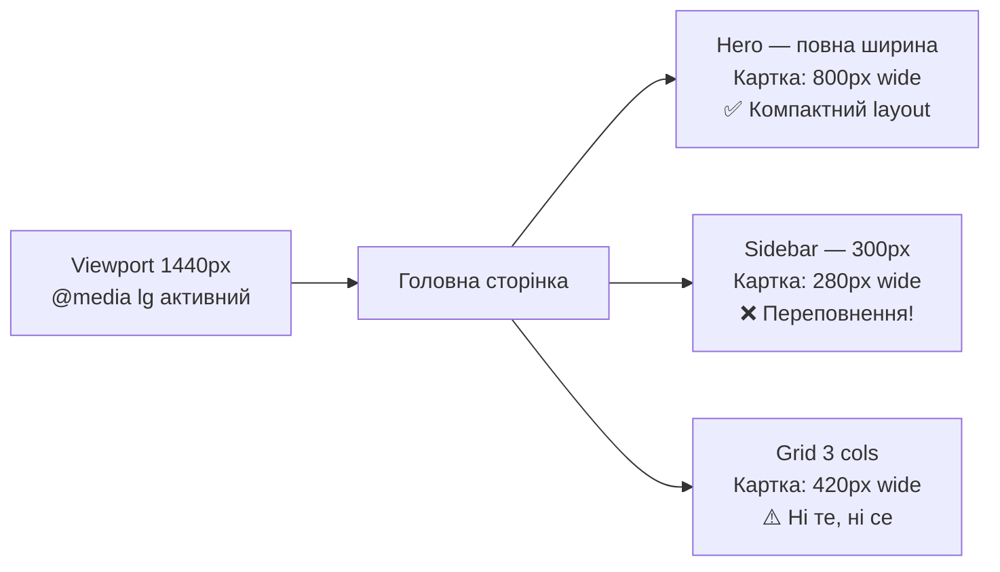

# Довільні значення та контейнерні запити у Tailwind v4

## Вступ: коли стандартних класів недостатньо

Tailwind CSS постачається з ретельно підібраною дизайн-системою: фіксованими відступами, кольорами, розмірами шрифтів. У переважній більшості випадків ця система повністю задовольняє потреби проєкту. Але реальний веб складніший за будь-яку систему.

Дизайнер передав макет із `padding: 18px` — значення, якого немає у Tailwind за замовчуванням. Замовник вимагає точний корпоративний колір `#C84B31`. Компонент картки має адаптуватися не до ширини екрана, а до ширини свого контейнера.

Для всіх цих ситуацій Tailwind v4 надає два потужні механізми:

1. **Довільні значення** (Arbitrary Values) — синтаксис `[]` та `()` для точних CSS-значень прямо у класі.
2. **Контейнерні запити** (`@container`) — вбудована підтримка (раніше потребувала плагіну), що дозволяє компонентам адаптуватися до розміру батьківського контейнера, а не вікна браузера.

Обидва механізми є фундаментальними для production-розробки. Без них ви або «ламаєте» дизайн-систему заради зручності, або пишете тонни окремого CSS там, де могли б залишитися у HTML.

::note
Матеріал цієї статті ґрунтується на знанні базових utility-класів (стаття 03), системи теми (стаття 05) та варіантів (стаття 06). Якщо ви ще не знайомі з ними — рекомендується спочатку прочитати їх.
::

---

## Частина І. Довільні значення: синтаксис квадратних дужок `[]`

### 1.1. Основний синтаксис

Будь-яка Tailwind-утиліта підтримує довільне значення у квадратних дужках замість стандартного:

```
{властивість}-[{довільне значення}]
```

Приклади:

```html
<!-- Замість стандартного p-4 (16px) — точно 18px -->
<div class="p-[18px]">

<!-- Корпоративний колір, якого немає у палітрі -->
<div class="bg-[#C84B31]">

<!-- Нестандартний розмір шрифту -->
<p class="text-[13px]">

<!-- Ширина у відсотках, яку не генерує Tailwind за замовчуванням -->
<div class="w-[37.5%]">

<!-- Позиція у top: рівно 3.75rem -->
<div class="top-[3.75rem]">

<!-- z-index будь-якого значення -->
<div class="z-[999]">
```

Tailwind бере значення у дужках «як є» і підставляє у відповідну CSS-властивість. Ніякої магії — просто escape-люк з дизайн-системи.

::tip
Довільні значення — це не «обхід» системи. Це інструмент для **точних поодиноких значень**, що не вписуються у шкалу. Якщо ви використовуєте одне й те саме довільне значення у 5+ місцях — це сигнал: варто додати його до `@theme`.
::

---

### 1.2. Повна таблиця підтримуваних типів значень

Практично кожна Tailwind-утиліта підтримує довільні значення:

| Утиліта | Приклад | CSS |
|---|---|---|
| **Spacing** | `p-[18px]`, `m-[1.75rem]`, `gap-[11px]` | padding, margin, gap |
| **Sizing** | `w-[200px]`, `h-[calc(100vh-4rem)]`, `min-w-[320px]` | width, height, min-width |
| **Colors** | `bg-[#C84B31]`, `text-[rgb(120,50,200)]`, `border-[oklch(0.6 0.2 30)]` | background-color, color, border-color |
| **Typography** | `text-[13px]`, `text-[1.375rem]`, `leading-[1.4]` | font-size, line-height |
| **Opacity** | `opacity-[0.35]`, `bg-blue-500/[0.15]` | opacity, color alpha |
| **Border** | `rounded-[6px]`, `border-[3px]`, `border-[#F00]` | border-radius, width, color |
| **Shadow** | `shadow-[0_4px_30px_rgba(0,0,0,0.1)]` | box-shadow |
| **Position** | `top-[3.75rem]`, `left-[calc(50%-1rem)]` | top, left |
| **Z-index** | `z-[100]`, `z-[9999]` | z-index |
| **Grid** | `grid-cols-[200px_1fr_auto]`, `col-span-[7]` | grid-template-columns |
| **Transition** | `duration-[350ms]`, `delay-[50ms]` | transition-duration, delay |
| **Transform** | `translate-x-[calc(-50%-1rem)]`, `rotate-[33deg]` | transform |
| **Flex** | `basis-[200px]`, `grow-[2]` | flex-basis, flex-grow |
| **Filters** | `blur-[2px]`, `brightness-[0.85]` | filter |
| **Inset** | `inset-[10%]`, `inset-x-[2rem]` | inset |

---

### 1.3. Кольори: всі формати

У довільних значеннях підтримуються будь-які формати CSS-кольорів:

```html
<!-- HEX -->
<div class="bg-[#C84B31]">
<div class="bg-[#C84B3180]"> <!-- з прозорістю через HEX -->

<!-- RGB та RGBA -->
<div class="bg-[rgb(200,75,49)]">
<div class="bg-[rgba(200,75,49,0.5)]">

<!-- HSL -->
<div class="bg-[hsl(12,61%,49%)]">
<div class="bg-[hsl(12_61%_49%)]"> <!-- сучасний синтаксис без ком -->

<!-- OKLCH — рекомендований у v4 -->
<div class="bg-[oklch(0.55_0.22_25)]">

<!-- Іменовані кольори (рідко, але допустимо) -->
<div class="bg-[cornflowerblue]">

<!-- Посилання на CSS Custom Property -->
<div class="bg-[var(--brand-color)]">
<!-- або короткий синтаксис v4: -->
<div class="bg-(--brand-color)">
```

::warning
Пробіли у довільних значеннях **заборонені** — браузер не зможе розпізнати клас. Замість пробілів використовуйте підкреслення `_`:

```html
<!-- ❌ Не працює: пробіл у значенні -->
<div class="shadow-[0 4px 6px rgba(0,0,0,0.1)]">

<!-- ✅ Правильно: підкреслення замість пробілів -->
<div class="shadow-[0_4px_6px_rgba(0,0,0,0.1)]">
```

Tailwind автоматично перетворює `_` на пробіл при генерації CSS.
::

---

### 1.4. Синтаксис `calc()`, `min()`, `max()`, `clamp()`

CSS-функції прекрасно поєднуються з довільними значеннями:

```html
<!-- calc(): розрахункові значення -->
<div class="w-[calc(100%-2rem)]">
    <!-- width: calc(100% - 2rem) -->

<div class="h-[calc(100vh-4rem)]">
    <!-- height: calc(100vh - 4rem) — часто для sticky layouts -->

<div class="translate-x-[calc(-50%+1rem)]">
    <!-- Центрування з компенсацією -->

<!-- min() / max(): обмеження -->
<div class="w-[min(100%,80rem)]">
    <!-- width: min(100%, 80rem) — fluid + обмеження максимуму -->

<div class="p-[max(1rem,3vw)]">
    <!-- padding: max(1rem, 3vw) — мінімальний відступ із адаптивним ростом -->

<!-- clamp(): плавний діапазон -->
<div class="text-[clamp(1rem,2.5vw,1.5rem)]">
    <!-- font-size: clamp(1rem, 2.5vw, 1.5rem) — fluid typography -->

<div class="w-[clamp(280px,50%,640px)]">
    <!-- Fluid width: від 280px до 640px -->
```

::tip
`clamp()` у поєднанні з `text-[...]` дає **fluid typography** — розмір тексту плавно масштабується між мінімальним та максимальним значеннями залежно від ширини вікна. Це елегантна альтернатива набору responsive-класів `text-sm md:text-base lg:text-lg`.
::

Живий приклад fluid typography:

::html-preview{tailwind}

```html
<div class="p-8 bg-white space-y-4" style="font-family: system-ui, sans-serif;">
    <p class="text-xs font-bold uppercase tracking-widest text-slate-400 mb-2">
        Fluid Typography через clamp()
    </p>

    <!-- Плавна адаптація від 14px до 22px залежно від ширини вікна -->
    <p class="text-[clamp(14px,2.5vw,22px)] text-slate-800 leading-relaxed">
        Цей текст плавно масштабується: від 14px на вузьких екранах до 22px на широких.
        Немає «стрибків» між breakpoints — розмір змінюється неперервно.
    </p>

    <!-- Hero заголовок: від 2rem до 4.5rem -->
    <h2 class="text-[clamp(2rem,5vw,4.5rem)] font-black tracking-tight text-slate-900 leading-none">
        Fluid Hero
    </h2>

    <!-- Для порівняння — дискретні breakpoints (старий підхід) -->
    <div class="border-t border-slate-100 pt-4">
        <p class="text-xs font-bold uppercase tracking-widest text-slate-400 mb-2">
            Для порівняння: дискретний підхід (text-sm md:text-base lg:text-xl)
        </p>
        <p class="text-sm md:text-base lg:text-xl text-slate-600">
            Цей текст «стрибає» між розмірами на breakpoints.
        </p>
    </div>
</div>
```

::

---

### 1.5. Довільні CSS-властивості

Окрім довільних **значень** для стандартних утиліт, Tailwind v4 підтримує повністю довільні **CSS-властивості** — через синтаксис у квадратних дужках з повною назвою властивості:

```html
<!-- Властивість, якої немає у Tailwind як утиліти -->
<div class="[mask-image:linear-gradient(to_bottom,black,transparent)]">

<!-- Кастомний scroll-behavior для конкретного елемента -->
<div class="[scroll-snap-type:x_mandatory]">

<!-- CSS Grid areas — складна сітка -->
<div class="[grid-template-areas:'header_header'_'sidebar_main'_'footer_footer']">

<!-- Accent color для form-елементів -->
<input type="checkbox" class="[accent-color:oklch(0.585_0.233_277)]">

<!-- content властивість для псевдоелементів -->
<div class="before:content-['→'] before:mr-2">

<!-- Writing mode для вертикального тексту -->
<span class="[writing-mode:vertical-lr] [text-orientation:mixed]">
    Вертикальний текст
</span>

<!-- Field sizing — нова CSS властивість (2024) -->
<textarea class="[field-sizing:content]">
    <!-- Textarea автоматично росте з контентом -->
</textarea>
```

::note
Синтаксис `[property:value]` дає доступ до **будь-якої CSS-властивості** — навіть найновіших, що ще не мають утиліт у Tailwind. Це робить вас незалежними від версій Tailwind при роботі з новими CSS-можливостями.
::

---

### 1.6. Новий синтаксис v4: круглі дужки для CSS-змінних

У Tailwind v4 введено скорочений синтаксис для значень, що є CSS Custom Properties:

```html
<!-- Старий синтаксис (все ще працює) -->
<div class="bg-[var(--color-brand)]">
<div class="text-[var(--font-size-hero)]">
<div class="p-[var(--spacing-section)]">

<!-- Новий синтаксис v4 — коротший та читабельніший -->
<div class="bg-(--color-brand)">
<div class="text-(--font-size-hero)">
<div class="p-(--spacing-section)">
```

Обидва записи генерують однаковий CSS:

```css
.bg-\(--color-brand\) {
    background-color: var(--color-brand);
}
```

Новий синтаксис `(--var)` є **рекомендованим** у v4 — він коротший і розрізняє CSS-змінні від довільних literal-значень у квадратних дужках.

Де це особливо корисно:

```html
<!-- Система дизайн-токенів: скрізь де використовуються семантичні токени -->
<div class="bg-(--color-bg-surface)
            text-(--color-text-primary)
            border border-(--color-border-default)
            p-(--spacing-card)">

<!-- Компоненти з кастомними CSS-змінними -->
<div class="grid"
     style="--cols: 3"
     class="grid-cols-(--cols)">

<!-- Анімації з CSS-змінними -->
<div class="transition-[color,background-color]
            duration-(--duration-fast)
            ease-(--ease-spring)">
```

::tip
Для систем дизайн-токенів (розглянутих у статті 09) синтаксис `(--var)` є особливо цінним: він робить HTML-код лаконічним і одразу показує, що значення береться з системи токенів, а не є «магічним числом».
::

---

### 1.7. Поєднання довільних значень із варіантами

Довільні значення повністю сумісні з усіма варіантами Tailwind:

```html
<!-- hover: + довільний колір -->
<button class="bg-[#C84B31] hover:bg-[#A53926]">

<!-- dark: + довільне значення -->
<div class="bg-[#fafaf9] dark:bg-[#1a1a2e]">

<!-- responsive: + довільний розмір -->
<div class="w-[280px] md:w-[400px] lg:w-[clamp(400px,50%,600px)]">

<!-- group-hover: + довільне перетворення -->
<div class="group">
    <div class="translate-y-[2px] group-hover:translate-y-[-4px] transition-transform duration-200">
        Підіймається при hover на батьку
    </div>
</div>

<!-- focus: + довільна рамка -->
<input class="focus:ring-[3px] focus:ring-[#C84B31]/30 focus:border-[#C84B31]">

<!-- Мобільний стрибок + fluid на десктопі -->
<h1 class="text-[2rem] md:text-[clamp(2.5rem,5vw,5rem)]">
```

---

### 1.8. Практичний приклад: компонент з довільними значеннями

Розглянемо реальний сценарій: картка продукту з точним дизайном від дизайнера, де частина значень виходить за межі стандартної шкали.

::html-preview{tailwind}

```html
<div class="p-8 bg-slate-50 flex justify-center items-center min-h-48"
     style="font-family: system-ui, sans-serif;">

    <!-- Product Card з довільними значеннями -->
    <div class="bg-white rounded-[20px] overflow-hidden shadow-[0_8px_40px_rgba(0,0,0,0.08)]
                w-[300px] hover:shadow-[0_16px_60px_rgba(0,0,0,0.14)]
                hover:-translate-y-[3px] transition-all duration-300">

        <!-- Зображення-плейсхолдер -->
        <div class="h-[180px] bg-gradient-to-br from-[#C84B31] to-[#8B2FC9]
                    relative flex items-end p-4">
            <!-- Badge зі специфічним відступом -->
            <span class="absolute top-[14px] right-[14px]
                         bg-white/90 text-[#C84B31] text-[11px] font-bold
                         px-[10px] py-[5px] rounded-[999px]
                         [backdrop-filter:blur(8px)]">
                -35%
            </span>
            <!-- Назва на картці -->
            <h2 class="text-white font-black text-[22px] leading-[1.2] text-shadow-sm">
                Premium Kit
            </h2>
        </div>

        <!-- Вміст -->
        <div class="p-[22px]">
            <p class="text-[13px] text-slate-500 leading-[1.6] mb-[14px]">
                Дизайн-система з точними значеннями поза стандартною шкалою Tailwind.
            </p>

            <!-- Ціна -->
            <div class="flex items-baseline gap-[6px] mb-[18px]">
                <span class="text-[28px] font-black text-slate-900">$49</span>
                <span class="text-[16px] text-slate-400 line-through">$75</span>
            </div>

            <!-- Кнопка -->
            <button class="w-full py-[13px] rounded-[12px]
                           bg-[#C84B31] hover:bg-[#A53926] active:scale-[0.98]
                           text-white text-[15px] font-bold
                           transition-all duration-150
                           shadow-[0_4px_14px_rgba(200,75,49,0.4)]
                           hover:shadow-[0_6px_20px_rgba(200,75,49,0.5)]">
                Придбати зараз
            </button>
        </div>
    </div>
</div>
```

::

Зверніть, як довільні значення використовуються точково — там, де дизайн вимагає нестандартних пікселів (`20px` для border-radius, `180px` для висоти обкладинки, `22px` для padding), але загальна структура залишається через стандартні утиліти.

---

## Частина ІІ. Довільні властивості: групи та `@apply`

### 2.1. Псевдоелементи та `content`

Особливо корисними є довільні значення для псевдоелементів `before:` та `after:`, де властивість `content` завжди потребує точного значення:

```html
<!-- Лапки для цитати -->
<blockquote class="relative pl-6
                   before:content-['\201C'] before:absolute before:left-0
                   before:text-[3rem] before:text-indigo-200 before:leading-none
                   before:font-serif before:-top-[0.5rem]">
    Довільні значення — це escape-люк, а не основний шлях.
</blockquote>

<!-- Стрілка після посилання -->
<a href="#" class="after:content-['_→'] after:ml-[2px]
                   after:transition-[transform,margin] after:inline-block
                   hover:after:ml-[6px]">
    Читати далі
</a>

<!-- Нумерований список через CSS-лічильник -->
<ol class="[counter-reset:list-counter]">
    <li class="[counter-increment:list-counter]
               before:content-[counter(list-counter)'.']
               before:font-bold before:mr-[8px] before:text-indigo-600">
        Перший елемент
    </li>
</ol>

<!-- Обов'язкова зірочка для form label -->
<label class="after:content-['*'] after:text-red-500 after:ml-[2px]">
    Email
</label>
```

---

### 2.2. CSS Grid з довільними шаблонами

Grid-система Tailwind підтримує лише прості варіанти (`grid-cols-2`, `grid-cols-3` тощо). Для складних сіток — довільний шаблон:

```html
<!-- Holy Grail Layout: header, sidebar, main, aside, footer -->
<div class="grid min-h-screen
            [grid-template-areas:'header_header_header'_'nav_main_aside'_'footer_footer_footer']
            [grid-template-rows:auto_1fr_auto]
            [grid-template-columns:240px_1fr_200px]
            gap-4">

    <header class="[grid-area:header] bg-white border-b p-4">Шапка</header>
    <nav class="[grid-area:nav] bg-slate-50 p-4">Навігація</nav>
    <main class="[grid-area:main] p-6">Основний контент</main>
    <aside class="[grid-area:aside] bg-slate-50 p-4">Sidebar</aside>
    <footer class="[grid-area:footer] bg-slate-800 text-white p-4">Футер</footer>
</div>
```

```html
<!-- Масонрі-подібна сітка через auto-fill/auto-fit -->
<div class="grid
            [grid-template-columns:repeat(auto-fill,minmax(280px,1fr))]
            gap-4">
    <!-- Картки автоматично заповнюють рядки -->
</div>

<!-- Складна несиметрична сітка -->
<div class="grid
            [grid-template-columns:2fr_1fr_1fr]
            [grid-template-rows:200px_300px]
            gap-2">
    <!-- Featured item займає весь перший стовпець -->
    <div class="row-span-2 bg-indigo-500"></div>
    <div class="bg-blue-400"></div>
    <div class="bg-sky-400"></div>
    <div class="bg-violet-400"></div>
    <div class="bg-purple-400"></div>
</div>
```

---

### 2.3. Фільтри, маски та ефекти

Довільні значення розкривають CSS-фільтри та маскування:

```html
<!-- Blur-фільтри з точними значеннями -->


<!-- Мультифільтр -->
<div class="[filter:brightness(0.9)_contrast(1.1)_saturate(1.2)]">

<!-- Маска градієнтом (fade-out ефект) -->
<div class="[mask-image:linear-gradient(to_bottom,black_60%,transparent)]">

<!-- Clip-path для нестандартних форм -->
<div class="[clip-path:polygon(0_0,100%_0,85%_100%,0_100%)]
            bg-indigo-600 text-white p-8">
    Паралелограм
</div>

<!-- Backdrop blur для glassmorphism -->
<div class="[backdrop-filter:blur(12px)_saturate(180%)]
            bg-white/20 border border-white/30 rounded-xl">
    Скло
</div>
```

::html-preview{tailwind}

```html
<div class="p-8 bg-gradient-to-br from-slate-800 to-indigo-900 flex flex-wrap gap-4 justify-center items-center"
     style="font-family: system-ui, sans-serif; min-height: 200px;">

    <!-- Glassmorphism через довільні властивості -->
    <div class="[backdrop-filter:blur(16px)_saturate(180%)]
                bg-white/10 border border-white/20
                rounded-2xl p-6 text-white text-center w-36">
        <div class="text-3xl mb-2">🔮</div>
        <p class="text-sm font-semibold">backdrop-filter</p>
        <p class="text-xs text-white/60 mt-1">blur + saturate</p>
    </div>

    <!-- Clip-path: нестандартна форма -->
    <div class="[clip-path:polygon(10%_0%,90%_0%,100%_100%,0%_100%)]
                bg-gradient-to-b from-indigo-400 to-indigo-600
                text-white text-center p-6 w-36 h-28 flex flex-col justify-center">
        <p class="text-sm font-semibold">clip-path</p>
        <p class="text-xs text-indigo-100 mt-1">polygon()</p>
    </div>

    <!-- Маска: fade-out знизу -->
    <div class="[mask-image:linear-gradient(to_bottom,black_40%,transparent)]
                bg-white/15 rounded-2xl p-6 text-white w-36 h-28">
        <p class="text-sm font-semibold">mask-image</p>
        <p class="text-xs text-white/70 mt-1">Текст зникає</p>
        <p class="text-xs text-white/50 mt-1">поступово</p>
        <p class="text-xs text-white/20 mt-1">донизу</p>
    </div>
</div>
```

::

---

## Частина ІІІ. Контейнерні запити: революція у компонентному дизайні

### 3.1. Проблема медіазапитів і чому контейнерні запити її вирішують

Класичні медіазапити CSS — `@media (min-width: 768px)` — прив'язані до розміру **вікна браузера** (viewport). Для більшості застосунків це зручно: ширина вікна корелює із розміром елементів.

Але така прив'язка має фундаментальний недолік: компонент не може адаптуватися сам по собі. Уявіть картку статті, яка відображається у трьох різних місцях на одній сторінці:

::mermaid



::

Всі три картки на **одному viewport** отримують одні й ті самі медіазапити — хоча їх реальна ширина абсолютно різна. Це проблема.

**Контейнерні запити** вирішують її: замість `@media (width >= 768px)` компонент «дивиться» на ширину свого **безпосереднього контейнера**:

```css
/* Медіазапит — дивиться на viewport */
@media (width >= 640px) {
    .card { flex-direction: row; }
}

/* Контейнерний запит — дивиться на контейнер */
@container (width >= 400px) {
    .card { flex-direction: row; }
}
```

Картка у sidebar (280px) залишиться вертикальною. Картка у hero (800px) стане горизонтальною. Обидві — на одному viewport, обидві — правильно адаптовані.

---

### 3.2. Синтаксис контейнерних запитів у Tailwind v4

У Tailwind v4 контейнерні запити вбудовані **з коробки** — без плагінів, без додаткових залежностей. Це одна із ключових новинок четвертої версії.

#### Крок 1: оголошення контейнера

Елемент, що стежить за своїм розміром, має бути оголошений контейнером через клас `@container`:

```html
<!-- Проста картка-контейнер -->
<div class="@container">
    <!-- Вміст адаптується до ширини цього div -->
    <div class="flex flex-col @md:flex-row">
        ...
    </div>
</div>
```

CSS, що генерується:

```css
.@container {
    container-type: inline-size;
}

@container (width >= 28rem) {
    .@md\:flex-row { flex-direction: row; }
}
```

::note
Клас `@container` встановлює `container-type: inline-size` — це означає, що браузер відстежує лише **горизонтальний розмір** контейнера (ширину). Якщо потрібно відстежувати висоту — додайте `[container-type:size]`.
::

#### Крок 2: іменовані контейнери

Якщо контейнери вкладені, виникає неоднозначність — дочірній елемент «бачить» лише **найближчий** контейнер-батько. Для явного зв'язку використовуються **іменовані контейнери**:

```html
<!-- Іменований контейнер через @container/{name} -->
<main class="@container/main">
    <article class="@container/card">
        <!-- Цей варіант реагує на розмір article -->
        <h2 class="text-base @lg/card:text-xl @2xl/card:text-3xl">
            Заголовок
        </h2>

        <!-- А цей — на розмір main -->
        <div class="hidden @xl/main:block">
            Видимий тільки коли main ≥ 56rem
        </div>
    </article>
</main>
```

---

### 3.3. Breakpoints контейнерних запитів

Tailwind v4 надає ту саму шкалу breakpoints, що й для медіазапитів, але з префіксом `@`:

| Варіант | Ширина контейнера | Аналог `@media` |
|---|---|---|
| `@xs:` | `≥ 320px` | `min-width: 320px` |
| `@sm:` | `≥ 384px` | `min-width: 384px` |
| `@md:` | `≥ 448px` | `min-width: 448px` |
| `@lg:` | `≥ 512px` | `min-width: 512px` |
| `@xl:` | `≥ 576px` | `min-width: 576px` |
| `@2xl:` | `≥ 672px` | `min-width: 672px` |
| `@3xl:` | `≥ 768px` | `min-width: 768px` |
| `@4xl:` | `≥ 896px` | `min-width: 896px` |
| `@5xl:` | `≥ 1024px` | `min-width: 1024px` |
| `@6xl:` | `≥ 1152px` | `min-width: 1152px` |
| `@7xl:` | `≥ 1280px` | `min-width: 1280px` |

Ці breakpoints відрізняються від медіазапитних (`sm: 640px`, `md: 768px` тощо) — вони починаються з менших значень, оскільки компоненти рідко займають весь viewport.

---

### 3.4. Варіанти `@min-*` та `@max-*`

Так само, як медіазапити мають `min-width` та `max-width`, контейнерні запити підтримують обидві форми.

**`@min-{bp}:`** — стиль застосовується коли контейнер **ширший або рівний** значенню (mobile-first):

```html
<div class="@container">
    <!-- Типовий mobile-first підхід -->
    <div class="flex-col @min-md:flex-row @min-xl:grid @min-xl:grid-cols-3">
```

**`@max-{bp}:`** — стиль застосовується коли контейнер **вужчий** значення (desktop-first):

```html
<div class="@container">
    <!-- Сховати текст у вузькому контейнері -->
    <button class="flex gap-2 items-center">
        <svg>...</svg>
        <span class="@max-sm:hidden">Зберегти зміни</span>
    </button>
</div>
```

**Комбінування `@min` + `@max`** — для стилів у конкретному діапазоні:

```html
<div class="@container">
    <!-- Показувати тільки у проміжному розмірі -->
    <div class="hidden @min-sm:@max-lg:block">
        Видимий тільки коли контейнер від 384px до 512px
    </div>
</div>
```

**Довільні значення у контейнерних запитах:**

```html
<div class="@container">
    <!-- Контейнерний запит із точним значенням -->
    <div class="flex-col @min-[350px]:flex-row @min-[600px]:grid-cols-2">
```

---

### 3.5. Живий приклад: адаптивна картка через `@container`

Найкраще розуміння контейнерних запитів дає практичний приклад — одна картка, що змінює layout залежно від ширини свого контейнера. Спробуйте змінити ширину контейнера у DevTools, щоб побачити, як компонент адаптується:

::html-preview{tailwind}

```html
<!DOCTYPE html>
<html lang="uk">
<head>
    <meta charset="UTF-8">
    <script src="https://cdn.tailwindcss.com/4.0"></script>
</head>
<body class="bg-slate-100 p-6" style="font-family: system-ui, sans-serif;">

<p class="text-xs font-bold uppercase tracking-widest text-slate-400 mb-4 text-center">
    Перетягніть повзунок, щоб змінити ширину контейнера
</p>

<!-- Повзунок для зміни ширини контейнера -->
<div class="flex items-center gap-3 mb-6 max-w-2xl mx-auto">
    <span class="text-xs text-slate-500 w-8">180</span>
    <input type="range" min="180" max="700" value="340" id="width-slider"
           class="flex-1" oninput="updateWidth(this.value)">
    <span class="text-xs text-slate-500 w-8">700</span>
    <span id="width-label" class="text-xs font-mono bg-slate-200 px-2 py-0.5 rounded text-slate-700 min-w-[52px] text-center">
        340px
    </span>
</div>

<!-- Контейнер із регульованою шириною -->
<div id="container-wrapper" class="mx-auto transition-all duration-200" style="width: 340px;">
    <!-- @container: компонент адаптується до ширини wrapper -->
    <div class="@container">
        <!--
            < 280px  → тільки аватар і ім'я (вертикально, компактно)
            280-400px → вертикальний layout, всі елементи
            400px+   → горизонтальний layout (flex-row)
            560px+   → з'являється статистика
        -->
        <div class="bg-white rounded-2xl overflow-hidden border border-slate-200 shadow-sm">

            <!-- Горизонтальний layout на великих контейнерах -->
            <div class="flex flex-col @[400px]:flex-row">

                <!-- Аватар / обкладинка -->
                <div class="bg-gradient-to-br from-indigo-500 to-violet-600
                            flex items-center justify-center
                            h-32 @[400px]:h-auto @[400px]:w-32 @[400px]:shrink-0 flex-shrink-0">
                    <div class="size-16 rounded-2xl bg-white/20 border-2 border-white/40
                                flex items-center justify-center text-white font-black text-xl">
                        IK
                    </div>
                </div>

                <!-- Основний контент -->
                <div class="p-4 @[280px]:p-5 flex-1 min-w-0">
                    <!-- Ім'я та роль -->
                    <div class="flex items-start justify-between gap-2 mb-3">
                        <div class="min-w-0">
                            <h3 class="font-bold text-slate-900 text-sm @[280px]:text-base truncate">
                                Іван Кравченко
                            </h3>
                            <p class="text-xs @[280px]:text-sm text-slate-500">
                                Frontend Developer
                            </p>
                        </div>
                        <!-- Badge — прихований на дуже малих контейнерах -->
                        <span class="hidden @[280px]:inline-flex shrink-0
                                     px-2 py-0.5 bg-indigo-100 text-indigo-700
                                     text-xs font-semibold rounded-full">
                            Pro
                        </span>
                    </div>

                    <!-- Опис — прихований на малих контейнерах -->
                    <p class="hidden @[320px]:block text-xs text-slate-600 leading-relaxed mb-3 line-clamp-2">
                        Розробляю інтерфейси на React та Tailwind. Захоплений сучасним CSS та архітектурою дизайн-систем.
                    </p>

                    <!-- Статистика — лише на широких контейнерах -->
                    <div class="hidden @[560px]:grid grid-cols-3 gap-3 mb-3 py-3 border-t border-slate-100">
                        <div class="text-center">
                            <p class="text-base font-black text-slate-900">48</p>
                            <p class="text-xs text-slate-400">Проєкти</p>
                        </div>
                        <div class="text-center">
                            <p class="text-base font-black text-slate-900">2.4k</p>
                            <p class="text-xs text-slate-400">Підписники</p>
                        </div>
                        <div class="text-center">
                            <p class="text-base font-black text-slate-900">97%</p>
                            <p class="text-xs text-slate-400">Рейтинг</p>
                        </div>
                    </div>

                    <!-- Кнопки -->
                    <div class="flex gap-2">
                        <button class="flex-1 @[400px]:flex-none
                                       py-1.5 px-3 @[280px]:px-4
                                       bg-indigo-600 hover:bg-indigo-700
                                       text-white text-xs @[280px]:text-sm font-semibold
                                       rounded-lg transition-colors">
                            Профіль
                        </button>
                        <!-- Друга кнопка — лише якщо є місце -->
                        <button class="hidden @[320px]:flex
                                       items-center gap-1.5
                                       py-1.5 px-3 @[280px]:px-4
                                       border border-slate-200 hover:bg-slate-50
                                       text-slate-700 text-xs @[280px]:text-sm font-semibold
                                       rounded-lg transition-colors">
                            <span>Написати</span>
                        </button>
                    </div>
                </div>
            </div>
        </div>
    </div>
</div>

<!-- Індикатор поточного breakpoint -->
<div class="text-center mt-4">
    <p class="text-xs text-slate-500" id="breakpoint-label">...</p>
</div>

<script>
    function updateWidth(val) {
        document.getElementById('container-wrapper').style.width = val + 'px'
        document.getElementById('width-label').textContent = val + 'px'

        const v = parseInt(val)
        let bp = ''
        if (v < 280) bp = '< 280px — мінімальний'
        else if (v < 320) bp = '≥ 280px — badge, опис'
        else if (v < 400) bp = '≥ 320px — друга кнопка + опис'
        else if (v < 560) bp = '≥ 400px — горизонтальний layout'
        else bp = '≥ 560px — статистика'

        document.getElementById('breakpoint-label').textContent = 'Активний breakpoint: ' + bp
    }
    updateWidth(340)
</script>
</body>
</html>
```

::

---

### 3.6. Порівняння: медіазапити проти контейнерних запитів

Обидва підходи виправдані — але для різних задач:

::card-group

::card{title="Медіазапити @media" icon="i-heroicons-device-phone-mobile"}

**Коли використовувати:**
- Layout сторінки (sidebar, navbar, grid-система)
- Компоненти, розмір яких завжди корелює з viewport (hero section, full-width banner)
- Типографічна шкала для всього документу
- Навігація, що трансформується (бургер-меню)

**Приклад:** `md:hidden` — сховати sidebar на мобільному

::

::card{title="Контейнерні запити @container" icon="i-heroicons-squares-2x2"}

**Коли використовувати:**
- Переносимі компоненти (Card, ProductItem, TeamMember)
- Компоненти, що використовуються у різних контекстах (sidebar, grid, full-width)
- Компонентні бібліотеки (UI-kit)
- Адаптивні списки, що можуть мати 1-4 колонки залежно від контейнера

**Приклад:** `@md:flex-row` — картка горизонтальна коли ширина ≥ 448px

::

::

```html
<!-- Комбінація обох: viewport layout + компонентна адаптивність -->
<div class="grid grid-cols-1 md:grid-cols-2 lg:grid-cols-3 gap-4">
    <!--
        На рівні сторінки: медіазапит визначає кількість колонок.
        На рівні компонента: @container визначає внутрішній layout.
    -->
    <div class="@container">
        <article class="flex flex-col @[360px]:flex-row gap-4 bg-white rounded-xl p-4">
            <!-- Картка адаптується до своєї реальної ширини в колонці -->
        </article>
    </div>
</div>
```

---

### 3.7. Контейнерні запити з іменуванням: складні вкладення

Розглянемо складний приклад: Dashboard із вкладеними контейнерами, де різні рівні ієрархії адаптуються незалежно:

```html
<!-- Зовнішній контейнер: весь dashboard -->
<div class="@container/dashboard grid grid-cols-1 @3xl/dashboard:grid-cols-[260px_1fr] gap-6">

    <!-- Sidebar: залежить від розміру dashboard -->
    <aside class="hidden @3xl/dashboard:block bg-white rounded-xl border border-slate-200 p-4">
        <nav>Навігація</nav>
    </aside>

    <!-- Основний контент: власний контейнер -->
    <main class="@container/main space-y-6">

        <!-- Stats grid: адаптується до main -->
        <div class="grid grid-cols-2 @2xl/main:grid-cols-4 gap-4">
            <div class="@container/stat bg-white rounded-xl p-4 border border-slate-200">
                <!-- Stat card: адаптується до stat контейнера -->
                <div class="flex flex-col @[180px]/stat:flex-row @[180px]/stat:items-center gap-2">
                    <span class="text-2xl">📈</span>
                    <div>
                        <p class="text-2xl font-black">2,847</p>
                        <p class="text-xs text-slate-500">Відвідувачі</p>
                    </div>
                </div>
            </div>
            <!-- Більше stat-карток... -->
        </div>

        <!-- Таблиця: показує різну кількість колонок -->
        <div class="@container/table bg-white rounded-xl border border-slate-200">
            <table class="w-full">
                <thead>
                    <tr class="border-b border-slate-100">
                        <th class="text-left p-4 text-sm font-semibold text-slate-700">Ім'я</th>
                        <!-- Ці колонки приховані у вузькому контейнері -->
                        <th class="hidden @[500px]/table:table-cell text-left p-4 text-sm font-semibold text-slate-700">Email</th>
                        <th class="hidden @[700px]/table:table-cell text-left p-4 text-sm font-semibold text-slate-700">Дата</th>
                        <th class="text-left p-4 text-sm font-semibold text-slate-700">Статус</th>
                    </tr>
                </thead>
            </table>
        </div>

    </main>
</div>
```

---

### 3.8. Контейнерні запити: стилізація у CSS через `@theme`

Якщо ви хочете власні breakpoints для контейнерних запитів — їх можна додати до `@theme`:

```css [src/styles/main.css]
@import 'tailwindcss';

@theme {
    /* Кастомні breakpoints для @container */
    --breakpoint-@card-sm:  200px;  /* @card-sm: */
    --breakpoint-@card-md:  320px;  /* @card-md: */
    --breakpoint-@card-lg:  480px;  /* @card-lg: */
    --breakpoint-@card-xl:  640px;  /* @card-xl: */

    --breakpoint-@sidebar:  280px;  /* @sidebar: */
    --breakpoint-@panel:    400px;  /* @panel: */
}
```

Після цього ви можете використовувати ці семантичні назви:

```html
<div class="@container">
    <div class="flex-col @card-md:flex-row @card-xl:grid @card-xl:grid-cols-3">
```

::note
Назви кастомних breakpoints мають починатися з `@` у значенні змінної `@theme`. Це дозволяє Tailwind відрізняти container breakpoints від media breakpoints.
::

---

## Частина IV. Завдання для самоперевірки

::accordion

::accordion-item{label="Рівень 1: Базовий — розуміння синтаксису"}

**Завдання 1.1. Декодування довільних значень.**

Що генерує кожен із цих класів у CSS? Відповідайте без запуску коду:

```html
<div class="w-[37.5%]">
<div class="text-[clamp(1rem,2.5vw,2rem)]">
<div class="bg-[oklch(0.6_0.22_270)]">
<div class="shadow-[0_8px_32px_rgba(0,0,0,0.12)]">
<div class="[grid-template-columns:200px_1fr_auto]">
<div class="before:content-['©']">
<div class="translate-x-[calc(-50%+8px)]">
```

---

**Завдання 1.2. Синтаксис v4: `[]` проти `()`.**

Поясніть різницю між:

```html
<div class="bg-[var(--color-brand)]">
<div class="bg-(--color-brand)">
<div class="bg-[#FF5733]">
```

Яка з форм є новинкою Tailwind v4? Коли який синтаксис правильно використовувати?

---

**Завдання 1.3. Контейнерні vs медіазапити.**

Для кожного сценарію вкажіть, який підхід правильний:

1. Navbar, що перетворюється з горизонтального на вертикальний при ширині < 768px
2. Картка товару, що може бути у sidebar (240px) або у grid (400px)
3. Типографічна шкала для всього сайту
4. Компонент коментаря в різних місцях (post-page, modal, sidebar)
5. Hero section із full-width зображенням
6. UI-kit кнопка з текстом, що зникає при малому контейнері

::

::accordion-item{label="Рівень 2: Практика — компоненти"}

**Завдання 2.1. Адаптивна картка продукту.**

Реалізуйте картку товару, що через `@container` змінює layout:

```
< 200px  → тільки зображення + ціна
200-320px → зображення + назва + ціна
320-500px → вертикальний: зображення + всі деталі + кнопка
500px+   → горизонтальний: зображення зліва, контент справа
```

Картку треба розмістити у трьох місцях на одній сторінці (sidebar 240px, grid 360px, featured 600px) — і вона має коректно виглядати у кожному.

---

**Завдання 2.2. Fluid typography та spacing.**

Без використання responsive breakpoints (`sm:`, `md:`, `lg:`) — тільки через `clamp()` та `calc()`:

1. Hero заголовок: від `2rem` (320px viewport) до `5rem` (1440px viewport) — плавно
2. Відступи між секціями: від `2rem` до `6rem` — плавно
3. Максимальна ширина контейнера: від `100%` (< 640px) до `80rem` — через `min()`

Перевірте: жодного `md:text-*` або `lg:text-*` — тільки `text-[clamp(...)]`.

---

**Завдання 2.3. Holy Grail через довільні властивості.**

Реалізуйте повну сторінку у Holy Grail layout виключно через Tailwind та довільні значення:

```
┌──────────────────────────────┐
│          Header              │
├────────┬─────────────┬───────┤
│  Nav   │    Main     │ Aside │
│ 220px  │    1fr      │ 180px │
├────────┴─────────────┴───────┤
│          Footer              │
└──────────────────────────────┘
```

Вимоги:
- `[grid-template-areas:...]` та `[grid-area:...]` для позиціонування
- Мінімальна висота `min-h-screen` для Main
- На мобільному (`< md`) — Nav та Aside ховаються, Main займає всю ширину

::

::accordion-item{label="Рівень 3: Архітектура — компонентна бібліотека"}

**Завдання 3.1. UI-kit із @container.**

Побудуйте мінімальну компонентну бібліотеку, де всі компоненти адаптуються до свого контейнера:

**Компонент `<Card>`:**
- `< 300px`: тільки заголовок + кнопка
- `300–480px`: заголовок + опис (line-clamp-2) + кнопка
- `480px+`: зображення (ліворуч) + весь контент (праворуч)

**Компонент `<DataTable>`:**
- `< 400px`: тільки 2 головні колонки, решта приховані
- `400–600px`: 3 колонки
- `600px+`: всі колонки + actions

**Компонент `<NavLink>`:**
- У вузькому контейнері (sidebar < 220px): тільки іконка
- У ширшому: іконка + label

Зберіть їх на одній сторінці та продемонструйте в різних layout-контекстах.

---

**Завдання 3.2. Fluid Design System.**

Побудуйте дизайн-систему, де **весь spacing та typography** є fluid:

```css
/* @theme із fluid значеннями через CSS-змінні */
@theme {
    --spacing-section: clamp(2rem, 5vw, 6rem);
    --spacing-card:    clamp(1rem, 2vw, 1.5rem);
    --font-size-h1:    clamp(1.75rem, 5vw, 3.5rem);
    --font-size-h2:    clamp(1.375rem, 3.5vw, 2.25rem);
    --font-size-body:  clamp(0.9375rem, 1.5vw, 1.0625rem);
}
```

Використайте ці токени через `p-(--spacing-card)`, `text-(--font-size-h1)` тощо на повноцінній landing page. Жодних `sm:`, `md:`, `lg:` медіазапитів для відступів та шрифтів — тільки fluid значення.

::

::

---

## Підсумок

У цій статті ми розглянули два потужні механізми Tailwind v4, що дозволяють вийти за межі стандартної дизайн-системи там, де це необхідно.

**Довільні значення `[]` та `()`:**

- Синтаксис `[value]` — для literal CSS-значень: пікселів, кольорів, функцій
- Синтаксис `(--var)` — новинка v4, скорочення для `[var(--var)]`
- `calc()`, `min()`, `max()`, `clamp()` — математика прямо у класі
- `[property:value]` — довільні CSS-властивості для всього, чого немає у Tailwind
- Підкреслення `_` замість пробілів у значеннях

**Контейнерні запити `@container`:**

- `@container` на батьку — оголошує контейнер
- `@{bp}:` варіанти — стилі за мінімальною шириною контейнера
- `@max-{bp}:` варіанти — стилі за максимальною шириною
- Іменовані контейнери `/name` — для вкладених структур
- Вбудовано у Tailwind v4 без плагінів

::tip
Головне правило: **стандартні утиліти — за замовчуванням, довільні значення — для точності, контейнерні запити — для переносимих компонентів**. Комбінуйте всі три підходи, і ваш код стане одночасно виразним та гнучким.
::

---

_Попередня стаття: [Темна тема та система дизайн-токенів](/21.tailwind/09.tailwind-dark-mode-theming)_
_Наступна стаття: [Анімації, трансформації та 3D у Tailwind v4](/21.tailwind/11.tailwind-animations-transforms)_
