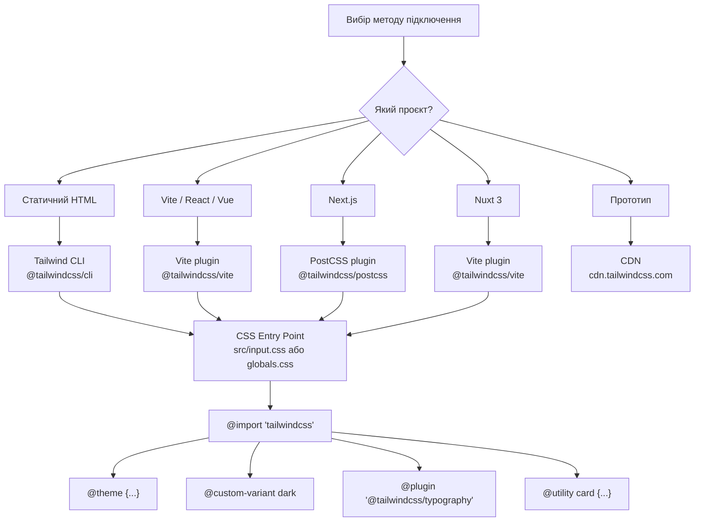

# Tailwind CLI, PostCSS та інтеграція з фреймворками

## Вступ: Tailwind v4 змінює підхід до конфігурації

Одна з найрадикальніших змін Tailwind v4 — відмова від `tailwind.config.js` як єдиного джерела конфігурації на користь **CSS-файлу як точки входу**. У v3 конфігурація жила у JavaScript. У v4 — у CSS:

```css
/* v4: Весь Tailwind налаштовується тут */
@import 'tailwindcss';

@theme {
    --color-brand: oklch(0.585 0.233 277);
    --font-sans: 'Inter', system-ui, sans-serif;
}

@custom-variant dark (&:is(.dark *));
```

Це не просто синтаксичні зміни — це зміна **архітектурної філософії**: конфігурація стилів живе поряд зі стилями, а не у окремому JavaScript-файлі, що вимагав знання API Tailwind.

У цій статті розберемо всі способи підключення та налаштування Tailwind v4 для реальних проєктів.

---

## Частина І. Tailwind CLI: автономна збірка

### 1.1. Що таке Tailwind CLI і коли він потрібен

**Tailwind CLI** — автономна утиліта командного рядка для компіляції Tailwind CSS без Node.js-проєкту, без webpack, без Vite. Вона містить вбудований компілятор і не потребує `package.json`.

Коли використовувати CLI:
- **Статичні сайти**: HTML + CSS без JavaScript-фреймворку
- **Швидкі прототипи**: немає потреби в повноцінній збірці
- **Навчання**: зосередитися на CSS, без налаштування toolchain
- **Jekyll, Hugo, Eleventy**: генератори статичних сайтів

Коли **не** використовувати CLI:
- Проєкти з Vite/webpack → використовуйте плагін
- Next.js/Nuxt → є власна інтеграція
- Потрібні PostCSS-плагіни (autoprefixer, postcss-import тощо)

---

### 1.2. Встановлення та перший запуск

**Варіант 1: через npm (рекомендований)**

```bash
# Ініціалізація Node-проєкту (якщо ще немає)
npm init -y

# Встановлення Tailwind CLI
npm install tailwindcss @tailwindcss/cli --save-dev
```

**Структура проєкту:**

```
my-project/
├── src/
│   ├── input.css       ← вхідний CSS-файл (з @import 'tailwindcss')
│   └── index.html
├── dist/
│   └── output.css      ← скомпільований CSS (генерується автоматично)
└── package.json
```

**Вхідний CSS-файл:**

```css [src/input.css]
/* Підключити всі шари Tailwind */
@import "tailwindcss";

/* Власна конфігурація */
@theme {
    --font-sans: 'Inter', system-ui, sans-serif;
    --color-brand: oklch(0.585 0.233 277);
}

/* Базові глобальні стилі */
@layer base {
    body {
        font-family: var(--font-sans);
        background-color: oklch(0.984 0.003 247.858);
    }
}
```

**Перший запуск:**

```bash
# Одноразова збірка
npx @tailwindcss/cli -i src/input.css -o dist/output.css

# Watch mode: перекомпілювати при змінах
npx @tailwindcss/cli -i src/input.css -o dist/output.css --watch

# Мінімізований production-build
npx @tailwindcss/cli -i src/input.css -o dist/output.css --minify
```

**`package.json` скрипти:**

```json [package.json]
{
    "scripts": {
        "dev": "tailwindcss -i src/input.css -o dist/output.css --watch",
        "build": "tailwindcss -i src/input.css -o dist/output.css --minify"
    },
    "devDependencies": {
        "tailwindcss": "^4.0.0",
        "@tailwindcss/cli": "^4.0.0"
    }
}
```

---

### 1.3. Підключення у HTML

```html [src/index.html]
<!DOCTYPE html>
<html lang="uk">
<head>
    <meta charset="UTF-8">
    <meta name="viewport" content="width=device-width, initial-scale=1.0">
    <title>Мій проєкт</title>

    <!-- Підключити скомпільований CSS -->
    <link rel="stylesheet" href="../dist/output.css">
</head>
<body class="min-h-screen bg-slate-50 p-8">

    <div class="max-w-2xl mx-auto">
        <h1 class="text-3xl font-black text-slate-900 mb-4">Привіт, Tailwind v4!</h1>
        <p class="text-slate-600 leading-relaxed">
            Цей текст стилізований через Tailwind CLI.
        </p>
        <button class="mt-4 px-6 py-3 bg-indigo-600 hover:bg-indigo-700
                       text-white font-semibold rounded-xl transition-colors duration-200">
            Кнопка
        </button>
    </div>

</body>
</html>
```

::tip
У watch mode Tailwind автоматично відстежує **всі HTML, JS та CSS файли** у директорії проєкту. Scan відбувається за шаблонами у директорії проєкту — вам не потрібно вказувати шляхи вручну, як у v3.
::

---

### 1.4. Як Tailwind v4 знаходить класи для генерації

У v3 потрібно було вказувати `content: ['./src/**/*.html']` у конфігурації. У v4 цього не потрібно — Tailwind автоматично сканує файли поряд із вхідним CSS:

```css [src/input.css]
/* Без жодних налаштувань Tailwind сканує: */
/* - Всі .html, .js, .ts, .jsx, .tsx, .vue, .svelte файли у проєкті */
/* - За винятком node_modules, dist, .git */
@import "tailwindcss";
```

Якщо потрібно явно вказати джерела (для нестандартних розширень або структур):

```css [src/input.css]
@import "tailwindcss";

/* Явне вказання джерел */
@source "../templates/**/*.twig";    /* Twig-шаблони */
@source "../views/**/*.erb";         /* Rails ERB */
@source "../components/**/*.php";    /* PHP-компоненти */
```

Або виключити директорії:

```css [src/input.css]
@import "tailwindcss";

/* Виключити конкретну директорію */
@source not "../legacy/**";
```

---

## Частина ІІ. PostCSS: інтеграція у збірки

### 2.1. Tailwind як PostCSS-плагін

**PostCSS** — трансформатор CSS через плагіни. Tailwind v4 є PostCSS-плагіном — це означає, що його можна інтегрувати у будь-яку систему збірки, що підтримує PostCSS (webpack, Rollup, Parcel, Vite тощо).

Встановлення:

```bash
npm install tailwindcss @tailwindcss/postcss postcss --save-dev
```

Конфігурація PostCSS:

```js [postcss.config.js]
// CommonJS
module.exports = {
    plugins: {
        '@tailwindcss/postcss': {}
    }
}
```

```js [postcss.config.mjs]
// ESM
export default {
    plugins: {
        '@tailwindcss/postcss': {}
    }
}
```

Або об'єктний синтаксис:

```js [postcss.config.js]
const tailwindcss = require('@tailwindcss/postcss')

module.exports = {
    plugins: [
        tailwindcss(),
        // Інші PostCSS плагіни після Tailwind:
        require('autoprefixer'),
    ]
}
```

::note
У Tailwind v4 **autoprefixer здебільшого не потрібен** — Tailwind вже додає необхідні vendor-префікси для CSS-властивостей, що їх потребують. Однак для максимальної сумісності зі старими браузерами — залиште autoprefixer.
::

---

### 2.2. Інтеграція з Vite

**Vite** — найпопулярніший bundler для сучасних проєктів. Tailwind v4 має офіційний Vite-плагін, який є швидшим за PostCSS-варіант:

```bash
# Встановлення
npm install tailwindcss @tailwindcss/vite --save-dev
```

```js [vite.config.js]
import { defineConfig } from 'vite'
import tailwindcss from '@tailwindcss/vite'

export default defineConfig({
    plugins: [
        tailwindcss(),
        // Інші Vite-плагіни...
    ]
})
```

```js [vite.config.ts]
import { defineConfig } from 'vite'
import tailwindcss from '@tailwindcss/vite'
import react from '@vitejs/plugin-react'

export default defineConfig({
    plugins: [
        tailwindcss(),
        react(),
    ]
})
```

CSS-файл підключається звичайним імпортом:

```css [src/index.css]
@import "tailwindcss";

/* Ваша конфігурація */
@theme {
    --font-sans: 'Inter', system-ui, sans-serif;
}
```

```js [src/main.js]
import './index.css'
// або у main.ts:
import './index.css'
```

**Vite + React (повний приклад):**

```bash
# Новий проєкт
npm create vite@latest my-app -- --template react
cd my-app
npm install tailwindcss @tailwindcss/vite --save-dev
```

```js [vite.config.js]
import { defineConfig } from 'vite'
import react from '@vitejs/plugin-react'
import tailwindcss from '@tailwindcss/vite'

export default defineConfig({
    plugins: [tailwindcss(), react()]
})
```

```css [src/index.css]
@import "tailwindcss";
```

```jsx [src/App.jsx]
import './index.css'

function App() {
    return (
        <div className="min-h-screen bg-slate-50 flex items-center justify-center">
            <h1 className="text-3xl font-black text-slate-900">
                Tailwind v4 + React
            </h1>
        </div>
    )
}
```

---

### 2.3. Інтеграція з Next.js

Next.js 14+ має вбудовану підтримку Tailwind v4 через `@tailwindcss/postcss`:

```bash
# Новий Next.js проєкт із Tailwind
npx create-next-app@latest my-app --tailwind
cd my-app
# Tailwind вже підключений!
```

Якщо додаєте до існуючого проєкту:

```bash
npm install tailwindcss @tailwindcss/postcss postcss --save-dev
```

```js [postcss.config.mjs]
const config = {
    plugins: {
        '@tailwindcss/postcss': {}
    }
}
export default config
```

```css [app/globals.css]
@import "tailwindcss";

/* Ваша тема */
@theme {
    --font-sans: var(--font-inter), system-ui, sans-serif;
    --color-brand: oklch(0.585 0.233 277);
}
```

```jsx [app/layout.jsx]
import { Inter } from 'next/font/google'
import './globals.css'

const inter = Inter({ subsets: ['latin'], variable: '--font-inter' })

export default function RootLayout({ children }) {
    return (
        <html lang="uk" className={inter.variable}>
            <body>{children}</body>
        </html>
    )
}
```

::tip
Зверніть: Next.js Google Fonts підключає шрифт через CSS-змінну (`--font-inter`). У `@theme` ми посилаємося на цю змінну через `var(--font-inter)` — так шрифт правильно підхоплюється як частиною дизайн-системи.
::

---

### 2.4. Інтеграція з Nuxt 3

```bash
# Новий Nuxt проєкт
npx nuxi@latest init my-app
cd my-app
npm install tailwindcss @tailwindcss/vite --save-dev
```

```ts [nuxt.config.ts]
import tailwindcss from '@tailwindcss/vite'

export default defineNuxtConfig({
    vite: {
        plugins: [
            tailwindcss()
        ]
    }
})
```

```css [assets/css/main.css]
@import "tailwindcss";

@theme {
    --color-brand: oklch(0.585 0.233 277);
}
```

```ts [nuxt.config.ts]
export default defineNuxtConfig({
    css: ['~/assets/css/main.css'],
    vite: {
        plugins: [tailwindcss()]
    }
})
```

---

### 2.5. Порівняльна таблиця методів підключення

| Метод | Коли використовувати | Швидкість | Складність |
|---|---|---|---|
| **CDN** (`<script src="cdn.tailwindcss.com">`) | Тільки для прототипів | Немає збірки | Нульова |
| **Tailwind CLI** | Статичні сайти, без bundler | Висока | Низька |
| **PostCSS-плагін** | Webpack, Rollup, Parcel | Висока | Середня |
| **Vite-плагін** | Vite, React, Vue, Svelte | Найвища | Низька |
| **Next.js** | Next.js застосунки | Висока | Низька |
| **Nuxt** | Nuxt застосунки | Висока | Низька |

---

## Частина ІІІ. CSS-файл замість `tailwind.config.js`

### 3.1. Що де налаштовується

У v4 всі налаштування, що раніше жили у `tailwind.config.js`, переїхали у CSS:

```js
// tailwind.config.js (v3 — застарілий підхід)
module.exports = {
    content: ['./src/**/*.{html,js}'],
    theme: {
        extend: {
            colors: {
                brand: '#4f46e5',
            },
            fontFamily: {
                sans: ['Inter', 'system-ui'],
            },
            borderRadius: {
                '4xl': '2rem',
            }
        }
    },
    plugins: [
        require('@tailwindcss/typography'),
    ]
}
```

```css [src/input.css (v4 — новий підхід)]
@import "tailwindcss";

/* Колір бренду */
@theme {
    --color-brand: oklch(0.585 0.233 277);
    --font-family-sans: 'Inter', system-ui, sans-serif;
    --radius-4xl: 2rem;
}

/* Плагіни: через @import або @plugin */
@plugin "@tailwindcss/typography";
```

---

### 3.2. `@theme`: повна анатомія

`@theme` — аналог `theme.extend` у v3, але більш потужний. Будь-який `--*` токен у `@theme` стає utility-класом:

```css [src/styles/theme.css]
@theme {
    /* ═══ Кольори ════════════════════════════════════════════ */
    --color-brand-50:  oklch(0.971 0.015 280);
    --color-brand-100: oklch(0.943 0.030 280);
    --color-brand-500: oklch(0.585 0.233 277);
    --color-brand-600: oklch(0.511 0.262 277);
    --color-brand-900: oklch(0.257 0.090 281);

    /* → генерує: bg-brand-50, text-brand-500, border-brand-600 */

    /* ═══ Шрифти ══════════════════════════════════════════════ */
    --font-family-sans:  'Inter Variable', system-ui, sans-serif;
    --font-family-mono:  'JetBrains Mono', 'Fira Code', monospace;
    --font-family-serif: 'Playfair Display', Georgia, serif;

    /* → генерує: font-sans, font-mono, font-serif */

    /* ═══ Spacing (доповнення до стандартного) ════════════════ */
    --spacing-18:  4.5rem;   /* → p-18, m-18, gap-18... */
    --spacing-88:  22rem;
    --spacing-128: 32rem;

    /* ═══ Border radius ══════════════════════════════════════ */
    --radius-4xl: 2rem;      /* → rounded-4xl */
    --radius-5xl: 2.5rem;    /* → rounded-5xl */

    /* ═══ Box shadows ════════════════════════════════════════ */
    --shadow-glow-sm: 0 0 8px oklch(0.585 0.233 277 / 0.3);
    --shadow-glow-md: 0 0 20px oklch(0.585 0.233 277 / 0.4);

    /* → генерує: shadow-glow-sm, shadow-glow-md */

    /* ═══ Анімації ═══════════════════════════════════════════ */
    --animate-fade-in:    fade-in 0.4s ease-out;
    --animate-fade-in-up: fade-in-up 0.5s ease-out;
    --animate-shake:      shake 0.5s ease-in-out;

    /* → генерує: animate-fade-in, animate-fade-in-up, animate-shake */

    /* ═══ Breakpoints ════════════════════════════════════════ */
    --breakpoint-xs: 480px;  /* → xs: варіант */
    --breakpoint-3xl: 1920px;/* → 3xl: варіант */

    /* ═══ Z-index (за іменами) ══════════════════════════════ */
    --z-index-modal:    1000;
    --z-index-tooltip:  1100;
    --z-index-overlay:  900;
    /* → генерує: z-modal, z-tooltip, z-overlay */
}
```

---

### 3.3. `@plugin`: підключення офіційних плагінів

Офіційні плагіни Tailwind підключаються через `@plugin`:

```css [src/input.css]
@import "tailwindcss";

/* Офіційні плагіни */
@plugin "@tailwindcss/typography";    /* prose, prose-lg... */
@plugin "@tailwindcss/forms";         /* кращі стилі форм */
@plugin "@tailwindcss/aspect-ratio";  /* aspect-w-16, aspect-h-9 */
@plugin "@tailwindcss/container-queries"; /* @container в v3 */
```

Встановлення плагінів:

```bash
npm install @tailwindcss/typography @tailwindcss/forms --save-dev
```

```html
<!-- Після підключення @tailwindcss/typography: -->
<article class="prose prose-slate lg:prose-xl prose-headings:font-black">
    <h1>Заголовок</h1>
    <p>Красиво стилізований текст...</p>
</article>
```

---

### 3.4. `@utility`: власні утиліти

У v4 власні утиліти визначаються через `@utility` замість `@layer utilities`:

```css [src/styles/utilities.css]
/* Власна утиліта — стає повноцінним класом із підтримкою hover:, dark:, etc. */

@utility truncate-2 {
    overflow: hidden;
    display: -webkit-box;
    -webkit-line-clamp: 2;
    -webkit-box-orient: vertical;
}

@utility truncate-3 {
    overflow: hidden;
    display: -webkit-box;
    -webkit-line-clamp: 3;
    -webkit-box-orient: vertical;
}

/* Glassmorphism */
@utility glass {
    background: oklch(1 0 0 / 0.1);
    backdrop-filter: blur(12px) saturate(180%);
    border: 1px solid oklch(1 0 0 / 0.2);
}

/* Fluid container */
@utility container-fluid {
    width: 100%;
    max-width: 80rem;
    margin-inline: auto;
    padding-inline: clamp(1rem, 3vw, 3rem);
}

/* Aspect ratios (якщо не використовуєте плагін) */
@utility aspect-video {
    aspect-ratio: 16 / 9;
}

@utility aspect-square {
    aspect-ratio: 1 / 1;
}
```

Використання:

```html
<p class="truncate-2 hover:truncate-3 transition-all">
    Довгий текст, що обрізається до 2 рядків, а при hover — до 3.
</p>

<div class="glass rounded-2xl p-6">
    Glassmorphism-контейнер
</div>

<main class="container-fluid">
    Основний контент
</main>
```

::html-preview{tailwind}

```html
<!DOCTYPE html>
<html lang="uk">
<head>
<meta charset="UTF-8">
<script src="https://cdn.tailwindcss.com"></script>
<link href="https://fonts.googleapis.com/css2?family=Inter:wght@400;500;600;700&display=swap" rel="stylesheet">
<style>
    /* Simulated custom utilities defined via @utility */
    .glass {
        background: rgba(255, 255, 255, 0.45);
        backdrop-filter: blur(12px) saturate(180%);
        -webkit-backdrop-filter: blur(12px) saturate(180%);
        border: 1px solid rgba(255, 255, 255, 0.3);
    }
    
    .truncate-2 {
        display: -webkit-box;
        -webkit-line-clamp: 2;
        -webkit-box-orient: vertical;
        overflow: hidden;
        transition: -webkit-line-clamp 0.2s ease;
    }
    .truncate-2:hover {
        -webkit-line-clamp: 5;
    }

    .container-fluid {
        width: 100%;
        max-width: 80rem;
        margin-left: auto;
        margin-right: auto;
        padding-left: clamp(1rem, 3vw, 3rem);
        padding-right: clamp(1rem, 3vw, 3rem);
    }

    .aspect-video {
        aspect-ratio: 16 / 9;
    }
</style>
</head>
<body class="p-6 bg-slate-100" style="font-family: 'Inter', system-ui, sans-serif;">
    <!-- fluid container -->
    <div class="container-fluid">
        <div class="max-w-md mx-auto space-y-4">
            <p class="text-xs font-bold text-slate-400 uppercase tracking-widest text-center">Custom @utility Showcase</p>
            
            <!-- Glass card -->
            <div class="glass rounded-2xl p-6 shadow-lg border border-white/40">
                <h4 class="text-sm font-bold text-slate-800 mb-2">Картка з кастомними утилітами</h4>
                
                <!-- Aspect Video Simulator -->
                <div class="aspect-video w-full bg-slate-900/10 rounded-xl mb-4 flex items-center justify-center text-slate-600 border border-slate-300/30 font-semibold relative overflow-hidden">
                    <div class="absolute inset-0 bg-gradient-to-br from-indigo-500/20 to-purple-500/20"></div>
                    <span class="z-10 text-xs font-mono uppercase tracking-wider bg-white/80 px-2.5 py-1 rounded-full shadow-sm">aspect-video</span>
                </div>

                <!-- Truncated Text -->
                <div class="bg-white/60 rounded-xl p-3 border border-white/20 cursor-pointer">
                    <p class="text-xs font-bold uppercase tracking-wider text-slate-400 mb-1">Наведіть курсор, щоб розгорнути:</p>
                    <p class="truncate-2 text-xs text-slate-600 leading-relaxed">
                        Цей текст автоматично обрізається до двох рядків завдяки кастомній утиліті truncate-2. Якщо ви наведете на нього курсор, спрацює CSS-правило розширення лінії, і ви зможете прочитати весь абзац повністю, що дуже зручно для компактного відображення карток блогу або описів товарів без зайвого JavaScript.
                    </p>
                </div>
            </div>
        </div>
    </div>
</body>
</html>
```

---

## Частина IV. Production-оптимізація

### 4.1. Як Tailwind генерує CSS у v4

У Tailwind v4 повністю переписано движок генерації CSS. Ключові зміни порівняно з v3:

- **Не потрібен `purge`**: CSS генерується **тільки для класів, що реально використовуються** — завжди, не тільки у production
- **Інкрементальна збірка**: при зміні файлу перекомпілюється лише те, що змінилося
- **Без `tailwind.config.js`**: вся конфігурація у CSS — JIT-движок читає `@theme` напряму

```bash
# Development: повна швидкість, source maps
npm run dev

# Production: мінімізація + оптимізація
npx @tailwindcss/cli -i src/input.css -o dist/output.css --minify
# або через Vite:
npm run build
```

Типовий розмір production CSS:
- **Базовий reset + мінімальний UI**: ~8-15 KB (gzip)
- **Повноцінний застосунок з багатьма компонентами**: ~20-50 KB (gzip)
- **Без purge (всі класи)**: ~4-5 MB (тільки для dev!)

---

### 4.2. Оптимізація через `@source`

Якщо Tailwind генерує класи, яких немає у вашому проєкті — перевірте конфігурацію `@source`:

```css [src/input.css]
@import "tailwindcss";

/* Явно вказати де шукати класи */
@source "./src/**/*.{html,js,ts,jsx,tsx,vue,svelte}";

/* Виключити legacу-код */
@source not "./src/legacy/**";

/* Додати зовнішні пакунки (UI-бібліотеки) */
@source "../../node_modules/@my-ui-lib/components/**/*.js";
```

**Safelist: класи, що генеруються динамічно**

Якщо ваш JS генерує класи динамічно (наприклад, з масиву рядків), Tailwind не зможе їх знайти при скануванні:

```js
// ❌ Tailwind не побачить ці класи
const color = getColorFromAPI()
const className = `bg-${color}-500` // 'bg-red-500', 'bg-blue-500'...
```

Рішення — `@source inline()`:

```css [src/input.css]
@import "tailwindcss";

/* Явно додати класи до генерації */
@source inline("bg-red-500 bg-blue-500 bg-green-500 bg-yellow-500");

/* Або через шаблон */
@source inline("{bg,text,border}-{red,blue,green,yellow}-{400,500,600}");
```

::warning
Не використовуйте `@source inline("bg-{*}-500")` з `*` — це додасть **всі** кольори до bundle. Вказуйте тільки ті, що реально використовуються.
::

---

### 4.3. Налаштування IntelliSense у VS Code

**Tailwind CSS IntelliSense** — офіційне розширення VS Code, що дає автодоповнення класів, підказки значень та попередній перегляд прямо у редакторі.

Встановлення:

```bash
# Через CLI VS Code
code --install-extension bradlc.vscode-tailwindcss
```

Або через Extensions panel: пошук `Tailwind CSS IntelliSense`.

**Налаштування `.vscode/settings.json`:**

```json [.vscode/settings.json]
{
    // Автодоповнення у атрибуті class
    "editor.quickSuggestions": {
        "strings": "on"
    },

    // Де шукати Tailwind-класи (для кастомних атрибутів)
    "tailwindCSS.classAttributes": [
        "class",
        "className",
        "tw",
        "classNames"
    ],

    // Файли, що мають підтримку IntelliSense
    "tailwindCSS.includeLanguages": {
        "plaintext": "html",
        "vue": "html",
        "javascriptreact": "javascript",
        "typescriptreact": "typescript"
    },

    // Показувати кольоровий квадратик у класах з кольором
    "editor.colorDecoratorsLimit": 1000,

    // Сортування класів (через prettier-plugin-tailwindcss)
    "editor.formatOnSave": true
}
```

---

### 4.4. `prettier-plugin-tailwindcss`: автосортування класів

Довгі рядки Tailwind-класів швидко стають нечитабельними:

```html
<!-- ❌ Без сортування: хаотичний порядок -->
<div class="text-white px-4 rounded-xl bg-indigo-600 hover:bg-indigo-700 font-bold py-2 transition-colors duration-200 text-sm">

<!-- ✅ Після сортування: логічний порядок -->
<div class="rounded-xl bg-indigo-600 px-4 py-2 text-sm font-bold text-white transition-colors duration-200 hover:bg-indigo-700">
```

Плагін сортує класи за **офіційно рекомендованим порядком** Tailwind (layout → sizing → spacing → typography → visual → interactive).

Встановлення:

```bash
npm install prettier prettier-plugin-tailwindcss --save-dev
```

```json [.prettierrc]
{
    "plugins": ["prettier-plugin-tailwindcss"],
    "tailwindStylesheet": "./src/input.css",
    "singleQuote": true,
    "semi": false,
    "tabWidth": 4,
    "printWidth": 100
}
```

```json [package.json]
{
    "scripts": {
        "format": "prettier --write ."
    }
}
```

---

## Частина V. Завдання для самоперевірки

::accordion

::accordion-item{label="Рівень 1: Базовий — налаштування"}

**Завдання 1.1. Tailwind CLI.**

Налаштуйте статичний сайт із Tailwind CLI:
1. Створіть `package.json` з `npm init -y`
2. Встановіть `tailwindcss` та `@tailwindcss/cli`
3. Створіть `src/input.css` з `@import "tailwindcss"` та кастомним кольором у `@theme`
4. Додайте скрипти `dev` та `build` у `package.json`
5. Створіть `index.html`, що підключає `dist/output.css`
6. Запустіть `npm run dev` і переконайтеся, що зміни у HTML одразу відображаються у CSS

---

**Завдання 1.2. Vite + Tailwind.**

Ініціалізуйте Vite-проєкт (шаблон `vanilla` або `react`), підключіть Tailwind v4 через `@tailwindcss/vite`. Переконайтеся, що:
- `vite.config.js` містить плагін
- `src/style.css` підключає `@import "tailwindcss"`
- `main.js/main.jsx` імпортує CSS-файл
- У браузері Tailwind-класи застосовуються

---

**Завдання 1.3. Аналіз розміру bundle.**

Для Vite-проєкту запустіть `npm run build` і порівняйте розмір `dist/assets/*.css`:
1. Без `--minify` (або з `mode: 'development'`)
2. З `mode: 'production'` (мінімізація включена автоматично)

Скільки місця займає ваш CSS? Скільки після gzip (перевірте у DevTools → Network → Response Headers → Content-Encoding)?

::

::accordion-item{label="Рівень 2: Практика — конфігурація"}

**Завдання 2.1. Перенесення `tailwind.config.js` → CSS.**

Візьміть наступний `tailwind.config.js` і перетворіть його у v4 CSS-конфігурацію:

```js
// tailwind.config.js (v3)
module.exports = {
    theme: {
        extend: {
            colors: {
                primary: {
                    50: '#eff6ff',
                    500: '#3b82f6',
                    900: '#1e3a8a',
                },
                accent: '#f59e0b',
            },
            fontFamily: {
                heading: ['Poppins', 'sans-serif'],
                body:    ['Inter', 'sans-serif'],
            },
            spacing: {
                '128': '32rem',
                '144': '36rem',
            },
            borderRadius: {
                '4xl': '2rem',
            },
            boxShadow: {
                'glow': '0 0 20px rgba(59, 130, 246, 0.4)',
            },
            animation: {
                'fade-in': 'fadeIn 0.5s ease-out',
                'slide-up': 'slideUp 0.4s ease-out',
            },
            keyframes: {
                fadeIn: {
                    '0%': { opacity: '0' },
                    '100%': { opacity: '1' },
                },
                slideUp: {
                    '0%': { transform: 'translateY(20px)', opacity: '0' },
                    '100%': { transform: 'translateY(0)', opacity: '1' },
                },
            }
        }
    },
    plugins: [
        require('@tailwindcss/typography'),
        require('@tailwindcss/forms'),
    ]
}
```

Результат — повноцінний `src/input.css` із `@theme`, `@keyframes`, `@plugin`.

---

**Завдання 2.2. `@utility` для компонентної бібліотеки.**

Створіть `src/styles/utilities.css` з набором кастомних утиліт:

1. `truncate-{1-6}` — обрізання тексту до N рядків
2. `glass` — glassmorphism ефект (backdrop-filter)
3. `container-{sm,md,lg,xl}` — контейнер із різною максимальною шириною та fluid padding
4. `hide-scrollbar` — сховати scrollbar (cross-browser)
5. `text-balance` — `text-wrap: balance`
6. `clickable` — `cursor-pointer + select-none + active:scale-95`

Переконайтеся, що всі утиліти підтримують `hover:`, `dark:`, `md:` варіанти.

::

::accordion-item{label="Рівень 3: Архітектура — production проєкт"}

**Завдання 3.1. Повна структура CSS для великого проєкту.**

Організуйте CSS великого SaaS-застосунку за наступною структурою:

```
src/styles/
├── main.css              ← точка входу: @import всього
├── theme/
│   ├── primitives.css    ← @theme з кольорами
│   ├── semantic.css      ← :root + .dark токени
│   ├── typography.css    ← @theme з шрифтами + @font-face
│   └── animations.css    ← @keyframes + @theme animate-*
├── base/
│   ├── reset.css         ← @layer base: normalize
│   └── global.css        ← @layer base: body, links, headings
├── components/
│   ├── buttons.css       ← @utility btn-*, @layer components
│   ├── cards.css
│   ├── forms.css
│   └── badges.css
└── utilities/
    ├── layout.css        ← @utility container-*, grid-*
    └── text.css          ← @utility truncate-*, text-*
```

Де `main.css`:

```css
@import "tailwindcss";

/* Теми */
@import "./theme/primitives.css";
@import "./theme/semantic.css";
@import "./theme/typography.css";
@import "./theme/animations.css";

/* База */
@import "./base/reset.css";
@import "./base/global.css";

/* Компоненти */
@import "./components/buttons.css";
/* ... */

/* Утиліти */
@import "./utilities/layout.css";
/* ... */

/* Плагіни */
@plugin "@tailwindcss/typography";

/* Варіанти */
@custom-variant dark (&:is(.dark *));
```

Наповніть кожен файл реальним контентом (не заглушками). Загальний обсяг CSS — не менше 10 файлів із реальними стилями.

::

::

---

## Підсумок

::mermaid



::

Ключові принципи налаштування Tailwind v4:

::card-group

::card{title="CSS — єдине джерело правди" icon="i-heroicons-document-text"}
`tailwind.config.js` — минуле. Вся конфігурація: `@theme`, `@plugin`, `@custom-variant`, `@utility` — живе прямо у CSS-файлі.
::

::card{title="Purge не потрібен" icon="i-heroicons-trash"}
v4 генерує тільки ті класи, що знайдені у файлах. Немає «включити всі класи і потім видалити зайві» — тільки те, що використовується.
::

::card{title="Vite — найшвидший шлях" icon="i-heroicons-bolt"}
`@tailwindcss/vite` — найпродуктивніша інтеграція. HMR (hot module replacement) спрацьовує миттєво, навіть для великих проєктів.
::

::card{title="IntelliSense обов'язковий" icon="i-heroicons-sparkles"}
Встановіть `bradlc.vscode-tailwindcss` та `prettier-plugin-tailwindcss`. Без автодоповнення та автосортування продуктивність різко падає.
::

::

---

_Попередня стаття: [Анімації, трансформації та 3D у Tailwind v4](/21.tailwind/11.tailwind-animations-transforms)_
