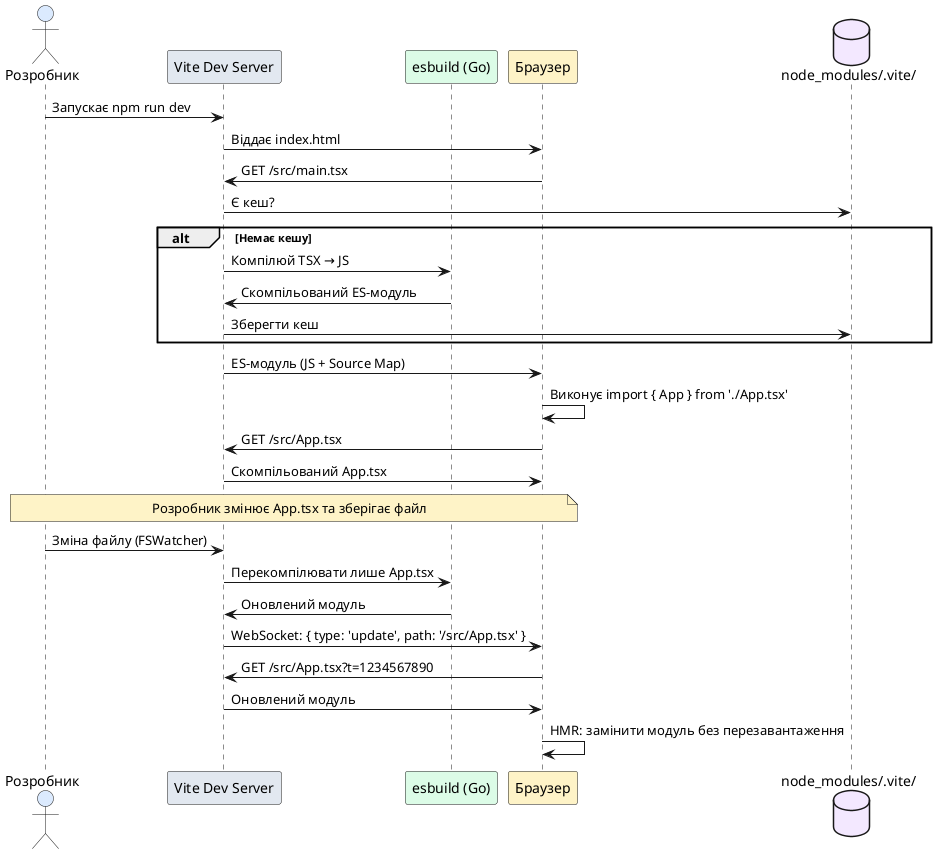

# Від одного HTML-файлу до повноцінного проєкту

::card-group

::card{title="🎯 Мета лекції" icon="i-lucide-target"}

- Зрозуміти повний шлях коду від JSX до браузера через різні підходи до збірки.
- Опанувати етапи еволюції React-проєктів: від CDN HTML-файлу до Vite + TypeScript.
- Усвідомити, чому компіляція заздалегідь та інструменти збірки є стандартом індустрії.
- Навчитися створювати та налаштовувати сучасний React-проєкт із TypeScript через Vite.

::

::card{title="🔑 Ключові терміни" icon="i-lucide-key"}

- **JSX** (*JavaScript XML*) — синтаксичне розширення JavaScript для опису UI-структури.
- **Babel** — транспілятор (*transpiler*), що перетворює сучасний JavaScript та JSX у код, зрозумілий браузерам.
- **Vite** — інструмент збірки нового покоління з блискавичним dev-сервером та HMR (*Hot Module Replacement*).
- **CDN** (*Content Delivery Network*) — мережа серверів для швидкої доставки статичних файлів бібліотек.
- **TypeScript** — надмножина JavaScript із статичною типізацією та перевіркою типів на етапі компіляції.

::

::

> 🔗 **Офіційний референс React:**  
> [Побудова React-застосунку з нуля](https://uk.react.dev/learn/build-a-react-app-from-scratch) · [Встановлення](https://uk.react.dev/learn/installation)

---

## Філософська передмова: чому не «просто відкрити HTML»?

Перш ніж занурюватися в компоненти, хуки та систему управління станом, важливо зрозуміти фундаментальну проблему: **браузер не розуміє JSX**. JSX — це не частина стандарту ECMAScript, а синтаксичне розширення, яке вимагає попередньої обробки.

Уявіть собі будівництво. Архітектурні креслення (JSX) не є самою будівлею — потрібна бригада будівельників (компілятор), яка перетворить креслення на реальні конструкції (JavaScript-виклики). Точно так само JSX потребує трансформації у звичайні виклики функцій `React.createElement()` або сучасних `_jsx()`, `_jsxs()` з `react/jsx-runtime`.

Ця лекція демонструє три основні підходи до цієї трансформації, від найпростішого (але непрактичного) до промислового стандарту.

---

## Етап перший: один HTML-файл із Babel у браузері

Найшвидший спосіб почати експериментувати з React — це один HTML-файл, де бібліотека Babel компілює JSX **прямо в браузері під час завантаження сторінки**. Жодних інструментів збірки, жодного Node.js, жодного терміналу — достатньо текстового редактора та веб-браузера.

### Мінімальний приклад

Створіть файл `react-cdn.html` із наступним вмістом:

```html
<!DOCTYPE html>
<html lang="uk">
<head>
  <meta charset="UTF-8" />
  <meta name="viewport" content="width=device-width, initial-scale=1.0" />
  <title>React без збірки — CDN + Babel</title>
  <style>
    body {
      font-family: -apple-system, BlinkMacSystemFont, 'Segoe UI', sans-serif;
      display: flex;
      justify-content: center;
      align-items: center;
      min-height: 100vh;
      margin: 0;
      background: linear-gradient(135deg, #667eea 0%, #764ba2 100%);
    }
    #root {
      background: white;
      padding: 2rem;
      border-radius: 1rem;
      box-shadow: 0 10px 40px rgba(0, 0, 0, 0.2);
    }
    h1 {
      margin: 0;
      color: #1e293b;
      font-size: 1.75rem;
    }
  </style>
</head>
<body>
  <div id="root"></div>

  <!-- React та ReactDOM із CDN (development builds) -->
  <script src="https://unpkg.com/react@19/umd/react.development.js" crossorigin></script>
  <script src="https://unpkg.com/react-dom@19/umd/react-dom.development.js" crossorigin></script>

  <!-- Babel Standalone: компілює JSX прямо в браузері -->
  <script src="https://unpkg.com/@babel/standalone/babel.min.js"></script>

  <!-- Наш React-код із JSX -->
  <script type="text/babel">
    // Найпростіший JSX-елемент — один заголовок
    const element = <h1>Привіт, React без жодної збірки!</h1>;

    const root = ReactDOM.createRoot(document.getElementById('root'));
    root.render(element);
  </script>
</body>
</html>
```

Відкрийте цей файл у браузері (просто подвійним кліком або через меню `File → Open`). Ви побачите стилізований заголовок «Привіт, React без жодної збірки!».

::note
**Що таке `<h1>...</h1>` у JavaScript-коді?**

Це JSX-синтаксис — розширення JavaScript, яке дозволяє писати HTML-подібну розмітку прямо у коді. Браузер **не розуміє** цього синтаксису. Babel перехоплює блок `<script type="text/babel">`, трансформує JSX у звичайні виклики функцій та створює новий `<script>`, який браузер уже може виконати.

::

### Що відбувається під капотом?

1. **Завантаження бібліотек із CDN:**  
   Браузер завантажує React та ReactDOM як глобальні об'єкти `window.React` та `window.ReactDOM`. Версії `umd` (Universal Module Definition) спеціально розроблені для роботи через `<script>`-теги.

2. **Babel Standalone перехоплює `<script type="text/babel">`:**  
   Коли браузер зустрічає незнайомий `type`, він не виконує скрипт. Babel Standalone знаходить всі такі блоки, парсить їхній вміст, перетворює JSX на `React.createElement()` та **динамічно створює новий `<script>`-тег** із скомпільованим JavaScript-кодом, який браузер уже може виконати.

3. **Виконання та рендер:**  
   Скомпільований код викликає `ReactDOM.createRoot()` та рендерить JSX-елемент у DOM-елемент із `id="root"`.

### Крок за кроком: від простого до складного

Розглянемо еволюцію JSX від найпростішого елемента до складної структури.

**Крок 1: Один елемент без дочірніх вузлів**

```jsx
// Найпростіший JSX — один тег
const element = <h1>Привіт!</h1>;
```

Babel перетворює це на:

```js
const element = React.createElement("h1", null, "Привіт!");
```

Функція `React.createElement(type, props, children)` повертає простий JavaScript-об'єкт:

```js
{
  type: "h1",
  props: {
    children: "Привіт!"
  },
  key: null,
  ref: null
}
```

Цей об'єкт називається **React Element** — незмінний опис того, що повинно бути у DOM.

**Крок 2: Додаємо атрибути (пропси)**

```jsx
const element = <h1 className="title">Привіт!</h1>;
```

Трансформація:

```js
const element = React.createElement("h1", { className: "title" }, "Привіт!");
```

Результат:

```js
{
  type: "h1",
  props: {
    className: "title",
    children: "Привіт!"
  }
}
```

**Крок 3: Вставляємо JavaScript-вирази через фігурні дужки**

```jsx
const name = "React";
const element = <h1>Привіт, {name}!</h1>;
```

Трансформація:

```js
const name = "React";
const element = React.createElement("h1", null, "Привіт, ", name, "!");
```

Усередині фігурних дужок `{}` може бути **будь-який JavaScript-вираз**: змінна, виклик функції, обчислення.

**Крок 4: Вкладені елементи**

```jsx
const element = (
  <div>
    <h1>Привіт!</h1>
    <p>Це React.</p>
  </div>
);
```

Трансформація:

```js
const element = React.createElement(
  "div",
  null,
  React.createElement("h1", null, "Привіт!"),
  React.createElement("p", null, "Це React.")
);
```

React Element стає деревом об'єктів:

```js
{
  type: "div",
  props: {
    children: [
      { type: "h1", props: { children: "Привіт!" } },
      { type: "p", props: { children: "Це React." } }
    ]
  }
}
```

::tip
**Ключовий момент:**

JSX — це не HTML і не рядок. Це синтаксичний цукор для виклику функцій. Кожен JSX-елемент перетворюється на виклик `React.createElement()`, який повертає звичайний JavaScript-об'єкт. React читає ці об'єкти та створює реальний DOM.

::

::warning
**Чому цей підхід не використовується у продакшн-проєктах:**

- **Повільний старт сторінки:** Babel Standalone важить ~900 KB (не gzip). Браузер завантажує його, парсить ваш JSX-код та компілює його **кожного разу** при оновленні сторінки. Для великих застосунків це може зайняти кілька секунд.
- **Відсутність модульної системи:** Неможливо використовувати `import`/`export`, тому весь код повинен бути в одному файлі або підключатися через множинні `<script>`-теги у суворому порядку.
- **Немає TypeScript:** Відсутня перевірка типів на етапі розробки.
- **Немає оптимізацій:** Код не мініфікується, неTree-shakiться, не розбивається на чанки (*code-splitting*).

Цей підхід підходить **виключно для навчання** та швидких експериментів з React у CodePen або JSFiddle.

::

---

## Етап другий: компіляція заздалегідь і простий Node.js-сервер

Наступний крок еволюції — **перенести компіляцію з браузера на етап розробки**. Ідея проста: ми компілюємо JSX у звичайний JavaScript **до того**, як браузер отримає файл, і віддаємо браузеру вже готовий код.

Цей підхід усуває затримку завантаження Babel Standalone, але все ще не вирішує питання модульної системи та TypeScript.

### Встановлення Babel як CLI-інструмента

Створіть новий проєкт та встановіть Babel:

::tabs
::tabs-item{label="pnpm"}
```bash
mkdir my-react-experiment && cd my-react-experiment
pnpm init
pnpm add -D @babel/core @babel/cli @babel/preset-react
```
::
::tabs-item{label="npm"}
```bash
mkdir my-react-experiment && cd my-react-experiment
npm init -y
npm install --save-dev @babel/core @babel/cli @babel/preset-react
```
::
::tabs-item{label="yarn"}
```bash
mkdir my-react-experiment && cd my-react-experiment
yarn init -y
yarn add -D @babel/core @babel/cli @babel/preset-react
```
::
::

Структура проєкту:

```
my-react-experiment/
├── node_modules/
├── src/
│   └── app.jsx       # Вихідний JSX-код
├── dist/
│   ├── index.html    # HTML-файл для браузера
│   └── app.js        # Скомпільований JavaScript (створюється Babel)
├── package.json
└── server.js         # Простий Node.js HTTP-сервер
```

### Вихідний JSX-файл

Створіть `src/app.jsx`:

```jsx
// src/app.jsx — цей файл містить JSX, який браузер не розуміє

// Крок 1: Простий елемент
const title = <h1>Привіт, React!</h1>;

// Крок 2: Додаємо змінну через фігурні дужки
const name = "React";
const greeting = <h1>Привіт, {name}!</h1>;

// Крок 3: Створюємо структуру із кількох елементів
const element = (
  <div className="greeting">
    <h1>Привіт від React!</h1>
    <p>Цей JSX був скомпільований через попередню компіляцію.</p>
    <p>Babel виконав трансформацію під час збірки.</p>
  </div>
);

const root = ReactDOM.createRoot(document.getElementById("root"));
root.render(element);
```

### Компіляція через Babel CLI

Виконайте команду компіляції:

```bash
npx babel src/app.jsx --presets=@babel/preset-react --out-file dist/app.js
```

Результат у `dist/app.js` — чистий JavaScript без JSX:

```js
// dist/app.js — браузер розуміє цей код без жодного Babel

// Крок 1: Простий елемент
const title = React.createElement("h1", null, "Привіт, React!");

// Крок 2: Додаємо змінну
const name = "React";
const greeting = React.createElement("h1", null, "Привіт, ", name, "!");

// Крок 3: Структура із кількох елементів
const element = React.createElement(
  "div",
  { className: "greeting" },
  React.createElement("h1", null, "Привіт від React!"),
  React.createElement("p", null, "Цей JSX був скомпільований через попередню компіляцію."),
  React.createElement("p", null, "Babel виконав трансформацію під час збірки.")
);

const root = ReactDOM.createRoot(document.getElementById("root"));
root.render(element);
```

### Простий Node.js HTTP-сервер

Створіть `server.js`:

```js
// server.js — мінімальний dev-сервер (~25 рядків)
const http = require("http");
const fs = require("fs");
const path = require("path");

const MIME_TYPES = {
  ".html": "text/html",
  ".js": "text/javascript",
  ".css": "text/css",
  ".json": "application/json",
};

const server = http.createServer((req, res) => {
  const filePath = req.url === "/" ? "/index.html" : req.url;
  const fullPath = path.join(__dirname, "dist", filePath);
  const ext = path.extname(fullPath);

  fs.readFile(fullPath, (err, data) => {
    if (err) {
      res.writeHead(404, { "Content-Type": "text/plain" });
      res.end("404 Not Found");
      return;
    }
    res.writeHead(200, { "Content-Type": MIME_TYPES[ext] || "text/plain" });
    res.end(data);
  });
});

const PORT = 3000;
server.listen(PORT, () => {
  console.log(`🚀 Сервер працює на http://localhost:${PORT}`);
});
```

### HTML-файл для браузера

Створіть `dist/index.html`:

```html
<!DOCTYPE html>
<html lang="uk">
<head>
  <meta charset="UTF-8" />
  <meta name="viewport" content="width=device-width, initial-scale=1.0" />
  <title>React із попередньою компіляцією</title>
  <style>
    body {
      font-family: -apple-system, system-ui, sans-serif;
      display: flex;
      justify-content: center;
      align-items: center;
      min-height: 100vh;
      margin: 0;
      background: linear-gradient(135deg, #667eea 0%, #764ba2 100%);
    }
    #root {
      background: white;
      padding: 2.5rem;
      border-radius: 1rem;
      box-shadow: 0 20px 60px rgba(0, 0, 0, 0.3);
      max-width: 500px;
    }
    h1 {
      margin: 0 0 1rem;
      color: #1e293b;
      font-size: 1.875rem;
    }
    p {
      margin: 0.5rem 0 0;
      color: #475569;
      line-height: 1.6;
    }
  </style>
</head>
<body>
  <div id="root"></div>

  <!-- React та ReactDOM із CDN (у продакшні вони теж були б локальними) -->
  <script src="https://unpkg.com/react@19/umd/react.development.js" crossorigin></script>
  <script src="https://unpkg.com/react-dom@19/umd/react-dom.development.js" crossorigin></script>

  <!-- Скомпільований JavaScript — тепер це звичайний JS, а не text/babel! -->
  <script src="/app.js"></script>
</body>
</html>
```

### Запуск проєкту

```bash
node server.js
```

Відкрийте `http://localhost:3000` у браузері. Сторінка завантажується **миттєво**, без затримки на компіляцію, оскільки JSX вже перетворено на JavaScript під час збірки.

::note
**Ключова різниця з першим підходом:**

У першому варіанті `<script type="text/babel">` змушував Babel парсити та компілювати JSX при кожному завантаженні сторінки. Тепер компіляція відбувається **один раз** (`npx babel ...`), а браузер отримує готовий JavaScript.

Це принципово швидше, але все ще незручно:

- Доводиться вручну запускати `babel` після кожної зміни коду.
- Немає модульної системи — неможливо розбити код на окремі файли з `import`/`export`.
- Немає TypeScript.
- Немає HMR (*Hot Module Replacement*) — при зміні коду потрібно вручну перезавантажувати браузер.

::

---

## Етап третій: Vite + React + TypeScript — промисловий стандарт

Усі проблеми попередніх підходів вирішують сучасні інструменти збірки (*build tools*). **Vite** (*фр. «швидкий»*) — збирач нового покоління від творця Vue.js, що поєднує:

- **Блискавичний dev-сервер** на основі нативних ES-модулів браузера.
- **Hot Module Replacement (HMR)** — зміни в коді миттєво відображаються в браузері без повного перезавантаження.
- **Вбудовану підтримку TypeScript** — `.tsx` файли компілюються автоматично.
- **Автоматичну компіляцію JSX/TSX** через esbuild (написаний на Go, швидший за Babel у 10–100 разів).
- **Оптимізацію для продакшну** — мініфікація, tree-shaking, code-splitting, lazy loading.

Саме цей підхід ми будемо використовувати протягом усього курсу.

### Створення проєкту через Vite

Vite надає офіційний scaffolding-інструмент `create-vite` із шаблонами для різних фреймворків та мов. Для React + TypeScript виконайте:

::tabs
::tabs-item{label="pnpm"}
```bash
pnpm create vite my-react-app --template react-ts
cd my-react-app
pnpm install
pnpm dev
```
::
::tabs-item{label="npm"}
```bash
npm create vite@latest my-react-app -- --template react-ts
cd my-react-app
npm install
npm run dev
```
::
::tabs-item{label="yarn"}
```bash
yarn create vite my-react-app --template react-ts
cd my-react-app
yarn install
yarn dev
```
::
::

Після запуску `pnpm dev` (або `npm run dev`) у терміналі з'явиться повідомлення:

::terminal-preview{title="pnpm dev" :cursor="true"}
<div class="line"><span class="opacity-40">$</span> <strong class="font-bold">pnpm dev</strong></div>
<div class="line"></div>
<div class="line"><span class="text-blue-400 font-bold">VITE</span> v6.0.11  ready in <span class="text-green-400 font-bold">342 ms</span></div>
<div class="line"></div>
<div class="line">  <span class="text-green-400">➜</span>  <span class="opacity-60">Local:</span>   <span class="text-cyan-400">http://localhost:5173/</span></div>
<div class="line">  <span class="text-green-400">➜</span>  <span class="opacity-60">Network:</span> use <span class="opacity-60">--host</span> to expose</div>
<div class="line"></div>
<div class="line">  <span class="opacity-60">press</span> <span class="text-cyan-400 font-bold">h + enter</span> <span class="opacity-60">to show help</span></div>
::

Відкрийте `http://localhost:5173` у браузері — побачите стартову сторінку з логотипами React та Vite, інтерактивним лічильником та анімаціями.

### Структура проєкту

::code-tree

```text [my-react-app/]
my-react-app/
├── node_modules/          # Встановлені залежності (не коміттяться в Git)
├── public/                # Статичні файли (копіюються як є)
│   └── vite.svg
├── src/                   # Вихідний код застосунку
│   ├── assets/            # Ресурси (зображення, шрифти)
│   │   └── react.svg
│   ├── App.css            # Стилі головного компонента
│   ├── App.tsx            # Головний компонент
│   ├── index.css          # Глобальні стилі
│   ├── main.tsx           # Точка входу React
│   └── vite-env.d.ts      # Типізація змінних середовища Vite
├── .gitignore             # Файли, які ігноруються Git
├── eslint.config.js       # Конфігурація ESLint
├── index.html             # Точка входу HTML
├── package.json           # Метадані проєкту та скрипти
├── tsconfig.app.json      # TypeScript для застосунку
├── tsconfig.json          # Базова конфігурація TypeScript
├── tsconfig.node.json     # TypeScript для Node.js частин (vite.config.ts)
└── vite.config.ts         # Конфігурація Vite
```

::

::tip
**Відмінність від Create React App (CRA):**

У минулому стандартом був `create-react-app`, але він застарів і більше не рекомендується офіційною документацією React. CRA використовує Webpack, який значно повільніший за Vite, та має складну внутрішню конфігурацію.

Vite — це сучасний стандарт для React-проєктів. Якщо ви бачите старі туторіали з CRA — ігноруйте їх та використовуйте Vite.

::

### Точка входу: `index.html`

На відміну від традиційних збирачів (Webpack, Parcel), де точкою входу є JavaScript-файл, у Vite **точкою входу є `index.html`** у корені проєкту. Це природний підхід — адже браузер завжди починає з HTML.

```html
<!doctype html>
<html lang="en">
  <head>
    <meta charset="UTF-8" />
    <link rel="icon" type="image/svg+xml" href="/vite.svg" />
    <meta name="viewport" content="width=device-width, initial-scale=1.0" />
    <title>Vite + React + TS</title>
  </head>
  <body>
    <div id="root"></div>
    <!-- Vite автоматично перетворить цей відносний шлях на оброблений модуль -->
    <script type="module" src="/src/main.tsx"></script>
  </body>
</html>
```

Зверніть увагу на `<script type="module">` — Vite використовує нативну модульну систему браузера (`import`/`export`) під час розробки, що робить старт миттєвим.

### Точка входу React: `src/main.tsx`

Файл `main.tsx` — це місце, де React «монтується» (*mount*) до DOM:

```tsx
import { StrictMode } from 'react'
import { createRoot } from 'react-dom/client'
import './index.css'
import App from './App.tsx'

createRoot(document.getElementById('root')!).render(
  <StrictMode>
    <App />
  </StrictMode>,
)
```

**Розберемо рядок за рядком:**

1. **`import { StrictMode } from 'react'`** — імпортуємо компонент `StrictMode`, який активує додаткові перевірки та попередження у режимі розробки (не впливає на продакшн).

2. **`import { createRoot } from 'react-dom/client'`** — імпортуємо функцію для створення кореневого React-дерева. У React 18+ це новий Concurrent Mode API.

3. **`import './index.css'`** — імпортуємо глобальні стилі. Vite автоматично обробляє CSS та інжектує його через `<style>`-тег.

4. **`import App from './App.tsx'`** — імпортуємо головний компонент. TypeScript автоматично перевіряє наявність файлу та його типи.

5. **`document.getElementById('root')!`** — отримуємо DOM-елемент із `id="root"`. Знак оклику `!` (*non-null assertion operator*) каже TypeScript: «Я впевнений, що цей елемент існує, не перевіряй на `null`».

6. **`createRoot(...).render(<App />)`** — створюємо React-корінь та рендеримо компонент `App` всередині `<StrictMode>`.

::note
**Що таке StrictMode?**

`<StrictMode>` — це компонент-обгортка, який активує додаткові перевірки у режимі розробки:

- Попередження про застарілі методи життєвого циклу.
- Подвійний виклик функцій компонентів (для виявлення побічних ефектів).
- Попередження про небезпечні шаблони використання рефів.

У продакшн-збірці `StrictMode` не робить нічого — він лише допомагає виявити проблеми під час розробки.

::

### Головний компонент: `src/App.tsx`

Стартовий шаблон містить простий лічильник:

```tsx
import './App.css'

function App() {
  return (
    <div className="app">
      <h1>Привіт, Vite + React!</h1>
      <p>Це стартовий шаблон для React-проєкту.</p>
    </div>
  )
}

export default App
```

Спробуйте змінити текст `"Привіт, Vite + React!"` на `"Мій перший React-проєкт!"` та збережіть файл. **Зміни миттєво з'являться в браузері без перезавантаження сторінки** — це і є Hot Module Replacement у дії.

::note
**Що таке `function App()`?**

Це React-**компонент** — функція, яка повертає JSX. Компоненти ми детально розглянемо у наступних лекціях. Поки що зверніть увагу, що компонент — це просто функція, яка повертає React Elements (JSX).

::

### Конфігурація TypeScript: `tsconfig.json`

Vite-шаблон `react-ts` створює три конфігураційні файли TypeScript:

1. **`tsconfig.json`** — базова конфігурація, яка розширюється іншими.
2. **`tsconfig.app.json`** — конфігурація для коду застосунку (`src/`).
3. **`tsconfig.node.json`** — конфігурація для Node.js частин (`vite.config.ts`).

Погляньмо на `tsconfig.app.json`:

```json
{
  "compilerOptions": {
    "target": "ES2020",
    "useDefineForClassFields": true,
    "lib": ["ES2020", "DOM", "DOM.Iterable"],
    "module": "ESNext",
    "skipLibCheck": true,

    /* Bundler mode */
    "moduleResolution": "bundler",
    "allowImportingTsExtensions": true,
    "isolatedModules": true,
    "moduleDetection": "force",
    "noEmit": true,
    "jsx": "react-jsx",

    /* Linting */
    "strict": true,
    "noUnusedLocals": true,
    "noUnusedParameters": true,
    "noFallthroughCasesInSwitch": true,
    "noUncheckedSideEffectImports": true
  },
  "include": ["src"]
}
```

**Ключові опції:**

- **`"jsx": "react-jsx"`** — вмикає сучасний JSX Transform (React 17+), який **не вимагає** `import React from 'react'` у кожному файлі. Компілятор автоматично імпортує `_jsx` з `react/jsx-runtime`.

- **`"strict": true`** — вмикає всі суворі перевірки типів (обов'язково для якісного TypeScript-коду).

- **`"noEmit": true`** — TypeScript не генерує вихідні `.js` файли, оскільки компіляцію виконує Vite через esbuild. TypeScript тут використовується лише для перевірки типів.

- **`"moduleResolution": "bundler"`** — спеціальний режим резолюції модулів для збирачів, що підтримує розширення `.tsx` в імпортах.

::tip
**Чому TypeScript не генерує JavaScript?**

У традиційному TypeScript-проєкті компілятор `tsc` генерує `.js` файли з `.ts` вихідників. Але у Vite-проєктах компіляцію виконує esbuild (частина Vite), який у 20–100 разів швидший за `tsc`.

TypeScript тут виконує лише **перевірку типів** (`tsc --noEmit`), а саму компіляцію робить Vite. Це досягається опцією `"noEmit": true`.

::

### Скрипти у `package.json`

```json
{
  "scripts": {
    "dev": "vite",
    "build": "tsc -b && vite build",
    "lint": "eslint .",
    "preview": "vite preview"
  }
}
```

- **`pnpm dev`** (або `npm run dev`) — запускає dev-сервер із HMR на `http://localhost:5173`.
- **`pnpm build`** (або `npm run build`) — спочатку перевіряє типи (`tsc -b`), потім збирає продакшн-версію у папку `dist/`.
- **`pnpm lint`** (або `npm run lint`) — запускає ESLint для перевірки якості коду.
- **`pnpm preview`** (або `npm run preview`) — запускає локальний сервер для перегляду продакшн-збірки з папки `dist/`.

---

## Порівняльна таблиця трьох підходів

| Критерій | CDN + Babel у браузері | Babel CLI + Node.js сервер | Vite + React + TS |
|----------|------------------------|----------------------------|-------------------|
| **Швидкість старту** | Повільна (компіляція при кожному завантаженні) | Швидка (компіляція один раз) | **Блискавична** (ES-модулі + esbuild) |
| **HMR** | ❌ Немає | ❌ Немає | ✅ Так |
| **TypeScript** | ❌ Немає | ❌ Немає | ✅ Вбудована підтримка |
| **Модульна система** | ❌ Немає (`import`/`export` не працює) | ❌ Потребує налаштування | ✅ Нативні ES-модулі |
| **Оптимізація для продакшну** | ❌ Немає | ❌ Потребує ручного налаштування | ✅ Автоматична (tree-shaking, мініфікація, code-splitting) |
| **Складність налаштування** | Жодної (один HTML-файл) | Середня (ручна компіляція) | **Мінімальна** (один scaffolding-скрипт) |
| **Розмір застосунку** | Великий (Babel ~900 KB) | Середній | **Малий** (оптимізований бандл) |
| **Використання у продакшні** | ❌ Ніколи | ❌ Рідко (лише для мікросервісів) | ✅ **Стандарт індустрії** |

---

## Що відбувається під капотом Vite?

Щоб зрозуміти, чому Vite такий швидкий, потрібно розглянути дві фази його роботи: **розробка** (*development*) та **продакшн** (*production*).

### Режим розробки (dev)

У режимі розробки Vite **не збирає весь застосунок** в один бандл. Замість цього він:

1. **Використовує нативні ES-модулі браузера:**  
   Сучасні браузери підтримують `<script type="module">` та синтаксис `import`/`export`. Vite віддає кожен файл окремо, і браузер сам формує граф залежностей.

2. **Компілює файли на льоту через esbuild:**  
   Коли браузер запитує файл `App.tsx`, Vite миттєво компілює його через esbuild (написаний на Go, швидший за Babel у 10–100 разів) та віддає як ES-модуль.

3. **Кешує результати:**  
   Vite кешує скомпільовані модулі у `node_modules/.vite/`, тому повторні запуски миттєві.

4. **HMR через WebSocket:**  
   Vite встановлює WebSocket-з'єднання між браузером та сервером. Коли ви зберігаєте файл, сервер надсилає лише змінений модуль, і браузер «гаряче» замінює його без перезавантаження сторінки.

::plant-uml{alt="Архітектура Vite Dev Server"}



::

### Режим продакшну (build)

У продакшн-збірці Vite змінює стратегію:

1. **Збирає весь застосунок через Rollup:**  
   Rollup створює оптимізований бандл із tree-shaking (видалення невикористаного коду), мініфікацією та code-splitting.

2. **Розбиває на чанки (*chunks*):**  
   Великі застосунки розбиваються на окремі файли, які завантажуються лише за потреби (*lazy loading*).

3. **Оптимізує ресурси:**  
   Зображення, шрифти та CSS автоматично оптимізуються та хешуються для кешування браузером.

Виконайте `pnpm build` (або `npm run build`) та погляньте на папку `dist/`:

::code-tree

```text [dist/]
dist/
├── assets/
│   ├── index-B2xK3fHj.css     # Об'єднаний та мініфікований CSS
│   ├── index-DiwrgTda.js      # Головний JavaScript-бандл
│   ├── react-CHdo91hT.svg     # Оптимізоване зображення
│   └── vite-4wt3Vexc.svg
├── index.html                  # HTML із хешованими посиланнями
└── vite.svg
```

::

Файл `index.html` автоматично оновлюється з хешованими посиланнями:

```html
<!doctype html>
<html lang="en">
  <head>
    <script type="module" crossorigin src="/assets/index-DiwrgTda.js"></script>
    <link rel="stylesheet" crossorigin href="/assets/index-B2xK3fHj.css">
  </head>
  <body>
    <div id="root"></div>
  </body>
</html>
```

Хеші у назвах файлів (`DiwrgTda`, `B2xK3fHj`) змінюються лише при зміні вмісту файлу. Це дозволяє браузеру агресивно кешувати файли — старі версії залишаються у кеші, нові завантажуються автоматично.

---

## Чому TypeScript є обов'язковим у сучасній React-розробці

TypeScript — це не просто «JavaScript із типами». Це **система статичної верифікації коду**, яка виявляє помилки **до запуску застосунку**, а не під час виконання в браузері користувача.

### Проблема динамічної типізації JavaScript

Розгляньмо приклад помилки, яку JavaScript не виявить:

```jsx
// JavaScript — помилка виявиться лише у runtime
const name = "Іван";
const age = "20"; // Рядок замість числа!

const element = (
  <div>
    <h2>{name}</h2>
    <p>Вік через рік: {age + 1}</p>
  </div>
);

// У браузері побачимо: "Вік через рік: 201" замість 21
// JavaScript конкатенує рядки замість додавання чисел
```

Цей код **скомпілюється без попереджень**, але результат буде неправильним. JavaScript не перевіряє типи — він просто виконує операції так, як вони написані.

Інший приклад:

```jsx
const user = { name: "Іван", email: "ivan@example.com" };

const element = (
  <div>
    <h2>{user.name}</h2>
    <p>Email: {user.email}</p>
    <p>Вік: {user.age}</p>
  </div>
);

// У браузері: "Вік: undefined"
// Поле age не існує, але JavaScript не попередить
```

### Рішення через TypeScript

TypeScript виявляє помилки **до запуску коду**:

```tsx
// TypeScript — помилка виявляється одразу
const name: string = "Іван";
const age: number = 20; // Тип зафіксовано як number

const nextYearAge: number = age + 1; // TypeScript знає, що age — число
// Результат: 21 (правильно!)

// Спроба присвоїти рядок замість числа:
const wrongAge: number = "20";
//    ~~~~~~~~ Error: Type 'string' is not assignable to type 'number'
```

Для складніших структур даних:

```tsx
interface User {
  name: string;
  email: string;
  age: number;
}

// TypeScript одразу помітить відсутнє поле
const user: User = { 
  name: "Іван", 
  email: "ivan@example.com" 
};
// Error: Property 'age' is missing in type '{ name: string; email: string; }' 
//        but required in type 'User'

// Правильний варіант:
const correctUser: User = {
  name: "Іван",
  email: "ivan@example.com",
  age: 20
};

const element = (
  <div>
    <h2>{correctUser.name}</h2>
    <p>Email: {correctUser.email}</p>
    <p>Вік: {correctUser.age}</p>
  </div>
);
```

TypeScript **негайно підкреслить** помилку у редакторі (VS Code, WebStorm) ще до збереження файлу.

::tip
**Переваги TypeScript для React:**

1. **Автодоповнення та IntelliSense:**  
   Редактор знає всі пропси компонента, методи об'єктів та доступні хуки. Натисніть `Ctrl + Space` — побачите всі можливі варіанти.

2. **Рефакторинг без страху:**  
   Змінили інтерфейс компонента? TypeScript одразу покаже всі місця, де потрібно оновити виклики.

3. **Документація коду:**  
   Інтерфейси пропсів — це жива документація. Не потрібно гадати, які пропси приймає компонент — все видно з типів.

4. **Виявлення помилок на ранніх етапах:**  
   95% помилок, які зазвичай виявляються у браузері, TypeScript знаходить під час написання коду.

5. **Покращена співпраця у команді:**  
   Новий розробник одразу розуміє структуру даних та API компонентів без читання документації.

::

### Приклад еволюції компонента з JavaScript на TypeScript

::code-group

```jsx [JavaScript — відсутня типізація]
// Який тип даних очікується? Невідомо.
const button = {
  label: "Натиснути",
  onClick: () => console.log("Клік"),
  variant: "primary"
};

const element = (
  <button 
    className={`btn btn-${button.variant}`}
    onClick={button.onClick}
  >
    {button.label}
  </button>
);

// Можна передати будь-що — помилки не будуть виявлені
const brokenButton = {
  label: 123,                    // Число замість рядка
  onClick: "not-a-function",     // Рядок замість функції
  variant: "unknown-variant"     // Неіснуючий варіант
};
// Ніяких попереджень під час компіляції!
```

```tsx [TypeScript — строга типізація]
// Чіткий контракт: які поля обов'язкові, які типи даних
interface ButtonData {
  label: string;                           // Обов'язковий текст
  onClick: () => void;                     // Обов'язкова функція
  disabled?: boolean;                      // Опційний — за замовчуванням false
  variant?: 'primary' | 'secondary' | 'danger'; // Обмежений набір варіантів
}

const button: ButtonData = {
  label: "Натиснути",
  onClick: () => console.log("Клік"),
  variant: "primary"
};

const element = (
  <button 
    className={`btn btn-${button.variant}`}
    onClick={button.onClick}
    disabled={button.disabled}
  >
    {button.label}
  </button>
);

// TypeScript одразу попередить про помилки:
const brokenButton: ButtonData = {
  label: 123,
  //     ~~~ Error: Type 'number' is not assignable to type 'string'
  onClick: () => {},
  variant: "unknown"
  //       ~~~~~~~~~ Error: Type '"unknown"' is not assignable to type '"primary" | "secondary" | "danger"'
};
```

::

### Типізація хуків React

TypeScript особливо корисний у типізації хуків, де JavaScript дозволяє легко допустити помилку:

```tsx
import { useState } from 'react';

// TypeScript автоматично виводить тип: number
const [count, setCount] = useState(0);

// Помилка — неможливо присвоїти рядок змінній типу number
setCount("10");
//       ~~~~ Error: Argument of type 'string' is not assignable to parameter of type 'number'

// Правильно
setCount(10);
setCount((prev) => prev + 1);


// Для складних типів — явна анотація
interface User {
  id: string;
  name: string;
  email: string;
}

// TypeScript знає, що user може бути User або null
const [user, setUser] = useState<User | null>(null);

// Помилка — відсутнє поле email
setUser({ id: "1", name: "Іван" });
//      ~~~~~~~~~~~~~~~~~~~~~~~~ Error: Property 'email' is missing

// Правильно
setUser({ id: "1", name: "Іван", email: "ivan@example.com" });
setUser(null); // Також дозволено, оскільки тип User | null
```

::note
**Коли TypeScript виводить типи автоматично:**

TypeScript достатньо розумний, щоб вивести більшість типів автоматично (*type inference*). У багатьох випадках явна анотація не потрібна:

```tsx
// Тип автоматично виводиться як string
const name = "Олександр";

// Тип автоматично виводиться як number
const [count, setCount] = useState(0);

// Тип автоматично виводиться як User
const user = { id: "1", name: "Іван", email: "ivan@example.com" };
```

Явну анотацію типів слід додавати у двох випадках:

1. Коли TypeScript не може вивести тип (наприклад, `useState(null)` без анотації матиме тип `null`, а не `User | null`).
2. Коли ви хочете явно задокументувати очікуваний тип для інших розробників.

::

---

## Розбір структури Vite-проєкту: файли та їхнє призначення

Після створення проєкту через `npm create vite` у вас з'являється кілька конфігураційних файлів. Розгляньмо кожен докладно.

### `vite.config.ts` — конфігурація збирача

Цей файл містить налаштування Vite. У базовому шаблоні він мінімальний:

```ts
import { defineConfig } from 'vite'
import react from '@vitejs/plugin-react'

// https://vite.dev/config/
export default defineConfig({
  plugins: [react()],
})
```

**Що тут відбувається:**

- **`defineConfig`** — допоміжна функція для автодоповнення та перевірки типів конфігурації.
- **`plugins: [react()]`** — підключає офіційний React-плагін, що додає підтримку Fast Refresh (HMR для React), JSX Transform та оптимізації.

У реальних проєктах сюди додають:

- Аліаси шляхів (`resolve.alias`) для уникнення відносних імпортів `../../../`.
- Змінні середовища (`define`).
- Проксі для API (`server.proxy`).
- Налаштування портів (`server.port`).

Приклад розширеної конфігурації:

```ts
import { defineConfig } from 'vite'
import react from '@vitejs/plugin-react'
import path from 'path'

export default defineConfig({
  plugins: [react()],
  resolve: {
    alias: {
      '@': path.resolve(__dirname, './src'),
      '@components': path.resolve(__dirname, './src/components'),
      '@utils': path.resolve(__dirname, './src/utils'),
    },
  },
  server: {
    port: 3000,
    proxy: {
      '/api': {
        target: 'http://localhost:8000',
        changeOrigin: true,
      },
    },
  },
})
```

Тепер замість `import Button from '../../../components/Button'` можна писати `import Button from '@components/Button'`.

### `tsconfig.json` та його розширення

Базовий `tsconfig.json` просто розширює інші конфігурації:

```json
{
  "files": [],
  "references": [
    { "path": "./tsconfig.app.json" },
    { "path": "./tsconfig.node.json" }
  ]
}
```

Це схема **project references** — TypeScript-механізм для розділення конфігурацій між різними частинами проєкту. Код застосунку (`src/`) та Node.js-конфігурація (`vite.config.ts`) мають різні вимоги до модульної системи та цільової версії JavaScript.

**`tsconfig.app.json`** — для коду застосунку:

```json
{
  "compilerOptions": {
    "target": "ES2020",           // Цільова версія ECMAScript
    "lib": ["ES2020", "DOM"],     // Доступні API (DOM для браузера)
    "jsx": "react-jsx",           // Сучасний JSX Transform
    "module": "ESNext",           // Модульна система ES-модулів
    "moduleResolution": "bundler", // Резолюція для збирачів
    "strict": true,               // Суворі перевірки типів
    "noEmit": true                // TypeScript не генерує .js файли
  },
  "include": ["src"]
}
```

**`tsconfig.node.json`** — для Node.js частин (`vite.config.ts`, скрипти):

```json
{
  "compilerOptions": {
    "target": "ES2022",
    "lib": ["ES2023"],
    "module": "ESNext",
    "skipLibCheck": true,
    "moduleResolution": "bundler",
    "allowSyntheticDefaultImports": true,
    "strict": true,
    "noEmit": true
  },
  "include": ["vite.config.ts"]
}
```

### `package.json` — метадані та залежності

```json
{
  "name": "my-react-app",
  "private": true,
  "version": "0.0.0",
  "type": "module",
  "scripts": {
    "dev": "vite",
    "build": "tsc -b && vite build",
    "lint": "eslint .",
    "preview": "vite preview"
  },
  "dependencies": {
    "react": "^19.3.0",
    "react-dom": "^19.3.0"
  },
  "devDependencies": {
    "@eslint/js": "^9.17.0",
    "@types/react": "^19.3.0",
    "@types/react-dom": "^19.3.0",
    "@vitejs/plugin-react": "^4.3.4",
    "eslint": "^9.17.0",
    "eslint-plugin-react-hooks": "^5.0.0",
    "eslint-plugin-react-refresh": "^0.4.16",
    "globals": "^15.14.0",
    "typescript": "~5.6.2",
    "typescript-eslint": "^8.18.2",
    "vite": "^6.0.11"
  }
}
```

**Ключові поля:**

- **`"type": "module"`** — вказує Node.js використовувати ES-модулі (`import`/`export`) замість CommonJS (`require`).
- **`dependencies`** — бібліотеки, необхідні для роботи застосунку у браузері (React, React DOM).
- **`devDependencies`** — інструменти для розробки: Vite, TypeScript, ESLint, типи для React. Вони **не потрапляють у продакшн-бандл**.

::tip
**Версії залежностей:**

- **Карет (`^`)** — `^18.3.1` дозволяє оновлення мінорних та патч-версій (до 19.0.0, але не включно). Це безпечно для стабільних бібліотек.
- **Тильда (`~`)** — `~5.6.2` дозволяє лише патч-оновлення (5.6.x). Використовується для більш консервативного підходу.
- **Точна версія** — `5.6.2` без префіксу — завжди встановлюється саме ця версія.

У команді рекомендується використовувати **lock-файли** (`package-lock.json`, `pnpm-lock.yaml`, `yarn.lock`), щоб всі розробники мали однакові версії залежностей.

::

### `.gitignore` — файли, що не потрапляють у Git

```
# Залежності
node_modules/

# Логи
*.log
npm-debug.log*
yarn-debug.log*
pnpm-debug.log*

# Результати збірки
dist/
dist-ssr/

# Локальні файли редакторів
.vscode/
.idea/

# Змінні середовища (можуть містити секрети)
.env
.env.local
.env.production.local

# Кеш
.vite/
```

**Чому `node_modules/` не коміттяться:**

Папка `node_modules/` може містити десятки тисяч файлів та важити сотні мегабайт. Замість того, щоб зберігати всі ці файли у Git, зберігається лише `package.json` та `package-lock.json`, і кожен розробник відновлює залежності через `npm install`.

---

## Практичне завдання: експерименти з JSX та TypeScript

Тепер, коли ви розумієте структуру проєкту, спробуйте самостійно експериментувати з JSX-синтаксисом та типізацією.

### Завдання 1: Прості JSX-елементи з типізацією

Створіть кілька простих JSX-елементів із використанням TypeScript-типів.

**Вимоги:**

1. Створіть змінну `title` типу `string` із текстом заголовка.
2. Створіть змінну `age` типу `number` із віком користувача.
3. Створіть JSX-елемент, що виводить: "Користувачу [ім'я] [вік] років".
4. Додайте умовний вивід: якщо вік більше 18, показати "Повнолітній", інакше "Неповнолітній".

::::accordion

:::accordion-item{label="📋 Завдання: Типізовані дані" icon="i-lucide-clipboard-list"}

Створіть файл `src/UserInfo.tsx`:

```tsx
// TODO: Крок 1 — Оголосіть змінну name типу string
// const name: string = "...";

// TODO: Крок 2 — Оголосіть змінну age типу number  
// const age: number = ...;

// TODO: Крок 3 — Створіть змінну isAdult (boolean), яка дорівнює true, якщо age >= 18
// const isAdult: boolean = ...;

// TODO: Крок 4 — Створіть JSX-елемент, що виводить:
// <div>
//   <h2>Користувачу {name} {age} років</h2>
//   <p>{isAdult ? "Повнолітній" : "Неповнолітній"}</p>
// </div>

// TODO: Експортуйте елемент
// export const userInfo = ...;
```

Імпортуйте `userInfo` у `App.tsx` та відрендеріть:

```tsx
import { userInfo } from './UserInfo'

function App() {
  return <div>{userInfo}</div>
}

export default App
```

:::

:::accordion-item{label="✅ Розв'язок" icon="i-lucide-check-circle"}

**`src/UserInfo.tsx`:**

```tsx
// Крок 1: Оголошуємо ім'я
const name: string = "Олександр";

// Крок 2: Оголошуємо вік
const age: number = 22;

// Крок 3: Обчислюємо, чи користувач повнолітній
const isAdult: boolean = age >= 18;

// Крок 4: Створюємо JSX-елемент
export const userInfo = (
  <div style={{ padding: "1rem", fontFamily: "system-ui, sans-serif" }}>
    <h2>Користувачу {name} {age} років</h2>
    <p>{isAdult ? "Повнолітній" : "Неповнолітній"}</p>
  </div>
);
```

**`src/App.tsx`:**

```tsx
import { userInfo } from './UserInfo'

function App() {
  return (
    <div style={{ padding: '2rem' }}>
      {userInfo}
    </div>
  )
}

export default App
```

**Покроковий аналіз:**

1. **Типізація примітивів** — `const name: string` та `const age: number` чітко вказують типи даних. TypeScript попередить, якщо спробувати присвоїти неправильний тип.

2. **Обчислення boolean-значення** — `const isAdult: boolean = age >= 18` — результат порівняння завжди має тип `boolean`.

3. **Фігурні дужки у JSX** — `{name}` та `{age}` вставляють значення змінних у розмітку. Це може бути будь-який JavaScript-вираз.

4. **Тернарний оператор** — `{isAdult ? "A" : "B"}` — якщо `isAdult` дорівнює `true`, рендериться "A", інакше "B". Це скорочена форма `if-else` для JSX.

5. **Експорт константи** — `export const userInfo = ...` дозволяє імпортувати цей JSX-елемент в інших файлах.

::note
**Чому це працює без компонентів?**

JSX-елемент `userInfo` — це просто JavaScript-об'єкт (React Element), який описує структуру DOM. React може відрендерити його напряму через `root.render()` або вставити всередину іншого JSX через фігурні дужки `{userInfo}`.

Компоненти (функції, що повертають JSX) — це наступний рівень абстракції, який дозволяє створювати **багаторазово використовувані** шаблони з параметрами. Їх ми вивчимо у наступних лекціях.

::

:::

::::

---

## Підсумки

::card-group

::card{title="✅ Що ви опанували" icon="i-lucide-check-circle-2"}

- Розуміння трьох підходів до компіляції React-коду: CDN + Babel у браузері, Babel CLI + Node.js сервер, Vite + TypeScript.
- Усвідомлення того, що JSX завжди перетворюється на `React.createElement()` або `_jsx()`, і це робить компілятор, а не React.
- Створення сучасного React-проєкту через `npm create vite` із шаблоном `react-ts`.
- Розуміння структури Vite-проєкту: точка входу `index.html`, `main.tsx`, конфігурації TypeScript.
- Чому TypeScript є обов'язковим інструментом для професійної React-розробки.

::

::card{title="🚀 Наступні кроки" icon="i-lucide-rocket"}

- **Лекція 02:** Філософія React — декларативний підхід, Virtual DOM, reconciliation, однонаправлений потік даних.
- **Лекція 03:** JSX та TSX — синтаксис, правила, відмінності від HTML, фігурні дужки як вікно у TypeScript-вирази.
- **Лекція 04:** Компоненти — будівельні блоки інтерфейсу, функціональні компоненти, композиція, експорт/імпорт.

::

::

::tip
**Рекомендації для закріплення матеріалу:**

1. Створіть власний Vite-проєкт та експериментуйте зі структурою файлів.
2. Спробуйте створити 3–5 типізованих об'єктів даних та відобразіть їх через JSX у `App.tsx`.
3. Погляньте на вкладку **Network** у DevTools браузера під час запуску dev-сервера — побачите, що кожен файл завантажується окремо як ES-модуль.
4. Виконайте `pnpm build` (або `npm run build`) та дослідіть папку `dist/` — порівняйте розмір файлів у dev-режимі та продакшн-збірці.

::
