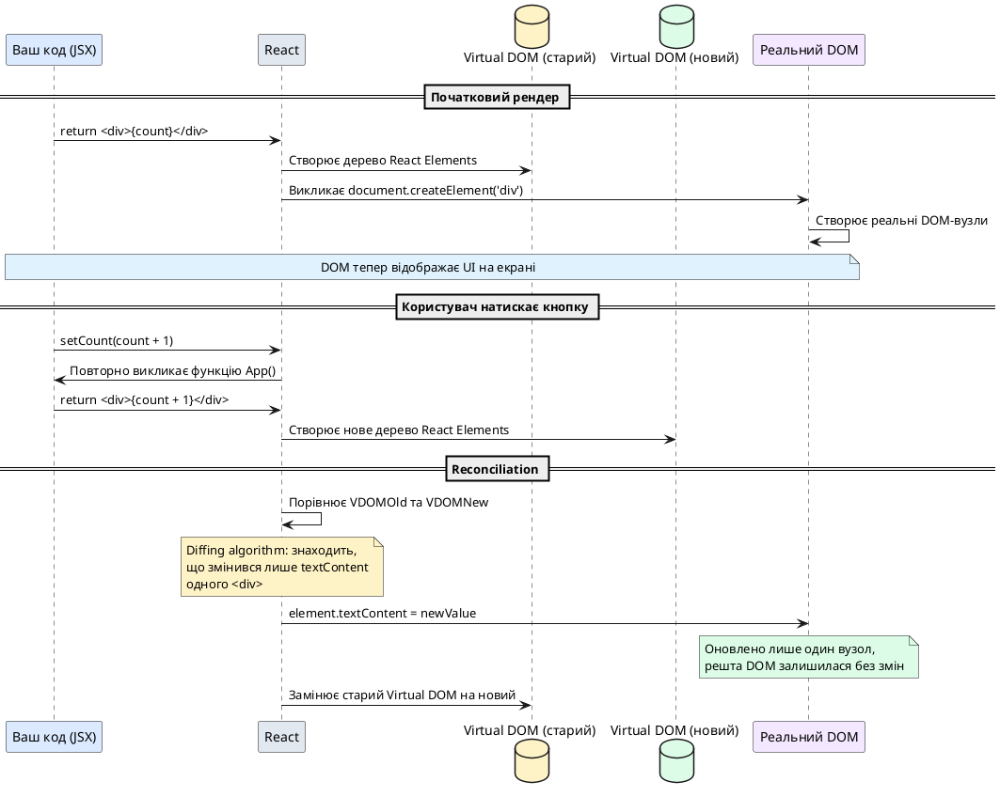

# Що таке React

::card-group

::card{title="🎯 Мета лекції" icon="i-lucide-target"}

- Зрозуміти філософію React: декларативний підхід проти імперативного.
- Усвідомити, що таке Virtual DOM та як він працює.
- Опанувати процес reconciliation — як React визначає, що змінилося у DOM.
- Навчитися розрізняти React Elements та DOM-елементи.
- Зрозуміти однонаправлений потік даних (*unidirectional data flow*).

::

::card{title="🔑 Ключові терміни" icon="i-lucide-key"}

- **Декларативне програмування** (*declarative programming*) — опис **що** повинно бути, а не **як** це зробити.
- **Імперативне програмування** (*imperative programming*) — покрокові інструкції **як** змінити стан системи.
- **Virtual DOM** — легковажне JavaScript-представлення реального DOM-дерева.
- **Reconciliation** — процес порівняння попереднього та нового Virtual DOM для визначення мінімальних змін.
- **React Element** — незмінний JavaScript-об'єкт, що описує вузол UI (результат JSX або `React.createElement()`).

::

::

> 🔗 **Офіційний референс React:**  
> [Швидкий старт](https://uk.react.dev/learn) · [Мислення в стилі React](https://uk.react.dev/learn/thinking-in-react)

---

## React — це бібліотека, а не фреймворк

**React** — це JavaScript-бібліотека для побудови користувацьких інтерфейсів, створена командою Meta (Facebook) у 2013 році. Ключове слово тут — саме **бібліотека**, а не фреймворк.

**Різниця між бібліотекою та фреймворком:**

- **Бібліотека** — це набір інструментів, які **ви викликаєте** у своєму коді, коли вам це потрібно. Ви контролюєте архітектуру застосунку.
  
- **Фреймворк** — це цілісна система, яка **викликає ваш код** у певних точках. Фреймворк диктує структуру проєкту, систему маршрутизації, управління станом.

React зосереджений на **одній задачі** — ефективному рендерингу UI. Він не нав'язує:

- Систему маршрутизації (можна використати React Router, TanStack Router або інше).
- Підхід до управління станом (Redux, Zustand, MobX, Context API).
- Спосіб взаємодії з сервером (Axios, Fetch API, RTK Query, TanStack Query).
- Інструменти збірки (Vite, Webpack, Parcel, Rollup).

Це дає гнучкість, але вимагає прийняття рішень. Саме тому існують **full-stack React-фреймворки** (Next.js, Remix), які додають опінійовану структуру поверх React.

::note
**Чому React називають "view-бібліотекою"?**

У класичній архітектурі MVC (*Model-View-Controller*) React відповідає лише за **View** — те, що бачить користувач. Логіка даних (*Model*) та обробка подій (*Controller*) реалізуються окремо, часто через зовнішні бібліотеки.

::

---

## Імперативний підхід: як ми маніпулювали DOM раніше

Перш ніж зрозуміти, що пропонує React, потрібно побачити проблему, яку він вирішує.

### Приклад: лічильник на чистому JavaScript

Уявімо простий лічильник із кнопкою "+1". У **імперативному підході** ми вручну знаходимо DOM-елементи, оновлюємо їхній вміст та додаємо обробники подій.

```html
<!DOCTYPE html>
<html lang="uk">
<head>
  <meta charset="UTF-8" />
  <title>Імперативний лічильник</title>
  <style>
    body {
      font-family: system-ui, sans-serif;
      display: flex;
      justify-content: center;
      align-items: center;
      min-height: 100vh;
      margin: 0;
      background: #f8fafc;
    }
    .counter {
      background: white;
      padding: 2rem;
      border-radius: 0.75rem;
      box-shadow: 0 1px 3px rgba(0, 0, 0, 0.1);
      text-align: center;
    }
    .value {
      font-size: 3rem;
      font-weight: bold;
      color: #1e293b;
      margin-bottom: 1rem;
    }
    button {
      padding: 0.75rem 1.5rem;
      font-size: 1rem;
      font-weight: 600;
      background: #3b82f6;
      color: white;
      border: none;
      border-radius: 0.5rem;
      cursor: pointer;
      transition: background 0.2s;
    }
    button:hover {
      background: #2563eb;
    }
  </style>
</head>
<body>
  <div class="counter">
    <div class="value" id="count">0</div>
    <button id="increment">Збільшити +1</button>
  </div>

  <script>
    // Імперативний підхід: покрокові інструкції
    let count = 0;

    // Крок 1: Знайти DOM-елементи
    const countElement = document.getElementById('count');
    const button = document.getElementById('increment');

    // Крок 2: Додати обробник події
    button.addEventListener('click', () => {
      // Крок 3: Оновити стан
      count = count + 1;

      // Крок 4: ВРУЧНУ оновити DOM
      countElement.textContent = count;
    });
  </script>
</body>
</html>
```

**Проблеми цього підходу:**

1. **Ручна синхронізація стану та UI:**  
   Кожного разу, коли змінюється `count`, ми **вручну** оновлюємо `countElement.textContent`. У великому застосунку це призводить до помилок — легко забути оновити якийсь елемент.

2. **Розпорошена логіка:**  
   Структура HTML знаходиться в одному місці, а логіка оновлення — в іншому. Важко відстежити, де саме змінюється DOM.

3. **Неефективність при масових оновленнях:**  
   Якщо потрібно оновити 100 елементів, ми викликаємо 100 операцій DOM, кожна з яких тригерить перерахунок layout (*reflow*) та перемальовування (*repaint*).

4. **Відсутність композиції:**  
   Важко повторно використовувати логіку. Якщо потрібні два лічильники, доведеться дублювати код або писати складні функції з параметрами.

::warning
**Чому пряма маніпуляція DOM повільна?**

DOM — це не просто JavaScript-об'єкт. Це API браузера, що зв'язує JavaScript із рушієм рендерингу (Blink у Chrome, Gecko у Firefox). Кожен виклик `element.textContent = ...` або `element.classList.add(...)` може викликати:

- **Reflow** (*перерахунок layout*) — браузер визначає розміри та позиції всіх елементів.
- **Repaint** (*перемальовування*) — браузер малює пікселі на екрані.

Ці операції дорогі. React мінімізує їх через батчінг (*batching*) та розумне оновлення.

::

---

## Декларативний підхід React: опис результату, а не процесу

React пропонує радикально інший підхід: замість того, щоб **інструктувати** браузер, як змінити DOM, ми **описуємо**, як повинен виглядати UI для заданого стану.

### Той самий лічильник у React

::react-project-preview{title="Декларативний лічильник на React" entry="src/App.tsx" :height="520"}

```tsx [src/App.tsx]
import { useState } from 'react';
import './App.css';

function App() {
  // Стан: поточне значення лічильника
  const [count, setCount] = useState(0);

  // Декларативний опис UI: "коли count змінюється, React сам оновить DOM"
  return (
    <div className="counter">
      <div className="value">{count}</div>
      <button onClick={() => setCount(count + 1)}>
        Збільшити +1
      </button>
    </div>
  );
}

export default App;
```

```css [src/App.css]
body {
  font-family: system-ui, -apple-system, sans-serif;
  background: #f8fafc;
  margin: 0;
  padding: 0;
}

.counter {
  background: white;
  padding: 2rem;
  border-radius: 0.75rem;
  box-shadow: 0 1px 3px rgba(0, 0, 0, 0.1);
  text-align: center;
  max-width: 240px;
  margin: 2rem auto;
}

.value {
  font-size: 3rem;
  font-weight: bold;
  color: #1e293b;
  margin-bottom: 1rem;
}

button {
  padding: 0.75rem 1.5rem;
  font-size: 1rem;
  font-weight: 600;
  background: #3b82f6;
  color: white;
  border: none;
  border-radius: 0.5rem;
  cursor: pointer;
  transition: background 0.2s;
}

button:hover {
  background: #2563eb;
}

button:active {
  transform: scale(0.98);
}
```

::

**Що тут відбувається:**

1. **`useState(0)`** — створює змінну стану `count` із початковим значенням `0`. React **запам'ятовує** це значення між рендерами.

2. **`<div className="value">{count}</div>`** — декларативний опис: "відобрази поточне значення `count`". Ми не пишемо `element.textContent = count` вручну.

3. **`onClick={() => setCount(count + 1)}`** — коли користувач натискає кнопку, викликається `setCount` із новим значенням. React **автоматично** перерендерить UI.

4. **React бере на себе синхронізацію:**  
   Ми описали, **що** повинно бути на екрані для заданого `count`. React сам визначає, **як** оновити DOM.

::tip
**Ключова різниця:**

- **Імперативно:** "Знайди елемент із `id="count"`, встанови його `textContent` у `5`."
- **Декларативно:** "Коли `count` дорівнює `5`, відобрази `<div>5</div>`."

React автоматично синхронізує UI зі станом. Ви **ніколи не торкаєтеся DOM напряму**.

::

---

## Що таке React Element?

Коли ви пишете JSX, React перетворює його на **React Element** — простий JavaScript-об'єкт, що описує вузол інтерфейсу.

```tsx
const element = <h1 className="title">Привіт, React!</h1>;
```

Після компіляції це стає:

```js
const element = {
  type: "h1",
  props: {
    className: "title",
    children: "Привіт, React!"
  },
  key: null,
  ref: null
};
```

**React Element — це НЕ DOM-елемент.** Це лише **опис** того, що повинно бути у DOM. React Element:

- **Незмінний** (*immutable*) — після створення його не можна змінити.
- **Легковажний** — це звичайний JavaScript-об'єкт у пам'яті.
- **Дешевий у створенні** — створення тисяч React Elements швидше, ніж одна DOM-операція.

React читає дерево React Elements та **створює або оновлює** реальний DOM відповідно до них.

::note
**Аналогія з архітектурними кресленнями:**

React Element — це креслення будинку (план на папері). DOM-елемент — це реальна цегла та бетон. Архітектор не будує будинок вручну — він передає креслення будівельникам (браузерному рушію), які виконують роботу.

React створює нові "креслення" при кожній зміні стану, порівнює їх із попередніми та каже браузеру: "зміни лише оці три цеглини, решту залиш як є".

::

---

## Virtual DOM: легковажна копія реального DOM

**Virtual DOM** — це JavaScript-представлення реального DOM-дерева. Це дерево React Elements, яке React тримає у пам'яті.

### Як працює Virtual DOM

1. **Початковий рендер:**  
   React створює дерево React Elements (Virtual DOM) на основі вашого JSX.

2. **React перетворює Virtual DOM на реальний DOM:**  
   React викликає DOM API (`document.createElement`, `element.appendChild` тощо) та створює реальні вузли.

3. **Користувач взаємодіє з UI:**  
   Натискає кнопку, вводить текст — викликається `setState` або `setCount`.

4. **React створює нове дерево Virtual DOM:**  
   React **повторно виконує** вашу функцію (наприклад, `App()`) та отримує нове дерево React Elements.

5. **Reconciliation — порівняння старого та нового дерева:**  
   React порівнює попередній Virtual DOM із новим та визначає **мінімальний набір змін**.

6. **React застосовує зміни до реального DOM:**  
   Замість того, щоб перестворювати весь DOM, React змінює лише те, що дійсно змінилося.

### Візуалізація процесу

::plant-uml{alt="Процес рендерингу та reconciliation у React"}



::

**Чому це ефективно?**

- **Батчінг оновлень:** React групує кілька викликів `setState` в один перерендер.
- **Мінімізація DOM-операцій:** Змінюється лише те, що дійсно змінилося.
- **Розумне порівняння:** React використовує евристики (наприклад, `key` у списках), щоб уникнути непотрібних оновлень.

::warning
**Чи Virtual DOM завжди швидший за прямі DOM-операції?**

**Ні.** Якщо вам потрібно оновити один `<div>`, пряме `element.textContent = value` буде швидшим, ніж Virtual DOM.

Але у **реальних застосунках** UI складається з десятків або сотень компонентів, які залежать один від одного. Вручну відстежувати, які саме DOM-вузли потрібно оновити, стає нереально складно.

Virtual DOM дає **передбачуваність** і **підтримуваність** коду, жертвуючи мікросекундами продуктивності на простих операціях.

::

---

## Reconciliation: алгоритм порівняння дерев

**Reconciliation** (*узгодження*) — це процес, у якому React визначає, що змінилося між попереднім та новим Virtual DOM.

### Наївний підхід: повне перерендерювання

Найпростіше рішення — **завжди перестворювати весь DOM**:

```js
// Наївний підхід
function update() {
  const root = document.getElementById('root');
  root.innerHTML = ''; // Видалити все
  root.appendChild(createNewDOM()); // Створити з нуля
}
```

**Проблеми:**

- **Повільно:** Видалення та створення DOM-вузлів — дорога операція.
- **Втрата стану:** Фокус у `<input>`, позиція скролу, анімації — все скидається.
- **Тригери reflow/repaint:** Браузер перераховує layout усієї сторінки.

### Підхід React: порівняння дерев (diffing)

React порівнює старе та нове дерево **вузол за вузлом** та застосовує мінімальні зміни.

**Основні правила reconciliation:**

1. **Різні типи елементів → повна заміна:**

   ```tsx
   // Старе дерево
   <div>Контент</div>

   // Нове дерево
   <span>Контент</span>
   ```

   React видалить `<div>` та створить `<span>` з нуля, включно з усіма дочірніми вузлами.

2. **Однакові типи → оновлення атрибутів:**

   ```tsx
   // Старе дерево
   <div className="box" style={{ color: 'red' }}>Текст</div>

   // Нове дерево
   <div className="card" style={{ color: 'blue' }}>Текст</div>
   ```

   React залишає той самий DOM-вузол, але оновлює `className` та `style`.

3. **Списки елементів — важливість `key`:**

   Коли React бачить масив елементів, він використовує атрибут `key`, щоб зрозуміти, які елементи додані, видалені або переміщені.

   ```tsx
   // Без key — React не знає, що це ті самі елементи
   {items.map(item => <div>{item.name}</div>)}

   // З key — React розуміє ідентичність елементів
   {items.map(item => <div key={item.id}>{item.name}</div>)}
   ```

::tip
**Чому `key` критично важливий у списках?**

Без `key` React припускає, що порядок елементів у масиві відповідає їхній ідентичності. Якщо ви видалите перший елемент, React подумає, що **всі елементи змінилися**, і оновить увесь список.

З `key` React розуміє: "елемент із `key="user-5"` перемістився з позиції 0 на позицію 2" — і просто переміщує DOM-вузол, замість того щоб перестворювати його.

Детально про `key` ми поговоримо у лекції про списки.

::

### Приклад reconciliation

::react-project-preview{title="Reconciliation: оновлення тексту" entry="src/App.tsx" :height="540"}

```tsx [src/App.tsx]
import { useState } from 'react';
import './App.css';

function App() {
  const [text, setText] = useState('Початковий текст');

  return (
    <div className="container">
      <h1>Демонстрація Reconciliation</h1>
      
      <div className="box">
        <p className="text">{text}</p>
      </div>

      <div className="controls">
        <button onClick={() => setText('Текст змінено!')}>
          Змінити текст
        </button>
        <button onClick={() => setText('Початковий текст')}>
          Скинути
        </button>
      </div>

      <div className="explanation">
        <h3>Що робить React:</h3>
        <ul>
          <li>Порівнює старий та новий Virtual DOM</li>
          <li>Бачить, що <code>&lt;div&gt;</code>, <code>&lt;p&gt;</code> не змінилися</li>
          <li>Оновлює лише <strong>textContent</strong> всередині <code>&lt;p&gt;</code></li>
          <li>Решта DOM залишається без змін</li>
        </ul>
      </div>
    </div>
  );
}

export default App;
```

```css [src/App.css]
.container {
  max-width: 600px;
  margin: 2rem auto;
  font-family: system-ui, -apple-system, sans-serif;
  padding: 0 1rem;
}

h1 {
  text-align: center;
  color: #1e293b;
  font-size: 1.75rem;
  margin-bottom: 2rem;
}

.box {
  background: white;
  padding: 2rem;
  border-radius: 0.75rem;
  box-shadow: 0 1px 3px rgba(0, 0, 0, 0.1);
  margin-bottom: 1.5rem;
}

.text {
  font-size: 1.25rem;
  color: #334155;
  margin: 0;
  text-align: center;
}

.controls {
  display: flex;
  gap: 1rem;
  justify-content: center;
  margin-bottom: 2rem;
}

button {
  padding: 0.75rem 1.5rem;
  font-size: 1rem;
  font-weight: 600;
  background: #3b82f6;
  color: white;
  border: none;
  border-radius: 0.5rem;
  cursor: pointer;
  transition: background 0.2s;
}

button:hover {
  background: #2563eb;
}

button:active {
  transform: scale(0.98);
}

.explanation {
  background: #f1f5f9;
  padding: 1.5rem;
  border-radius: 0.75rem;
  border-left: 4px solid #3b82f6;
}

.explanation h3 {
  margin: 0 0 1rem;
  color: #1e293b;
  font-size: 1.125rem;
}

.explanation ul {
  margin: 0;
  padding-left: 1.5rem;
  color: #475569;
  line-height: 1.8;
}

.explanation code {
  background: #e2e8f0;
  padding: 0.125rem 0.375rem;
  border-radius: 0.25rem;
  font-family: 'Courier New', monospace;
  font-size: 0.9em;
  color: #0f172a;
}
```

::

У цьому прикладі React **не перестворює** `<div>`, `<p>` або навіть не змінює їхні класи. Він лише оновлює `textContent` усередині `<p>`. Відкрийте DevTools → Elements та подивіться, як мигає лише текстовий вузол, а не весь елемент.

---

## Однонаправлений потік даних (Unidirectional Data Flow)

React дотримується принципу **однонаправленого потоку даних**: дані рухаються **зверху вниз** по дереву компонентів.

### Схема потоку даних

```
┌─────────────────────────────────────────────────┐
│  Батьківський компонент (App)                   │
│  const [user, setUser] = useState({...})        │
│                                                  │
│  Стан (state) зберігається тут ↑               │
└────────────────┬────────────────────────────────┘
                 │
                 │ Передає дані через props ↓
                 ↓
┌─────────────────────────────────────────────────┐
│  Дочірній компонент (UserProfile)              │
│  function UserProfile({ user }) { ... }         │
│                                                  │
│  Отримує дані, але НЕ може змінити їх напряму  │
└─────────────────────────────────────────────────┘
```

**Правила:**

1. **Дані передаються вниз через props:**  
   Батьківський компонент передає дані дочірньому через атрибути (пропси).

2. **Дочірній компонент не може змінити props напряму:**  
   Props — це read-only. Спроба змінити їх призведе до помилки у StrictMode.

3. **Зміни стану ініціюються через callback-функції:**  
   Якщо дочірній компонент хоче змінити дані батьківського, батьківський передає йому функцію (`setUser`), яку дочірній викликає.

### Приклад: передача стану вниз

::react-project-preview{title="Однонаправлений потік даних" entry="src/App.tsx" :height="600"}

```tsx [src/App.tsx]
import { useState } from 'react';
import './App.css';

// Дочірній компонент: отримує дані через props
function UserCard({ name, age }: { name: string; age: number }) {
  return (
    <div className="card">
      <h2>{name}</h2>
      <p>Вік: {age} років</p>
    </div>
  );
}

// Батьківський компонент: зберігає стан
function App() {
  const [name, setName] = useState('Олександр');
  const [age, setAge] = useState(25);

  return (
    <div className="container">
      <h1>Однонаправлений потік даних</h1>

      {/* Дані передаються ВНИЗ через props */}
      <UserCard name={name} age={age} />

      <div className="controls">
        <div className="control-group">
          <label>Ім'я:</label>
          <input
            type="text"
            value={name}
            onChange={(e) => setName(e.target.value)}
          />
        </div>

        <div className="control-group">
          <label>Вік:</label>
          <input
            type="number"
            value={age}
            onChange={(e) => setAge(Number(e.target.value))}
          />
        </div>
      </div>

      <div className="flow-diagram">
        <div className="arrow">↓</div>
        <p>Стан зберігається у <strong>App</strong></p>
        <div className="arrow">↓</div>
        <p>Дані передаються у <strong>UserCard</strong> через props</p>
        <div className="arrow">↓</div>
        <p><strong>UserCard</strong> відображає дані, але не може їх змінити</p>
      </div>
    </div>
  );
}

export default App;
```

```css [src/App.css]
.container {
  max-width: 600px;
  margin: 2rem auto;
  font-family: system-ui, -apple-system, sans-serif;
  padding: 0 1rem;
}

h1 {
  text-align: center;
  color: #1e293b;
  font-size: 1.75rem;
  margin-bottom: 2rem;
}

.card {
  background: white;
  padding: 2rem;
  border-radius: 0.75rem;
  box-shadow: 0 2px 8px rgba(0, 0, 0, 0.1);
  text-align: center;
  margin-bottom: 2rem;
}

.card h2 {
  margin: 0 0 0.5rem;
  color: #1e293b;
  font-size: 1.5rem;
}

.card p {
  margin: 0;
  color: #64748b;
  font-size: 1.125rem;
}

.controls {
  background: #f8fafc;
  padding: 1.5rem;
  border-radius: 0.75rem;
  margin-bottom: 2rem;
}

.control-group {
  display: flex;
  align-items: center;
  gap: 1rem;
  margin-bottom: 1rem;
}

.control-group:last-child {
  margin-bottom: 0;
}

.control-group label {
  font-weight: 600;
  color: #475569;
  min-width: 60px;
}

.control-group input {
  flex: 1;
  padding: 0.5rem 0.75rem;
  border: 1px solid #cbd5e1;
  border-radius: 0.375rem;
  font-size: 1rem;
  font-family: inherit;
}

.control-group input:focus {
  outline: none;
  border-color: #3b82f6;
  box-shadow: 0 0 0 3px rgba(59, 130, 246, 0.1);
}

.flow-diagram {
  background: #eff6ff;
  padding: 1.5rem;
  border-radius: 0.75rem;
  border-left: 4px solid #3b82f6;
  text-align: center;
}

.flow-diagram p {
  margin: 0;
  color: #1e40af;
  font-size: 0.95rem;
  line-height: 1.6;
}

.flow-diagram strong {
  color: #1e293b;
  font-weight: 700;
}

.arrow {
  font-size: 2rem;
  color: #3b82f6;
  margin: 0.5rem 0;
}
```

::

**Що відбувається:**

1. Стан (`name`, `age`) зберігається у **батьківському** компоненті `App`.
2. `App` передає ці значення у `UserCard` через props: `<UserCard name={name} age={age} />`.
3. `UserCard` **не може** змінити `name` або `age` напряму — вони read-only.
4. Коли користувач вводить дані у `<input>`, викликається `setName` або `setAge` у **батьківському** компоненті.
5. React перерендерює `App`, який передає нові значення у `UserCard`.

::note
**Чому це важливо?**

Однонаправлений потік робить код **передбачуваним**. Ви завжди знаєте, звідки приходять дані — з батьківського компонента. У двонаправленому зв'язку (як у AngularJS 1.x) дані можуть змінюватися з будь-якої точки, що призводить до складних багів.

::

---

