# Робота з зображеннями та діаграмами

## 1. Стратегія вибору джерела (MCP vs DuckDuckGo)

Для отримання максимальної якості ілюстрацій використовується гібридний підхід: **MCP-сервер Pexafy** (стокові фото, UX, концепції) та **DuckDuckGo** (технічні схеми, архітектура, вендорні діаграми).

| Критерій | MCP-сервер Pexafy (`--source mcp`) | DuckDuckGo (`--source ddg`) |
| :--- | :--- | :--- |
| **Призначення** | Концептуальні фото, реальні люди, робочі процеси, мобільні/десктопні UI, UX-дослідження (User Persona, Journey Map), дизайн-мислення, метафори. | Суто інженерні схеми, архітектурні креслення систем, діаграми стеків і протоколів (TCP/IP, OSI, TLS, сокети ядра), блок-схеми. |
| **Типові джерела** | Unsplash, Pexels, Pixabay, Burst. | Офіційна документація вендорів (`k8s.io`, `docker.com`, `go.dev`), тех-блоги (`medium`, `digitalocean`). |
| **Пріоритет формату** | Якісні растрові зображення (PNG / JPEG), роздільна здатність від 1080px. | Векторні SVG або чіткі інженерні схеми PNG. |
| **Спосіб виклику** | Нативний виклик інструменту `pexafy-pexafy-mcp.search_photos` (якщо активний у сесії) **або** через `fetch_images.py --source mcp`. | Через `fetch_images.py --source ddg`. |

> **Авто-режим (`--source auto`, типовий)**: скрипт `fetch_images.py` автоматично розпізнає запит:
> - Якщо запит містить технічні терміни (*architecture, diagram, scheme, protocol, tcp, socket, uml, svg*) → звертається до **DuckDuckGo** для пошуку схем.
> - Якщо запит концептуальний, про користувачів чи інтерфейси (*product, user, interface, persona, team, workspace*) → звертається до **MCP Pexafy**.
> - Якщо обране джерело не повернуло результатів, скрипт автоматично здійснює fallback на альтернативне джерело.

---

## 2. Команди та Workflow

Автоматизація забезпечується двома скриптами: `fetch_images.py` (пошук/завантаження) та `insert_images.py` (вставка у файл).

```bash
# 1. Пошук та завантаження з автоматичним вибором найкращого джерела
python scripts/fetch_images.py "query description" --md content/path/article.md -l 1 -i

# Або з явним вибором джерела:
# Для фото людей, UX та продуктових концепцій (MCP Pexafy):
python scripts/fetch_images.py "team analyzing user personas on board" --md content/path/article.md --source mcp -l 1

# Для технічних схем систем та мережевих протоколів (DuckDuckGo):
python scripts/fetch_images.py "kubernetes cluster architecture" --md content/path/article.md --source ddg -l 1

# 2. Автоматична вставка у markdown замість маркерів <!-- IMAGE: desc -->
python scripts/insert_images.py content/path/article.md
```

---

## 3. Ключові Правила

- **Авто-шлях**: Папка для зображень визначається за шляхом до `.md` файлу (без числових префіксів). 
  - `content/07.tools/02.kubernetes/01.why.md` → `public/images/tools/kubernetes/why/`
  - `content/19.ai-core/01.ai-native-developer/01.digital-products.md` → `public/images/ai-core/ai-native-developer/digital-products/`
- **Нумерація**: Файли іменуються `01.png`, `02.png`, ... строго відповідно до порядку появи в тексті.
- **Якість**: Пріоритет форматам: **SVG** > **PNG** > WebP. Мінімальна ширина: **800px** (рекомендовано 1080–1600px).
- **Джерела**: Пріоритет офіційним докам вендорів або високоякісним студійним стоковим фото.

---

## 4. КРИТИЧНЕ ПРАВИЛО: Image + PlantUML

Кожна технічна та концептуальна ілюстрація (архітектура, схема, потік даних, структура процесу) **ОБОВ'ЯЗКОВО** супроводжується відповідною PlantUML-діаграмою безпосередньо під зображенням для забезпечення доступності та можливості редагування.

- **Світлий фон**: Усі PlantUML-діаграми обов'язково повинні мати білий/світлий задній фон (`skinparam backgroundColor #ffffff`) для контрастності незалежно від теми сайту (світлої чи темної).
- **Валідація**: Обов'язкова перевірка синтаксису PlantUML за допомогою команди:
  ```bash
  python scripts/validate_plantuml.py content/path/article.md
  ```

```markdown
{.diagram-img}

::plant-uml{alt="alt text"}

```plantuml
@startuml
skinparam style plain
skinparam backgroundColor #ffffff
...
@enduml
```

::
```

---

## 5. Підготовка контенту

Додавайте маркери `<!-- IMAGE: опис зображення -->` у місця вставки. Текст після `IMAGE:` автоматично стає `alt`-текстом зображення та запитом за замовчуванням.

---

## 6. Залежності та налаштування

- Python-пакети: `pip install ddgs requests pillow`
- Підключення MCP Smithery: конфігурація в `~/.gemini/config/mcp_config.json` з сервером `insider-arakviel` (Pexafy).
