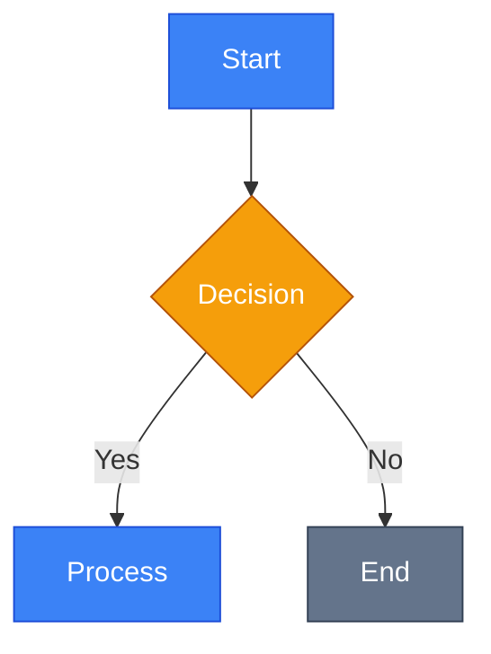

# Промпт для створення навчальних матеріалів (Docus Native)

## Мета

Створити високоякісний, глибокий, цікавий та інтерактивний навчальний контент. Матеріал має бути не "сухою теорією" чи "німим кодом", а **захопливою менторською сесією**, де кожен рядок коду має своє обґрунтування, а кожне нове поняття вводиться через потребу.

## Філософія та Принципи

### 0. Engagement First (Залученість передусім)

-   **Storytelling**: Починайте з проблеми або реального сценарію. Читач має розуміти _навіщо_ йому це потрібно.

### 1. The "Why" Before The "How" (Спочатку "Навіщо")

-   **Заборона на "сліпі" інструкції**: Ніколи не вводьте термін, клас чи метод без пояснення _проблеми_, яку він вирішує.
-   **Еволюція думки**: Покажіть, як ми дійшли до цього рішення. "Ми могли б зробити це через `if/else`, але це призведе до спагетті-коду, тому нам потрібен `Pattern Matching`".

### 2. Scaffolding (Педагогічне риштування)

-   **Плавний перехід**: Нові поняття мають виростати з попередніх. Створіть "місток" між тим, що читач вже знає, і тим, що він зараз вивчить.
-   **Передбачення питань**: Відповідайте на питання "А що, якщо..?" ще до того, як читач встигне його сформулювати.

### 3. **Show, Don't Just Tell**: Візуалізуйте все, що можна. Текст — це клей між візуальними елементами.

### 4. **Interactivity**: Використовуйте компоненти Docus, щоб зробити читання активним процесом.

### 5. Академічна Точність та Гнучкість

-   **Термінологія**: Використовуйте точні поняття. Англійські терміни в дужках при першому згадуванні (наприклад, "Middleware (проміжне програмне забезпечення)").
-   **Стиль**: Формальний, академічний, але живий. Уникайте надмірного спрощення, яке втрачає суть.
-   **Структура**: Нижче наведена _рекомендована_ комплексна структура. ШІ має адаптувати її під тему, обираючи релевантні розділи, але зберігаючи логіку викладу.
-   **Послідовність**: Матеріал має бути послідовним. Не згадуйте речі, які будуть вивчатися безпосередньо нижче.

## Методологія Пояснення Коду (Критично важливо)

Це найважливіша частина. Ви не просто пишете код, ви його **викладаєте**.

### Правило "Анатомії Коду"

Кожен лістинг коду, який не є очевидним, має супроводжуватися текстовим розбором:

1.  **Контекст**: Що ми зараз намагаємося реалізувати?
2.  **Код**: Сам блок коду.
3.  **Декомпозиція**: Пояснення ключових частин (змінних, методів, атрибутів) текстом після коду. Читач має розуміти, що робить конкретний рядок.

### Правило "Німого Коду" (No Silent Code)

-   **ЗАБОРОНЕНО**: Просто вставити блок коду і піти далі.
-   **ОБОВ'ЯЗКОВО**: Використовуйте списки або текст, щоб пояснити _магію_, що відбувається всередині.
    -   _Приклад:_ "Зверніть увагу на рядок 5: тут ми використовуємо `await`, щоб не блокувати основний потік..."

## Мова та Стиль

-   **Українська мова** для всього контенту.
-   **Англійські терміни** в дужках при першому використанні.
-   **Перевага англіцизмам** там, де це є стандартом індустрії (не перекладати "framework" як "каркас", якщо це плутає).
-   **Формальний стиль** без розмовних виразів.
-   **Повні речення** замість уривчастих фраз.

## Інструментарій (Docus Components)

Використовуйте ці компоненти для покращення сприйняття та інтерактивності:

### Структура та Навігація

-   **CodeTree (`::code-tree`)**: Для візуалізації структури файлів та директорій з можливістю перегляду вмісту файлів.
-   **Синтаксис**: Використовуйте окремі code blocks для кожного файлу з вказанням шляху у квадратних дужках.
-   **Формат шляху**: `[папка/файл.ext]` - автоматично створює дерево директорій.
-   **Переваги**: Відображає структуру проєкту + дозволяє перемикатися між файлами для перегляду коду.
-   **Приклад**:

::code-tree

    ```csharp [GlobalUsings.cs]
    global using System;
    global using System.Linq;
    ```

    ```csharp [Services/UserService.cs]
    namespace MyApp.Services;
    public class UserService { }
    ```

::

    -   **Best Practice**: Використовуйте для демонстрації структури проєкту з реальним кодом замість абстрактних прикладів.

-   **CardGroup (`::card-group`)** та **Card (`::card`)**: Для навігації, групування концепцій або резюме.
-   **Steps (`::steps`)**: Для алгоритмів, інструкцій або логічних послідовностей.
-   **Tabs (`::tabs`)**: Для групування контенту за вкладками (наприклад, різні підходи, платформи).
-   **FieldGroup (`::field-group`)** та **Field (`::field`)**: Для документації параметрів, властивостей API або конфігурацій.

### Код

-   **CodeGroup (`::code-group`)**: Ідеально для порівняння синтаксису, конфігурацій або показу файлів поруч.
-   **Collapsible (`::collapsible`)**: Для великих шматків коду або додаткової інформації, яку можна згорнути.
-   **CodePreview (`::code-preview`)**: Для демонстрації результату виконання коду (живий приклад).
-   **CodeCollapse (`::code-collapse`)**: Використовуйте для довгих лістингів коду, які за замовчуванням мають бути згорнуті, щоб не захаращувати інтерфейс.

### Code Block Magic (Магніти для коду)

Використовуйте ці фічі MDC, щоб зробити код живим:

-   **Line Numbers**: Додавайте `showLineNumbers` до всіх блоків коду для відображення нумерації рядків.
-   **Highlighting**: Підсвічуйте важливі рядки `{1,3-5}` або `// [!code highlight]`.
-   **Diffs**: Показуйте зміни `// [!code ++]` та `// [!code --]`.
-   **Filenames**: Додавайте назви файлів ````ts [app.config.ts]`.
-   **Terminal**: Використовуйте `bash` або `sh` для команд.
-   **Focus**: Фокусуйте увагу на певних рядках коду.

### Таблиці та Порівняння (Магніти уваги)

Активно використовувати таблиці для:

-   Порівняння технологій/підходів.
-   Класифікації за критеріями.
-   Параметрів та конфігурацій.
-   Mapping концепцій.

**Приклад:**
| Критерій | Підхід A | Підхід B |
| :--- | :--- | :--- |
| Продуктивність | Висока | Середня |
| Складність | Низька | Висока |

### Акценти та Статуси

-   **Callouts**: Використовуйте спеціальні компоненти для виділення важливої інформації:
    -   `::note`: Додатковий контекст або нейтральна інформація.
    -   `::tip`: Корисні поради, best practices.
    -   `::warning`: Застереження, потенційні проблеми.
    -   `::caution`: Критичні застереження, небезпечні дії.
-   **Badges (`::badge`)**: Для версій, тегів або статусів.
-   **Blockquotes**: Використовуйте стандартний Markdown синтаксис `>` для цитат. Blockquote автоматично стилізується з лівою межею та курсивом.
    -   **Синтаксис**:
        ```markdown
        > Це цитата або важлива примітка.
        > Може займати кілька рядків.
        ```
    -   **Конфігурація стилю** (у `app.config.ts`):
        ```typescript
        export default defineAppConfig({
            uiPro: {
                prose: {
                    blockquote: {
                        base: 'border-s-4 border-accented ps-4 italic',
                    },
                },
            },
        })
        ```

**Приклад Callout:**

```markdown
::tip
Використовуйте `readonly` для незмінних полів, які ініціалізуються лише один раз.
::
```

````

**Приклад Tabs:**

```markdown
::tabs
::tabs-item{label="Windows"}
Встановіть через Chocolatey: `choco install dotnet`
::
::tabs-item{label="macOS"}
Встановіть через Homebrew: `brew install dotnet`
::
::tabs-item{label="Linux"}
Встановіть через APT: `sudo apt install dotnet-sdk-8.0`
::
::
```

### Медіа

-   **Images**: Використовуйте стандартний Markdown `` з підписом.
-   **Video/Embeds**: Для демонстрації роботи інтерфейсу.

## Візуалізація

### Mermaid

Використовуйте кастомний компонент `::mermaid` для створення діаграм, які пояснюють логіку, архітектуру або процеси.

**Кольорова схема для діаграм:**

-   **Primary Color**: `#3b82f6` (Blue)
-   **Secondary Color**: `#64748b` (Slate)
-   **Accent Color**: `#f59e0b` (Amber) - Use for highlighting important nodes.
-   **Background**: Transparent or light gray.
-   **Text Color**: High contrast (black or white depending on background).

**Синтаксис:**

::mermaid



::

**Важливо**:

-   Діаграма автоматично рендериться з **dark theme**
-   Компонент обробляє помилки та показує вихідний код при проблемах
-   Підтримує всі типи Mermaid діаграм: `graph`, `sequenceDiagram`, `classDiagram`, `timeline`, `flowchart` тощо

### Зображення та GIF

**Організація зображень**: Структура директорій для зображень має **дзеркалити структуру контенту**.

**Приклад:**

-   Для файлу: `content/1.csharp/1.fundamentals/1.introduction-to-ecosystem.md`
-   Зображення: `public/images/csharp/fundamentals/introduction-to-ecosystem/diagram.png`
-   У Markdown: ``

**Переваги:**

-   Легко знайти зображення для кожної статті
-   Масштабується для всіх розділів (web, desktop, mobile)
-   Уникає конфліктів назв файлів

Не бійтеся пропонувати місця для зображень, скріншотів або GIF-анімацій. Це робить контент живим.

**Шаблон для плейсхолдерів:**

```markdown


<!-- Search Query: запит для пошуку або інструкція для створення скріншоту -->
```

## Посилання та Навігація

### Створення Гіперпосилань

**Обов'язково створюйте гіперпосилання** в навчальних матеріалах для покращення навігації та глибини вивчення:

-   **Між матеріалами**: Посилайтеся на попередні та наступні теми в межах вашого навчального курсу

    -   Використовуйте відносні шляхи: `[Попередня тема](../section/topic.md)`
    -   Приклад: `[Класи та Об'єкти](./2.classes-objects.md)` або `[Наслідування](../4.oop-pillars.md)`

-   **На офіційні ресурси**: Надавайте посилання на офіційну документацію, специфікації та авторитетні джерела

    -   Використовуйте повні URL: `[Офіційна документація C#](https://learn.microsoft.com/en-us/dotnet/csharp/)`
    -   Приклад: `[Документація по Properties](https://learn.microsoft.com/en-us/dotnet/csharp/programming-guide/classes-and-structs/properties)`

-   **Внутрішні посилання**: Для довгих матеріалів створюйте навігацію по розділам
    -   Використовуйте якорі: `[Перейти до властивостей](#properties)`
    -   Приклад: `[Типи властивостей](#auto-implemented-properties)`

### Best Practices для Посилань

-   **Контекстні посилання**: Додавайте посилання там, де вони мають сенс для розуміння матеріалу
-   **Анотації**: Коротко пояснюйте, куди веде посилання: `[Детальна інструкція по встановленню](https://example.com/install) (офіційний сайт)`
-   **Перевірка**: Переконайтеся, що посилання працюють і ведуть на актуальні ресурси
-   **Баланс**: Не перевантажуйте текст посиланнями, але і не уникайте їх там, де вони корисні

### Приклади Використання Посилань

```markdown
::tip
Для глибшого розуміння цієї теми рекомендуємо ознайомитись з попереднім матеріалом: [Основи ООП](./2.classes-objects.md).
::

Детальніше про цю концепцію можна прочитати в [офіційній документації Microsoft](https://learn.microsoft.com/en-us/dotnet/csharp/programming-guide/classes-and-structs/properties).

Перейти до наступної теми: [Наслідування та Поліморфізм](../4.oop-pillars.md)
```

## Уніфікована Комплексна Структура

Ця структура є гнучким орієнтиром. Не обов'язково слідувати їй строго — це набір компонентів ("частинок"), які можна використовувати частково або надихатися ними залежно від специфіки теми.

### 1. Вступ та Контекст (Introduction & Context)

_Мета: Зацікавити та дати розуміння "навіщо"._

-   **Hook**: Проблема з реального світу або інтригуюче питання.
-   **Goal**: Що ми отримаємо в результаті (скріншот/демо).
-   **Prerequisites**: Що потрібно знати/мати перед початком.
-   **Historical Evolution**: Як ми дійшли до цього рішення (еволюція технології).

### 2. Фундаментальні Концепції (Fundamental Concepts)

_Мета: Дати тверду теоретичну базу._

-   **Definitions**: Академічно точні визначення ключових термінів.
-   **Core Concept**: Сутність рішення.
-   **Analogies**: Аналогії з реального світу для складних абстракцій.

### 3. Архітектура та Механіка (Architecture & Mechanics)

_Мета: Показати, як це працює "під капотом"._

-   **Under the Hood**: Внутрішня архітектура та діаграми взаємодії.
-   **Lifecycle**: Життєвий цикл та порядок виконання.
-   **Patterns & Anti-patterns**: Як треба і як не треба робити.

### 4. Практична Реалізація (Implementation Guide)

_Мета: Навчити застосовувати на практиці._

-   **Steps**: Покрокова інструкція (використовуйте `::steps`).
-   **Code Examples**: Мінімальні, але самодостатні приклади (CodeGroup).
-   **Verification**: Як перевірити, що все працює коректно.
-   **Troubleshooting**: Типові проблеми та їх вирішення.

### 5. Типологія та Порівняння (Typology & Comparison)

_Мета: Допомогти з вибором._

-   **Classification**: Види та типи.
-   **Comparison**: Порівняльні таблиці (переваги/недоліки).
-   **Use Cases**: Коли і що використовувати.

### 6. Практика та Резюме (Practice & Summary)

_Мета: Закріпити знання._

-   **Tasks**: Завдання на аналіз, проектування та кодинг.
-   **Summary**: Короткий підсумок ключових думок.

### 7. Тестування та Квізи (Tests & Quizzes)

_Мета: Перевірити засвоєння матеріалу в інтерактивній формі._

Інтегруйте тести через Tally.so. Для кожного розділу підготуйте **5-10 питань**.

**Інструкція для користувача (User Algorithm):**

1.  **Створіть форму** на [Tally.so](https://tally.so/create).
2.  **Додайте питання**: Використовуйте питання з множинним вибором ("Multiple Choice").
3.  **Налаштуйте підрахунок балів (Scoring)**:
    -   Додайте "Calculated field" з назвою "Score" (початкове значення 0).
    -   Для кожного правильного варіанту відповіді додайте "Conditional Logic" -> "Calculate" -> "Add 10 to Score".
4.  **Налаштуйте результати ("Thank You" pages)**:
    -   Сторінка успіху (наприклад, Score >= 80): "Вітаємо! Ви чудово засвоїли матеріал".
    -   Сторінка для повторення (Score < 80): "Варто повторити матеріал. Ваш результат: @Score".
    -   Додайте логіку переходу на ці сторінки перед кнопкою "Submit".
5.  **Опублікуйте** та надайте **Embed ID** (остання частина URL: tally.so/r/**ID**).

**Вставка в контент:**

Використовуйте компонент `::tally-embed`:

```markdown
## Перевірка знань

Закріпіть отримані знання, пройшовши короткий тест:

::tally-embed{id="YOUR_FORM_ID" title="Назва тесту"}
::

::note
**Примітка**: Якщо тест не відображається, перейдіть за [прямим посиланням](https://tally.so/r/YOUR_FORM_ID).
::
```

## Критерії Якості

-   [ ] **Цікавість**: Чи хочеться це читати? Чи є "гачки" уваги?
-   [ ] **Наочність**: Чи достатньо візуальних матеріалів (діаграми, місця під зображення)?
-   [ ] **Інтерактивність**: Чи використані компоненти Docus для покращення UX?
-   [ ] **Навігація**: Чи є гіперпосилання на пов'язані матеріали та офіційні ресурси?
-   [ ] **Зрозумілість**: Чи пояснені складні речі простою мовою (аналогії)?
-   [ ] **Практичність**: Чи може читач застосувати ці знання?

## Приклад використання промпту

**Запит:**

> Створи навчальний матеріал про [ТЕМА]. Обери найкращу структуру та зроби це цікаво.

**Очікувана реакція ШІ:**

1.  Аналіз теми.
2.  Вибір відповідного архетипу (або комбінації).
3.  Створення контенту з використанням компонентів Docus, діаграм, гіперпосилань та "живої" мови.
````
