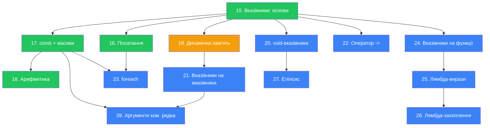

# План модуля «Вказівники та суміжні теми» для курсу C++

## Контекст

Необхідно побудувати академічно впорядкований план матеріалу на основі:
- **Існуючих статей** (15–19): pointers-basics, references, pointers-const-arrays, pointer-arithmetic, dynamic-memory.
- **Довідкових матеріалів** з `temp/cpp/pointers/`: void-вказівники, вказівники на вказівники, вказівники на функції, оператор `->`, foreach, стек/купа (детально), еліпсис, лямбда-вирази, лямбда-захоплення, аргументи командного рядка.

Принцип побудови: **жодна тема не запригує «наперед»** — кожне нове поняття спирається лише на вже введені.

---

## Запропонований порядок тем

> Позначення: `[✅ ІСНУЄ]` — стаття вже написана; `[📝 ДОПОВНИТИ]` — існуюча стаття, до якої варто додати матеріал; `[🆕 НОВА]` — стаття, якої ще немає.

---

### 15. Вказівники: основи `[✅ ІСНУЄ]`
**Файл:** `15.pointers-basics.md`

Поточний зміст повністю достатній:
- Пам'ять та адресація, оператор `&`
- Оголошення та ініціалізація вказівників
- Оператор розіменування `*`
- `nullptr`
- Розмір вказівників
- Для чого потрібні вказівники

---

### 16. Посилання (References) `[✅ ІСНУЄ]`
**Файл:** `16.references.md`

Поточний зміст повністю достатній:
- Що таке посилання, ініціалізація
- l-value та r-value
- Передача за посиланням
- Константні посилання (`const T&`)
- Посилання vs Вказівники

---

### 17. Вказівники, `const` і масиви `[✅ ІСНУЄ]`
**Файл:** `17.pointers-const-arrays.md`

Поточний зміст повністю достатній:
- `const int*`, `int* const`, `const int* const`
- Array Decay
- Передача масивів у функції
- Символьні рядки (`const char*`) та поведінка `cout`

---

### 18. Адресна арифметика `[✅ ІСНУЄ]`
**Файл:** `18.pointer-arithmetic.md`

Поточний зміст повністю достатній:
- Формула адресної арифметики
- Суміжне розташування елементів масиву
- Індексація = синтаксичний цукор `*(arr + n)`
- Ітерація через вказівник

---

### 19. Динамічна пам'ять `[📝 ДОПОВНИТИ]`
**Файл:** `19.dynamic-memory.md`

**Поточний зміст:**
- Стек vs Купа (коротко)
- `new` / `delete`
- Dangling pointers, memory leaks
- Динамічні масиви (`new[]` / `delete[]`)

**Рекомендовані доповнення:**
1. **Розширена секція про сегменти пам'яті** — додати діаграму з сегментами: code, bss, data, heap, stack (довідка: `Стек-і-Купа-в-Сplusplus`).
2. **Стек викликів (Call Stack)** — фрейми, LIFO, покрокова демонстрація. Це природне місце, оскільки тема вже торкається Стеку.
3. **Stack Overflow** — рекурсія без зупинки, занадто великі локальні масиви.
4. **Практичні завдання** — наразі відсутні (§6 з `prompt.md`).

---

### 20. Вказівники типу `void` `[🆕 НОВА]`
**Файл:** `20.void-pointers.md`

**Залежності:** 15 (основи вказівників), 17 (const), 18 (арифметика — щоб пояснити чому вона неможлива).

**Зміст:**
- Що таке `void*` — загальний (generic) вказівник
- Будь-який тип → `void*` (неявне приведення)
- Неможливість розіменування без `static_cast`
- Неможливість арифметики (бо невідомий `sizeof`)
- Приклад: універсальна функція `printValue(void*, Type)`
- Чому `void*` є анти-паттерном у сучасному C++ (перевантаження, шаблони)
- Порівняння: `void*` vs нульовий вказівник vs `nullptr`

---

### 21. Вказівники на вказівники `[🆕 НОВА]`
**Файл:** `21.pointers-to-pointers.md`

**Залежності:** 15 (основи), 19 (динамічна пам'ять, `new[]`).

**Зміст:**
- Подвійне оголошення `int**`, потрійне розіменування
- Масиви вказівників (`int** = new int*[N]`)
- Двовимірні динамічні масиви (масив масивів)
- Альтернатива: «сплющений» одновимірний масив
- Звільнення в зворотному порядку
- Попередження: складність, ризики dangling, рекомендація використовувати `std::vector<std::vector<>>`

---

### 22. Оператор доступу до членів через вказівник (`->`) `[🆕 НОВА]`
**Файл:** `22.member-access-operator.md`

**Залежності:** 15 (основи вказівників), 16 (посилання — для порівняння `.` через ref), структури (стаття з іншого модуля або пояснити inline).

> [!NOTE]
> Ця тема коротка. Її можна або оформити як окрему мікро-статтю, або **включити підрозділом** до однієї із сусідніх тем (наприклад, 21 або 23). Рекомендується окрема стаття для чистоти навігації.

**Зміст:**
- Доступ до членів структури: через `.` (змінна/посилання) та `(*ptr).member`
- Оператор `->` як синтаксичний цукор
- Пріоритет операторів: чому дужки необхідні без `->`
- Приклади зі структурами та динамічно виділеними об'єктами (`new`)

---

### 23. Цикл `for-each` (Range-based for) `[🆕 НОВА]`
**Файл:** `23.foreach-loop.md`

**Залежності:** 15 (вказівники — щоб пояснити обмеження), 16 (посилання — `const auto&`), 17 (array decay — щоб пояснити чому foreach не працює з `int*`), масиви (09), цикли (08).

**Зміст:**
- Синтаксис `for (auto& elem : arr)`
- `auto` у for-each
- Посилання та `const auto&` (уникнення копіювання)
- Робота з `std::vector`, `std::array`
- Обмеження: не працює з вказівниками на масив (Array Decay) та динамічними масивами
- Відсутність індексу — і як обійти (`std::size_t i = 0`)

---

### 24. Вказівники на функції `[🆕 НОВА]`
**Файл:** `24.function-pointers.md`

**Залежності:** 15 (основи вказівників), 12–14 (функції), 17 (const — `const` вказівники на функції).

**Зміст:**
- Функція як l-value з адресою в пам'яті
- Синтаксис оголошення: `int (*fcnPtr)(int, int)`
- Присвоєння функції вказівнику (без `()`)
- Виклик: явне `(*fcnPtr)(args)` та неявне `fcnPtr(args)` розіменування
- Callback-функції: практичний приклад (сортування з кастомним порівнянням)
- Параметри за замовчуванням не працюють через вказівники
- Спрощення з `typedef` / `using`
- `std::function<>` (C++11) — типобезпечна обгортка

---

### 25. Лямбда-вирази `[🆕 НОВА]`
**Файл:** `25.lambda-expressions.md`

**Залежності:** 24 (вказівники на функції — мотивація), 14 (шаблони для auto), 16 (посилання — для `const auto&` у лямбдах).

**Зміст:**
- Мотивація: проблема одноразових callback-функцій
- Синтаксис: `[capture](params) -> ReturnType { body }`
- Тип лямбд (функтори, `auto`, `std::function`)
- Узагальнені (generic) лямбди з `auto`-параметрами (C++14)
- Trailing return type
- Static-змінні в узагальнених лямбдах (окремі інстанси)
- Функціональні об'єкти STL (`std::greater`, `std::less`)

---

### 26. Лямбда-захоплення `[🆕 НОВА]`
**Файл:** `26.lambda-captures.md`

**Залежності:** 25 (лямбда-вирази), 16 (посилання — захоплення за посиланням).

**Зміст:**
- Навіщо потрібне захоплення (області видимості)
- Захоплення за значенням (`[x]`) — клонування, `const`, `mutable`
- Захоплення за посиланням (`[&x]`) — зміна оригіналу
- Захоплення кількох змінних, комбінування
- Захоплення за замовчуванням: `[=]`, `[&]`, змішане
- Визначення нових змінних у capture
- Висячі (dangling) захоплення
- Ненавмисні копії лямбд і `std::ref`

---

### 27. Еліпсис (Variadic Arguments) `[🆕 НОВА]`
**Файл:** `27.ellipsis.md`

**Залежності:** 15 (вказівники), 17 (масиви + C-style рядки), 20 (void*).

**Зміст:**
- Синтаксис `...`, `va_list`, `va_start`, `va_arg`, `va_end`
- Приклад: функція середнього арифметичного
- Небезпеки: відсутність перевірки типів, помилки з підрахунком
- Три способи визначити кількість аргументів: count, sentinel, decoder string
- Чому в сучасному C++ краще використовувати інші механізми

---

### 28. Аргументи командного рядка `[🆕 НОВА]`
**Файл:** `28.command-line-args.md`

**Залежності:** 17 (масиви + C-style рядки, `const char*`), 21 (вказівники на вказівники — `char** argv`).

**Зміст:**
- `int main(int argc, char* argv[])` ≡ `char** argv`
- Як ОС передає аргументи
- Перебір та вивід аргументів
- Конвертація числових аргументів (`std::stringstream`, `std::stoi`)
- Аналіз спеціальних символів (лапки, бекслеш)
- Налаштування аргументів в IDE (VS, VS Code)

---

## Графік залежностей (Mermaid)

**Легенда:** 🟢 Існує — 🟡 Доповнити — 🔵 Нова стаття

---

## Зведена таблиця

| №  | Тема                              | Статус        | Довідковий матеріал з `temp/`                          |
|----|-----------------------------------|---------------|-------------------------------------------------------|
| 15 | Вказівники: основи                | ✅ Існує      | Вказівники-в-Сplusplus, Нульові-вказівники            |
| 16 | Посилання                         | ✅ Існує      | Посилання-в-Сplusplus, Посилання-і-const              |
| 17 | Вказівники, const і масиви        | ✅ Існує      | Вказівники-і-const, Вказівники-і-масиви               |
| 18 | Адресна арифметика                | ✅ Існує      | Адресна-арифметика-і-індексація                       |
| 19 | Динамічна пам'ять                 | 📝 Доповнити  | Динамічне-виділення, Динамічні-масиви, Стек-і-Купа    |
| 20 | Вказівники типу `void`            | 🆕 Нова       | Вказівники-типу-void                                  |
| 21 | Вказівники на вказівники          | 🆕 Нова       | Вказівники-на-вказівники                              |
| 22 | Оператор `->`                     | 🆕 Нова       | Оператор-доступу-до-членів-через                      |
| 23 | Цикл `for-each`                   | 🆕 Нова       | Цикл-foreach                                         |
| 24 | Вказівники на функції             | 🆕 Нова       | Вказівники-на-функції                                 |
| 25 | Лямбда-вирази                     | 🆕 Нова       | Лямбда-вирази                                        |
| 26 | Лямбда-захоплення                 | 🆕 Нова       | Лямбда-захоплення                                     |
| 27 | Еліпсис                           | 🆕 Нова       | Еліпсис-в-Сplusplus                                  |
| 28 | Аргументи командного рядка        | 🆕 Нова       | Аргументи-командного-рядка                            |

---

## Рішення для обговорення

> [!IMPORTANT]
> 1. **Оператор `->` (тема 22):** Стаття дуже коротка (3.8 КБ довідкового тексту). Чи варто її оформлювати як окрему статтю, чи краще включити підрозділом до теми 21 (вказівники на вказівники) або навіть до 15 (основи)?
> 2. **Еліпсис (тема 27):** Це застаріла техніка (C-style variadic). Чи включати її взагалі, враховуючи що в сучасному C++ є variadic templates? Якщо так — скільки глибини: повний матеріал чи лише оглядова стаття?
> 3. **Лямбди (теми 25–26):** Технічно лямбди не є частиною "вказівників", але тісно пов'язані через вказівники на функції та `std::function`. Чи варто включати їх у цей модуль, чи перенести в окремий?

## Верифікація

Оскільки це план текстового контенту (не коду), верифікація полягає у:
1. **Ваш ревю** запропонованого порядку та змісту тем
2. Перевірка, що жодна тема не використовує поняття з наступних тем (залежності йдуть лише «вгору»)
