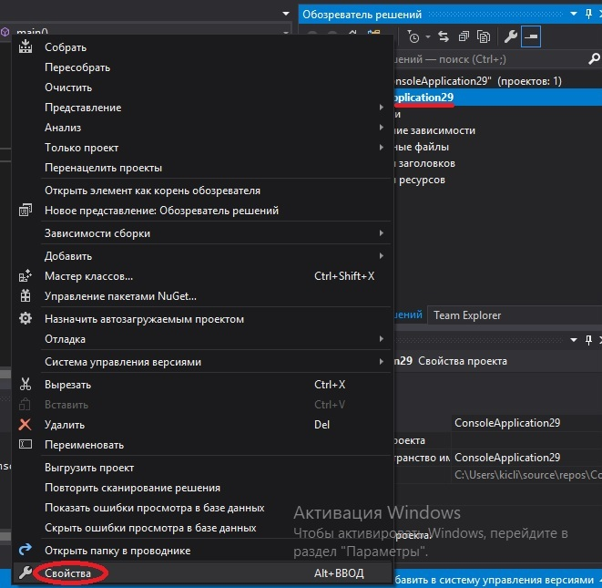
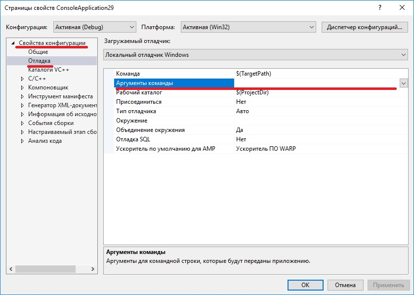
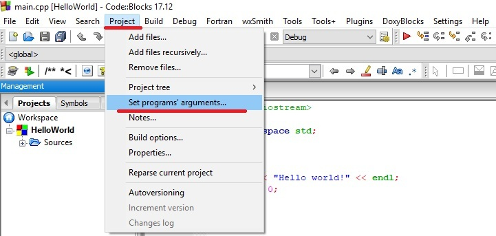

На цьому уроці ми розглянемо, що таке аргументи командного рядка в мові C++ і як вони використовуються.

Зміст:

1.  [Аргументи командного рядка](https://acode.com.ua/urok-116-argumenty-komandnogo-ryadka/#toc-0)
2.  [Передача аргументів командного рядка](https://acode.com.ua/urok-116-argumenty-komandnogo-ryadka/#toc-1)
3.  [Використання аргументів командного рядка](https://acode.com.ua/urok-116-argumenty-komandnogo-ryadka/#toc-2)
4.  [Обробка числових аргументів](https://acode.com.ua/urok-116-argumenty-komandnogo-ryadka/#toc-3)
5.  [Аналіз аргументів командного рядка](https://acode.com.ua/urok-116-argumenty-komandnogo-ryadka/#toc-4)
6.  [Висновки](https://acode.com.ua/urok-116-argumenty-komandnogo-ryadka/#toc-5)

## Аргументи командного рядка

Ми вже знаємо, що при компіляції і лінкінгу компілятор створює виконуваний файл. Коли програма запускається, виконання починається з першого рядка функції main(). До цього уроку ми оголошували main() наступним чином:

|1|int main()|
|---|---|

Зверніть увагу, в цій версії функції main() ніяких параметрів немає. Проте, є багато програм вимагають деякі вхідні дані. Наприклад, припустимо, що ви пишете програму під назвою “Picture”, яка приймає зображення в якості вхідних даних, а потім робить з цього зображення мініатюру (зменшена версія зображення). Як функція picture() дізнається, яке зображення потрібно прийняти і обробити? Користувач повинен повідомити програмі, який файл слід відкрити. Це можна зробити наступним чином:

|1
|---|
2
3
4
5
6
7
8
9
10
11
12
13
14|// Програма: Picture
#include <iostream>
#include <string>
int main()
{
    std::cout << "Enter name of image-file to create a thumbnail for: ";
    std::string filename;
    std::cin \>> filename;
    // Відкриваємо файл-зображення
    // Створюємо мініатюру
    // Виводимо мініатюру
}|

Тут є потенційна проблема. Кожен раз при запуску програма очікуватиме користувацький ввід. Це не проблема, якщо ви вручну запускаєте програму з командного рядка один раз для одного зображення. Але це вже проблема, якщо ви хочете працювати з великою кількістю файлів або щоб інша програма мала можливість запустити цю програму.

Розглянемо це детально. Наприклад, ви хочете створити мініатюри для всіх файлів-зображень, які знаходяться в певному каталозі. Як це зробити? Ви можете запускати цю програму стільки раз, скільки є зображень в каталозі, ввівши кожне ім’я файлу вручну. Однак, якщо є сотні зображень, такий підхід буде, м’яко кажучи, не дуже ефективним! Рішення — написати програму, яка перебирає кожне ім’я файлу в каталозі, викликаючи кожного разу функцію picture() для кожного файлу.

Тепер розглянемо випадок, коли у вас є веб-сайт, і ви хочете, щоб він створював мініатюру кожен раз, коли користувач завантажує зображення на сайт. Ця програма не може приймати вхідні дані з Інтернету і виникає логічне запитання: “Як тоді вводити ім’я файлу?”. Виходом є виклик веб-сервером функції picture() автоматично кожного разу після завантаження файлу.

В обох випадках нам потрібно, щоб зовнішня програма передавала ім’я файлу в якості вхідних даних в нашу програму при її запуску, замість того, щоб функція picture() очікувала, поки користувач вручну введе ім’я файлу.

**Аргументи командного рядка** — це необов’язкові рядкові аргументи, що передаються операційною системою в програму при її запуску. Програма може їх використовувати в якості вхідних даних, або ігнорувати. Подібно до того, як параметри однієї функції надають дані для параметрів іншої функції, так і аргументи командного рядка надають можливість людям або програмам надавати вхідні дані для програми.

## Передача аргументів командного рядка

Виконувані програми можуть запускатися в командному рядку через виклик. Наприклад, для запуску виконуваного файлу `MyProgram`, який знаходиться в кореневому каталозі диска C в Windows, вам потрібно ввести:

`C:\>MyProgram`

Щоб передати аргументи командного рядка в `MyProgram`, вам потрібно буде їх просто перерахувати після імені виконуваного файлу:

`C:\>MyProgram SomeContent.txt`

Тепер, при запуску `MyProgram`, `SomeContent.txt` буде наданий в якості аргументу командного рядка. Програма може мати декілька аргументів командного рядка, розділених пробілами:

`C:\>MyProgram SomeContent.txt SomeOtherContent.txt`

Це також працює і з Linux (хоча структура каталогів відрізнятиметься від структури каталогів в Windows).

Якщо ви запускаєте свою програму з середовища IDE, то ваша IDE повинна надати спосіб вводу аргументів командного рядка.

**_Для користувачів Visual Studio_:** Клацніть правою кнопкою миші по потрібному проекту в меню `"Обозреватель решений" > "Свойства"`:

Потім виберіть `"Свойства конфигурации" > "Отладка"`. На правій панелі буде рядок `"Аргументы команды"`. Ви зможете тут ввести аргументи командного рядка, і вони будуть автоматично передані вашій програмі при її запуску:

**_Користувачам Code::Blocks:_** Виберіть ``"Project" > "Set program`s arguments..."``:

## Використання аргументів командного рядка

Тепер, коли ви знаєте, як передавати аргументи командного рядка в програму, наступним кроком буде доступ до них з програми. Для цього використовується вже інша форма функції main(), яка приймає два аргументи (`argc` і `argv`) наступним чином:

|1|int main(int argc, char \*argv\[\])|
|---|---|

Також ви можете побачити і такий варіант:

|1|int main(int argc, char\*\* argv)|
|---|---|

Хоча обидва варіанти ідентичні за своєю суттю, але рекомендується використовувати перший, так як він інтуїтивно зрозуміліший.

`argc` (англ. _“**arg**ument **c**ount” = “кількість аргументів”_) — це цілочисельний параметр, який містить кількість аргументів, переданих в програму. `argc` завжди буде як мінімум один, так як першим аргументом завжди є ім’я самої програми. Кожен аргумент командного рядка, який надає користувач, змусить `argc` збільшитися на одиницю.

`argv` (англ. _“**arg**ument **v**alues” = “значення аргументів”_) — це місце, де зберігаються фактичні значення аргументів. Хоча оголошення `argv` виглядає трохи лячно, але це всього лише масив [**рядків C-style**](https://acode.com.ua/urok-82-ryadky-c-style/). Довжиною цього масиву є `argc`.

Давайте напишемо коротку програму `MyArguments`, яка виводитиме значення всіх аргументів командного рядка:

|1
|---|
2
3
4
5
6
7
8
9
10
11
12
13|// Програма MyArguments
#include <iostream>
int main(int argc, char \*argv\[\])
{
    std::cout << "There are " << argc << " arguments:\\n";
    // Перебираємо кожний аргумент і виводимо його порядковий номер і значення
    for (int count\=0; count < argc; ++count)
        std::cout << count << " " << argv\[count\] << '\\n';
    return 0;
}|

Тепер, при виклику `MyArguments` з аргументами командного рядку `SomeContent.txt` і `200`, вивід буде наступним:

`There are 3 arguments:  0 C:\MyArguments  1 SomeContent.txt  2 200`

Нульовий параметр — це шлях і ім’я поточної програми. Перший і другий параметри тут є аргументами командного рядка, які ми передали.

## Обробка числових аргументів

Аргументи командного рядка завжди передаються в якості рядків, навіть якщо надане значення є числовим. Щоб використати аргумент командного рядка у вигляді числа, вам потрібно буде конвертувати його з рядка в число. На жаль, в мові C++ це робиться трохи складніше, ніж повинно бути:

|1
|---|
2
3
4
5
6
7
8
9
10
11
12
13
14
15
16
17
18
19
20
21
22
23
24
25
26
27
28
29
30|#include <iostream>
#include <string>
#include <sstream> // для std::stringstream
#include <cstdlib> // для exit()
int main(int argc, char \*argv\[\])
{
if (argc <= 1)
{
// В деяких операційних системах argv\[0\] може бути просто порожнім рядком, без імені програми
// Обробляємо випадки, коли argv\[0\] може бути порожнім або не порожнім
if (argv\[0\])
std::cout << "Usage: " << argv\[0\] << " <number>" << '\\n';
else
std::cout << "Usage: <program name> <number>" << '\\n';
exit(1);
}
std::stringstream convert(argv\[1\]); // створюємо змінну stringstream з іменем convert, ініціалізуючи її значенням argv\[1\]
int myint;
if (!(convert \>> myint)) // виконуємо конвертацію
myint \= 0; // якщо конвертація зазнає невдачі, то присвоюємо myint значення за замовчуванням
std::cout << "Got integer: " << myint << '\\n';
return 0;
}|

Якщо ми запустимо цю програму з аргументом командного рядка `843`, то результатом буде:

`Got integer: 843`

std::stringstream працює майже так само, як і std::cin. Тут ми ініціалізуємо змінну std::stringstream значенням `argv[1]`, так що ми можемо використовувати оператор `>>` для вилучення значення в змінну типу int.

## Аналіз аргументів командного рядка

Коли ви щось пишете в командному рядку (або запускаєте свою програму з середовища IDE), то операційна система відповідальна за те, щоб ваш запит пройшов правильний шлях. Це пов’язано не тільки з запуском виконуваного файлу, але і з аналізом будь-яких аргументів для визначення того, як їх слід обробляти і передавати в програму.

Операційні системи мають обов’язкові правила обробки спеціальних символів (подвійні лапки, бекслеши і т.д.).

Наприклад:

`MyArguments Hello world!`

Результат:

`There are 3 arguments:  0 C:\MyArguments  1 Hello  2 world!`

Рядки, передані в подвійних лапках, вважаються частиною одного і того ж рядка:

`MyArguments "Hello world!"`

Результат:

`There are 2 arguments:  0 C:\MyArguments  1 Hello world!`

Для того, щоб вивести кожне слово на окремому рядку, використовуйте бекслеши:

`MyArguments \"Hello world!\"`

Результат:

`There are 3 arguments:  0 C:\MyArguments  1 "Hello  2 world!"`

## Висновки

Аргументи командного рядка надають відмінний спосіб для користувачів або інших програм передавати вхідні дані в програму при її запуску. Використовуйте будь-які вхідні дані, необхідні програмі при запуску, в якості аргументів командного рядка. Якщо командний рядок не передано, то ви завжди зможете це виявити і попросити користувача ввести дані вручну. Таким чином, ваша програма працюватиме в будь-якому випадку.

Оцінити статтю:

 (**56** оцінок, середня: **4,86** з 5)

Завантаження...