# Введення в теорію баз даних :: Урок

> ## Excerpt
> Введення в теорію баз даних

---
## Введення в теорію баз даних

Бази даних використовуються для зберігання та обробки різної інформації вже не один десяток років і будуть актуальні ще тривалий час. Напевно, вам відома фраза Натана Ротшильда: «Хто володіє інформацією, той володіє світом», а де зараз зберігається ця інформація? Правильно, в базах даних. Тому фахівці в цій галузі будуть затребувані завжди.

### 1.1. Історія та етапи розвитку

Дослідження по створенню баз даних стали можливими завдяки появі програмного устаткування обробки записів і почалися наприкінці 50-х років минулого століття. Основною ідеєю цих досліджень була автоматизація офісної роботи, пов'язана зі зберіганням та обліком даних, яка виконувалася вручну та потребувала великих витрат праці. Завдяки здешевленню обчислювальних потужностей для вирішення цих завдань стало можливим використання комп'ютерів.

Лідером у сфері досліджень баз даних була компанія IBM, яка в 1968 випустила свою першу систему управління базами даних IMS (_IBM Information Management System_), засновану на ієрархічній моделі даних. В середині 70-х років минулого століття компанія IBM створила першу реляційну систему управління базами даних (РСУБД) — IBM System R, в якій вперше було реалізовано мову запитів для реляційних баз даних — SQL (_Structured Query Language_).

У 1979 році компанія Oracle випустила першу комерційну РСУБД Oracle v2, після цього різні компанії випустили свої комерційні продукти. У 1982 році з'явилася РСУБД DB2 від IBM. В 1988 році фірми Microsoft і Ashton-Tate випустили спільний продукт Ashton-Tate/Microsoft SQL Server 1.0. 1992 році з'явилася перша версія РСУБД Access від компанії Microsoft.

### 1.2. Поняття та система управління базами даних

Ви, напевне, зустрічали у повсякденному житті поєднання слів «база даних». Але це досить широке поняття, суть якого зводиться до організації зберігання даних. Однак, відрізняються способи зберігання, наприклад, це може бути набір файлів.

У нашому випадку, база даних (БД) — це колекції пов'язаних даних, згрупованих в єдиний об'єкт. Припустимо, при створенні бази даних якогось навчального закладу ми розміщуємо в ній необхідні набори даних (інформація про студентів, викладачів, факультетів тощо), і згодом керуємо отриманою БД за допомогою програмного забезпечення, як єдиним цілим.

Спеціалізоване програмне забезпечення, що дозволяє працювати з базами даних (оновлювати, вилучати дані тощо), має загальну назву — система управління базами даних (СУБД), наприклад, _Microsoft SQL Server_, _Access_, _Oracle Database_ і т.ін.

СУБД складається з низки серверних та клієнтських засобів, які дозволяють виконувати адміністрування баз даних та різні дії, пов'язані з маніпуляцією даними. Практично будь-яка СУБД дозволяє обробляти запити на вилучення та зміну даних, надає механізми для резервного копіювання та відновлення даних, оптимізує продуктивність виконання запитів, керує пам'яттю.

### 1.3. Порівняння існуючих моделей баз даних

Моделі баз даних відрізняються правилами взаємозв'язку основних типів структур даних та операціями над ними. Кожна СУБД використовує логічну структуру зберігання даних, яка залежить від конкретної моделі зберігання даних, розглянемо далі моделі баз даних, які найчастіше використовують.

#### 1.3.1. Файлова модель

Файлова модель даних характеризується певним набором файлів, які не пов'язані між собою, основними типами структур даних якої є поле, запис, файл. Поле — це елементарна, неподільна одиниця даних. Запис — це сукупність логічно пов'язаних полів. Файл — це безліч записів, однакових за структурою.

Файлова модель була першою моделлю зберігання даних, її можна вважати моделлю без СУБД, адже внутрішня структура файлів була відома лише розробнику даного програмного забезпечення, тобто була унікальна.

Файлова модель має ряд недоліків, перерахуємо основні з них:

-   алгоритм управління базою даних повністю закладено у програмному забезпеченні, при зміні структури даних необхідно вносити правки до програмного забезпечення;
-   складності сумісності форматів файлів, створених за допомогою різних мов програмування,через різницю структур;
-   проблеми при перенесенні даних з однієї БД в іншу, через розбіжність структур даних;
-   відсутність централізованого зберігання призводить до необхідності дублювання одних і тих самих даних.

#### 1.3.2. Ієрархічна модель

Ієрархічна модель є простою структурою, у якій окремі записи поєднуються у відносини типу «батько-нащадок» і утворюють зв'язане дерево.Дані у цій ієрархічній структурі поділяються на логічні категорії та підкатегорії, що використовують записи для представлення логічних одиниць даних.

Ієрархічна модель досить зручна для уявлення відносин між сутностями реального світу, однак абсолютно не підходить для багатьох сучасних програм. Ієрархічна структура не підтримує складних відносин між записами типу «багато до багатьох», тому що дочірній запис може асоціюватися тільки з одним батьківським записом. Ще одним недоліком є досить громіздкий процес навігації, адже для того, щоб отримати доступ до записів, необхідно переміщатися вгору і вниз за рівнями ієрархії.

Найвідоміша СУБД, створена на основі цієї моделі — це IMS від компанії IBM. Ієрархічна модель знайшла своє застосування у СУБД, така модель застосовується для систем управління файлами в операційних системах.

#### 1.3.3. Мережева модель

Говорячи про мережну модель баз даних не можна не згадати про Чарльза Бахмана (_Charles Bachman_), який був одним із основоположників мережевої моделі баз даних. Саме він у 1963 році розробив одну з перших мережевих систем управління базами даних IDS (_Integrated Data Store_). За свої розробки, присвячені технологіям баз даних, в 1973 він був удостоєний премії Тюрінга.

Мережева модель з'явилася як результат удосконалення ієрархічної моделі, і на відміну від останньої дозволяє записам брати участь у багатьох відносинах типу «батько-нащадок».

Мережева модель була стандартизована в 1975 організацією CODASYL (_Conference of Data System Languages_), яка визначила базові поняття цієї моделі та мову опису.

Хоча мережева модель є більш гнучкою порівняно з ієрархічною, програмування навігації із записами повинні здійснювати розробники. Реалізація цієї моделі передбачає використання значних ресурсів пам'яті, оскільки кожен елемент повинен зберігати посилання на інші елементи. Крім того, внесення будь-яких змін може призвести до складних операцій оновлення бази даних.

#### 1.3.4. Реляційна модель

Ще одним видатним вченим був Едгар Кодд (_Edgar Codd_), будучи співробітником компанії IBM, розробив реляційну модель даних, яку в 1970 описав у статті «A Relational Model of Data for Large Shared Data Banks». У 1981 році за свої дослідження в галузі баз даних він був нагороджений премією Тюрінга.

Реляційна модель даних не використовує зв'язок між батьківськими та дочірніми записами, а заснована на взаємодії рядків та стовпців, які утворюють таблиці з даними, пов'язаними між собою. Усередині бази даних таблиці мають унікальні назви і зв'язуються між собою відносинами, які дозволяють здійснювати навігацію за записами. Така структура даних є дуже гнучкою та зручною при вилученні та зміні інформації.

Як приклад РСУБД можна назвати: _Microsoft SQL Server_, _Access_, _MySQL_.

#### 1.3.5. Об'єктно-орієнтована модель

Об'єктно-орієнтована модель даних має деревоподібну структуру, вузлами якої є об'єкти. У цій моделі технологія об'єктно-орієнтованого програмування (ООП) застосовується в технологіях баз даних. Кожен запис у базі даних є об'єктом, зв'язки між записами здійснюються за допомогою механізмів, що використовуються в ООП. Пошук необхідного запису полягає у порівнянні об'єкта користувача з об'єктами, які зберігаються в БД.

Базові поняття об'єктно-орієнтованої моделі повністю повторюють основні поняття ООП: клас, об'єкт, метод, інкапсуляція, спадкування, поліморфізм, агрегація.

Основні недоліки об'єктно-орієнтованої моделі: складність розуміння її структури та відносно низька швидкість виконання запитів. До переваг цієї моделі можна віднести можливість зберігання та відображення інформації про складні об'єкти, з можливістю визначення методів для роботи з ними. Завдяки цим перевагам деякі РСУБД доповнюються елементами об'єктно-орієнтованого проектування, наприклад, Oracle Database, яка є об'єктно-реляційною СУБД.

### 1.4. Поняття реляційної моделі баз даних

Починаючи з кінця 70-х років минулого століття найпопулярнішою моделлю баз даних є реляційна модель, в основі якої лежать математичні принципи обробки даних.

У реляційній моделі дані представлені у вигляді таблиць, що складаються з полів. Наприклад, на рисунку 1 показані дві таблиці, у першій з них зберігається інформація про студентів, а у другій про групи, у яких проходять навчання студенти.

Рисунок 1. Приклад структури реляційної бази даних

Кожне поле призначене для зберігання певної інформації, що характеризує конкретний об'єкт. У нашому випадку, кожен запис у таблиці Students представляє конкретного студента, в якій вказується унікальний ідентифікатор студента, ім'я, прізвище та ідентифікатор тієї групи, де він навчається. У таблиці Groups записи містять унікальну інформацію по кожній групі та складаються з ідентифікатора групи, імені групи та ідентифікатора факультету.

У літературі, що описує реляційну модель даних, можна зустріти дещо інші визначення: так таблиці називаються відносинами (англ. _relation_), загалом, звідси й пішла назва самої моделі — реляційна, записи у таблиці називаються кортежами, а поля — атрибутами. Однак які б ви назви не використовували, суть реляційної моделі залишиться незмінною.

Як показано на рисунку 1, зв'язок між таблицями забезпечується завдяки наявності в одній таблиці унікального ідентифікатора з іншої таблиці. Ми зараз не будемо зупинятися на цьому докладно, більш повну інформацію ви отримаєте на наступних уроках.

### 1.5. Дванадцять правил Кодда

У процесі розробки реляційної моделі баз даних, Едгар Кодд сформулював вимоги, яким має відповідати будь-яка реляційна СУБД, він опублікував їх у 1985 році. Насправді основне правило має номер 0, тому налічується 13 правил. Назвемо ці правила:

1.  **Основне правило:** СУБД має керувати базами даних, використовуючи виключно свої реляційні можливості;
2.  **Правило інформації:** вся інформація у будь-якій базі даних має бути представлена виключно значеннями у таблицях;
3.  **Правило гарантованого доступу:** кожне значення в будь-якій таблиці можна отримати за допомогою комбінації імені таблиці, значення первинного ключа та імені стовпця (ім'я таблиці дозволяє знайти потрібну таблицю, ім'я стовпця дозволяє знайти необхідний стовпець, а первинний ключ дозволяє знайти рядок, який містить елемент даних, що шукається) ;
4.  **Правило підтримки недійсних значень:** у СУБД має бути реалізована можливість підтримки невідомих чи відсутніх значень (відсутні дані мають бути надані за допомогою недійсних значень (NULL));
5.  **Правило динамічного каталогу:** інформація про бази даних повинна зберігатися у вигляді таблиць, і СУБД повинна забезпечувати стандартний доступ до неї та даних користувача за допомогою одних і тих же засобів (СУБД повинна містити набір системних таблиць, що описують структуру баз даних);
6.  **Правило вичерпної підмови даних:** СУБД повинна підтримувати хоча б одну мову, оператори якої забезпечують усі її основні функції (створення бази даних, маніпулювання даними, управління доступом тощо);
7.  **Правило оновлення представлень:** кожне представлення має підтримувати ті ж самі операції з даними, що і таблиці (читання, вставка, зміна і видалення даних);
8.  **Правило додавання, оновлення та видалення:** операції, пов'язані зі зміною та видаленням даних, повинні однаково працювати як з одним записом у таблиці, так і з безліччю записів;
9.  **Правило незалежності фізичних даних:** додатки, що використовують будь-яку базу даних, не повинні залежати від способу зберігання інформації та апаратного забезпечення комп'ютерів;
10.  **Правило незалежності логічних даних:** додатки не повинні залежати від структури бази даних, будь-які зміни у структурі БД не повинні впливати на роботу додатку;
11.  **Правило незалежності умов цілісності:** мова СУБД має підтримувати перевірку вхідних даних та забезпечувати їхню цілісність;
12.  **Правило незалежності поширення:** база даних може бути на різних комп'ютерах і мова СУБД повинна підтримувати можливість роботи з розподіленими даними;
13.  **Правило єдності:** не повинно бути можливості порушити безпеку та цілісність даних в обхід мови СУБД, тобто під час роботи з даними має використовуватися лише мова СУБД.

### 1.6. Порівняльний аналіз СУБД Microsoft SQL Server з існуючими системами керування базами даних

На сьогоднішній день існує велика кількість систем керування базами даних, деякі з них вже згадувалися в поточному уроці. Для порівняння СУБД ми візьмемо _MS SQL Server_, _Oracle_, _PostgreSQL_ і _MySQL_, кожна з них має як свої переваги, так і недоліки. Зараз ви, напевно, скажете: «Кожен кулик своє болото хвалить», проте ми все ж таки спробуємо бути максимально об'єктивними.

Якщо розглядати _Oracle_ і _MS SQL Server_, то за виробничими характеристиками вони приблизно однакові, можливо по ряду показників _Oracle_ краще. Головна відмінність _Oracle_ від _MS SQL Server_ — це підтримка великої кількості програмно-апаратних платформ (Linux, Windows, Mac OS і т.д.). В якості негативних сторін _Oracle_ можна назвати: високу вартість, високі вимоги до апаратного забезпечення та складність адміністрування. До того ж _Oracle_ в основному призначений для використання у великих промислових проєктах, і щодо простих додатків його використання буде не раціональним.

**MySQL** — це РСУБД, призначена для використання у простих та середніх додатках та основна її перевага в тому, що вона безкоштовна. До недоліків можна віднести: обмежену функціональність та деякі проблеми з надійністю.

**PostgreSQL** — це об'єктно-реляційна СУБД, що вільно розповсюджується, максимально відповідає стандартам SQL, підтримується ОС Windows і безліччю UNIX-подібних платформ. І хоча _PostgreSQL_ є досить якісним програмним продуктом, вона теж має недоліки: продуктивність, складність налаштування і невелику популярність (мала кількість хостингів з підтримкою цієї СУБД).

З усього перерахованого вище можна зробити висновок, що _MS SQL Server_ є якоюсь золотою серединою серед СУБД, хоча, звичайно ж, у неї є і свої недоліки.

При вивченні поточного предмета ми будемо використовувати СУБД _Microsoft SQL Server_, тому зупинимося на ній докладніше.

## 2\. Основи взаємодії з Microsoft SQL Server

### 2.1. Версії та редакції Microsoft SQL Server

Як ми говорили раніше, перша версія _MS SQL Server_ (SQL Server 1.0) з'явилася 1988 року. Наступна версія — _SQL Server 1.1_ — вийшла у 1990 році. За минулі двадцять років вийшло 15 версій _MS SQL Server_. У 2016 році вийшла остання, на поточний момент, версія — _SQL Server 2016_, саме цю версію СУБД _MS SQL Server_ ми і будемо використовувати при вивченні поточного предмета, але перш ніж використовувати той чи інший програмний продукт його необхідно встановити на комп'ютер.

### 2.2. Інсталяція Microsoft SQL Server

СУБД _Microsoft SQL Server 2016_ доступна у кількох редакціях: Enterprise, Standard, Developer та Express. Для вивчення матеріалів поточного курсу достатньо встановити версію _MS SQL Server 2016 Express_, до того ж вона безкоштовна.

Перш за все, вам необхідно завантажити інсталятор програмного продукту, для цього потрібно перейти на сайт компанії Microsoft за цією [адресою](https://www.microsoft.com/en-us/sql-server/sql-server-downloads). На цій же сторінці необхідно ознайомитися із системними вимогами, яким повинен відповідати ваш комп'ютер, для того, щоб установка _MS SQL Server_ була успішною.

Перерахуємо ці вимоги:

-   операційні системи, що підтримуються: Windows 10, Windows 8, Windows 8.1, Windows Server 2012, Windows Server 2012 R2, Windows Server 2016;
-   мінімальна швидкість процесора: 1ГГц;
-   мінімально потрібний обсяг оперативної пам'яті: 512МБ;
-   вільне місце на жорсткому диску: 4,2ГБ.

Після того, як ви завантажите і запустите інсталятор, з'явиться вікно, що дозволяє вибрати тип установки. Якщо вибрати базовий тип установки, ядро _MS SQL Server_ буде налаштовано за замовчуванням. Ми ж виберемо користувальницький тип установки — це розширений тип установки, що потребує більше часу (Рисунок 2).

Рисунок 2. Вибір користувацького типу установки

У наступному вікні відображається необхідний вільний простір на диску, розмір скачування та папка на комп'ютері, куди буде інсталюватися, в разі необхідності її можна змінити. Залишимо розташування установки за замовчуванням та запустимо установку, натиснувши кнопку Install (Рисунок 3).

Рисунок 3. Початок встановлення

Після цього починається завантаження пакета установки, процес завантаження відображається за допомогою індикатора (Рисунок 4).

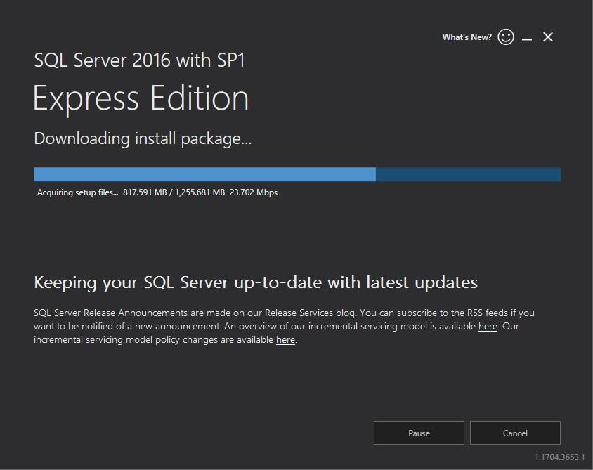

Рисунок 4. Завантаження пакету установки

Після того як буде завантажено пакет інсталяції, з'явиться вікно інсталяції _MS SQL Server 2016_ з вибраним пунктом Installation. У списку можливих установок необхідно вибрати перший пункт — New SQL Server stand-alone installation ... (Рисунок 5).

Рисунок 5. Початок нової установки екземпляру MS SQL Server

У наступному вікні пропонується ознайомитися з ліцензійною згодою від корпорації Microsoft щодо використання _Microsoft SQL Server 2016 Express_. Після уважного ознайомлення його слід прийняти і натиснути кнопку Next (Рисунок 6).

Рисунок 6. Ліцензійна згодою від Microsoft

Після цього здійснюється пошук оновлень, завантаження та встановлення файлів установки (Рисунок 7).

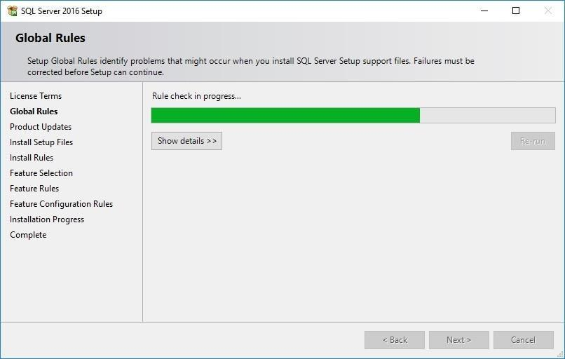

Рисунок 7. Встановлення файлів інсталяції

Потім програма інсталяції визначає потенційні проблеми, які можуть виникнути при виконанні установки _MS SQL Server_. У нашому випадку з'явилось попередження, у якому йдеться про необхідність відкриття відповідних портів задля забезпечення віддаленого доступу. Ми приймемо до уваги це попередження при налаштуванні віддаленого доступу, а поки що натискаємо кнопку Next (Рисунок 8).

Рисунок 8. Правила встановлення

У наступному вікні необхідно вибрати компоненти для встановлення та перейти на наступне вікно (Рисунок 9).

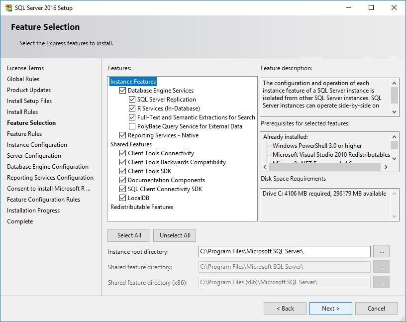

Рисунок 9. Вибір компонентів

У наступному вікні демонструється процес та результат установки вибраних раніше компонентів, переконавшись, що установка пройшла успішно, потрібно натиснути кнопку Next (Рисунок 10).

Рисунок 10. Встановлення компонентів

Далі ви побачите вікно, в якому необхідно вказати ім'я та ідентифікатор для екземпляру _SQL Server_, виберемо пункт Named instance (_Іменований екземпляр_) та перейдемо далі (Рисунок 11).

Рисунок 11. Налаштування екземпляру

Наступне вікно призначене для налаштування облікових записів та параметрів сортування, залишимо ці пункти без змін та натиснемо кнопку Next (Рисунок 12).

Рисунок 12. Конфігурація сервера

Наступне вікно дозволяє налаштувати компонент Database Engine. На вкладці Server Configuration потрібно вибрати один з двох режимів автентифікації, або Windows authentication mode (_режим автентифікації Windows_), або Mixed Mode (_змішаний режим_), при виборі якого необхідно вказати пароль для вбудованого облікового запису адміністратора _SQL Server_ (sa), залишимо тут значення за промовчанням. Також необхідно вказати адміністраторів _SQL Server_, за замовчуванням у списку буде знаходитись ім'я поточного користувача. За допомогою відповідних кнопок ви можете як додати користувача або поточного користувача, так і видалити користувача зі списку (Рисунок 13).

Рисунок 13. Вкладка "Конфігурація сервера"

На вкладці Data Directories необхідно встановити кореневий каталог даних. Можна, звичайно, залишити значення за замовчуванням, проте рекомендується вказувати каталог на іншому фізичному диску, у крайньому випадку, на іншому логічному диску, що пояснюється більшою ймовірністю збереження даних у разі відмови системи. У нашому випадку, за відсутності ще одного фізичного диска, вкажемо заздалегідь створений каталог _SQLDB_ на логічному диску _D_, для чого натиснемо кнопку з трьома точками в пункті Data root directory (Рисунок 14).

Рисунок 14. Встановлення кореневого каталогу даних

Після натискання кнопки OK у вікні Browse For Folder (Рисунок 2.13) шляхи до всіх каталогів даних оновляться автоматично. Можна змінити розташування каталогів бази даних користувача та каталогу резервного копіювання, зробивши аналогічні операції, але ми зупинимося на отриманому результаті (Рисунок 15).

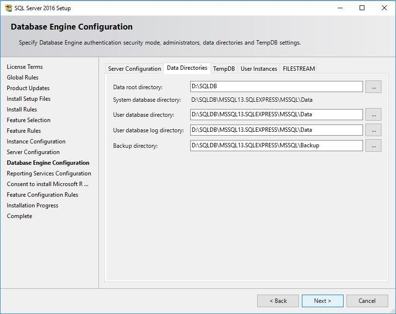

Рисунок 15. Вкладка «Каталоги даних»

Вкладка TempDB призначена для налаштування бази даних, що зберігає тимчасові дані, на наступній вкладці User Interfaces існує можливість встановити дозвіл звичайним користувачам запускати екземпляр компонента Database Engine (за замовчуванням встановлено) і остання вкладка дозволяє включити FILESTREAM для інтеграції Database Engine з файловою системою NTFS (за замовчуванням відключено). Залишимо ці три вкладки без змін і перейдемо далі.

Наступне вікно дозволяє задати налаштування служб Reporting Services, виберемо пункт Install and configure та натиснемо кнопку Next (Рисунок 16).

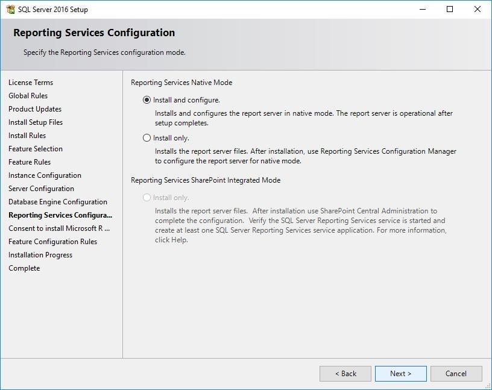

Рисунок 16. Налаштування служб Reporting Services

Для продовження установки _SQL Server_, у наступному вікні необхідно натиснути кнопку Accept, щоб встановити на ваш комп'ютер розширений розподіл R від корпорації Microsoft — _Microsoft R Open_, який підтримує інтелектуальне моделювання та роботу зі статистичними даними (Рисунок 17).

Рисунок 17. Установка Microsoft R Open

Натиснувши кнопку Next, після успішної інсталяції _Microsoft R Open_ почнеться процес інсталяції _SQL Server_ на ваш комп'ютер, хід виконання якої ви побачите в наступному вікні (Рисунок 18).

Рисунок 18. Хід виконання установки

Після певного часу процес установки завершиться, і ви побачите вікно завершення установки _SQL Server_, яке містить відомості про встановлені компоненти (Рисунок 19).

Рисунок 19. Завершення встановлення

Після завершення процесу інсталяції відкриємо список встановлених програм і переконаємося, що _SQL Server 2016_ встановлено на ваш комп'ютер (Рисунок 20).

Рисунок 20. Програма Microsoft SQL Server 2016

### 2.3. Інструменти керування та утиліти MS SQL Server

У списку встановлених компонентів _Microsoft SQL Server 2016_ ви помітили ряд утиліт, коротко зупинимося на кожній з них.

Утиліта _Reporting Services Configuration Manager_ використовується для налаштування сервера звітів: облікового запису, бази даних, електронної пошти тощо.

Компонент _SQL Server 2016 Configuration Manager_ призначений для керування службами, пов'язаними з _SQL Server_ (запуск, призупинення, відновлення та зупинення служб). За допомогою цієї утиліти здійснюється керування конфігурацією мережевих підключень з клієнтських комп'ютерів та налаштування мережевих протоколів, які використовуються _SQL Server_.

Для того, щоб покращити функціональність _SQL Server_, корпорація Microsoft використовує звіти про помилки, за збір та відправку цієї інформації відповідає утиліта _SQL Server 2016 Error and Usage Reporting_.

Утиліта _SQL Server 2016 Import and Export Data_ забезпечує зручний спосіб копіювання даних між джерелами даних.

У списку встановлених компонентів _SQL Server 2016_ відсутній один дуже важливий інструмент управління — _Microsoft SQL Server Management Studio_, саме цей компонент забезпечує наявність візуального середовища для роботи з _SQL Server_. Наступні наші дії будуть спрямовані на встановлення цього компонента, але перед цим необхідно перезавантажити ваш комп'ютер.

Для встановлення _Management Studio_ у списку компонентів _SQL Server 2016_ (Рисунок 2.19) необхідно вибрати утиліту _SQL Server 2016 Installation Center_, яка забезпечує встановлення необхідних компонентів в _SQL Server_, натиснувши відповідний пункт. Після цього відкриється однойменне вікно (Рисунок 21).

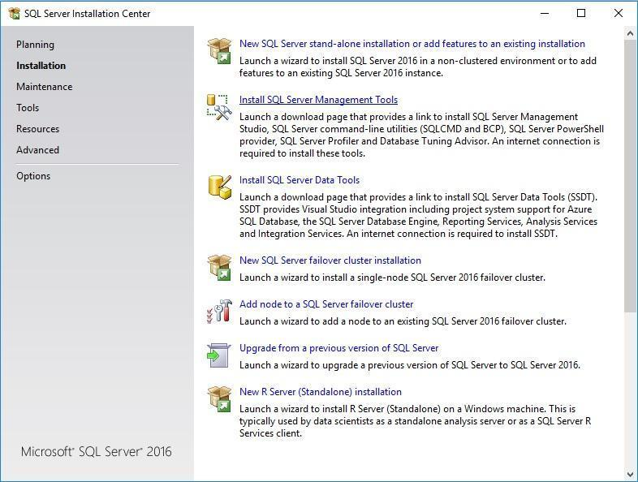

Рисунок 21. Центр інсталяції SQL Server

У вікні, що з'явиться необхідно вибрати пункт Install SQL Server Management Tools, після чого у вікні браузера відкриється сторінка за наступним [шляхом](https://docs.microsoft.com/en-us/sql/ssms/download-sql-server-management-studio-ssms), на цій сторінці необхідно вибрати пункт Download SQL Server Management Studio 17.3, після чого розпочнеться завантаження інсталятора Management Studio на ваш комп'ютер.

Після запуску інсталятора з'явиться початкове вікно інсталяції, щоб почати інсталяцію потрібно натиснути кнопку Install (Рисунок 22).

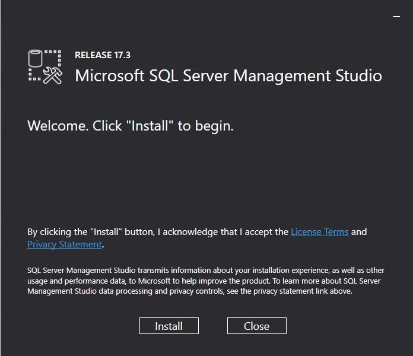

Рисунок 22. Початок установки SQL Server Management Studio

Спочатку з'явиться вікно завантаження пакетів інсталяції (Рисунок 23).

Рисунок 23. Завантаження пакетів установки

Після того як пакети будуть завантажені, почнеться сам процес установки _SQL Server Management Studio_ (Рисунок 24).

Рисунок 24. Процес установки SQL Server Management Studio

Після закінчення інсталяції _SQL Server Management Studio_ з'явиться вікно, в якому пропонується перезавантажити ваш комп'ютер, для чого необхідно натиснути кнопку Restart (Рисунок 25).

Рисунок 25. Закінчення установки SQL Server Management Studio

Після перезавантаження комп'ютера в списку встановлених програм з'явиться пункт Microsoft SQL Server Tools 17, розкривши який ви побачите пункт Microsoft SQL Server Management Studio 17 (Рисунок 26).

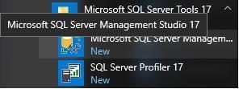

Рисунок 26. Microsoft SQL Server Management Studio

### 2.4. Керування базою даних

Щоб створити базу даних, необхідно запустити _Management Studio_, натиснувши відповідний пункт (Рисунок 2.25). При першому запуску ви побачите вікно завантаження налаштувань користувача, після чого запуститься оболонка і з'явиться вікно підключення до сервера (Рисунок 27).

Рисунок 27. Підключення до сервера

У вікні можна зробити кілька додаткових налаштувань, коротко зупинимося на кожній з них.

За допомогою першого налаштування (Server type) можна задати одну з технологій керування та аналізу даних:

-   Database Engine — основна служба, що забезпечує безпеку даних, їх зберігання та обробку (значення за замовчуванням);
-   Analysis Services — служба, призначена для обробки аналітичних даних та включає набір засобів для бізнес-аналітики;
-   Reporting Services — служба, що надає засоби для створення різноманітних звітів, з можливістю їх публікації у різноманітних форматах;
-   Integration Services — служба, яка включає різноманітні рішення щодо інтеграції даних (вилучення, перетворення, завантаження) (Рисунок 28).

Рисунок 28. Технології управління та аналізу даних

Ім'я сервера (Server name) прописується автоматично, але у випадках, коли потрібно вказати його явно, необхідно відкрити список, що випадає, і вибрати потрібний сервер (Рисунок 29).

Рисунок 29. Вибір серверу

За допомогою останнього налаштування (Authentication) можна встановити режим автентифікації користувача:

-   Windows Authentication — цей режим заданий за замовчуванням і дозволяє користувачеві під час підключення використовувати обліковий запис ОС Windows;
-   SQL Server Authentication — режим, у якому правдивість користувача визначається засобами _SQL Server_, у цьому випадку перевіряється відповідність імені користувача та пароля;
-   Active Directory — Universal with MFA support — режим, який забезпечує автентифікацію користувача за допомогою різних варіантів перевірки (телефонний дзвінок, текстове повідомлення тощо);
-   Active Directory — Password — режим автентифікації, який дозволяє підключитися до бази даних _Microsoft Azure SQL_, використовуючи ідентифікатори в _Azure Active Directory_, якщо обліковий запис не пов'язаний з Azure;
-   Active Directory — Integrated — режим автентифікації, який подібний до попереднього, але застосовується, якщо при вході до ОС Windows використовувався обліковий запис _Azure Active Directory_ (Рисунок 30).

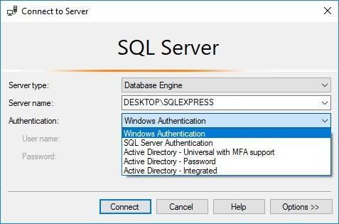

Рисунок 30. Вибір режиму автентифікації

Залишіть усі параметри за замовчуванням (Рисунок 2.26) та натисніть кнопку Connect. Після цього відкриється _Management Studio_, у лівій частині якої ви побачите вікно Object Explorer. У цьому вікні знаходиться список папок, в яких містяться різні налаштування _SQL Server_, зараз нас цікавить папка _Databases_, з іншими папками ознайомимося по мірі необхідності (Рисунок 31).

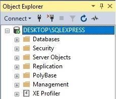

Рисунок 31. Вікно Object Explorer

#### 2.4.1. Створення бази даних

Щоб створити нову базу даних, необхідно натиснути правою клавішею миші на папці _Databases_ і в контекстному меню вибрати пункт New Database… (Рисунок 32).

Рисунок 32. Початок створення нової бази даних

Після цих дій з'явиться вікно New Database, в якому необхідно вказати ім'я бази даних, у нашому випадку University, при цьому автоматично змінюються логічні імена файлів БД (таблиця Database files). Також можна вказати власника бази даних, тут ми залишимо значення за замовчуванням (default) (Рисунок 33).

Рисунок 33. Ім'я нової бази даних

Хоча для створення бази даних змінювати інші налаштування не обов'язково, ми зупинимося на них докладніше.

#### 2.4.2. Налаштування параметрів бази даних

Будь-яка база даних _Microsoft SQL Server_ складається з двох фізичних файлів. Файл із розширенням _.mdf_ — це основний файл даних, у ньому міститься інформація про всі об'єкти БД. Файл із розширенням _.ldf_ — це файл журналу транзакцій, він грає роль якогось попереднього сховища даних. Параметри цих файлів перебувають у таблиці Database files.

#### 2.4.3. Зміна розміру бази даних

Щоб змінити розмір бази даних необхідно налаштувати три параметри: початковий розмір, автоматичне збільшення розмірів і максимальний розмір файлів БД.

Початковий розмір файлів бази даних змінюється шляхом внесення необхідного цілочисельного значення в полі Initial Size таблиці Database files (Рисунок 34).

Рисунок 34. Зміна початкового розміру файлів бази даних

Максимальний розмір та автоматичне збільшення розміру конкретного файлу бази даних можна налаштувати, натиснувши кнопку з трьома точками у відповідній комірці поля Autogrowth/Maxsize, після чого з'явиться вікно Change Autogrowth for University (Рисунок 35).

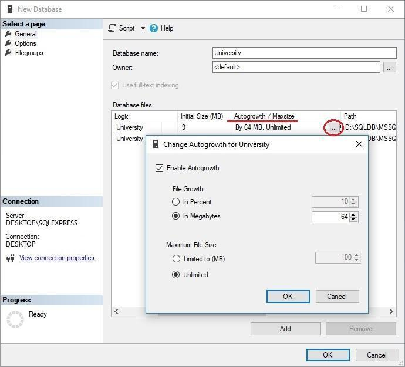

Рисунок 35. Зміна максимального розміру та збільшення розміру файлу БД

У вікні Change Autogrowth for University ви можете задати автоматичне збільшення розміру файлу або у відсотках, або в мегабайтах, вказавши необхідне значення. Аналогічно можна задати максимальний розмір файлу бази даних, або вказавши розмір у мегабайтах, або вибравши пункт Unlimited.

#### 2.4.4. Керування групами файлів

Файли даних БД поділяються на файлові групи, які використовуються для поєднання файлів з метою підвищення продуктивності. У будь-якій базі даних існує файлова група PRIMARY, у ній міститься первинний файл даних. Також існує можливість створення користувацьких файлових груп. Для цього необхідно в списку Select a page вибрати пункт Filegroups, після чого з'явиться відповідний інтерфейс (Рисунок 36).

Рисунок 36. Керування групами файлів

Після того, як ви зробите всі необхідні налаштування вашої бази даних та натиснете кнопку OK у вікні New Database, ви побачите індикатор створення БД (Рисунок 37).

Рисунок 37. Процес створення бази даних

Після того, як вікно закриється, ваша база даних з'явиться у списку Databases вікна Object Explorer (Рисунок 38).

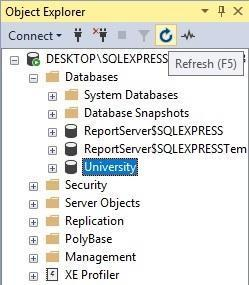

Рисунок 38. Результат створення нової бази даних

Якщо з якоїсь причини створена вами база даних не відображається в списку, натисніть кнопку Refresh (Рисунок 2.37) і список баз даних оновиться.

#### 2.4.5. Перейменування бази даних

Після того, як база даних створена, існує можливість внесення до неї ряду змін, наприклад, її можна перейменувати. Для цього необхідно клацнути правою клавішею миші на назві бази даних, що редагується, і в контекстному меню вибрати пункт Rename, а потім ввести нове ім'я (Рисунок 39).

Рисунок 39. Перейменування бази даних

#### 2.4.6. Видалення бази даних

Існує також можливість видалення існуючої бази даних, для цього необхідно викликати контекстне меню на назві конкретної бази даних та вибрати Delete (Рисунок 40).

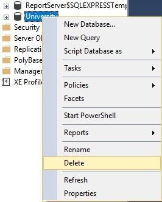

Рисунок 40. Початок видалення бази даних

Після цього з'явиться вікно Delete Object, в якому після натискання кнопки OK ви побачите індикатор видалення (Рисунок 41).

Рисунок 41. Завершення видалення бази даних

Після того, як вікно закриється, ваша база даних зникне зі списку Databases вікна Object Explorer.

## 3\. Домашнє завдання

1.  Встановити _Microsoft SQL Server 2016 Express_ та _SQL Server Management Studio_ на свій комп'ютер.
2.  Створити власну базу даних. Задати: для файлу даних початковий розмір 15MB, збільшення розміру файлу 15% і необмежений максимальний розмір; файлу транзакцій — початковий розмір 10MB, автоматичне збільшення розміру 5MB і максимальний розмір 60MB.

© STEP IT Academy, [itstep.org](https://itstep.org/)

All the copyrighted photos, audio, and video works, fragments of which are used in the material, are the property of their respective owners. Fragments of the works are used for illustrative purposes to the extent justified by the objective, within the educational process, and for educational purposes, in accordance with the Act of “On Copyright and Related Rights”. The scope and method of the cited works are in accordance with the adopted norms, without prejudice to the normal exploitation of copyright, and do not prejudice the legitimate interests of authors and right holders. At the time of use, the cited works fragments cannot be replaced by alternative, non-copyrighted counterparts and meet the criteria for fair use. All rights reserved. Any reproduction of the materials or its part is prohibited. Use of the works or their fragments must be agreed upon with authors and rights holders. Agreed material use is only possible with reference to the source. Responsibility for unauthorized copying and commercial use of the material is determined by the current legislation.
