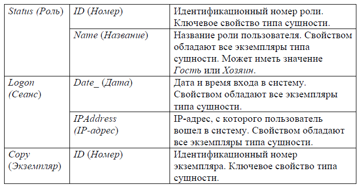
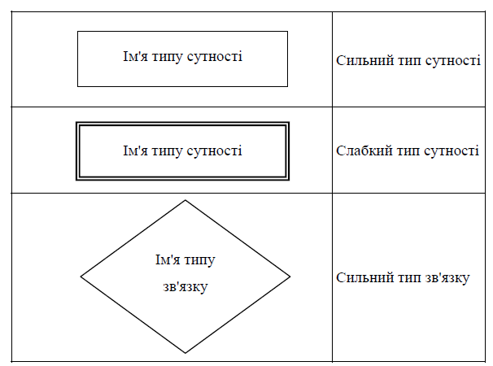
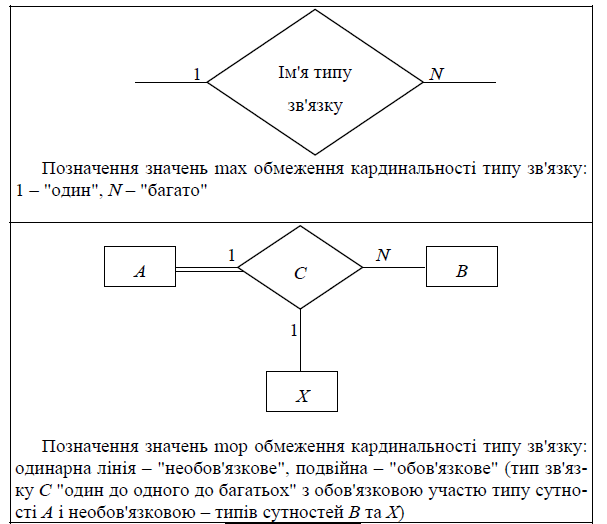
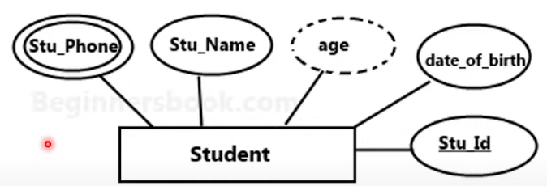
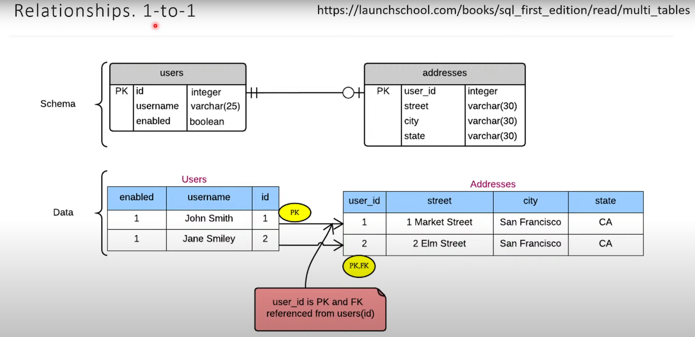

## Лекція №1 «Проектування бази даних » {#slide-1}

Концептуальна та логічна схема  

ПРИРОДНИЧО-ГУМАНІТАРНИЙ 

Ф АХОВИЙ КОЛЕДЖ  ДВНЗ « УжНУ »

Викладач: Верещагін О.О.

## Основні поняття {#slide-2}

База даних  --  сукупність даних , організованих з певною метою та за певними правилами, що передбачають загальні принципи опису, зберігання та маніпулювання даними.

Дані, що належать  до певної предметної області ,   об\'єднуються та структуруються таким чином, щоб можна було виконувати необхідні операції:  оновлення даних ,  додавання даних ,  видалення даних ,  вибірка ( select ) даних . Всі ці операції повинні підтримуватися системою управління базою даних ( СУБД ), під якою прийнято розуміти  сукупність програм та  мовних  засобів , призначених для управління даними у базі даних, ведення бази даних та забезпечення взаємодії її з прикладними програмами.

## Основні поняття {#slide-3}

Щоб забезпечити незалежність прикладних програм від способу фізичного зберігання даних і цим знизити витрати на супровід програм, доступом до даних здійснюється у вигляді  абстрактної машини . Компоненти абстрактної машини, математичні об\'єкти та операції складають  модель даних . Математичні об\'єкти дозволяють моделювати  структуру даних , а операції --  поведінку даних .

Найбільш поширеною моделлю є  реляційна модель даних , у якій як математичних об\'єктів та операцій виступають  відносини  (relations)  та різні дії над ними.

Необхідно відзначити, що в літературі термін модель даних, крім вище наведеного тлумачення, використовується також у значенні тотожному базі даних, але  модель даних  та  база даних  співвідносяться між собою так само, як  мова програмування  та  програма , написана цією мовою. Тому будь-яку базу даних можна   розглядати як програму деякої моделі даних.

## Етапи проектування бази даних {#slide-4}

Розробка бази даних починається з побудови  концептуальної схеми , яка повинна включати опис семантичних концепцій, виявлених в результаті аналізу  моделі прецедентів використання  і  функціональних вимог . Далі розробляється  логічна схема , що є результатом відображення розробленої концептуальної схеми в обрану модель даних. На заключному етапі засобами СУБД програмується та тестується  фізична схема бази даних .

## Концептуальна схема {#slide-5}

Найбільш відомий і широке поширений метод  концептуального моделювання даних  називається  діаграми   сутність-зв\'язок  або  ER- діаграми . Цей метод заснований на використанні  моделі сутність-зв\'язок , ключовими поняттями якого є  сутність ,  властивість  та  зв\'язок . Розглянемо послідовно кожне з цих понять на прикладі діаграми сутність-зв\'язок для системи «Особиста бібліотека», яка наведена на рисунку 1.

Термін  сутність  має багато різних неформальних визначень, узагальнивши які можна зробити висновок, що під сутністю розуміють щось, що може бути чітко ідентифіковано. Таким чином, сутність повинна мати певну  відмінну властивість , наприклад: номер державної реєстрації транспортного засобу, індивідуальний номер платника податків, серія та номер паспорта, номер студентського квитка тощо. Що не має характерної властивості, то сутністю не є, наприклад: літр води в Тихому океані, метр оптоволоконного кабелю, кілограм чорниці.

## Моделі сутність-зв\'язок {#slide-6}

Кожна сутність є  екземпляром  деякого  абстрактного типу сутності . Поняття  сутність  і  тип сутності  співвідносяться між собою так само, як  заява  і  бланк заяви  - всі сутності певного типу володітимуть загальними властивостями. Так, наприклад, сутності: Австралійський Союз, Австрійська Республіка \... Японія - є  екземплярами   типу сутності  під назвою  Держава , тому кожна з них характеризуватиметься державно-політичним устроєм, державною символікою, державною мовою, грошовою  одиницею,населенням , територією тощо.

У сутності може бути одночасно  кілька типів . Наприклад, якщо певні  співробітники  є  програмістами , то можна сказати, що  тип  сутності  Програміст  є  підтипом  типу сутності  Співробітник , або  тип  сутності Співробітник є  супертипом   типу  сутності Програміст. Вважається, що підтип успадковує властивості та зв'язки супертипу.

## Сутності {#slide-7}

Сутності поділяються на  сильні  (звичайні) та  слабкі .  Слабкою  називається така сутність, існування якої залежить від іншої сутності, тобто, вона не може існувати, якщо цієї іншої сутності не існує. Наприклад, на рисунку 1 сутність  LogOn   є слабкою, оскільки вона не може існувати, якщо не існує відповідної сутності  Person.  Зокрема, якщо відомості про деякого користувача будуть видалені, то відомості про всі його сеанси також повинні бути видалені .  Сильною  називається сутність, яка не є слабкою. У цьому прикладі сутність  Person.

На діаграмі тип сутності представляється як  прямокутник , всередині якого вказується назва сутності. Прямокутники сутності слабких типів малюються  подвійною лінією . 

На малюнку 1 сутності:  Person, Status, Publication  та  Shelf --  є  сильними ,  Request  та  LogOn  --  слабкими . Супертип та підтип з\'єднуються  стрілкою , спрямованою у бік підтипу. Так, у наведеному вище прикладі супертип Співробітник та підтип Програміст можуть бути зображені, як показано на рисунку  1 .

## Уточнення про слабку сутність {#slide-8}

Характеристичну сутність  (слабка сутність) ще називають слабкою сутністю. Вона пов\'язана з більш сильною сутністю зв\'язками «один до багатьох» і «один до одного». Характеристична сутність описує або уточнює іншу сутність. Вона повністю залежить від неї і зникає зі зникненням останньої. Наприклад, сутність Зарплата є характеристикою конкретних працівників підприємства і не може в такому контексті існувати самостійно --- при видаленні екземпляра сутності Працівника повинні бути видалені і екземпляри сутності Зарплата, пов\'язані з видаленим працівником.

Що з цього випливає?

## Рисунок 1 {#slide-9}

ER- діаграма   бази   даних   системи  Особиста  бібліотека  в  нотації   Chen .

## Властивості {#slide-10}

Властивість  сутності  зображається  у вигляді  еліпса , сутність та її   властивість з\'єднуються  суцільною лінією . Усередині кожного еліпса вказується  назва властивості . Контур еліпса малюється  пунктиром , якщо властивість є похідним, тобто, значення властивості  обчислюється , і  подвійний , якщо властивість є багатозначним, тобто, йому відповідає кілька значень. Наприклад, у сутності Співробітник властивість Вік може обчислюватися на основі інформації про поточну дату та дату народження, а властивість Телефон може мати кілька значень. Якщо властивість є  складеною , з ним з\'єднуються суцільними лініями, що становлять його властивості. На рисунку 1 складеним є властивість  Name,  що включає властивості:  LastName , FirstName  і  MiddleName .  Властивості, що використовуються для  ідентифікації  екземплярів сутності, називаються  ключовими , на діаграмі їхньої назви виділяються  підкресленням . Прикладом можуть бути властивості  ID,  наведені рисунку 1. Якщо ж сутність має кілька властивостей, сукупність яких використовується для ідентифікації її екземплярів, то діаграмою підкресленням виділяється кожна така властивість.

## Знаходження сутностей {#slide-11}

Для виявлення сутностей аналізують  модель прецедентів використання  та  функціональні вимоги  до системи, керуючись такими міркуваннями:

У тексті сутності зазвичай відповідає номінальний  іменник ; 

Сутність  повинна  допускати існування  множини екземплярів ;

Сутність  повинна  мати кілька  властивостей , зокрема  ключові ; 

Сутність  повинна  брати участь у  зв\'язках  з іншими сутностями.

Так, для аналізованої системи «Особиста бібліотека» було визначено сутності та властивості, перелічені нижче.  Сильними  є сутності:  Person, Status, Publication  та  Shelf.  Інші сутності залежать від перерахованих і є  слабкими .

## Зв\'язки {#slide-12}

Сутності можуть брати участь у  асоціаціях , для моделювання яких використовуються  зв\'язки . Сутності, включені до зв\'язку, називаються її  учасниками , а кількість учасників зв\'язку називається її  ступенем . Наприклад, між  виданнями  та  екземплярами  існує зв\'язок з ім\'ям  Copy_Pub .  Вона представляє той факт, що  кожне видання має певну кількість екземплярів . Якщо кожен екземпляр сутності бере участь принаймні в одному екземплярі зв\'язку, то участь сутності у зв\'язку називається  повним , інакше --  частковим . Наприклад, якщо кожен користувач повинен обов\'язково мати будь-яку роль, то сутність  Person  у зв\'язку  St.\_P .  є  повним . З іншого боку, якщо допустима ситуація, коли деякий користувач не матиме жодної ролі, участь сутності  Person  у зв\'язку  St.\_P .  буде  частковим . Кожний зв\'язок, як і сутність, є екземпляром деякого  абстрактного типу зв\'язку , який встановлює загальні властивості екземплярів. Наприклад, тип зв\'язку  Працює  між сутностями  Людина  і  Підрозділ  має властивості: Посада, Зарплата, Перший день роботи, Останній день роботи, Робоче місце.

## \_ {#slide-13}

\_

## Зв\'язки {#slide-14}

На діаграмі кожен тип зв\'язку показаний як  ромб  з  назвою типу зв\'язку  всередині. Ромб малюється  подвійною лінією , якщо це зв\'язок між  слабкою сутністю  та  сутністю ,  від існування якої вона залежить .  Властивості зв\'язку  позначаються на діаграмі як і  властивості сутності . Кожен учасник зв\'язку з\'єднуються з ромбом  суцільною лінією :  подвійна лінія  позначає  повну участь сутності у зв\'язку . Кожна лінія містить позначку  \"1\"  або  \"М\" . Для того щоб визначити яку мітку ставити поруч з лінією, треба вивчити учасника, якого вона з\'єднує з ромбом. Якщо одному екземпляру  другого учасника  зв\'язку відповідає не більше одного екземпляра  досліджуваного учасника , ставлять символ «1», інакше -- «М». Якщо поруч з кожною лінією, що з\'єднує зв\'язок з учасником, стоїть символ «1» або « M»,  то зв\'язок належить відповідно до типу  один до одного  або  багато до багатьох , а якщо поруч з лініями стоять  різні символи , то зв\'язок відноситься до типу  один до багатьом  або, що еквівалентно,  багато до одного .

## Зв\'язки {#slide-15}

В  системі  Особиста  бібліотека   були   виявлені   такі   зв\'язки   між   сутностями :

Status -- Person ( St_P );

Person -- Logon (P_L);

Copy -- Publication ( C_Pub );

Shelf -- Copy (S_C);

Person -- Request (P_R);

Copy -- Request (C_R).

Усі зв\'язки є  двосторонніми , тобто, мають  ступінь два . Зв\'язок між сутностями  Copy  і  Request  належить типу  багато до багатьох , решта --  один до багатьох .

## Заключення {#slide-16}

Слід зазначити, що  сутність ,  властивість ,  зв\'язок  є  семантичними концепціями  і не мають строгих визначень -- вище були наведені лише деякі з їх тлумачень. Тому той самий об\'єкт реального світу дослідники можуть моделювати або сутністю, або властивістю, або зв\'язком. 

Наприклад, інформацію про те, що хтось є співробітником підрозділу, можна представити екземпляром типу сутності Співробітник з властивостями Людина та Підрозділ, можна уявити екземпляром типу зв\'язку Працює між сутностями Людина та Підрозділ, а можна описати значенням властивості Підрозділ екземпляра типу сутності Людина. 

Подібна гнучкість, безперечно, корисна при описі предметної області на інтуїтивному рівні.

## Логічна схема {#slide-17}

ER- діаграма є початковим проектом бази даних, в якому, однак, відсутній опис безлічі важливих деталей. На наступному етапі  ER- діаграму необхідно відобразити в  логічну схему реляційної моделі даних , попутно виконавши ряд  довизначень . Насамперед зазначимо, що ключовим поняттям реляційної моделі є відношення:

де  n  -  Ступінь відношення;  A 1 ,  A 2 , ... ,  A n  --  домени (типи значень атрибутів);  {\< T 1 ,  A 1 ,  a 1 \>, \< T 2 ,  A 2 ,  a 2 \>, ... , \< T n ,  A n ,  a n \>)  --  кортеж;  \< T 1 ,  A 1 \>,   \< T 2 ,  A 2 \>, ... , \< T n ,  A n \>  -  атрибути;  T 1 ,  T 2 , ... ,  T n  --  назви атрибутів;  a 1 , a 2 ...  a n   --  значення атрибутів.

## Логічна схема {#slide-18}

Багато атрибутів відношення, що використовуються для ідентифікації кортежів, називається  первинним ключем . Первинний ключ має такі властивості:

Унікальність   --  у  відношені  немає двох кортежів, в яких значення ключа збігається;

Нескоротність   --  « жодна   власна   підмножина  ключа не  має   властивості   унікальності » .

Атрибути відносини, які використовуються для ідентифікації кортежів в іншому відношенні, називають  зовнішнім ключем .

## Коли відношення є таблицею? {#slide-19}

Відношення можна подати у формі таблиці при дотриманні наступних правил:

кожен  стовпець  характеризується відповідним  типом ,

кожне  значення  атрибута є значенням певного  типу ,

порядок  рядків та стовпців  не має значення ,

дублікати  рядків  не допускаються ,

назви  стовпців  унікальні .

Таблиця  може розглядатися як прийнятне зображення відношення тоді і лише тоді, коли дотримуються всі ці правила її інтерпретації. Як приклад відношення може бути наведено зображення відношення  Person,  показане рисунку 3. На малюнку не вказано тип стовпця  status,  однак цей стовпець є зовнішнім ключем і його тип відповідає типу стовпця в іншій таблиці, на яку він посилається. Інші правила зображення відносин у вигляді таблиць наведено далі.

## \_ {#slide-20}

\_

## Перехід   від  ER- діаграми  до  логічної   схеми {#slide-21}

Перехід від  ER- діаграми до логічної схеми реляційної моделі даних виконується за правилами, наведеними нижче.

Кожна сутність, зв\'язок або властивість може бути представлена ​​окремою таблицею (відношенням), якщо це є доцільним.

Кожна сутність має бути представлена ​​окремою таблицею. При цьому  ідентифікаовані   сутностю  ключові властивості стають первинними ключами таблиць.

Властивості, як правило, вигідніше представляти у вигляді полів таблиці (атрибутів відношення). Винесення властивості як окремої таблиці -- заявка на заміну  цієї властивості  сутностю .

Зв\'язок  багато до багатьох  обов\'язково вимагає  створення  допоміжньої  таблиці .  Інші  типи зв\'язків легко уявити за допомогою механізму  зовнішнього ключа . Однак у цьому випадку потрібно бути впевненим, що вони не еволюціонують до типу багато до багатьох. Для створення зв\'язку  один до одного , поле зовнішнього ключа має бути  первинним ключем пов\'язаної таблиці , або на нього має бути накладена умова унікальності значень.

## Логічна схема {#slide-22}

Результат відображення  ER- діаграми у логічну схему бази даних системи «Особиста бібліотека» представлений малюнку 4. На логічній схемі відносини зображені  прямокутниками , всередині яких вказані  назви відношення  та  атрибутів .  Первинні ключі виділені підкресленням , а  зовнішні курсивом .

## Логічна схема {#slide-23}

Первинні та зовнішні ключі з\'єднані  стрілкою , спрямованою у бік первинного ключа.  Атрибути , які повинні мати певні  значення у кожному кортежі  відношення, позначені  напівжирним  стилем. Як типи значень атрибутів використані типи даних системи управління  Oracle .

## Нотація Пітера Чена {#slide-24}

Сутності відображуються у вигляді  прямокутнків , зв\'язки у вигляді ромбів. Якщо сутність бере участь у відносинах, вони пов\'язані лінією. Якщо відносини не є обов\'язковими, то лінія пунктирна. Атрибути позначаються в вигляді овалів і пов\'язані з однією сутністю або зв\'язком. Овал похідних атрибутів зображується пунктирним контуром.

## Crow\'s Foot {#slide-25}

Нотація «вороняча лапка» Дана нотація була запропонована Гордоном Еверестом (англ.  Gordon Everest)  під назвою  Inverted Arrow (« обернена стрілка»), однак частіше за все цю нотацію називають  Crow\'s Foot (« вороняча лапка»), або ж  Fork (« виделка»).

Згідно даної нотації, сутність подається у вигляді прямокутника, де сутність виражається іменником. Ім\'я сутності має бути унікальним в рамках однієї моделі. Зв\'язок зображується лінією, яка пов\'язує дві сутності, що беруть участь у відношенні. Ступінь кінця зв\'язку вказується графічно, множинність зв\'язку зображується у вигляді «виделки» на кінці зв\'язку. Модальність зв\'язку так само зображується графічно --- необов\'язковість зв\'язку позначається кружком на кінці зв\'язку.

Атрибути сутності записуються усередині прямокутника, що зображує сутність і виражаються іменником в однині (можливо, з уточнюючими словами). Серед атрибутів виділяється ключ сутності --- ненадлишковий набір атрибутів, значення яких в сукупності є унікальними для кожного екземпляра сутності.

## \_ {#slide-26}

https://beginnersbook.com/2015/04/e-r-model-in-dbms/

https://beginnersbook.com/2021/07/dbms-er-diagram-to-table-conversion/

## \_ {#slide-27}

\_

## \_ {#slide-28}

\_

## \_ {#slide-29}

\_

## \_ {#slide-30}

\_

