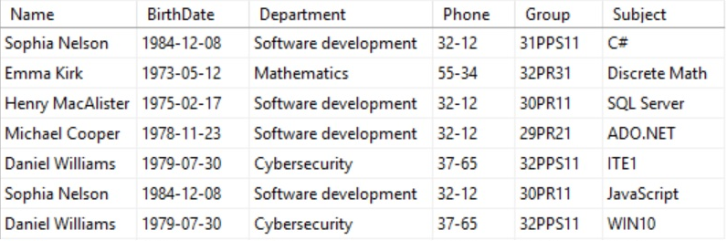
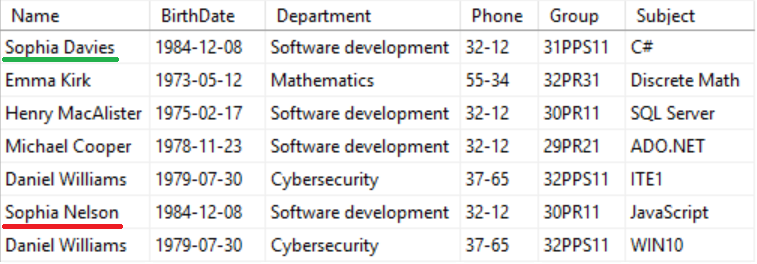
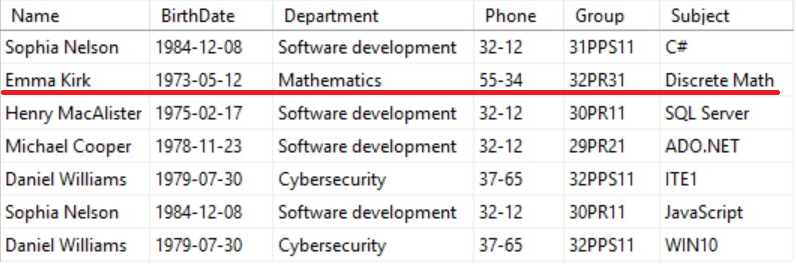
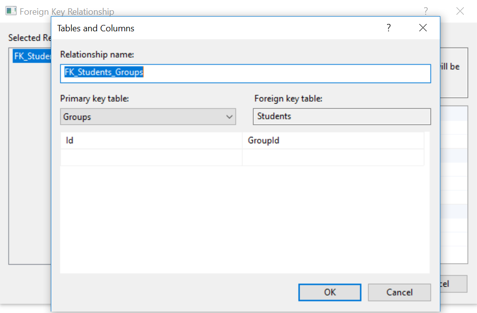
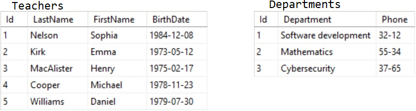
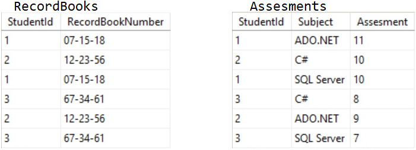
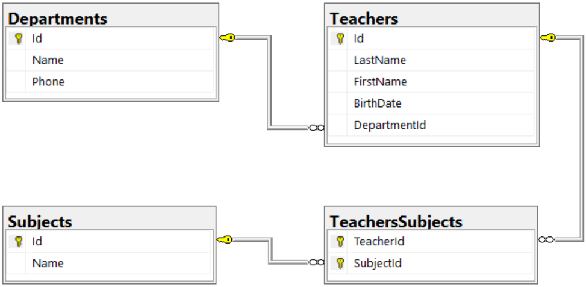
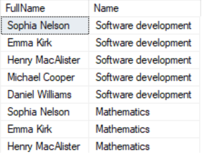

# Багатотабличні бази даних :: Урок 4

> ## Excerpt
> Багатотабличні бази даних

---
## Багатотабличні бази даних

## 1\. Аномалії взаємодії з однотабличною базою даних

При використанні однотабличних баз даних мають місце три специфічні проблеми, пов'язані з оновленням, видаленням та вставкою даних. Здійснення зазначених операцій з таблицями бази даних може призвести до суперечливості даних, що зберігаються в них, що в цілому негативно позначиться на роботі з цією базою даних. Такі операції називаються аномаліями, тобто тим, що є відхиленням від норми.

Для того, щоб продемонструвати вам проблеми, пов'язані з однотабличною базою даних, ми скористаємось таблицею Teachers, представленою на рисунку 1.



Рисунок 1. Таблиця Teachers

Як ви помітили, в даній таблиці зберігаються відомості про кафедри, викладачів, предмети та групи, в яких викладаються зазначені предмети.

### 1.1. Аномалії оновлення

Аномалія оновлення пов'язана з надлишком даних, що зберігаються у відповідній таблиці. Надлишок даних є причиною того, що в процесі оновлення інформації в таблиці частина даних,що дублюються, не будуть змінені, що призведе до суперечливості збереженої інформації.

Існує два види надмірності: явна та неявна. Явна надмірність виявляється у дублюванні однакової інформації,наприклад, у таблиці Teachers деякі дані про викладача Sophia Nelson повторюються кілька разів. Якщо у неї зміниться прізвище на Davies (вона вийде заміж), то для того щоб уникнути суперечливості даних у таблиці, необхідно буде вносити зміни до кожного запису про цього викладача (Рисунок 2).



Рисунок 2. Явна надмірність

Неявна надмірність проявляється у вигляді неявної залежності між різними записами однієї таблиці, наприклад номер телефону кафедри Software development повторюється у відомостях про кількох викладачів. Припустимо, якщо у разі зміни на кафедрі номера телефону (на 48-22) ми внесемо зміни лише до запису про викладача Henry MacAlister, то при подальшій роботі з таблицею Teachers ми фактично не зможемо визначити правильний номер телефону кафедри, оскільки в записах про викладачів Sophia Nelson і Michael Cooper він залишиться попереднім (Рисунок 3).


Рисунок 3. Неявна надмірність

### 1.2. Аномалії вставки

Аномалія вставки проявляється у тих випадках, коли існує необхідність помістити в таблицю запис, у якої відсутня частина інформації. Відсутність деяких даних у таблиці, в подальшому, може спричинити отримання неправильних результатів при виконанні запитів до бази даних. Це не є критичним, якщо поле з відсутніми даними може мати невизначене значення (NULL-значення), однак для полів, обов'язкових для заповнення, така ситуація призведе до виникнення помилки. У нашому прикладі додавання в таблицю Teachers викладача, про якого невідомі група і предмет, який він викладає, неможливе, тому ми не зможемо «прийняти на роботу» людину поки не з'ясуємо цю інформацію (Рисунок 4).


Рисунок 4. Помилка: неможливо записати значення NULL

### 1.3. Аномалії видалення

Аномалія видалення пов'язана з унікальністю інформації в певних записах, при видаленні яких ці дані будуть втрачені. Наприклад, у нашому випадку, якщо викладач Emma Kirk звільниться з роботи, і ми видалимо з таблиці Teachers запис, який містить інформацію про неї, то це призведе до втрати даних про предмет Discrete Math, кафедру Mathematics та групу 32PR31, тому що інформація про них міститься тільки в цьому записі (Рисунок 5).



Рисунок 5. Аномалія видалення

## 2\. Принципи створення багатотабличної бази даних

Багатотаблична база даних — це певна структура для зберігання різної інформації, що складається із зв'язаних між собою таблиць. Створення багатотабличної бази даних є трудомістким процесом, але для зберігання даних необхідно використовувати саме такий підхід, для цього існує ряд причин.

### 2.1. Причини створення багатотабличної бази даних

При зберіганні всієї необхідної інформації в одній таблиці вам необхідно буде створювати велику кількість стовпців, при цьому обсяг інформації, що зберігається, буде збільшуватися пропорційним чином. Записи в цій таблиці багато в чому дублюватимуть дані, що також призведе до збільшення обсягу інформації, що зберігається в базі даних. Усе це позначається на процесі обробки даних, збільшуючи час виконання SQL-запитів. Не можна також забувати і про аномалії, описані в попередньому розділі, які притаманні однотабличним базам даних. Все перераховане вище є вагомими причинами для використання саме багатотабличних баз даних.

### 2.2. Зовнішній ключ

Перш ніж ми розпочнемо обговорювати типи зв'язків між таблицями в багатотабличній базі даних, вам необхідно зрозуміти сам механізм цих зв'язків.

З уроку № 2 ви дізналися, що у будь-якій таблиці має бути стовпець, який забезпечує унікальність записів у таблиці — первинний ключ. Також у таблицях може бути ще одне спеціалізоване поле, яке називається зовнішнім ключем.

Зовнішній ключ — це поле таблиці, в якому міститься значення первинного ключа іншої таблиці. Саме завдяки співвідношенню первинного ключа однієї таблиці та зовнішнього ключа іншої таблиці формуються зв'язки між таблицями у багатотабличній базі даних.

Як приклад наведемо частину діаграми бази даних, на якій у таблицях Students та Groups первинними ключами є стовпці Id, що візуально відзначено зображеннями ключа (Рисунок 6).


Рисунок 6. Приклад формування зв'язку між таблицями

У таблиці Students зовнішнім ключем є стовпець GroupId, у якому зберігатимуться дані зі стовпця Id — первинного ключа таблиці Groups. У свою чергу, стовпець FacultyId у таблиці Groups є зовнішнім ключем таблиці Faculties (на діаграмі не зображена).

Важливо відзначити, що в одній таблиці допускається наявність кількох стовпців, що є зовнішніми ключами, кожен із яких буде зберігати значення первинних ключів різних таблиць поточної бази даних. Як приклад наведемо таблицю Achievements, яка містить інформацію про успішність студентів з різних предметів (Рисунок 7).


Рисунок 7. Приклад таблиці з кількома зовнішніми ключами

У таблиці Achievements зовнішніми ключами є стовпці StudentId і SubjectId, у яких зберігатимуться значення первинних ключів (стовпці Id) таблиць Students і Subjects відповідно.

### 2.3. Зв'язки. Типи зв'язків

На рисунку 6 крім таблиць ще є схематичне зображення зв'язку між таблицями Students і Groups, яка створюється завдяки наявності первинного ключа в таблиці Groups (стовпець Id) і зовнішнього ключа в таблиці Students (стовпець GroupId). Як ви, напевно, здогадалися, одна сторона зв'язку із зображенням ключа з'єднується з таблицею, в якій знаходиться первинний ключ,протилежна сторона зв'язку у вигляді піктограми нескінченності з'єднується з таблицею, що містить зовнішній ключ.

При проектуванні будь-якої реляційної бази даних використовуються три типи зв'язків: «один до одного», «один до багатьох» і «багато до багатьох».

Зв'язок «один до одного» існує між двома таблицями у тому випадку, якщо рядок даних у першій таблиці відповідає тільки одному рядку другої таблиці, а рядок у другій таблиці пов'язаний лише з одним рядком даних першої таблиці. Цей тип зв'язку графічно представляється у вигляді лінії, що з'єднує дві таблиці. На рисунку 8 наведено приклад зв'язку такого типу між таблицями Teachers і Authentications.


Рисунок 8. Приклад зв'язку «один до одного»

В обох таблицях існує первинний ключ (стовпець Id), значення в цих стовпцях повинні бути однаковими для відповідних записів у таблицях — у будь-якого викладача може бути лише одне поєднання логіну та пароля для входу в систему виставлення оцінок — тим самим формуючи зв'язок «один до одного ».

Зв'язок такого типу використовується у реляційних базах даних дуже рідко. Даний тип зв'язку може бути реалізований шляхом поділу однієї таблиці на дві, у разі якщо в таблиці міститься велика кількість стовпців та інформація з деяких із них потрібна вкрай рідко. На рисунку 8 продемонстрована ще одна ситуація, яка може виникнути, коли частина даних у таблиці має секретний характер, у цьому випадку секретні дані виносяться в окрему таблицю, для якої встановлюється більш високий рівень безпеки (буде розглянуто в курсі MS SQL Server), тим самим обмежуючи доступу до цієї інформації.

Зв'язок «один до багатьох» є найчастіше використовуваним типом відносин і реалізується між двома таблицями, коли рядку у першій таблиці відповідає безліч рядків у другій таблиці, але рядок другої таблиці має бути пов'язаний лише з одним рядком даних першої таблиці. Цей тип зв'язку графічно представляється у вигляді лінії, один кінець якої закінчується тризубом, так званою «воронячою лапкою». На рисунку 9 наведено приклад зв'язку такого типу між таблицями Students і Groups.


Рисунок 9. Приклад зв'язку «один до багатьох»

Дійсно, у будь-якій групі може навчатися певна кількість студентів (множина), але кожен конкретний студент перебуває лише в одній групі. Наприклад, у нашому випадку у групі 32PR31 навчаються кілька студентів: Emily Taylor, Charlie Thomas і Oliver Moore.

Зв'язок «багато до багатьох» може існувати між двома таблицями реляційної бази даних у тому випадку, якщо рядку першої таблиці відповідає безліч рядків з другої таблиці та рядку у другій таблиці відповідає безліч рядків з першої таблиці. Цей тип зв'язку графічно представляється у вигляді пунктирної лінії, обидва кінці якої закінчуються тризубом. Наприклад, викладач може проводити заняття у кількох групах та в одній групі можуть викладати певна кількість викладачів. На рисунку 10 наведено приклад зв'язку такого типу між таблицями Teachers і Groups.


Рисунок 10. Приклад зв'язку «багато до багатьох»

Цей тип зв'язку є логічним і не може бути фізично реалізований у такому вигляді в базі даних. Тому для організації такого типу зв'язку в базі даних використовується наступний підхід: між двома таблицями, з'єднаними зв'язком «багато до багатьох», додається третя таблиця, в якій знаходяться зовнішні ключі для першої та другої таблиці, тим самим встановлюється зв'язок «один до багатьох» кожній з цих таблиць. На підставі вищевикладеного приклад зв'язку на рисунку 10 може бути реалізований у такому вигляді (Рисунок 11).


Рисунок 11. Реалізація зв'язку «багато до багатьох»

У таблиці TeachersGroups стовпці TeacherId та GroupId є зовнішніми ключами для первинних ключів (стовпці Id) таблиць Teachers та Groups, відповідно, завдяки чому формуються зв'язки «один до багатьох» між таблицями TeachersGroups і Teachers, та TeachersGroups і Groups.

Після того, як ви отримали інформацію про зв'язки між таблицями, було б непогано продемонструвати вам, як вони формуються за допомогою MS SQL Server Management Studio 17. Саме це ми зараз і розглянемо на прикладі зв'язку «один до багатьох» (такий, що найчастіше використовується), який показаний рисунку 11.

Щоб сформувати зв'язки між таблицями необхідно створити діаграму бази даних, викликавши контекстне меню на пункті Database Diagrams у розділі Databases вікна Object Explorer в необхідної бази даних (University), і вибрати в ньому пункт New Database Diagram (Рисунок 12).


Рисунок 12. Створення діаграми бази даних (початок)

Після цього з'явиться форма Add Table зі списком всіх таблиць, що існують у поточній базі даних. Для того, щоб додати їх на діаграму необхідно вибрати у списку потрібні таблиці та натиснути кнопку Add (Рисунок 13).


Рисунок 13. Додавання необхідних таблиць

В результаті виконання цих дій ви отримаєте діаграму необхідної бази даних. Нам залишилося встановити зв'язки між таблицями, щоб це зробити необхідно клікнути лівою клавішею миші по зображенню ключа в полі первинного ключа Id таблиці Groups і не відпускаючи клавішу, протягнути мишу на полі зовнішнього ключа GroupId таблиці Students і відпустити клавішу (Рисунок 14).


Рисунок 14 Створення зв'язку між таблицями

Відразу після цього ви побачите дві форми Tables and Columns і Foreign Key Relationship (Рисунок 15).



Рисунок 15. Формування зв'язку між таблицями

На формі Tables and Columns виводиться інформація про первинний і зовнішній ключта назву відносини між ними, у разі потреби ви можете підкоригувати будь-які дані, якщо вас все влаштовує, тоді ви натискаєте кнопку OK. Наступна форма Foreign Key Relationship дозволяє більш точно налаштувати саме відношення, щоб закінчити формування зв'язку між таблицями необхідно натиснути кнопку OK. Після цього відношення між таблицями буде збережено в поточній базі даних, і ви побачите його на діаграмі бази даних, яка представлена на рисунку 6.

### 2.4. Цілісність даних

При роботі з різними базами даних існує можливість запису в таблиці помилкової інформації, яка призведе до порушення цілісності даних і як результат до некоректної роботи всієї бази даних.

Мова T-SQL, як мова реляційної СУБД підтримує перевірку вхідних даних і забезпечує їх цілісність завдяки наявності ряду обмежень:

-   NOT NULL — обмеження, яке гарантує, що в поточний стовпець кожного запису обов'язково будуть записані дані, інакше спроба додавання запису до таблиці без цього приведе до помилки;
-   DEFAULT — обмеження, яке забезпечує запис у стовпець значення заданого за замовчанням у разі, якщо не вказано іншу інформацію;
-   CHECK — обмеження, за допомогою якого ви можете задати умову перевірки даних, якщо умова не виконується, то запис в таблицю не додається;
-   UNIQUE — обмеження, що забезпечує унікальність записаної інформації у відповідному стовпці;
-   PRIMARY KEY — обмеження, яке вказує на те, що поточний стовпець (стовпці) є первинним ключем даної таблиці, дане обмеження може бути лише одне в таблиці і є комбінацією обмежень UNIQUE та NOTNULL;
-   FOREIGN KEY — обмеження, яке вказує на те, що поточний стовпець (стовпці) є зовнішнім ключем, дане обмеження забезпечує зсилочну цілісність даних.

Насправді, вам не обов'язково вказувати обмеження для стовпців таблиці, тому що цілісність даних можна забезпечити і іншими способами, наприклад, за допомогою тригерів (будуть розглянуті в курсі _MS SQL Server_) або на рівні програми. Однак цей спосіб захисту даних є найкращим, тому що перевірка обмежень виконується сервером в першу чергу і природно відбувається швидше всіх інших перевірок.

### 2.5. Нормалізація

Однією з найважливіших концепцій в реляційній базі даних є концепція нормалізованих даних.

#### 2.5.1. Необхідність нормалізації

**Нормалізовані дані** — це дані, організовані в таку структуру, яка забезпечує цілісність інформації, що зберігається у базі даних, і зводить до мінімуму кількість надлишкових даних. Структурування інформації у базі даних виконується не тільки з ціллю економії пам'яті, але й для запобігання появи неузгоджених даних, пов'язаних з різними аномаліями, і навіть для виключення втрат інформації у процесі експлуатації бази даних.

Нормалізація даних здійснюється шляхом розбиття (декомпозиції) однієї таблиці на дві або більше. При цьому формуються необхідні зв'язки між отриманими таблицями з метою збереження узгодженості даних.

#### 2.5.2. Поняття нормальної форми

Процес нормалізації даних виконується відповідно до загальноприйнятих правил нормалізації, які регламентують порядок отримання нормалізованої бази даних та називаються нормальними формами.

Вперше поняття нормальні форми було запроваджено Едгаром Коддом під час опису ним реляційної моделі бази даних. Спочатку було запропоновано три нормальні форми, але прогрес не стоїть на місці і на даний момент кількість нормальних форм досягла вже восьми:

-   перша нормальна форма (1NF);
-   друга нормальна форма (2NF);
-   третя нормальна форма (3NF);
-   нормальна форма Бойса-Кодда(BCNF);
-   четверта нормальна форма (4NF);
-   п'ята нормальна форма (5NF);
-   доменно-ключова нормальна форма (DKNF);
-   шоста нормальна форма (6NF).

Перелічені вище нормальні форми не є обов'язковими до виконання під час проєктування бази даних,вони скоріше є рекомендаціями, які ви маєте право реалізувати частково. При цьому вам слід знати, що нормальні форми пов'язані між собою нерозривною послідовністю, в якій кожна нормальна форма заснована на попередній.

Істотним показником якості спроектованої бази даних є її продуктивність, яка безпосередньо пов'язана зі ступенем нормалізації даних — чим вищій нормальній формі відповідає база даних, тим більше ресурсів системи необхідно для її супроводу. Тому, спроектована вами база даних повинна дотримуватися балансу між ступенем нормалізації даних та продуктивністю системи. Зазвичай, щоб досягти цієї мети, достатньо реалізувати в базі даних перші чотири нормальні форми з наведеного вище списку.

#### 2.5.3. Перша нормальна форма

Перша нормальна форма є найважливішою і є основою всім інших нормальних форм. Для того, щоб таблиця відповідала першій нормальній формі, вона повинна відповідати наступним вимогам:

-   кожне значення запису має бути атомарним (неподільним), тобто будь-який стовпець у таблиці повинен містити лише одне значення для кожного рядка;
-   всі записи у таблиціповинні бути різними, навіть якщо в декількох записах міститься однакова інформація, то весь запис у цілому має бути унікальним для таблиці.

Остання вимога відповідає наявності у кожній таблиці унікального поля — первинний ключ.

Таблиця Teachers на рисунку 1 не відповідає вимогам першої нормальної форми, оскільки записи в стовпці Name не є атомарними, тому що містять як ім'я, так і прізвище викладача,також у цій таблиці відсутній первинний ключ, що не гарантує унікальності кожного запису (Рисунок 16).


Рисунок 16. Невідповідність таблиці першій нормальній формі

Для того, щоб привести таблицю Teachers у відповідність до першої нормальної форми необхідно внести ряд змін: додати первинний ключ (стовпець Id) і створити окремі стовпці для імені та прізвища (Рисунок 17).


Рисунок 17. Приведення таблиці до першої нормальної форми

#### 2.5.4. Друга нормальна форма

Перш ніж дати визначення другої нормальної форми, необхідно ввести ряд понять, ключовим з яких є поняття функціональної залежності.

**Функціональна залежність** визначається наступним чином: при існуванні двох полів X і Y, поле X функціонально залежить від Y, якщо з будь-яким значенням поля X завжди пов'язане рівно одне значення поля Y. Значення полів X і Y можуть змінюватися протягом часу, але тільки таким чином, щоб будь-яке поле X мало пов'язане з ним унікальне значення Y. Позначається функціональна залежність так: X->Y.

У нашому випадку можна навести такі приклади функціональної залежності: LastName->FirstName, LastName->Department і т.ін.

Наступне поняття **повної функціональної залежності** можна сформулювати так: якщо ключове поле X складається з декількох полів, то неключове поле Y має функціонально повністю залежати від X в цілому і не залежати функціонально від будь-якого поля, що входить до нього. Наприклад, якщо в таблиці Teachers первинний ключ складається зі стовпців LastName і FirstName, то стовпець BirthDate перебуватиме у повній функціональній залежності від первинного ключа.

**Частковою функціональною залежністю**, відповідно, називається залежність неключового поля від частини складового ключового поля.

**Неключове поле** — це стовпець, який не входить до складу жодного з можливих потенційних ключів.

Вимоги другої нормальної форми розширюють першу нормальну форму, беручи її за основу:

-   таблиця має виконувати умови першої нормальної форми;
-   всі стовпці, які не входять до первинного ключа, повинні залежати від первинного ключа в цілому, тобто повинні бути пов'язані повною функціональною залежністю з первинним ключем.

Остання вимога відповідає відсутності в таблиці часткових функціональних залежностей.

Якщо припустити, що в таблиці Teachers первинний ключ складається зі стовпців LastName, Group і Subject, тоді стовпці FirstName, BirthDate, Department та Phone утворюють часткову функціональну залежність, оскільки вони залежать від стовпця LastName і не залежать від стовпців Group та Subject (Рисунок 18).


Рисунок 18. Невідповідність таблиці другій нормальній форми

Ця проблема вирішується шляхом розбиття існуючої таблиці Teachers на дві таблиці таким чином:

-   у першій таблиці (Teachers) будуть міститись всі стовпці, які знаходяться у функціональній залежності від частини первинного ключа разом із цією частиною;
-   у другій таблиці (GroupsSubjects) будуть знаходитися інші частини первинного ключа і стовпці, що залежать від них (Рисунок 19).


Рисунок 19. Приведення таблиць до другої нормальної форми

#### 2.5.5. Третя нормальна форма

З поняттям третьої нормальної форми безпосередньо пов'язане поняття транзитивної функціональної залежності.

Припустимо, у таблиці існують три поля X, Y та Z,тоді функціональна залежність між полями X та Z (X->Z) називається **транзитивною**, якщо існують залежності між полями X та Y (X->Y) та полями Y та Z (Y->Z).

Вимоги третьої нормальної форми засновані на другій нормальній формі та звучать наступним чином:

-   таблиця має відповідати вимогам другої нормальної форми;
-   всі стовпці, що не входять до первинного ключа, повинні функціонально залежати тільки від первинного ключа і не залежати від будь-якого іншого неключового стовпця.

Остання вимога відповідає відсутності транзитивних залежностей у таблиці. Наприклад, у таблиці Teachers є транзитивна залежність між стовпцями Id і Phone, тому що існують функціональні залежності Id->Department і Department->Phone, тому що номер телефону залежить від кафедри (Рисунок 20).


Рисунок 20. Невідповідність таблиці третій нормальній формі

Для того, щоб таблиця Teachers відповідала третій нормальній формі, необхідно здійснити її розбиття на дві таблиці, винісши стовпці, які є причиною транзитивної залежності, в окрему таблицю (Departments) (Рисунок 21).



Рисунок 21. Приведення таблиць до третьої нормальної форми

#### 2.5.6. Нормальна форма Бойса-Кодда

Нормальну форму Бойса-Кодда іноді називають посиленою третьою нормальною формою, тому що вона накладає великі обмеження на функціональні залежності між стовпцями і застосовується при поєднанні кількох умов: у таблиці має бути два або більше складових потенційних ключа,при цьому вони повинні перекриватися, тобто мати хоч б один спільний стовпець. При невиконанні зазначених вище умов нормальна форма Бойса-Кодда еквівалентна третій нормальній формі.

Вимоги нормальної форми Бойса-Кодда беруть за основу вимоги третьої нормальної форми, розширюючи її:

-   таблиця має відповідати вимогам третьої нормальної форми;
-   стовпці, що входять до первинного ключа, не повинні мати функціональних залежностей з будь-яким з неключових стовпців.

З останньої вимоги слідує, що в таблиці повинні бути відсутні потенційні первинні ключі, що перекриваються. Як приклад розглянемо таблицю Achievements (Рисунок 22).


Рисунок 22. Таблиця Achievements

Ця таблиця відповідає другий і третій нормальним формам, оскільки у ній відсутні часткові і транзитивні залежності. Проте таблиця Achievements не відповідає нормальній формі Бойса-Кодда оскільки у ній є два потенційних складових ключа. Перший складається із стовпців StudentId (ідентифікатор студента) та RecordBookNumber (номер заліковки), а другий із стовпців StudentId та Subject, при цьому ці потенційні ключі перекриваються, тому що стовпець StudentId є частиною обох ключів. (Рисунок 23).


Рисунок 23. Невідповідність таблиці нормальній формі Бойса-Кодда

Для того, щоб привести таблицю Achievements у відповідність до нормальної форми Бойса-Кодда необхідно на її основі створити дві таблиці RecordBooks і Assesments, у кожній з яких стовпець StudentId буде первинним ключем (Рисунок 24).



Рисунок 24. Реалізація нормальної форми Бойса-Кодда

Після того, як ви привели таблиці вашої бази даних до необхідної нормальної форми, необхідно встановити зв'язок між таблицями, які вже були описані в поточному розділі раніше.

## 3\. Багатотабличні запити

Ми сподіваємось, що до поточного часу ви усвідомили всю важливість проектування саме багатотабличних баз даних. Однак одночасно з цим приходить необхідність отримання даних з різних таблиць, тобто написання багатотабличних запитів, які в народі називають «складними».

### 3.1. Принципи створення багатотабличного запиту

Багатотабличні запити дозволяють отримати різну інформацію із взаємопов'язаних таблиць, результати при цьому, як завжди, відображатимуться у віртуальній таблиці.

При написанні багатотабличних запитів можна використовувати всі оператори мови SQL, розглянуті нами в уроці №3, однак існує кілька особливостей, які необхідно завжди враховувати.

Для демонстрації написання багатотабличних запитів ми скористаємося деякими таблицями з тих, які ми розглядали в попередньому розділі, встановивши між ними необхідні зв'язки. Для того, щоб ви краще орієнтувалися в цих зв'язках, на рисунку 25 наведено діаграму отриманої бази даних.



Рисунок 25. Діаграма бази даних

На наведеній діаграмі між таблицями Departments та Teachers існує зв'язок «один до багатьох» (на кафедрі може бути безліч викладачів, але окремо взятий викладач може працювати лише на одній кафедрі), який формується завдяки наявності зовнішнього ключа DepartmentId у таблиці Teachers. Між таблицями Teachers і Subjects існує зв'язок «багато до багатьох» (один викладач може читати безліч предметів і один предмет можуть вести безліч викладачів), тому була створена третя таблиця TeachersSubjects, в якій знаходяться зовнішні ключі TeacherId та SubjectId, які встановлюють зв'язок «один до багатьох» з таблицями Teachers та Subjects відповідно. Як ви, напевно, помітили, у таблиці TeachersSubjects обидва стовпці формують складений первинний ключ, тим самим забезпечується унікальність кожного запису в цій таблиці.

Для отримання інформації про належність викладачів до кафедр можна було написати SQL-запит до однієї таблиці Teachers, але в цьому випадку ми отримаємо тільки ідентифікатори кафедр, що не є особливо інформативним. Тому необхідно написати SQL-запит, за допомогою якого ми отримаємо інформацію з двох таблиць Departments і Teachers:

```html
SELECT FirstName + ' ' + LastName AS FullName, Name
FROM Departments, Teachers
WHERE Teachers.DepartmentId = Departments.Id;
```


Результат, отриманий після виконання цього SQL-запиту, відображено на рисунку 26.


Рисунок 26. Багатотабличний запит

Як ви помітили, щоб написати багатотабличний запит необхідно з'єднати потрібні таблиці, вказавши стовпці, які формують відповідний зв'язок, в операторі WHERE.

Припустимо, в наступному запиті ми, крім наявної інформації захочемо отримати ще й ідентифікатор кафедри, але якщо ми спробуємо в SQL-запиті вказати стовпець, назва якого є в обох таблицях, то виконання цього запиту призведе до помилки (Рисунок 27).


Рисунок 27. Помилка: двозначність при використанні стовпця Id

Ця помилка сталася через наявність стовпця з однаковою назвою (Id) і в таблиці Departments, і в таблиці Teachers. Для того, щоб усунути помилки, пов'язані з однаковою назвою стовпців у різних таблицях, необхідно вказувати повне ім'я стовпця, яке складається з назв таблиці та стовпця, розділених точкою, наприклад, у нашому випадку: Departments.Id.

Також замість повного імені таблиці можна призначити їй псевдонім за допомогою оператора AS, який розглядався нами в уроці №3. Застосуємо отримані знання на практиці та перепишемо помилковий SQL-запит:

```html
SELECT FirstName + ' ' + LastName AS FullName,Name, D.Id AS DeptIdent
FROM Departments AS D, Teachers AS T
WHERE T.DepartmentId = D.Id;
```


Результат цього SQL-запиту представлений на рисунку 28.


Рисунок 28. Використання псевдонімів

За допомогою наступного SQL-запиту ми хочемо визначити, які предмети веде кожен з викладачів, у цьому випадку нам необхідно зв'язати між собою таблиці Teachers та Subjects, використовуючи таблицю TeachersSubjects:

```html
SELECT FirstName + ' ' + LastName AS FullName, NameAS SubjectName
FROM Teachers AS T, Subjects AS S, TeachersSubjects AS TS
WHERE T.Id = TS.TeacherId AND S.Id = TS.SubjectId;
```


Результат виконання цього SQL-запиту представлений на рисунку 29.


Рисунок 29. Отримання інформації «Викладачі-Предмети»

За допомогою останнього SQL-запиту ми хочемо отримати інформацію про те, які предмети читаються на тій чи іншій кафедрі, для чого нам доведеться встановити зв'язок між усіма наявними таблицями:

```html
SELECT D.NameAS DeptName, S.NameAS SubjectName
FROM Departments AS D, Teachers AS T, Subjects AS S, TeachersSubjects AS TS
WHERE D.Id = T.DepartmentId AND T.Id = TS.TeacherId AND S.Id = TS.SubjectId;
```


Результат цього SQL-запиту представлений на рисунку 30.


Рисунок 30. Отримання інформації «Кафедри-Предмети»

### 3.2. Декартове представлення

При написанні багатотабличних запитів особливу увагу слід приділяти встановленню взаємозв'язку між таблицями, що ви вже бачили це в попередніх прикладах, наприклад: Teachers.DepartmentId = Departments.Id — рівність відповідного первинного та зовнішнього ключів. Таке порівняння є критично важливим, якщо його не вказувати, то в результаті SQL-запиту ви отримаєте різноманітні поєднання записів однієї таблиці з різноманітними записами з іншої таблиці, отримана множина називається декартовим представленням цих таблиць. Продемонструємо це на прикладі:

```html
SELECT FirstName + ' ' + LastName AS FullName, Name
FROM Departments, Teachers;
```


В результаті виконання цього SQL-запиту у нас вийде, що всі викладачі одночасно працюють на всіх кафедрах, однак це не відповідає дійсності. Отриманий результат частково відображено на рисунку 31.



Рисунок 31. Декартове представлення таблиць

У домашньому завданні до уроку №3 вам необхідно було створити однотабличну базу даних, в якій повинна бути довільна інформація про якусь віртуальну лікарню. Ми пропонуємо вам:

1.  Cтворити на її основі багатотабличну базу даних, яка має відповідати нормальній формі Бойса-Кодда;
2.  Cтворити діаграму цієї бази;
3.  Написати багатотабличні SQL-запити до цієї бази даних:
    -   вивести інформацію про всіх пацієнтів, які перебувають у лікарні;
    -   показати дані про пацієнтів, які лежать у певному відділенні;
    -   отримати дані про пацієнтів, які лежать у лікарні більше місяця, відсортувавши їх за зростанням дати надходження;
    -   вивести інформацію про пацієнтів, які були виписані минулого місяця;
    -   показати інформацію про пацієнтів, які лежали у лікарні з жовтнядо грудня минулого року у певному відділенні;
    -   вивести дані про пацієнтів, яких лікує певний лікар із однаковими захворюваннями.

© STEP IT Academy, [itstep.org](https://itstep.org/)

All the copyrighted photos, audio, and video works, fragments of which are used in the material, are the property of their respective owners. Fragments of the works are used for illustrative purposes to the extent justified by the objective, within the educational process, and for educational purposes, in accordance with the Act of “On Copyright and Related Rights”. The scope and method of the cited works are in accordance with the adopted norms, without prejudice to the normal exploitation of copyright, and do not prejudice the legitimate interests of authors and right holders. At the time of use, the cited works fragments cannot be replaced by alternative, non-copyrighted counterparts and meet the criteria for fair use. All rights reserved. Any reproduction of the materials or its part is prohibited. Use of the works or their fragments must be agreed upon with authors and rights holders. Agreed material use is only possible with reference to the source. Responsibility for unauthorized copying and commercial use of the material is determined by the current legislation.
