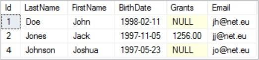
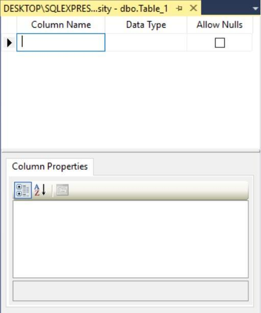
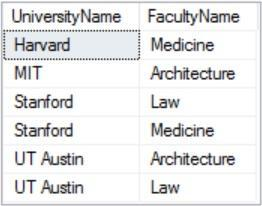
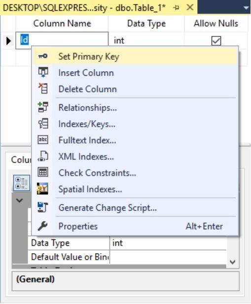
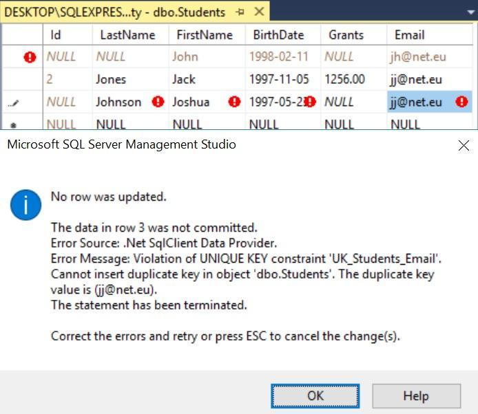
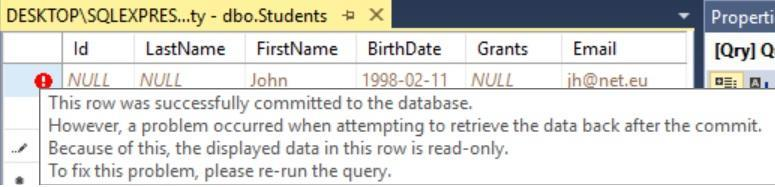
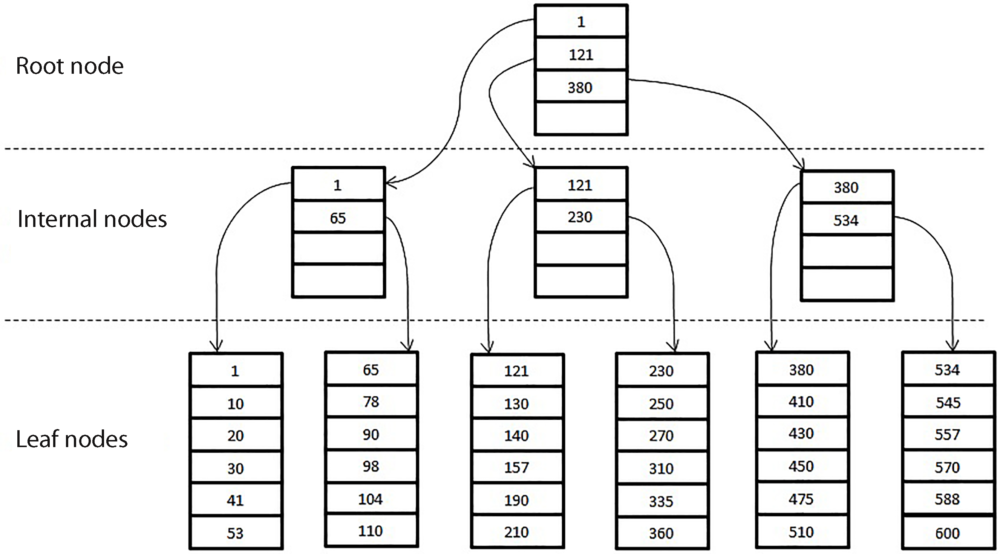

# Таблиці, типи даних, запити, основи

> ## Excerpt
> 1. Таблиці

---
## 1\. Таблиці

На минулому занятті ви вивчили порядок створення бази даних та виконання різних дій щодо її налаштування. Однак сама по собі база даних особливої користі не принесе, щоб її можна було використовувати в повному обсязі необхідна наявність у ній ряду таблиць.

Таблиці у базі даних являють собою безліч даних, об'єднаних за певним принципом. Кожна таблиця описує набір об'єктів одного типу, при цьому у стовпцях зберігається конкретна властивість об'єктів, а в рядках — кожен окремий об'єкт.

Щоб було зрозуміліше, розберемо це на прикладі. Припустимо, у нас є таблиця Students, яка зберігає інформацію про студентів якогось навчального закладу. У цій таблиці стовпці LastName, FirstName, BirthDate, Grants, Email необхідні для зберігання інформації про прізвище, ім'я, дату народження, стипендії та адресу електронної пошти відповідно, а кожен рядок у цій таблиці містить інформацію про конкретного студента. Наприклад, студент Joshua Johnson народився 23 травня 1997 року, адреса його електронної пошти jo@net.eu, дані про його стипендію відсутні (Рисунок 1).



Рисунок 1. Таблиця з інформацією про студентів

Тепер, коли призначення таблиць стало зрозумілим, ми можемо розпочати процес створення власних таблиць. Щоб створити таблицю в базі даних, необхідно розкрити пункт необхідної БД (в нашому випадку University) у вікні Object Explorer, клацнути правою клавішею миші на папку Tables і у контекстному меню вибрати пункт Table… (Рисунок 2).


Рисунок 2. Створення нової таблиці (початок)

У відкритій вкладці знаходиться таблиця, яка складається з трьох стовпців: Column Name, Data Type та Allow Nulls. Ця таблиця дозволяє сформувати нову таблицю в поточній базі даних шляхом створення необхідних полів, задавши їм значення у рядках, відповідно, назву (Column Name), тип даних (Data Type) та можливість використання невизначеного (NULL) значення (Allow Nulls) (Рисунок 3).



Рисунок 3. Створення нової таблиці (продовження)

### 1.1. Первинний ключ

У прикладі минулого розділу (Рисунок 1) ми навмисне проігнорували стовпець Id. Справа в тому, що цей стовпець зовсім не простий. У кожній таблиці бази даних має бути поле або сукупність полів, яке має загальну назву — первинний ключ. Значення первинного ключа ніколи не мають повторюватися, забезпечуючи унікальність будь-якого запису в таблиці. У прикладі на рисунку 1 поле Id є первинним ключем таблиці Students.

Існує також поняття складеного первинного ключа. У цьому випадку первинний ключ складається з двох і більше полів, поєднання значень у яких має бути унікальним. Наприклад, можна використовувати поля UniversityName і FacultyName як складений первинний ключ (Рисунок 4), що є доцільним, оскільки назви факультетів в одному університеті не можуть повторюватися, а в окремих інших університетах можуть.



Рисунок 4. Приклад складеного первинного ключа

З вищесказаного випливає, що в будь-якій таблиці необхідно створити поле, яке буде первинним ключем. Зазвичай таке поле називають Id або в його назві є слово Id, наприклад, StudId і також звичайно, але не обов'язково, тип цього поля повинен бути цілочисельним (про типи даних буде розказано далі).

Для того, щоб створити в нашій таблиці поле з назвою Id типу int, необхідно в новому рядку таблиці в полі Column Name ввести відповідну назву, а в полі Data Type зі списку вибрати назву необхідного типу даних (Рисунок 5).


Рисунок 5. Вибір необхідного типу даних

Для того, щоб зробити це поле первинним ключем, необхідно клацнути по ньому мишкою і в контекстному меню вибрати пункт Set Primary Key (Рисунок 6).



Рисунок 6. Створення первинного ключа

В результаті ви помітите зображення ключа поруч із вибраним полем, також ви помітите неможливість встановлення первинного ключа невизначеного значення (скинуто значення у полі Allow Nulls).

Існує можливість налаштувати отримання унікального значення первинного ключа шляхом задання автоматичного інкрементування значень у потрібному полі. Для цього необхідно в таблиці Column Properties розкрити властивість Identity Specification і у випадаючому списку поля (Is Identity) вибрати значення Yes (Рисунок 7).


Рисунок 7. Налаштування унікальності первинного ключа

Після цього будуть доступні поля Identity Increment та Identity Seed. Змінивши значення в полі Identity Increment, ви можете задати величину збільшення первинного ключа. За допомогою поля Identity Seed можна задати початкове значення відповідного поля таблиці, за замовчуванням значення в цих полях рівні 1 (Рисунок 8).


Рисунок 8. Налаштування автоматичного інкрементування значень

Первинні ключі також використовуються для створення зв'язків між таблицями, але про це ви докладніше дізнаєтесь у четвертому уроці.

### 1.2. Значення за замовчуванням

При створенні таблиці існує можливість задати значення за замовчуванням для конкретних полів. Тобто якщо при додаванні нового запису в таблицю полю не буде вказано конкретне значення, то буде записано значення за замовчуванням.

Продовжимо формування полів нашої таблиці. Наступне поле має назву LastName, призначене для зберігання прізвища студента і має тип даних nvarchar(50).

Для того, щоб задати полю значення за замовчуванням, необхідно в таблиці Column Properties задати потрібне значення властивості Default Value or Binding, у нашому випадку — Doe (Рисунок 9).


Рисунок 9. Налаштування значення за замовчуванням

### 1.3. Унікальність

При створенні таблиці може виникнути необхідність використання полів з унікальними значеннями для кожного запису і Management Studio надає таку можливість.

У нашому випадку таким полем є поле для зберігання електронної адреси студента (Email). Для того, щоб оголосити це поле унікальним, необхідно клацнути правою клавішею миші і в контекстному меню вибрати пункт Indexes/Keys… (Рисунок 10).


Рисунок 10. Створення унікального ключа (початок)

У відкритому вікні Indexes/Keys потрібно додати ключ налаштування, натиснувши на кнопку Add, при цьому система згенерує довільне ім'я цього ключа, яке можна змінити в полі (Name) розділу Identity (Рисунок 11).


Рисунок 11. Зміна імені ключа

Наступне, що необхідно зробити — вказати ім'я стовпця, що налаштовується в полі Columns, для чого потрібно в цьому полі натиснути кнопку з трьома точками і в випадаючому списку вікна Index Columns вибрати потрібну назву, після чого натиснути кнопку OK (Рисунок 12).


Рисунок 12. Вибір стовпця, що налаштовується

Останнім кроком у налаштуванні унікального поля є необхідність вказати тип ключа в полі Type розділу (General), у випадаючому списку якого необхідно вибрати значення Unique Key (Рисунок 13).


Рисунок 13. Внесення типу ключа

Для того, щоб налаштування унікальності поля набули чинності, потрібно закрити вікно Indexes/Keys натиснувши кнопку Close.

Після того, як ви створили та налаштували всі поля таблиці, необхідно змінити ім'я таблиці, задане за замовчуванням. Це можна зробити у вікні властивостей поточної таблиці, вказавши в полі (Name) розділу Identity ім'я таблиці (Рисунок 14).


Рисунок 14. Перейменування таблиці

Збереження створеної нами таблиці відбувається стандартним чином — натисканням кнопки із зображенням дискети на панелі інструментів або клавішами Ctrl+S. Після цього таблиця Students з'явиться у списку таблиць бази даних University.

Для того, щоб переконатися в правильності виконаних нами налаштувань, заповнимо таблицю Students значеннями. Для цього необхідно натиснути правою клавішею миші на імені таблиці і в контекстному меню вибрати пункт Edit Top 200 Rows (Рисунок 15).


Рисунок 15. Заповнення таблиці значеннями (початок)

У вкладці що з'явилась ви побачите таблицю з NULL-значеннями в кожному полі, заповнимо їх певними значеннями.

Ви можете помітити, що при додаванні до таблиці чергового запису значення в полі Id генерується автоматично, що відбувається завдяки налаштуванню автоікрементування первинного ключа.

При спробі вказати в полі Email повторювані значення, ви побачите помилку, в якій повідомляється про порушення унікальності та неможливість дублювання конкретного запису (Рисунок 16).



Рисунок 16. Помилка: порушення унікальності запису

У першому записі ми не вказали значення для поля LastName (перевірка на значення за замовчуванням) і Management Studio реагує на це як на помилку, щоправда, в описі вказується, що помилки немає і ця проблема зникне після збереження таблиці (Рисунок 17).



Рисунок 17. Помилка: не заповнене поле

Для того, щоб перевірити правильність заповнення таблиці Students значеннями, необхідно клацнути правою клавішею миші на ім'я таблиці та вибрати пункт Select Top 1000 Rows (Рисунок 18).


Рисунок 18. Вибір записів у таблиці (початок)

У відкритій вкладці ви побачите текст запиту, а в результатах — отриману таблицю з назвами полів і даними в них (Рисунок 19).


Рисунок 19. Результат вибору записів таблиці

Хоча текст запиту вам поки що незрозумілий, ви можете переконатися, що всі записи заповнилися коректно.

## 2\. Типи даних

Як ви вже помітили, для зберігання інформації в таблицях використовуються різні типи даних, розглянемо основні з них.

### 2.1. Цілочисельні типи даних

Цілочисельні типи даних використовуються для зберігання точних числових даних, наприклад віку людини або кількості одиниць певного товару. Нижче наведена таблиця цілих типів даних із зазначенням назви, діапазону допустимих значень та кількості використаної пам'яті (Таблиця 1).

**Таблиця 1. Цілочисельні типи даних**

**Назва**

**Діапазон**

**Пам'ять**

bigint

від \-9 223 372 036 854 775 808 до 9 223 372 036 854 775 807

8 байт

int

від \-2 147 483 648 до 2 147 483 647

4 байта

smallint

від \-32 768 до 32 767

2 байта

tinyint

від 0 до 255

1 байт

Ще одним цілочисельним типом даних є bit, він займає один байт пам'яті і може зберігати значення 0, 1 або NULL, який фактично є аналогом логічного типу даних у таких мовах програмування як C++ або C#.

### 2.2. Типи даних для зберігання тексту

Для зберігання текстової інформації в базі даних використовуються чотири основні типи даних:

-   char(n) — призначений для зберігання рядків фіксованої довжини без кодування Unicode, де замість n вказується можлива кількість символів у рядку від 1 до 8000, пам'ять при цьому виділяється по одному байту на символ;
-   varchar(n|max) — також призначений для зберігання рядків без кодування Unicode, але змінної довжини. Допустиму кількість символів можна задати у рядку, вказати значення від 1 до 8000 або використати для цього словоmax і в цьому випадку для зберігання рядка виділиться пам'ять до 2ГБ;
-   nchar(n) — призначений для зберігання рядків фіксованої довжини в кодуванні Unicode. За допомогою n задається максимально можлива кількість символів у рядку від 1 до 4000, розмір виділеної пам'яті по два байти на символ;
-   nvarchar(n|max) — тип даних, призначений для зберігання рядків змінної довжини у кодуванні Unicode. Максимальну кількість символів у рядку можна задати від 1 до 4000 або виділити пам'ять для зберігання рядка до 2ГБ, якщо використовувати ключове слово max.

У чому ж полягає різниця між рядком змінної довжини і фіксованим рядком?

Якщо, наприклад, для зберігання рядка вказаний тип даних char або nchar з розміром 10 символів (char(10) або nchar(10)), а рядок зберігається із шести символів, то кількість виділеної пам'яті буде відповідати заявленому розміру — 10 або 20 байт, відповідно.

Якщо для зберігання рядка вказаний тип даних varchar або nvarchar з розміром 10 символів (varchar(10) або nvarchar(10)), а рядок зберігається із шести символів, то розмір виділеної пам'яті буде відповідати реальній кількості символів — 6 або 12 байт відповідно.

Ви також можете зустріти типи даних text та ntext, але ці типи даних є застарілими і їх використання не рекомендовано.

### 2.3. Дійсні типи даних

Для зберігання числових типів даних з плаваючою точкою використовуються дійсні типи даних float і real.

За допомогою типу даних float можна зберігати числа в діапазоні від \-1,79E+308 до \-2,23E-308, 0 та від 2,23E-308 до 1,79E+308.

При використанні типу даних float(n), вказуючи значення n, ви можете встановлювати точність числа і, відповідно, змінювати розмір використаної пам'яті. Якщо значення n від 1 до 24, то SQL Server трактує його як 24 і виділяє пам'ять 4 байти для зберігання числа з точністю до 7 знаків. Якщо в n вказується значення від 25 до 53, то SQL Server трактує його як 53 і виділяє 8 байт пам'яті для зберігання числа з точністю до 15 знаків. За замовчуванням, значення n рівне 53.

Тип даних real дозволяє зберігати числа в діапазоні від — 3,40E+38 до \-1,18E-38,0 і від 1,18E-38 до 3,40E+38.

Синонімом для типу даних real є float(24).

### 2.4. Типи даних для зберігання дати та часу

Для зберігання в таблицях дати та часу, SQL Server надає ряд типів даних, якими можна скористатися в залежності від поставленого завдання.

Тип даних datetime дозволяє зберігати дату та час у 24-годинному форматі із зазначенням долі секунди, в діапазоні з 1 січня 1753 року по 31 грудня 9999 року, наприклад, 2017-12-28 15:20:35.693.

Тип даних datetime2 дозволяє зберігати дату та час у 24-годинному форматі, але має велику точність долі секунди в порівнянні з типом datetime та діапазон дат з 1 січня 0001 року по 31 грудня 9999 року, наприклад, 2017-12-28 15:20:35.6930000.

Тип даних datetimeoffset дозволяє зберігати дату та час у 24-годинному форматі із зазначенням долі секунди з урахуванням часового поясу в діапазоні з 1 січня 0001 року по 31 грудня 9999 року, наприклад, 2017-12-28 15:20:35.6930000 +00:00.

Попередні типи даних виводять досить точні значення часу, але, якщо вам достатньо отримати тільки дату і час, наприклад, час покупки товару, тоді ви можете використовувати тип даних smalldatetime. Цей тип даних дозволяє зберігати дату та час у 24-годинному форматі із секундами, завжди рівними нулю, без долі секунди в діапазоні з 1 січня 1900 року по 6 червня 2079 року, наприклад, 2017-12-28 15:20:00.

Якщо поле вашої таблиці призначене для зберігання тільки дати, наприклад, дати народження людини, то вам більше підійде тип даних date, який дозволяє зберігати дату в діапазоні з 1 січня 0001 до 31 грудня 9999 року, наприклад, 2017-12-28.

Тип даних time дозволяє зберігати тільки час у 24-годинному форматі із зазначенням долі секунди без врахування часового поясу в діапазоні від 00:00:00.0000000 до 23:59:59.9999999, наприклад, 15:20:35.6930000.

### 2.5. Типи даних із фіксованою точкою

Для зберігання дійсних значень у більш точному форматі, використовуються типи даних decimal(p,s) та numeric(p,s). Ці типи даних взаємозамінні і дозволяють зберігати дані в діапазоні від \-1038+1 до 1038-1.

За допомогою параметра p задається загальна кількість цифр у числі як цілої, так і дробової частини. Діапазон значень від 1 до 38 (за замовчуванням 18) чим більше значення ви вкажете, тим більше байт пам'яті буде виділено для зберігання інформації. Значення параметра s визначає кількість цифр дробової частини числа в діапазоні від 0 до p (за замовчуванням 0).

Тип decimal(6,2) ми використовували як тип даних для поля Grants таблиці Students із розділу №1. У цьому випадку загальна кількість цифр в числі дорівнює 6, а цифр після коми 2, тобто ціла частина повинна складатися із 4 цифр.

### 2.6. Інші типи даних

Для зберігання грошових значень використовуються типи даних money і smallmoney, які є дійсними числами, дробова частина яких призначена для зберігання монет (копійки, центи і т.ін.) (Таблиця 2).

**Таблиця 2. Грошові типи даних**

**Назва**

**Діапазон**

**Пам'ять**

money

від \-922 337 203 685 477,5808 до 922 337 203 685 477,5807

8 байт

smallmoney

від \-214 748,3648 до 214 748,3647

4 байта

Для зберігання різної інформації в бінарному вигляді, використовуються типи даних binary(n) та varbinary(n|max). Параметр n може приймати значення від 1 до 8000, якщо вказати ключове слово max, то виділиться пам'ять для зберігання 2ГБ інформації.

Якщо у вас є потреба зберігати дані у двовимірній системі координат, тоді ви можете використовувати тип даних geometry.

Для зберігання координат широти та довготи об'єкта існує тип даних geography.

Зберігання документів XML забезпечує тип даних _xml_.

Тимчасовий результат набору даних, отриманих в результаті запиту, зберігається в типі даних table.

Зазвичай, під час створення таблиці, полям вказують такі типи даних, максимальний розмір яких гарантовано дозволить зберегти необхідний діапазон значень. Такий підхід використовують в цілях зменшення розміру бази даних.

## 3\. Індекс

### 3.1. Що таке індекс?

Індекс — це фізична структура даних у БД, за допомогою якої здійснюється прискорений доступ до необхідної інформації, використання відповідного індексу значно поліпшує продуктивність запиту.

Для того, щоб краще зрозуміти, що таке індекс, уявімо ситуацію, коли вам необхідно знайти певний розділ у будь-якій книзі. Існують два способи як це зробити — послідовне гортання усіх сторінок або отримання номеру потрібної сторінки із змісту книги. Звичайно, використовуючи другий спосіб, ви швидше досягнете необхідного результату. Так ось індекси, також як і зміст у книзі, дозволяють прискорити доступ до необхідної інформації в базі даних. Якщо відповідний індекс відсутній, пошук здійснюється послідовним перебором всіх записів у таблиці.

### 3.2. Цілі та завдання індексу

До цього моменту ви могли б сказати: «Давайте призначимо індекси для всіх полів таблиці, що може бути простіше?» Однак такий підхід принесе більше шкоди, ніж користі, адже індекс, по суті, є копією даних того поля, для якого він створений. Отже, при створенні індексу збільшується розмір бази даних. Також наявність великої кількості індексів збільшує час виконання операцій зі зміни даних (INSERT, UPDATE, DELETE), тому що зміна полів автоматично призводить до зміни індексів, внаслідок чого відбувається фрагментація індексу. Тому, створювати індекси необхідно з обережністю і пам'ятати про деякі особливості:

-   індекси автоматично створюються для унікальних полів таблиці та полів, які вказані як первинні ключі;
-   індекси слід створювати для полів таблиці, по яких часто проводиться пошук (можна також створювати один індекс для набору стовпців);
-   для створення індексу найбільш підходять ті поля таблиці, у яких кількість повторюваних значень мінімальна;
-   індекси також можна створювати і для представлень (VIEWS), які ми розглянемо в курсі MS SQL Server.

### 3.3. Внутрішній механізм індексу

Перш ніж ми опишемо внутрішній механізм індексу, необхідно розібратися в способі зберігання даних у самій базі даних.

Мінімальною одиницею розподілу пам'яті в базі даних є сторінки, розмір кожної сторінки 8КБ. Існує два види сторінок — сторінки даних та сторінки індексів. Вісім сторінок утворюють екстент, який використовується для ефективного керування сторінками. Розмір екстенту, відповідно, 64КБ.

Для зберігання індексів використовується структура даних у вигляді збалансованого дерева В-дерево (_Balanced Tree_ — B-Tree). Така структура представляється у вигляді дерева, гілки якого спрямовані вниз, і забезпечує автоматичну збалансованість вузлів, тобто кількість гілок праворуч від кореневого вузла приблизно дорівнює кількості гілок ліворуч. Такий спосіб зберігання забезпечує простий та швидкий спосіб вибірки необхідної інформації (Рисунок 20).



Рисунок 20. Приклад В-дерева

Індекси бувають кластерні та некластерні.

Кластерний індекс відрізняється тим, що на його листовому рівні містяться дійсні дані, тобто після досягнення листового рівня в такому індексі система отримує необхідні дані. У таблиці може бути лише один кластерний індекс, створений автоматично на полі, яке вказано як первинний ключ.

На листовому рівні некластерного індексу знаходиться або так званий ідентифікатор рядка (_Row ID_ — RID), в якому міститься інформація про необхідний запис у вигляді номера: екстенту, сторінки та зміщення рядка на сторінці, або кластеризований ключ, який містить інформацію про кластеризований індекс. Після отримання цієї інформації здійснюється подальший пошук даних. Кількість некластерних індексів однієї таблиці необмежена.

Використання індексів ви детально розглянете на курсі MS SQL Server.

## 4\. Системні бази даних та таблиці

Під час встановлення SQL Server 2016 автоматично створюються чотири системні бази даних, наявність яких необхідна для коректного функціонування SQL Server. Ви можете їх побачити, якщо у вікні Object Explorer Management Studio розгорнете папку _Databases_, а потім — підпапку _System Databases_ (Рисунок 21).


Рисунок 21. Системні бази даних

У цій папці містяться такі системні бази даних:

-   master — містить всю інформацію про SQL Server, а також про всі бази даних. Без цієї бази даних запуск SQL Server неможливий;
-   model — слугує шаблоном при створенні всіх користувацьких баз даних. Наявність цієї бази даних обов'язкова;
-   msdb — призначена для створення розкладу завдань, наприклад, для створення резервних копій та відновлення будь-якої бази даних;
-   tempdb — використовується для зберігання різних тимчасових об'єктів.

Крім системних БД, також створюються і системні таблиці, які є спільними для всіх баз даних. Системних таблиць досить багато, тому ми розглянемо лише деякі з них. За більш детальною інформацією рекомендуємо звернутися до довідкової документації:

-   backupfile — містить інформацію про всі файли баз даних на момент створення резервних копій, що знаходиться в БД _msdb_;
-   restorefile — містить інформацію щодо кожного відновленого файлу БД. Розташована в базі даних _msdb_;
-   log\_shipping\_primary\_secondaries — містить інформацію, яка пов'язує БД-джерело з БД-одержувачем. Знаходиться у базі даних _msdb_;
-   cdc.lsn\_time\_mapping — у цій таблиці зберігаються дані про всі транзакції з таблиці змін;
-   MSdbms — у цій таблиці міститься повний перелік СУБД, відмінних від MS SQL Server, які підтримують сумісну з MS SQL Server реплікацію баз даних. Перебуває у БД _msdb_;
-   MSreplication\_options — містить дані, що використовуються під час реплікацій,. Розташована в базі даних master;
-   sys.sysoledbusers — містить дані про всіх користувачів поточного сервера. Перебуває у базі даних master.

## 5\. Запити

### 5.1. Вступ у мову структурованих запитів SQL

Основним призначенням будь-якої бази даних є накопичення необхідної інформації та надання її за необхідності. Необхідні дані ми можемо отримати, запросивши їх з БД, тобто написавши певний код — запит.

Для того, щоб написати відповідний запит, потрібна спеціалізована мова програмування. Традиційні мови програмування, що існували на момент появи реляційної моделі даних, такі як COBOL або Fortran, не підійшли на цю роль. Тому було розроблено нову мову програмування — SQL (_Structured Query Language_ — мову структурованих запитів).

### 5.2. Мова SQL

Перша версія мови реляційних баз даних з'явилася на початку 70-х років минулого сторіччя та називалася SEQUEL (_Structured English Query Language_ — мова структурованих запитів на основі англійської). Ця мова була розроблена компанією IBM як частина проєкту System/R, спрямованого на реалізацію реляційної СУБД. Через кілька років була випущена друга версія — SEQUEL/2, пізніше мова була перейменована на SQL.

Мова SQL є декларативною мовою, за допомогою якої ви звертаєтеся до бази даних, запитуючи потрібну інформацію, тобто ви вказуєте, що вам необхідно, а завдання — «як це отримати», вирішує сама СУБД.

Таким чином, основне призначення мови SQL — забезпечення взаємодії з базами даних, шляхом формування різноманітних запитів, що складаються зі спеціальних операторів. Оператори — це інструкції, за допомогою яких ви запитуєте інформацію з БД, вказуючи дані які вас цікавлять, звідки їх потрібно отримати і, при необхідності, обмежуючи отриманий результат. Наприклад, запит може звучати так: «Покажіть мені прізвища лише тих студентів, які народилися у листопаді». У даному випадку частина запиту «Покажіть мені» вказує, що потрібно надати, наступна частина запиту «студентів» — інформує звідки взяти дані, умова «народилися в листопаді» обмежує кількість записів.

У вигляді SQL-запиту це виглядає так:

```html
SELECT LastName
FROM Students
WHERE MONTH(BirthDate) = 11;
```


Не вдаючись до подробиць виконання запиту, про які ви дізнаєтеся з наступного уроку, можна внести певну ясність. За допомогою оператора SELECT ви прописуєте, що вам потрібно, в операторі FROM ви вказуєте, звідки необхідно взяти потрібну інформацію, а в операторі WHERE знаходиться умова, яка конкретизує кінцевий результат.

### 5.3. Стандарти мови SQL

Незважаючи на те, що мова SQL була прийнята як основна мова по роботі з базами даних, існування декількох виробників СУБД призвело до появи кількох реалізацій (діалектів) мови SQL від різних виробників. Такий стан речей унеможливлював перенесення програмного забезпечення з однієї СУБД на іншу, тому постало питання про стандартизацію мови SQL.

У 1986 році Американський національний інститут стандартів (ANSI) розробив перший стандарт мови SQL, який був затверджений Міжнародною організацією стандартів (ISO) у 1987 роціі отримав назву SQL-86. Після внесення зміни до оригінального стандарту, у 1989 році вийшов наступний стандарт мови — SQL-89.

Наступні розширення мови SQL призвели до появи кількох стандартів у 1992, 1999, 2003, 2006, 2008, 2011 та 2016 роках. В даний час діє стандарт SQL-2016.

### 5.4. Діалекти мови SQL

Незважаючи на наявність великої кількості стандартів, в даний час не існує єдиного діалекту мови SQL. Запровадження виробниками СУБД нових функціональних засобів вносить у існуючі діалекти нові зміни, цим діалекти дедалі більше відрізняються один від одного.

Наведемо список діалектів мови SQL у СУБД найвідоміших виробників:

-   **T-SQL** (_Transact-SQL_) — цей діалект використовується в СУБД Microsoft SQL Server та Sybase ASE;
-   **PL/SQL** (_Procedural Language/SQL_) — цей діалект використовується в СУБД Oracle;
-   **SQL/PSM** (_SQL/Persistent Stored Module_) — цей діалект використовується у СУБД MySQL;
-   **PLpg/SQL** (_Procedural Language/postgreSQL_) — діалект реалізований у СУБД PostgreSQL;
-   **SQLPL** (_SQL Procedural Language_) — цей діалект реалізований у СУБД DB2;
-   **Jet SQL** — даний діалект реалізований в СУБД Microsoft Access.

### 5.5. Діалект Transact-SQL

**Transact-SQL** — реалізація мови SQL, розроблена корпорацією Microsoft для СУБД Microsoft SQL Server. Знайомитись з цим діалектом ви будете протягом поточного та наступного курсів, а поки що наведемо його короткий опис.

T-SQL дозволяє використовувати різні оператори: арифметичні (+, \-, \*, /, %), логічні (AND, OR, NOT), порівняння (\=, \>, <, \>=, <=, <>) та оператори для роботи з множинами (IN). При використанні T-SQL існує можливість створювати змінні за допомогою команди DECLARE, використовуючи спеціальні символи — ідентифікатори (@). У T-SQL міститься умовний оператор (IF) та цикл (WHILE). При написанні запитів існує можливість виклику вбудованих функцій (COUNT, SUM, MIN, MAX, DATEDIFF, ABS тощо). Для коментування коду в T-SQL використовується або рядковий (\--), або блоковий (/\*\*/) коментар.

### 5.6. Поняття DDL, DML, DCL

SQL-оператори поділяються на три категорії: оператори **DDL** (_Data Definition Language_ — мова опису даних), **DML** (_Data Manipulation Language_ — мова керування даними) та **DCL** (_Data Control Language_ — мова керування доступом до даних). Розглянемо ці оператори докладніше.

Оператори DDL дозволяють працювати зі структурою даних у БД:

-   створення об'єкта (CREATE);
-   зміна об'єкта (ALTER);
-   видалення об'єкта (DROP).

Оператори DML використовуються при роботі з даними у БД:

-   запит певної інформації (SELECT);
-   вставка необхідних даних у таблицю (INSERT);
-   оновлення існуючих даних у таблиці (UPDATE);
-   видалення даних із таблиці (DELETE).

Оператори DCL дозволяють керувати доступом до бази даних:

-   надання доступу користувача до роботи з об'єктом (GRANT);
-   заборона доступу користувача до об'єкту (DENY);
-   скасування привілеїв доступу користувача до об'єкту (REVOKE).

## 6\. Домашнє завдання

Створіть базу даних, яка містить таблицю з інформацією про книги. Назви потрібних полів продумайте самостійно. Використовуйте всі знання, які ви отримали до цього моменту.

© STEP IT Academy, [itstep.org](https://itstep.org/)

All the copyrighted photos, audio, and video works, fragments of which are used in the material, are the property of their respective owners. Fragments of the works are used for illustrative purposes to the extent justified by the objective, within the educational process, and for educational purposes, in accordance with the Act of “On Copyright and Related Rights”. The scope and method of the cited works are in accordance with the adopted norms, without prejudice to the normal exploitation of copyright, and do not prejudice the legitimate interests of authors and right holders. At the time of use, the cited works fragments cannot be replaced by alternative, non-copyrighted counterparts and meet the criteria for fair use. All rights reserved. Any reproduction of the materials or its part is prohibited. Use of the works or their fragments must be agreed upon with authors and rights holders. Agreed material use is only possible with reference to the source. Responsibility for unauthorized copying and commercial use of the material is determined by the current legislation.
