> {width="4.874622703412074in"
> height="6.30937445319335in"}

### Влад Хононов

{width="5.39244094488189in"
height="2.1599989063867016in"}

> Санкт-Петербург
>
> «БХВ-Петербург» 2024
>
> УДК 004.4\'236
>
> ББК 32.973.26-018
>
> Х77
>
> Хононов В.
>
> Х77 Изучаем DDD --- предметно-ориентированное проектирование: Пер. с
> англ. --- СПб.: БХВ-Петербург, 2024. --- 320 с.: ил.
>
> ISBN 978-5-9775-1886-4
>
> Книга посвящена методологии DDD (предметно-ориентированному проектиро-
> ванию), что особенно актуально в условиях дробления предметных
> областей и усложнения бизнес-взаимодействий. Рассказано, как оценить
> масштаб и сложность предметной области, измерить темпы ее развития,
> учесть необходимые зависимо- сти, применять событийно-ориентированную
> архитектуру и структурировать соз- даваемое ПО, эффективно вписывая
> его в сеть данных (Data Mesh). Материал будет особенно интересен при
> развитии стартапа и разработке наукоемких отраслевых систем.
>
> *Для архитекторов ПО, бизнес-аналитиков*
>
> *и разработчиков корпоративного программного обеспечения*

УДК 004.4\'236

ББК 32.973.26-018

> Группа подготовки издания:
>
> Руководитель проекта *Олег Сивченко*
>
> Зав. редакцией *Людмила Гауль* Перевод с английского *Николая
> Вильчинского* Редактор *Анна Ардашева* Компьютерная верстка *Ольги
> Сергиенко* Оформление обложки *Зои Канторович*
>
> © 2023 BHV
>
> Authorized Russian translation of the English edition of *Learning
> Domain-Driven Design* ISBN 9781098100131
>
> © 2022 Vladislav Khononov.
>
> This translation is published and sold by permission of O'Reilly
> Media, Inc., which owns or controls all rights to publish and sell the
> same.
>
> Авторизованный перевод с английского языка на русский издания
> *Learning Domain-Driven Design*
>
> ISBN 9781098100131 © 2022 Vladislav Khononov.
>
> Перевод опубликован и продается с разрешения компании-правообладателя
> O'Reilly Media, Inc.

1

> Формат 70×100 /16. Печать офсетная. Усл. печ. л. 25,8.
>
> Тираж 1200 экз. Заказ №
>
> \"БХВ-Петербург\", 191036, Санкт-Петербург, Гончарная ул., 20.
>
> Отпечатано с готового оригинал-макета
>
> ООО \"Принт-М\", 142300, М.О., г. Чехов, ул. Полиграфистов, д. 1
>
> ISBN 978-1-098-10013-1 (англ.)
>
> ISBN 978-5-9775-1886-4 (рус.)
>
> © Vladislav Khononov, 2022
>
> © Перевод на русский язык, оформление. ООО \"БХВ-Петербург\", ООО
> \"БХВ\", 2023

## Оглавление

> [Предисловие редакторской группы 15](#предисловие-редакторской-группы)
>
> [Предисловие 19](#предисловие)
>
> [Введение 21](#введение)

[Зачем я написал эту книгу 22](#зачем-я-написал-эту-книгу)

[Кому следует прочитать эту книгу 22](#кому-следует-прочитать-эту-книгу)

[Навигация по книге 23](#навигация-по-книге)

[Пример предметной области: WolfDesk
24](#пример-предметной-области-wolfdesk)

[Соглашения, используемые в этой книге
25](#соглашения-используемые-в-этой-книге)

[Порядок использования примеров кода
26](#порядок-использования-примеров-кода)

[Благодарности 27](#благодарности)

[Вступление 29](#вступление)

ЧАСТЬ I. СТРАТЕГИЧЕСКОЕ ПРОЕКТИРОВАНИЕ 31

Глава 1. Анализ предметной области 33

[Так что же такое предметная область?
33](#так-что-же-такое-предметная-область)

[Что такое поддомен (subdomain)? 34](#что-такое-поддомен-subdomain)

[Типы поддоменов 34](#типы-поддоменов)

[Основные поддомены (core subdomains)
34](#основные-поддомены-core-subdomains)

[Универсальные поддомены (generic subdomains)
36](#универсальные-поддомены-generic-subdomains)

[Вспомогательные поддомены (supporting subdomains)
36](#вспомогательные-поддомены-supporting-subdomains)

[Сравнение поддоменов 37](#сравнение-поддоменов)

[Конкурентное преимущество 37](#конкурентное-преимущество)

[Сложность 38](#сложность)

[Изменчивость 39](#изменчивость)

[Стратегия решения (solution) 40](#стратегия-решения-solution)

[Определение границ поддоменов 41](#определение-границ-поддоменов)

[Выделение поддоменов (Distilling subdomains)
42](#выделение-поддоменов-distilling-subdomains)

Поддомены с позиции согласующихся сценариев использования 42

[Сосредоточьтесь на главном 44](#сосредоточьтесь-на-главном)

[Примеры анализа предметной области
44](#примеры-анализа-предметной-области)

[Gigmaster 44](#gigmaster)

[Предметная область (домен) и поддомены
45](#предметная-область-домен-и-поддомены)

[Архитектурные решения 45](#архитектурные-решения-1)

BusVNext 46

Предметная область (домен) и поддомены 46

Архитектурные решения 47

6 \| Оглавление

[Кто такие специалисты в предметной области?
47](#кто-такие-специалисты-в-предметной-области)

[Выводы 48](#выводы)

[Упражнения 49](#упражнения)

Глава 2. Экспертные знания о предметной области 50

[Задачи бизнеса (business problems)
50](#задачи-бизнеса-business-problems)

[Выявление экспертных знаний 51](#выявление-экспертных-знаний)

[Общение 51](#общение)

[Что такое единый язык? 53](#что-такое-единый-язык)

[Язык бизнеса 54](#язык-бизнеса)

[Сценарии 54](#сценарии)

[Согласованность 55](#согласованность)

[Неоднозначные понятия 55](#неоднозначные-понятия)

[Понятия-синонимы 55](#понятия-синонимы)

[Модель предметной области 56](#модель-предметной-области)

[Что такое модель? 56](#что-такое-модель)

[Эффективное моделирование 56](#эффективное-моделирование)

[Моделирование предметной области 57](#моделирование-предметной-области)

[Непрерывная работа 57](#непрерывная-работа)

[Инструменты 58](#инструменты)

[Сложности 59](#сложности)

[Вывод 60](#вывод)

[Упражнения 61](#упражнения-1)

Глава 3. Как осмыслить сложность предметной области 62

[Противоречивые модели 62](#противоречивые-модели)

[Что такое ограниченный контекст? 64](#что-такое-ограниченный-контекст)

[Границы модели 65](#границы-модели)

[Уточнение термина «единый язык» 65](#уточнение-термина-единый-язык)

[Область применения ограниченного контекста
66](#область-применения-ограниченного-контекста)

[Сравнение ограниченных контекстов и поддоменов
67](#сравнение-ограниченных-контекстов-и-поддоменов)

[Поддомены 67](#поддомены)

[Ограниченные контексты 68](#ограниченные-контексты)

[Взаимодействие поддоменов и ограниченных контекстов
68](#взаимодействие-поддоменов-и-ограниченных-контекстов)

[Границы 70](#границы)

[Физические границы 70](#физические-границы)

[Границы владения 70](#границы-владения)

[Ограниченные контексты в реальной жизни
71](#ограниченные-контексты-в-реальной-жизни)

[Семантические области 71](#семантические-области)

[Наука 72](#наука)

[Покупка холодильника 73](#покупка-холодильника)

[Вывод 75](#вывод-1)

[Упражнения 75](#упражнения-2)

Глава 4. Интеграция ограниченных контекстов 77

[Сотрудничество (Cooperation) 77](#сотрудничество-cooperation)

[Партнерство (Partnership) 78](#партнерство-partnership)

[Общее ядро (shared kernel) 78](#общее-ядро-shared-kernel)

[Общие рамки (Shared scope) 79](#общие-рамки-shared-scope)

[Реализация 79](#реализация)

[Когда следует воспользоваться общим ядром
80](#когда-следует-воспользоваться-общим-ядром)

Оглавление \| 7

[Потребитель-Поставщик (Customer-supplier)
81](#потребитель-поставщик-customer-supplier)

[Конформист (Conformist) 81](#конформист-conformist)

[Предохранительный слой (Anticorruption layer)
82](#предохранительный-слой-anticorruption-layer)

[Сервис с открытым протоколом (Open-Host Service)
83](#сервис-с-открытым-протоколом-open-host-service)

[Разные пути (Separate Ways) 84](#разные-пути-separate-ways)

[Проблемы общения 84](#проблемы-общения)

[Универсальный поддомен (Generic Subdomain)
84](#универсальный-поддомен-generic-subdomain)

[Различия в моделях 85](#различия-в-моделях)

[Карта контекстов (Context Map) 85](#карта-контекстов-context-map)

[Поддержка в актуальном состоянии 86](#поддержка-в-актуальном-состоянии)

[Ограничения 86](#ограничения)

[Вывод 87](#вывод-2)

[Упражнения 87](#упражнения-3)

ЧАСТЬ II. ТАКТИЧЕСКИЙ ЗАМЫСЕЛ 89

Глава 5. Реализация простой бизнес-логики 90

[Транзакционный сценарий 90](#транзакционный-сценарий)

[Реализация 91](#реализация-1)

[Это не так-то просто! 91](#это-не-так-то-просто)

[Отсутствие транзакционного поведения
91](#отсутствие-транзакционного-поведения)

[Распределенные транзакции 93](#распределенные-транзакции)

[Неявные распределенные транзакции
94](#неявные-распределенные-транзакции)

[Когда следует применять транзакционный сценарий
96](#когда-следует-применять-транзакционный-сценарий)

[Активная запись 97](#активная-запись)

[Реализация 97](#реализация-2)

[Когда следует применять активную запись
98](#когда-следует-применять-активную-запись)

[Придерживайтесь прагматичного подхода
99](#придерживайтесь-прагматичного-подхода)

[Вывод 99](#вывод-3)

[Упражнения 100](#упражнения-4)

Глава 6. Проработка сложной бизнес-логики 102

[Предыстория 102](#предыстория)

[Модель предметной области (доменная модель)
102](#модель-предметной-области-доменная-модель)

[Реализация 103](#реализация-3)

[Сложность 104](#сложность-2)

[Единый язык 104](#единый-язык)

[Строительные блоки 104](#строительные-блоки)

[Объект-значение 104](#объект-значение)

[Сущности 110](#сущности)

[Агрегаты 111](#агрегаты)

[Доменные сервисы (domain service)
119](#доменные-сервисы-domain-service)

[Управление сложностью 121](#управление-сложностью)

[Вывод 122](#вывод-5)

[Упражнения 123](#упражнения-6)

Глава 7. Моделирование фактора времени 125

[События как источник данных (Event Sourcing)
125](#события-как-источник-данных-event-sourcing)

[Поиск 130](#поиск)

[Анализ 132](#анализ)

8 \| Оглавление

[Источник истины 133](#источник-истины)

[Хранилище событий 133](#хранилище-событий)

[Модель предметной области, основанная на событиях
134](#модель-предметной-области-основанная-на-событиях)

[Преимущества 137](#преимущества)

[Недостатки 138](#недостатки)

[Часто задаваемые вопросы 139](#часто-задаваемые-вопросы)

[Производительность 139](#производительность)

[Удаление данных 141](#удаление-данных)

[А почему просто нельзя 141](#а-почему-просто-нельзя-...)

[Вывод 142](#вывод-4)

[Упражнения 142](#упражнения-5)

Глава 8. Архитектурные паттерны 144

[Сопоставление бизнес-логики и архитектурных паттернов
144](#сопоставление-бизнес-логики-и-архитектурных-паттернов)

[Слоистая архитектура (Layered Architecture)
145](#слоистая-архитектура-layered-architecture)

[Слой представления (Presentation layer)
145](#слой-представления-presentation-layer)

[Слой бизнес-логики (Business logic layer)
146](#слой-бизнес-логики-business-logic-layer)

[Слой доступа к данным (Data access layer)
146](#слой-доступа-к-данным-data-access-layer)

[Связь между слоями 147](#связь-между-слоями)

[Вариация 148](#вариация)

[Сервисный слой (Service layer) 148](#сервисный-слой-service-layer)

[Терминология 151](#терминология)

[Когда предпочтительнее использовать слоистую архитектуру
151](#когда-предпочтительнее-использовать-слоистую-архитектуру)

[Дополнительно: сравнение слоев и уровней
152](#дополнительно-сравнение-слоев-и-уровней)

[Порты и адаптеры (Ports and adapters)
152](#порты-и-адаптеры-ports-and-adapters)

[Терминология 152](#терминология-2)

[Принцип инверсии зависимостей (Dependency inversion principle)
153](#принцип-инверсии-зависимостей-dependency-inversion-principle)

[Интеграция инфраструктурных компонентов
154](#интеграция-инфраструктурных-компонентов)

[Варианты 155](#варианты)

[Когда предпочтительнее использовать порты и адаптеры
155](#когда-предпочтительнее-использовать-порты-и-адаптеры)

[Разделение ответственности команд и запросов (Command-Query
Responsibility Segregation)
155](#разделение-ответственности-команд-и-запросов-command-query-responsibility-segregation)

[Мультипарадигменное моделирование (Polyglot modelling)
156](#мультипарадигменное-моделирование-polyglot-modelling)

[Реализация 156](#реализация-5)

[Модель выполнения команд 157](#модель-выполнения-команд)

[Модели чтения (проекции) 157](#модели-чтения-проекции)

[Проецирование моделей чтения 157](#проецирование-моделей-чтения)

[Синхронные проекции 158](#синхронные-проекции)

[Асинхронные проекции 159](#асинхронные-проекции)

[Сложности 160](#сложности-2)

[Разделение моделей 160](#разделение-моделей)

[Когда предпочтительнее использовать CQRS
160](#когда-предпочтительнее-использовать-cqrs)

[Область применения 161](#область-применения)

[Вывод 162](#вывод-7)

[Упражнения 163](#упражнения-7)

Глава 9. Паттерны взаимодействия 164

[Преобразование моделей 164](#преобразование-моделей)

[Преобразование моделей без сохранения состояния
165](#преобразование-моделей-без-сохранения-состояния)

[Синхронный режим 165](#синхронный-режим)

[Асинхронный режим 167](#асинхронный-режим)

Оглавление \| 9

[Преобразование моделей с отслеживанием состояния
168](#преобразование-моделей-с-отслеживанием-состояния)

[Агрегирование входящих данных 168](#агрегирование-входящих-данных)

[Объединение нескольких источников
169](#объединение-нескольких-источников)

[Интеграция агрегатов 170](#интеграция-агрегатов)

[Паттерн исходящих сообщений (Outbox)
172](#паттерн-исходящих-сообщений-outbox)

[Извлечение неопубликованных событий
173](#извлечение-неопубликованных-событий)

[Сага 174](#сага)

[Согласованность 177](#согласованность-2)

[Диспетчер процессов 177](#диспетчер-процессов)

[Вывод 180](#вывод-6)

[Упражнения 181](#упражнения-8)

ЧАСТЬ III. ПРИМЕНЕНИЕ ПРЕДМЕТНО-ОРИЕНТИРОВАННОГО ПРОЕКТИРОВАНИЯ НА
ПРАКТИКЕ 183

Глава 10. Эвристика проектирования 184

[Эвристика 184](#эвристика)

[Ограниченные контексты 184](#ограниченные-контексты-2)

[Паттерны реализации бизнес-логики
186](#паттерны-реализации-бизнес-логики)

[Архитектурные паттерны 188](#архитектурные-паттерны-1)

[Стратегия тестирования 189](#стратегия-тестирования)

[Пирамида тестирования 190](#пирамида-тестирования)

[Ромб тестирования 190](#ромб-тестирования)

[Перевернутая пирамида тестирования
190](#перевернутая-пирамида-тестирования)

[Дерево тактических проектных решений
191](#дерево-тактических-проектных-решений)

[Вывод 192](#вывод-9)

[Упражнения 192](#упражнения-10)

Глава 11. Эволюция проектных решений 194

[Изменения в предметных областях 194](#изменения-в-предметных-областях)

[Из основного в универсальный 195](#из-основного-в-универсальный)

[Из универсального в основной 195](#из-универсального-в-основной)

[Из вспомогательного в универсальный
196](#из-вспомогательного-в-универсальный)

[Из вспомогательного в основной 196](#из-вспомогательного-в-основной)

[Из основного во вспомогательный 196](#из-основного-во-вспомогательный)

[Из универсального во вспомогательный
196](#из-универсального-во-вспомогательный)

[Стратегические аспекты проектирования
197](#стратегические-аспекты-проектирования)

[Тактические аспекты проектирования
198](#тактические-аспекты-проектирования)

[Преобразование транзакционного сценария в активную запись
198](#преобразование-транзакционного-сценария-в-активную-запись)

[Преобразование активной записи в модель предметной области
199](#преобразование-активной-записи-в-модель-предметной-области)

Преобразование модели предметной области в модель предметной области,
основанную на событиях 200

[Генерация прошлых переходов состояния
201](#генерация-прошлых-переходов-состояния)

[Моделирование событий миграции 202](#моделирование-событий-миграции)

[Организационные изменения 202](#организационные-изменения)

Переход от партнерства к отношениям потребитель-поставщик 203

[Переход от отношений потребитель-поставщик к модели разных путей
204](#переход-от-отношений-потребитель-поставщик-к-модели-разных-путей)

[Знания предметной области 204](#знания-предметной-области)

[Рост проекта 205](#рост-проекта)

[Поддомены 205](#поддомены-2)

10 \| Оглавление

[Ограниченные контексты 206](#ограниченные-контексты-1)

[Агрегаты 207](#агрегаты-2)

[Вывод 207](#вывод-8)

[Упражнения 208](#упражнения-9)

Глава 12. EventStorming 210

[Что такое EventStorming? 210](#что-такое-eventstorming)

[Кто принимает участие в EventStorming?.
210](#кто-принимает-участие-в-eventstorming)

[Что нужно для проведения EventStorming?
211](#что-нужно-для-проведения-eventstorming)

[Процесс проведения EventStorming
212](#процесс-проведения-eventstorming)

[Этап 1: Проведение неструктурированного исследования
212](#этап-1-проведение-неструктурированного-исследования)

[Этап 2: Выстраивание в хронологическом порядке
213](#этап-2-выстраивание-в-хронологическом-порядке)

[Этап 3: Проблемные места (pain points)
213](#этап-3-проблемные-места-pain-points)

[Этап 4: Выявление ключевых событий (pivotal events)
214](#этап-4-выявление-ключевых-событий-pivotal-events)

[Этап 5: Выявление команд (commands)
215](#этап-5-выявление-команд-commands)

[Этап 6: Выявление правил (policies)
216](#этап-6-выявление-правил-policies)

[Этап 7: Выявление моделей чтения (read model).
217](#этап-7-выявление-моделей-чтения-read-model)

[Этап 8: Выявление внешних систем (external systems)
217](#этап-8-выявление-внешних-систем-external-systems)

[Этап 9: Выявление агрегатов. 218](#этап-9-выявление-агрегатов)

[Этап 10: Выявление ограниченных контекстов
218](#этап-10-выявление-ограниченных-контекстов)

[Варианты 219](#варианты-2)

[Когда следует проводить EventStorming
220](#когда-следует-проводить-eventstorming)

[Советы по проведению 221](#советы-по-проведению)

[Отслеживание динамики проведения семинара
221](#отслеживание-динамики-проведения-семинара)

[Проведение EventStorming с удаленными участниками
222](#проведение-eventstorming-с-удаленными-участниками)

[Вывод 222](#вывод-11)

[Упражнения 222](#упражнения-12)

Глава 13. Предметно-ориентированное проектирование на практике 224

[Стратегический анализ 225](#стратегический-анализ)

[Осмысление предметной области 225](#осмысление-предметной-области)

[Основные поддомены (core subdomains)
225](#основные-поддомены-core-subdomains-1)

[Универсальные поддомены 226](#универсальные-поддомены)

[Вспомогательные поддомены (supporting subdomains)
226](#вспомогательные-поддомены-supporting-subdomains-1)

[Изучение текущего проекта 226](#изучение-текущего-проекта)

[Оценка тактического замысла 227](#оценка-тактического-замысла)

[Оценка стратегического замысла 227](#оценка-стратегического-замысла)

[Определение стратегии модернизации
228](#определение-стратегии-модернизации)

[Стратегическая модернизация 228](#стратегическая-модернизация)

[Тактическая модернизация 230](#тактическая-модернизация)

[Развитие единого языка 230](#развитие-единого-языка)

[Паттерн «Душитель» (Strangler) 231](#паттерн-душитель-strangler)

[Рефакторинг тактических проектных решений
233](#рефакторинг-тактических-проектных-решений)

Прагматичное предметно-ориентированное проектирование 234

Как «продать» предметно-ориентированное проектирование? 234

Законспирированное предметно-ориентированное проектирование 235

[Единый язык 235](#единый-язык-2)

[Ограниченные контексты 236](#ограниченные-контексты-4)

[Тактические проектные решения 236](#тактические-проектные-решения)

[Модель предметной области, основанная на событиях
237](#модель-предметной-области-основанная-на-событиях-1)

Оглавление \| 11

[Вывод 237](#вывод-10)

[Упражнения 238](#упражнения-11)

ЧАСТЬ IV. ВЗАИМООТНОШЕНИЯ С ДРУГИМИ МЕТОДОЛОГИЯМИ

[И ПАТТЕРНАМИ 239](#и-паттернами)

Глава 14. Микросервисы 240

[Что такое сервис? 240](#что-такое-сервис)

[Что такое микросервис? 241](#что-такое-микросервис)

Метод как Сервис (Method as a Service): путь к созданию идеальных

микросервисов? 242

[Цель проектирования 243](#цель-проектирования)

[Сложность системы 244](#сложность-системы)

[Микросервисы как «глубокие» сервисы (deep services)
245](#микросервисы-как-глубокие-сервисы-deep-services)

[Микросервисы как глубокие модули
246](#микросервисы-как-глубокие-модули)

[Предметно-ориентированное проектирование и границы микросервисов
248](#предметно-ориентированное-проектирование-и-границы-микросервисов)

[Ограниченные контексты 248](#ограниченные-контексты-3)

[Агрегаты 250](#агрегаты-1)

[Поддомены 251](#поддомены-1)

Сокращение публичных интерфейсов микросервисов 252

[Сервис с открытым протоколом 252](#сервис-с-открытым-протоколом)

[Предохранительный слой (anticorruption layer, ACL)
253](#предохранительный-слой-anticorruption-layer-acl)

[Вывод 254](#вывод-13)

[Упражнения 254](#упражнения-14)

Глава 15. Событийно-ориентированная архитектура 256

[Событийно-ориентированная архитектура
256](#событийно-ориентированная-архитектура)

[События 257](#события)

[События, команды и сообщения 257](#события-команды-и-сообщения)

[Структура 258](#структура)

[Типы событий 258](#типы-событий)

[Уведомление 258](#уведомление)

[Передача состояния с помощью события
260](#передача-состояния-с-помощью-события)

[События предметной области (domain event)
262](#события-предметной-области-domain-event)

[Сравнение событий предметной области и уведомлений
262](#сравнение-событий-предметной-области-и-уведомлений)

[Сравнение событий предметной области с ECST-сообщениями
262](#сравнение-событий-предметной-области-с-ecst-сообщениями)

[Типы событий: Пример 263](#типы-событий-пример)

Проектирование событийно-ориентированной интеграции 264

[Распределенный большой ком грязи
264](#распределенный-большой-ком-грязи)

[Временнáя связанность (связанность по времени)
265](#временнáя-связанность-связанность-по-времени)

[Функциональная связанность 266](#функциональная-связанность)

[Связанность на уровне реализации
266](#связанность-на-уровне-реализации)

Реорганизация событийно-ориентированной интеграции 266

Творческий подход к событийно-ориентированному проектированию 267

[Предполагайте худшее 267](#предполагайте-худшее)

[Используйте публичный интерфейс и приватные события
268](#используйте-публичный-интерфейс-и-приватные-события)

[Оценивайте требования к согласованности
268](#оценивайте-требования-к-согласованности)

[Вывод 269](#вывод-12)

[Упражнения 269](#упражнения-13)

12 \| Оглавление

> Глава 16. Сеть данных (Data Mesh) 271

Сравнение аналитической модели данных (OLAP) с моделью транзакционных
данных

(OLTP) 271

[Таблица фактов 272](#таблица-фактов)

[Таблица измерений 274](#таблица-измерений)

[Аналитические модели 274](#аналитические-модели)

[Платформы управления аналитическими данными
276](#платформы-управления-аналитическими-данными)

[Хранилище данных --- Data Warehouse
276](#хранилище-данных-data-warehouse)

[Озеро данных --- Data Lake 279](#озеро-данных-data-lake)

[Проблемы архитектур хранилища данных и озера данных
280](#проблемы-архитектур-хранилища-данных-и-озера-данных)

[Сеть данных (Data mesh) 281](#сеть-данных-data-mesh-1)

[Разбиение данных по предметным областям
281](#разбиение-данных-по-предметным-областям)

[Данные как продукт 283](#данные-как-продукт)

[Обеспечение автономии 284](#обеспечение-автономии)

[Построение экосистемы 284](#построение-экосистемы)

Совмещение сети данных (data mesh) и предметно-ориентированного

проектирования 285

[Вывод 287](#вывод-14)

[Упражнения 287](#упражнения-15)

[Заключение 289](#заключение)

[Задача 289](#задача)

[Решение 290](#решение)

[Реализация 291](#реализация-6)

[Рекомендуемая литература 291](#рекомендуемая-литература)

Дополнительные сведения о предметно-ориентированном проектировании 291

[Архитектурные и интеграционные шаблоны
292](#архитектурные-и-интеграционные-шаблоны)

[Модернизация устаревших систем 292](#модернизация-устаревших-систем)

[EventStorming 293](#eventstorming-1)

[Вывод 294](#вывод-15)

Приложение 1. Применение DDD: пример из практики 295

[Пять ограниченных контекстов 295](#пять-ограниченных-контекстов)

[Предметная область 295](#предметная-область)

[Ограниченный контекст № 1: Маркетинг
297](#ограниченный-контекст-1-маркетинг)

[Своеобразная магия 297](#своеобразная-магия)

Наши ранние взгляды на предметно-ориентированное проектирование 297

[Ограниченный контекст № 2: CRM 297](#ограниченный-контекст-2-crm)

[Еще больше «агрегатов»! 298](#еще-больше-агрегатов)

[Разработка решения: Дубль два 299](#разработка-решения-дубль-два)

[Вавилонская башня 2.0 299](#вавилонская-башня-2.0)

Более широкий взгляд на предметно-ориентированное проектирование 300

[Ограниченный контекст № 3: Обработчики событий
301](#ограниченный-контекст-3-обработчики-событий)

[Ограниченный контекст № 4: Бонусы 302](#ограниченный-контекст-4-бонусы)

[Проектирование: Дубль два 303](#проектирование-дубль-два)

[Единый язык 303](#единый-язык-1)

Классическое понимание предметно-ориентированного проектирования 303

[Ограниченный контекст № 5: Центр маркетинга
304](#ограниченный-контекст-5-центр-маркетинга)

[Микро --- что? 304](#микро-что)

[Реальная проблема 305](#реальная-проблема)

Оглавление \| 13

[Обсуждение 305](#обсуждение)

[Единый язык 305](#единый-язык-4)

[Поддомены 306](#поддомены-4)

[Сопоставление проектных решений с поддоменами
307](#сопоставление-проектных-решений-с-поддоменами)

[Не игнорируйте боль 308](#не-игнорируйте-боль)

[Границы ограниченных контекстов 308](#границы-ограниченных-контекстов)

[Вывод 309](#вывод-17)

Приложение 2. Ответы на вопросы упражнений 310

[Глава 1 310](#глава-1)

[Глава 2 311](#глава-2)

[Глава 3 311](#глава-3)

[Глава 4 312](#глава-4)

[Глава 5 312](#глава-5)

[Глава 6 313](#глава-6)

[Глава 7 313](#глава-7)

[Глава 8 313](#глава-8)

[Глава 9 314](#глава-9)

[Глава 10 314](#глава-10)

[Глава 11 314](#глава-11)

[Глава 12 315](#глава-12)

[Глава 13 315](#глава-13)

[Глава 14 315](#глава-14)

[Глава 15 315](#глава-15)

[Глава 16 316](#глава-16)

[Предметный указатель 317](#предметный-указатель)

[Об авторе 320](#об-авторе)

14 \| *Оглавление*

> --

## Предисловие редакторской группы

Баранов Сергей Александрович

> Архитектор, консультант, основатель конференции ArchDays, соучредитель
> российской ассоциации ИТ-архитекторов.
>
> https://github.com/jsergey

Мое знакомство с Domain-Driven Design про-
изошло около пятнадцати лет назад. На тот мо- мент для меня это было
что-то новое, перепро- шивающее разум и от того притягательное и во-
влекающее. Прочитав книгу Эванса «Предметно- ориентированное
проектирование. Структуриза- ция сложных программных систем» (https://

habr.com/ru/articles/580972/), я сразу попытался

применить новую информацию на практике. И оказалось, что многое из
прочитанного понял не так, потому что продолжал находиться в соб-
ственном контексте понимания, обусловленном прошлым опытом.

Со временем мое понимание Domain-Driven Design улучшилось, о чем говорил
положительный опыт

в разработке продуктов, спроектированных с использованием DDD. Это
понимание достаточно сложно описать словами, это своего рода инсайт,
озарение и я долгое время искал подходящие формулировки, определения,
примеры. Зачем? Потому что, несмотря на то, что Domain-Driven Design
действительно позволяет взять под контроль управление сложностью
проектируемых систем, сама по себе эта методо- логия все-таки достаточно
сложна.

После появления концепции микросервисов Domain-Driven Design пошел в
массы как один из наиболее эффективных методов разграничения
микросервисов. Назрела необходимость нового метода, который снизил бы
порог вхождения в саму практи- ку Domain-Driven Design, и такая практика
появилась --- ее назвали Event Storming.

Широкие массы проявили интерес к описываемой парадигме, и следом
неминуемо должна была появиться книга, которая бы простым и в то же
время профессио- нальным языком познакомила читателя с Domain-Driven
Design. Вы держите в ру- ках ровно такую книгу, c простыми и понятными
формулировками, определениями и примерами.

> 16 \| *Предисловие редакторской группы*

Выражаю благодарность за возможность провести научную редактуру столь
зна- чимого для индустрии труда и желаю Вам увлекательного погружения в
мир Domain-Driven Design!

Лукьянов Евгений Александрович

> Архитектор ПО
>
> https://github.com/stringconcat/

С современной IT-отраслью явно что-то не
так. Мы научились уверенно решать технические задачи:

у нас есть бесчисленные библиотеки, фреймворки и СУБД на все случаи
жизни. Мы парсим HTTP- запросы и легко обрабатываем огромные массивы
данных. Но когда дело доходит до управления сложностью предметной
области, начинается на- стоящий кошмар для всех участников проекта.

Когда код не отражает предметную область, техно- логии не помогут.
Заказчики получают что угодно, кроме того, что заказывали, проекты
гибнут, а раз- работчики продолжают перебирать СУБД и фрейм- ворки в
поисках Священного Грааля, попутно по- полняя резюме востребованными
технологиями.

И даже если такие проекты переписывают заново, они неизбежно
превращаются в прежнее болото.

Нельзя сказать, что для управления сложностью предметной области у нас
нет хороших инструментов. Есть, просто ими не пользуются. Например,
концепция Domain-Driven Design появилась 20 лет назад, но на реальных
проектах следование принципам DDD встречается все еще довольно редко.

Конечно, нельзя сказать, что DDD --- это просто и очевидно. Если вы
пробовали пройти по этому пути, то знаете, как много там граблей и как
мало вменяемых опи- саний практического применения. Книга, которую вы
держите в руках, призвана исправить эту ситуацию. Если вы только
присматриваетесь к DDD, книга объяснит аспекты этой концепции и даст
понимание, зачем все это нужно. А если вы опыт- ный разработчик, книга
поможет понять, как реализовать те или иные конструкции, и даст полезные
эвристические приемы, которые позволят ориентироваться в усло- виях
постоянной неопределенности.

> *Предисловие редакторской группы* \| 17

Промышленников Родион Александрович

> Руководитель отдела разработки
>
> https://github.com/rpromyshlennikov

С оригиналом этой книги я был удостоен
чести ознакомиться еще до того, как она увидела свет в виде печатного
издания на английском языке. Я был очарован стилем повествования автора,
простотой подачи информации и отношением ко- личества полезных знаний к
объему самой книги. Мы, как участники IT-отрасли, читаем много тех-
нической литературы, но не каждый раз нам выда- ется держать в руках
подобную жемчужину. По- верьте, эта книга стоит таких слов. С момента
публикации Фреда Брукса «No Silver Bullets:

Essence and Accidents of Software Engineering» (Brooks, 1987) прошло уже
более 30 лет, и на- конец-то появился подход, который позволяет нам
ответить на один из вопросов, поднятых в той статье и его книге: как
отделить существенную

сложность от несущественной и управлять этой сложностью --- DDD. Эта
книга будет хорошим подспорьем для любого IT-инженера, который решает
проблемы реальной жизни в сложных предметных областях. Не может не
радовать, что Влад Хононов не ограничился теоретическим обзором на DDD,
но и разобрал множество практических проблем, с которыми мы сталкиваемся
в ходе разработки ПО, причем некоторые выходящие за рамки DDD. Редакторы
приложили немало усилий, чтобы книга сохранила все свои ценные качества
и в переводе. Надеюсь, что вы будете довольны, желаю приятного чтения.

Круглов Геннадий Григорьевич

> Кандидат технических наук, независимый ИТ-эксперт, автор тренингов,
> спикер

Начал я применять Domain-Driven Design
через пару лет после выхода первой книги Эрика Эванса. Мне тогда эта
книга «чудом» попала в руки. На тот мо- мент у меня уже был опыт
использования Domain Model, да и в целом опыт предметно-ориентиро-
ванного проектирования. Но Domain-Driven Design

«зашел» сразу, ведь он дает все необходимые пат- терны для согласования
решения с бизнесом и по понятийному аппарату, и по коду.

Применять Domain-Driven Design доводилось в раз- ных архитектурных
стилях --- и в монолитных реше- ниях, и в SOA, и потом уже в
микросервисных

> 18 \| *Предисловие редакторской группы*

решениях. Мы в какой-то момент обнаружили забавный факт. Применяя
Domain- Driven Design в сервис-ориентированной архитектуре (SOA), мы
пришли к микро- сервисам, поскольку наши решения уже давали нужную
гибкость и были по-настоящему выровнены с бизнесом. А это именно то, чем
микросервисы фунда- ментально отличаются от SOA.

Однако при всех плюсах методология Domain-Driven Design требует времени
на изучение, при работе с ней нужно набить руку. Часто обучение
происходит мето- дом проб и ошибок. Поэтому, будучи консультантом, я не
всегда рекомендую Domain-Driven Design в «горячих» проектах, а только
тогда, когда команда доста- точно зрелая для освоения этого подхода, а
компания готова инвестировать в нара- ботку опыта.

С выходом книги Владика изучение Domain-Driven Design стало проще.
Книгу, бо- лее простую для понимания Domain-Driven Design и в то же
время более емкую, я еще не встречал. Рекомендую к прочтению и выражаю
благодарность за возмож- ность участия в редактуре этой замечательной
книги.

## Предисловие

Предметно-ориентированное проектирование (Domain-driven design, DDD)
пред- ставляет собой набор методов совместного подхода к созданию
программных про- дуктов с позиции бизнеса, то есть предметной области и
ее задач, на которые вы нацеливаетесь. Первоначальный замысел
принадлежит Эрику Эвансу (Eric Evans), который в 2003 году опубликовал
то, что в DDD-сообществе с любовью называют

«Синей книгой». В действительности эта книга называется «Domain-Driven
Design: Tackling Complexity in the Heart of Software» (в переводе на
русский язык --- «Пред- метно-ориентированное проектирование (DDD):
структуризация сложных про- граммных систем»).

Хотя целью предметно-ориентированного проектирования является
преодоление сложности и достижение ясности, этой методологией
предлагается великое множе- ство замечательных идей, применимых и к
менее сложным программным проектам. DDD напоминает нам, что разработчики
программных продуктов --- не единствен- ные, кто занимается их
созданием. Эксперты предметной области, для которых разрабатываются
программы, являются носителями критического понимания ре- шаемых задач.
Мы формируем партнерские отношения на всех этапах создания программного
продукта, поскольку сначала нами применяется «стратегическое
проектирование», позволяющее разобраться в бизнес-задаче, также
известной как предметная область, и разбить задачу на более мелкие,
проще решаемые взаимо- связанные задачи. Партнерство с экспертами в
предметной области также побужда- ет нас общаться на языке этой области,
а не заставлять тех, кто занимается бизне- сом, изучать технический язык
разработки программных продуктов.

Второй этап проекта, разрабатываемого по методологии DDD, --- это
«тактическое проектирование», когда все, что было усвоено при
стратегическом проектировании, превращается в архитектуру и реализацию
программного продукта. Опять же, в DDD на этот счет предоставляются
рекомендации и шаблоны для организации конкретных предметных областей и
исключения ненужной сложности. На этапе тактического проектирования
продолжается сотрудничество с экспертами пред- метной области, которые
могут узнать язык своей бизнес-сферы даже при просмот- ре программного
кода, созданного командами разработчиков программного про- дукта.

За годы, прошедшие со времени публикации «Синей книги», кроме той пользы
от изложенных в ней идей, что была получена многими организациями,
возникло со- общество опытных практиков DDD. А характерная для DDD
природа совместного творчества привела к тому, что это сообщество стало
делиться своим опытом и

> 20 \| *Предисловие*

сложившимися взглядами и создало инструменты, помогающие командам приме-
нять эти идеи, извлекая из них практическую пользу. В программном
докладе на конференции «Explore DDD» в 2019 году Эрик Эванс призвал
сообщество продол- жать развитие DDD не только в области практического
применения, но и в поиске способов более эффективного обмена идеями.

Это как раз и объясняет причину моей ярой приверженности идеям,
изложенным в этой книге. Я уже была поклонницей Влада после
прослушивания его выступле- ний на конференциях и чтения его статей. Им
был накоплен солидный опыт прак- тического применения DDD в работе над
весьма сложными проектами, и он щедро делился своими знаниями. Эта книга
представляет собой уникальное «повествова- ние» о DDD (не историческое,
а концептуальное), предоставляя всем читателям превосходную перспективу
изучения данной методологии. Книга предназначена для новичков, но, как
давний практик DDD, который также пишет и говорит об этой методологии, я
обнаружила, что, прочитав книгу, многому научилась, взгля- нув на DDD с
позиции автора. Мне не терпелось сослаться на его книгу в моем курсе DDD
Fundamentals на Pluralsight еще до того, как она была опубликована, и я
уже делилась точкой зрения автора в беседах с клиентами.

Поначалу работа по методологии DDD может стать обескураживающей. Мы ис-
пользовали DDD для снижения сложности проектов, а Влад, наряду с этим,
стара- ется представить DDD таким образом, чтобы упростить саму тему его
применения. И он выходит далеко за рамки простого объяснения принципов
DDD. В последней части книги рассказывается о некоторых важных
практических приемах, ставших производными от DDD, таких как
EventStorming, рассматриваются вопросы разви- тия бизнес-направления или
самой организации и возможного влияния этого разви- тия на программный
продукт. В ней также рассматривается порядок согласования DDD с
микросервисами и приводятся способы интегрирования DDD с множеством
широко известных шаблонов, используемых при разработке программных
продук- тов. Я думаю, что эта книга станет отличным начальным пособием
по DDD для но- вичков, а также очень достойным чтением для опытных
специалистов-практиков.

> *--- Джули Лерман (Julie Lerman), инструктор по разработке программных
> продуктов,*

*автор книг издательства O'Reilly и приверженец методологии DDD*

## Введение

Я хорошо помню тот день, когда впервые приступил к настоящей работе по
созда- нию программного продукта. Во мне одновременно уживались чувства
восторга и ужаса. После того, как в школьные годы я буквально на коленке
собрал систему для местного бизнеса, я очень хотел стать «настоящим
программистом» и написать код для одной из крупнейших аутсорсинговых
компаний страны.

В мои первые рабочие дни новые коллеги демонстрировали мне все основные
приемы работы. Настроив корпоративную почту и пройдя систему учета
рабочего времени, мы наконец перешли к самому интересному:
корпоративному стилю про- граммирования и стандартам. Мне сказали, что
«здесь всегда создается только ка- чественно спроектированный код и
используется многоуровневая архитектура». Мы рассмотрели определение
каждого из трех уровней --- доступа к данным, биз- нес-логики и
представления, а затем обсудили технологии и платформы, удовле-
творяющие потребностям этих уровней. В то время общепринятым решением
для хранения данных была платформа Microsoft SQL Server 2000,
интегрированная с уровнем доступа к данным посредством ADO.NET. Уровень
представления щего- лял применением либо WinForms для настольных
приложений, либо ASP.NET WebForms для веб-приложений. На знакомство с
этими двумя уровнями была по- трачена уйма времени, поэтому меня удивил
явный дефицит внимания к уровню бизнес-логики:

- «А что вы можете сказать об уровне бизнес-логики?»

- «Да все очень просто. Здесь реализуется бизнес-логика».

- «А что такое бизнес-логика?»

- «Ну, бизнес-логика --- это всевозможные циклы и инструкции if-else,
  необхо- димые для реализации требований».

В тот же день я приступил к выяснению, что же такое бизнес-логика и как
она должна быть реализована в качественно спроектированном коде. На
поиск ответа у меня ушло более трех лет.

Ответ был найден в культовой книге Эрика Эванса (Eric Evans)
«Domain-Driven Design: Tackling Complexity in the Heart of Software» (в
переводе на русский язык ---

«Предметно-ориентированное проектирование (DDD): структуризация сложных
программных систем»). Оказалось, что я не ошибся. Бизнес-логика
действительно важна: это основа программного продукта! Но, к сожалению,
мне потребовалось еще три года, чтобы понять все премудрости, которыми
поделился Эрик. И сама

> 22 \| *Введение*

книга была новаторской, и тот факт, что английский --- мой третий язык,
мне не помог.

Но со временем все встало на свои места, и я примирился с методологией
предмет- но-ориентированного проектирования (domain-driven design, DDD).
Я изучил прин- ципы и шаблоны DDD, тонкости моделирования и реализации
бизнес-логики, а также способы преодоления сложностей, свойственных
создаваемому мною про- граммному продукту. Несмотря на необходимость
преодоления всевозможных препятствий, дело того стоило. Знакомство с
предметно-ориентированным проек- тированием стало для меня явлением,
изменившим всю мою карьеру.

### Зачем я написал эту книгу

За последние 10 лет я знакомил с предметно-ориентированным
проектированием своих коллег из разных компаний, проводил очные занятия
и преподавал на он- лайн-курсах. Преподавание не только помогло углубить
мои знания, но и позволи- ло оптимизировать способы объяснения сути
принципов и шаблонов предметно- ориентированного проектирования.

Как это часто бывает, преподавать еще сложнее, чем учиться. Я большой
поклон- ник работ и учения Элиягу М. Голдратта (Eliyahu M. Goldratt).
Элиягу говорил, что даже самые сложные системы, если смотреть на них под
правильным углом, по своей сути просты. В течение многих лет
преподавания DDD я искал модель мето- дологии, которая раскрыла бы
простоту, присущую предметно-ориентированному проектированию.

Результатом моих усилий стала эта книга. Ее цель --- изложить все, что
касается предметно-ориентированного проектирования, простым, доступным
языком, сде- лать проектирование более понятным и пригодным для
использования. Я считаю, что методологию DDD трудно переоценить,
особенно при разработке современных программных систем. Эта книга даст
вам достаточное количество инструментов, позволяющее приступить к
применению предметно-ориентированного проектиро- вания в повседневной
работе.

### Кому следует прочитать эту книгу

Я считаю, что знание принципов и шаблонов предметно-ориентированного
проек- тирования будет полезно инженерам-программистам всех уровней:
младшего, старшего, штатного и руководящего. DDD не только предоставляет
инструменты и методы, пригодные для моделирования и эффективного
внедрения программного продукта, но и высвечивает часто упускаемый из
виду аспект разработки про- граммного продукта: контекст. Обладая
знаниями о бизнес-задаче системы, можно будет с гораздо большей
эффективностью подобрать подходящее решение, которое не будет страдать
недостаточностью или избыточностью, и при этом станет отве- чать
потребностям и целям бизнеса.

*Введение* \| 23

Предметно-ориентированное проектирование имеет куда более важное
значение для архитекторов программных средств и тем более для тех, кто
только начал делать карьеру архитектора. Присущие этой методологии
инструменты принятия решений по стратегическому проектированию помогут
разбить большую систему на компоненты --- сервисы, микросервисы или
подсистемы --- и спроектировать порядок интеграции компонентов друг с
другом для формирования всей системы.

И наконец, в этой книге будут рассмотрены не только вопросы
проектирования программных продуктов, но и порядок развития проекта
синхронно с изменениями в его бизнес-контексте. Этот важнейший аспект
разработки программного продукта поможет поддерживать конструкцию
системы «в форме» в течение длительного времени и не давать ей
превращаться в большой ком грязи.

### Навигация по книге

Эта книга состоит из четырех частей: стратегического проектирования,
тактическо- го проектирования, практического применения DDD и связи DDD
с другими мето- дологиями и шаблонами. В первой части книги
рассматриваются инструменты и методы, применяемые для принятия
широкомасштабных решений по проектирова- нию программного продукта. Во
второй части основное внимание уделяется коду, т. е. различным способам
реализации бизнес-логики системы. В третьей части рас- сматриваются
методы и стратегии применения DDD в реальных проектах. А в чет- вертой
части продолжается рассмотрение предметно-ориентированного проектиро-
вания, но теперь уже в контексте других методологий и шаблонов.

А вот краткое изложение содержимого каждой главы:

- В *главе 1* определяется контекст проекта разработки программного
  продукта: область бизнеса, его цели и то, как программное средство
  собирается их под- держивать.

- В *главе 2* вводится понятие «единого языка»: практики
  предметно-ориенти- рованного проектирования, призванной добиться
  эффективного общения и обмена знаниями.

- В *главе 3* рассматриваются приемы, позволяющие справиться со
  сложностью бизнес-областей и спроектировать высокоуровневые
  архитектурные компонен- ты системы: ограниченные контексты.

- В *главе 4* исследуются различные модели организации обмена данными
  между ограниченными контекстами и их интеграции.

- В *главе 5* рассматриваются шаблоны реализации бизнес-логики,
  начинающиеся с двух шаблонов, предназначенных для применения в случаях
  несложной биз- нес-логики.

- В *главе 6* осуществляется переход от простой бизнес-логики к сложной,
  в ходе которого происходит знакомство с шаблоном модели предметной
  области, кото- рый позволяет преодолеть сложности, задаваемые
  бизнес-логикой.

> 24 \| *Введение*

- В *главе 7* добавляется фактор времени и рассматривается более
  совершенный способ моделирования и реализации бизнес-логики: модель
  предметной облас- ти, основанная на событиях.

- В *главе 8* основное внимание смещается к более высокому уровню и
  изучаются три архитектурных шаблона, используемые для структурирования
  компонентов.

- В *главе 9* рассматриваются шаблоны, необходимые для организации
  работы компонентов системы.

- В *главе 10* шаблоны, рассмотренные в предыдущих главах, объединяются
  и из них выводятся простые эмпирические правила, упрощающие процесс
  принятия проектных решений.

- В *главе 11* исследуются предполагаемые изменения в конструкции
  программно- го продукта, вносимые с течением времени, и развитие этой
  конструкции на протяжении всего жизненного цикла продукта.

- В *главе 12* происходит знакомство с EventStorming: простым семинаром
  по эф- фективному обмену знаниями, выработке общего понимания и
  разработке про- граммных продуктов.

- В *главе 13* рассматриваются трудности, с которыми можно столкнуться
  при вне- дрении предметно-ориентированного проектирования в уже
  существующие проекты.

- В *главе 14* рассматриваются взаимоотношения архитектурного стиля
  микросер- висов и предметно-ориентированного проектирования: в чем их
  отличия, и где они дополняют друг друга.

- В *главе 15* рассматриваются шаблоны и инструменты
  предметно-ориентирован- ного проектирования в контексте архитектуры,
  управляемой событиями.

- В *главе 16* основное внимание смещается от рабочих систем к
  аналитическим системам управления данными и рассматриваются вопросы
  взаимодействия предметно-ориентированного проектирования с
  архитектурой сетки данных.

В конце каждой главы имеются упражнения с рядом вопросов для закрепления
полученных знаний. В некоторых вопросах с целью демонстрации различных
аспектов предметно-ориентированного проектирования фигурирует
вымышленная компания WolfDesk. Прочтите следующее описание WolfDesk и
возвращайтесь к нему при ответе на соответствующие вопросы упражнений.

### Пример предметной области: WolfDesk

WolfDesk предоставляет в качестве услуги систему управления заявками
службы поддержки. Если вашей начинающей компании необходимо поддерживать
клиен- тов, то с помощью решения WolfDesk можно будет приступить к
работе в самые короткие сроки.

Компания WolfDesk использует не такую модель оплаты, как у ее
конкурентов. Она взимает плату не за каждого пользователя, а позволяет
арендаторам иметь сколько

*Введение* \| 25

угодно пользователей и взимает с них плату за количество обращений в
службу поддержки за оплачиваемый период. Минимальная плата отсутствует,
и к тому же компанией применяются автоматические оптовые скидки для
определенных поро- гов месячных заявок: 10% при открытии более 500
заявок, 20% при открытии более 750 заявок и 30% при открытии более 1000
заявок в месяц.

Чтобы арендаторы не злоупотребляли бизнес-моделью, алгоритмом жизненного
цикла заявок WolfDesk обеспечивается автоматическое закрытие неактивных
зая- вок, что поощряет клиентов открывать новые заявки, когда
потребуется дополни- тельная поддержка. Более того, WolfDesk внедряет
систему выявления случаев мошенничества, проводящую анализ сообщений и
выявляющую случаи рассмотре- ния несвязанных между собой тем в одной и
той же заявке.

Чтобы помочь своим арендаторам оптимизировать работу, связанную с
поддерж- кой, WolfDesk внедрила функцию автопилота поддержки. Этот
автопилот анализи- рует новые заявки и пытается автоматически найти
подходящее решение из исто- рии заявок арендатора. Его функционирование
позволяет еще больше сократить срок жизни заявок, поощряя клиентов
открывать новые заявки для последующих вопросов.

В WolfDesk внедрены все стандарты и меры безопасности для аутентификации
и авторизации пользователей своих арендаторов, а также арендаторам
позволено настраивать сквозную регистрацию (single sign-on, SSO) с
существующими у них системами управления пользователями.

Интерфейс администрирования позволяет арендаторам настраивать возможные
значения категорий заявок, а также список тех продуктов арендатора,
которые им поддерживаются.

Чтобы иметь возможность направлять новые заявки агентам поддержки
аренда- тора только в их рабочее время, WolfDesk позволяет вводить
график смен каждого агента.

Поскольку WolfDesk предоставляет свои услуги без минимальной платы,
компания должна оптимизировать свою инфраструктуру таким образом, чтобы
свести к ми- нимуму затраты на подключение нового арендатора. Для этого
в WolfDesk исполь- зуются бессерверные вычисления, позволяющие проводить
гибкое масштабирова- ние вычислительных ресурсов в зависимости от
количества операций с активными заявками.

### Соглашения, используемые в этой книге

В этой книге используются следующие типографские соглашения:

> *Курсив*
>
> Указывает новые термины, URL-адреса, адреса электронной почты, имена
> фай- лов и расширения файлов.
>
> 26 \| *Введение*
>
> Моноширинный шрифт
>
> {width="0.4216666666666667in"
> height="0.5483333333333333in"}Используется для листинга программ, а
> также внутри абзацев для ссылки на та- кие элементы программы, как
> имена переменных или функций, базы данных, типы данных, переменные
> среды, инструкции и ключевые слова.
>
> Этот значок указывает на примечание.

### Порядок использования примеров кода

Дополнительный материал (примеры кода, упражнения и т. д.) доступен для
за- грузки по адресу https://learning-ddd.com.

Все примеры кода, представленные в этой книге, реализованы на языке C#.
Как правило, примеры кода, встречающиеся в главах, представляют собой
выдержки, демонстрирующие обсуждаемые концепции.

Разумеется, рассматриваемые в книге концепции и методы не ограничиваются
применением языка C# или подходом, использующим объектно-ориентированное
программирование. Весь изложенный здесь материал актуален и для других
языков и парадигм программирования. Поэтому не стоит стесняться
использовать примеры из книги на своем любимом языке и делиться ими со
мной. Я с удовольствием до- бавлю их на сайт книги.

Если у вас возникли технические вопросы или проблемы с использованием
приме- ров кода, напишите мне на электронную почту:
[bookquestions@oreilly.com.](mailto:bookquestions@oreilly.com)

Эта книга предназначена для того, чтобы помочь вам выполнить свою
работу. Если к ней прилагается пример кода, его можно использовать в
ваших программах и до- кументах к ним. Для этого не нужно обращаться к
нам за разрешением, если только не воспроизводится весьма объемная часть
кода. Например, для написания про- граммы, использующей несколько
фрагментов кода, взятых из этой книги, разре- шение не требуется. А вот
для продажи или распространения примеров из книг из- дательства O'Reilly
требуется разрешение. На приведение цитат из книги, исполь- зуемых при
ответах на задаваемые вам вопросы, разрешений не требуется. А вот для
включения значительного количества примеров кода из этой книги в до-
кументацию по вашему продукту требуется разрешение.

Мы приветствуем, но в общем-то не требуем указания в сопутствующей книге
ин- формации, обычно включающей название, автора, издателя и ISBN.
Например:

«Learning Domain-Driven Design» Влада Хононова (Vlad Khononov)
(O'Reilly). Copyright 2022 Владислав Хононов (Vladislav Khononov),
978-1-098-10013-1.

Если вы считаете, что использование вами примеров кода выходит за рамки
ука- занного выше разрешенного объема, не стесняйтесь обращаться к нам
по адресу [permissions@oreilly.com.](mailto:permissions@oreilly.com)

*Введение* \| 27

### Благодарности

Первоначально эта книга называлась «What Is Domain-Driven Design?» («Что
такое предметно-ориентированное проектирование?») и была опубликована в
виде отчета в 2019 году. Эта книга не вышла бы в свет без этого отчета,
и не могу не побла- годарить тех, кто посодействовал его появлению. Это
Крис Гузиковски (Chris Guzikowski), Райан Шоу (Ryan Shaw) и Алисия Янг
(Alicia Young)1.

Эта книга не появилась бы и без контент-директора издательства O'Reilly
и разно- стороннего талантливого руководителя Мелиссы Даффилд (Melissa
Duffield), под- державшей проект и позволившей ему состояться. Спасибо,
Мелисса, за всю ока- занную мне помощь!

Редактором книги, руководителем проекта и главным консультантом была
Джилл Леонард (Jill Leonard). Роль Джилл в этой работе невозможно
переоценить. Джилл, спасибо большое за вашу работу и помощь! Отдельное
спасибо за то, что вселяли в меня оптимизм, даже когда я подумывал о
смене имени и переезде в другую страну.

Огромное спасибо производственной группе в составе Кристен Браун
(Kristen Brown), Одри Дойл (Audrey Doyle), Кейт Дуллеа (Kate Dullea),
Роберта Романо (Robert Romano) и Кэтрин Тозер (Katherine Tozer) за то,
что книга не только обрела печатную форму, но и стала удобной для
чтения. А вообще-то, я хочу поблагода- рить всю команду O'Reilly за
отлично проделанную работу. Наконец-то сбылась моя мечта работать с
вами!

Спасибо всем людям, с которыми я общался и у которых консультировался:
Зофии Херенди (Zsofia Herendi), Скотту Хирлеману (Scott Hirleman),
Тронду Хьортеланду (Trond Hjorteland), Марку Лискеру (Mark Lisker),
Крису Ричардсону (Chris Richardson), Вону Вернону (Vaughn Vernon) и
Ивану Закревскому (Ivan Zakrevsky). Спасибо за вашу мудрость и за то,
что были рядом, когда мне нужна была помощь!

Особая благодарность команде рецензентов, прочитавшей ранние наброски и
ока- завшей мне помощь в оформлении окончательного варианта книги: Джули
Лерман (Julie Lerman), Рут Малан (Ruth Malan), Дайане Монталион (Diana
Montalion), Энд- рю Падилле (Andrew Padilla), Родиону Промышленникову
(Rodion Promyshlen- nikov), Виктору Пшеницыну (Viktor Pshenitsyn),
Алексею Торунову (Alexei Torunov), Нику Тьюну (Nick Tune), Василию
Василюку (Vasiliy Vasilyuk) и Ребекке Вирфс-Брок (Rebecca Wirfs-Brock).
Ваша поддержка, отзывы и критика мне очень помогли. Благодарю вас!

Я также хочу поблагодарить Кенни Баас-Швеглера (Kenny Baas-Schwegler),
Аль- берто Брандолини (Alberto Brandolini), Эрика Эванса (Eric Evans),
Марко Хейме- шоффа (Marco Heimeshoff), Пола Райнера (Paul Rayner),
Матиаса Верраеса (Mathias Verraes) и всех остальных представителей
замечательного сообщества привержен- цев методологии
предметно-ориентированного проектирования. Вы знаете, о ком

> ^1^ Везде, где упоминаются группы людей, список представлен пофамильно
> в алфавитном порядке.
>
> 28 \| *Введение*

речь. Все вы --- мои учителя и наставники. Спасибо, что делитесь своими
знаниями в социальных сетях, блогах и на конференциях!

Я очень благодарен моей дорогой жене Вере за то, что она всегда
поддерживала меня в моих сумасшедших проектах и пыталась уберечь от
всего, что могло бы отвлечь меня от написания книги. Обещаю наконец-то
навести порядок в подвале. В самое ближайшее время!

И наконец, я хочу посвятить эту книгу нашей любимой Галине Ивановне
Тюменце- вой, которая так сильно поддерживала меня в этом проекте и
которую мы, к сожа- лению, потеряли в то самое время, когда шла работа
над книгой. Мы всегда будем помнить о вас.

## Вступление

Разработка программных продуктов --- дело непростое. Чтобы в нем
преуспеть, нужно постоянно учиться, пробовать новые языки, изучать новые
технологии или идти в ногу с новыми популярными платформами. Но
еженедельное изучение но- вой JavaScript-среды --- не самый сложный
аспект нашей работы. Может оказаться так, что гораздо сложнее будет
разобраться в новых областях бизнеса.

На протяжении всей нашей карьеры нам нередко приходится разрабатывать
про- граммные продукты для различных областей бизнеса: это и финансовые
системы, и программы медицинского назначения, и интернет-магазины, и
программы для исследования рынка и многое другое. В каком-то смысле это
именно то, что отли- чает нашу работу от большинства других профессий.
Люди, работающие в других областях, часто удивляются, когда узнают,
сколько нужно всего узнавать для раз- работки программных продуктов,
особенно при смене места работы.

Неспособность разобраться в бизнес-сфере приводит к неоптимальной
реализации программных средств, предназначенных для этого бизнеса. К
сожалению, это до- вольно распространенное явление. Согласно
исследованиям, примерно 70% про- граммных проектов не выполняются
вовремя, в рамках бюджета или в соответст- вии с требованиями клиента.
Иными словами, подавляющее большинство про- граммных проектов терпит
неудачу. Эта проблема приобрела настолько глубокий и широко
распространенный характер, что у нас даже появился для нее специальный
термин: кризис разработки программных продуктов.

Термин *программный кризис* был введен еще в далеком 1968 году1.
Конечно, мож- но было бы предположить, что за прошедшие 50 лет ситуация
улучшилась. За эти годы были внедрены многочисленные подходы,
методологии и дисциплины, призванные повысить эффективность разработки
программных продуктов: Agile Manifesto, экстремальное программирование,
разработка через тестирование, языки высокого уровня, DevOps и др. К
сожалению, многое так и не подверглось измене- ниям. Проекты все еще
довольно часто терпят крах, и кризис разработки про- граммных продуктов
по-прежнему остается в силе.

Для выявления самых распространенных причин провалов проектов было
проведе- но множество исследований2. И хотя точно определить единую
причину исследова-

> ^1^ «Software Engineering». Отчет о конференции, организованной
> Научным комитетом НАТО, Гармиш, Гер- мания, 7--11 октября 1968 года.
>
> ^2^ Изучите, к примеру, публикацию Каура (Kaur), Рупиндера (Rupinder)
> и доктора Джиотсна Сенгупта (Dr. Jyotsna Sengupta) 2013 года,
> «Software Process Models and Analysis on Failure of Software
> Development Projects»,
> https://arxiv.org/ftp/arxiv/papers/1306/1306.1068.pdf. А также
> Судхакара (Sudhakar), Гопараджу
>
> 30 \| *Вступление*

телям так и не удалось, большинство их выводов объединяет общая тема:
общение. Коммуникационные проблемы, мешающие реализации проектов, могут
проявлять- ся по-разному. Например, нечетко выраженные требования,
неопределенные цели проекта или неэффективная координация усилий между
командами. Опять же, на протяжении многих лет мы пытались улучшить
общение между командами и внут- ри команд, вводя в практику новые
возможности, процессы и средства общения. К сожалению, показатели
успешности наших проектов существенных изменений так и не претерпели.

Предметно-ориентированное проектирование (DDD) предлагает атаковать
основ- ную причину неудачных программных проектов под другим углом.
Эффективное общение --- центральная тема инструментов и методов
предметно-ориентирован- ного проектирования, которое вы собираетесь
изучать в этой книге. DDD можно разделить на две части: стратегическую и
тактическую.

Стратегические инструменты DDD используются для анализа областей бизнеса
и стратегии, а также для содействия общему пониманию сути бизнеса
различными заинтересованными сторонами. Знания в области бизнеса будут
также использо- ваться нами для принятия высокоуровневых проектных
решений: разбивки систем на компоненты и определения шаблонов их
интеграции.

Тактические инструменты предметно-ориентированного проектирования решают
другой аспект проблем общения. Тактические шаблоны DDD позволяют нам пи-
сать код таким образом, чтобы он отражал предметную область бизнеса,
отвечал его целям и звучал на языке бизнеса.

Как стратегические, так и тактические шаблоны и методы DDD, призваны
согласо- вать проектирование программного продукта с его бизнес-сферой.
Отсюда и назва- ние: предметно-ориентированное проектирование
(проектирование программ, ори- ентированных на бизнес).

Предметно-ориентированное проектирование не позволит внедрить прямо в
ваш мозг знания о новых библиотеках JavaScript, как в «Матрице». И тем
не менее его изучение позволит повысить ваш профессиональный уровень
специалиста по раз- работке программных продуктов, облегчив процесс
осмысления бизнес-областей и направляя проектные решения в русло
бизнес-стратегией. Из последующих глав книги станет ясно, чем теснее
связь проектирования программного продукта с его бизнес-стратегией, тем
легче будет поддерживать и развивать систему для удовле- творения
будущих потребностей бизнеса, что в конечном итоге приведет к более
успешным программным проектам.

Так давайте же начнем наше путешествие по миру DDD с изучения
стратегических шаблонов и практических приемов применения этой
методологии.

> Пурна (Goparaju Purna) 2012 года «A Model of Critical Success Factors
> for Software Projects» в Journal of Enterprise Information Management,
> 25(6), 537--558.

ЧАСТЬ I

# Стратегическое проектирование

> Нет смысла говорить о решении до того, как мы договоримся о задаче, и
> нет смысла говорить о шагах реа- лизации до того, как мы договоримся о
> решении.
>
> *1*
>
> *-- Эфрат Голдратт-Ашлаг (Efrat Goldratt-Ashlag)*

Методологию предметно-ориентированного проектирования (DDD) можно разде-
лить на две основные части: стратегическое проектирование и тактическое
проек- тирование. Стратегический аспект DDD связан с ответами на
вопросы: «Что?» и «Зачем?» --- какой программный продукт создается и
зачем это делается. Такти- ческая часть посвящена ответам на вопрос:
«Как?», т. е. как именно реализуется каждый компонент.

Наше путешествие начнется с изучения шаблонов предметно-ориентированного
проектирования и принципов стратегического проектирования:

- В *главе 1* будет изучаться порядок проведения анализа
  бизнес-стратегии компа- нии: какую пользу она приносит своим
  потребителям и как конкурирует с дру- гими компаниями в своей
  бизнес-сфере. Будут рассмотрены более тонкие струк- турные элементы
  бизнеса, порядок выявления их стратегической ценности и

> анализа степени их влияния на различные решения, связанные с
> проектировани- ем программных продуктов.

- В *главе 2* дается введение в единый язык --- основную практику
  предметно- ориентированного проектирования, позволяющую усвоить
  тонкости предметной области. Будут рассмотрены приемы
  совершенствования единого языка и поря-

> док его использования для достижения взаимопонимания между всеми
> заинте- ресованными сторонами, связанными с проектом.

- В *главе 3* будет рассмотрен еще один основной инструмент
  предметно-ориенти- рованного проектирования: шаблон ограниченного
  контекста. Вы узнаете, поче- му этот инструмент необходим для развития
  единого языка и как с его помощью

> можно преобразовать полученные знания в модель предметной области
> вашего бизнеса. В завершение будет рассмотрен вопрос использования
> ограниченных контекстов для разработки крупномодульных компонентов
> программной сис- темы.
>
> ^1^ Goldratt-Ashlag, E. (2010). «The Layers of Resistance --- The
> Buy-In Process According to TOC».

- В *главе 4* состоится знакомство с техническими и социальными
  ограничениями, влияющими на интеграцию системных компонентов, а также
  с шаблонами инте- грации, учитывающими различные ситуации и
  ограничения. Будет рассмотрено

> влияние каждого шаблона на сотрудничество команд разработчиков
> программ- ного продукта и конструкцию API-интерфейсов компонентов.

- *Глава 5* завершается введением в понятие контекстной карты:
  графического обо- значения, отображающего порядок обмена информацией
  между ограниченными контекстами системы и дающего общее представление
  об интеграции и порядке организации совместной работы над проектом.

ГЛАВА 1

## Анализ предметной области

Если вы хоть чем-то похожи на меня, то любите писать код: решать сложные
про- блемы, придумывать элегантные решения и создавать совершенно новые
миры, тщательно прорабатывая их правила, структуры и поведение.
Возможно, именно это вас и заинтересовало в предметно-ориентированном
проектировании (domain- driven design --- DDD) и вы хотите повысить свою
квалификацию. Но эта глава совсем не о создании кода. В ней говорится о
том, как работают компании: почему они существуют, какие цели преследуют
и каковы их стратегии для достижения поставленных целей.

Когда этот материал преподается на моих уроках по
предметно-ориентированному проектированию, многие студенты спрашивают:
«А надо ли нам это? Мы ведь про- граммисты, а не бизнесмены». Ответ ---
твердое «да». Для эффективной выработки решения, создания проекта и его
реализации нужно четкое понимание задачи. В нашем контексте задачей
является подлежащая созданию программная система. Чтобы понять суть
задачи, нужно разобраться в среде ее существования, т. е. в биз-
нес-стратегии организации и в той выгоде, которую она стремится получить
от соз- дания программного продукта.

В этой главе будут рассмотрены инструменты предметно-ориентированного
проек- тирования, предназначенные для анализа предметной области
(domain) компании и ее структуры: ее основных, вспомогательных и
универсальных поддоменов (subdomain). Этот материал служит основой для
разработки программных продук- тов. В остальных главах будут показаны
различные пути влияния рассматриваемых концепций на разработку
программных систем.

### Так что же такое предметная область?

Предметная область определяет основную сферу деятельности компании.
Проще говоря, это сервис, предоставляемый компанией своим клиентам.
Например:

- FedEx предоставляет курьерскую доставку.

- Starbucks больше известна своим кофе.

- Walmart --- одна из самых известных сетей розничной торговли.

Компания может работать сразу в нескольких областях бизнеса. Например,
Amazon предоставляет как тиражируемые, так и облачные услуги. Uber ---
компания, зани- мающаяся райдшерингом, которая также предоставляет
услуги по доставке еды и прокату велосипедов.

> 34 \| *Часть I. Стратегическое проектирование*

Важно отметить, что компании могут весьма часто менять сферу
деятельности. Ка- ноническим примером этого является компания Nokia, на
протяжении многих лет работавшая в таких разных областях, как
деревообработка, производство каучука, телекоммуникации и мобильная
связь.

### Что такое поддомен (subdomain)?

Чтобы достичь целей и задач в своей предметной области, компания должна
рабо- тать в нескольких поддоменах. Поддомен --- это четко определенная
область дело- вой активности. Из всех поддоменов образуется предметная
область компании: те самые услуги, которые она предоставляет своим
клиентам. Реализации только одного поддомена недостаточно для успеха
компании, поскольку им представлен всего лишь один строительный блок
общей системы. Чтобы компания смогла дос- тичь поставленных целей в
своей сфере деятельности, поддомены должны взаимо- действовать друг с
другом. Например, компания Starbucks, наверное, более извест- на своим
кофе, но для создания успешной сети кофеен требуется нечто большее, чем
простое умение готовить отличный кофе. Среди прочего нужно также приоб-
ретать или брать в аренду недвижимость в выгодных местах, нанимать
персонал и управлять финансами. Сам по себе ни один из этих поддоменов
не перерастет в прибыльную компанию. Но их совокупность необходима,
чтобы компания могла конкурировать в своей предметной области (или
областях) бизнеса.

#### Типы поддоменов

По аналогии с тем, как программная система включает в себя различные
архитек- турные компоненты --- базы данных, интерфейсные приложения,
серверные служ- бы и т. д., --- поддомены привносят различные
стратегические или же бизнес- ценности. В предметно-ориентированном
проектировании различают три типа под- доменов: основные (core),
универсальные (generic) и вспомогательные (supporting). Давайте
посмотрим, чем они отличаются друг от друга с позиции стратегии ком-
пании.

###### Основные поддомены (core subdomains)

Основной поддомен --- это то, что отличает деятельность компании от
деятельно- сти ее конкурентов. Сюда можно отнести изобретение новых
продуктов или услуг или же снижение затрат за счет оптимизации
существующих процессов.

Возьмем, к примеру, компанию Uber. Изначально компания предлагала новый
вид транспортных услуг: райдшеринг. По мере того как ее догоняли
конкуренты, Uber находила способы оптимизации и развития своего
основного бизнеса: например, снижая расходы за счет подбора пассажиров,
следующих в одном направлении.

Основные поддомены Uber влияют на ее прибыль. Этим компания отличается
от своих конкурентов. Это стратегия компании по улучшению обслуживания
клиен- тов и (или) достижения максимальной прибыли. Чтобы сохранить
конкурентное

> *Глава 1. Анализ предметной области* \| 35

преимущество, основные поддомены включают изобретения, продуманные опти-
мизации, бизнес ноу-хау или другую интеллектуальную собственность.

Рассмотрим другой пример: алгоритм ранжирования поиска Google. На момент
на- писания книги на рекламную платформу Google приходилась основная
часть при- были этой компании. И тем не менее Google Ads --- не
поддомен, а скорее отдель- ная предметная область с составляющими ее
поддоменами, среди которых службы облачных вычислений (Google Cloud
Platform), инструменты для повышения про- изводительности и совместной
работы (Google Workspaces) и другие области, в ко- торых работает
компания Alphabet, ставшая для Google ее родительской компани- ей. А как
насчет поиска Google и его алгоритма ранжирования? Хотя поисковая
система не является платной услугой, она служит крупнейшей платформой
ото- бражения для Google Ads. Ее способность предоставлять отличные
результаты по- иска --- это то, что привлекает трафик и, следовательно,
представляет собой весьма важный компонент рекламной платформы. Выдача
неоптимальных результатов поиска из-за ошибок в алгоритме или наличие
конкурента, предлагающего более качественный поисковый сервис, нанесет
ущерб доходам рекламного бизнеса. По- лучается, что для Google алгоритм
ранжирования --- это основной поддомен (core subdomain).

Сложность (complexity). Основной поддомен, который довольно легко
реализо- вать, может обеспечить лишь кратковременное конкурентное
преимущество. Сле- довательно, основным поддоменам присуща сложность.
Продолжая пример с ком- панией Uber, следует отметить, что она не только
создала новое рыночное про- странство с райдшерингом, но и разрушила
многолетнюю монолитную архитектуру индустрии такси за счет
целенаправленного использования технологий. Доско- нально разобравшись в
сфере своей деятельности, компания Uber смогла разрабо- тать более
надежный и прозрачный способ перевозки клиентов. У основного бизне- са
компании должен быть более высокий входной порог, чтобы конкурентам было
сложно скопировать или сымитировать решение компании.

Источники конкурентного преимущества. Важно отметить, что основные под-
домены могут быть и не технологической направленности. Не все
бизнес-задачи решаются с помощью алгоритмов или других технических
решений. Конкурентное преимущество компании может исходить из разных
источников.

Рассмотрим, к примеру, производителя ювелирных изделий, торгующего ими
через Интернет. Интернет-магазин является важным, но не основным
поддоменом. Здесь основное --- разработка дизайна украшений. Компания
может воспользоваться го- товым движком интернет-магазина, но не в
состоянии отдать дизайн своих украше- ний на аутсорсинг. Именно дизайн
привлекает покупателей к продукции произво- дителя ювелирных изделий и
способствует запоминанию бренда.

Рассмотрим пример посложнее, представив себе компанию,
специализирующуюся на неавтоматизированном вскрытии случаев
мошенничества. Компания учит своих аналитиков просмотру сомнительных
документов и выявлению потенциальных случаев мошенничества. Вам
предстоит создать программную систему, с которой будут работать
аналитики. Это основной поддомен? Нет. Основным является рабо-

> 36 \| *Часть I. Стратегическое проектирование*

та аналитиков. Создаваемая вами система не имеет ничего общего с
анализом мошенничества, она просто отображает документы и отслеживает
комментарии аналитиков.

> Отличие основного поддомена от основного домена (предметной области)
>
> Основные поддомены называют также основными предметными областями
> (доменами). На- пример, в исходной книге по предметно-ориентированному
> проектированию Эрик Эванс (Eric Evans) использует понятия «основной
> поддомен и «основная предметная область» как сино- нимы. Хотя понятие
> «основная предметная область» используется довольно часто, я по ряду
> причин предпочитаю использовать понятие «основной поддомен».
>
> Во-первых, это действительно поддомен, и я стараюсь не путать его с
> предметной областью.
>
> Во-вторых, в *главе 11* будет показано, что поддомены со временем
> эволюционируют и ме- няют свой тип. Например, основной поддомен (core
> subdomain) может превратиться в уни- версальный (generic).
> Следовательно, сказать, что «универсальный (generic) поддомен стал
> основным (core) поддоменом», проще, чем сказать, что «обычный поддомен
> превратился в основную предметную область (домен)».

###### Универсальные поддомены (generic subdomains)

Универсальные поддомены относятся к той бизнес-деятельности, которую все
ком- пании выполняют одинаково. Как и основные поддомены, универсальные
поддо- мены, как правило, сложны и труднореализуемы. Но универсальные
поддомены не дают компании никаких конкурентных преимуществ. Они не
отличаются иннова- циями или оптимизациями и характеризуются
проверенными на практике реализа- циями, имеющими широкий доступ и
применяемыми всеми компаниями.

Например, в большинстве систем предусматривается обязательная
аутентификация и авторизация пользователей. Вместо изобретения
собственного механизма аутен- тификации есть смысл использовать уже
существующее решение, которое, скорее всего, будет более надежным и
безопасным, поскольку оно уже было испробовано многими другими
компаниями с аналогичными потребностями.

Если вернуться к нашему примеру с производителем ювелирных изделий,
торгую- щим через Интернет, дизайн ювелирных изделий является основным
поддоменом, а интернет-магазин --- универсальным поддоменом.
Использование для розничной торговли такой же онлайн-платформы, т. е.
того же универсального решения, что и у конкурентов, не повлияет на
конкурентное преимущество нашего производителя.

###### Вспомогательные поддомены (supporting subdomains)

Судя по названию, вспомогательные поддомены поддерживают бизнес
компании. Но, в отличие от основных поддоменов (core subdomains),
вспомогательные подоб- ласти не дают никаких конкурентных преимуществ.

Рассмотрим, к примеру, работу компании, занимающейся онлайн-рекламой,
основ- ные поддомены которой включают подбор рекламы для посетителей,
повышение эффективности рекламы и сведение к минимуму стоимости
рекламного места. Но для успеха в этих областях компании необходимо
создать каталог своих наработок.

> *Глава 1. Анализ предметной области* \| 37

Порядок хранения и индексации физических наработок, например баннеров и
от- крывающихся по ссылке рекламных страниц, не влияет на ее прибыль. В
этой об- ласти ничего изобретать или оптимизировать не нужно. С другой
стороны, каталог наработок необходим для реализации системы управления
рекламой и вспомога- тельных систем. Следовательно, решение по
каталогизации контента становится одним из вспомогательных поддоменов
компании.

Вспомогательные поддомены отличает сложность бизнес-логики решения. Сами
по себе эти поддомены весьма просты. А их бизнес-логика в основном
напоминает экраны ввода данных и ETL-операции (извлечение,
преобразование, загрузка): т. е. завязана на так называемые
CRUD-интерфейсы (создание, чтение, обновление и удаление). Эти сферы
деятельности не дают компании никаких конкурентных пре- имуществ и
поэтому не требуют высоких входных барьеров.

#### Сравнение поддоменов

Итак, получив более полное представление о трех типах поддоменов, самое
время рассмотреть их различия с иных позиций и понять, как они влияют на
стратеги- ческие решения по проектированию программных продуктов.

###### Конкурентное преимущество

Конкурентное преимущество обеспечивается компаниям только основными под-
доменами (core subdomains). Эти поддомены составляют стратегию компании,
направленную на то, чтобы выделиться среди конкурентов.

Универсальные поддомены (generic subdomains) по определению не могут
быть источником каких-либо конкурентных преимуществ. Это обычные
решения, ис- пользуемые компанией и ее конкурентами.

У вспомогательных поддоменов (supporting subdomains) низкие входные
барьеры, и они не могут обеспечить конкурентное преимущество. Обычно
компания не воз- ражает против того, чтобы ее конкуренты копировали
вспомогательные поддоме- ны, поскольку это никак не повлияет на ее
конкурентоспособность в их отрасли. Наоборот, стратегически компания
предпочла бы, чтобы вспомогательные поддо- мены были универсальными
готовыми решениями, что избавит от необходимости заниматься их
разработкой и реализацией. Более подробно случаи превращения
вспомогательных поддоменов в универсальные, а также другие возможные
пере- становки будут рассмотрены в *главе 11*. Практический пример
подобного сценария будет приведен в *приложении 1*.

Чем сложнее задачи, успешно решаемые компанией, тем более высокой будет
пре- доставляемая ей бизнес-ценность. Сложные задачи не ограничиваются
предостав- лением услуг потребителям, они могут заключаться, например, в
оптимизации и повышении эффективности бизнеса. К примеру, конкурентным
преимуществом также является предоставление того же уровня обслуживания,
что и у конкурентов, но с меньшими эксплуатационными расходами.

> 38 \| *Часть I. Стратегическое проектирование*

###### Сложность

Определить поддомены организации важно и в сугубо техническом плане, по-
скольку разные типы поддоменов имеют разные уровни сложности. При
разработке программных продуктов нужно выбирать инструменты и методы,
соответствующие сложности бизнес-требований. Следовательно, определение
поддоменов необходи- мо для разработки надежного программного решения.

Бизнес-логика вспомогательных поддоменов (supporting subdomains) не
слишком сложна для понимания. Для базовых ETL-операций и
CRUD-интерфейсов она со- вершенно очевидна и зачастую не выходит за
рамки проверки входных данных или преобразования данных из одной
структуры в другую.

Универсальные поддомены (generic subdomains) намного сложнее. Недаром на
ре- шение присущих им задач другими организациями уже было потрачено
немало времени и усилий. И эти решения были далеко не простыми.
Достаточно, к приме- ру, вспомнить об алгоритмах шифрования или о
механизмах аутентификации.

С позиции доступности знаний универсальные поддомены можно назвать
«извест- ными неизвестными». О них известно, что ничего не известно. А
соответствующие знания находятся в открытом доступе. Можно
воспользоваться либо тем передо- вым опытом, который принят в вашей
сфере деятельности, либо, в случае необхо- димости, нанять консультанта,
специализирующегося в этой области, который раз- работает индивидуальное
решение.

Основные поддомены (core subdomains) отличаются особой сложностью. Их
копи- рование конкурентами должно быть максимально затруднено, поскольку
от этого зависит прибыльность компании. Вот почему стратегически
компании стремятся решать сложные задачи в рамках своих основных
поддоменов.

Порой отличить основные поддомены от вспомогательных довольно трудно.
Здесь в качестве отличительной черты следует руководствоваться степенью
сложности. Нужно задаться вопросом: может ли рассматриваемый поддомен
стать побочным бизнесом? Будет ли кто-то с готовностью платить за это?
Если да, то это основной поддомен. Аналогичные рассуждения справедливы к
разграничению вспомогатель- ных и универсальных поддоменов: а не проще
ли будет создать собственную реа- лизацию, чем интегрировать в свою
работу стороннее решение? Если да, то это будет вспомогательный
поддомен.

С сугубо технической точки зрения важно определить основные поддомены,
слож- ность которых повлияет на разработку программного продукта. Ранее
уже говори- лось, что основной поддомен может быть и не связан с
программным обеспечени- ем. Еще один ведущий принцип определения
основных поддоменов, связанных с программным обеспечением, заключается в
оценке сложности бизнес-логики, ко- торую придется моделировать и
воплощать в программном коде. Будет ли она чем- то вроде бизнес-логики
CRUD-интерфейсов для ввода данных, или же придется заняться реализацией
сложных алгоритмов или бизнес-процессов, управляемых замысловатыми
бизнес-правилами и инвариантами? В первом случае это будет признаком
вспомогательного поддомена, а во втором --- типичным основным под-
доменом.

> *Глава 1. Анализ предметной области* \| 39

Диаграмма на рис. 1.1 отображает взаимодействие трех типов поддоменов с
пози- ции бизнес-дифференциации и сложности бизнес-логики. Пересечение
между вспомогательными и универсальными поддоменами находится в
темно-серой зоне: оно может идти в любом направлении. Если для поддержки
функций поддомена существует общее решение, то тип этого поддомена
определяется в зависимости от того, насколько проще и (или) дешевле
встроить это решение, чем создать функ- цию с нуля.

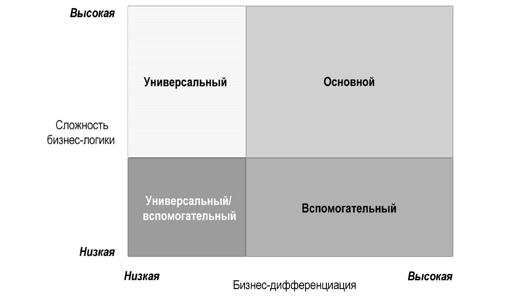{width="4.44038167104112in"
height="2.5861450131233594in"}

> Рис. 1.1. Бизнес-дифференциация и сложность бизнес-логики трех типов
> подобластей

###### Изменчивость

Основные поддомены, как уже выяснилось, могут часто меняться. Если
проблему можно решить с первой попытки, то это, наверное, не будет
считаться серьезным конкурентным преимуществом, поскольку конкуренты
быстро наверстают упу- щенное. Следовательно, появятся решения для
основных поддоменов. Весь спектр реализаций должен быть опробован,
усовершенствован и оптимизирован. Более того, работа над основными
поддоменами никогда не завершается. Компании по- стоянно внедряют
инновации и развивают основные поддомены. Изменения выра- жаются в
добавлении новых функций или в оптимизации существующей функцио-
нальности. В любом случае постоянное развитие основных поддоменов
необходи- мо компании, чтобы обогнать конкурентов.

В отличие от основных поддоменов, вспомогательные поддомены не
подвержены частым изменениям. Они не дают компании никаких конкурентных
преимуществ, и поэтому развитие вспомогательного поддомена приносит
ничтожную коммерче- скую ценность по сравнению с теми же усилиями,
вложенными в основной под- домен.

Несмотря на уже имеющиеся готовые решения, универсальные поддомены могут
со временем изменяться. Могут совершенствоваться меры безопасности,
исправ- ляться ошибки или внедряться совершенно новые решения их
проблем.

> 40 \| *Часть I. Стратегическое проектирование*

###### Стратегия решения (solution)

Основные поддомены позволяют компании конкурировать с другими игроками в
ее сфере деятельности. Успешная конкуренция очень важна для бизнеса, но
означает ли это, что вспомогательные и универсальные поддомены для него
не важны? Ко- нечно, нет. Для работы компании в избранном бизнесе
необходимы все поддомены. Они сродни фундаментальным строительным
блокам: уберите один, и может рух- нуть вся структура. И чтобы выбрать
стратегии реализации для наиболее эффек- тивного создания поддоменов
каждого типа, можно воспользоваться свойствами, присущими различным
типам поддоменов.

Основные поддомены должны реализовываться в самой компании. Их нельзя
при- обрести или позаимствовать, поскольку это подорвало бы само понятие
конкурент- ного преимущества, т. к. конкуренты компании могли бы сделать
то же самое.

Также было бы неразумно отдавать реализацию основного поддомена на
аутсор- синг. Это стратегическая инвестиция. Экономия на основном
поддомене рискован- на не только в краткосрочной перспективе, но может
иметь фатальные последствия и в будущем: можно, к примеру, утратить
поддержку разработанного сторонней организацией программного кода, а
вместе с этим и поддержку целей и задач ком- пании. Для работы над
основными поддоменами компании нужно назначать наибо- лее
квалифицированные кадры. Кроме того, внедрение основных поддоменов с
привлечением собственных сил позволяет компании оперативно вносить
измене- ния и развивать решение, а значит, быстрее добиваться
конкурентного преиму- щества.

Поскольку требования к основным поддоменам склонны к частым и постоянным
изменениям, решение должно быть таким, чтобы его было удобно
сопровождать и легко развивать. То есть основные поддомены требуют
реализации самых передо- вых методов проектирования.

Так как универсальные поддомены относятся к разряду сложных, но уже
решенных задач, выгоднее купить готовый продукт или взять на вооружение
решение с от- крытым исходным кодом, чем тратить время и ресурсы на
реализацию универсаль- ного поддомена собственными силами.

Вспомогательные поддомены не предназначены для создания конкурентных
пре- имуществ, поэтому реализации этих подобластей собственными силами
лучше бы- ло бы избежать. Но, в отличие от обычных поддоменов, здесь
готовых решений не существует. Получается, что у компании нет другого
выбора, кроме как взять реа- лизацию вспомогательных поддоменов на себя.
И все же простота бизнес-логики и нечастые изменения позволяют на них
сэкономить.

Для вспомогательных поддоменов не нужны сложные паттерны или иные
передо- вые методы проектирования. Для реализации бизнес-логики без
непреднамеренных сложностей достаточно будет какой-нибудь среды быстрой
разработки прило- жений.

С позиции кадрового подхода вспомогательные поддомены для своей
разработки не требуют привлечения высококвалифицированных опытных
специалистов и пре-

> *Глава 1. Анализ предметной области* \| 41

доставляют прекрасную возможность для обучения перспективных талантов.
Опытных специалистов лучше приберечь для основных поддоменов. А простота
бизнес-логики превращает вспомогательные поддомены в хороших кандидатов
на аутсорсинг.

Аспекты, отличающие три типа поддоменов друг от друга, сведены в табл.
1.1.

> *Таблица 1.1. Отличия трех типов поддоменов друг от друга*

+-----------------+----------------+-------------+------------+-------------------+--------------+
| > Тип поддомена | > Создание     | > Сложность | > Изменчи- | > Реализация      | > Задача     |
|                 | > конкурентных |             | > вость    |                   |              |
|                 | > преимуществ  |             |            |                   |              |
+=================+:==============:+:===========:+:==========:+:=================:+:============:+
| > Основной      | > Да           | > Высокая   | > Высокая  | > Самостоятельная | > Интересная |
| > (core)        |                |             |            |                   |              |
+-----------------+----------------+-------------+------------+-------------------+--------------+
| > Универсальный | > Нет          | > Высокая   | > Низкая   | > Покупка         | > Решенная   |
| > (generic)     |                |             |            | >                 |              |
|                 |                |             |            | > или             |              |
|                 |                |             |            | > заимствование   |              |
+-----------------+----------------+-------------+------------+-------------------+--------------+
| > Вспомогатель- | > Нет          | > Низкая    | > Низкая   | > Самостоятельная | > Банальная  |
| > ный           |                |             |            | > или аутсорсинг  |              |
| > (supporting)  |                |             |            |                   |              |
+-----------------+----------------+-------------+------------+-------------------+--------------+

#### Определение границ поддоменов

Уже можно было заметить, что идентификация поддоменов и их типов
существен- но облегчает принятие различных проектных решений при
создании программных продуктов. В последующих главах будут раскрыты и
другие способы использова- ния поддоменов для оптимизации процесса
проектирования программных средств. Так как же все-таки идентифицировать
поддомены и их границы?

Поддомены и их типы определяются бизнес-стратегией компании: ее
предметными областями и тем, как она отличается от других компаний,
чтобы конкурировать с ними в той же сфере. Так или иначе, в подавляющем
большинстве программных проектов поддомены «уже есть». Но это не
означает, что определить их границы будет всегда легко и просто. Если
попросить у генерального директора поделиться перечнем поддоменов его
компании, то он, наверное, бросит на вас недоуменный взгляд. Ему
неизвестно это понятие. Поэтому придется самостоятельно провести анализ
своей предметной области и классифицировать действующие в ней поддо-
мены.

Хорошей отправной точкой являются отделы компании и другие
организационные подразделения. К примеру, интернет-магазин розничной
торговли может включать в себя, помимо всего прочего, склад, отдел
обслуживания клиентов, отдел комплек- тации, отгрузки, контроля качества
и управления каналами сбыта. Но это относи- тельно широкие области
деятельности. Если взять только лишь отдел обслужива- ния клиентов, то
разумно будет предположить, что его деятельность будет подпа- дать под
вспомогательный или даже универсальный поддомен, поскольку его функция
часто передается сторонним поставщикам. Но будет ли достаточно этой
информации для принятия обоснованных решений по проектированию программ-
ного продукта?

> 42 \| *Часть I. Стратегическое проектирование*

###### Выделение поддоменов (Distilling subdomains)

Грубо заданные поддомены можно считать хорошей отправной точкой, но
дьявол кроется в мелочах. Нужно быть уверенным, что не упущена никакая
важная ин- формация, скрытая в хитросплетениях бизнес-функции.

Вернемся к нашему примеру с отделом обслуживания клиентов. Если
исследовать его внутреннюю работу, то станет понятно, что типичный отдел
обслуживания клиентов состоит из более мелких подразделений: справочной
службы, группы управления рабочими сменами и планирования, телефонной
станции и т. д. Если рассматривать их как отдельные поддомены, то они
могут быть отнесены к разным типам: справочная служба и телефонная
станция являются универсальными поддо- менами, управление сменами
является вспомогательным подоменом, но компания может разработать и свой
оригинальный алгоритм маршрутизации обращений к агентам, добившимся
успеха в подобных случаях в прошлом. Алгоритм маршру- тизации требует
анализа входящих обращений и выявления сходства с прошлым опытом --- и
то и другое является непростой задачей. Поскольку алгоритм маршру-
тизации позволяет компании обеспечить более качественное обслуживание
клиен- тов по сравнению с ее конкурентами, то этот род деятельности
следует отнести к основному поддомену. Соответствующий пример показан на
рис. 1.2.

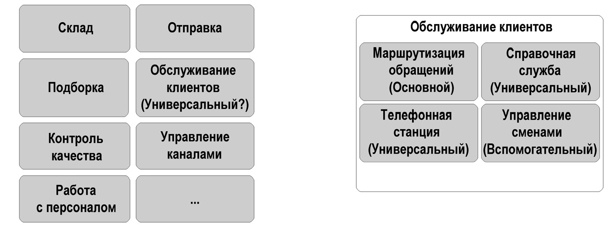{width="4.891385608048994in"
height="1.79in"}

> Рис. 1.2. Анализ внутреннего механизма предположительно универсального
> поддомена с целью выявления более четко определяемых поддоменов:
> основного, вспомогательного и двух универсальных

И в то же время нельзя бесконечно углубляться в поисках информации во
всё более и более низкие уровни детализации. Но когда все же нужно
остановиться?

###### Поддомены с позиции

> согласующихся сценариев использования

С технической точки зрения поддомены напоминают наборы взаимосвязанных,
со- гласующихся сценариев использования (use cases), как правило, с
одними и теми же участниками, объектами хозяйствования и родственным
набором используемых данных.

Рассмотрим схему сценариев использования по использованию системы приема
платежей по кредитным картам, показанную на рис. 1.3. Сценарии тесно
связаны

> *Глава 1. Анализ предметной области* \| 43

с рабочими данными и вовлеченными участниками. Следовательно, все
варианты действий формируют поддомен оплаты кредитной картой.

В качестве ведущего принципа, позволяющего остановить поиск все более
мелких поддоменов, можно воспользоваться следующим определением:
поддомен --- это набор согласующихся сценариев использования. Именно
этим определяются наи- более точные границы поддоменов.

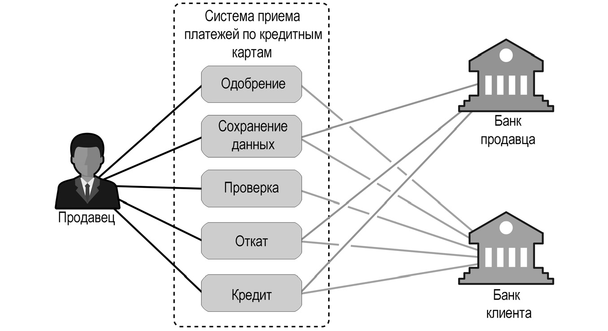{width="4.551944444444445in"
height="2.466666666666667in"}

> Рис. 1.3. Диаграмма сценариев использования поддомена оплаты кредитной
> картой

Но нужно ли всегда слишком пристально высматривать границы поддоменов?
Для основных поддоменов --- да, нужно. Основные поддомены являются
наиболее важ- ными, изменчивыми и сложными. Крайне важно, чтобы они были
определены как можно точнее, поскольку это позволит убрать из них все
универсальные и вспомо- гательные функции и сконцентрировать усилия на
реализации гораздо более цен- ных функций.

Избавление от несвойственного может быть несколько смягчено для
вспомогатель- ных и универсальных поддоменов. Если дальнейшее углубление
в особенности той или иной деятельности не открывает каких-либо новых
идей, способных помочь в принятии решений по проектированию программных
средств, то, скорее всего, это может стать хорошим знаком для остановки.
Такое может, например, случить- ся, когда все более мелкие поддомены
будут относиться к тому же типу, что и ис- ходный поддомен.

Рассмотрим пример, показанный на рис. 1.4. Дальнейшее выделение
поддоменов из справочной службы вряд ли принесет какую-то пользу,
поскольку при этом не бу- дет раскрываться никакой стратегической
информации, а в качестве решения будет использоваться готовый инструмент
общего назначения.

Еще один важный вопрос, учитываемый при определении поддоменов,
заключается в том, нужны ли они все.

> 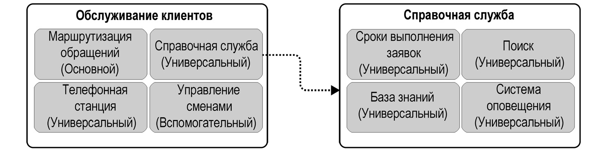{width="5.046163604549431in"
> height="1.233332239720035in"}44 \| *Часть I. Стратегическое
> проектирование*
>
> Рис. 1.4. Выделение поддомена справочной службы с выявлением общих
> внутренних компонентов

###### Сосредоточьтесь на главном

Поддомен является инструментом, облегчающим процесс принятия решений по
проектированию программных средств. Вероятно, у всех организаций есть
множе- ство бизнес-функций, обеспечивающих их конкурентное преимущество,
но не имеющих ничего общего с программным обеспечением. Здесь можно
привести в пример ранее рассмотренного нами производителя ювелирных
изделий.

При поиске поддоменов важно определить бизнес-функции, не связанные с
про- граммным обеспечением, признать их таковыми и сосредоточиться на
тех аспектах бизнеса, которые имеют отношение к программной системе, над
которой вы рабо- таете.

### Примеры анализа предметной области

Давайте посмотрим, как можно применить понятие поддомена на практике и
вос- пользоваться им для принятия ряда стратегических решений. Возьмем
две вымыш- ленные компании: Gigmaster и BusVNext. В качестве упражнения
во время чтения книги проанализируйте сферы бизнеса компаний. Попробуйте
определить три типа поддоменов для каждой компании. И не забывайте, что,
как и в реальной жизни, некоторые бизнес-требования носят
подразумеваемый характер.

Разъяснение: разумеется, идентифицировать все поддомены, задействованные
в каждой предметной области, на основе краткого описания невозможно. Но
все же его вполне достаточно, чтобы научить вас определять и
классифицировать доступ- ные поддомены.

#### Gigmaster

Gigmaster --- компания по продаже и распространению билетов. В его
мобильном приложении, чтобы определить ближайшие шоу, которые
пользователи хотели бы посетить, анализируются музыкальные библиотеки
пользователей, учетные записи потоковых сервисов и профили в социальных
сетях.

Пользователи Gigmaster хотят сохранить конфиденциальность.
Следовательно, вся личная информация пользователей зашифрована. Более
того, для того чтобы тай- ные увлечения пользователей ни при каких
обстоятельствах не просочились нару-

> *Глава 1. Анализ предметной области* \| 45

жу, алгоритм рекомендаций компании работает исключительно на
обезличенных данных.

Для повышения качества рекомендаций, выдаваемых приложением, был
реализо- ван новый модуль, позволяющий пользователям регистрировать
концерты, посе- щенные в прошлом, даже если билеты были куплены не через
Gigmaster.

###### Предметная область (домен) и поддомены

Сфера деятельности Gigmaster --- продажа билетов. Это услуга,
предоставляемая компанией клиентам.

Основные поддомены. Главное конкурентное преимущество Gigmaster ---
система рекомендаций. Компания также серьезно относится к
конфиденциальности своих пользователей и работает только с анонимными
данными. И наконец, хотя это и не упоминается в явном виде, можно
сделать вывод, что впечатления пользователей от мобильного приложения
также имеют решающее значение. Таким образом, основ- ными подоменами
Gigmaster будут:

- Система выдачи рекомендаций.

- Система обеспечения анонимности данных.

- Мобильное приложение.

Универсальные поддомены. Можно идентифицировать и выделить следующие
универсальные поддомены:

- Шифрования --- для шифрования всех данных.

- Бухгалтерского учета, поскольку компания занимается продажами.

- Безналичного расчета --- для взимания платы с клиентов.

- Аутентификации и авторизации --- для идентификации своих
  пользователей. Вспомогательные поддомены. И наконец, вспомогательные
  поддомены. Здесь бизнес-логика проста и напоминает ETL-процессы или
  CRUD-интерфейсы:

- Интеграция с сервисами потоковой передачи музыки.

- Интеграция с социальными сетями.

- Модуль посещенных концертов.

Архитектурные решения

Зная используемые поддомены и различия между их типами, уже можно
принять несколько стратегических архитектурных решений:

- Система выдачи рекомендаций, анонимизация данных и мобильное
  приложение должны быть реализованы собственными силами с
  использованием самых пере- довых технических инструментов и методов.
  Эти модули будут подвержены наиболее частым изменениям.

- Для шифрования данных, ведения учетных записей, безналичного расчета и
  аутентификации следует использовать готовые решения или решения с
  откры- тым исходным кодом.

> 46 \| *Часть I. Стратегическое проектирование*

- Интеграция со стриминговыми сервисами и социальными сетями, а также
  модуль учета посещаемых концертов могут быть переданы на аутсорсинг.

#### BusVNext

BusVNext --- компания, работающая в сфере общественного транспорта. Она
стре- мится предоставить своим клиентам поездки в автобусах, не менее
комфортабель- ные, чем поездки в такси. Компания управляет автобусными
парками в крупных городах.

Клиент BusVNext может заказать поездку через мобильное приложение. В
запла- нированное время отправления маршрут ближайшего автобуса будет
тут же скор- ректирован, чтобы забрать клиента точно в указанный срок.

Основной задачей компании было внедрение алгоритма маршрутизации.
Предъяв- ляемые к нему требования являются вариантом «задачи
коммивояжера». Логика маршрутизации постоянно корректируется и
оптимизируется. Например, статисти- ка показывает, что основной причиной
отмены поездок является длительное ожи- дание прибытия автобуса. Поэтому
компания скорректировала алгоритм маршру- тизации так, чтобы отдать
приоритет быстрым посадкам, даже за счет отсроченных высадок. Чтобы
оптимизировать маршрутизацию еще глубже, BusVNext интегри- руется со
сторонними поставщиками услуг для определения условий трафика и
оповещения о них в реальном времени.

Иногда BusVNext объявляет о специальных скидках, как для привлечения
новых клиентов, так и для выравнивания спроса на поездки в часы пик и
вне пиковой на- грузки.

###### Предметная область (домен) и поддомены {#предметная-область-домен-и-поддомены-2}

BusVNext предлагает своим клиентам подстроенные под их нужды поездки в
авто- бусе. Сфера деятельности --- общественный транспорт.

Основные поддомены (core subdomains). Основным конкурентным преимущест-
вом BusVNext является применяемый компанией алгоритм маршрутизации,
наце- ленный на решение сложной проблемы («коммивояжер»), с расстановкой
приори- тетов для различных бизнес-целей: например, для сокращения
времени посадки, даже если это увеличит общую продолжительность поездки.

Также видно, что данные о поездках постоянно анализируются для получения
но- вой информации о поведении клиентов. Эти идеи позволяют компании
увеличить свою прибыль за счет оптимизации алгоритма маршрутизации. И
наконец, прило- жения BusVNext для клиентов и водителей должны быть
простыми в использова- нии и иметь удобный пользовательский интерфейс.

Управление парком --- далеко не тривиальная задача. У автобусов могут
возникать технические проблемы или же им может потребоваться техническое
обслуживание. Игнорирование этих вопросов может привести к финансовым
потерям и снижению уровня обслуживания.

> *Глава 1. Анализ предметной области* \| 47

Следовательно, основными поддоменами BusVNext будут:

- Маршрутизация.

- Аналитика.

- Пользовательское впечатление от мобильного приложения.

- Управление автопарком.

Универсальные поддомены. Алгоритмом маршрутизации используются также
данные о трафике и оповещения, предоставляемые сторонними компаниями, и
это будет универсальным поддоменом. Кроме того, BusVNext принимает
платежи от своих клиентов, поэтому компании необходима реализация
функции учета и безна- личного расчета. Общие поддомены BusVNext:

- Учет условий трафика.

- Бухгалтерский учет.

- Сбор оплаты.

- Авторизация.

Вспомогательные поддомены. Основному бизнесу компании помогает модуль
управления акциями и скидками. Но его как такового отнести к основному
поддо- мену нельзя. Его интерфейс управления можно отнести к простой
разновидности CRUD-интерфейса для управления активными кодами купонов.
Следовательно, это не что иное, как вспомогательный поддомен.

###### Архитектурные решения {#архитектурные-решения-1}

Зная используемые поддомены и различия между их типами, можно уже
принять ряд стратегических архитектурных решений:

- Алгоритм маршрутизации, анализ данных, управление автопарком и
  удобство пользования приложением должны быть реализованы собственными
  силами с использованием самых сложных технических инструментов и
  паттернов.

- Реализация модуля управления рекламными акциями может быть передана на
  аутсорсинг.

- Определение условий трафика, авторизация пользователей и управление
  финан- совыми записями и транзакциями могут быть возложены на внешних
  поставщи- ков услуг.

### Кто такие специалисты в предметной области?

Получив четкое представление о предметной области и поддоменах, давайте
разбе- ремся с еще одним понятием DDD, которое будет часто
использоваться в следую- щих главах. Речь идет о специалистах в
предметной области. Это специалисты, разбирающиеся во всех тонкостях
бизнеса, который мы собираемся моделировать и реализовывать в коде.
Иными словами, эксперты предметной области являются эрудитами в
предметной области разрабатываемого программного обеспечения.

> 48 \| *Часть I. Стратегическое проектирование*

Эксперты в предметной области не являются ни аналитиками, собирающими
тре- бования, ни программистами, разрабатывающими систему. Они
представляют сам бизнес. Это люди, которые в первую очередь определяют
бизнес-задачу и от кото- рых исходят все бизнес-знания. Системные
аналитики и программисты трансфор- мируют свои ментальные модели
предметной области бизнеса в требования и ис- ходный код.

Как правило, экспертами предметной области являются либо люди,
выдвигающие требования, либо конечные пользователи программного
продукта. Их задачи долж- ны быть решены программным продуктом.

Экспертиза, составленная специалистами в предметной области, может быть
раз- ной по объему. Кто-то из экспертов в предметной области будет иметь
детальное представление о том, как устроена вся предметная область, а
кто-то будет специа- лизироваться на конкретных поддоменах. Например, в
рекламном онлайн-агентстве экспертами предметной области могут быть
менеджеры кампаний, закупщики медиаконтента, аналитики и другие
заинтересованные лица.

### Выводы

В этой главе были рассмотрены инструменты проектирования,
ориентированные на предметную область, предназначенные для понимания
деловой активности компа- нии. Было показано, что все начинается с
предметной области, т. е. той самой об- ласти, в которой работает
бизнес, и с услуг, которые он предоставляет своим кли- ентам.

Также были обозначены различные строительные блоки, необходимые для
дости- жения успеха в сфере бизнеса и отличия компании от конкурентов:

> *Основные поддомены (core subdomain)*
>
> Интересные задачи. Деятельность, выполняемая компанией не так, как ее
> конку- рентами, благодаря которой она получает свое конкурентное
> преимущество.
>
> *Универсальные поддомены (Generic subdomains)*
>
> Решенные задачи. Это то, что все компании делают одинаково. Здесь нет
> места инновациям и нет в них никакой необходимости. Вместо создания
> собственных реализаций более рентабельно будет воспользоваться
> существующими реше- ниями.
>
> *Вспомогательные поддомены (Supporting subdomains)*
>
> Задачи с очевидными решениями. Это действия, которые компания, скорее
> все- го, должна будет осуществлять собственными силами, но они не дают
> никаких конкурентных преимуществ.

И наконец, было рассказано о том, что специалисты в предметной области
являют- ся экспертами в бизнесе. Они обладают глубокими знаниями в
предметной области (домене) компании или же в одном или нескольких его
поддоменах и играют решающую роль для достижения успеха проекта.

### Упражнения

> *Глава 1. Анализ предметной области* \| 49

1.  Какие из поддоменов не дают никакого конкурентного преимущества? А)
    Основной (Core).

> Б) Универсальный (Generic).
>
> В) Вспомогательный (Supporting).
>
> Г) И универсальный, и вспомогательный.

2.  Для какого поддомена все конкуренты могут использовать одни и те же
    ре- шения?

> А) Для основного (Core).
>
> Б) Для универсального (Generic).
>
> В) Для вспомогательного (Supporting).
>
> Г) Ни для одного из перечисленных. Компания всегда должна отличаться
> от своих конкурентов.

3.  Какой поддомен подвержен наиболее частым изменениям? А) Основной
    (Core).

> Б) Универсальный (Generic).
>
> В) Вспомогательный (Supporting).
>
> Г) В изменчивости различных поддоменов нет никакой разницы.

Рассмотрим описание WolfDesk (см. *Предисловие*), той самой компании,
которая предоставляет систему управления заявками службы поддержки:

4.  В чем именно заключается суть предметной области WolfDesk?

5.  Что является основным (core) поддоменом (или основными поддоменами)
    WolfDesk?

6.  Что является вспомогательным (supporting) поддоменом (или
    вспомогательными поддоменами) WolfDesk?

7.  Что является универсальным (generic) поддоменом (или универсальными
    под- доменами) WolfDesk?

ГЛАВА 2

## Экспертные знания о предметной области

> В прод идут не знания экспертов в предметной области, в прод идут
> предположения (assumptions) разработчиков\...
>
> -- *Альберто Брандолини (Alberto Brandolini)*

В предыдущей главе началось изучение предметных областей. Были
рассмотрены способы определения предметных областей и сферы деятельности
компаний, мето- ды анализа ее стратегии, позволяющие конкурировать в
этих областях, а также намечена методика определения границ и типов
поддоменов компании.

В этой главе будет продолжена тема анализа предметной области, но в
другом, бо- лее глубоком измерении. Основное внимание будет уделено
всему происходящему внутри поддомена: его бизнес-функциям и логике. Вам
предстоит изучение инст- румента предметно-ориентированного
проектирования для эффективного общения и обмена знаниями: единый язык
(ubiquitous language). Здесь он будет исполь- зоваться для изучения
тонкостей поддоменов бизнеса. Позже в книге он будет использоваться для
моделирования и реализации бизнес-логики поддоменов в про- граммных
продуктах.

### Задачи бизнеса (business problems)

Создаваемые нами программные системы решают бизнес-задачи. В этом
контексте

«задача» (problem) не похожа на математическую задачу или загадку,
которая может иметь окончательное решение\... В контексте бизнеса слово
«задача» имеет более широкое значение. Бизнес-задачей могут быть
оптимизация рабочих процес- сов, минимизация ручного труда, управление
ресурсами, поддержка принятия решений, управление данными и т. д.

Бизнес-задачи ставятся как на уровне предметной области, так и на уровне
под- домена. Цель компании --- предоставить решение задач своих
клиентов. Если вернуться к рассмотренному в первой главе примеру с
FedEx, то клиенты этой ком- пании нуждаются в срочной отправке посылок,
поэтому процесс доставки подвер- гается оптимизации.

Поддомены представляют собой более мелкие предметные области, целью
которых является предоставление решений (solution) для конкретных
бизнес-компетенций (capabilities). Поддомен управления знаниями требует
оптимизации процесса хранения и извлечения информации. Поддомен системы
взаиморасчетов требует

> *Глава 2. Экспертные знания о предметной области* \| 51

оптимизаци процесса выполнения финансовых операций. Бухгалтерский
поддомен нуждается в отслеживании движения средств компании.

### Выявление экспертных знаний

Разработка эффективных программных решений невозможна без как минимум
базовых знаний предметной области. В первой главе уже упоминалось, что
такими знаниями обладают эксперты в той или иной предметной области: их
работа состо- ит в приобретении конкретных знаний и в умении разбираться
во всех тонкостях выбранного направления. Но разработчики ни в коем
случае не должны, да и не могут, становиться экспертами в предметной
области. И тем не менее для них крайне важно понимать экспертов в
предметной области и использовать применяе- мую ими терминологию.

Эффективность решения зависит от того, насколько хорошо разработчик
понимает способ мышления эксперта и его ментальную модель. Без понимания
бизнес-задачи и обоснования требований принимаемые решения будут
ограничены «переводом» бизнес-требований в исходный код. А что если в
требованиях упущен важный гра- ничный случай? Или отсутствует описание
бизнес-концепции, ограничивающей возможность реализации модели,
способной соответствовать будущим требова- ниям?

Как говорит Альберто Брандолини (Alberto Brandolini)1, разработка
программного обеспечения --- это процесс обучения, а рабочий код
является побочным эффектом. Успех программного проекта зависит от
эффективности обмена знаниями между экспертами в предметной области и
разработчиками программного обеспечения. Чтобы решить задачу, нужно
понять ее суть.

Эффективный обмен знаниями между экспертами в предметной области и
разра- ботчиками программного продукта требует продуктивного общения.
Давайте рас- смотрим, что чаще всего может препятствовать продуктивному
общению в проек- тах по разработке программных продуктов.

### Общение

Можно с уверенностью сказать, что почти все программные проекты требуют
со- трудничества заинтересованных сторон, пребывающих в разных ролях:
экспертов предметной области, владельцев продуктов, разработчиков,
дизайнеров пользова- тельского интерфейса и UX, руководителей проектов,
тестировщиков, аналитиков и других специалистов. Как и в любой
совместной работе, результат зависит от того, насколько продуктивно все
эти стороны могут работать вместе. Например, все ли заинтересованные
стороны согласны с тем, какую именно задачу им предстоит ре- шить? И что
происходит с самим решением --- действительно ли функциональные

> ^1^ Брандолини, Альберто (Brandolini, Alberto). (n.d.). «Introducing
> EventStorming». Leanpub.
>
> 52 \| *Часть I. Стратегическое проектирование*

и нефункциональные требования не содержат противоречий? Для успеха
проекта требуется согласие и согласованность по всем связанным с ним
вопросам.

Исследование причин неудачных разработок программных проектов показало,
что для успешных проектов необходимо продуктивное общение с целью обмена
зна- ниями. Но, несмотря на важность данного аспекта, продуктивное
общение наблю- дается в проектах по разработке программных продуктов
довольно редко. Зачастую бизнес и разработчики не имеют прямого контакта
друг с другом. Знания в пред- метной области передаются разработчикам
соответствующими экспертами. Они предоставляются через людей, играющих
роль посредников или «переводчиков», т. е. через системных или
бизнес-аналитиков, владельцев продуктов и руководи- телей проектов.
Соответствующий поток обмена общими знаниями показан на рис. 2.1.

{width="5.058530183727034in"
height="2.086561679790026in"}

> Рис. 2.1. Процесс обмена знаниями при разработке программного проекта

В ходе традиционного жизненного цикла разработки программного продукта
зна- ния предметной области «переводятся» в удобную для программистов
форму, известную как аналитическая модель --- описание требований
системы, а не пони- мание стоящей за ней предметной области.

Хотя намерения могут быть и благими, но такое посредничество опасно для
обмена знаниями. При любом переводе происходят потери информации: в
данном случае знания предметной области, необходимые для решения
бизнес-задач, теряются на пути к разработчикам программного продукта.

И это не единственный перевод типичного программного проекта:
аналитическая модель преобразуется в модель дизайна программного
продукта (документ по раз- работке программного продукта, который
преобразуется в модель реализации или в сам исходный код). Но, как это
часто бывает, документы быстро устаревают. Ис- ходный код используется
для передачи знаний о предметной области тем програм- мистам, которые
позже будут сопровождать проект. На рис. 2.2 показаны различ- ные
переводы, необходимые для реализации знаний предметной области в виде
программного кода.

> 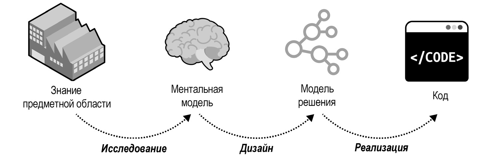{width="5.046163604549431in"
> height="1.603332239720035in"}*Глава 2. Экспертные знания о предметной
> области* \| 53
>
> Рис. 2.2. Преобразование модели

Такой процесс разработки программного продукта напоминает детскую игру
«Ис- порченный телефон»2: информация о предметной области зачастую
искажается. Это приводит к тому, что программисты реализуют неверное
решение или же само решение, по сути верное, но решает другую задачу. В
любом случае результат один: неудачный программный проект.

Предметно-ориентированное программирование предлагает более эффективный
способ передачи знаний от экспертов предметной области к программистам:
ис- пользование единого языка (ubiquitous language).

### Что такое единый язык?

Использование единого языка (ubiquitous language) --- краеугольный
камень пред- метно-ориентированного проектирования. Идея проста и
понятна: если сторонам нужно эффективно общаться, не полагаясь на
переводы, они должны говорить на одном и том же языке.

И хотя это понятие не противоречит здравому смыслу, как сказал Вольтер,
«здра- вый смысл не так уж здрав». Традиционный жизненный цикл
разработки про- граммного продукта подразумевает следующие
преобразования:

- Знания предметной области в аналитическую модель.

- Аналитическую модель в требования.

- Требования в дизайн.

- Дизайн в исходный код.

Вместо постоянного перевода знаний предметной области
объектно-ориентиро- ванное проектирование требует для описания
предметной области разработать единственный (single) единый язык
(ubiquitous language).

> ^2^ Игроки выстраиваются в линию, первый игрок придумывает сообщение и
> нашептывает его второму игро- ку. Второй игрок шепотом повторяет
> сообщение третьему игроку и т. д. Последний игрок озвучивает услы-
> шанное им сообщение всей группе. Затем первый игрок сравнивает
> исходное сообщение с его окончатель- ной версией. И хотя цель состоит
> в передаче одного и того же сообщения, информация обычно искажается, и
> последний игрок получает сообщение, которое существенно отличается от
> исходного варианта.
>
> 54 \| *Часть I. Стратегическое проектирование*

Все связанные с проектом заинтересованные стороны --- программисты,
владельцы продуктов, эксперты предметной области, дизайнеры UI/UX ---
должны при описа- нии предметной области пользоваться единым языком.
Самое главное, чтобы экс- пертам предметной области при рассуждениях о
той или иной предметной области было удобно пользоваться единым языком,
который будет представлять как саму предметную область, так и ментальные
модели экспертов предметной области.

Способствовать общему пониманию всех заинтересованных сторон проекта
может только постоянное использование единого языка и его выражений.

### Язык бизнеса

Важно подчеркнуть, что единый язык --- это язык бизнеса. То есть он
должен со- стоять только из понятий, связанных с предметной областью. В
нем не должно быть никакого технического жаргона! Обучать экспертов в
области бизнеса сингл- тонам и абстрактным фабрикам --- не ваша цель.
Единый язык нацелен на введение понимания экспертами предметной области
и ментальных моделей предметной области в рамки легко воспринимаемых
понятий.

#### Сценарии

Предположим, что работа ведется над системой управления рекламными
кампа- ниями. Рассмотрим следующие утверждения:

- В рамках рекламной кампании могут демонстрироваться различные
  креативные материалы.

- Рекламная кампания может быть запущена, только если хотя бы одно из ее
  мест размещения активно.

- Комиссионные за продажу начисляются после подтверждения транзакций.

Все эти утверждения сформулированы на языке бизнеса. То есть они
отражают точку зрения бизнес-экспертов. А вот следующие утверждения
являются сугубо техническими и поэтому не соответствуют понятию единого
языка:

- В рекламном iframe-элементе отображает файл HTML.

- Рекламная кампания может запускаться только при наличии хотя бы одной
  свя- занной записи в таблице активных мест размещения.

- Комиссионные за продажу начисляются на основе соответствующих записей
  из таблиц транзакций и подтвержденных продаж.

Все эти последние утверждения носят чисто технический характер и будут
непо- нятны экспертам предметной области. Предположим, что программисты
знакомы только с этим техническим, ориентированным на реализацию
взглядом на пред- метную область. В таком случае они не смогут полностью
понять бизнес-логику или почему она срабатывает именно таким вот
образом, а это ограничит их воз- можности моделирования и реализации
эффективного решения.

> *Глава 2. Экспертные знания о предметной области* \| 55

#### Согласованность

Единый язык должен быть четко выраженным и согласованным. Тем самым
долж- на быть устранена необходимость в выстраивании предположений, а
логика пред- метной области должна быть выражена в явном виде.

Поскольку неоднозначность препятствует плодотворному общению, каждое
поня- тие единого языка должно иметь одно-единственное значение. Давайте
рассмотрим несколько примеров нечетко выраженной терминологии и то, как
ее можно вы- править.

###### Неоднозначные понятия

Предположим, что в какой-то предметной области понятие *policy* имеет
сразу не- сколько значений: оно может означать как «политику», так и
«договор страхова- ния». Точное значение может быть выявлено только в
разговоре, в зависимости от контекста. Но среда программирования плохо
справляется с неоднозначностью, и моделирование сущности того, что
подразумевается под понятием «policy», в программном коде может
получиться громоздким и сложным.

Единый язык требует единого значения для каждого понятия, поэтому
понятие

«policy» должно быть смоделировано в явном виде с использованием двух
понятий: политика и страховой договор.

###### Понятия-синонимы

Два понятия в едином языке не могут использоваться, заменяя друг друга.
Напри- мер, во многих системах используется понятие *user*. Но при
тщательном изучении жаргона экспертов предметной области может
выясниться, что *user* и другие поня- тия используются взаимозаменяемо:
например, *user* (пользователь), *visitor* (посети- тель),
*administrator* (администратор), *account* (учетная запись) и т. д.

Поначалу понятия-синонимы могут показаться безвредными. Но в большинстве
случаев они обозначают разные понятия. В приведенном выше примере и
посети- тель, и учетная запись технически относятся к пользователям
системы, но в боль- шинстве систем незарегистрированные и
зарегистрированные пользователи пред- ставляют собой разные роли и ведут
себя по-разному. Например, данные «посети- телей» используются в
основном для проведения анализа, тогда как «учетные записи» фактически
используют систему и ее функциональные возможности.

Каждое понятие лучше использовать явным образом в его конкретном
контексте. Осмысление различий между используемыми понятиями позволяет
создавать более простые и четкие модели и реализации объектов предметной
области.

> 56 \| *Часть I. Стратегическое проектирование*

### Модель предметной области

Теперь давайте посмотрим на единый язык с иной точки зрения:
моделирования.

#### Что такое модель?

> Модель --- это упрощенное представление вещи или явления, в котором
> намеренно подчеркиваются одни аспекты и игнорируются другие. Это
> абстракция с учетом конкретного использования.
>
> *-- Ребекка Вирфс-Брок (Rebecca Wirfs-Brock)*

Модель --- это не копия реального мира, а созданная человеком
конструкция, помо- гающая нам разобраться в системах реального мира.

Каноническим примером модели является карта. Как показано на рис. 2.3,
моделью является любая карта, будь то навигационная карта, карта
местности, карта мира, карта метро и т. д.

> Рис. 2.3. Различные типы карт, отображающие разные модели Земли:
> дороги, часовые пояса, морскую навигацию, местность, воздушную
> навигацию и ветки метрополитена

Ни одна из этих карт не предоставляет всех подробностей нашей планеты.
Каждая содержит ровно столько данных, сколько необходимо для ее
конкретной цели: той задачи, для решения которой она создана.

#### Эффективное моделирование

У всех моделей есть цель, а эффективная модель содержит только те
детали, кото- рые необходимы для достижения этой цели. Например, на
карте мира вы не увиди- те станций метро. Но и карту метро вы не можете
использовать для оценки

> *Глава 2. Экспертные знания о предметной области* \| 57

расстояний. Каждая карта содержит только ту информацию, которую она
должна предоставлять.

Следует повторить: полезная модель --- это не копия реального мира. Она
предна- значена для решения конкретной задачи и должна предоставлять для
этого доста- точный объем информации. Или, как выразился статистик
Джордж Бокс (George Box), «все модели неверны, но некоторые полезны».

По сути, модель является абстракцией. Понятие абстракции позволяет нам
справ- ляться со сложностью, опуская ненужные детали и оставляя под
рукой только то, что необходимо для решения задачи. С другой стороны, в
неэффективной абстрак- ции порой нет необходимого или оставлено
ненужное, создающее вредные помехи. Как было отмечено Эдсгером В.
Дейкстрой (Edsger W. Dijkstra) в статье «The Humble Programmer», цель
абстрагирования не в задании неопределенности, а в создании нового
семантического уровня, на котором можно быть абсолютно точным.

#### Моделирование предметной области

Разрабатывая единый язык, мы эффективно выстраиваем модель предметной
об- ласти. Эта модель должна стать отражением ментальных моделей
экспертов пред- метной области --- их осмысления того, как бизнес
работает при реализации своей функции. Модель должна отражать
охватываемые бизнес-объекты и их поведение, причинно-следственные связи
и инварианты.

Используемый нами единый язык не должен охватывать абсолютно все
подробно- сти предметной области. Это было бы равносильно превращению
каждого заинте- ресованного лица в эксперта в этой области. Напротив,
предполагается, что модель включает в себя именно то количество аспектов
предметной области, которое дает возможность реализовать требуемую
систему, т. е. все, что нужно для решения конкретной задачи посредством
специально предназначенного для этого про- граммного продукта. В
следующих главах будет показано, как единый язык может задавать
низкоуровневые решения по проектированию и реализации.

Эффективное общение команд программистов и экспертов предметной области
яв- ляется основополагающим фактором. Важность этого общения возрастает
по мере усложнения предметной области. Чем она сложнее, тем сложнее
смоделировать и реализовать ее бизнес-логику. Даже незначительное
недопонимание сложной предметной области или ее основных принципов
неизбежно приведет к реализации продукта с весьма серьезными дефектами.
Единственный надежный способ прове- рить осмысленность предметной
области --- пообщаться с экспертами в этой облас- ти на понятном им
языке: на языке бизнеса.

#### Непрерывная работа

Разработка единого языка требует общения с его естественными носителями,
экс- пертами предметной области. Только взаимодействие с реальными
экспертами может выявить неточности, неверные предположения или
совершенно неверное понимание предметной области.

> 58 \| *Часть I. Стратегическое проектирование*

Все заинтересованные стороны должны неизменно пользоваться единым языком
при каждом общении, связанным с проектом, чтобы распространять знания о
пред- метной области и вырабатывать взаимопонимание. Язык должен
постоянно совер- шенствоваться на протяжении всего проекта: он должен
использоваться в требова- ниях, тестах, документации и даже в самом
исходном коде.

Самое главное, становление единого языка --- процесс непрерывный. Он
должен постоянно корректироваться и развиваться. Повседневное
использование языка со временем позволит глубже усвоить суть предметной
области. При резких подвиж- ках в ее сути должен развиваться и единый
язык, дабы идти в ногу с новыми зна- ниями в предметной области.

#### Инструменты

Облегчить процесс освоения единого языка и управления им могут уже
сущест- вующие инструменты и технологии.

Например, в качестве глоссария для сохранения данных по единому языку и
его документирования можно воспользоваться вики-страницей. Такой
глоссарий упро- стит процесс адаптации новых специалистов команды,
поскольку сможет послу- жить источником информации о терминологии,
принятой в предметной области.

Важно совершенствовать глоссарий совместными усилиями. В условиях
изменения единого языка к обновлению глоссария следует привлекать всех
специалистов ко- манды. Это идет вразрез с централизованным подходом,
при котором ответствен- ность за ведение глоссария возлагается только на
руководителей групп или архи- текторов.

Несмотря на очевидные преимущества, получаемые от ведения глоссария
проект- ной терминологии, этому процессу свойственны и явные
ограничения. Глоссарии лучше всего подходят для «существительных»:
названий сущностей, процессов, ролей и т. д. И хотя существительные тоже
важны, главное значение имеет фиксация поведения. Причем поведение ---
не просто список глаголов, связанных с сущест- вительными, а реальная
бизнес-логика с ее правилами, предположениями и инвари- антами.
Задокументировать в глоссарии такие понятия гораздо сложнее. Следова-
тельно, глоссарии лучше всего использовать в тандеме с другими
инструментами, которые больше подходят для фиксации поведения; например,
сценарии использо- вания или Gherkin-тесты.

Автоматизированные тесты, написанные на языке Gherkin, --- это не только
пре- восходные инструменты для понимания единого языка, но и
дополнительный инст- румент для преодоления разночтений между экспертами
в предметной области и разработчиками программных продуктов. Эксперты
предметной области могут

3

читать тесты и проверять ожидаемое поведение системы . Рассмотрим, к
примеру,

следующий тест, написанный на языке Gherkin:

> ^3^ «But please don't fall into the trap of thinking that domain
> experts will write Gherkin tests». --- Но, пожалуйста, не попадайтесь
> в ловушку, думая, что тесты Gherkin будут писать эксперты в предметной
> области.
>
> *Глава 2. Экспертные знания о предметной области* \| 59
>
> Scenario: Notify the agent about a new support case
>
> Given Vincent Jules submits a new support case saying:
>
> \"\"\"
>
> I need help configuring AWS Infinidash \"\"\"
>
> When the ticket is assigned to Mr. Wolf
>
> Then the agent receives a notification about the new ticket
>
> (Сценарий: Уведомить агента о новом запросе в службу поддержки
>
> Учитывая, что Винсент Жюль подает новый запрос в службу поддержки, в
> котором
>
> говорится:
>
> \"\"\"
>
> Мне нужна помощь в настройке AWS Infinidash \"\"\"
>
> Когда регистрируемый запрос назначен мистеру Вольфу
>
> То Агент получает уведомление о новом регистрируемом запросе)

Управление набором Gherkin-тестов порой может быть непростым, особенно
на ранних стадиях проекта. И тем не менее для сложных бизнес-областей их
опреде- ленно стоит проводить.

Ко всему прочему имеются даже инструменты статического анализа кода,
способ- ные проверять использование понятий единого языка. Ярким
примером такого ин- струмента является NDepend.

При всей своей пользе все эти инструменты вторичны по отношению к
фактиче- скому использованию единого языка в повседневном общении.
Инструментами следует пользоваться, чтобы справиться с поддержкой
единого языка, но не нужно ожидать, что документация заменит его
фактическое использование. Как говорится в Agile-манифесте: «Люди и
взаимодействие важнее процессов и инструментов».

#### Сложности

В теории разработка единого языка представляется простым и понятным
процес- сом. Но на практике это не всегда так. Единственный надежный
способ сбора знаний в предметной области --- общение с экспертами.
Зачастую самые важные знания не лежат на поверхности. Они нигде не
задокументированы и не системати- зированы и существуют только лишь в
сознании экспертов предметной области. Единственный способ получить к
ним доступ --- задавать вопросы.

По мере накопления опыта в приобретении знаний станет заметно, что
довольно часто этот процесс заключается не просто в выявлении уже
имеющихся знаний, а является совместным созданием модели в тандеме с
экспертами предметной облас- ти. У самих экспертов могут быть неясности
и даже пробелы в собственном пони- мании бизнес-сферы. Например,
определение только «позитивных» сценариев без рассмотрения граничных
случаев, бросающих вызов принятым предположениям. Кроме того, можно
столкнуться с концепциями предметных областей, которым не хватает явных
определений. Подобные скрытые несоответствия и пробелы чаще всего
выявляются, когда задаются вопросы о характере предметной области. Осо-

> 60 \| *Часть I. Стратегическое проектирование*

бенно это касается основных поддоменов (core subdomains). В таком случае
про- цесс обучения является взаимным --- вы помогаете экспертам в
предметной облас- ти лучше понять свою область.

При внедрении методов предметно-ориентированного проектирования в уже
суще- ствующий проект можно заметить, что для описания предметной
области уже есть сформированный язык и заинтересованные стороны уже им
пользуются. Но, по- скольку этот язык сформировался без следования
предметно-ориентированному проектированию, еще не факт, что он будет
эффективно отражать предметную об- ласть. Например, в нем могут
использоваться такие технические термины, как име- на таблиц базы
данных. Изменить язык, который уже используется в организации, весьма
непросто. Главный инструмент в такой ситуации --- терпение. Нужно убе-
диться, что вполне приемлемый язык используется там, где его легко
проконтроли- ровать: в документации и в исходном коде.

И наконец, отвечу на вопрос о едином языке, который мне часто задают на
конфе- ренциях: какой язык нужно использовать, если компания находится
не в англо- язычной стране. Мой совет --- воспользуйтесь английскими
существительными как минимум для наименования объектов в предметной
области. Это упростит исполь- зование одной и той же терминологии в
программном коде.

### Вывод

Для успешного ведения проекта по созданию программного продукта решающее
значение имеют эффективное общение и обмен знаниями. Чтобы
спроектировать и создать программное решение, программисты должны
разбираться в предметной области.

Единый язык (ubiquitous language) предметно-ориентированного
проектирования является эффективным инструментом преодоления разрыва в
знаниях между экс- пертами в предметной области и разработчиками
программного продукта. Совер- шенствование единого языка, который может
использоваться всеми заинтересован- ными сторонами в ходе всего проекта:
в разговорах, в документации, в тестах, в диаграммах, в исходном коде и
т. д., способствует общению и обмену знаниями.

Чтобы общение было плодотворным, единый язык должен устранять
неопределен- ности и скрытые предположения. Все понятия языка должны
быть согласованы --- никаких неоднозначных терминов и синонимов.

Развитие единого языка --- непрерывный процесс. По мере разработки
проекта будет выявляться все больше подробностей предметной области.
Важно, чтобы они находили свое отражение в едином языке.

Существенно облегчить процесс документирования и поддержки единого языка
можно с помощью таких инструментов, как глоссарии на основе вики-страниц
и Gherkin-тесты. И все же залогом успеха единого языка является его
применение: язык должен постоянно использоваться во всех информационных
обменах, связан- ных с проектом.

### Упражнения

> *Глава 2. Экспертные знания о предметной области* \| 61

1.  Кто должен внести свой вклад в определение единого языка? А)
    Эксперты в предметной области.

> Б) Программисты.
>
> В) Конечные пользователи.
>
> Г) Все лица, заинтересованные в проекте.

2.  Где должен использоваться единый язык? А) В личном общении.

> Б) В документации.
>
> В) В коде.
>
> Г) Во всем вышеперечисленном.

3.  Просмотрите еще раз описание выдуманной компании WolfDesk,
    приведенное в предисловии. Какую терминологию предметной области
    можно найти в этом описании?

4.  Вспомните суть текущего или какого-нибудь прошлого программного
    проекта:

> А) Попробуйте придумать концепции предметной области, которые можно
> было бы использовать в беседах с экспертами в этой области.
>
> Б) Попробуйте привести примеры несовместимых терминов: понятий
> предмет- ной области, имеющих разные значения, или же идентичных
> понятий, представ- ленных разными терминами.
>
> В) Приходилось ли вам сталкиваться с примерами неэффективности
> разработки программного продукта из-за плохо налаженного общения?
>
> Г) Предположим, что в ходе разработки проекта было замечено, что
> эксперты предметной области из разных организационных подразделений
> используют один и тот же термин, например *policy*, для описания
> несвязанных друг с другом понятий предметной области.
>
> И получается, что единый язык основан на ментальных моделях экспертов
> предметной области, но не удовлетворяет требованию, в соответствии с
> кото- рым каждый термин должен иметь одно-единственное значение.
>
> Прежде чем перейти к изучению следующей главы, ответьте на вопрос: как
> можно исправить эту ситуацию?

ГЛАВА 3

## Как осмыслить сложность предметной области

В предыдущей главе говорилось, что для успеха проекта крайне важно
разработать единый язык (ubiquitous language), предназначенный для
общения представителей всех заинтересованных сторон (stakeholders), от
разработчиков программного про- дукта до экспертов предметной области.
Язык должен отражать ментальные моде- ли экспертов предметной области,
раскрывающие внутренние механизмы ее рабо- ты и принципы, положенные в
основу этой работы.

Поскольку наша цель заключается в использовании единого языка для
принятия решений по проектированию программного продукта, язык должен
быть ясным и непротиворечивым. В нем не должно быть двояких толкований,
скрытых предпо- ложений и деталей, не имеющих никакого отношения к делу.
Но в масштабе орга- низации, ментальные модели экспертов предметной
области могут сами по себе быть противоречивыми. Разными экспертами
предметной области могут использо- ваться разные модели одной и той же
сферы деятельности. Рассмотрим на примере.

### Противоречивые модели

Вернемся к примеру с телемаркетинговой компанией из *главы 2*.
Маркетинговый отдел компании привлекает потенциальных клиентов с помощью
онлайн-рекламы. А отдел продаж этой компании отвечает за привлечение
потенциальных клиентов к покупке его продуктов или услуг, при этом
выстраивается цепочка, показанная на рис. 3.1.

{width="4.586412948381453in"
height="1.0954166666666667in"}

> Рис. 3.1. Пример предметной области: телемаркетинговая компания

При изучении языка, используемого экспертами предметной области,
наблюдается странная особенность. Термин «lead» в отделах маркетинга и
продаж имеет разные значения:

> *Глава 3. Как осмыслить сложность предметной области* \| 63
>
> *Отдел маркетинга*
>
> Для маркетологов «lead» представляется уведомлением о чьей-то
> заинтересо- ванности в одном из продуктов. Под словом «lead»
> подразумевается событие получения контактных данных потенциального
> клиента.
>
> *Отдел продаж*
>
> Для специалистов отдела продаж слово «lead» представляет собой гораздо
> более сложную сущность. Под ним подразумевается весь жизненный цикл
> процесса продаж. И это уже не просто событие, а весьма продолжительный
> процесс.

И как тогда в этой компании сформировать единый язык?

С одной стороны, понятно, что единый язык не должен содержать никаких
проти- воречий, т. е. у каждого понятия должно быть одно-единственное
значение. А с другой стороны, известно, что единый язык должен отражать
ментальные мо- дели экспертов предметной области. Получается, что
ментальная модель понятия

«lead» у экспертов предметной области в отделах продаж и маркетинга
разная.

Эта неоднозначность не создает особых проблем при личном общении, но
может создавать сложности при общении сотрудников разных отделов, но
людям совсем нетрудно понять точное значение данного термина из
контекста обсуждаемого во- проса.

Но отразить такую противоречивую модель предметной области в сфере
разработ- ки программного продукта гораздо сложнее. Справиться с
неоднозначностью в ис- ходном коде порой весьма нелегко. Если перенести
модель отдела продаж в пред- метную область маркетинга, сложность
возникла бы там, где она совершенно не нужна, --- получилось бы гораздо
больше подробностей и особенностей поведения, чем нужно маркетологам для
оптимизации рекламных кампаний. Но если попы- таться упростить модель
отдела продаж в соответствии с трактовкой этого термина маркетинговым
отделом, она перестала бы соответствовать потребностям поддоме- на
(subdomain) продаж из-за слишком упрощенного взгляда на управление и
опти- мизацию процесса продаж. В первом случае получилось бы слишком
сложное решение, а во втором оно бы не удовлетворяло всем требованиям.

Как же разрешить эту «Уловку-22»?

Традиционное решение заключается в разработке единой модели, подходящей
для всех типов задач. Такие модели превращаются в огромные диаграммы
отношений сущностей (entity relationship diagrams, ERD) размером со всю
стену офиса. А явля- ется ли то, что показано на рис. 3.2, эффективной
моделью?

Как говорится, «обо всем и ни о чем». Предполагается, что такие модели
подходят для всего, но в конечном итоге они не эффективны ни для чего. В
любом случае придется сталкиваться со сложностями: сложностью избавления
от ненужных под- робностей, сложностью поиска действительно необходимого
и, самое главное, сложностью поддержания данных в непротиворечивом
состоянии.

Другим решением может быть добавление к проблемному термину префикса с
именем контекста: «marketing lead» («маркетинговый lead») и «sales lead»
(«про-

> 64 \| *Часть I. Стратегическое проектирование*

дажный lead»). Это позволило бы реализовать в коде сразу две модели. Но
у данно- го подхода два основных недостатка:

- Во-первых, это когнитивная нагрузка. Когда какую из моделей нужно
  использо- вать? Чем ближе реализации конфликтующих моделей, тем легче
  ошибиться.

- Во-вторых, реализация модели не будет соответствовать единому языку.
  Никто не будет пользоваться префиксами в разговорах. Людям эта
  дополнительная информация не нужна; они смогут обходиться контекстом
  разговора.

{width="4.779143700787402in"
height="2.653332239720035in"}

> Рис. 3.2. Диаграмма отношений сущностей в масштабе предприятия

Давайте обратимся к паттерну (pattern) предметно-ориентированного
проектирова- ния, предназначенному для решения подобных сценариев:
ограниченному контек- сту (bounded context).

### Что такое ограниченный контекст?

Данная проблема в предметно-ориентированном проектировании решается
весьма тривиально: нужно разбить единый язык на несколько меньших по
объему языков, а затем назначить каждому из них явный контекст
применения: его *ограниченный контекст*.

В предыдущем примере можно выделить два ограниченных контекста:
маркетинг и продажи. Как показано на рис. 3.3, термин «lead» имеется в
обоих ограниченных контекстах. Пока в каждом ограниченном контексте у
него одно-единственное зна- чение, каждый, более конкретный единый язык
непротиворечив и следует менталь- ным моделям экспертов предметной
области.

В той или иной степени терминологические конфликты и неявно выраженные
кон- тексты являются неотъемлемой частью любого более-менее крупного
бизнеса. В паттерне ограниченного контекста сами контексты моделируются
как явная и неотъемлемая часть предметной области.

> 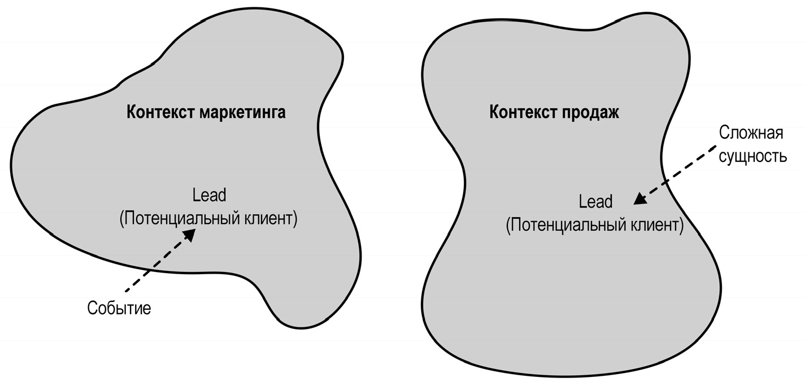{width="4.813109142607174in"
> height="2.256666666666667in"}*Глава 3. Как осмыслить сложность
> предметной области* \| 65
>
> Рис. 3.3. Устранение противоречивости в едином языке путем разбиения
> его на ограниченные контексты

#### Границы модели

В предыдущей главе уже говорилось, что модель является не копией
реального мира, а концептом, помогающим разобраться в сложной системе.
Решаемая с ее помощью задача является неотъемлемой частью модели --- ее
назначением. Модель не может существовать без границ, иначе модель
расширится до копии реального мира. Это делает определение границ модели
--- ее ограниченных контекстов --- неотъемлемой частью процесса
моделирования.

Вернемся к тому примеру, где в качестве моделей рассматривались карты. В
нем было показано, что у каждой карты имеется свой особый контекст ---
воздушный, морской, ландшафтный, метро и т. д. Карта полезна и
непротиворечива только в рамках ее конкретного предназначения.

Точно так же, как карта метро бесполезна для морской навигации, единый
язык в одном ограниченном контексте может быть совершенно неуместен в
другом ог- раниченном контексте. Ограниченные контексты определяют сферу
применения единого языка и представляемой им модели. Они позволяют
определять различные модели в соответствии с различными областями задач
(problem domain). Иными словами, ограниченные контексты --- это границы
согласованности единых языков. Терминология, принципы и бизнес-правила
языка согласуются только внутри его ограниченного контекста.

#### Уточнение термина «единый язык»

Ограниченные контексты позволяют завершить определение единого языка
(ubiquitous language). Единый язык не является «единым» в том смысле,
что он должен использоваться и применяться повсеместно во всей
организации. Единый язык не является универсальным.

Единый язык применим только в границах своего ограниченного контекста.
Язык ориентирован на описание только той модели, которая заключена в
ограниченный

> 66 \| *Часть I. Стратегическое проектирование*

контекст. Поскольку модель не может существовать без задачи, для решения
кото- рой она предназначена, единый язык не может быть определен или
использован без явного контекста его применимости.

#### Область применения ограниченного контекста

Пример в начале главы продемонстрировал границу, свойственную предметной
области. Различные эксперты предметной области придерживались
противоречи- вых ментальных моделей одного и того же бизнес-объекта.
Чтобы смоделировать предметную область, пришлось разделить модель и
определить строгий контекст применимости для каждой более
конкретизированной модели --- ее ограниченный контекст.

Непротиворечивость единого языка помогает определить только самую
широкую границу его применения. Она не может быть еще шире, поскольку
тогда мы полу- чим несогласованные модели и терминологию. Но, как
показано на рис. 3.4, модели можно разбить на еще более мелкие
ограниченные контексты.

{width="4.953498468941382in"
height="2.4433333333333334in"}

> Рис. 3.4. Еще меньшие ограниченные контексты

Определение области применения единого языка --- его ограниченного
контек- ста --- является стратегическим проектным решением. Границы
могут быть широ- кими, в соответствии с контекстами самой предметной
области, или узкими, при разделении предметной области на менее крупные
области задач.

Размер ограниченного контекста сам по себе не является решающим
фактором. Модели не обязательно должны быть большими или маленькими. Они
должны быть полезными. Чем шире границы единого языка, тем труднее
сохранить его не- противоречивость. Порой будет выгоднее разбить большой
единый язык на более мелкие и более управляемые области задач, но
стремление к небольшим ограни- ченным контекстам также может иметь и
неприятные последствия. Чем мельче ограниченные контексты, тем выше
издержки на интеграцию несет такой дизайн.

> *Глава 3. Как осмыслить сложность предметной области* \| 67

Следовательно, решение о выборе размеров ограниченных контекстов должно
за- висеть от конкретной предметной области. Иногда понятнее будет
использование широких границ, а иногда целесообразнее будет заняться
дальнейшим разбиением на более мелкие ограниченные контексты.

Причиной выделения более мелких ограниченных контекстов из более
крупного может стать подключение к разработке новых команд разработчиков
ПО или удов- летворение ряда нефункциональных требований системы, к
примеру, при возник- новении потребности в разделении жизненных циклов
разработки некоторых ком- понентов, изначально находящихся в одном
ограниченном контексте. Еще одна весьма распространенная причина
выделения одной из функций заключается в воз- можности ее
масштабирования независимо от остальных функций ограниченного контекста.

Поэтому нужно сделать так, чтобы модели были полезными, а размеры
ограничен- ных контекстов соответствовали потребностям вашего бизнеса и
организационным ограничениям. Но при этом нужно избегать разбиения
связанной функциональ- ности на несколько ограниченных контекстов. Такое
разбиение помешает незави- симому развитию каждого контекста. Ведь
одинаковые бизнес-требования и из- менения будут оказывать на
ограниченные контексты одновременное влияние и требовать единомоментного
развертывания новых версий. Чтобы избежать такой неэффективной
декомпозиции, нужно следовать эмпирическому правилу, которое
рассматривалось в главе 1 для поиска поддоменов: определите наборы
связанных сценариев использования (coherent use cases), которые работают
с одними и теми же данными, и избегайте их разбиения на несколько
ограниченных контекстов.

Тема непрерывной оптимизации границ ограниченных контекстов будет
рассмот- рена далее в *главах 8* и *10*.

### Сравнение ограниченных контекстов и поддоменов

В *главе 2* говорилось, что предметная область состоит из нескольких
поддоменов. До сих пор в текущей главе исследовалось понятие разбиения
предметной области на набор более мелких областей задач или ограниченных
контекстов. На первый взгляд два метода разбиения предметных областей
могут показаться излишними. Но это не так. Давайте рассмотрим, зачем нам
нужны оба разграничения.

#### Поддомены

Чтобы понять бизнес-стратегию компании, нужно проанализировать ее
предмет- ную область. В соответствии с методологией
предметно-ориентированного проек- тирования этап анализа включает в себя
определение различных поддоменов (основных (core), универсальных
(generic) и вспомогательных (supporting)). Именно так работает и
планирует свою конкурентную стратегию та или иная организация.

> 68 \| *Часть I. Стратегическое проектирование*

В *главе 1* говорилось, что поддомен похож на набор взаимосвязанных
сценариев использования (use cases). Эти сценарии определяются
предметной областью и сис- темными требованиями. Разработчиками
программных продуктов требования не определяются, это прерогатива
бизнеса. А разработчики, чтобы идентифицировать поддомен, анализируют
предметную область.

#### Ограниченные контексты

А вот ограниченные контексты определяются в процессе проектирования.
Выбор границ моделей является стратегическим решением проектирования.
Проектиров- щики решают, как разбить предметную область (business
domain) на более мелкие, управляемые области задач (problem domains).

#### Взаимодействие поддоменов и ограниченных контекстов

Теоретически, хотя это и непрактично, одна модель может охватывать всю
пред- метную область. Эта стратегия, как показано на рис. 3.5, может
сработать для не- большой системы.

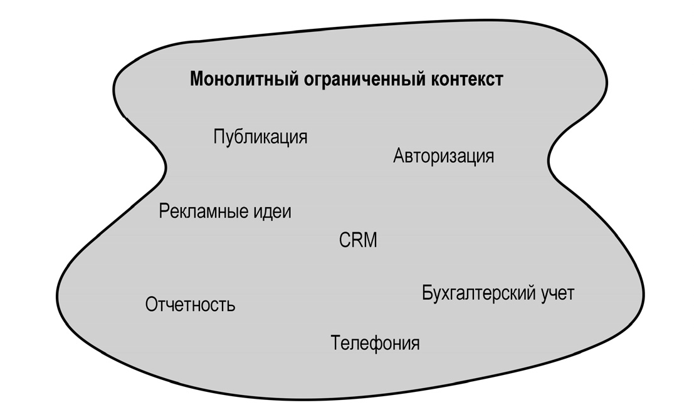{width="3.728596894138233in"
height="2.183332239720035in"}

> Рис. 3.5. Монолитный ограниченный контекст

Когда появляются конфликтующие модели, можно следовать ментальным
моделям экспертов предметной области и, как показано на рис. 3.6,
разбивать системы на ограниченные контексты.

Если модели все еще слишком большие и их трудно поддерживать, можно
разбить их на еще более мелкие ограниченные контексты, получив, к
примеру, как показано на рис. 3.7, ограниченный контекст для каждого
поддомена.

В любом случае это решение проектирования (design decision), частью
которого и является определение границ.

Однозначная взаимозависимость ограниченных контекстов и поддоменов может
быть вполне разумной для целого ряда сценариев. Но бывает, что могут
подойти и другие стратегии разбиений.

> 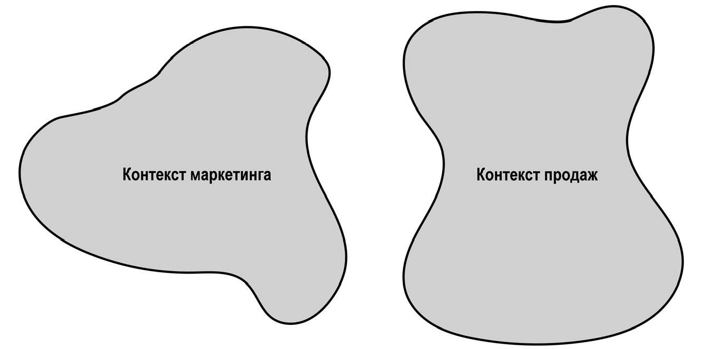{width="4.489715660542432in"
> height="2.21in"}*Глава 3. Как осмыслить сложность предметной области*
> \| 69
>
> Рис. 3.6. Ограниченные контексты, обусловленные непротиворечивостью
> единого языка

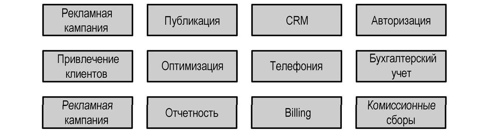{width="4.561288276465442in"
height="1.2166666666666666in"}

> Рис. 3.7. Ограниченные контексты, совпадающие с границами поддоменов

Крайне важно помнить, что поддомены выявляются, а ограниченные контексты

> 1

проектируются . Поддомены определяются бизнес-стратегией. Но программное

решение и его ограниченные контексты могут быть спроектированы с учетом
кон- кретного проекта и ограничений.

И наконец, как говорилось в *главе 1*, модель предназначена для решения
конкрет- ной задачи. В ряде случаев для решения разных задач может
оказаться полезным одновременное использование сразу нескольких моделей
одной и той же концеп- ции. Как и разные типы карт предоставляют разную
информацию о нашей планете, так может быть разумно воспользоваться
разными моделями одного и того же под- домена для решения разных задач.
Ограничение дизайна однозначной взаимозави- симостью между ограниченными
контекстами помешало бы этой гибкости и выну- дило бы воспользоваться
единой моделью поддомена в ее ограниченном контексте.

> ^1^ Здесь есть исключение, о котором стоит упомянуть. Бывают
> организации, в которых ведущий специалист един в двух лицах и отвечает
> как за разработку программного продукта, так и за развитие бизнеса. В
> резуль- тате появляется возможность повлиять как на дизайн
> программного продукта (на ограниченные контексты), так и на
> бизнес-стратегию (на поддомены). Поэтому в (ограниченном) контексте
> нашего обсуждения лучше будет сосредоточиться исключительно на
> разработке программного продукта.
>
> 70 \| *Часть I. Стратегическое проектирование*

### Границы

Как говорит Рут Малан (Ruth Malan), архитектурное проектирование по
своей сути связано с границами:

Архитектурное проектирование --- это системное проектирование. А
системное проектирование --- это контекстуальное проектирование, и оно
по своей сути каса- ется границ (что будет внутри, что снаружи, что
будет охватывать, а что переме-

щаться через границы) и компромиссов. Оно изменяет то, что снаружи точно
так

2

же, как он формирует то, что внутри .

Ограниченный контекст --- это управляемый предметной областью инструмент
проектирования для определения физических границ и границ владения.

#### Физические границы

Ограниченные контексты служат не только границами модели, но и
физическими границами реализующих их систем. Каждый ограниченный
контекст должен быть реализован как отдельный сервис или проект, т. е.
он реализуется, развивается и версионируется независимо от других
ограниченных контекстов.

Четкие физические границы между ограниченными контекстами позволяют
реали- зовывать каждый ограниченный контекст с помощью технологического
стека, наи- более соответствующего его потребностям.

Как уже ранее говорилось, ограниченный контекст может содержать сразу
не- сколько поддоменов. В таком случае ограниченный контекст является
физической границей, а у каждого его поддомена имеются логические
границы, имеющие в разных языках программирования разные имена:
пространства имен, модули или пакеты.

#### Границы владения

Исследования показывают, что хорошие заборы способствуют добрососедским
от- ношениям. В программных проектах для мирного сосуществования команд
можно воспользоваться границами моделей --- ограниченными контекстами.
Распределе- ние работы между командами --- еще одно стратегическое
решение, которое может приниматься с использованием паттерна
ограниченного контекста.

Ограниченный контекст должен реализовываться, развиваться и
поддерживаться только одной командой. Никакие две команды не могут
работать над одним и тем же ограниченным контекстом. Это разделение
устраняет неявные предположения, которые могут формироваться у команд в
отношении моделей друг друга. Команды должны явно определять протоколы
обмена данными для интеграции своих моде- лей и систем.

> ^2^ Bredemeyer Consulting, «What Is Software Architecture». Retrieved
> September 22, 2021,
> https[://www.bredemeyer.com/who.htm.](http://www.bredemeyer.com/who.htm)
>
> *Глава 3. Как осмыслить сложность предметной области* \| 71

Важно отметить однозначность отношений между командами и ограниченными
контекстами: ограниченный контекст должен принадлежать только одной
команде. Но, как показано на рис. 3.8, одна команда может владеть сразу
несколькими огра- ниченными контекстами.

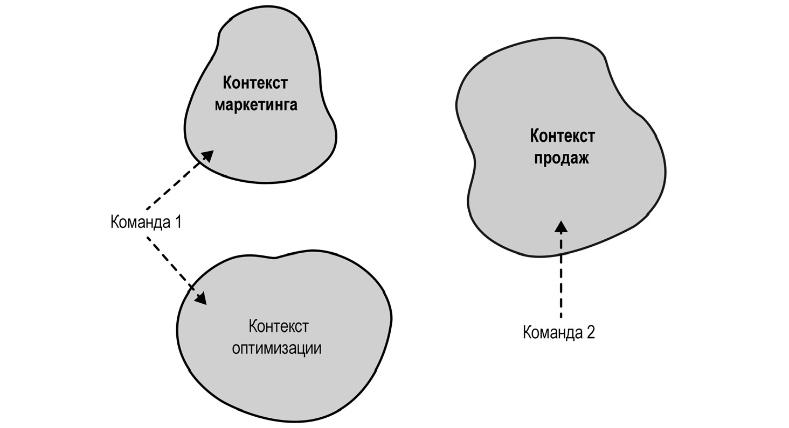{width="4.950959098862642in"
height="2.653332239720035in"}

> Рис. 3.8. Команда 1 работает с ограниченным контекстом маркетинга и
> оптимизации, а команда 2 работает с ограниченным контекстом продаж

### Ограниченные контексты в реальной жизни

На одном из моих занятий по предметно-ориентированному проектированию
один из присутствующих однажды заметил: «Вы сказали, что DDD --- это
приведение дизайна программного продукта в соответствие с предметными
областями. Но где можно увидеть ограниченные контексты в реальной жизни?
В предметных облас- тях нет ограниченных контекстов».

Ограниченные контексты действительно не столь очевидны, как предметные
об- ласти и поддомены, но они существуют, как и ментальные модели
экспертов пред- метной области. Вам просто нужно понимать, как эксперты
предметной области размышляют о различных бизнес-сущностях и процессах.

Я хочу завершить эту главу рассмотрением примеров, демонстрирующих, что
ог- раниченные контексты получили широкое распространение не только при
модели- ровании предметных областей в программных продуктах, но и при
представлении о том, как различные модели используются в разных
контекстах в реальной жизни.

#### Семантические области

Можно сказать, что ограниченные контексты предметно-ориентированного
проек- тирования основаны на лексикографическом понятии семантических
областей (semantic domain). Семантическая область определяется как
область значений и

> 72 \| *Часть I. Стратегическое проектирование*

слов, используемых для того, чтобы вести речь об ограниченном контексте.
На- пример, в семантических областях разработки программного и
аппаратного обес- печения такие слова, как «монитор», «порт» и
«процессор», имеют разные зна- чения.

Весьма своеобразным примером разных семантических областей является
значение слова «помидор».

Согласно определению, используемому в ботанике, фрукт является способом
рас- пространения растениями своих семян. Фрукт должен вырасти из цветка
растения и нести в себе хотя бы одно семя. С другой стороны, овощ
является общим терми- ном, охватывающим все другие съедобные части
растения: корни, стебли и листья. Исходя из этого определения, помидор
--- это фрукт.

Но это определение совершенно не подходит в контексте кулинарного
искусства. В этом контексте фрукты и овощи определяются на основе их
вкусовых характери- стик. Фрукты имеют мягкую структуру, бывают сладкими
или кислыми, их можно есть в сыром виде, а овощи имеют более жесткую
структуру, менее выраженный вкус и часто требуют приготовления. Согласно
этому определению помидор явля- ется овощем.

Следовательно, в ограниченном контексте ботаники помидор --- это фрукт,
а в ограниченном контексте кулинарного искусства --- овощ. Но это еще не
все.

В 1883 году США установили 10-процентный налог, распространяемый на
ввози- мые овощи, но не на фрукты. Ботаническое определение помидора как
фрукта по- зволяло ввозить помидоры в Соединенные Штаты без уплаты
налога на импорт. Чтобы закрыть лазейку, в 1893 году Верховный суд США
принял решение класси- фицировать помидоры как овощи. Следовательно, в
ограниченном контексте нало- гообложения помидор является овощем.

Кроме того, как говорит мой друг Роме Моура (Romeu Moura), в
ограниченном контексте театрального представления помидор является
механизмом зрительского отклика.

#### Наука

Историк Юваль Ной Харари (Yuval Noah Harari) как-то сказал: «Ученые в
целом согласны с тем, что ни одна теория не является на 100% верной.
Таким образом, знания по-настоящему проверяются приносимой ими пользой,
а не их истинно- стью». Иными словами, ни одна научная теория не будет
корректной абсолютно во всех случаях. Разные теории полезны в разных
контекстах.

Это понятие можно продемонстрировать с помощью различных моделей
гравита- ции, представленных сэром Исааком Ньютоном и Альбертом
Эйнштейном. Со- гласно законам движения Ньютона, пространство и время
абсолютны. Они являют- ся сценой, на которой происходит движение
объектов. В теории относительности Эйнштейна пространство и время больше
не абсолютны, а различны для разных наблюдателей.

Несмотря на то что эти две модели можно рассматривать как противоречащие
друг другу, обе они полезны в своих подходящих (ограниченных)
контекстах.

> *Глава 3. Как осмыслить сложность предметной области* \| 73

#### Покупка холодильника

И наконец, давайте рассмотрим более приземленный пример реальных
ограничен- ных контекстов. Что вы видите на рис. 3.9?

> Рис. 3.9. Кусок картона

Это простой кусок картона? Нет, это модель. Причем модель холодильника
Siemens KG86NAI31L. При ближайшем рассмотрении можно сказать, что кусок
картона совсем не похож на указанный холодильник. У него отсутствуют
дверцы и даже цвет у него другой.

Пусть все это так и есть, но это не важно. Как уже говорилось, модель не
должна копировать реальный объект. У нее вместо этого должна быть цель
--- задача, кото- рую с ее помощью нужно решить. Следовательно,
правильным вопросом о картоне будет следующий: какую задачу помогает
решить эта модель?

В нашей квартире нестандартный вход на кухню. Картон вырезали точно по
шири- не и глубине холодильника. И задача, решаемая с его помощью,
заключается в про- верке того, сможет ли холодильник пройти через
кухонную дверь (см. рис. 3.10).

Пусть картон совсем не похож на холодильник, но он оказался весьма
полезен, ко- гда нам нужно было решить, покупать ли эту модель или
выбрать модель меньшего размера. Опять же, все модели не точны, но
некоторые из них полезны. Создание 3D-модели холодильника, безусловно,
будет интересной задумкой. Но решит ли это проблему более эффективно,
чем картон? Нет. Если подходит картон, подойдет и 3D-модель, и наоборот.

С точки зрения разработки программных продуктов, создание 3D-модели
холо- дильника было бы неоправданным переусложнением.

А как насчет высоты холодильника? Что делать, если основание подходит,
но хо- лодильник может оказаться выше дверного проема? Оправдывает ли
это склеива-

> 74 \| *Часть I. Стратегическое проектирование*

ние 3D-модели холодильника? Нет. Проблему можно решить гораздо быстрее и
проще, если измерить высоту дверного проема простой рулеткой. Что такое
рулет- ка в данном случае? Это еще одна простая модель.

> Рис. 3.10. Картонная модель в дверном проеме кухни

Итак, в итоге получились две модели одного и того же холодильника.
Использова- ние двух моделей, каждая из которых оптимизирована для
решения своей конкрет- ной задачи, отражает подход DDD к моделированию
предметных областей. Каждая модель имеет свой строго ограниченный
контекст: картон, подтверждающий, что основание холодильника может
пройти через вход в кухню, и рулетка, подтвер- ждающая, что этот
холодильник не слишком высокий. Модель должна исключать лишнюю
информацию, не имеющую отношения к поставленной задаче. Кроме то- го,
нет необходимости разрабатывать сложную универсальную модель, если не-
сколько гораздо более простых моделей способны помочь эффективному
решению каждой задачи по отдельности.

Через несколько дней после публикации этой истории в «Твиттере», я
получил от- вет, в котором говорилось, что вместо возни с картоном, я
мог бы просто восполь- зоваться мобильным телефоном со сканером LiDAR и
приложением дополненной реальности (AR). Давайте проанализируем это
предложение с точки зрения пред- метно-ориентированного проектирования.

Автор комментария утверждает, что эта задача уже решена другими людьми,
и это решение находится в открытом доступе. Излишне говорить, что и
технология ска- нирования, и приложение дополненной реальности весьма
непросты. На жаргоне DDD это относит проблему проверки возможности
прохода холодильника в двер- ной проем к универсальному поддомену.

### Вывод

> *Глава 3. Как осмыслить сложность предметной области* \| 75

При каждом столкновении с неизбежным конфликтом ментальных моделей
экспер- тов предметной области нам приходится разбивать единый язык на
несколько огра- ниченных контекстов. Единый язык в рамках своего
ограниченного контекста дол- жен быть непротиворечивым.

Но в ограниченных контекстах одни и те же понятия могут иметь разные
значения. При выявлении поддоменов разрабатываются ограниченные
контексты. Разбиение предметной области на ограниченные контексты
является стратегическим проект- ным решением.

Ограниченный контекст и его единый язык могут реализовываться и
поддержи- ваться одной командой. Никакие две команды не должны совместно
работать над одним и тем же ограниченным контекстом. Но одна и та же
команда может рабо- тать с несколькими ограниченными контекстами.

Ограниченные контексты разбивают систему на физические компоненты ---
серви- сы, подсистемы и т. д. Жизненный цикл каждого ограниченного
контекста отделен от всех остальных. Каждый ограниченный контекст может
развиваться независимо от остальной системы. Но, чтобы сформировать
систему, ограниченные контексты должны работать вместе. Некоторые
изменения непреднамеренно будут оказывать влияние и на другой
ограниченный контекст. В следующей главе будут рассмотре- ны различные
паттерны интеграции ограниченных контекстов, которыми можно будет
воспользоваться для их защиты от каскадных изменений.

### Упражнения

1.  В чем разница между поддоменами и ограниченными контекстами?

> А) Поддомены проектируются, а ограниченные контексты выявляются. Б)
> Ограниченные контексты проектируются, а поддомены выявляются. В)
> Ограниченные контексты и поддомены, по сути, одно и то же.
>
> Г) Ничто из вышеперечисленного не является истиной.

2.  Ограниченный контекст является границей: А) Модели.

> Б) Жизненного цикла. В) Владения.
>
> Г) Всего вышеперечисленного.

3.  Что из следующего является истиной в отношении размера ограниченного
    кон- текста?

> А) Чем меньше ограниченный контекст, тем гибче система.
>
> Б) Ограниченный контекст всегда должен согласовываться с границами
> поддо- мена.
>
> 76 \| *Часть I. Стратегическое проектирование*
>
> В) Чем шире ограниченный контекст, тем лучше. Г) Все зависит от
> конкретных обстоятельств.

4.  Что из следующего является истиной в отношении вопросов владения
    ограни- ченным контекстом с позиции команды?

> А) Работать над одним и тем же ограниченным контекстом могут сразу
> несколь- ко команд.
>
> Б) Одна и та же команда может владеть сразу несколькими ограниченными
> кон- текстами.
>
> В) Ограниченным контекстом может владеть только одна команда. Г) Верны
> пункты Б и В.

5.  Посмотрите еще раз на приведенный пример компании WolfDesk из
    предисло- вия и попробуйте выявить функции системы, которым могут
    понадобиться раз- ные модели, отражающие запрос в службу поддержки.

6.  Попробуйте найти примеры ограниченных контекстов из реальной жизни в
    до- полнение к тем, что были рассмотрены в этой главе.

ГЛАВА 4

## Интеграция ограниченных контекстов

Ограниченный контекст (Bounded Context) защищает согласованность единого
языка (Ubiquitous Language) внутри своих границ и открывает возможности
к по- строению моделей. Построить модель, не определив цель ее
существования, т. е. не зафиксировав ее границы, невозможно. Эта граница
--- граница ответственностей языков, она означает, что одни и те же
бизнес-сущности в разных ограниченных контекстах могут использоваться
для решения различных задач.

Несмотря на то что развитие моделей и их реализация внутри различных
ограни- ченных контекстов могут идти независимо, сами ограниченные
контексты незави- симыми друг от друга не являются. Система не может
состоять из независимых компонентов (компоненты должны взаимодействовать
друг с другом для достиже- ния основных целей системы), это же
справедливо и для ограниченных контекстов: несмотря на возможность
независимого развития, они все же должны интегриро- ваться друг с
другом. В результате всегда будут возникать точки соприкосновения
ограниченных контекстов друг с другом, именуемые контрактами.

Необходимость в контрактах возникает из-за различий в моделях и языках
ограни- ченных контекстов. Поскольку каждый контракт затрагивает более
чем одного уча- стника, их необходимо определить и скоординировать.
Кроме того, по определе- нию в двух разных ограниченных контекстах
используются разные единые языки. А какой язык будет использоваться в
целях интеграции? Все эти проблемы инте- грации должны быть осмыслены и
учтены при разработке решения.

Разговор в этой главе пойдет о паттернах предметно-ориентированного
проектиро- вания, предназначенных для определения отношений и интеграции
ограниченных контекстов. Суть паттернов обусловливается характером
сотрудничества между командами, работающими над ограниченными
контекстами. Паттерны будут раз- делены на три группы, каждая из которых
представляет собой тип командного взаимодействия: сотрудничество
(cooperation), потребитель-поставщик (customer- supplier) и разные пути
(separate ways).

### Сотрудничество (Cooperation)

Паттерны сотрудничества (cooperation) относятся к ограниченным
контекстам (bounded context), реализованным командами с хорошо
налаженным взаимодей- ствием.

В наипростейшем случае имеются в виду ограниченные контексты,
реализуемые одной и той же командой. Это также может относиться к
командам со взаимозави-

> 78 \| *Часть I. Стратегическое проектирование*

симыми целями, когда успех одной команды зависит от успеха другой и
наоборот. Опять же, главный критерий здесь --- плотность общения и
совместной работы команд.

Давайте рассмотрим два паттерна DDD, подходящих для совместной работы
команд: паттерн партнерства (partnership) и паттерн общего ядра (shared
kernel).

#### Партнерство (Partnership)

В партнерской (partnership) модели интеграция ограниченных контекстов
коорди- нируется по ситуации. Одна команда может уведомить вторую
команду об измене- нии API, а вторая команда адаптируется к нему в духе
сотрудничества --- без драм и конфликтов (см. рис. 4.1).

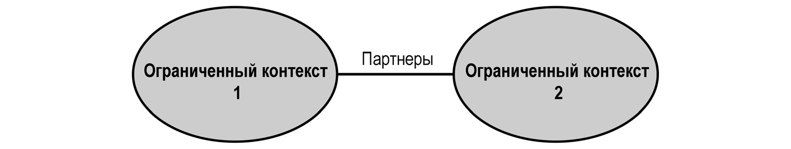{width="4.7509678477690285in"
height="0.893332239720035in"}

> Рис. 4.1. Модель партнерства

Здесь прослеживается двусторонняя координация интеграции. Ни одна
команда не навязывает язык, используемый для определения контрактов.
Команды могут разо- браться в различиях и выбрать наиболее подходящее
решение. Кроме того, обе сто- роны сотрудничают в решении любых
возникающих вопросов интеграции. Ни одна из команд не заинтересована в
блокировке работы другой команды.

Получается, что для успешной интеграции нужны хорошо отработанные методы
совместной работы, высокая степень обязательности и частая синхронизация
дей- ствий команд. С технической точки зрения необходима непрерывная
интеграция изменений, вносимых обеими командами, чтобы до минимума
сократить цикл обратной связи интеграции.

Этот паттерн может не подойти для команд, географически удаленных друг
от дру- га из-за возможных трудностей с синхронизацией работ и общением.

#### Общее ядро (shared kernel)

Несмотря на то что границы модели определяются ограниченными
контекстами, бывают случаи, когда одна и та же модель поддомена
(subdomain) или часть этой модели будет реализована сразу в нескольких
ограниченных контекстах. Здесь крайне важно отметить, что общая модель
разрабатывается в соответствии с по- требностями всех ограниченных
контекстов. Более того, общая модель должна быть согласована во всех
использующих ее ограниченных контекстах.

Рассмотрим в качестве примера корпоративную систему, использующую
собствен- ную модель управления доступами, выдаваемыми пользователям на
те или иные действия. Разрешения, выдаваемые каждому пользователю, могут
предоставляться

> *Глава 4. Интеграция ограниченных контекстов* \| 79

напрямую или быть унаследованными от одного из организационных
подразделе- ний, к которым этот пользователь принадлежит. Более того,
каждый ограниченный контекст может изменять модель авторизации, и
изменения, применяемые каждым ограниченным контекстом, должны влиять на
все остальные ограниченные контек- сты, использующие эту модель (см.
рис. 4.2).

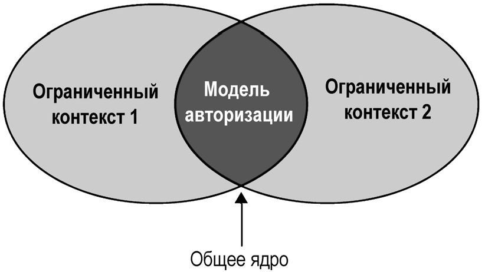{width="2.755926290463692in"
height="1.54in"}

> Рис. 4.2. Общее ядро

###### Общие рамки (Shared scope)

Модель с перекрытием, используемая в нескольких ограниченных контекстах,
свя- зывает жизненные циклы. Изменение, внесенное в общую модель, тут же
повлияет на все ограниченные контексты. Следовательно, чтобы свести к
минимуму каскад- ные эффекты изменений, модель с перекрытием должна
выставлять ограничения, чтобы раскрывалась только та ее часть, которая
должна быть реализована обоими ограниченными контекстами. В идеале общее
ядро (shared kernel) будет состоять только из интеграционных контрактов
и структур данных, предназначенных для передачи данных через границы
ограниченных контекстов.

###### Реализация

Общее ядро (shared kernel) реализуется так, что любая модификация его
исходного кода тут же отражается во всех использующих его ограниченных
контекстах.

Если в организации практикуется подход с использованием монорепозитория,
об- щее ядро может быть в виде одних и тех же исходных файлов, на
которые ссыла- ются сразу несколько ограниченных контекстов. Если
использование общего моно- репозитория невозможно, общее ядро можно
выделить в отдельный проект и ссы- латься на него в ограниченных
контекстах как на связанную библиотеку. В любом случае каждое изменение
в общем ядре должно инициировать запуск интеграцион- ных тестов для всех
затронутых им ограниченных контекстов.

Интеграция изменений должна вестись непрерывно, поскольку общее ядро
принад- лежит множеству ограниченных контекстов. Если не распространять
изменения, вносимые в общее ядро, на все связанные ограниченные
контексты, в модели воз- никнут несоответствия: ограниченные контексты
могут зависеть от устаревших реализаций общего ядра, что может привести
к повреждению данных и (или) воз- никновению проблем во время выполнения
программы.

> 80 \| *Часть I. Стратегическое проектирование*

###### Когда следует воспользоваться общим ядром

Комплексным критерием применимости паттерна общего ядра является сравни-
тельная затратность дублирования и координации. Поскольку паттерн вводит
силь- ную зависимость между задействованными ограниченными контекстами,
его сле- дует применять только в том случае, когда затраты на
дублирования выше затрат на координацию, иными словами, только в том
случае, когда на интеграцию измене- ний, примененных к общей модели,
уйдет в обоих ограниченных контекстах боль- ше усилий, чем на
координацию изменений в общей кодовой базе.

Разница между затратами на интеграцию и дублирование зависит от
волатильности модели. Чем чаще в ней происходят изменения, тем выше
будут затраты на инте- грацию. Поэтому общее ядро естественным образом
будет применяться к тем под- доменам, которые подвержены самым частым
изменениям: к основным поддоме- нам (core subdomains).

В определенном смысле паттерн общего ядра противоречит принципам
ограничен- ных контекстов, представленным в предыдущей главе. Если
задействованные огра- ниченные контексты реализуются не одной и той же
командой разработчиков (team), введение общего ядра противоречит
принципу, согласно которому ограни- ченным контекстом должна владеть
одна команда. Модель с перекрытием, имею- щая общее ядро, фактически
разрабатывается несколькими командами.

Именно поэтому использование общего ядра должно быть строго обосновано.
Это прагматичное исключение из правил, которое следует тщательно
продумать. Рас- пространенным вариантом использования общего ядра
является ситуация, при ко- торой есть проблемы со свободным общением или
совместной работой, не позво- ляющие реализовать паттерн партнерства
(partnership), например из-за географиче- ских ограничений или
организационной политики. Реализация тесно связанной функциональности
без надлежащей координации приведет к проблемам интегра- ции,
рассинхронизированным моделям и спорам о том, какая из моделей лучше
спроектирована. Минимизация области действия общего ядра контролирует
об- ласть действия каскадных изменений, а запуск интеграционных тестов
для каждого изменения --- это способ обеспечить раннее обнаружение
проблем интеграции.

Еще одним распространенным, хотя и временным вариантом использования
пат- терна общего ядра, является постепенная модернизация устаревшей
системы. В этом сценарии общая кодовая база может быть прагматичным
промежуточным решением для постепенного разбиения системы на
ограниченные контексты.

И наконец, общее ядро может удачно подойти для интеграции ограниченных
кон- текстов, принадлежащих и реализуемых одной и той же командой. В
таком случае непродуманная интеграция ограниченных контекстов по
принципу партнерства может со временем «размыть» границы контекстов.
Общее ядро можно использо- вать для явного определения интеграционных
контрактов ограниченных контек- стов.

> *Глава 4. Интеграция ограниченных контекстов* \| 81

### Потребитель-Поставщик (Customer-supplier)

Вторая, рассматриваемая нами группа паттернов сотрудничества ---
паттерны типа потребитель-поставщик (customer-supplier). На рис. 4.3
показано, что один ограни- ченный контекст, поставщик (supplier),
предоставляет услуги своим потребителям (customer). Поставщик услуг
находится «выше по течению», а клиент или потреби- тель --- «ниже по
течению».

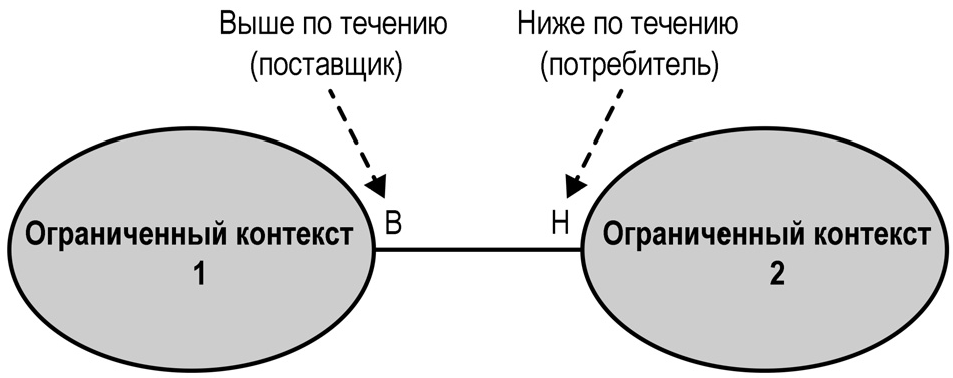{width="3.196655730533683in"
height="1.26in"}

> Рис. 4.3. Отношения потребитель-поставщик

В отличие от схемы сотрудничества, обе команды (выше и ниже по течению)
могут добиться успеха независимо друг от друга. Следовательно, в
большинстве случаев получается дисбаланс сил: интеграционный контракт
может диктовать либо выше- стоящая, либо нижестоящая команда.

В этом разделе будут рассмотрены паттерны трех типов, предназначенные
для уст- ранения подобных различий в силе команд: конформист
(conformist), предохрани- тельный слой (anticorruption layer) и сервис с
открытым протоколом (open-host service).

#### Конформист (Conformist)

В ряде случаев при сложившемся балансе сил предпочтение отдается
вышестоящей (upstream) команде, у которой нет никакой реальной мотивации
поддерживать по- требности своих клиентов. Вместо этого она просто
предоставляет интеграционный контракт, определенный в соответствии со
своей собственной моделью по принци- пу «хочешь принимай, хочешь не
принимай». Такой дисбаланс сил может быть вы- зван интеграцией с
внешними по отношению к организации поставщиками услуг, или же просто
сложившейся политикой организации.

Если нижестоящая (downstream) команда может принять модель вышестоящей
(upstream) команды, отношения ограниченных контекстов называются
конформи- стскими (conformist). Как показано на рис. 4.4, нижестоящий
подстраивается под модель ограниченного контекста вышестоящего.

Решение нижестоящей команды отказаться от части своей автономности может
быть оправдано несколькими обстоятельствами. Например, контракт,
представлен- ный вышестоящей командой, может быть стандартной, хорошо
зарекомендовавшей себя моделью или может быть вполне подходящим для нужд
нижестоящей команды.

> 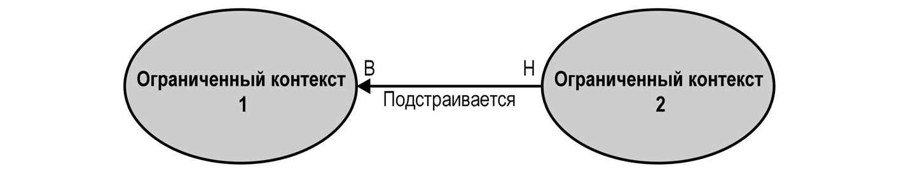{width="4.7509678477690285in"
> height="0.8933333333333333in"}82 \| *Часть I. Стратегическое
> проектирование*
>
> Рис. 4.4. Конформистские отношения

Следующий паттерн касается случая, когда клиент (потребитель) не желает
прини- мать модель поставщика.

#### Предохранительный слой (Anticorruption layer)

Как и в случае с паттерном конформист, баланс сил в этих отношениях по-
прежнему смещен в сторону вышестоящего сервиса. Но в данном случае ниже-
стоящий ограниченный контекст не желает под нее подстраиваться. Взамен,
как показано на рис. 4.5, модель вышестоящего ограниченного контекста
может быть с помощью предохранительного слоя (anticorruption layer)
преобразована в модель, приспособленную к его собственным нуждам.

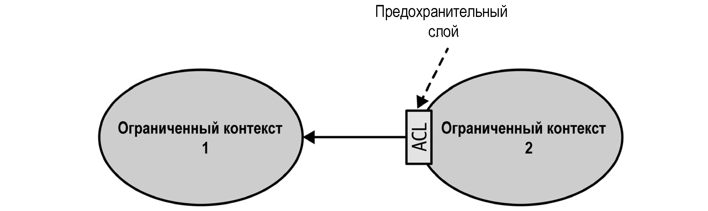{width="4.504998906386701in"
height="1.3375in"}

> Рис. 4.5. Интеграция посредством применения предохранительного слоя

Предохранительный слой (Anticorruption Layer) предназначен для тех
сценариев, когда прилагать усилия для подстройки под модель поставщика
нежелательно или нецелесообразно, например:

> *Когда нисходящий (downstream) ограниченный контекст содержит основной
> под- домен (core subdomain)*
>
> Модель основного поддомена требует особого внимания, а соблюдение
> модели поставщика может затруднить моделирование (problem domain)
> предметной об- ласти решаемой проблемы.
>
> *Когда восходящая (upstream) модель неэффективна или не соответствует
> нуж- дам потребителя*
>
> Если ограниченный контекст подстраивается под какой-либо беспорядок,
> он сам рискует стать беспорядочным. Такое довольно часто происходит
> при интегра- ции с устаревшими системами.
>
> *Глава 4. Интеграция ограниченных контекстов* \| 83
>
> *Когда контракт поставщика меняется слишком часто*
>
> Потребитель хочет защитить свою модель от частых изменений. При
> наличии предохранительного слоя модификации в модели поставщика влияют
> только на механизм трансляции.

С точки зрения моделирования трансляция модели поставщика изолирует
ниже- стоящего потребителя от чужих концепций, не имеющих отношения к
его ограни- ченному контексту. Тем самым это позволяет упростить единый
язык (ubiquitous language) и модель потребителя.

Различные способы реализации предохранительного уровня будут рассмотрены
в *главе 9*.

#### Сервис с открытым протоколом (Open-Host Service)

Этот паттерн предназначен для случаев, когда главная роль принадлежит
потреби- телям. Поставщик заинтересован в защите своих потребителей и
высочайшем каче- стве их обслуживания.

Чтобы защитить потребителей от изменений в своей модели реализации,
выше- стоящий поставщик отделяет модель реализации от общедоступного
интерфейса. Такое разобщение, как показано на рис. 4.6, позволяет
поставщику развивать свою реализацию и общедоступные модели разными
темпами.

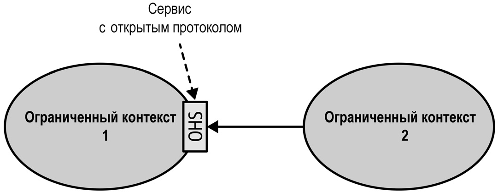{width="3.6145220909886264in"
height="1.3966666666666667in"}

> Рис. 4.6. Интеграция через сервис с открытым протоколом

Публичный интерфейс поставщика не предназначен для соответствия его
единому языку (ubiquitous language). Цель этого интерфейса ---
предоставить удобный потребителям протокол, выраженный на языке,
ориентированном на интеграцию. Поэтому публичный протокол называют
опубликованным языком (published lan- guage).

В каком-то смысле паттерн сервиса с открытым протоколом представляет
собой перевернутый вариант паттерна предохранительного уровня: здесь
трансляцией своей внутренней модели занимается не потребитель, а
поставщик.

Разделение моделей реализации и интеграции ограниченного контекста дает
выше- стоящему ограниченному контексту свободу развития своей реализации
без затра- гивания при этом нижестоящих контекстов. Конечно, такая
возможность предос- тавляется только в том случае, если модифицированную
модель реализации можно

> 84 \| *Часть I. Стратегическое проектирование*

перевести на опубликованный язык (published language), который уже
используется потребителями.

Кроме того, отделение модели интеграции позволяет вышестоящему
ограниченно- му контексту в одно и то же время предоставлять сразу
несколько версий опубли- кованного языка, допуская постепенный переход
потребителя на новую версию (см. рис. 4.7).

{width="3.1819028871391075in"
height="1.9499989063867016in"}

> Рис. 4.7. Сервис с открытым протоколом, предоставляющий несколько
> версий опубликованного языка

### Разные пути (Separate Ways)

Последний вариант сотрудничества --- полный отказ от какого-либо
сотрудничест- ва. Такая линия поведения может возникнуть по разным
причинам в тех случаях, когда команды не хотят или не могут
сотрудничать. Часть из этих случаев будет рассмотрена ниже.

#### Проблемы общения

Частой причиной отказа от сотрудничества могут стать трудности общения,
обу- словленные размерами организации или ее внутренней политикой. Когда
командам трудно развивать сотрудничество и договариваться, возможно,
рентабельнее будет пойти разными путями и продублировать
функциональность в нескольких ограни- ченных контекстах.

#### Универсальный поддомен (Generic Subdomain)

Причиной расхождения путей команд могут быть особенности дублируемого
под- домена. В тех случаях, когда рассматриваемый поддомен является
универсальным (generic), а универсальное решение легко поддается
интеграции, может оказаться, что его локальная интеграция в каждом
ограниченном контексте будет более рен- табельной. В качестве примера
можно привести фреймворк логирования. Вряд ли было бы разумно выставлять
его в качестве сервиса в одном из ограниченных кон- текстов.
Дополнительные сложности интеграции такого решения перевесят пре-

> *Глава 4. Интеграция ограниченных контекстов* \| 85

имущества отказа от дублирования функций в различных контекстах, которое
обошлось бы дешевле сотрудничества.

#### Различия в моделях

Причиной выбора разных путей также могут стать различия в моделях
ограничен- ного контекста. Модели могут быть настолько разными, что
конформистские от- ношения становятся невозможными, а реализация
предохранительного уровня (anticorruption layer) обойдется дороже, чем
дублирование функциональности. В этом случае для команд опять-таки
выгоднее будет пойти разными путями.

> {width="0.4216666666666667in"
> height="0.5483333333333333in"}При интеграции основных поддоменов (core
> subdomains) от использования разных путей лучше отказаться.
> Дублирование реализации таких подобластей противоре- чило бы стратегии
> компании по их наиболее эффективной и оптимизированной реализации.

### Карта контекстов (Context Map)

После анализа паттернов интеграции ограниченных контекстов системы их,
как показано на рис. 4.8, можно нанести на контекстную карту.

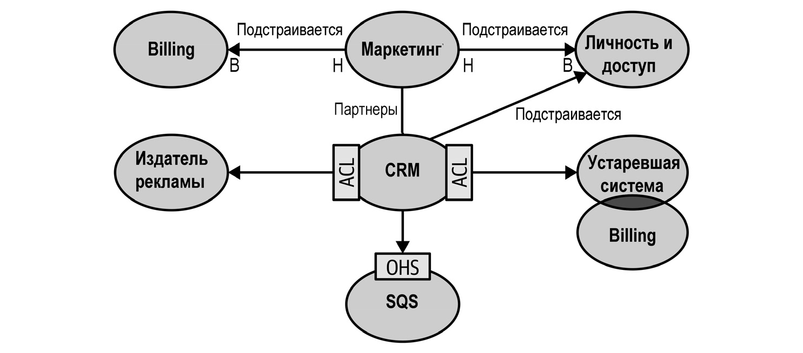{width="5.011876640419947in"
height="2.1799989063867016in"}

> Рис. 4.8. Карта контекстов

Карта контекстов является визуальным представлением ограниченных
контекстов системы и их интеграции. Это визуальное обозначение дает
ценную стратегиче- скую информацию на нескольких уровнях:

> *Высокоуровневое проектирование*
>
> *Карта контекстов* дает общий вид компонентов системы и реализуемых
> ими моделей.
>
> *Модели общения*
>
> Карта контекстов отображает модели общения между командами, например
> ка- кие команды сотрудничают, а какие предпочитают «менее тесные»
> интеграци-
>
> 86 \| *Часть I. Стратегическое проектирование*
>
> онные модели, соответствующие паттернам предохранительного слоя (anti-
> corruption layer) и разных путей (separate ways).
>
> *Организационные вопросы*
>
> Например, какой смысл будет в том, что все нижестоящие потребители
> опреде- ленной вышестоящей команды прибегают к реализации
> предохранительного уровня (anticorruption layer), или в том, что все
> реализации паттерна разных путей (separate ways) сосредоточены вокруг
> одной и той же команды?

#### Поддержка в актуальном состоянии

В идеале карта контекстов должна вводиться в проект с самого начала и
обновлять- ся с учетом добавлений новых ограниченных контекстов и
изменений в уже суще- ствующем контексте.

Поскольку потенциально карта контекстов содержит информацию, полученную
в результате работы нескольких команд, лучше всего определить ведение
этой кар- ты совместными усилиями: каждая команда отвечает за обновление
своих собст- венных интеграций с другими ограниченными контекстами.

Карта контекстов может вестись и поддерживаться в виде кода с
использованием инструмента, подобного Context Mapper.

#### Ограничения

Важно отметить, что составление контекстной карты может быть непростой
зада- чей. Когда ограниченный контекст системы охватывает несколько
поддоменов, мо- гут быть задействованы несколько интеграционных моделей.
Например, на рис. 4.9 можно увидеть два ограниченных контекста с двумя
интеграционными моделями: партнерства (partnership) и предохранительного
слоя (anticorruption layer).

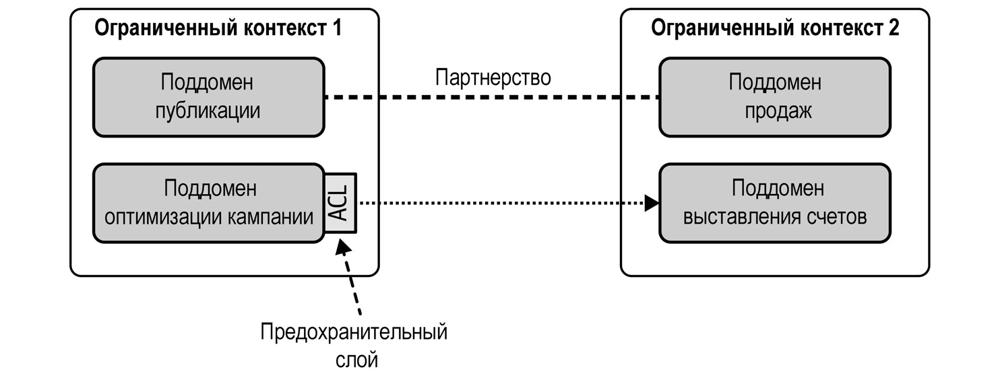{width="4.947929790026246in"
height="1.8599989063867017in"}

> Рис. 4.9. Сложная карта контекстов

Более того, даже если ограниченные контексты не выходят за границы
одного под- домена, все равно может быть задействовано сразу несколько
паттернов интегра- ции --- например, если модули поддоменов требуют
разных стратегий интеграции.

### Вывод

> *Глава 4. Интеграция ограниченных контекстов* \| 87

Ограниченные контексты не бывают независимыми. Они должны взаимодейство-
вать друг с другом. Способы интеграции ограниченных контекстов
определяются следующими паттернами:

> *Партнерство (Partnership)*
>
> Ограниченные контексты интегрируются по ситуации.
>
> *Общее ядро (Shared Kernel)*
>
> Два или более ограниченных контекста интегрируются путем совместного
> ис- пользования ограниченной перекрывающейся модели, которая
> принадлежит всем задействованным ограниченным контекстам.
>
> *Конформист (Conformist)*
>
> Клиент (потребитель) подстраивается под модель поставщика услуг.
>
> *Предохранительный слой (Anticorruption layer)*
>
> Потребитель преобразует модель поставщика услуг в модель,
> соответствующую своим нуждам.
>
> *Сервис с открытым протоколом (Open-host service)*
>
> Поставщик услуг реализует опубликованный язык --- модель,
> оптимизирован- ную под нужды своих потребителей.
>
> *Разные пути (Separate Ways)*
>
> Дублирование конкретной функциональности обходится дешевле, чем
> сотруд- ничество и интеграция.

Интеграции ограниченных контекстов могут быть нанесены на контекстную
карту. Этот инструмент дает представление о высокоуровневой конструкции
системы, моделях общения и организационных вопросах.

Теперь, когда получены представления об инструментах и методах
предметно- ориентированного проектирования, предназначенных для анализа
и моделирования бизнес-областей, наше внимание будет перенесено со
стратегии на тактику. Во вто- рой части книги будут рассмотрены
различные способы реализации логики пред- метной области, организации
высокоуровневой архитектуры и координации взаи- модействия компонентов
системы.

### Упражнения

1.  Какой паттерн интеграции ни в коем случае не следует использовать
    для основ- ного поддомена (core subdomain)?

> А) Общее ядро (shared kernel).
>
> Б) Сервис с открытым протоколом (open-host service). В)
> Предохранительный слой (anticorruption layer).
>
> Г) Разные пути (separate ways*).*
>
> 88 \| *Часть I. Стратегическое проектирование*

2.  Какому нижестоящему поддомену, вероятнее всего, подойдет реализация
    пре- дохранительного слоя (anticorruption layer)?

> А) Основному поддомену (core subdomain).
>
> Б) Вспомогательному поддомену (supporting subdomain). В)
> Универсальному поддомену (generic subdomain).
>
> Г) Верны варианты Б и В.

3.  Какому вышестоящему поддомену, вероятнее всего, подойдет реализация
    сер- виса с открытым протоколом?

> А) Основному поддомену (core subdomain).
>
> Б) Вспомогательному поддомену (supporting subdomain). В)
> Универсальному поддомену (generic subdomain).
>
> Г) Верны варианты А и Б.

4.  Какой паттерн интеграции в каком-то смысле нарушает границы владения
    огра- ниченными контекстами?

> А) Партнерство (partnership). Б) Общее ядро (shared kernel). В) Разные
> пути (separate ways).
>
> Г) Ни один паттерн интеграции не должен нарушать границы владения
> ограни- ченными контекстами.

ЧАСТЬ II

# Тактический замысел

В первой части этой книги программные продукты рассматривались с позиции
во- просов «Что?» и «Почему?»: вам преподавались основы анализа
предметных областей бизнеса (business-domain), определения поддоменов
(subdomains) и их стра- тегической ценности и порядок превращения знаний
о предметных областях бизне- са в проектирование ограниченных контекстов
(bounded contexts) --- программных компонентов, реализующих различные
модели предметных областей бизнеса.

В этой части книги будет переход от стратегии к тактике: будет дан ответ
на вопрос

«Как проектировать программное обеспечение?»:

- В *главах 5--7* будут рассмотрены паттерны (patterns) реализации
  бизнес-логики, позволяющие программному коду «говорить» на едином
  языке (ubiquitous language) его ограниченного контекста. В *главе 5*
  будут представлены два пат-

> терна, предназначенные для реализации относительно простой
> бизнес-логики: транзакционный сценарий (transaction script) и активная
> запись (active record). В *главе 6* предстоит переход к более сложным
> случаям и будет рассмотрен пат- терн «модель предметной области»
> (domain model): DDD-способ реализации сложной бизнес-логики. В *главе
> 7* рассмотрим на примере способ расширения паттерна «модель предметной
> области» при необходимости добавления фактора времени.

- В *главе 8* будут рассмотрены различные способы организации
  архитектуры огра- ниченного контекста: слоистая архитектура (layered
  architecture), порты и адап- теры (гексагональная архитектура), а
  также паттерн CQRS. Будет раскрыта суть каждого архитектурного
  паттерна и разъяснено, в каких случаях следует исполь-

> зовать тот или иной паттерн.

- В *главе 9* будут обсуждаться технические проблемы и стратегии
  реализации при организации взаимодействия компонентов системы. Будут
  рассмотрены паттер- ны, помогающие при интеграции ограниченных
  контекстов, способы реализации

> надежной публикации сообщений и паттерны для работы со сложными
> бизнес- процессами, проходящими через несколько компонентов.

ГЛАВА 5

## Реализация простой бизнес-логики

Бизнес-логика --- наиболее важная часть программного обеспечения. Именно
она является первоочередной целью создания программного обеспечения.
Пользова- тельский интерфейс системы может быть привлекательным, а ее
база данных может быть невероятно быстрой и масштабируемой. Но если
программное обеспе- чение бесполезно для бизнеса, это не более чем
дорогостоящая демонстрация тех- нологий.

В *главе 2* уже упоминалось, что не все поддомены одинаковы. У разных
поддоме- нов разные уровни стратегической важности и сложности. В этой
главе мы присту- пим к изучению различных способов моделирования и
реализации бизнес-логики. Начнем с двух паттернов, подходящих для весьма
простой бизнес-логики: транзак- ционный сценарий (transaction script) и
активная запись (active record).

### Транзакционный сценарий

> Организует бизнес-логику по процедурам, где каждая процедура
> обрабатывает один запрос от пользователя.

1

> -- *Мартин Фаулер (Martin Fowler)*

Как показано на рис. 5.1, общедоступный интерфейс системы можно
рассматривать в качестве набора бизнес-транзакций, доступных для
выполнения потребителями. Эти транзакции могут извлекать информацию из
системы, изменять ее или же делать и то и другое. Паттерн выстраивает
бизнес-логику системы на основе про- цедур, где каждая процедура
реализует операцию, выполняемую потребителем сис- темы через публичный
интерфейс. По сути, публичные операции (интерфейс) сис- темы
используются как границы инкапсуляции.

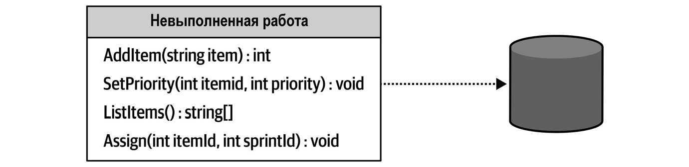{width="4.637407042869642in"
height="1.1199989063867017in"}

> Рис. 5.1. Интерфейс транзакционного сценария
>
> ^1^ Fowler, M. Patterns of Enterprise Application Architecture.
> Boston: Addison-Wesley, 2002.

#### Реализация

> *Глава 5. Реализация простой бизнес-логики* \| 91

Каждая процедура реализована в виде простого и понятного процедурного
сцена- рия. В нем для интеграции с хранилищами данных может
использоваться тонкая прослойка абстракции, но может осуществляться и
непосредственное обращение к базам данных.

Единственным непреложным требованием к процедурам является их
транзакцион- ное поведение. Каждая операция должна завершаться либо
успехом, либо неудачей, но никогда не приводить к недопустимому
состоянию. Даже если выполнение транзакционного сценария завершается
сбоем в самый неподходящий момент, сис- тема должна оставаться
согласованной --- либо путем отката всех изменений, кото- рые она
сделала до сбоя, либо путем выполнения компенсирующих действий.
Транзакционное поведение отражено в названии паттерна: транзакционный
сцена- рий.

Ниже приведен пример транзакционного сценария, преобразующего файл
формата JSON в файл формата XML:

> DB.StartTransaction( );
>
> var job = DB.LoadNextJob( );
>
> var json = LoadFile(job.Source); var xml = ConvertJsonToXml(json);
>
> WriteFile(job.Destination, xml.ToString( );
> DB.MarkJobAsCompleted(job);
>
> DB.Commit( )

#### Это не так-то просто!

Когда я представляю паттерн транзакционного сценария на своих занятиях
по предметно-ориентированному проектированию, мои студенты часто
удивляются, а некоторые даже спрашивают: «Стоит ли на это тратить наше
время? Разве мы здесь не ради более сложных моделей и приемов
программирования?»

Дело в том, что паттерн транзакционного сценария служит основой для
более сложных паттернов реализации бизнес-логики, которые будут
рассматриваться в следующих главах. Более того, несмотря на его
кажущуюся простоту, в нем про- ще всего ошибиться. Множество
производственных проблем, которые я так или иначе помогал отладить и
исправить, часто сводились к неправильной реализации транзакционного
поведения бизнес-логики системы.

Давайте рассмотрим три обычных примера повреждения данных из реальной
жиз- ни, которые возникают в результате неправильной реализации
транзакционного сценария.

###### Отсутствие транзакционного поведения

Элементарный пример неспособности реализовать транзакционное поведение
--- выпуск сразу нескольких обновлений без оборачивающей их транзакции.
Рассмот-

> 92 \| *Часть II. Тактический замысел*

рим следующий метод, обновляющий запись в таблице Users и вставляющий
запись в таблицу VisitsLog:

> 01 public class LogVisit 02 {
>
> 03 \...
>
> 04
>
> 05 public void Execute(Guid userId, DataTime visitedOn) 06 {
>
> 07 \_db.Execute(\"UPDATE Users SET last_visit=@p1 WHERE user_id=@p2\",
> 08 visitedOn, userId);
>
> 09 \_db.Execute(@\"INSERT INTO VisitsLog(user_id, visit_date)

10. VALUES(@p1, \@p2)\", userId, visitedOn);

> 11 }
>
> 12 }

Если после обновления записи в таблице пользователей (строка 7), но до
успешно- го добавления записи в журнал в строке 9 возникнет какая-либо
проблема, система окажется в несогласованном состоянии. Таблица Users
будет обновлена, но соответ- ствующая запись в таблицу VisitsLog
записана не будет. Проблема может быть свя- зана с чем угодно: от сбоя
сети и до тайм-аута или взаимоблокировки в базе дан- ных, или даже со
сбоем сервера, выполняющего всю эту работу.

Ситуацию можно исправить путем правильного добавления транзакции,
охваты- вающей оба изменения данных:

> public class LogVisit
>
> {
>
> \...
>
> public void Execute(Guid userId, DataTime visitedOn)
>
> {
>
> try
>
> {
>
> \_db.StartTransaction( );
>
> \_db.Execute(@\"UPDATE Users SET last_visit=@p1 WHERE user_id=@p2\",
>
> visitedOn, userId);
>
> \_db.Execute(@\"INSERT INTO VisitsLog(user_id, visit_date) VALUES(@p1,
> \@p2)\",
>
> userId, visitedOn);
>
> \_db.Commit( );
>
> } catch {
>
> \_db.Rollback( ); throw;
>
> }
>
> }
>
> }
>
> *Глава 5. Реализация простой бизнес-логики* \| 93

Эти исправления легко осуществить благодаря имеющейся в реляционных
базах данных встроенной поддержке транзакций, позволяющих атомарно
выполнять сра- зу несколько операций. Но когда нужно выполнить несколько
обновлений в базе данных, не поддерживающей транзакции для атомарного
выполнения нескольких операций, или когда работа ведется с несколькими
хранилищами данных, не под- дающимися объединению в распределенную
транзакцию, задача сильно усложня- ется. Давайте рассмотрим пример
такого случая.

###### Распределенные транзакции

В современных распределенных системах общепринятой практикой является
вне- сение изменений в данные в базе данных, а затем уведомление других
компонентов системы об изменениях путем публикации сообщений в шине
сообщений. Пред- ставьте, что при реализации предыдущего примера вместо
регистрации посещения в таблице нам нужно опубликовать сообщение о нем в
шине сообщений:

> 01 public class LogVisit 02 {
>
> 03 \...
>
> 04
>
> 05 public void Execute(Guid userId, DataTime visitedOn) 06 {
>
> 07 \_db.Execute(\"UPDATE Users SET last_visit=@p1 WHERE user_id=@p2\",
> 08 visitedOn,userId);
>
> 09 \_messageBus.Publish(\"VISITS_TOPIC\",
>
> 10 new { UserId = userId, VisitDate = visitedOn });
>
> 11 }
>
> 12 }

Как и в предыдущем примере, любой сбой, случившийся после выполнения
кода в строке 7, но до успешного выполнения кода в строке 9, приведет к
порче состоя- ния системы. Таблица Users будет обновлена, но другие
компоненты уведомлены не будут, поскольку публикация на шине сообщений
даст сбой.

К сожалению, решить проблему так же просто, как в предыдущем примере, не
по- лучится. Распределенные транзакции, охватывающие сразу несколько
хранилищ данных, сложны, трудномасштабируемы, не устойчивы к ошибкам, и
поэтому их обычно избегают. В *главе 8* будет рассматриваться
использование архитектурного паттерна CQRS, предназначенного для
заполнения сразу нескольких хранилищ данных. Кроме того, в *главе 9*
будет представлен паттерн исходящих сообщений (outbox pattern),
позволяющий обеспечить надежную публикацию сообщения после внесения
изменений в базу данных.

Давайте рассмотрим более сложный пример неверной реализации
транзакционного поведения.

> 94 \| *Часть II. Тактический замысел*

###### Неявные распределенные транзакции

Рассмотрим следующий, на первый взгляд довольно простой метод:

> public class LogVisit
>
> {
>
> \...
>
> public void Execute(Guid userId)
>
> {
>
> \_db.Execute(\"UPDATE Users SET visits=visits+1 WHERE user_id=@p1\",
>
> userId);
>
> }
>
> }

Вместо отслеживания, как в предыдущих примерах, даты последнего
посещения этот метод реализует счетчик посещений каждого пользователя.
Вызов метода уве- личивает значение соответствующего счетчика на
единицу. Этот метод всего лишь обновляет одно значение в одной таблице,
находящейся в одной базе данных. И тем не менее это все еще
распределенная транзакция, которая потенциально может привести к
несогласованному состоянию.

Этот пример, как показано на рис. 5.2, представляет собой распределенную
тран- закцию, поскольку она передает информацию в базу данных и внешнему
процессу, вызвавшему метод.

{width="4.77630249343832in"
height="0.9166666666666666in"}

> Рис. 5.2. Операция LogVisit обновляет данные и уведомляет вызывающую
> сторону об успешном или неудачном выполнении операции

Несмотря на то что метод execute имеет тип void, т. е. не возвращает
никаких дан- ных, он все же сообщает о результате выполнения операции:
так, в случае неудачи вызывающая сторона получит исключение. А что если
метод завершится успешно, но возврат результата вызывающему субъекту
даст сбой?

Например:

- если LogVisit является частью REST-сервиса и произошел сбой сети;

- если и LogVisit, и вызывающий субъект запущены в одном и том же
  процессе, но процесс завершается со сбоем до того, как вызывающий
  объект успевает отсле- дить успешное выполнение действия LogVisit?

В обоих случаях потребитель предполагает, что произошла ошибка и
пытается сно- ва вызвать LogVisit. Повторное выполнение логики LogVisit
приведет к некоррект- ному увеличению значения счетчика. Получится его
увеличение на 2 вместо 1.

> *Глава 5. Реализация простой бизнес-логики* \| 95

Как и в предыдущих двух примерах, код не может правильно реализовать
паттерн транзакционного сценария, что непреднамеренно приводит к
неверному состоянию системы.

Как и в предыдущем примере, простого решения проблемы не существует. Все
за- висит от предметной области и ее потребностей. В данном конкретном
примере один из способов обеспечить транзакционное поведение --- сделать
операцию идемпотентной, т. е. приводящей к одному и тому же результату
даже при много- кратном повторении.

Например, можно запросить у потребителя значение счетчика. Чтобы
предоставить значение счетчика, вызывающая сторона должна будет сначала
прочитать текущее значение, увеличить его локально, а затем предоставить
обновленное значение в качестве параметра. Даже если операция будет
выполняться несколько раз, ко- нечный результат не изменится:

> public class LogVisit
>
> {
>
> \...
>
> public void Execute(Guid userId, long visits)
>
> {
>
> \_db.Execute(\"UPDATE Users SET visits = \@p1 WHERE user_id=@p2\",
> visits, userId);
>
> }
>
> }

Еще один способ решения этой проблемы предусматривает использование
оптими- стической блокировки: перед вызовом операции LogVisit вызывающая
сторона счи- тывает текущее значение счетчика и передает его в LogVisit
в качестве параметра. LogVisit обновит значение счетчика только в том
случае, если оно равно значению, изначально прочитанному вызывающей
программой:

> public class LogVisit
>
> {
>
> \...
>
> public void Execute(Guid userId, long expectedVisits)
>
> {
>
> \_db.Execute(@\"UPDATE Users SET visits=visits+1 WHERE user_id=@p1 and
> visits = \@p2\", userId, visits);
>
> }
>
> }

Все последующие выполнения LogVisit с теми же входными параметрами не
изме- нят данные, т. к. не будет выполняться условие WHERE\...visits =
p2.

> 96 \| *Часть II. Тактический замысел*

#### Когда следует применять транзакционный сценарий

Паттерн транзакционного сценария хорошо подойдет самым элементарным
пред- метным областям, в которых бизнес-логика напоминает простые
процедурные опе- рации. Например, в операциях
извлечения-преобразования-загрузки (extract- transform-load, ETL) каждая
операция извлекает данные из источника, применяет логику трансформации
для их преобразования в другую форму и загружает резуль- тат в целевое
хранилище. Этот процесс показан на рис. 5.3.

{width="4.745676946631671in"
height="0.7866655730533684in"}

> Рис. 5.3. Поток данных в схеме извлечение-преобразование-загрузка

Паттерн транзакционного сценария органично вписывается во
вспомогательные поддомены (supporting subdomains), где бизнес-логика по
определению не отлича- ется особой сложностью. Его также можно
использовать в качестве адаптера для интеграции с внешними системами,
например с универсальными поддоменами (generic subdomains) или в
качестве части предохранительного слоя (anticorruption layer) (подробнее
этот вариант применения будет рассмотрен в *главе 9*).

Основным преимуществом паттерна транзакционного сценария является его
про- стота. В нем вводится минимальное число абстракций, и его
характеризуют мини- мальные издержки производительности в ходе
выполнения программы, в реали- зуемой им бизнес-логике нетрудно
разобраться. Но простота является и основным недостатком данного
паттерна. Чем сложнее становится бизнес-логика, тем больше нарастает
тенденция дублирования бизнес-логики среди процедур и, как следствие,
отличающегося поведения, когда происходит рассинхронизация
продублированно- го кода. В силу этого транзакционный сценарий ни в коем
случае не следует ис- пользовать в основных поддоменах (core subdomain),
поскольку он не справится с высокой сложностью их бизнес-логики.

Простота, присущая транзакционному сценарию, создала ему сомнительную
репу- тацию. Иногда данный паттерн даже рассматривается как антипаттерн.
В конечном счете, если сложная бизнес-логика реализована в виде
транзакционного сценария, то рано или поздно она превратится в
неподдерживаемый большой ком грязи (big ball of mud). И все же нужно
отметить, что, несмотря на все недостатки, паттерн транзакционного
сценария получил в сфере разработки программного обеспечения весьма
широкое распространение. Все паттерны реализации бизнес-логики, подле-
жащие рассмотрению в этой и последующих главах, так или иначе основаны
на паттерне транзакционного сценария.

### Активная запись

> *Глава 5. Реализация простой бизнес-логики* \| 97
>
> Объект, представляющий строку в таблице или представлении базы данных,
> инкапсулирует доступ к базе данных и бизнес-логику, оперирующую этими
> данными.

2

> -- *Мартин Фаулер (Martin Fowler)*

Активная запись (active record), как и паттерн транзакционного сценария,
при- годится в случаях простой бизнес-логики. Но в этом случае
бизнес-логика может работать с более сложными структурами данных.
Например, как показано на рис. 5.4, вместо простых записей могут
применяться более сложные деревья объек- тов и иерархии.

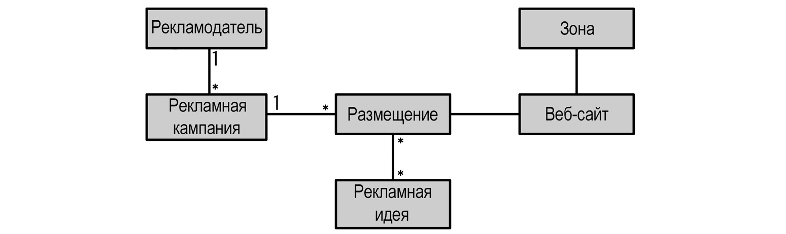{width="5.199023403324585in"
height="1.54in"}

> Рис. 5.4. Более сложная модель данных с отношениями «один ко многим» и
> «многие ко многим»

Работа с такими структурами данных с использованием транзакционного
сценария привела бы к большому объему повторяющегося кода: сопоставление
данных с их представлением в памяти будет дублироваться повсюду.

#### Реализация

В свою очередь, этим паттерном для представления сложных структур данных
ис- пользуются специальные объекты, известные как активные записи
(active records). Помимо структуры данных, в этих объектах также
реализуются методы доступа к данным для создания, чтения, обновления и
удаления записей --- так называемые CRUD-операции. В результате объекты
активных записей связаны с объектно- реляционным отображением
(object-relational mapping, ORM) или каким-либо дру- гим фреймворком
доступа к данным. Название паттерна дано на основании того факта, что
каждая структура данных является «активной», т. е. в нем реализуется
логика доступа к данным.

Как и в предыдущем паттерне, бизнес-логика системы организована в виде
тран- закционного сценария. Разница между этими двумя паттернами
заключается в том, что в данном случае вместо прямого доступа к базе
данных транзакционный сцена- рий манипулирует объектами активной записи.
По окончании сценария операция должна либо успешно завершиться, либо
дать сбой, т. е. вести себя как атомарная транзакция:

> ^2^ Fowler, M. Patterns of Enterprise Application Architecture.
> Boston: Addison-Wesley, 2002.
>
> 98 \| *Часть II. Тактический замысел*
>
> public class CreateUser
>
> {
>
> \...
>
> public void Execute(userDetails)
>
> {
>
> try
>
> {
>
> \_db.StartTransaction( );
>
> var user = new User( ); user.Name = userDetails.Name; user.Email =
> userDetails.Email; user.Save( );
>
> \_db.Commit( );
>
> } catch {
>
> \_db.Rollback( ); throw;
>
> }
>
> }
>
> }

Цель паттерна --- инкапсулировать сложность сопоставления объекта в
памяти на схему базы данных. Помимо того, что объекты активной записи
отвечают за опера- ции с хранилищем, они могут содержать бизнес-логику,
например выполнять про- верку новых значений, присваиваемых полям, или
даже заниматься реализацией бизнес-процедур, манипулирующих данными
объекта. При этом отличительной особенностью объекта активной записи
является разделение структур данных и поведения (бизнес-логики). Обычно
поля активной записи имеют общедоступные методы чтения и записи,
позволяющие внешним процедурам изменять их состоя- ние.

#### Когда следует применять активную запись

Поскольку по своей сути активная запись представляет собой
транзакционный сце- нарий, оптимизирующий доступ к базам данных, этот
паттерн может поддерживать только относительно простую бизнес-логику,
такую как CRUD-операции, которые в лучшем случае смогут проверить
пользовательский ввод.

Следовательно, паттерн активной записи, как и паттерн транзакционного
сценария, подходит для вспомогательных поддоменов, интеграции внешних
решений для универсальных поддоменов или для решения задач
преобразования модели. Разни- ца между паттернами заключается в том, что
активная запись решает задачу сопос- тавления сложных структур данных на
схему базы данных.

Паттерн активной записи также называют антипаттерном «анемичная модель»
предметной области или же неверно спроектированной моделью предметной
об- ласти. Я предпочитаю воздерживаться от негативного подтекста слов
«анемичный»

> *Глава 5. Реализация простой бизнес-логики* \| 99

и «антипаттерн». Этот паттерн является инструментом. Как и любой другой
инст- румент, он может решать поставленные перед ним задачи, но, если
его применять в неправильном месте, потенциально он может причинить
больше вреда, чем поль- зы. Если бизнес-логика не отличается особой
сложностью, то в использовании активных записей нет ничего плохого.
Кроме того, использование более сложного паттерна при реализации простой
бизнес-логики также нанесет вред, поскольку приведет к неоправданной
сложности. В следующей главе будет раскрыто понятие паттерна доменной
модели и показано, чем она отличается от паттерна активной записи.

> {width="0.4216666666666667in"
> height="0.5483333333333333in"}Важно подчеркнуть, что в данном
> контексте активная запись относится к паттерну проектирования, а не к
> фреймворку Active Record. Название паттерна было при- думано Мартином
> Фаулером (Martin Fowler) в книге «Patterns of Enterprise Application
> Architecture». Фреймворк появился позже в качестве одного из способов
> реализации паттерна. В контексте этой главы речь идет о паттерне
> проектирова- ния и концепциях, лежащих в его основе, а не о конкретной
> реализации.

### Придерживайтесь прагматичного подхода

Хотя бизнес-данные важны, а разрабатываемый и создаваемый код должен
обеспе- чивать их целостность, в некоторых случаях предпочтительнее
придерживаться прагматичного подхода.

Бывают случаи, когда гарантии согласованности данных могут быть
ослаблены, особенно при высоких требованиях масштабируемости. Проверьте,
действительно ли одна испорченная запись из миллиона является
непреодолимым препятствием для бизнеса и может ли она негативно повлиять
на эффективность и прибыльность бизнеса. Предположим, к примеру, что
создается система, которая ежедневно при- нимает миллиарды событий с
устройств Интернета вещей (IoT). Станет ли большой проблемой то
обстоятельство, при котором 0,001% событий будут продублированы или
утрачены?

Как всегда, универсальных законов просто не существует. Все зависит от
области бизнеса, в которой вы работаете. Можно «срезать углы» везде, где
это возможно, просто нужно убедиться, что рискам и последствиям для
бизнеса дана разумная оценка.

### Вывод

В этой главе были рассмотрены два паттерна для реализации бизнес-логики:

> *Транзакционный сценарий*
>
> Этот паттерн организует операции системы в виде простых и понятных
> проце- дурных сценариев. Процедуры гарантируют, что каждая операция
> является транзакционной --- либо успешной, либо неудачной. Паттерн
> транзакционного сценария подходит для вспомогательных поддоменов, а
> бизнес-логика напо-
>
> 100 \| *Часть II. Тактический замысел*
>
> минает простые операции, подобные извлечению-преобразованию-загрузке
> (extract-transform-load, ETL).
>
> *Активная запись*
>
> Когда бизнес-логика не отличается особой сложностью, но
> предусматривает ра- боту со сложными структурами данных, эти структуры
> можно реализовать в ви- де активных записей. Объект активной записи
> --- это структура данных, предос- тавляющая простые CRUD-методы
> доступа к данным.

Рассмотренные в этой главе два паттерна, ориентированы на случаи
применения сравнительно простой бизнес-логики. В следующей главе будет
рассмотрена более сложная бизнес-логика и предложены способы преодоления
дополнительных сложностей путем применения паттерна «модель предметной
области».

### Упражнения

1.  Каким из рассмотренных паттернов следует воспользоваться для
    реализации бизнес-логики основного поддомена?

> А) Транзакционный сценарий. Б) Активная запись.
>
> В) Для реализации основной подобласти не должен использоваться ни один
> из этих паттернов.
>
> Г) Для реализации основного поддомена могут использоваться оба
> паттерна.

2.  Посмотрите на следующий код:

> public void CreateTicket(TicketData data)
>
> {
>
> var agent = FindLeastBusyAgent( );
>
> agent.ActiveTickets = agent.ActiveTickets + 1; agent.Save( );
>
> var ticket = new Ticket( ); ticket.Id = Guid.New( ); ticket.Data =
> data; ticket.AssignedAgent = agent; ticket.Save( );
>
> \_alerts.Send(agent, \"You have a new ticket!\");
>
> }
>
> Если предположить отсутствие высокоуровневого механизма транзакций, то
> ка- кие потенциальные проблемы с согласованностью данных здесь могут
> обнару- житься?
>
> А) При получении нового регистрируемого запроса счетчик активных
> запросов назначенного агента может быть увеличен более чем на 1.
>
> *Глава 5. Реализация простой бизнес-логики* \| 101
>
> Б) Счетчик активных запросов агента может быть увеличен на единицу, но
> аген- ту не будут назначены новые регистрируемые запросы.
>
> В) Агент может получить новый запрос, но не будет об этом уведомлен.
> Г) Возможно возникновение всех вышеперечисленных проблем.

3.  В предыдущем коде есть по крайней мере еще один потенциальный
    крайний случай, способный внести разлад в состояние системы. Сможете
    ли вы его найти?

4.  Возвращаясь к упомянутому в предисловии примеру WolfDesk, скажите,
    какая часть системы потенциально может быть реализована в виде
    транзакционного сценария или же в виде активной записи?

ГЛАВА 6

## Проработка сложной бизнес-логики

В предыдущей главе были рассмотрены два паттерна (pattern) для
относительно простой бизнес-логики: транзакционный сценарий (transaction
script) и активная запись (active record). В этой главе тема реализации
бизнес-логики будет продол- жена представлением паттерна модели
предметной области (domain model), ориен- тированного на более сложную
бизнес-логику.

### Предыстория

Паттерн модели предметной области, как и паттерны транзакционного
сценария и активной записи, первоначально был представлен в книге
Мартина Фаулера (Martin Fowler) «Patterns of Enterprise Application
Architecture». Завершая обсуждение этого паттерна, Фаулер написал:
«Сейчас Эрик Эванс (Eric Evans) пишет книгу о созда- нии моделей
предметной области». Упомянутая им книга, «Domain Driven Design:
Tackling Complexity in the Heart of Software», стала основной работой
Эванса.

В своей книге Эванс представляет набор паттернов, нацеленных на тесную
связь кода с базовой моделью предметной области бизнеса: агрегаты,
объекты-значения, репозитории и т. д. Эти паттерны являются продолжением
того, на чем Фаулер остановился в своей книге, и похожи на эффективный
набор инструментов для реа- лизации паттерна модели предметной области.

Паттерны, представленные Эвансом, часто называют тактическими средствами
предметно-ориентированного проектирования. Чтобы не создавать
превратного представления, что реализация замыслов
предметно-ориентированного проектиро- вания неизбежно влечет
использование этих паттернов при реализации бизнес- логики, я
предпочитаю придерживаться исходной терминологии Фаулера. Паттер- ном
является «модель предметной области», а агрегаты и объекты-значения
явля- ются его строительными блоками.

### Модель предметной области (доменная модель)

Паттерн модели предметной области предназначен для сложной
бизнес-логики. Здесь вместо работы с CRUD-операциями решаются вопросы
сложных переходов между состояниями, бизнес-правилами и инвариантами, т.
е. незыблемыми прави- лами.

> *Глава 6. Проработка сложной бизнес-логики* \| 103

Предположим, что нами внедряется система технической поддержки
пользователей (help desk). Рассмотрим следующую выдержку из требований,
описывающую логи- ку управления жизненными циклами заявок в службу
поддержки:

- Клиенты открывают заявки в службу поддержки, описывая проблемы, с
  кото- рыми они сталкиваются.

- И клиент, и сотрудник службы поддержки добавляют сообщения, данная
  пере- писка может быть просмотрена в соответствующей заявке.

- У каждой заявки есть приоритет: низкий, средний, высокий или срочный.

- Сотрудник службы поддержки должен предложить решение в течение
  установ- ленного срока (set time limit, SLA), основанного на
  приоритете заявки.

- Если сотрудник не отвечает в SLA-срок, клиент может передать заявку
  руково- дителю сотрудника.

- Передача заявки на рассмотрение в более высокую инстанцию.

- Эскалация сокращает лимит времени ответа (SLA) сотрудника на 33%.

- Если сотрудник не открыл эскалированную заявку за половину времени,
  выде- ленного на ответ, она автоматически переназначается другому
  сотруднику.

- Заявки автоматически закрываются, если клиент не отвечает на вопросы
  сотруд- ника в течение семи дней.

- Эскалированные заявки не могут быть закрыты автоматически или самим
  со- трудником, это может сделать только клиент или руководитель
  сотрудника.

- Клиент может повторно открыть закрытую заявку только в том случае,
  если она была закрыта не более семи дней назад.

Эти требования образуют запутанную сеть зависимостей между различными
пра- вилами и влияют на логику управления жизненным циклом заявки в
службу под- держки. Это уже не просто CRUD-экран ввода данных,
рассмотренный в предыду- щей главе. Попытка реализовать эту логику с
использованием объектов активной записи, скорее всего, приведет к
многократным повторам и несогласованному состоянию системы из-за
неправильной реализации некоторых бизнес-правил.

#### Реализация

Модель предметной области --- это объектная модель, включающая в себя
как по-

> 1

ведение, так и данные . Строительными блоками такой объектной модели
являются

тактические паттерны DDD --- агрегаты (aggregates), объекты-значения
(value- objects), события предметной области (domain events) и доменные
сервисы (domain

2

services) .

> ^1^ Fowler, M. Patterns of Enterprise Application Architecture.
> Boston: Addison-Wesley, 2002.
>
> ^2^ Во всех примерах кода этой главы будет использоваться
> объектно-ориентированный язык программирова- ния. Но обсуждаемые
> концепции не ограничиваются ООП и в равной степени актуальны для
> парадигмы функционального программирования.
>
> 104 \| *Часть II. Тактический замысел*

Все эти паттерны имеют общую тему: они ставят бизнес-логику на первое
место. Давайте посмотрим, как с помощью модели предметной области
решаются различ- ные задачи проектирования.

###### Сложность {#сложность-2}

Бизнес-логика предметной области сложна уже по своей сути, поэтому
объекты, используемые для ее моделирования, не должны вносить никакой
дополнительной непреднамеренной сложности. Модель должна быть лишена
каких-либо инфра- структурных или технологических проблем, таких как
реализация обращений к ба- зам данных или другим внешним компонентам
системы. Это ограничение требует, чтобы объекты модели были простыми
обычными объектами, реализующими биз- нес-логику, не опирающимися на
какие-либо инфраструктурные компоненты или платформы и не включающими их
напрямую3.

###### Единый язык

Акцент на бизнес-логике, а не на технических аспектах упрощает
следование объ- ектами модели предметной области понятий единого языка
(ubiquitous language) ограниченного контекста (bounded context). Иными
словами, этот паттерн позволя- ет коду «говорить» на едином языке и
следовать ментальным моделям экспертов предметной области.

#### Строительные блоки

Давайте посмотрим на основные строительные блоки модели предметной
области или тактические паттерны, предлагаемые DDD: объекты-значения,
агрегаты и доменные сервисы.

###### Объект-значение

Объект-значение (value object) --- это объект, который можно
идентифицировать по составляющим его значениям. Рассмотрим, к примеру,
объект цвета:

> class Color
>
> {
>
> int \_red; int \_green; int \_blue;
>
> }

Цвет определяется композицией из значений трех полей: красного, зеленого
и си- него. Изменение значения одного из полей приведет к появлению
нового цвета. Два разных цвета не могут иметь одинаковых значений. Кроме
того, два экземпляра одного и того же цвета должны иметь одинаковые
значения. Следовательно, для идентификации цветов явного
идентификационного поля не требуется.

> ^3^ POCOs в .NET, POJOs в Java, POPOs в Python и т. д.
>
> *Глава 6. Проработка сложной бизнес-логики* \| 105

Поле ColorId, показанное на рис. 6.1, не только носит избыточный
характер, но и является почвой для ошибок. Можно создать две строки с
одинаковыми значения- ми red, green и blue, но сравнение значений
ColorId не покажет, что ими обозначен один и тот же цвет.

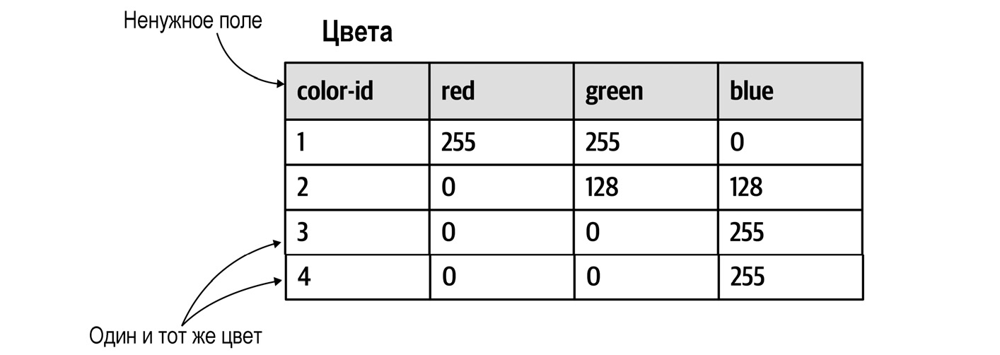{width="4.748620953630796in"
height="1.6733333333333333in"}

> Рис. 6.1. Избыточное поле ColorId, позволяющее иметь две строки с
> одинаковыми значениями

Единый язык. Если для представления понятий предметной области
полагаться исключительно на элементарные типы данных стандартной
библиотеки языка, та- кие как строки, целые числа или словари, то это
будет считаться одержимостью

> 4

примитивами . Рассмотрим, к примеру, следующий класс:

> class Person
>
> {
>
> private int \_id;
>
> private string \_firstName; private string \_lastName; private string
> \_landlinePhone; private string \_mobilePhone; private string \_email;
>
> private int \_heightMetric;
>
> private string \_countryCode;
>
> public Person(\...) {\...}
>
> }
>
> static void Main(string\[\] args)
>
> {
>
> var dave = new Person( id: 30217,
>
> firstName: \"Dave\", lastName: \"Ancelovici\", landlinePhone:
> \"023745001\",
>
> ^4^ «Primitive Obsession». (n.d.) Извлечено 13 июня 2021 года из
> статьи по адресу https://wiki.c2.com/?PrimitiveObsession.
>
> 106 \| *Часть II. Тактический замысел*
>
> mobilePhone: \"0873712503\", email:
> [\"dave@learning-ddd.com\",](mailto:dave@learning-ddd.com)
> heightMetric: 180,
>
> countryCode: \"BG\");
>
> }

В показанной выше реализации класса Person большинство значений имеют
тип String и присваиваются на основе соглашений. Например, передаваемый
стацио- нарный телефон, landlinePhone, должен быть действительным
номером стационар- ного телефона, а код страны, countryCode, должен быть
действительным двухбук- венным кодом страны в верхнем регистре. Конечно,
система не может доверять пользователю, полагая, что он всегда вводит
правильные значения, в результате класс должен проверять все поля ввода.

Такой подход сопряжен с многочисленными рисками проектирования.
Во-первых, логика проверки часто дублируется. Во-вторых, возникают
трудности с принуди- тельным вызовом логики проверки перед
использованием значений. А в будущем, когда кодовая база будет
развиваться силами других программистов, все только усложнится.

Сравните следующий альтернативный дизайн того же объекта, но на этот раз
с ис- пользованием объектов-значений:

> class Person {
>
> private PersonId \_id;
>
> private Name \_name;
>
> private PhoneNumber \_landline; private PhoneNumber \_mobile; private
> EmailAddress \_email; private Height \_height; private CountryCode
> \_country;
>
> public Person(\...) { \... }
>
> }
>
> static void Main(string\[\] args)
>
> {
>
> var dave = new Person(
>
> id: new PersonId(30217),
>
> name: new Name(\"Dave\", \"Ancelovici\"), landline:
> PhoneNumber.Parse(\"023745001\"), mobile:
> PhoneNumber.Parse(\"0873712503\"), email:
> Email.Parse([\"dave@learning-ddd.com\"),](mailto:dave@learning-ddd.com)
> height: Height.FromMetric(180),
>
> country: CountryCode.Parse(\"BG\"));
>
> }

Во-первых, обратите внимание на лучшую читаемость. Возьмем, к примеру,
пере- менную страны country. Чтобы сообщить, что в ней содержится код
страны, а не, скажем, ее полное название, уже не нужно включать
подробности в имя перемен-

> *Глава 6. Проработка сложной бизнес-логики* \| 107

ной в виде «countryCode». Объект-значение проясняет задуманное даже при
ис- пользовании более коротких имен переменных.

Во-вторых, нет необходимости проверять входные значения перед
присвоением, поскольку логика проверки находится в самих
объектах-значениях. Но поведение объекта-значения не ограничивается
простой проверкой входных значений. Особая ценность объектов-значений
проявляется при централизации бизнес-логики, рабо- тающей со значениями.
Связная логика реализована в одном месте и легко тестиру- ется. И что
наиболее важно, объекты-значения выражают концепции предметной области:
код начинает отражать в себе концепции единого языка.

Давайте посмотрим, как представление понятий высоты, телефонных номеров
и цветов в виде объектов-значений делает полученную в результате этого
систему типов богатой и интуитивно понятной в использовании.

По сравнению с целочисленным значением, объект-значение Height более
понятен и отвязывает показатель величины от конкретной единицы
измерения. Например, объект-значение Height может быть инициализирован с
использованием как метри- ческих, так и британских единиц, что упрощает
преобразование из одной единицы в другую, создание строкового
представления и сравнение значений в разных еди- ницах измерений:

> var heightMetric = Height.Metric(180);
>
> var heightImperial = Height.Imperial(5, 3);
>
> var string1 = heightMetric.ToString( ); // \"180cm\"
>
> var string2 = heightImperial.ToString( ); // \"5 feet 3 inches\"
>
> var string3 = heightMetric.ToImperial( ).ToString( ); // \"5 feet 11
> inches\"
>
> var firstIsHigher = heightMetric \> heightImperial; // true

Объект-значение PhoneNumber может инкапсулировать логику анализа
строкового значения, его проверки и извлечения различных атрибутов
номера телефона: на- пример, страны, которой он принадлежит, и типа
номера телефона --- стационар- ный или мобильный:

> var phone = PhoneNumber.Parse(\"+359877123503\");
>
> var country = phone.Country; // \"BG\"
>
> var phoneType = phone.PhoneType; // \"MOBILE\"
>
> var isValid = PhoneNumber.IsValid(\"+972120266680\"); // false

Следующий пример демонстрирует эффективность применения
объекта-значения, когда в нем инкапсулируется вся бизнес-логика, которая
манипулирует данными и создает новые экземпляры объекта-значения:

> var red = Color.FromRGB(255, 0, 0);
>
> var green = Color.Green;
>
> var yellow = red.MixWith(green);
>
> var yellowString = yellow.ToString( ); // \"#FFFF00\"

Из представленных выше примеров можно понять, что объекты-значения
устраня- ют необходимость в соглашениях, например необходимость помнить,
что эта стро-

> 108 \| *Часть II. Тактический замысел*

ка является адресом электронной почты, а вот эта строка --- номером
телефона, и вместе с тем делают использование объектной модели менее
подверженным раз- личным ошибкам и более интуитивно понятным.

Реализация. Поскольку изменение любого из полей объекта-значения
приводит к появлению другого значения, объекты-значения реализуются как
неизменяемые (immutable) объекты. Изменение одного из полей объекта
значения концептуально создает другое значение --- другой экземпляр
объекта-значения. Следовательно, когда выполненное действие приводит к
новому значению, как в следующем слу- чае, в котором используется метод
MixWith, оно не изменяет исходный экземпляр, а создает и возвращает
новый экземпляр:

> public class Color
>
> {
>
> public readonly byte Red; public readonly byte Green; public readonly
> byte Blue;
>
> public Color(byte r, byte g, byte b)
>
> {
>
> this.Red = r; this.Green = g; this.Blue = b;
>
> }
>
> public Color MixWith(Color other)
>
> {
>
> return new Color(
>
> r: (byte) Math.Min(this.Red + other.Red, 255),
>
> g: (byte) Math.Min(this.Green + other.Green, 255), b: (byte)
> Math.Min(this.Blue + other.Blue, 255)
>
> );
>
> }
>
> \...
>
> }

Поскольку равенство объектов-значений основано на составляющих их
значениях, а не на поле идентификатора или ссылке, важно переопределить
и правильно реа-

> 5

лизовать проверки на равенство. Например, на языке С# :

> public class Color
>
> {
>
> \...
>
> public override bool Equals(object obj)
>
> {
>
> var other = obj as Color;
>
> ^5^ В C# 9.0 запись нового типа реализует равенство на основе значений
> и, следовательно, не требует пере- определения операторов равенства.
>
> *Глава 6. Проработка сложной бизнес-логики* \| 109
>
> return other != null && this.Red == other.Red && this.Green ==
> other.Green && this.Blue == other.Blue;
>
> }
>
> public static bool operator == (Color lhs, Color rhs)
>
> {
>
> if (Object.ReferenceEquals(lhs, null)) {
>
> return Object.ReferenceEquals(rhs, null);
>
> }
>
> return lhs.Equals(rhs);
>
> }
>
> public static bool operator != (Color lhs, Color rhs)
>
> {
>
> return !(lhs == rhs);
>
> }
>
> public override int GetHashCode( )
>
> {
>
> return ToString( ).GetHashCode( );
>
> }
>
> \...
>
> }

Хотя использование для представления специфичных для предметной области
зна- чений типа String из базовой библиотеки противоречит понятию
объектов- значений, в .NET, Java и других языках строковый тип
реализован именно как объ- ект-значение. Строки неизменяемы, т. к. все
операции с ними приводят к созданию нового экземпляра. Кроме того, в
строковом типе инкапсулируется весьма разнооб- разное поведение,
приводящее к созданию новых экземпляров путем манипуляции со значениями
одной или нескольких строк. Это обрезка, объединение нескольких строк,
замена символов, выделение подстроки и другие методы.

Когда следует использовать объекты-значения. Ответ прост: при любой воз-
можности. Объекты-значения не только делают код более выразительным и
инкап- сулируют бизнес-логику, имеющую свойство дублироваться в разных
местах, но и само применение данного паттерна проектирования делает код
более безопасным. Поскольку объекты-значения неизменяемы, их поведение
не имеет побочных эф- фектов и является потокобезопасным.

С позиции бизнес-области полезным практическим правилом является
использова- ние объектов-значений для элементов предметной области,
описывающих свойства других объектов. В частности, это касается свойств
сущностей, рассматриваемых в следующем разделе. В ранее представленных
примерах для описания человека использовались объекты-значения: его
идентификатор, имя, номера телефонов, ад- рес электронной почты и т. д.
Другие примеры использования объектов-значений

> 110 \| *Часть II. Тактический замысел*

могут включать в себя различные состояния, пароли и другие понятия,
относящие- ся к предметной области бизнеса, допускающие идентификацию по
их значениям и, таким образом, не требующие явного присутствия поля
идентификации. Возмож- ность введения объекта-значения приобретает
особую важность при моделирова- нии денег и других денежных ценностей.
Использование элементарных типов для представления денег не только
ограничивает возможность инкапсуляции всей свя- занной с деньгами
бизнес-логики в одном месте, но также часто приводит к опас- ным ошибкам
при округлениях и к другим проблемам, связанным с точностью.

###### Сущности

Сущность является противоположностью объекта-значения. Для нее требуется
явно указанное поле идентификации, чтобы различать разные экземпляры
объекта. Эле- ментарным примером сущности является человек. Рассмотрим
следующий класс:

> class Person
>
> {
>
> public Name Name { get; set; }
>
> public Person(Name name)
>
> {
>
> this.Name = name;
>
> }
>
> }

Этот класс содержит только одно поле: name (объект-значение). Но такой
дизайн неоптимален, поскольку разные люди могут быть однофамильцами и
иметь абсо- лютно одинаковые имена. Это, конечно, не делает их одним и
тем же человеком. Следовательно, для правильной идентификации людей
необходимо поле иденти- фикации:

> class Person
>
> {
>
> public readonly PersonId Id;
>
> public Name Name { get; set; }
>
> public Person(PersonId id, Name name)
>
> {
>
> this.Id = id;
>
> this.Name = name;
>
> }
>
> }

В предыдущем коде было введено поле идентификации Id типа PersonId. А
PersonId --- объект-значение, и в нем можно использовать любые базовые
типы данных, соот- ветствующие потребностям предметной области.
Например, идентификатор Id может быть GUID-идентификатором, числом,
строкой или значением, зависящим от предметной области, например номером
социального страхования.

> *Глава 6. Проработка сложной бизнес-логики* \| 111

Основное требование к полю идентификации --- его уникальность для
каждого экземпляра сущности: в нашем случае для каждого человека (рис.
6.2). Кроме того, за очень редкими исключениями значение поля
идентификации объекта должно оставаться неизменным на протяжении всего
жизненного цикла объекта. Это под- водит нас ко второму концептуальному
различию между объектами-значениями и сущностями.

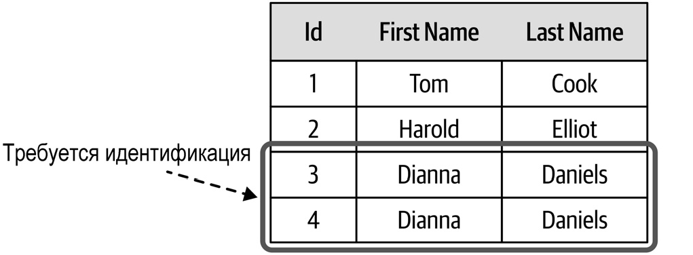{width="3.427217847769029in"
height="1.2533333333333334in"}

> Рис. 6.2. Введение явного поля идентификации, позволяющего различать
> экземпляры объекта, даже если значения всех других полей идентичны

В отличие от объектов-значений, сущности не являются неизменяемыми и
коррек- тируются вполне ожидаемым образом. Еще одно различие между
сущностями и объектами-значениями заключается в том, что
объекты-значения описывают свой- ства сущности. Ранее в этой главе уже
встречалась сущность Person с двумя объек- тами-значениями, описывающими
каждый экземпляр: PersonId и Name.

Сущности являются важным строительным блоком любой предметной области.
Тем не менее не трудно было заметить, что ранее в этой главе в список
строитель- ных блоков модели предметной области «сущность» не
включалась. Это не ошиб- ка. Причина, по которой «сущность» не
упоминалась, заключается в том, что сущ- ности реализуются не сами по
себе, а только в контексте паттерна агрегата.

###### Агрегаты

Агрегат --- это тоже сущность: для него требуется явное поле
идентификации, и ожидается, что его состояние в течение жизненного цикла
экземпляра будет из- меняться. Но это куда более широкое понятие, чем
просто сущность. Целью этого паттерна является защита согласованности
его данных. Поскольку данные агрегата могут изменяться, существуют
последствия и проблемы, которые паттерн должен решать для сохранения
согласованности своего состояния.

Соблюдение согласованности. Поскольку состояние агрегата может быть
измене- но, это открывает массу возможностей повреждения его данных.
Чтобы обеспечить согласованность данных, паттерн агрегата проводит
четкую границу между агрега- том и «внешним миром»: агрегат является
границей обеспечения согласованности. Логика агрегата должна проверять
все входящие модификации и гарантировать не- противоречивость изменений
его бизнес-правилам.

С точки зрения реализации согласованность обеспечивается тем, что
изменять со- стояние агрегата может исключительно его собственная
бизнес-логика. Всем внеш-

> 112 \| *Часть II. Тактический замысел*

ним по отношению к агрегату процессам или объектам разрешено только лишь
чтение состояния агрегата. Его состояние можно изменить, только лишь
выполнив соответствующие методы открытого интерфейса агрегата.

Методы изменения состояния, представленные в открытом интерфейсе
агрегата, часто называют командами (command), например «командой сделать
что-то». Команда может быть реализована двумя способами. Во-первых, ее
можно реализо- вать как простой открытый метод агрегатного объекта:

> public class Ticket
>
> {
>
> \...
>
> public void AddMessage(UserId from, string body)
>
> {
>
> var message = new Message(from, body);
>
> \_messages.Append(message);
>
> }
>
> \...
>
> }

В качестве альтернативы команда может быть представлена как
объект-параметр, инкапсулирующий все входные данные, необходимые для
выполнения команды:

> public class Ticket
>
> {
>
> \...
>
> public void Execute(AddMessage cmd)
>
> {
>
> var message = new Message(cmd.from, cmd.body);
>
> \_messages.Append(message);
>
> }
>
> \...
>
> }

То, как команды выражаются в коде агрегата, зависит от предпочтений
разработчи- ка. Лично я предпочитаю более явный способ определения
структур команд и их полиморфную передачу соответствующему методу
Execute.

Открытый интерфейс агрегата отвечает за проверку входных значений и
соблюде- ние всех соответствующих бизнес-правил и инвариантов. Эта
строгая граница так- же гарантирует, что вся бизнес-логика, связанная с
агрегатом, реализована в одном месте: в самом агрегате.

> 6

Это делает слой приложения (application layer) , который управляет
операциями над

7

агрегатами, довольно простым : ему нужно всего лишь загрузить текущее
состоя-

> ^6^ Известный также как сервисный слой (service layer), он является
> частью системы, перенаправляющей дей- ствия открытого API в модель
> предметной области.
>
> *Глава 6. Проработка сложной бизнес-логики* \| 113

ние агрегата, выполнить требуемое действие, сохранить измененное
состояние и вернуть результат операции вызывающему коду:

> 01 public ExecutionResult Escalate(TicketId id, EscalationReason
> reason) 02 {

+------+-----+------------------------------------+
| > 03 |     | > try                              |
+:====:+=====+====================================+
| > 04 |     | > {                                |
+------+-----+------------------------------------+
| > 05 |     | > var ticket =                     |
|      |     | > \_ticketRepository.Load(id);     |
+------+-----+------------------------------------+
| > 06 |     | > var cmd = new Escalate(reason);  |
+------+-----+------------------------------------+
| > 07 |     | > ticket.Execute(cmd);             |
+------+-----+------------------------------------+
| > 08 |     | > \_ticketRepository.Save(ticket); |
+------+-----+------------------------------------+
| > 09 |     | > return ExecutionResult.Success(  |
|      |     | > );                               |
+------+-----+------------------------------------+
| > 10 |     | > }                                |
+------+-----+------------------------------------+
| > 11 |     | > catch (ConcurrencyException ex)  |
+------+-----+------------------------------------+
| > 12 |     | > {                                |
+------+-----+------------------------------------+
| > 13 |     | > return                           |
|      |     | > ExecutionResult.Error(ex);       |
+------+-----+------------------------------------+
| > 14 |     | > }                                |
+------+-----+------------------------------------+
| > 15 | > } |                                    |
+------+-----+------------------------------------+

Обратите внимание на проверку конкурентного доступа (concurrency check)
в пре- дыдущем коде (строка 11). Крайне важно защитить согласованность
состояния

> 8

агрегата . Если один и тот же агрегат обновляет сразу несколько
процессов, нужно

предотвратить слепую перезапись последней транзакцией тех изменений, что
зафиксированы первой транзакцией. В этом случае второй процесс должен
быть уведомлен о том, что состояние, на котором он основывал свои
решения, устарело, и он должен повторить свою операцию.

Следовательно, база данных, используемая для хранения агрегатов, должна
под- держивать управление конкурентным доступом. В своей простейшей
форме агрегат должен содержать поле версии, значение которого будет
расти после каждого обновления:

> class Ticket
>
> {
>
> TicketId \_id; int \_version;
>
> \...
>
> }

При фиксации изменения в базе данных нужно убедиться, что
перезаписываемая версия соответствует той, которая была первоначально
прочитана. Например, в ко- де на SQL:

> 7
>
> По сути, операции уровня приложения реализуют паттерн транзакционного
> сценария. Он должен органи-
>
> зовать операцию как атомарную транзакцию. Изменения всего агрегата
> либо завершаются успешно, либо дают сбой, но никогда не фиксируют
> частично обновленное состояние.
>
> 8
>
> Напомним, что уровень приложения представляет собой набор
> транзакционных сценариев, и, как уже
>
> упоминалось в *главе 5*, управление конкурентным доступом необходимо
> для предотвращения повреждения данных системы конкурирующими
> обновлениями.
>
> 114 \| *Часть II. Тактический замысел*
>
> 01 UPDATE tickets
>
> 02 SET ticket_status = \@new_status, 03 agg_version = agg_version + 1
>
> 04 WHERE ticket_id=@id and agg_version=@expected_version;

Этот SQL-оператор применяет изменения, внесенные в состояние экземпляра
агре- гата (строка 2), и увеличивает показание его счетчика версий
(строка 3), но делает это только в том случае, когда текущая версия
равна той, которая была прочитана до применения изменений к состоянию
агрегата (строка 4).

Конечно, управление конкурентным доступом, помимо реляционной базы
данных, может быть реализовано где угодно. Кроме того, для работы с
агрегатами больше подходят документоориентированные базы данных. При
этом крайне важно убе- диться, что база данных, используемая для
хранения данных агрегата, поддержива- ет управление конкурентным
доступом.

Граница транзакции. Поскольку состояние агрегата может быть изменено
только его собственной бизнес-логикой, агрегат также действует как
границы транзакции. Все изменения состояния агрегата должны быть
зафиксированы транзакцией, т. е. одной атомарной операцией. Если
состояние агрегата изменено, то фиксируются либо все изменения, либо ни
одно из них.

Кроме того, ни одна системная операция не может предполагать проведение
муль- тиагрегатной транзакции. Изменение состояния агрегата может быть
зафиксирова- но только индивидуально, за одну транзакцию базы данных
должен изменяться только один агрегат.

Один экземпляр агрегата на каждую транзакцию заставляет тщательно
проектиро- вать границы агрегата, гарантируя, что дизайн учитывает
инварианты и правила бизнес-области. Необходимость фиксации изменений
сразу в нескольких агрегатах сигнализирует о неправильно выбранных
границах транзакции и, следовательно, о неправильных границах агрегата.

Похоже, тем самым накладываются ограничения на моделирование. А что если
нужно в одной транзакции изменить сразу несколько объектов? Давайте
посмот- рим, как такие ситуации решаются в паттерне.

Иерархия сущностей. Как уже упоминалось в этой главе, сущности
используются исключительно как часть агрегата, а не в качестве
независимого паттерна. Давайте посмотрим на фундаментальное различие
между сущностями и агрегатами, а также на то, почему сущности являются
строительными блоками агрегата, а не общей мо- дели предметной области.

Существуют бизнес-сценарии, в которых общую транзакционную границу
должны иметь сразу несколько объектов, например когда одновременно могут
быть изме- нены оба объекта или же бизнес-правила одного объекта зависят
от состояния дру- гого объекта.

В DDD предписывается, что дизайн системы должен определяться ее
предметной областью. Агрегаты не исключение. Для поддержки изменений
сразу нескольких объектов, которые должны быть применены в рамках одной
атомарной транзакции,

> *Глава 6. Проработка сложной бизнес-логики* \| 115

паттерн агрегата уподобляется иерархии сущностей, где, как показано на
рис. 6.3, все они без исключений имеют общую транзакционную
согласованность.

Иерархия содержит как сущности, так и объекты-значения, и если они
связаны биз- нес-логикой предметной области, то все они принадлежат
одному и тому же агре- гату.

{width="4.785063429571304in"
height="1.1466666666666667in"}

> Рис. 6.3. Агрегат как иерархия сущностей

Вот почему паттерн называется «агрегат»: он объединяет бизнес-сущности и
объ- екты-значения, находящиеся в рамках одной и той же границы
транзакции.

В следующем примере кода демонстрируется бизнес-правило, охватывающее
сразу несколько сущностей, входящих в границы агрегата: «Если агент не
открыл эска- лированную заявку в течение 50% времени ответа, она
автоматически переназнача- ется другому агенту»:

> 01 public class Ticket 02 {

+------+-----+---------------------------------------------+
| > 03 |     | > \...                                      |
+:====:+=====+=============================================+
| > 04 |     | > List\<Message\> \_messages;               |
+------+-----+---------------------------------------------+
| > 05 |     | > \...                                      |
+------+-----+---------------------------------------------+
| > 06 |     |                                             |
+------+-----+---------------------------------------------+
| > 07 |     | > public void                               |
|      |     | > Execute(EvaluateAutomaticActions cmd)     |
+------+-----+---------------------------------------------+
| > 08 |     | > {                                         |
+------+-----+---------------------------------------------+
| > 09 |     | > if (this.IsEscalated &&                   |
|      |     | > this.RemainingTimePercentage \< 0.5 &&    |
+------+-----+---------------------------------------------+
| > 10 |     | > GetUnreadMessagesCount(for:               |
|      |     | > AssignedAgent) \> 0)                      |
+------+-----+---------------------------------------------+
| > 11 |     | > {                                         |
+------+-----+---------------------------------------------+
| > 12 |     | > \_agent = AssignNewAgent( );              |
+------+-----+---------------------------------------------+
| > 13 |     | > }                                         |
+------+-----+---------------------------------------------+
| > 14 |     | > }                                         |
+------+-----+---------------------------------------------+
| > 15 |     |                                             |
+------+-----+---------------------------------------------+
| > 16 |     | > public int GetUnreadMessagesCount(UserId  |
|      |     | > id)                                       |
+------+-----+---------------------------------------------+
| > 17 |     | > {                                         |
+------+-----+---------------------------------------------+
| > 18 |     | > return \_messages.Where(x =\> x.To == id  |
|      |     | > && !x.WasRead).Count( );                  |
+------+-----+---------------------------------------------+
| > 19 |     | > }                                         |
+------+-----+---------------------------------------------+
| > 20 |     |                                             |
+------+-----+---------------------------------------------+
| > 21 |     | > \...                                      |
+------+-----+---------------------------------------------+
| > 22 | > } |                                             |
+------+-----+---------------------------------------------+

В методе проверяется значение заявки, чтобы определить, эскалирована она
или нет и не осталось ли меньше времени на обработку, чем заданный порог
в 50%

> 116 \| *Часть II. Тактический замысел*

(строка 9). Кроме того, в нем проверяются сообщения, которые еще не были
прочи- таны текущим агентом (строка 10). Если все условия соблюдены,
запрашивается переназначение заявки другому агенту.

Агрегат гарантирует, что все проверки выполняются на строго
согласованных дан- ных и что эти данные не изменятся после завершения
проверки, т. к. все изменения в данных агрегата будут выполнены в виде
одной атомарной транзакции.

Ссылки на другие агрегаты. Поскольку все объекты, содержащиеся в
агрегате, имеют одну и ту же транзакционную границу, то если агрегат
станет слишком большим, могут возникнуть проблемы производительности и
масштабируемости.

Непротиворечивость данных может быть удобным руководящим принципом для
проектирования границ агрегата. В состав агрегата должна входить только
та ин- формация, которая требуется по бизнес-логике агрегата для строгой
согласованно- сти данных. Вся информация, которая может быть согласована
по прошествии не- которого времени (согласованность в конечном счете,
eventual consistency), должна находиться за пределами агрегата,
например, как показано на рис. 6.4, в качестве части другого агрегата.

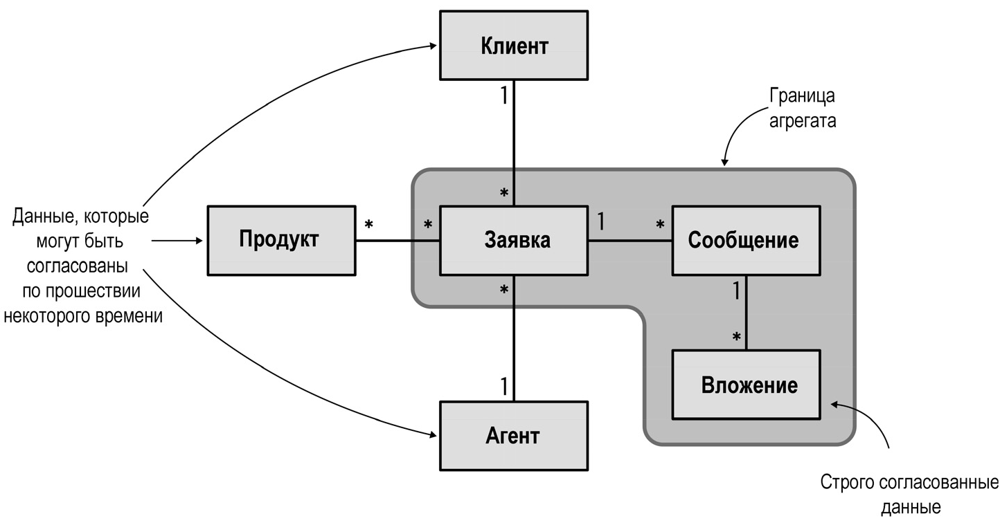{width="4.8442202537182855in"
height="2.5299989063867017in"}

> Рис. 6.4. Агрегат как граница согласованности

Следует придерживаться того правила, чтобы агрегаты были как можно
меньше и включали только те объекты, которые в соответствии с
бизнес-логикой агрегата должны находиться в строго согласованном
состоянии:

> public class Ticket
>
> {
>
> private UserId \_customer;
>
> private List\<ProductId\> \_products; private UserId \_assignedAgent;
> private List\<Message\> \_messages;
>
> \...
>
> }
>
> *Глава 6. Проработка сложной бизнес-логики* \| 117

В предыдущем примере агрегат Ticket ссылается на список сообщений,
входящих в границы агрегата. А вот клиент, набор продуктов, относящихся
к заявке, и назна- ченный агент не принадлежат агрегату, и
следовательно, ссылки на них идут по их идентификаторам.

Замысел использования ссылки на внешние агрегаты по идентификатору
состоит в том, чтобы подтвердить, что эти объекты не находятся в
границах агрегата, и га- рантировать наличие у каждого агрегата своей
собственной транзакционной гра- ницы.

Чтобы решить, принадлежит сущность агрегату или нет, следует проверить,
содер- жит ли агрегат бизнес-логику, которая может привести к
недопустимому состоя- нию системы при работе с данными по принципу
согласованности в конечном сче- те. Вернемся к предыдущему примеру
переназначения заявки, если текущий агент не прочитал новые сообщения в
течение 50% отведенного на ответ лимита време- ни. Что получилось бы при
достижении согласованности всей информации о про- читанных-непрочитанных
сообщениях по прошествии некоторого времени? Иными словами, было бы
разумным получать подтверждения о прочтении после некоторой задержки. В
данном же случае можно с уверенностью утверждать, что значитель- ное
количество заявок было бы переназначено без необходимости. Это, конечно,
испортило бы состояние системы. Следовательно, данные о сообщениях
находятся в границах агрегата.

Корень агрегата. Нам уже известно, что состояние агрегата можно изменить
толь- ко путем выполнения одной из его команд. Поскольку агрегат
представляет собой иерархию сущностей, то, как показано на рис. 6.5, в
качестве общедоступного ин- терфейса агрегата --- его корня, должна быть
назначена только одна из них.

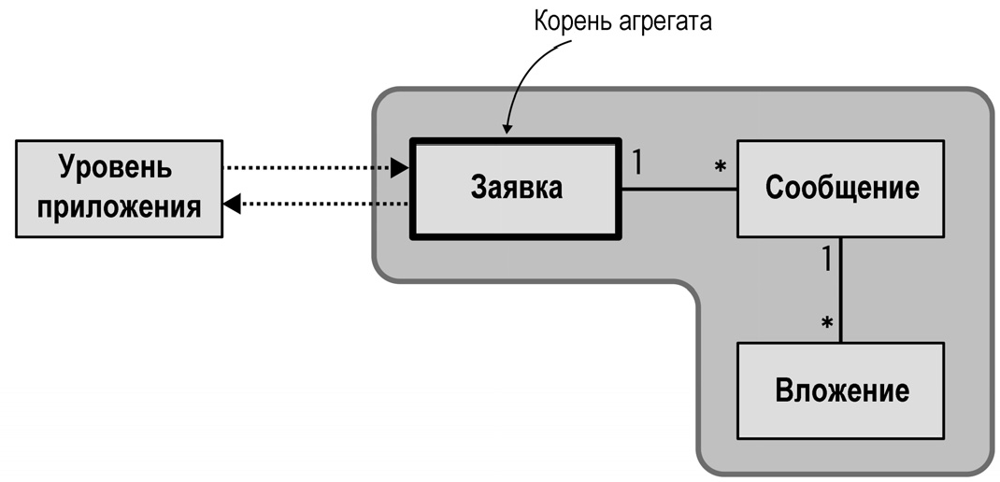{width="3.5997134733158354in"
height="1.72in"}

> Рис. 6.5. Корень агрегата

Рассмотрим следующий фрагмент агрегата Ticket:

> public class Ticket
>
> {
>
> \...
>
> List\<Message\> \_messages;
>
> \...
>
> public void Execute(AcknowledgeMessage cmd)
>
> 118 \| *Часть II. Тактический замысел*
>
> {
>
> var message = \_messages.Where(x =\> x.Id == cmd.id).First( );
> message.WasRead = true;
>
> }
>
> \...
>
> }

В этом примере агрегат предоставляет команду, позволяющую пометить
конкрет- ное сообщение как прочитанное. Хотя операция изменяет экземпляр
объекта Message, он доступен только через его корень агрегата: Ticket.

В дополнение к открытому интерфейсу корня агрегата существует еще один
меха- низм, с помощью которого внешний мир может взаимодействовать с
агрегатами: события предметной области.

События предметной области. Событие предметной области --- это сообщение
с описанием важного события, произошедшего в бизнес-области. Например:

- Заявка назначена.

- Заявка эскалирована.

- Сообщение получено.

Поскольку события предметной области описывают то, что уже произошло, их
на- звания следует формулировать в прошедшем времени.

Цель события предметной области (domain event) --- дать описание тому,
что про- изошло в предметной области, и предоставить все необходимые
данные, связанные с событием. Например, следующее событие предметной
области сообщает, что конкретная заявка была эскалирована с указанием
времени и причины, по которой это произошло:

> {
>
> \"ticket-id\": \"c9d286ff-3bca-4f57-94d4-4d4e490867d1\", \"event-id\":
> 146,
>
> \"event-type\": \"ticket-escalated\", \"escalation-reason\":
> \"missed-sla\", \"escalation-time\": 1628970815
>
> }

Как и почти во всем в сфере программирования, присваивание имен играет
немало- важную роль. Следует убедиться, что имена событий предметной
области точно отражают то, что происходит в предметной области.

События предметной области являются частью публичного интерфейса
агрегата, который публикует события своей предметной области. Как
показано на рис. 6.6, другие процессы, агрегаты или даже внешние системы
могут подписываться на со- бытия предметной области и выполнять в ответ
на них свою собственную логику.

В следующем фрагменте кода агрегата Ticket создается экземпляр нового
события предметной области (строка 12), который добавляется к набору
событий предмет- ной области заявки (строка 13):

> 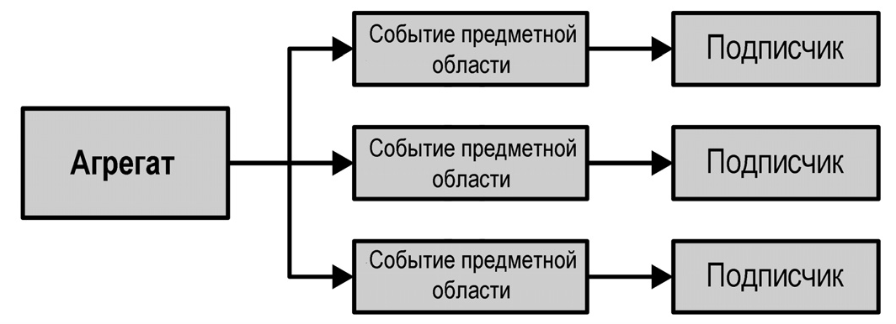{width="3.5675360892388452in"
> height="1.2866655730533683in"}*Глава 6. Проработка сложной
> бизнес-логики* \| 119
>
> Рис. 6.6. Процесс публикации событий предметной области
>
> 01 public class Ticket 02 {
>
> 03 \...
>
> 04 private List\<DomainEvent\> \_domainEvents; 05 \...
>
> 06
>
> 07 public void Execute(RequestEscalation cmd) 08 {
>
> 09 if (!this.IsEscalated && this.RemainingTimePercentage \<= 0)
>
> 10 {
>
> 11 this.IsEscalated = true;
>
> 12 var escalatedEvent = new TicketEscalated(\_id, cmd.Reason);
>
> 13 \_domainEvents.Append(escalatedEvent);
>
> 14 }
>
> 15 }
>
> 16
>
> 17 \...
>
> 18 }

Возможности надежной публикации событий предметной области для
заинтересо- ванных подписчиков будут рассмотрены в *главе 9*.

Единый язык (ubiquitous language). И последнее, но от этого не менее
важное: агрегаты должны отражать единый язык. Термины, используемые для
имени агре- гата, его элементов данных, его действий и его событий
предметной области, должны быть сформулированы на едином языке
ограниченного контекста. Как выразился Эрик Эванс, код должен быть
основан на том же языке, на котором раз- работчики разговаривают друг с
другом и с экспертами предметной области. Это играет особую роль при
реализации сложной бизнес-логики.

А теперь давайте взглянем на третий и последний строительный блок
паттерна

«модель предметной области».

###### Доменные сервисы (domain service)

Со временем можно столкнуться с бизнес-логикой, которая либо не
принадлежит ни одному агрегату или объекту-значению, либо представляется
имеющей отноше- ние сразу к нескольким агрегатам. В таких случаях
предметно-ориентированное проектирование предлагает реализовать логику в
виде доменного сервиса.

> 120 \| *Часть II. Тактический замысел*

Доменный сервис --- это объект без состояния, в котором реализуется
бизнес- логика. В подавляющем большинстве случаев такая логика является
организатором обращений к различным компонентам системы для выполнения
каких-либо вычис- лений или проведения анализа.

Вернемся к нашему примеру с агрегатом заявок. Вспомним, что у
назначенного агента есть ограниченный срок предложения решения клиенту.
Этот срок зависит не только от данных заявки (ее приоритета и статуса
эскалации), но и от политики отдела агента в отношении установленного
срока (SLA) для каждого приоритета и графика работы агента (смены) ---
не следует ждать, что агент ответит в нерабочее время.

Логика расчета сроков ответа требует получения информации сразу из
нескольких источников: от заявки, от отдела назначенного агента и от
графика работы. Полу- чается просто идеальный кандидат для реализации в
качестве службы предметной области:

> public class ResponseTimeFrameCalculationService
>
> {
>
> \...
>
> public ResponseTimeframe CalculateAgentResponseDeadline(UserId
> agentId, Priority priority, bool escalated, DateTime startTime)
>
> {
>
> var policy = \_departmentRepository.GetDepartmentPolicy(agentId);
>
> var maxProcTime = policy.GetMaxResponseTimeFor(priority);
>
> if (escalated) {
>
> maxProcTime = maxProcTime \* policy.EscalationFactor;
>
> }
>
> var shifts = \_departmentRepository.GetUpcomingShifts(agentId,
> startTime, startTime.Add(policy.MaxAgentResponseTime));
>
> return CalculateTargetTime(maxProcTime, shifts);
>
> }
>
> \...
>
> }

Доменные сервисы упрощают координацию работы сразу нескольких агрегатов.
Но при этом важно не забывать об ограничениях агрегата, касающихся
изменений только одного экземпляра агрегата за одну транзакцию базы
данных. Доменные сервисы не создают лазейку для обхода этого
ограничения. Правило одного экзем- пляра за транзакцию остается в силе.
Вместо этого доменные сервисы позволяют реализовать логику вычислений,
требующую чтения данных сразу нескольких агрегатов.

Также важно отметить, что службы предметной области не имеют ничего
общего с микросервисами, сервисно-ориентированной архитектурой или с
почти что любым другим использованием слов «служба» или «сервис» в сфере
разработки

> *Глава 6. Проработка сложной бизнес-логики* \| 121

программных систем. Это просто объект без состояния, используемый для
разме- щения бизнес-логики.

#### Управление сложностью

В начале этой главы уже говорилось, что паттерны агрегатов и
объектов-значений были введены как средства преодоления сложности при
реализации бизнес-логики. Давайте посмотрим, так ли это на самом деле.

В своей книге «The Choice» гуру управления бизнесом Элияху М. Голдратт
(Eliyahu M. Goldratt) дает емкое, но весьма эффектное определение
сложности сис- темы. Согласно Голдратту, при рассмотрении вопроса
сложности системы основ- ное внимание уделяется оценке сложности
контроля поведения системы и предска- занию этого поведения. Эти два
аспекта отражаются в степенях свободы системы.

Степени свободы системы --- это опорные точки описания ее состояния.
Рассмот- рим следующие два класса:

> public class ClassA
>
> {
>
> public int A { get; set; } public int B { get; set; } public int C {
> get; set; } public int D { get; set; } public int E { get; set; }
>
> }
>
> public class ClassB
>
> {
>
> private int \_a, \_d;
>
> public int A
>
> {
>
> get =\> \_a; set {
>
> \_a = value;
>
> B = value / 2;
>
> C = value / 3;
>
> }
>
> }
>
> public int B { get; private set; } public int C { get; private set; }
> public int D
>
> {
>
> get =\> \_d;
>
> []{#вывод-4 .anchor}122 \| *Часть II. Тактический замысел*
>
> set {
>
> \_d = value;
>
> E = value \* 2
>
> }
>
> }
>
> public int E { get; private set; }
>
> }

На первый взгляд ClassB представляется несколько сложнее, чем ClassA. У
него та- кое же число переменных, но вдобавок к ним в нем выполняются
дополнительные вычисления. Так всё же он сложнее, чем ClassA, или нет?

Давайте проанализируем оба класса с точки зрения степеней свободы.
Сколько элементов данных нужно для описания состояния ClassA? Ответ ---
пять: это пять его переменных. Следовательно, у ClassA пять степеней
свободы.

Сколько элементов данных нужно для описания состояния ClassB? Если
посмотреть на логику присвоения значений свойствам A и D, то можно
заметить, что значения B, C и E являются функциями значений A и D. Если
знать, что такое A и D, можно вывес- ти значения остальных переменных.
Следовательно, у ClassB только две степени свободы. И для описания его
состояния нужно всего два значения.

Возвращаясь к первоначальному вопросу: поведение какого из классов
сложнее поддается контролю и предсказанию? Ответ --- того, у которого
больше степеней свободы, или ClassA. Инварианты, введенные в ClassB,
уменьшают его сложность. Именно это и делают паттерны агрегатов и
объектов-значений: инкапсулируют ин- варианты, уменьшая таким образом
сложность.

Вся бизнес-логика, связанная с состоянием объекта-значения, находится в
его гра- ницах. То же самое справедливо и для агрегатов. Агрегат может
быть изменен только его собственными методами. Его бизнес-логика
инкапсулирует и защищает бизнес-инварианты, уменьшая тем самым степень
свободы.

Поскольку паттерн модели предметной области применяется только для
поддоме- нов со сложной бизнес-логикой, можно с уверенностью
предположить, что местом его применения являются основной поддомен (core
subdomain) --- сердце про- граммной системы.

### Вывод {#вывод-5}

Паттерн модели предметной области предназначен для случаев сложной
бизнес- логики. Он состоит из трех основных строительных блоков:

> *Объектов-значений*
>
> Это понятия бизнес-области, которые могут быть идентифицированы
> исключи- тельно по своим значениям, в силу чего им не требуется явное
> использование поля идентификатора. Поскольку изменение одного из полей
> семантически соз- дает новое значение, объекты-значения не подлежат
> изменениям.
>
> []{#упражнения-5 .anchor}*Глава 6. Проработка сложной бизнес-логики*
> \| 123
>
> Объекты-значения моделируют не только данные, но и поведение: методы,
> управляющие значениями и тем самым инициализирующие новые объекты-
> значения.
>
> *Агрегатов*
>
> Это иерархии сущностей, имеющих общую транзакционную границу. Для реа-
> лизации бизнес-логики агрегата все данные, включенные в его границы,
> должны быть строго согласованы.
>
> Состояние агрегата и его внутренних объектов можно изменять только
> через публичный интерфейс путем выполнения команд агрегата. Для
> внешних компо- нентов, чтобы гарантировать, что вся бизнес-логика,
> связанная с агрегатом, находится в его границах, поля данных доступны
> только для чтения.
>
> Агрегат выступает в качестве транзакционной границы. Все его данные,
> вклю- чая все имеющиеся в нем внутренние объекты, должны быть
> сохранены в базе данных в одной атомарной транзакции.
>
> Агрегат может взаимодействовать с внешними объектами, публикуя события
> предметной области --- сообщения, описывающие важные бизнес-события в
> жизненном цикле агрегата. Другие компоненты могут подписываться на
> собы- тия и использовать их для запуска действий бизнес-логики.
>
> *Доменных сервисов*
>
> Это объект без состояния, содержащий бизнес-логику, которая по
> естественным причинам не принадлежит ни к одному из агрегатов или
> объектов-значений модели предметной области.

Строительные блоки модели предметной области справляются со сложной
бизнес- логикой, инкапсулируя ее в границах объектов-значений и
агрегатов. Отсутствие возможности изменять состояние объектов извне
гарантирует, что вся соответст- вующая бизнес-логика реализована в
границах агрегатов и объектов-значений и не будет дублироваться на
уровне приложения.

В следующей главе будут рассмотрены расширенные способы реализации
паттерна модели предметной области, где теперь уже неотъемлемой частью
модели станет время.

### Упражнения {#упражнения-6}

1.  Какое из следующих утверждений справедливо?

> А) Объекты-значения могут содержать только данные. Б) Объекты-значения
> могут содержать только поведение. В) Объекты-значения не подлежат
> изменениям.
>
> Г) Состояние объектов-значений может изменяться.

2.  Каков общий руководящий принцип проектирования границы агрегата?

> А) Агрегат может содержать только одну сущность, поскольку только один
> экземпляр агрегата может быть включен в одну транзакцию базы данных.
>
> 124 \| *Часть II. Тактический замысел*
>
> Б) Агрегаты должны быть как можно меньшего размера с неизменным
> выполне- нием требований о согласованности данных бизнес-области.
>
> В) Агрегаты представляют собой иерархию сущностей. Поэтому, чтобы
> обеспе- чить максимальную согласованность данных системы, агрегаты
> должны разра- батываться с максимально широким охватом данных.
>
> Г) Все зависит от конкретных обстоятельств: для одних предметных
> областей лучше создавать небольшие агрегаты, а другие наиболее
> эффективно будут работать с агрегатами как можно большего объема.

3.  Почему в одной транзакции может быть зафиксировано состояние только
    одно- го экземпляра агрегата?

> А) Чтобы модель могла работать под высокой нагрузкой. Б) Для
> обеспечения правильных транзакционных границ. В) Такого требования
> нет; все зависит от бизнес-области.
>
> Г) Чтобы можно было работать с базами данных, не поддерживающими тран-
> закций, охватывающих сразу несколько записей, например с хранилищами
> типа
>
> «ключ-значение» и документоориентированными базами данных.

4.  Какое из следующих утверждений лучше всего описывает отношения между
    строительными блоками модели предметной области?

> А) Объекты-значения описывают свойства сущностей.
>
> Б) Объекты-значения могут генерировать события предметной области. В)
> Агрегат содержит одну или несколько сущностей.
>
> Г) А и В.

5.  Какое из следующих утверждений о различиях между активными записями
    и агрегатами верно?

> А) Активные записи содержат только данные, тогда как агрегаты также
> содер- жат поведение.
>
> Б) Агрегат инкапсулирует всю свою бизнес-логику, а бизнес-логика,
> управляю- щая активной записью, может находиться за ее пределами.
>
> В) Агрегаты содержат только данные, а активные записи содержат как
> данные, так и поведение.
>
> Г) Агрегат содержит набор активных записей.

ГЛАВА 7

## Моделирование фактора времени

В предыдущей главе был рассмотрен паттерн модели предметной области: его
строительные блоки, назначение и прикладной контекст. Паттерн модели
предмет- ной области, основанной на событиях (event-sourced domain
model), придерживает- ся тех же предпосылок, что и паттерн простой
модели предметной области. В нем такая же сложная бизнес-логика,
принадлежащая основному поддомену (core subdomain). Более того, в нем
используются те же тактические паттерны, что и в модели предметной
области: объекты-значения (value object), агрегаты (aggregate) и события
предметной области (domain events).

Разница между этими паттернами реализации заключается в способе
сохранения состояния агрегатов. В модели предметной области, основанной
на событиях, для управления состояниями агрегатов используется паттерн
«События как источник данных» (Event Sourcing): вместо сохранения
состояния агрегата модель генерирует события предметной области,
описывающие каждое изменение, и использует их в качестве доверенного
источника данных для агрегата.

Эта глава начинается с введения понятия «События как источник данных»
(Event Sourcing). Затем мы рассмотрим, как эта модель объединяется с
паттерном модели предметной области, что превращает ее в модель
предметной области, основанную на событиях (event-sourced domain model).

### События как источник данных (Event Sourcing)

> Покажите мне вашу блок-схему и спрячьте свои таблицы, и я так ничего и
> не пойму. А покажите мне ваши таблицы, и мне вряд ли уже понадобится
> ваша блок-схема, все будет как на ладони.
>
> -- *Фред Брукс (Fred Brooks)*^1^

Чтобы дать определение паттерну «События как источник данных» (Event
Sourcing) и понять, чем он отличается от традиционного моделирования и
сохранения дан- ных, давайте воспользуемся рассуждениями Фреда Брукса.
Изучите табл. 7.1 и по- старайтесь понять, к каким выводам о системе, к
которой она принадлежит, можно прийти на ее основе.

Понятно, что таблица используется для управления потенциальными клиен-
тами или лидами в системе телемаркетинга. Для каждого лида можно увидеть
его

> ^1^ Brooks, F. P. Jr. The Mythical Man-Month: Essays on Software
> Engineering. Reading, MA: Addison-Wesley, 1974.
>
> 126 \| *Часть II. Тактический замысел*
>
> *Таблица 7.1. Модель, основанная на состоянии*

+---------+--------------+-------------+-------------------+------------+----------------+----------------+----------------+
| > lead- | > first-name | > last-     | > status          | > phone-   | > followup-on  | > created-on   | > updated-on   |
| > id    |              | > name      |                   | > number   |                |                |                |
+:=======:+==============+=============+===================+:==========:+================+================+================+
| > 1     | > Sean       | > Callahan  | > CONVERTED       | > 555-1246 |                | > 2019-01-31T  | > 2019-01-31T  |
|         |              |             |                   |            |                | >              | >              |
|         |              |             |                   |            |                | > 10:02:40.32Z | > 10:02:40.32Z |
+---------+--------------+-------------+-------------------+------------+----------------+----------------+----------------+
| > 2     | > Sarah      | > Estrada   | > CLOSED          | > 555-4395 |                | > 2019-03-29T  | > 2019-03-29T  |
|         |              |             |                   |            |                | >              | >              |
|         |              |             |                   |            |                | > 22:01:41.44Z | > 22:01:41.44Z |
+---------+--------------+-------------+-------------------+------------+----------------+----------------+----------------+
| > 3     | > Stephanie  | > Brown     | > CLOSED          | 555-1176   |                | > 2019-04-15T  | > 2019-04-15T  |
|         |              |             |                   |            |                | >              | >              |
|         |              |             |                   |            |                | > 23:08:45.59Z | > 23:08:45.59Z |
+---------+--------------+-------------+-------------------+------------+----------------+----------------+----------------+
| > 4     | > Sami       | > Calhoun   | > CLOSED          | 555-1850   |                | > 2019-04-25T  | > 2019-04-25T  |
|         |              |             |                   |            |                | >              | >              |
|         |              |             |                   |            |                | > 05:42:17.07Z | > 05:42:17.07Z |
+---------+--------------+-------------+-------------------+------------+----------------+----------------+----------------+
| > 5     | > William    | > Smith     | > CONVERTED       | > 555-3013 |                | > 2019-05-14T  | > 2019-05-14T  |
|         |              |             |                   |            |                | >              | >              |
|         |              |             |                   |            |                | > 04:43:57.51Z | > 04:43:57.51Z |
+---------+--------------+-------------+-------------------+------------+----------------+----------------+----------------+
| > 6     | > Sabri      | > Chan      | > NEW_LEAD        | 555-2900   |                | > 2019-06-19T  | > 2019-06-19T  |
|         |              |             |                   |            |                | >              | >              |
|         |              |             |                   |            |                | > 15:01:49.68Z | > 15:01:49.68Z |
+---------+--------------+-------------+-------------------+------------+----------------+----------------+----------------+
| > 7     | > Samantha   | > Espinosa  | > NEW_LEAD        | > 555-8861 |                | > 2019-07-17T  | > 2019-07-17T  |
|         |              |             |                   |            |                | >              | >              |
|         |              |             |                   |            |                | > 13:09:59.32Z | > 13:09:59.32Z |
+---------+--------------+-------------+-------------------+------------+----------------+----------------+----------------+
| > 8     | > Hani       | > Cronin    | > CLOSED          | 555-3018   |                | > 2019-10-09T  | > 2019-10-09T  |
|         |              |             |                   |            |                | >              | >              |
|         |              |             |                   |            |                | > 11:40:17.13Z | > 11:40:17.13Z |
+---------+--------------+-------------+-------------------+------------+----------------+----------------+----------------+
| > 9     | > Sian       | > Espinoza  | > FOLLOWUP_SET    | > 555-6461 | > 2019-12-04T  | > 2019-12-04T  | > 2019-12-04T  |
|         |              |             |                   |            | >              | >              | >              |
|         |              |             |                   |            | > 01:49:08.05Z | > 01:49:08.05Z | > 01:49:08.05Z |
+---------+--------------+-------------+-------------------+------------+----------------+----------------+----------------+
| > 10    | > Sophia     | > Escamilla | > CLOSED          | > 555-4090 |                | > 2019-12-06T  | > 2019-12-06T  |
|         |              |             |                   |            |                | >              | >              |
|         |              |             |                   |            |                | > 09:12:32.56Z | > 09:12:32.56Z |
+---------+--------------+-------------+-------------------+------------+----------------+----------------+----------------+
| > 11    | > William    | > White     | > FOLLOWUP_SET    | > 555-1187 | > 2020-01-23T  | > 2020-01-23T  | > 2020-01-23T  |
|         |              |             |                   |            | >              | >              | >              |
|         |              |             |                   |            | > 00:33:13.88Z | > 00:33:13.88Z | > 00:33:13.88Z |
+---------+--------------+-------------+-------------------+------------+----------------+----------------+----------------+
| > 12    | > Casey      | > Davis     | > CONVERTED       | > 555-8101 |                | > 2020-05-20T  | > 2020-05-27T  |
|         |              |             |                   |            |                | >              | >              |
|         |              |             |                   |            |                | > 09:52:55.95Z | > 12:38:44.12Z |
+---------+--------------+-------------+-------------------+------------+----------------+----------------+----------------+
| > 13    | > Walter     | > Connor    | > NEW_LEAD        | > 555-4753 |                | > 2020-04-20T  | > 2020-04-20T  |
|         |              |             |                   |            |                | >              | >              |
|         |              |             |                   |            |                | > 06:52:55.95Z | > 06:52:55.95Z |
+---------+--------------+-------------+-------------------+------------+----------------+----------------+----------------+
| > 14    | > Sophie     | > Garcia    | > CONVERTED       | > 555-1284 |                | > 2020-05-06T  | > 2020-05-06T  |
|         |              |             |                   |            |                | >              | >              |
|         |              |             |                   |            |                | > 18:47:04.70Z | > 18:47:04.70Z |
+---------+--------------+-------------+-------------------+------------+----------------+----------------+----------------+
| > 15    | > Sally      | > Evans     | > PAYMENT_FAILED  | > 555-3230 |                | > 2020-06-04T  | > 2020-06-04T  |
|         |              |             |                   |            |                | >              | >              |
|         |              |             |                   |            |                | > 14:51:06.15Z | > 14:51:06.15Z |
+---------+--------------+-------------+-------------------+------------+----------------+----------------+----------------+
| > 16    | > Scott      | > Chatman   | > NEW_LEAD        | > 555-6953 |                | > 2020-06-09T  | > 2020-06-09T  |
|         |              |             |                   |            |                | >              | >              |
|         |              |             |                   |            |                | > 09:07:05.23Z | > 09:07:05.23Z |
+---------+--------------+-------------+-------------------+------------+----------------+----------------+----------------+
| > 17    | > Stephen    | > Pinkman   | > CONVERTED       | > 555-2326 |                | > 2020-07-20T  | > 2020-07-20T  |
|         |              |             |                   |            |                | >              | >              |
|         |              |             |                   |            |                | > 00:56:59.94Z | > 00:56:59.94Z |
+---------+--------------+-------------+-------------------+------------+----------------+----------------+----------------+
| > 18    | > Sara       | > Elliott   | > PENDING_PAYMENT | > 555-2620 |                | > 2020-08-12T  | > 2020-08-12T  |
|         |              |             |                   |            |                | >              | >              |
|         |              |             |                   |            |                | > 17:39:43.25Z | > 17:39:43.25Z |
+---------+--------------+-------------+-------------------+------------+----------------+----------------+----------------+
| > 19    | > Sadie      | > Edwards   | > FOLLOWUP_SET    | > 555-8163 | > 2020-10-22T  | > 2020-10-22T  | > 2020-10-22T  |
|         |              |             |                   |            | >              | >              | >              |
|         |              |             |                   |            | > 12:40:03.98Z | > 12:40:03.98Z | > 12:40:03.98Z |
+---------+--------------+-------------+-------------------+------------+----------------+----------------+----------------+
| > 20    | > William    | > Smith     | > PENDING_PAYMENT | > 555-9273 |                | > 2020-11-13T  | > 2020-11-13T  |
|         |              |             |                   |            |                | >              | >              |
|         |              |             |                   |            |                | > 08:14:07.17Z | > 08:14:07.17Z |
+---------+--------------+-------------+-------------------+------------+----------------+----------------+----------------+

> *Глава 7. Моделирование фактора времени* \| 127

идентификатор, имя и фамилию, дату создания и обновления записи, номер
теле- фона и текущий статус.

Изучив различные статусы, мы также можем предположить, через какой цикл
об- работки проходит каждый потенциальный клиент:

- Продажи начинаются с потенциального клиента в статусе NEW_LEAD.

- Обращение по телефону может закончиться тем, что человек не
  заинтересован в предложении (лид CLOSED), собирается позвонить еще раз
  (FOLLOWUP_SET) или примет предложение о продаже (PENDING_PAYMENT).

- Если платеж прошел успешно, лид преобразуется в клиента --- CONVERTED.
  В про- тивном случае платеж может не пройти --- PAYMENT_FAILED.

Вполне солидный объем информации, который можно извлечь путем простого
ана- лиза схемы таблицы и хранящихся в ней данных. Можно даже
предположить, ка- кой единый язык (ubiquitous language) использовался
при моделировании данных. Но какой информации все же не хватает в этой
таблице?

Данные таблицы документируют текущее состояние лидов, но в ней
отсутствует информация о том, как каждый лид достиг своего текущего
состояния. Мы не мо- жем проанализировать, что происходило в течение
жизненного цикла лидов. Мы не знаем, сколько звонков было сделано до
того, как лид стал CONVERTED. Была ли по- купка совершена сразу или был
долгий путь продаж? И стоит ли, опираясь на исто- рические данные,
пытаться связаться с человеком после нескольких последующих обращений
или все же разумнее закрыть лид и перейти к более перспективному
потенциальному клиенту? Такой информации там нет. Все, что мы знаем, ---
это текущее состояние потенциальных клиентов.

Поставленные вопросы отражают интересы бизнеса, необходимые для
оптимиза- ции процесса продаж. С точки зрения бизнеса крайне важно вести
анализ данных и оптимизировать процесс на основе полученного опыта. Один
из способов заполне- ния недостающей информации заключается в
использовании событий в качестве источника для текущего состояния (Event
Sourcing).

Паттерн «События как источник данных» (Event Sourcing) вводит в модель
данных фактор времени. Вместо схемы, отражающей текущее состояние
агрегатов, систе- ма, в которой источником текущего состояния являются
события, сохраняет собы- тия, фиксирующие каждое изменение в жизненном
цикле агрегата.

Рассмотрим CONVERTED-клиента в строке 12 таблицы 7.1. В следующем
листинге показано, как данные человека будут представлены в системе,
основанной на собы- тиях:

> {
>
> \"lead-id\": 12,
>
> \"event-id\": 0,
>
> \"event-type\": \"lead-initialized\", \"first-name\": \"Casey\",
>
> \"last-name\": \"David\",
>
> 128 \| *Часть II. Тактический замысел*
>
> \"phone-number\": \"555-2951\", \"timestamp\":
> \"2020-05-20T09:52:55.95Z\"
>
> },
>
> {
>
> \"lead-id\": 12,
>
> \"event-id\": 1,
>
> \"event-type\": \"contacted\", \"timestamp\":
> \"2020-05-20T12:32:08.24Z\"
>
> },
>
> {
>
> \"lead-id\": 12,
>
> \"event-id\": 2,
>
> \"event-type\": \"followup-set\",
>
> \"followup-on\": \"2020-05-27T12:00:00.00Z\", \"timestamp\":
> \"2020-05-20T12:32:08.24Z\"
>
> },
>
> {
>
> \"lead-id\": 12,
>
> \"event-id\": 3,
>
> \"event-type\": \"contact-details-updated\", \"first-name\":
> \"Casey\",
>
> \"last-name\": \"Davis\",
>
> \"phone-number\": \"555-8101\", \"timestamp\":
> \"2020-05-20T12:32:08.24Z\"
>
> },
>
> {
>
> \"lead-id\": 12,
>
> \"event-id\": 4,
>
> \"event-type\": \"contacted\", \"timestamp\":
> \"2020-05-27T12:02:12.51Z\"
>
> },
>
> {
>
> \"lead-id\": 12,
>
> \"event-id\": 5,
>
> \"event-type\": \"order-submitted\",
>
> \"payment-deadline\": \"2020-05-30T12:02:12.51Z\", \"timestamp\":
> \"2020-05-27T12:02:12.51Z\"
>
> },
>
> {
>
> \"lead-id\": 12,
>
> \"event-id\": 6,
>
> \"event-type\": \"payment-confirmed\", \"status\": \"converted\",
>
> \"timestamp\": \"2020-05-27T12:38:44.12Z\"
>
> }

События, отображенные в листинге, рассказывают об истории клиента. Лид
был создан в системе (событие 0), и примерно через два часа с ним
связался торговый

> *Глава 7. Моделирование фактора времени* \| 129

агент (событие 1). В ходе звонка было оговорено, что продавец перезвонит
через неделю (событие 2), но на другой номер телефона (событие 3). Также
продавец ис- правил опечатку в фамилии (событие 3). В согласованные дату
и время с лидом связались (событие 4) и отправили заказ (событие 5).
Заказ должен был быть опла- чен через три дня (событие 5), но оплата
поступила примерно через полчаса (собы- тие 6), а лид конвертировался в
нового покупателя.

Как уже ранее стало понятно, состояние клиента можно легко спроецировать
по этим событиям предметной области. Нужно всего лишь последовательно
приме- нить простую логику преобразования к каждому событию:

> public class LeadSearchModelProjection
>
> {
>
> public long LeadId { get; private set; }
>
> public HashSet\<string\> FirstNames { get; private set; } public
> HashSet\<string\> LastNames { get; private set; }
>
> public HashSet\<PhoneNumber\> PhoneNumbers { get; private set; }
> public int Version { get; private set; }
>
> public void Apply(LeadInitialized \@event)
>
> {
>
> LeadId = \@event.LeadId;
>
> FirstNames = new HashSet\<string\>(); LastNames = new
> HashSet\<string\>(); PhoneNumbers = new HashSet\<PhoneNumber\>();
> [FirstNames.Add(@event.FirstName);](mailto:FirstNames.Add(@event.FirstName)
> [LastNames.Add(@event.LastName);](mailto:LastNames.Add(@event.LastName)
> [PhoneNumbers.Add(@event.PhoneNumber);](mailto:PhoneNumbers.Add(@event.PhoneNumber)
> Version = 0;
>
> }
>
> public void Apply(ContactDetailsChanged \@event)
>
> {
>
> [FirstNames.Add(@event.FirstName);](mailto:FirstNames.Add(@event.FirstName)
> [LastNames.Add(@event.LastName);](mailto:LastNames.Add(@event.LastName)
> [PhoneNumbers.Add(@event.PhoneNumber);](mailto:PhoneNumbers.Add(@event.PhoneNumber)
> Version += 1;
>
> }
>
> public void Apply(Contacted \@event)
>
> {
>
> Version += 1;
>
> }
>
> public void Apply(FollowupSet \@event)
>
> {
>
> Version += 1;
>
> }
>
> 130 \| *Часть II. Тактический замысел*
>
> public void Apply(OrderSubmitted \@event)
>
> {
>
> Version += 1;
>
> }
>
> public void Apply(PaymentConfirmed \@event)
>
> {
>
> Version += 1;
>
> }
>
> }

Итерация по событиям агрегата и их последовательная передача в
соответствую- щий переопределенный метод Apply создаст точно такое же
представление состоя- ния, которое смоделировано в таблице 7.1.

Обратите внимание на поле версии Version, значение которого
увеличивается после применения каждого события. Его значение
представляет собой общее количество модификаций, внесенных в
бизнес-сущность. Более того, предположим, что мы применили к агрегату
только некоторое подмножество событий. В таком случае появляется
возможность «путешествия во времени»: обращаясь только лишь к со-
ответствующим событиям, можно спроецировать состояние сущности в любой
момент его жизненного цикла. Например, если нужно получить состояние
объекта в версии 5, можно обратиться только к первым пяти событиям.

И наконец, мы не ограничены только одной проекцией состояния! Рассмотрим
сле- дующие сценарии.

#### Поиск

Представим, что возникла необходимость в реализации поиска. Но,
поскольку кон- тактная информация потенциального клиента (лида) --- имя,
фамилия и номер телефона --- может быть обновлена, агенты по продажам
могут не знать об измене- ниях, внесенных другими агентами, и могут
захотеть найти потенциальных клиен- тов, пользуясь своей контактной
информацией, включая ранее зафиксированные значения. Хронологическая
информация легко может быть спроецирована:

> public class LeadSearchModelProjection
>
> {
>
> public long LeadId { get; private set; }
>
> public HashSet\<string\> FirstNames { get; private set; } public
> HashSet\<string\> LastNames { get; private set; }
>
> public HashSet\<PhoneNumber\> PhoneNumbers { get; private set; }
> public int Version { get; private set; }
>
> public void Apply(LeadInitialized \@event)
>
> {
>
> LeadId = \@event.LeadId;
>
> FirstNames = new HashSet\<string\>(); LastNames = new
> HashSet\<string\>();
>
> *Глава 7. Моделирование фактора времени* \| 131
>
> PhoneNumbers = new HashSet\<PhoneNumber\>();
> [FirstNames.Add(@event.FirstName);](mailto:FirstNames.Add(@event.FirstName)
> [LastNames.Add(@event.LastName);](mailto:LastNames.Add(@event.LastName)
> [PhoneNumbers.Add(@event.PhoneNumber);](mailto:PhoneNumbers.Add(@event.PhoneNumber)
> Version = 0;
>
> }
>
> public void Apply(ContactDetailsChanged \@event)
>
> {
>
> [FirstNames.Add(@event.FirstName);](mailto:FirstNames.Add(@event.FirstName)
> [LastNames.Add(@event.LastName);](mailto:LastNames.Add(@event.LastName)
> [PhoneNumbers.Add(@event.PhoneNumber);](mailto:PhoneNumbers.Add(@event.PhoneNumber)
> Version += 1;
>
> }
>
> public void Apply(Contacted \@event)
>
> {
>
> Version += 1;
>
> }
>
> public void Apply(FollowupSet \@event)
>
> {
>
> Version += 1;
>
> }
>
> public void Apply(OrderSubmitted \@event)
>
> {
>
> Version += 1;
>
> }
>
> public void Apply(PaymentConfirmed \@event)
>
> {
>
> Version += 1;
>
> }
>
> }

Для заполнения соответствующих наборов личных данных лида в логике
проекции используются события LeadInitialized и ContactDetailsChanged.
Другие события игнорируются, т. к. они не влияют на состояние конкретной
модели.

Применение этой логики проецирования к событиям Кейси Дэвиса (Casey
Davis) из предыдущего примера приведет к следующему состоянию:

> LeadId: 12 FirstNames: \[\'Casey\'\]
>
> LastNames: \[\'David\', \'Davis\'\] PhoneNumbers: \[\'555-2951\',
> \'555-8101\'\]
>
> Version: 6
>
> 132 \| *Часть II. Тактический замысел*

#### Анализ

Отдел бизнес-аналитики вашей компании просит предоставить более удобное
для анализа представление данных о потенциальных клиентах. Для своего
текущего исследования они хотят получить количество последующих звонков,
запланиро- ванных для разных лидов. Позже они будут фильтровать данные о
конверсиях и закрытых лидах и использовать модель для оптимизации
процесса продаж. Давайте спроецируем запрашиваемые ими данные:

> public class AnalysisModelProjection
>
> {
>
> public long LeadId { get; private set; } public int Followups { get;
> private set; } public LeadStatus Status { get; private set; } public
> int Version { get; private set; }
>
> public void Apply(LeadInitialized \@event)
>
> {
>
> LeadId = \@event.LeadId; Followups = 0;
>
> Status = LeadStatus.NEW_LEAD; Version = 0;
>
> }
>
> public void Apply(Contacted \@event)
>
> {
>
> Version += 1;
>
> }
>
> public void Apply(FollowupSet \@event)
>
> {
>
> Status = LeadStatus.FOLLOWUP_SET; Followups += 1;
>
> Version += 1;
>
> }
>
> public void Apply(ContactDetailsChanged \@event)
>
> {
>
> Version += 1;
>
> }
>
> public void Apply(OrderSubmitted \@event)
>
> {
>
> Status = LeadStatus.PENDING_PAYMENT; Version += 1;
>
> }
>
> *Глава 7. Моделирование фактора времени* \| 133
>
> public void Apply(PaymentConfirmed \@event)
>
> {
>
> Status = LeadStatus.CONVERTED; Version += 1;
>
> }
>
> }

Показанная выше логика поддерживает счетчик количества появлений
последую- щих звонков в событиях лида. Если применить эту проекцию, к
примеру, с собы- тиями агрегата, она сгенерирует следующее состояние:

> LeadId: 12
>
> Followups: 1 Status: Converted Version: 6

Логика, реализованная в предыдущих примерах, проецирует модели,
оптимизиро- ванные для поиска и анализа, в память. Но для фактической
реализации требуемой функциональности спроецированные модели необходимо
сохранить в базе данных. Паттерн, позволяющий это сделать: разделение
ответственности команд и запросов (CQRS), будет рассмотрен в *главе 8*.

#### Источник истины

Чтобы паттерн «События как источник данных» работал, все изменения
состояния объекта должны быть представлены и сохранены как события. Эти
события стано- вятся для системы источником истины (отсюда и название
паттерна). Этот процесс показан на рис. 7.1.

{width="4.729026684164479in"
height="1.13in"}

> Рис. 7.1. Агрегат, основанный на событиях

База данных, в которой хранятся системные события, --- это единственное
строго согласованное хранилище: системный источник истины. Базу данных,
используе- мую для сохранения событий, принято называть *хранилищем
событий (event store)*.

#### Хранилище событий

Хранилище событий (event store) не должно разрешать изменять или удалять
собы-

> 2

тия , поскольку оно предназначено только для их хранения. Для поддержки
реали-

> ^2^ Кроме исключительных случаев, таких как миграция данных.
>
> 134 \| *Часть II. Тактический замысел*

зации паттерна «События как источник данных» хранилище событий должно
под- держивать как минимум следующие операции: извлечение всех событий,
принад- лежащих определенной бизнес-сущности, и добавление событий.
Например:

> interface IEventStore
>
> {
>
> IEnumerable\<Event\> Fetch(Guid instanceId);
>
> void Append(Guid instanceId, Event\[\] newEvents, int
> expectedVersion);
>
> }

Аргумент expectedVersion метода Append необходим для реализации
оптимистичного управления конкурентным доступом: при добавлении новых
событий указывается также версия сущности, на которой основаны ваши
решения. Если сущность уста- рела, т. е. после ожидаемой версии были
добавлены новые события, хранилище событий должно порождать исключение
(ошибку) конкурентного доступа.

В большинстве систем для реализации паттерна CQRS требуются
дополнительные эндпоинты, речь о который пойдет в следующей главе.

> {width="0.4216666666666667in"
> height="0.5483333333333333in"}По своей сути, паттерн «События как
> источник данных» не является чем-то новым. Финансовая индустрия
> использует события для представления изменений в бух- галтерском
> реестре. Реестр --- это журнал, предназначенный только для добавле-
> ния записей, в котором документируются транзакции. Текущее состояние
> (напри- мер, баланс счета) всегда можно вывести путем «проецирования»
> записей реестра.

### Модель предметной области, основанная на событиях

Исходная модель предметной области работает через отображение состояния
своих агрегатов и порождает события предметной области. Модель
предметной области, основанная на событиях, использует события
предметной области исключительно для моделирования жизненных циклов
агрегатов. Все изменения состояния агрега- та должны быть выражены в
виде событий предметной области.

Сценарий, по которому проводится каждая операция с агрегатом, основанным
на событиях, имеет следующий вид:

- Загрузка событий предметной области агрегата.

- Воссоздание состояния --- проецирование событий в представление
  состояния, которое может быть использовано для принятия
  бизнес-решений.

- Выполнение команды бизнес-логики агрегата и, следовательно, порождение
  но- вых событий предметной области.

- Фиксация новых событий предметной области в хранилище событий (event
  store).

Возвращаясь к коду примера с агрегатом Ticket из *главы 6*, давайте
посмотрим на его реализацию в качестве агрегата на основе событий.

> *Глава 7. Моделирование фактора времени* \| 135

Прикладной слой следует сценарию, описанному выше: загружает
соответствую- щие события заявки, восстанавливает экземпляр агрегата,
вызывает соответствую- щую команду (command) и сохраняет изменения в
базе данных:

> 01 public class TicketAPI 02 {
>
> 03 private ITicketsRepository \_ticketsRepository; 04 \...
>
> 05
>
> 06 public void RequestEscalation(TicketId id, EscalationReason reason)
> 07 {
>
> 08 var events = \_ticketsRepository.LoadEvents(id); 09 var ticket =
> new Ticket(events);

10. var originalVersion = ticket.Version;

11. var cmd = new RequestEscalation(reason);

12. ticket.Execute(cmd);

13. \_ticketsRepository.CommitChanges(ticket, originalVersion);

> 14 }
>
> 15
>
> 16 \...
>
> 17 }

Согласно логике восстановления агрегата Ticket в конструкторе (строки с
27-й по 31-ю), создается экземпляр класса проекции состояния,
TicketState, и для каждо- го из событий заявки последовательно
вызывается его метод AppendEvent:

18. public class Ticket

19. {

20. \...

21. private List\<DomainEvent\> \_domainEvents = new
    List\<DomainEvent\>();

22. private TicketState \_state;

23. \...

> 24

25. public Ticket(IEnumerable\<IDomainEvents\> events)

26. {

27. \_state = new TicketState();

28. foreach (var e in events)

29. {

30. AppendEvent(e);

> 31 }
>
> 32 }

AppendEvent передает входящие события в логику проекции TicketState,
создавая тем самым в памяти представление текущего состояния заявки:

33. private void AppendEvent(IDomainEvent \@event)

34. {

35. \_domainEvents.Append(@event);

> 136 \| *Часть II. Тактический замысел*

36. // Вызов в динамическом режиме нужного переопределения метода
    \"Apply\".

37. ((dynamic)state).Apply((dynamic)@event);

> 38 }

В отличие от реализации, показанной в предыдущей главе, метод
RequestEscalation принадлежащий агрегату, чье состояние
восстанавливается на основе событий, явным образом флаг IsEscalated в
значение true не устанавливает. Вместо этого он выдает соответствующее
событие и передает его методу AppendEvent (строки 43 и 44):

39. public void Execute(RequestEscalation cmd)

40. {

41. if (!\_state.IsEscalated && \_state.RemainingTimePercentage \<= 0)

42. {

43. var escalatedEvent = new TicketEscalated(\_id, cmd.Reason);

44. AppendEvent(escalatedEvent);

> 45 }
>
> 46 }
>
> 47

48. \...

49. }

Все события, добавленные в коллекцию событий агрегата, передаются в
логику проекции состояния в классе TicketState, где значения
соответствующих полей изменяются согласно данным событий:

50. public class TicketState

51. {

52. public TicketId Id { get; private set; }

53. public int Version { get; private set; }

54. public bool IsEscalated { get; private set; }

55. \...

56. public void Apply(TicketInitialized \@event)

57. {

58. Id = \@event.Id;

59. Version = 0;

60. IsEscalated = false;

61. \....

> 62 }
>
> 63
>
> 64 public void Apply(TicketEscalated \@event)
>
> 65 {
>
> 66 IsEscalated = true;
>
> 67 Version += 1;
>
> 68 }
>
> 69
>
> 70 \...
>
> 71 }
>
> *Глава 7. Моделирование фактора времени* \| 137

А теперь давайте рассмотрим преимущества использования паттерна «События
как источник данных» (Event Sourcing) при реализации сложной
бизнес-логики.

> Почему выбрано название «Модель предметной области, основанная на
> событиях»?
>
> Видимо, стоит объяснить, почему здесь используется понятие «модель
> предметной области, основанная на событиях» (Event-sourced domain
> model), а не просто «События как источник данных» (Event Sourcing).
> Использование событий для представления переходов между со- стояниями,
> т. е. паттерна «События как источник данных» (Event Sourcing),
> возможно как со строительными блоками модели предметной области, так и
> без них. Поэтому я предпочитаю в более долгосрочной перспективе явно
> указывать, что мы используем события для пред- ставления изменений в
> жизненных циклах агрегатов модели предметной области (event- sourced
> domain model).

#### Преимущества

По сравнению с более традиционной моделью, в которой текущие состояния
агре- гатов сохраняются в базе данных, модель предметной области,
основанная на со- бытиях (event-sourced domain model), требует для
моделирования агрегатов боль- шего объема работы. Но этот подход дает
существенные преимущества, которые делают его достойным рассмотрения во
многих сценариях:

> *Путешествие во времени*
>
> События предметной области можно использовать не только для
> восстановле- ния текущего состояния агрегата, но и для восстановления
> всех прошлых со- стояний агрегата. Иными словами, все прошлые
> состояния агрегата всегда мож- но восстановить.
>
> Такое часто делается при анализе поведения системы, проверке решений
> систе- мы и оптимизации бизнес-логики.
>
> Другим распространенным вариантом использования для восстановления
> про- шлых состояний является ретроспективная отладка: агрегат можно
> вернуть в то самое состояние, в котором он находился, когда была
> обнаружена ошибка.
>
> *Глубокое понимание сути происходящего*
>
> В первой части этой книги была показана стратегическая важность для
> бизнеса оптимизации основных поддоменов. Использование событий в
> качестве источ- ника данных (Event Sourcing) обеспечивает глубокое
> понимание состояния и по- ведения системы. Как уже говорилось в этой
> главе, паттерн «События как ис- точник данных» (Event Sourcing)
> предоставляет гибкую модель, позволяющую выполнять преобразования
> событий в различные представления состояния: в любой момент для
> получения дополнительной информации на основе про- шедших событий
> можно будет добавить аналитические оценки.
>
> *Журнал аудита*
>
> Сохраняемые события предметной области представляют собой строго
> согласо- ванный журнал аудита всего произошедшего с состояниями
> агрегатов. Законы обязывают некоторые бизнес-сферы внедрять такие
> журналы аудита, а исполь-
>
> 138 \| *Часть II. Тактический замысел*
>
> зование паттерна «События как источник данных» (Event Sourcing)
> обеспечивает их ведение по умолчанию.
>
> Эта модель особенно удобна для систем, управляющих деньгами или
> денежны- ми транзакциями. Она позволяет легко отслеживать решения
> системы и движе- ние средств между счетами.
>
> *Расширенное оптимистичное управление параллельными вычислениями*
>
> Когда во время записи уже считанные данные устаревают, т. е.
> перезаписывают- ся другим процессом, классической моделью
> оптимистичного параллелизма вы- дается исключение.
>
> Используя «События как источник данных» (Event Sourcing), можно
> получить более глубокое представление о том, что именно произошло
> между чтением су- ществующих событий и записью новых. Можно запросить
> именно те события, которые были одновременно добавлены в хранилище
> событий, и принять реше- ние, основанное на сути предметной области, о
> том, конфликтуют ли новые события с предпринимаемой операцией или
> дополнительные события не имеют значения и операцию можно продолжить.

#### Недостатки

На основе всего вышеизложенного может показаться, что модель предметной
об- ласти, основанная на событиях (event-sourced domain model), является
чуть ли не самым лучшим паттерном реализации бизнес-логики, в силу чего
должна исполь- зоваться как можно чаще. Конечно, это противоречило бы
принципу, согласно которому проектные решения определяются потребностями
предметной области. Поэтому давайте рассмотрим ряд сложностей, связанных
с паттерном:

> *Кривая обучения*
>
> Очевидным недостатком паттерна является его резкое отличие от
> традиционных приемов управления данными. Успешная реализация требует
> его освоения ко- мандой и времени привыкания к новому мышлению. Если у
> команды еще нет опыта внедрения подобных систем, необходимо учитывать
> кривую обучения.
>
> *Развитие модели*
>
> *Развитие* модели, основанной на событиях, может быть довольно сложным
> ис- пытанием. В строгом определении паттерна «События как источник
> данных» (Event Sourcing) говорится, что события неизменяемы
> (immutable). А как тогда изменять схему событий? Этот процесс куда
> сложнее изменения схемы таблицы. Фактически исключительно этой теме
> была посвящена целая книга Грега Янга (Greg Young) «Versioning in an
> Event Sourced System».
>
> *Архитектурная сложность*
>
> Реализация паттерна «События как источник данных» (Event Sourcing) не
> обхо- дится без множества архитектурных «подвижных деталей», что
> усложняет об- щую конструкцию. Более подробно эта тема будет
> рассмотрена в следующей главе при обсуждении CQRS-архитектуры.
>
> *Глава 7. Моделирование фактора времени* \| 139

Все эти проблемы обостряются еще сильнее, если использование паттерна не
оправдывается поставленной задачей, которая может быть решена с помощью
бо- лее простого дизайна. В *главе 10* буду рассмотрены простые
эмпирические правила, призванные помочь в выборе паттерна реализации
бизнес-логики.

### Часто задаваемые вопросы

Когда программисты знакомятся с паттерном «События как источник данных»
(Event Sourcing), у них зачастую возникают одни и те же общие вопросы,
ответы на которые все же, наверное, нужно дать в этой главе.

#### Производительность

> *Восстановление состояния агрегата из событий окажет негативное
> влияние на производительность системы. И по мере добавления событий
> ситуация будет только ухудшаться. Как это вообще может работать?*
>
> Проецирование событий в представление состояния действительно требует
> рас- ходов вычислительной мощности, и по мере добавления новых событий
> в спи- сок агрегатов эта потребность будет расти.
>
> Важно оценить влияние проецирования на производительность: последствия
> от работы с сотнями или тысячами событий. Результаты нужно сравнивать,
> сообра- зуясь с ожидаемым сроком жизни агрегата --- с количеством
> ожидаемых регист- рируемых за этот средний срок событий.
>
> В большинстве систем падение производительности будет заметно только
> после
>
> 10 000+ событий на агрегат. При этом в подавляющем большинстве систем
> средний срок жизни агрегата не превышает 100 событий.
>
> В редких случаях, когда проецирование состояний выливается в проблему
> про- изводительности, можно реализовать другой паттерн: срез состояния
> (snapshot). В этом паттерне, показанном на рис. 7.2, реализуются
> следующие шаги:

- Процесс выполняет непрерывный перебор новых событий в хранилище,
  генерирует соответствующие проекции и сохраняет их в кеше.

- Проекция в памяти (in-memory) необходима для выполнения действия над
  аг- регатом. При этом:

  - Процесс извлекает проекцию текущего состояния из кеша.

  - Процесс извлекает события, имевшие место после последней версии
    среза состояния из хранилища событий.

  - К срезу состояния (snapshot) в памяти применяются дополнительные со-
    бытия.

> Стоит напомнить, что паттерн срезов состояния (snapshot) --- это
> оптимизация, требующая обоснования. Если для агрегатов в вашей системе
> не будет сохра- няться более 10 000 событий, реализация этого паттерна
> станет просто ненуж-
>
> 140 \| *Часть II. Тактический замысел*
>
> ным усложнением. Прежде чем приступить к реализации, лучше вернуться
> немного назад и еще раз проверить границы агрегата.
>
> *Этой моделью создается огромный объем данных. Можно ли ее масштабиро-
> вать?*
>
> Модель, основанная на событиях, легко поддается масштабированию.
> Посколь- ку все операции, связанные с агрегатом, выполняются в
> контексте одного- единственного агрегата, хранилище событий можно
> сегментировать по иденти- фикаторам агрегата: все события,
> принадлежащие экземпляру агрегата, должны находиться в одном сегменте
> (см. рис. 7.3).

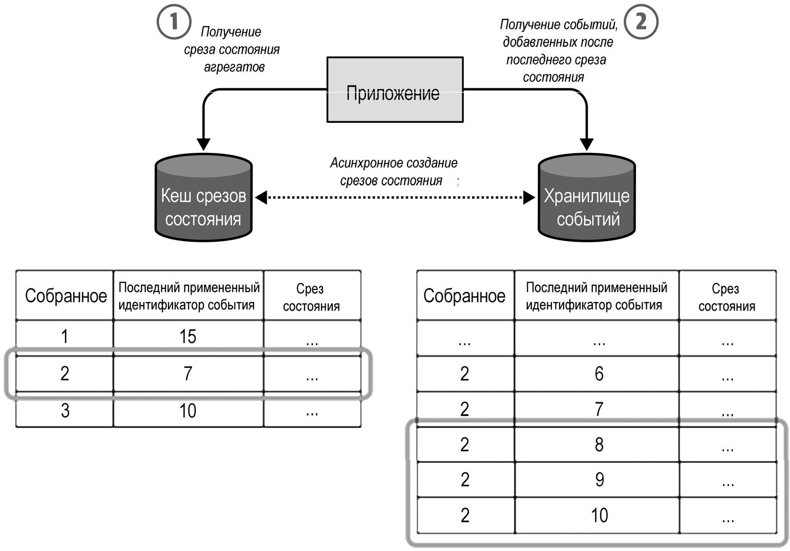{width="5.17073709536308in"
height="3.5933333333333333in"}

> Рис. 7.2. Получение среза состояния событий агрегата

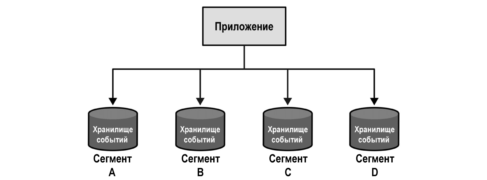{width="4.938675634295713in"
height="1.8310411198600176in"}

> Рис. 7.3. Сегментирование хранилища событий

#### Удаление данных

> *Глава 7. Моделирование фактора времени* \| 141
>
> *Хранилище событий --- это база данных, предназначенная только для
> добавления, но что если возникнет потребность в физическом удалении
> данных, например, для*

*3*

> *соблюдения общего положения по защите данных --- GDPR ?*
>
> Эта потребность может быть удовлетворена с помощью паттерна
> «забываемой» полезной нагрузки (forgettable payload): вся
> конфиденциальная информация включается в события в зашифрованном виде.
> Ключ шифрования хранится во внешнем хранилище типа ключ-значение, т.
> е. в хранилище ключей, где ключ --- это идентификатор определенного
> агрегата, а значение --- ключ шифрования. Когда конфиденциальные
> данные должны быть удалены, ключ шифрования удаляется из хранилища
> ключей. В результате конфиденциальная информация, содержащаяся в
> событиях, становится недоступной.

#### А почему просто нельзя \...

> *А почему просто нельзя записывать логи в текстовый файл и
> использовать его как журнал аудита?*
>
> Запись данных и в рабочую базу данных, и в файл журнала является
> операцией, которая может завершаться ошибкой. По сути, это транзакция,
> охватывающая два механизма хранения: базу данных и файл. Если первый
> не сработал, со вто- рым нужно провести операцию отката. Например,
> если при транзакции в базе данных произошел сбой, удалять сообщение из
> журнала будет просто некому. Следовательно, подобные журналы не будут
> согласованы и, скорее всего, в ко- нечном итоге станут противоречить
> друг другу.
>
> *А нельзя ли продолжать работать с моделью на основе состояний, но в
> той же транзакции базы данных добавлять регистрационные записи в
> журнальную таб- лицу?*
>
> С позиции инфраструктуры такой подход обеспечивает непротиворечивую
> син- хронизацию состояния и записей журнала. И все же вероятность
> возникновения ошибок остается. Что если программист, занимающийся
> сопровождением кодо- вой базы в будущем, просто забудет добавить
> соответствующую запись в жур- нал?
>
> Более того, когда в качестве источника истины используется
> представление на основе состояния, схема с дополнительной журнальной
> таблицей обычно быст- ро превращается в хаос. Обеспечить запись всей
> необходимой информации в корректном формате просто невозможно.
>
> *А нельзя ли просто продолжать работать с моделью на основе состояний,
> но до- бавить триггер базы данных, который сделает срез состояния
> записи и скопирует его в специальную таблицу «истории»?*
>
> Такой подход устранит недостаток предыдущего подхода: явные ручные
> вызовы для добавления записей в таблицу журнала уже не потребуются. Но
> при этом
>
> ^3^ «General Data Protection Regulation». (n.d.) Извлечено 14 июня
> 2021 г. из Wikipedia.
>
> 142 \| *Часть II. Тактический замысел*
>
> получаемая история будет включать только сухие факты: какие именно
> поля были изменены. А бизнес-контекст: почему поля были изменены,
> будет упущен из виду. Отсутствие этого «почему» резко ограничивает
> возможность проециро- вания дополнительных моделей.

### Вывод {#вывод-4}

В этой главе был рассмотрен паттерн «События как источник данных» (Event
Sourcing) и вопросы его применения для моделирования фактора времени в
агрега- тах модели предметной области.

В модели предметной области, основанной на событиях (event-sourced
domain model), все изменения состояния агрегата выражаются в виде серии
событий пред- метной области. Этим она отличается от более традиционных
подходов, в которых при изменении состояния происходит простое
обновление записи в базе данных. Произошедшие события предметной области
можно использовать для проецирова- ния текущего состояния агрегата.
Более того, модель, основанная на событиях, по- зволяет проецировать
события на несколько моделей представления, каждая из ко- торых
оптимизирована для решения своей конкретной задачи.

Этот паттерн подходит для тех случаев, когда крайне важно иметь глубокое
пред- ставление о данных системы, например для анализа и оптимизации,
или же в силу требований закона о ведении журнала аудита.

Этой главой завершается наше исследование различных способов
моделирования и реализации бизнес-логики. В следующей главе наше
внимание будет переключе- но на паттерны более высокого уровня, имеющие
непосредственное отношение к архитектуре системы.

### Упражнения {#упражнения-5}

1.  Какое из следующих утверждений справедливо в отношении связи между
    собы- тиями предметной области и объектами-значениями (value
    object)?

> А) События предметной области используют объекты-значения для описания
> того, что произошло в бизнес-области.
>
> Б) При реализации модели предметной области, основанной на событиях,
> объек- ты-значения следует преобразовать в агрегаты, основанные на
> событиях.
>
> В) Объекты-значения относятся к паттерну модели предметной области, а
> в мо- дели предметной области, основанной на событиях, они заменяются
> событиями предметной области.
>
> Г) Все эти утверждения неверны.

2.  Какое из следующих утверждений справедливо в отношении вариантов
    проеци- рования состояния из последовательности событий?

> А) Из событий агрегата может быть спроецировано только одно
> представление состояния.
>
> *Глава 7. Моделирование фактора времени* \| 143
>
> Б) Могут быть спроецированы несколько представлений состояния, но
> события предметной области должны быть смоделированы таким образом,
> чтобы под- держивать несколько проекций.
>
> В) Можно проецировать несколько представлений состояния, к которым
> впо- следствии всегда можно будет добавить дополнительные проекции.
>
> Г) Все эти утверждения неверны.

3.  Какое из следующих утверждений справедливо в отношении разницы между
    агрегатами на основе состояния и агрегатами на основе событий?

> А) Агрегат на основе событий может порождать события предметной
> области, а агрегат на основе состояния их выдавать не может.
>
> Б) Оба варианта паттерна агрегата порождают события предметной
> области, но в качестве источника истины эти события могут
> использоваться только агрега- тами, основанными на событиях.
>
> В) Агрегаты на основе событий гарантируют, что события предметной
> области порождают для каждого перехода состояния
>
> Г) Справедливы утверждения «Б» и «В».

4.  Если вернуться к компании WolfDesk, упомянутой в предисловии к
    книге, то какие функции системы можно будет реализовать в виде
    модели предметной области, основанной на событиях?

ГЛАВА 8

## Архитектурные паттерны

В ранее рассмотренных в этой книге тактических паттернах определялись
различ- ные способы моделирования и реализации бизнес-логики. В этой
главе тактический дизайн будет рассмотрен в более широком контексте,
включающем различные спо- собы координации взаимодействий и зависимостей
между компонентами системы.

### Сопоставление бизнес-логики и архитектурных паттернов

Бизнес-логика --- наиболее важная, но далеко не единственная часть
программной системы. Чтобы реализовать функциональные и нефункциональные
требования, на кодовую базу возлагается более широкий круг обязанностей.
Это и взаимодействие с пользователями с целью получения входных данных,
и предоставление выходных данных, а также использование различных
механизмов хранения для фиксации со- стояния и интеграции с внешними
системами и поставщиками информации.

Разнообразие задач, решение которых возлагается на кодовую базу,
облегчает рас- пределение ее бизнес-логики между различными
компонентами: часть логики должна реализовываться в пользовательском
интерфейсе или базе данных или же быть продублированной в разных
компонентах. Отсутствие строгой организации в вопросах реализации
решаемых задач затрудняет внесение изменений в код. При неизбежных
изменениях бизнес-логики порой трудно бывает сходу определить, какие
именно части кодовой базы должны быть затронуты этими изменениями. То
или иное изменение может иметь неожиданные последствия для, казалось бы,
со- вершенно несвязанных с ним частей системы. И наоборот, совсем
нетрудно про- пустить тот код, который необходимо изменить. Все эти
проблемы резко увеличи- вают издержки сопровождения кодовой базы.

Благодаря применению архитектурных паттернов вводятся организационные
прин- ципы для различных аспектов кодовой базы и устанавливаются четкие
границы между ними, при этом формируются ответы на вопросы, как именно
бизнес-логика связана с вводом, выводом и другими инфраструктурными
компонентами системы. Их применение влияет на взаимодействие компонентов
друг с другом, на то, каки- ми знаниями они делятся и как компоненты
ссылаются друг на друга.

Выбор подходящего способа организации кодовой базы или правильного
архитек- турного паттерна имеет решающее значение для поддержки
реализации бизнес- логики в краткосрочной перспективе и облегчения
сопровождения приложения

> *Глава 8. Архитектурные паттерны* \| 145

в последующем. А теперь давайте рассмотрим три основных архитектурных
пат- терна приложений: слоистую архитектуру, порты и адаптеры и CQRS, а
также изу- чим варианты их использования.

### Слоистая архитектура (Layered Architecture)

Одним из наиболее распространенных архитектурных паттернов является
слоистая архитектура (layered architecture). При его использовании
кодовая база выстраива- ется в горизонтальные слои, каждый из которых
решает одну из следующих техни- ческих задач: взаимодействие с
пользователями, реализация бизнес-логики и хра- нение данных. Эти слои
показаны на рис. 8.1.

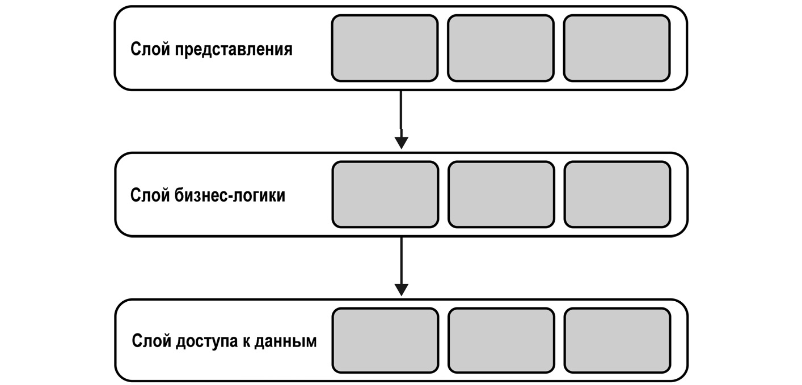{width="4.746926946631671in"
height="2.2666655730533685in"}

> Рис. 8.1. Слоистая архитектура (Layered architecture)

В своей классической форме слоистая архитектура состоит из трех слоев:
слоя представления (presentation layer --- PL), слоя бизнес-логики
(business logic layer --- BLL) и слоя доступа к данным (data access
layer --- DAL).

#### Слой представления (Presentation layer)

На слое представления, показанном на рис. 8.2, реализуется
пользовательский ин- терфейс программы для взаимодействия с ее
пользователями. В исходной форме паттерна этим слоем обозначается
графический интерфейс, например веб-интер- фейс или интерфейс приложения
для настольного компьютера.

Но в современных системах слой представления имеет более широкий охват:
т. е. в него входят все средства для запуска взаимодействия программы,
как синхронно- го, так и асинхронного. Например:

- Графический интерфейс пользователя (GUI).

- Интерфейс командной строки (CLI).

- Интерфейс для интеграции с другими системами (API).

> 146 \| *Часть II. Тактический замысел*

- Подписка на события в брокере сообщений.

- Топики сообщений для публикации исходящих событий.

Все это относится к средствам для получения системой запросов из внешней
среды и передачи результатов. Строго говоря, слой представления --- это
публичный ин- терфейс программы.

{width="4.735694444444444in"
height="0.5699989063867017in"}

> Рис. 8.2. Слой представления

#### Слой бизнес-логики (Business logic layer)

Как следует из названия, этот слой отвечает за реализацию и инкапсуляцию
бизнес- логики программы. Здесь реализуются бизнес-решения. Как говорит
Эрик Эванс

> 1

(Eric Evans) , этот слой является сердцем программного средства.

На этом слое реализуются паттерны бизнес-логики, рассмотренные в *главах
5--7*, например активные записи или модель предметной области (см. рис.
8.3).

{width="4.735692257217848in"
height="0.57in"}

> Рис. 8.3. Слой бизнес-логики

#### Слой доступа к данным (Data access layer)

Слой доступа к данным обеспечивает доступ к механизмам хранения
информации. В исходной форме паттерна имелась в виду база данных
системы. Но по аналогии со слоем представления ответственность,
возлагаемая на этот слой, в современных системах гораздо шире.

Во-первых, с тех пор, как грянула революция NoSQL, система обычно
работает с несколькими базами данных. Например, документоориентированное
хранилище может выступать в качестве рабочей базы данных, поисковый
индекс исполь- зоваться для динамических запросов, а база данных,
находящаяся в оперативной памяти, может быть использована для
высокопроизводительных операций.

Во-вторых, традиционные базы данных не являются единственным средством
хра- нения информации. Например, для хранения файлов системы может
использовать-

> ^1^ Evans, E. Domain-Driven Design: Tackling Complexity in the Heart
> of Software. Boston: Addison-Wesley, 2003.
>
> *Глава 8. Архитектурные паттерны* \| 147

2

ся облачное объектное хранилище , или же для организации связи между
различ-

3

ными функциями программы может использоваться шина сообщений .

И наконец, этот слой также включает интеграцию с различными внешними по-
ставщиками информации, необходимую для решения функциональных задач про-
граммы: API-интерфейсы, предоставляемые внешними системами, или сервисы
облачных провайдеров, такие как перевод на другие языки, данные
фондового рын- ка и распознавание аудио (рис. 8.4).

{width="4.629150262467191in"
height="0.5489577865266841in"}

> Рис. 8.4. Слой доступа к данным

#### Связь между слоями

Слои интегрированы в коммуникационную модель типа «сверху вниз»: как
показа- но на рис. 8.5, каждый слой может иметь зависимость только от
слоя, находящегося непосредственно под ним. Тем самым обеспечивается
разделение задач реализации и уменьшение обмена знаниями между слоями.
На рис. 8.5 слой представления ссылается только на слой бизнес-логики.
Он абсолютно не в курсе дизайна слоя доступа к данным.

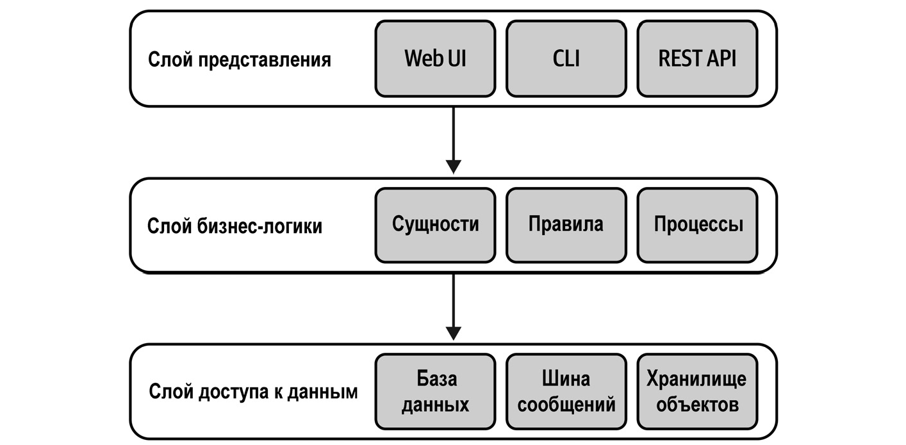{width="4.777378608923884in"
height="2.316666666666667in"}

Рис. 8.5. Слоистая архитектура

> ^2^ Такое как AWS S3 или Google Cloud Storage.
>
> ^3^ В данном контексте шина сообщений используется для внутренних нужд
> системы. Если бы она была пуб- личной, то принадлежала бы слою
> представления.
>
> 148 \| *Часть II. Тактический замысел*

#### Вариация

Обычно паттерн слоистой архитектуры расширяется дополнительным,
сервисным слоем (Service layer).

###### Сервисный слой (Service layer)

> Определяет границу приложения посредством слоя сервисов, который
> устанавливает набор доступных действий, и координирует реакцию
> приложения на каждое действие.
>
> -- *Паттерны архитектуры корпоративных приложений* ^4^

Сервисный слой действует как посредник между имеющимися у программы
слоями представления и бизнес-логики. Рассмотрим следующий код:

> namespace MvcApplication.Controllers
>
> {
>
> public class UserController: Controller
>
> {
>
> \...
>
> \[AcceptVerbs(HttpVerbs.Post)\]
>
> public ActionResult Create(ContactDetails contactDetails)
>
> {
>
> OperationResult result = null;
>
> try
>
> {
>
> \_db.StartTransaction();
>
> var user = new User(); user.SetContactDetails(contactDetails)
> user.Save();
>
> \_db.Commit();
>
> result = OperationResult.Success;
>
> } catch (Exception ex) {
>
> \_db.Rollback();
>
> result = OperationResult.Exception(ex);
>
> }
>
> return View(result);
>
> }
>
> }
>
> }

Показанный в этом примере MVC-контроллер относится к слою представления.
Он предоставляет интерфейс, который создает нового пользователя. Для
создания но- вого экземпляра и его сохранения в этом эндпоинте
используется объект активной

> ^4^ Fowler, M. Patterns of Enterprise Application Architecture.
> Boston: Addison-Wesley, 2002.
>
> *Глава 8. Архитектурные паттерны* \| 149

записи User. Более того, им управляется транзакция базы данных, чтобы в
случае возникновения ошибки был сгенерирован правильный ответ.

Как показано на рис. 8.6, для дальнейшего разделения слоя представления
и базо- вой бизнес-логики логику управления транзакциями можно
переместить на сервис- ный слой.

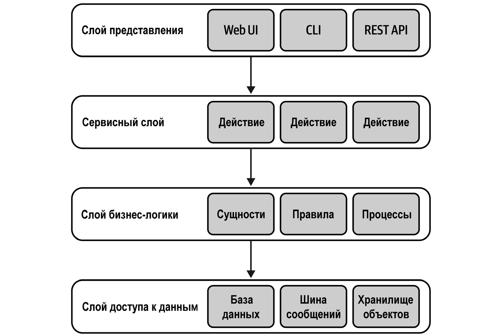{width="4.775968941382327in"
height="3.16in"}

> Рис. 8.6. Сервисный слой

Важно отметить, что в контексте архитектурного паттерна сервисный слой
являет- ся логической границей. Его не нужно рассматривать в качестве
физического сер- виса.

Сервисный слой выступает в качестве фасада слоя бизнес-логики: он
предоставляет интерфейс, который соответствует методам публичного
интерфейса, инкапсулируя вызовы нижележащих слоев. Например:

> interface CampaignManagementService
>
> {
>
> OperationResult CreateCampaign(CampaignDetails details);
> OperationResult Publish(CampaignId id, PublishingSchedule schedule);
> OperationResult Deactivate(CampaignId id);
>
> OperationResult AddDisplayLocation(CampaignId id, DisplayLocation
> newLocation);
>
> \...
>
> }

Все показанные выше методы соответствуют публичному интерфейсу системы.
Но им не хватает деталей реализации, связанных с представлением.
Ответственность слоя представления ограничивается предоставлением
необходимых входных дан- ных сервисному слою и возвращением его ответов
вызывающей стороне.

> 150 \| *Часть II. Тактический замысел*

Давайте отрефакторим предыдущий пример и вынесем логику оркестрации на
сер- висный слой:

> namespace ServiceLayer
>
> {
>
> public class UserService
>
> {
>
> \...
>
> public OperationResult Create(ContactDetails contactDetails)
>
> {
>
> OperationResult result = null;
>
> try
>
> {
>
> \_db.StartTransaction();
>
> var user = new User(); user.SetContactDetails(contactDetails)
> user.Save();
>
> \_db.Commit();
>
> result = OperationResult.Success;
>
> } catch (Exception ex) {
>
> \_db.Rollback();
>
> result = OperationResult.Exception(ex);
>
> }
>
> return result;
>
> }
>
> \...
>
> }
>
> }
>
> namespace MvcApplication.Controllers
>
> {
>
> public class UserController: Controller
>
> {
>
> \...
>
> \[AcceptVerbs(HttpVerbs.Post)\]
>
> public ActionResult Create(ContactDetails contactDetails)
>
> {
>
> var result = \_userService.Create(contactDetails); return
> View(result);
>
> }
>
> }
>
> }

Наличие явного сервисного слоя дает целый ряд преимуществ:

- Один и тот же сервисный слой может повторно использоваться сразу
  несколь- кими публичными интерфейсами, например графическим
  пользовательским ин- терфейсом и API. Дублирование логики оркестрации
  не требуется.

> *Глава 8. Архитектурные паттерны* \| 151

- Повышается модульность кода, все связанные методы собираются в одном
  месте.

- Происходит дополнительное разделение слоев представления и
  бизнес-логики.

- Упрощается тестирование функциональности бизнес-логики.

Но стоит все же отметить, что необходимость в сервисном слое возникает
не все- гда. Например, когда бизнес-логика реализована в виде
транзакционного сценария, то она, по сути, и представляет собой
сервисный слой, поскольку уже предоставля- ет набор методов, формирующих
публичный интерфейс системы. В таком случае API сервисного слоя будет
просто повторять публичные интерфейсы транзакцион- ных сценариев без
абстрагирования и инкапсуляции какой-либо сложности. Следо- вательно,
будет вполне достаточно либо сервисного слоя, либо слоя бизнес-логики.

С другой стороны, потребности в сервисном слое будут возникать, если
паттерну бизнес-логики станет необходим внешний оркестратор, как в
случае с паттерном активной записи. Тогда на сервисном слое будет
реализован паттерн транзакцион- ного сценария, а активные записи, с
которыми он работает, будут находиться на слое бизнес-логики.

###### Терминология

В иных источниках информации могут встречаться и другие термины,
используе- мые для описания слоистой архитектуры:

- Слой представления = слой пользовательского интерфейса.

- Сервисный слой = прикладной слой.

- Слой бизнес-логики = слой предметной области = слой модели.

- Слой доступа к данным = слой инфраструктуры.

Чтобы избежать путаницы, паттерн здесь представляется с использованием
исход- ной терминологии. И все же я склоняюсь к таким понятиям, как
«слой пользова- тельского интерфейса» и «уровень инфраструктуры»,
поскольку эти термины луч- ше отражают обязанности современных систем и
слоя приложений, не допуская путаницы с физическими границами сервисов.

#### Когда предпочтительнее использовать слоистую архитектуру

Благодаря имеющейся в этом архитектурном паттерне зависимости между
слоями бизнес-логики и доступа к данным он хорошо подходит для систем,
бизнес-логика которых реализована с использованием транзакционного
сценария или паттерна активной записи.

Но паттерн затрудняет реализацию модели предметной области, где
бизнес-сущ- ности (агрегаты и объекты-значения) не должны иметь никакой
зависимости от базовой инфраструктуры и никаких знаний о ней. В слоистой
архитектуре с ее за- висимостью сверху вниз для выполнения этого
требования нужно будет перепры- гивать через слои. Реализовать модель
предметной области в слоистой архитектуре

> 152 \| *Часть II. Тактический замысел*

все же можно, но паттерн, рассматриваемый далее, подходит для этого
гораздо лучше.

###### Дополнительно: сравнение слоев и уровней

Слоистую архитектуру часто путают с архитектурой N-Tier (многоуровневой)
и наоборот. Несмотря на сходство между двумя паттернами, слои и уровни
(tiers) концептуально различаются: слой --- это логическая граница, а
уровень --- физиче- ская граница. Все слои в слоистой архитектуре
связаны одним и тем же жизненным циклом: они реализуются, развиваются и
развертываются как единое целое. А уро- вень --- это независимо
развертываемый сервис, сервер или система. Рассмотрим, к примеру,
систему с архитектурой N-Tier, показанную на рис. 8.7.

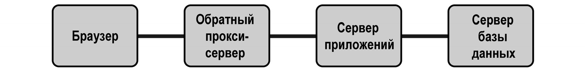{width="4.629150262467191in"
height="0.5489577865266841in"}

> Рис. 8.7. Система с архитектурой N-Tier

Система отображает интеграцию физических сервисов, задействованных в
системе. Потребитель использует браузер, который может работать на
настольном компью- тере или мобильном устройстве. Браузер
взаимодействует с обратным прокси- сервером, который перенаправляет
запросы в веб-приложение. Веб-приложение работает на веб-сервере и
взаимодействует с сервером базы данных. Все эти ком- поненты могут
работать на одном физическом сервере, представляющем собой составное
устройство, или быть распределены между несколькими серверами. Но,
поскольку каждый компонент может развертываться и управляться независимо
от остальных, это уровни, а не слои.

А вот слои внутри веб-приложения являются логическими границами.

### Порты и адаптеры (Ports and adapters)

Архитектура портов и адаптеров устраняет недостатки слоистой архитектуры
и больше подходит для реализации более сложной бизнес-логики. Интересно
то, что оба паттерна очень похожи. Давайте отрефакторим слоистую
архитектуру в порты и адаптеры.

#### Терминология {#терминология-2}

По сути, и слой представления, и слой доступа к данным представляют
собой инте- грацию с внешними компонентами: базами данных, внешними
сервисами и фрейм- ворками пользовательского интерфейса. Эти технические
подробности не отража- ют бизнес-логику системы, поэтому давайте, как
показано на рис. 8.8, объединим все подобные инфраструктурные задачи в
один «слой инфраструктуры».

> {width="4.761532152230971in"
> height="0.7066666666666667in"}*Глава 8. Архитектурные паттерны* \| 153
>
> Рис. 8.8. Слои представления и доступа к данным объединены в слой
> инфраструктуры

#### Принцип инверсии зависимостей (Dependency inversion principle)

Принцип инверсии зависимостей (dependency inversion principle --- DIP)
гласит, что высокоуровневые модули, реализующие бизнес-логику, не должны
зависеть от низкоуровневых модулей. Но в традиционной слоистой
архитектуре именно это и происходит. Слой бизнес-логики зависит от слоя
инфраструктуры. Чтобы соответ- ствовать DIP-принципу, давайте, как
показано на рис. 8.9, развернем отношения в обратную сторону.

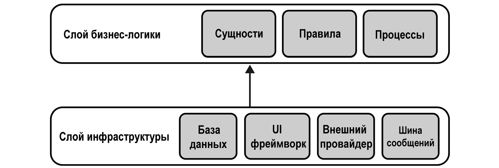{width="4.7591404199475065in"
height="1.5866666666666667in"}

> Рис. 8.9. Зависимости, развернутые в обратную сторону

Теперь слой бизнес-логики расположен не между технологическими слоями, а
за- нимает центральную позицию. Он не зависит ни от одного из
инфраструктурных компонентов системы.

И наконец, в качестве фасада для публичного интерфейса системы давайте
добавим

> 5

прикладной слой. Являясь в слоистой архитектуре сервисным слоем, он
описывает

все операции, предоставляемые системой, и управляет бизнес-логикой
системы для их выполнения. Получающаяся в результате этого архитектура
изображена на рис. 8.10.

Архитектура, изображенная на рис. 8.10, представляет собой архитектурный
пат- терн портов и адаптеров (ports and adapters). Бизнес-логика не
зависит ни от одного из нижестоящих слоев, это нужно для реализации
паттернов модели предметной области и модели предметной области,
основанной на событиях (event sourced domain model).

> ^5^ Поскольку контекст слоистой архитектуры здесь не рассматривается,
> я позволю себе вместо понятия «сер- висный слой» использовать понятие
> «прикладной слой», так как он лучше отражает замысел.
>
> 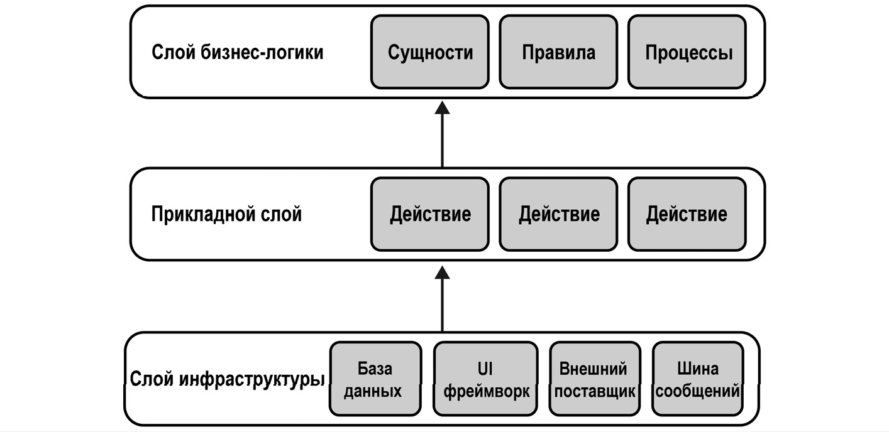{width="4.74655949256343in"
> height="2.2933333333333334in"}154 \| *Часть II. Тактический замысел*
>
> Рис. 8.10. Традиционные слои архитектуры портов и адаптеров

Почему этот паттерн называется порты и адаптеры? Чтобы ответить на этот
вопрос, давайте посмотрим, как инфраструктурные компоненты интегрированы
с бизнес- логикой.

#### Интеграция инфраструктурных компонентов

Основная цель архитектуры портов и адаптеров --- отделить бизнес-логику
системы от ее инфраструктурных компонентов.

Вместо того, чтобы ссылаться на инфраструктурные компоненты или вызывать
их напрямую, слой бизнес-логики определяет «порты», которые должны быть
реали- зованы на слое инфраструктуры. А на слое инфраструктуры
реализуются «адапте- ры»: конкретные реализации интерфейсов портов для
работы с различными техно- логиями (см. рис. 8.11).

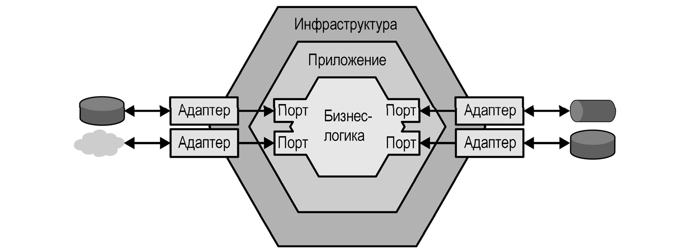{width="5.208501749781277in"
height="1.88in"}

> Рис. 8.11. Архитектура портов и адаптеров

Абстрактные порты становятся конкретными адаптерами на слое
инфраструктуры либо путем внедрения зависимостей, либо путем настройки
при начальной за- грузке.

> *Глава 8. Архитектурные паттерны* \| 155

Например, вот так выглядит возможное определение порта и конкретный
адаптер для шины сообщений:

> namespace App.BusinessLogicLayer
>
> {
>
> public interface IMessaging
>
> {
>
> void Publish(Message payload);
>
> void Subscribe(Message type, Action callback);
>
> }
>
> }
>
> namespace App.Infrastructure.Adapters
>
> {
>
> public class SQSBus: IMessaging { \... }
>
> }

#### Варианты

Архитектура портов и адаптеров также известна как гексагональная
архитектура, луковичная архитектура и чистая архитектура. Все эти
паттерны основаны на одних и тех же принципах проектирования, имеют одни
и те же компоненты и характеризуются одинаковыми отношениями между ними,
но, как и в случае со слоистой архитектурой, терминология может
различаться:

- Прикладной слой = сервисный слой = слой пользовательского сценария.

- Слой бизнес-логики = слой предметной области = слой ядра.

И все же эти паттерны можно ошибочно считать концептуально разными. Это
еще один пример важности единого языка.

#### Когда предпочтительнее использовать порты и адаптеры

Отделение бизнес-логики от всех технологических вопросов делает
архитектуру портов и адаптеров идеально подходящей для бизнес-логики,
реализованной с по- мощью паттерна модели предметной области.

### Разделение ответственности команд и запросов (Command-Query Responsibility Segregation)

Паттерн разделения ответственности команд и запросов (command-query
respon- sibility segregation --- CQRS) основан на тех же принципах
организации бизнес- логики и инфраструктуры, что и паттерн портов и
адаптеров. Но он отличается способом управления данными системы. Этот
паттерн позволяет представлять дан- ные системы в нескольких
персистентных моделях.

> 156 \| *Часть II. Тактический замысел*

Давайте посмотрим, зачем может понадобиться такое решение и как его
реали- зовать.

#### Мультипарадигменное моделирование (Polyglot modelling)

Использование единственной модели для всех нужд системы может быть
затрудни- тельно, а то и вовсе не возможно. Например, как уже
упоминалось в *главе 7*, обра- ботка транзакций (online transaction
processing --- OLTP) и аналитическая обработка (online analytical
processing --- OLAP) могут потребовать разные представления данных.

Еще одна причина для работы с несколькими моделями может быть связана с
поня- тием мультипарадигменного хранения данных (polyglot persistence).
Идеальной ба-

6

зы данных не существует. Или, как говорит Грег Янг (Greg Young) , у всех
баз дан-

ных имеются недостатки, и у каждой свои: зачастую приходится
балансировать между потребностями в масштабировании, согласованностью
данных или поддер- живаемых видов запросов. Альтернативой поиску
идеальной базы данных является мультипарадигменная модель хранения
данных: использование нескольких баз данных для реализации различных
требований, связанных с данными. Например, одна система может
использовать в качестве рабочей базы данных документно- ориентированную,
для аналитики или отчетности --- колоночную, а для реализации надежного
поиска --- поисковый движок.

И последнее, о чем нужно упомянуть, --- паттерн CQRS тесно связан с
источником событий (event sourcing). Первоначально CQRS был определен
для преодоления ограничений в выполнении запросов при использовании
модели, основанной на событиях (event sourced domain model): за один раз
можно было запрашивать собы- тия только одного экземпляра агрегата.
Паттерн CQRS предоставляет возможность материализации моделей,
спроецированных в физические базы данных, подходя- щих для гибких
(flexible) запросов.

С учетом вышесказанного в этой главе CQRS «отделяется» от источника
событий (event sourcing). Я хочу показать, что CQRS применим даже в том
случае, если биз- нес-логика реализована с использованием любого другого
паттерна.

Давайте посмотрим, как CQRS позволяет использовать сразу несколько
механиз- мов хранения для представления различных моделей данных
разрабатываемой сис- темы.

#### Реализация {#реализация-5}

Как следует из названия, паттерн разделяет обязанности моделей системы.
Сущест- вуют два типа моделей: модель выполнения команд и модели чтения.

> ^6^ Polyglot data by Greg Young. (n.d.). Извлечено 14 июня 2021 года
> из YouTube.
>
> *Глава 8. Архитектурные паттерны* \| 157

###### Модель выполнения команд

CQRS выделяет единую модель для выполнения операций, которые изменяют
со- стояние системы (системные команды). Эта модель используется для
реализации бизнес-логики, проверки соблюдения правил и соблюдения
инвариантов.

Модель выполнения команд также является единственной моделью,
представляю- щей строго непротиворечивые данные --- источником истины
(source of truth). Должна быть предоставлена возможность считывания
строго согласованного со- стояния бизнес-объекта и поддержка
оптимистичного управления конкурентным доступом для обновления этих
объектов.

###### Модели чтения (проекции)

Система может определить столько моделей, сколько нужно для
предоставления данных пользователям или информации другим системам.

Модель чтения --- это предварительно кешированная проекция. Она может
нахо- диться в базе данных, в обычном файле или в кеше в памяти.
Правильная реализа- ция CQRS позволяет стереть все данные проекции и
восстановить ее с нуля. Она также позволяет расширить систему
дополнительными проекциями в будущем --- моделями, которые нельзя было
предусмотреть изначально.

И наконец, модели чтения доступны только для чтения. Ни одна из
системных опе- раций не может напрямую изменять данные моделей чтения.

#### Проецирование моделей чтения

Чтобы модели чтения заработали, система должна проецировать изменения из
мо- дели выполнения команд на все свои модели чтения. Эта концепция
проиллюстри- рована на рис. 8.12.

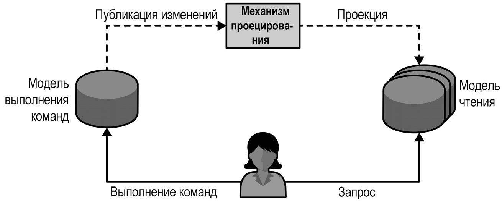{width="4.38971019247594in"
height="1.7533333333333334in"}

> Рис. 8.12. CQRS-архитектура

Проекция моделей чтения аналогична понятию материализованного
представления (materialized view) в реляционных базах данных: при каждом
обновлении исходной таблицы изменения должны отражаться в предварительно
кешированных представ- лениях.

> 158 \| *Часть II. Тактический замысел*

А теперь давайте рассмотрим два способа создания проекций: синхронный и
асин- хронный.

###### Синхронные проекции

При синхронном обновлении проекций обновление данных происходит по
модели догоняющей подписки (catch-up subscription):

- Механизм проецирования запрашивает в OLTP-базе новые или обновленные
  записи после последнего контрольной точки (checkpoint).

- Механизм проецирования использует обновленные данные для создания или
  обновления моделей чтения.

- Механизм проецирования сохраняет контрольную точку последней
  обработан- ной записи. Это значение будет использоваться во время
  следующей итерации для добавления или изменения записей после
  последней обработанной записи.

Этот процесс показан на рис. 8.13 и отображен на рис. 8.14 в виде
диаграммы по- следовательности.

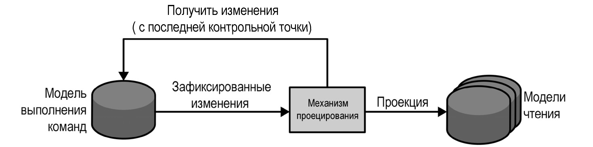{width="4.9514227909011375in"
height="1.2317705599300088in"}

> Рис. 8.13. Синхронная проекционная модель

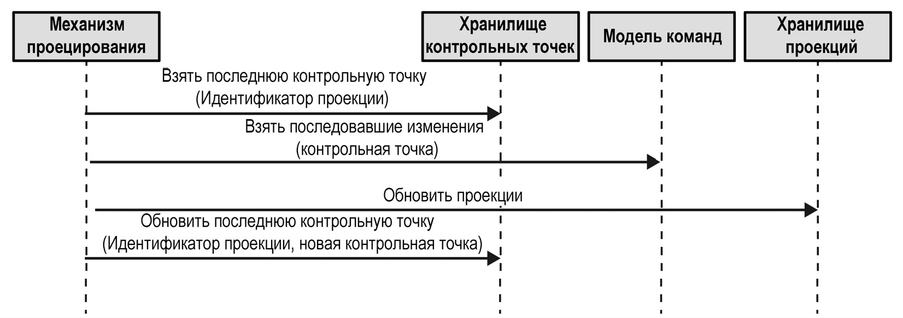{width="5.538526902887139in"
height="1.943332239720035in"}

> Рис. 8.14. Синхронная проекция моделей чтения посредством догоняющей
> подписки

Чтобы догоняющая подписка работала, модель выполнения команд должна
ставить контрольную точку (checkpoint) на все новые или обновленные
записи базы дан- ных. Механизм хранения также должен поддерживать запрос
записей на основе контрольных точек.

> *Глава 8. Архитектурные паттерны* \| 159

Контрольная точка может быть реализована с использованием возможностей
баз данных. Например, как показано на рис. 8.15, для генерации
уникальных инкремен- тальных чисел при вставке или обновлении строки в
SQL Server может использо- ваться столбец «rowversion». В базах данных,
в которых такая возможность отсут- ствует, можно реализовать специальное
решение, которое увеличивает текущий счетчик и добавляет его к каждой
измененной записи. Важно убедиться, что запрос на основе контрольной
точки возвращает согласованные результаты. Если послед- няя возвращенная
запись имеет значение контрольной точки 10, при следующем выполнении ни
один новый запрос не должен иметь значения меньше 10. В про- тивном
случае эти записи будут пропущены механизмом проецирования, что при-
ведет к несогласованности моделей.

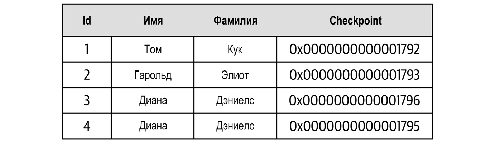{width="4.640952537182852in"
height="1.34in"}

> Рис. 8.15. Автоматически сгенерированный столбец контрольной точки
> (checkpoint) в реляционной базе данных

Метод синхронного проецирования упрощает добавление новых проекций и
реге- нерацию существующих с самого начала. В последнем случае нужно
всего лишь сбросить контрольную точку на 0; механизм проецирования
просканирует записи и выстроит проекции с нуля.

###### Асинхронные проекции

В сценарии асинхронной проекции модель выполнения команд публикует все
зафиксированные изменения в шину сообщений. Как показано на рис. 8.16,
меха- низмы проецирования системы могут подписываться на опубликованные
сообще- ния и использовать их для обновления моделей чтения.

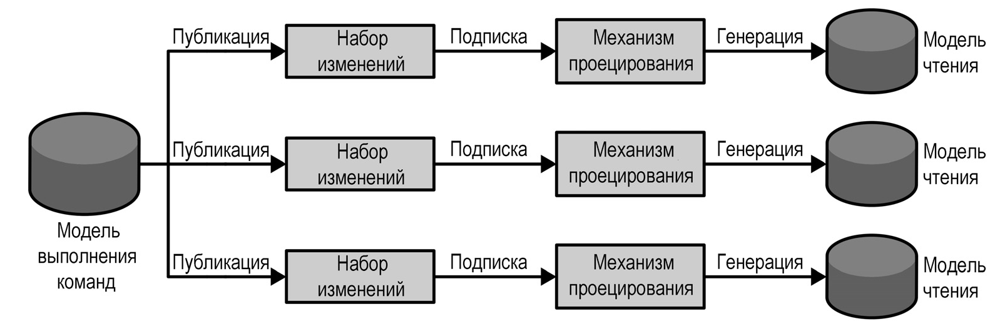{width="5.350494313210849in"
height="1.73in"}

> Рис. 8.16. Асинхронное проецирование моделей чтения
>
> 160 \| *Часть II. Тактический замысел*

#### Сложности {#сложности-2}

Несмотря на очевидные преимущества метода асинхронного проектирования в
во- просах масштабирования и производительности, он сильнее подвержен
ошибкам, возникающим при конкурентном доступе. Если сообщения
обрабатываются не по порядку или дублируются, в модели чтения будут
проецироваться несогласованные данные.

Этот метод также усложняет добавление новых проекций или регенерацию
сущест- вующих.

Поэтому всегда рекомендуется реализовывать синхронную проекцию, а в
случае необходимости надстраивать над ней дополнительную асинхронную
проекцию.

#### Разделение моделей

В архитектуре CQRS ответственности моделей разделены в соответствии с их
ти- пом. Команда может работать только в строго согласованной модели
выполнения команд. Запрос не может напрямую изменить хранимое состояние
системы --- ни модели чтения, ни модель выполнения команд.

В отношении систем на основе CQRS бытует весьма распространенное
заблужде- ние, заключающееся в том, что команда может только изменять
данные, а данные могут быть извлечены для отображения только через
модель чтения. Иными слова- ми, команда, приводящая к выполнению
методов, никогда не должна возвращать никаких данных. Это не так. Такой
подход создает ненужные сложности и портит впечатление пользователей о
системе.

Команда всегда должна сообщать вызывающей стороне об успешном или
неудач- ном результате ее выполнения. Если выполнение не удалось, то по
какой причине? Входные данные не прошли валидацию или же возникла
техническая проблема? Вызывавший команду компонент программы должен
знать, как внести в команду исправления. Следовательно, команда может и
во многих случаях должна возвра- щать данные, к примеру, если
пользовательский интерфейс системы должен отра- жать изменения,
полученные в результате выполнения команды. При этом не толь- ко
облегчается работа пользователей с системой, поскольку они немедленно
полу- чают отклик на свои действия, но и предоставляется возможность
воспользоваться возвращаемыми значениями в дальнейшем в рабочих
процессах пользователей, что устраняет необходимость в ненужных обменах
данными.

Единственное ограничение заключается в том, что возвращаемые данные
должны исходить из строго согласованной модели, а именно из модели
выполнения команд, поскольку мы не можем ждать, когда проекция придет в
согласованное состояние.

#### Когда предпочтительнее использовать CQRS

Применение паттерна CQRS может подойти тем приложениям, которым
необходи- мо работать с одними и теми же данными сразу в нескольких
моделях, потенциаль- но хранящихся в базах данных разных типов.

> *Глава 8. Архитектурные паттерны* \| 161

С точки зрения практического применения паттерн поддерживает основную
цен- ность предметно-ориентированного проектирования, заключающуюся в
работе с наиболее эффективными моделями для решения поставленной задачи
и постоян- ном совершенствовании модели предметной области.

С точки зрения инфраструктуры CQRS позволяет воспользоваться
возможностями различных типов баз данных; например, для хранения модели
выполнения команд использовать реляционные базы данных, для
полнотекстового поиска использовать поисковый индекс, а для быстрого
извлечения данных использовать предваритель- но обработанные обычные
файлы, получая при этом все надежно синхронизиро- ванные механизмы
хранения информации.

Кроме того, CQRS в силу своих особенностей вполне естественно подходит
для моделей предметной области, основанных на событиях (event sourced
domain model). Модель «События как источник данных» (Event Sourcing)
делает невоз- можной выборку записей на основе состояний агрегатов, но
CQRS открывает такую возможность, проецируя состояния в базы данных.

### Область применения

Рассматриваемые здесь паттерны --- слоистая архитектура, архитектура
портов и адаптеров и CQRS --- не должны выступать в роли общесистемных
организацион- ных принципов. Их не следует считать обязательными
высокоуровневыми архитек- турными паттернами для всего ограниченного
контекста.

Рассмотрим ограниченный контекст, показанный на рис. 8.17, охватывающий
сразу несколько поддоменов. Поддомены могут быть разных типов: основные
(core), вспомогательные (supporting) или универсальные (generic). Даже
для поддоменов одного типа может потребоваться разная бизнес-логика и
разные архитектурные паттерны (это тема *главы 10*). Применение единой,
ограниченной контекстно- зависимой архитектуры непреднамеренно приведет
к неоправданной сложности.

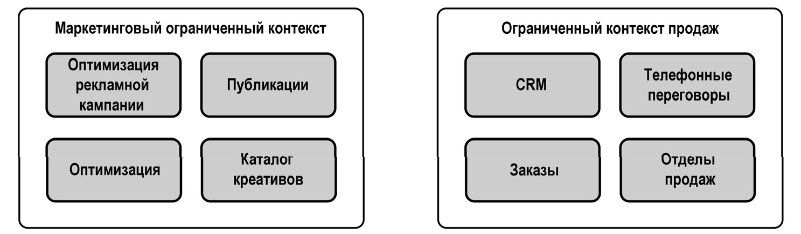{width="4.98920384951881in"
height="1.453332239720035in"}

> Рис. 8.17. Ограниченные контексты, охватывающие сразу несколько
> поддоменов

Наша цель заключается в принятии проектных решений в соответствии с
реальны- ми потребностями и бизнес-стратегией. В дополнение к уровням,
разделяющим систему по горизонтали, можно еще ввести дополнительное
вертикальное разбие- ние. Крайне важно определить логические границы для
модулей, инкапсулирую-

> []{#вывод-6 .anchor}162 \| *Часть II. Тактический замысел*

щих отдельные поддомены бизнеса, и для каждого из них воспользоваться
соответ- ствующими инструментами (рис. 8.18).

Соответствующие вертикальные границы делают монолитный ограниченный кон-
текст модульным и не дают ему превратиться в так называемый большой ком
гря- зи. В *главе 11* будет показано, что эти логические границы позже
могут быть пре- образованы в физические границы более мелких
ограниченных контекстов.

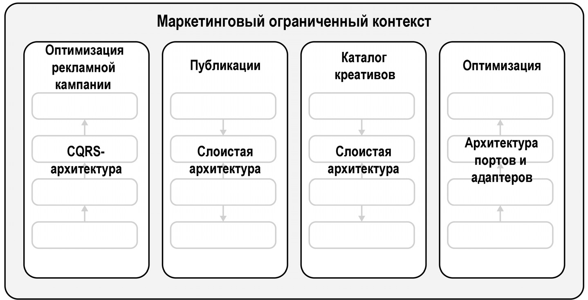{width="4.825967847769029in"
height="2.4499989063867016in"}

> Рис. 8.18. Архитектурные срезы

### Вывод {#вывод-7}

Слоистая архитектура предусматривает разбивку кодовой базы на основе
решае- мых технологических задач. Поскольку этот паттерн объединяет
бизнес-логику с реализацией доступа к данным, он хорошо подходит для
систем на основе ис- пользования активных записей.

В архитектуре портов и адаптеров отношения инвертируются: бизнес-логика
ста- вится в центр и отделяется от всех инфраструктурных зависимостей.
Этот паттерн хорошо подходит для бизнес-логики, реализованной с помощью
паттерна модели предметной области.

Паттерн CQRS представляет одни и те же данные сразу в нескольких
моделях. Не- смотря на то что этот паттерн является обязательным для
систем, построенных на модели предметной области, основанной на событиях
(event-source domain model), им также можно воспользоваться в любых
системах, которым требуется способ работы сразу с несколькими моделями
хранения информации.

Паттерны, которые будут рассмотрены в следующей главе, предназначены для
решения архитектурных задач с упором на реализацию надежного
взаимодействия между различными компонентами системы.

### Упражнения

> *Глава 8. Архитектурные паттерны* \| 163

1.  Какие из рассмотренных архитектурных паттернов можно использовать с
    биз- нес-логикой, реализованной в виде паттерна активной записи?

> А) Слоистая архитектура. Б) Порты и адаптеры.
>
> В) CQRS.
>
> Г) А и В.

2.  Какой из рассмотренных архитектурных паттернов отделяет
    бизнес-логику от инфраструктурных задач?

> А) Слоистая архитектура. Б) Порты и адаптеры.
>
> В) CQRS.
>
> Г) Б и В.

3.  Предположим, что при реализации паттерна портов и адаптеров
    необходимо ин- тегрировать шину сообщений облачного провайдера. На
    каком слое должна быть реализована интеграция?

> А) На слое бизнес-логики. Б) На прикладном слое.
>
> В) На слое инфраструктуры. Г) На любом слое.

4.  Какое из следующих утверждений в адрес паттерна CQRS справедливо? А)
    Асинхронные проекции легче поддаются масштабированию.

> Б) Можно использовать либо синхронную, либо асинхронную проекцию, но
> не обе одновременно.
>
> В) Команда не возвращает никакой информации вызывающей стороне. Для
> по- лучения результатов выполненных действий вызывающий код всегда
> должен использовать модели чтения.
>
> Г) Команда может возвращать информацию, если она исходит из строго
> согла- сованной модели.
>
> Д) А и Г.

5.  Паттерн CQRS позволяет представлять одни и те же бизнес-объекты в
    несколь- ких моделях хранения информации, позволяя таким образом в
    одном и том же ограниченном контексте работать сразу с несколькими
    моделями. Противоречит ли это представлению о том, что ограниченный
    контекст является границей модели?

ГЛАВА 9

## Паттерны взаимодействия

В *главах 5--8* представлены тактические паттерны проектирования,
определяющие различные способы реализации компонентов системы и
показывающие, как смоде- лировать бизнес-логику и как архитектурно
организовать внутреннюю часть огра- ниченного контекста. В этой главе
нам предстоит выйти за пределы одного компо- нента и рассмотреть
паттерны организации информационных потоков между эле- ментами системы.

Паттерны, рассматриваемые в этой главе, упрощают межконтекстное
взаимодейст- вие с данными, устраняют ограничения, налагаемые принципами
проектирования агрегатов, и выполняют диспетчеризацию бизнес-процессов,
охватывающих не- сколько системных компонентов.

### Преобразование моделей

Ограниченный контекст является границей модели --- единого языка
(ubiquitous language). Из *главы 3* известно, что для проектирования
взаимодействия между раз- ными ограниченными контекстами имеются разные
паттерны. Предположим, что команды, реализующие два ограниченных
контекста, свободно общаются и готовы к сотрудничеству. В этом случае
ограниченные контексты могут быть интегриро- ваны в партнерство:
протоколы могут координироваться на разовой основе, а лю- бые вопросы
интеграции могут быть оперативно решены посредством общения между
командами. Другой метод интеграции, основанный на сотрудничестве, ---
создание общего ядра (shared kernel): команды извлекают и совместно
разрабаты- вают небольшую часть модели; например, извлечение контрактов
из интегрирован- ных ограниченных контекстов в совместно используемый
репозиторий.

В отношениях клиент-поставщик (customer-supplier) баланс сил склоняется
либо к восходящему (поставщику (supplier)), либо к нисходящему
(потребителю (consu- mer)) ограниченному контексту. Предположим, что
нисходящий ограниченный контекст не может соответствовать модели
восходящего ограниченного контекста. В таком случае потребуется более
сложное техническое решение, способное упро- стить взаимодействие путем
преобразования моделей ограниченных контекстов.

Такое преобразование может выполняться одной, а иногда и обеими
сторонами: ограниченный контекст нижестоящего компонента может
приспособить модель ограниченного контекста вышестоящего компонента к
своим потребностям с по- мощью предохранительного слоя (anticorruption
layer, ACL), а ограниченный кон-

> *Глава 9. Паттерны взаимодействия* \| 165

текст вышестоящего компонента может действовать как сервис с открытым
прото- колом (open-host service, OHS) и защитить своих потребителей от
изменений в мо- дели реализации с помощью интеграционного
опубликованного языка (integration- specific published language).
Поскольку логика преобразования одинакова как для предохранительного
слоя (anticorruption layer), так и для сервиса с открытым про- токолом
(open-host service), в этой главе рассматриваются варианты реализации
безотносительно различий между паттернами, а различия упоминаются только
в исключительных случаях.

Логика преобразования модели может быть либо без сохранения, либо с
сохране- нием состояния. Преобразование без сохранения состояния
происходит «на лету» при выполнении входящих (OHS) или исходящих (ACL)
запросов, а преобразова- ние с отслеживанием состояния включает более
сложную логику преобразования, для которой требуется база данных.
Давайте рассмотрим паттерны проектирования для реализации обоих типов
преобразования моделей.

#### Преобразование моделей без сохранения состояния

Для преобразования моделей без сохранения состояния в ограниченном
контексте, которому принадлежит преобразование (OHS для вышестоящего
компонента, ACL для нижестоящего компонента), реализуется паттерн
проектирования прокси (proxy) для перехвата входящих и исходящих
запросов и сопоставления исходной модели с целевой моделью ограниченного
контекста. Все это показано на рис. 9.1.

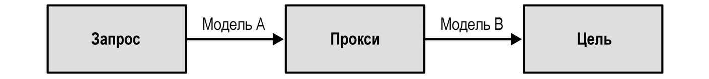{width="4.620102799650044in"
height="0.5134372265966755in"}

> Рис. 9.1. Преобразование моделей через прокси

Реализация прокси зависит от того, в каком режиме осуществляется
взаимодейст- вие между ограниченными контекстами, в синхронном или в
асинхронном.

###### Синхронный режим

Как показано на рис. 9.2, типичным способом преобразования моделей,
используе- мым при синхронном режиме взаимодействия, является
встраивание логики преоб- разования в кодовую базу ограниченного
контекста. В сервисе с открытым прото- колом (open-host service)
преобразование в публичный язык происходит при обра- ботке входящих
запросов, а на уровне предохранительного слоя (anticorruption layer) ---
при вызове вышестоящего ограниченного контекста.

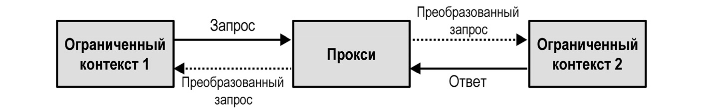{width="4.72623031496063in"
height="0.7366655730533683in"}

> Рис. 9.2. Синхронный режим обмена данными
>
> 166 \| *Часть II. Тактический замысел*

Иногда более экономичным и удобным вариантом может стать перенос логики
преобразования на внешний компонент, например на паттерн API-шлюза (API
Gateway). Этот компонент (API-шлюз, API Gateway) может быть программным
решением с открытым исходным кодом, как, к примеру, Kong или KrakenD или
же управляемой службой облачного провайдера, такой как AWS API Gateway,
Google Apigee или Azure API Management.

Для ограниченных контекстов, реализующих паттерн сервиса с открытым
протоко- лом (open-host service) API-шлюз (API Gateway), за
преобразование внутренней мо- дели в опубликованный язык отвечает язык
(published language), оптимизирован- ный для интеграции. Кроме того, как
показано на рис. 9.3, наличие явного API- шлюза (API Gateway) может
облегчить процесс управления и сопровождения не- скольких версий API
ограниченного контекста.

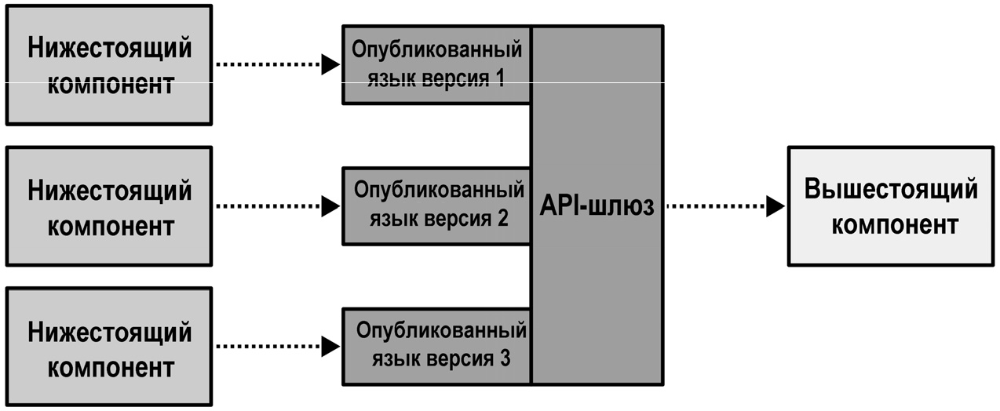{width="4.285614610673666in"
height="1.7466666666666666in"}

> Рис. 9.3. Выставление различных версий опубликованного языка

Предохранительный слой (anticorruption layer), реализованный с помощью
API- шлюза, может использоваться несколькими нижестоящими ограниченными
контек- стами. В таких случаях, как показано на рис. 9.4,
предохранительный слой (anti- corruption layer) действует как
ограниченный контекст, специально предназначен- ный для интеграции.

Такие ограниченные контексты, отвечающие в основном за преобразование
моде- лей для более удобного использования другими компонентами, часто
называют *контекстами обмена*.

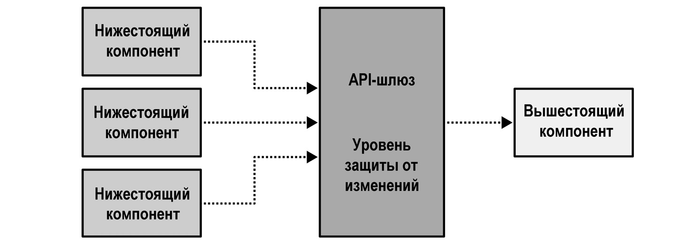{width="4.861304680664917in"
height="1.7133333333333334in"}

> Рис. 9.4. Совместно используемый предохранительный слой
> (anticorruption layer)
>
> *Глава 9. Паттерны взаимодействия* \| 167

###### Асинхронный режим

Для преобразования моделей, используемых в режиме асинхронного обмена
дан- ными, можно реализовать прокси: промежуточный компонент,
подписывающийся на сообщения, поступающие из исходного ограниченного
контекста. Прокси-сервер выполнит все необходимые преобразования модели
и перешлет полученные сооб- щения целевому подписчику (рис. 9.5).

{width="5.275879265091864in"
height="0.5533333333333333in"}

> Рис. 9.5. Преобразование моделей при асинхронном режиме обмена данными

Помимо преобразования модели сообщений, проксирующий компонент также мо-
жет уменьшить шум в целевом ограниченном контексте, отфильтровывая
ненуж- ные сообщения.

Преобразование модели в асинхронном режиме необходимо при реализации
служ- бы с открытым хостом. Весьма распространенной ошибкой является
разработка и предоставление опубликованного языка (published language)
для объектов модели и разрешение публикации событий предметной области в
их исходном виде, что раскрывает модель реализации ограниченного
контекста. Преобразование в асин- хронном режиме можно использовать для
перехвата событий предметной области и преобразования их в
опубликованный язык (published language) --- это обеспечит более
надежную инкапсуляцию деталей реализации ограниченного контекста (рис.
9.6).

Кроме того, перевод сообщений на опубликованный язык (published
language) по- зволяет различать закрытые события, предназначенные для
внутренних потребно- стей ограниченного контекста, и открытые события,
предназначенные для интегра- ции с другими ограниченными контекстами.
Более широкое рассмотрение темы внутренних и публичных сообщений будет
представлено в *главе 15*, посвященной взаимосвязи
предметно-ориентированного проектирования и событийно-ориенти- рованной
архитектуры.

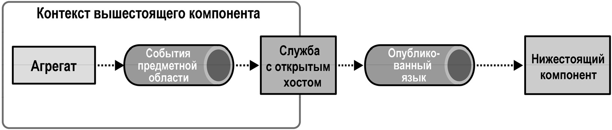{width="5.530973315835521in"
height="1.1666666666666667in"}

> Рис. 9.6. События предметной области на опубликованном языке
>
> 168 \| *Часть II. Тактический замысел*

#### Преобразование моделей с отслеживанием состояния

Для более существенных преобразований моделей, например, когда механизм
пре- образования должен агрегировать исходные данные или объединить
данные из нескольких источников в единую модель, может потребоваться
преобразование с отслеживанием состояния. Давайте подробно обсудим
каждый из этих вариантов использования.

###### Агрегирование входящих данных

Допустим, что для оптимизации производительности ограниченный контекст
заин- тересован в агрегировании входящих запросов и их пакетной
обработке. В этом случае агрегирование может потребоваться для всех
запросов, получаемых как в синхронном, так и в асинхронном режиме (см.
рис. 9.7).

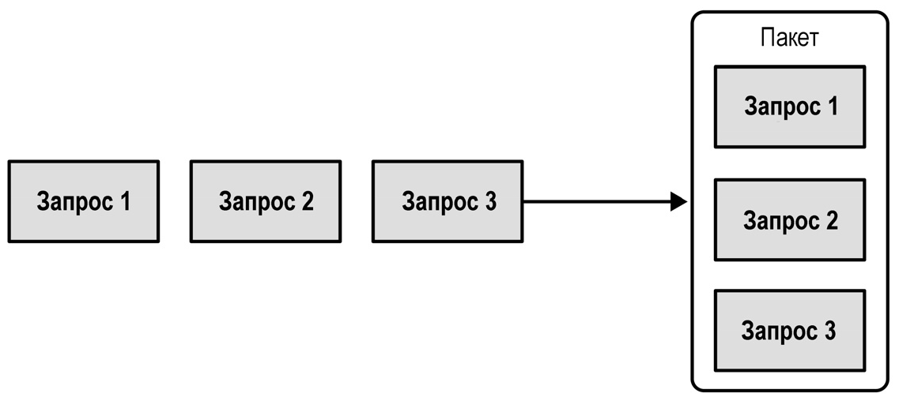{width="3.8101027996500436in"
height="1.6766666666666667in"}

> Рис. 9.7. Пакетирование запросов

Другим распространенным вариантом агрегирования исходных данных является
объединение нескольких детализированных сообщений в одно сообщение,
содер- жащее унифицированные данные (см. рис. 9.8).

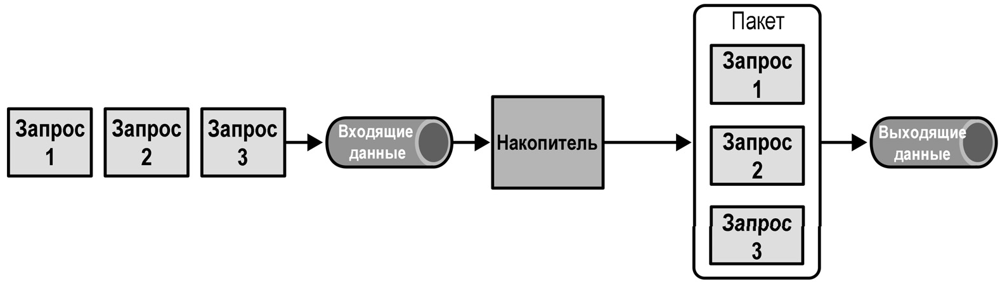{width="5.284551618547682in"
height="1.4866666666666666in"}

> Рис. 9.8. Объединение входящих событий

Преобразование модели с накоплением входящих данных не может быть
реализо- вано с помощью API-шлюза (API Gateway), поэтому здесь требуется
более сложная обработка с отслеживанием состояния. Для отслеживания
входящих данных и со- ответствующей их обработки логике преобразования
требуется собственное посто- янное хранилище (рис. 9.9).

> 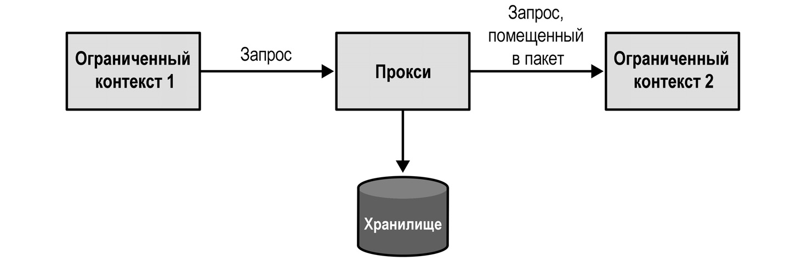{width="4.836863517060367in"
> height="1.59in"}*Глава 9. Паттерны взаимодействия* \| 169
>
> Рис. 9.9. Преобразование модели с отслеживанием состояния

В некоторых случаях для преобразования с отслеживанием состояния можно
вме- сто создания собственного решения воспользоваться готовыми
продуктами, напри- мер платформой потоковой обработки (Kafka, AWS
Kinesis и т. д.) или решением для пакетной обработки (Apache NiFi, AWS
Glue, Spark и т. д.).

###### Объединение нескольких источников

В ограниченном контексте может потребоваться обработка данных,
накопленных сразу из нескольких источников, включая и те, что поступают
из других ограни- ченных контекстов. Типичным примером такой обработки
является применение

1

паттерна backend-for-frontend , в котором пользовательский интерфейс
должен объ-

единять данные, поступающие сразу от нескольких сервисов.

Еще один пример --- ограниченный контекст, который должен обрабатывать
дан- ные из множества других контекстов и реализовывать сложную
бизнес-логику для обработки всех данных. В этом случае может быть
полезно разделить сложности интеграции и бизнес-логики, покрывая
ограниченный контекст предохранительным слоем (anticorruption layer),
накапливающим данные из всех других ограниченных контекстов (рис. 9.10).

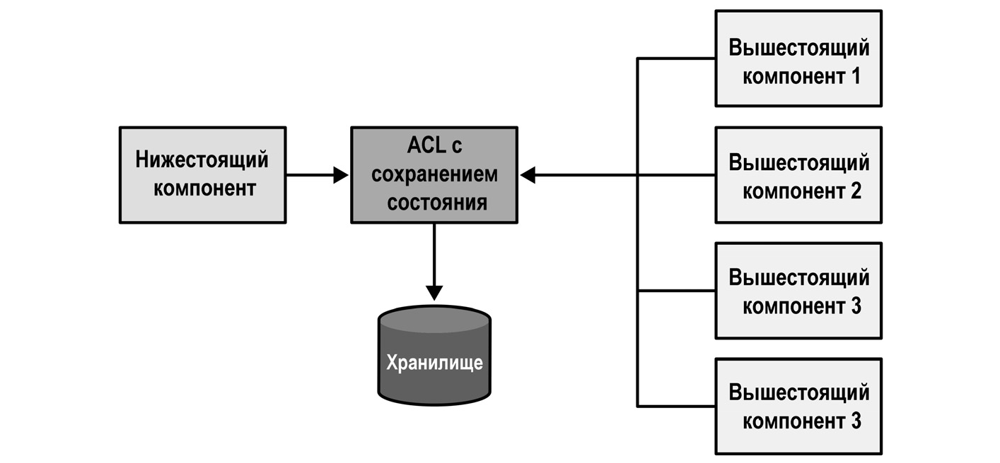{width="4.744443350831146in"
height="2.1866666666666665in"}

> Рис. 9.10. Упрощение модели интеграции с использованием паттерна
> уровня защиты от изменений
>
> ^1^ Richardson, C. Microservice Patterns: With Examples in Java. New
> York: Manning Publications, 2019.
>
> 170 \| *Часть II. Тактический замысел*

### Интеграция агрегатов

В *главе 6* уже говорилось, что одним из способов взаимодействия между
агрегата- ми и всей остальной системой является публикация событий
предметной области. Внешние компоненты могут подписываться на эти
события предметной области и выполнять свою логику. Но как происходит
публикация событий предметной об- ласти в шине сообщений?

Прежде чем перейти к решению, давайте разберем несколько
распространенных ошибок, допускаемых в процессе публикации событий, и
последствия каждого такого подхода. Рассмотрим следующий код:

+------+-----------------------------------+------------+
| > 01 | > public class Campaign           |            |
+------+-----------------------------------+            |
| > 02 | > {                               |            |
+------+-----------------------------------+            |
| > 03 | > \...                            |            |
+------+-----------------------------------+            |
| > 04 | > List\<DomainEvent\> \_events;   |            |
+------+-----------------------------------+            |
| > 05 | > IMessageBus \_messageBus;       |            |
+------+-----------------------------------+            |
| > 06 | > \...                            |            |
+------+-----------------------------------+            |
| > 07 |                                   |            |
+------+-----------------------------------+            |
| > 08 | > public void Deactivate(string   |            |
|      | > reason)                         |            |
+------+-----------------------------------+            |
| > 09 | > {                               |            |
+------+-----------------------------------+            |
| > 10 | > for (l in \_locations.Values()) |            |
+------+-----------------------------------+            |
| > 11 | > {                               |            |
+------+-----------------------------------+            |
| > 12 | > l.Deactivate();                 |            |
+------+-----------------------------------+            |
| > 13 | > }                               |            |
+------+-----------------------------------+            |
| > 14 |                                   |            |
+------+-----------------------------------+            |
| > 15 | > IsActive = false;               |            |
+------+-----------------------------------+            |
| > 16 |                                   |            |
+:====:+===================================+============+
| > 17 | > var newEvent = new              | > reason); |
|      | > CampaignDeactivated(\_id,       |            |
+------+-----------------------------------+------------+
| > 18 | > \_events.Append(newEvent);      |            |
+------+-----------------------------------+------------+
| > 19 | > \_messageBus.Publish(newEvent); |            |
+------+-----------------------------------+------------+
| > 20 | > }                               |            |
+------+-----------------------------------+------------+
| > 21 | > }                               |            |
+------+-----------------------------------+------------+

В строке 17 создается экземпляр нового события. В следующих двух строках
собы- тие добавляется к внутреннему списку событий предметной области
агрегата (строка 18) и публикуется в шине сообщений (строка 19). Эта
реализация публика- ции событий предметной области проста, но
неприемлема. Публикация события предметной области прямо из агрегата
плоха по двум причинам:

Во-первых, событие будет отправлено до того, как новое состояние
агрегата будет зафиксировано в базе данных. Подписчик может получить
уведомление о деакти- вации кампании, но это будет противоречить
состоянию этой кампании.

Во-вторых, что если транзакцию базы данных не удастся зафиксировать
из-за со- стояния гонки (race condition), последующей логики накопления,
делающей опера- цию недействительной, или просто из-за технической
проблемы в базе данных? Несмотря на откат транзакции базой данных,
событие уже опубликовано и переда- но подписчикам, и отменить его
невозможно.

> *Глава 9. Паттерны взаимодействия* \| 171

Давайте попробуем другой вариант:

> 01 public class ManagementAPI 02 {

3.  \...

4.  private readonly IMessageBus \_messageBus;

5.  private readonly ICampaignRepository \_repository; 06 \...

> 07 public ExecutionResult DeactivateCampaign(CampaignId id, string
> reason) 08 {
>
> 09 try
>
> 10 {

11. var campaign = repository.Load(id);

12. campaign.Deactivate(reason);

13. \_repository.CommitChanges(campaign);

> 14

15. var events = campaign.GetUnpublishedEvents();

16. for (IDomainEvent e in events)

17. {

18. \_messageBus.publish(e);

> 19 }
>
> 20 campaign.ClearUnpublishedEvents();
>
> 21 }

22. catch(Exception ex)

23. {

24. \...

> 25 }
>
> 26 }
>
> 27 }

В показанном выше листинге ответственность за публикацию новых событий
предметной области перенесена на прикладной уровень. В строках 11--13
загружа- ется соответствующий экземпляр агрегата Campaign, выполняется
его команда Deactivate, и только после того, как обновленное состояние
успешно зафиксировано в базе данных, в строках с 15 по 20 новые события
предметной области публикуют- ся на шине сообщений. Но можно ли
довериться этому коду? Нет, нельзя.

В данном случае процесс, выполняющий логику, по какой-то причине может
не опубликовать события предметной области. Возможно, шина сообщений не
рабо- тает. Или сервер, на котором выполняется код, дает сбой сразу
после фиксации транзакции базы данных, но перед публикацией событий
система все равно будет находиться в несогласованном состоянии, что
означает, что транзакция базы данных зафиксирована, но события
предметной области никогда не будут опубли- кованы.

Все эти крайности можно обойти с помощью паттерна исходящих сообщений.

> 172 \| *Часть II. Тактический замысел*

#### Паттерн исходящих сообщений (Outbox)

Паттерн исходящих сообщений (рис. 9.11) обеспечивает надежную публикацию
событий предметной области по следующему алгоритму:

- Состояния обновленного агрегата и новые события предметной области
  фикси- руются в одной и той же атомарной транзакции.

- Ретранслятор сообщений извлекает только что зафиксированные события
  пред- метной области из базы данных.

- Ретранслятор публикует события предметной области на шине сообщений.

- При успешной публикации ретранслятор либо помечает события как
  опублико- ванные в базе данных, либо полностью их удаляет.

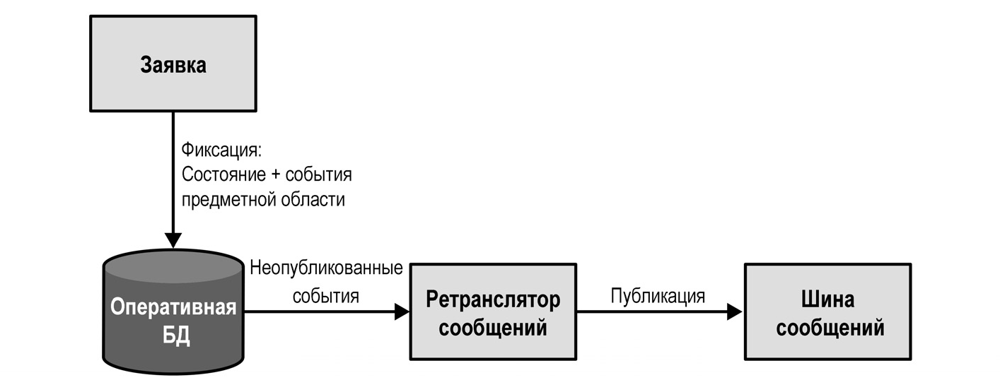{width="4.741955380577428in"
height="1.7933333333333332in"}

> Рис. 9.11. Паттерн исходящих сообщений

При использовании реляционной базы данных лучше воспользоваться ее
способ- ностью атомарно фиксировать две таблицы и применить для хранения
сообщений специально выделенную таблицу (см. рис. 9.12).

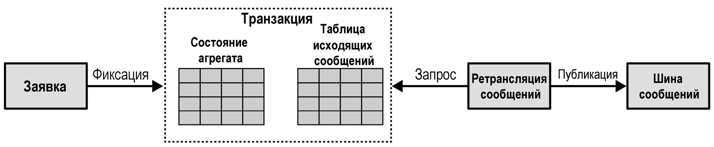{width="5.5095319335083115in"
height="1.13in"}

Рис. 9.12. Таблица исходящих сообщений

При использовании базы данных NoSQL, которая не поддерживает транзакции
с несколькими документами, исходящие события предметной области должны
быть встроены в запись агрегата. Например:

> {
>
> \"campaign-id\": \"364b33c3-2171-446d-b652-8e5a7b2be1af\", \"state\":
> {
>
> \"name\": \"Autumn 2017\",
>
> *Глава 9. Паттерны взаимодействия* \| 173
>
> \"publishing-state\": \"DEACTIVATED\", \"ad-locations\": \[
>
> \...
>
> \]
>
> \...
>
> },
>
> \"outbox\": \[
>
> {
>
> \"campaign-id\": \"364b33c3-2171-446d-b652-8e5a7b2be1af\", \"type\":
> \"campaign-deactivated\",
>
> \"reason\": \"Goals met\", \"published\": false
>
> }
>
> \]
>
> }

В этом примере можете заметить дополнительное свойство JSON-документа,

outbox, содержащее список событий предметной области, подлежащих
публикации.

###### Извлечение неопубликованных событий

Публикующий ретранслятор (publishing relay) может извлекать новые
события предметной области как по запросу (pull-based), так и по
уведомлению (push-based):

> *Pull: запрос к поставщику (producer)*
>
> Ретранслятор может постоянно запрашивать базу данных на предмет
> неопубли- кованных событий. Чтобы нагрузку на базу данных, вызванную
> постоянными запросами, свести к минимуму, нужно создать надлежащие
> индексы.
>
> *Push: отслеживание журнала транзакций*
>
> Здесь для упреждающего вызова публикующего ретранслятора (publishing
> relay) при добавлении новых событий можно воспользоваться набором
> функций базы данных. Например, некоторые реляционные базы данных
> позволяют получать уведомления об обновленных или вставленных записях
> путем отслеживания журнала транзакций базы данных. А некоторые базы
> данных NoSQL представ- ляют зафиксированные изменения в виде потоков
> событий (например, AWS DynamoDB Streams).

Важно отметить, что паттерн исходящих сообщений (outbox pattern)
гарантирует как минимум однократную (at least once) доставку сообщений:
если ретранслятор выйдет из строя сразу после публикации сообщения, но
до того, как оно будет по- мечено в базе данных как опубликованное, это
же сообщение будет опубликовано снова при следующей итерации.

Далее будет рассмотрен способ использования надежной публикации событий
предметной области для преодоления некоторых ограничений, налагаемых
прин- ципами проектирования агрегатов.

> 174 \| *Часть II. Тактический замысел*

#### Сага

Один из основных принципов построения агрегатов заключается в
ограничении каждой транзакции одним экземпляром агрегата. Тем самым
гарантируется, что границы агрегата будут тщательно продуманы и
инкапсулированы в согласованный набор бизнес-функций. Но бывают случаи,
когда нужно реализовать бизнес-про- цесс, охватывающий сразу несколько
агрегатов.

Рассмотрим следующий пример: при активации рекламная кампания должна
авто- матически отправлять свои рекламные материалы своему издателю.
После получе- ния подтверждения от издателя статус публикации кампании
должен измениться на Published (Опубликовано). В случае отклонения
издателем кампания должна быть помечена как Rejected (Отклонено).

Эта последовательность действий охватывает две бизнес-сущности:
рекламную кампанию и издательство. Совместное размещение сущностей в
одной и той же границе агрегата определенно было бы излишним, поскольку
это реально разные бизнес-сущности, которые имеют разные обязанности и
могут принадлежать к раз- ным ограниченным контекстам. Вместо этого
данная последовательность действий может быть реализована в виде саги.

Под *сагой* понимается длительный бизнес-процесс. И речь здесь не
обязательно о времени, поскольку саги могут длиться от нескольких секунд
до нескольких лет, а скорее о транзакциях, а еще точнее, о
бизнес-процессе, охватывающем сразу не- сколько транзакций. Транзакции
могут обрабатываться не только агрегатами, но и любым компонентом,
генерирующим события предметной области и отвечающим на команды. Сага
отслеживает события, генерируемые соответствующими компо- нентами, и
выдает последующие команды другим компонентам. Если один из ша- гов
выполнения завершается с ошибкой, сага отвечает за запуск
соответствующих компенсирующих действий, чтобы гарантировать, что
состояние системы остается согласованным.

Давайте посмотрим, как процесс публикации рекламной кампании из
предыдущего примера можно реализовать в виде саги (см. рис. 9.13).

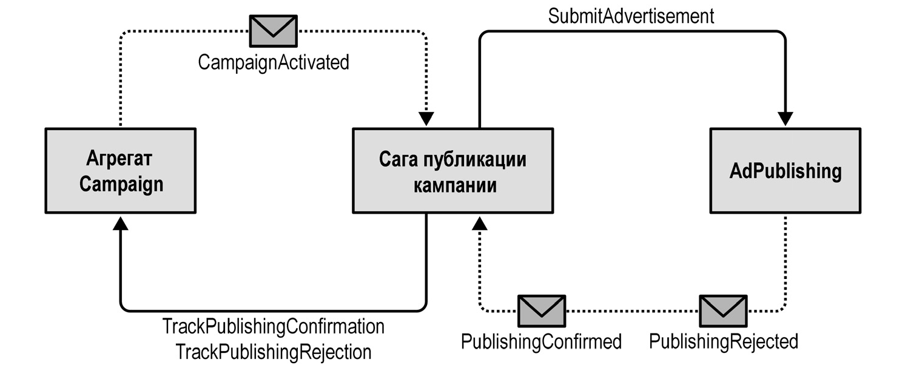{width="5.035989720034996in"
height="2.0433333333333334in"}

> Рис. 9.13. Сага
>
> *Глава 9. Паттерны взаимодействия* \| 175
>
> Чтобы реализовать процесс публикации, сага должна отслеживать событие
> CampaignActivated из агрегата Campaign и события PublishingConfirmed и
> PublishingRejected из ограниченного контекста AdPublishing. Сага
> должна выполнить команду SubmitAdvertisement для AdPublishing и
> команды TrackPublishingConfirmation и TrackPublishingRejection для
> агрегата Campaign. В этом примере команда TrackPublishingRejection
> является компенсирующим действием, гарантирующим, что рекламная
> кампания не будет указана как активная. Рассмотрим код:
>
> public class CampaignPublishingSaga
>
> {
>
> private readonly ICampaignRepository \_repository;
>
> private readonly IPublishingServiceClient \_publishingService;
>
> \...
>
> public void Process(CampaignActivated \@event)
>
> {
>
> var campaign =
> [\_repository.Load(@event.CampaignId);](mailto:_repository.Load(@event.CampaignId)
>
> var advertisingMaterials = campaign.GenerateAdvertisingMaterials();
>
> [\_publishingService.SubmitAdvertisement(@event.CampaignId,](mailto:_publishingService.SubmitAdvertisement(@event.CampaignId)
> advertisingMaterials);
>
> }
>
> public void Process(PublishingConfirmed \@event)
>
> {
>
> var campaign =
> [\_repository.Load(@event.CampaignId);](mailto:_repository.Load(@event.CampaignId)
> [campaign.TrackPublishingConfirmation(@event.ConfirmationId);](mailto:campaign.TrackPublishingConfirmation(@event.ConfirmationId)
>
> \_repository.CommitChanges(campaign);
>
> }
>
> public void Process(PublishingRejected \@event)
>
> {
>
> var campaign =
> [\_repository.Load(@event.CampaignId);](mailto:_repository.Load(@event.CampaignId)
> [campaign.TrackPublishingRejection(@event.RejectionReason);](mailto:campaign.TrackPublishingRejection(@event.RejectionReason)
>
> \_repository.CommitChanges(campaign);
>
> }
>
> }

В показанном выше примере для доставки соответствующих событий и реакции
на них с выполнением соответствующих команд используется инфраструктура
обмена сообщениями. Это пример относительно простой саги, поскольку она
не работает с состояниями. Но нередко попадаются саги, требующие
управления состоянием: например, для отслеживания выполненных операций,
чтобы в случае сбоя можно было принять соответствующие компенсирующие
меры. В такой ситуации сага может быть реализована как агрегат,
основанный на событиях, сохраняющий пол- ную историю полученных событий
и отправленных команд. Но логика выполнения команды должна быть вынесена
за пределы самой саги и выполняться асинхронно, наподобие отправки
событий предметной области в паттерне исходящих сооб- щений:

> 176 \| *Часть II. Тактический замысел*
>
> public class CampaignPublishingSaga
>
> {
>
> private readonly ICampaignRepository \_repository; private readonly
> IList\<IDomainEvent\> \_events;
>
> \...
>
> public void Process(CampaignActivated activated)
>
> {
>
> var campaign = \_repository.Load(activated.CampaignId);
>
> var advertisingMaterials = campaign.GenerateAdvertisingMaterials();
> var commandIssuedEvent = new CommandIssuedEvent(
>
> target: Target.PublishingService,
>
> command: new SubmitAdvertisementCommand(activated.CampaignId,
> advertisingMaterials));
>
> \_events.Append(activated);
>
> \_events.Append(commandIssuedEvent);
>
> }
>
> public void Process(PublishingConfirmed confirmed)
>
> {
>
> var commandIssuedEvent = new CommandIssuedEvent( target:
> Target.CampaignAggregate,
>
> command: new TrackConfirmation(confirmed.CampaignId,
> confirmed.ConfirmationId));
>
> \_events.Append(confirmed);
>
> \_events.Append(commandIssuedEvent);
>
> }
>
> public void Process(PublishingRejected rejected)
>
> {
>
> var commandIssuedEvent = new CommandIssuedEvent( target:
> Target.CampaignAggregate,
>
> command: new TrackRejection(rejected.CampaignId,
> rejected.RejectionReason));
>
> \_events.Append(rejected);
>
> \_events.Append(commandIssuedEvent);
>
> }
>
> }

В этом примере ретранслятор исходящих сообщений должен будет выполнять
команды на соответствующих приемниках (endpoints) для каждого экземпляра
CommandIssuedEvent. Как и в случае с публикацией событий предметной
области, от- деление перехода состояния саги от выполнения команд
гарантирует стабильное выполнение команд даже при завершении процесса
ошибкой на любом этапе.

> *Глава 9. Паттерны взаимодействия* \| 177

###### Согласованность {#согласованность-2}

Несмотря на то что сага управляет транзакцией, которая включает
изменение нескольких компонентов, состояние изменяемых компонентов в
конечном счете подчиняется принципу согласованности (син. итоговая
согласованность, eventual consistency). И хотя сага в конечном итоге
выполнит соответствующие команды, никакие две транзакции нельзя считать
атомарными. Это соотносится с еще одним принципом построения агрегатов:

> Строго согласованными можно считать только данные в пределах границ
> агрегата. А все, что вне этих границ, может считаться согласованным
> только в конечном счете.

Воспользуйтесь этим обстоятельством в качестве руководящего принципа,
чтобы убедиться в отсутствии злоупотребления сагами с целью компенсации
неверно выбранных границ агрегатов. Бизнес-операции, которые должны
принадлежать одному агрегату, требуют строго согласованных данных.

Сагу часто путают с паттерном диспетчера процессов. Хотя их реализации
похожи, они весьма различны. В следующем разделе будут рассмотрены
назначение пат- терна диспетчера процессов и его отличия от паттерна
саги.

#### Диспетчер процессов

Сага управляет простым линейным потоком действий. Строго говоря, сага
сопос- тавляет события соответствующим командам. В примерах,
использованных для де- монстрации реализации саги, в действительности
происходила реализация простого сопоставления событий с командами:

- Событие CampaignActivated для команды
  PublishingService.SubmitAdvertisement.

- Событие PublishingConfirmed для команды Campaign.TrackConfirmation.

- Событие PublishingRejected для команды Campaign.TrackRejection.

Паттерн *диспетчера процессов*, показанный на рис. 9.14, предназначен
для реали- зации процесса, основанного на бизнес-логике. Он определяется
как центральный процессор, поддерживающий состояние последовательности и
определяющий сле-

> 2

дующие этапы обработки .

Как правило, если сага для выбора правильного курса действий содержит
инструк- ции if-else, то это, скорее всего, диспетчер процессов.

Еще одно отличие диспетчера процессов от саги заключается в том, что
экземпляр саги создается неявно при отслеживании определенного события,
как в CampaignActivated в предыдущих примерах. А вот диспетчер процессов
не может быть привязан к одному исходному событию. Наоборот, это
последовательный бизнес-процесс, состоящий из нескольких шагов.
Следовательно, диспетчер про- цессов должен быть создан явным образом.
Рассмотрим следующий пример:

> ^2^ Hohpe, G., & Woolf, B. Enterprise Integration Patterns: Designing,
> Building, and Deploying Messaging Solutions. Boston: Addison-Wesley,
> 2003.
>
> 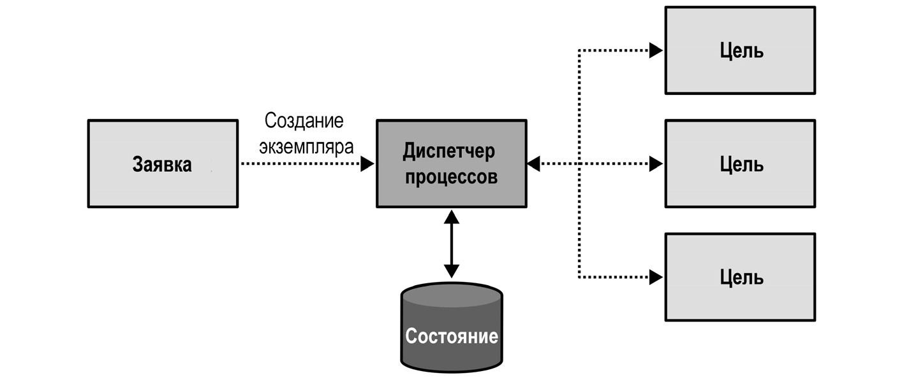{width="4.775507436570429in"
> height="1.9899989063867016in"}178 \| *Часть II. Тактический замысел*
>
> Рис. 9.14. Диспетчер процессов

Бронирование мест для командировки начинается с того, что по алгоритму
мар- шрутизации выбирается наиболее экономичный маршрут полета и
сотруднику по- ступает просьба о его утверждении. Если сотрудник
предпочитает другой маршрут, его должен одобрить непосредственный
руководитель этого сотрудника. После бронирования рейса необходимо
забронировать один из предварительно утвер- жденных отелей на
соответствующие даты. Если нет доступных отелей, билеты на самолет
должны быть аннулированы.

В этом примере нет центрального объекта, инициирующего процесс
бронирования поездки. Бронирование мест --- это процесс, и он должен
быть реализован как ме- неджер процессов (рис. 9.15).

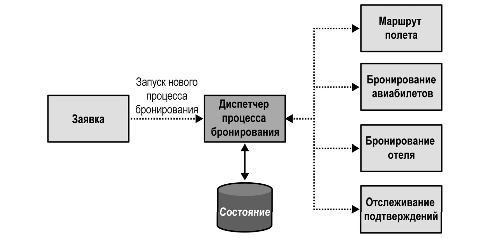{width="4.739987970253718in"
height="2.2933333333333334in"}

> Рис. 9.15. Диспетчер бронирования

С позиции реализации диспетчеры процессов часто создаются в виде
агрегатов, основанных либо на состояниях, либо на событиях. Например:

> public class BookingProcessManager
>
> {
>
> private readonly IList\<IDomainEvent\> \_events;
>
> *Глава 9. Паттерны взаимодействия* \| 179
>
> private BookingId \_id;
>
> private Destination \_destination; private TripDefinition
> \_parameters; private EmployeeId \_traveler; private Route \_route;
>
> private IList\<Route\> \_rejectedRoutes; private IRoutingService
> \_routing;
>
> \...
>
> public void Initialize(Destination destination,
>
> TripDefinition parameters, EmployeeId traveler)
>
> {
>
> \_destination = destination;
>
> \_parameters = parameters;
>
> \_traveler = traveler;
>
> \_route = \_routing.Calculate(destination, parameters);
>
> var routeGenerated = new RouteGeneratedEvent( BookingId: \_id,
>
> Route: \_route);
>
> var commandIssuedEvent = new CommandIssuedEvent(
>
> command: new RequestEmployeeApproval(\_traveler, \_route)
>
> );
>
> \_events.Append(routeGenerated);
>
> \_events.Append(commandIssuedEvent);
>
> }
>
> public void Process(RouteConfirmed confirmed)
>
> {
>
> var commandIssuedEvent = new CommandIssuedEvent( command: new
> BookFlights(\_route, \_parameters)
>
> );
>
> \_events.Append(confirmed);
>
> \_events.Append(commandIssuedEvent);
>
> }
>
> public void Process(RouteRejected rejected)
>
> {
>
> var commandIssuedEvent = new CommandIssuedEvent( command: new
> RequestRerouting(\_traveler, \_route)
>
> );
>
> \_events.Append(rejected);
>
> \_events.Append(commandIssuedEvent);
>
> }
>
> 180 \| *Часть II. Тактический замысел*
>
> public void Process(ReroutingConfirmed confirmed)
>
> {
>
> \_rejectedRoutes.Append(route);
>
> \_route = \_routing.CalculateAltRoute(destination, parameters,
> rejectedRoutes); var routeGenerated = new RouteGeneratedEvent(
>
> BookingId: \_id, Route: \_route);
>
> var commandIssuedEvent = new CommandIssuedEvent(
>
> command: new RequestEmployeeApproval(\_traveler, \_route)
>
> );
>
> \_events.Append(confirmed);
>
> \_events.Append(routeGenerated);
>
> \_events.Append(commandIssuedEvent);
>
> }
>
> public void Process(FlightBooked booked)
>
> {
>
> var commandIssuedEvent = new CommandIssuedEvent( command: new
> BookHotel(\_destination, \_parameters)
>
> );
>
> \_events.Append(booked);
>
> \_events.Append(commandIssuedEvent);
>
> }
>
> \...
>
> }

В этом примере диспетчер процессов имеет свой явно указанный
идентификатор и постоянное состояние, описывающее поездку, требующую
бронирования. Как и в предыдущем примере саги, диспетчер процессов
подписывается на события, управляющие рабочим процессом (RouteConfirmed,
RouteRejected, ReroutingConfirmed и т. д.), и создает экземпляры событий
типа CommandIssuedEvent, которые будут обра- батываться ретранслятором
исходящих сообщений для выполнения конкретных команд.

### Вывод {#вывод-6}

В этой главе рассматривались различные паттерны интеграции компонентов
систе- мы. Глава началась с изучения паттернов для преобразования
моделей, которые можно использовать для реализации предохранительного
слоя (anticorruption layer) или сервисов с открытым протоколом
(open-host service). Было показано, что пре- образования могут
осуществляться сходу или же следовать более сложной логике, требующей
отслеживания состояний.

Паттерны исходящих сообщений (outbox pattern) являются надежным способом
публикации событий предметной области, принадлежащих агрегатам. Они
гаран-

> *Глава 9. Паттерны взаимодействия* \| 181

тируют четкую публикацию событий предметной области даже в случае сбоев
раз- личных процессов.

Сагу можно использовать для реализации простых бизнес-процессов, в
которые вовлечено несколько компонентов. Более сложные бизнес-процессы
могут быть реализованы с использованием паттерна диспетчера процессов.
Оба паттерна осно- ваны на асинхронных реакциях на события предметной
области и отправке команд.

### Упражнения

1.  Какой из паттернов интеграции с ограниченным контекстом требует
    реализации логики преобразования модели?

> А) Конформист (conformist).
>
> Б) Предохранительный слой (anticorruption layer).
>
> В) Сервис с открытым протоколом (open-host service). Г) Б и В.

2.  Какова цель паттерна исходящих сообщений (outbox pattern)?

> А) Отделить инфраструктуру обмена сообщениями от уровня бизнес-логики
> системы.
>
> Б) Обеспечить надежную публикацию сообщений.
>
> В) Поддержать реализацию паттерна модели предметной области,
> основанного на событиях (event-sourced domain model).
>
> Г) А и В.

3.  Какие есть другие возможные варианты использования паттерна
    исходящих со- общений (outbox pattern), кроме публикации сообщений
    на шине сообщений?

4.  Чем сага отличается от диспетчера процессов?

> А) Диспетчер процессов требует явного создания экземпляра, а экземпляр
> саги создается неявно при публикации соответствующего события
> предметной области.
>
> Б) В отличие от диспетчера процессов, сага никогда не требует
> сохранения со- стояния своего выполнения.
>
> В) Саге требуются компоненты, которыми она манипулирует с целью
> реализа- ции паттерна «События как источник данных» (Event Sourcing),
> а диспетчеру процессов они не требуются.
>
> Г) Диспетчер процессов больше подходит для сложных бизнес-процессов.
> Д) Правильными являются утверждения А и Г.

182 \| *Часть II. Тактический замысел*

ЧАСТЬ III

# Применение предметно-ориентированного проектирования на практике

В первой и второй частях книги рассматривались инструменты, используемые
при предметно-ориентированном проектировании, позволяющие принимать
стратеги- ческие и тактические проектные решения. В этой части книги
будет осуществлен переход от теории к практике. Вам предстоит научиться
применять предметно- ориентированное проектирование в разработке
реальных проектов.

- В *главе 10* все уже рассмотренные вопросы стратегического и
  тактического про- ектирования объединены в простые эмпирические
  правила, упрощающие про- цесс принятия проектных решений. Здесь будут
  рассмотрены способы быстрого

> определения паттернов, соответствующих сложности предметной области и
> ее потребностям.

- В *главе 11* предметно-ориентированное проектирование будет
  рассмотрено с другой точки зрения. Разработка верного решения,
  несомненно, важна, но не вполне достаточна. По мере разработки проекта
  нужно придерживаться приня-

> того решения. Здесь будет рассмотрено применение инструментов
> предметно- ориентированного проектирования, предназначенных для
> последующей под- держки и развития решений по проектированию
> программных средств.

- В *главе 12* состоится знакомство с EventStorming, с практикой,
  упрощающей процесс исследования предметной области и создания единого
  языка (ubiquitous language).

- В *главе 13*, завершающей третью часть книги, будет представлена
  подборка со- ветов и рекомендаций по «мягкому» внедрению и включению
  паттернов и прак- тических приемов предметно-ориентированного
  проектирования в уже сущест-

> вующие проекты, работать над которыми приходится чаще всего.

[]{#ограниченные-контексты-1 .anchor}ГЛАВА 10

## Эвристика проектирования

«По обстоятельствам» --- правильный, но не вполне практичный ответ почти
на любой вопрос в области разработки программных средств. В этой главе
мы рас- смотрим, от чего это «все зависит».

В первой части книги рассматривались инструменты
предметно-ориентированного проектирования, предназначенные для анализа
предметных областей и принятия стратегических проектных решений. Во
второй части рассматривались тактические паттерны проектирования:
различные способы реализации бизнес-логики, органи- зации архитектуры
системы и коммуникации между компонентами системы. Эта глава объединяет
первую и вторую части. Здесь будут рассмотрены эвристические приемы
применения инструментов анализа для принятия различных решений по
проектированию программных средств: т. е. предметно-ориентированного
(бизнес) проектирования (программных средств).

Но сначала, поскольку эта глава посвящена эвристике проектирования,
давайте начнем с определения самого понятия эвристики.

### Эвристика

Эвристика --- это не строгое правило, состоятельность которого
гарантированно и математически доказана в 100% случаев. Скорее, это
правило из разряда эмпириче- ских: совершенство не гарантируется, но
достаточность для достижения непосред- ственных целей, несомненно,
имеется. Иными словами, использование эвристи- ки --- это эффективный
подход к решению задач, игнорирующий шум, присущий многим сигналам.
Эвристика позволяет сконцентрировать внимание на «превали-

1

рующих силах», отраженных в наиболее важных сигналах .

Эвристики, представленные в этой главе, сосредоточены на основных
свойствах различных предметных областей и на сущностях задач, решаемых с
помощью раз- личных проектных решений.

### Ограниченные контексты {#ограниченные-контексты-2}

Как следует из усвоенного при изучении *главы 3*, под определение
корректного ограниченного контекста (bounded context) могут подходить
как широкие, так и узкие

> ^1^ Gigerenzer, G., Todd, P. M., & ABC Research Group (Research Group,
> Max Planck Institute, Germany). Simple Heuristics That Make Us Smart.
> New York: Oxford University Press, 1999.
>
> *Глава 10. Эвристика проектирования* \| 185

границы, охватываемые применением непротиворечивого единого языка
(ubiquitous language). И все же каков оптимальный размер ограниченного
контекста? Этот вопрос особенно важен в свете частого отождествления
ограниченных контекстов с микросервисами. Нужно ли неизменно стремиться
к наименьшим возможным ограниченным контекстам? Как говорит мой друг Ник
Тьюн (Nick Tune):

> Для определения границ сервиса существует множество полезных и
> показательных эвристик. И его размер относится к разряду наименее
> полезных.

Вместо превращения модели в функцию желаемого размера (проводя
оптимизацию под небольшие ограниченные контексты) гораздо эффективнее
сделать обратное: рассматривать размер ограниченного контекста как
функцию модели, которую он охватывает.

Изменения в программных средствах, влияющих сразу на несколько
ограниченных контекстов, обходятся дорого и требуют тщательной
согласованности, особенно если затрагиваемые ограниченные контексты
реализуются разными командами. Подобные изменения, не инкапсулированные
в один ограниченный контекст, сиг- нализируют о неэффективном
определении границ контекстов. К сожалению, рест- руктуризация границ
ограниченного контекста является весьма дорогостоящим делом, и во многих
случаях неэффективность границ обходят стороной, что в ко- нечном итоге
приводит к накоплению технического долга (см. рис. 10.1).

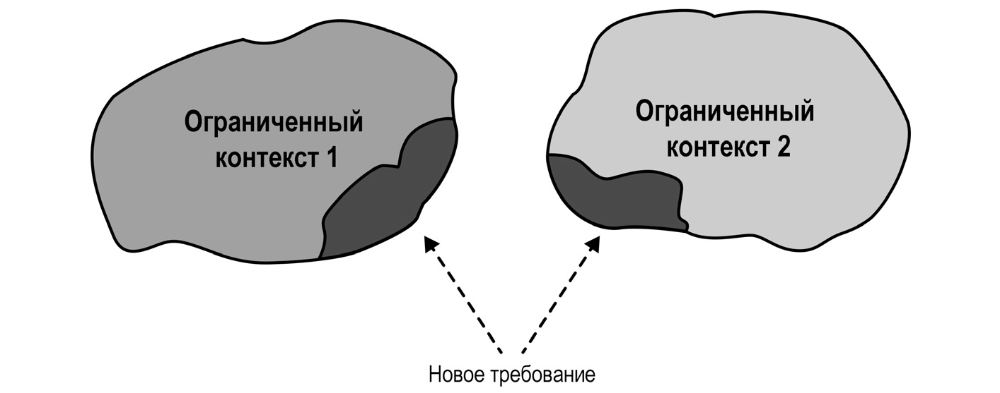{width="4.77119094488189in"
height="1.8566666666666667in"}

> Рис. 10.1. Изменение, затрагивающее сразу несколько ограниченных
> контекстов

Изменения, нарушающие границы ограниченных контекстов, обычно
происходят, когда предметная область недостаточно изучена или
бизнес-требования подверже- ны частым изменениям. Из *главы 1* известно,
что основным поддоменам (core subdomains), особенно на ранних этапах их
реализации, присущи как изменчивость, так и неопределенность. Этим
обстоятельством можно воспользоваться в качестве эвристики
проектирования границ ограниченных контекстов.

Широкие границы ограниченного контекста, или же границы, охватывающие
сразу несколько поддоменов, делают менее опасными как ошибки в
определении границ, так и ошибки в моделировании входящих в них
поддоменов. Реструктуризация ло- гических границ обходится значительно
дешевле, чем переопределение физических границ. Следовательно, при
разработке ограниченных контекстов следует начинать

> 186 \| *Часть III. Применение предметно-ориентированного
> проектирования на практике*

с границ с более широким охватом. При необходимости, по мере
приобретения знаний предметной области, широкие границы нужно сузить.

Такая эвристика применяется в основном к ограниченным контекстам,
охватываю- щим основные поддомены (core subdomains), поскольку как
универсальные (generic), так и вспомогательные (supporting) подобласти
отличаются большей сформулированностью и гораздо меньшей изменчивостью.
При создании ограни- ченного контекста, содержащего основной поддомен
(core subdomain), от непред- виденных изменений можно защититься,
включив в него другие поддомены, с ко- торыми основной поддомен
взаимодействует чаще всего. Это, как показано на рис. 10.2, могут быть
другие основные, или даже вспомогательные, или универ- сальные
подобласти.

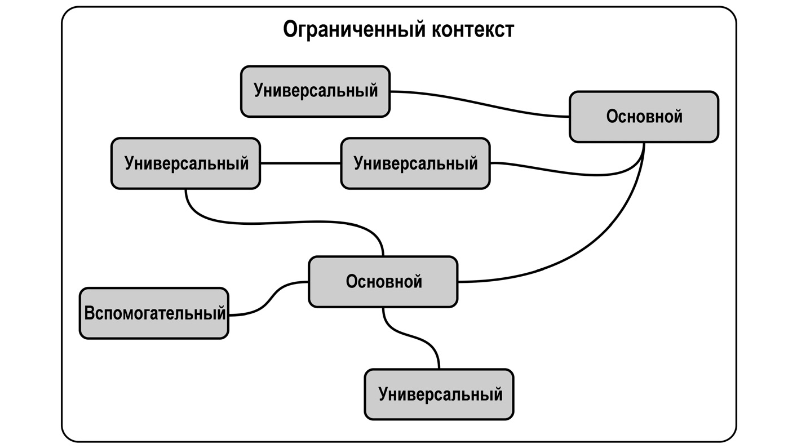{width="4.742356736657918in"
height="2.65in"}

> Рис. 10.2. Широкие границы ограниченного контекста

### Паттерны реализации бизнес-логики

В *главах 5--7*, где подробно обсуждалась бизнес-логика, были раскрыты
четыре раз- личных способа ее моделирования: транзакционный сценарий
(transaction script), активная запись (active record), модель предметной
области (domain model) и пат- терны модели предметной области,
основанной на событиях (event-sourced domain model).

И транзакционный сценарий, и активная запись больше подходят для
поддоменов с простой бизнес-логикой: например, для вспомогательных
(supporting) подобла- стей или для интеграции стороннего решения в
универсальную (generic) подоб- ласть. Разница между этими двумя
паттернами заключается в сложности структур данных. Транзакционный
сценарий можно использовать для простых структур данных, а активная
запись помогает инкапсулировать маппинг сложных структур данных в базу
данных.

> *Глава 10. Эвристика проектирования* \| 187

Модель предметной области и ее вариант, модель предметной области,
основанная на событиях (event-sourced domain model), больше подходят для
поддоменов со сложной бизнес-логикой, т. е. для основных (core)
поддоменов. Для тех же основ- ных поддоменов, которые имеют дело с
финансовыми транзакциями и выполняют обязательства перед законом по
предоставлению журнала аудита или же требуют глубокой аналитики
поведения системы, больше подойдут модели предметной об- ласти,
основанные на событиях.

С учетом вышеизложенного эффективная эвристика выбора подходящего
паттерна реализации бизнес-логики состоит в том, чтобы задаться
следующими вопросами:

- Отслеживаются ли поддоменом деньги или другие денежные операции,
  должен ли он предоставлять надлежащий журнал аудита или требуется ли
  бизнесу глу- бокий анализ ее поведения? Если да, следует
  воспользоваться моделью пред-

> метной области, основанной на событиях (event-sourced domain model).
> Если нет, то\...

- Отличается ли бизнес-логика поддомена особой сложностью? Если да,
  нужно озаботиться реализацией модели предметной области. Если нет,
  то\...

- Включает ли поддомен сложные структуры данных? Если да, следует
  восполь- зоваться паттерном «Активная запись». Если нет, то\...

- Следует реализовать транзакционный сценарий.

Благодаря существованию тесной связи между сложностью поддомена и его
типом эвристику, как показано на рис. 10.3, можно визуализировать,
используя предмет- но-ориентированное дерево решений.

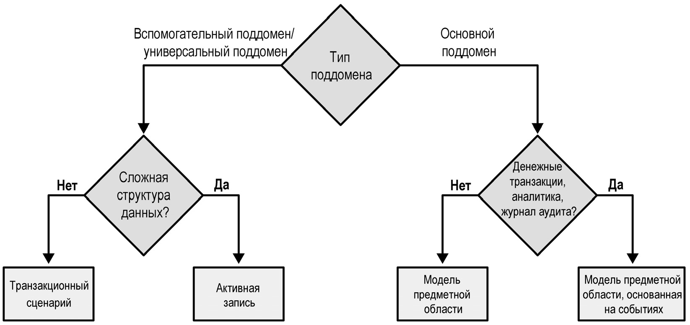{width="5.548812335958005in"
height="2.5866666666666664in"}

> Рис. 10.3. Дерево решений для выбора паттерна реализации бизнес-логики

Для определения разницы между сложной и простой бизнес-логикой можно
вос- пользоваться другой эвристикой. Граница между этими двумя типами
бизнес- логики не очень четкая, но важная. Как правило, сложная
бизнес-логика включает

> 188 \| *Часть III. Применение предметно-ориентированного
> проектирования на практике*

в себя составные бизнес-правила, инварианты и алгоритмы. А простой
подход ка- сается в основном проверки входных данных. Еще одна эвристика
для оценки сложности касается замысловатости самого единого языка. Что
положено в его основу --- описание CRUD-операций или же описание более
сложных бизнес-про- цессов и правил?

Принятие решения о паттерне реализации бизнес-логики, сообразующемся с
ее сложностью и структурами данных, --- это способ проверки ваших
предположений о типе поддомена. Предположим, что поддомен считается
основным (core), но наи- более подходящим видится шаблон активной записи
или транзакционный сцена- рий. Или же предположим, что подобласть
считается вспомогательной (supporting), но требует модели предметной
области или модели предметной области, основан- ной на событиях
(event-sourced domain model), в таких случаях появляется отличная
возможность пересмотреть свои предположения о поддомене и о предметной
об- ласти в целом. Следует помнить, что конкурентное преимущество
основного под- домена не обязательно должно замыкаться на техническую
составляющую.

### Архитектурные паттерны

В *главе 8* рассматривались три архитектурных паттерна: слоистая
архитектура, порты и адаптеры и CQRS.

Выявление предполагаемого паттерна реализации бизнес-логики упрощает
выбор архитектурного паттерна:

- Для модели предметной области, основанной на событиях, требуется CQRS.
  В противном случае система будет крайне ограничена в возможностях
  запроса данных, извлекая только один конкретный инстанс агрегата по
  его индентифи- катору.

- Модель предметной области требует использования архитектуры портов и
  адап- теров. В противном случае слоистая архитектура затруднит
  реализацию агрега- тов и объектов-значений, ничего не знающих о
  системах хранения данных.

- Паттерн активной записи удачнее всего сочетается с многоуровневой
  архитек- турой с дополнительным прикладным уровнем (сервисом) для
  логики, управ- ляющей активными записями.

- Паттерн транзакционного сценария может быть реализован с минимальной
  слоистой архитектурой, состоящей всего из трех уровней (трехслойной).

Единственным исключением из предыдущей эвристики является шаблон CQRS.
Он может быть полезен не только для модели предметной области,
основанной на со- бытиях (event-sourced domain model), но и для любого
другого паттерна, если под- домену требуется представление о своих
данных в нескольких моделях хранения.

Дерево решений для выбора архитектурного шаблона на основе этих эвристик
по- казано на рис. 10.4.

> 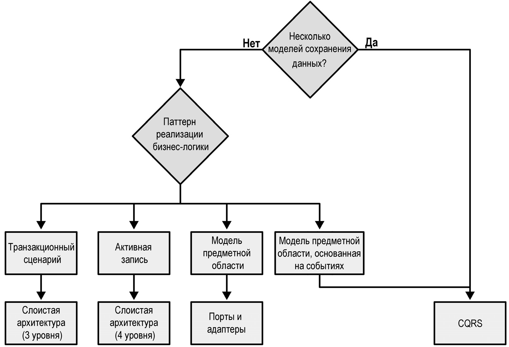{width="5.507353455818023in"
> height="3.7266666666666666in"}*Глава 10. Эвристика проектирования* \|
> 189
>
> Рис. 10.4. Дерево решений по выбору архитектурного паттерна

### Стратегия тестирования

Представлением о паттерне реализации бизнес-логики и об архитектурном
шаблоне можно воспользоваться в качестве эвристики для выбора стратегии
тестирования кодовой базы. Взгляните на три стратегии тестирования,
показанные на рис. 10.5.

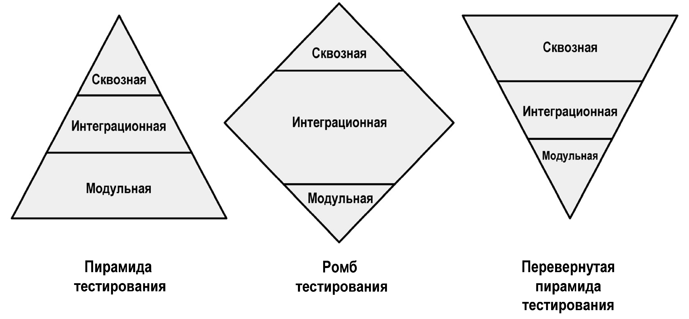{width="4.976034558180228in"
height="2.308853893263342in"}

> Рис. 10.5. Стратегии тестирования
>
> 190 \| *Часть III. Применение предметно-ориентированного
> проектирования на практике*

Разница между стратегиями тестирования на рисунке заключается в том, что
они акцентируют внимание на различных типах тестов: модульных,
интеграционных и сквозных. Давайте проанализируем каждую стратегию и
контекст, в котором сле- дует использовать каждую модель.

#### Пирамида тестирования

В классической пирамиде тестирования особое внимание уделяется модульным
тестам, меньшее --- интеграционным и еще меньшее --- сквозным. Пирамиды
тес- тирования лучше всего подходят обоим вариантам шаблонов модели
предметной области. А из агрегатов и объектов-значений получаются
идеальные компоненты для эффективного тестирования бизнес-логики.

#### Ромб тестирования

Ромб тестирования в основном концентрируется на интеграционных тестах.
Когда используется шаблон активной записи, бизнес-логика системы по
определению распространяется как на сервисный слой, так и на слой
бизнес-логики. То есть, чтобы сосредоточиться на интеграции двух слоев,
более эффективным выбором является ромб тестирования.

#### Перевернутая пирамида тестирования

В перевернутой пирамиде тестирования наибольшее внимание уделяется
сквозным тестам: проверке рабочего процесса приложения от начала до
конца. Такой порядок больше всего подходит для кодовых баз, реализующих
паттерн «Транзакционный

{width="4.144961723534558in"
height="3.0033333333333334in"}

> Рис. 10.6. Дерево решений по стратегии тестирования
>
> *Глава 10. Эвристика проектирования* \| 191

сценарий»: бизнес-логика проста, а количество уровней минимально, что
делает более эффективной проверку сквозного потока операций, проводимых
в системе.

Дерево решений по стратегии тестирования показано на рис. 10.6.

### Дерево тактических проектных решений

Паттерны бизнес-логики, архитектурные паттерны и эвристики стратегии
тестиро- вания можно, как показано на рис. 10.7, объединить и обобщить с
помощью дерева тактических проектных решений.

Как видите, определение типов поддоменов и следование дереву решений
дает надежную отправную точку для принятия важных проектных решений. И
тем не

{width="5.546192038495188in"
height="5.486666666666666in"}

> Рис. 10.7. Дерево тактических проектных решений
>
> [[]{#упражнения-9 .anchor}]{#вывод-8 .anchor}192 \| *Часть III.
> Применение предметно-ориентированного проектирования на практике*

менее стоит повторить, что это эвристика, а не жесткие правила. Из
каждого прави- ла есть исключения, не говоря уже об эвристиках, которые
по определению не должны быть правильными в 100% случаев.

Дерево решений основано на моем предпочтении в использовании простых
инст- рументов и в применении расширенных шаблонов --- модели предметной
области, модели предметной области, основанной на событиях, CQRS и т. д.
--- только в случае крайней необходимости. И все же мне встречались
команды, имеющие большой опыт реализации модели предметной области,
основанной на событиях, в силу чего она использовалась ими для всех
создаваемых поддоменов. Для них это было проще использования разных
паттернов. Можно ли порекомендовать этот подход всем? Конечно, нет. В
компаниях, в которых я работал или оказывал кон- сультационные услуги,
эвристический подход оказался более эффективным по сравнению с
использованием одного и того же решения для каждой задачи.

В конце концов, все зависит от вашего конкретного контекста. Деревом
решений, показанным на рис. 10.7, и эвристикой проектирования, на
котором она основана, можно воспользоваться в качестве руководящих
принципов, но никак не в качестве замены критического мышления. Если
обнаружится, что лучше подходят альтерна- тивные эвристики, не
стесняйтесь изменять руководящие принципы или вообще выстраивать
собственное дерево решений.

### Вывод {#вывод-9}

Эта глава соединяет первую и вторую части книги и эвристический
фреймворк принятия решений. В ней был рассмотрен порядок применения
знаний о предмет- ной области и ее поддоменах для принятия технических
решений: выбора безопас- ных границ ограниченных контекстов,
моделирования бизнес-логики приложения и определения архитектурного
шаблона, необходимого для организации взаимодей- ствия внутренних
компонентов каждого ограниченного контекста. В конце главы мы затронули
тему, которая часто является предметом бурных дискуссий, --- какой вид
тестов важнее, при этом для определения приоритетов различных тестов в
со- ответствии с предметной областью использовался тот же фреймворк
принятия ре- шений.

Важнее самого принятия проектных решений --- проверка их обоснованности
с те- чением времени. В следующей главе обсуждение будет перенесено на
следующую фазу жизненного цикла разработки программных средств: эволюцию
проектных решений.

### Упражнения {#упражнения-10}

1.  Предположим, что внедряется система управления жизненным циклом
    заявки WolfDesk (см. *предисловие*). Она является основным
    поддоменом, требующим глубокого анализа поведения, чтобы с течением
    времени алгоритм можно было оптимизировать. Какова будет ваша
    первоначальная стратегия реализации биз-

> *Глава 10. Эвристика проектирования* \| 193
>
> нес-логики и архитектуры компонента? Какая стратегия тестирования
> будет выбрана?

2.  Какими будут ваши проектные решения для модуля управления сменой
    сотруд- ников службы поддержки WolfDesk?

3.  Чтобы упростить процесс управления сменами сотрудников, возникло
    желание воспользоваться внешним поставщиком сведений о
    государственных праздни- ках в различных географических регионах.
    Процесс заключается в периодиче- ском обращении к внешнему
    поставщику и получении дат и названий пред- стоящих государственных
    праздников. Какую бизнес-логику и архитектурные паттерны вы бы
    использовали для реализации интеграции? Как бы вы все это
    протестировали?

4.  Исходя из вашего собственного опыта, какие еще аспекты процесса
    разработки программных средств можно включить в эвристическое дерево
    решений, пред- ставленное в этой главе?

ГЛАВА 11

## Эволюция проектных решений

В нашем столь стремительно меняющемся мире компании не могут позволить
себе ни малейшей пассивности. Чтобы не отстать от конкурентов, им
приходится посто- янно меняться, развиваться и даже с течением времени
заново «изобретать самих себя». Этот факт невозможно игнорировать при
проектировании систем, особенно если планировать разработку программных
средств, плотно адаптированных к тре- бованиям их предметной области.
Когда изменения не контролируются в должной мере, даже самый изящный и
продуманный дизайн в конечном итоге становится кошмаром для тех, кто
занимается его сопровождением и развитием. В этой главе рассматриваются
вопросы влияния изменений в окружающей среде программного проекта на
проектные решения и задачи соответствующей эволюции проекта. В поле
зрения попадут четыре наиболее распространенных вектора изменений:
предметная область, организационная структура, знание предметной области
и рост проекта.

### Изменения в предметных областях

Из *главы 2* известно о трех типах поддоменов и их отличиях друг от
друга:

> *Основной (core)*
>
> Деятельность компании, отличающаяся от деятельности ее конкурентов с
> целью получения конкурентных преимуществ.
>
> *Вспомогательный (supporting)*
>
> То, что компания делает иначе, чем ее конкуренты, но не обеспечивает
> конку- рентных преимуществ.
>
> *Универсальный (generic)*
>
> То, что все компании делают одинаково.

Из предыдущих глав стало понятно, что тип используемого поддомена влияет
на стратегические и тактические проектные решения:

- Как спроектировать границы ограниченных контекстов.

- Как организовать интеграцию контекстов.

- Какие паттерны (pattern) проектирования следует использовать с учетом
  слож- ности бизнес-логики.

Для разработки программного продукта, ориентированного на потребности
пред- метной области, весьма важно определить поддомены и их типы. Но
это еще не все.

> *Глава 11. Эволюция проектных решений* \| 195

Не менее важно проследить эволюцию поддоменов. По мере роста и развития
орга- низации нередко случается так, что некоторые из ее поддоменов
трансформируют- ся из одного типа в другой. Рассмотрим несколько
примеров таких изменений.

#### Из основного в универсальный

Представьте, что интернет-компания розничной торговли BuyIT внедряет
собст- венное решение по доставке заказов. Она разработала инновационный
алгоритм для оптимизации маршрутов своей курьерской доставки и, таким
образом, может взимать более низкую плату за доставку, чем ее
конкуренты.

Но со временем другая компания --- DeliveryIT --- вносит изменения в сам
процесс доставки. Она утверждает, что решила задачу «коммивояжера» и
предлагает в ка- честве услуги оптимизацию пути доставки. Оптимизация,
предлагаемая компанией DeliverIT, не только более совершенна, но и
обходится дешевле затрат компании BuyIT на выполнение той же задачи.

С позиции BuyIT, как только решение DeliverIT стало доступным в виде
готового продукта, его основная подобласть превратилась в универсальную.
В результате оптимальное решение по доставке стало доступно всем
конкурентам BuyIT. Без крупных инвестиций в исследования и разработку
BuyIT больше не сможет полу- чить конкурентное преимущество в подобласти
оптимизации пути. То, что ранее считалось конкурентным преимуществом
BuyIT, стало товаром, доступным для всех ее конкурентов.

#### Из универсального в основной

С момента своего создания компания BuyIT использует готовое решение для
управления своими запасами. Но отчеты бизнес-аналитики постоянно
показывают неадекватные прогнозы потребностей клиентов. Следовательно,
BuyIT не может пополнить свои запасы самых популярных продуктов и
забивает склады непо- пулярными продуктами. Оценив ряд альтернативных
решений по управлению запасами, руководство BuyIT принимает
стратегическое решение инвестировать в разработку и создание собственной
системы. Это внутреннее решение будет учи- тывать особенности продуктов,
продаваемых BuyIT, и более качественно прогно- зировать потребности
клиентов.

Решение BuyIT заменить готовое решение собственной реализацией
превратило управление запасами из универсального поддомена в основной:
успешная реализа- ция задуманной функциональности даст BuyIT
дополнительное конкурентное преимущество перед другими компаниями ---
конкуренты «застрянут» на общем решении и не смогут воспользоваться
передовыми алгоритмами прогнозирования спроса, изобретенными и
разработанными компанией BuyIT.

Примером из реальной жизни компании, превращающей универсальный поддомен
в основной, является Amazon. Как и всем поставщикам услуг, компании
Amazon требовалась инфраструктура для работы своих сервисов. Компания
смогла «заново изобрести» способ управления своей физической
инфраструктурой, а позже даже превратила его в прибыльный бизнес: Amazon
Web Services.

> 196 \| *Часть III. Применение предметно-ориентированного
> проектирования на практике*

#### Из вспомогательного в универсальный

Отдел маркетинга компании BuyIT внедряет систему управления своими
постав- щиками и их контрактами. В системе нет ничего особенного или
сложного --- это просто некие CRUD-интерфейсы для ввода данных. Иными
словами, это типичный вспомогательный поддомен.

Но по прошествии нескольких лет от начала внедрения компанией BuyIT
собствен- ного решения появилось решение для управления контрактами с
открытым исход- ным кодом. В соответствующем проекте реализовывалась та
же функциональность, что и в существующем решении, но имелись более
совершенные функции, такие как OCR и полнотекстовый поиск. Эти функции
долгое время находились в BuyIT в списке намеченных работ, но им никогда
не уделялось первоочередного внимания из-за их незначительного влияния
на бизнес. Итак, компания решает отказаться от внутренней разработки в
пользу интеграции решения с открытым ис- ходным кодом. При этом поддомен
управления документами из вспомогательного превращается в универсальный.

#### Из вспомогательного в основной

Вспомогательный поддомен также может превратиться в основной, например,
если компания найдет способ оптимизировать вспомогательную логику таким
образом, чтобы это либо снизило затраты, либо принесло дополнительную
прибыль.

Типичным признаком подобного преобразования является возрастающая слож-
ность бизнес-логики вспомогательного поддомена. Сами по себе
вспомогательные поддомены по определению просты и в основном напоминают
CRUD-интерфейсы или же ETL-процессы. Но если бизнес-логика со временем
усложняется, для этого должна быть вполне определенная причина. Если
изменения не влияют на прибыль компании, то зачем все усложнять? Это
будет ничем не обоснованное усложнение бизнеса. С другой стороны, если
изменения повышают прибыльность компании, то это уже признак того, что
вспомогательный поддомен становится основным.

#### Из основного во вспомогательный

Основной поддомен может со временем стать вспомогательным. Это может
про- изойти при ничем не оправданной сложности подобласти. Иными
словами, если от сложности нет никакой выгоды, тогда организация может
решить избавиться от лишней сложности, оставив минимум логики,
необходимой для поддержки реали- зации других поддоменов.

#### Из универсального во вспомогательный

И наконец, по той же причине, что и в случае с основным поддоменом,
универ- сальный поддомен может превратиться во вспомогательный.
Возвращаясь к приме- ру с системой управления документами BuyIT,
предположим, что компания реши- ла, что сложность интеграции решения с
открытым исходным кодом не оправдыва-

> *Глава 11. Эволюция проектных решений* \| 197

ется получаемыми при этом преимуществами, и вернулась к собственной
системе. В результате универсальный поддомен превратился во
вспомогательный. Только что рассмотренные изменения в подобластях
показаны на рис. 11.1.

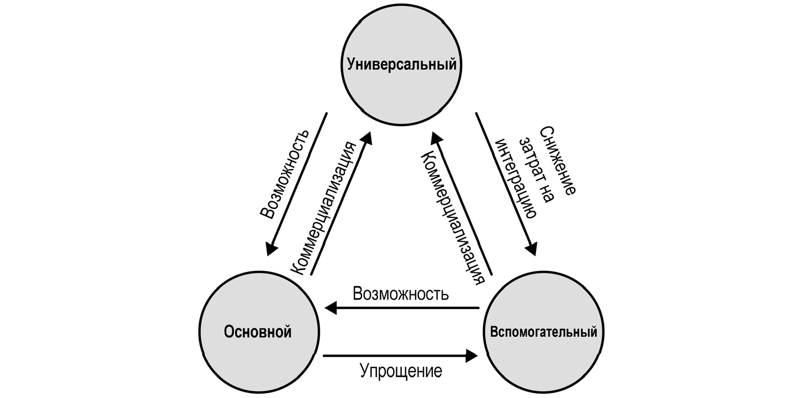{width="5.15361220472441in"
height="2.533332239720035in"}

> Рис. 11.1. Факторы изменения типов поддоменов

### Стратегические аспекты проектирования

Изменение типа поддомена напрямую влияет на его ограниченный контекст и,
сле- довательно, на соответствующие стратегические проектные решения.
Как известно из *главы 4*, для разных типов подобластей подходят разные
паттерны интеграции ограниченного контекста. Основные поддомены должны
защищать свои модели с помощью предохранительного слоя (anticorruption
layer) и защищать потребите- лей от частых изменений в моделях
реализации с помощью сервиса с открытым протоколом (open-host service).

Другим паттерном интеграции, на который влияют изменения типов, является
пат- терн разных путей (separate ways). Как выяснилось ранее, команды
могут восполь- зоваться этим паттерном для вспомогательных и
универсальных поддоменов. Если поддомен превращается в основной,
дублирование его функций несколькими ко- мандами становится
неприемлемым. Следовательно, у команд нет другого выбора, кроме как
интегрировать свои реализации. В этом случае наибольший смысл будут
иметь отношения типа потребитель-поставщик (customer-supplier),
поскольку основной поддомен будет реализован только одной командой.

С точки зрения стратегии реализации основные и вспомогательные поддомены
раз- личаются по способу их реализации. Вспомогательные поддомены можно
передать на аутсорсинг или использовать в качестве тренажера для новых
сотрудников. Основные поддомены должны быть реализованы внутри компании,
как можно ближе к источникам знаний о предметной области. Поэтому, когда
вспомогатель- ный поддомен превращается в основной, его реализацию
следует перенести в ком-

> 198 \| *Часть III. Применение предметно-ориентированного
> проектирования на практике*

панию. Та же логика работает и в обратную сторону. Если основной
поддомен пре- вращается во вспомогательный, его реализацию можно
передать на аутсорсинг, чтобы позволить внутренним группам исследований
и разработок сосредоточиться на основных поддоменах.

### Тактические аспекты проектирования

Основным показателем изменения типа поддомена является неспособность
сущест- вующего технического дизайна поддерживать текущие потребности
бизнеса.

Вернемся к примеру вспомогательного поддомена, ставшего основным.
Вспомога- тельные поддомены реализуются с помощью относительно простых
паттернов про- ектирования, используемых для моделирования
бизнес-логики: транзакционный сценарий (transaction script) или паттерн
активной записи (active record). Как из- вестно из *главы 5*, эти
паттерны плохо подходят для бизнес-логики, включающей сложные правила и
инварианты.

Если со временем к бизнес-логике добавляются сложные правила и
инварианты, кодовая база также будет усложняться. Добавлять новый
функционал будет слиш- ком проблематично, поскольку дизайн не поддержит
новый уровень сложности. Эта «проблематичность» станет важным сигналом.
Воспользуйтесь им как призы- вом к переоценке предметной области и
вариантов дизайна.

Необходимости изменения стратегии реализации не нужно бояться. Это
нормально. Мы не всегда можем предвидеть дальнейшее развитие бизнеса. Мы
также не мо- жем применять самые сложные паттерны проектирования для
всех типов поддоме- нов: это было бы расточительно и неэффективно. Нужно
выбрать наиболее подхо- дящий дизайн и развивать его по мере
необходимости.

Если решение о том, как моделировать бизнес-логику, принимается
осознанно, и известны все возможные варианты дизайна, а также различия
между ними, пере- ход от одного паттерна проектирования к другому не
будет таким трудным. Соот- ветствующие примеры рассмотрены в следующих
подразделах.

#### Преобразование транзакционного сценария в активную запись

По своей сути и транзакционный сценарий, и паттерн «Активная запись»
основаны на одном и том же принципе: бизнес-логика реализована в виде
процедурного сце- нария. Разница между ними заключается в том, как
моделируются структуры дан- ных: паттерн «Активная запись» вводит
структуры данных с целью инкапсуляции сложности их сопоставления с
механизмом хранения.

В связи с этим, когда работа с данными в транзакционном сценарии
усложняется, его следует реорганизовать в шаблон активной записи. Ищите
сложные структуры данных и инкапсулируйте их в объекты паттерна
«Активная запись». Вместо пря- мого доступа к базе данных используйте
паттерн «Активная запись» для абстраги- рования ее модели и структуры.

> *Глава 11. Эволюция проектных решений* \| 199

#### Преобразование активной записи в модель предметной области

Если бизнес-логика, манипулирующая активными записями, становится
сложной и отмечается все больше случаев несоответствий и дублирования,
реализацию следу- ет преобразовать в паттерн модели предметной области
(domain model).

Начните с определения объектов-значений (value-objects). Ответьте на
вопрос: ка- кие структуры данных можно смоделировать как неизменяемые
объекты? Найдите соответствующую бизнес-логику и сделайте ее частью
объектов-значений.

Затем проанализируйте структуры данных и найдите границы транзакций.
Чтобы убедиться, что вся логика изменения состояния является явной,
сделайте все функ- ции задания значений активных записей закрытыми,
чтобы значения можно было изменять только изнутри самой активной записи.
Понятно, что компиляция даст сбой, но ошибки компиляции прояснят, где
именно находится логика, изменяющая состояние. Преобразуйте эту логику в
границы активной записи. Например:

> public class Player
>
> {
>
> public Guid Id { get; set; } public int Points { get; set; }
>
> }
>
> public class ApplyBonus
>
> {
>
> \...
>
> public void Execute(Guid playerId, byte percentage)
>
> {
>
> var player = \_repository.Load(playerId); player.Points \*= 1 +
> percentage/100.0;
>
> \_repository.Save(player);
>
> }
>
> }

В следующем коде можно увидеть первые шаги к преобразованию. Код пока не
скомпилируется, но ошибки выявят, где именно внешние компоненты
контроли- руют состояние объекта:

> public class Player
>
> {
>
> public Guid Id { get; private set; } public int Points { get; private
> set; }
>
> }
>
> public class ApplyBonus
>
> {
>
> \...
>
> 200 \| *Часть III. Применение предметно-ориентированного
> проектирования на практике*
>
> public void Execute(Guid playerId, byte percentage)
>
> {
>
> var player = \_repository.Load(playerId); player.Points \*= 1 +
> percentage/100.0;
>
> \_repository.Save(player);
>
> }
>
> }

На следующем шаге можно переместить эту логику внутрь границы активной
записи:

> public class Player
>
> {
>
> public Guid Id { get; private set; } public int Points { get; private
> set; }
>
> public void ApplyBonus(int percentage)
>
> {
>
> this.Points \*= 1 + percentage/100.0;
>
> }
>
> }

Когда вся бизнес-логика, изменяющая состояние, перемещена в границы
соответ- ствующих объектов, проверьте, какие иерархии необходимы для
обеспечения стро- го согласованной проверки бизнес-правил и инвариантов.
Они являются хорошими кандидатами на агрегаты. Помня о принципах
построения агрегатов, рассмотрен- ных в *главе 6*, ищите наименьшие
границы транзакций, т. е. наименьшее количест- во данных, необходимое
для обеспечения строгой согласованности. Разложите иерархии вдоль этих
границ. Убедитесь, что ссылки на внешние агрегаты идут только по их
идентификаторам.

В завершение определите для каждого агрегата его корень или точку входа
для его публичного интерфейса. Сделайте методы всех других внутренних
объектов в агре- гате закрытыми и вызываемыми только из агрегата.

#### Преобразование модели предметной области

> в модель предметной области, основанную на событиях

Когда есть модель предметной области с правильно спроектированными
границами агрегатов, ее можно преобразовать в модель, основанную на
событиях (event sourced domain model). Вместо прямого изменения данных
агрегата смоделируйте события предметной области, необходимые для
представления жизненного цикла агрегата.

Наиболее сложным аспектом преобразования модели предметной области в
модель предметной области, основанную на событиях, является история
существующих агрегатов: миграция «безвременного» состояния в модель,
основанную на событи- ях. Поскольку подробных данных, представляющих все
прошлые изменения со- стояния, нет, нужно либо сгенерировать прошлые
события по мере возможности, либо смоделировать события миграции.

> *Глава 11. Эволюция проектных решений* \| 201

#### Генерация прошлых переходов состояния

Этот подход влечет за собой создание приблизительного потока событий для
каж- дого агрегата, чтобы этот поток можно было спроецировать в то же
представление состояния, что и в исходной реализации. Рассмотрим пример,
показанный в *главе 7* и представленный в табл. 11.1.

> *Таблица 11.1. Представление данных агрегата на основе состояния*

+---------+----------+-----------+------------+-------------+----------------+----------------+---------------+
| > Номер | > Имя    | > Фамилия | > Номер    | > Статус    | > Дата по-     | > Дата         | > Последующие |
|         |          |           | > телефона |             | > следнего     | > последнего   | > обращения   |
|         |          |           |            |             | > контакта     | > заказа       |               |
+=========+==========+===========+============+=============+================+================+===============+
| > 12    | > Shauna | > Mercia  | > 555-4753 | > converted | > 2020-05-27T  | > 2020-05-27T  | > null        |
|         |          |           |            |             | >              | >              |               |
|         |          |           |            |             | > 12:02:12.51Z | > 12:02:12.51Z |               |
+---------+----------+-----------+------------+-------------+----------------+----------------+---------------+

С точки зрения бизнес-логики можно предположить, что экземпляр агрегата
был инициализирован, затем с человеком связались, оформили заказ и,
наконец, поскольку статус был «преобразован» («converted»), оплата
заказа была подтвер- ждена. Все эти переходы состояния могут быть
представлены следующим набором событий:

> {
>
> \"lead-id\": 12,
>
> \"event-id\": 0,
>
> \"event-type\": \"lead-initialized\", \"first-name\": \"Shauna\",
>
> \"last-name\": \"Mercia\", \"phone-number\": \"555-4753\"
>
> },
>
> {
>
> \"lead-id\": 12,
>
> \"event-id\": 1,
>
> \"event-type\": \"contacted\", \"timestamp\":
> \"2020-05-27T12:02:12.51Z\"
>
> },
>
> {
>
> \"lead-id\": 12,
>
> \"event-id\": 2,
>
> \"event-type\": \"order-submitted\",
>
> \"payment-deadline\": \"2020-05-30T12:02:12.51Z\", \"timestamp\":
> \"2020-05-27T12:02:12.51Z\"
>
> },
>
> {
>
> \"lead-id\": 12,
>
> \"event-id\": 3,
>
> \"event-type\": \"payment-confirmed\", \"status\": \"converted\",
>
> \"timestamp\": \"2020-05-27T12:38:44.12Z\"
>
> }
>
> 202 \| *Часть III. Применение предметно-ориентированного
> проектирования на практике*

При поочередном применении этих событий их можно будет спроецировать в
точ- ное представление состояния, как и в исходной системе.
«Восстановленные» собы- тия можно легко протестировать, спроецировав
состояние и сравнив его с исход- ными данными.

И тем не менее важно помнить о недостатках такого подхода. Целью
использова- ния событий как источника данных (event sourcing) является
получение надежной и последовательной истории событий предметной области
для агрегатов. При таком подходе невозможно восстановить полную историю
переходов состояний. В пре- дыдущем примере мы не знаем, сколько раз
агент по продажам связывался с чело- веком и, следовательно, сколько
событий «выхода на связь» мы пропустили.

#### Моделирование событий миграции

Альтернативный подход состоит в том, чтобы смириться с отсутствием
знаний о прошлых событиях и явно смоделировать их как событие. Взамен
восстановления событий, которые могли привести к текущему состоянию,
следует определить со- бытие миграции и использовать его для
инициализации потоков событий сущест- вующих экземпляров агрегата:

> {
>
> \"lead-id\": 12,
>
> \"event-id\": 0,
>
> \"event-type\": \"migrated-from-legacy\", \"first-name\": \"Shauna\",
>
> \"last-name\": \"Mercia\",
>
> \"phone-number\": \"555-4753\", \"status\": \"converted\",
>
> \"last-contacted-on\": \"2020-05-27T12:02:12.51Z\",
> \"order-placed-on\": \"2020-05-27T12:02:12.51Z\", \"converted-on\":
> \"2020-05-27T12:38:44.12Z\",
>
> \"followup-on\": null
>
> }

Преимущество этого подхода в том, что в нем явно признается отсутствие
прошлых данных. Ни на каком этапе никто не может ошибочно предположить,
что поток со- бытий фиксирует все события предметной области, которые
произошли в течение жизненного цикла экземпляра агрегата. Недостатком
является то, что в хранилище событий навсегда останутся следы устаревшей
системы. К примеру, если использу- ется паттерн CQRS (вероятнее всего, с
моделью предметной области, основанной на событиях), проекции всегда
должны учитывать события миграции.

### Организационные изменения

На структуру системы могут повлиять и изменения в самой организации. В
*главе 4* были рассмотрены различные модели интеграции ограниченных
контекстов: парт- нерство (partnership), общее ядро (shared kernel),
конформист (conformist), предо-

> *Глава 11. Эволюция проектных решений* \| 203

хранительный слой, сервис с открытым протоколом и разные пути. Изменения
в структуре организации могут повлиять на уровни общения и совместной
работы команд и, как следствие, на способы интеграции ограниченных
контекстов.

Типичный пример такого изменения --- выросшие центры разработки (рис.
11.2). Поскольку ограниченный контекст может быть реализован только
одной командой, добавление новых групп разработчиков может привести к
тому, что существующие ограниченные контексты с более широкими границами
будут разбиты на более мелкие, чтобы каждая группа могла работать со
своим собственным ограниченным контекстом.

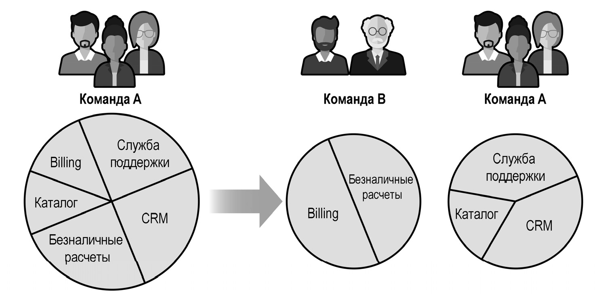{width="5.075001093613299in"
height="2.43in"}

> Рис. 11.2. Разбиение широкого ограниченного контекста с целью
> задействования новых групп разработчиков

Более того, имеющиеся в организации центры разработки часто находятся в
разных географических точках. Когда работа над существующими
ограниченными контек- стами переносится в другое место, это может
негативно сказаться на совместной работе команд. В результате паттерны
интеграции ограниченных контекстов долж- ны развиваться должным образом
в соответствии с описаниями приведенных ниже сценариев.

#### Переход от партнерства

> к отношениям потребитель-поставщик

Модель партнерства предполагает тесную связь между командами и их
сотрудни- чество. Со временем ситуация может измениться. Например, когда
работа над одним из ограниченных контекстов перемещается в удаленный
центр разработки. Такое изменение усложнит связь между командами и может
стать причиной пере- хода от модели партнерства к отношениям
клиент-поставщик.

> 204 \| *Часть III. Применение предметно-ориентированного
> проектирования на практике*

#### Переход от отношений потребитель-поставщик к модели разных путей

К сожалению, у команд нередко возникают серьезные проблемы со связью.
Про- блемы могут быть вызваны географической удаленностью или же
организационной политикой. Со временем такие команды могут испытывать
нарастающие проблемы с интеграцией. В какой-то момент может оказаться
более рентабельным дублиро- вать функциональность, исключив
необходимость постоянно догонять друг друга.

### Знания предметной области

Вспомним, что основной принцип предметно-ориентированного проектирования
заключается в том, что для разработки успешной программной системы
требуется знание предметной области. Приобретение знаний предметной
области является одним из самых сложных аспектов разработки программного
обеспечения, особен- но это касается основных поддоменов. Логика
основного поддомена не только сложна, но и подвержена частым изменениям.
Более того, моделирование является непрерывным процессом. И по мере
приобретения новых знаний в предметной об- ласти модели должны
совершенствоваться.

Зачастую сложность предметной области не лежит на поверхности.
Изначально все кажется простым и понятным. Но первоначальная простота
часто обманчива и быстро превращается в сложность. По мере добавления
функций выявляется все больше и больше граничных случаев, инвариантов и
правил. Осознание новых обстоятельств порой приводит к разрушительному
эффекту, требуя перестройки модели с нуля, включая границы ограниченных
контекстов, агрегатов и других де- талей реализации.

Со стратегической позиции проектирования полезной эвристикой является
проек- тирование границ ограниченных контекстов в соответствии с уровнем
знаний предметной области. Затраты на разбиение системы на ограниченные
контексты, оказавшиеся со временем неверно выбранными, могут быть весьма
высокими. По- этому, когда логика предметной области неясна и подвержена
частым изменениям, имеет смысл проектировать ограниченные контексты с
более широкими граница- ми. Затем, по мере приобретения более подробных
знаний предметной области и снижения изменчивости бизнес-логики, эти
широкие ограниченные контексты можно разбить на контексты с меньшим
охватом или на микросервисы. Более под- робно взаимодействие
ограниченных контекстов и микросервисов будет рассмот- рено в *главе
14*.

При обнаружении новых аспектов предметной области их следует
использовать для развития дизайна и повышения его стабильности. К
сожалению, изменения в знании предметной области не всегда имеют
положительный аспект, бывает так, что знания утрачиваются. Со временем
устаревает документация, из компании увольняются люди, изначально
работавшие над проектом, а наивное (ad hoc) до- бавление по мере
необходимости новых функций приводит к тому, что в какой-то момент
кодовая база обретает сомнительный статус унаследованной системы.

> []{#поддомены-1 .anchor}*Глава 11. Эволюция проектных решений* \| 205

Крайне важно заранее предотвращать такую деградацию знаний предметной
облас- ти. Эффективным инструментом для восстановления этих знаний
является практи- ка EventStorming, являющегося темой следующей главы.

### Рост проекта

Рост проекта является признаком здоровой системы. Постоянное добавление
новых функций говорит об успешности системы, приносящей явную пользу
своим клиен- там и расширяющейся с целью более полного удовлетворения
потребностей поль- зователей и сохранения сервиса на уровне
конкурирующих продуктов. Но у роста есть темная сторона. По мере роста
программного проекта его кодовая база может превратиться в большой ком
грязи:

> «Большой ком грязи» --- беспорядочный, расползающийся, состоящий из
> костылей и изоленты лапшекод (спагетти-код). Подобные системы имеют
> явные признаки бес- порядочного роста из-за необходимости постоянного
> внесения хаков и костылей.

1

> -- *Брайан Фут и Джозеф Йодер (Brian Foote and Joseph Yoder)*

Неконтролируемый рост, приводящий к формированию больших комков грязи,
является результатом расширения функциональности программной системы без
пересмотра ее проектных решений. Рост расширяет границы компонентов, все
больше расширяя их функциональные возможности. Изучать влияние роста на
дизайн крайне важно, в частности потому, что многие инструменты
предметно- ориентированного проектирования связаны с установлением
границ: структурные бизнес-блоки (поддомены), модель (ограниченные
контексты), неизменяемость (объекты-значения) или согласованность
(агрегаты).

Руководящий принцип борьбы со сложностью, вызванной ростом продукта,
заклю- чается в выявлении и устранении ничем не оправданной сложности,
вызванной устаревшим дизайном. Необходимой сложностью или сложностью,
присущей предметной области, нужно управлять с помощью инструментов и
методов пред- метно-ориентированного проектирования.

При рассмотрении аспектов предметно-ориентированного проектирования в
пре- дыдущих главах прослеживался процесс, начинающийся с анализа
предметной об- ласти бизнеса и ее стратегических компонентов и
продолжающийся разработкой соответствующих моделей предметной области, а
затем уже разработкой и реали- зацией моделей в программном коде.
Давайте, чтобы справиться со сложностью, обусловленной ростом проекта,
будем пользоваться тем же сценарием.

#### Поддомены {#поддомены-2}

Как известно из *главы 1*, определить границы поддоменов бывает нелегко,
в ре- зультате чего вместо стремления к определению идеальных границ
нужно старать- ся найти те границы, от которых можно получить
максимальную выгоду. То есть

> ^1^ Brian Foote and Joseph Yoder. «Big Ball of Mud. Fourth Conference
> on Patterns Languages of Programs» (PLoP '97/EuroPLoP '97),
> Monticello, Illinois, September 1997.
>
> 206 \| *Часть III. Применение предметно-ориентированного
> проектирования на практике*

поддомены должны позволять идентифицировать компоненты с различной
бизнес- ценностью, а для отработки решения следует воспользоваться
подходящими инст- рументами.

По мере роста предметной области границы поддомена могут размываться еще
больше, что затруднит выявление тех случаев, когда поддомен охватит
сразу не- сколько более мелких поддоменов. Следовательно, важно
пересмотреть идентифи- цированные подобласти и воспользоваться
эвристикой согласованных сценариев действий (наборов сценариев действий,
работающих с одним и тем же набором данных), чтобы попытаться
определить, где можно будет разбить поддомен (см. рис. 11.3).

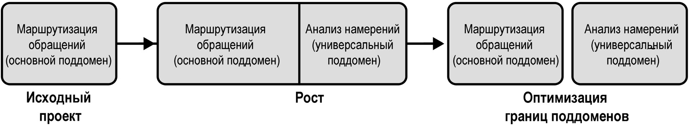{width="5.562153324584427in"
height="1.0299989063867017in"}

> Рис. 11.3. Оптимизация границ поддоменов с целью подстраивания под
> разрастание проекта

Способность выделять более мелкие подобласти разных типов связана с
важным навыком проникать вглубь вопроса, позволяющим управлять
неизбежной сложно- стью предметной области. Чем точнее будет информация
о подобластях и их типах, тем эффективнее будут подбираться технические
решения для каждого поддомена.

Определение скрытых поддоменов, которые можно было бы извлечь и сделать
явными, играет особенно важную роль для основных поддоменов. Нужно
всегда стремиться отделить основные поддомены от всех остальных, чтобы
можно было прилагать максимум усилий к наиболее важным аспектам с точки
зрения вырабо- танной бизнес-стратегии.

#### Ограниченные контексты {#ограниченные-контексты-1}

Из *главы 3* известно, что шаблон ограниченного контекста позволяет
воспользо- ваться различными моделями предметной области. Вместо
построения модели «обо всем и ни о чем» (универсальной), можно создать
несколько моделей, каждая из которых будет направлена на решение
конкретной задачи.

По мере развития и роста проекта ограниченные контексты нередко теряют
свою направленность и накапливают логику, связанную с разными задачами.
Это так на- зываемая непреднамеренная сложность. Как и в случае с
поддоменами, крайне важно периодически пересматривать границы
ограниченных контекстов. Нужно всегда изыскивать возможности упрощения
модели, вычленяя из нее ограниченные контексты, сфокусированные на
решении конкретных задач.

Рост проекта может также перевести имеющиеся скрытые проблемы
проектирова- ния в явные. Например, можно заметить, что ряд ограниченных
контекстов со вре-

> []{#агрегаты-1 .anchor}*Глава 11. Эволюция проектных решений* \| 207

менем начинает страдать «болтливостью», будучи не в состоянии завершить
ка- кую-либо операцию без вызова другого ограниченного контекста. Это
может быть явным сигналом о неэффективности модели, которую следует
устранить путем из- менения границ ограниченных контекстов, повысив их
автономность.

#### Агрегаты {#агрегаты-2}

При рассмотрении паттерна модели предметной области в *главе 6* для
проектирова- ния границ агрегатов использовался следующий руководящий
принцип:

> Эмпирическое правило заключается в том, чтобы агрегаты были как можно
> меньше и включали только те объекты, которые должны находиться в
> строго согласованном со- стоянии в рамках предметной области.

По мере роста системных бизнес-требований новые функции может быть
«удоб- нее» распределять между уже имеющимися агрегатами, не
пересматривая принцип поддержания небольших размеров агрегатов. Если
агрегат разрастается и включает данные, не нужные для строгой
согласованности всей его бизнес-логики, это опять же будет
непреднамеренной сложностью, от которой следует избавляться.

Извлечение бизнес-функций с ее помещением в специально выделенный
агрегат не только упрощает исходный агрегат, но и потенциально может
упростить ограни- ченный контекст, к которому он принадлежит. Часто
такая переделка выявляет до- полнительную ранее скрытую модель, которая,
став явной, должна быть выделена в другой ограниченный контекст.

### Вывод {#вывод-8}

Как говорил Гераклит, единственным постоянным в жизни являются перемены.
И предприятия здесь не являются исключением. Чтобы сохранять
конкурентоспо- собность, компании постоянно стремятся развиваться и
переизобретать самих себя. Эти изменения следует рассматривать как
первостепенные элементы процесса про- ектирования.

По мере развития предметной области изменения в ее подобластях должны
быть идентифицированы и учтены при проектировании системы. Убедитесь,
что ваши прошлые проектные решения соответствуют текущему состоянию
предметной об- ласти и ее подобластей. Дизайн нужно развивать по мере
необходимости, добива- ясь от него большего соответствия текущей
бизнес-стратегии и потребностям биз- неса.

Также важно осознавать, что на общение и сотрудничество между командами,
а также на способы интеграции их ограниченных контекстов могут повлиять
измене- ния в организационной структуре. Изучение предметной области ---
непрерывный процесс. Со временем, по мере более глубокого изучения
предметной области, новые знания нужно использовать для разработки
стратегических и тактических проектных решений.

> 208 \| *Часть III. Применение предметно-ориентированного
> проектирования на практике*

И наконец, рост программного продукта является вполне благоприятным
типом изменений, но при неправильном управлении может привести к
катастрофическим последствиям для дизайна и архитектуры системы.
Следовательно:

- При расширении функциональности поддоменов постарайтесь уточнить их
  гра- ницы, что позволит принять более взвешенные проектные решения.

- Не позволяйте ограниченному контексту стать «обо всем и ни о чем»
  (универ- сальным). Убедитесь, что модели, охваченные ограниченными
  контекстами, ориентированы на решение конкретных задач.

- Убедитесь, что ваши агрегаты имеют наименьшие границы. Для обнаружения
  возможностей извлечения бизнес-логики в новые агрегаты воспользуйтесь
  эври- стикой строго согласованных данных.

И последние мудрые мысли по этой теме: постоянно проверять различные
границы на наличие признаков сложности, обусловленной ростом проекта.
Примите меры к устранению непреднамеренной сложности и воспользуйтесь
инструментами предметно-ориентированного проектирования с целью
управления существенной сложностью предметной области.

### Упражнения {#упражнения-9}

1.  Какие изменения в интеграции ограниченных контекстов часто
    вызываются рос- том организации?

> А) Переход партнерства к модели потребитель-поставщик (конформист,
> предо- хранительный слой или сервис с открытым протоколом).
>
> Б) Переход от предохранительного слоя к сервису с открытым протоколом.
> В) Переход от конформиста к использованию общего ядра.
>
> Г) Переход от сервиса с открытым протоколом к использованию общего
> ядра.

2.  Предположим, что интеграция ограниченных контекстов переходит от
    конфор- мистских отношений к модели разных путей. Что можно сказать
    по поводу этих изменений?

> А) Командам разработчиков стало сложно кооперироваться.
>
> Б) Продублированная функциональность является либо вспомогательным,
> либо универсальным поддоменом. Продублированная функциональность
> является основным поддоменом.
>
> В) А и Б.
>
> Г) А и В.

3.  Каковы признаки превращения вспомогательного поддомена в основной?

> А) Развивать существующую модель и внедрять новые требования
> становится легче.
>
> Б) Развитие существующей модели становится более проблемным.
>
> *Глава 11. Эволюция проектных решений* \| 209
>
> В) Подобласть все чаще подвергается изменениям. Г) Б и В.
>
> Д) Ничего из вышеперечисленного.

4.  Какие изменения происходят в результате обретения новой
    бизнес-компетен- ции?

> А) Вспомогательный поддомен превращается в основной.
>
> Б) Вспомогательный поддомен превращается в универсальный. В)
> Универсальный поддомен превращается в основной.
>
> Г) Универсальный поддомен подобласти превращается во вспомогательный.
> Д) А и Б.
>
> Е) А и В.

5.  Какое изменение в бизнес-стратегии может превратить один из
    универсальных поддоменов WolfDesk (вымышленной компании, описанной в
    предисловии) в основной поддомен?

ГЛАВА 12

## EventStorming

В этой главе будет сделан перерыв в рассмотрении паттернов и техник
проектиро- вания, и все внимание сосредоточится на несложном процессе
моделирования под названием EventStorming. Этот процесс объединяет
основные аспекты предметно- ориентированного проектирования,
рассмотренные в предыдущих главах.

Будет рассмотрен порядок организации и процесс проведения EventStorming
для эффективного обмена знаниями о предметной области и создания единого
языка (ubiquitous language).

### Что такое EventStorming?

EventStorming представляет собой технологически простой способ собрать
вместе людей с целью быстрого моделирования бизнес-процесса с помощью
техники моз- гового штурма. В некотором смысле EventStorming является
тактическим инстру- ментом для обмена знаниями в области бизнеса.

У конкретной сессии EventStorming всегда заданы рамки исследования:
бизнес- процесс, в изучении которого заинтересована группа специалистов.
Участники исследуют процесс как последовательность событий предметной
области, пред- ставленных стикерами на временно´й шкале. Шаг за шагом
модель дополняется новыми понятиями --- действующими лицами (actor),
командами (command), внеш- ними системами (external system) и другими
--- до тех пор, пока все ее элементы не раскроют историю хода всего
бизнес-процесса.

### Кто принимает участие в EventStorming?

> Надо понимать, что цель EventStorming --- узнать как можно больше в
> кратчайшие сроки. Мы приглашаем ключевых специалистов и не хотим
> впустую тратить их драгоценное время.
>
> -- *Альберто Брандолини (Alberto Brandolini), создатель EventStorming*

В идеале в EventStorming должна участвовать разнородная группа
специалистов. Фактически участвовать могут все, имеющие отношение к
рассматриваемой пред- метной области: инженеры, эксперты в предметной
области, владельцы продуктов, тестировщики, UI/UX-проектировщики,
техническая поддержка и т. д. Чем больше людей с разным опытом будет
вовлечено, тем больше знаний будет выявлено.

Но не нужно делать группу участников слишком большой. У каждого
участника должна быть возможность внести свой вклад в процесс, но для
групп свыше 10 участников это может быть затруднительно.

> *Глава 12. EventStorming* \| 211

### Что нужно для проведения EventStorming?

EventStorming считается технологически простой практикой, поскольку он
прово- дится с использованием маркеров и стикеров, очень большого
количества стикеров. Давайте посмотрим, что нужно для проведения
Event-Storming:

> *Свободное пространство*
>
> В первую очередь следует озаботиться большим пространством для
> моделиро- вания. Лучше всего, судя по изображению на рис. 12.1, для
> этого подойдет сте- на, с прикрепленной к ней рулонной бумагой. Может
> также подойти и большая белая доска, но она должна быть как можно
> больше, поскольку для моделирова- ния будет задействована вся ее
> площадь.

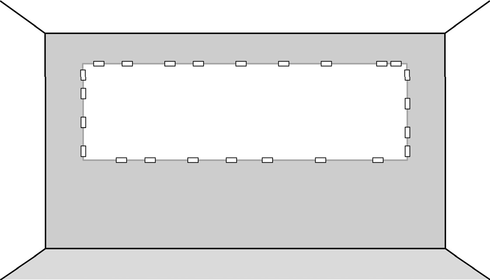

> Рис. 12.1. Пространство моделирования для проведения EventStorming
>
> *Стикеры*
>
> Далее понадобится множество стикеров разного цвета. Они будут
> использовать- ся для представления различных концепций предметной
> области, и каждый участник должен будет иметь возможность
> беспрепятственно их добавлять, по- этому следует заранее
> удостовериться в наличии достаточного числа стикеров нужных цветов для
> всех участников. Цвета, традиционно используемые для EventStorming,
> рассматриваются в следующем разделе. Лучше придерживаться
> рассматриваемых соглашений, дабы соответствовать всем доступным в
> настоя- щее время книгам и тренингам по EventStorming.
>
> *Маркеры*
>
> Также понадобятся маркеры, которыми можно будет делать надписи на
> стике- рах. Опять же, расходные материалы не должны стать узким местом
> при обмене знаниями --- маркеров должно хватать всем участникам.
>
> *Закуски*
>
> Типичный EventStorming длится от двух до четырех часов, поэтому для
> воспол- нения энергии следует взять с собой легкие закуски.
>
> 212 \| *Часть III. Применение предметно-ориентированного
> проектирования на практике*
>
> *Зал*
>
> И наконец, для проведения EventStorming понадобится просторный зал.
> Убеди- тесь, что посередине нет огромного стола, который будет мешать
> участникам свободно перемещаться и наблюдать за ходом моделирования.
> Кроме того, сту- лья тоже будут мешать процессу. Нужно, чтобы
> специалисты принимали в нем активное участие и делились знаниями, а не
> сидели в углу с отрешенным видом.

1

> Поэтому по возможности стулья нужно вынести из зала .

### Процесс проведения EventStorming

EventStorming обычно проводится в 10 этапов. На каждом этапе модель
обогащает- ся дополнительной информацией и концепциями.

#### Этап 1: Проведение неструктурированного исследования

EventStorming начинается с мозгового штурма по выявлению событий
предметной области, связанных с исследуемой предметной областью. К
событиям предметной области относится все интересное, происходящее в
предметной области. События предметной области важно формулировать в
прошедшем времени (см. рис. 12.2) --- ими описывается то, что уже
произошло.

{width="5.564732064741907in"
height="3.26in"}

> Рис. 12.2. Неструктурированное исследование
>
> ^1^ Конечно, это не железное правило. Оставьте пару стульев, если
> кому-то из участников будет тяжело слиш- ком долго находиться на
> ногах.
>
> *Глава 12. EventStorming* \| 213

На этом этапе все участники берут пачку оранжевых стикеров, записывают
любые события предметной области, которые приходят им на ум, и
прикрепляют их к про- странству для моделирования.

На этой ранней стадии не следует беспокоиться об упорядочении событий
или даже об их некоторой избыточности. Этот этап посвящен мозговому
штурму по вопросу всего, что может произойти в предметной области.

Группа специалистов должна продолжать выявление событий предметной
области до тех пор, пока скорость добавления новых событий не дойдет до
существенного снижения.

#### Этап 2: Выстраивание в хронологическом порядке

Затем участники просматривают выявленные события предметной области и
вы- страивают их в порядке происхождения в предметной области.

События должны начинаться с «успешного сценария» (happy path): потока
собы- тий, описывающих успешный бизнес-сценарий.

После того как «успешный путь» пройден, можно приступить к добавлению
аль- тернативных сценариев --- например, путей, на которых встречаются
ошибки или принимаются другие бизнес-решения. Как показано на рис. 12.3,
ветвление потока может быть выражено двумя направлениями, исходящими от
предшествующего события, или стрелками, нарисованными на пространстве
моделирования.

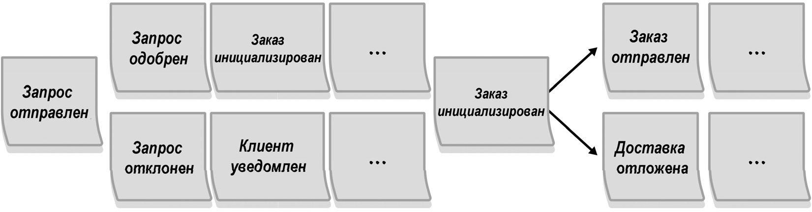{width="5.535669291338583in"
height="1.4433333333333334in"}

> Рис. 12.3. Потоки событий

На этом же этапе можно исправить некорректные события, удалить дубликаты
и, конечно же, при необходимости добавить отсутствующие события.

#### Этап 3: Проблемные места (pain points)

После выстраивания событий в хронологическом порядке, взгляните на них
шире, чтобы определить те места в процессе, которые требуют особого
внимания. Это могут быть какие-то узкие места, действия, требующие
вмешательства человека или же требующие автоматизации, отсутствующая
документация или же недос- тающие знания предметной области.

> 214 \| *Часть III. Применение предметно-ориентированного
> проектирования на практике*

Важно выявить все недостатки, чтобы к ним можно было легко вернуться
позже. Проблемные места, как показано на рис. 12.4, отмечаются
повернутыми на 45 гра- дусов (наклеенными в виде ромбов) розовыми
стикерами.

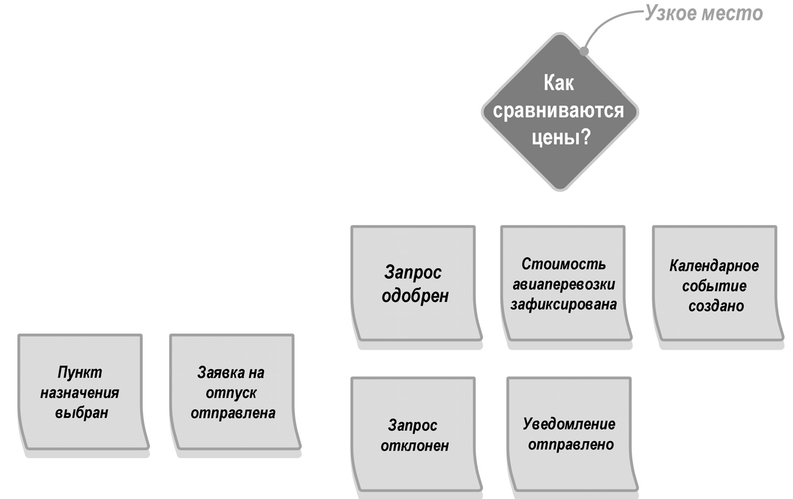{width="4.964968285214348in"
height="3.0966666666666667in"}

> Рис. 12.4. Розовый ромбовидный стикер, указывающий на аспект процесса,
> требующий особого внимания: недостающие знания предметной области,
> касающиеся способа сравнения цен на авиабилеты в процессе бронирования

Конечно, этот этап --- не единственная возможность выявления проблемных
мест. Организатор должен отслеживать комментарии участников на
протяжении всего процесса. Когда поднимаются вопросы или вырисовываются
проблемы, они долж- ны быть отражены на соответствующем розовом стикере.

#### Этап 4: Выявление ключевых событий (pivotal events)

Когда события выстроены в хронологическом порядке с указанием проблемных
мест (pain points), следует выявить значимые бизнес-события, указывающие
на из- менение контекста или окончание одного из этапов. Они называются
ключевы- ми/поворотными событиями (pivotal events) и отмечаются
вертикальной чертой, разделяющей события до и после ключевого события.

Например, как показано на рис. 12.5, существенные изменения в процессе
оформ- ления заказа представляют собой события «Корзина покупок
инициализирована»,

«Заказ инициализирован», «Заказ отправлен», «Заказ доставлен» и «Заказ
возвра- щен».

Ключевые события являются индикатором потенциальных границ ограниченных
контекстов.

> 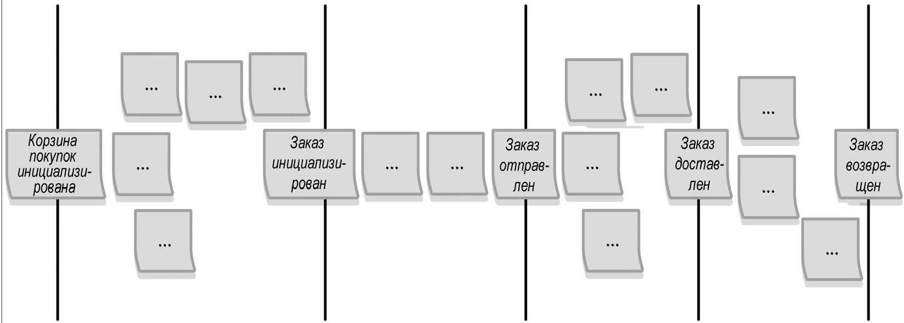{width="5.560166229221347in"
> height="1.97in"}*Глава 12. EventStorming* \| 215
>
> Рис. 12.5. Ключевые события, обозначающие изменения контекста в потоке
> событий

#### Этап 5: Выявление команд (commands)

В отличие от событий предметной области, описывающих что-то уже
произошед- шее, команда описывает то, что вызвало событие или поток
событий. Команды описывают действия системы, которые, в отличие от
событий предметной области, формулируются в повелительном наклонении.
Например:

- Опубликовать кампанию.

- Откатить транзакцию.

- Подтвердить заказ.

Команды записываются на светло-голубых стикерах и помещаются в
пространстве моделирования перед событиями, которые они могут вызвать.
Если конкретная команда выполняется действующим лицом (actor) в
определенной роли, то, как показано на рис. 12.6, информация о
действующем лице (actor) размещается на ма-

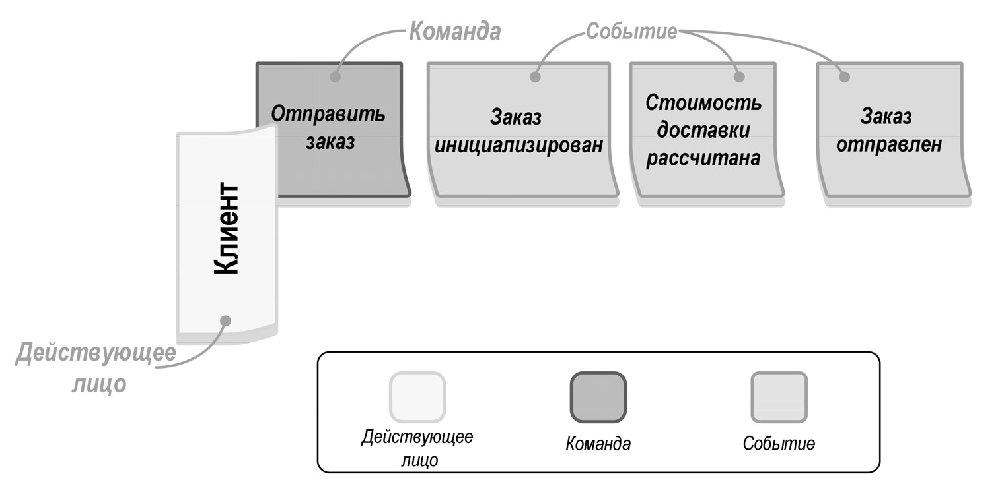{width="5.070097331583552in"
height="2.4266666666666667in"}

> Рис. 12.6. Команда «Отправить заказ», выполняемая заказчиком
> (действующее лицо)
>
> и сопровождаемая событиями «Заказ инициализирован», «Стоимость
> доставки рассчитана» и «Заказ отправлен»
>
> 216 \| *Часть III. Применение предметно-ориентированного
> проектирования на практике*

леньком желтом стикере перед соответствующей командой. Действующее лицо
пред-ставляет собой портрет пользователя (persona) в исследуемой
предметной области, например клиента, администратора или редактора.

Естественно, не все команды будут иметь ассоциированное с ними
действующее лицо. Поэтому информацию о нем следует добавлять только там,
где он очевиден. На следующем этапе модель будет дополнена другими
объектами, способными запускать команды.

#### Этап 6: Выявление правил (policies)

Практически всегда в модель добавляется ряд команд, не связанных с
конкретным действующим лицом (actor). На данном этапе происходит
выявление правил авто- матизации, способных выполнять такие команды.

Правило автоматизации --- это сценарий, в котором событие запускает
выполнение команды. Иными словами, команда автоматически выполняется,
когда происходит определенное событие предметной области.

Как показано на примере стикера «Правило» на рис. 12.7, правила на
пространстве моделирования представлены в виде лиловых стикеров,
соединяющих события с командами.

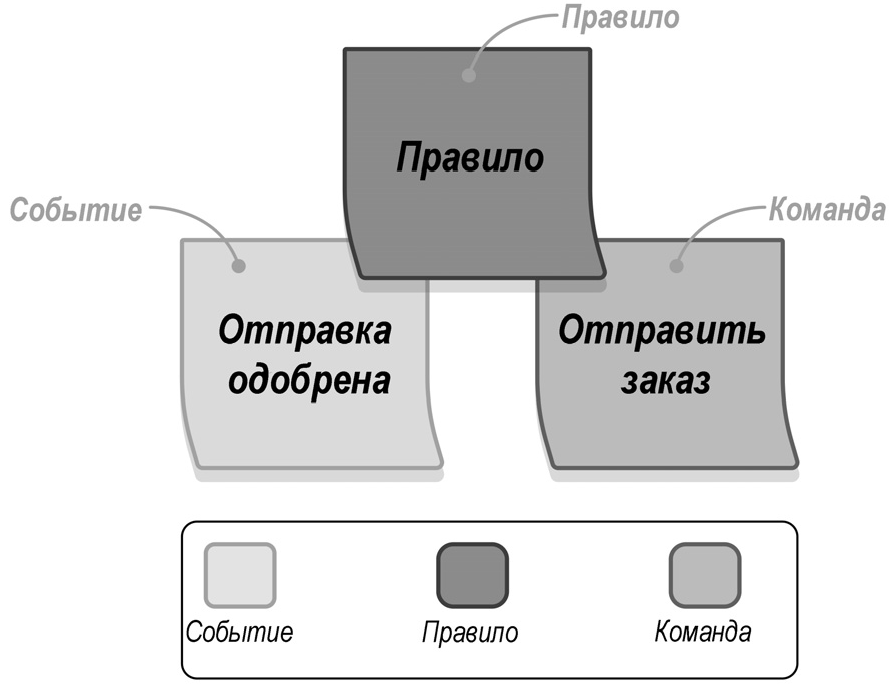{width="2.997891513560805in"
height="2.2866655730533685in"}

> Рис. 12.7. Правило автоматизации, запускающее команду «Отправить
> заказ» при наступлении события «Отправка одобрена»

Если рассматриваемая команда должна запускаться только при соблюдении
неко- торых критериев принятия решения, эти критерии можно указать явным
образом на стикере с правилом (policy). Например, если нужно
инициировать команду escalate после события «Получена жалоба», но только
если жалоба была получена от VIP- клиента, условие «Только для
VIP-клиентов» можно явно указать на стикере пра- вила.

Если события и команды находятся далеко друг от друга, на пространстве
модели- рования можно нарисовать соединяющую их стрелку.

> *Глава 12. EventStorming* \| 217

#### Этап 7: Выявление моделей чтения (read model)

Модель чтения --- это представление данных в предметной области, которое
дейст- вующее лицо использует для принятия решения о выполнении команды.
Это может быть один из экранов системы, отчет, уведомление и т. д.

Модели чтения представляются зелеными стикерами (см. стикер «Корзина» на
рис. 12.8) с кратким описанием источника информации, необходимой для
обосно- вания решения действующего лица (actor). Поскольку команда
выполняется после того, как действующее лицо просмотрит модель чтения,
модели чтения располага- ются перед командами.

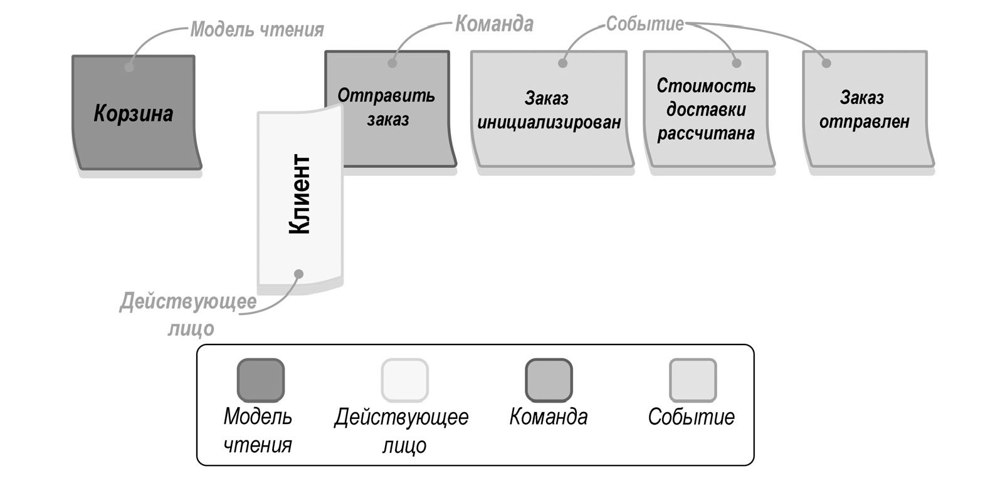{width="5.380328083989501in"
height="2.56in"}

> Рис. 12.8. Вид «Корзины» (модели чтения), необходимый покупателю
> (действующее лицо) для принятия решения об отправке заказа (запуска
> команды)

#### Этап 8: Выявление внешних систем (external systems)

Этот этап посвящен дополнению модели внешними системами. Внешней
считается любая система, не являющаяся частью исследуемой предметной
области. Она мо- жет выполнять команды (что считается вводом) или
получать уведомления о собы- тиях (что считается выводом).

Внешние системы представлены розовыми стикерами. На рис. 12.9 система
управ- ления информацией о клиентах --- CRM (внешняя система) инициирует
выполне- ние команды «Отправить заказ». Когда отправка подтверждена
(событие), об этом сообщается в CRM (внешняя система) через правило
(policy).

К концу этого этапа все команды должны либо выполняться действующими
лица- ми (actor)), либо инициироваться правилами (policy), либо
вызываться внешними системами (external system).

> 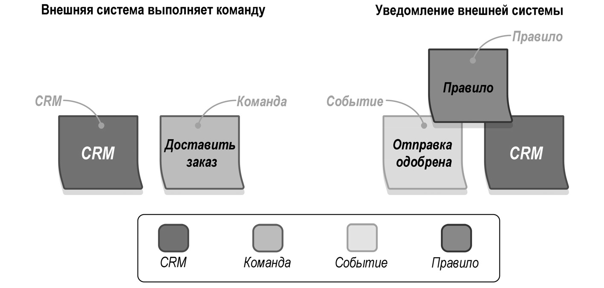{width="4.747160979877515in"
> height="2.25in"}218 \| *Часть III. Применение
> предметно-ориентированного проектирования на практике*
>
> Рис. 12.9. Внешняя система запускает выполнение команды (слева),
>
> и внешняя система получает уведомление с подтверждением отправки
> (справа)

#### Этап 9: Выявление агрегатов

Когда все события и команды представлены на пространстве моделирования,
уча- стники могут приступать к обдумыванию порядка объединения связанных
концеп- ций в агрегаты. Агрегат получает команды и порождает события.

Агрегаты, как показано на рис. 12.10, представлены в виде больших желтых
стике- ров с командами слева и событиями справа.

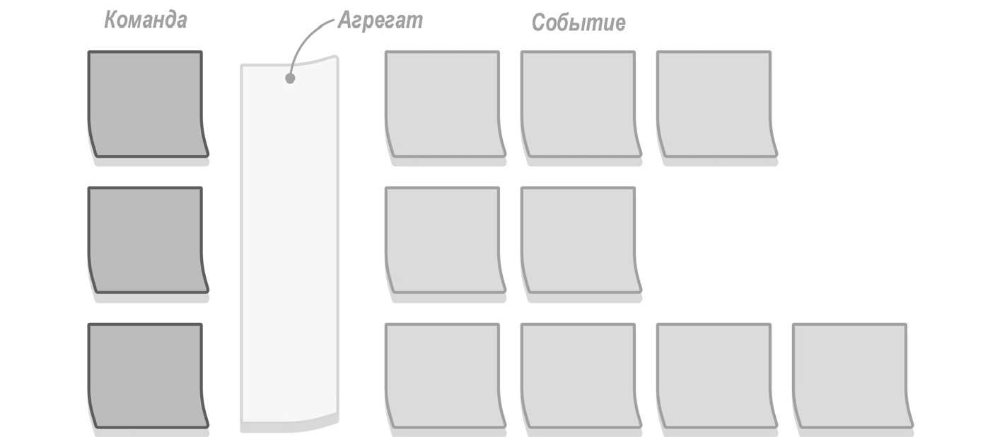{width="4.750101706036745in"
height="2.06in"}

> Рис. 12.10. Команды и события предметной области, собранные в агрегат

#### Этап 10: Выявление ограниченных контекстов

Последним этапом EventStorming является поиск агрегатов, относящихся
друг к другу либо по причине представления тесно связанных функций, либо
по причи- не их связывания каким-то из правил (policy). Группы
агрегатов, как показано на рис. 12.11, образуют естественных кандидатов
на границы ограниченных контек- стов.

> {width="5.111183289588801in"
> height="2.796666666666667in"}*Глава 12. EventStorming* \| 219
>
> Рис. 12.11. Возможное разбиение полученной системы на ограниченные
> контексты

### Варианты {#варианты-2}

Альберто Брандолини, создатель EventStorming, определяет процесс
EventStorming как *руководство, а не как набор жестких правил*. С
процессом проведения можно поэкспериментировать, чтобы найти тот самый
«рецепт», который подойдет вам больше всего.

Согласно моему опыту процесс проведения EventStorming в организации я
предпо- читаю начинать с изучения общей картины предметной области,
выполняя шаги с 1-го (неструктурированное исследование) по 4-й
(выявление ключевых событий \[pivotal events\]). Полученная модель
охватывает широкий спектр предметной об- ласти компании, создает прочную
основу для единых языков (ubiquitous language) и определяет возможные
границы ограниченных контекстов (bounded context).

Получив общую картину и идентифицировав различные бизнес-процессы,
прово- дится отдельная сессия для каждого бизнес-процесса --- на этот
раз четко следуя всем этапам, чтобы смоделировать весь процесс.

В конце полного сеанса EventStorming будет получена модель, описывающая
собы- тия предметной области (domain events), команды (commands),
агрегаты (aggregate) и даже возможные ограниченные контексты (bounded
contexts). Впрочем, все это лишь приятные бонусы. Настоящая ценность
EventStorming заключается в самом процессе --- обмене знаниями между
различными заинтересованными сторонами, согласовании их ментальных
моделей, обнаружении конфликтующих моделей и, что не менее важно,
формулировании единого языка (ubiquitous language).

Получающаяся в результате модель может быть принята в качестве основы
для реализации модели предметной области, основанной на событиях.
Решение о том, нужно идти по этому пути или же нет, зависит от сферы
вашего бизнеса. Если

> 220 \| *Часть III. Применение предметно-ориентированного
> проектирования на практике*

будет принято решение о реализации модели предметной области, основанной
на событиях (event sourced domain model), вы будете располагать
границами ограни- ченных контекстов, агрегатами и, конечно же, наметками
необходимых событий предметной области.

### Когда следует проводить EventStorming

EventStorming может проводиться по многим причинам:

> *С целью выработки единого языка (ubiquitous language)*
>
> При сотрудничестве групп в построении модели бизнес-процесса они
> естествен- ным образом синхронизируют терминологию и начинают
> применять один и тот же язык.
>
> *С целью моделирования бизнес-процесса*
>
> EventStorming --- эффективный способ построения модели
> бизнес-процесса. Так как в его основе лежит выявление строительных
> блоков по DDD-методике, он также является эффективным способом
> обнаружения границ агрегатов и огра- ниченных контекстов.
>
> *С целью изучения новых бизнес-требований*
>
> EventStorming можно воспользоваться, чтобы убедиться в единстве
> взглядов всех участников на новые функции и выявить граничные случаи,
> не охватывае- мые бизнес-требованиями.
>
> *С целью восстановления знаний предметной области*
>
> Со временем знание предметной области может утратиться. Особенно остро
> это проявляется в отношении унаследованных систем, требующих
> модернизации. EventStorming является эффективным способом объединения
> знаний, которыми обладает каждый участник, в единую связную картину.
>
> *С целью исследования способов улучшения существующего
> бизнес-процесса*
>
> Проведение сквозного анализа бизнес-процесса дает представление,
> необходи- мое для выявления неэффективных сторон и возможностей для
> улучшения про- цесса.
>
> *С целью приема в команду новых сотрудников*
>
> Проведение EventStorming с участием новых сотрудников --- отличный
> способ расширения знаний предметной области.

В дополнение к причинам проведения EventStorming, важно указать причины,
по которым его не следует проводить. Проведение EventStorming будет
менее успеш- ным, если изучаемый бизнес-процесс прост или вполне
очевиден, например заклю- чается в выполнении ряда последовательных
шагов без какой-либо интересной бизнес-логики или сложности.

### Советы по проведению

> *Глава 12. EventStorming* \| 221

При проведении EventStorming с группой специалистов, ранее никогда не
участ- вующих в EventStorming, я считаю, что сначала лучше дать краткий
обзор всего процесса. В ходе обзора объясняются предстоящие действия
участников, суть на- меченного к изучению бизнес-процесса и элементы
моделирования, используемые в ходе семинара. По мере объяснения
элементов моделирования --- событий пред- метной области (domain
events), команд (commands), действующих лиц (actors) и т. д., чтобы
помочь участникам запомнить цветовую маркировку, на пространстве
моделирования выкладываются все условные обозначения, показанные на рис.
12.12, в виде применяемых в дальнейшем стикеров. В ходе семинара
условные обозначе- ния должны быть видны всем его участникам.

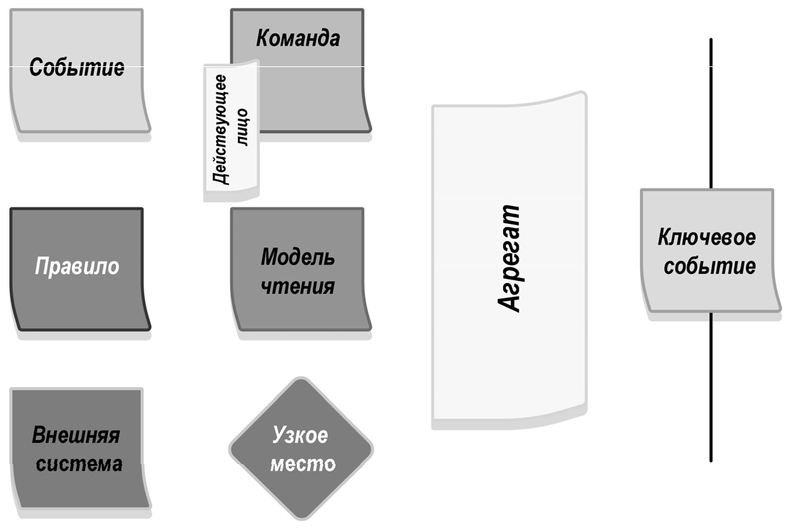{width="3.729213692038495in"
height="2.473333333333333in"}

> Рис. 12.12. Условные обозначения различных элементов процесса
> EventStorming, выполненные в виде надписей на соответствующих стикерах

#### Отслеживание динамики проведения семинара

По ходу семинара важно отслеживать активность группы. Если динамика
процесса замедляется, нужно понять, можно ли активизировать процесс,
задавая различные вопросы, или же пора переходить к следующему этапу.

Следует помнить, что EventStorming --- коллективное мероприятие, поэтому
нужно убедиться, что оно таковым и является. Убедитесь, что у каждого
специалиста име- ется возможность поучаствовать в моделировании и
обсуждении. Если заметите, что некоторые участники отделяются от
коллектива, попробуйте вовлечь их в про- цесс, задавая вопросы о текущем
состоянии модели.

EventStorming предполагает интенсивные размышления участников, и в
какой-то момент группе понадобится перерыв. Не возобновляйте сеанс, пока
все участники не вернутся в зал. Возобновите процесс с обзора текущего
состояния модели, чтобы вернуть группу в атмосферу совместного
моделирования.

> [[]{#упражнения-11 .anchor}]{#вывод-10 .anchor}222 \| *Часть III.
> Применение предметно-ориентированного проектирования на практике*

#### Проведение EventStorming с удаленными участниками

EventStorming был придуман как технологически простой вид деятельности,
преду- сматривающий общение специалистов и их совместное обучение в
пределах одного помещения. Создатель EventStorming Альберто Брандолини
часто высказывался против удаленного проведения, поскольку, когда группа
находится в разных мес- тах, достичь такого же уровня участия и,
следовательно, сотрудничества и обмена знаниями невозможно.

Но с началом пандемии COVID-19 в 2020 году проведение личных встреч и
EventStorming предполагаемым ранее способом стало невозможно. Для
обеспече- ния совместной работы и упрощения проведения удаленных сеансов
EventStorming был испробован целый ряд инструментов. На момент написания
книги наиболее заметным из них стал miro.com. При проведении
EventStorming в режиме онлайн следует проявлять особое терпение и
принимать во внимание снижение эффектив- ности общения.

Кроме того, мой опыт показывает, что удаленные сеансы EventStorming
более эф- фективны при меньшем количестве участников. Если на обычном
семинаре EventStorming могут присутствовать до 10 человек, то
онлайн-сеансы я предпочи- таю ограничивать пятью участниками. Когда для
обмена знаниями требуется боль- шее количество участников, можно
провести несколько сеансов, а затем сравнить и объединить полученные
модели.

А как только позволит ситуация, нужно будет вернуться к EventStorming с
личным присутствием участников.

### Вывод {#вывод-11}

EventStorming --- это семинар, проводимый для совместной работы по
моделирова- нию бизнес-процессов. Помимо полученных в результате его
проведения моделей, его основным преимуществом является обмен знаниями.
К концу сессии все участ- ники синхронизируют свои ментальные модели в
понимании бизнес-процесса и приобретут первый опыт использования единого
языка (ubiquitous language).

EventStorming подобен езде на велосипеде. Гораздо проще научиться делать
это, чем читать об этом в книге. К тому же он проводится в легкой и
непринужденной манере. Чтобы его инициировать, не нужно быть каким-то
гуру. Просто организуй- те его, следуйте инструкциям и учитесь
руководить процессом в ходе его проведе- ния.

### Упражнения {#упражнения-12}

1.  Кого следует приглашать на EventStorming? А) Программистов.

> Б) Экспертов предметной области.
>
> *Глава 12. EventStorming* \| 223
>
> В) QA-специалистов.
>
> Г) Всех представителей заинтересованных сторон, обладающих знаниями в
> об- ласти изучаемой предметной области.

2.  Для чего следует проводить EventStorming? А) Чтобы выстроить единый
    язык.

> Б) Чтобы изучить новую предметную область.
>
> В) Чтобы восстановить утраченные знания о действующем проекте. Г)
> Чтобы приобщить к проекту новых участников.
>
> Д) Чтобы выявить пути оптимизации бизнес-процессов. Е) Верны все
> вышеперечисленные ответы.

3.  Каких результатов следует ожидать от EventStorming? А) Лучшего
    общего понимания предметной области. Б) Закладки прочной основы для
    единого языка.

> В) Избавления от пробелов в понимании предметной области Создания
> модели на основе событий, которую можно будет использовать для
> реализации модели предметной области.
>
> Г) Все вышеперечисленные результаты, но в зависимости от цели
> проведения сеанса.

ГЛАВА 13

## Предметно-ориентированное проектирование на практике

Итак, нами рассмотрены инструменты предметно-ориентированного
проектирова- ния, предназначенные для анализа предметных областей
(business domains), обмена знаниями и принятия стратегических и
тактических проектных решений. А теперь представьте, как все эти знания
будут применяться на практике. Давайте рассмот- рим сценарий работы над
новым проектом. Все ваши коллеги неплохо разбираются в
предметно-ориентированном проектировании и с самого начала делают все
воз- можное для разработки эффективных моделей, и, конечно же,
непременно исполь- зуют единый язык (ubiquitous language). В ходе
разработки проекта уточняются границы ограниченных контекстов (bounded
contexts), повышается эффективность защиты моделей предметной области. И
наконец, поскольку все тактические про- ектные решения согласуются с
бизнес-стратегией, кодовая база всегда находится в отличной форме: все
говорят на едином языке и пользуются паттернами (patterns)
проектирования, соответствующими сложности модели. Но теперь давайте
вернем- ся в реальность.

Ваши шансы попасть в только что расписанные лабораторные условия ничуть
не выше, чем выиграть в лотерею. Конечно же, все возможно, но крайне
маловероят- но. К сожалению, многие люди ошибочно полагают, что
предметно-ориентиро- ванное проектирование применимо только к проектам,
запускаемым с нуля и в иде- альных условиях, в командах, где у каждого
имеется свидетельство о высшей ква- лификации в этой сфере. По иронии
судьбы наибольшая выгода от предметно- ориентированного проектирования
извлекается для проектов, уже запущенных в производство, уже доказавших
свою бизнес-состоятельность и нуждающихся во встряске, позволяющей
справиться с накопленным техническим долгом и проект- ной дисгармонией.
Так совпало, что работа над такими заброшенными, унаследо- ванными
кодовыми базами, превращенными в большие комки грязи, и является тем, на
что тратится большая часть нашей карьеры в области разработки программ-
ного обеспечения.

Еще одно распространенное заблуждение о предметно-ориентированном
проекти- ровании заключается в том, что в нем работает принцип «все или
ничего»: либо вы применяете все инструменты, предлагаемые методологией,
либо это не предметно- ориентированное проектирование. Но это не так.
Разобраться со всеми присущими ему концепциями, не говоря уже о том,
чтобы реализовать их на практике, может показаться непосильной задачей.
К счастью, чтобы извлечь выгоду из предметно- ориентированного
проектирования не нужно применять все паттерны и методы. Особенно это
актуально для уже состоявшихся проектов, где внедрить все эти пат- терны
и практики в разумные сроки практически невозможно.

> *Глава 13. Предметно-ориентированное проектирование на практике* \|
> 225

В этой главе состоится знакомство со стратегиями применения инструментов
и паттернов предметно-ориентированного проектирования в мире реальных
разрабо- ток, в том числе в уже запущенных проектах и в далеко не
идеальных средах.

### Стратегический анализ

Следуя порядку нашего изучения паттернов и методов
предметно-ориентирован- ного проектирования, лучшей отправной точкой для
его внедрения в организации является выделение времени на осмысление
бизнес-стратегии организации и теку- щего состояния архитектуры ее
систем.

#### Осмысление предметной области

Во-первых, нужно определить сферу деятельности компании:

- Какова предметная область (business domain) деятельности организации?

- Кто ее клиенты?

- Какую услугу или ценность организация предоставляет клиентам?

- С какими компаниями или продуктами конкурирует организация?

Ответив на эти вопросы, можно получить взгляд на высокоуровневые цели
компа- нии с высоты птичьего полета. Затем следует «приблизить взгляд» к
предметной области и найти поддомены (subdomains), т. е. структурные
элементы бизнеса, ис- пользуемые организацией для достижения своих
высокоуровневых целей.

Хорошей исходной эвристикой является организационная структура компании:
ее отделы и другие организационные единицы. Изучите порядок
сотрудничества этих подразделений, позволяющий компании успешно
конкурировать в своей бизнес- сфере.

Кроме того, следует поискать признаки конкретных типов поддоменов.

###### Основные поддомены (core subdomains)

Чтобы определить основные поддомены компании, найдите то, чем она
отличается от своих конкурентов:

- Есть ли у компании «уникальная особенность», отсутствующая у
  конкурентов? Например, такая интеллектуальная собственность, как
  патенты и алгоритмы, разработанные собственными силами?

- Учтите, что конкурентное преимущество, а следовательно, и основные
  поддо- мены не обязательно имеют техническую природу. Обладает ли
  компания ка- ким-либо нетехническим конкурентным преимуществом?
  Например, умением нанять высококвалифицированный персонал, создать
  уникальный художествен-

> ный дизайн и т. д.?

Еще одна весьма действенная, но столь же печальная эвристика для
основных под- доменов --- выявление программных компонентов с наихудшим
дизайном --- тех

> 226 \| *Часть III. Применение предметно-ориентированного
> проектирования на практике*

самых больших комков грязи, ненавидимых всеми программистами, которые
биз- нес не захотел переписывать с нуля из-за сопутствующих
бизнес-рисков. Ключе- вым моментом здесь является невозможность замены
устаревшей системы на уже готовую, иначе такой поддомен являлся бы
универсальным (generic subdomain), и то, что любая ее модификация
повлечет за собой бизнес-риски.

###### Универсальные поддомены

Чтобы определить универсальные поддомены, нужно поискать готовые
решения, услуги по подписке или интегрировать в систему программное
обеспечение с от- крытым исходным кодом. Из *главы 1* известно, что одни
и те же готовые решения должны быть доступны конкурирующим компаниям, и
компании, использующие эти же решения, не должны иметь никакого влияния
на бизнес вашей компании.

###### Вспомогательные поддомены (supporting subdomains)

Для поиска вспомогательных поддоменов нужно посмотреть на оставшиеся
про- граммные компоненты, которые нельзя заменить готовыми решениями, но
которые напрямую не дают никаких конкурентных преимуществ. Если
программный код несовершенен, работа с ним вызывает меньшее недовольство
со стороны разработ- чиков программного обеспечения, когда такой код
приходится изменять довольно редко. Таким образом, последствия
неоптимального дизайна программного кода не столь серьезны, как в случае
основных поддоменов.

Идентифицировать все основные поддомены совсем необязательно. Это будет
не- целесообразно или даже невозможно сделать даже для компании среднего
размера. Лучше будет определить общую структуру, но при этом уделить
больше внимания поддоменам, представляющим наибольшую важность для
программных систем, над которыми ведется работа.

#### Изучение текущего проекта

Как только пройдет ознакомление с пространством задач (problem space),
появится возможность продолжить исследование реализации и принятых в её
рамках про- ектных решений. Начать следует с компонентов высокого
уровня. Ими не обяза- тельно должны быть ограниченные контексты (bounded
contexts) в смысле пред- метно-ориентированного проектирования, это
скорее границы, используемые для разбиения бизнес-области на подсистемы.

Характерным свойством, на которое следует обратить внимание, являются
разоб- щенные жизненные циклы компонентов. Даже если подсистемы
расположены в одном и том же репозитории системы контроля версиями
(монорепозитории) или если все компоненты находятся в одной монолитной
кодовой базе, проверьте, какие из них могут быть разработаны,
протестированы и развернуты независимо от всех остальных.

> *Глава 13. Предметно-ориентированное проектирование на практике* \|
> 227

###### Оценка тактического замысла

Для каждого высокоуровневого компонента следует проверить, какие бизнес-
поддомены он содержит и какие технические решения были приняты, т. е.
ответить на вопрос: какие паттерны используются для реализации
бизнес-логики и описания архитектуры компонента?

Соответствует ли выбранное решение сложности изначальной задачи? Есть ли
об- ласти, где необходимы более сложные паттерны проектирования? И
наоборот, имеются ли поддомены, где можно срезать углы или
воспользоваться существую- щими готовыми решениями? Воспользуйтесь этой
информацией для принятия более взвешенных стратегических и тактических
решений.

###### Оценка стратегического замысла

Воспользуйтесь знаниями о высокоуровневых компонентах для составления
схемы карты контекстов (context map) текущего проекта, представив себе
эти высокоуров- невые компоненты в виде ограниченных контекстов. Выявите
и отследите отно- шения между компонентами с позиции паттернов
интеграции ограниченных кон- текстов.

И наконец, проанализируйте полученную карту контекстов и оцените
архитектуру с точки зрения предметно-ориентированного проектирования.
Имеются ли неопти- мальные стратегические проектные решения? Например:

- Над одним и тем же высокоуровневым компонентом работает сразу
  несколько команд.

- Продублированы реализации основных поддоменов.

- Основной поддомен реализован сторонней компанией.

- Частые сбои в интеграции выливаются в конфликты.

- Внешними сервисами и унаследованными системами навязываются неудобные
  модели.

Эти сведения являются полезной отправной точкой для планирования
стратегии модернизации проекта. Но сначала, учитывая полученные более
глубокие знания как о пространстве задач (предметной области), так и о
пространстве решений (solution space), следует выявить пробелы в знании
предметной области. Из *гла- вы 11* известно, что знания о
бизнес-области могут быть утрачены по разным при- чинам. Эта проблема
весьма распространена и актуальна в основных поддоменах, где
бизнес-логика не только сложна, но и критична для бизнеса. Столкнувшись
с этим обстоятельством, следует предпринять попытку восстановления
утраченных знаний путем проведения EventStorming. Кроме того, системой
EventStorming нуж- но воспользоваться в качестве основы для развития
единого языка.

> 228 \| *Часть III. Применение предметно-ориентированного
> проектирования на практике*

### Определение стратегии модернизации

Попытки «большого переписывания», когда программисты пытаются переписать
систему с нуля, организовав на этот раз приемлемое проектирование и
реализацию всей системы, редко приводят к успеху. Еще реже такие
архитектурные обновления поддерживаются руководством.

При более бережном подходе к улучшению дизайна существующих систем мас-
штабный замысел сочетается с малыми начинаниями. Как говорит Эрик Эванс
(Eric Evans), качественное проектирование распространяется далеко не на
всю большую систему. Это непреложный факт, и поэтому нужно принять
стратегическое реше- ние, куда именно следует приложить усилия по
модернизации. Обязательным условием для принятия такого решения является
наличие границ, разделяющих поддомены системы. Границы не обязательно
должны быть физическими, превра- щающими каждый поддомен в полноценный
ограниченный контекст. Лучше, как показано на рис. 13.1, начать как
минимум с того, чтобы выровнять логические границы (ограничивающие
пространства имен, модули и пакеты, в зависимости от технологического
стека) с границами поддоменов.

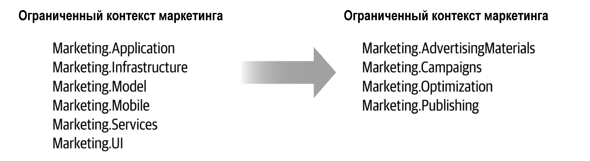

> Рис. 13.1. Реорганизация модулей ограниченного контекста, чтобы они
> являлись отражением не паттернов технической реализации, а границ
> поддоменов бизнеса

Перестановка модулей системы --- относительно безопасная форма
рефакторинга. Бизнес-логика остается прежней, а типы просто перемещаются
в более удачную структуру. И тем не менее следует убедиться, что ссылки
по полным именам типов, например для динамической загрузки библиотек,
для рефлексии (reflection) и т. д., не нарушаются.

Кроме того, нужно отслеживать бизнес-логику поддоменов, реализованную в
дру- гих кодовых базах: хранимые процедуры базы данных, бессерверные
(serverless) функции и т. д. Нужно не забыть провести новые границы и на
этих платформах. Например, если часть логики обрабатывается в хранимых
процедурах базы данных, нужно либо переименовать процедуры, чтобы в
именах фигурировал модуль, к ко- торому они принадлежат, либо применить
выделенную схему базы данных и пере- местить хранимые процедуры.

#### Стратегическая модернизация

Из *главы 10* известно, что преждевременное разбиение системы на
наименьшие из возможных ограниченных контекстов может быть сопряжено с
риском. Более под-

> *Глава 13. Предметно-ориентированное проектирование на практике* \|
> 229

робно ограниченные контексты и микросервисы будут рассмотрены в
следующей главе. А пока поищите, где можно извлечь наибольшую пользу от
превращения ло- гических границ в физические. Процесс извлечения
ограниченного контекста (или контекстов) путем превращения логической
границы в физическую показан на рис. 13.2.

Нужно задаться следующими вопросами:

- Сколько команд работает над одной и той же кодовой базой? Если
  несколько, следует развязать жизненные циклы разработки, определив
  свои ограниченные контексты для каждой команды.

- Пользуются ли разные компоненты конфликтующими моделями? Если да, то
  конфликтующие модели следует переместить в отдельные ограниченные кон-
  тексты.

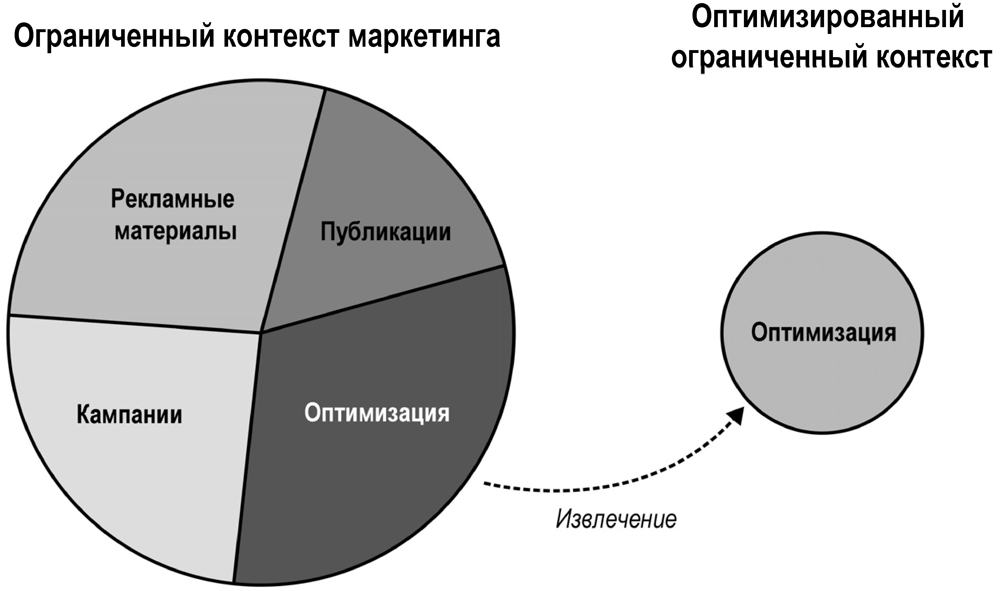{width="3.983850612423447in"
height="2.3593744531933507in"}

> Рис. 13.2. Извлечение ограниченного контекста путем превращения
> логической границы в физическую

Когда работа по созданию минимально необходимых ограниченных контекстов
будет завершена, следует изучить отношения и паттерны интеграции между
ними. Нужно присмотреться к порядку общения и сотрудничества команд,
работающих над разными ограниченными контекстами. Имеются ли у команд
общие цели и адекватные уровни сотрудничества, особенно когда они
используют общение через ситуативную (ad hoc) интеграцию контекстов или
интеграцию контекстов с общим ядром (shared kernel)?

Обратите внимание на те проблемы, которые могут быть решены за счет
примене- ния паттернов интеграции контекстов:

> *Отношения потребитель-поставщик (customer-supplier)*
>
> Из *главы 11* известно, что разрастание организации может свести на
> нет преж- ние модели общения и сотрудничества. Нужно найти компоненты,
> спроектиро- ванные с учетом партнерских отношений нескольких команд
> разработчиков, но уже утратившие былую устойчивость, и при
> необходимости провести их
>
> 230 \| *Часть III. Применение предметно-ориентированного
> проектирования на практике*
>
> рефакторинг под отношения соответствующего типа из разряда
> потребитель- поставщик (применив паттерны «Конформист»,
> «Предохранительный слой» (anticorruption layer) или сервис с открытым
> протоколом \[open-host service\]).
>
> *Предохранительный слой (anticorruption layer)*
>
> Предохранительные слои могут оказаться полезными для защиты
> ограниченных контекстов от устаревших систем, особенно если в
> последних используются не- эффективные модели с тенденцией
> распространения на нижестоящие компонен- ты. Еще один распространенный
> случай применения слоя защиты от изменений связан с ограждением
> ограниченного контекста от частых изменений в исполь- зуемых им
> открытых интерфейсах вышестоящего сервиса.
>
> *Сервис с открытым протоколом (open-host service)*
>
> Если изменения в деталях реализации одного компонента часто
> распространя- ются по системе и влияют на ее потребителей, стоит
> призадуматься над тем, чтобы сделать его сервисом с открытым
> протоколом: отделить его модель реа- лизации от предоставляемого им
> открытого API.
>
> *Разные пути (separate ways)*
>
> В крупных организациях весьма высока вероятность конфликтов,
> возникающих между командами разработчиков из-за необходимости
> сотрудничать и совмест- но совершенствовать общие функции. Если
> функциональные возможности, являющиеся «яблоком раздора», для бизнеса
> не критичны, т. е. не входят в основной поддомен, команды могут пойти
> разными путями и реализовать свои собственные решения, устраняя тем
> самым источник разногласий.

#### Тактическая модернизация

С тактической точки зрения в первую очередь нужно найти самые
«наболевшие» несоответствия в ценностях для бизнеса и стратегиях
реализаций, когда, к примеру, паттерны реализации основных поддоменов
(транзакционный сценарий (transaction script) или же активная запись
(active record)) не соответствуют сложности модели. Такие системные
компоненты, напрямую влияющие на успех бизнеса, должны изменяться чаще
всего, но их сложно сопровождать и совершенствовать из-за не- удобного
дизайна.

#### Развитие единого языка

Необходимым условием успешной модернизации проекта является знание пред-
метной области и эффективная модель предметной области. Как уже
неоднократно упоминалось в этой книге, для получения знаний и построения
эффективной моде- ли решения необходим единый язык (ubiquitous language)
предметно-ориентиро- ванного проектирования.

Не стоит забывать, что в предметно-ориентированном проектировании есть
быст- рый способ сбора знаний о предметной области: EventStorming.
Используйте EventStorming для выработки единого с экспертами предметной
области языка и изучения устаревшей кодовой базы, особенно если она
представляет собой не

> *Глава 13. Предметно-ориентированное проектирование на практике* \|
> 231

имеющий подробной документации беспорядочный код, который никто
по-настоя- щему не понимает. Соберите всех, кто связан с работой этой
кодовой базы, и ис- следуйте предметную область. EventStorming ---
великолепный инструмент восста- новления знаний о предметной области.

Вооружившись знаниями о предметной области и ее моделями, следует
решить, какие паттерны реализации бизнес-логики больше всего подходят
для рассматри- ваемой бизнес-функциональности. В качестве отправной
точки нужно воспользо- ваться эвристикой проектирования, рассмотренной в
*главе 10*. Следующее решение, которое следует принять, касается
стратегии модернизации: постепенной замены целых компонентов системы
(паттерн «Душитель», Strangler) или постепенного рефакторинга
существующего решения.

###### Паттерн «Душитель» (Strangler)

Инжир-душитель, показанный на рис. 13.3, относится к семейству
тропических де- ревьев, имеющих специфический способ развития: душители
растут поверх других деревьев-хозяев. Жизнь душителя начинается с семени
на верхних ветвях дерева- хозяина. По мере роста душитель спускается
вниз, пока не укоренится в почве. В конечном итоге у душителя вырастает
листва, затеняющая дерево-хозяина, что приводит к гибели последнего.

> Рис. 13.3. Инжир-душитель, растущий на вершине дерева-хозяина
> (источник: https://unsplash.com/photos/y_l5tep9wxI)

Паттерн миграции «Душитель» (strangler) основан на той же динамике
развития, что и растение, в честь которого он назван. Идея заключается в
создании нового ограниченного контекста --- душителя --- и его
применении для реализации новых

> 232 \| *Часть III. Применение предметно-ориентированного
> проектирования на практике*

требований и постепенной миграции в его функциональность устаревшего
контек- ста. Одновременно с этим, за исключением исправлений и других
чрезвычайных ситуаций, останавливается доработка и развитие устаревшего
ограниченного кон- текста. В конечном итоге вся функциональность
переносится в новый ограничен- ный контекст --- душитель --- и по
аналогии, приводящей к смерти дерева-хозяина, к избавлению от устаревшей
кодовой базы.

Обычно паттерн «Душитель» используется в тандеме с паттерном «Фасад»
(facade): тонким уровнем абстракции, действующим в качестве публичного
интерфейса и отвечающим за перенаправление запросов на обработку либо в
устаревший, либо в модернизированный ограниченный контекст. Когда
миграция завершается, т. е. когда «хозяин» умирает, фасад удаляется, т.
к. он уже больше не нужен (рис. 13.4).

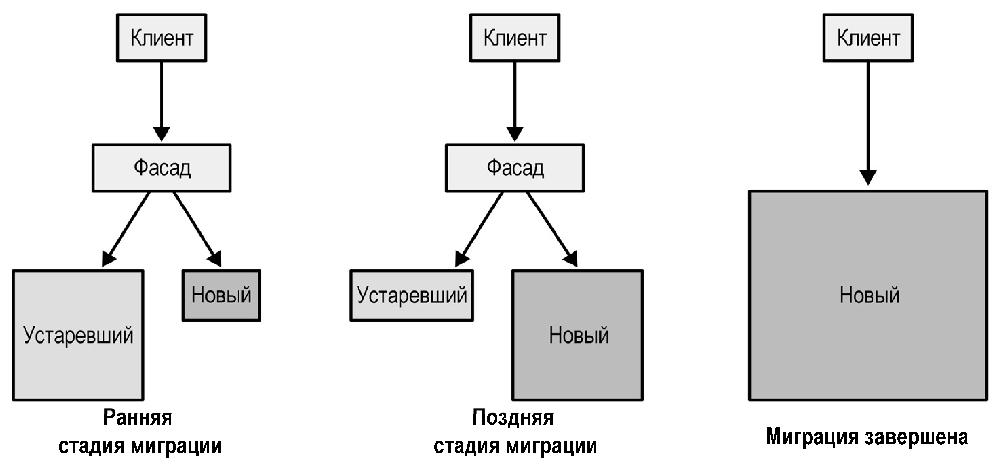{width="4.86153980752406in"
height="2.295103893263342in"}

> Рис. 13.4. Слой фасада перенаправляет запрос в зависимости от
> состояния переноса функциональности из устаревшей системы в
> модернизированную;
>
> после завершения миграции и фасад, и устаревшая система удаляются

При реализации паттерна «Душитель» можно частично отойти от принципа,
со- гласно которому каждый ограниченный контекст является отдельной
подсистемой и, следовательно, не может совместно использовать свою базу
данных с другими ограниченными контекстами. И новый, и устаревший
контекст может пользоваться одной и той же базой данных, чтобы избежать
сложной интеграции между контек- стами, которая во многих случаях может
повлечь за собой распределенные тран- закции --- как показано на рис.
13.5, оба контекста должны работать с одними и те- ми же данными.

Условием изменения правила об отдельной базе данных для каждого
ограниченно- го контекста является то, что в конечном итоге, и чем
раньше, тем лучше, устарев- ший контекст будет удален, а база данных
будет использоваться исключительно новой реализацией.

Альтернативой миграции на основе паттерна «Душитель» является
модернизация существующей кодовой базы, также называемая рефакторингом.

> 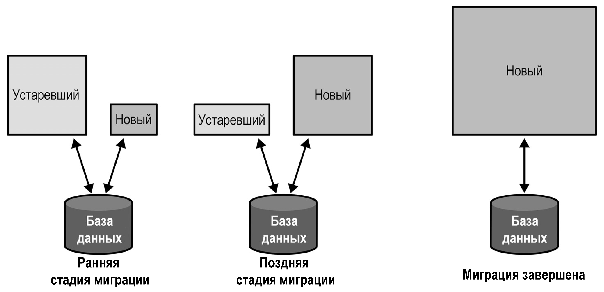{width="4.867925415573054in"
> height="2.3604155730533685in"}*Глава 13. Предметно-ориентированное
> проектирование на практике* \| 233
>
> Рис. 13.5. И старая, и новая система временно работает с одной и той
> же базой данных

###### Рефакторинг тактических проектных решений

Различные аспекты миграции тактических проектных решений уже
рассматрива- лись в *главе 11.* Но есть два нюанса, о которых не следует
забывать при модерниза- ции устаревшей кодовой базы.

Во-первых, вместо масштабной переработки намного безопаснее будет
проводить миграцию небольшими последовательными этапами. Поэтому не
стоит перераба- тывать транзакционный сценарий или активную запись сразу
же в модель предмет- ной области, основанную на событиях. Вместо этого
лучше провести промежуточ- ный этап проектирования агрегатов, основанных
на состоянии. Приложите усилия к поиску эффективных границ агрегатов.
Убедитесь, что в эти границы попадает вся связанная бизнес-логика.
Переход от агрегатов, основанных на состоянии (state- based), к
агрегатам, основанным на событиях (event sourced aggregates), будет на
порядок безопаснее, чем выявление некорректных границ транзакций в
агрегатах, основанных на событиях.

Во-вторых, следуя той же логике небольших последовательных этапов,
рефакто- ринг модели предметной области не обязан быть атомарным
изменением. Элемен- ты паттерна модели предметной области могут
вводиться постепенно.

Начните с поиска возможных объектов-значений. Неизменяемые объекты могут
существенно упростить решения, даже если пока еще не используется
полноценная модель предметной области.

В *главе 11* было выяснено, что рефакторинг активных записей в агрегаты
не обяза- тельно проводить «за одну ночь». Это можно сделать поэтапно.
Начать следует со сбора соответствующей бизнес-логики. Затем нужно
проанализировать границы транзакций. Узнать, есть ли решения, требующие
строгой согласованности, но оперирующие данными в режиме согласованности
в конечном счете (eventual consistency)? Или же наоборот, применяется ли
решение со строгой согласован- ность там, где будет достаточно
согласованности в конечном счете? При анализе

> 234 \| *Часть III. Применение предметно-ориентированного
> проектирования на практике*

кодовой базы не следует забывать, что эти решения обусловлены не
технологией, а бизнес-задачами. Проектировать границы агрегата можно
будет только после тщательного анализа требований к транзакциям.

И наконец, при необходимости в процессе рефакторинга устаревшей системы
но- вую кодовую базу следует защитить от старых моделей с помощью
предохрани- тельного слоя (anticorruption layer), а потребителей следует
защитить от изменений в устаревшей кодовой базе за счет внедрения
сервиса с открытым протоколом (open-host service) и предоставления
опубликованного языка (published language).

### Прагматичное

> предметно-ориентированное проектирование

Во введении в эту главу уже говорилось, что применение
предметно-ориентиро- ванного проектирования не является чем-то из
разряда «все или ничего». Приме- нять буквально каждый инструмент,
предлагаемый DDD-технологией, не нужно. Может оказаться так, что по
какой-то причине тактические паттерны могут у вас не работать. Возможно,
ваше предпочтение отдается другим паттернам проектирова- ния, поскольку
в вашей конкретной области они работают лучше, или же просто потому, что
эти паттерны считаются более эффективными. Это абсолютно нор- мально!

В ходе анализа своей предметной области и ее стратегии нужно подбирать
эффек- тивные модели для решения конкретных задач и, что наиболее важно,
принимать проектные решения на основе потребностей предметной области: в
этом и есть смысл предметно-ориентированного проектирования!

Стоит еще раз подчеркнуть, что предметно-ориентированное проектирование
не связано с агрегатами (aggregate) или объектами-значениями (value
object). Его смысл заключается в том, чтобы позволить предметной области
вашего бизнеса управлять решениями по проектированию программного
обеспечения.

### Как «продать»

> предметно-ориентированное проектирование?

Когда я выступаю на рассматриваемую нами тему на технологических
конферен- циях, практически всегда получаю один и тот же вопрос: «Звучит
здорово, но как мне "продать" предметно-ориентированное проектирование
своей команде и руко- водству?» Это чрезвычайно важный вопрос.

Продавать нелегко, и лично я ненавижу этот процесс. Тем не менее, если
подумать, разработка программного обеспечения продается. Мы продаем наши
идеи команде, руководству или клиентам. Но продать методологию,
охватывающую столь широ- кий спектр аспектов проектных решений и даже
выходящую за пределы зоны про- ектирования с целью привлечения других
заинтересованных лиц, может быть чрез- вычайно трудно.

> []{#единый-язык-1 .anchor}*Глава 13. Предметно-ориентированное
> проектирование на практике* \| 235

Без поддержки руководства не обойдется ни одно существенное
организационное изменение. Но если руководители высшего звена пока еще
не знакомы с предмет- но-ориентированным проектированием или не готовы
уделить свое время изуче- нию бизнес-ценности этой методологии, то она
не будет для них приоритетом, тем более что сдвиг в процессе
проектирования, связанный с применением DDD, пред- ставляется им весьма
значительным. Но, к счастью, это совершенно не означает отсутствие
возможности использования вами предметно-ориентированного проек-
тирования.

#### Законспирированное

> предметно-ориентированное проектирование

Превратите предметно-ориентированное проектирование не в организационную
стратегию, а в часть своего профессионального набора инструментов.
Паттерны и методы, присущие DDD, относятся к технологии
программирования, и, поскольку вашей работой является разработка
программного обеспечения, воспользуйтесь ими!

Давайте посмотрим, как можно будет внедрить DDD в свою повседневную
работу, не создавая при этом слишком много шума.

###### Единый язык {#единый-язык-2}

Использование единого языка (ubiquitous language) является краеугольным
камнем практики предметно-ориентированного проектирования. Он необходим
для выяв- ления знаний предметной области, общения и эффективного
моделирования реше- ний.

К счастью, эта совершенно обычная практика, не выходящая за рамки
здравого смысла. Прислушивайтесь к языку, которым пользуются
заинтересованные сторо- ны при обсуждении предметной области. Аккуратно
направляйте терминологию из технического жаргона в сторону ее
бизнес-значения.

Выискивайте противоречивые термины и требуйте их разъяснения. Например,
если у одного и того же предмета несколько названий, ищите причину
этого. Не встре- чаются ли столь разные модели в одном и том же решении?
Возможно, что это скрытый контекст, который нужно сделать явным. Если
значение одно и то же, проявите здравомыслие и потребуйте использования
одного и того же термина.

Кроме того, общайтесь как можно больше с экспертами предметной области.
И для этого вовсе не нужны сугубо формальные встречи. Лучше общаться
где-нибудь в непринужденной обстановке за чашечкой кофе. Поговорите с
бизнес-экспертами о сфере бизнеса. Попробуйте перейти на их язык.
Выискивайте сложности в пони- мании и просите разъяснений. И не стоит
переживать --- бизнес-эксперты обычно рады сотрудничеству с
разработчиками, искренне заинтересованными в изучении предметной
области!

Самое главное, используйте единый язык в своем коде и во всем
информационном обмене, связанном с проектом. Проявите терпение.
Изменение терминологии, ранее

> []{#ограниченные-контексты-3 .anchor}236 \| *Часть III. Применение
> предметно-ориентированного проектирования на практике*

устоявшейся в вашей организации, потребует некоторого времени, но в
конечном итоге она все равно приживется.

###### Ограниченные контексты {#ограниченные-контексты-4}

Изучая возможные варианты декомпозиции, определите принципы, лежащие в
основе паттерна ограниченного контекста:

- Почему лучше разрабатывать проблемно-ориентированные модели, а не одну
  модель для всех сценариев использования? Потому что решения «все в
  одном» редко бывают эффективны абсолютно для всего.

- Почему ограниченный контекст не может содержать конфликтующие модели?
  Из-за возрастающей сложности решения и трудностей в его понимании.

- Почему работа нескольких команд над одной и той же кодовой базой ---
  плохая затея? Из-за постоянно возникающих конфликтов между командами,
  препятст- вующих сотрудничеству.

Воспользуйтесь той же самой аргументацией и для паттернов интеграции
ограни- ченных контекстов: убедитесь, что задача, решаемая каждым
паттерном, вам ясна и понятна.

###### Тактические проектные решения

Обсуждая паттерны тактического проектирования, не апеллируйте к
авторитету:

«Давайте воспользуемся здесь агрегатом, поскольку так написано в книге
по пред- метно-ориентированному проектированию!» Лучше включите логику.
Например:

- Почему так важны четкие границы транзакций? Для защиты согласованности
  данных.

- Почему транзакция базы данных не может изменить более одного
  экземпляра агрегата? Чтобы обеспечить корректность границ
  согласованности.

- Почему внешний компонент не может напрямую изменить состояние
  агрегата? Чтобы обеспечить совместное размещение всей связанной
  бизнес-логики и от- сутствие ее дубликатов.

- Почему нельзя передавать часть функций агрегата хранимой процедуре?
  Чтобы обеспечить отсутствие продублированности какой-либо логики.
  Продублиро- ванная логика, особенно в логически и физически удаленных
  компонентах сис- темы, склонна к рассинхронизации и повреждению
  данных.

- Почему нужно стремиться к тому, чтобы границы агрегатов имели
  наименьший размер? Потому что большой объем изменений в рамках одной
  транзакции усложняет агрегат и отрицательно влияет на
  производительность.

- Почему вместо событий как источника данных нельзя просто записывать
  собы- тия в файл журнала? Потому что это не дает долгосрочных гарантий
  согласо- ванности данных.

Если же говорить о событиях как источниках данных (event sourcing), то,
когда ре- шение потребует воспользоваться моделью предметной области,
основанной на

> *Глава 13. Предметно-ориентированное проектирование на практике* \|
> 237

событиях (event-sourced domain model), продвижение реализации паттерна
этой мо- дели может столкнуться с трудностями. Давайте взглянем на
психологический при- ем опытного специалиста, способный помочь в этом
деле.

###### Модель предметной области, основанная на событиях

Несмотря на множество преимуществ, словосочетание «события как источник
дан- ных» (event sourcing) звучит для многих слишком радикально. Как и в
отношении всего, что рассматривалось в этой книге, решение заключается в
том, чтобы позво- лить предметной области управлять самим этим решением.

Поговорите с экспертами предметной области. Покажите им модели,
основанные на состояниях и событиях. Объясните, чем они отличаются друг
от друга и рас- кройте преимущества, предлагаемые использованием событий
как источника дан- ных, особенно в отношении временно´го измерения
(фактора времени). Скорее все- го, они придут в восторг от
предоставляемого этой технологией уровня проникно- вения в суть процесса
и сами станут выступать за использование паттерна события как источника
данных (event sourcing).

Общаясь с экспертами предметной области, не забывайте работать над
совершен- ствованием единого языка!

### Вывод {#вывод-10}

В этой главе были рассмотрены различные методы использования
инструменталь- ных средств предметно-ориентированного проектирования в
реальных сценариях: при работе над уже существующими проектами и с
устаревшими кодовыми базами, причем не обязательно с уже готовой
командой зрелых специалистов в области предметно-ориентированного
проектирования.

Как и в проектах, запускаемых с нуля, всегда начинайте с анализа
предметной об- ласти. Задайтесь следующим вопросом: каковы цели компании
и стратегия их дос- тижения? Воспользуйтесь организационной структурой и
уже существующими ре- шениями по проектированию программного
обеспечения, чтобы определить под- домены, приемлемые для организации и
их типы. Обладая этими знаниями, спланируйте стратегию модернизации.
Ищите узкие места. Стремитесь извлечь наибольшую ценность для бизнеса.
Модернизируйте устаревший код либо путем рефакторинга, либо путем замены
тех или иных компонентов. В любом случае де- лайте это постепенно.
Большие переделки влекут за собой более высокую степень риска, а не
повышение их ценности для бизнеса!

И последнее: инструменты предметно-ориентированного проектирования можно
использовать даже в том случае, если методология DDD еще не получила
широкого распространения в вашей организации. Воспользуйтесь приемлемыми
инструмен- тами, а при их обсуждении с коллегами всегда используйте
логику и принципы, положенные в основу каждого паттерна.

Эта глава завершает рассмотрение самого предметно-ориентированного
проек- тирования как такового. В четвертой части книги речь пойдет о
взаимодействии

> 238 \| *Часть III. Применение предметно-ориентированного
> проектирования на практике*

предметно-ориентированного проектирования с другими методологиями и
паттер- нами.

### Упражнения {#упражнения-11}

1.  Предположим, что инструменты и методы предметно-ориентированного
    проек- тирования нужно внедрить в уже существующий проект. Каким
    будет ваш пер- вый шаг?

> А) Рефакторинг всей бизнес-логики в модель предметной области,
> основанной на событиях.
>
> Б) Анализ предметной области организации и ее стратегии.
>
> В) Усовершенствование компонентов системы, убедившись, что они следуют
> принципам надлежащих ограниченных контекстов.
>
> Г) Никаким, поскольку применить предметно-ориентированное
> проектирование к уже запущенному проекту невозможно.

2.  В чем именно паттерн «Душитель» (Strangler), применяемый в процессе
    мигра- ции, противоречит некоторым основным принципам
    предметно-ориентирован- ного проектирования?

> А) Общая база данных используется сразу несколькими ограниченными
> контек- стами.
>
> Б) Если обновленный ограниченный контекст является основным
> поддоменом, то его программный код дублируется в старой и новой
> реализациях проекта.
>
> В) Над одним и тем же ограниченным контекстом работает сразу несколько
> команд.
>
> Г) А и Б.

3.  Почему настоятельно не рекомендуется проводить рефакторинг
    бизнес-логики, основанной на использовании активных записей,
    непосредственно в модель предметной области, основанной на событиях?

> А) Рефакторинг границ агрегатов в процессе изучения предметной области
> про- ще проводить с использованием модели на основе состояний.
>
> Б) Вносить масштабные изменения гораздо безопаснее в поэтапном режиме.
> В) А и Б.
>
> Г) Все из вышеперечисленного неверно. Непосредственный перевод в
> модель предметной области, основанную на событиях, целесообразен даже
> для транзак- ционных сценариев.

4.  Почему при вводе в практику программирования паттерна агрегатов у
    вашей команды возникает вопрос о причине, по которой агрегат не
    может просто ссы- латься на все возможные сущности, позволяя тем
    самым осуществить обход всей бизнес-области из одного места. Какой
    ответ им следует дать?

ЧАСТЬ IV

# Взаимоотношения с другими методологиями

# и паттернами

До сих пор речь в книге шла о том, как использовать
предметно-ориентированное проектирование для разработки программных
решений в соответствии с бизнес- стратегией и потребностями организации.
Были рассмотрены способы применения инструментов и методов
предметно-ориентированного проектирования для пони- мания предметной
области бизнеса, проектирования границ компонентов системы и реализации
бизнес-логики.

Предметно-ориентированное проектирование охватывает весьма существенную
часть, но не весь жизненный цикл разработки программного продукта. На
сцену также выходят другие методологии и инструменты. В четвертой части
книги рас- сматриваются взаимоотношения предметно-ориентированного
проектирования с другими методологиями и паттернами (pattern):

- Не секрет, что предметно-ориентированное проектирование получило
  наиболее широкое распространение благодаря популярности архитектурного
  стиля, осно- ванного на микросервисах. В *главе 14* будет рассмотрено
  взаимодействие мик-

> росервисов с предметно-ориентированным проектированием и то, как они
> до- полняют друг друга.

- Весьма популярным методом проектирования масштабируемых, производи-
  тельных и отказоустойчивых распределенных систем является применение
  со-

> бытийно-ориентированной (event-driven) архитектуры. В *главе 15* будут
> пред- ставлены принципы событийно-ориентированной архитектуры и
> рассмотрены способы применения предметно-ориентированного
> проектирования с целью разработки эффективного асинхронного обмена
> данными.

- *Глава 16* завершает книгу рассмотрением приемов эффективного
  моделирования в контексте анализа данных. В ней будут представлены
  преобладающие архи- тектуры управления данными, хранилища и озера
  данных (data lakes), а также

> способы устранения их недостатков архитектурой Data Mesh. Будут также
> про- ведены анализ и обсуждение того обстоятельства, что
> предметно-ориентирован- ное проектирование и архитектура Data Mesh
> основаны на одних и тех же прин- ципах и целях проектирования.

ГЛАВА 14

## Микросервисы

В середине 2010-х годов *микросервисы* стремительно захватили индустрию
разра- ботки программных средств. Замысел заключался в удовлетворении
потребностей современных систем в быстром изменении, масштабировании и
естественном соот- ветствии распределенной природе облачных вычислений.
Многие компании при- няли стратегическое решение разложить свои
монолитные кодовые базы на более гибкие составляющие, обеспечиваемые
архитектурой на основе микросервисов. К сожалению, многие подобные
начинания особо ничем не закончились. Вместо гибких архитектур компании
получили распределенные большие комки грязи (big ball of mud) ---
конструкции, гораздо более хрупкие, запутанные и дорогие, чем ис- ходные
монолиты.

Так уж повелось, что технология микросервисов зачастую ассоциировались с
пред- метно-ориентированным проектированием, особенно с паттерном
«Ограниченный контекст» (Bounded Context). Многими термины «ограниченный
контекст» и «мик- росервисы» даже использовались как синонимы. Но можно
ли их отождествлять? В этой главе исследуется связь методологии
предметно-ориентированного проек- тирования и архитектурного паттерна
микросервисов. Будет рассмотрено взаимо- действие паттернов и, что более
важно, раскрыты приемы использования предмет- но-ориентированного
проектирования в разработке эффективных систем на основе микросервисов.

Давайте начнем с основ и определим, что же такое сервисы и микросервисы.

### Что такое сервис?

Согласно OASIS сервис --- это механизм, обеспечивающий доступ к одной
или не- скольким бизнес-компетенциям (capability), предоставляемый с
использованием предписанного интерфейса (prescribed interface)1. А
предписанный интерфейс (prescribed interface) --- это любой способ
передачи данных в сервис и получения данных из него. Он может быть
синхронным, например моделью запрос-ответ (request/response), или
асинхронным, например моделью, отправляющей и прини- мающей события.
Это, как показано на рис. 14.1, публичный интерфейс сервиса,
предоставляющий средства для обмена данными и интеграции с другими
компо- нентами системы.

> ^1^ «Reference model for service-oriented architecture v1.0». (n.d.).
> Извлечено 14 июня 2021 г. из OASIS.
>
> 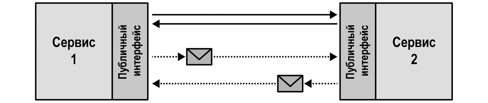{width="4.71551290463692in"
> height="1.0in"}*Глава 14. Микросервисы* \| 241
>
> Рис. 14.1. Обмен данными между сервисами

У Рэнди Шоупа (Randy Shoup) интерфейс сервиса сравнивается со входной
дверью, через которую должны проходить все данные, передаваемые в сервис
или запраши- ваемые из него. Кроме того, публичный интерфейс сервиса
определяет саму его суть, т. е. предоставляемые им функциональные
возможности. Четко выраженного интерфейса вполне достаточно для описания
функциональности, реализованной сервисом. Например, публичный интерфейс,
показанный на рис. 14.2, явно описы- вает функциональные возможности
сервиса.

Это подводит нас к определению микросервиса.

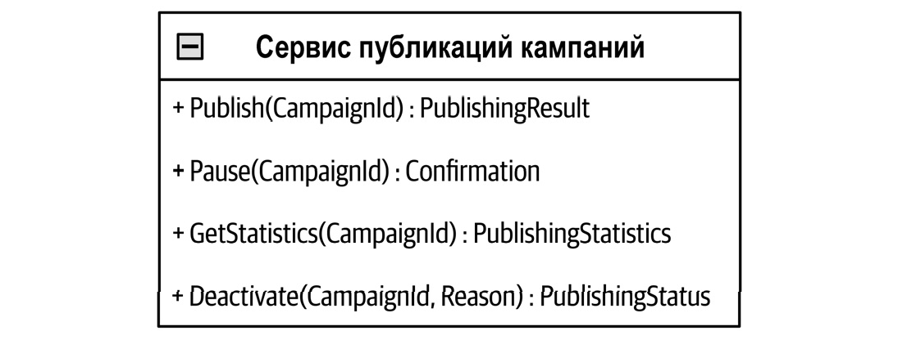{width="3.681823053368329in"
height="1.3866666666666667in"}

> Рис. 14.2. Публичный интерфейс сервиса

### Что такое микросервис?

Определение микросервиса на удивление простое. Поскольку сервис
определяется своим публичным интерфейсом, микросервис --- это сервис с
публичным микроин- терфейсом (входной микродверью).

Наличие публичного микроинтерфейса упрощает понимание как функции
отдель- ного сервиса, так и его интеграции с другими компонентами
системы. Сокращение функциональности сервиса также ограничивает круг
причин для его изменений и делает сервис более автономным для
разработки, управления и масштабирования.

Кроме того, это объясняет, почему в микросервисах никто, кроме самого
микросер- виса, не может получить прямой доступ к его базе данных\...
Открытый доступ к базе данных, превращение ее в парадную дверь сервиса,
сделало бы ее публичный интерфейс просто огромным. Например, сколько
различных SQL-запросов можно выполнить к реляционной базе данных?
Поскольку SQL --- достаточно гибкий язык, вероятная оценка будет близка
к бесконечности. Следовательно, микросерви-

> 242 \| *Часть IV. Взаимоотношения с другими методологиями и
> паттернами*

сы инкапсулируют свои базы данных. Доступ к данным возможен только через
гораздо более компактный публичный интерфейс, ориентированный на
интеграцию.

#### Метод как Сервис (Method as a Service):

> путь к созданию идеальных микросервисов?

Высказывание о том, что микросервис --- это публичный микроинтерфейс,
кажется обманчиво простым. Может показаться, что ограничение интерфейсов
сервисов всего лишь одним методом приведет к созданию идеальных
микросервисов. По- смотрим, что произойдет, если применить эту наивную
декомпозицию на практике.

Рассмотрим сервис управления бэклогом, показанный на рис. 14.3. Его
публичный интерфейс состоит из восьми публичных методов, и у нас
возникло желание при- менить к нему правило «один метод --- один
сервис».

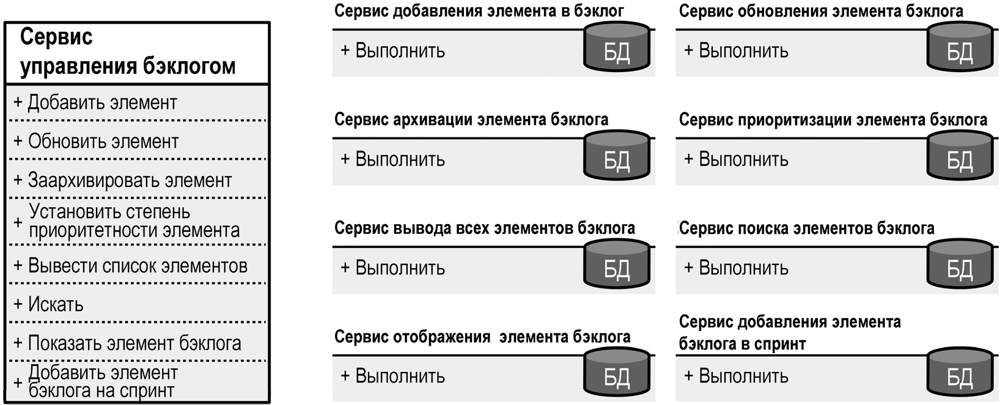{width="5.479515529308836in"
height="2.21in"}

> Рис. 14.3. Наивная декомпозиция

Поскольку это микросервисы с правильным поведением, каждый из них
инкапсу- лирует свою базу данных. Ни одному сервису не разрешен прямой
доступ к базе данных другого сервиса, он возможен только через его
публичный интерфейс. Но пока что для этого нет публичного интерфейса.
Сервисы должны работать вместе и синхронизировать изменения, вносимые
каждым сервисом. То есть возникает не- обходимость расширения
интерфейсов сервисов, позволяющего учесть возникшие проблемы интеграции.
Кроме того, как показано на рис. 14.4, при визуализации ин- теграция и
поток данных между получающимися в результате сервисами напоми- нают
типичный распределенный большой ком грязи.

Перефразируя метафору Рэнди Шоупа, можно сказать, что, разбив систему на
такие мелкие сервисы, мы определенно свели количество входных дверей
сервисов к ми- нимуму. Но для реализации общей функциональности системы
нам пришлось до- бавить в каждый сервис широкие входы «только для
персонала». Давайте посмот- рим, какой урок можно извлечь из этого
примера.

> 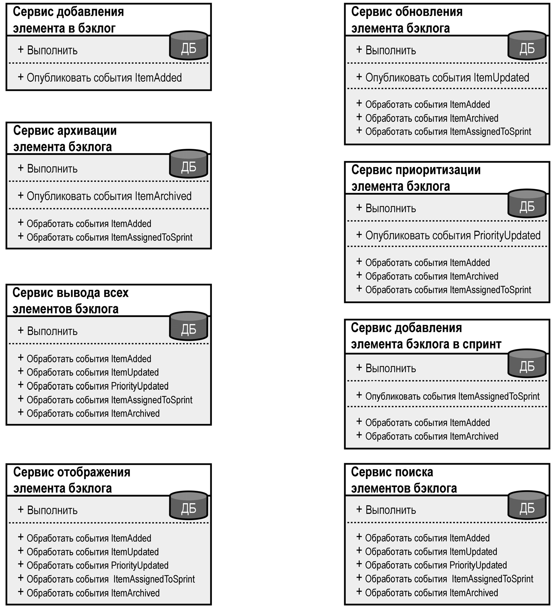{width="5.511500437445319in"
> height="6.026666666666666in"}*Глава 14. Микросервисы* \| 243
>
> Рис. 14.4. Сложности интеграции

#### Цель проектирования

Следование упрощенной эвристике декомпозиции, согласно которой каждым
сер- висом предоставляется только один метод, оказалось неоптимальным по
многим причинам. Во-первых, это просто не представляется возможным.
Поскольку серви- сы должны работать вместе, возникла необходимость
расширения их публичных интерфейсов за счет применения публичных
интеграционных методов. Во-вторых, получается, выиграв битву, мы
проиграли войну. Каждый сервис оказался намного

> 244 \| *Часть IV. Взаимоотношения с другими методологиями и
> паттернами*

проще исходного, но в совокупности получающаяся система стала на
несколько порядков сложнее.

Цель микросервисной архитектуры заключается в создании гибкой системы.
Со- средоточение усилий проектирования на одном компоненте при
игнорировании порядка его взаимодействия со всей остальной частью
системы противоречит самому определению системы:

- Набор взаимосвязанных элементов или устройств, работающих вместе.

- Набор компьютерного оборудования и программ, используемых вместе для
  дос- тижения определенной цели.

Следовательно, система не может быть построена из абсолютно независимых
ком- понентов. В удачно спроектированной микросервисной системе, даже
при разоб- щенности сервисов, они все равно должны быть объединены на
основе взаимодей- ствия друг с другом. Давайте посмотрим на
взаимодействие сложности, присущей отдельно взятым микросервисам, и
сложности, присущей общей системе.

#### Сложность системы

Сорок лет назад не было облачных вычислений, не было каких-либо
требований глобального порядка и не было необходимости развертывать
систему каждые 11,7 секунды. Но разработчикам все же приходилось
укрощать сложность систем. Несмотря на то что инструменты в те дни были
совершенно иными, задачи и, что более важно, решения актуальны и сегодня
и могут быть применены к проектиро- ванию систем на основе
микросервисов.

В своей книге «Composite/Structured Design» Гленфорд Дж. Майерс
(Glenford J. Myers) рассматривает приемы структурирования процедурного
кода, приводящие к снижению его сложности. И на первой странице книги он
пишет следующее:

> Вопрос снижения сложности гораздо шире простой попытки минимизации
> локальной сложности каждой части программы. Куда более важным типом
> сложности является глобальная сложность, под которой понимается
> сложность общей структуры програм- мы или системы (т. е. степень связи
> или взаимозависимости между основными частя- ми программы).

В нашем контексте под локальной сложностью понимается сложность каждого
от- дельно взятого микросервиса, а под глобальной сложностью ---
сложность всей системы. Локальная сложность зависит от реализации
сервиса, а глобальная слож- ность определяется взаимодействиями и
зависимостями между сервисами. Какую из сложностей важнее оптимизировать
при разработке системы на основе микро- сервисов? Проанализируем это.

Свести к минимуму глобальную сложность, как ни странно, легко. Нужно
лишь исключить любые взаимодействия между компонентами системы, т. е.
реализовать весь функционал в одном монолитном сервисе. И как ранее уже
показывалось, эта стратегия может сработать. В иных случаях это может
привести к ужасно большо- му кому грязи (big ball of mud): возможно, это
и будет наивысший уровень локаль- ной сложности.

> *Глава 14. Микросервисы* \| 245

С другой стороны, нам известно, что происходит, когда оптимизируется
только локальная сложность и пренебрегается глобальной сложностью
системы. Тогда по- лучается еще более ужасный распределенный большой ком
грязи. Данная взаимо- связь показана на рис. 14.5.

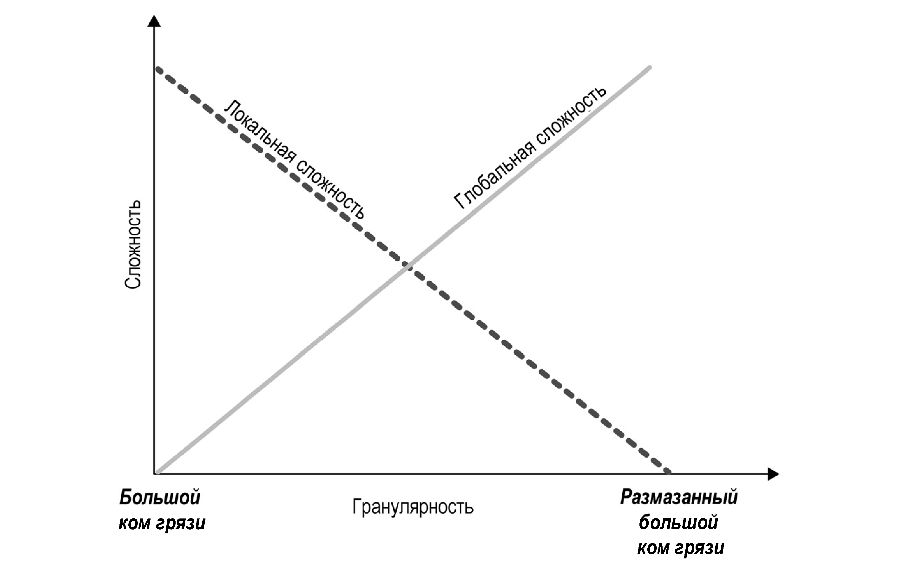{width="4.676195319335083in"
height="2.92375in"}

> Рис. 14.5. Степень гранулярности сервисов и сложность системы

Чтобы спроектировать удачную систему на основе микросервисов, нужно
оптими- зировать как локальную, так и глобальную сложность. Локальный
оптимум заклю- чается в цели проектирования, выражающейся в оптимизации
любого отдельно взятого сервиса. Глобальный оптимум призван
сбалансировать оба вида сложно- стей. А теперь давайте посмотрим, как
сбалансированность глобальной и локаль- ной сложности достигается
введением такого понятия, как публичные микроин- терфейсы.

#### Микросервисы как «глубокие» сервисы (deep services)

Модуль в программной системе или любой системе определяется, собственно
гово- ря, своей функцией и логикой. *Функцией* определяется
предназначение модуля, т. е. его бизнес-функциональность. А *логикой*
является бизнес-логика модуля, т. е. тем, как в модуле реализуется его
бизнес-функциональность.

В своей книге «The Philosophy of Software Design» Джон Оустерхаут (John
Ousterhout) рассматривает понятие модульности и предлагает простую, но
мощную визуаль- ную эвристику для оценки конструкции модуля: глубину.

Оустерхаут предлагает визуализировать модуль в виде прямоугольника,
показанно- го на рис. 14.6. Верхний край прямоугольника является
представлением функции модуля или сложности его публичного интерфейса.
Чем шире прямоугольник, тем

> 246 \| *Часть IV. Взаимоотношения с другими методологиями и
> паттернами*

шире функциональность, а чем он у´же, тем ограниченнее его функция и,
следова- тельно, проще публичный интерфейс. Площадь прямоугольника
является представ- лением логики модуля или реализации его
функциональности.

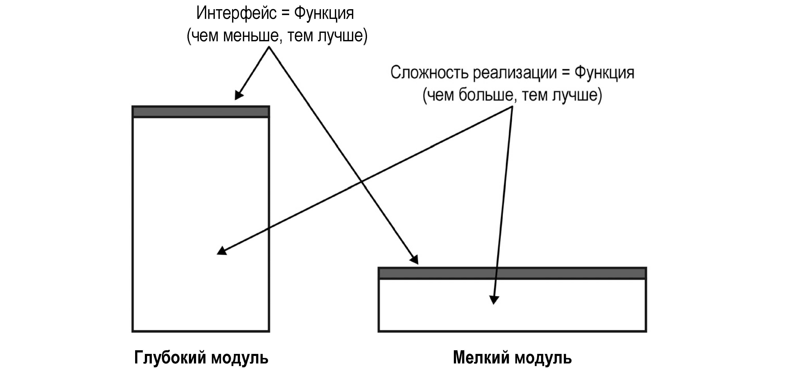{width="4.930121391076115in"
height="2.329478346456693in"}

> Рис. 14.6. Глубокие модули

Согласно этой модели эффективные модули глубоки: в простом публичном
интер- фейсе инкапсулируется сложная логика. Неудачные модули слишком
мелки: в пуб- личном интерфейсе мелкого модуля инкапсулируется гораздо
меньшая сложность, чем в интерфейсе глубокого модуля. Рассмотрим метод,
показанный в следующем листинге:

> int AddTwoNumbers(int a, int b)
>
> {
>
> return a + b;
>
> }

Это яркий пример мелкого модуля: открытый интерфейс (сигнатура метода) и
его логика (методы) абсолютно одинаковы. Такой вот модуль вводит в
систему лишние «подвижные детали» (moving parts), и, стало быть, вместо
инкапсуляции сложности он добавляет совершенно непреднамеренную
сложность (accidental complexity) ко всей системе.

#### Микросервисы как глубокие модули

Помимо иной терминологии, понятие глубоких модулей отличается от
микросер- висов тем, что модулями могут обозначаться как логические, так
и физические гра- ницы, тогда как микросервисы имеют строго физические
границы. В остальном обе концепции и лежащие в их основе принципы
проектирования совершенно одина- ковы.

Сервисы, показанные на рис. 14.3, в которых реализуется только один
бизнес- метод, представляют собой мелкие модули. Поскольку нам пришлось
вводить пуб-

> *Глава 14. Микросервисы* \| 247

личные интеграционные методы, получившиеся интерфейсы стали «шире», чем
должны были быть.

С позиции общесистемной сложности глубокий модуль уменьшает глобальную
сложность системы, а мелкий модуль ее увеличивает, вводя компонент, не
инкап- сулирующий его локальную сложность.

Мелкие сервисы также являются причиной неудач множества проектов,
ориенти- рованных на применение микросервисов. Ошибочные определения
микросервиса как сервиса, содержащего не более X строк кода, или как
сервиса, чей код будет легче переписать, чем модифицировать, относятся к
отдельно взятому сервису, и при этом упускается из виду самый важный
аспект архитектуры: система.

Пороговое значение уровня декомпозиции системы на микросервисы
определяется сценариями использования системы, частью которой являются
микросервисы. По мере декомпозиции монолита на микросервисы стоимость
внесения изменений снижается и достигает минимума при достижении уровня
порогового значения. Но, если продолжить декомпозицию и выйти за
пороговое значение, сервисы будут становиться все мельче и мельче, а их
интерфейсы будут разрастаться. И тогда по- требности в интеграции
поднимут стоимость внесения изменений, а общая архи- тектура системы
превратится в ужасающий распределенный большой ком грязи. Все это
показано на рис. 14.7.

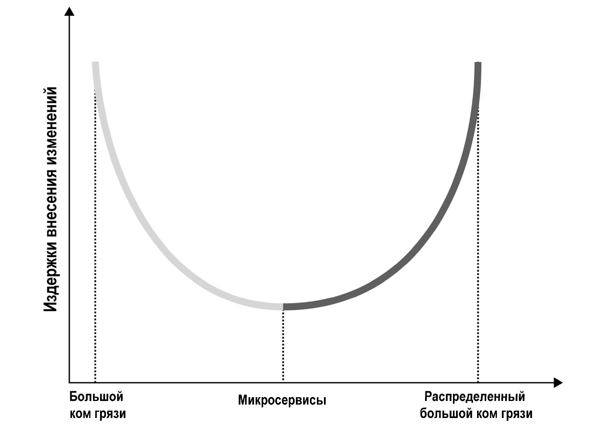{width="4.749251968503937in"
height="3.3786450131233594in"}

> Рис. 14.7. Уровень разбиения и издержки внесения изменений

Разобравшись с понятием микросервисов, давайте посмотрим, как предметно-
ориентированное проектирование способно помочь определению границ
«глубо- ких» сервисов.

> 248 \| *Часть IV. Взаимоотношения с другими методологиями и
> паттернами*

### Предметно-ориентированное проектирование и границы микросервисов

Применительно к микросервисам многие из паттернов
предметно-ориентирован- ного проектирования, рассмотренные в предыдущих
главах, связаны с границами: ограниченный контекст (bounded context)
является границей модели, поддомен ограничивает бизнес-компетенции
(capabilities), а агрегаты (aggregate) и объекты- значения (value
object) определяют границы транзакций. Давайте выясним, какие из этих
границ соответствуют понятию микросервисов.

#### Ограниченные контексты {#ограниченные-контексты-3}

У микросервисов и паттерна ограниченного контекста столько общего, что
они зачастую используются вместо друг друга. Давайте выясним, так ли это
на самом деле: соотносятся ли границы ограниченных контекстов с
границами микросер- висов?

И микросервисы, и ограниченные контексты определяются физическими
граница- ми. Микросервисы как ограниченные контексты разрабатываются
одной командой. Как и в ограниченных контекстах, конфликтующие модели не
могут быть реализо- ваны в микросервисе, что приводит к усложнению
интерфейсов. Микросервисы, конечно же, являются ограниченными
контекстами. Но работает ли эта связь на- оборот? Можно ли сказать, что
ограниченные контексты --- это микросервисы?

Из *главы 3* известно, что ограниченные контексты защищают
согласованность еди- ных языков и моделей. В одном и том же ограниченном
контексте нельзя реализо- вать никакие конфликтующие модели. Допустим,
что ведется работа над системой управления рекламой. Сущность Lead
(Потенциальный клиент) в контекстах Promotions (Рекламные акции) и Sales
(Продажи) представлена различными моде- лями. Следовательно, Promotions
и Sales являются ограниченными контекстами, каждый из которых определяет
одну и только одну модель сущности Lead, которая, как показано на рис.
14.8, действительна в своих границах.

Не станем усложнять ситуацию и предположим, что в системе нет других
конфлик- тующих моделей, кроме Lead. Вполне естественно, что при этом
получаются

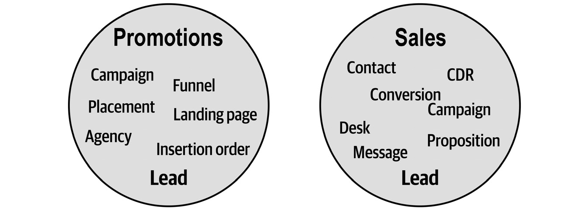{width="4.560049212598425in"
height="1.6066666666666667in"}

> Рис. 14.8. Ограниченные контексты
>
> *Глава 14. Микросервисы* \| 249

весьма обширные ограниченные контексты --- каждый из них может содержать
сразу несколько поддоменов. Поддомены можно перемещать из одного
ограничен- ного контекста в другой. Пока модели в поддоменах не
конфликтуют, все альтерна- тивные варианты декомпозиции (разбиения),
показанные на рис. 14.9, являются вполне допустимыми ограниченными
контекстами.

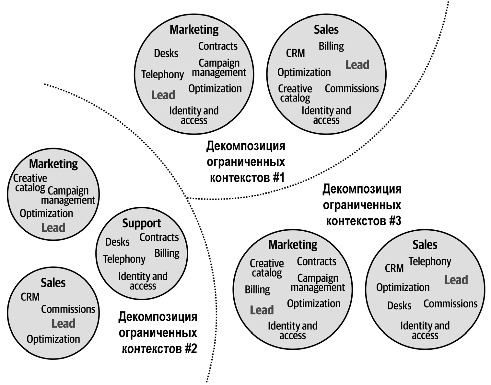{width="5.095644138232721in"
height="3.966666666666667in"}

> Рис. 14.9. Альтернативные декомпозиции ограниченных контекстов

Разные декомпозиции для ограниченных контекстов мотивируются разными
требо- ваниями, например разным количественным составом и структурами
команд разра- ботчиков, зависимостями жизненного цикла и т. д. Но можно
ли сказать, что все допустимые ограниченные контексты в этом примере
обязательно являются микро- сервисами? Конечно, нет. Особенно если
учесть относительно широкие функ- циональные возможности двух
ограниченных контекстов в декомпозиции под номером 1.

Таким образом, отношения между микросервисами и ограниченными
контекстами не являются симметричными. И хотя микросервисы являются
ограниченными кон- текстами, не каждый ограниченный контекст является
микросервисом. Зато огра- ниченные контексты обозначают границы самого
большого допустимого монолита. Такой монолит не следует путать с большим
комом грязи (big ball of mud), по- скольку он является жизнеспособным
вариантом проекта, защищающим согласо- ванность его единого языка
(ubiquitous language) или модели его предметной облас-

> 250 \| *Часть IV. Взаимоотношения с другими методологиями и
> паттернами*

ти. В *главе 15* будет показано, что в некоторых случаях проекты с
такими широки- ми границами оказываются эффективнее применения
микросервисов.

На рис. 14.10 наглядно продемонстрирована взаимосвязь ограниченных
контекстов и микросервисов. Безопасной считается область между
ограниченными контекста- ми и микросервисами. В ней находятся допустимые
варианты конструкции. Но если система не разбита на надлежащие
ограниченные контексты или разбита за порогом микросервисов, то
получится соответственно либо большой ком грязи, либо он же, но в
распределенном виде.

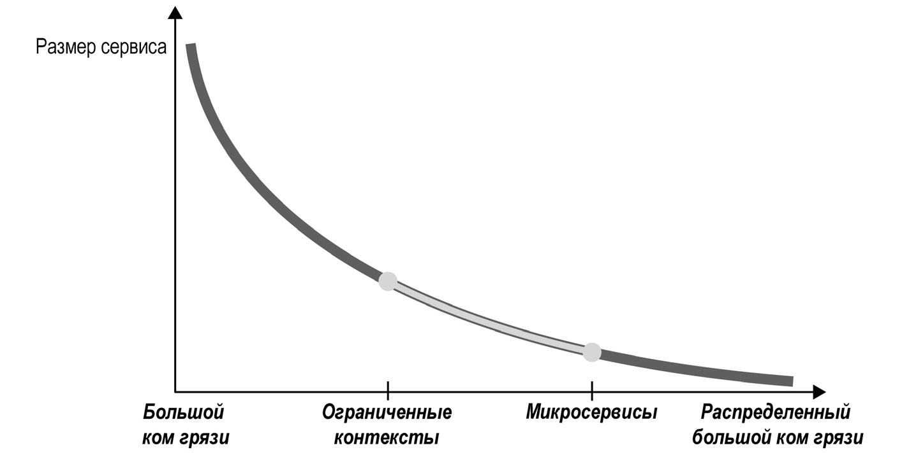{width="4.7720067804024495in"
height="2.3933333333333335in"}

> Рис. 14.10. Уровень разбиения и модульность

Теперь давайте рассмотрим другую крайность: могут ли агрегаты помочь
опреде- лить границы микросервисов.

###### Агрегаты {#агрегаты-1}

В отличие от ограниченных контекстов, устанавливающих наиболее широкие
воз- можные границы, паттерн «Агрегат» делает совершенно обратное.
Граница агрега- та --- самая узкая из всех возможных границ. Разбивать
агрегат на несколько физи- ческих сервисов или ограниченных контекстов
не только нерационально, но, как станет известно из *приложения 1*,
приводит, мягко говоря, к нежелательным по- следствиям.

Как и ограниченные контексты, границы агрегатов также часто
рассматриваются в качестве определяющих границ микросервисов. Агрегат
является неделимой еди- ницей бизнес-функции, инкапсулирующей все
сложности своих внутренних биз- нес-правил, инвариантов и бизнес-логики.
При этом, как уже упоминалось в данной главе, микросервисы --- это не
про отдельно взятые сервисы. Отдельный сервис следует рассматривать в
контексте его взаимодействия с другими компонентами системы:

- Осуществляет ли рассматриваемый агрегат обмен данными с другими
  агрегата- ми в своем поддомене?

> *Глава 14. Микросервисы* \| 251

- Использует ли он объекты-значения совместно с другими агрегатами?

- Насколько высока вероятность, что изменения бизнес-логики агрегата
  повлияют на другие компоненты поддомена и наоборот?

Чем сильнее связь агрегата с другими сущностями его поддомена, тем в
меньшей степени он будет считаться отдельным сервисом.

В отдельных случаях использование агрегата в качестве сервиса приводит к
мо- дульному дизайну. Но гораздо чаще такие сильно гранулярные сервисы
только увеличивают глобальную сложность всей системы.

#### Поддомены {#поддомены-1}

Более сбалансированный эвристический подход к разработке микросервисов
за- ключается в подстраивании сервисов под границы поддоменов. В *главе
1* уже гово- рилось, что поддомены увязываются с конкретными
бизнес-компетенциями (capabilities). То есть они представляют собой
структурные элементы бизнеса, не- обходимые для того, чтобы компания
могла конкурировать в своей области (или областях) бизнеса. С позиции
предметной области поддомены конкретизируют бизнес-компетенции
(capabilities) --- т. е. то, чем этот бизнес занимается, --- без
объяснения того, как эти бизнес-компетенции реализуются. С технической
точки зрения поддомены представляют собой наборы согласованных сценариев
исполь- зования: использование одной и той же модели предметной области,
работа с од- ними и теми же или тесно связанными данными и тесная
функциональная взаимо- связь. Как показано на рис. 14.11, изменение
бизнес-требований одного из сценари- ев использования, скорее всего,
повлияет и на другие сценарии использования.

Конкретизация поддоменов и акцент на функциональности --- т. е. ответ на
вопрос

«Что?», а не «Как?» --- делают поддомены естественными глубокими
модулями

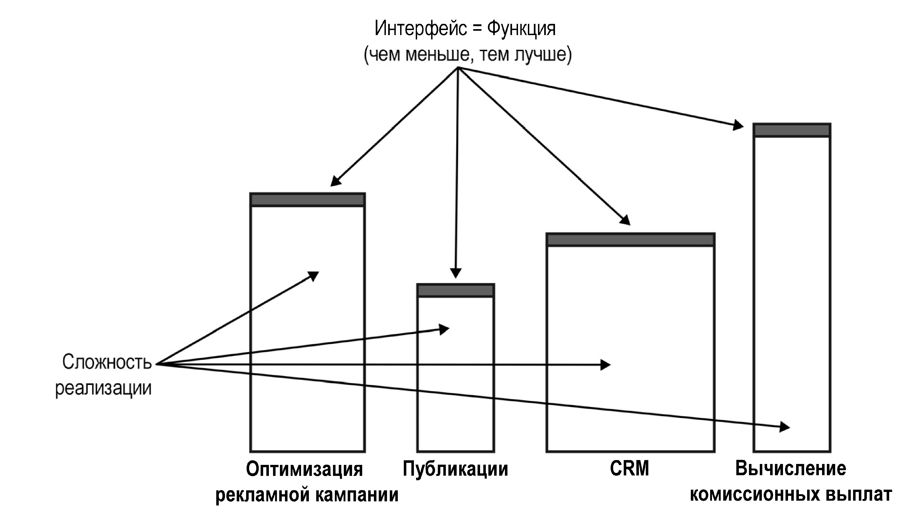{width="4.939758311461067in"
height="2.76875in"}

> Рис. 14.11. Поддомены
>
> 252 \| *Часть IV. Взаимоотношения с другими методологиями и
> паттернами*

(deep module). Описание поддомена --- функция --- заключает в себе более
сложные детали реализации --- логику. Согласованный характер сценариев
использования, имеющихся в поддомене, также обеспечивает глубину
итогового модуля. Разбие- ние их на части во многих случаях привело бы к
более сложному публичному ин- терфейсу и, следовательно, к более мелким
модулям. Все это делает поддомены безопасной границей для разработки
микросервисов.

Увязывание микросервисов с поддоменами --- безопасный эвристический
подход, позволяющий найти оптимальные решения для большинства
микросервисов. При этом порой более эффективными будут другие границы,
например пребывание в более широких лингвистических границах
ограниченного контекста или же из-за специфических нефункциональных
требований. Решение зависит не только от предметной области, но и от
структуры организации, бизнес-стратегии и нефунк- циональных требований.
Как уже упоминалось в *главе 11*, крайне важно постоянно адаптировать
архитектуру и дизайн программного продукта к изменениям, проис- ходящим
в среде его применения.

### Сокращение

> публичных интерфейсов микросервисов

В дополнение к установлению границ сервисов предметно-ориентированное
проек- тирование может посодействовать росту «глубины» сервисов. В этом
разделе будет показано, как паттерн «Сервис» с открытым протоколом
(open-host service) и пре- дохранительный слой (anticorruption layer)
могут упростить публичные интерфейсы микросервисов.

#### Сервис с открытым протоколом

Сервис с открытым протоколом (open-host service) отделяет модель
ограниченного контекста предметной области от модели, используемой для
интеграции с другими компонентами системы (рис. 14.12).

Внедрение модели, ориентированной на интеграцию, т. е. внедрение
общедоступ- ного языка (published language), снижает глобальную
сложность системы.

Во-первых, это позволяет осуществлять дальнейшее развитие сервиса, не
затраги- вая при этом его потребителей: новую модель реализации можно
перевести на уже существующий опубликованный язык (published language).

Во-вторых, опубликованный язык выставляет на всеобщее обозрение куда
более ограниченную модель. Он разработан с учетом потребностей
интеграции и инкап- сулирует все сложности реализации, не имеющие
отношения к потребителям сер- виса. К примеру, опубликованный язык может
предоставлять меньший объем дан- ных и в более удобной для потребителей
модели.

Наличие более простого публичного интерфейса (функции) в качестве
надстройки над той же самой реализацией (логикой) делает сервис «глубже»
и способствует созданию более эффективной конструкции микросервиса.

> 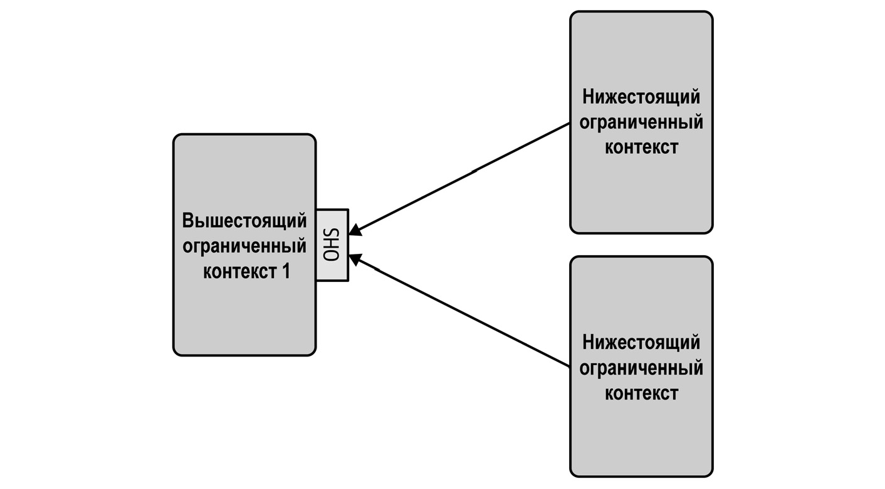{width="4.742339238845144in"
> height="2.6066666666666665in"}*Глава 14. Микросервисы* \| 253
>
> Рис. 14.12. Интеграция сервисов посредством опубликованного языка

#### Предохранительный слой (anticorruption layer, ACL)

Предохранительный слой (anticorruption layer, ACL) работает с точностью
до на- оборот, что позволяет снизить сложность интеграции сервиса с
другими ограни- ченными контекстами. Традиционно предохранительный слой
относится к защи- щаемому им ограниченному контексту. Но, как уже
говорилось в *главе 9*, это пред- ставление можно сдвинуть еще дальше и
реализовать в виде отдельного сервиса.

ACL-сервис, показанный на рис. 14.13, снижает как локальную сложность
ограни- ченного контекста-потребителя, так и глобальную сложность
системы. Cложность ограниченного контекста-потребителя отделена от
сложности интеграции, которая помещается в ACL-сервис. Поскольку
ограниченный контекст-потребитель сервиса работает с более удобной,
ориентированной на интеграцию моделью, его открытый интерфейс сужается
--- он не отражает той сложности интеграции, которая предос- тавляется
сервисом-поставщиком (producer).

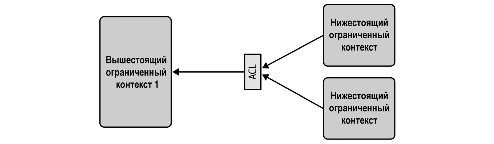{width="5.4667760279965005in"
height="1.59in"}

> Рис. 14.13. Предохранительный слой в виде самостоятельного сервиса
>
> [[]{#упражнения-13 .anchor}]{#вывод-12 .anchor}254 \| *Часть IV.
> Взаимоотношения с другими методологиями и паттернами*

### Вывод {#вывод-13}

Исторически сложилось так, что архитектурный стиль, основанный на
микросерви- сах, настолько тесно переплетается с
предметно-ориентированным проектировани- ем, что такие понятия, как
«микросервис» и «ограниченный контекст» часто ис- пользуются вместо друг
друга. В этой главе была проанализирована связь между ними и показано,
что это не одно и то же.

Все микросервисы являются ограниченными контекстами, но не все
ограниченные контексты в обязательном порядке являются микросервисами.
По сути, микросер- вис определяет наименьшую допустимую границу сервиса,
а ограниченный кон- текст защищает согласованность охватываемой им
модели и представляет самые широкие допустимые границы. Определение
границ шире их ограниченных кон- текстов приведет к появлению большого
кома грязи, а если границы будут охваты- вать пространство меньше
микросервисов, то возникнет распределенный большой ком грязи.

И все же между микросервисами и предметно-ориентированным
проектированием существует довольно-таки тесная связь. Здесь было
показано, как инструменты предметно-ориентированного проектирования
можно использовать для разработки эффективных границ микросервисов.

В *главе 15* будет продолжено рассмотрение системной архитектуры
высокого уров- ня, но уже с другой позиции: асинхронной интеграции
посредством событийно- ориентированной архитектуры. Будет показан
порядок использования различных видов событий, позволяющий проводить
дальнейшую оптимизацию границ микро- сервисов.

### Упражнения {#упражнения-14}

1.  Как ограниченные контексты связаны с микросервисами?

> А) Все микросервисы являются ограниченными контекстами. Б) Все
> ограниченные контексты являются микросервисами.
>
> В) Микросервисы и ограниченные контексты --- это разные понятия для
> обозна- чения одной и той же концепции.
>
> Г) Микросервисы и ограниченные контексты --- это совершенно разные
> поня- тия, и их нельзя сравнивать.

2.  Что в микросервисах должно подпадать под понятие «микро»?

> А) Количество пицц, способное накормить команду, внедряющую
> микросерви- сы. Этот показатель должен учитывать различные диетические
> предпочтения специалистов команды и среднесуточное потребление
> калорий.
>
> Б) Количество строк кода, необходимых для реализации функциональности
> сер- виса. Поскольку показатель не зависит от ширины строк,
> предпочтительнее реа- лизовывать микросервисы на сверхшироких
> мониторах.
>
> *Глава 14. Микросервисы* \| 255
>
> В) Наиболее важным аспектом проектирования систем на основе
> микросервисов является получение адаптированных к микросервисам
> связующих программных средств и других инфраструктурных компонентов,
> желательно от поставщиков с соответствующими сертификатами,
> позволяющими использовать микросер- висы.
>
> Г) Знание предметной области и ее тонкостей раскрывается за пределами
> серви- са и отражается в его открытом интерфейсе.

3.  Что собой представляют безопасные (safe) границы компонентов? А)
    Границы шире ограниченных контекстов.

> Б) Границы у´же, чем границы микросервисов.
>
> В) Границы между ограниченными контекстами (самые широкие) и микросер-
> висами (самые узкие).
>
> Г) Безопасны (safe) все границы.

4.  Можно ли считать удачным решением увязку микросервисов с границами
    агре- гатов?

> А) Да, агрегаты всегда подходят для полноценных микросервисов.
>
> Б) Нет, агрегаты никогда не должны предоставляться в качестве отдельно
> взя- тых микросервисов.
>
> В) Сделать микросервис из одного агрегата невозможно. Г) Решение
> зависит от предметной области.

ГЛАВА 15

## Событийно-ориентированная

архитектура

Наряду с микросервисами в современных распределенных системах нашла
широ- кое распространение и событийно-ориентированная архитектура
(event-driven architecture, EDA). Довольно часто попадаются советы
использовать событийно- ориентированный обмен данными в качестве
исходного механизма интеграции при разработке слабосвязанных,
масштабируемых и отказоустойчивых распределенных систем.

Событийно-ориентированная архитектура часто связана с
предметно-ориентиро- ванным проектированием. Ведь EDA основана на
событиях, которые занимают видное место и в предметно-ориентированном
проектировании (DDD), где имеются события предметной области, и в случае
необходимости они даже используются в качестве источника данных в
системе. Может возникнуть соблазн воспользовать- ся DDD-событиями в
качестве основы для использования событийно-ориенти- рованной
архитектуры. Но стоит ли это делать?

События --- это не какая-то секретная приправа, которую можно просто
добавить в прежнюю систему и сделать ее слабо связанной и
распределенной. Как раз-таки наоборот: опрометчивое применение EDA может
превратить модульный монолит в распределенный большой ком грязи.

В этой главе будет исследовано взаимодействие EDA и DDD. Вы изучите
основные строительные блоки событийно-ориентированной архитектуры, самые
распростра- ненные причины неудач проектов на EDA и возможности
использования DDD- инструментов для разработки эффективных асинхронно
интегрированных систем.

### Событийно-ориентированная архитектура

В простом изложении событийно-ориентированная архитектура представляет
со- бой архитектурный стиль, в котором компоненты системы
взаимодействуют друг с другом асинхронно, обмениваясь сообщениями о
событиях (см. рис. 15.1). Вместо синхронного вызова эндпоинтов
(endpoints) сервисов компоненты публикуют со- бытия, чтобы уведомлять
другие элементы системы об изменениях в предметной области системы.
Компоненты могут подписываться на события, возникающие в системе, и
соответствующим образом на них реагировать. Типичным примером потока
выполнения, управляемого событиями, является паттерн саги (saga
pattern), рассмотренный в *главе 9*.

Важно подчеркнуть разницу между событийно-ориентированной архитектурой и
паттерном «События как источник данных» (event sourcing). Как уже
говорилось

> 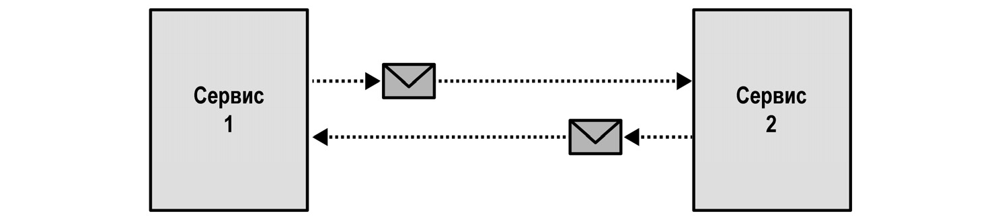{width="5.009324146981627in"
> height="1.0733322397200349in"}*Глава 15. Событийно-ориентированная
> архитектура* \| 257
>
> Рис. 15.1. Асинхронный обмен данными

в *главе 7*, «События как источник данных» --- это метод регистрации
изменений состояния в виде серии событий.

Хотя и событийно-ориентированная архитектура, и «События как источник
дан- ных» основаны на событиях, эти два паттерна концептуально
различаются. EDA относится к взаимодействию сервисов, а «События как
источник данных» происхо- дит внутри сервиса. События, разработанные при
применении паттерна «События как источник данных», представляют переходы
состояний (агрегатов в модели предметной области, основанной на
событиях), реализованные в сервисе. Эти со- бытия нацелены на фиксацию
нюансов бизнес-области и не предназначены для ин- теграции сервиса с
другими компонентами системы.

Далее в главе будет показано, что существуют три типа событий, из
которых одни подходят для интеграции больше других.

### События

В EDA-системе обмен событиями является ключевым механизмом обмена данны-
ми с целью интеграции компонентов и превращения их в систему. Давайте
взгля- нем на события попристальнее и посмотрим, чем они отличаются от
сообщений.

#### События, команды и сообщения

Исходя из ранее изложенного, событие практически ничем не отличается от
опре-

1

деления паттерна сообщения (message) . И все же они разные. Событие ---
это

сообщение, но сообщение --- не обязательно событие. Существуют два типа
сооб- щений:

> *Событие*
>
> Сообщение, описывающее уже произошедшее изменение.
>
> *Команда*
>
> Сообщение, описывающее операцию, которую необходимо выполнить.

Событие --- это то, что уже произошло, тогда как команда --- это
инструкция, пред- писывающая некое действие. И события, и команды могут
передаваться асинхрон-

> ^1^ Hohpe, G., & Woolf, B. Enterprise Integration Patterns: Designing,
> Building, and Deploying Messaging Solutions. Boston: Addison-Wesley,
> 2003.
>
> 258 \| *Часть IV. Взаимоотношения с другими методологиями и
> паттернами*

но в виде сообщений. Но команда может быть отклонена: получатель команды
мо- жет отказаться от ее выполнения, например если команда
недействительна или противоречит бизнес-правилам системы. А событие его
получатель отменить не может. В нем описывается то, что уже произошло.
Единственное, что можно сделать, чтобы отменить событие, --- это
выполнить компенсирующее действие --- команду, наподобие того, как это
делается в паттерне саги.

> Поскольку событие описывает что-то, что уже произошло, название
> события долж- но быть сформулировано в прошедшем времени: например,
> DeliveryScheduled (дос- тавка запланирована), ShipmentCompleted
> (отгрузка завершена) или DeliveryConfirmed (доставка подтверждена).

#### Структура

Событие --- это структура данных, которую можно сериализовать и передать
с по- мощью выбранной платформы обмена сообщениями. Типичная схема
события включает метаданные события и его полезную нагрузку (payload)
--- информацию, передаваемую событием:

> {
>
> \"type\": \"delivery-confirmed\",
>
> \"event-id\": \"14101928-4d79-4da6-9486-dbc4837bc612\",
> \"correlation-id\": \"08011958-6066-4815-8dbe-dee6d9e5ebac\",
> \"delivery-id\": \"05011927-a328-4860-a106-737b2929db4e\",
> \"timestamp\": 1615718833,
>
> \"payload\": {
>
> \"confirmed-by\": \"17bc9223-bdd6-4382-954d-f1410fd286bd\",
> \"delivery-time\": 1615701406
>
> }
>
> }

Полезная нагрузка не только описывает информацию, передаваемую событием,
но и определяет тип события. Давайте более подробно рассмотрим три типа
событий, и разберемся, чем они отличаются друг от друга.

#### Типы событий

> 2

События можно отнести к одному из трех типов : уведомление, передача
состояния

с помощью события или события предметной области.

###### Уведомление

Уведомление (event notification) --- это сообщение об изменении в
предметной об- ласти, на которое будут реагировать другие компоненты. К
ним среди прочего

> ^2^ Fowler, M. (n.d.). «What do you mean by "Event-Driven"?». Фрагмент
> из записи в блоге Мартина Фаулера (Martin Fowler) от 12 августа 2021
> года.
>
> *Глава 15. Событийно-ориентированная архитектура* \| 259
>
> можно отнести PaycheckGenerated (расчетный чек создан) и
> CampaignPublished (реклама опубликована).

Уведомление не должно быть излишне подробным: цель --- уведомить
заинтересо- ванные стороны о событии, но уведомление не должно содержать
всю информа- цию, необходимую подписчикам для проявления реакции на
событие. Например:

> {
>
> \"type\": \"paycheck-generated\",
>
> \"event-id\": \"537ec7c2-d1a1-2005-8654-96aee1116b72\",
> \"delivery-id\": \"05011927-a328-4860-a106-737b2929db4e\",
> \"timestamp\": 1615726445,
>
> \"payload\": {
>
> \"employee-id\": \"456123\",
>
> \"link\": \"/paychecks/456123/2021/01\"
>
> }
>
> }

В предыдущем коде событие уведомляет внешние компоненты о созданном
чеке. В нем не содержится информация, связанная с чеком. Для получения
дополнитель- ной информации получатель может воспользоваться ссылкой.
Именно такой поток уведомлений изображен на рис. 15.2.

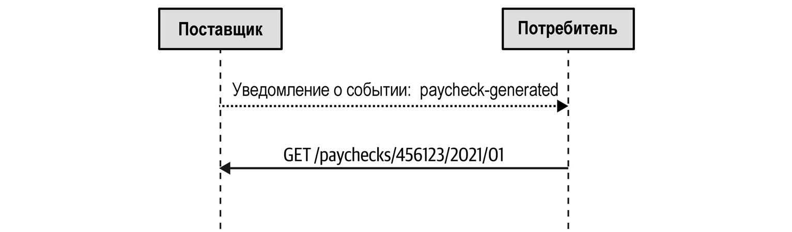{width="5.146909448818898in"
height="1.5066666666666666in"}

> Рис. 15.2. Поток уведомлений о событиях

В определенном смысле интеграция посредством сообщений с уведомлениями
ана- логична системе Wireless Emergency Alert (WEA) в США и EU-Alert в
Европе (рис. 15.3). Системы используют вышки сотовой связи для передачи
коротких со- общений, уведомляющих граждан о проблемах в общественном
здравоохранении, угрозах безопасности и других чрезвычайных ситуациях.
Системы ограничены от- правкой сообщений с максимальной длиной 360
знаков. Этого короткого сообще- ния достаточно, чтобы уведомить вас о
чрезвычайной ситуации, но для получения более подробной информации нужно
самостоятельно воспользоваться другими источниками информации.

Краткие уведомления могут быть предпочтительнее в целом ряде сценариев.
Да- вайте более подробно рассмотрим два из них: безопасность и
конкурентность.

Безопасность. Принуждение получателя к явному запросу подробной
информации препятствует обмену конфиденциальной информацией через
инфраструктуру об-

> 260 \| *Часть IV. Взаимоотношения с другими методологиями и
> паттернами*

мена сообщениями и требует дополнительной авторизации подписчиков для
досту- па к данным.

Конкурентность. В силу асинхронной природы событийно-ориентированной
инте- грации информация, дошедшая до подписчиков, может уже оказаться
устаревшей. Во избежание состояния гонки, если характер информации
чувствителен к нему, актуальное состояние можно получить, сделав явный
запрос.

> Рис. 15.3. Система аварийного оповещения

Кроме того, в случае конкурирующих потребителей, когда событие должно
обраба- тываться только одним подписчиком, процесс запроса может быть
интегрирован с пессимистической блокировкой. Тем самым сторона
поставщика получит гаран- тию, что обработать сообщение не сможет
никакой другой потребитель.

###### Передача состояния с помощью события

Сообщения передачи состояния с помощью события (Event-carried state
transfer, ECST) уведомляют подписчиков об изменениях во внутреннем
состоянии постав- щика. В отличие от сообщений с уведомлением о событии,
ECST-сообщения вклю- чают все данные, отражающие изменение состояния.

ECST-сообщения могут поступать в двух формах. Первая форма содержит
полный срез состояния (snapshot) измененного объекта:

> {
>
> \"type\": \"customer-updated\",
>
> \"event-id\": \"6b7ce6c6-8587-4e4f-924a-cec028000ce6\",
> \"customer-id\": \"01b18d56-b79a-4873-ac99-3d9f767dbe61\",
> \"timestamp\": 1615728520,
>
> \"payload\": {
>
> \"first-name\": \"Carolyn\",
>
> \"last-name\": \"Hayes\",
>
> \"phone\": \"555-1022\",
>
> \"status\": \"follow-up-set\", \"follow-up-date\": \"2021/05/08\",
> \"birthday\": \"1982/04/05\", \"version\": 7
>
> }
>
> }
>
> *Глава 15. Событийно-ориентированная архитектура* \| 261

ECST-сообщение, показанное в предыдущем примере, включает в себя полный
снимок обновленного состояния клиента. При работе с большими структурами
данных может оказаться целесообразным включать в ECST-сообщение только
по- ля, подвергшиеся фактическим изменениям:

> {
>
> \"type\": \"customer-updated\",
>
> \"event-id\": \"6b7ce6c6-8587-4e4f-924a-cec028000ce6\",
> \"customer-id\": \"01b18d56-b79a-4873-ac99-3d9f767dbe61\",
> \"timestamp\": 1615728520,
>
> \"payload\": {
>
> \"status\": \"follow-up-set\", \"follow-up-date\": \"2021/05/10\",
> \"version\": 8
>
> }
>
> }

Чтобы ни было в ECST-сообщениях, полные срезы состояния или же только
обнов- ленные поля, поток таких событий позволяет потребителям хранить
локальный кеш состояний объектов и работать с ним. Концептуально
использование сообщений с передачей состояний с помощью события
представляет собой механизм асин- хронной репликации данных. Такой
подход повышает отказоустойчивость систе- мы, а это означает, что
потребители получают возможность продолжать работу, даже если поставщик
недоступен. Он также дает возможность повысить произво- дительность
компонентов, нацеленных на обработку данных из нескольких источ- ников.
Вместо запросов, посылаемых каждый раз в источники востребованных
данных, все эти данные, как показано на рис. 15.4, можно кешировать
локально.

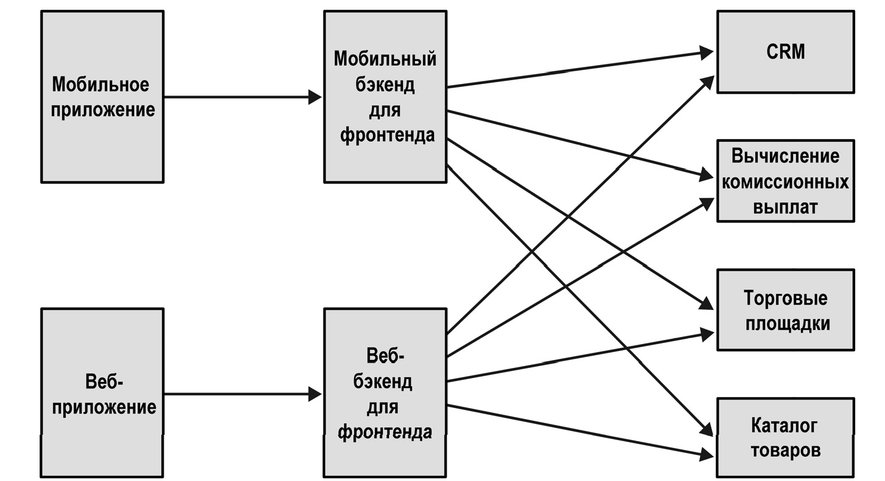{width="4.878615485564304in"
height="2.6366666666666667in"}

> Рис. 15.4. Бэкенд (backend) для фронтенда (frontend)
>
> 262 \| *Часть IV. Взаимоотношения с другими методологиями и
> паттернами*

###### События предметной области (domain event)

Третий тип сообщений о событиях относится к событиям предметной области,
рас- смотренным в *главе 6*. В определенном смысле события предметной
области одно- временно похожи как на уведомления, так и на
ECST-сообщения: в них не только дается описание важного события в
бизнес-области, но и содержатся все характе- ризующие это событие
данные. Несмотря на сходство, концепция у всех этих типов сообщений
разная.

###### Сравнение событий предметной области и уведомлений

В событиях предметной области, как и в уведомлениях, дается описание
измене- ния, произошедшего в бизнес-области поставщика события. И все же
здесь есть два концептуальных различия.

Во-первых, события предметной области включают всю информацию, описываю-
щую событие. Чтобы получить полную картину, потребителю не нужно
предпри- нимать никаких дополнительных действий.

Во-вторых, при моделировании в них вкладывается разный смысл.
Уведомления разработаны с целью упростить интеграцию с другими
компонентами. А события предметной области предназначены для
моделирования и описания предметной области. События предметной области
могут оказаться полезными, даже если в них не заинтересован ни один
внешний потребитель. Это особенно актуально для сис- тем с событиями как
источником данных (Event Sourcing), где события предметной области
используются для моделирования всех возможных переходов состояний.
Наличие внешних потребителей, заинтересованных во всех доступных
событиях предметной области, приведет к неоптимальному дизайну ПО. Более
подробно эта ситуация будет рассмотрена в данной главе чуть позже.

###### Сравнение событий предметной области с ECST-сообщениями

Данные, содержащиеся в событиях предметной области, концептуально
отличают- ся от схемы типичного ECST-сообщения.

ECST-сообщение предоставляет достаточную информацию для хранения
локально- го кеша данных поставщика этого сообщения. Ни одно отдельно
взятое событие предметной области не должно выставлять на всеобщее
обозрение такую содержа- тельную модель. Так, данных, включенных в
конкретное событие предметной об- ласти, недостаточно для кеширования
состояния агрегата, к тому же на те же самые поля могут повлиять другие
события предметной области, на которые не подписан потребитель.

Кроме того, как и в случае уведомлений о событиях, в эти два типа
сообщений вкладывается совершенно разных смысл. Данные, включенные в
события предмет- ной области, не предназначены для описания состояния
агрегата. В них описывает- ся бизнес-событие, произошедшее в течение его
жизненного цикла.

> *Глава 15. Событийно-ориентированная архитектура* \| 263

###### Типы событий: Пример

Возьмем пример, демонстрирующий различия между тремя типами событий.
Рас- смотрим следующие три способа представления события вступления в
брак:

> eventNotification = {
>
> \"type\": \"marriage-recorded\", \"person-id\": \"01b9a761\",
> \"payload\": {
>
> \"person-id\": \"126a7b61\",
>
> \"details\": \"/01b9a761/marriage-data\"

}

};

> ecst = {
>
> \"type\": \"personal-details-changed\", \"person-id\": \"01b9a761\",
>
> \"payload\": {
>
> \"new-last-name\": \"Williams\"

}

};

> domainEvent = { \"type\": \"married\",
>
> \"person-id\": \"01b9a761\", \"payload\": {
>
> \"person-id\": \"126a7b61\",
>
> \"assumed-partner-last-name\": true

}

};

marriage-recorded является уведомлением о событии. В нем не содержится
никакой информации, кроме факта, что человек с указанным идентификатором
вступил в брак. О самом событии здесь минимум информации, а потребитель,
интересую- щийся подробностями, должен будет проследовать по ссылке из
поля details.

personal-details-changed является сообщением передачи состояния с
помощью со- бытия. В нем описываются изменения в личных данных человека,
т. е. изменение его фамилии. В сообщении не объясняется причина, по
которой она изменилась. Непонятно, женился человек или развелся?

И наконец, married является событием предметной области. Оно
смоделировано в форме, максимально приближенной к естественному событию
в предметной об- ласти. В него включены идентификатор человека и флаг,
указывающий, принял ли человек фамилию своего партнера.

> 264 \| *Часть IV. Взаимоотношения с другими методологиями и
> паттернами*

### Проектирование

> событийно-ориентированной интеграции

Как уже говорилось в *главе 3*, проектирование программных продуктов в
основном связано с границами. Границы определяют, что будет внутри, а
что останется сна- ружи и, что более важно, что будет переходить через
границы, т. е. как именно будет происходить интеграция компонентов.
События в системе, основанной на EDA-архитектуре, являются
первостепенными элементами дизайна, влияющими не только на способ
интеграции компонентов, но и на сами границы этих компонен- тов. Выбор
правильного типа сообщения о событии формирует (развязывает) или
разрушает (связывает) распределенную систему.

В этом разделе будут рассмотрены эвристические подходы к применению
различ- ных типов событий. Но сначала давайте посмотрим, как можно
использовать собы- тия для проектирования сильно связанного
распределенного большого кома грязи (big ball of mud).

#### Распределенный большой ком грязи

Рассмотрим систему, показанную на рис. 15.5.

Ограниченный контекст (bounded context) CRM (системы управления
информацией о клиентах) реализован в виде модели предметной области,
основанной на событи- ях (event-sourced domain model). Когда CRM-систему
необходимо было интегриро-

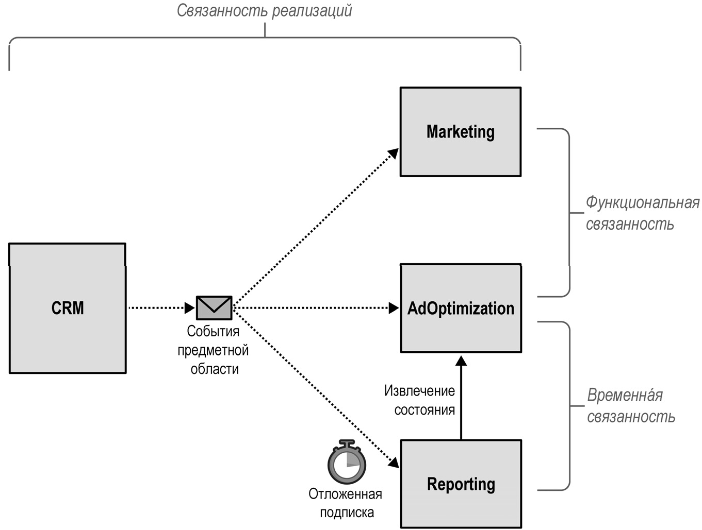{width="4.563301618547682in"
height="3.43in"}

> Рис. 15.5. Сильно связанная распределенная система
>
> *Глава 15. Событийно-ориентированная архитектура* \| 265

вать с ограниченным контекстом Marketing (изучение рынка), команды
решили воспользоваться гибкостью модели данных, основанных на событиях,
и позволить потребителю --- в данном случае Marketing --- подписаться на
события предметной области CRM, применив их для проецирования модели,
соответствующей его по- требностям.

После введения ограниченного контекста AdsOptimization (оптимизации
рекламы) он также должен был обрабатывать информацию, произведенную
ограниченным контекстом CRM. Команды решили позволить AdsOptimization
подписываться на все события предметной области, выдаваемые CRM, и
спроецировать модель, соот- ветствующую потребностям AdsOptimization.

Интересно, что ограниченные контексты Marketing и AdsOptimization должны
были представлять информацию о клиентах в одном и том же формате и,
следовательно, проецировали одну и ту же модель из событий предметной
области CRM: упро- щенный срез (snapshot) состояния каждого клиента.

Ограниченный контекст Reporting (создание отчетов) подписан только на
подмно- жество событий предметной области, публикуемых CRM и
используемых в качест- ве уведомлений о событиях для извлечения
результатов вычислений, выполненных в контексте AdsOptimization. Но,
поскольку оба ограниченных контекста AdsOpti- mization и Reporting
используют для запуска своих вычислений, обеспечивающих обновление
модели Reporting, одни и те же события, в контекст Reporting введена
задержка. Сообщения в нем обрабатываются через пять минут после их
получения.

Дизайн получился хуже некуда. Давайте проанализируем все виды
связанностей в этой системе.

#### Временнáя связанность (связанность по времени)

Связанность ограниченных контекстов AdsOptimization и Reporting носит
времен- нóй характер: она зависит от четкого порядка выполнения
программы. Компонент AdsOptimization должен завершить свою обработку
данных до запуска модуля Reporting. Если порядок выполнения программы
будет обратным, в отчетность по- падут противоречивые данные.

Чтобы обеспечить необходимый порядок выполнения, программисты ввели в
сис- тему Reporting задержку. Эта пятиминутная задержка позволяет
компоненту AdsOptimization завершить все необходимые вычисления. И все
же нетрудно заме- тить, что все это не гарантирует правильный порядок
выполнения:

- AdsOptimization может быть перегружен и не сможет завершить обработку
  за пять минут.

- Проблема с сетью может привести к задержке доставки входящих сообщений
  сервису AdsOptimization.

- Компонент AdsOptimization может выйти из строя и прекратить обработку
  вхо- дящих сообщений.

> 266 \| *Часть IV. Взаимоотношения с другими методологиями и
> паттернами*

#### Функциональная связанность

Ограниченные контексты Marketing и AdsOptimization подписывались на
события предметной области CRM, из-за чего в них была реализована одна и
та же проекция данных о клиентах. Иными словами, бизнес-логика,
преобразующая входящие со- бытия предметной области в представление на
основе состояния, дублировалась в обоих ограниченных контекстах, и у нее
были одни и те же причины для измене- ний: эти ограниченные контексты
должны были представлять данные клиентов в одном и том же формате.
Следовательно, если проекция была изменена в одном из компонентов,
изменение должно было повториться и во втором ограниченном контексте.

Здесь мы имеем дело с функциональной связанностью: несколько компонентов
реализуют одну и ту же бизнес-функциональность, и если она изменится, то
изме- нения должны быть одновременно произведены в обоих компонентах.

#### Связанность на уровне реализации

Это уже более сложный тип связанности. Ограниченные контексты Marketing
и AdsOptimization подписаны на все события предметной области,
выдаваемые моде- лью CRM, основанной на событиях. Следовательно,
изменения, вносимые в реали- зацию CRM, например добавление нового
события предметной области или изме- нение схемы существующего события,
должны отражаться в обоих подписанных ограниченных контекстах!
Невыполнение этого требования может привести к несо- гласованности
данных. Например, если схема события изменится, логика проеци- рования,
имеющаяся у подписчиков, не сработает. Если же в модель CRM добавля-
ется новое событие предметной области, оно потенциально может повлиять
на те модели, на которые оно проецируется, и, следовательно, его
игнорирование приве- дет к проецированию несогласованного состояния.

#### Реорганизация

> событийно-ориентированной интеграции

Как видите, непродуманное введение событий в систему не избавляет ее ни
от свя- занности, ни от отказов. Можно, конечно, посчитать этот пример
выдумкой, но, к сожалению, он основан на вполне реальной истории.
Давайте посмотрим, как можно изменить события, чтобы существенно
улучшить дизайн.

Предоставление на всеобщее обозрение всех событий предметной области,
состав- ляющих модель данных CRM, обусловливает связанность подписчиков
с деталями реализации поставщика событий. Связанность реализаций может
быть устранена путем предоставления либо гораздо более ограниченного
набора событий, либо совершенно другого типа событий.

Выступающие в роли подписчиков Marketing и AdsOptimization функционально
связаны друг с другом за счет реализации одних и тех же бизнес-функций.

И связанность реализаций, и функциональная связанность могут быть
устранены путем инкапсуляции логики проецирования в коде поставщика
событий, в ограни- ченных контекстах CRM. Вместо раскрытия подробностей
своей реализации CRM

> *Глава 15. Событийно-ориентированная архитектура* \| 267

может последовать паттерну контракта, ориентированного на потребителя:
спрое- цировать модель, необходимую потребителям, и сделать ее частью
опубликованно- го языка ограниченного контекста, превратив все в
интеграционную модель, не связанную с внутренней моделью реализации. В
результате потребители получат все необходимые им данные и ничего не
узнают о модели реализации CRM.

Чтобы устранить временнýю связанность контекстов AdsOptimization и
Reporting, компонент AdsOptimization может публиковать уведомления о
событиях, активизи- руя тем самым компонент Reporting для получения им
необходимых данных. Эта реорганизованная система показана на рис. 15.6.

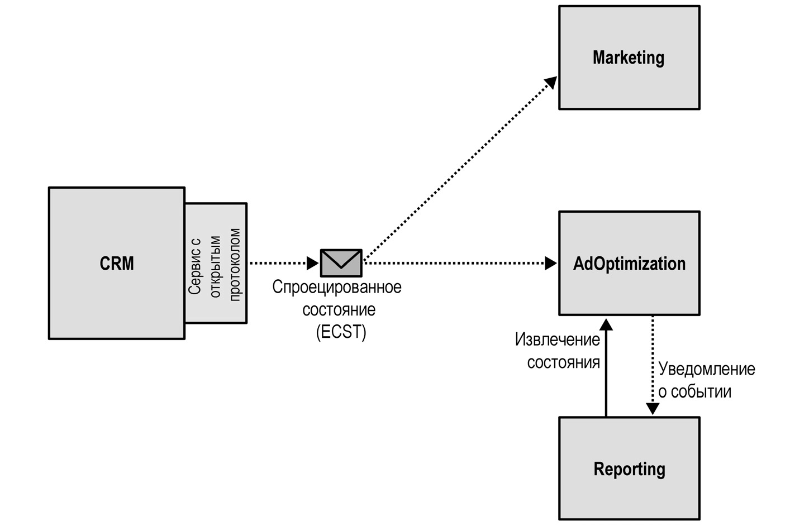{width="4.743207567804024in"
height="3.14in"}

> Рис. 15.6. Реорганизованная система

#### Творческий подход

> к событийно-ориентированному проектированию

Правильное сопоставление типов событий с поставленными задачами делает
полу- чаемый в результате этого проект на несколько порядков менее
связанным, более гибким и отказоустойчивым. Давайте сформулируем
эвристический подход к про- ектированию применительно к внесенным
изменениям.

###### Предполагайте худшее

3

Как сказал Эндрю Гроув (Andrew Grove), выживают только параноики .
Исполь-

зуйте это высказывание в качестве руководящего принципа при разработке
собы- тийно-ориентированных систем:

> ^3^ Grove, A. S. Only the Paranoid Survive. London: HarperCollins
> Business, 1998.
>
> 268 \| *Часть IV. Взаимоотношения с другими методологиями и
> паттернами*

- Сеть будет медленной.

- Серверы выйдут из строя в самый неподходящий момент.

- События будут поступать не по порядку.

- События будут дублироваться.

Самое главное, что все эти неприятности чаще всего будут случаться в
выходные и праздничные дни.

Слово «ориентированное» в выражении «событийно-ориентированная
архитекту- ра» означает, что вся ваша система зависит от успешной
доставки сообщений. Сле- довательно, не смейте даже и думать, что «все
обязательно будет хорошо». Сделай- те так, чтобы события, несмотря ни на
что, всегда доставлялись своим че- редом:

- Для надежной публикации сообщений воспользуйтесь паттерном «Ящик исхо-
  дящих сообщений» (outbox pattern).

- При публикации сообщений убедитесь, что подписчики смогут избавиться
  от дубликатов сообщений, а также выявить и переупорядочить
  неупорядоченные сообщения.

- При оркестровке трансграничных контекстных процессов, требующих
  выполне- ния компенсирующих действий, воспользуйтесь сагой и
  диспетчером процессов.

###### Используйте публичный интерфейс и приватные события

Остерегайтесь раскрытия подробностей реализации при публикации событий
предметной области, особенно в агрегатах, основанных на событиях.
Рассматри- вайте события в качестве неотъемлемой части публичного
интерфейса ограничен- ного контекста. Поэтому при реализации паттерна
сервиса с открытым протоколом (open-host service) убедитесь, что события
отражены в опубликованном языке (published language) ограниченного
контекста. Паттерны преобразования моделей, основанных на событиях,
рассмотрены в *главе 9*.

При проектировании публичных интерфейсов ограниченных контекстов исполь-
зуйте различные типы событий. Сообщения передачи состояния с помощью
собы- тия позволяют привести модель реализации к более компактной форме,
которая передает потребителям только востребованную ими информацию.

Для еще большей минимизации открытого интерфейса можно воспользоваться
уве- домлениями о событиях.

И наконец, для связи с внешними ограниченными контекстами событиями
пред- метной области нужно пользоваться как можно реже. Нужно изыскивать
возмож- ности разработки специализированного набора таких событий.

###### Оценивайте требования к согласованности

При проектировании событийно-ориентированного обмена данными в качестве
еще одной составляющей эвристического подхода к выбору типа сообщений
следу- ет оценивать требования к согласованности ограниченных
контекстов:

> *Глава 15. Событийно-ориентированная архитектура* \| 269

- Если компоненты могут довольствоваться данными, согласованными по
  прин- ципу согласованности в конечном счете (eventual consistency),
  используйте со- общения передачи состояния с помощью события
  (ECST-сообщения).

- Если потребителю необходимо прочитать последние изменения в состоянии
  по- ставщика сообщения, выдайте сообщение с уведомлением о событии с
  возмож- ностью отправки последующего запроса на получение актуального
  состояния поставщика.

### Вывод {#вывод-12}

В этой главе в качестве неотъемлемого аспекта проектирования публичного
интер- фейса ограниченного контекста была представлена
событийно-ориентированная архитектура. Были рассмотрены три типа
событий, которыми можно воспользо- ваться для обмена данными между
ограниченными контекстами:

> *Уведомление*
>
> Уведомление о том, что произошло что-то важное, но требующее от
> потребите- ля явного запроса дополнительной информации у поставщика
> уведомления.
>
> *Передача состояния с помощью события*
>
> Механизм репликации данных на основе сообщений. Каждое событие
> содержит срез состояния, которым можно воспользоваться для поддержания
> локального кеша данных поставщика.
>
> *Событие предметной области*
>
> Сообщение с описанием события в предметной области поставщика.

Использование неподходящих типов событий приведет к разрушению системы
на основе EDA-архитектуры, невольно превратив ее в большой ком грязи.
Чтобы выбрать для интеграции правильный тип событий, нужно оценить
требования со- гласованности ограниченных контекстов и проявить
осмотрительность в раскрытии подробностей их реализации. Следует
разработать четкий набор публичных и при- ватных событий. И наконец,
следует обеспечить доставку системой сообщений даже в случае технических
проблем и сбоев.

### Упражнения {#упражнения-13}

1.  Какое из следующих утверждений можно считать правильным?

> А) Событийно-ориентированная архитектура определяет события,
> предназна- ченные для прохождения через границы компонентов.
>
> Б) Паттерн события как источник данных (Event Sourcing) определяет
> события, которые должны оставаться в пределах границ ограниченного
> контекста.
>
> В) Событийно-ориентированная архитектура (EDA) и события как источник
> данных (Event Sourcing) --- разные названия одного и того же паттерна.
>
> Г) Утверждения А и Б верны.
>
> 270 \| *Часть IV. Взаимоотношения с другими методологиями и
> паттернами*

2.  Какой тип события лучше всего подходит для сообщения об изменении
    состоя- ния?

> А) Уведомление.
>
> Б) Передача состояния с помощью события (ECST-сообщение). В) Событие
> предметной области.
>
> Г) Для сообщения об изменениях состояния одинаково хороши все типы
> собы- тий.

3.  Какой паттерн интеграции ограниченных контекстов требует явного
    определе- ния публичных событий?

> А) Сервис с открытым протоколом (open-host service). Б)
> Предохранительный слой (anticorruption layer).
>
> В) Общее ядро (shared kernel). Г) Конформист.

4.  Сервисы S1 и S2 интегрированы асинхронно. S1 должен передавать
    данные, а S2 должен иметь возможность читать последние данные,
    записанные в S1. Какой тип события будет соответствовать этому
    сценарию интеграции?

> А) S2 должен публиковать сообщения передачи состояний с помощью
> события.
>
> Б) S2 должен публиковать публичные уведомления, сигнализирующие S1 о
> не- обходимости выдачи асинхронного запроса для получения самой
> актуальной информации.
>
> В) S2 должен публиковать события предметной области. Г) А и Б.

ГЛАВА 16

## Сеть данных (Data Mesh)

До сих пор в этой книге рассматривались модели, используемые для
построения транзакционных систем. В этих системах реализуются транзакции
в режиме реаль- ного времени, манипулирующие данными системы и
организующие ее повседнев- ное взаимодействие с окружающей средой.
Рассмотренные модели представляют собой данные обработки транзакций
(online transactional processing, OLTP). Еще один тип данных,
заслуживающий внимания и надлежащего моделирования, --- данные
аналитической обработки (online analytical processing, OLAP).

В этой главе будет рассмотрена архитектура управления аналитическими
данными, которая называется сетью данных (data mesh). Будет показано,
как работает архи- тектура, основанная на сети данных (data mesh), и чем
она отличается от более тра- диционных подходов к управлению
OLAP-данными. И наконец, будет показано, как предметно-ориентированное
проектирование и сеть данных (data mesh) сочета- ются друг с другом. Но
сначала давайте посмотрим, что собой представляют эти аналитические
модели данных и почему для обработки аналитических данных нельзя просто
повторно воспользоваться транзакционными моделями.

### Сравнение аналитической модели данных (OLAP) с моделью транзакционных данных (OLTP)

Говорят, что знание --- сила. Аналитические данные --- это знания,
которые дают компаниям возможность использовать накопленные сведения для
получения ин- формации о том, как оптимизировать бизнес, лучше
разобраться в потребностях клиентов и даже принимать решения в
автоматическом режиме путем формирова- ния моделей машинного обучения
(machine learning, ML).

Аналитические модели (OLAP) и транзакционные модели (OLTP) обслуживают
разные типы потребителей, позволяют реализовывать разные сценарии
использо- вания и поэтому проектируются по-разному.

Транзакционные модели строятся вокруг различных сущностей из предметной
об- ласти системы, реализуя их жизненные циклы и организуя их
взаимодействие друг с другом. Эти модели, изображенные на рис. 16.1,
обслуживают транзакционные системы и, следовательно, должны быть
оптимизированы для поддержки бизнес- транзакций в режиме реального
времени.

Аналитические модели разработаны для поиска обеспечения различных
озарений о транзакционных системах. Аналитическая модель используется не
для осуществ-

> 272 \| *Часть IV. Взаимоотношения с другими методологиями и
> паттернами*

ления транзакций в режиме реального времени, а для получения
представления о бизнес-метриках и, что более важно, о том, как бизнес
может оптимизировать свои операции для извлечения большей выгоды.

С позиции структуры данных в OLAP-моделях отдельно взятые бизнес-объекты
просто игнорируются, а все внимание сосредоточивается на
бизнес-операциях с моделированием таблиц фактов и таблиц измерений. А
теперь давайте присмот- римся к каждой из этих таблиц.

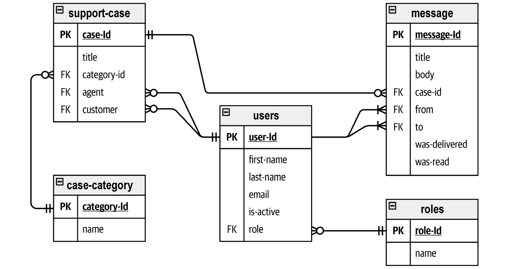{width="5.382747156605424in"
height="2.823332239720035in"}

> Рис. 16.1. Схема реляционной базы данных, описывающая отношения между
> сущностями в транзакционной модели

#### Таблица фактов

Факты представляют собой уже произошедшую деловую активность. Факты
анало- гичны понятию событий предметной области в том смысле, что в
обоих случаях дается описание того, что уже произошло. Но, в отличие от
событий предметной области, в фактах отсутствует стилистическое
требование называть их глаголами в прошедшем времени. Как бы то ни было,
факты представляют собой действия в рамках бизнес-процессов. Например,
таблица фактов Fact_CustomerOnboardings будет содержать запись для
каждого нового подключенного клиента, а Fact_Sales --- запись для каждой
совершенной продажи. Пример таблицы фактов показан на рис. 16.2.

Кроме того, как и события предметной области, записи фактов никогда не
удаля- ются и не изменяются: аналитические данные предназначены только
для добавле- ния --- единственный способ отметить, что данные уже
устарели, заключается в добавлении новой записи с текущим состоянием.
Рассмотрим таблицу фактов Fact_CaseStatus, показанную на рис. 16.3. В
ней содержатся наблюдения за состоя- ниями запросов на поддержку в
течение некоторого времени. В названии факта нет

> *Глава 16. Сеть данных (Data Mesh)* \| 273

явного глагола, но бизнес-процесс, отраженный фактом, не что иное, как
процесс обработки обращений в службу поддержки.

Еще одно существенное различие между моделями OLAP и OLTP заключается в
степени детализации данных. Транзакционные системы требуют для обработки
бизнес-транзакций самых точных данных. Для аналитических моделей во
многих случаях использования более эффективны сводные данные. Например,
в таблице Fact_CaseStatus, показанной на рис. 16.3, видно, что снимки
создаются каждые 30 минут. Решение о приемлемом уровне детализации
принимают аналитики дан- ных, работающие с моделью. Создание записи
факта для каждого изменения пока- зателя, например для каждого изменения
данных при том или ином развитии событий, в одних случаях было бы
слишком расточительным, а в других --- и вовсе технически невозможным.

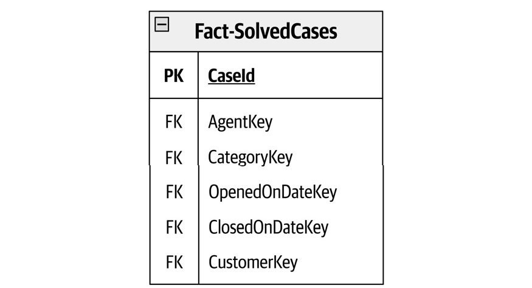{width="2.9383628608923886in"
height="1.58in"}

> Рис. 16.2. Таблица фактов, содержащая записи об обращениях,
> рассмотренных службой поддержки компании

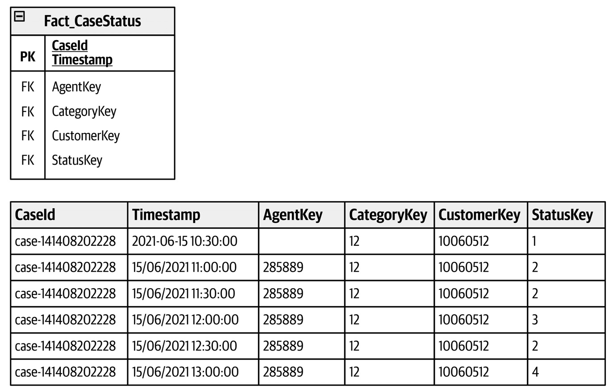{width="4.574096675415573in"
height="2.93in"}

> Рис. 16.3. Таблица фактов с описанием изменения состояния в течение
> жизненного цикла обращений в службу поддержки
>
> 274 \| *Часть IV. Взаимоотношения с другими методологиями и
> паттернами*

#### Таблица измерений

Еще одним важным структурным элементом аналитической модели является
изме- рение (dimension). Если факт представляет собой бизнес-процесс или
действие (выражаемое глаголом), то измерение дает описание факта (со
свойствами прилага- тельного).

Измерения предназначены для описания атрибутов фактов, и на них
ссылаются как на внешний ключ из таблицы фактов в таблицу измерений.
Атрибуты, смоделиро- ванные как измерения, представляют собой любые
измерения или данные, повто- ряющиеся в разных записях фактов и не
способные уместиться в одном столбце. Например, схема на рис. 16.4
дополняет факт SolvedCases его измерениями.

{width="4.319393044619423in"
height="2.763333333333333in"}

> Рис. 16.4. Факт SolvedCases в окружении его измерений

Причиной высокой стандартизации измерений является потребность
аналитической системы в поддержке гибких (flexible) запросов. Это еще
одно различие между транзакционным и аналитическими моделями. Запросы,
предъявляемые к операци- онным моделям для поддержки бизнес-требований,
предсказуемы. А вот паттерны запросов к аналитическим моделям
непредсказуемы. Аналитикам данных нужны гибкие способы просмотра данных,
и какие именно запросы будут выполняться в будущем, предсказать довольно
трудно. В результате стандартизация поддержи- вает динамические запросы
и фильтрацию, а также группировку данных фактов по разным измерениям.

#### Аналитические модели

Структура таблицы, изображенная на рис. 16.5, называется схемой
«звезда». Она основана на отношениях «многие к одному», установленных
между фактами и их измерениями: каждая запись измерения используется
многими фактами, а внешний ключ факта указывает на запись одного из
измерений.

> 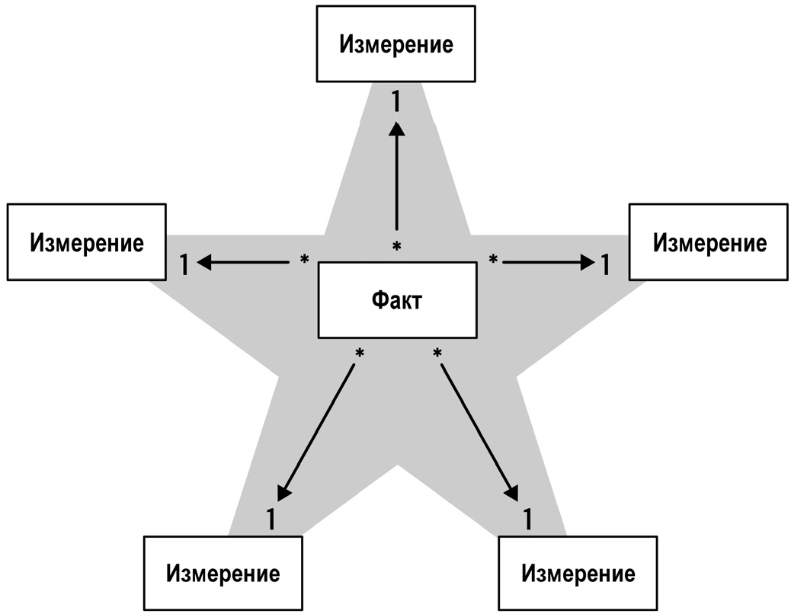{width="3.504957349081365in"
> height="2.6866655730533684in"}*Глава 16. Сеть данных (Data Mesh)* \|
> 275
>
> Рис. 16.5. Отношения «многие к одному» между фактами и их измерениями

Другой доминирующей аналитической моделью является схема снежинки. Она
основана на тех же строительных блоках: фактах и измерениях. Но, как
показано на рис. 16.6, в схеме «снежинка» измерения являются
многоуровневыми: каждое из- мерение дополнительно нормализуется в более
мелкие измерения.

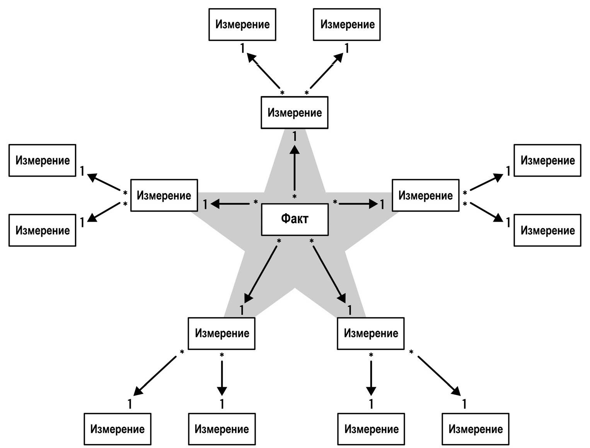{width="5.118735783027121in"
height="3.866665573053368in"}

> Рис. 16.6. Многоуровневые измерения в схеме «снежинка»
>
> 276 \| *Часть IV. Взаимоотношения с другими методологиями и
> паттернами*

В результате дополнительной нормализации схема «снежинка» будет занимать
меньше места для хранения данных измерения и ее будет легче
поддерживать. Но запрос данных, составляющих факты, потребует
объединения большего количества таблиц, и, следовательно, понадобится
больший объем вычислительных ресурсов.

Обе схемы, и «звезда», и «снежинка», позволяют аналитикам данных
проанализи- ровать эффективность бизнеса, получая представление о том,
что можно оптимизи- ровать и встроить в отчеты бизнес-аналитики
(business intelligence, BI).

### Платформы управления аналитическими данными

Давайте перенесем обсуждение с аналитического моделирования на
архитектуры управления данными, поддерживающие создание и обслуживание
аналитических данных. В этом разделе будут рассмотрены две наиболее
распространенные архи- тектуры аналитических данных: data warehouse
(хранилище данных) и data lake (озеро данных). Будут раскрыты основные
принципы работы каждой архитектуры, их отличия друг от друга и проблемы
каждого из этих подходов к управлению ана- литическими данными. Знание о
принципах работы этих двух архитектур послужит основой для рассмотрения
основной темы этой главы: парадигмы сети данных и ее взаимодействия с
предметно-ориентированным проектированием.

#### Хранилище данных --- Data Warehouse

Архитектура хранилища данных (data warehouse, DWH) относительно проста.
Сна- чала данные извлекаются из всех рабочих систем предприятия, а затем
эти исход- ные данные трансформируются в аналитическую модель и
полученный результат загружается в базу данных, ориентированную на
анализ этих данных. Именно эта база данных и является хранилищем данных
(data warehouse).

Эта архитектура управления данными основана главным образом на сценариях
извлечения-преобразования-загрузки (extract-transform-load, ETL). Данные
могут поступать из различных источников: рабочих баз данных, потоковых
событий, журналов и т. д. В дополнение к преобразованию исходных данных
в модель, осно- ванную на фактах и измерениях, этап преобразования может
включать в себя дополнительные операции, такие как удаление
конфиденциальных данных, устра- нение дубликатов записей, изменение
порядка событий, объединение мелких собы- тий и др. В ряде случаев
преобразование может потребовать временного хранения входящих данных в
так называемой области промежуточного хранения (staging area).

Образующееся в результате хранилище данных (data warehouse), показанное
на рис. 16.7, содержит аналитические данные, охватывающие все
бизнес-процессы предприятия. Данные предоставляются с использованием
языка SQL (или одного из его диалектов) и используются аналитиками
данных и специалистами по бизнес- аналитике.

> 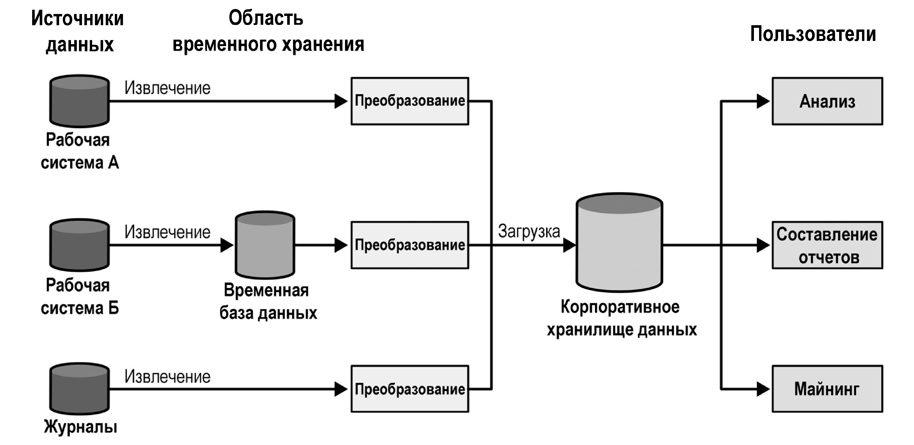{width="5.29545384951881in"
> height="2.5825in"}*Глава 16. Сеть данных (Data Mesh)* \| 277

Рис. 16.7. Типовая архитектура корпоративного хранилища данных

Внимательный читатель заметит, что архитектура хранилища данных
испытывает ряд тех же трудностей, которые рассматривались в *главах 2* и
*3*.

Прежде всего, в основу архитектуры хранилища данных заложена цель
построения модели для всего предприятия. Модель должна описывать данные,
создаваемые всеми системами предприятия, и охватывать все возможные
сценарии использова- ния аналитических данных. Аналитическая модель
позволяет, например, оптимизи- ровать бизнес, снизить эксплуатационные
расходы, принимать выверенные бизнес- решения, составлять отчеты и даже
формировать модели машинного обучения. Как уже говорилось в *главе 3*,
такой подход имеет смысл только для самых маленьких организаций. Гораздо
более эффективным и масштабируемым подходом будет раз- работка модели
для конкретной задачи, например для создания отчетов или форми- рования
моделей машинного обучения.

Задача построения всеобъемлющей модели может быть частично решена за
счет использования витрин данных (data mart). Это база данных, в которой
хранится ин- формация, необходимая для конкретных аналитических
потребностей, например для анализа отдельно взятого
бизнес-подразделения. В модели витрины данных, показанной на рис. 16.8,
одна витрина заполняется непосредственно ETL-процес- сом из
транзакционной системы, а другая витрина извлекает свои данные из храни-
лища данных.

Когда данные загружаются в витрину данных из корпоративного хранилища
дан- ных, все равно нам нужна модель для всего предприятия сразу. В
качестве альтер- нативы витрины данных могут реализовываться за счет
применения специализиро- ванных ETL-процессов, предназначенных для
приема данных непосредственно из транзакционных систем. Получающаяся в
результате этого модель усложняет по- лучение данных из разных витрин,
например по разным отделам, поскольку для этого требуется запрос из
разных баз данных, существенно снижающий производи- тельность системы.

> 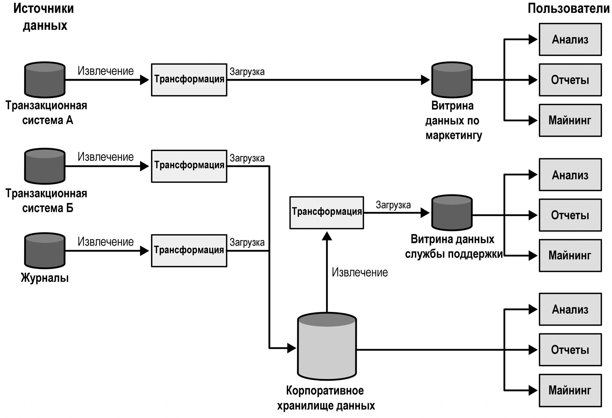{width="5.535656167979003in"
> height="3.7666666666666666in"}278 \| *Часть IV. Взаимоотношения с
> другими методологиями и паттернами*
>
> Рис. 16.8. Архитектура корпоративного хранилища данных, дополненная
> витринами данных

Еще один весьма непростой аспект архитектуры хранилища данных связан с
тем, что ETL-процессы формируют сильную связанность аналитических (OLAP)
и тран- закционных (OLTP) систем. Доступ к данным, потребляемым
ETL-сценариями, осуществляется не только через публичные интерфейсы.
Зачастую DWH-системы просто извлекают все необходимые данные из баз
данных транзакционных систем. Схема, используемая в транзакционной базе
данных, относится к деталям внутрен- ней реализации, а не к публичному
интерфейсу. В результате даже незначительное

{width="5.539652230971129in"
height="1.93in"}

> Рис. 16.9. Хранилище данных, заполняемое путем извлечения данных
> непосредственно из транзакционных баз данных, игнорируя открытые
> интерфейсы, ориентированные на интеграцию
>
> *Глава 16. Сеть данных (Data Mesh)* \| 279

изменение схемы неизменно «ломает» ETL-скрипты хранилища данных.
Поскольку транзакционная и аналитическая системы реализуются и
поддерживаются в неко- тором смысле дистанцированными друг от друга
организационными подразделе- ниями, взаимодействие между ними затруднено
и приводит к большим трениям между командами. Схема обмена данными
показана на рис. 16.9.

Избавиться от некоторых недостатков архитектуры хранилища данных
позволяет использование архитектуры озера данных (data lake
architecture).

#### Озеро данных --- Data Lake

Архитектура озера (Data Lake) данных, как и архитектура хранилища
данных, основана на той же самой концепции приема данных транзакционных
систем и преобразования их в аналитическую модель. Но концептуально эти
два подхода различаются.

Система на основе озера данных принимает данные транзакционной системы.
Но вместо того, чтобы сразу осуществлять их преобразование в
аналитическую мо- дель, она сохраняет данные в «сыром» виде, т. е. в
исходной транзакционной модели.

В итоге необработанные данные не соответствуют потребностям
специалистов, за- нимающихся их анализом. В результате задача
специалистов по данным и специа- листов по бизнес-аналитике состоит в
том, чтобы разобраться с данными в озере и реализовать ETL-скрипты,
которые будут создавать аналитические модели и пере- давать их в
хранилище данных. Архитектура озера данных показана на рис. 16.10.

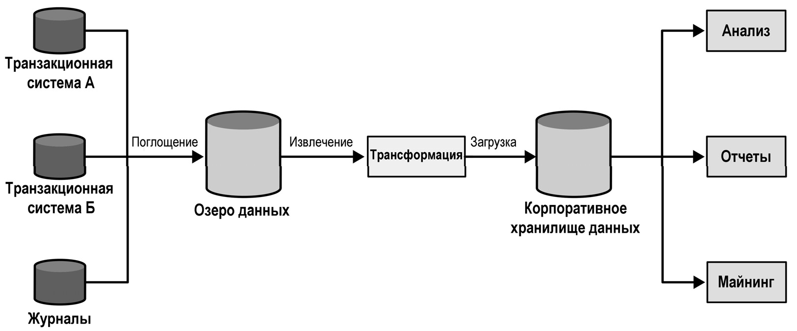{width="5.451151574803149in"
height="2.2566655730533682in"}

> Рис. 16.10. Архитектура озера данных

Поскольку данные транзакционных систем сохраняются в исходном,
необработан- ном виде и трансформируются только после этого, то
благодаря этому озеро дан- ных позволяет работать с несколькими
аналитическими моделями, предназначен- ными для разных задач. Одну
модель можно использовать для создания отчетов, другую --- для
формирования моделей машинного обучения и т. д. Кроме того,

> 280 \| *Часть IV. Взаимоотношения с другими методологиями и
> паттернами*

в последующем могут быть добавлены новые модели, которые будут
проинициали- зированы уже имеющимися необработанными данными.

Вместе с тем отложенное создание аналитических моделей усложняет всю
систему. Специалисты по данным для соответствия различным версиям
транзакционной мо- дели нередко реализуют и поддерживают сразу несколько
версий одного и того же ETL-скрипта (рис. 16.11).

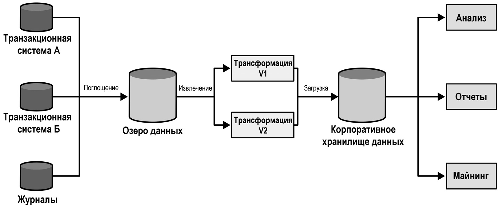{width="5.557590769903762in"
height="2.29in"}

> Рис. 16.11. Несколько версий одного и того же ETL-сценария для разных
> версий транзакционной модели

Кроме того, поскольку озера данных не содержат схем (на входящие данные
не на- кладываются никакие схемы) и не контролируют качество входящих
данных, ин- формация в озере данных при определенных уровнях
масштабирования становится хаотичной. Озера данных упрощают получение
данных, но существенно усложня- ют их использование. Или, как часто
говорят, озеро данных превращается в болото данных. Обязанность
разбираться во всем этом хаосе и извлекать полезные анали- тические
данные усложняет работу специалиста по данным в десятки раз.

#### Проблемы архитектур хранилища данных и озера данных

Архитектуры хранилища данных (Data Warehouse) и озера данных (Data Lake)
основаны на предположении, что чем больше данных поступает для
аналитики, тем больше информации получает организация. Но обоим подходам
свойственно пасо- вать под тяжестью больших данных. Преобразование
транзакционных моделей в аналитические сводится к тысячам
неподдерживаемых специализированных ETL- скриптов.

С точки зрения моделирования обе архитектуры посягают на границы
транзакци- онных систем и создают зависимости от деталей своей
реализации. Возникающая в результате этого связанность с моделями
реализации приводит к конфликтам ин- тересов команд транзакционных и
аналитических систем, часто вплоть до отказа от

> *Глава 16. Сеть данных (Data Mesh)* \| 281

назревших изменений в транзакционных моделях ради того, чтобы не
нарушать работу системы анализа с использованием ETL-сценариев.

Хуже того, принадлежность аналитиков и специалистов по данным к
отдельным подразделениям приводит к их недостаточно глубоким знаниям в
области бизнеса по сравнению со специалистами команд разработчиков
транзакционных систем. Они специализируются не на знаниях бизнеса, а в
основном на умении пользовать- ся инструментами для работы с большими
данными.

И последнее, но не менее важное: связанность с моделями реализации
особенно ощутима в проектах, основанных на использовании
предметно-ориентированного проектирования, в которых упор делается на
постоянное развитие и улучшение мо- делей предметной области бизнеса. В
результате этого изменение транзакционной модели может иметь
непредвиденные последствия для аналитической модели. Час- тота таких
изменений в проектах, основанных на использовании предметно-
ориентированного проектирования, зачастую является причиной
возникновения конфликтных ситуаций между отделами исследований и
разработок и отделами обработки данных.

Эти ограничения, присущие хранилищам данных и озерам данных, вдохновили
на создание новой архитектуры управления аналитическими данными: сети
данных (data mesh).

### Сеть данных (Data mesh)

Архитектура сети данных (data mesh) в некотором смысле представляет
собой предметно-ориентированное проектирование применительно к
аналитическим дан- ным. Поскольку различные DDD-паттерны устанавливают
границы и защищают свое содержимое, архитектура сети данных (data mesh)
определяет и защищает гра- ницы модели аналитических данных.

Архитектура сети данных (data mesh) основана на четырех основных
принципах: разбиение данных по предметным областям, рассмотрение данных
как продукта, обеспечение автономии и построение экосистемы. Рассмотрим
особенности каждо- го из них.

#### Разбиение данных по предметным областям

Подходы, используемые как в хранилище данных, так и в озере данных,
направле- ны на объединение всех данных предприятия в одну большую
модель. Полученная аналитическая модель неэффективна по тем же причинам,
что и транзакционная модель в масштабах всего предприятия. Кроме того,
сбор данных со всех систем в одном месте приводит к стиранию границ
владения различными элементами данных.

Вместо создания монолитной аналитической модели архитектура сети данных
тре- бует использования того же решения для рабочих данных, которое уже
рассматри- валось в *главе 3*: использовать несколько аналитических
моделей и поддерживать их согласованность с источником данных. Это, как
показано на рис. 16.12, совер-

> 282 \| *Часть IV. Взаимоотношения с другими методологиями и
> паттернами*

шенно естественным образом приводит границы владения аналитическими
моде- лями в соответствие с границами ограниченных контекстов. Когда
модель анализа разбивается в соответствии с имеющимися в системе
ограниченными контекстами, генерация данных анализа становится
обязанностью соответствующих групп раз- работчиков.

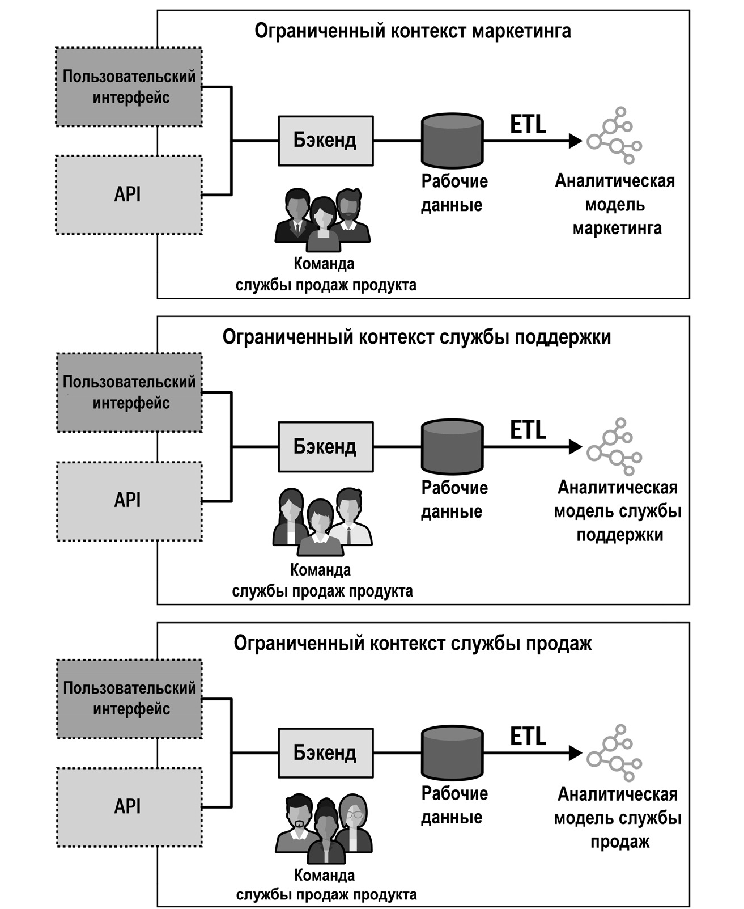{width="4.411905074365705in"
height="5.343333333333334in"}

> Рис. 16.12. Приведение границ владения аналитическими моделями в
> соответствие с границами ограниченных контекстов

Каждый ограниченный контекст теперь владеет своей транзакционной (OLTP)
и аналитической (OLAP) моделями. Следовательно, та команда, которая
владеет транзакционной моделью, теперь отвечает и за ее преобразование в
аналитическую модель.

> *Глава 16. Сеть данных (Data Mesh)* \| 283

#### Данные как продукт

Классические архитектуры управления данными затрудняют исследование,
пони- мание и выборку качественных аналитических данных. Особенно остро
это прояв- ляется при использовании озер данных (data lakes).

Восприятие данных в качестве продукта требует относиться к аналитическим
дан- ным как к одним из важнейших активов компании. Вместо снабжения
аналитиче- ских систем оперативными данными из сомнительных источников
(внутренней базы данных, файлов журналов и т. д.) в системе на основе
сети данных (data mesh) ограниченные контексты обслуживают аналитические
данные через конкретные выходные порты (см. рис. 16.13).

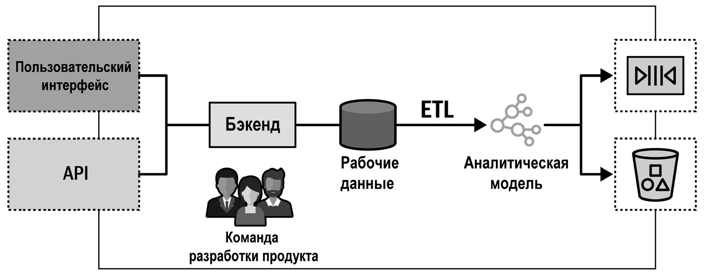{width="5.118153980752406in"
height="1.9766666666666666in"}

> Рис. 16.13. Конечные точки данных Polyglot, предоставляющие
> аналитические данные потребителям

С аналитическими данными следует обращаться так же, как и с любым
публичным API-интерфейсом:

- Должны быть легко обнаруживаемые нужные эндпоинты: порты вывода дан-
  ных.

- Аналитические эндпоинты должны иметь четко определенную схему,
  содержа- щую описание обслуживаемых данных и их формат.

- Аналитические данные должны быть достоверными, и как и в случае с
  любым API-интерфейсом, у него должны быть вполне определенные и
  отслеживаемые соглашения об уровне обслуживания (service-level
  agreements, SLA).

- У аналитической модели должна быть версия в виде обычного
  API-интерфейса, и она должна надлежащим образом работать с обратно
  несовместимыми изме- нениями.

Кроме того, поскольку аналитические данные воспринимаются в качестве
продук- та, они должны удовлетворять нуждам своих потребителей. Команда,
работающая над реализацией ограниченного контекста, отвечает за то,
чтобы создаваемая модель отвечала нуждам ее потребителей. В отличие от
архитектур хранилища данных и озера данных, при использовании сети
данных ответственность за качест- во данных является задачей с наивысшим
приоритетом.

> 284 \| *Часть IV. Взаимоотношения с другими методологиями и
> паттернами*

Цель архитектуры управления распределенными данными состоит в том, чтобы
предоставить возможность объединения детализированных аналитических
моделей для удовлетворения потребностей организации в анализе данных.
Например, если BI-отчет должен отражать данные, взятые из нескольких
ограниченных контекстов, ему в случае необходимости должна
предоставляться возможность без особых за- труднений извлекать
аналитические данные этих контекстов, применять локальные преобразования
и создавать отчет.

И наконец, разным потребителям могут потребоваться аналитические данные
в разной форме. Одни потребители могут отдавать предпочтение выполнению
SQL-запросов, а другие --- получать аналитические данные из сервиса
хранения объектов и т. д. По этой причине информационные продукты должны
поддержи- вать разные типы хранилищ, предоставляя данные в форматах,
удовлетворяющих разнообразные нужды потребителей.

Чтобы реализовать принцип восприятия данных в качестве продукта,
командам по разработке продуктов необходимо добавить в свой состав
специалистов по работе с данными. Это и есть недостающая часть пазла
кросс-функциональных команд, в который традиционно входят только
специалисты, связанные с транзакционными системами.

#### Обеспечение автономии

У команд разработчиков должна быть возможность не только создавать свои
собст- венные продукты данных, но и использовать продукты данных,
обслуживаемые другими командами разработчиков ограниченных контекстов.
Как и в случае с ограниченными контекстами, продукты данных должны быть
совместимы.

Было бы расточительно, неэффективно и сложно проводить интеграцию, если
бы каждая команда для обслуживания аналитических данных создавала свое
собствен- ное решение. Чтобы такого не случалось, необходима платформа,
позволяющая абстрагироваться от сложностей создания, выполнения и
обслуживания совмести- мых продуктов данных. Проектирование и создание
такой платформы является серьезной задачей и требует специальной команды
разработчиков платформы ин- фраструктуры данных.

Команда разработчиков платформы инфраструктуры данных должна отвечать за
определение шаблонов продуктов данных, унифицированных способов доступа,
контроля доступа и децентрализации способов хранения данных (polyglot
per- sistence), которыми могли бы воспользоваться группы разработчиков
продуктов, а также за мониторинг платформы и обеспечение выполнения
SLA-соглашений и показателей.

#### Построение экосистемы

Завершающим шагом к созданию системы сети данных является назначение
объ- единенного органа управления для обеспечения функциональной
совместимости и экосистемного мышления в области аналитических данных.
Как правило, как пока-

> *Глава 16. Сеть данных (Data Mesh)* \| 285

зано на рис. 16.14, это группа, состоящая из владельцев данных и
продуктов огра- ниченных контекстов, а также представителей команды
платформы инфраструкту- ры данных.

Группа управления отвечает за определение правил, обеспечивающих
работоспо- собную и функционально совместимую экосистему. Правила должны
применяться ко всем продуктам данных и их интерфейсам, и ответственность
за соблюдение этих правил в масштабах всего предприятия возлагается на
эту группу.

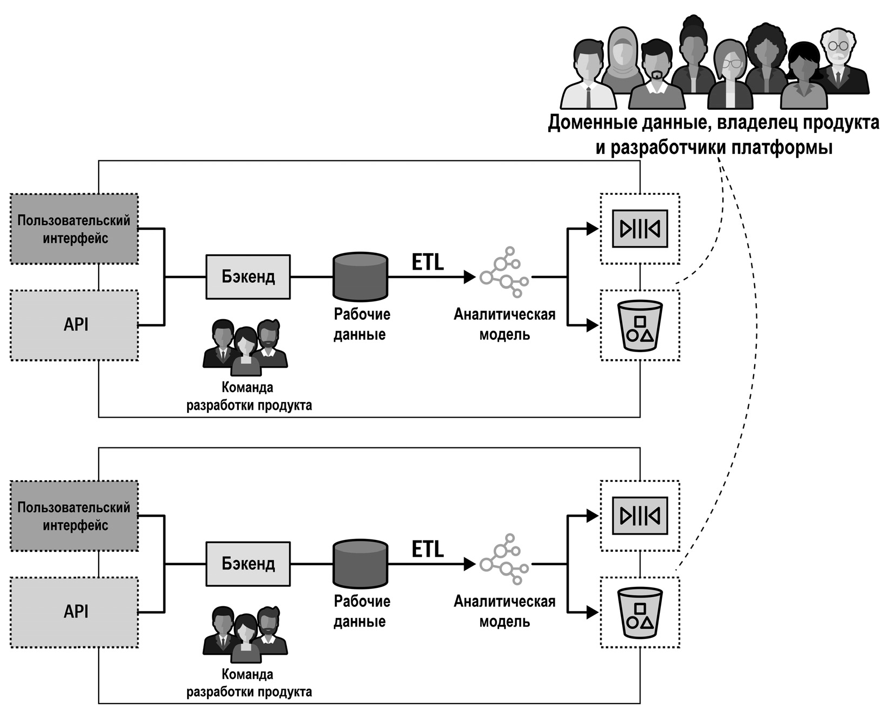{width="5.566731189851269in"
height="4.433333333333334in"}

> Рис. 16.14. Группа управления, обеспечивающая совместимость,
> работоспособность распределенной экосистемы аналитики данных и ее
> соответствие потребностям организации

#### Совмещение сети данных (data mesh)

> и предметно-ориентированного проектирования

Итак, рассмотрены все четыре принципа, на которых основана архитектура
data mesh. Акцент, сделанный на определении границ и инкапсуляции
деталей реализа- ции путем использования конкретных выходных портов,
позволяет сделать вывод, что архитектура сети данных основана на тех же
соображениях, что и предметно- ориентированное проектирование. Кроме
того, некоторые из паттернов предметно-

> 286 \| *Часть IV. Взаимоотношения с другими методологиями и
> паттернами*

ориентированного проектирования, могут во многом поддерживать реализацию
архитектуры сети данных (data mesh).

Во-первых, для разработки аналитических моделей необходимы единый язык
(ubiquitous language) и полученные знания о предметной области. Как уже
говори- лось в разделах, посвященных хранилищам данных и озерам данных,
в традицион- ных архитектурах отсутствуют знания предметной области.

Во-вторых, предоставление данных ограниченного контекста в модели,
отличной от его транзакционной модели, является паттерном сервиса с
открытым протоко- лом (open-host service). В этом случае аналитическая
модель является дополнитель- ным опубликованным языком (published
language).

CQRS упрощает создание нескольких моделей одних и тех же данных. Им
можно воспользоваться для преобразования транзакционной модели в
аналитическую мо- дель. Способность CQRS генерировать модели с нуля
упрощает одновременное создание и обслуживание сразу нескольких версий
аналитической модели (рис. 16.15).

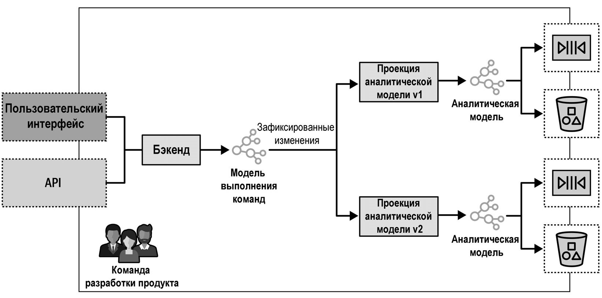{width="5.4827635608049in"
height="2.723333333333333in"}

> Рис. 16.15. Использование паттерна CQRS для одновременного
> предоставления аналитических данных в двух разных версиях схемы

И наконец, поскольку архитектура data mesh объединяет модели различных
огра- ниченных контекстов для реализации аналитических сценариев
использования, паттерны интеграции ограниченных контекстов для
транзакционных моделей при- менимы и к аналитическим моделям. Две
команды разработки продуктов могут развивать свои аналитические модели
совместными усилиями. А какая-нибудь дру- гая команда может внедрить
предохранительный слой (anticorruption layer), чтобы защитить себя от
неэффективной аналитической модели. Или же команды могут пойти разными
путями и создать дублирующие реализации аналитических мо- делей.

### Вывод

> *Глава 16. Сеть данных (Data Mesh)* \| 287

В этой главе были представлены различные аспекты проектирования
программных систем, в частности приемы определения аналитических данных
и управление ими. Были рассмотрены доминирующие модели аналитических
данных, в том числе схемы «звезда» и «снежинка», а также способы
традиционного управления данны- ми в хранилищах данных и озерах данных.

Проблемы традиционных архитектур управления данными призвана решить
архи- тектура сети данных (data mesh). По сути, в ней применяются те же
принципы, что и в предметно-ориентированном проектировании, но
обращенные к аналитическим данным: разбиение аналитической модели на
управляемые части, обеспечение на- дежного доступа к аналитическим
данным и их использование через публичные интерфейсы. В итоге реализацию
архитектуры сети данных (data mesh) могут под- держивать CQRS и паттерны
интеграций ограниченных контекстов.

### Упражнения

1.  Какое из следующих утверждений можно считать справедливым в
    отношении различий между транзакционной (OLTP) и аналитической
    (OLAP) моделями?

> А) OLAP-модели должны предоставлять более гибкие параметры запросов,
> чем модели OLTP.
>
> Б) Ожидается, что OLAP-модели будут подвергаться более частым
> обновлени- ям, чем модели OLTP, и поэтому должны быть оптимизированы
> для операций записи.
>
> В) OLTP-данные оптимизированы для операций в режиме реального времени,
> а для ответа на OLAP-запрос допустимо ожидание в течение секунды или
> даже минуты.
>
> Г) Верны утверждения А и В.

2.  Какой паттерн интеграции с ограниченным контекстом необходим для
    реализа- ции архитектуры сети данных (data mesh)?

> А) Общее ядро (shared kernel).
>
> Б) Сервис с открытым протоколом (open-host service). В)
> Предохранительный слой (anticorruption layer).
>
> Г) Партнерство (partnership).

3.  Какой архитектурный паттерн необходим для реализации архитектуры
    сети данных (data mesh)?

> А) Слоистая архитектура. Б) Порты и адаптеры.
>
> В) CQRS.
>
> Г) Архитектурные паттерны не могут поддерживать реализацию
> OLAP-модели.
>
> 288 \| *Часть IV. Взаимоотношения с другими методологиями и
> паттернами*

4.  Определение архитектуры data mesh требует разбиения данных по
    «предметным областям». Какое понятие предметно-ориентированного
    проектирования ис- пользуется для обозначения предметных областей
    сети данных (data mesh)?

> А) Ограниченные контексты. Б) Предметные области.
>
> В) Поддомены.
>
> Г) В предметно-ориентированном проектировании нет понятий, подходящих
> в качестве синонимов предметных областей сети данных (data mesh).

## Заключение

В завершение нашего исследования предметно-ориентированного
проектирования хочу вернуться к цитате, с которой мы начинали:

> Нет смысла говорить о решении до того, как мы договоримся о задаче, и
> нет смысла говорить о шагах реализации до того, как мы договоримся о
> решении.
>
> *-- Эфрат Голдратт-Ашлаг (Efrat Goldratt-Ashlag)*

Эта цитата довольно точно излагает маршрут нашего путешествия по DDD.

### Задача

Чтобы предоставить программное решение, нужно сначала разобраться в сути
задачи: в какой области бизнеса ведется работа, каковы бизнес-цели и
какова стра- тегия их достижения.

Для обретения глубокого понимания предметной области бизнеса и ее
логики, ко- торую необходимо будет реализовать в программном продукте, в
этой книге нами использовался единый язык.

Мы разобрали, как можно справиться со сложностью бизнес-задачи, разбивая
ее на ограниченные контексты. В каждом ограниченном контексте
реализуется одна- единственная модель предметной области, направленная
на решение конкретной задачи.

Были рассмотрены способы определения и классификации строительных блоков
бизнес-областей: основных, вспомогательных и универсальных поддоменов.
Срав- нение этих трех поддоменов приведено в табл. З.1.

> *Таблица З.1. Три типа подобластей*

+-------------------+----------------+-------------+----------------+-------------------+--------------+
| > Тип поддоменов  | > Создание     | > Сложность | > Изменчивость | > Реализация      | > Задача     |
|                   | > конкурентных |             |                |                   |              |
|                   | > преимуществ  |             |                |                   |              |
+===================+================+=============+================+===================+==============+
| > Основной        | > Да           | > Высокая   | > Высокая      | > Самостоятельная | > Интересная |
+-------------------+----------------+-------------+----------------+-------------------+--------------+
| > Универсальный   | > Нет          | > Высокая   | > Низкая       | > Покупка или     | > Решенная   |
|                   |                |             |                | > заимствование   |              |
+-------------------+----------------+-------------+----------------+-------------------+--------------+
| > Вспомогательный | > Нет          | > Низкая    | > Низкая       | > Самостоятельная | > Банальная  |
|                   |                |             |                | > или аутсорсинг  |              |
+-------------------+----------------+-------------+----------------+-------------------+--------------+

> 290 \| *Заключение*

### Решение

Мы научились использовать эти знания для разработки решений,
оптимизирован- ных для каждого типа подобласти. Были рассмотрены четыре
шаблона реализации бизнес-логики --- транзакционный сценарий, активная
запись, модель предметной области и модель предметной области,
основанная на событиях, --- а также сцена- рии, в которых проявляются
лучшие качества каждого шаблона. Также были пока- заны три архитектурных
шаблона, закладывающие необходимую основу для реали- зации
бизнес-логики: слоистая архитектура, порты и адаптеры и CQRS. Эвристика
принятия тактических решений с использованием этих шаблонов обобщена на
рис. З.1.

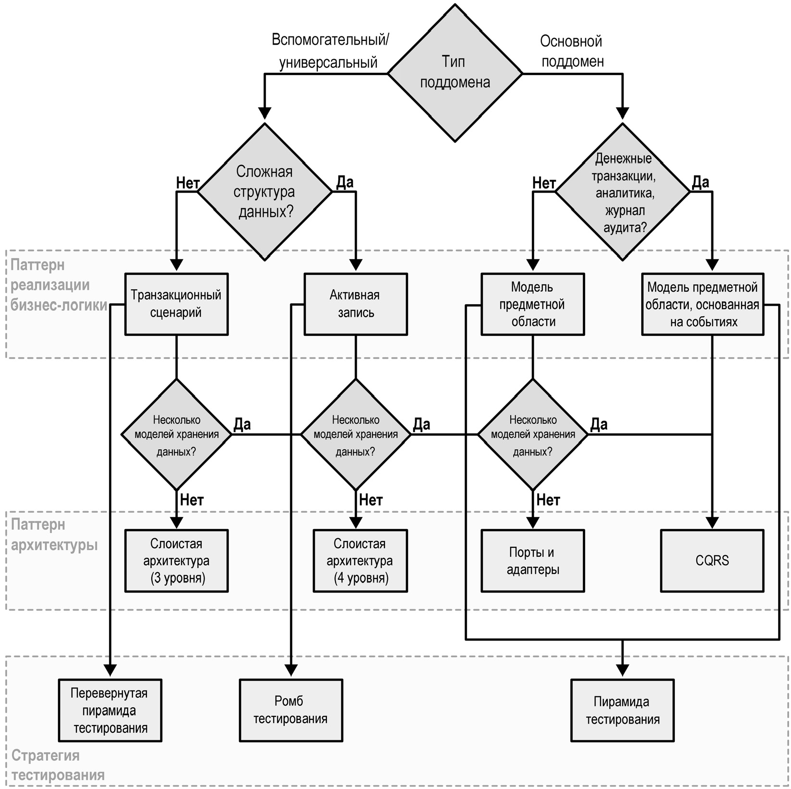{width="5.556620734908137in"
height="5.473333333333334in"}

> Рис. З.1. Дерево решений, обобщающее эвристику принятия тактических
> решений

### Реализация {#реализация-6}

> *Заключение* \| 291

В *части III* нашей книги рассматривались вопросы превращения теории в
практи- ку. Были изложены эффективные приемы создания единого языка
путем проведе- ния сеансов EventStorming, способы поддержания проекта в
надлежащей форме по мере развития бизнес-сферы и приемы внедрения
предметно-ориентированного проектирования в уже существующие проекты и
начала его применения.

В *части IV* рассматривались вопросы взаимодействия предметно-ориентиро-
ванного проектирования с другими методологиями и шаблонами:
микросервисами, архитектурой, основанной на событиях и сеткой данных.
Было показано, что мето- дология DDD не только применима в тандеме с
ними, но и то, все эти методы фак- тически дополняют друг друга.

### Рекомендуемая литература

Надеюсь, эта книга пробудила ваш интерес к предметно-ориентированному
проек- тированию. Если есть желание продолжить обучение, могу
настоятельно пореко- мендовать ряд следующих книг1.

#### Дополнительные сведения

> о предметно-ориентированном проектировании

- Эрик Эванс «Предметно-ориентированное проектирование (DDD). Структури-
  зация сложных программных систем», изд. «Вильямс», 2020.

> Оригинальная книга Эрика Эванса (Eric Evans), в которой представлена
> мето- дология предметно-ориентированного проектирования. Хотя в ней не
> нашли отражения такие новые аспекты DDD, как события предметной
> области и ис- точники событий, все же эту книгу стоит прочитать тем,
> кто хочет добиться мастерства в применении методологии DDD.

- Martraire, C. Living Documentation: Continuous Knowledge Sharing by
  Design. Boston: Addison-Wesley, 2019.

> В этой книге Сирил Мартрэр (Cyrille Martraire) предлагает подходы,
> основанные на предметно-ориентированном проектировании, к обмену
> знаниями, докумен- тированию и тестированию.

- Вернон Вон. Реализация методов предметно-ориентированного
  проектирования, изд. «Вильямс», 2019.

> Еще одна классика DDD на все времена. Вернон Вон (Vernon Vaughn)
> рассмат- ривает подробно разобранные примеры мышления, присущего
> предметно- ориентированному проектированию, и способы применения
> набора его страте- гических и тактических инструментов. В качестве
> основы для обучения им ис-
>
> ^1^ Без перевода даны названия изданий, пока не вышедших в России.
>
> 292 \| *Заключение*
>
> пользуется реальный пример выдвижения неудачных инициатив применения
> DDD и показывается обновленный путь команд, проложенный благодаря
> суще- ственному изменению курса.

- Young, G. Versioning in an Event Sourced System. Leanpub, 2017.

> В *главе 7* говорилось, что развитие системы, основанной на событиях,
> может оказаться весьма непростой задачей. Именно этой теме и посвящена
> данная книга.

#### Архитектурные и интеграционные шаблоны

- Дегани Жамак. Data Mesh. Новая парадигма работы с данными, изд. «БХВ»,
  2023.

> Дегани Жамак (Dehghani Zhamak) --- автор шаблона data mesh,
> рассмотренного нами в *главе 16*. В своей книге Дегани объясняет
> принципы, лежащие в основе архитектуры управления данными, а также
> практические способы реализации архитектуры data mesh.

- Мартин Фаулер. Шаблоны корпоративных приложений, изд. «Вильямс», 2019.
  Книга о классических шаблонах архитектуры приложений, которую я
  неодно- кратно цитировал в *главах 5* и *6*. Это та самая книга, в
  которой изначально были определены шаблоны сценария транзакций,
  активной записи и модели предмет- ной области.

- Грегор Хоп, Бобби Вульф. Шаблоны интеграции корпоративных приложений.
  Проектирование, создание и развертывание решений, изд. «Вильямс»,
  2019.

> Многие шаблоны, рассмотренные в *главе 9*, впервые были представлены в
> этой книге. В ней вы найдете еще больше сведений о шаблонах интеграции
> компо- нентов.

- Крис Ричардсон. Микросервисы. Паттерны разработки и рефакторинга, изд.
  «Пи- тер», 2022.

> В этой книге Крис Ричардсон (Chris Richardson) приводит множество
> подробных примеров применения шаблонов, часто используемых при
> разработке решений на основе микросервисов. Среди рассматриваемых
> шаблонов --- сага, диспетчер процессов и исходящие сообщения,
> упоминавшиеся в нашей книге в *главе 9*.

#### Модернизация устаревших систем

- Kaiser, S. Adaptive Systems with Domain-Driven Design, Wardley
  Mapping, and Team Topologies. Boston: Addison-Wesley, публикация
  ожидается в 2024 году.

> Сюзанна Кайзер (Susanne Kaiser) делится своим опытом модернизации
> устарев- ших систем с использованием предметно-ориентированного
> проектирования, карты Уордли (Wardley mapping) и командных топологий.

- Tune, N. Architecture Modernization: Product, Domain, & Team Oriented.
  Manning, 2023.

*Заключение* \| 293

> В этой книге Ник Тьюн (Nick Tune) во всех подробностях рассматривает
> приемы использования предметно-ориентированного проектирования и
> других методов для модернизации архитектуры уже существующих проектов.

- Vernon, V., & Jaskula, T. Implementing Strategic Monoliths and
  Microservices. Boston: Addison-Wesley, 2021.

> Книга представляет собой практическое пособие, в котором авторы
> предостав- ляют идеи, инструменты, проверенные практики и стили
> архитектуры как с точ- ки зрения бизнеса, так и с инженерной точки
> зрения, включая предметно- ориентированные подходы и выбор оптимальных
> стратегий реализации реше- ний на основе монолитов и микросервисов.
> Особое внимание при этом уделяет- ся такому важному аспекту, как
> реализация инновационных бизнес-стратегий. Авторы сочетают управляемые
> подходы к реализации с современной архитекту- рой, подчеркивая
> важность и ценность сосредоточения внимания на бизнес- сфере при
> одновременном балансировании технических соображений.

- Vernon, V., & Jaskula, T. Strategic Monoliths and Microservices.
  Boston: Addison- Wesley, 2021.

> В этой книге Вон и Томаш раскрывают новые стороны стратегического
> мышле- ния в области разработки программных продуктов. В книге
> изучается, как при- нимать сбалансированные архитектурные решения,
> основываясь на потребно- стях и целях, чтобы можно было внедрять
> инновации и применять предметно- ориентированный подход, создавать
> более развивающиеся системы и избегать дорогостоящих ошибок. Особое
> внимание авторы уделили вопросам выбора наиболее целесообразной
> архитектуры и рабочих инструментов: микросервисов, монолитов или же их
> сочетаниям, а также способам, позволяющим добиться эффективной работы.

#### EventStorming

- Brandolini, A. Introducing EventStorming (на момент публикации книга
  не закон- чена и доступна для частичного ознакомления на портале
  Leanpub).

> Альберто Брандолини (Alberto Brandolini) --- создатель семинара
> EventStorming, и в этой книге он подробно объясняет процесс и
> мотивировку проведения EventStorming.

- Rayner, P. The EventStorming Handbook (на момент публикации книга не
  закон- чена и доступна для частичного ознакомления на портале
  Leanpub).

> Пол Рейнер (Paul Rayner) объясняет тонкости практического применения
> EventStorming, включая многочисленные советы и приемы, способные
> помочь провести успешную сессию.
>
> 294 \| *Заключение*

### Вывод

Ну, вот и все! Большое спасибо за чтение этой книги. Надеюсь, вам все
понрави- лось, и вы сможете воспользоваться полученными знаниями.

Я надеюсь, что вы вынесете из этой книги понимание логики и принципов,
поло- женных в основу инструментов предметно-ориентированного
проектирования. Не нужно слепо идти по пути предметно-ориентированного
проектирования, воспри- нимая его как догму, лучше разобраться в логике,
на которой оно построено. Это понимание поможет существенно расширить
ваши возможности применения DDD и извлечь из этого практическую выгоду.
Усвоение философии предметно-ориен- тированного проектирования также
является ключом к повышению ценности про- граммного продукта за счет
единичных включений концепций этой методологии, особенно в уже
существующие проекты.

И наконец, всегда следите за своим единым языком и при малейших
сомнениях проводите EventStorming. Удачи!

ПРИЛОЖЕНИЕ 1

## Применение DDD: пример из практики

В этом приложении я поделюсь рассказом о начале моего путешествия в
область предметно-ориентированного проектирования: это будет история
начинающей компании, которая в данном примере называется Marketnovus.
Методология DDD стала использоваться в Marketnovus со дня ее основания.
За прошедшие годы были допущены не только все возможные ошибки DDD, но и
получена возможность учиться на этих ошибках и заниматься их
исправлением. Эта история и допущен- ные ошибки будут использованы с
целью демонстрации роли паттернов и методов DDD в достижении успеха
программного проекта.

Этот учебный пример состоит из двух частей. В первой части будет
рассказана ис- тория о пяти ограниченных контекстах Marketnovus, о
принятых проектных реше- ниях и полученных результатах. Во второй части
я расскажу, как в этой истории отражается материал, усвоенный при
прочтении книги.

Прежде чем начать, я должен подчеркнуть, что компании Marketnovus больше
нет. То есть данное приложение никоим образом не является рекламным.
Кроме того, поскольку речь идет о несуществующей компании, я могу честно
рассказать о на- шем опыте.

### Пять ограниченных контекстов

Прежде чем углубиться в ограниченные контексты и в историю их
проектирования, мы, как специалисты, практикующие DDD, должны начать с
определения предмет- ной области Marketnovus.

#### Предметная область

Представьте, что вами производится продукт или услуга. Marketnovus
позволяет вам передать все ваши обязанности, связанные с маркетингом, на
аутсорсинг. Спе- циалисты Marketnovus разработают маркетинговую
стратегию для вашего продук- та. Его копирайтеры и графические дизайнеры
будут создавать тонны креативных материалов, баннеров и целевых страниц,
которые будут использоваться для про- ведения рекламных кампаний,
продвигающих ваш продукт. Все потенциальные клиенты (лиды), привлеченные
в результате проведения этих кампаний, будут об- рабатываться торговыми
агентами Marketnovus, которые будут им звонить и прода- вать ваш
продукт. Этот процесс изображен на рис. П1.1.

Самое главное, что этот маркетинговый процесс открывал множество
возможно- стей для оптимизации, чем, собственно, и занимался
аналитический отдел. Ими

> 296 \| *Приложение 1*

были проанализированы все данные с целью убедиться, что Marketnovus и ее
кли- енты получают наибольшую отдачу от вложенных средств, выявляя самые
успеш- ные кампании, отмечая самые эффективные креативные ходы или следя
за тем, чтобы агенты по продажам работали с наиболее перспективными
потенциальными клиентами.

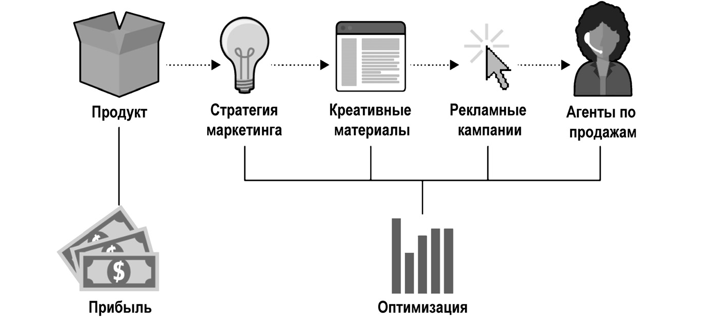{width="4.630954724409449in"
height="2.0933333333333333in"}

> Рис. П1.1. Маркетинговый процесс

Так как мы были на самофинансировании, к работе нужно было приступить
как можно быстрее. В результате сразу же после основания компании первая
версия нашей программной системы должна была реализовать первую треть
нашей цепоч- ки создания ценностей:

- Систему управления договорами и интеграцией с внешними издателями.

- Каталог для наших дизайнеров для управления креативными материалами.

- Решение для управления рекламными кампаниями.

Я был в подавленном состоянии и должен был найти способ осмыслить все
слож- ности предметной области. К счастью, незадолго до начала нашей
работы я прочел книгу, которая обещала содействие именно в этом вопросе.
Конечно же, я имею в виду классическую работу Эрика Эванса (Eric Evans)
«Domain-Driven Design: Tackling Complexity in the Heart of Software» (в
переводе на русский язык ---

«Предметно-ориентированное проектирование (DDD): структуризация сложных
программных систем»).

Если вам приходилось читать предисловие к этой книге, то вы уже знаете,
что кни- га Эванса дала ответы, которые я давно искал: как
спроектировать и реализовывать бизнес-логику в коде. И все же при первом
прочтении для моего понимания это была весьма непростая книга. Как бы то
ни было, я почувствовал, что уже хорошо разобрался с DDD, просто
прочитав главы о тактическом проектировании.

Угадайте, как система была спроектирована изначально? Результат
определенно

1

придал бы известному человеку из DDD-сообщества неуемное чувство
гордости.

> ^1^ Речь идет о пародийном Твиттер-аккаунте \@DDDBorat, который
> известен тем, что на нем обмениваются вредными советами касательно
> предметно-ориентированного проектирования.
>
> *Применение DDD: пример из практики* \| 297

#### Ограниченный контекст № 1: Маркетинг

Архитектурный стиль нашего первого решения можно четко охарактеризовать
как

«повсюду агрегаты». Агентство, компания, размещение, воронка, издатель:
каждое существительное в требованиях было провозглашено как агрегат.

Все эти так называемые агрегаты находились в огромном одном-единственном
ограниченном контексте. Да, большой, ужасный монолит, о недопустимости
кото- рого все сейчас только и предостерегают.

И, конечно же, это были не агрегаты. В них не предусматривались никакие
тран- закционные границы и почти не было никакого поведения. Вся
бизнес-логика была реализована на огромном сервисном слое.

Когда в стремлении реализовать модель предметной области, в итоге
получается паттерн активной записи (active record), то его часто
называют антипаттерном

«анемичной модели предметной области». Оглядываясь назад, можно сказать,
что этот проект был стандартным примером того, как не следует
реализовывать модель предметной области. Но с точки зрения бизнеса все
выглядело совершенно иначе.

Бизнес посчитал его огромным успехом! Несмотря на несовершенство
архитекту- ры, мы смогли поставить работающее программное средство в
весьма сжатые сро- ки. Как мы это сделали?

###### Своеобразная магия

Непостижимым образом нам удалось создать надежный единый язык. Ни у кого
из нас не было никакого начального опыта в онлайн-маркетинге, но мы все
же имели возможность общаться с экспертами в данной области. Мы их
понимали, они нас понимали, и, к нашему удивлению, бизнес-специалисты
оказались весьма прият- ными людьми! Они искренне ценили то, что мы
готовы были учиться у них и впи- тывать их опыт.

Приятное общение с экспертами предметной области позволило нам быстро
понять ее суть и внедрить в программу ее бизнес-логику. Да, у нас
получился довольно крупный монолит, но для двух разработчиков «из
гаража» этого было достаточно. Опять же, мы создали работоспособную
программу для выхода на рынок в очень сжатые сроки.

###### Наши ранние взгляды

> на предметно-ориентированное проектирование

Наше представление о предметно-ориентированном проектировании на данном
этапе можно продемонстрировать с помощью простой схемы, показанной на
рис. П1.2.

#### Ограниченный контекст № 2: CRM

Вскоре после того как было развернуто решение для управления компанией,
поток потенциальных клиентов стал прибывать, и нам пришлось поспешить.
Нашим

> {width="4.4275076552930885in"
> height="1.4633333333333334in"}298 \| *Приложение 1*
>
> Рис. П1.2. Наше раннее представление о предметно-ориентированном
> проектировании

агентам по продажам требовалась надежная система управления информацией
о клиентах (CRM), чтобы управлять лидами и их жизненным циклом.

CRM должна была собирать всех входящих лидов, группировать их по разным
па- раметрам и распределять по отделам продаж по всему миру. Эта система
также должна была интегрироваться с внутренними системами наших
клиентов, чтобы уведомлять их об изменениях в жизненном цикле лидов и
дополнять сведения о наших лидах вновь поступающей информацией. И,
конечно же, CRM должна была предоставить как можно больше возможностей
для проведения оптимизации. Например, требовалось убедиться, что агенты
работают с наиболее перспективны- ми лидами, назначать лиды агентам на
основе их квалификации и прошлой работы, а также обеспечивать очень
гибкое решение для расчета агентских комиссий.

Поскольку уже готовый продукт под наши требования не подходил, мы решили
внедрить свою собственную CRM-систему.

###### Еще больше «агрегатов»!

Первоначальный подход к реализации заключался в том, чтобы продолжать
сосре- доточиваться на тактических паттернах. Опять же, каждое
существительное произ- носилось нами как агрегат и втискивалось в один и
тот же монолит. Но на этот раз

«что-то пошло не так» с самого начала.

Мы заметили, что слишком часто к именам этих «агрегатов» добавляются
неудоб- ные префиксы: например, CRMLead и MarketingLead,
MarketingCampaign и CRMCampaign. Ин- тересно, что мы никогда не
использовали эти префиксы в общении с экспертами предметной области.
Почему-то они всегда понимали смысл из контекста.

Затем я вспомнил, что в предметно-ориентированном проектировании
существует понятие ограниченных контекстов, которое мы до сих пор
игнорировали. После повторного просмотра соответствующих глав книги
Эванса я узнал, что ограничен- ные контексты решают точно такую же
проблему, с которой мы и столкнулись: они защищают последовательность
единого языка. Кроме того, к тому времени уже бы- ла опубликована статья
Вон Вернона (Vaughn Vernon) «Effective Aggregate Design» («Эффективная
конструкция агрегатов»). В ней были четко указаны все ошибки, допущенные
нами при проектировании агрегатов. Агрегаты рассматривались нами как
структуры данных, но они играют гораздо более существенную роль, защищая
согласованность данных системы.

> *Применение DDD: пример из практики* \| 299

Мы отступили назад и переработали решение по CRM, чтобы отразить в нем
все наши прозрения.

###### Разработка решения: Дубль два

Мы начали с разбиения нашего монолита на два отдельных ограниченных
контек- ста: маркетинга и CRM. Конечно, здесь мы не дошли до
микросервисов, мы просто обошлись минимумом для защиты единого языка.

Но в новом ограниченном контексте CRM мы не собирались повторять те же
ошибки, что были допущены в системе маркетинга. Больше никаких анемичных
моделей предметной области! Здесь мы бы реализовали реальную модель
предмет- ной области с реальными агрегатами, все по книге. В частности,
мы пообещали, что:

- Каждая транзакция будет влиять только на один экземпляр агрегата.

- Вместо объектно-реляционного отображения (object-relational mapping,
  ORM) каждый агрегат самостоятельно будет определять область действия
  транзакции.

- Сервисный слой сядет на очень строгую диету, а вся бизнес-логика будет
  ре- структурирована в соответствующие агрегаты.

Мы были полны энтузиазма от осознания, что все нами делается правильно.
Но достаточно скоро стало понятно, что смоделировать надлежащую модель
предмет- ной области весьма непросто!

Что касается системы маркетинга все заняло гораздо больше времени! Почти
не- возможно было правильно установить границы транзакций с первого
раза. Нам нужно было оценить как минимум несколько моделей и
протестировать их, только чтобы чуть позже понять, что правильной была
именно та модель, о которой мы даже не подумали. Цена наших «правильных»
действий была очень высока: на все это уходило слишком много времени.

Вскоре всем стало очевидно, что уложиться в сроки у нас нет никаких
шансов! И чтобы помочь нам, руководство решило передать реализацию
некоторых функ- ций\... команде администраторов базы данных.

Да, именно для того, чтобы они реализовали бизнес-логику в хранимых
процеду- рах.

Это одно-единственное решение привело в последующем к большим потерям. И
не потому, что SQL --- не лучший язык для описания бизнес-логики. Нет,
реальная проблема была чуть тоньше и фундаментальнее.

###### Вавилонская башня 2.0

Данная ситуация породила неявный ограниченный контекст, граница которого
рас- секала одну из наших самых сложных бизнес-сущностей: Lead (т. е.
потенциально- го клиента, лида).

В результате две команды работали над одним и тем же бизнес-компонентом
и реа- лизовывали тесно связанные функции, но с минимальным
взаимодействием между

> 300 \| *Приложение 1*

ними. Единый язык? Не морочьте мне голову! Свой словарь для описания
предмет- ной области и ее правил был буквально у каждой команды.

Модели были несовместимы. Исчезло общее понимание. Знания дублировались,
и одни и те же правила применялись по два раза. И при каждом вынужденном
из- менении логики реализация тут же утрачивала синхронизацию.

Стоит ли говорить о том, что проект не был сдан вовремя и был полон
ошибок. До- садные производственные проблемы, которые годами оставались
в тени, испортили наш самый ценный актив: наши данные.

Единственным выходом из всей этой неразберихи была полная переделка
агрегата Lead, на этот раз с правильными границами, что и было нами
сделано пару лет спустя. Сделать это было довольно сложно, но царивший в
системе беспорядок был настолько ужасен, что другого выхода у нас просто
не было.

###### Более широкий взгляд

> на предметно-ориентированное проектирование

Несмотря на то что этот проект с треском провалился по
бизнес-стандартам, наше ви´дение предметно-ориентированного
проектирования претерпело изменения. Мы поняли, что нужно создавать
единый язык, защищать его целостность с помощью ограниченных контекстов
и взамен повсеместного внедрения анемичной модели предметной области
везде внедрять надлежащую предметную модель. Именно та- кая модель
показана на рис. П1.3.

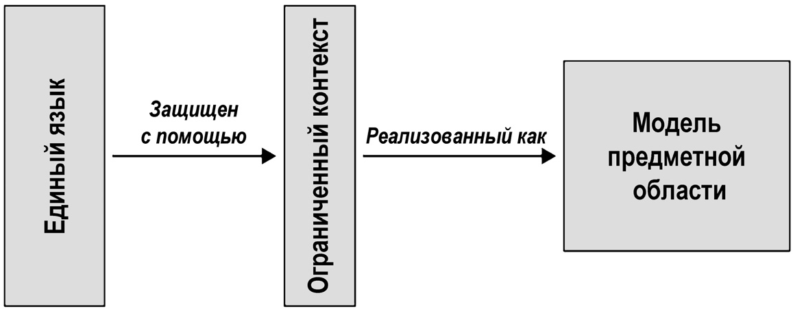{width="3.8729779090113734in"
height="1.513332239720035in"}

> Рис. П1.3. Внедрение концепций стратегического проектирования в наше
> понимание предметно-ориентированного проектирования

Конечно, здесь отсутствовала важная часть предметно-ориентированного
проекти- рования: поддомены, их типы и то, какое влияние они оказывают
на конструкцию системы.

Изначально нам хотелось выполнить свою работу как можно лучше, но в
итоге время и силы мы потратили на создание моделей предметной области
для под- держки поддоменов. Как выразился Эрик Эванс, хорошо
спроектированной будет не вся большая система. Мы узнали это на
собственном горьком опыте и хотели воспользоваться полученными знаниями
в нашем следующем проекте.

> *Применение DDD: пример из практики* \| 301

#### Ограниченный контекст № 3: Обработчики событий

После запуска CRM-системы мы заподозрили, что маркетинг и CRM попали в
ка- кой-то неявно выраженный поддомен. При каждой необходимости
модернизиро- вать процесс обработки входящих клиентских событий нам
приходилось вносить изменения как в контекст маркетинга, так и в
контекст CRM.

Поскольку концептуально этот процесс не принадлежал ни к одному из этих
кон- текстов, мы решили выделить всю эту логику в отдельный ограниченный
контекст, показанный на рис. П1.4, который назвали обработчиками
событий.

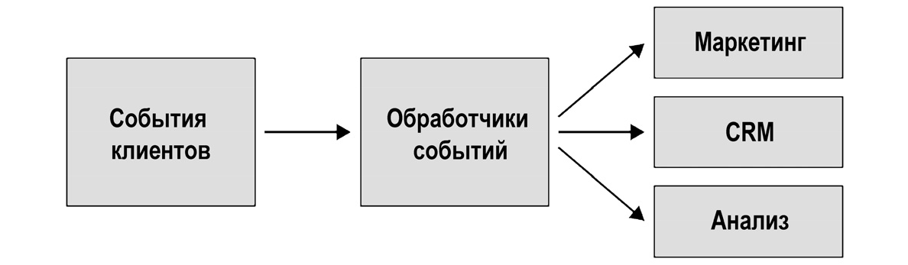{width="3.9870439632545933in"
height="1.1566655730533684in"}

> Рис. П1.4. Ограниченный контекст обработчиков событий, занимающийся
> обработкой входящих событий клиентов

Поскольку на перемещении данных мы ничего не зарабатывали и не было
готовых решений, которыми можно было бы воспользоваться, обработчики
событий напо- минали вспомогательный поддомен. Именно в таком качестве
мы все это и разра- ботали.

На этот раз не получилось ничего особенного: только слоистая архитектура
и не- сколько простых транзакционных сценариев (transaction script). Это
решение рабо- тало вполне достойно, но лишь некоторое время.

По мере развития нашего бизнеса в обработчиках событий нами
реализовывалось все больше и больше функций. Все началось с того, что
бизнес-аналитики (BI) по- просили ввести несколько флагов: один флаг для
обозначения нового контакта, еще один для обозначения различных событий,
наступивших впервые, и еще несколько флагов для обозначения некоторых
бизнес-инвариантов и т. д.

В конечном итоге эти простые флаги превратились в настоящую
бизнес-логику со сложными правилами и инвариантами. То, что начиналось
как транзакционный сценарий (transaction script), превратилось в
полноценный основной поддомен биз- неса.

К сожалению, когда сложная бизнес-логика реализуется в виде
транзакционных сценариев, ничего хорошего из этого не выходит. Поскольку
наш проект не был адаптирован под сложную бизнес-логику, у нас получился
огромный ком грязи. Каждая модификация кодовой базы обходилась все
дороже и дороже, качество па- дало, и мы были вынуждены переосмыслить
конструкцию обработчиков событий. Это было сделано через год. К тому
времени бизнес-логика стала настолько слож- ной, что ее можно было
решить только с помощью источников событий. Мы пре- образовали логику
обработчиков событий в модель предметной области, основан-

> 302 \| *Приложение 1*

ную на событиях, с другими ограниченными контекстами, подписавшимися на
ее события.

#### Ограниченный контекст № 4: Бонусы

Однажды менеджеры отдела продаж попросили нас автоматизировать простую,
но весьма утомительную процедуру, выполняемую ими вручную: расчет
комиссион- ных для торговых агентов.

И опять все начиналось довольно просто: раз в месяц нужно было всего
лишь под- считать процент от продаж каждого агента и отправить отчет
менеджерам. Как и прежде, мы размышляли, можно ли считать это основным
поддоменом. Ответ был отрицательным. Ничего нового мы не изобретали и не
зарабатывали на этом про- цессе, а если бы была возможность купить
существующую реализацию, то обяза- тельно бы купили. Получился не
основной и не универсальный, а еще один под- держивающий поддомен.

Мы разработали решение соответствующим образом, применив объекты
активных записей (active record), организованные «интеллектуальным»
сервисным слоем (рис. П1.5).

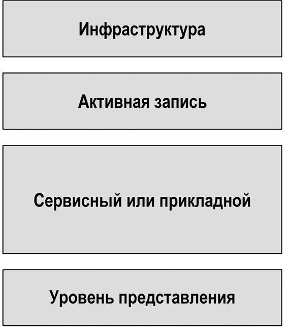{width="1.869815179352581in"
height="2.1433333333333335in"}

> Рис. П1.5. Ограниченный контекст бонусов, реализованный с
> использованием паттерна активной записи и слоистой архитектуры

Как только процесс стал автоматизированным, у всех в компании возник к
нему творческий подход. Нашим аналитикам захотелось максимально
оптимизировать процесс, попробовать разные проценты, привязать эти
проценты к объемам продаж и ценам, разблокировать дополнительные
комиссионные за достижение разных це- лей и т. д. А теперь угадайте,
когда пришел в негодность первоначальный проект?

Кодовая база снова начала превращаться в неуправляемый ком грязи.
Добавление новых функций обходилось все дороже и дороже, полезли ошибки,
а когда дело касается денег, даже самая маленькая ошибка может иметь
БОЛЬШИЕ послед- ствия.

> *Применение DDD: пример из практики* \| 303

###### Проектирование: Дубль два

Все вышло так же, как и в случае с проектом обработчиков событий, настал
мо- мент, когда ситуация стала невыносимой. Нам пришлось выбросить
старый код и переписать решение с нуля, на этот раз в виде модели
предметной области, осно- ванной на событиях.

И так же, как и в случае с обработчиками событий, бизнес-область
изначально была отнесена к категории вспомогательных. По мере развития
системы она постепенно мутировала в основной поддомен: мы нашли способы
заработать на этих процес- сах. Но между этими двумя ограниченными
контекстами есть явная разница.

###### Единый язык {#единый-язык-1}

Для бонусного проекта у нас был единый язык. И даже несмотря на то, что
перво- начальная реализация была основана на активных записях, у нас все
еще мог быть единый язык.

По мере усложнения предметной области язык, используемый экспертами этой
области, также все более усложнялся. И в какой-то момент его уже нельзя
было смоделировать посредством активных записей! Осознав это, мы смогли
заметить необходимость изменения проекта гораздо раньше, чем в проекте
обработчиков событий. Были сэкономлены уйма времени и усилий, поскольку
благодаря единому языку мы не пытались вставить квадратный колышек в
круглое отверстие.

###### Классическое понимание

> предметно-ориентированного проектирования

К этому моменту наше ви´дение предметно-ориентированного проектирования
окончательно превратилось в классическое: единый язык, ограниченные
контексты и различные типы поддоменов, каждый из которых разрабатывается
в соответствии со своими потребностями (см. рис. П1.6).

Но для нашего следующего проекта ситуация приняла совершенно неожиданный
оборот.

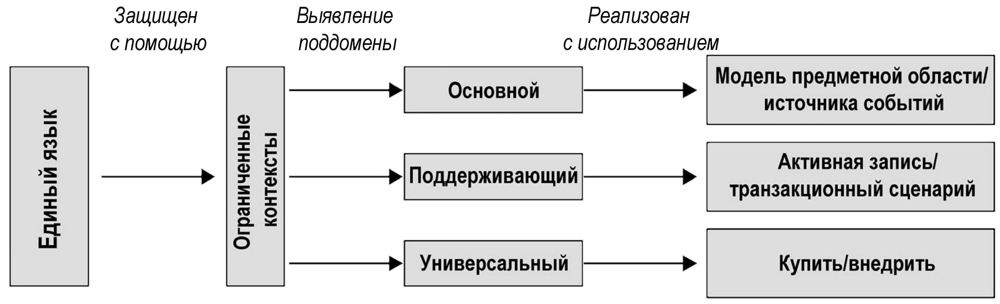{width="5.17465113735783in"
height="1.5778116797900263in"}

> Рис. П1.6. Классическая модель предметно-ориентированного
> проектирования
>
> 304 \| *Приложение 1*

#### Ограниченный контекст № 5: Центр маркетинга

Наше руководство искало новое прибыльное направление. Решено было
попробо- вать использовать нашу способность создавать огромное
количество лидов и про- давать их более мелким клиентам, с которыми мы
раньше не работали. Этот проект получил название «Центр маркетинга».

Поскольку руководство определило эту предметную область бизнеса как
новую возможность получения прибыли, она явно относилась к основной
области бизнеса. Следовательно, с позиции проектирования мы расчехлили
тяжелую артиллерию: модель предметной области, основанную на событиях, и
CQRS. Кроме того, в то время начало входить в обиход новомодное слово
«микросервисы». И мы решили попробовать.

Наше решение выглядело как реализация, показанная на рис. П1.7.

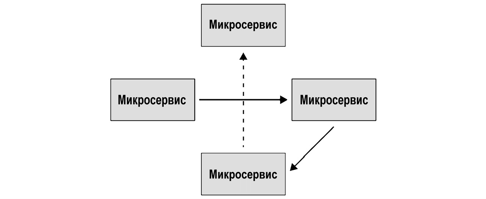{width="4.381926946631671in"
height="1.7799989063867017in"}

> Рис. П1.7. Реализация ограниченного контекста центра маркетинга,
> основанная на микросервисах

Небольшие сервисы, каждый со своей собственной базой данных, с
синхронным и асинхронным обменом данными между ними: на бумаге это
выглядело как идеаль- ное проектное решение. Но на практике все вышло
несколько иначе.

###### Микро --- что?

Мы подошли к микросервисам с весьма наивными понятиями, полагая, что чем
меньше сервис, тем лучше. Итак, границы сервисов были нарисованы вокруг
агре- гатов. На жаргоне DDD каждый агрегат стал, по сути, ограниченным
контекстом.

Опять же, изначально этот проект выглядел великолепно. Он позволял нам
реали- зовывать каждый сервис в соответствии с его конкретными
потребностями. Только один из них будет использовать паттерн «События
как источник данных» (Event Sourcing), а остальные будут агрегатами на
основе состояния. Более того, все они могли поддерживаться и развиваться
независимо друг от друга.

Но по мере разрастания системы эти сервисы становились все более и более
говор- ливыми. В конце концов, почти каждому сервису для выполнения ряда
операций потребовались данные от всех других сервисов. И что в
результате? То, что заду-

> *Применение DDD: пример из практики* \| 305

мывалось как несвязанная система, в итоге превратилось в распределенный
моно- лит, с сопровождением которого был сущий кошмар.

К сожалению, с этой архитектурой была связана еще одна, гораздо более
сущест- венная проблема. Для реализации центра маркетинга использовались
самые слож- ные паттерны моделирования предметной области: модель
предметной области (domain model) и модель предметной области,
основанная на событиях (event- sourced domain model). Все сервисы были
тщательно проработаны. Но все это было напрасно.

###### Реальная проблема

Несмотря на то что бизнес считал центр маркетинга основным поддоменом, в
нем не было особой технической сложности. За всей этой сложной
архитектурой стояла очень простая бизнес-логика, настолько простая, что
ее можно было реализовать с помощью простых активных записей.

Как оказалось, бизнесмены искали, как извлечь прибыль за счет
использования на- ших уже существующих отношений с другими компаниями, а
не за счет использо- вания хитрых алгоритмов.

Техническая сложность оказалась намного выше бизнес-сложности. Чтобы
описать такие несоответствия в сложностях, мы воспользуемся понятием
«непреднамерен- ная сложность» (accidental complexity), и наш
первоначальный проект оказался именно таким. В результате система была
перепроектирована.

### Обсуждение

Мне хотелось рассказать вам о пяти ограниченных контекстах: маркетинг,
CRM, обработчики событий, бонусы и центр маркетинга. Конечно, столь
обширная пред- метная область, которая была у Marketnovus, повлекла за
собой определение гораз- до большего количества ограниченных контекстов,
но я хотел поделиться именно теми из них, которые дали нам наибольший
объем полезной информации.

Итак, рассмотрев пять ограниченных контекстов, давайте посмотрим на все
это с другой точки зрения. Как применение или неправильное применение
основных элементов предметно-ориентированного проектирования повлияло на
наши резуль- таты? Давайте посмотрим.

#### Единый язык {#единый-язык-4}

Исходя из моего опыта, единый язык --- это «основной поддомен»
предметно- ориентированного проектирования. Возможность говорить на
одном и том же язы- ке с нашими экспертами предметной области была для
нас незаменимым преиму- ществом. Она оказалось гораздо более эффективным
способом обмена знаниями, чем проведение тестов или составление и
изучение документации.

> 306 \| *Приложение 1*

Более того, наличие единого языка стало главным предвестником успеха
проекта:

- В начале нашего пути используемая система маркетинга была далека от
  совер- шенства. Но надежный единый язык компенсировал архитектурные
  недостатки и позволил нам достичь целей проекта.

- В контексте CRM мы потерпели фиаско. Совершенно непреднамеренно мы
  ста- ли пользоваться двумя языками, описывающими одну и ту же область
  бизнеса. Мы стремились запустить надлежащий проект, но из-за проблем с
  обменом дан-

> ными он превратился в сущий бардак.

- Проект обработки событий начинался как простой вспомогательный
  поддомен, и мы не вкладывались в единый язык. Потом, когда сложность
  начала расти, мы горько пожалели об этом. Если бы все начать с единого
  языка, на проект ушло бы гораздо меньше времени.

- В проекте бонусов бизнес-логика усложнилась на несколько порядков, но
  еди- ный язык позволил гораздо раньше заметить необходимость изменения
  страте- гии реализации.

Следовательно, единый язык совсем не то, без чего можно было бы
обойтись, неза- висимо от того, над чем ведется работа: над основным,
вспомогательным или уни- версальным поддоменом.

Мы поняли важность вклада в единый язык на самом раннем этапе. Для
«исправле- ния» единого языка, если на нем уже долго говорят в компании
(как это было в случае с нашей CRM-системой), требуются огромные усилия
и неимоверное тер- пение. Нам удалось исправить реализацию. Это было
непросто, но в конце концов мы это сделали. Но это не относилось к
языку. В течение многих лет некоторые специалисты все еще использовали
противоречивые понятия, определенные в перво- начальной реализации.

#### Поддомены {#поддомены-4}

Как уже говорилось в *главе 1*, существуют три типа поддоменов ---
основной (core), вспомогательный (supporting) и универсальный (generic),
--- и важно определить, какие именно поддомены следует задействовать при
разработке решения.

Определить тип поддомена порой непросто. Из того, что говорилось в
*главе 1*, нам известно, что важно определить гранулярность поддоменов,
релевантную созда- ваемой системе. Например, инициатива по созданию
нашего центра маркетинга должна была стать дополнительным источником
прибыли компании. Но программ- ный аспект этой функции был отнесен к
вспомогательному поддомену, а использо- вание отношений и контрактов с
другими компаниями фактически создавало кон- курентное преимущество, что
было свойством настоящего основного поддомена.

Кроме того, как стало известно из *главы 11*, определением типа
поддомена дело не заканчивается. Следует также знать о возможной
эволюции поддомена с переходом в поддомен другого типа. В Marketnovus
наблюдались практически все возможные комбинации изменений типов
поддоменов:

> *Применение DDD: пример из практики* \| 307

- И обработка событий, и бонусы начинались как вспомогательные поддомены
  (Supporting Subdomain), но как только были обнаружены способы
  монетизации этих процессов, они стали нашими основными поддоменами
  (Core Subdomains).

- В контексте маркетинга был внедрен свой собственный креативный
  каталог. В этом не было ничего особенного или сложного. Но через
  несколько лет вышел проект с открытым исходным кодом, предлагавший еще
  более широкий спектр возможностей по сравнению с тем, что у нас было
  изначально. Как только наша

> реализация была заменена этим продуктом, вспомогательный поддомен
> (Sup- porting Subdomain) превратился в универсальный (Generic).

- В контексте CRM у нас был алгоритм, позволявший выявлять наиболее
  перспек- тивные лиды. Со временем дорабатывали этот поддомен и
  пробовали разные реализации, но в итоге все заменили моделью машинного
  обучения, работаю- щей в управляемой службе облачного поставщика. С
  технической точки зрения

> основной (Core) поддомен стал универсальным (Generic).

- Как уже было показано, наша система центра маркетинга вначале
  считалась основным поддоменом, но в итоге стала вспомогательным,
  поскольку конку- рентное преимущество находилось в совершенно другом
  измерении.

При прочтении книги выяснилось, что типы поддоменов оказывают влияние на
широкий спектр проектных решений. Неспособность правильно определить
поддо- мен может обойтись весьма недешево, как, например, в
рассмотренных нами слу- чаях с обработчиками событий и центром
маркетинга.

###### Сопоставление проектных решений с поддоменами

Работая в компании Marketnovus, я придумал прием защиты от неверного
опреде- ления типов поддоменов: нужно поменять местами отношения между
поддоменами и тактическими проектными решениями. Выберите паттерн
реализации бизнес- логики. Не нужно ничего ни преувеличивать, ни
преуменьшать, просто выберите паттерн, соответствующий вашим
требованиям. Затем сопоставьте выбранный пат- терн с подходящим типом
поддомена. И наконец, проверьте выявленный тип под- домена с позиции
бизнеса.

Изменение взаимосвязи между поддоменами и тактическими проектными реше-
ниями приводит к дополнительному диалогу между вами и бизнесом. Иногда
дело- вые люди нуждаются в нас так же, как и мы в них.

Если они думают, что что-то является основным бизнесом, но вы можете
взломать всё это за один день, то это либо признак того, что вам нужно
выискивать более мел- кие поддомены, либо следует поднять вопросы о
жизнеспособности этого бизнеса.

С другой стороны, все становится куда интереснее, если поддомен
считается бизне- сом вспомогательным (Supporting), но может быть
реализован только с использо- ванием передовых методов моделирования:
модели предметной области или же модели предметной области, основанной
на событиях (Event Sourcing).

Во-первых, бизнесмены могли проявить в своих требованиях излишнюю
изобрета- тельность и непреднамеренно столкнуться со сложностью бизнеса.
Бывает. В таком случае требования могут и, вероятно, должны быть
упрощены.

> 308 \| *Приложение 1*

Во-вторых, возможно, бизнесмены еще не осознали, что используют этот
поддомен для получения дополнительных конкурентных преимуществ. Именно
так и про- изошло в случае с бонусным проектом. Обнаружив это
несоответствие, вы помо- гаете бизнесу быстрее находить новые источники
прибыли.

###### Не игнорируйте боль

Самое главное, при реализации бизнес-логики системы никогда ненужно
игнори- ровать «болевые ощущения». Они являются важным сигналом для
развития и улучшения либо модели предметной области, либо тактического
дизайна. В по- следнем случае это означает, что поддомен эволюционировал
и пришло время вер- нуться и переосмыслить его тип и стратегию
реализации. Если тип изменился, по- говорите со специалистами предметной
области, чтобы понять бизнес-контекст. Если вам нужно перепроектировать
реализацию, чтобы она соответствовала новым реалиям бизнеса, не бойтесь
внесения таких изменений. Как только решение о том, как смоделировать
бизнес-логику, принято вполне осознанно и вы знаете обо всех возможных
вариантах, становится намного проще реагировать на подобное изме- нение
и проводить рефакторинг кода с использованием сложного паттерна.

#### Границы ограниченных контекстов

В компании Marketnovus нами было испробовано довольно-таки большое
количе- ство стратегий выявления границ ограниченных контекстов:

- Лингвистические границы: мы разделили наш первоначальный монолит на
  кон- тексты маркетинга и CRM, чтобы защитить их единые языки.

- Границы на основе поддоменов: многие из наших поддоменов были
  реализова- ны в своих собственных ограниченных контекстах; например,
  обработчики со- бытий и бонусы.

- Границы на основе сущностей: как уже ранее говорилось, этот подход
  имел в проекте центра маркетинга весьма ограниченный успех, но работал
  в других проектах.

- Суицидальные границы: как вы, наверное, помните, в начальной
  реализации проекта CRM мы разбили агрегат на два разных ограниченных
  контекста. Нико- гда не пытайтесь повторить это у себя дома, ладно?

Какую из этих стратегий можно порекомендовать? Для всех случаев жизни не
под- ходит ни одна из них. Исходя из нашего опыта, гораздо безопаснее
было извлечь сервис из более крупного сервиса, чем начинать со слишком
маленьких сервисов. Следовательно, мы отдаем предпочтение изначально
более широким границам с их последующим разбиением на более мелкие по
мере приобретения новых знаний об особенностях бизнеса. А насколько
широки должны быть эти начальные границы? Как уже говорилось в *главе
11*, все решения восходят к сфере бизнеса: чем меньше вы знаете о
бизнес-сфере, тем шире начальные границы.

Эта эвристика сослужила нам хорошую службу. Например, в случае
ограниченных контекстов маркетинга и CRM каждый из них включал в себя
несколько поддоме- нов. Со временем мы постепенно разбили изначально
широкие границы на микро-

> *Применение DDD: пример из практики* \| 309

сервисы. Как уже выяснилось в *главе 14*, на протяжении всей эволюции
ограничен- ных контекстов мы оставались в диапазоне безопасных границ.
Нам удалось избе- жать выхода за пределы безопасных границ, выполнив
реструктуризацию только после получения достаточного количества знаний в
предметной области бизнеса.

### Вывод {#вывод-17}

В историях с ограниченными контекстами компании Marketnovus я показал,
как наше ви´дение предметно-ориентированного проектирования менялось с
течением времени (чтобы освежить знания, обратитесь к рис. П1.6):

- Чтобы узнать о предметной области как можно больше, мы всегда
  совместно с экспертами предметной области начинали с создания единого
  языка.

- В случае конфликтующих моделей мы разбивали решение на ограниченные
  контексты, следуя при этом лингвистическим границам единого языка.

- В каждом ограниченном контексте мы определяли границы поддоменов и их
  типы.

- Для каждой подобласти мы выбрали стратегию реализации, используя
  эвристи- ку тактического проектирования.

- Мы сверяли первоначальные типы подобластей с теми, что были получены в
  результате тактического проектирования. В случае несоответствия типов
  мы обсуждали их с представителями бизнеса. Иногда этот диалог приводил
  к изме- нению требований, поскольку мы могли предоставить владельцам
  продукта но- вый взгляд на проект.

- По мере приобретения дополнительных знаний в предметной области и в
  случае необходимости мы разбивали ограниченные контексты на контексты
  с более узкими границами.

Если сравнить это ви´дение предметно-ориентированного проектирования с
тем, с которого мы начали, я бы сказал, что основное отличие состоит в
том, что мы перешли от «повсюду агрегаты» к «повсюду единый язык».

На прощание, поскольку я рассказал вам историю о том, как все начиналось
в ком- пании Marketnovus, хочу поделиться тем, чем все закончилось.

Компания очень быстро стала прибыльной, и в конце концов ее купил
крупнейший клиент. Конечно, я не могу приписать успех компании
исключительно предметно- ориентированному проектированию. Но все эти
годы мы постоянно находились в «режиме стартапа».

То, что мы называем «режимом стартапа» в Израиле, во всем остальном мире
назы- вается «хаосом»: постоянно меняющиеся бизнес-требования и
приоритеты, жесткие временны´ е рамки и крошечная команда по
исследованиям и разработкам. Методо- логия DDD позволила нам справиться
со всеми этими сложностями и продолжать поставлять работоспособные
программные продукты. Следовательно, когда я огля- дываюсь назад, то
понимаю, что ставка, которую мы сделали на предметно-ори- ентированное
проектирование, полностью окупилась.

ПРИЛОЖЕНИЕ 2

## Ответы на вопросы упражнений

### Глава 1

1.  Г: Б и В. Конкурентные преимущества обеспечиваются только основными
    под- доменами, отличающими компанию от других игроков в ее отрасли.

2.  Б: Для обычной. Обычные поддомены могут быть сложными, но не дают
    ника- ких конкурентных преимуществ. Следовательно, предпочтительнее
    использо- вать существующее, проверенное в боях решение.

3.  А: Основная. Ожидается, что основные поддомены будут наименее
    стабильны- ми, поскольку это те самые области, в которых компания
    стремится предостав- лять новые решения, часто требующие приложения
    серьезных совместных уси- лий для поиска наиболее оптимизированного
    решения.

4.  Предметной областью WolfDesk являются системы управления службой
    под- держки.

5.  Можно выделить следующие основные подобласти, позволяющие WolfDesk
    от- личаться от конкурентов в лучшую сторону и поддерживать свою
    бизнес- модель:

    - Алгоритм управления жизненным циклом заявок, предназначенный для
      закрытия заявок и таким образом побуждающий пользователей
      открывать новые заявки.

    - Система выявления случаев мошенничества для предотвращения
      злоупот- реблений ее бизнес-моделью.

    - Поддержка автопилота, упрощающего работу агентов службы поддержки
      арендаторов и еще больше сокращающего срок жизни заявок.

6.  В описании компании можно выделить следующие вспомогательные поддо-
    мены:

    - Управление категориями заявок пользователя (имеется в виду
      пользователь ПО, распространяющегося, например, по модели SaaS).

    - Управление продуктами арендатора, в отношении которых клиенты
      могут открывать заявки в службе поддержки.

    - Ввод графиков работы агентов поддержки арендатора.

> *Ответы на вопросы упражнений* \| 311

7.  В описании компании можно выделить следующие универсальные
    поддомены:

    - Стандартные для отрасли способы аутентификации и авторизации
      пользова- телей.

    - Использование внешних провайдеров для аутентификации и авторизации
      (SSO).

    - Бессерверная (serverless) вычислительная инфраструктура,
      используемая компанией для обеспечения гибкой масштабируемости и
      минимизации вы- числительных затрат на подключение новых
      арендаторов.

### Глава 2

1.  Г: Поделиться своими знаниями и пониманием предметной области должны
    все заинтересованные стороны проекта.

2.  Г: При общении, связанном с проектом, следует использовать единый
    язык. Ис- ходный код программного продукта также должен «говорить»
    на его едином языке.

3.  Клиенты WolfDesk --- *пользователи*. Чтобы начать пользоваться
    системой, поль- зователи проходят быстрый процесс *адаптации*.
    Модель тарификации компании основана на количестве *заявок*,
    открытых в течение *периода тарификации*. Алгоритм управления
    *жизненным циклом заявок* обеспечивает автоматическое закрытие
    *неактивных заявок*. Алгоритм *выявления мошенничества* WolfDesk не
    позволяет пользователям злоупотреблять его бизнес-моделью. Функция
    *автопи- лота поддержки* пытается автоматически найти решения для
    новых заявок. *За- явка* относится к *категории* поддержки и связана
    с *продуктом*, для которого пользователь предоставляет поддержку.
    *Агент поддержки* может обрабатывать заявки только в *рабочее
    время*, определяемое его *графиком смен*.

### Глава 3

1.  Б: Ограниченные контексты проектируются, а поддомены выявляются.

2.  Г: Всего вышеперечисленного. Ограниченный контекст --- это граница
    модели, а модель применима только в своем ограниченном контексте.
    Ограниченные кон- тексты реализуются в независимых проектах и
    решениях, что позволяет каждо- му ограниченному контексту иметь
    собственный жизненный цикл разработки. И наконец, ограниченный
    контекст должен быть реализован одной командой разработчиков, и
    следовательно, он также является границей владения.

3.  Г: Все зависит от конкретных обстоятельств. Идеального размера
    ограниченного контекста для всех проектов и случаев просто не
    существует. На оптимальный объем ограниченного контекста влияют
    различные факторы, например модели, организационные ограничения и
    нефункциональные требования.

4.  Г: Верны ответы Б и В. Ограниченный контекст должен принадлежать
    только одной команде. В то же время одна и та же команда может
    владеть несколькими

> 312 \| *Приложение 2*
>
> ограниченными контекстами. Можно с уверенностью предположить, что
> рабо- чая модель, реализующая жизненный цикл заявок, будет отличаться
> от той, которая используется для выявления мошенничества и функции
> поддержки автопилота. Алгоритмы выявления мошенничества обычно требуют
> более ана- литического моделирования, тогда как функция автопилота,
> скорее всего, будет использовать модель, оптимизированную для
> использования с алгоритмами машинного обучения.

### Глава 4

1.  Г: Разные пути. Этот шаблон не обходится без дублирования
    функциональности в нескольких ограниченных контекстах. Дублирования
    бизнес-логики, сложной, изменчивой и критической для бизнеса,
    следует избегать любой ценой.

2.  А: Основному поддомену. Основной поддомен, скорее всего, будет
    использо- вать уровень защиты от изменений, чтобы защититься от
    неэффективных моде- лей, предоставляемых вышестоящими сервисами, или
    для воспрепятствования частым изменениям в вышестоящих публичных
    интерфейсах.

3.  А: Основному поддомену. В основном поддомене, скорее всего,
    реализуется служба с открытым протоколом. Отделение ее модели
    реализации от публично- го интерфейса (опубликованного языка) делает
    более удобным развитие модели основного поддомена, не затрагивая ее
    нижестоящих потребителей.

4.  Б: Общее ядро. Паттерн общего ядра является исключением из правил
    владения одной командой в отношении ограниченных контекстов. Он
    определяет незна- чительную часть модели, которая является общей и
    может развиваться одновре- менно в нескольких ограниченных
    контекстах. Общая часть модели всегда должна быть как можно меньше.

### Глава 5

1.  В: Для реализации основного поддомена нельзя использовать ни один из
    этих шаблонов. И транзакционный, и активная запись хорошо подходят
    для случая простой бизнес-логики, а основные поддомены включают в
    себя более сложную бизнес-логику.

2.  Г: Могут обнаружиться все перечисленные проблемы:

    - Если выполнение завершается ошибкой после строки 6, вызывающий
      объект повторяет операцию, и метод FindLeastBusyAgent выбирает
      того же агента, а счетчик ActiveTickets агента увеличивается более
      чем на 1.

    - Если после строки 6 выполнение завершается неудачно, но вызывающая
      сто- рона не повторяет операцию, счетчик будет увеличен, а сама
      заявка не будет создана.

    - Если выполнение завершается ошибкой после строки 12, заявка
      создается и назначается, но уведомление в строке 14 не
      отправляется.

> *Ответы на вопросы упражнений* \| 313

3.  Если выполнение завершается ошибкой после строки 12, а вызывающая
    сторона повторяет операцию (и она завершается успешно), одна и та же
    заявка будет со- хранена и назначена дважды.

4.  Достойными кандидатами для реализации в виде транзакционного
    сценария или активной записи являются все вспомогательные подобласти
    WolfDesk, посколь- ку их бизнес-логика относительно проста:

    - Управление категориями заявок пользователя.

    - Управление продуктами пользователя, в отношении которых клиенты
      могут подавать заявки в службу поддержки.

    - Ввод графиков работы агентов поддержки пользователя.

### Глава 6

1.  В: Объекты-значения неизменяемы. *Кроме того, они могут содержать
    как данные, так и поведение.*

2.  Б: Агрегаты должны разрабатываться как можно в меньшем объеме с
    неизмен- ным выполнением требований о согласованности данных
    предметной области.

3.  Б: Для обеспечения правильных транзакционных границ.

4.  Г: А и В.

5.  Б: Агрегат инкапсулирует всю свою бизнес-логику, а бизнес-логика,
    управляю- щая активной записью, может находиться за ее пределами.

### Глава 7

1.  А: События предметной области используют объекты-значения для
    описания того, что произошло в самой предметной области.

2.  В: Можно проецировать несколько представлений состояния, к которым
    впо- следствии всегда можно будет добавить дополнительные проекции.

3.  Г: Справедливы утверждения Б и В.

4.  Достойным кандидатом для реализации в качестве модели предметной
    области, основанной на событиях, является алгоритм жизненного цикла
    заявки. Порож- дение событий предметной области для всех переходов
    состояний может сде- лать более удобным проецирование дополнительных
    представлений состояний, оптимизированных для алгоритма выявления
    мошенничества и поддержки функций автопилота.

### Глава 8

1.  Г: А и В.

2.  Г: Б и В.

> 314 \| *Приложение 2*

3.  В: На слое инфраструктуры.

4.  Д: А и Г.

5.  Работа с несколькими моделями, проецируемыми паттерном CQRS, не
    противо- речит требованию ограниченного контекста быть границей
    модели, поскольку только одна из моделей определяется как источник
    истины и используется для внесения изменений в состояния агрегатов.

### Глава 9

1.  Г: Б и В.

2.  Б: Обеспечить надежную публикацию сообщений.

3.  Паттерн ящика исходящих сообщений (outbox pattern) можно
    использовать для реализации асинхронного выполнения внешних
    компонентов. Например, им можно воспользоваться для отправки
    сообщений электронной почты.

4.  Д: Правильными являются утверждения А и Г.

### Глава 10

1.  Модель предметной области, основанная на событиях, архитектура CQRS
    и стратегия тестирования, ориентированная на модульные тесты.

2.  Смены можно моделировать как активные записи, работающие в слоистой
    архи- тектуре. Стратегия тестирования должна в первую очередь
    сосредоточиться на интеграционных тестах.

3.  Бизнес-логика может быть реализована в виде транзакционного
    сценария, орга- низованного в слоистой архитектуре. Что же касается
    тестирования, то стоит со- средоточиться на сквозных тестах,
    проверяя весь процесс интеграции.

### Глава 11

1.  A: Партнерство с клиентом-поставщиком (конформист, предохранительный
    слой или сервис с открытым протоколом). По мере разрастания
    организации ко- мандам может стать все труднее интегрировать свои
    ограниченные контексты ситуативным образом. В результате они станут
    переходить на более формаль- ную схему интеграции.

2.  Г: А и Б. Вариант A подходит, потому что ограниченные контексты идут
    разны- ми путями, когда стоимость дублирования ниже накладных
    расходов на совме- стную работу. Вариант В не подходит, потому что
    дублировать реализацию основной подобласти --- хуже не придумаешь.
    Следовательно, правильным вариантом является Б, поскольку паттерн
    разных путей может использоваться для вспомогательных и обычных
    поддоменов.

3.  Г: Б и В.

> *Ответы на вопросы упражнений* \| 315

4.  Е: А и В.

5.  Достигнув определенного уровня роста, компания WolfDesk может пойти
    по стопам Amazon и внедрить собственную вычислительную платформу,
    чтобы еще больше оптимизировать свои возможности гибкого
    масштабирования и расходы на инфраструктуру.

### Глава 12

1.  Г: Всех представителей заинтересованных сторон, обладающих знаниями
    в об- ласти изучаемой предметной области.

2.  Е: Веские причины для организации EventStorming изложены абсолютно
    во всех ответах.

3.  Д: Возможными результатами EventStorming являются все ответы.
    Ожидаемый результат зависит от первоначальной цели проведения
    воркшопа.

### Глава 13

1.  Б: Анализ предметной области организации и ее стратегии.

2.  Г: А и Б.

3.  В: А и Б.

4.  Агрегат с границей в пределах ограниченного контекста может сделать
    все дан- ные ограниченного контекста частью одной большой
    транзакции. Также вполне вероятно, что проблемы с
    производительностью при таком подходе будут оче- видны с самого
    начала. Как только это произойдет, транзакционная граница будет
    удалена. В результате больше нельзя будет предполагать, что информа-
    ция, содержащаяся в агрегате, абсолютно непротиворечива.

### Глава 14

1.  А: Все микросервисы являются ограниченными контекстами. *Но не все
    ограни- ченные контексты являются микросервисами*.

2.  Г: Знание предметной области и ее тонкостей раскрывается за
    пределами серви- са и отражается в его публичном интерфейсе.

3.  В: Границы между ограниченными контекстами (самые широкие) и
    микросерви- сами (самые узкие).

4.  Г: Решение зависит от предметной области.

### Глава 15

1.  Г: Утверждения А и Б верны.

2.  Б: Передача состояния с помощью события.

> 316 \| *Приложение 2*

3.  А: Сервис с открытым протоколом.

4.  Б: S2 должен публиковать публичные уведомления о событиях,
    сигнализирую- щие S1 о необходимости выдачи асинхронного запроса для
    получения самой актуальной информации.

### Глава 16

1.  Г: Верны утверждения А и В.

2.  Б: Сервис с открытым протоколом. Одним из опубликованных языков,
    предос- тавляемым сервисом с открытым протоколом, могут стать данные
    OLAP, опти- мизированные для аналитической обработки.

3.  В: CQRS. Паттерн CQRS может использоваться для создания проекций
    модели OLAP из модели транзакций.

4.  А: Ограниченные контексты.

## Предметный указатель

##### C

> CRUD-операции 97

##### D

> DDD 33, 47. *См. также* Предметно-ориентиро- ванное проектирование

- и событийно-ориентированная архитектура 256

##### E

> ECST-сообщение *См.* Передача состояния
>
> EDA *См.* Событийно-ориентированная архитектура
>
> EventStorming 210, 227, 230

- альтернативный сценарий 213

- выявление команд и правил 215

- ключевые события 214

- проблемные места 214

- успешный сценарий 213

##### G

> Gherkin-тесты 58

##### А

> Агрегат 111, 123, 125, 134, 200, 218

- граница транзакции 114

- границы микросервисов 250

- извлечение неопубликованных событий 173

- интеграция 170

- корень 117

- непротиворечивость данных 116

- основанный на событиях 233

- основанный на состояниях 233

- сага 174, 177, 181

- соблюдение согласованности 111

- ссылка на другие агрегаты 116 Активная запись, реализация 97
  Аналитические модели 271, 274, 281 Архитектура N-Tier *См.*
  Многоуровневая

> архитектура
>
> Архитектура портов и адаптеров 152, 162

- интеграция инфраструктурных компонентов 154 Архитектура управления
  аналитическими данными

> 271
>
> Архитектурное проектирование 70
>
> Архитектурный паттерн 149, 188

- слоистая архитектура 145

> Б
>
> Бизнес-логика 90, 97, 102, 144, 228

- архитектурные паттерны, сопоставление 144

- преодоление сложностей 121

- реализация 79

> Большой ком грязи 23, 205, 226, 242, 264

##### Г

> Гексагональная архитектура *См.* Архитектура портов и адаптеров
>
> Границы 70

- владения 70

- модели *См.* Ограниченный контекст

- ограниченные контексты в реальной жизни 71

- семантические области 71

- физические 70

##### Д

> Данные аналитической обработки 271 Декомпозиция 249
>
> Дерево тактических проектных решений 191 Диаграмма отношений сущностей
> 63 Доменный сервис 119, 123
>
> 318 \| *Предметный указатель*

##### Е

> Единый язык 53, 60, 63, 65, 119, 224, 235

- глоссарий 58

- неоднозначные понятия 55

- ограниченный контекст 66

- понятия-синонимы 55

- развитие 230

- сложности разработки 59

- согласованность 55, 77

- сценарии 54

- язык бизнеса 54

##### Ж

> Жизненный цикл объекта 52

##### З

> Задача коммивояжера 46

##### И

> Измерение 274

- таблица 274 Интерфейс

- общедоступный 90

- открытый 246

- предписанный 240

- публичный 240

> Источник данных 202, 236
>
> Источник событий 156

##### К

> Карта контекстов (Context Map)

- ограничения 86

- поддержка в актуальном состоянии 86 Контекст обмена 166

##### Л

> Луковичная архитектура *См.* Архитектура портов и адаптеров

##### М

> Микросервисы

- архитектура 244

- границы 248

- доступ 241

- модули 246

- ограниченные контексты 248

- поддомены 251, 252

- интеграция 242

- наивная декомпозиция 242

- определение 241

- оптимизация 245

- цель проектирования 243

> Многоуровневая архитектура 152 Модели чтения *См.* Проекции

- асинхронные проекции 159

- догоняющая подписка 158

- проецирование 157

- синхронные проекции 158 Модель предметной области 56

- абстракция 57

- границы 70

- инструменты 58

- моделирование 56, 57

- непрерывная работа 57 Модули

- глубокие 246

- функция и логика 245 Мультипарадигменное моделирование 156

##### О

> Общение 51
>
> Объект-значение 104, 109, 110, 122, 125
>
> Ограниченный контекст 68, 70, 71, 77, 161, 164, 184,
>
> 206, 218, 236, 282

- контракт 77

- область применения 66 Озеро данных 279, 283

> Операция извлечение-преобразование-загрузка 96
>
> Опубликованный язык 167

##### П

> Паттерн 64, 77, 102

- API-шлюза 166, 168

- CQRS 93, 133, 156, 162, 188, 202

- CQRS модель выполнения команд 157

- CQRS область применения 161

- CQRS разделение моделей 160

- CQRS реализация 156

- активная запись 97, 98, 100, 102, 186, 188, 198

- анемичная модель 98

- диспетчер процессов 177

- «душитель» 231

- «забываемой» полезной нагрузки 141

- исходящих сообщений 172, 175, 180

- клиент-поставщик 164

- конформист 81, 82, 87, 202, 230

- миграции *См.* Паттерн «душитель»

- микросервисов 240

- модель предметной области 100, 102, 125, 134,

> 186, 188, 199
>
> ▫ единый язык 104, 105
>
> ▫ основанная на событиях 125, 134, 186, 200

- недостатки 138

- преимущества 137

- производительность 139

> ▫ реализация 103, 108
>
> ▫ сложности 104
>
> *Предметный указатель* \| 319

- общее ядро 78, 80, 87, 164, 202, 229

- общие рамки 79

- ограниченный контекст 64, 240, 248

- партнерство 78, 80, 87, 202

- портов и адаптеров 155

- потребитель--поставщик 81

- предохранительный слой 81, 82, 87, 96, 164, 165,

> 203, 230, 253

- разделения ответственности команд и запросов 155

- разные пути 84, 87, 197, 203

- сервис с открытым протоколом 81, 83, 87, 165,

> 180, 203, 230, 252

- события как источник данных 127, 133, 256

- срезов состояния 139

- тактические 144

- транзакционный сценарий 90, 99, 102, 186, 188, 198

> Поддомен (Subdomein) 50, 67, 90, 161, 251

- архитектурные решения 45, 47

- взаимодействие поддоменов и ограниченных контекстов 68

- вспомогательный (Supporting subdomains) 45, 47,

> 48, 96, 194, 226

- выделение поддоменов 42

- изменение типа поддомена 197

- изменчивость 39

- конкурентное преимущество 35, 37

- определение границ поддоменов 41

- основной (Core subdomains) 45, 46, 48, 60, 80,

> 125, 185, 194, 225

- сложность 35, 38, 187

- согласующиеся сценарии использования 42

- сравнение 37

> ▫ ограниченных контекстов и поддоменов 67

- стратегия решения 40

- тип 34, 188

- универсальный (Generic subdomains) 45, 47, 48,

> 74, 84, 96, 186, 194, 226
>
> Поиск, реализация 130
>
> Предметная область (домен) 50, 225

- бизнес-задачи 50

- выявление экспертных знаний 51

- и поддомены 45, 46

- модель 56

- определение

- специалисты в предметной области 47

- анализ 44, 224

- моделирование 74

> Предметно-ориентированное проектирование
>
> *См.* DDD
>
> Преобразование моделей 164, 180

- агрегирование входящих данных 168

- асинхронный режим 167

- без сохранения состояния 165

- с отслеживанием состояния 168

- синхронный режим 165

> Прикладной слой *См.* Сервисный слой Принцип инверсии зависимостей 153
> Противоречивые модели 62 Процедурный код, структурирование 244
>
> Публичный интерфейс *См.* Публичый протокол Публичный протокол 83, 84

- опубликованный язык 83

##### Р

> Решение проектирования 68

##### С

> Сага 256 Связанность

- на уровне реализации 266

- по времени 265

- функциональная 266 Связь между слоями 147 Сервис 240

> Сервисный слой 148
>
> Сети данных 281, 286

- архитектура 281 Сложность

- глобальная 244

- локальная 244

> Слоистая архитектура 152, 162

- использование 151 Слой

- бизнес-логики 145, 146, 155

- доступа к данным 145, 146

- инфраструктуры *См.* Слой доступа к данным

- пользовательского интерфейса *См.* Слой представления

- пользовательского сценария *См.* Сервисный слой

- предметной области *См.* Слой бизнес-логики

- представления 145, 148

- ядра *См.* Слой бизнес-логики Событие 256

- передача состояния 260

- предметной области 262

- типы 258

- управляемое 256

> Событийно-ориентированная архитектура 256 События как источник данных
> 125
>
> События предметной области 118, 125
>
> Состояние гонки 170 Сравнение слоев и уровней 152 Стратегии
> тестирования

- пирамида тестирования 190

> ▫ перевернутая 190

- ромб тестирования 190

> Стратегия тестирования 189
>
> Сущность 110, 111

- иерархия 114

> 320 \| *Предметный указатель*

##### Т

> Тактические паттерны 164
>
> Транзакционные модели 271
>
> Транзакционный сценарий 90

- неявные распределенные транзакции 94

- отсутствие транзакционного поведения 91

- применение 96

- распределенные транзакции 93

- реализация 91

- сложности 91

- транзакционное поведение 91

##### У

> Уведомление 262

##### Ф

> Факты 272

- таблица 272

> Х
>
> Хранилище данных 276

- архитектура 280

> Хранилище событий 133

- удаление данных 141

##### Ч

> Чистая архитектура *См.* Архитектура портов и адаптеров

##### Э

> Эвристика 184, 187, 192, 225

- декомпозиции 243

- модули 245

## Об авторе

Влад (Владик) Хононов --- инженер-программист из северного Израиля,
более 20 лет занимающийся промышленной разработкой. За свою карьеру он
успел пора- ботать во множестве больших и малых компаний на разных
позициях --- от веб- мастера до главного архитектора программного
продукта. Влад ведет активную медийную деятельность --- выступает на
конференциях, пишет статьи в блоге. Он много путешествует, консультирует
по темам, связанным с предметно-ориентиро- ванным проектированием,
микросервисами, а также с программной архитектурой в целом. Влад
помогает различным компаниям точнее сориентироваться в интере- сующих их
предметных областях, привести в порядок унаследованные системы, а также
справляться со сложными архитектурными вызовами. Кроме работы он вместе
со своей супругой ухаживает за целой стаей домашних котов.
