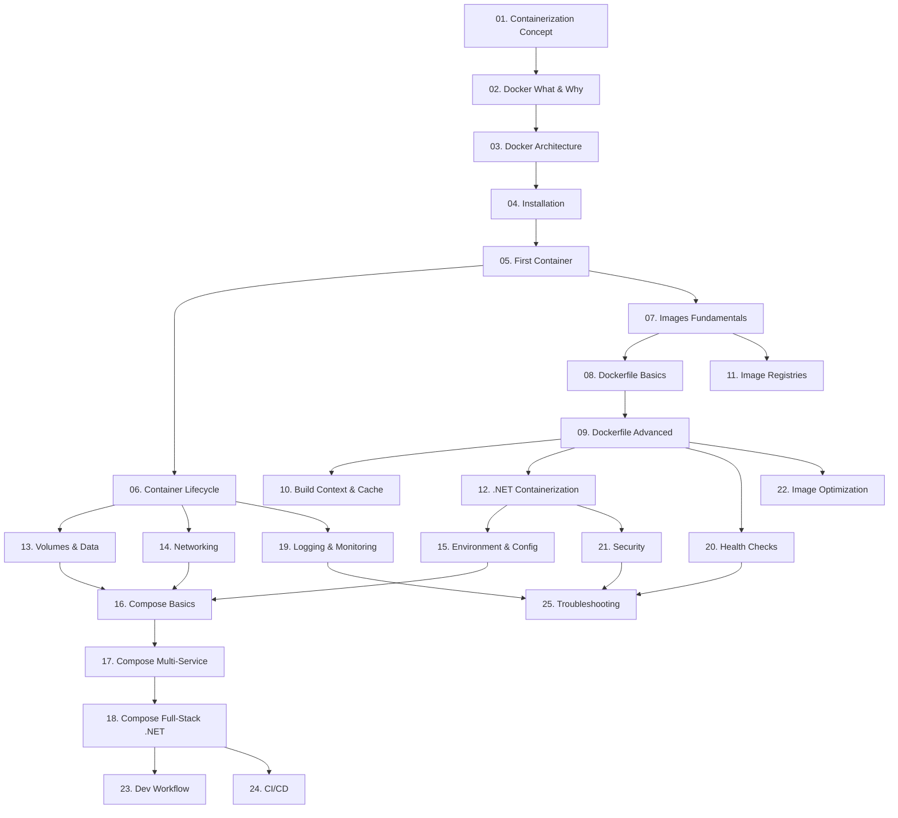

# План вивчення Docker від А до Я

## Мета

Створити повноцінний навчальний курс з Docker у розділі `content/07.tools/` проєкту kostyl.dev. Курс охоплює все від фундаментальних концепцій контейнеризації до просунутих практик, з прикладами на **C#** та акцентом на **CLI**.

## Натхнення

Структура курсу натхненна книгою **"Використання Docker" (Using Docker)** Едріена Моуета — від "навіщо контейнери?" через фундаментальні концепції до практичних сценаріїв. Книга Моуета відома своїм поступовим введенням концепцій з реальними поясненнями. Ми адаптуємо цей підхід під **сучасний Docker (2025–2026)** та стандарти якості kostyl.dev.

## Ключові принципи

> [!IMPORTANT]
>
> 1. **Академічний стиль**: Матеріал має бути викладений у книжковому, академічному стилі
> 2. **Поступовість (дозування)**: Матеріал створюється частинами (дозами) приблизно по 60 рядків за раз
> 3. **Без забігання вперед**: Кожна стаття НЕ згадує теми, які будуть вивчатися пізніше
> 4. **CLI-first**: GUI (Docker Desktop) ігнорується або згадується мінімально
> 5. **C# приклади**: Всі практичні приклади на C# (.NET)
> 6. **Тільки Docker**: Kubernetes, Swarm, та інші оркестратори — за межами курсу
> 7. **Дотримання `prompt.md`**: Text First, Code Anatomy, Storytelling, Scaffolding

---

## Структура файлів

```
content/07.tools/
├── .navigation.yml           (вже існує)
├── 01.docker/
│   ├── .navigation.yml       [NEW]
│   ├── index.md              [NEW] — Roadmap/Landing page
│   │
│   ├── 01.containerization-concept.md     [NEW]
│   ├── 02.docker-what-and-why.md          [NEW]
│   ├── 03.docker-architecture.md          [NEW]
│   ├── 04.installation.md                 [NEW]
│   ├── 05.first-container.md              [NEW]
│   ├── 06.container-lifecycle.md          [NEW]
│   ├── 07.docker-images-fundamentals.md   [NEW]
│   ├── 08.dockerfile-basics.md            [NEW]
│   ├── 09.dockerfile-advanced.md          [NEW]
│   ├── 10.build-context-and-cache.md      [NEW]
│   ├── 11.image-registries.md             [NEW]
│   ├── 12.dotnet-containerization.md      [NEW]
│   ├── 13.volumes-and-data.md             [NEW]
│   ├── 14.networking-basics.md            [NEW]
│   ├── 15.environment-and-configuration.md [NEW]
│   ├── 16.docker-compose-basics.md        [NEW]
│   ├── 17.compose-multi-service.md        [NEW]
│   ├── 18.compose-dotnet-fullstack.md     [NEW]
│   ├── 19.logging-and-monitoring.md       [NEW]
│   ├── 20.health-checks.md               [NEW]
│   ├── 21.security-fundamentals.md        [NEW]
│   ├── 22.image-optimization.md           [NEW]
│   ├── 23.development-workflow.md         [NEW]
│   ├── 24.ci-cd-with-docker.md            [NEW]
│   └── 25.troubleshooting-and-tips.md     [NEW]
```

---

## Proposed Changes

### Блок 0: Навігація та Landing

---

#### [NEW] [.navigation.yml](file:///Users/arakviel/Work/kostyl.dev/content/07.tools/01.docker/.navigation.yml)

Файл навігації для секції Docker:

```yaml
title: Docker
icon: i-simple-icons-docker
```

#### [NEW] [index.md](file:///Users/arakviel/Work/kostyl.dev/content/07.tools/01.docker/index.md)

Landing page курсу Docker з roadmap-карткою. Аналогічно до `content/01.csharp/index.md`.

---

### Блок I: Фундамент — Контейнеризація та Docker (Статті 01–04)

> Натхнення: "Part I: Background and Basics" книги Моуета — починаємо з "навіщо?" та "як це працює під капотом?"

---

#### [NEW] [01.containerization-concept.md](file:///Users/arakviel/Work/kostyl.dev/content/07.tools/01.docker/01.containerization-concept.md)

**Тема: Контейнеризація — від проблеми до рішення**

Починаємо "здалеку": проблема розгортання ПЗ, "it works on my machine", еволюція середовищ виконання (bare metal → VM → containers). Стаття НЕ містить Docker — лише концепція контейнеризації як ідея.

| Розділ                       | Зміст                                                                                        |
| :--------------------------- | :------------------------------------------------------------------------------------------- |
| **Hook**                     | "Уявіть: ваш C# застосунок працює на вашому ПК, але падає на сервері. Чому?"                 |
| **Проблема розгортання**     | Залежності, конфлікти версій, різниця середовищ (dev vs prod)                                |
| **Bare Metal**               | Фізичний сервер: один додаток = один сервер, проблеми масштабування                          |
| **Віртуальні машини**        | Гіпервізори (Type 1 / Type 2), гостьові ОС, overhead ресурсів. Діаграма архітектури VM       |
| **Контейнери — концепція**   | Ізоляція на рівні ОС, спільне ядро, легковісність. Діаграма контейнерів vs VM                |
| **Linux-основи**             | Namespaces (PID, NET, MNT, UTS), Control Groups (cgroups), Union FS — академічно, без Docker |
| **Переваги контейнеризації** | Портативність, швидкість, ефективність ресурсів, ізоляція                                    |
| **Резюме**                   | Порівняльна таблиця: Bare Metal vs VM vs Container                                           |
| **Практика**                 | Концептуальні завдання: порівняння overhead, сценарії використання                           |

**Ключові компоненти Docus**: `::mermaid` (діаграми VM vs Container), `::card-group`, таблиці порівнянь, `::steps`

---

#### [NEW] [02.docker-what-and-why.md](file:///Users/arakviel/Work/kostyl.dev/content/07.tools/01.docker/02.docker-what-and-why.md)

**Тема: Docker — що це і навіщо?**

Вводимо Docker як конкретну реалізацію контейнеризації. Історія, екосистема, роль у сучасній розробці.

| Розділ                    | Зміст                                                                                            |
| :------------------------ | :----------------------------------------------------------------------------------------------- |
| **Hook**                  | "Контейнеризація — це ідея. Docker — це інструмент, який зробив її доступною кожному"            |
| **Історія Docker**        | Solomon Hykes, dotCloud, 2013 release, відкритий код, OCI стандарт                               |
| **Що таке Docker?**       | Платформа для створення, розповсюдження та запуску контейнерів                                   |
| **Екосистема Docker**     | Docker Engine, Docker CLI, Docker Hub, Docker Compose — коротко, без деталей (кожен буде окремо) |
| **Docker vs інші**        | rkt, Podman, containerd — коротке порівняння, чому Docker став стандартом                        |
| **Сценарії використання** | Dev-середовище, CI/CD, мікросервіси, ізольоване тестування                                       |
| **Docker та .NET**        | Microsoft як ключовий партнер, офіційні .NET образи, контейнеризація C# додатків                 |
| **Резюме**                | Ключові тези                                                                                     |
| **Практика**              | Дослідницькі завдання: порівняння Docker vs Podman, аналіз Docker Hub                            |

**Ключові компоненти Docus**: `::mermaid` (timeline), `::card-group` (екосистема), `::accordion` (FAQ)

---

#### [NEW] [03.docker-architecture.md](file:///Users/arakviel/Work/kostyl.dev/content/07.tools/01.docker/03.docker-architecture.md)

**Тема: Архітектура Docker Engine**

Детальний розбір внутрішньої архітектури: клієнт-серверна модель, демон, containerd, runc, OCI.

| Розділ                              | Зміст                                                                |
| :---------------------------------- | :------------------------------------------------------------------- |
| **Hook**                            | "Коли ви пишете `docker run`, що відбувається всередині?"            |
| **Клієнт-серверна архітектура**     | Docker CLI (клієнт) → Docker API → Docker Daemon (сервер)            |
| **Docker Daemon (dockerd)**         | Управління образами, контейнерами, мережами, томами                  |
| **containerd**                      | Високорівневий runtime, управління життєвим циклом контейнера        |
| **runc**                            | Низькорівневий runtime, створення контейнерів відповідно до OCI spec |
| **OCI (Open Container Initiative)** | Стандарти: image spec, runtime spec, distribution spec               |
| **Потік виконання**                 | Від `docker run` до запущеного процесу — крок за кроком з діаграмою  |
| **Docker Socket**                   | `/var/run/docker.sock`, REST API                                     |
| **Резюме**                          | Архітектурна діаграма з усіма компонентами                           |

**Ключові компоненти Docus**: `::mermaid` (sequenceDiagram), `::steps`, `::note`

---

#### [NEW] [04.installation.md](file:///Users/arakviel/Work/kostyl.dev/content/07.tools/01.docker/04.installation.md)

**Тема: Встановлення Docker**

Покрокова інструкція встановлення Docker Engine на різних ОС. CLI-first.

| Розділ                            | Зміст                                                                          |
| :-------------------------------- | :----------------------------------------------------------------------------- |
| **Вимоги**                        | Апаратні вимоги, сумісність ОС                                                 |
| **Linux (Ubuntu/Debian)**         | Повна інструкція встановлення Docker Engine                                    |
| **macOS**                         | Docker Desktop for Mac (обґрунтування: на macOS немає нативного Docker Engine) |
| **Windows**                       | WSL2 + Docker Engine в WSL, або Docker Desktop                                 |
| **Перевірка встановлення**        | `docker version`, `docker info`, `docker run hello-world`                      |
| **Post-installation**             | Додавання користувача до групи `docker`, автозапуск                            |
| **Docker CLI — перше знайомство** | `docker --help`, структура команд                                              |
| **Troubleshooting**               | Типові проблеми при встановленні                                               |

**Ключові компоненти Docus**: `::tabs` (ОС), `::steps`, `::terminal-preview`, `::code-group`, `::warning`

---

### Блок II: Контейнери та Образи (Статті 05–11)

> Натхнення: "Chapter 3-4: First Steps, Docker Fundamentals" + "Chapter 7: Image Distribution" книги Моуета

---

#### [NEW] [05.first-container.md](file:///Users/arakviel/Work/kostyl.dev/content/07.tools/01.docker/05.first-container.md)

**Тема: Перший контейнер — `docker run`**

Практичне знайомство з запуском контейнерів. Детальний розбір команди `docker run`.

| Розділ                       | Зміст                                                           |
| :--------------------------- | :-------------------------------------------------------------- |
| **Hook**                     | "Одна команда — і ваш код працює в ізольованому середовищі"     |
| **`docker run hello-world`** | Що відбувається при виконанні? Повний розбір кроків             |
| **Анатомія `docker run`**    | Синтаксис, ключові прапорці: `-it`, `-d`, `--name`, `--rm`      |
| **Інтерактивний режим**      | `-it` — запуск bash в Ubuntu контейнері, експерименти           |
| **Фоновий режим**            | `-d` — detached mode, `docker logs`, `docker attach`            |
| **Перегляд контейнерів**     | `docker ps`, `docker ps -a` — стани контейнерів                 |
| **Зупинка і видалення**      | `docker stop`, `docker kill`, `docker rm`                       |
| **Запуск .NET у контейнері** | `docker run mcr.microsoft.com/dotnet/sdk:10.0 dotnet --version` |
| **Практика**                 | Запуск різних образів, інтерактивна робота, очищення            |

**Ключові компоненти Docus**: `::terminal-preview`, `::steps`, `::field-group` (прапорці), `::tip`

---

#### [NEW] [06.container-lifecycle.md](file:///Users/arakviel/Work/kostyl.dev/content/07.tools/01.docker/06.container-lifecycle.md)

**Тема: Життєвий цикл контейнера**

Глибоке розуміння станів контейнера, процесів всередині, exec, inspect.

| Розділ                   | Зміст                                                                |
| :----------------------- | :------------------------------------------------------------------- |
| **Стани контейнера**     | Created → Running → Paused → Stopped → Removed. Діаграма переходів   |
| **Процеси в контейнері** | PID 1, сигнали, graceful shutdown                                    |
| **`docker exec`**        | Виконання команд у працюючому контейнері (діагностика, налагодження) |
| **`docker inspect`**     | Детальна інформація про контейнер (JSON), фільтрація з `--format`    |
| **`docker logs`**        | Перегляд логів: `--follow`, `--tail`, `--since`                      |
| **`docker cp`**          | Копіювання файлів між хостом і контейнером                           |
| **`docker stats`**       | Моніторинг ресурсів у реальному часі                                 |
| **`docker top`**         | Процеси всередині контейнера                                         |
| **Обмеження ресурсів**   | `--memory`, `--cpus` — базове введення                               |
| **Практика**             | Сценарії діагностики C# застосунку в контейнері                      |

**Ключові компоненти Docus**: `::mermaid` (stateDiagram), `::terminal-preview`, `::field-group`, `::tabs`

---

#### [NEW] [07.docker-images-fundamentals.md](file:///Users/arakviel/Work/kostyl.dev/content/07.tools/01.docker/07.docker-images-fundamentals.md)

**Тема: Docker Images — фундаментальні концепції**

Що таке Docker-образ, шари, Union FS, різниця між образом і контейнером.

| Розділ                      | Зміст                                                                                  |
| :-------------------------- | :------------------------------------------------------------------------------------- |
| **Hook**                    | "Образ — це шаблон. Контейнер — це екземпляр шаблону" (аналогія з ООП: клас vs об'єкт) |
| **Що таке Docker Image?**   | Незмінний (immutable) шаблон з інструкціями для створення контейнера                   |
| **Шари (Layers)**           | Кожна інструкція створює шар, шари кешуються та перевикористовуються                   |
| **Union File System**       | OverlayFS — як шари об'єднуються в єдину файлову систему                               |
| **Read-Only vs Read-Write** | Шари образу (RO) + контейнерний шар (RW). Діаграма                                     |
| **Робота з образами CLI**   | `docker images`, `docker pull`, `docker rmi`, `docker image prune`                     |
| **Теги та версії**          | `image:tag`, `latest`, Semantic Versioning, digest (SHA256)                            |
| **`docker image inspect`**  | Перегляд метаданих, шарів, конфігурації образу                                         |
| **`docker image history`**  | Перегляд шарів та їх розмірів                                                          |
| **Практика**                | Дослідження шарів .NET образів, порівняння розмірів                                    |

**Ключові компоненти Docus**: `::mermaid` (діаграма шарів), `::terminal-preview`, `::note`, таблиці

---

#### [NEW] [08.dockerfile-basics.md](file:///Users/arakviel/Work/kostyl.dev/content/07.tools/01.docker/08.dockerfile-basics.md)

**Тема: Dockerfile — основи**

Створення перших Docker-образів. Базові інструкції Dockerfile.

| Розділ                    | Зміст                                                     |
| :------------------------ | :-------------------------------------------------------- |
| **Hook**                  | "Dockerfile — це рецепт вашого контейнера"                |
| **Що таке Dockerfile?**   | Текстовий файл з інструкціями для побудови образу         |
| **`FROM`**                | Базовий образ, вибір правильного base image               |
| **`WORKDIR`**             | Робоча директорія                                         |
| **`COPY` та `ADD`**       | Копіювання файлів, різниця між COPY та ADD                |
| **`RUN`**                 | Виконання команд при побудові, shell form vs exec form    |
| **`CMD` та `ENTRYPOINT`** | Команда запуску контейнера, різниця CMD vs ENTRYPOINT     |
| **`EXPOSE`**              | Декларування портів (документація, не прокидання!)        |
| **`ENV`**                 | Змінні оточення                                           |
| **Перший Dockerfile**     | Покроковий приклад: Dockerfile для консольного C# додатку |
| **`docker build`**        | Побудова образу: `docker build -t myapp .`                |
| **Практика**              | Створення Dockerfile для різних C# проєктів               |

**Ключові компоненти Docus**: `::steps`, `::code-group`, `::terminal-preview`, `::warning` (anti-patterns)

---

#### [NEW] [09.dockerfile-advanced.md](file:///Users/arakviel/Work/kostyl.dev/content/07.tools/01.docker/09.dockerfile-advanced.md)

**Тема: Dockerfile — просунуті техніки**

Multi-stage builds, ARG, LABEL, HEALTHCHECK, USER, та інші просунуті інструкції.

| Розділ                      | Зміст                                                                   |
| :-------------------------- | :---------------------------------------------------------------------- |
| **Проблема**                | "Наш образ з попередньої статті важить 1.5 ГБ. Як зменшити?"            |
| **Multi-Stage Builds**      | Концепція, синтаксис, приклад: SDK для збірки → Runtime для запуску     |
| **Multi-Stage для .NET**    | `dotnet/sdk` → `dotnet/aspnet` або `dotnet/runtime`, покрокова побудова |
| **`ARG`**                   | Build-time аргументи, параметризація побудови                           |
| **`LABEL`**                 | Метадані образу (maintainer, version, description)                      |
| **`USER`**                  | Запуск від non-root користувача (безпека)                               |
| **`HEALTHCHECK`**           | Перевірка здоров'я контейнера (вступне знайомство)                      |
| **Shell Form vs Exec Form** | Детальне порівняння ["/bin/sh", "-c", "..."] vs "..."                   |
| **`.dockerignore`**         | Виключення файлів з контексту збірки                                    |
| **Практика**                | Оптимізація Dockerfile для ASP.NET Core веб-API                         |

**Ключові компоненти Docus**: `::code-group` (before/after), `::terminal-preview`, `::tip`, `::mermaid`

---

#### [NEW] [10.build-context-and-cache.md](file:///Users/arakviel/Work/kostyl.dev/content/07.tools/01.docker/10.build-context-and-cache.md)

**Тема: Build Context та кешування шарів**

Глибоке розуміння контексту збірки та механізму кешування для оптимальної побудови.

| Розділ                         | Зміст                                                                     |
| :----------------------------- | :------------------------------------------------------------------------ |
| **Build Context**              | Що передається Docker daemon при `docker build`, вплив на швидкість       |
| **`.dockerignore` детально**   | Синтаксис, патерни, найкращі практики для .NET                            |
| **Механізм кешування**         | Як Docker визначає, чи можна використати кеш                              |
| **Правило порядку інструкцій** | Від рідко до часто змінюваних (COPY \*.csproj → restore → COPY . → build) |
| **Оптимізація для .NET**       | Окремий restore шар, NuGet cache                                          |
| **Cache busting**              | Коли кеш не працює, `--no-cache`                                          |
| **BuildKit**                   | Сучасний builder: паралельна збірка, cache mounts, secrets                |
| **Практика**                   | Оптимізація часу збірки C# проєкту                                        |

**Ключові компоненти Docus**: `::mermaid` (діаграма кешування), `::code-group`, `::terminal-preview`, `::tip`

---

#### [NEW] [11.image-registries.md](file:///Users/arakviel/Work/kostyl.dev/content/07.tools/01.docker/11.image-registries.md)

**Тема: Реєстри Docker-образів**

Docker Hub, MCR (Microsoft Container Registry), приватні реєстри: push/pull/tag.

| Розділ                                 | Зміст                                                         |
| :------------------------------------- | :------------------------------------------------------------ |
| **Що таке реєстр?**                    | Сховище для Docker-образів (аналогія: NuGet для .NET пакетів) |
| **Docker Hub**                         | Офіційні образи, verified publishers, community images        |
| **MCR (Microsoft Container Registry)** | Образи .NET, SQL Server, Azure                                |
| **Іменування образів**                 | `registry/repository:tag`, повна адреса vs скорочена          |
| **`docker login`**                     | Аутентифікація в реєстрі                                      |
| **`docker push`**                      | Публікація образів                                            |
| **`docker tag`**                       | Перетегування образів                                         |
| **Безпека образів**                    | Довіра до образів, сканування вразливостей (`docker scout`)   |
| **Практика**                           | Push/pull C# образу на Docker Hub                             |

**Ключові компоненти Docus**: `::terminal-preview`, `::steps`, `::warning` (безпека), `::tabs`

---

### Блок III: Контейнеризація .NET додатків (Стаття 12)

> Натхнення: "Chapter 5-6: Using Docker in Development, Creating a Simple Web Application" книги Моуета

---

#### [NEW] [12.dotnet-containerization.md](file:///Users/arakviel/Work/kostyl.dev/content/07.tools/01.docker/12.dotnet-containerization.md)

**Тема: Контейнеризація .NET C# додатків**

Фундаментальна стаття: повний цикл контейнеризації — від Console App до ASP.NET Core Web API.

| Розділ                                | Зміст                                                                    |
| :------------------------------------ | :----------------------------------------------------------------------- |
| **Hook**                              | "Тепер ви знаєте Docker. Час запакувати ваш C# код"                      |
| **Офіційні .NET образи**              | `sdk`, `aspnet`, `runtime`, `runtime-deps` — коли що? Таблиця порівняння |
| **Alpine vs Debian vs Ubuntu**        | Вибір базового образу, trade-offs                                        |
| **Console App**                       | Покроковий Dockerfile для консольного C# додатку                         |
| **ASP.NET Core Web API**              | Покроковий Dockerfile для Web API з multi-stage                          |
| **Порти та Kestrel**                  | `ASPNETCORE_URLS`, `EXPOSE`, прокидання портів                           |
| **Production-Ready Dockerfile**       | Non-root, healthcheck, оптимізовані шари, .dockerignore                  |
| **dotnet publish в контексті Docker** | `-c Release`, `--self-contained`, trimmed, AOT                           |
| **Практика**                          | Контейнеризація повноцінного Web API з Swagger                           |

**Ключові компоненти Docus**: `::code-tree` (структура проєкту), `::steps`, `::code-group`, `::terminal-preview`

---

### Блок IV: Дані, Мережа, Конфігурація (Статті 13–15)

---

#### [NEW] [13.volumes-and-data.md](file:///Users/arakviel/Work/kostyl.dev/content/07.tools/01.docker/13.volumes-and-data.md)

**Тема: Томи та збереження даних**

Чому дані зникають при видаленні контейнера, і як це вирішити.

| Розділ                   | Зміст                                                                       |
| :----------------------- | :-------------------------------------------------------------------------- |
| **Hook**                 | "Ви зупинили контейнер з базою даних — всі дані зникли. Як цього уникнути?" |
| **Проблема ефемерності** | Container layer = writable, але тимчасовий                                  |
| **Три типи storage**     | Volumes, Bind Mounts, tmpfs — діаграма                                      |
| **Docker Volumes**       | `docker volume create`, `docker volume ls`, `docker volume inspect`         |
| **Монтування томів**     | `docker run -v name:/path`, `--mount type=volume,...`                       |
| **Bind Mounts**          | Монтування директорії хоста, use cases для розробки                         |
| **Volume Drivers**       | Коротке знайомство (local, NFS)                                             |
| **tmpfs mounts**         | Тимчасне сховище в пам'яті (секрети, кеш)                                   |
| **Практика**             | Збереження даних PostgreSQL, hot-reload C# коду через bind mount            |

**Ключові компоненти Docus**: `::mermaid` (діаграма типів storage), `::terminal-preview`, `::tabs`, `::warning`

---

#### [NEW] [14.networking-basics.md](file:///Users/arakviel/Work/kostyl.dev/content/07.tools/01.docker/14.networking-basics.md)

**Тема: Docker Networking**

Як контейнери комунікують між собою та із зовнішнім світом.

| Розділ                       | Зміст                                                                              |
| :--------------------------- | :--------------------------------------------------------------------------------- |
| **Hook**                     | "Як ваш C# API всередині контейнера з'єднається з PostgreSQL в іншому контейнері?" |
| **Мережева модель Docker**   | Ізоляція за замовчуванням, прокидання портів                                       |
| **Port Mapping**             | `-p host:container`, `-P`, різниця 0.0.0.0 vs 127.0.0.1                            |
| **Мережеві драйвери**        | `bridge` (default), `host`, `none` — коли і навіщо                                 |
| **Користувацькі мережі**     | `docker network create`, DNS resolution, service discovery                         |
| **Зв'язок між контейнерами** | Два контейнери в одній мережі — з'єднання за іменем                                |
| **`docker network` CLI**     | `create`, `connect`, `disconnect`, `inspect`, `ls`, `rm`                           |
| **Практика**                 | З'єднання C# Web API з PostgreSQL через user-defined network                       |

**Ключові компоненти Docus**: `::mermaid` (мережева топологія), `::terminal-preview`, `::steps`, `::note`

---

#### [NEW] [15.environment-and-configuration.md](file:///Users/arakviel/Work/kostyl.dev/content/07.tools/01.docker/15.environment-and-configuration.md)

**Тема: Змінні оточення та конфігурація**

Передача конфігурації в контейнери: ENV, env files, secrets.

| Розділ                 | Зміст                                                          |
| :--------------------- | :------------------------------------------------------------- |
| **12-Factor App**      | Принцип "Store config in the environment"                      |
| **`-e` та `--env`**    | Передача змінних при запуску                                   |
| **`--env-file`**       | Файли зі змінними оточення                                     |
| **`ENV` в Dockerfile** | Значення за замовчуванням                                      |
| **`ARG` vs `ENV`**     | Build-time vs Runtime, безпека                                 |
| **Конфігурація .NET**  | `appsettings.json` override через ENV (`__` separator)         |
| **Connection strings** | Передача рядків підключення безпечно                           |
| **Docker Secrets**     | Вступне знайомство (файли в `/run/secrets/`)                   |
| **Практика**           | Конфігурування C# API: DB connection, логування, feature flags |

**Ключові компоненти Docus**: `::code-group`, `::terminal-preview`, `::warning` (безпека), `::tabs`

---

### Блок V: Docker Compose (Статті 16–18)

> Натхнення: "Chapter 6: Creating a Simple Web Application" та "Chapter 9: Orchestration" книги Моуета (тільки Compose)

---

#### [NEW] [16.docker-compose-basics.md](file:///Users/arakviel/Work/kostyl.dev/content/07.tools/01.docker/16.docker-compose-basics.md)

**Тема: Docker Compose — основи**

Декларативне управління контейнерами через YAML.

| Розділ                      | Зміст                                                                        |
| :-------------------------- | :--------------------------------------------------------------------------- |
| **Hook**                    | "5 команд `docker run` з 10 прапорцями кожна — це нестерпно. Є спосіб краще" |
| **Що таке Docker Compose?** | Інструмент для опису multi-container додатків                                |
| **`docker-compose.yml`**    | Структура файлу: `services`, `volumes`, `networks`                           |
| **Синтаксис**               | `image`, `build`, `ports`, `volumes`, `environment`, `depends_on`            |
| **Базові команди**          | `docker compose up`, `down`, `ps`, `logs`, `exec`                            |
| **`docker compose up -d`**  | Фоновий запуск                                                               |
| **`docker compose build`**  | Побудова образів                                                             |
| **Перший compose файл**     | C# API + PostgreSQL                                                          |
| **Практика**                | Запуск двосервісного додатку                                                 |

**Ключові компоненти Docus**: `::code-group` (yaml + terminal), `::steps`, `::terminal-preview`, `::field-group`

---

#### [NEW] [17.compose-multi-service.md](file:///Users/arakviel/Work/kostyl.dev/content/07.tools/01.docker/17.compose-multi-service.md)

**Тема: Compose — Multi-Service додатки**

Розширена робота з Compose: залежності, мережі, томи, profiles.

| Розділ                  | Зміст                                                       |
| :---------------------- | :---------------------------------------------------------- |
| **Залежності сервісів** | `depends_on`, `condition: service_healthy`, порядок запуску |
| **Іменовані мережі**    | Кастомні мережі в Compose, ізоляція frontend/backend        |
| **Томи в Compose**      | Іменовані томи, external volumes                            |
| **Масштабування**       | `docker compose up --scale service=N`                       |
| **Profiles**            | Активація/деактивація сервісів (`profiles: ["debug"]`)      |
| **Overrides**           | `docker-compose.override.yml`, середовища dev/prod          |
| **`extends`**           | Перевикористання конфігурацій                               |
| **Практика**            | Складний multi-service: API + DB + Redis + Adminer          |

**Ключові компоненти Docus**: `::code-group`, `::mermaid` (топологія сервісів), `::terminal-preview`, `::tabs`

---

#### [NEW] [18.compose-dotnet-fullstack.md](file:///Users/arakviel/Work/kostyl.dev/content/07.tools/01.docker/18.compose-dotnet-fullstack.md)

**Тема: Full-Stack .NET додаток у Docker Compose**

Практична стаття: збираємо повноцінний додаток з кількома сервісами.

| Розділ                      | Зміст                                        |
| :-------------------------- | :------------------------------------------- |
| **Архітектура проєкту**     | ASP.NET Core Web API + PostgreSQL + pgAdmin  |
| **Dockerfile для API**      | Production-ready multi-stage                 |
| **docker-compose.yml**      | Всі сервіси, мережі, томи, healthchecks      |
| **Init-скрипти для DB**     | Ініціалізація бази через mounted SQL scripts |
| **EF Core Migrations**      | Запуск міграцій при старті                   |
| **Hot Reload для розробки** | `docker compose watch` (compose watch)       |
| **Environment файли**       | `.env`, `.env.production`                    |
| **Повний запуск**           | Від `git clone` до працюючого додатку        |
| **Практика**                | Створення повного full-stack з нуля          |

**Ключові компоненти Docus**: `::code-tree`, `::steps`, `::terminal-preview`, `::code-group`, `::note`

---

### Блок VI: Операції, Безпека, DevOps (Статті 19–25)

> Натхнення: "Part III: Orchestration and Advanced Topics" книги Моуета — Monitoring, Logging, Security

---

#### [NEW] [19.logging-and-monitoring.md](file:///Users/arakviel/Work/kostyl.dev/content/07.tools/01.docker/19.logging-and-monitoring.md)

**Тема: Логування та моніторинг контейнерів**

| Розділ                    | Зміст                                                        |
| :------------------------ | :----------------------------------------------------------- |
| **STDOUT/STDERR**         | Концепція логування в контейнерах: запис у стандартні потоки |
| **Logging Drivers**       | `json-file` (default), `local`, `syslog`, `none`             |
| **`docker logs`**         | Фільтрація, follow, timestamps                               |
| **Ротація логів**         | `max-size`, `max-file` — запобігання переповненню диску      |
| **`docker stats`**        | Моніторинг CPU, RAM, Network, I/O                            |
| **`docker system df`**    | Використання дискового простору                              |
| **`docker system prune`** | Очищення невикористаних ресурсів                             |
| **Логування .NET**        | `Microsoft.Extensions.Logging` → STDOUT для Docker           |

**Ключові компоненти Docus**: `::terminal-preview`, `::code-group`, `::warning`, `::field-group`

---

#### [NEW] [20.health-checks.md](file:///Users/arakviel/Work/kostyl.dev/content/07.tools/01.docker/20.health-checks.md)

**Тема: Health Checks**

| Розділ                         | Зміст                                                                      |
| :----------------------------- | :------------------------------------------------------------------------- |
| **Навіщо Health Checks?**      | `running` ≠ `healthy`, приклад: контейнер запущений, але API не відповідає |
| **`HEALTHCHECK` в Dockerfile** | Синтаксис, interval, timeout, retries, start_period                        |
| **Health Check для .NET**      | `curl` vs ASP.NET Health Checks endpoint                                   |
| **Health Status**              | `starting`, `healthy`, `unhealthy` — вплив на `depends_on`                 |
| **Health Checks у Compose**    | `healthcheck:` секція, `condition: service_healthy`                        |
| **Практика**                   | Налаштування health checks для C# API + PostgreSQL                         |

**Ключові компоненти Docus**: `::code-group`, `::mermaid` (стани health), `::terminal-preview`, `::tip`

---

#### [NEW] [21.security-fundamentals.md](file:///Users/arakviel/Work/kostyl.dev/content/07.tools/01.docker/21.security-fundamentals.md)

**Тема: Безпека Docker**

| Розділ                      | Зміст                                                  |
| :-------------------------- | :----------------------------------------------------- |
| **Модель безпеки**          | Ізоляція ≠ абсолютна безпека, attack surface           |
| **Root vs Non-Root**        | Чому важливо не запускати від root, `USER` directive   |
| **Мінімальні образи**       | Alpine, distroless, scratch — зменшення attack surface |
| **Сканування вразливостей** | `docker scout`, Trivy, Snyk — базове знайомство        |
| **Secrets management**      | Не хардкодити секрети! Docker secrets, env files       |
| **Read-only filesystem**    | `--read-only`, tmpfs для тимчасових файлів             |
| **Resource limits**         | `--memory`, `--cpus` — захист від DoS                  |
| **Docker Socket**           | Ризики монтування `/var/run/docker.sock`               |
| **Практика**                | Аудит безпеки існуючого Dockerfile для C# API          |

**Ключові компоненти Docus**: `::warning`, `::caution`, `::code-group` (before/after), `::steps`

---

#### [NEW] [22.image-optimization.md](file:///Users/arakviel/Work/kostyl.dev/content/07.tools/01.docker/22.image-optimization.md)

**Тема: Оптимізація Docker-образів**

| Розділ                        | Зміст                                                            |
| :---------------------------- | :--------------------------------------------------------------- |
| **Чому розмір має значення?** | Час pull, storage, startup time, attack surface                  |
| **Вибір базового образу**     | `alpine` vs `bookworm-slim` vs `chiseled` для .NET               |
| **Мінімізація шарів**         | Об'єднання RUN, видалення кешу в одному шарі                     |
| **Multi-stage (нагадування)** | copy only artifacts                                              |
| **.NET specific**             | Trimming, AOT compilation, self-contained vs framework-dependent |
| **`docker image history`**    | Аналіз розміру кожного шару                                      |
| **`dive`**                    | Інструмент для аналізу шарів (вступ)                             |
| **Benchmark**                 | Порівняння розмірів: SDK vs Runtime vs Alpine vs Chiseled        |
| **Практика**                  | Зменшення розміру .NET образу з 1.5GB до <100MB                  |

**Ключові компоненти Docus**: `::terminal-preview`, таблиці порівнянь, `::code-group`, `::mermaid`

---

#### [NEW] [23.development-workflow.md](file:///Users/arakviel/Work/kostyl.dev/content/07.tools/01.docker/23.development-workflow.md)

**Тема: Docker у щоденній розробці**

| Розділ                       | Зміст                                                 |
| :--------------------------- | :---------------------------------------------------- |
| **Dev vs Prod конфігурація** | Різні Dockerfile, compose overrides                   |
| **Hot Reload**               | `docker compose watch`, bind mounts + `dotnet watch`  |
| **Debugging в контейнері**   | Remote debugging з Rider/VS Code                      |
| **Утилітні сервіси**         | Adminer, pgAdmin, Redis Commander — як dev-залежності |
| **Makefile / Taskfile**      | Автоматизація частих команд                           |
| **Практика**                 | Створення ідеального dev-середовища для C# проєкту    |

**Ключові компоненти Docus**: `::code-group`, `::tabs` (IDE), `::terminal-preview`, `::tip`

---

#### [NEW] [24.ci-cd-with-docker.md](file:///Users/arakviel/Work/kostyl.dev/content/07.tools/01.docker/24.ci-cd-with-docker.md)

**Тема: Docker у CI/CD Pipeline**

| Розділ                     | Зміст                                                     |
| :------------------------- | :-------------------------------------------------------- |
| **Docker в CI**            | Ізольоване середовище збірки та тестування                |
| **GitHub Actions**         | Приклад workflow: build → test → push image               |
| **Docker Layer Caching**   | Кешування в CI для пришвидшення                           |
| **Image Tagging Strategy** | Git SHA, semver, branch-based tags                        |
| **Multi-platform builds**  | `docker buildx` — linux/amd64, linux/arm64                |
| **Практика**               | CI pipeline для C# API: build + test + push to Docker Hub |

**Ключові компоненти Docus**: `::code-group` (YAML), `::mermaid` (pipeline), `::steps`, `::terminal-preview`

---

#### [NEW] [25.troubleshooting-and-tips.md](file:///Users/arakviel/Work/kostyl.dev/content/07.tools/01.docker/25.troubleshooting-and-tips.md)

**Тема: Troubleshooting та корисні поради**

| Розділ                  | Зміст                                                                 |
| :---------------------- | :-------------------------------------------------------------------- |
| **Типові помилки**      | "Permission denied", "Port already in use", "No space left on device" |
| **Debugging стратегії** | Систематичний підхід: logs → exec → inspect → rebuild                 |
| **Продуктивність**      | Docker на macOS (VirtioFS), WSL2 tips                                 |
| **Корисні команди**     | Cheatsheet ключових команд                                            |
| **Best Practices**      | Підсумкова таблиця найкращих практик                                  |
| **Що далі?**            | Kubernetes, Docker Swarm, Cloud Containers — лише як напрямок         |

**Ключові компоненти Docus**: `::accordion` (FAQ), `::card-group`, `::terminal-preview`, `::tip`

---

## Графік залежностей



---

## Open Questions

> [!IMPORTANT]
> **1. Розміщення курсу**: чи правильно `content/07.tools/01.docker/`? Або потрібна інша структура?

> [!IMPORTANT]
> **2. Глибина деяких тем**: деякі статті (01, 03, 12) будуть дуже великими (~800-1000 рядків). Чи потрібно розбивати їх на підстатті?

> [!IMPORTANT]
> **3. Docker Desktop GUI компоненти**: у `DOCUS_COMPONENTS.md` є кастомні компоненти `::docker-desktop`, `::docker-list`, `::docker-settings`. Чи використовувати їх для візуалізації (навіть при CLI-first підході — як ілюстрацію "що відбувається в GUI")?

> [!IMPORTANT]
> **4. Книга Моуета**: як саме ви хочете, щоб книга впливала на матеріал? Варіанти:
>
> - **a)** Як джерело натхнення для структури (поточний підхід)
> - **b)** Як пряме посилання в тексті ("як описує Моует у розділі X...")
> - **c)** Як основа для стилю пояснень (Моует пише дуже доступно, з аналогіями)

---

## Verification Plan

### Automated Tests

- Перевірка структури файлів, валідність YAML/MDC синтаксису
- Перевірка всіх `docker` команд на актуальність

### Manual Verification

- Рев'ю кожної статті на дотримання принципу "не згадувати майбутні теми"
- Перевірка всіх C# прикладів на працездатність з `.NET 10`
- Візуальна перевірка рендерингу Docus компонентів
