## Що таке HTML? Історія створення

HTML (з англ. _HyperText Markup Language_ — «мова гіпертекстової розмітки») — є стандартом для документів, що передаються в мережі Інтернет. HTML-розмітка інтерпретується браузерами у вигляді відформатованого тексту і може відображатися на екрані монітора комп'ютера, планшета або смартфона.

HTML базується на основі SGML (_Standard Generalized Markup Language_ — стандартної узагальненої мови розмітки), яка з'явилася в 1986 р., і відповідає міжнародному стандарту ISO 8879. Що стосується самого SGML, то він був спочатку призначений для структурної розмітки тексту, але не містив опис зовнішнього виду документа, який у ньому можна було б створити.

Тобто, при тому, що SGML мав на увазі опис синтаксису для написання головних елементів розмітки текстів, причому вже тоді вони отримали назву «тегів», він сам не був системою для розмітки тексту і не мав списку структурних елементів мови для того, щоб використовувати їх при створенні документа.

Але потреба у створенні гіпертекстової мови була, причому вона повинна була мати:

-   опис елементів та випадків їх застосування;
-   перелік елементів документа, який можуть відображати спеціальні програми.

Саме тому в 1991 році Європейська організація з ядерних досліджень (CERN) у Женеві, Швейцарія оголосив про необхідність розробки механізму, що дозволяє передавати гіпертекстову інформацію через Глобальну мережу. За розробку цієї мови взявся співробітник інституту Тім Бернес-Лі. І саме стандарт SGML був основою майбутньої мови HTML (_Hyper Text Markup Language_).

Відповідно до вимог і потреб CERN Тім Бернес-Лі розробляв HTML насамперед для обміну науковою та технічною документацією. Причому цю мову мали без особливих проблем використовувати люди, які не є фахівцями в галузі верстки. Було визначено невеликий набір структурних та семантичних елементів — дескрипторів, які потім стали називати тегами, за допомогою яких створювали досить прості та водночас гарно оформлені документи. Таким чином, HTML успішно вирішував проблеми, що залишилися від SGML.


Рисунок 1. Тім Бернес-Лі

Працюючи в CERN, Тім Бернерс-Лі займався не лише розвитком HTML. До його завдань входила побудова внутрішньої мережі організації. Концепції, які вона реалізувала, були доопрацьовані та переросли у проєкт під назвою «Всесвітня павутина».

Проєкт розумів, що можна буде публікувати документи, розмічені за допомогою HTML, у відкритому доступі. Усі документи мають бути з гіперпосиланнями один на одного, що дозволяло зв'язати їх між собою, перетворюючи їх на формацію, схожу на павутину.

Для реалізації своєї ідеї Бернерс-Лі створив спеціальні програми: HTTP-сервер та WEB-браузер. Перший у світі веб-сайт був розміщений 6 серпня 1991 за [посиланням](http://info.cern.ch/) (ви можете подивитися на його архівну версію [тут](https://www.w3.org/History/19921103-hypertext/hypertext/WWW/News/9201.html)). У його змісті описується принцип роботи мережі, як встановити веб-сервер та створити просту сторінку.

### Стандарти HTML

У 1993 р. з'явився HTML 1.2, який містив лише 40 тегів. Але повноцінного оформлення сторінки вони ще не давали.

Для відображення HTML-сторінок було розроблено спеціальну програму, яка отримала назву «браузер». І першим браузером став Mosaic (рис. 1), який був розроблений в Національному центрі суперкомп'ютерних технологій у США (_National Center for Supercomputer Applications_ — NCSA). За перший рік було встановлено близько двох мільйонів копій програми. Вона підтримувала відображення картинок, розповсюджувалася безкоштовно і містилась на одній дискеті.

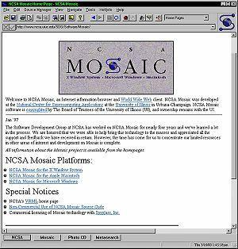

Рисунок 2

Наступним етапом розвитку вже HTML-стандарту було створення у квітні 1994 року Консорціуму W3C (_World Wide Web Consortium_).

Оскільки офіційної специфікації HTML 1.0 немає, саме W3C почав займатися підготовкою специфікації HTML наступної версії. Їй одразу дали номер 2.0, щоб підкреслити відмінність від інших версій HTML. Перший результат вдалося отримати через рік насиченої роботи — 1995 року. Серед значних доповнень слід зазначити створення механізму форм для того щоб відсилати інформацію з комп'ютера користувача на сервер.

Паралельно з розробкою HTML 2.0 велася розробка третьої версії стандарту, яка з'явилася в березні 1995 року і містила в собі теги для створення:

-   математичних формул;
-   сторінок;
-   приміток;
-   вставку зображень, які знаходяться в середні тексту;
-   підтримку формату GIF і т.д.

При тому, що цей стандарт був сумісний з другою версією, його реалізація була складна для браузерів того часу.

Крім того, у 1995 році вже існувала потреба у більшому візуальному розмаїтті сторінок. Коштів, пропонованих HTML, особливо у межах стандарту SGML, було недостатньо. Тоді корпорація W3С розпочала створення додаткової системи, що не суперечить основам HTML, але дозволяє описувати візуальне оформлення документів. В результаті з'явився CSS (_Cascading Style Sheets_ — Каскадні таблиці стилів), які являли собою ієрархічні стильові специфікації. Вони мали власний синтаксис, структуру та завдання, які дозволяли доповнити теги HTML візуальним форматуванням. Створення CSS було великим кроком уперед, оскільки потреби у візуальній презентації сторінок значно зросли, а HTML не пропонував при цьому жодних коштів.

### Війна браузерів

До речі, Mozaic вже не був єдиним браузером. З 1994 року у мережі з'явився Netscape Navigator та Opera, а з 1995 року — Internet Explorer. Щоб мати якомога більшу частину потенційної аудиторії, залучити максимальну кількість нових користувачів, Netscape вводила в HTML все нові і нові удосконалення, які підтримувалися, лише однойменним браузером. Практично всі нові теги були спрямовані на покращення зовнішнього вигляду документа та розширення можливостей його форматування.

Влітку 1996 р. було випущено версію Internet Explorer 3.0. Вона підтримувала практично всі розширення Netscape і мала симпатичний і зручний інтерфейс. Тому дуже швидко укорінилася як «другий головний браузер».

Четверті версії обох браузерів вийшли практично одночасно і не відрізнялися одна від одної особливою швидкістю роботи чи іншими параметрами. Якщо Netscape потрібно було купувати, Internet Explorer почав поставлятися безкоштовно в операційній системі Windows і став фактично стандартом галузі. 90-ті роки ХХ століття ознаменувалися таким поняттям як «Війна браузерів», яке, насправді, означає протистояння на ринку Інтернету між Netscape Navigator та Internet Explorer. Ця війна стала проблемою верстальників, оскільки кожен браузер намагався зробити свій внесок у розвиток мови HTML і не слідував стандартам W3C. Тому нерідко на сторінках сайтів можна було знайти запис «Коректне відображення у браузері…» з посиланням на завантаження відповідної програми.

Потрібно відзначити, що наприкінці 1990-х — на початку 2000-х років за рахунок того, що IE входив до Windows за замовчуванням, він став найпопулярнішим браузером, особливо для не дуже досвідчених користувачів. Тож свого часу корпорація Microsoft захопила більшу частку переглядів сайтів в Інтернеті, подавивши Netscape Navigator, хоча згодом свою першість утримати не змогла.

З Netscape Navigator згодом народився Mozilla FireFox, який підтримував стандарти W3C, мав вкладки, а не вікна та ряд фішок, що переманили на свій бік просунутих користувачів та верстальників. Досить багато шанувальників з'явилося й у браузера Opera. 11 грудня 2008 року було випущено браузер Google Chrome, вихідний код якого став доступний під назвою Chromium. З цієї миті будь-яка компанія могла зробити свій браузер на основі цього коду. Наприклад, з'явилися Yandex-браузер або Amigo. Крім того, Opera теж перейшла на двигун WebKit, на якому було створено Chrome.

Chrome повільно, але впевнено займав місце на ринку браузерів, і зараз є переможцем, оскільки його використовують близько 50% користувачів для серфінгу в Інтернеті. Крім того, Google Chrome надає зручні інструменти для розробників вихідного коду — HTML-верстальників, JavaScript-програмістів, тому ми з вами будемо його використовувати в першу чергу.

Слід зазначити, що інструменти розробника зараз присутні у будь-якому браузері, у тому числі й у Internet Explorer останніх версій. І не останню роль тут відіграло доповнення для FireFox під назвою FireBug, яке надавало інформацію про HTML-елементи, CSS-правила для них і дозволяло налагоджувати код JavaScript. В Opera для тих самих цілей було розширення Dragonfly.

Зупинимося ще на понятті «кросбраузерність». Воно має на увазі однакове відображення сайту у всіх браузерах. На даний момент ця проблема стоїть вже не так гостро, як у 2005-2012 рр., оскільки всі сучасні браузери намагаються підтримувати стандарти W3C. Тим не менш, зверставши сайт, слід перевірити, як він виглядає в найпопулярніших на даний момент браузерах. Для цього варто подивитися статистику, наприклад, на сайті http://alexvaleev.ru/browserstat/:

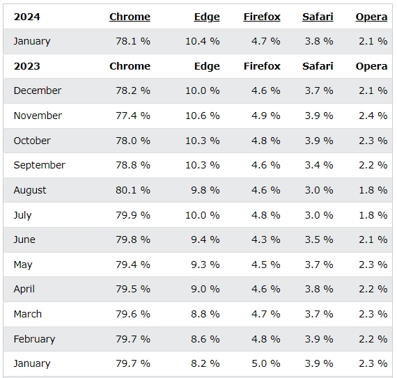

Рисунок 3

Також на даний момент варто ще звертати увагу на використання мобільних браузерів.

### Стандарти HTML (продовження)

Але повернемось до історії стандартів HTML.

Версія HTML 3.1 офіційно ніколи не пропонувалася, тому наступною версією стандарту HTML стала 3.2, яка була випущена 14 січня 1997 року. У ній було опущено багато нововведень з версії 3.0. Натомість були додані нестандартні елементи, що підтримуються браузерами Netscape Navigator та Mosaic.

18 грудня 1997 року було прийнято четверту версію HTML. Стандарт HTML 4.0, як і стандарт третьої версії, містив багато елементів, специфічних окремих браузерів. Слід зазначити, що у 4-ій версії багато елементів було позначено як застарілі та не рекомендовані до використання. Натомість рекомендовано використовувати таблиці стилів CSS.

Далі йде стандарт HTML 4.01, який було затверджено 24 грудня 1999 року. У ньому були прийняті значні зміни, і цей стандарт був популярний у мережі досить довго.

Паралельно з розробкою стандарту HTML ведеться також розробка альтернативного стандарту XHTML (_Extensible Hypertext Markup Language_) — мова розмітки розширеного гіпертексту, який використовує підхід XML. У ньому пред'являються більш суворі вимоги щодо синтаксису, ніж HTML. XHTML 1.0 був затверджений 26 січня 2000 року за рекомендацією W3C. Варіант XHTML 1.1 схвалений за рекомендацією консорціуму 31 травня 2001 року.


Рисунок 4

Розробка нових стандартів HTML практично ніколи не припинялася, тому що вимоги до відображення сторінок постійно зростають. З 2007 року розроблявся стандарт HTML5, остаточно затверджений 28 жовтня 2014 року. А з 17 грудня 2012 року вже розробляється стандарт HTML 5.1.

Ми з вами вивчатимемо версію HTML5. Цей стандарт, в порівнянні з попередніми, додав безліч нових тегів: <canvas>, <nav>, <section>, <header>, <footer>, <main> і т.д., нових елементів форм, які розширили можливості щодо структурування HTML-документа.

Крім того, ми будемо використовувати стандарт CSS3 для візуального оформлення сторінок, в якому також додали багато нових властивостей, що полегшують процес створення красивих веб-сторінок без використання картинок або JS-коду.

Слід зазначити, що багато CSS-властивостей, які ми будемо використовувати, відносяться до попередньої версії — CSS 2.1. Але це зрозуміло — CSS3 стала спадкоємицею попереднього стандарту, доповнивши та розширивши його можливості.

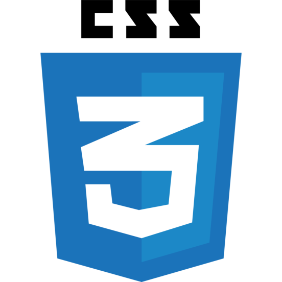

Рисунок 5

Як і в стандартизації HTML, організація W3C не зупиняє свою роботу, а продовжує займатися запровадженням нових властивостей, які вже потраплять до наступного стандарту — CSS 4.0. Нові властивості вже підтримуються останніми версіями браузерів, але недолік такої розробки стандарту полягає в тому, що синтаксис властивості або цілої групи властивостей може змінюватися 2, а то й 3 рази, доки не буде остаточно затверджено, як це було з flexbox.

### Базові визначення HTML

Створення HTML-документа передбачає розмітку всього вмісту у вигляді тегів (перша назва — дескрипторів), які записуються в кутових дужках. Текст повинен розташовуватися між відкриваючим (початковим) та закриваючим (кінцевим) тегами. Наприклад, теги абзацу з текстом виглядають так:

```html
&lt;p&gt; Текст абзацу &lt;/p&gt;
```


Існує ще одне поняття — це поняття елемента. Весь текст, укладений між початковим і кінцевим тегом, включаючи самі теги, називається елементом. Сам текст між тегами є змістом елемента. Враховуйте, що зміст елемента може включати будь-який текст, у тому числі й інші елементи.

Для будь-якого тега можна встановити додаткові властивості, які називаються атрибутами. Розміщуються вони тільки в тег, що відкриває, і являють собою пари виду «властивість = "значення "», розділені пробілами.

```html
&lt;p id = "test" class = "par"&gt; Текст абзацу &lt;/p&gt;
```


HTML є реєстронезалежною мовою розмітки, тому припустимо писати теги як у верхньому, так і в нижньому регістрі. Проте правилом де-факто стало вже давно написання тегів тільки в нижньому регістрі.

Документи HTML є текстовими документами. Вони мають розширення _.html_ або _.htm_, і для їх перегляду необхідний браузер, а для зміни — редактор коду, про вибір якого ми поговоримо нижче.

Ще однією особливістю HTML є ігнорування пробілів та переносів рядків. Як би ви не відформатували текст у HTML-документі ДО додавання тегів — з відступами, зробленими клавішею TAB, з перенесенням кожного рядка (клавіша ENTER) — в браузері він буде просто суцільним текстом.


Рисунок 6

Тому весь текст всередині HTML-документа має бути розбитий на теги відповідно до семантики, або внутрішньої логіки цього документа. І для різних рівнів вкладеності елементів, які будуть присутні на ваших сторінках, слід робити відступи для візуального відділення батьківських і дочірніх елементів:

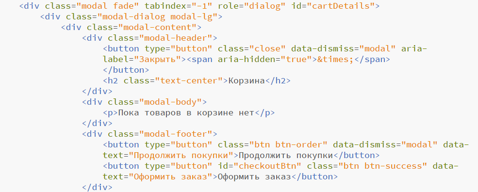

Рисунок 7

Зараз цей код здається абсолютно незрозумілим, але згодом стане звичним.

А тепер поговоримо про головний інструмент верстальника — редактор коду.

## Вибір редактора коду

На даний момент існує багато редакторів коду для HTML/CSS. Розглянемо найпопулярніші з них.

### Notepad++

Безкоштовний текстовий редактор, який підтримує та підсвічує синтаксис понад 100 мов. Може відкривати файли у різних кодуваннях. З офіційного сайту [https://notepad-plus-plus.org/](https://notepad-plus-plus.org/) можна завантажити останню версію програми.

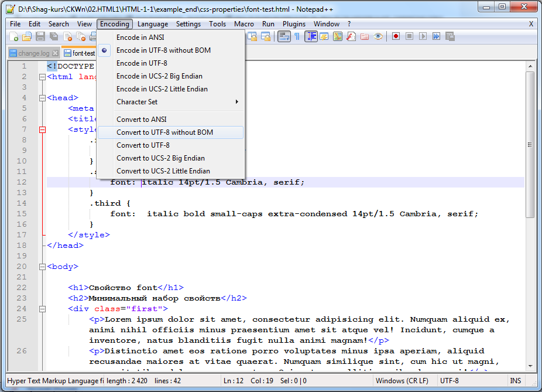

Рисунок 8

Цей редактор коду зручний, швидко завантажується. У ньому можна налаштувати деякі функції через меню Опції -> Налаштування, наприклад, автозаповнення, тобто закриття дужок, тегів тощо (рис. 9).

Notepad++ розроблений лише для Windows 32 і 64 bit.

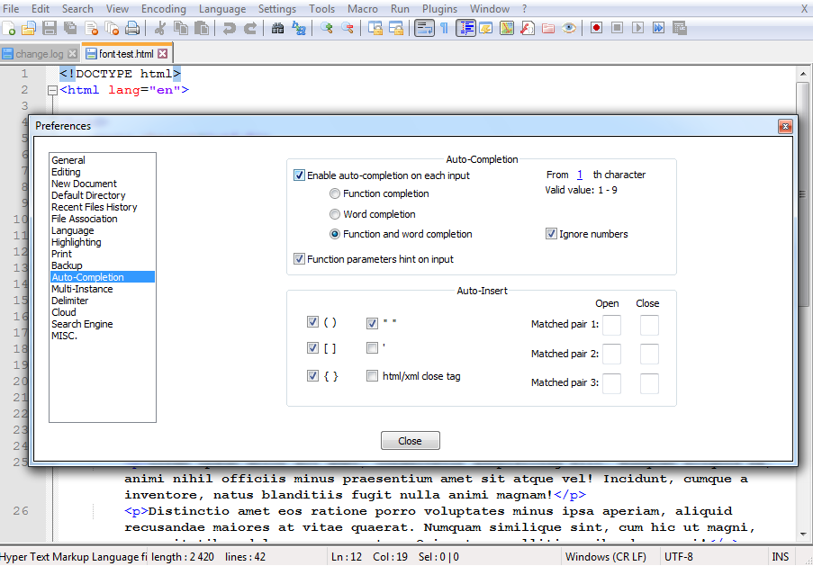

Рисунок 9

### Sublime Text

Мабуть, найпопулярніший текстовий редактор. Умовно безплатний. Тобто, ви можете завантажити його без оплати, але через певний час він пропонуватиме вам купити ліцензію. Офіційний сайт [https://www.sublimetext.com/](https://www.sublimetext.com/) на даний момент пропонує 3-ю версію редактора для завантаження.

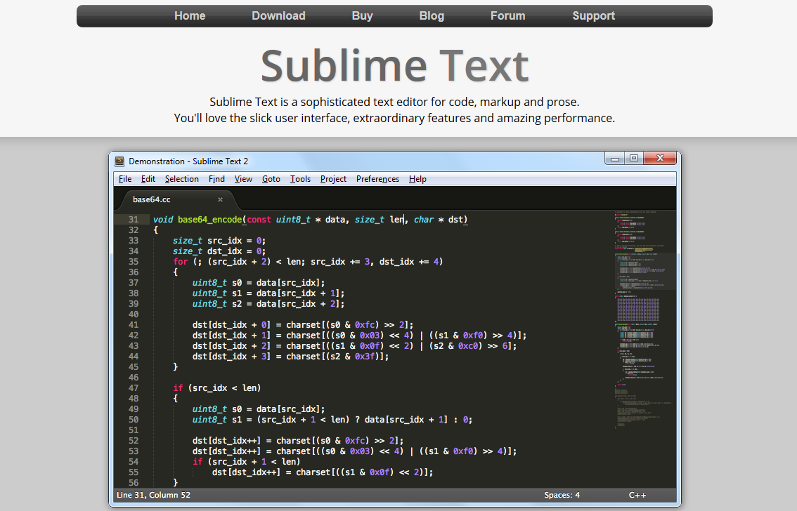

Рисунок 10

Sublime Text дозволяє працювати з багатьма форматами. Він легко справляється із великими обсягами текстової інформації. Редактор розширюється за допомогою додаткових пакетів. Мінусом є те, що на налаштування Sublime Text необхідно витратити близько 2-3 годин, оскільки вам буде недостатньо функціональності «з коробки».

### Atom

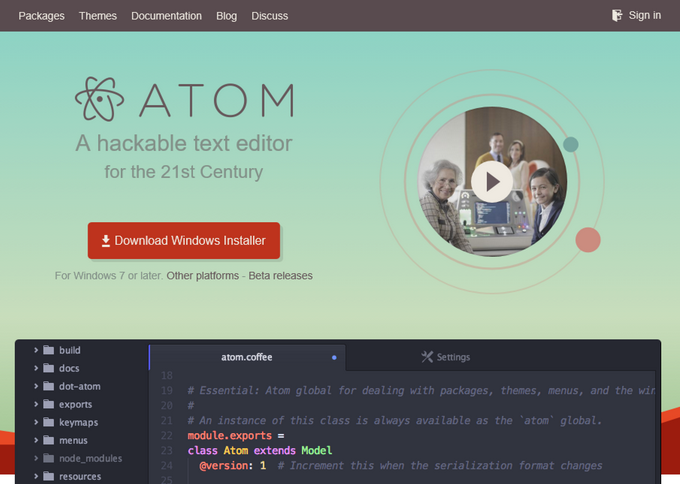

Рисунок 11

Цитата з офіційного сайту [https://atom.io/](https://atom.io/): «Atom — це текстовий редактор, який є сучасним, доступним інструментом, який ви можете налаштувати для будь-яких дій, але також продуктивно використовувати, навіть не торкаючись файлу конфігурації»

Цей редактор був створений командою GitHub. Він безкоштовний, має відкритий вихідний код, підходить для MacOS, Linux, Windows. Розширюється за допомогою плагінів, написаних на _Node.js_, які вбудовуються під керуванням Git Control. Також ви можете встановлювати та змінювати на ньому теми, підбираючи колірні поєднання для підсвічування коду, які будуть зручними саме для вашого сприйняття.

### Brackets

Безкоштовний текстовий редактор, який підтримує відкриття файлів лише у форматі UTF-8 — найпоширенішому на даний момент у Web. Розроблений компанією Adobe System для роботи в першу чергу з HTML, CSS, JavaScript. Але також дозволяє працювати з PHP-файлами та має ряд розширень для створення тем на Wordpress. Офіційний сайт [http://brackets.io/](http://brackets.io/) дозволяє завантажити останню версію редактора.


Рисунок 12

Brackets розроблено для систем Windows, MacOS та Linux. Розширюється за допомогою плагінів, також безкоштовних, з відкритим кодом, розміщених на GitHub.

Ми зупинимося саме на цьому редакторі, оскільки він має дуже багато «фішок» прямо «із коробки» і дозволяє спростити та прискорити написання коду. В умовах стислого часу на навчання або виконання замовлення це дуже зручно.

### Використання Brackets для створення та редагування файлів

Момент перший — у Brackets, як, втім, і в інших редакторах, краще працювати з проєктами — по суті, це просто папка на вашому комп'ютері або на флешці, яка міститиме HTML- та CSS-файли, а також папки із зображеннями та даними з JS-скриптами.

Тому перш за все створіть у себе на комп'ютері папку, в якій працюватимете (у мене вона називається HTML-1-1) і в контекстному меню для цієї папки виберіть пункт «Open as Brackets Project»:

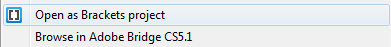

Рисунок 13

У цьому випадку вам будуть доступні всі файли та папки всередині проєкту. Особливо ви це оціните, коли будете розглядати тему про посилання або зображення.

**Примітка.** _Я__кщо вікно Brackets вже відкрито, ви можете просто перетягнути папку з проєктом у ліву частину редактора або відкрити потрібну директорію, клацнувши по кнопці зі стрілкою._

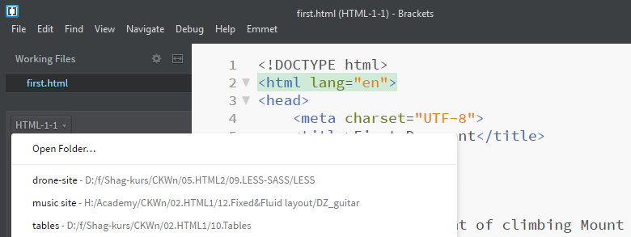

Рисунок 14

### Створення файлів у Brackets

Ви можете створювати файли у форматі _.html_ або _.htm_ (саме цей формат використовується у web) через меню файл -> Новий (або Ctrl+N), та зберегти файл у потрібній папці.

Але значно зручніше створювати файл у лівій темно-сірій області Brackets зробивши по ній правий клік. У контекстному меню вибираємо першу опцію «Новий файл»:

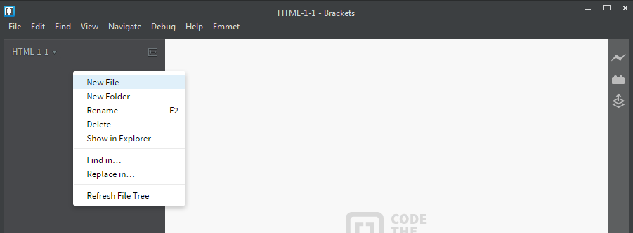

Рисунок 15

Давайте відразу домовимося, що Web не любить розкладку кирилицею, тому всі файли ми називатимемо латиницею. Найкраще, звичайно, це робити англійською мовою, але це не є обов'язковим.

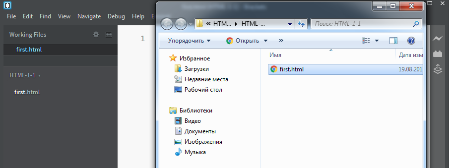

Рисунок 16

За замовчуванням новий файл матиме ім'я «_Без назви-1_» і (увага!!!) не матиме розширення. Тому, вводимо натомість _firs.html,_ файл одночасно створюється в потрібній папці і доступний для редагування в Brackets.

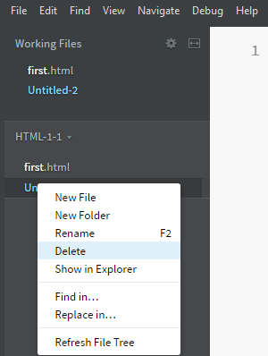

Рисунок 17

Якщо ви створили зайвий файл, то натиснувши правий клік ви можете його видалити або перейменувати (клавіша F2 теж допоможе). Хорошою опцією є «Показати у провіднику» — у цьому випадку файл відкриється у тій папці, в якій він був створений. Іноді це дуже корисна опція, оскільки буває так, що ви створюєте файл зовсім не в тій директорії, де задумали, а потім не можете його знайти.

До речі, у верхньому рядку редактора ви побачите назву файлу, з яким працюєте, а у дужках — папку, де він розташований.

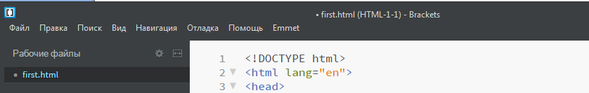

Рисунок 18

Ще одне зауваження — коли ви набираєте код, ваш файл переміщається у верхню частину лівої темно-сірої панелі в блок під назвою «_Робочі файли_». І якщо ви не зберегли зміни, поруч із ним з'явиться точка — це сигнал про те, що потрібно натиснути Ctrl+S (або меню Файл -> Зберегти).

Для тих, хто не товаришує з клавішами,(а це не добре), праворуч натисніть опцію «Зберегти» в контекстному меню, так само як і інші. Подивіться — там праворуч написано Ctrl+S — запам'ятайте це поєднання клавіш та завжди його використовуйте!

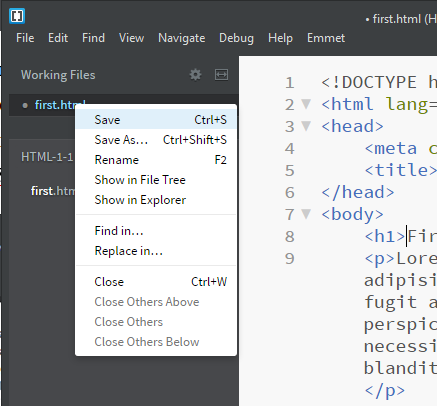

Рисунок 19

Brackets, як і інші програми, часом може «зависати», і при його закритті, наприклад, через Диспетчер завдань, всі незбережені зміни зникнуть і не будуть збережені. І верстку доведеться починати наново.

### Розширення Brackets

Це дуже зручно — встановити за кілька хвилин кілька важливих розширень та використати їх у подальшій практиці.

Плагіни, або розширення Brackets, встановлюються кліком на кнопці у вигляді деталі лего праворуч на темно-сірій панелі Brackets або через меню «Файл -> Менеджер розширень».

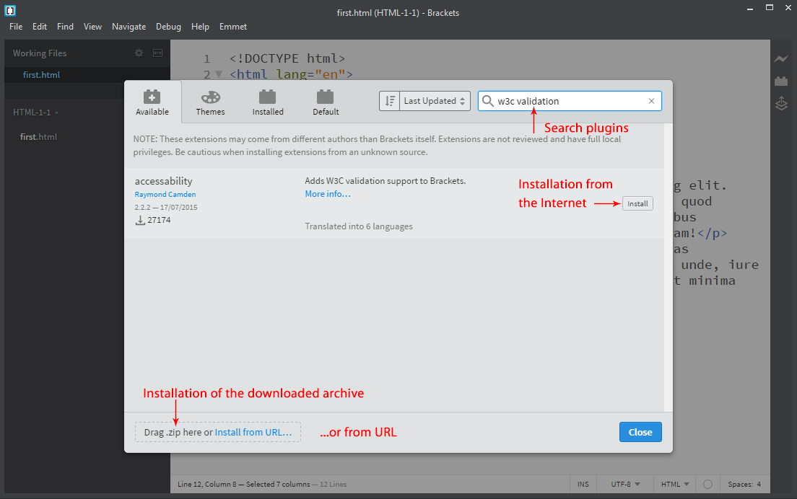

Рисунок 20

Плагіни завантажуються з Інтернету у вкладці «Доступні», і їх одразу можна встановлювати кліком на відповідній кнопці. Або можна знайти плагін у репозиторії на GitHub і, натиснувши кнопку «Встановити з URL», ввести адресу посилання.

Плагінів багато, тому варто скористатися полем пошуку. У цьому випадку з великого списку залишаться лише ті, що потрібні.

Якщо з'єднання з Інтернетом відсутнє, а плагіни заздалегідь були завантажені в будь-яку папку, можна встановити їх, просто перетягнувши їх на кнопку зліва внизу з написом «_Drag .zip here_».

З приводу рекомендованих плагінів — встановіть наступний набір:

Всі інші ми будемо встановлювати за необхідності.

Після успішного завантаження з'явиться повідомлення про успішно завершену інсталяцію.

Якщо з якоїсь причини ви не змогли встановити розширення, можна розархівувати плагін з .zip-файлу до папки з розширеннями. Відобразити її можна за допомогою меню Допомога -> Показати директорію розширень. Відкриється папка _Roaming -> Brackets_. У ній буде папка _user_, в яку необхідно розпакувати архів. Після цього обов'язкове перезавантаження редактора.

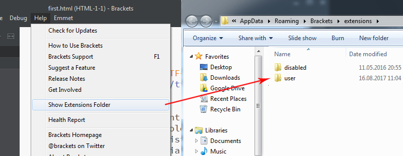

Рисунок 21

### Теми для Brackets

Завантажуються так само, як розширення, але у вкладці _Themes_. Вибирайте за назвою або клацніть на кнопку «Докладніше», щоб переглянути зовнішній вигляд теми на GitHub.

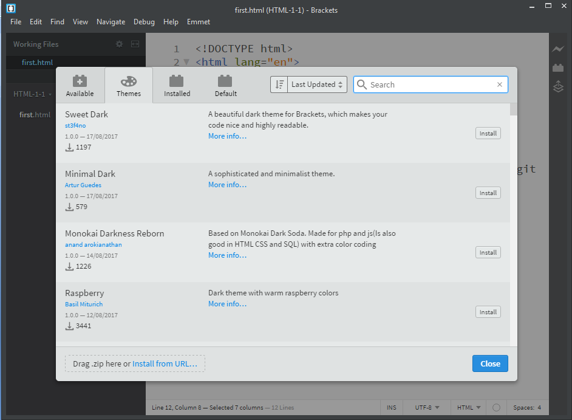

Рисунок 22

Щоб тему можна було змінити, зайдіть у меню Вид -> Themes… і виберіть потрібну. Ви зможете одразу ж побачити зміни. Виберіть ту, яка вам найбільше до вподоби.

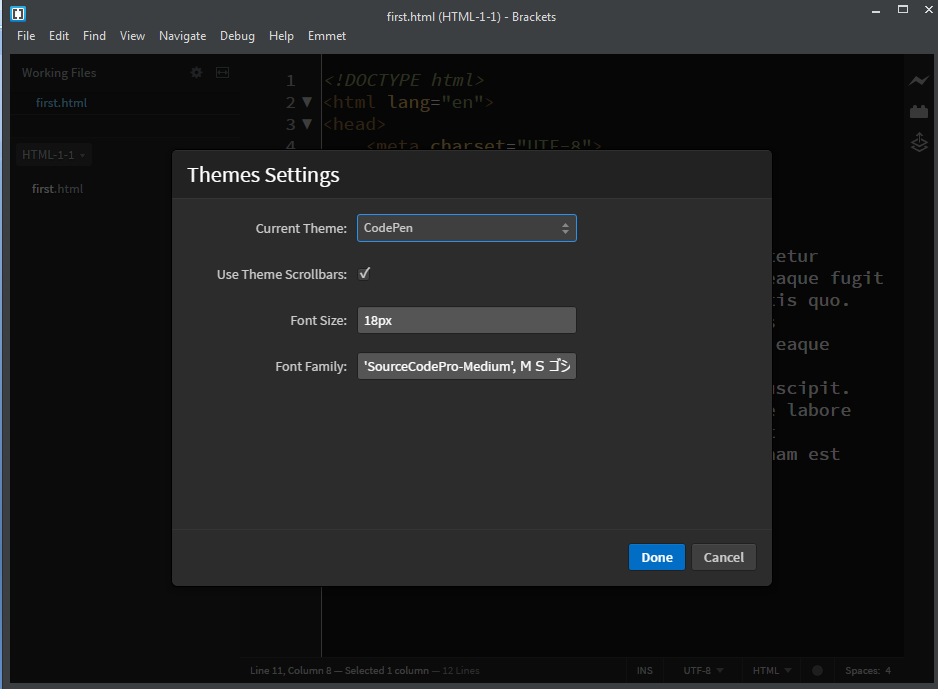

Рисунок 23

## Декілька слів про створення файлів HTML

Як було зазначено вище, для роботи з HTML необхідно створювати файли з розширенням _.html_ або _.htm_.

У Brackets ви можете створити цей файл через меню Файл ->Новий або поєднання клавіш CTRL+N і зберегти в потрібній папці з потрібним ім'ям і розширенням. Ще нагадаю про другий спосіб — це правий клік на темно-сірій області зліва з вибором налаштування «Новий файл».

Але, напевно, вам захочеться створити файл і безпосередньо в папці, з якою ви працюватимете, використовуючи провідник Windows. Тут можна зіткнутися з однією проблемою.

Справа в тому, що в системах Windows, починаючи з 7-ої версії, зазвичай прийнято приховувати розширення файлів. Тому зовнішній вигляд вашої папки буде приблизно таким:

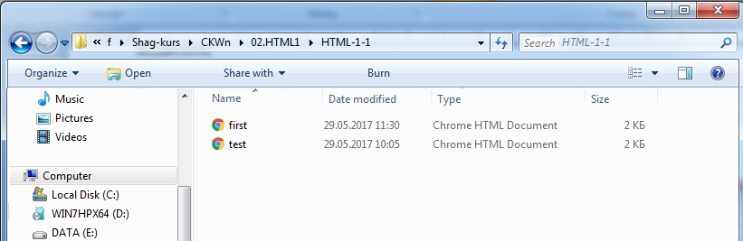

Рисунок 24

У папці є іконки браузера Google Chrome, назви _first_ і _test_ і те, що вони є Chrome HTML Document. Але, зверніть увагу, що розширень файлів (_.html_) Не вказано!.

Якщо спробувати створити у цій папці новий документ, необхідно створювати звичайний текстовий документ, оскільки саме HTML-файли є текстовими документами, але зі своїми особливостями — розміткою у вигляді тегів.

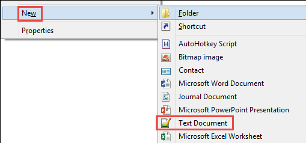

Рисунок 25

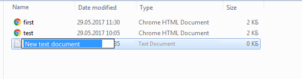

Рисунок 26

Цей документ потрібно перейменувати. Наприклад, назвемо його _second.html_:

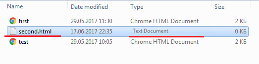

Рисунок 27

Зверніть увагу, що візуально НЕ змінилася іконка текстового документа і в колонці «Тип файлу» залишився запис «_Текстовий документ_», хоча розширення _.html_ є у назві нашого файлу. Якщо ви зробите подвійний клік на _second.html_, відкриється, швидше за все, стандартний Блокнот Windows.

Щоб це змінити, необхідно у провіднику Windows, у меню «Упорядкувати» вибрати пункт «Параметри папок та пошуку» та у вкладці «Вид» зняти прапорець «Приховувати розширення для зареєстрованих типів файлів»:

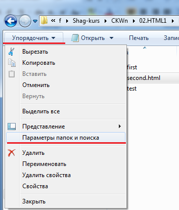

Рисунок 28

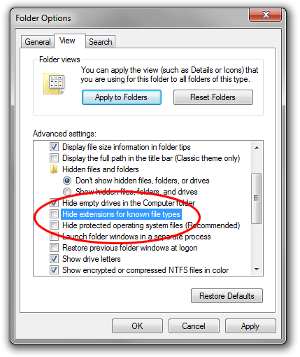

Рисунок 29

У цьому випадку відразу стає видно, що розширення файлу не _.txt_, а _.html_ — це частина назви файлу.

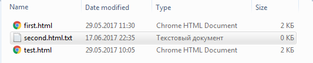

Рисунок 30

Тепер виділіть файл, натисніть клавішу F2 і видаліть розширення _.txt._

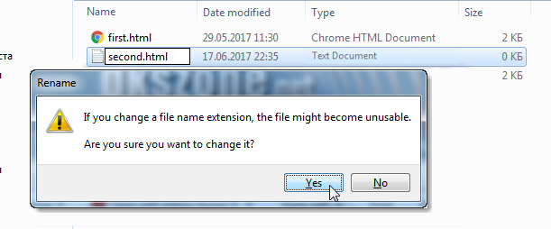

Рисунок 31

Сміливо натискайте кнопку «Так» у вікні попередження та отримайте довгоочікуваний HTML-файл.

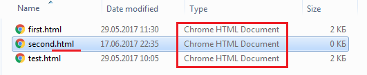

Рисунок 32

Тепер зробіть правий клік та вибирайте редактор коду. Ми відкриватимемо файл за допомогою Brackets — пункт контекстного меню «Open file with Brackets».

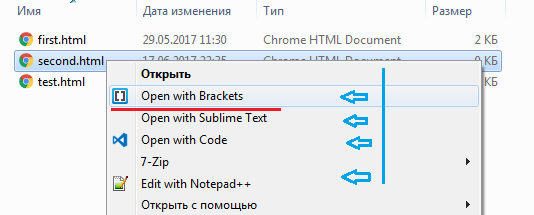

Рисунок 33

## Структура HTML-файлу. DOCTYPE

Будь-який HTML-файл має базову структуру, що складається з тегів html, head та body. Але починається вона завжди з оголошення типу документа — DOCTYPE.

Ми розглядаємо синтаксис останнього на даний момент стандарту HTML — це HTML5. Для нього тип документа вказується дуже просто:

```html
&lt;!DOCTYPE html&gt;
```


Попередніми стандартами є HTML4.01 і XHTML 1.0, які існували в різних варіантах: суворому, перехідному і для фреймів, тому DOCTYPE необхідно було оголошувати по-різному в залежності від типу розмітки, яка використовувалася в HTML-документі.

### Суворий тип документа

Застосовується суворий синтаксис мови відповідного стандарту, а також допускається включати всі теги та атрибути, крім застарілих.

Для HTML 4.01:

```html
&lt;!DOCTYPE HTML PUBLIC "-//W3C//DTD HTML 4.01//EN" 
      "http://www.w3.org/TR/html4/strict.dtd"&gt;
```


Для XHTML 1.0:

```html
&lt;!DOCTYPE html PUBLIC "-//W3C//DTD XHTML 1.0 Strict//EN" 
      "http://www.w3.org/TR/xhtml1/DTD/xhtml1-strict.dtd"&gt;
```


Синтаксис мови залежать від версії, але в обох варіантах треба дотримуватися наступних правил.

Вкрай небажано використовувати такі теги: <applet>, <basefont>, <center>, <dir>, <font>, <isindex>, <noframes>, <plaintext>, <s>, <strike>, <u>, <xmp>, оскільки вони відносяться до застарілих (deprecated). Замість них необхідно задавати форматування за допомогою стилів CSS.

Крім того, не можна додавати до <body> будь-який текст, зображення та елементи форм безпосередньо. Всі ці елементи мають знаходитися всередині інших блокових елементів, наприклад <p> або <div>.

Небажане застосування таких атрибутів, як target для посилань (тег <a>), а також start (тег <ol>), type (теги <li>, <ol>, <ul>) та ін.

Також не дозволяється використання фреймів.

### Перехідний тип документа

У цьому випадку використовується «м'який» синтаксис мови, також можна використовувати всі теги та атрибути, включаючи застарілі.

Для HTML 4.01:

```html
&lt;!DOCTYPE HTML PUBLIC "-//W3C//DTD HTML 4.01 Transitional//EN" 
       "http://www.w3.org/TR/html4/loose.dtd"&gt;
```


Для XHTML 1.0:

```html
&lt;!DOCTYPE html PUBLIC "-//W3C//DTD XHTML 1.0 Transitional//EN" 
       "http://www.w3.org/TR/xhtml1/DTD/xhtml1-transitional.dtd"&gt;
```


Мета таких перехідних доктайпів полягає у поступовому знайомстві із синтаксисом мови. Він може допомогти на початковому етапі вивчення мови, особливо якщо ви робите це за старими підручниками або посібниками в інтернеті. У документах із перехідним доктайпом можна використовувати атрибут target, який дозволяє відкривати посилання у новому вікні. Також можна використовувати такі теги, як <center> або <font>, які часто використовують більшість початківців HTML-кодерів. Але в цьому DOCTYPE кадри також не дозволені.

Відразу хочу сзауважити щодо перехідного DOCTYPE — якщо у вас є елементи форматування, які саме на даний момент вже застаріли — такий доктайп дозволить створити надійний документ. Але, якщо ви всерйоз вирішили займатися версткою — ніколи не використовуйте теги <center> або <font> — такі CSS-властивості, як text-align: center або font-family, font-size та color дадуть вам значно більше варіантів керування зовнішнім виглядом документа.

### Тип документа для фреймів

Фрейми свого часу (початок 2000-х років) були дуже популярним інструментом для завантаження в один HTML-файл 2-х, 3-х або більше інших HTMLдокументів. Але на даний момент існує безліч способів створити красивий HTML-файл, не вдаючись до таких складнощів. Для фреймової структури — frameset — застосовується спеціальний DOCTYPE, який за синтаксисом подібний до перехідного.

Для HTML 4.01:

```html
&lt;!DOCTYPE HTML PUBLIC "-//W3C//DTD HTML 4.01 Frameset//EN" 
    "http://www.w3.org/TR/html4/frameset.dtd"&gt;
```


Для XHTML 1.0:

```html
&lt;!DOCTYPE html PUBLIC "-//W3C//DTD XHTML 1.0 Frameset//EN" 
    "http://www.w3.org/TR/xhtml1/DTD/xhtml1-frameset.dtd"&gt;
```


У вас може виникнути питання: а навіщо вам знати про всі ці типи документів, якщо зараз достатньо використовувати простий <!DOCTYPE html>?

Справа в тому, що в мережі ще багато сайтів, створених 5-10-15 років тому, для яких, можливо, вам доведеться робити редизайн (тобто зміна зовнішнього вигляду) або просто правити частину коду. І важливо розуміти, що можна, що не можна залишити у документі, щоб код вважався правильним, тобто відповідним до стандартів організації W3C.

### Валідація HTML-докуметів

Валідація HTML-докуметів — це перевірка окремих HTML-документів та сайтів на правильність коду. Валідатори оступні за посиланнями:

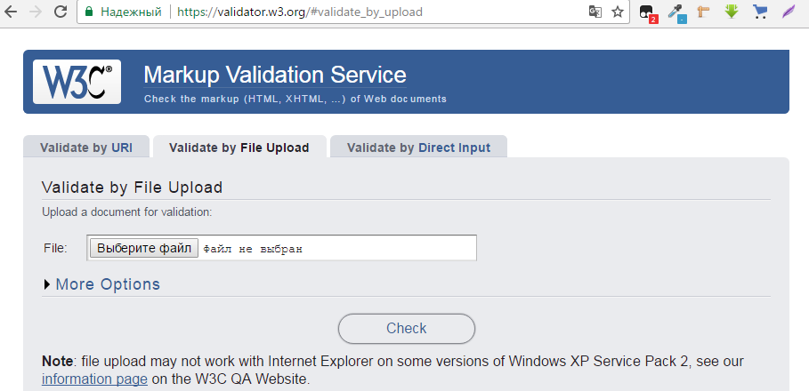

Рисунок 34

Ось що видав валідатор при завантаженні документа з <!DOCTYPE html> та тегами <font> та <center> всередині:

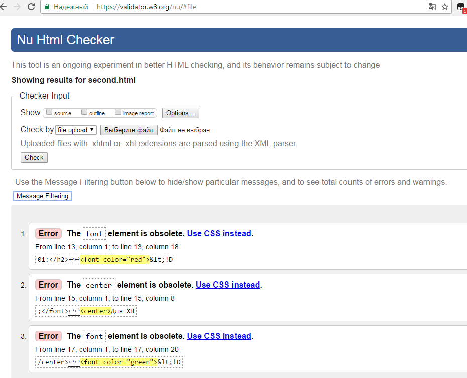

Рисунок 35

Очевидно, він обидва елементи відніс до категорії obsolite, тобто застарілих тегів. Як ви вважаєте, чи варто їх використовувати в сучасному стандарті?

Почитати ще про DOCTYPE:

### Базова структура HTML-документа

Отже, із DOCTYPE ми розібралися. Тепер розглянемо, які теги є основою HTML-файлу.

```html
&lt;!DOCTYPE html&gt;
&lt;html lang = "en"&gt;
&lt;head&gt;
    &lt;meta charset = "UTF-8"&gt;
    &lt;title&gt; First HTML Document &lt;/title&gt;
&lt;/head&gt;
&lt;body&gt;
    &lt;!-- Тут буде розміщено основний код --&gt;
&lt;/body&gt;
&lt;/html&gt;
```


Кореневим тегом є <html>. Всі інші теги поміщаються в нього, як матрьошки. Цей тег прийнято вказувати з атрибутом lang, який відповідає за мову, якою створена дана HTML-сторінка. У прикладі lang = "en", оскільки англійська є найбільш розповсюдженою мовою у світі, текст між тегами <title> теж англійською.

Якщо ж ви створюєте сторінку з російським текстом, то значення цього атрибуту має бути «ru»: <html lang="ru">.

Далі в структурі документа йде тег <head>, вміст якого не відображається на сторінці. Проте це важливий тег, що виконує «службові» функції. По-перше, у ньому вказується <title> документа, який відображається на вкладці у браузері.

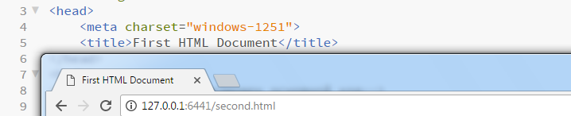

Рисунок 36

По-друге, в ньому розташовуються meta-теги, які видають інформацію для пошукових систем і не тільки. Тег <meta charset="UTF-8"> вказує кодування документа, про яке ми поговоримо окремо. Зараз зауважу лише те, що неправильна вказівка кодування призведе до того, що текст вашої сторінки відображатиметься незрозумілими знаками, чого дуже не хотілося б:

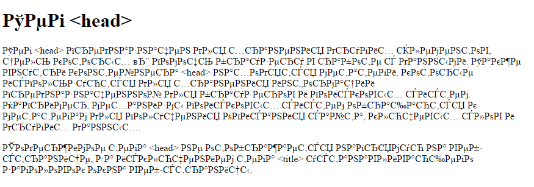

Рисунок 37

Такий вид сторінки вийшов при вказівці кодування як <meta charset="windows-1251">, тоді як документ був збережений в кодуванні utf-8.

**Примітка.** У _стандарті HTML5 спростилося написання деяких тегів, до яких, зокрема, належить і <meta>. Раніше (HTML 4.01) необхідно було вказувати кодування дещо довшим способом:_

```html
&lt;meta http-equiv = "Content-Type" content = "text/html; charset = UTF-8"&gt;
```


А в XHTML ще й додавати слеш який закриває наприкінці:

```html
&lt;meta http-equiv = "Content-Type" content = "text/html; charset = UTF-8" /&gt;
```


Тому не дивуйтеся, якщо зустрінете такий синтаксис тега.

### Кодування документа

Справа в тому, що в системі Windows за умовчанням для файлів введено кодування символів в системі ASCII (_American Standard Code for Information Interchange_ — американський стандартний код для обміну інформацією), до якої входять латинські та російські символи, цифри, розділові знаки та ін. HTML відповідає кодуванню windows-1251.

ASCII — це однобайтне кодування, яке дозволяє отримати файл меншого розміру, але й за своїми можливостями поступається двобайтним кодуванням UTF-8. Наприклад, вам складно буде створити на ній багатомовний сайт, який має відображатися українською, англійською та, наприклад, чеською мовою. Її можливостей просто не вистачить для відображення символів усіх мов.

У цьому сенсі двобайтне кодування UTF-8 є більш універсальним, оскільки вміщує коди символів на великій кількості мов. Саме тому вона стала найпопулярнішою в даний час і є стандартом «де-факто» у світі web-розробок.

Крім зазначених кодувань для російської мови є ще ISO-8859-5 та KOI-8-R, але їх настільки мало використовують, що немає сенсу розглядати в даному курсі. Якщо ви встановили на комп'ютер програму Notepad++, відкрийте її і в меню Кодування -> Кодування -> Кирилиця перегляньте доступні варіанти.

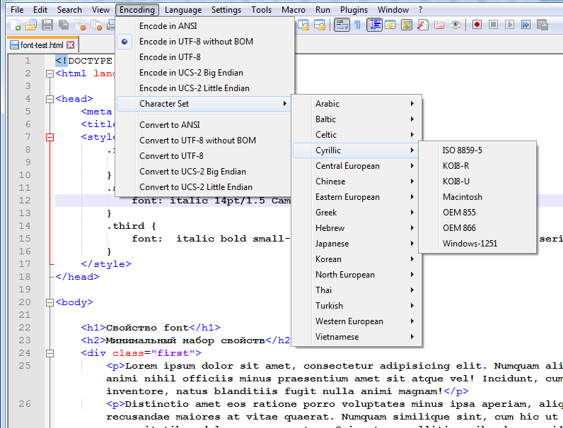

Рисунок 38

Щоб переглянути кодування документа _.txt_, який ми розглядали як початковий для створення HTML-файлів, потрібно в програмі «Блокнот» вибрати з меню «Файл» пункт «Зберегти» або «Зберегти як», якщо документ не змінювався або вже був збережений, і в нижній частині вікна параметрів вибрати кодування UTF-8 замість ANSI.

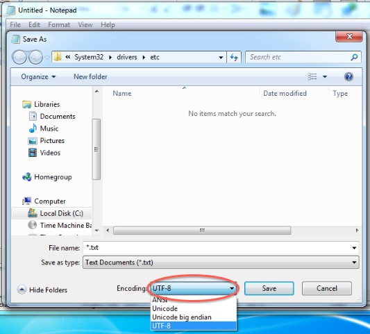

Рисунок 39

Це найпростіший спосіб, який доступний вам у Windows, т.к. програма «Блокнот» встановлена там зазвичай за замовчуванням. Але у нього є свої негативні сторони, які не помітні в HTML, проте помітні при створенні та редагуванні PHP-файлів, наприклад, для такої CMS, як Wordpress. Справа в тому, що Блокнот додає мітку BOM (маркер послідовності байтів або мітка порядку байтів — _Byte Order Mark_). Використання її у шаблонах сайтів викликає появу порожніх рядків у документі, тому її слід видаляти з файлів, призначених для Інтернету (_.html_, _.css_, _.php_, _.js_).

Для цієї мети найкраще підійде програма Notepad++, де в меню Кодування передбачено пункт «Кодування в UTF-8 без BOM» (див. рисунок вище). Для цього відредагуйте потрібний файл за допомогою Notepad++ (Edit with Notepad++) опція, доступна з контекстного меню будь-якого файлу для web.

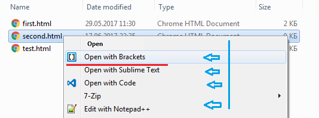

Рисунок 40

Щодо текстового редактора Brackets, то на даний момент він просто відмовиться відкривати будь-який документ з кодуванням, відмінним від UTF-8.

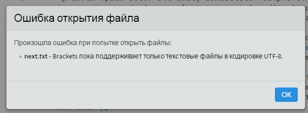

Рисунок 41

Щоб уникнути цього повідомлення, просто створюйте файли в Brackets — і не зберігайте їх в інших кодуваннях.

### Тіло документа — тег

Тег <body> є тим місцем, куди ви поміщатимете основний HTML-код. Саме його вміст є основним контентом сторінки та виводиться у браузер. Все, що буде між відкриваючим <body> і закриваючим тегом </body>, також має бути відформатовано у вигляді тегів.

### Коментарі в HTML

Коментарі в HTML не відображаються на сторінці. Весь текст, записаний між тегами

```html
&lt;!-- --&gt;
```


і буде прихований від відвідувача вашого сайту.

Коментарі необхідні для того, щоб вказати, наприклад, початок та кінець форматування будь-якого блоку:

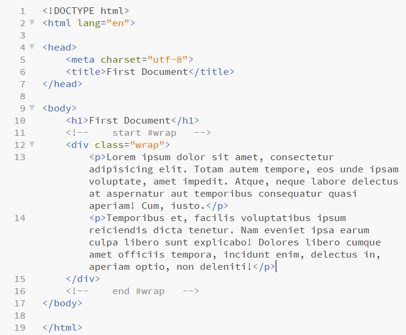

Рисунок 42

Або для того, щоб цей блок сховати:

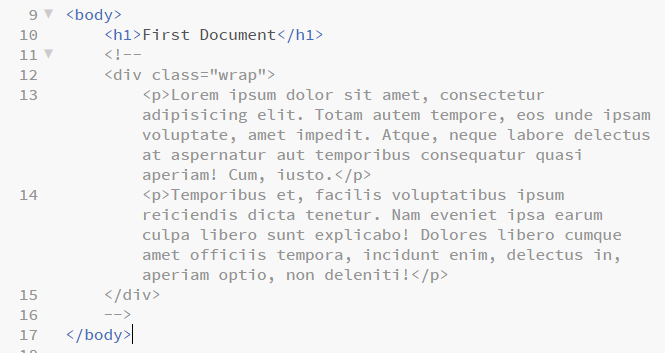

Рисунок 43

На рисунках видно, що весь текст, поміщений у теги <!----> стає світло-сірого кольору в Brackets — частково зникає. Якщо порівняти обидва варіанти відображення цієї сторінки з різним розташуванням коментарів, то ми побачимо в браузері наступне:

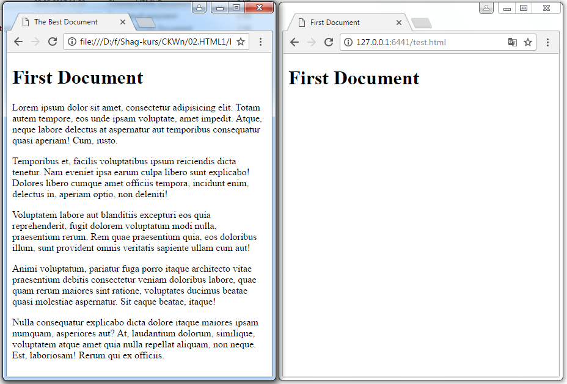

Рисунок 44

Тобто там, де у коментарі потрапили саме коментарі початку та кінця блоку, ми не бачимо лише цих слів. На прикладі з коментуванням самого блоку — зник увесь текст після заголовка.

Слід зазначити, що Brackets (як і інших редакторах коду) є швидкі клавіші додавання коментарів — це CTRL+/. Якщо ви хочете закоментувати один рядок, достатньо встановити в будь-якому місці курсор і натиснути CTRL+/. Коментарі автоматично додаються на початку та в кінці цього рядка. Для коментування кількох абзаців необхідно буде спочатку їх виділити, а вже потім натиснути CTRL+/.

### Використання плагіна Emmet для створення структури документа

Якщо ви встановили набір плагінів для Brackets, що рекомендується на початку цього уроку, то зараз саме час скористатися можливостями плагіну Emmet. Щоб перевірити, чи він встановлений у вашему редакторі дуже просто — подивіться на рядок меню Brackets — якщо наприкінці ви бачите пункт Emmet — то все гаразд.

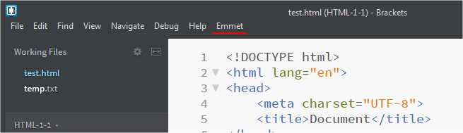

Рисунок 45

Якщо не бачите — дуже рекомендую вам цю ситуацію виправити, тому що код базової структури набирається за допомогою Emmet досить легко: ! та клавіша Tab.

### Теги заголовків та абзаців

Заголовки — обов'язкова частина HTML-документа. Є навіть два нових теги в HTML5, які без заголовків не пройдуть валідацію — це <article> і <section>. Але їх ми розглядатимемо пізніше.

У HTML передбачено 6 рівнів заголовків, які відрізняються один від одного розміром шрифту. Позначаються заголовки таким чином:

```html
&lt;h1&gt; Заголовок 1-го рівня &lt;/h1&gt;
&lt;h2&gt; Заголовок 2-го рівня &lt;/h2&gt;
&lt;h3&gt; Заголовок 3-го рівня &lt;/h3&gt;
&lt;h4&gt; Заголовок 4-го рівня &lt;/h4&gt;
&lt;h5&gt; Заголовок 5-го рівня &lt;/h5&gt;
&lt;h6&gt; Заголовок 6-го рівня &lt;/h6&gt;
```


Літера h у тезі означає, що це заголовок (від англійського _heading_), а цифра — який рівень заголовка. Чим більша цифра — тим менша важливість та розмір шрифту заголовка.

Подивимося, як це виглядає в редакторі коду та в браузері:

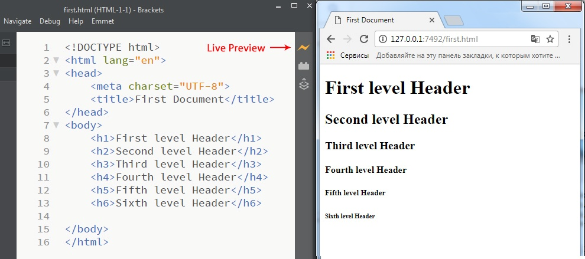

Рисунок 46

Різниця між заголовками різних рівнів, очевидна. <h1> — найбільший і помітний, а <h6> — вже майже нечитається. Власне, і вага цих заголовків в розрізі пошукових систем теж різна. Зазвичай, заголовків типу h1 на сторінці має бути один або два — це назва компанії та назва сторінки. Ще бажано, щоб текст h1, що визначає назву сторінки, збігався із вмістом тега <title> в блоці <head>.

Всі інші заголовки ви можете використовувати на свій розсуд, необов'язково в порядку зростання їх рівня, але бажано, щоб після h1 йшов заголовок h2, оскільки він також важливий для ранжування вашої сторінки.

**Примітка 1.** _Н__а рисунку стрілочкою показана кнопка у вигляді блискавки у верхньому правому кутку Brackets. Це Live Preview (Попередній_ _перегляд) у браузері Google Chrome, «вшитий» у редактор коду. Натискання цієї кнопки під час редагування_ _HTML__\-документа дозволяє в реальному часі переглянути всі зміни, що відбуваються в редакторі. Щоб це побачити,_ _важливо_ _розташувати вікно редактора та вікно браузера поруч, як на рисунку_ _вгорі._

Коли включений Live Preview, в браузері цією рамочкою виділений елемент, на якому зараз розташований курсор (на рисунку це h2). Якщо ви переміщатимете курсор вище або нижче, наприклад, клавішами або , то побачите, як переміщується рамка з одного елемента на інший.

**Примітка 2.** _Я__кщо у Brackets вам доводиться створювати блоки зі схожим або ідентичним змістом,_ _важливо_ _скористатися поєднанням_ _клавіш CTRL+D_ _(від англ. duplicate — дублювати). Якщо курсор знаходиться в будь-якому місці рядка, то буде продубльовано весь рядок. Якщо ви виділите частину слів або кілька рядків, то продублюється весь виділений контент._ _І ц__е дуже зручно._

Що стосується заголовків, то вам слід знати, що всі вони є блоковими елементами, які за замовчуванням в браузерах виділяються жирним шрифтом і мають відступи до і після їхнього тексту.

Потрібно ще розуміти, що не можна всю сторінку заповнити лише заголовками — це буде неправильно з погляду семантики HTML-документу. І пошукачам теж наврядчи сподобається. Вдумайтесь — хіба може книга, стаття у журналі чи газеті складатися з одних заголовків? Звичайно, що ні. Після заголовка повинен обов'язково йти основний текст, який у пресі зазвичай розбивається на абзаци. Розглянемо, як створювати їх в HTML.

### Що таке блокові елементи?

Блоковими називаються такі елементи HTML, які за замовчуванням займають весь доступний простір усередині браузера або батьківського елемента, навіть якщо їх вміст зовсім невеликий. Тобто, навіть при 2-3 словах усередині заголовка він буде займати весь простір до правої межі браузера, і текст, розміщений поруч із кінцевим тегом, буде перенесений на наступний рядок.

На рисунку 47 бачимо, що заголовок h1, виділений Brackets в режимі Live Preview, обведений блакитною рамкою і займає все місце зліва направо в браузері. А текст за ним перенесено на наступний рядок.

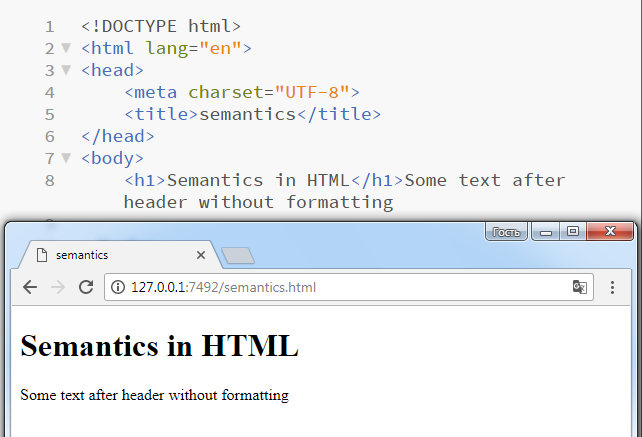

Рисунок 47

### Абзаци в HTML

Як і друковані видання, абзаци є основними елементами для форматування тексту, який складає статтю. Для створення абзаців призначений тег <p> </p> (від англ. _paragraph_).

Ви знайдете варіант розбиття тексту на абзаци у файлі _semantic.html_, в якому був використаний уривок статті з Вікіпедії.

На рисунку 48 видно, що текст, поміщений в абзаци, виводиться в браузері звичайним зображенням (а не жирним, як у заголовків), але при цьому кожен абзац має відступи зверху та знизу. Це візуально відокремлює один смисловий блок від іншого і допомагає легко сприймати суть тексту.

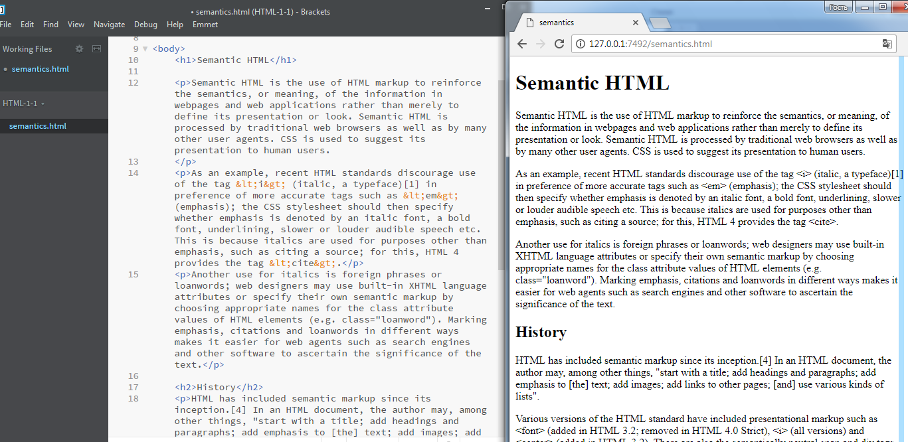

Рисунок 48

### Декілька слів про атрибути

Для будь-якого тега можна задати атрибути, які певною мірою виділяють його серед інших. Атрибути записуються тільки в початковий тег, відокремлюються від назви тега і один від одного пробілами. Загалом це виглядає так:

```html
&lt;елемент атрибут1 = 'значення' атрибут2 = 'значення' атрибут3 = 'значення'&gt; 
    Текст елемента 
&lt;/елемент&gt;
```


Реальний приклад:

```html
&lt;h2 title = 'Стаття про користь вітамінів для дітей' id = 'article1' class = 'article-header'&gt; 
    Вітаміни для дітей 
&lt;/h2&gt;
```


У цьому прикладі для заголовка 2-го рівня використані універсальні атрибути title, id і class, тобто, такі, які можна додати до будь-якого елемента. Ще до універсальних відносяться tab index і data\-атрибути.

Але також є атрибути, які характерні лише для певних тегів. Наприклад, для вбудовування зображення потрібен тег з атрибутами src та alt, які характерні тільки для нього (хоча src потрібен ще для таких тегів, як <script> та <iframe>):

```html
&lt;img src = 'images/photo.jpg' alt='Картинка'&gt;
```


При додаванні атрибутів потрібно дотримуватися кількох простих правил:

-   Атрибути відокремлюються один від одного пробілами.
-   Значення атрибутів записують у подвійні або одинарні лапки.
-   Якщо всередині значення атрибуту необхідно використовувати лапки або апостроф, необхідно поєднувати обидва види лапок з урахуванням їх вкладеності:

```html
&lt;p title = 'Абзац із книги Б. Акуніна "Азазель"'&gt;
```


Тут значення атрибута title взято в одинарні лапки, а всередині використані подвійні назви книги. Цей атрибут додає підказку до елемента, яка з'являється при наведенні на елемент у браузері.

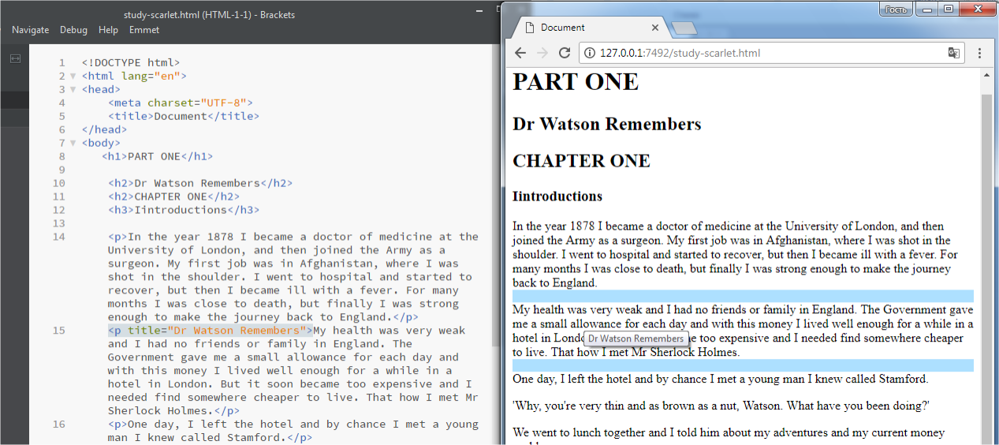

Рисунок 49

-   Якщо значення атрибута можна подати у вигляді логічної величини true (_істина_) або false (помилка), або інакше «такє» або «ні», то записувати його можна в кількох рівнозначних варіантах:

```html
&lt;input type = "checkbox" checked&gt;
&lt;input type = "checkbox" checked = ""&gt;
&lt;input type = "checkbox" checked = "checked"&gt;
```


**Примітка.** _Всі браузери налаштовані на максимально правильне відображення тегів та їх атрибутів, тому включають атрибут навіть за наявності в ньому значень_ _на кшталт true або 1, які є неприпустимими. Краще ж уникати таких варіантів,_ _тому що_ _вони суперечать специфікації HTML5._

А тепер поговоримо про застарілі атрибути. Наприклад, атрибут align дозволяє вирівняти текст в абзаці, заголовку або іншому блоковому елементі по лівому або правому краю, по ширині елемента або по центру (align = "left", або align = "right", або align = "justify", або align = "center"). Ви, напевно, знайдете в Інтернеті купу посібників, які рекомендують використовувати саме цей атрибут для вирівнювання тексту.

Тільки ось зі стандартом HTML5 цей атрибут несумісний. І валідатор видасть таке повідомлення: «Атрибут align для елемента p застарів. Замість нього використовуйте CSS»

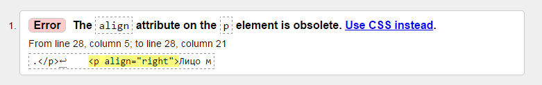

Рисунок 50

Тож використовувати застарілі атрибути не варто. Ми замінюватимемо їх CSS-стилями, як і рекомендує валідатор. А якщо ви таки зробили це, перевірте свій документ на валідність.

### Що таке Lorem Ipsum?

Справа в тому, що далеко не завжди у вашій практиці доведеться форматувати готовий текст, наданий замовником. На жаль, замовники з ним досить часто запізнюються.

Крім того, ви можете створювати шаблони сайтів, про реальний зміст яких на етапі розробки можете лише здогадуватися. Тому вам знадобиться шаблонний текст, який починається словами _Lorem ipsum_. Його, до речі, ще називають «текст-риба».

Цитата з Вікіпедії: «Lorem ipsum — класичний варіант умовного беззмістовного тексту, що вставляється в макет сторінки. Використовується як заповнювач принаймні з XVI століття. Є спотвореним уривком з філософського трактату Марка Туллія Цицерона «Про межі добра і зла», написаного 45 року до н.є. латинською, про виявлення подібності атрибутується Річарду МакКлінтоку».

Тобто це текст, який допомагає заповнити сайт контентом, але при цьому не має сенсу. Це дуже зручно, крім іншого, на етапі навчання. Можна заповнювати за допомогою _Lorem ipsum_ будь-які тестові елементи (ми вже знаємо про заголовки та абзаци), не замислюючись про кількість та зміст тексту.

При відповідному запиті Google надає доступ до маси генераторів _Lorem ipsum_:

Але у нас з вами є набагато зручніший інструмент для створення такого тексту, причому одразу обгорнутого в теги. І це — знову ж таки плагін Emmet.

Для того, щоб отримати абзац з текстом-рибою, відразу після тега <body> або після іншого тега, що вже існує в ньому, наберіть абревіатуру

```html
p&gt;lorem
```


та натисніть клавішу Tab.

І у вас готовий абзац із текстом-заповнювачем:

```html
&lt;p&gt; Lorem ipsum dolor sit amet, consectetur adipisicing elit. Labore illum rerum
facilis mollitia, explicabo cupiditate, eius fugit ea nemo saepe ex veritatis 
aliquid consequatur ratione quas asperiores minus dolorum odio. &lt;/p&gt;
```


За замовчуванням Emmet додасть 30 слів тексту. Але ви можете урізноманітнити кількість слів, додаючи потрібну цифру після lorem:

```html
p&gt;lorem10
```


Отримаємо:

```html
&lt;p&gt; Lorem ipsum dolor sit amet, consectetur adipisicing elit. 
Necessitatibus, possimus! &lt;/p&gt;
```


Необов'язково використовувати Lorem тільки із тегом p. Ви можете застосувати його для заголовка будь-якого рівня:

```html
h1&gt;lorem5
&lt;h1&gt;Lorem ipsum dolor sit amet.&lt;/h1&gt;
h2&gt;lorem3
&lt;h2&gt;Lorem ipsum dolor.&lt;/h2&gt;
```


І так далі…

**Примітка.** _П__лагін Emmet використовує абревіатури — послідовності символів, які дозволяють вивести теги, атрибути та текст у певній послідовності та з певними рівнями вкладеності._

Докладніше про абревіатури:

Важливо розуміти, що всередині абревіатури не повинно бути прогалин (виняток — текст усередині фігурних дужок). А наприкінці обов'язково потрібно натиснути клавішу Tab, щоб розкрити абревіатуру і отримати відформатований за правилами HTML-текст. Знову ж таки, після тексту абревіатури пробіл ставити не треба, а курсор має знаходитися саме в кінці, а не десь у середині набраного тексту.

Давайте розглянемо дещо складнішу абревіатуру. На цей раз із частково осмисленим текстом:

```html
h1{First heading}+h2{Second heading}+p*3&gt;lorem20
```


Отримаємо таку структуру:

```html
&lt;h1&gt; First heading &lt;/h1&gt;
&lt;h2&gt; Second heading &lt;/h2&gt;
&lt;p&gt; Lorem ipsum dolor sit amet, consectetur adipisicing elit. Placeat corporis quasi perspiciatis? Aperiam eveniet dolorem culpa distinctio, rem quos adipisci. &lt;/p&gt;
&lt;p&gt; Debitis, dolorem! Sunt autem veritatis magnam! Ipsa, dolorem harum laborum praesentium, quas unde ab, alias saepe ullam similique nulla beatae. &lt;/p&gt;
&lt;p&gt; Quis soluta saepe incidunt voluptas consequuntur iste repellat, quasi quos provident, nostrum, a. Repellendus aspernatur, veritatis ea cum aliquid architecto! &lt;/p&gt;
```


Якщо розшифрувати абревіатуру, можна побачити наступне: h1 з текстом «_First heading_» розміщується поруч із заголовком h2 з текстом «_Second heading_», поспіль йдуть 3 абзаци з шаблонним текстом по 20 слів у кожному. До того ж текст в абзацах різний! Зауважте, що текст, розміщений у фігурних дужках, відобразився саме у вигляді, у якому був набраний.

Зручно, чи не так?

Дещо складніше буде виглядати абревіатура із шаблонним текстом у заголовках та абзацах. У ній доведеться використовувати символ ^ — вихід у батьківський елемент, яким у нас поки є body.

```html
h1&gt;lorem4^h2&gt;lorem5^p*2&gt;lorem15^h3&gt;lorem4^p*3&gt;lorem10
```


Виглядає масивно, але після натискання Tab наприкінці набуває звичайного вигляду:

```html
&lt;h1&gt; Lorem ipsum dolor sit. &lt;/h1&gt;
&lt;h2&gt; Lorem ipsum dolor sit amet. &lt;/h2&gt;
&lt;p&gt; Lorem ipsum dolor sit amet, consectetur adipisicing elit. Recusandae molestias, ipsa non asperiores animi iste. &lt;/p&gt;
&lt;p&gt; Eos eligendi aspernatur dolore voluptate natus, magnam, dolores, cupiditate nihil fugit asperiores doloribus ipsum accusamus. &lt;/p&gt;
&lt;h3&gt; Lorem ipsum dolor sit. &lt;/h3&gt;
&lt;p&gt; Lorem ipsum dolor sit amet, consectetur adipisicing elit. Porro, corporis. &lt;/p&gt;
&lt;p&gt; Voluptates dicta eius vitae ipsam. Veniam rem consequatur, illum rerum. &lt;/p&gt;
&lt;p&gt; Quis voluptatem, veniam recusandae, hic totam quisquam tempora itaque necessitatibus. &lt;/p&gt;
```


Розглянемо докладно, що ж у цій абревіатурі написано:

```html
h1&gt;lorem4^h2&gt;lorem5^p*2&gt;lorem15^h3&gt;lorem4^p*3&gt;lorem10
```


-   h1>lorem4 — заголовок h1 з текстом-рибою з 4-х слів;
-   ^ — з тексту заголовка h1 повертаємось до body;
-   h2>lorem5 — заголовок h2 з текстом-рибою з 5 слів;
-   ^ — з тексту заголовка h2 повертаємось до body;
-   p\*2>lorem15 — 2 абзаци з Lorem ipsum із 15 слів;
-   ^ — з тексту абзаців повертаємось до body;
-   h3>lorem4 — заголовок h3 з текстом-рибою з 4 слів;
-   ^ — з тексту заголовка h2 повертаємось до body;
-   p\*3>lorem10 — 3 абзаци з Lorem ipsum з 10 слів.

Так виглядатиме документ у браузері.

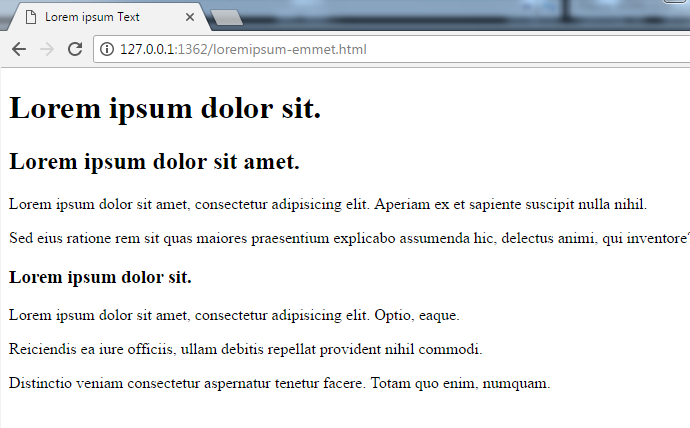

Рисунок 51

На рисунку 52 показано схему роботи абревіатури спираючись на знак ^.

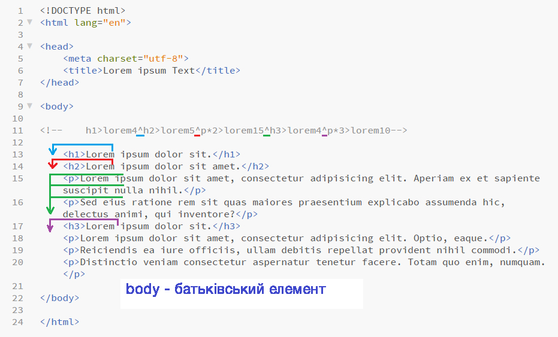

Рисунок 52

Спробуйте розкрити абревіатуру в файлі _loremipsum-emmet.html_.

### Абревіатури Emmet

Є ще одна чудова функція у плагіні Emmet. Називається вона Wrap with Abbriviation (CTRL+SHIFT+A). Ви можете знайти відповідний пункт у меню Emmet у Brackets, але я все ж рекомендую вам запам'ятати поєднання клавіш.

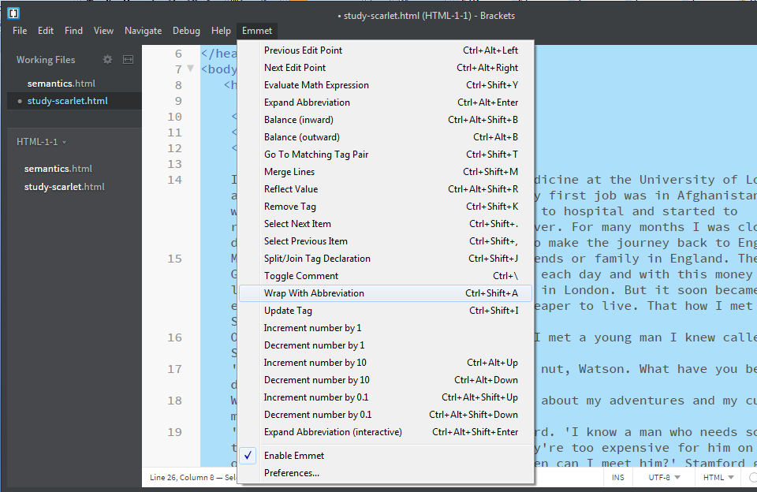

Рисунок 53

Користуватися «обгорттаннями» вкрай просто — виділяєте потрібний текст, натискаєте CTRL+SHIFT+A — і вводите тег або абревіатуру Emmet. Перевіряєте результат і обов'язково натискаєте Enter, інакше абревіатура не застосується.

Наприклад, так виглядатиме обгортання тексту в заголовок першого рівня.

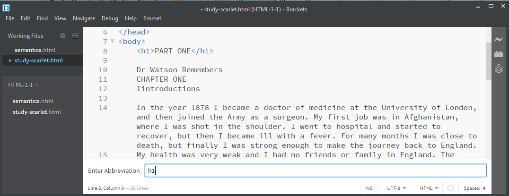

Рисунок 54

Якщо виділити весь текст, розбитий на блоки за допомогою клавіші Enter, то можна дуже швидко перетворити його на цілий ряд абзаців:

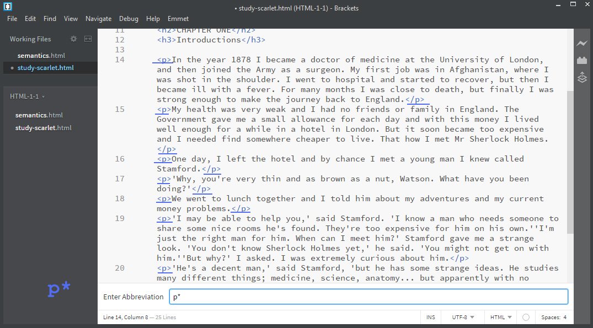

Рисунок 55

Абревіатура буде простою: p \*.

Так само просто перетворити весь текст на теги структури HTML-документа. Достатньо виділити весь текст (CTRL+A), викликати поле «Enter Abbreviation» за допомогою CTRL+SHIFT+A та ввести знак оклику:

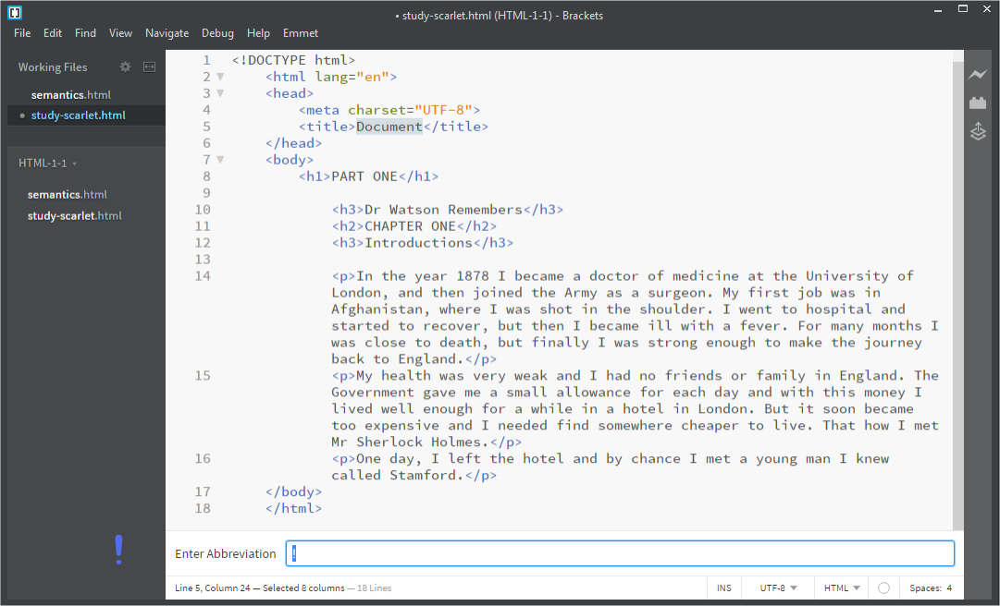

Рисунок 56

**Примітка.** _Б__удьте уважними__, при_ _введенні_ _абревіатури, оскільки_ _Emmet створить_ _із введеного вами тегу_ _навіть такий__,_ _якого_ _немає в специфікації HTML._

Ви можете попрактикуватися із «обгортками» Emmet, використовуючи файл _azazel.txt_, який є в папці до цього уроку. У файлі міститься текст, взятий із сайту Б. Акуніна.

### Вкладені теги

Щоб виділити частину тексту жирним або курсивним шрифтом, можна використовувати теги, <b> та <i>:

```html
&lt;p&gt; У понеділок &lt;b&gt;13 травня 1876&lt;/b&gt; року о третій годині, в день по-весняному 
свіжий і по-літньому теплий, &lt;i&gt;в Олександрівському саду&lt;/i&gt;, на очах у численних 
свідків, трапилась жахлива подія, яка не вкладається в жодні рамки. &lt;/p&gt;
```


Тег <b> походить від слова bold (_жирний_), а <i> — від слова italics (_курсив_), відповідно використання цих тегів призводить до виділення тексту між ними за допомогою жирного або курсивного зображення. Ці елементи належать до групи тегів фізичного форматування.

На відміну від блокових тегів заголовків та абзаців ці теги є рядковими (ще їх називають лінійними від англійського inline).

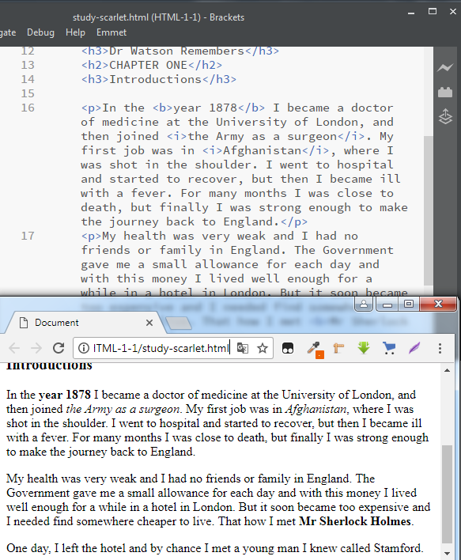

Рисунок 57

Тому обертають у такі теги не всі речення чи блок тексту, а якусь його частину, наприклад, 2-3-4 слова, як у прикладі на рисунку.

Так само працюють ще 2 теги — <strong> і <em>, тобто, <strong> виділяє текст жирним, а <em> — курсивом, але ці 2 елементи відносяться до групи тегів логічного форматування. У контексті розмітки сторінки виконують роль «підсилювача уваги», тобто, покликані показати (переважно пошукачам, ніж відвідувачам), що виділений у них текст важливий для користувача.

Але теги фізичного, і логічного форматування знаходяться всередині блокових елементів (у прикладі абзац — <p>), тобто, є вкладеними або дочірніми відповідно до абзацу. А от абзац, відповідно до вкладених тегів є батьківським елементом.

Для вкладених тегів важливо дотримуватися «правила матрьошки»: тег, який відкритий найпершим, має бути закритий останнім:

```html
&lt;b&gt;&lt;i&gt; в Олександрівському саду &lt;/i&gt;&lt;/b&gt;
```


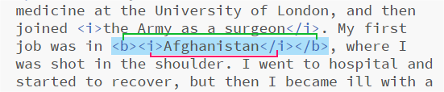

Рисунок 58

Вкладені теги можуть бути не лише малими. І рівень вкладення може бути досить глибоким. Але це правило все одно залишається в минулому — тег, який відкритий першим, має закриватися останнім.

### Теги div та span

Як ви розумієте, із заголовків та абзаців не побудуєш повноцінну сторінку. Тому в специфікації є ще безліч тегів, з якими ми маємо познайомитися. І одними з елементів, що використовуються, є div-и (від англ. _division_ — розділ). Це блокові елементи, які, на відміну від абзаців не мають відступу зверху і знизу. Це елементи, із яких будується внутрішня структура сайту.

Їх код дуже простий:

```html
&lt;div&gt; текст &lt;/div&gt;
```


Давайте використаємо просту Emmet-абревіатуру:

```html
div*4&gt;lorem40
```


Отримаємо такий файл:

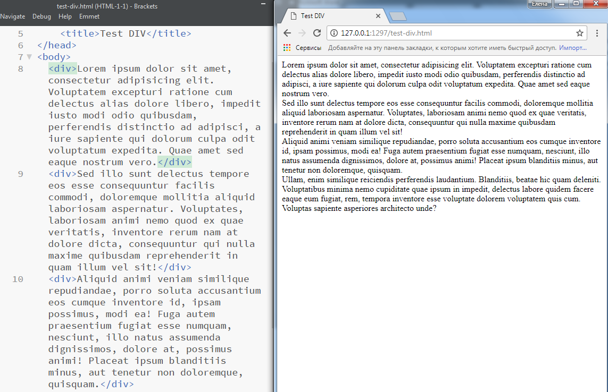

Рисунок 59

Візуально тег <div> виглядає не досить гарно — маса тексту без особливого форматування. Але цим він і зручний — для нього можна задати те CSS-форматування, яке потрібне для даної конкретної ситуації. І зазвичай для div-ів задають атрибут class, який дозволяє урізноманітнити зовнішній вигляд цих елементів. Але про це трохи пізніше, коли розглядатимемо стилі CSS.

Також часто всередині тексту використовують теги <span></span> (від англ. _інтервал_). Це малі теги, які призначені для об'єднання невеликої кількості тексту з метою завдання для нього загального форматування. Практично обов'язковим для тега span є атрибут class. Саме він дозволяє зробити форматування для різних <span> різноманітним за допомогою правил CSS.

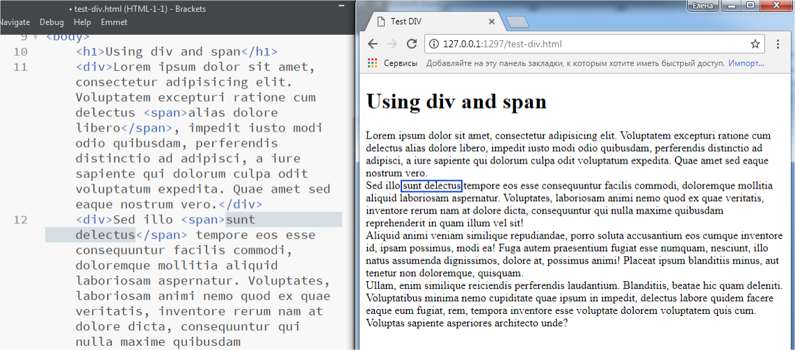

Рисунок 60

На рисунку вище бачимо, що виділений текст знаходиться у тегах <span>. Але візуально він ніяк не відрізняється від тексту ДО і ПІСЛЯ нього.

Але якщо ви розкоментуєте код у тегах style у файлі _test-div-span.html_, то зовнішній вигляд файлу, за відсутності змін у HTML-розмітці, одразу зміниться:

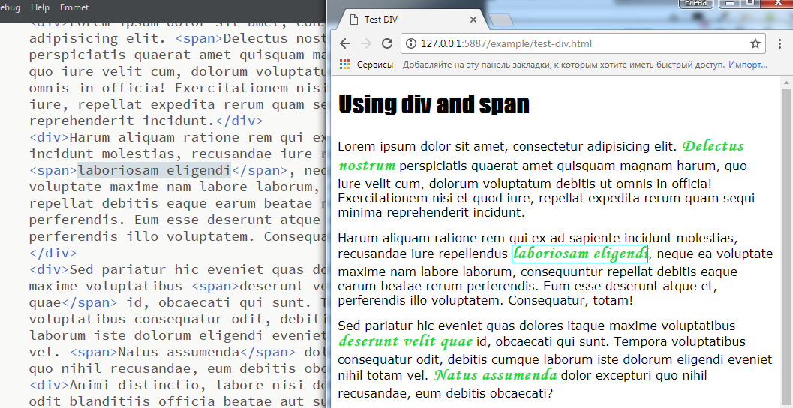

Рисунок 61

У прикладі показано однотипне форматування для всіх тегів у тексті, але при додаванні атрибута class його можна варіювати.

**Примітка.** _Щ__об додати або прибрати коментар до Brackets, потрібно натиснути клавіші_ _CTRL+/__. Якщо потрібно закоментувати/розко__м__ентувати 1 рядок, достатньо, щоб у ньому просто стояв курсор. Для коментування блоку тексту необхідно його виділити та натиснути_ _CTRL+/__._

### Мітки blockquote

Ще з блокових елементів розглянемо тег blockquote, який призначений для форматування будь-яких висловлювань — від відомих людей до директорів компаній, для яких створюється сайт.

```html
&lt;blockquote&gt; Блокова цитата &lt;/blockquote&gt;
```


На звичайних сайтах використовується цей тег нечасто, проте він дуже популярний на різних форумах.

На рисунку нижче наведено уривок з форуму про роботу з CMS Joomla, де цитуються слова одного з користувачів, і для цього використаний саме тег blockquote з відмінним від решти тексту CSS-форматуванням.

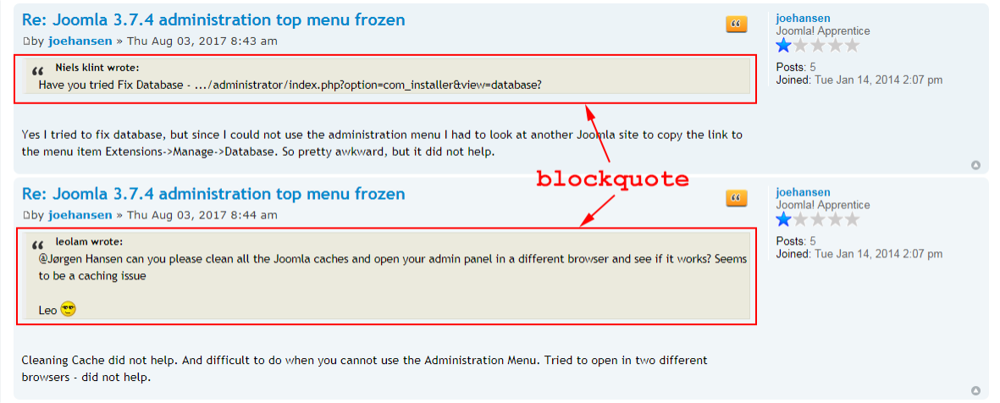

Рисунок 62

До речі, абревіатура Emmet для створення цього тега дуже проста:

```html
bq
```


За замовчуванням blockquote має відступи в 40px справа і зліва, а також відступи зверху і знизу, як в абзацах.

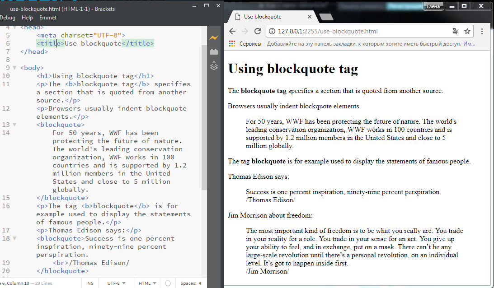

Рисунок 63

Розглянути приклад можна у файлі _blockquote.html_.

### Поодинокі теги

У прикладі blockquote всередині цитати був використаний тег <br> (від англ. _break_ — розбивати). Він призначений для перенесення за ним тексту, на наступний рядок і є малим, тобто, зазвичай розміщується у тексті абзаців, div-ів та інших елементів.

Оскільки тег немає внутрішнього вмісту, то закриваючий тег йому не потрібен, тобто, він відноситься до групи одиночних тегів або тегів без вмісту.

До них відноситься тег  для вбудовування зображень і ціла група тегів <input>, з яких складаються форми.

Розглянемо ще один такий тег — це <hr>, або горизонтальний рядок (від англ. _horizontal row_).

Власне, він і виводить у браузер горизонтальну лінію. HTML4.01, для якої можна було б задати ряд атрибутів, які в HTML5 є скасованими. Тому всі «прекраси» потрібно ставити через CSS.

У файл _blockquote.html_ можна додати горизонтальні лінії для візуального відокремлення цитат від тексту абзацу. Як видно з рисунка, <hr> — це блоковий тег, який займає весь доступний простір у браузері.

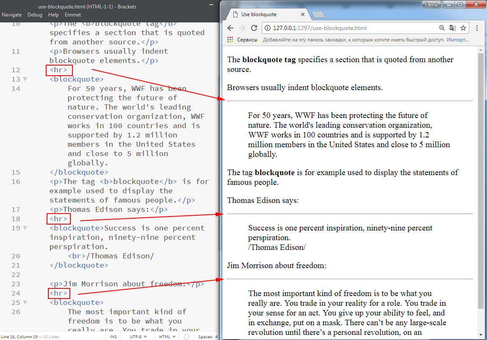

Рисунок 64

**Примітка.** _У XHTML для всіх одиночних тегів був обов'язковим закриваючий слеш в кінці через пробіл від імені тега, тому на ряді сайтів ви можете зустріти таке написання тегів:_

```html
&lt;br /&gt;
&lt;hr /&gt;
&lt;meta http-equiv = "Content-Type" content = "text/html; charset = utf-8" /&gt;
```


Наразі необхідності додавання слешу немає.

Давайте підсумуємо все, що ми дізналися зараз про HTML-форматування і виведемо це у вигляді списку правил.

## Правила HTML

1\. Всі недоліки, табуляція та початок нових рядків перетворюються на один великий недолік. Тому дуже бажано форматувати текст із відступами:

```html
&lt;body&gt;
&lt;h1&gt; Заголовок 1 рівня &lt;/h1&gt;
&lt;div id = "test"&gt;
    &lt;p class = "block"&gt; Lorem ipsum dolor sit amet, consectetur adipisicing elit. Odio rerum, praesentium repellat cupiditate dolorum voluptatum. &lt;/p&gt;
    &lt;p class = "block"&gt; Blanditiis similique, modi oficiis, dignissimos asperiores totam quae aut doloribus quam esse reprehenderit quos sed. &lt;/p&gt;
    &lt;p class = "block"&gt; Eum facilis voluptates ut dicta, delectus, tempore animi repudiandae qui quis voluptas maxime ullam, assumenda. &lt;/p&gt;
&lt;/div&gt;
&lt;/body&gt;
```


2\. Весь текст має бути відформатований у вигляді тегів. Обов'язково мають бути початковий та кінцевий:

```html
&lt;елемент&gt; Текст елемента &lt;/елемент&gt;
```


3\. Якщо елемент не має вмісту, кінцевий тег йому не потрібен.

```html
&lt;br&gt;
&lt;hr&gt;
```


4\. Завжди мають бути теги основи: <html>, <head>, <title>, <body>. І вони мають відповідати змісту документа.

5\. Правило «матрьошки»: завжди дотримуватися вкладеності елементів і не допускати їх перетину:

```html
&lt;b&gt;&lt;i&gt; Текст усередині тегів &lt;/i&gt;&lt;/b&gt;
```


6\. Значення атрибутів завжди беруться у лапки. Атрибутів елемента може бути декілька, вони відокремлюються один від одного пробілами:

```html
&lt;img src = "images/someimage.jpg" alt = "Альтернативний текст" id = "pic"&gt;
```


7\. Універсальними атрибутами для всіх тегів є: id, class, style, title, tabindex.

```html
&lt;div id = "box" class = "block" title = "Блоковий елемент" style = "font-family: Verdana, Tahoma, sans-serif"&gt; 
     Текст елемента 
&lt;/div&gt;
```


8\. Коментарі в HTML призначені для того, щоб приховати частину коду та записуються так:

```html
&lt;-- Коментар --&gt;
```


## Стилі CSS

От ми й дісталися візуального форматування сторінки. З погляду семантики, необхідно відокремлювати «мух від котлет», тобто, візуальне форматування сторінки сайту з його HTML-структурою. А CSS якраз і займається форматуванням. І має масу властивостей для цього у своєму арсеналі.

Існують чотири способи, як додати CSS-форматування:

1.  За допомогою атрибуту style;
2.  Всередині тегів <style> у блоці <head>;
3.  За допомогою тега <link>;
4.  За допомогою директиви @import.

У цьому занятті ми розглянемо перші 2 способи. Інші залишимо для наступних уроків.

### Внутрішні стилі CSS (inline styles)

Спочатку розглянемо, як можна задати форматування для кожного елемента.

Тому призначений атрибут style, про який вже йшлося, є одним із універсальних, і застосовується для будь-якого тегу.

Наприклад, нам необхідно змінити колір і стиль тексту для абзацу, а також призначити для нього інший шрифт. Робиться це так:

```html
&lt;p style = "color: #999; font-style: italic; font-family: 'Open Sans', Verdana, Tahoma, sans-serif"&gt;
```


Тобто, в атрибуті style, який, нагадаю, записується тільки у початкові теги, необхідно розмістити пари «властивість: значення», відокремлені один від одного крапкою з комою. Після останнього значення властивості ставити крапку з комою необов'язково. Важливо додати її, якщо ви ще хочете написати одну властивість.

На рисунку нижче видно різницю між звичайними абзацами та абзацом з форматуванням в атрибуті style:

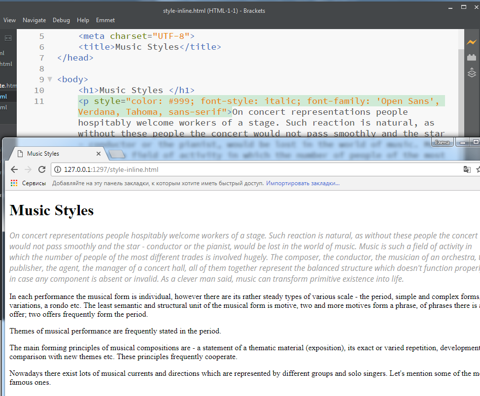

Рисунок 65

Якщо ми хочемо одноманітно відформатувати всі абзаци, доведеться скопіювати цей атрибут з усіма його значеннями і додати до всіх абзаців:

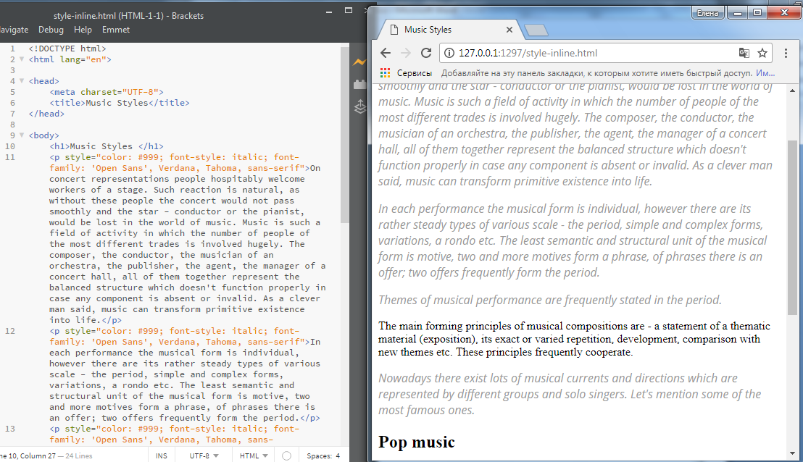

Рисунок 66

Вже виглядає краще, чи не так?

А тепер уявімо, що ми передумали задавати колір тексту у вигляді color: #999, а хочемо його зробити, наприклад, темно-синім. Для дослідів ви можете використати файл _inline-style.html_.

У цьому випадку, звичайно, допоможе нам пошук і заміна тексту (клавіші CTRL+H):

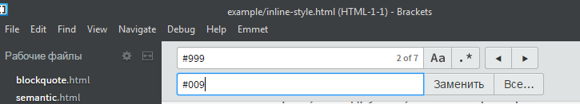

Рисунок 67

У полях введення потрібно вказати, що ми замінюємо у першому і на що — у другому, а потім натиснути на кнопку «Все». Заміняться всі рядки, в яких текст мав світло-сірий колір.

Все спрацювало — колір став темно-синім:

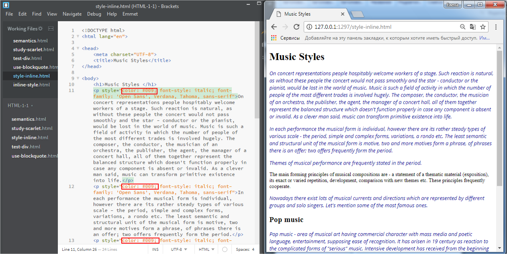

Рисунок 68

Але, припустимо, що блоків у нас багато, і не в усіх можна замінити колір на запропонований. Тоді пошук та заміну ускладнено. А якщо ще потрібно змінювати шрифт і стиль, то головний біль стане набагато сильнішим. Тому цей метод — додавання стилів через атрибут style — підходить або на початку вивчення HTML/CSS, або коли у вас немає іншого виходу — наприклад, при редагуванні тексту статей у CMS Wordpress або Joomla, де ви частину тексту інакше не виділите.

### Стилі для сторінки

Набагато краще навіть на початковому етапі використовувати другий спосіб — форматування всередині сторінки у спеціальних тегах <style></style>, які розміщуються у нижній частині блоку <head>. У цьому випадку стилі використовуються лише для тієї сторінки, на якій вони будуть розміщені. Це якраз прийнятний варіант для початку навчання HTML і CSS — в межах одного документа ви бачите і HTML-розмітку, і CSS-стилі.

Цей вид форматування дозволяє встановити стилі для селекторів CSS — спеціальних описів для елемента або групи елементів, до яких застосовуються певні стильові правила форматування.

На даний момент CSS3 надає нам безліч різних селекторів, з якими ми знайомитимемося послідовно на різних прикладах. Зараз зупинимося на простих селекторах: універсальний селектор, селектор елемента, або тега, селектор групи, селектор класу та селектор id.

### Селектор елемент

Почнемо з селектора елемента та розглянемо загальний синтаксис. На рисунку 69 ми бачимо, що селектором є тег p, у фігурних дужках розміщується блок правил для цього селектора, а самі правила є парою «властивість: значення» і відокремлюються один від одного крапкою з комою.

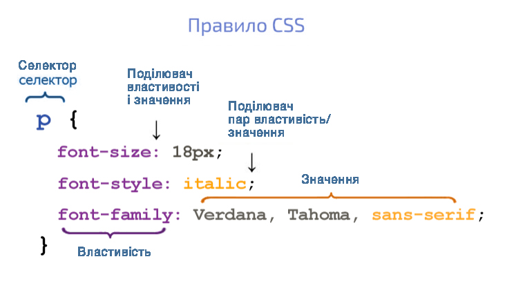

Рисунок 69

Схоже на вбудований стиль, чи не так? Різниця полягає лише в тому, що такі правила застосовуються одразу до всіх абзаців у документі — і не потрібно копіювати їх у кожен. До того ж — при зміні будь-якої з властивостей або при додаванні нової, відразу всі абзаци змінять форматування, без необхідності використовувати «Пошук та Заміну».

Додаємо в запропоновані правила інший колір, і ось що отримаємо:

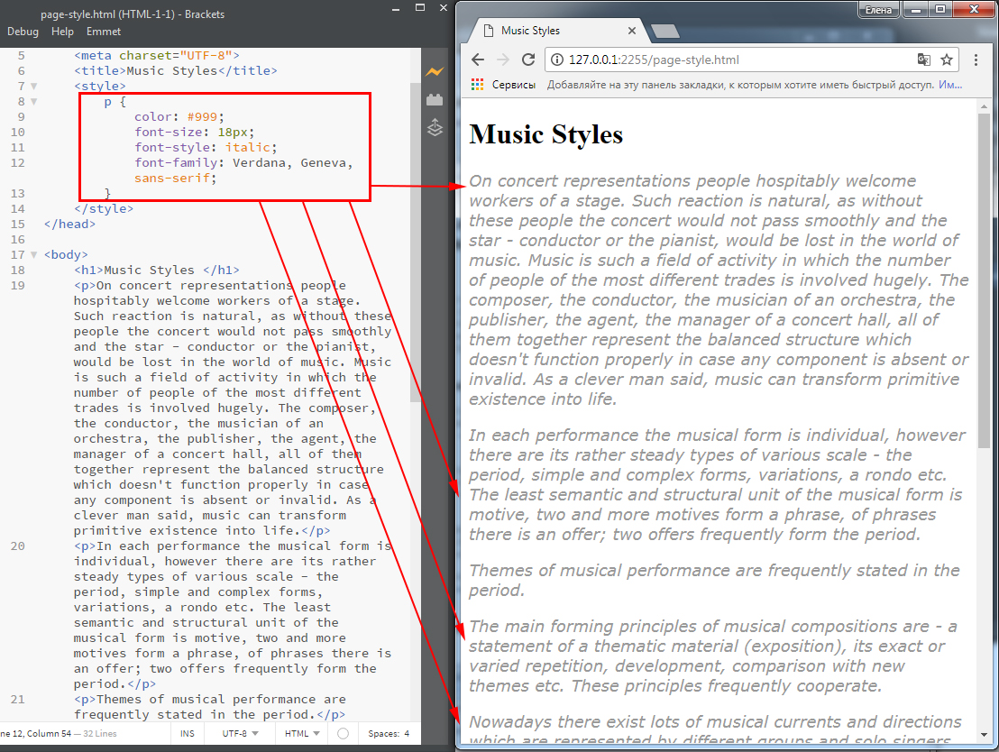

Рисунок 70

Як ми бачимо з рисунку, всі абзаци в документі змінили форматування без зайвих зусиль із копіюванням з нашого боку.

### Універсальний селектор

Універсальний селектор застосовується для призначення правил одразу для всіх елементів на сторінці, включаючи html і body. Позначається за допомогою зірочки (\* — клавіші SHIFT+8).

Він потрібний для того, щоб встановити однакові правила для всіх елементів сторінки. Наприклад, замість того, щоб задавати розмір шрифту (font-size) та сімейство шрифту (font-family) тільки для абзаців, встановимо їх одразу для всієї сторінки:

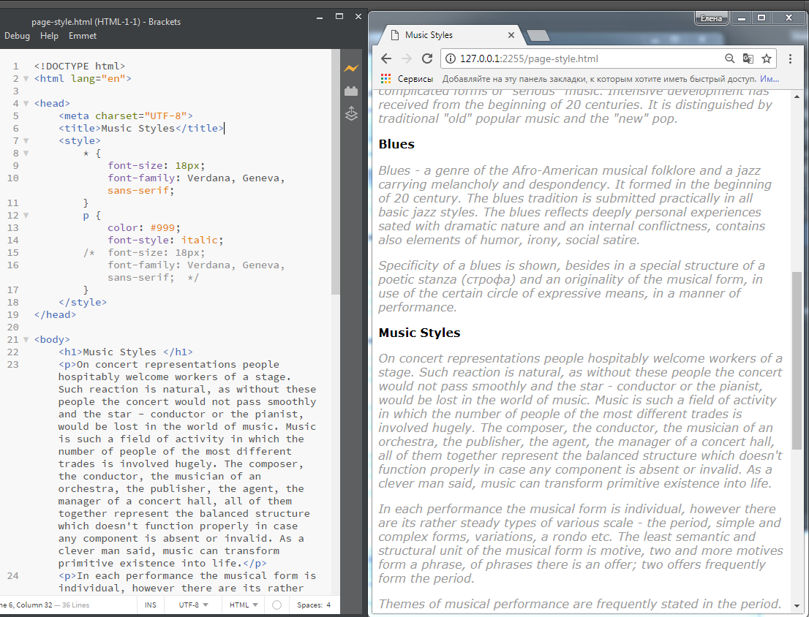

Рисунок 71

Оскільки у нас не так багато елементів на сторінці, розмір та сімейство шрифту застосовувалися до абзаців та заголовків. Зверніть увагу, що заголовки стали меншими, ніж були раніше.

**Примітка.** _Н__асправді для універсального селектора частіше задають дещо інші правила, але з ними ви познайомитеся під час_ _тем_ _«Блокова_ _модель елементів». Ті_ _правила, які ми зараз поставили для \* зазвичай записують для селектора елемента body._

### Коментарі в CSS

Зверніть увагу, що коментарі в CSS відрізняються від коментарів в HTML і задаються за допомогою

```html
/* … */
```


У Brackets всередині тегів ці коментарі також створюються за допомогою клавіш CTRL+/ — програма сама визначає, які коментарі потрібні в цих тегах.

### Селектор групи або груповий селектор

Як випливає з назви, селектор групи застосовується до групи елементів, класів, id або поєднань цих селекторів. У ньому всі потрібні вам селектори перелічені через кому.

```html
h1, h2, h3 {
    font-family: 'Bookman Old Style', monospace;
    line-height: 150%;
    letter-spacing: 1px;
}
```


Потрібен такий селектор для того, щоб зменшити кількість коду однотипних елементів. У прикладі для всіх заголовків було змінено шрифт, міжрядкову відстань та відстань між літерами.

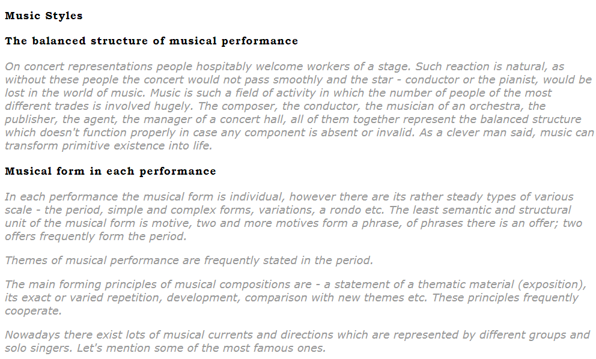

Рисунок 72

Згодом розглянемо приклад із класами, де груповий селектор виглядає так:

```html
.cursive, .fantasy {
    font-weight: bold;
    letter-spacing: 2px;
    font-size: 1.5rem;
}
```


### Селектор id

Селектор id має на увазі, що на сторінці для якогось одного елемента вказаний атрибут id — унікальний ідентифікатор (_identifier_). Значення цього атрибута в лапках не може повторюватися в межах однієї сторінки, інакше жодної унікальності не вдасться. Позначається селектор id символом «дієз» # поруч зі значенням атрибута id потрібного елемента. У прикладі нижче ми використовуємо 2 різні id для того, щоб задати різний колір фону різним заголовкам:

```html
#main-header {
    background-color: #adf5ad;
}
#use-technology {
    background-color: #ffeb95;
}
```


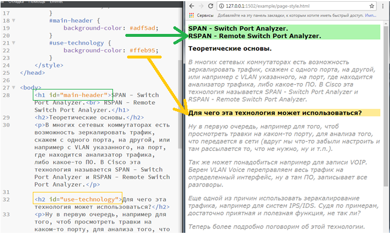

Рисунок 73

У HTML-розмітку ми додали саме такі id для різних заголовків. Подивитися приклад можна у файлі _page-style.html_.

Зверніть увагу, що значення кожного id представлено в єдиному екземплярі. Це важливо, інакше не можна говорити про унікальність та валідність документа.

### Селектор класу

Селектор класу — це №1 за популярністю при верстці сторінки. Будь-яка справжня сторінка містить багато елементів з різними класами у вигляді атрибутів. І найчастіше такими елементами є div-и та вкладені в них span-и.

У прикладі нижче в HTML-розмітці використані 3 div-а з класом «block» та 3 div-а з класом «box». У файлі _style-class.html_ ви знайдете абревіатури Emmet для того, щоб зробити це самостійно. Для кожного з них заданий набір правил, який змінює розмір та сімейство шрифту, а також формує межі різного типу у нижній частині div-а:

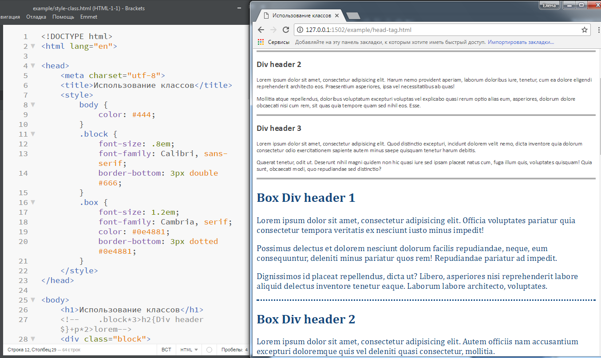

Рисунок 74

На додаток, у <div class="block"> колір тексту змінено на темно-синій. Поки що ми не будемо додавати складніші правила стилів, але саме для селекторів класів зазвичай задають досить багато стильових правил.

Додаємо ще в розмітку елементи span c класами «cursive» та «fantasy» і задаємо для них ряд загальних та спеціальних правил:

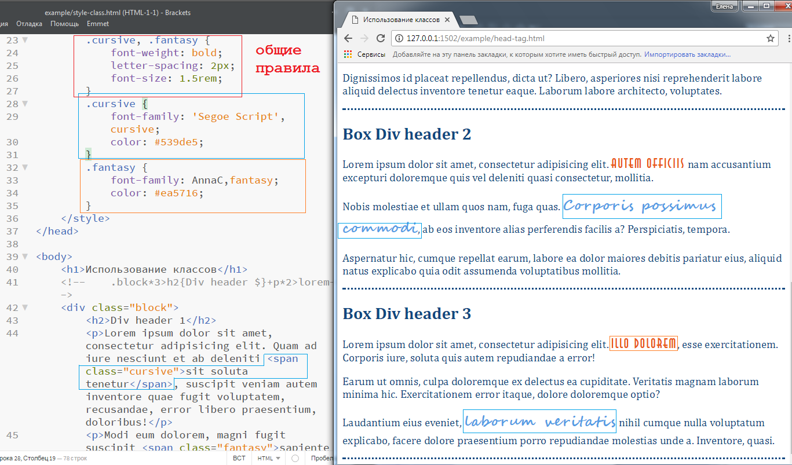

Рисунок 75

В результаті побачимо, що в документі частина тексту стане помаранчевого та блакитного кольору з дещо збільшеним розміром шрифту. Одразу попередимо, що не у всіх вас на комп'ютерах зовнішній вигляд тексту збігається з тим, що ми бачимо на рисунку, тому що це залежить від встановлених у системі шрифтів.

Детальніше про селектори:

## CSS-властивості

Ми вже розглянули частину CSS-властивостей, але не надто детально зупиняючись на їх значеннях. Вважаю, було інтуїтивно зрозуміло, що властивість color відповідає за колір шрифту, а font-size — за розмір шрифту елемента.

Тепер давайте поговоримо про властивості та їх можливі значення докладніше. Відразу зазначу, що в рамках першого заняття ми розглянемо найнеобхідніші. Решту ми розглядатимемо в ході вивчення курсу.

### Варіанти призначення кольору

Для встановлення кольору різних елементів можна використовувати декілька правил. Ми розглянемо сьогодні властивість color, що відповідає за колір тексту, та background-color, що управляє кольором фону елемента.

І в тій, і в іншій властивості можна задавати значення в наступних форматах:

```html
color: blue; /* назва кольору англійською мовою */
color: #ff0000; /* 16-річне значення кольору, що використовує цифри від 0 до 9 та літери від a до f */
color: #f00; /* усічене 16-річне значення для кольорів, у яких однакові пари цифр */
color: rgb (255, 0, 0); /* значення кольору у системіrgb. По кожному каналу r - red, g - green, b - blue значення кольору змінюються від 0 до 255 одиниць*/
color: rgba(255, 0, 0, .5); /* значення кольору системіrgb+ альфа-канал, тобто, можливість задати прозорість для кольору від 0 до 1*/
color: hsl(0, 100%, 50%); /* значення кольору у системіhsl- hue -saturation - lightness */
color: hsla(0, 100%, 50%, .5); /* значення кольору у системіhsl+ альфа-канал, тобто, можливість задати прозорість для кольору від 0 до 1*/
```


З усіх наведених варіантів найменш зрозумілими, мабуть, будуть два останніх, оскільки колірна система HSL (Hue, _Saturation and Lightness_ — тон, насиченість та світло) навряд чи була предметом вашого вивчення на курсі Photoshop — там вона теж нечасто використовується (для Web, принаймні).

Всі ці варіанти можна взяти з Палітри кольорів (Color Picker) у Photoshop. Тільки у цій програмі (на рисунку версія CS6) замість системи HSL — HSB (B — brightness — яскравість).

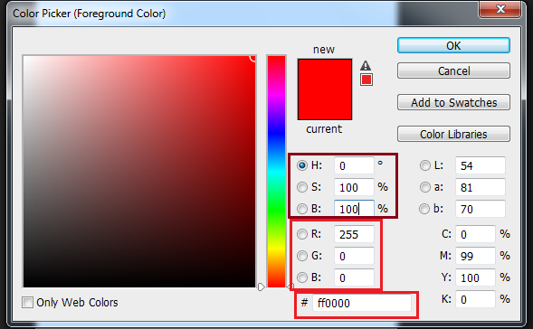

Рисунок 76

Що стосується Brackets, то одним з його «плюсів із коробки» є дуже простий вибір та зміна колірних властивостей. Щоб подивитися, створіть теги style, для селектора будь-якого елемента, наприклад, для p, задайте властивість color з будь-яким із вищенаведених значень. А потім наведіть курсор усередині значення кольору та натисніть CTRL+E (від англ. _edit_ — редагувати). Для тих, хто любить контекстне меню, зробивши правий клік на значенні кольору можна вибрати пункт «Швидке редагування».

**Примітка.** _Закрити панель швидкого редагування кольору можна повторним натисканням клавіш_ _CTRL+E__, клавішею ESC або на хрестик зліва вгорі._

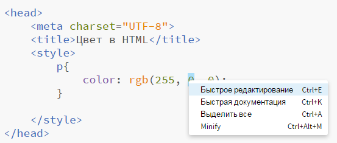

Рисунок 77

Будьте уважні, щоь не помиліться, оскільки якщо курсор перебуватиме всередині властивості або за межами значення цієї властивості, натискання на CTRL+E викликає повідомлення про помилку:

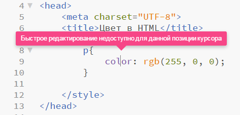

Рисунок 78

Отже, ви натиснули CTRL+E та можете вибирати між системою RGBa, Hex, HSLa. За замовчуванням у вас буде система Hex з 16-річним значенням кольору. Що стосується систем RGBa або HSLa, то спочатку прозорість у них не передбачена. Задати її можна, переміщуючи бігунок на смужці праворуч від палітри кольору.

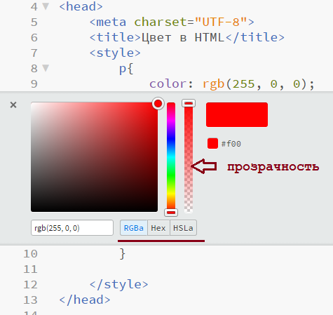

Рисунок 79

Ще декілька зауважень щодо кольору:

1\. Якщо ви задаєте його значення як слово, то Brackets підкаже вам всі варіанти кольорів, куди це слово (або його частина) входить.

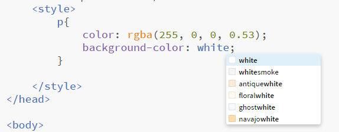

Рисунок 80

2\. Якщо ви використовували кілька кольорів у проєкті, призначаючи колір для нового елемента, в панелі швидкого редагування ви можете побачити список усіх кольорів, які вже були використані раніше. Клацніть на будь-якому з них, і він буде призначений для вашого селектора.

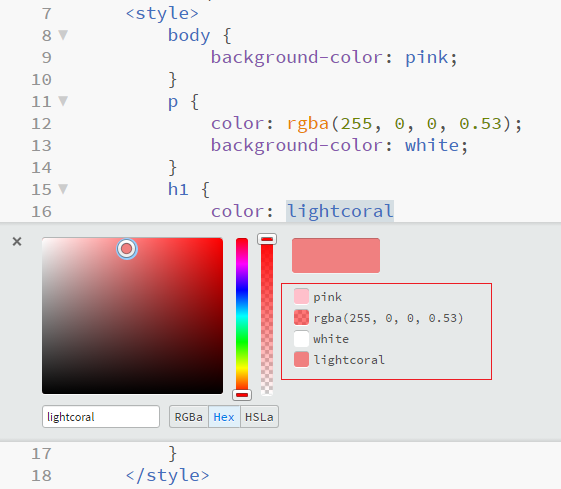

Рисунок 81

3\. Якщо ви не знаєте, який колір вам потрібен або вам не подобається обраний, помістіть курсор після двокрапки та натисніть CTRL+пробіл — це виклик підказки. І вибирайте із значень кольору:

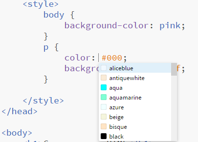

Рисунок 82

4\. Якщо вам потрібно самостійно підібрати відтінки кольорів, розташованих поряд для їх гармонічного поєднання, наприклад, для кольору фону — світліше, а для тексту — темніше, задайте спочатку однакові значення для обох кольорів, а потім, викликавши палітру і натиснувши CTRL+E, перемістіться у більш темну область:

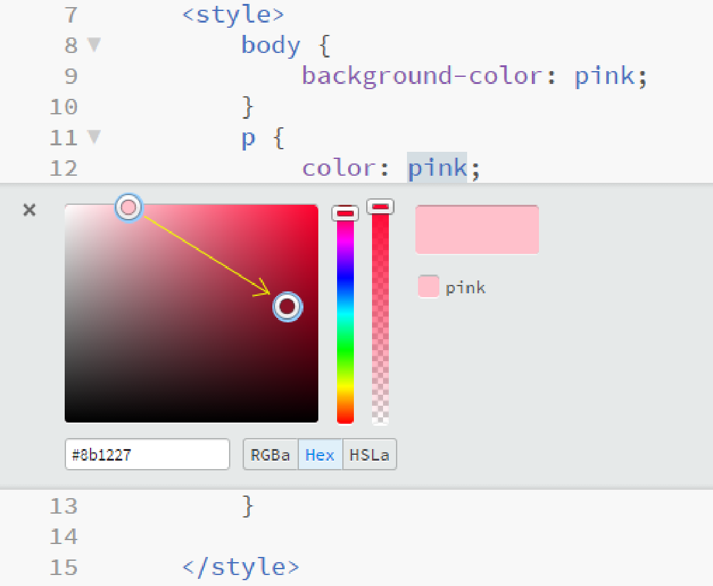

Рисунок 83

5\. І, насамкінець, згадаємо про абревіатури Emmet. У CSS вони також працюють. Для властивості color достатньо написати «c» та натиснути TAB, а для background-color — набираємо bgc та TAB. Абревіатури розкриються зі значеннями кольору за замовчуванням (чорним для кольору тексту та білим — для кольору фону):

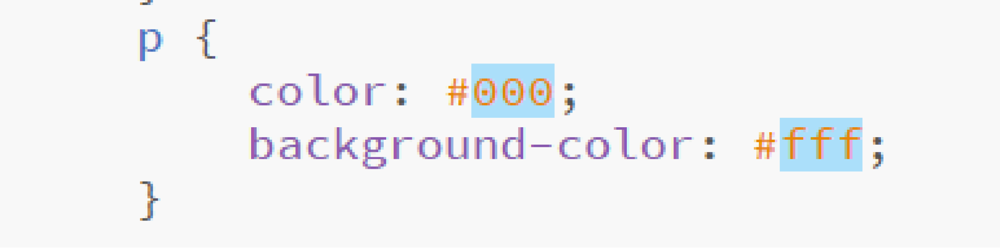

Рисунок 84

Значення після знаку # виділені, тому одразу можете вводити потрібні вам або натиснути CTRL+E, щоб їх підібрати.

### Властивості шрифту

Англійською шрифт — це font, тому властивості для шрифту в CSS починаються саме з цього слова. Їх декілька, і вони виконують наступні зміни шрифтів на сторінці:

1\. На сімейство шрифтів вказує властивість font-family. У значенні цієї властивості можна перелічити через кому кілька шрифтів у тій послідовності, в якій ви (або замовник) хотіли б, щоб вони відображалися на сайті. Наприклад, як у записі.

```html
body { font-family: Lato, Verdana, Geneva, sans-serif; }
```


передбачає, що браузер спочатку спробує відобразити текст за допомогою шрифту _Lato_. Але, якщо його немає на комп'ютері користувача, виведе вміст шрифтом _Verdana_. Якщо ж і шрифт _Verdana_ відсутній, буде використано шрифт _Geneva_. І в тому випадку, якщо немає жодного із зазниченихних шрифтів, буде використаний шрифт за замовчуванням, тип якого задається спеціальним ключовим словом (їх ще називають шрифти-псевдоніми):

-   serif — для шрифтів із зарубками (за замовчуванням зазвичай _Times New Roman_);
-   sans-serif — для шрифтів без зарубок або рубаних шрифтів (зазвичай _Arial_)
    
    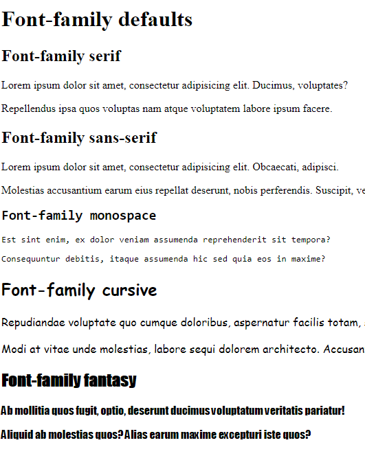
    
    Рисунок 85
-   monospace — для моноширинних шрифтів, у яких символи мають однакову ширину (зазвичай _Consolas_ або _Courier New_);
-   cursive — для курсивних шрифтів (як варіант — _Comic Sans MS_);
-   fantasy — для фантазійних або декоративних шрифтів (представник — _Impact_).

Прийнято вказувати шрифт-псевдонім останнім, після найбільш відповідних варіантів. Але, якщо вас, наприклад, цілком влаштовує стандартний шрифт без зарубок _Arial_ (а web-сторінки зазвичай використовують рубані шрифти), то ви можете скоротити запис властивості:

```html
body { font-family: sans-serif; }
```


Для тестів можна використовувати файл _font-family-test.html_.

Подивитися, які шрифти використовуються за замовчуванням, можна налаштувати браузер. Наприклад, для Chrome вони виглядають так:

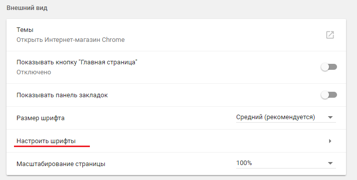

Рисунок 86

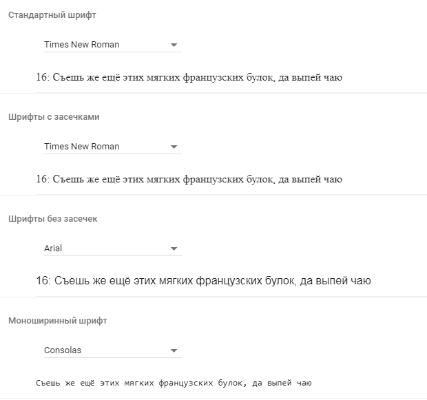

Рисунок 87

**Примітка.** _Якщо ви використовуєте шрифт, назва якого складається з 2-3 слів, слід вказувати ім'я шрифту в одинарних або подвійних лапках:_

```html
body { font-family: 'Arial Narrow', Calibri, sans-serif; }
h1 { font-family: "Bookman Old Style", Cambria, serif; }
```


Абревіатури Emmet: ff, ffv, ffa, fft, ffs, ffss, ffm, ffc, fff.

2\. Стиль шрифту визначається властивістю font-style. Значення: normal italic oblique inherit. Перше значення — normal — це значення за замовчування, тобто, звичайне зображення тексту. Значення italic — це курсивне накреслення, яке передбачає наявність курсивного шрифту в системі користувача, oblique — накреслення шрифту з нахилом, в herit — успадковує значення батьківського елемента.

Абревіатура Emmet: fs, fsi, fso, fsn.

3\. За насиченість шрифту відповідає властивість font-weight, що має значення normal Болд Болдер lighter 100 200 … 800 900 inherit. За замовчуванням використовується значення normal — звичайна насиченість шрифту, яка відповідає файлам шрифту, до яких входить слово Regular. Відповідно значення bold відповідає за напівжирне накреслення. Значення bolder та lighter змінюють жирність шрифту у більшу чи меншу сторону щодо значення цієї властивості у батьківського шрифта. Одиниці від 100 до 900 вказуються з кроком у 100 і розподіляються так: від 100 до 300 — це, як правило, тонкий шрифт, 400-500 — звичайне зображення, від 600 — напівжирне зображення. Якщо розглядати їх докладніше, то зображення в одиницях має такі значення:

-   100 — Thin (Hairline);
-   200 — Extra Light (Ultra Light);
-   300 — Light;
-   400 — Normal;
-   500 — Medium;
-   600 — Semi Bold (Demi Bold);
-   700 — Bold;
-   800 — Extra Bold (Ultra Bold);
-   900 — Black (Heavy).

Справжнє відображення шрифтів на сторінці дуже залежить від того, скільки файлів шрифту складає вибраний шрифт для сторінки або елемента. Наприклад, шрифт _Lato_, який встановлений у мене для дизайнерських цілей, і, швидше за все, відсутній на вашій машині, має таку кількість файлів шрифту:

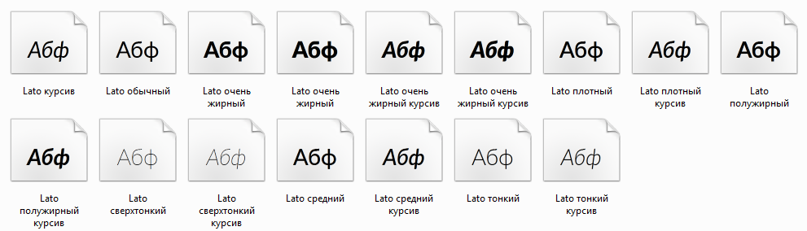

Рисунок 88

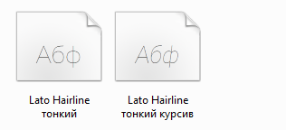

Рисунок 89

Тому для цього шрифту можна вибирати різні значення font-weight, і вони відрізнятимуться один від одного. Для інших шрифтів різниця буде куди меншою, оскільки вони можуть складатися із 1-3-5 файлів.

Ви можете переглянути різні варіанти зображення, задані за допомогою властивості font-weight у файлі _font-weight-test.html_, але для цього вам необхідно завантажити шрифт _Lato_ і встановити його до себе в систему. Робиться це звичайним копіюванням файлів шрифтів, наприклад, у форматі _ttf_, у системну папку _C:\\Windows\\Fonts_.

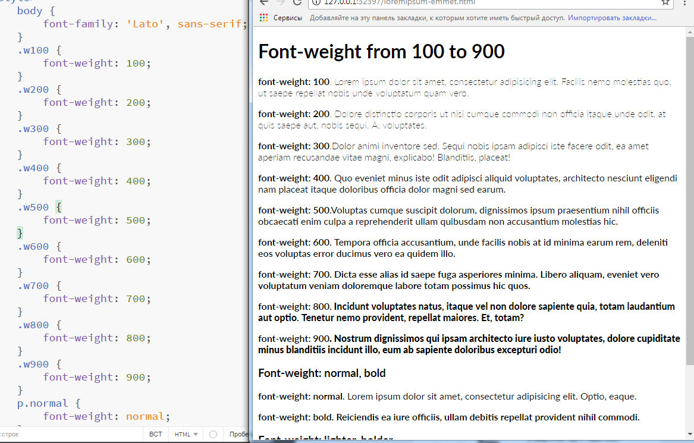

Рисунок 90

У нижній частині файлу _font-weight-test.html_ використані вкладені елементи в <div class = "parent"> зі значеннями властивості font-weight bolder та lighter. На рисунку видно, що до абзацу з основним текстом (Main text), верхній абзац має більш тонкі символи, а нижній — більш жирні.

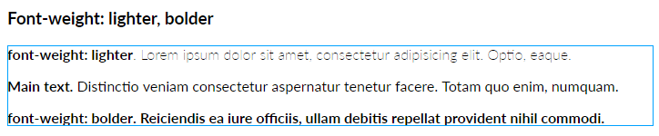

Рисунок 91

Абревіатура Emmet: fw, fwb, fwbr, fwlr, fwn, fw200.

4\. Розмір шрифту font-size. Вказується він у різних одиницях: cm, mm, pc, px, pt, em, rem, %, рідше — ex, vh або vw, а також в абсолютному і відносному розмірі. Ще розмір шрифту може мати значення в herit, тобто успадкований від батьківського. Щоб вказівки абсолютний розмір використовуються ключові слова xx-small, x-small, small, medium, large, x-large, xx-large. Для відносного розміру шрифту використовуються значення larger та smaller. Розмір шрифту батьківського елемента береться за 100%. Неможливо використовувати негативні значення.

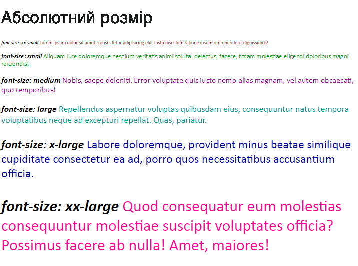

Рисунок 92

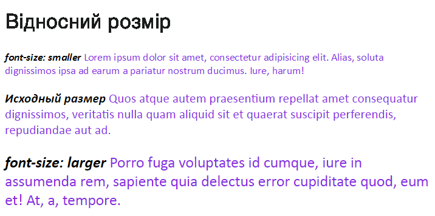

Рисунок 93

Варіанти призначення розміру шрифту наведено у файлі _font-size-test.html_. Потрібно помітити, що зараз найчастіше вказують розмір шрифту px, em, rem і в %. Решта варіантів рідко використовується.

Абревіатура Emmet: fz, fz: 15, fz: 120%.

5\. Варіанти зображення малих літер — властивість font-variant зі значеннями normal small-caps inherit. Нормальне накреслення (normal) — це звичайний вид літер, і це значення за замовчуванням, а small-caps, чи капітель, всі малі символи відображає як великі, але зменшеного розміру. Значення inherit вказує на те, що ця властивість успадковується від батьківського елемента.

У нижній частині файлу _font-weight-test.html_ ви знайдете приклад властивості font-variant зі значенням small-caps:

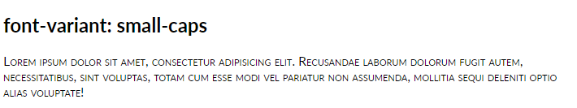

Рисунок 94

Абревіатура Emmet: fv, fvs.

6\. Висота рядка — інтерліньяж, або міжрядковий інтервал — властивість line-height. Ця властивість не належить безпосередньо до групи fonts, але пов'язана з цими властивостями, оскільки складно уявити добре відформатований текст без вказання висоти рядка. Як значення цієї властивості, можна задати множник значення у будь-яких одиницях відсотки normal inherit. Зазвичай висота рядка задається не менше 120% або множником 1.2, але вона залежить від самого шрифту і обчислюється автоматично (значення normal). Від'ємні значення не допускаються. Найчастіше інтерліньяж вказується у вигляді множника або у відсотках. Переглянути варіанти відображення різних значень цієї властивості можна у файлі _line-height-test.html_. Ще варто почитати цю статтю — Властивості «font-size» та «line-height».

Абревіатура Emmet: lh, lh: n, lh: 1.5, lh: 140%.

7\. Універсальна властивість font, яка дозволяє вказати відразу кілька характеристик шрифту, які задаються зазначеними раніше властивостями. Всі значення його властивостей вказуються через пробіл. Виняток становить розмір шрифту та висота рядка — вони вказуються через слеш. Синтаксис цієї властивості такий:

```html
font: [font-style font-variant font-weight font-stretch] 
       font-size [/line-height] font-family inherit
```


Обов'язковими у цій властивості є розмір та сімейство шрифту. Решта всіх властивостей задаються при необхідності в тому порядку, який представлений вище. З властивістю font-stretch вам доведеться познайомитись самостійно, оскільки вона не надто часто використовується.

Слід зазначити, що всі властивості, які ви не вказали, набувають свого значення за замовчуванням.

Протестувати деякі варіанти використання властивості font можна у файлі _font-test.html_.

### Вирівнювання тексту

Властивість text-align необхідна для вирівнювання тексту в блоковому елементі по лівому краю (left — значення за замовчуванням), по правому краю (right), по центру (center) або ширині (justify). І саме його варто використати, коли ви хочете центрувати текст замість застарілого тегу <center>.

```html
text-align: left right центр Justify start end
```


Нові значення start і end з'явилися у специфікації CSS 3.0 та позначають наступне:

-   start — працює так само, як і left, якщо текст йде ліворуч, і як right, якщо текст йде справа наліво;
-   end — працює так само, як і right, якщо текст йде ліворуч, і як left, якщо текст йде справа наліво;

Протестуйте вирівнювання тексту за допомогою файлу _text-align-test.html_.

Абревіатура Emmet: ta:l, ta:r, ta:c, ta:j.

### Одиниці вимірювань у CSS

Важливо: будь-які одиниці вимірювань пишуться разом із цифрами. Тобто, не можна поставити цифру, пробіл, а потім вказати одиницю виміру.

Вірно: 16px.

У CSS існують абсолютні та відносні одиниці вимірів.

Що стосується абсолютних одиниць, то CSS можна використовувати звичні нам зі школи знайомі сантиметри (cm) і міліметри (mm), менш звичні дюйми (in), характерні для друкарень пункти (_pt — 1/72 дюйма_) та піки (_pc — 1/6 дюйми_). Але варто зазначити, що у реальній верстці використовуються вони дуже рідко. Проте є ще одна абсолютна одиниця — піксель, або px, — використовується часто, тому що саме в пікселях вимірюється роздільна здатність монітора або іншого екрана; і браузер також багато величин перераховує у пікселях.

А от відносні одиниці використовуються дуже часто. Мабуть, найчастіше використовуваними одиницями є em і rem, які з'явилися нещодавно, а також відсотки (%).

Що між ними є спільного? 1em та 100% — це розмір шрифту батьківського елемента. Тобто, якщо для body записано таке правило:

```html
body { font-size: 14px}
```


А для заголовка першого рівня таке:

```html
h1 { font-size: 3em }
```


То браузер розрахує розмір заголовка в пікселях, відштовхуючись від розміру шрифту його батька (тобто body), а саме:

```html
3*14px = 42px
```


Якщо для h1 буде записано правило:

```html
h1 { font-size: 300% }
```


То розрахунок буде аналогічним:

```html
14px*300%/100% = 14px*3 = 42px
```


Тобто, і em, % відштовхуються від розміру шрифту батьківського елемента. Майте на увазі, що шрифтові властивості успадковуються почергово. Тобто, якщо h1 знаходиться в <div class="logo">, наприклад, а не безпосередньо в body, і для <div class="logo"> не заданий розмір шрифту, то для div-а шрифт теж становитиме 14px, а заголовок буде розрахований за тією самою схемою. А ось, якщо буде встановлено правило:

```html
.logo { font-size: 1.3em }
```


То шрифт заголовка буде наступного розміру:

```html
14px (від body)*1.3 (для .logo) *3 (для h1) = 54.6px
```


І такий самий розрахунок у %, лише потрібно ще поділити на 100.

Одиниця виміру 1rem (_root em_) вказує на розмір шрифту, який дорівнює розміру, вказаному для шрифту кореневого елемента розмітки — тега <html>. Цей розмір встановлюється в браузері користувача (зазвичай це 16px); або задається для HTML-сторінки. І всі розрахунки здійснюються відносно цього розміру.

Ще одна відносна одиниця: 1ex — відштовхується від висоти символу x шрифту елемента в нижньому регістрі. Але за наявності більш зручної одиниці em, на практиці використовується дуже рідко.

Наразі використовують такі одиниці, як 1vw (_1% viewport width_) та 1vh (_1% viewport height_), розраховуються відносно щодо розмірів області перегляду — ширини або висоти відповідно. Використовують їх частіше не для вказівки розмірів шрифту, а для встановлення таких CSS-властивостей, як width і height, про які ми поговоримо на наступних заняттях. Також можна використовувати одиниці vmin або vmax, які позначають менше або більше значення vw і vh.

Детальніше про одиниці вимірів:

## Домашнє завдання

Сьогодні у вас буде творче домашнє завдання. Вам необхідно написати свою автобіографію або своє резюме, використовуючи теги та CSS-властивості, які ми розглянули на цьому занятті.

Не забувайте розбити текст на заголовки та абзаци, виділяти важливі моменти тегами <strong> або <em>. Можливо, ви використаєте <hr> або <blockquote>, або теги <div> та <span> із класами, CSS-форматування.

Як приклад наведу автобіографію однієї з моїх студенток. Гумор та самоіронія вітаються. Як і грамотність + стиль.

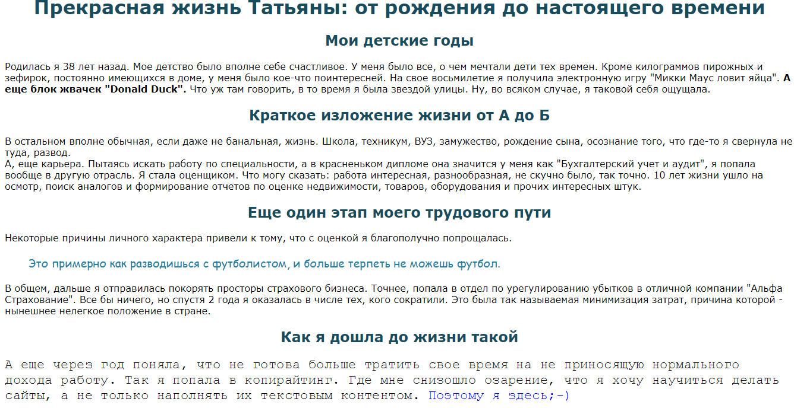

Рисунок 95