## Форматування тексту за допомогою HTML

На попередньому занятті ми розглянули ряд тегів, які складають базову структуру HTML-документу та дозволяють розділити текст на основні блоки — абзаци, заголовки, div-и. Як ви розумієте, цих тегів недостатньо для створення повноцінної HTML-сторінки, в якій міститься досить багато елементів.

Сьогодні наше завдання — розібратися з класифікацією тегів беручи до уваги простір сторінки, яку вони займають, і семантику, яка є логічною структурою розмітки документа.

## Блокові та рядкові теги

Ми вже розглядали різницю між блоковими і рядковими елементами на минулому уроці. Повернемося до цього питання знову, оскільки воно має важливе значення при розмітці HTML-документу.

**Блоковими** (_block_) називають ті елементи HTML, які за замовчуванням займають весь доступний простір браузеру або батьківського елементу, навіть якщо їх вміст зовсім невеликий. **Рядковими** (або _inline_ — лінійними) елементами називаються такі елементи, які займають стільки місця, скільки в них знаходиться тексту, і розміщуються вони всередині блокових. Важливо, що рядкові елементи завжди будуть розташовані поруч один з одним, якщо йдуть підряд у розмітці документу, а блокові будуть перенесені на наступний рядок. Крім того, блокові елементи призначені для структурування сторінки, а рядкові — для надання певної функції тексту (наприклад, посилання) або для форматування цього тексту (<b> або <i>). Ще одна різниця між блоковими і рядковими тегами полягає в тому, що блокові завжди містять відкриваючий і закриваючий теги, а рядкові можуть складатися тільки з одного відкриваючого (наприклад, <br> або ).

З погляду CSS, відмінності між цими двома групами задаються різними значеннями однієї і тієї ж CSS-властивості: display: block (для блокових елементів) або display: inline (для рядкових елементів).

Також давайте визначимося, що таке батьківський елемент, або батьківський контейнер? Це той елемент, в який буде вкладено потрібний нам тег. Найчастіше таким контейнером є тег <body>, оскільки все, що має бути виведено на HTML-сторінці, міститься в цьому тезі. Але, якщо ми говоримо про рядкові теги <del> і <ins>, то, швидше за все, вони будуть вкладені в тег <p>, який і буде для них батьківським. Теги <del> і <ins>, в цьому випадку, будуть називатися вкладеними або дочірніми.

Які ж елементи відносяться до кожної з категорій?

**Таблиця 1. Блокові елементи**

**Теги**

**Призначення тега**

html

Кореневий тег

body

Тіло документу

h1\-h6

Теги заголовків

p

Абзац

div

Блок контенту

address

Адреса

article

Стаття

aside

Бічна колонка

nav

Навігація на сторінці

main

Основний вміст web-сторінки

header

Верхня частина сторінки або розділу

footer

Нижня частина сторінки, розділу або блокової цитати

section

Розділ сторінки

audio

Вставлення звуку

video

Вставлення відео

blockquote

Блокова цитата

caption

Заголовок таблиці

colgroup

Визначає групу стовпчиків таблиці

table

Таблиця

thead, tbody, tfoot

Для виділення групи рядків таблиці

form

Для створення форми

datalist

Контент для заповнення поля форми

select

Випадаючий список

fieldset

Група полів форми

legend

Заголовок для fieldset

dl, ul, ol

Теги списків

canvas

Для малювання графіки за допомогою JavaScript

details

Для створення інтерактивного елементу

summary

Видима частина тексту елементу details

figure

Обрамлення для елементу 

figcaption

Заголовок для тегу <figure>

map

Інтерактивна карта

iframe

Контейнер для завантаження вмісту іншої html-сторінки

pre

Преформатований текст

progress

Індикатор виконання

**Таблиця 2. Рядкові елементи**

**Теги**

**Призначення тега**

A

Посилання

abbr

Абревіатура

b, strong

Жирний текст

i, em

Курсивний нахил тексту

dfn

Визначення (англ. _definition_)

Br

Переведення рядку

button, input, textarea

Кнопка, текстові поле та область — елементи форми

label

Мітка для елементу форми

cite

Заголовок роботи, посилання на джерело

code

Для виділення програмного коду

kbd

Код, введений з клавіатури (англ. _keyboard_)

samp

Приклад виведення будь чого в комп'ютерній програмі

var

Змінна в будь якій програмі (англ. _variable_)

col

Стовпчик в таблиці

del

Текст, який був видалений

ins

Текст, який був доданий (часто слідує за тегом <del>)

S

Закреслений текст, тобто текст, який не є правильним чи достовірним. Краще використовувати тег <del>

span

Контейнер для задання css-форматування визначеної кількості тексту

sub

Нижній індекс (H2O)

sup

Верхній індекс (x2)

small

Більш дрібний текст

img

Вставка зображення

mark

Виділений текст

meter

Горизонтальний лічильник

q

Коротка цитата

Одразу зазначу, що сьогодні ми розглянемо на прикладах лише частину цих тегів, оскільки у нас просто фізично не вистачить часу розібрати усі. Крім того, деякі елементи передбачають використання одразу кількох тегів. Наприклад, для формування таблиці, як мінімум, необхідні теги <table>, <tr> і <td>, але також можуть бути використані всередині таблиці теги <caption>, <colgroup>, <col>, <thead>, <tfoot> та <tbody>. Для створення форми, крім тегу <form>, зазвичай використовуються теги <input>, <textarea>, <select> і <button>, і в кожного з цих елементів є свої особливості, які ми розбиратимемо в окремій темі.

Сьогодні нам слід усвідомити різницю між рядковими та блоковими тегами і подивитися, як браузери відображають їх при форматуванні HTML-сторінки.

Приклади ви знайдете в окремих документах:

-   Блокові теги;
-   Рядкові теги.

Посилання по темі:

## Теги фізичного та логічного форматування

На початку розвитку HTML додавалися нові теги, які дозволяли, як правило, візуально змінювати вигляд тексту. Це досі використовувані і вже розглянуті нами <b> і <i>, які задають жирне та курсивне накреслення тексту. Існує також тег <u>, який підкреслює текст, а тег <s> — закреслює його, <small> робить текст меншим, а теги <sup> і <sub>, відповідно, перетворюють текст у верхній та нижній індекси. Ще один тег — <pre> дозволяє виводити текст у HTML-документі у вигляді, у якому він був набраний у текстовому редакторі, тобто, із збереженням всіх переносів рядків, табуляцій та додаткових пропусків.

Можна сказати, що ці теги фізично змінюють зовнішній вигляд тексту на HTML-сторінці. Тому їх відносять до групи тегів фізичного форматування.

На противагу цим тегам існують теги логічного форматування, які також фізично змінюють зовнішній вигляд тексту на сторінці, але їх назва містить, як правило, слово або його частину англійською мовою. Наприклад, тег <del> походить від англійського слова delete (_видаляти_) і позначає текст, видалений у новій версії документу або по закінченю деякого часу. Візуально він виводить текст перекресленим. Тег <dfn> походить від англійського слова defenition (_визначення_), і призначений саме для відображення будь-яких визначень. У браузері його буде виділено курсивом (рис. 1).

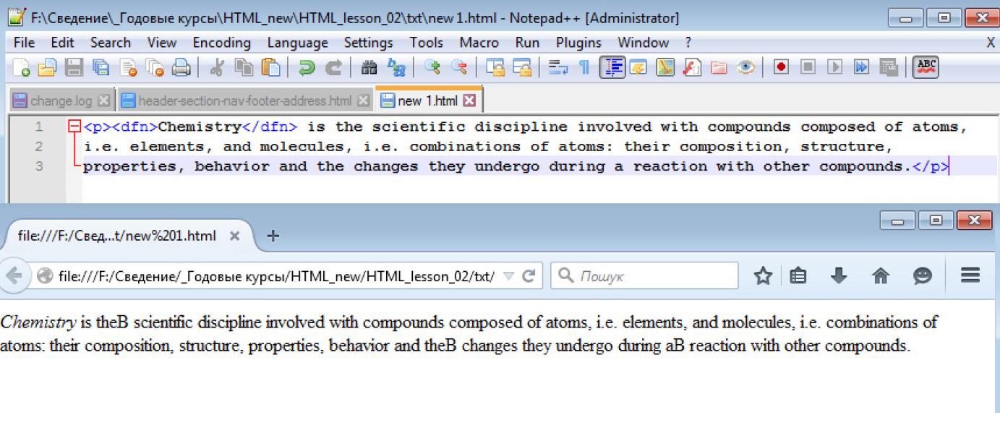

Рисунок 1

В HTML5 є багато тегів логічного форматування, які визначають семантичну структуру документу. Це такі теги, як: header  шапка або заголовна частина сторінки, або статті; main  основна частина документу; section  розділ документу; article — стаття; footer — нижня частина документу або статті. Ці теги були введені як заміна div-ам з відповідними класами або id, і визначають логіку розмітки сторінки. В даному випадку слово семантика, яке дуже часто зустрічається при описі HTML-розмітки у різних статтях, вказує на відповідність внутрішньої розмітки HTML-документу та його візуальне форматування. З погляду семантики, розглядають: розмітку сторінки, пошукові системи, і скринрідери — програми для читання web-сторінок з екрану для людей з проблемами зору.

Наприклад, теги <strong> і <em>, подібні тегам <b> і <i>, виводять текст жирним або курсивним накресленням, але при цьому мають ще й свій семантичний зміст. Текст, вкладений у теги <strong> (_посилення_) має підвищену значимість свого вмісту, а текст у тегах <em> (_емфатичний наголос_) містить емоційний акцент у даному уривку тексту. У звичайній мові ми виділяємо такі слова голосом (інтонацією, гучністю та ін.).

Слід зазначити, що стандарт HTML5 додав семантичний зміст для тегів фізичного форматування. Той самий тег <b>, який ми вже неодноразово згадували, слід використовувати для тексту, на який необхідно звернути увагу читача, але без посилення значущості тексту або інтонації, як для тегу <strong> ([Посилання на статтю](https://html.spec.whatwg.org/dev/text-level-semantics.html#the-b-element)). Що стосується тегу <i>, то мається на увазі, що він вміщує текст, який вибивається із загального оточення, але не має емоційного забарвлення.

Слід зазначити, що багато тегів логічного форматування рідко застосовуються й на сайтах певної тематики. Так, наприклад, елементи <code>, <var>, <samp>, <kbd>, як правило, використовуються на сайтах, присвячених тій чи іншій мові програмування, а <abbr> та <dfn> частіше будуть зустрічатися на сайтах-підручниках з інформацією про який-небудь курс (з хімії, фізики, правознавства тощо). Дуже зручно для таких елементів описати в CSS-властивостях єдині для всього сайту правила форматування.

Вважаю, що на цьому етапі вам буде досить складно зрозуміти, навіщо потрібні всі ці «семантичні складності», якщо все візуально виглядає абсолютно однаковим. Тим не менш, у процесі вивчення HTML як мови гіпертекстової розмітки, ви зрозумієте, що слід звертати увагу на семантику і використовувати переважно теги логічного форматування, оскільки вони мають більше значення як для SEO, так і для скрінридерів, здатних виділяти голосом деякі з логічних тегів.

_SEO (SearchEngineOptimization) — пошукове просування сайтів. Це низка заходів, спрямованих на те, щоб сайт потрапляв на перші сторінки пошукових систем за певними пошуковими фразами або словами. При тому, що метою курсу HTML не є просування сайту. Дуже важливо при верстці сторінки враховувати певні вимоги, пов'язані із SEO, щоб потім не довелося переробляти структуру сайту. Більше про SEO:_ _[Вікіпедія](https://uk.wikipedia.org/wiki/%D0%9E%D0%BF%D1%82%D0%B8%D0%BC%D1%96%D0%B7%D0%B0%D1%86%D1%96%D1%8F_%D0%B4%D0%BB%D1%8F_%D0%BF%D0%BE%D1%88%D1%83%D0%BA%D0%BE%D0%B2%D0%B8%D1%85_%D1%81%D0%B8%D1%81%D1%82%D0%B5%D0%BC),_ _[Google для веб-майстрів](https://www.google.com.ua/webmasters/learn/),_ _[Найкращі книги з SEO](https://collaborator.pro/ru/blog/knigi-po-seo)._

Для того, щоб подивитися на використання обох груп тегів, відкрийте файл-шаблон _tags\_start.html_. Вже готова розмітка є у файлі _tags.html_.

В HTML5 були додані елементи, які умовно можна віднести до інтерактивних. Це такі елементи як [<details>](https://webref.ru/html/details) та [<summary>](https://webref.ru/html/summary), які дозволяють відображати прихований вміст по кліку, а також [<progress>](https://webref.ru/html/progress), [<meter>](https://webref.ru/html/meter), використання яких має сенс після вивчення мови JavaScript, оскільки найкраще ними керувати саме на цій мові. Переглянути ці елементи можна у файлі _interective.html_.

## Застарілі теги та атрибути

HTML, як мова гіпертекстової розмітки, неодноразово змінювалася і мала ряд стандартів, у яких вводилися одні теги та скасовувалося використання інших. Стандарт HTML5 вніс безліч нових тегів, але частина тих, які були популярними в попередніх версіях HTML, визначив як obsolete — застарілий або deprecated — засуджений. Тобто, використання таких тегів вкрай не рекомендується у документі, що підтримує стандарт HTML5, інакше документ не пройде валідацію.

Нагадаю, що браузер визначає, до якого стандарту відноситься ваш документ по DOCTYPE, який вказується на початку розмітки, і для HTML5 виглядає так:

```html
&lt;!DOCTYPE html&gt;
```


З приводу застарілих тегів і атрибутів хочеться зазначити, що ми їх не будемо розглядати докладно у цьому курсі, оскільки нашою метою є створення верстки за сучасними стандартами. Тим не менш, в Інтернеті існує безліч уроків, створених давно, в яких ці застарілі теги або атрибути використовуються і рекомендуються.

Наприклад, для збільшення розміру шрифту раніше використовувався тег <big>, який зараз вважається застарілим, а ось тег <small>, який зменшує розмір шрифту, досі використовується.

Те саме стосується і тегу <strike> — він перекреслював текст у HTML4, але застарів у HTML5. Замість нього можна використовувати тег <s>, або краще — тег <del>, який вказує на те, що перекреслена інформація застаріла або взагалі невірна. Те саме стосується тегу <tt>, який раніше використовувався для виведення тексту моноширинним шрифтом.

Ще один приклад — для позначення абревіатури можна було використати раніше два теги <abbr> або <acronym>. У стандарті HTML5 залишився лише <abbr>, а <acronym> отримав статус застарілого. Зроблено це було через те, що <acronym> (усталене скорочення, яке застосовується як самостійне слово, наприклад, ООН або DOM, або часто використовується в коментарях IMHO, або _англ. in my humble opininon_), хоч і відрізняється від абревіатури (тег <abbr>) за звучанням, але з погляду HTML має те саме значення, тому необхідність використання акронімів відпала. Наприклад, у документації сайту [developer.mozilla.org](https://developer.mozilla.org/ru/docs/Web/HTML/Element/acronym) можна побачити таке повідомлення:

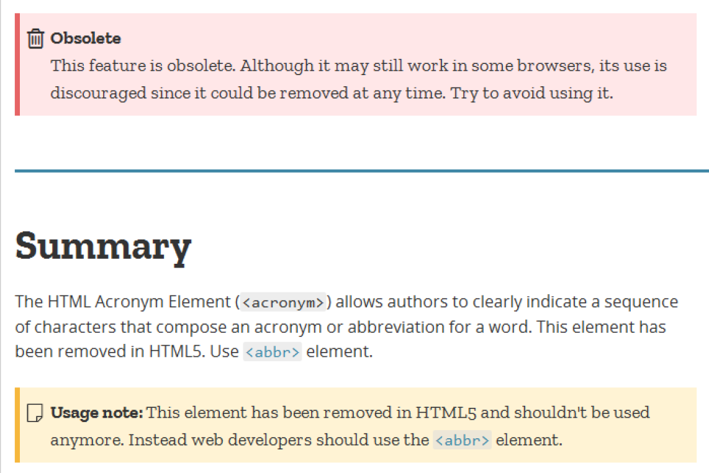

Рисунок 2

Є ще один застарілий тег, який чомусь неймовірно популярний у студентів, які тільки починають вивчати HTML. Це тег <font>, який дозволяв у попередніх стандартах задати розмір, колір та сімейство шрифту. Наприклад, так:

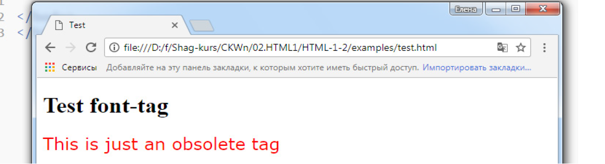

Рисунок 3

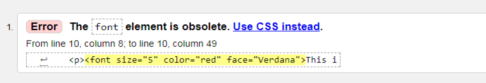

Рисунок 4

Фактично цей тег замінював раніше використання таких CSS-властивостей, як font-size, color і font-family. Будь ласка, не використовуйте цей тег у своїх файлах. Він вже настільки застарів, що його наявність у вашому коді — це пряма вказівка на те, що HTML ви не знаєте, а розбиратися з CSS вам просто ліньки.

Те саме відноситься і до атрибутів, які в більш ранніх стандартах застосовувалися практично скрізь. Наприклад, такий атрибут, як align мав такі значення: left, right, center, justify, і часто застосовувався для форматування тексту в заголовках, абзацах, div-ах і навіть для обтікання текстом картинок.

В силу того, що всі можливості цього атрибуту можна замінити CSS-властивістю text-align або для картинок — властивістю float, цей атрибут є застарілим.

Подивитися на список застарілих тегів та атрибутів можна у статті на сайті [html.com](https://html.com/html5/#Deprecated_Features_in_HTML5). Скриншот зі списком тегів та атрибутів можна переглянути нижче (рис. 5).

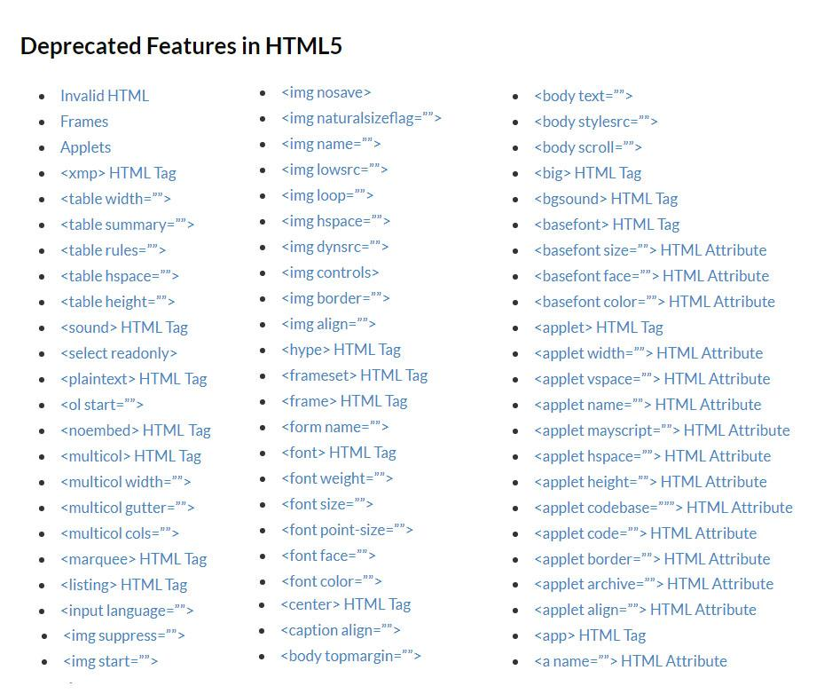

Рисунок 5

Якщо уважно подивитися на цей список, можна зробити висновок, що застарілими стали ті теги та атрибути, необхідність яких або відпала, або вони можуть бути замінені CSS-властивістю.

Посилання по темі:

## Спецсимволи в HTML. Використання їх на HTML-сторінці

Можливо ви вже стикалися з символами у документах Word. Вони, зазвичай, відсутні на клавіатурі, а вставити їх можна за допомогою спеціального пункту меню. Наприклад, не можна надрукувати символ копірайту або символи стрілок (або). Така сама ситуація в HTML — деякі символи можна або скопіювати з тексту в тому ж Word-і, або додати за допомогою спеціальних кодів. Спецсимволи в HTML ще називають мнемоніками (_англ. — entity_). Вони мають 2 варіанти синтаксису — у вигляді частин англомовних слів або номерів, які обов'язково починаються зі знаку «амперсанд» (&) і закінчуються крапкою з комою (;). Використовувати можна будь-який варіант, але слід враховувати, що спецсимволи безіменного коду можуть зовсім не відображатися або відображатися некоректно в різних браузерах.

Наприклад, символ копірайту можна представити як мнемокод &copy; або &#169;.

У текстовому редакторі ви побачите набір символів, а на HTML-сторінці вони будуть представлені лише одним символом.

Таблиці різних символів, розподілені за категоріями, які ви знайдете у файлі Спецсимволи HTML. Варто зазначити, що більшість із них ви, швидше за все, ніколи використовувати не будете, але є низка спецсимволів, які слід знати напам'ять, оскільки застосовувати ви їх будете в різних ситуаціях.

### Символи авторського права або торгівельної марки

Наприклад, це символ того ж копірайту (авторського права), без якого зазвичай не обходиться не один сайт. Найчастіше його розміщують у нижній частині сайту (підвалі або футері). Наприклад, на офіційному сайті Академії ШАГ це виглядає так:


Рисунок 6

Також може бути використаним знак торгівельної марки поруч із назвою фірми (спецсимвол &trade; або &#8482). Наприклад, таким чином:


Рисунок 7

Використовується, правда, цей знак значно рідше ніж знак копірайту.

Що стосується Brackets, то при введенні початкових символів мнемоніка з'являється підказка, яка містить як повний код, так і його зовнішній вигляд на сторінці (рис. 8).

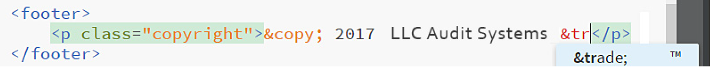

Рисунок 8

Переглянути приклад можна у файлі _header-section-nav.html_ в папці _examples_.

Якщо у компанії (підприємства), для якої розроблено сайт, є зареєстрована торгівельна марка, то поруч із назвою цієї компанії (підприємства) можна вказати знак (спецсимвол &reg; або &#174;). Наприклад, цей спецсимвол використаний на сайті Вікіпедії (рис. 9).

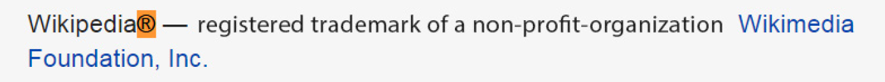

Рисунок 9

Витяг з коду сторінки:

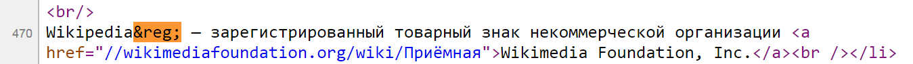

Рисунок 10

**Примітка:** _Щоб переглянути код відкритої в браузері сторінки, можна натиснути клавіші Ctrl+U або за правим кліком в будь-якому місці сторінки вибрати в контекстному меню пункт «Перегляд коду сторінки»._

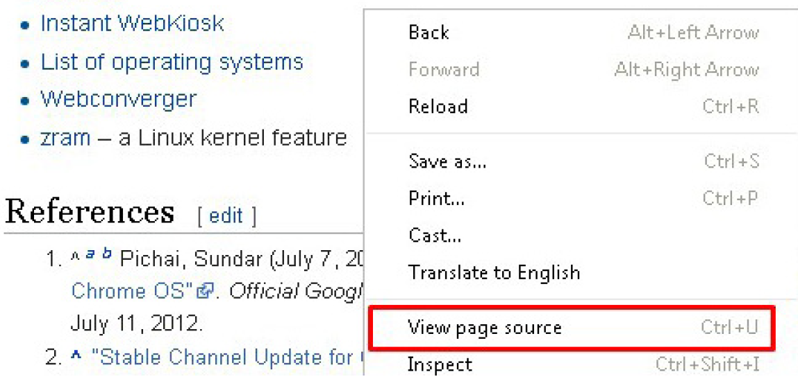

Рисунок 11

### Використання пробілів та переносів

Існують ситуації, коли деякі словосполучення не можуть бути перенесені на інший рядок зі словами. Найпоширеніші варіанти — це прізвище та ініціали, форма власності та назва компанії, найменування міста чи селища. Наприклад, Іванов А.Ф., ТОВ «Будінвест», м. Харків. У цьому випадку, для їх «склеювання» замість звичайного пробілу використовують нерозривний пробіл &nbsp; або &#160;. Порівняйте зовнішній вигляд тексту на рисунку 12.

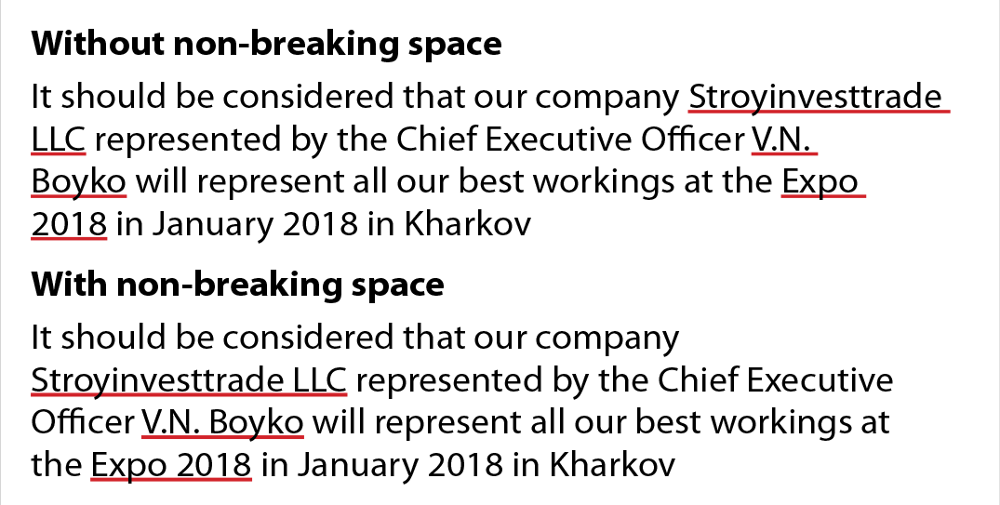

Рисунок 12

Ще одна ситуація, пов'язана з необхідністю додати переноси між частинами слів, оскільки розмір блоку для тексту може бути дуже малим, аби вмістити довгі слова на кшталт «Зареєстрований». Поки що HTML не повною мірою підтримує автоматичне перенесення слів по складах, хоча це питання вже недалекого майбутнього. Наразі, при необхідності розірвати занадто довге слово можна поставити у потрібних місцях знаки м'якого перенесення (&shy; або &#173;). Ставити їх слід відповідно до норм мови. Кількість переносів залежить від довжини слова та ваших потреб. Знаки м'якого перенесення можна використовувати після кожного складу (рис. 13).

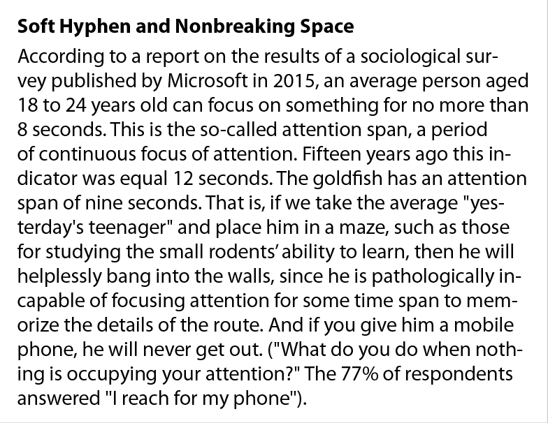

Рисунок 13

```html
За&amp;shy;ре&amp;shy;є&amp;shy;стро&amp;shy;ва&amp;shy;ний
```


Що до автоматичного перенесення слів, для цього було введено CSS-властивість hyphens. Зі значенням auto, при вказанні мови в атрибуті lang для тегу html, буде виконано автоматичне перенесення довгих слів відповідно до потрібного словника. Наприклад, той текст, який ми раніше переносили за допомогою спецсимволу &shy; тепер можна перенести, задавши CSS-стилі:

```html
&lt;html lang="ru"&gt;
…
&lt;style&gt;
    .hyphens {
        -moz-hyphens: auto;
        -ms-hyphens: auto;
        -webkit-hyphens: auto;
        hyphens: auto;
    }
&lt;/style&gt;
```


Мінусом цього є те, що такого роду переноси підтримуються не всіма браузерами. Наприклад, якщо у Firefox-і текст з'явився з переносами, то в Chrome-і ми бачимо «рвані краї» з правого боку (рис. 14).

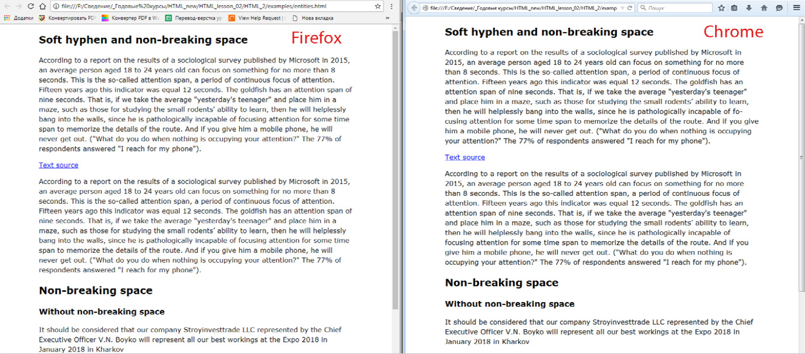

Рисунок 14

Переглянути приклад можна у файлі _entities.html_.

Щоб усвідомлювати, наскільки підтримується та чи інша CSS-властивість у браузерах, можна зробити запит на веб-сайті [caniuse.com](http://caniuse.com/).

На рисунку 15 видно, що зеленим кольором відзначені браузери та їх версії, які підтримують цю властивість, червоним — ті, які не підтримують властивість, а оливковим — які підтримують, але з якоюсь умовою (наприклад, Chrome з версії 55 підтримує лише на платформах Android або Mac).

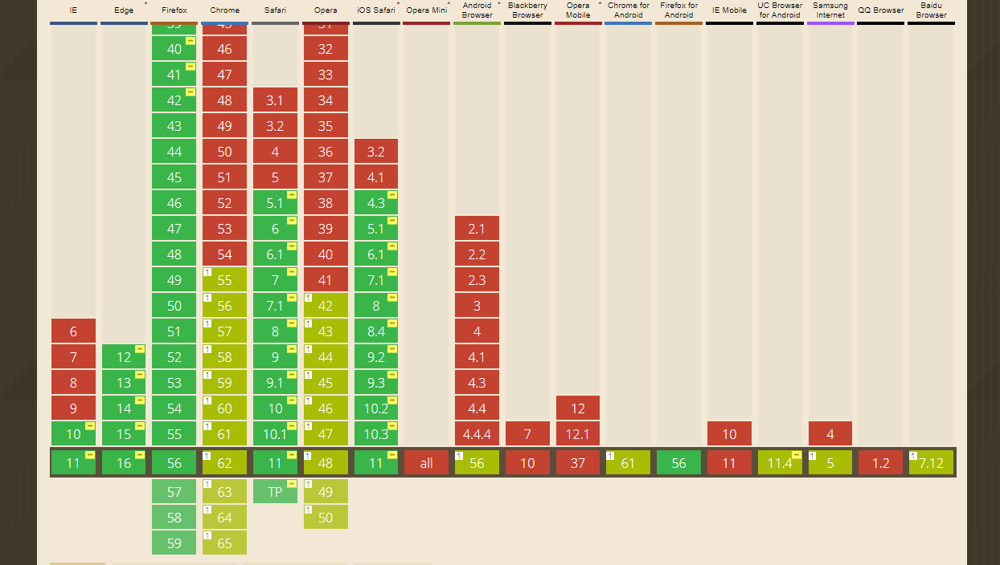

Рисунок 15

Знак «мінус» показує, що властивість підтримується з так званим «вендорним префіксом»:

-   \-moz- — для Mozilla FireFox,
-   \-ms- — для Internet Explorer,
-   \-webkit- — для Safari, Chrome та інших браузерів на основі Chromium — двигуна від Chrome.

## Рисунок 16

### Використання знаків

Існує безліч спецсимволів для знаків, але мені хотілося б виділити 2, які відносяться до HTML-коду. Наприклад, на таких сайтах-довідниках, як [https://www.w3schools.com/,](https://www.w3schools.com/,) [https://developer.mozilla.org/](https://developer.mozilla.org/en-US/docs/Learn/Getting_started_with_the_web/HTML_basics), [](https://www.w3schools.com/html/html_examples.asp)[http://htmlbook.ru/](http://htmlbook.ru/) або [https://webref.ru/](https://webref.ru/) є безліч прикладів коду, які ви можете скопіювати у свій текстовий редактор і переглянути «наживо». Як можна вивести на сторінку теги, які браузер повинен інтерпретувати і показати як текст? Для цього всі кутові дужки «кодують» за допомогою спецсимволів: ліва кутова дужка (знак менше <) — як &lt;, права кутова дужка (знак більше \>) — як &gt;.

Після цього код виводиться як звичайний текст.

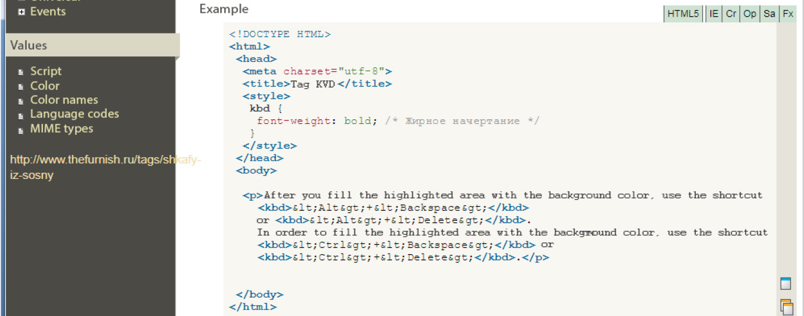

Рисунок 17

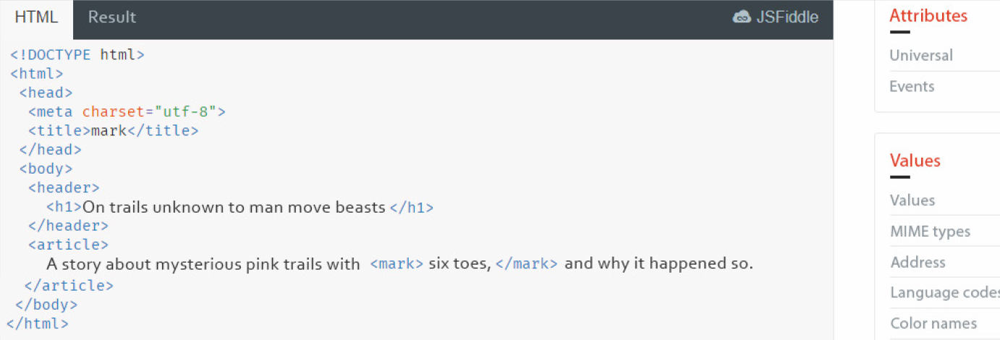

Рисунок 18

В прикладі, який ви знайдете у файлі _entities.html_, видно, що HTML-код перестав бути таким у текстовому редакторі за рахунок заміни дужок на спецсимволи, але виглядає як HTML-код на сторінці.

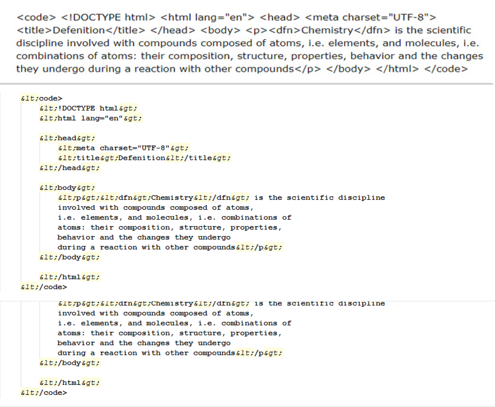

Рисунок 19

Щоб зберегти зовнішній вигляд рядків тексту в редакторі та на сторінці, необхідно задати наступні CSS-властивості для тегу <code>:

```html
code {
    white-space: pre;
}
```


Ми бачимо, що всі пробіли, табуляція та перенесення рядків відобразилися на HTML-сторінці.

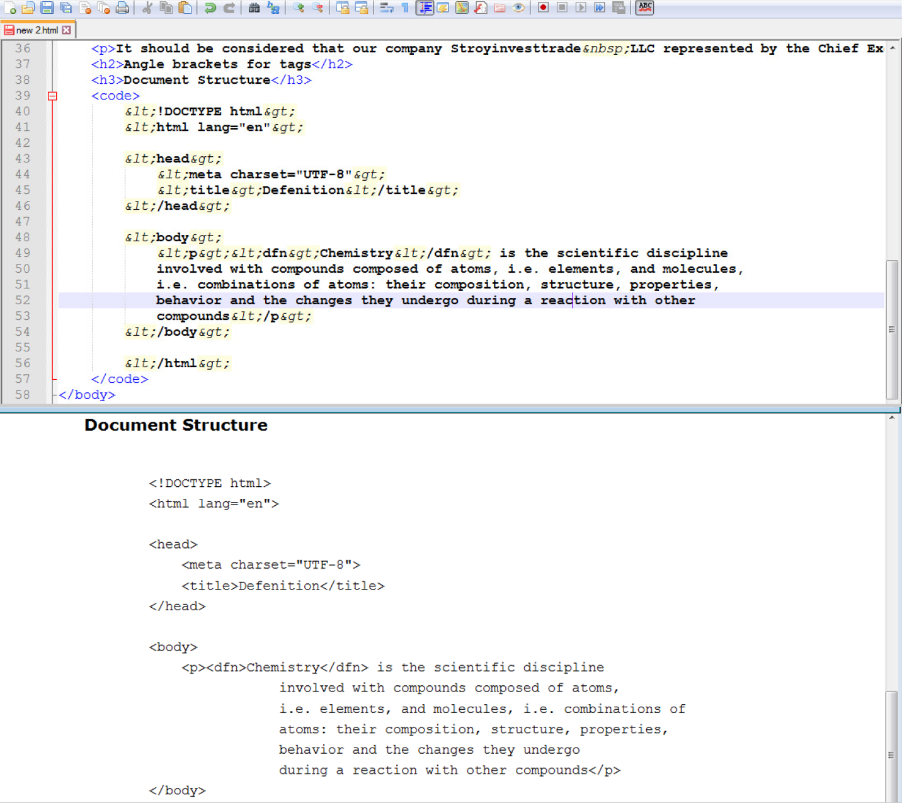

Рисунок 20

Ще такі кутові дужки перетворюються в CMS (системах управління контентом) у спецсимволи при спробі вставити їх у текст статті. І в серверній мові програмування PHP (Hypertext Preprocessor), який використовується для створення та редагування безлічі web-сайтів, а також для обробки даних форм, наприклад, існує спеціальна функція для перетворення кутових дужок у спецсимволи для запобігання вставці шкідливого коду. Щоправда, про це ми поговоримо вже на інших курсах.

Іноді вам можуть знадобитися знаки короткого (&ndash; або &#8211;) та довгого тире (&mdash; та &#8212;). Можливо, знадобляться символи лапок, стрілок або валюти. Їх можна або скопіювати з будь-якого текстового редактора (наприклад Microsoft Word) або додати у вигляді спецсимволу HTML.

Решта спецсимволів використовується досить рідко. Зазвичай це вузькоспрямовані сайти, на яких потрібно використовувати фізичні чи хімічні формули тощо.

## CSS-властивості для форматування тексту

Сьогодні ми розглянемо властивості, які використовуються для перенесення рядків, формування інтервалів між символами чи словами, та оформлення тексту.

1\. Властивість white-space відповідає за відображення пробілів між словами. За замовчуванням, значення normal встановлює автоматичне перенесення слів при досягненні правого краю браузера або батьківського блоку.

```html
white-space: normal | nowrap | pre | preline | pre-wrap
```


-   Значення nowrap не враховує пробіли та перенесення рядків у коді HTML, і весь текст відображається як один рядок. При цьому може бути додана горизонтальна смуга прокручування, якщо текст не поміщається по ширині у батьківському контейнері. Тільки додавання тегу <br> переносить текст на новий рядок.


Рисунок 21

-   Значення pre відображає текст з урахуванням всіх пробілів, табуляцій та переносів, які є у коді HTML. Для надто довгого рядка в браузері буде додано горизонтальну смугу прокручування.
-   Значення pre-line не враховує пробілів, а сам текст буде перенесено на наступний рядок, якщо він не поміщається у батьківському контейнері.
-   Значення pre-wrap зберігає всі прогалини та переноси, які були в текстовому редакторі, але якщо рядок по ширині не поміщається в батьківський контейнер, текст автоматично буде перенесений на наступний рядок.

```html
Emmet wsn, wsp, wsnw, wspl, wspw
```


2\. Властивість word-break відповідає за перенесення слів усередині рядків, які не вміщуються всередині батьківського контейнеру по ширині. Має такі значення:

```html
word-break: normal | break-all | keep-all
```


-   Значення normal (за замовчуванням) переносить слова повністю після досягнення правого краю батьківського блоку
-   Значення break-all додає перенос рядків так, щоб слово помістилося в задану ширину батьківського блоку (не може бути використане для тексту китайською, корейською або японською мовами).

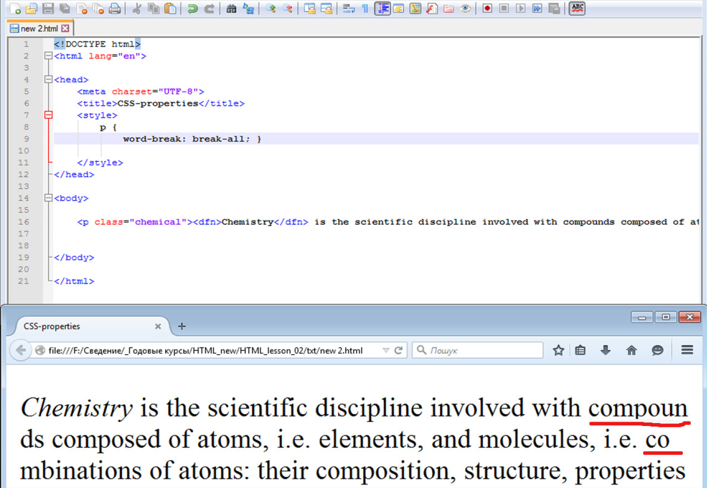

Рисунок 22

-   Значення keep-all забороняє перенесення рядків для тексту китайською, корейською або японською мовами. Для інших мов відповідає значенню normal.

```html
Emmet: wbn, wbba, wb:ka
```


3\. Властивість word-wrap визначає, чи потрібно переносити слова, які не поміщаються всередині батьківського контейнера по ширині. Має такі значення:

```html
word-wrap: normal | break-word
```


-   Значення normal (за замовчуванням) переміщає слова повністю після досягнення ними правого краю батьківського блоку або в тих місцях, де в текст доданий тег <br>.
-   Значення break-word додає перенос рядків так, щоб слово помістилося по заданій ширині батьківського блоку.

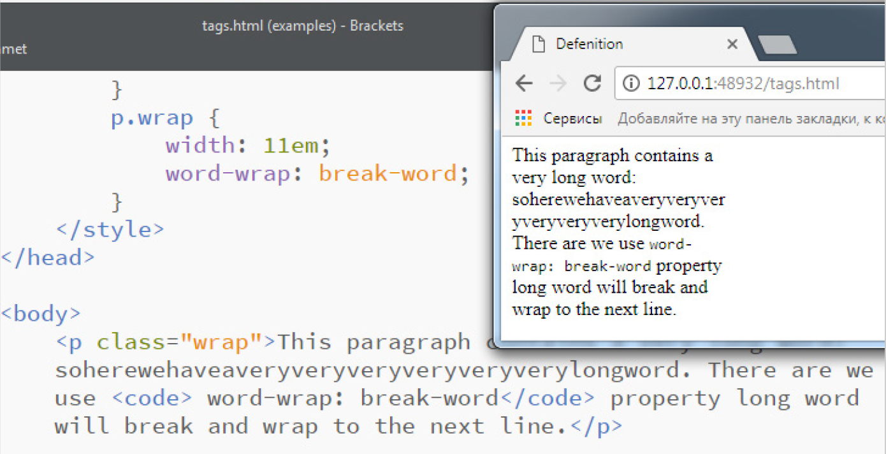

Рисунок 23

```html
Emmet: wwn, wwb
```


4\. Одна з нових властивостей, додана у специфікації CSS3, \-writing-mode- визначає напрямок тексту на сторінці — горизонтальний або вертикальний. За замовчуванням має значення horizontal-tb:

```html
writing-mode: horizontal-tb | vertical-rl | vertical-lr
```


-   Значення horizontal-tb визначає напрямок тексту по горизонталі згори донизу та зліва направо.
-   Значення vertical-rl визначає напрямок тексту по вертикалі зверху внизта справа наліво.
-   Значення vertical-lr визначає напрямок тексту по вертикалі зверху вниз та зліва направо.

Застосовується до всіх елементів, крім клітинок та рядків таблиці

```html
Emmet: wm
```


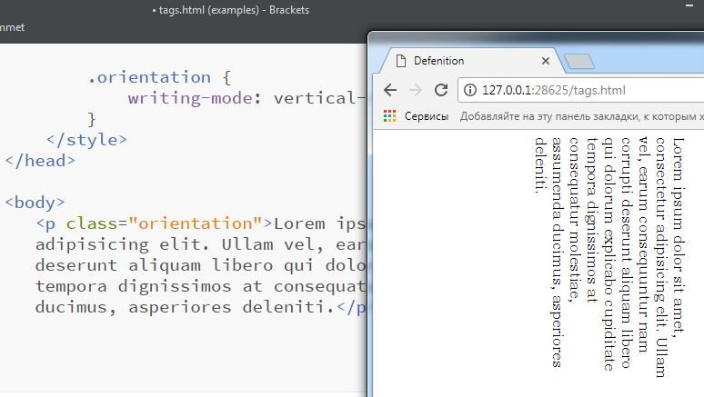

Рисунок 24

5\. Властивість word-spacing визначає інтервал між словами. За замовчуванням значення normal встановлює звичайний інтервал, який відповідає параметрам шрифту. Можна також вказати розмір у будь-яких одиницях виміру, крім %:

```html
word-spacing: число в px, pt, em, але не в % | normal
```


Emmet: wos

Також підтримуються від'ємні значення, що зменшують відстань між словами.

У випадку, коли для тексту встановлено властивість, що забезпечує вирівнювання по ширині (text-align: justify), інтервал між словами буде встановлений примусово, але значення не буде менше, ніж зазначене в word-spacing.


Рисунок 25

6\. Властивість letter-spacing дозволяє встановити інтервал між символами селектора. За умовчанням, ця відстань визначається залежно від шрифту. Можна вказувати від'ємні значення, якщо це необхідно і не псує вигляду тексту.

```html
letter-spacing: число в px, pt, em, але не в % normal
```


Emmet: ltsn, lts: число

```html
.lettering {letter-spacing: 6px;}
```


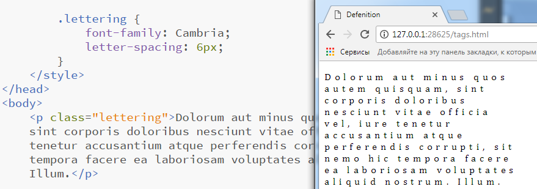

Рисунок 26

7\. Властивість text-transform дозволяє змінити регістр тексту, перетворюючи символи на великі (значення uppercase) або малі (значення lowercase). Значення none залишає текст незмінним, а capitalize перетворює перші літери кожного слова у великі (більш властиво для англійської мови).

```html
text-transform: capitalize | lowercase | uppercase | none
```


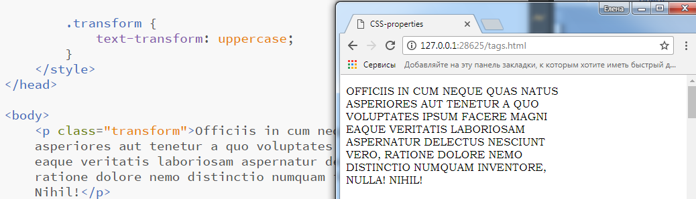

Рисунок 27

Emmet: ttn, ttc, ttl,ttu

8\. Властивість text-decoration додає оформлення тексту у вигляді підкреслення (значення underline), перекреслення (значення line-through) або надкреслення (значення overline). Значення none залишає текст незмінним.

```html
text-transform: underline | line-through | overline | none
```


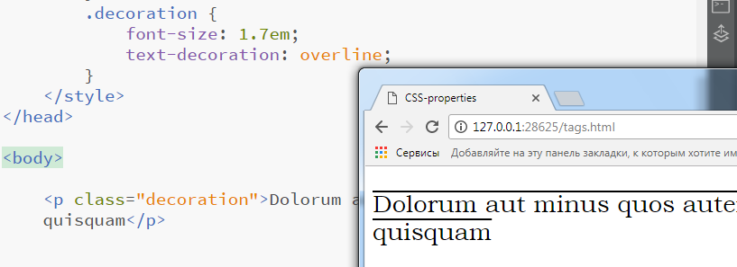

Рисунок 28

Властивість text-decoration складається з 3-х властивостей, які можна задавати як окремо, так і разом в об'єднаній властивості text-decoration:

```html
text-decoration: text-decoration-line | text-decoration-style | text-decoration-color
```


Властивість text-decoration-line визначає вид лінії та має значення, як в основній властивості:

```html
text-decoration-line: line-through | overline | underline | none
```


Можна додавати декілька ліній, перераховуючи значення через кому.

Вид лінії визначається властивістю text-decoration-style:

```html
text-decoration-style: solid | double | dotted | dashed | wavy
```


Значення цієї властивості такі:

-   solid — суцільна одинарна лінія;
-   double — подвійна лінія;
-   dotted — точкова лінія;
-   dashed — пунктирна лінія;
-   wavy — хвиляста лінія.

Властивість text-decoration-color визначає колір лінії. Її значення можна задавати так само, як і для властивості color (рис. 29).

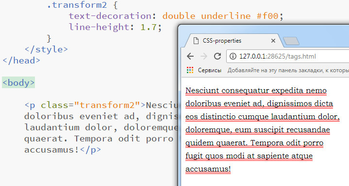

Рисунок 29

Emmet: tdn, tdlt, tdo, tdu, tdn

9\. Властивість text-shadow дозволяє додати тінь до тексту. Як значення вказують зміщення по горизонталі (offX), зміщення по вертикалі (offY), радіус розмиття (blur) і колір (color).

За замовчуванням текст не має тіні (значення none).

```html
text-shadow: none | offXoffY blur color
```


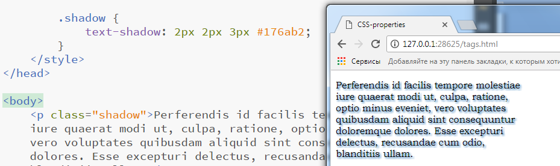

Рисунок 30

Можна додати декілька тіней, перераховуючи їх параметри через кому.

```html
text-shadow: offX1 offY1 blur1 color1, offX2 offY2 blur2 color2, offX3 offY3 blur3 color3;
```


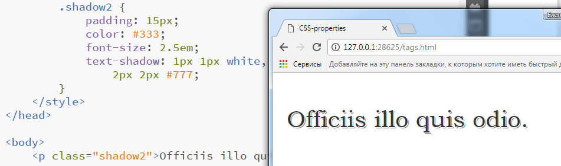

Рисунок 31

Emmet: ts

Ви можете переглянути на дію CSS-властивостей в файлі _css-properties.html_.

## Домашнє завдання

У домашньому завданні вам необхідно буде відформатувати текст статті (використовуйте тег <article>) з використанням різних тегів та CSS-стилів. Зверніть увагу, що шрифт на сторінці без засічок, а розмір статті зменшено порівняно з розмірами браузера. На даний момент ми не будемо докладно розглядати, як це зробити, а просто використовуємо наступні CSS-властивості:

```html
article {
    width: 90%;
    margin: auto;
}
```


Це дозволить зменшити ширину статті та центрувати її у браузері.

Зверніть увагу, що в тексті часто зустрічаються виділення жирним, у тому числі при позначенні кольору (червоний, жовтий, зелений та ін.). Подумайте, які рядкові елементи можна використовувати для HTML-розмітки і задайте різні класи для колірних характеристик.

Завдання ви знайдете у папці _HW2_ (від англ. _homework_). Там є текстовий файл та зображення з кінцевим виглядом статті.

© STEP IT Academy, [itstep.org](https://itstep.org/)

All the copyrighted photos, audio, and video works, fragments of which are used in the material, are the property of their respective owners. Fragments of the works are used for illustrative purposes to the extent justified by the objective, within the educational process, and for educational purposes, in accordance with the Act of “On Copyright and Related Rights”. The scope and method of the cited works are in accordance with the adopted norms, without prejudice to the normal exploitation of copyright, and do not prejudice the legitimate interests of authors and right holders. At the time of use, the cited works fragments cannot be replaced by alternative, non-copyrighted counterparts and meet the criteria for fair use. All rights reserved. Any reproduction of the materials or its part is prohibited. Use of the works or their fragments must be agreed upon with authors and rights holders. Agreed material use is only possible with reference to the source. Responsibility for unauthorized copying and commercial use of the material is determined by the current legislation.