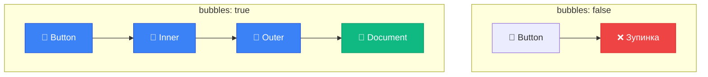

# Запуск користувацьких подій (Custom Events)

## Коли браузерних подій недостатньо

Уявіть: ви створюєте власний UI-компонент — **карусель слайдів**, **модальне вікно** або **dropdown-меню**. Користувач взаємодіє з вашим компонентом, і вам потрібно **повідомити** інший код про це:

- Карусель → подія "слайд змінено"
- Модальне вікно → подія "вікно закрито"
- Dropdown → подія "опцію вибрано"

Браузерні події (`click`, `input`, `submit`) описують **базові дії**. Але як створити **власні події** для власної логіки?

::tip

### 💡 Ключова ідея

JavaScript дозволяє **створювати власні події** з будь-якими назвами та даними. Це потужний механізм для **компонентної архітектури** та **слабкого зчеплення (loose coupling)** коду.

**Приклад:**

```javascript
// Створюємо подію
const event = new CustomEvent('user-login', {
    detail: { username: 'John', role: 'admin' },
})

// Запускаємо подію
document.dispatchEvent(event)
```

::

## Навіщо потрібні користувацькі події?

::card-group
::card

---

title: "🧩 Компонентність"
icon: i-heroicons-puzzle-piece

---

**Розділення відповідальності**

Компонент повідомляє "що сталося", але не знає "хто і як" це обробить.

```javascript
// Компонент генерує подію
modal.emit('close')

// Різний код може слухати
modal.on('close', saveData)
modal.on('close', analytics)
```

::

::card

---

title: "🔗 Слабке зчеплення"
icon: i-heroicons-link-slash

---

**Незалежність модулів**

Модулі спілкуються через події, не викликаючи функції один одного напряму.

```javascript
// ❌ Сильне зчеплення
function closeModal() {
    analyticsTrack()
    saveToStorage()
}

// ✅ Слабке зчеплення
modal.emit('close')
```

::

::card

---

title: "🧪 Тестування"
icon: i-heroicons-beaker

---

**Імітація дій користувача**

Програмно ініціюємо події для автотестів.

```javascript
// Імітація кліку для тесту
button.dispatchEvent(new Event('click'))
```

::

::card

---

title: "📡 Publish-Subscribe"
icon: i-heroicons-rss

---

**Архітектурний патерн**

Реалізація EventBus/EventEmitter для глобальної комунікації.

```javascript
// Глобальна шина подій
eventBus.on('navigation', update)
eventBus.emit('navigation', data)
```

::
::

## Створення події: конструктор `Event`

Найпростіший спосіб створити подію — використати конструктор **`Event`**:

```javascript
const event = new Event(eventType, options)
```

**Параметри:**

| Параметр    | Тип      | Опис                                              |
| :---------- | :------- | :------------------------------------------------ |
| `eventType` | `string` | Назва події: `'click'`, `'my-event'`, лю будь-яка |
| `options`   | `object` | Налаштування (необов'язково)                      |

**Опції:**

| Властивість  | Тип       | За замовчуванням | Опис                                        |
| :----------- | :-------- | :--------------- | :------------------------------------------ |
| `bubbles`    | `boolean` | `false`          | Чи спливає подія вгору по DOM               |
| `cancelable` | `boolean` | `false`          | Чи можна скасувати через `preventDefault()` |

### Базовий приклад

```javascript
// 1. Створюємо подію
const event = new Event('hello')

// 2. Додаємо обробник
document.addEventListener('hello', function () {
    console.log('👋 Привіт з події!')
})

// 3. Запускаємо подію
document.dispatchEvent(event)
// Консоль: 👋 Привіт з події!
```

::mermaid

```mermaid
sequenceDiagram
    participant Code as 📝 Код
    participant Event as 🎯 Об'єкт події
    participant Element as 📦 Елемент
    participant Handler as ⚙️ Обробник

    Code->>Event: new Event('hello')
    Code->>Element: addEventListener('hello', handler)
    Code->>Element: dispatchEvent(event)
    Element->>Handler: Виклик обробника
    Handler->>Handler: console.log('Привіт!')

    style Event fill:#3b82f6,stroke:#1d4ed8,color:#ffffff
    style Handler fill:#10b981,stroke:#059669,color:#ffffff
```

::

## Запуск події: `dispatchEvent()`

Метод **`element.dispatchEvent(event)`** запускає подію на елементі.

```javascript
element.dispatchEvent(event)
```

**Повертає:**

- `true` — якщо подія **не була скасована** (не викликано `preventDefault()`)
- `false` — якщо подія **була скасована**

### Приклад: програмний клік

```html
<button id="btn">Я кнопка</button>

<script>
    const button = document.getElementById('btn')

    // Додаємо обробник
    button.addEventListener('click', function () {
        alert('Клік!')
    })

    // Імітуємо клік програмно
    const clickEvent = new Event('click')
    button.dispatchEvent(clickEvent)
    // Alert з'явиться автоматично!
</script>
```

**Що відбувається:**

1. Створюємо подію `click`
2. Запускаємо її через `dispatchEvent()`
3. Обробник спрацьовує **так само**, як при реальному кліку

## Спливання користувацьких подій

За замовчуванням події **НЕ спливають**. Щоб включити спливання, встановіть `bubbles: true`:

```html
<!DOCTYPE html>
<html lang="uk">
    <head>
        <meta charset="UTF-8" />
        <title>Спливання користувацьких подій</title>
    </head>
    <body>
        <div id="outer">
            <div id="inner">
                <button id="btn">Запустити подію</button>
            </div>
        </div>

        <script>
            const btn = document.getElementById('btn')
            const inner = document.getElementById('inner')
            const outer = document.getElementById('outer')

            // Обробники на різних рівнях
            btn.addEventListener('custom-event', () => {
                console.log('📍 Кнопка: подія на button')
            })

            inner.addEventListener('custom-event', () => {
                console.log('📍 Внутрішній: подія на inner')
            })

            outer.addEventListener('custom-event', () => {
                console.log('📍 Зовнішній: подія на outer')
            })

            document.addEventListener('custom-event', () => {
                console.log('📍 Документ: подія на document')
            })

            // Запускаємо події
            btn.addEventListener('click', () => {
                console.log('\n--- БЕЗ спливання (bubbles: false) ---')
                const event1 = new Event('custom-event') // bubbles = false за замовчуванням
                btn.dispatchEvent(event1)

                setTimeout(() => {
                    console.log('\n--- ЗІ спливанням (bubbles: true) ---')
                    const event2 = new Event('custom-event', { bubbles: true })
                    btn.dispatchEvent(event2)
                }, 1000)
            })
        </script>
    </body>
</html>
```

**Результат:**

```
--- БЕЗ спливання (bubbles: false) ---
📍 Кнопка: подія на button

--- ЗІ спливанням (bubbles: true) ---
📍 Кнопка: подія на button
📍 Внутрішній: подія на inner
📍 Зовнішній: подія на outer
📍 Документ: подія на document
```

::mermaid



::

## Відмінність `isTrusted`: реальна чи синтетична подія

Властивість **`event.isTrusted`** показує, чи подія від **реального користувача** чи **створена кодом**:

```javascript
element.addEventListener('click', (event) => {
    if (event.isTrusted) {
        console.log('✅ Реальний клік користувача')
    } else {
        console.log('🤖 Синтетична подія з кода')
    }
})

// Реальний клік → isTrusted = true
// element.dispatchEvent(new Event('click')) → isTrusted = false
```

### Практичне застосування

```javascript
// Захист від автоматизації
button.addEventListener('click', (event) => {
    if (!event.isTrusted) {
        console.warn('⚠️ Спроба ботом обійти захист!')
        return // Блокуємо
    }

    // Обробляємо тільки реальні кліки
    processPayment()
})
```

::warning

### ⚠️ Важливо для безпеки

**НЕ** покладайтеся на `isTrusted` для критичної безпеки! Зловмисник може змінити це значення через DevTools або модифікацію браузера. Використовуйте серверну валідацію.
::

## Спеціалізовані конструктори подій

Для **браузерних типів подій** (миша, клавіатура, фокус) використовуйте **спеціалізовані конструктори**:

### MouseEvent

```javascript
const mouseEvent = new MouseEvent('click', {
    bubbles: true,
    cancelable: true,
    clientX: 150, // Координата X
    clientY: 200, // Координата Y
    button: 0, // Ліва кнопка миші
    ctrlKey: false, // Ctrl не натиснуто
    shiftKey: false, // Shift не натиснуто
})

element.dispatchEvent(mouseEvent)

console.log(mouseEvent.clientX) // 150
console.log(mouseEvent.clientY) // 200
```

### KeyboardEvent

```javascript
const keyEvent = new KeyboardEvent('keydown', {
    key: 'Enter',
    code: 'Enter',
    keyCode: 13, // Старий API
    ctrlKey: false,
    shiftKey: false,
    bubbles: true,
})

input.dispatchEvent(keyEvent)
```

### FocusEvent

```javascript
const focusEvent = new FocusEvent('focus', {
    bubbles: true, // focus не спливає, але focusin спливає
    relatedTarget: null, // Попередній елемент з фокусом
})

input.dispatchEvent(focusEvent)
```

### Порівняння з базовим Event

::tabs
::tabs-item{label="❌ Event (не працює)"}

```javascript
// Спроба встановити clientX через Event
const event = new Event('click', {
    bubbles: true,
    cancelable: true,
    clientX: 100, // ❌ Ігнорується!
})

console.log(event.clientX) // undefined
```

**Проблема:** `Event` не знає про властивості миші
::

::tabs-item{label="✅ MouseEvent (працює)"}

```javascript
// Правильне використання MouseEvent
const event = new MouseEvent('click', {
    bubbles: true,
    cancelable: true,
    clientX: 100, // ✅ Працює!
})

console.log(event.clientX) // 100
```

**Рішення:** Використовуємо спеціалізований конструктор
::

::tabs-item{label="⚠️ Event + присвоєння"}

```javascript
// Обхідний шлях (не рекомендується)
const event = new Event('click', {
    bubbles: true,
    cancelable: true,
})

event.clientX = 100 // Присвоюємо після створення

console.log(event.clientX) // 100 (працює, але погана практика)
```

**Недолік:** Порушення типізації, нестандартно
::
::

## CustomEvent: події з даними

Для **власних подій** використовуйте **`CustomEvent`** з властивістю `detail`:

```javascript
const event = new CustomEvent(eventType, {
    detail: {
        /* будь-які дані */
    },
    bubbles: true,
    cancelable: true,
})
```

### Приклад: система сповіщень

```html
<!DOCTYPE html>
<html lang="uk">
    <head>
        <meta charset="UTF-8" />
        <title>Система сповіщень</title>
        <style>
            .notification {
                position: fixed;
                top: 20px;
                right: 20px;
                padding: 15px 25px;
                border-radius: 8px;
                color: white;
                font-weight: bold;
                box-shadow: 0 4px 12px rgba(0, 0, 0, 0.3);
                animation: slideIn 0.3s;
            }

            .notification.success {
                background: #10b981;
            }
            .notification.error {
                background: #ef4444;
            }
            .notification.info {
                background: #3b82f6;
            }

            @keyframes slideIn {
                from {
                    transform: translateX(400px);
                    opacity: 0;
                }
                to {
                    transform: translateX(0);
                    opacity: 1;
                }
            }
        </style>
    </head>
    <body>
        <h1>Система сповіщень</h1>

        <button onclick="notify('success', 'Збережено успішно!')">✅ Показати успіх</button>

        <button onclick="notify('error', 'Помилка з\'єднання!')">❌ Показати помилку</button>

        <button onclick="notify('info', 'Нова інформація')">ℹ️ Показати інфо</button>

        <script>
            // Глобальний обробник сповіщень
            document.addEventListener('notification', (event) => {
                const { type, message, duration } = event.detail

                // Створюємо елемент сповіщення
                const notification = document.createElement('div')
                notification.className = `notification ${type}`
                notification.textContent = message

                document.body.appendChild(notification)

                // Автоматичне видалення
                setTimeout(() => {
                    notification.remove()
                }, duration)

                console.log(`📢 Сповіщення [${type}]: ${message}`)
            })

            // Функція для ініціювання сповіщення
            function notify(type, message, duration = 3000) {
                const event = new CustomEvent('notification', {
                    detail: { type, message, duration },
                    bubbles: true,
                })

                document.dispatchEvent(event)
            }
        </script>
    </body>
</html>
```

**Переваги підходу:**

- ✅ Єдине місце обробки сповіщень
- ✅ Будь-який код може викликати `notify()`
- ✅ Легко розширити (логування, аналітика)
- ✅ Дані передаються через `event.detail`

### Приклад: компонент модального вікна

```javascript
class Modal {
    constructor(element) {
        this.element = element
    }

    open() {
        // Генеруємо подію ПЕРЕД відкриттям
        const beforeOpenEvent = new CustomEvent('modal:before-open', {
            detail: { modalId: this.element.id },
            cancelable: true, // Можна скасувати
            bubbles: true,
        })

        // Якщо подію скасовано — не відкриваємо
        if (!this.element.dispatchEvent(beforeOpenEvent)) {
            console.log('Відкриття модального вікна скасовано')
            return
        }

        // Відкриваємо
        this.element.style.display = 'block'

        // Генеруємо подію ПІСЛЯ відкриття
        const afterOpenEvent = new CustomEvent('modal:opened', {
            detail: { modalId: this.element.id, timestamp: Date.now() },
            bubbles: true,
        })

        this.element.dispatchEvent(afterOpenEvent)
    }

    close() {
        this.element.style.display = 'none'

        const event = new CustomEvent('modal:closed', {
            detail: { modalId: this.element.id },
            bubbles: true,
        })

        this.element.dispatchEvent(event)
    }
}

// Використання
const modal = new Modal(document.getElementById('myModal'))

// Слухаємо події
modal.element.addEventListener('modal:before-open', (e) => {
    console.log('Модальне вікно відкривається:', e.detail)

    // Можна скасувати
    if (!confirm('Відкрити модальне вікно?')) {
        e.preventDefault()
    }
})

modal.element.addEventListener('modal:opened', (e) => {
    console.log('Модальне вікно відкрито:', e.detail)
    analytics.track('modal-opened', e.detail)
})

modal.element.addEventListener('modal:closed', (e) => {
    console.log('Модальне вікно закрито:', e.detail)
})

modal.open()
```

## Скасування користувацької події: `preventDefault()`

Для користувацьких подій можна використовувати `preventDefault()`, але потрібно встановити **`cancelable: true`**:

```javascript
const event = new CustomEvent('my-event', {
    cancelable: true, // ✅ Обов'язково!
})

element.addEventListener('my-event', (e) => {
    e.preventDefault() // Тепер працює
})

const wasNotCancelled = element.dispatchEvent(event)

if (!wasNotCancelled) {
    console.log('Подію скасовано!')
}
```

### Практичний приклад: кролик, що ховається

```html
<!DOCTYPE html>
<html lang="uk">
    <head>
        <meta charset="UTF-8" />
        <title>Кролик, що ховається</title>
        <style>
            #rabbit {
                font-size: 20px;
                font-family: monospace;
                white-space: pre;
                background: #f0f0f0;
                padding: 20px;
                border-radius: 10px;
                display: inline-block;
                transition: opacity 0.5s;
            }

            #rabbit.hidden {
                opacity: 0;
            }
        </style>
    </head>
    <body>
        <h1>Кролик, що ховається</h1>

        <pre id="rabbit">
  |\\   /|
   \\|_|/
   /. .\\
  =\\_Y_/=
   {&gt;o&lt;}
  </pre
        >

        <button onclick="hide()">Сховати кролика</button>
        <button onclick="show()">Показати кролика</button>

        <script>
            const rabbit = document.getElementById('rabbit')

            function hide() {
                // Генеруємо подію "hide" з можливістю скасування
                const event = new CustomEvent('hide', {
                    cancelable: true, // ✅ Можна скасувати через preventDefault
                })

                const wasNotCancelled = rabbit.dispatchEvent(event)

                if (!wasNotCancelled) {
                    alert('🐰 Обробник запобіг приховуванню! Кролик залишається.')
                } else {
                    rabbit.classList.add('hidden')
                    console.log('🐰 Кролик сховався')
                }
            }

            function show() {
                rabbit.classList.remove('hidden')

                rabbit.dispatchEvent(
                    new CustomEvent('show', {
                        bubbles: true,
                    }),
                )
            }

            // Обробник, що може скасувати приховування
            rabbit.addEventListener('hide', (event) => {
                const shouldPrevent = confirm('🐰 Кролик хоче сховатися. Дозволити?')

                if (!shouldPrevent) {
                    event.preventDefault() // ❌ Скасовуємо приховування
                    console.log('❌ Приховування скасовано користувачем')
                }
            })

            // Аналітика (завжди спрацює)
            rabbit.addEventListener('hide', () => {
                console.log('📊 [Аналітика] Спроба сховати кролика')
            })

            rabbit.addEventListener('show', () => {
                console.log('📊 [Аналітика] Кролик показаний')
            })
        </script>
    </body>
</html>
```

**Як це працює:**

1. Клік на "Сховати кролика" → генерує подію `hide`
2. Обробник показує `confirm()` — користувач обирає
3. Якщо "Скасувати" → `preventDefault()` → `dispatchEvent()` повертає `false`
4. Код перевіряє результат і **не ховає** кролика
5. Аналітика спрацьовує завжди (незалежно від скасування)

## Синхронність вкладених подій

Якщо під час обробки події **запускається інша подія** (через `dispatchEvent`), вона обробляється **синхронно** (одразу):

```html
<button id="menu">Клікни мене</button>

<script>
    const menu = document.getElementById('menu')

    menu.addEventListener('click', () => {
        console.log('1️⃣ Початок обробки click')

        // Запускаємо вкладену подію
        menu.dispatchEvent(
            new CustomEvent('menu-open', {
                bubbles: true,
            }),
        )

        console.log('3️⃣ Кінець обробки click')
    })

    document.addEventListener('menu-open', () => {
        console.log('2️⃣ Обробка menu-open (вкладена)')
    })

    // Результат:
    // 1️⃣ Початок обробки click
    // 2️⃣ Обробка menu-open (вкладена)
    // 3️⃣ Кінець обробки click
</script>
```

**Порядок виконання:**

```
click handler (початок)
  ↓
dispatchEvent('menu-open')
  ↓
menu-open handler (СИНХРОННО!)
  ↓
menu-open завершено
  ↓
click handler (продовження)
```

::mermaid

```mermaid
sequenceDiagram
    participant User as 👤 Користувач
    participant Click as ⚙️ click handler
    participant Dispatch as 📤 dispatchEvent
    participant MenuOpen as ⚙️ menu-open handler

    User->>Click: Клік на button
    Click->>Click: console.log('1')
    Click->>Dispatch: dispatchEvent('menu-open')
    Dispatch->>MenuOpen: Виклик обробника
    MenuOpen->>MenuOpen: console.log('2')
    MenuOpen-->>Dispatch: Завершено
    Dispatch-->>Click: Повернення
    Click->>Click: console.log('3')

    Note over MenuOpen: Виконується СИНХРОННО<br/>всередині click handler

    style MenuOpen fill:#f59e0b,stroke:#d97706,color:#ffffff
```

::

### Асинхронна обробка через setTimeout

Якщо потрібно **відкласти** подію до завершення поточного обробника:

```javascript
menu.addEventListener('click', () => {
    console.log('1️⃣ Початок')

    // Відкладаємо подію
    setTimeout(() => {
        menu.dispatchEvent(
            new CustomEvent('menu-open', {
                bubbles: true,
            }),
        )
    }, 0) // Навіть 0ms створює асинхронність!

    console.log('2️⃣ Кінець')
})

document.addEventListener('menu-open', () => {
    console.log('3️⃣ menu-open (асинхронно)')
})

// Результат:
// 1️⃣ Початок
// 2️⃣ Кінець
// 3️⃣ menu-open (асинхронно)
```

**Різниця:**

- **Без `setTimeout`:** 1 → 2 (вкладена) → 3
- **З `setTimeout`:** 1 → 3 → 2 (пізніше)

## Повний приклад: EventBus для глобальної комунікації

Створимо **глобальну шину подій** для комунікації між модулями:

```javascript
// EventBus — централізована система подій
class EventBus {
    constructor() {
        this.events = new EventTarget() // Використовуємо вбудований EventTarget
    }

    // Підписка на подію
    on(eventName, callback) {
        this.events.addEventListener(eventName, callback)
        console.log(`✅ Підписка на "${eventName}"`)
    }

    // Відписка від події
    off(eventName, callback) {
        this.events.removeEventListener(eventName, callback)
        console.log(`❌ Відписка від "${eventName}"`)
    }

    // Ініціювання події
    emit(eventName, data = {}) {
        const event = new CustomEvent(eventName, {
            detail: data,
            bubbles: false, // Не спливає (локальна шина)
        })

        this.events.dispatchEvent(event)
        console.log(`📢 Ініційовано "${eventName}":`, data)
    }

    // Одноразова підписка
    once(eventName, callback) {
        const wrapper = (e) => {
            callback(e)
            this.off(eventName, wrapper)
        }

        this.on(eventName, wrapper)
    }
}

// Створюємо глобальну шину
const eventBus = new EventBus()

// === ПРИКЛАД ВИКОРИСТАННЯ ===

// Модуль аналітики
eventBus.on('user:login', (e) => {
    console.log('📊 Аналітика: Користувач увійшов', e.detail)
    // analytics.track('login', e.detail);
})

// Модуль UI
eventBus.on('user:login', (e) => {
    console.log(`🎨 UI: Показуємо привітання для ${e.detail.username}`)
    // showWelcomeMessage(e.detail.username);
})

// Модуль локального сховища
eventBus.on('user:login', (e) => {
    console.log('💾 Storage: Зберігаємо токен', e.detail.token)
    // localStorage.setItem('token', e.detail.token);
})

// Симуляція входу користувача
console.log('\n--- Симуляція входу ---')
eventBus.emit('user:login', {
    username: 'John',
    role: 'admin',
    token: 'abc123xyz',
})

// Одноразова подія
eventBus.once('app:ready', () => {
    console.log('🚀 Додаток готовий! (спрацює лише раз)')
})

eventBus.emit('app:ready')
eventBus.emit('app:ready') // Не спрацює
```

**Результат:**

```
✅ Підписка на "user:login"
✅ Підписка на "user:login"
✅ Підписка на "user:login"
✅ Підписка на "app:ready"

--- Симуляція входу ---
📢 Ініційовано "user:login": {username: "John", role: "admin", token: "abc123xyz"}
📊 Аналітика: Користувач увійшов {username: "John", ...}
🎨 UI: Показуємо привітання для John
💾 Storage: Зберігаємо токен abc123xyz

📢 Ініційовано "app:ready": {}
🚀 Додаток готовий! (спрацює лише раз)
❌ Відписка від "app:ready"

📢 Ініційовано "app:ready": {}
(нічого не відбувається — обробник видалено)
```

## Коли НЕ слід генерувати браузерні події

::caution

### Чому імітація браузерних подій — погана ідея

**❌ Не робіть так:**

```javascript
// Погана практика — імітація кліку
function triggerSave() {
    saveButton.dispatchEvent(new Event('click'))
}
```

**✅ Натомість робіть так:**

```javascript
// Хороша практика — виклик функції
function triggerSave() {
    handleSaveClick() // Викликаємо функцію напряму
}
```

**Чому імітація погана:**

1. 🚫 **Архітектурна проблема** — непрозора логіка
2. 🚫 **Важко дебажити** — не очевидно, хто викликав
3. 🚫 **Порушення семантики** — подія від коду, а не користувача
4. 🚫 **Ризик рекурсії** — події можуть викликати події

::

### Легітимні випадки використання

::tip

### ✅ Коли МОЖНА імітувати події

**1. Автоматизоване тестування**

```javascript
// E2E тести
test('button click triggers action', () => {
    button.dispatchEvent(new MouseEvent('click', { bubbles: true }))
    expect(result).toBe('success')
})
```

**2. Інтеграція зі сторонніми бібліотеками**

```javascript
// Бібліотека очікує реальний клік
legacyLibrary.init() // Слухає тільки click події
triggerButton.dispatchEvent(new Event('click')) // Запускаємо
```

**3. Симуляція користувацької поведінки**

```javascript
// Демо/туторіали
function showDemo() {
    setTimeout(() => {
        menuButton.dispatchEvent(new Event('click'))
    }, 1000)
}
```

::

## Підсумки

::steps

### 1. Три конструктори подій

- `Event()` — базовий для будь-яких подій
- `MouseEvent`, `KeyboardEvent` — для специфічних типів
- `CustomEvent()` — для власних подій з даними

### 2. Запуск події: dispatchEvent()

```javascript
element.dispatchEvent(event)
// Повертає: true (не скасовано) / false (скасовано)
```

### 3. Опції події

- `bubbles: true` — подія спливає
- `cancelable: true` — можна скасувати через `preventDefault()`

### 4. Передача даних: detail

```javascript
new CustomEvent('my-event', {
    detail: { key: 'value' },
})
```

### 5. Відмінність подій

- `event.isTrusted = true` — реальна дія користувача
- `event.isTrusted = false` — створена кодом

### 6. Вкладені події виконуються синхронно

Використовуйте `setTimeout(() => dispatchEvent(...), 0)` для асинхронності

### 7. Користувацькі події для архітектури

Використовуйте для компонентів, модулів, слабкого зчеплення

### 8. Не імітуйте браузерні події без причини

Викликайте функції напряму, а не через події
::

## Практичні завдання

::tip

### Завдання 1: Створення системи табів

Реалізуйте компонент табів, який генерує події:

- `tab:before-change` — перед зміною (можна скасувати)
- `tab:changed` — після зміни (з даними про старий/новий таб)

**Вимоги:**

- Використовуйте `CustomEvent` з `detail`
- Дозвольте скасовувати зміну табу
- Передавайте ID старого та нового табу

**Підказка:** `cancelable: true` для `tab:before-change`
::

::tip

### Завдання 2: EventBus з пріоритетами

Розширте клас `EventBus`:

- Додайте пріоритети обробників (high/normal/low)
- Обробники з вищим пріоритетом виконуються першими
- Додайте метод `clear(eventName)` — видалити всі обробники події

**Підказка:** Зберігайте обробники у масиві з пріоритетами
::

::tip

### Завдання 3: Drag & Drop з подіями

Створіть систему Drag & Drop, яка генерує:

- `drag:start` — початок перетягування
- `drag:move` — рух (з координатами)
- `drag:end` — кінець (з даними про drop-зону)

**Вимоги:**

- Використовуйте `MouseEvent` для передачі координат
- Всі події мають спливати (`bubbles: true`)
- Дозвольте скасовувати drop

**Підказка:** Слухайте `mousedown`, `mousemove`, `mouseup`
::

## Додаткові ресурси

::card-group
::card

---

title: "📚 MDN Web Docs"
icon: i-heroicons-book-open

---

[CustomEvent](https://developer.mozilla.org/en-US/docs/Web/API/CustomEvent) — повна документація

[EventTarget.dispatchEvent()](https://developer.mozilla.org/en-US/docs/Web/API/EventTarget/dispatchEvent) — запуск подій
::

::card

---

title: "🎓 Специфікація W3C"
icon: i-heroicons-academic-cap

---

[DOM Events](https://dom.spec.whatwg.org/#interface-customevent) — офіційна специфікація CustomEvent
::

::card

---

title: "🔗 Пов'язані статті"
icon: i-heroicons-link

---

[Попередня: Типові дії браузера](./4-Типові-дії-браузера.md)

[Наступна: Приклади практичного застосування](./6-Практичні-приклади.md)
::
::

---

**Вітаємо!** 🎉 Ви завершили серію статей про події JavaScript. Тепер ви володієте повним арсеналом знань про події браузера!
