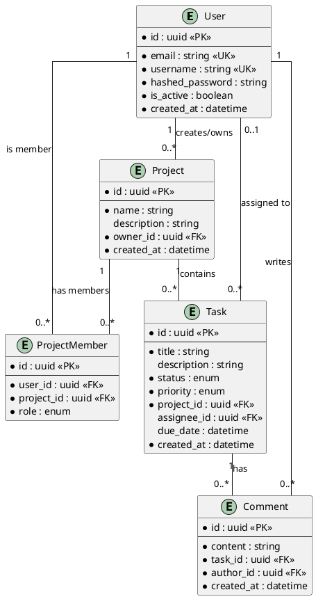

```plantuml
@startuml
skinparam style plain
left to right direction

package "✅ Існуючий курс" as existing {
  card OOP [
    <b>Модулі 0-4: ООП, Декоратори,
    Метакласи, Dataclasses
  ]
  card CONC [
    <b>Модуль 5: GIL, Threading,
    Multiprocessing, Asyncio
  ]
  card ASPNET [
    <b>ASP.NET курс: HTTP, REST,
    Auth, DI, Testing, Monitoring
  ]
}

package "🌉 Блок 1: Мости (Статті 15-16)" as bridge {
  card TYPING [
    <b>15. Typing Deep Dive
    & Pydantic v2
  ]
  card ASGI [
    <b>16. WSGI vs ASGI
    & Python Web-екосистема
  ]
}

package "🚀 Блок 2: FastAPI Core (Статті 17-21)" as fastapi_core {
  card FA_INTRO [
    <b>17. FastAPI: Перший додаток,
    Uvicorn, OpenAPI
  ]
  card FA_ROUTES [
    <b>18. Маршрутизація,
    Path/Query, APIRouter
  ]
  card FA_PYDANTIC [
    <b>19. Pydantic у FastAPI:
    Схеми, Валідація, Upload
  ]
  card FA_DI [
    <b>20. Dependency Injection
    система FastAPI
  ]
  card FA_ERRORS [
    <b>21. Помилки, Middleware,
    CORS, Rate Limiting
  ]
}

package "💾 Блок 3: Дані (Статті 22-24)" as fastapi_data {
  card SQLA [
    <b>22. SQLAlchemy 2.0:
    ORM, Async, Relationships
  ]
  card ALEMBIC [
    <b>23. Alembic: Міграції
    & Еволюція схеми
  ]
  card CRUD [
    <b>24. Repository Pattern
    & Clean Architecture
  ]
}

package "⚡ Блок 4: Production (Статті 25-28)" as fastapi_pro {
  card AUTH [
    <b>25. Auth: JWT, OAuth2,
    RBAC у FastAPI
  ]
  card TEST [
    <b>26. Тестування: pytest,
    httpx, Fixtures, CI
  ]
  card ASYNC [
    <b>27. Background Tasks,
    WebSockets, SSE, Celery
  ]
  card DEPLOY [
    <b>28. Docker, CI/CD,
    Monitoring, Deployment
  ]
}

package "🏗️ Блок 5: Django (Статті 29-40)" as django {
  card DJ_INTRO [
    <b>29-30. Django: Філософія,
    MVT, ORM
  ]
  card DJ_MID [
    <b>31-35. Views, Forms,
    Templates, Auth, Admin
  ]
  card DJ_ADV [
    <b>36-40. DRF, Signals,
    Channels, Testing, Deploy
  ]
}

OOP --> TYPING
CONC --> ASGI
ASPNET ..> FA_INTRO : "Знають концепції,\nвивчають Python-реалізацію"
TYPING --> FA_INTRO
ASGI --> FA_INTRO
FA_INTRO --> FA_ROUTES
FA_ROUTES --> FA_PYDANTIC
FA_PYDANTIC --> FA_DI
FA_DI --> FA_ERRORS
FA_ERRORS --> SQLA
SQLA --> ALEMBIC
ALEMBIC --> CRUD
CRUD --> AUTH
AUTH --> TEST
TEST --> ASYNC
ASYNC --> DEPLOY
DEPLOY --> DJ_INTRO
DJ_INTRO --> DJ_MID
DJ_MID --> DJ_ADV

@enduml
```

# План навчання: FastAPI → Django для kostyl.dev

## Контекст та аналіз існуючої бази

### Що вже є в `content/05.python/`

Існуючий курс Python на kostyl.dev — це **академічно глибокий, production-ready** матеріал із 16 статей, організованих у 5 модулів:

| Модуль | Статті | Статус |
|--------|--------|--------|
| **Модуль 0** — Організація коду | `00.modules-packages-venv.md` | ✅ Написано |
| **Модуль 1** — Основи типів та інкапсуляція | `01.classes-objects.md`, `02.encapsulation.md` | ✅ Написано |
| **Модуль 2** — Структура та поліморфізм | `03.inheritance-mro.md`, `04.abstraction-protocols.md` | ✅ Написано |
| **Модуль 3** — Механізми поведінки та метапрограмування | `05.dunder-methods.md`, `06.decorators-static-class.md`, `07.descriptors.md`, `08.metaclasses.md` | ✅ Написано |
| **Модуль 4** — Сучасні стандарти | `09.modern-containers.md` | ✅ Написано |
| **Модуль 5** — Конкурентність | `11.gil-concurrency-intro.md`, `12.threading.md`, `13.multiprocessing.md`, `14.asyncio.md` | ✅ Написано |

### Що студенти вже знають з курсу ASP.NET (`content/01.csharp/11.aspnet/`)

Студенти мають **глибокий досвід** з web-розробки на ASP.NET, що суттєво впливає на роадмап:

| Тема з ASP.NET | Файли | Що це означає для FastAPI-курсу |
|----------------|-------|---------------------------------|
| **HTTP, REST, API Design** | `02.api/01-14` (14 статей) | Не потрібно пояснювати HTTP-методи, status codes, REST, пагінацію, версіонування |
| **Middleware & Pipeline** | `01.minimal-api/04.request-pipeline-middleware.md` | Концепцію middleware знають, потрібно лише показати Python-реалізацію |
| **Routing** | `01.minimal-api/05-06.routing-*.md` | Знають маршрутизацію, потрібно лише синтаксис FastAPI |
| **OpenAPI / Swagger** | `01.minimal-api/16-17.scalar-openapi-*.md`, `02.api/14.openapi.md` | Знають OpenAPI-специфікацію глибоко |
| **Auth: JWT, OAuth2, RBAC** | `03.auth/01-16` (16 статей!) | Глибоко знають JWT, OAuth2, OIDC, RBAC/ABAC, API Keys, Rate Limiting |
| **Testing** | `07.testing/01-19` (19 статей!) | Знають піраміду тестування, TDD/BDD, мокування, інтеграційні тести |
| **DI (Dependency Injection)** | ASP.NET вбудований DI | Знають концепцію DI, потрібно лише FastAPI `Depends()` |
| **Configuration** | `01.minimal-api/09-10.configuration-*.md` | Знають 12-Factor, environment variables |
| **Monitoring** | `13.monitoring/` | Знають observability |
| **Project Structure** | `01.minimal-api/15.project-structure.md` | Знають шарову архітектуру |

> [!IMPORTANT]
> **Висновок**: Студенти НЕ новачки у web-розробці. Вони переходять з ASP.NET на Python-екосистему. Тому статті мають бути побудовані як **«Python/FastAPI для досвідченого ASP.NET розробника»** — з порівняннями, без зайвого розжовування базових концепцій HTTP/REST/Auth, але з глибоким поясненням Python-специфічних механізмів.

### Ключові спостереження

1. **Студент вже знає (Python)**: ООП (глибоко), декоратори, дескриптори, метакласи, dataclasses, asyncio, threading, multiprocessing.
2. **Студент вже знає (ASP.NET)**: HTTP/REST, DI, Middleware, Auth (JWT/OAuth2/RBAC), Testing, OpenAPI, Deployment, Monitoring.
3. **Немає в Python-курсі**: Робота з БД (SQLAlchemy/ORM), Pydantic, web-фреймворки Python, тестування в Python.
4. **asyncio — ідеальний місток**: Стаття `14.asyncio.md` природно підводить до FastAPI, яка побудована на ASGI та asyncio.
5. **Стиль**: Академічний, українською мовою, з глибоким поясненням «під капотом», PlantUML-діаграмами, компонентами Docus, 3-рівневими практичними завданнями.

---

## Філософія роадмапу

> **FastAPI перше, Django потім** — це не випадковий вибір.

FastAPI побудована на тих самих концепціях, які студент вже опанував:
- **Type hints** → Pydantic валідація
- **Декоратори** → маршрутизація (`@app.get`)
- **Дескриптори та dataclasses** → Pydantic моделі
- **asyncio** → ASGI, async endpoints
- **Protocols та ABC** → Dependency Injection

Django, навпаки, приховує ці механізми за «магічним» ORM, middleware та шаблонізатором. Вивчивши FastAPI, студент буде **розуміти**, що Django робить під капотом.

---

## Рішення за результатами фідбеку

| Питання | Рішення |
|---------|---------|
| SOLID як окрема стаття | ❌ Не потрібно — студенти знають з ASP.NET |
| Структура директорій | Підпапка `content/05.python/fastapi/` |
| Наскрізний проєкт | ✅ Так — «TaskForge» (система управління проєктами), з git-комітами |
| PostgreSQL vs SQLite | PostgreSQL |
| Django: коли? | Після повного завершення FastAPI-треку |
| HTTP/REST окрема стаття? | ❌ Скорочено до стислого огляду відмінностей WSGI/ASGI — студенти вже знають HTTP глибоко |

---

## Структура кожної статті (чотири частини)

Кожна стаття має будуватися за єдиним шаблоном і складатися з наступних частин:

### Частина 1: Теоретичний блок «від А до Я»
- Повний, академічний розбір теми у книжковому стилі «Why before How» (мотивація через вирішення реальних проблем).
- Всі кодові приклади мають містити не лише опис класів/функцій, а й **реальний демонстраційний запуск (Runtime-демо)**, показуючи, що виведе програма в консоль як для правильних даних, так і у разі виникнення помилок.
- Анатомія коду та детальна декомпозиція ключових параметрів (наприклад, параметри `Field()` за допомогою списків `::field-group`).
- Обов'язкове використання вкладок `::tabs` із детальними інструкціями для запуску через `pip`, `uv` та `poetry`.

### Частина 2: Окремий закінчений практичний приклад «від А до Я»
- Покрокова розробка (Крок 1, Крок 2 тощо) окремого невеликого завершеного рішення/мікросервісу на базі нової теми (наприклад, конфігуратор-валідатор платіжних webhook-ів для теми Pydantic).
- Чітка структура файлів проєкту.
- Повні лістинги коду для кожного кроку.
- Детальний опис команд запуску та логів консолі (вихідних результатів роботи).

### Частина 3: Практичний блок «TaskForge» (наскрізний проєкт)
- Покрокова інструкція для перенесення отриманих знань та інтеграції нової фічі безпосередньо до наскрізного проєкту курсу.
- Кожен крок — конкретна дія з кодом.
- В кінці кожної статті — **git commit** із зрозумілим повідомленням.
- *Примітка:* Цей блок починається з теми FastAPI (стаття 17-18).

### Частина 4: Практичні завдання
- 3-рівневі вправи для закріплення матеріалу (Базовий, Середній, Професійний).

### Загальні стандарти оформлення:
1. **Тільки PlantUML**: Заборонено використовувати Mermaid-діаграми. Всі схеми та архітектурні карти будуються через компонент `::plant-uml` з використанням PlantUML.
2. **Компоненти Docus**: Повсюдне використання `::note`, `::tip`, `::warning`, `::code-group`, `::tabs` (для залежностей) та `::field-group` (для описів полів).
3. **Академічний стиль**: Стиль має бути розгорнутим, книжковим, детальним (за зразком статті про Pods у Kubernetes).


---

## Наскрізний проєкт: «TaskForge»

**TaskForge** — API для системи управління проєктами та задачами (аналог спрощеного Jira/Trello).

### Чому саме TaskForge?

- **Достатня складність** для демонстрації всіх концепцій (CRUD, auth, roles, relationships, real-time)
- **Зрозумілий домен** — кожен студент працював з task-трекерами
- **Масштабується** — від простого TODO до повноцінної системи з командами, дедлайнами, коментарями

### Доменна модель (розвивається від статті до статті)
::plant-uml



::


### Еволюція проєкту по статтях (git-комміти)

| Стаття | Git Commit | Що додається |
|--------|-----------|--------------|
| 17. FastAPI Intro | `feat: init project, hello world endpoint` | Структура проєкту, `main.py`, uvicorn |
| 18. Routing | `feat: add task and project CRUD endpoints (in-memory)` | Роутери, path/query params, APIRouter |
| 19. Pydantic | `feat: add Pydantic schemas for request/response validation` | Schemas, валідація, response models |
| 20. DI | `feat: add dependency injection layer` | Залежності, service layer (in-memory) |
| 21. Errors & Middleware | `feat: add error handling, logging middleware, CORS` | Exception handlers, middleware |
| 22. SQLAlchemy | `feat: add PostgreSQL with SQLAlchemy models` | Моделі, engine, session, relationships |
| 23. Alembic | `feat: add Alembic migrations` | Initial migration, env.py |
| 24. Repository | `feat: implement repository pattern and service layer` | Repositories, UoW, clean architecture |
| 25. Auth | `feat: add JWT authentication and RBAC` | User registration, login, roles, permissions |
| 26. Testing | `feat: add comprehensive test suite` | pytest, fixtures, test DB, coverage |
| 27. Async Advanced | `feat: add WebSocket notifications and background tasks` | Real-time task updates, email notifications |
| 28. Deployment | `feat: add Docker, CI/CD, monitoring` | Dockerfile, docker-compose, GitHub Actions |

---

## Запропонований роадмап

### Візуальна карта

::plant-uml



::


---

## Proposed Changes

### Структура файлів

```
content/05.python/
├── 00.modules-packages-venv.md          # ✅ Існує
├── 01.classes-objects.md                 # ✅ Існує
├── ...                                   # ✅ Існує (02-14)
├── 14.asyncio.md                         # ✅ Існує (останній)
│
├── fastapi/                              # 🆕 НОВА ПІДПАПКА
│   ├── .navigation.yml                   # title: FastAPI
│   ├── 15.typing-pydantic.md
│   ├── 16.wsgi-asgi-ecosystem.md
│   ├── 17.fastapi-intro.md
│   ├── 18.fastapi-routing-params.md
│   ├── 19.fastapi-pydantic-schemas.md
│   ├── 20.fastapi-dependency-injection.md
│   ├── 21.fastapi-errors-middleware.md
│   ├── 22.sqlalchemy-orm.md
│   ├── 23.alembic-migrations.md
│   ├── 24.fastapi-repository-clean-arch.md
│   ├── 25.fastapi-auth-security.md
│   ├── 26.fastapi-testing.md
│   ├── 27.fastapi-async-advanced.md
│   └── 28.fastapi-deployment.md
│
├── django/                               # 🆕 НОВА ПІДПАПКА (у майбутньому)
│   ├── .navigation.yml                   # title: Django
│   ├── 29.django-intro-mvt.md
│   ├── 30.django-orm.md
│   ├── ... (31-40)
│   └── 40.django-deploy-comparison.md
```

---

### Блок 1: Мости — від Core Python до Web (Статті 15–16)

> Цей блок заповнює прогалини між існуючим курсом ООП/конкурентності та web-фреймворками. Оскільки студенти знають HTTP/REST з ASP.NET, фокус на **Python-специфічних** інструментах.

---

#### Стаття 15: Глибокий Typing та Pydantic v2 — від анотацій до валідації

- **Файл:** `fastapi/15.typing-pydantic.md`
- **Орієнтовний обсяг:** 5 500–7 000 слів
- **Prerequisite:** Дескриптори (07), Dataclasses (09), Protocols (04)
- **Мотивація:** FastAPI повністю побудована на type hints — маршрути, валідація, документація генеруються з анотацій типів. Без цієї статті студент не зрозуміє *як* FastAPI робить «магію».
- **Основні теми:**
  - **Частина I — Type Hints Deep Dive:**
    - Еволюція типізації: PEP 484 → PEP 604 (`X | Y`) → PEP 695 (`type X = ...`).
    - `Generic[T]`, `TypeVar`, `ParamSpec` — параметричний поліморфізм у Python.
    - `Annotated[T, metadata]` (PEP 593) — як додавати метадані до типів (основа FastAPI `Query`, `Path`, `Body`).
    - `TypeGuard`, `TypeIs`, `overload` — звуження типів.
    - `mypy` у CI/CD: строгий режим, плагіни, конфігурація.
  - **Частина II — Pydantic v2:**
    - Філософія: «parse, don't validate». Чим Pydantic відрізняється від dataclasses.
    - `BaseModel` під капотом: як Pydantic використовує метакласи та дескриптори (зв'язок зі статтями 07, 08).
    - Валідація: `field_validator`, `model_validator`, `BeforeValidator`, `AfterValidator`.
    - Серіалізація: `model_dump()`, `model_dump_json()`, `model_json_schema()`.
    - `ConfigDict`: strict mode, alias, population by name.
    - Pydantic Settings: конфігурація з `.env` файлів та змінних середовища.
    - Продуктивність Pydantic v2: Rust-ядро (`pydantic-core`), бенчмарки проти v1 та `attrs`.
    - Порівняння з ASP.NET: Data Annotations / FluentValidation ↔ Pydantic validators.
- **Візуалізація:** Mermaid-діаграма валідаційного пайплайну Pydantic.
- **Практика (Теоретична):**
  - Рівень 1: Створити Pydantic-модель для User з валідацією email, віку, дати.
  - Рівень 2: Побудувати вкладені моделі для JSON API (Order → OrderItem → Product) з custom валідаторами.
  - Рівень 3: Написати generic-валідатор з використанням `Annotated` та `BeforeValidator`.
- **Практика (TaskForge):**
  - _В цій статті ще немає проєкту — лише підготовка._

---

#### Стаття 16: WSGI, ASGI та Python Web-екосистема

- **Файл:** `fastapi/16.wsgi-asgi-ecosystem.md`
- **Орієнтовний обсяг:** 3 500–4 500 слів
- **Prerequisite:** asyncio (14)
- **Мотивація:** Студенти знають Kestrel та ASP.NET pipeline. Тепер потрібно зрозуміти Python-еквіваленти: чому WSGI існує, чому з'явився ASGI, і яке місце FastAPI та Django займають в цій екосистемі.
- **Основні теми:**
  - **WSGI (PEP 3333):**
    - Мінімальний WSGI-додаток (`def app(environ, start_response)`).
    - Як працює WSGI-сервер (Gunicorn, waitress).
    - Чому WSGI не підтримує async — sync-only інтерфейс.
    - Порівняння: WSGI ↔ Kestrel (ASP.NET) — синхронний Python vs асинхронний C#.
  - **ASGI (PEP дійсна специфікація):**
    - Мінімальний ASGI-додаток (`async def app(scope, receive, send)`).
    - Протоколи: HTTP, WebSocket, Lifespan.
    - ASGI-сервери: Uvicorn, Hypercorn, Daphne.
    - Порівняння: ASGI ↔ ASP.NET Middleware Pipeline.
  - **Python Web-фреймворки — карта:**
    - WSGI: Flask, Django (class), Bottle, Falcon.
    - ASGI: FastAPI, Starlette, Django (4.1+), Litestar.
    - Чому FastAPI = Starlette + Pydantic + OpenAPI.
  - **Практичне порівняння:**
    - Написати hello-world на чистому WSGI, чистому ASGI та FastAPI.
    - Бенчмарк: requests per second для кожного.
- **Візуалізація:** PlantUML — WSGI vs ASGI архітектура; Карта Python web-фреймворків.
- **Практика (Теоретична):**
  - Рівень 1: Написати WSGI hello-world та запустити через Gunicorn.
  - Рівень 2: Написати ASGI hello-world з routing (без фреймворку).
  - Рівень 3: Порівняти продуктивність WSGI vs ASGI на I/O-bound задачі (запити до зовнішнього API).
- **Практика (TaskForge):**
  - _В цій статті ще немає проєкту — лише підготовка._

---

### Блок 2: FastAPI Core (Статті 17–21)

> Серце курсу — повне занурення у FastAPI від першого запиту до production-ready middleware.

---

#### Стаття 17: FastAPI — перший додаток, Uvicorn та OpenAPI

- **Файл:** `fastapi/17.fastapi-intro.md`
- **Орієнтовний обсяг:** 5 000–6 000 слів
- **Мотивація:** Перший контакт із фреймворком. Студенти знають ASP.NET Minimal API — тому акцент на *відмінностях* та Python-специфічних механізмах.
- **Основні теми:**
  - **Чому FastAPI?** Порівняльна таблиця:
    - FastAPI vs Flask vs Django vs Litestar (async, типізація, автодокументація, DI, продуктивність).
    - FastAPI vs ASP.NET Minimal API — концептуальне порівняння (обидва — мікро, обидва — async, обидва — type-driven).
  - **Архітектура FastAPI:**
    - Starlette (ASGI-фреймворк) + Pydantic (валідація) + OpenAPI (документація).
    - Як FastAPI під капотом перетворює `@app.get` у ASGI route (зв'язок з декораторами, стаття 06).
  - **Інсталяція та структура проєкту:**
    - `pip install "fastapi[standard]"`, `uvicorn`.
    - `pyproject.toml` / `poetry` / `uv` — сучасне управління залежностями.
    - Рекомендована структура директорій для малих та середніх проєктів.
  - **Перший додаток:**
    - `FastAPI()` інстанс — що це під капотом (Starlette Application).
    - `@app.get("/")` — декоратор маршруту (зв'язок з `06.decorators`).
    - `async def` vs `def` ендпоінти — коли що (зв'язок з `14.asyncio`). Як FastAPI обробляє sync endpoints у threadpool.
    - Запуск через `uvicorn main:app --reload`.
  - **Автоматична документація:**
    - Swagger UI (`/docs`) та ReDoc (`/redoc`).
    - OpenAPI schema (`/openapi.json`) — як FastAPI генерує її з type hints.
    - Порівняння: Scalar/Swagger у ASP.NET ↔ вбудована документація FastAPI.
  - **Lifespan events:** `@asynccontextmanager` + `app = FastAPI(lifespan=...)` для ініціалізації/очищення ресурсів.
    - Порівняння: `WebApplicationBuilder` lifecycle (ASP.NET) ↔ FastAPI lifespan.
- **Візуалізація:** Mermaid — архітектурний стек FastAPI (Uvicorn → ASGI → Starlette → FastAPI → Pydantic → OpenAPI).
- **Практика (Теоретична):**
  - Рівень 1: Створити API з 3 ендпоінтами (GET, POST, DELETE) та перевірити у Swagger.
  - Рівень 2: Порівняти продуктивність sync vs async ендпоінту через `time.sleep` vs `asyncio.sleep`.
  - Рівень 3: Написати мінімальний ASGI-додаток без FastAPI, а потім замінити на FastAPI, показуючи різницю в кількості коду.
- **Практика (TaskForge):** 🏗️
  - Створити структуру проєкту TaskForge
  - Ініціалізувати `pyproject.toml`, встановити FastAPI + uvicorn
  - Створити `main.py` з hello-world ендпоінтом
  - Перевірити Swagger UI
  - **Git commit:** `feat: init TaskForge project with FastAPI and uvicorn`

---

#### Стаття 18: Маршрутизація, параметри та APIRouter

- **Файл:** `fastapi/18.fastapi-routing-params.md`
- **Орієнтовний обсяг:** 5 500–6 500 слів
- **Основні теми:**
  - **Path-параметри:** `/users/{user_id}` — автоматична конвертація типів, валідація через `Path()`.
    - Порівняння: `[FromRoute]` (ASP.NET) ↔ `Path()` (FastAPI).
  - **Query-параметри:** Обов'язкові, опціональні, зі значенням за замовчуванням. `Query()` з валідацією (`min_length`, `max_length`, `pattern`).
    - Порівняння: `[FromQuery]` (ASP.NET) ↔ `Query()` (FastAPI).
  - **Annotated pattern:** `Annotated[int, Path(ge=1)]` — чому це краще за `user_id: int = Path(ge=1)`. Зв'язок з PEP 593 (стаття 15).
  - **Request Body:** Pydantic-моделі як тіло запиту. Вкладені моделі. `Body()` для тонкої настройки.
    - Порівняння: `[FromBody]` + Data Annotations (ASP.NET) ↔ Pydantic model (FastAPI).
  - **Множинні джерела даних:** Комбінування Path + Query + Body + Header + Cookie в одному ендпоінті.
  - **APIRouter:** Декомпозиція додатку на модулі. `prefix`, `tags`, `dependencies`.
    - Порівняння: `RouteGroupBuilder.MapGroup()` (ASP.NET) ↔ `APIRouter` (FastAPI).
  - **Response Model:** `response_model`, `response_model_exclude`, `response_model_include` — контроль серіалізації.
  - **Status Codes:** `status.HTTP_201_CREATED`, `status.HTTP_204_NO_CONTENT` — семантично коректні відповіді.
    - Порівняння: `TypedResults.Created()` (ASP.NET) ↔ `status_code=201` (FastAPI).
  - **Порядок маршрутів:** Чому `/users/me` має бути перед `/users/{user_id}`. Порівняння з ASP.NET route precedence.
- **Візуалізація:** Діаграма резолюції параметрів FastAPI (звідки бере значення: path → query → body → header → cookie → default).
- **Практика (Теоретична):**
  - Рівень 1: CRUD ендпоінти для ресурсу `Product` з повною валідацією.
  - Рівень 2: Розбити монолітний `main.py` на `routers/users.py`, `routers/products.py`, `routers/orders.py`.
  - Рівень 3: Реалізувати cursor-based пагінацію та фільтрацію через Query-параметри.
- **Практика (TaskForge):** 🏗️
  - Створити `routers/projects.py` та `routers/tasks.py` з APIRouter
  - Реалізувати CRUD ендпоінти для Projects і Tasks (in-memory, dict як сховище)
  - Додати path/query параметри з валідацією
  - **Git commit:** `feat: add task and project CRUD endpoints with APIRouter (in-memory)`

---

#### Стаття 19: Pydantic v2 у FastAPI — схеми, валідація та серіалізація

- **Файл:** `fastapi/19.fastapi-pydantic-schemas.md`
- **Орієнтовний обсяг:** 5 000–6 000 слів
- **Мотивація:** Поглиблення матеріалу статті 15, але в контексті реального API. Як правильно проектувати request/response моделі.
- **Основні теми:**
  - **Стратегія моделей:** `UserCreate` (input) vs `UserRead` (output) vs `UserUpdate` (partial). Чому один клас для всього — антипатерн.
    - Порівняння: ASP.NET DTOs (CreateUserDto / UserDto) ↔ Pydantic schemas.
  - **Наслідування моделей:** `UserBase` → `UserCreate` / `UserRead`. DRY без порушення контрактів.
  - **Partial Update:** `PATCH` з `Optional` полями. `model.model_dump(exclude_unset=True)`.
  - **Вкладені моделі та relationships:** `OrderRead` з вкладеним `List[OrderItemRead]`.
  - **Custom Types:** `Annotated` + власні типи (`PositiveInt`, `EmailStr`, `HttpUrl`).
  - **JSON Schema Customization:** `model_json_schema()`, `json_schema_extra` для кастомних прикладів у Swagger.
  - **Enum та Literal:** Як обмежити допустимі значення полів (TaskStatus, Priority).
  - **File Upload:** `UploadFile`, `File()`, multipart/form-data.
    - Порівняння: `IFormFile` (ASP.NET) ↔ `UploadFile` (FastAPI).
- **Практика (Теоретична):**
  - Рівень 1: Спроектувати набір схем для CRUD API блогу (Post, Comment, Author).
  - Рівень 2: Реалізувати partial update з валідацією бізнес-правил.
  - Рівень 3: Створити generic pagination response `PaginatedResponse[T]` з використанням `Generic`.
- **Практика (TaskForge):** 🏗️
  - Створити `schemas/project.py` і `schemas/task.py` з повною ієрархією (Base/Create/Read/Update)
  - Додати Enum для `TaskStatus` (TODO, IN_PROGRESS, DONE) та `TaskPriority` (LOW, MEDIUM, HIGH)
  - Інтегрувати schemas у роутери замість raw dict
  - **Git commit:** `feat: add Pydantic schemas for request/response validation`

---

#### Стаття 20: Dependency Injection — серце архітектури FastAPI

- **Файл:** `fastapi/20.fastapi-dependency-injection.md`
- **Орієнтовний обсяг:** 5 500–6 500 слів
- **Мотивація:** DI у FastAPI — це найпотужніша і найменш очевидна концепція. Студенти вже знають DI з ASP.NET — тут фокус на *відмінності* Python-підходу (явний `Depends()` vs IoC-контейнер).
- **Основні теми:**
  - **DI у FastAPI vs ASP.NET:**
    - ASP.NET: IoC-контейнер з `AddScoped/Transient/Singleton` + constructor injection.
    - FastAPI: `Depends()` — декларативна ін'єкція через параметри функцій. Немає контейнера — є граф залежностей.
    - Чому підхід FastAPI простіший, але менш «магічний».
  - **`Depends()` під капотом:** Як FastAPI будує граф залежностей, резолвить та інжектує їх.
  - **Функції-залежності:** `def get_db() -> Generator[Session, None, None]` — yield-залежності для lifecycle management.
    - Порівняння: `IDisposable` + scope (ASP.NET) ↔ `yield` (FastAPI).
  - **Класи-залежності:** Callable class як залежність (зв'язок з `__call__`, стаття 05).
  - **Ланцюжки залежностей:** Залежність, яка сама має залежності. Граф резолюції.
  - **Scoped dependencies:** Request-scope (за замовчуванням) vs Application-scope (через lifespan).
  - **Global dependencies:** `app = FastAPI(dependencies=[Depends(verify_api_key)])` — для всього додатку.
  - **Override dependencies:** Заміна залежностей для тестування (`app.dependency_overrides`).
    - Порівняння: `WebApplicationFactory` + `ConfigureTestServices` (ASP.NET) ↔ `dependency_overrides` (FastAPI).
  - **Патерн UnitOfWork через DI:** Керування транзакціями бази даних.
- **Візуалізація:** PlantUML — граф залежностей типового API-ендпоінту (Request → Auth → DB Session → Repository → Service → Response).
- **Практика (Теоретична):**
  - Рівень 1: Створити залежність для пагінації (`skip`, `limit`).
  - Рівень 2: Реалізувати залежність `get_current_user` з ланцюжком (token → decode → user lookup).
  - Рівень 3: Побудувати повний DI-контейнер (DB session → Repository → Service) з override для тестів.
- **Практика (TaskForge):** 🏗️
  - Створити `services/project_service.py` та `services/task_service.py`
  - Винести бізнес-логіку з роутерів у сервіси
  - Інжектувати сервіси через `Depends()`
  - Створити спільні залежності (`get_pagination_params`, `get_sorting_params`)
  - **Git commit:** `feat: add dependency injection and service layer`

---

#### Стаття 21: Обробка помилок, Middleware та CORS

- **Файл:** `fastapi/21.fastapi-errors-middleware.md`
- **Орієнтовний обсяг:** 4 500–5 500 слів
- **Основні теми:**
  - **HTTPException:** Стандартні та кастомні виключення. `detail` як dict для структурованих помилок.
    - Порівняння: `ProblemDetails` (ASP.NET RFC 7807) ↔ FastAPI error responses.
  - **Exception Handlers:** `@app.exception_handler(CustomError)` — глобальна обробка помилок.
    - Порівняння: `UseExceptionHandler` + `IExceptionHandler` (ASP.NET) ↔ `exception_handler` (FastAPI).
  - **Validation Errors:** Як Pydantic `ValidationError` перетворюється на 422 Unprocessable Entity. Кастомізація формату помилок.
  - **Middleware:**
    - Як працює ASGI middleware (Request → Middleware Chain → Route Handler → Response → Middleware Chain).
    - `@app.middleware("http")` — простий middleware.
    - `BaseHTTPMiddleware` — class-based middleware.
    - Pure ASGI middleware — найшвидший варіант.
    - Порівняння: ASP.NET Middleware Pipeline (UseRouting → UseAuth → UseEndpoints) ↔ FastAPI middleware stack.
    - Практичні middleware: Logging, Timing, Request ID, Correlation ID.
  - **CORS (Cross-Origin Resource Sharing):**
    - `CORSMiddleware` — конфігурація `allow_origins`, `allow_methods`, `allow_credentials`.
    - Порівняння: `UseCors` (ASP.NET) ↔ `CORSMiddleware` (FastAPI).
  - **Trusted Host & HTTPS Redirect middleware.**
  - **Rate Limiting:** slowapi або власна реалізація через middleware.
    - Порівняння: `UseRateLimiter` (ASP.NET 7+) ↔ `slowapi` (FastAPI).
- **Практика (Теоретична):**
  - Рівень 1: Додати глобальний exception handler, який логує помилки та повертає уніфіковану структуру.
  - Рівень 2: Написати middleware для вимірювання часу відповіді, додавання `X-Request-ID` header та structured logging.
  - Рівень 3: Реалізувати rate limiting middleware з використанням `asyncio` та sliding window counter.
- **Практика (TaskForge):** 🏗️
  - Створити `core/exceptions.py` з кастомними виключеннями (`ProjectNotFoundError`, `TaskNotFoundError`, `ForbiddenError`)
  - Додати глобальні exception handlers
  - Додати middleware: request logging, timing, request ID
  - Налаштувати CORS
  - **Git commit:** `feat: add error handling, logging middleware and CORS`

---

### Блок 3: Дані та Persistence (Статті 22–24)

> З'єднання FastAPI зі світом баз даних через SQLAlchemy 2.0 та Alembic. Студенти знають EF Core з ASP.NET — порівняння допоможе швидше освоїти SQLAlchemy.

---

#### Стаття 22: SQLAlchemy 2.0 — ORM, Core та Async Engine

- **Файл:** `fastapi/22.sqlalchemy-orm.md`
- **Орієнтовний обсяг:** 6 500–8 000 слів
- **Мотивація:** Жоден production API не існує без бази даних. SQLAlchemy — стандарт де-факто для Python ORM.
- **Основні теми:**
  - **SQLAlchemy 2.0 — новий стиль:**
    - `DeclarativeBase`, `Mapped[T]`, `mapped_column()` — type-safe ORM mapping (зв'язок з type hints, стаття 15).
    - Чому 2.0 — це «Python-first» ORM (на відміну від Java-натхненного 1.x стилю).
    - Порівняння: EF Core DbContext/DbSet (ASP.NET) ↔ SQLAlchemy Engine/Session.
  - **Engine & Session:**
    - `create_engine()`, `Session`, `sessionmaker`. Connection pooling.
    - **Async:** `create_async_engine()`, `AsyncSession`, `async_sessionmaker` (зв'язок з asyncio, стаття 14).
    - PostgreSQL: `asyncpg` як async-драйвер, `psycopg2` / `psycopg` як sync-драйвер.
  - **Моделі:**
    - Визначення таблиць через Mapped classes. Типи колонок.
    - Relationships: `relationship()`, `ForeignKey`. One-to-Many, Many-to-Many, One-to-One.
    - Порівняння: EF Core Navigation Properties ↔ SQLAlchemy relationships.
    - Lazy loading vs Eager loading (`selectinload`, `joinedload`). N+1 problem.
    - Порівняння: `.Include()` (EF Core) ↔ `selectinload()` (SQLAlchemy).
  - **Запити:**
    - `select()`, `insert()`, `update()`, `delete()` — Core-стиль.
    - ORM запити: `session.execute(select(User).where(...))`.
    - Фільтрація, сортування, Join, Group By, підзапити.
    - Порівняння: LINQ (EF Core) ↔ SQLAlchemy query API.
  - **Під капотом:**
    - Unit of Work (UoW) патерн у SQLAlchemy — як відстежуються зміни (зв'язок з дескрипторами, стаття 07).
    - Identity Map — чому `session.get(User, 1)` повертає той самий об'єкт.
    - Change tracking: SQLAlchemy `inspect(obj).attrs.name.history`.
    - Порівняння: EF Core Change Tracker ↔ SQLAlchemy Session UoW.
- **Візуалізація:** PlantUML — архітектура SQLAlchemy (Engine → Connection Pool → Session → Unit of Work → Identity Map → Models).
- **Практика (Теоретична):**
  - Рівень 1: Визначити моделі User, Post, Comment з relationships. CRUD через Session.
  - Рівень 2: Оптимізувати N+1 запит через eager loading. Порівняти SQL-запити через `echo=True`.
  - Рівень 3: Реалізувати async session з `create_async_engine` та інтегрувати в FastAPI через DI.
- **Практика (TaskForge):** 🏗️
  - Створити `models/` з SQLAlchemy моделями: `User`, `Project`, `ProjectMember`, `Task`, `Comment`
  - Налаштувати `core/database.py` з async engine та session factory (PostgreSQL)
  - Створити `Depends(get_async_session)` для інжекції сесії
  - Замінити in-memory сховище на реальну БД
  - **Git commit:** `feat: add PostgreSQL with SQLAlchemy 2.0 async models`

---

#### Стаття 23: Alembic — міграції бази даних

- **Файл:** `fastapi/23.alembic-migrations.md`
- **Орієнтовний обсяг:** 3 500–4 500 слів
- **Основні теми:**
  - **Проблема:** Чому `Base.metadata.create_all()` не підходить для production.
    - Порівняння: EF Core Migrations (ASP.NET) ↔ Alembic.
  - **Alembic:** `alembic init`, `alembic.ini`, `env.py`. Структура проєкту міграцій.
    - Порівняння: `dotnet ef migrations add` ↔ `alembic revision --autogenerate`.
  - **Автогенерація:** `alembic revision --autogenerate -m "add users table"`. Що Alembic бачить, а що ні.
  - **Ручні міграції:** `op.add_column()`, `op.drop_column()`, data migrations.
  - **Upgrade / Downgrade:** `alembic upgrade head`, `alembic downgrade -1`. Ланцюжок ревізій.
    - Порівняння: `dotnet ef database update` ↔ `alembic upgrade head`.
  - **Async Alembic:** Конфігурація `env.py` для async engine.
  - **Branching:** Робота з гілками міграцій у команді.
  - **Best practices:** Naming conventions, squashing міграцій, CI/CD інтеграція.
- **Практика (Теоретична):**
  - Рівень 1: Ініціалізувати Alembic, створити першу автоміграцію.
  - Рівень 2: Написати data migration (заповнення таблиці seed-даними).
  - Рівень 3: Налаштувати Alembic для async engine та інтегрувати в CI pipeline.
- **Практика (TaskForge):** 🏗️
  - Ініціалізувати Alembic з async-конфігурацією
  - Створити initial migration для всіх моделей
  - Запустити `alembic upgrade head` для PostgreSQL
  - Додати seed-скрипт для тестових даних
  - **Git commit:** `feat: add Alembic migrations and initial schema`

---

#### Стаття 24: Repository Pattern та Clean Architecture у FastAPI

- **Файл:** `fastapi/24.fastapi-repository-clean-arch.md`
- **Орієнтовний обсяг:** 5 500–6 500 слів
- **Мотивація:** Як правильно організувати код, щоб бізнес-логіка не залежала від фреймворку та бази даних.
- **Основні теми:**
  - **Шарова архітектура:**
    - Router (Controller) → Service (Use Case) → Repository (Data Access) → Model (Entity).
    - Чому endpoint не повинен містити SQL-запити.
    - Порівняння: Controller → Service → Repository (ASP.NET) ↔ Router → Service → Repository (FastAPI).
  - **Repository Pattern:**
    - Абстрактний `AbstractRepository[T]` (Protocol або ABC).
    - `SQLAlchemyRepository` — конкретна реалізація.
    - Generic CRUD repository з методами `get`, `list`, `create`, `update`, `delete`.
    - Порівняння: Generic Repository (EF Core) ↔ Generic Repository (SQLAlchemy).
  - **Service Layer:**
    - Бізнес-логіка як чисті функції або класи.
    - Оркестрація кількох repository у одній транзакції.
  - **Unit of Work (UoW):**
    - Context manager для управління транзакціями.
    - Інтеграція з FastAPI через `Depends()`.
    - Порівняння: `DbContext.SaveChangesAsync()` (EF Core) ↔ `session.commit()` у UoW.
  - **Повна структура проєкту:**
    ```
    app/
    ├── api/             # Routers (Controllers)
    │   ├── v1/
    │   │   ├── projects.py
    │   │   ├── tasks.py
    │   │   └── users.py
    │   └── deps.py      # Shared dependencies
    ├── core/            # Config, Security, Exceptions
    │   ├── config.py
    │   ├── database.py
    │   └── exceptions.py
    ├── models/          # SQLAlchemy Models (Entities)
    │   ├── user.py
    │   ├── project.py
    │   └── task.py
    ├── schemas/         # Pydantic Schemas (DTOs)
    │   ├── user.py
    │   ├── project.py
    │   └── task.py
    ├── repositories/    # Data Access Layer
    │   ├── base.py
    │   ├── user.py
    │   └── project.py
    ├── services/        # Business Logic
    │   ├── user.py
    │   └── project.py
    └── main.py
    ```
- **Візуалізація:** PlantUML — Onion Architecture diagram; Dependency flow diagram.
- **Практика (Теоретична):**
  - Рівень 1: Винести SQL-запити з роутерів у Repository клас.
  - Рівень 2: Реалізувати Service layer з бізнес-правилами (наприклад, «не можна видалити проєкт з активними задачами»).
  - Рівень 3: Побудувати повний UoW + Repository + Service стек з тестами через dependency override.
- **Практика (TaskForge):** 🏗️
  - Реструктурувати проєкт відповідно до Clean Architecture
  - Створити `repositories/base.py` з Generic `SQLAlchemyRepository[T]`
  - Створити специфічні repositories для кожної моделі
  - Перенести бізнес-логіку з роутерів у сервіси
  - Реалізувати UoW через context manager + DI
  - **Git commit:** `feat: implement repository pattern, service layer and clean architecture`

---

### Блок 4: Production FastAPI (Статті 25–28)

> Все, що потрібно для production-ready API.

---

#### Стаття 25: Автентифікація та авторизація — JWT, OAuth2, RBAC

- **Файл:** `fastapi/25.fastapi-auth-security.md`
- **Орієнтовний обсяг:** 6 000–7 000 слів
- **Мотивація:** Студенти глибоко знають Auth з ASP.NET (16 статей!). Тут фокус на **Python-реалізації** та відмінностях підходу.
- **Основні теми:**
  - **Password Hashing:** `bcrypt`, `passlib` / `argon2-cffi`. Чому MD5/SHA — небезпечно. Salt, work factor.
    - Порівняння: `PasswordHasher` (ASP.NET Identity) ↔ `passlib` (Python).
  - **JWT (JSON Web Token):**
    - Access Token + Refresh Token flow.
    - `python-jose` або `PyJWT` для створення/верифікації.
    - Зберігання refresh token у БД з ротацією.
    - Порівняння: `JwtBearerDefaults` (ASP.NET) ↔ `OAuth2PasswordBearer` (FastAPI).
  - **OAuth2 у FastAPI:**
    - `OAuth2PasswordBearer`, `OAuth2PasswordRequestForm`.
    - Security scheme у Swagger UI.
    - `Depends(get_current_user)` — ланцюжок авторизації.
  - **RBAC (Role-Based Access Control):**
    - Модель User ↔ ProjectMember.role (Owner, Admin, Member, Viewer).
    - Залежність `require_project_role(ProjectRole.ADMIN)`.
    - Порівняння: `[Authorize(Roles = "Admin")]` (ASP.NET) ↔ `Depends(require_role(...))` (FastAPI).
  - **API Key authentication:** Header vs Query parameter.
  - **Security Headers:** HSTS, X-Content-Type-Options, CSP через middleware.
- **Практика (Теоретична):**
  - Рівень 1: Реалізувати реєстрацію + логін з JWT.
  - Рівень 2: Додати refresh token flow з ротацією.
  - Рівень 3: Побудувати RBAC-систему з Permission-based авторизацією на рівні проєкту.
- **Практика (TaskForge):** 🏗️
  - Створити `api/v1/auth.py` з ендпоінтами реєстрації та логіну
  - Реалізувати JWT access + refresh token
  - Додати `Depends(get_current_user)` до захищених роутів
  - Реалізувати RBAC: Owner/Admin/Member/Viewer для проєктів
  - **Git commit:** `feat: add JWT authentication, refresh tokens and project-level RBAC`

---

#### Стаття 26: Тестування FastAPI — pytest, httpx, fixtures

- **Файл:** `fastapi/26.fastapi-testing.md`
- **Орієнтовний обсяг:** 5 500–6 500 слів
- **Мотивація:** Студенти знають тестування з ASP.NET (19 статей!). Тут — як ці ж самі принципи реалізуються в Python-екосистемі.
- **Основні теми:**
  - **pytest основи:** Fixtures, parametrize, markers, conftest.py.
    - Порівняння: xUnit + `[Fact]`/`[Theory]` ↔ pytest + `@pytest.mark.parametrize`.
  - **TestClient (httpx):** Синхронне та асинхронне тестування ендпоінтів.
    - Порівняння: `WebApplicationFactory` + `HttpClient` (ASP.NET) ↔ `TestClient` (FastAPI).
  - **Database fixtures:** Тестова PostgreSQL (testcontainers або SQLite для швидкості), `@pytest.fixture(scope="session")`, transactions rollback.
    - Порівняння: `Respawn` / `InMemoryDatabase` (ASP.NET) ↔ transaction rollback fixtures (Python).
  - **Dependency Overrides:** `app.dependency_overrides[get_db] = override_get_db`.
    - Порівняння: `ConfigureTestServices` (ASP.NET) ↔ `dependency_overrides` (FastAPI).
  - **Factory Boy / Faker:** Генерація тестових даних.
    - Порівняння: Bogus (C#) ↔ Faker/Factory Boy (Python).
  - **Мокування:** `unittest.mock`, `pytest-mock`. Коли мокувати, а коли — ні.
    - Порівняння: Moq (C#) ↔ `unittest.mock` / `pytest-mock` (Python).
  - **Integration vs Unit tests:** Піраміда тестування в контексті FastAPI.
  - **Coverage:** `pytest-cov`, мінімальний поріг покриття.
  - **CI інтеграція:** GitHub Actions з pytest, linting (`ruff`), type checking (`mypy`).
- **Практика (Теоретична):**
  - Рівень 1: Написати unit-тести для Pydantic-схем та сервісів.
  - Рівень 2: Написати integration-тести для CRUD ендпоінтів з тестовою БД.
  - Рівень 3: Побудувати повний CI pipeline (lint → type check → test → coverage report).
- **Практика (TaskForge):** 🏗️
  - Створити `tests/` з conftest.py (тестова БД, fixtures, dependency overrides)
  - Написати тести для auth flow (register, login, refresh)
  - Написати тести для CRUD operations (projects, tasks)
  - Додати Factory Boy для генерації тестових даних
  - Налаштувати `pytest-cov` з порогом покриття 80%
  - **Git commit:** `feat: add comprehensive test suite with pytest, fixtures and CI`

---

#### Стаття 27: Async на повну: Background Tasks, WebSockets, SSE

- **Файл:** `fastapi/27.fastapi-async-advanced.md`
- **Орієнтовний обсяг:** 5 500–6 500 слів
- **Основні теми:**
  - **Background Tasks:** `BackgroundTasks` — відправка email, логування після response.
  - **WebSockets:**
    - `@app.websocket("/ws")` — повний lifecycle (connect, receive, send, disconnect).
    - Connection manager для broadcast.
    - Авторизація WebSocket з'єднань (query param token).
    - Порівняння: SignalR (ASP.NET) ↔ FastAPI WebSocket.
  - **Server-Sent Events (SSE):** `StreamingResponse` для real-time оновлень.
  - **Celery + Redis:**
    - Для важких background jobs (генерація звітів, обробка зображень).
    - Worker, Broker, Result Backend архітектура.
    - Порівняння: Hangfire/BackgroundService (ASP.NET) ↔ Celery (Python).
  - **Task Queues порівняння:** Celery vs Dramatiq vs ARQ (async).
  - **Streaming Responses:** Великі файли, генерація CSV на льоту.
  - **`run_in_executor`:** Виклик sync-коду з async ендпоінтів (зв'язок з asyncio, стаття 14).
- **Практика (Теоретична):**
  - Рівень 1: Відправити email у background після реєстрації.
  - Рівень 2: Побудувати WebSocket чат для коментарів до задачі.
  - Рівень 3: Інтегрувати Celery для генерації PDF-звіту по проєкту із progress reporting через SSE.
- **Практика (TaskForge):** 🏗️
  - Додати WebSocket endpoint для real-time оновлень задач (зміна статусу, нові коментарі)
  - Реалізувати `ConnectionManager` з кімнатами (per project)
  - Додати Background Task для email-нотифікацій при призначенні задачі
  - **Git commit:** `feat: add WebSocket notifications and background email tasks`

---

#### Стаття 28: Deployment — Docker, CI/CD, Monitoring

- **Файл:** `fastapi/28.fastapi-deployment.md`
- **Орієнтовний обсяг:** 5 000–6 000 слів
- **Основні теми:**
  - **Docker:**
    - Multi-stage Dockerfile для Python. Оптимізація образу (`slim`, `alpine`, layer caching).
    - `docker-compose.yml`: FastAPI + PostgreSQL + Redis.
    - Зв'язок з `07.tools/01.docker/` (існуючий матеріал).
    - Порівняння: `Dockerfile` для .NET ↔ `Dockerfile` для Python.
  - **Production Uvicorn:**
    - Workers: `uvicorn --workers 4` vs `gunicorn -k uvicorn.workers.UvicornWorker`.
    - Graceful shutdown, health checks (`/health`, `/ready`).
    - Порівняння: Kestrel + IIS (ASP.NET) ↔ Uvicorn + Nginx (FastAPI).
  - **Environment Configuration:**
    - Pydantic Settings (зв'язок зі статтею 15).
    - 12-Factor App methodology.
    - Порівняння: `appsettings.json` + `IConfiguration` (ASP.NET) ↔ Pydantic Settings + `.env` (FastAPI).
  - **CI/CD Pipeline:**
    - GitHub Actions: lint (`ruff`) → type check (`mypy`) → test → build → deploy.
    - Docker image push to registry.
  - **Monitoring & Observability:**
    - Structured logging (`structlog` / `loguru`).
    - Prometheus metrics + Grafana.
    - OpenTelemetry tracing.
    - Sentry для error tracking.
    - Порівняння: Serilog/OpenTelemetry (ASP.NET) ↔ structlog/OpenTelemetry (Python).
  - **Reverse Proxy:** Nginx / Traefik перед Uvicorn.
- **Практика (Теоретична):**
  - Рівень 1: Контейнеризувати FastAPI додаток з docker-compose.
  - Рівень 2: Налаштувати GitHub Actions CI/CD з автодеплоєм.
  - Рівень 3: Додати Prometheus метрики та Grafana дашборд для API.
- **Практика (TaskForge):** 🏗️
  - Створити multi-stage `Dockerfile`
  - Створити `docker-compose.yml` (FastAPI + PostgreSQL + Redis)
  - Налаштувати Pydantic Settings для конфігурації
  - Додати health check endpoint
  - Створити `.github/workflows/ci.yml` (lint → test → build → push)
  - **Git commit:** `feat: add Docker, docker-compose, CI/CD and health checks`
  - 🎉 **Фінальний стан TaskForge** — повністю готовий production-ready API

---

### Блок 5: Django — від FastAPI до «батарейок» (Статті 29–40)

> Після глибокого розуміння HTTP, ORM, DI та архітектури API — перехід до Django стає **порівняльним вивченням**, а не заучуванням. Кожна стаття порівнює Django-підхід з вже вивченим FastAPI та знайомим ASP.NET.

---

#### Стаття 29: Django — Філософія, MVT та порівняння з FastAPI
- **Файл:** `django/29.django-intro-mvt.md`
- **Орієнтовний обсяг:** 5 000–6 000 слів
- **Основні теми:**
  - Чому Django обрав «batteries included». Філософія DRY та Convention over Configuration.
  - MVT (Model-View-Template) vs MVC vs FastAPI Router/Service/Schema.
  - `django-admin startproject`, `startapp`. Структура проєкту.
  - Settings module: `INSTALLED_APPS`, `MIDDLEWARE`, `DATABASES`, `ROOT_URLCONF`.
  - WSGI/ASGI: `wsgi.py` vs `asgi.py`. Як Django підтримує обидва.
  - `manage.py` — єдина точка входу (порівняння з `dotnet` CLI та `uvicorn`).
  - Порівняльна таблиця: Django startproject vs FastAPI init vs ASP.NET `dotnet new webapi`.
- **Практика (Теоретична):** Створити Django-проєкт, зрозуміти структуру, запустити dev-сервер.
- **Практика (Django TaskBoard):** 🏗️ Ініціалізувати Django-версію TaskForge → **TaskBoard**.
  - **Git commit:** `feat: init TaskBoard Django project`

---

#### Стаття 30: Django ORM — моделі, міграції, QuerySet
- **Файл:** `django/30.django-orm.md`
- **Орієнтовний обсяг:** 6 000–7 000 слів
- **Основні теми:**
  - Models: `CharField`, `ForeignKey`, `ManyToManyField`, `DateTimeField`. Meta options.
  - Міграції: `makemigrations`, `migrate`. Порівняння з Alembic (стаття 23).
  - QuerySet API: `filter()`, `exclude()`, `annotate()`, `aggregate()`, `select_related()`, `prefetch_related()`.
  - Manager та Custom QuerySet.
  - Порівняння: Django ORM ↔ SQLAlchemy 2.0 ↔ EF Core (три ORM пліч-о-пліч).
  - F-expressions, Q-objects, Subquery, RawSQL.
  - Signals: `pre_save`, `post_save` (введення, детальніше у статті 38).
- **Практика (TaskBoard):** 🏗️ Створити моделі User, Project, Task, Comment.
  - **Git commit:** `feat: add Django models and initial migrations`

---

#### Стаття 31: Django Views та URL Routing
- **Файл:** `django/31.django-views-urls.md`
- **Орієнтовний обсяг:** 5 000–6 000 слів
- **Основні теми:**
  - Function-Based Views (FBV): `HttpRequest` → `HttpResponse`.
  - `urls.py`: `path()`, `include()`, `re_path()`. URL namespacing.
  - Class-Based Views (CBV): `View`, `ListView`, `DetailView`, `CreateView`, `UpdateView`, `DeleteView`.
  - Mixins: `LoginRequiredMixin`, `PermissionRequiredMixin`.
  - Generic Views: як Django генерує CRUD за 10 рядків коду.
  - Порівняння: Django FBV/CBV ↔ FastAPI endpoints ↔ ASP.NET Minimal API / Controllers.
- **Практика (TaskBoard):** 🏗️ Створити views для проєктів та задач.
  - **Git commit:** `feat: add views and URL routing`

---

#### Стаття 32: Django Templates та Static Files
- **Файл:** `django/32.django-templates.md`
- **Орієнтовний обсяг:** 4 500–5 500 слів
- **Основні теми:**
  - DTL (Django Template Language): змінні, теги, фільтри.
  - Template inheritance: ``, ``.
  - Custom template tags та filters.
  - Static files: ``, `STATICFILES_DIRS`, `collectstatic`.
  - Media files: `MEDIA_ROOT`, `MEDIA_URL`, `FileField`, `ImageField`.
  - Порівняння: Django Templates ↔ Razor Pages (ASP.NET). Чому FastAPI не має шаблонізатора (Jinja2 як опція).
- **Практика (TaskBoard):** 🏗️ Створити шаблони для списку проєктів, деталей задачі.
  - **Git commit:** `feat: add templates and static files`

---

#### Стаття 33: Django Forms та Валідація
- **Файл:** `django/33.django-forms.md`
- **Орієнтовний обсяг:** 4 500–5 500 слів
- **Основні теми:**
  - `forms.Form` та `forms.ModelForm`: автогенерація форм з моделей.
  - Валідація: `clean_<field>()`, `clean()`, custom validators.
  - CSRF protection: ``, як Django захищає від CSRF.
  - Formsets та Inline Formsets.
  - Порівняння: Django Forms ↔ Pydantic validation (FastAPI) ↔ Data Annotations + ModelState (ASP.NET).
- **Практика (TaskBoard):** 🏗️ Створити форми створення/редагування проєктів та задач.
  - **Git commit:** `feat: add forms with validation and CSRF protection`

---

#### Стаття 34: Django Auth та Permissions
- **Файл:** `django/34.django-auth.md`
- **Орієнтовний обсяг:** 5 000–6 000 слів
- **Основні теми:**
  - `django.contrib.auth`: вбудована система автентифікації.
  - User model customization: `AbstractUser` vs `AbstractBaseUser`.
  - Groups & Permissions: `has_perm()`, `permission_required`.
  - Login/Logout/Password reset views.
  - Session-based auth vs Token-based auth (JWT у FastAPI).
  - Порівняння: Django Auth ↔ FastAPI JWT/OAuth2 (стаття 25) ↔ ASP.NET Identity.
- **Практика (TaskBoard):** 🏗️ Додати автентифікацію та ролі.
  - **Git commit:** `feat: add authentication, custom user model and permissions`

---

#### Стаття 35: Django Admin — автоматичний CRUD-інтерфейс
- **Файл:** `django/35.django-admin.md`
- **Орієнтовний обсяг:** 4 000–5 000 слів
- **Основні теми:**
  - `ModelAdmin`: `list_display`, `list_filter`, `search_fields`, `ordering`.
  - Inline models: `TabularInline`, `StackedInline`.
  - Custom admin actions: bulk operations.
  - Overriding admin templates.
  - Порівняння: Django Admin ↔ SQLAdmin (FastAPI) ↔ немає аналога в ASP.NET (потрібно будувати вручну).
- **Практика (TaskBoard):** 🏗️ Налаштувати admin panel для всіх моделей.
  - **Git commit:** `feat: configure Django Admin with custom ModelAdmin`

---

#### Стаття 36: Django REST Framework (DRF)
- **Файл:** `django/36.django-rest-framework.md`
- **Орієнтовний обсяг:** 6 000–7 000 слів
- **Основні теми:**
  - Serializers: `Serializer`, `ModelSerializer`. Порівняння з Pydantic schemas.
  - ViewSets: `ModelViewSet`, `ReadOnlyModelViewSet`. Автоматичний CRUD.
  - Routers: `DefaultRouter`. Автогенерація URL.
  - Permissions: `IsAuthenticated`, `IsAdminUser`, custom permissions.
  - Throttling: rate limiting.
  - Pagination: `PageNumberPagination`, `CursorPagination`.
  - Filtering: `django-filter`, `SearchFilter`, `OrderingFilter`.
  - OpenAPI: `drf-spectacular` для генерації Swagger.
  - Порівняння: DRF ↔ FastAPI — детальне порівняння endpoint-by-endpoint.
- **Практика (TaskBoard):** 🏗️ Побудувати REST API з DRF поруч з template views.
  - **Git commit:** `feat: add Django REST Framework API with ViewSets`

---

#### Стаття 37: Django Signals, Middleware та Caching
- **Файл:** `django/37.django-signals-middleware.md`
- **Орієнтовний обсяг:** 4 500–5 500 слів
- **Основні теми:**
  - Signals: `pre_save`, `post_save`, `pre_delete`, `post_delete`, `m2m_changed`, `request_started`, `request_finished`.
  - Custom signals. Receiver registration.
  - Middleware: `process_request`, `process_response`, `process_exception`.
  - Cache framework: Redis backend, per-view cache, template fragment cache, low-level cache API.
  - Порівняння: Django Signals ↔ FastAPI events/background tasks ↔ ASP.NET MediatR/Events.
  - Порівняння: Django Middleware ↔ FastAPI Middleware (стаття 21) ↔ ASP.NET Middleware.
- **Практика (TaskBoard):** 🏗️ Додати signals для аудиту змін, middleware для логування, Redis cache.
  - **Git commit:** `feat: add signals, custom middleware and Redis caching`

---

#### Стаття 38: Django Async та Channels
- **Файл:** `django/38.django-async-channels.md`
- **Орієнтовний обсяг:** 5 000–6 000 слів
- **Основні теми:**
  - Async views (Django 4.1+): `async def view(request)`. Обмеження (ORM sync-only у більшості операцій).
  - `sync_to_async`, `async_to_sync` — мости між світами.
  - Django Channels: WebSocket consumers, Channel Layers (Redis).
  - Routing: `ProtocolTypeRouter`, `URLRouter`, `AuthMiddlewareStack`.
  - Порівняння: Django Channels ↔ FastAPI WebSocket (стаття 27) ↔ SignalR (ASP.NET).
- **Практика (TaskBoard):** 🏗️ Додати WebSocket-нотифікації через Channels.
  - **Git commit:** `feat: add Django Channels WebSocket notifications`

---

#### Стаття 39: Django Testing
- **Файл:** `django/39.django-testing.md`
- **Орієнтовний обсяг:** 4 500–5 500 слів
- **Основні теми:**
  - `django.test.TestCase`: транзакційна ізоляція, `setUp`/`tearDown`.
  - `Client`: тестування views та API.
  - `RequestFactory`: unit-тестування views.
  - Fixtures: JSON/YAML fixtures, Factory Boy + `pytest-django`.
  - `pytest-django`: конфігурація, маркери (`@pytest.mark.django_db`).
  - Порівняння: Django TestCase ↔ FastAPI TestClient (стаття 26) ↔ xUnit/WebApplicationFactory (ASP.NET).
- **Практика (TaskBoard):** 🏗️ Написати тести для models, views та API.
  - **Git commit:** `feat: add test suite with pytest-django`

---

#### Стаття 40: Django Deployment та Фінальне порівняння
- **Файл:** `django/40.django-deploy-comparison.md`
- **Орієнтовний обсяг:** 5 500–6 500 слів
- **Основні теми:**
  - **Deployment:**
    - Gunicorn + Nginx (WSGI) або Daphne/Uvicorn (ASGI).
    - `collectstatic` + Whitenoise для static files.
    - Docker: multi-stage build для Django.
    - CI/CD: GitHub Actions.
  - **Фінальна порівняльна таблиця FastAPI vs Django:**

    | Аспект | FastAPI | Django |
    |--------|---------|--------|
    | **Філософія** | Micro-framework, async-first | Batteries-included, monolithic |
    | **Типізація** | Обов'язкова (Pydantic) | Опціональна |
    | **ORM** | SQLAlchemy (зовнішній) | Django ORM (вбудований) |
    | **Міграції** | Alembic (зовнішній) | Вбудовані |
    | **Автодокументація** | Swagger/ReDoc з коробки | DRF + drf-spectacular |
    | **Admin Panel** | Немає (SQLAdmin) | Вбудована |
    | **Auth** | JWT/OAuth2 (ручна реалізація) | Вбудована Session/Token auth |
    | **WebSockets** | Вбудовані | Django Channels (зовнішній) |
    | **Тестування** | pytest + httpx | django.test + pytest-django |
    | **Deployment** | Uvicorn + Docker | Gunicorn + Nginx |
    | **Крива навчання** | Крутіша (потрібні prereqs) | Пологіша (все з коробки) |
    | **Коли обирати** | API-first, мікросервіси, ML | Full-stack, CMS, адмінки, MVP |

  - **Дерево прийняття рішень:** Блок-схема «який фреймворк обрати для мого проєкту».
  - **Гібридний підхід:** Django + DRF для admin/CMS + FastAPI для high-performance API endpoints.
- **Практика (TaskBoard):** 🏗️
  - Контейнеризувати Django-додаток
  - Налаштувати CI/CD
  - **Git commit:** `feat: add Docker, deployment config and final polish`
  - 🎉 **Фінальний стан TaskBoard** — повністю готовий Django-додаток

---

## Підсумок обсягу

| Блок | Статей | Орієнтовний обсяг |
|------|--------|-------------------|
| Блок 1: Мости | 2 | ~10 000 слів |
| Блок 2: FastAPI Core | 5 | ~26 000 слів |
| Блок 3: Дані | 3 | ~16 000 слів |
| Блок 4: Production | 4 | ~22 000 слів |
| **FastAPI разом** | **14** | **~74 000 слів** |
| Блок 5: Django | 12 | ~60 000 слів |
| **Загалом** | **26** | **~134 000 слів** |

---

## Verification Plan

### Automated Tests
- Перевірка, що всі файли мають коректний YAML frontmatter
- Валідація PlantUML/Mermaid діаграм
- Перевірка компонентів Docus (коректне закриття тегів `::`)
- Запуск усіх прикладів коду на Python 3.12+

### Manual Verification
- Перевірка рендерингу кожної статті на локальному dev-сервері (`npm run dev`)
- Валідація навігації між статтями
- Перевірка роботи Swagger UI у прикладах коду
- Прохід наскрізного проєкту TaskForge від першого до останнього коміту
