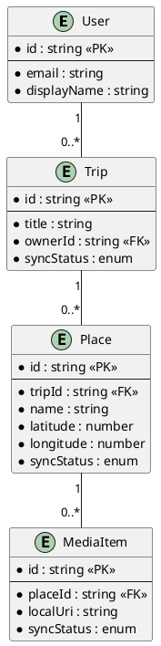

# План навчання: React Native

> **Аудиторія:** React, Redux, TypeScript (мобільний досвід не обов’язковий)  
> **Мова:** українська (статті та UI)  
> **Стиль тексту:** книжковий, людяний, максимально розжований — див. [§3](#3-стиль-написання-матеріалів-обовʼязково)  
> **Оформлення:** `DOCUS_COMPONENTS.md` + лише PlantUML  
> **Контент:** `content/15.react-native/`  
> **Код Nomad (окремий репо):** [https://github.com/arakviel/nomad](https://github.com/arakviel/nomad)  
> **Матеріали курсу:** `content/15.react-native/` (kostyl.dev)  
> **Коміти Nomad:** лише в репо Nomad; **один коміт на статтю**; у тілі `Material: content/15.react-native/<файл-статті>.md`  
> **Не** тримати [Nomad](https://github.com/arakviel/nomad) у monorepo kostyl.dev  
> **Еталон глибини розжовування:** `content/07.tools/02.kubernetes/04.pods-and-containers.md` (але тон — спокійніший і простіший, без «лекторського пафосу»)

---

## 1. Зафіксовані рішення

| Тема | Рішення |
| ---- | ------- |
| Основний шлях | Expo (SDK, Expo Router, EAS) — у статтях **розшифровувати** при першій появі |
| Другий шлях | React Native CLI / bare — окремий обов’язковий модуль |
| Обсяг | 34 статті, 9 модулів |
| Наскрізний проєкт | Nomad — щоденник подорожей |
| State | RTK + RTK Query (основний); Zustand + TanStack Query (окрема стаття) |
| Стилі | StyleSheet + Flexbox |
| Навігація | Expo Router |
| E2E | Maestro |
| Device APIs (camera/maps) | Практична глибина (робочі фічі; складні крайні випадки — з повним поясненням, якщо з’являються) |
| Поза scope | NativeWind як трек, RN Web, GraphQL, Wayground/xlsx |

---

## 2. Філософія курсу

Читач уже вміє React у браузері. React Native — це **інше середовище**: інтерфейс описується знайомими ідеями React, але на екрані телефону малюються **вбудовані елементи операційної системи**, а не HTML-сторінка.

1. **Місток від web React** — кожна нова тема починається з того, що людина вже знає, і лише потім показує «а в телефоні ось як».  
2. **Спочатку навіщо, потім як** — не кидати команди й назви технологій без життєвої задачі.  
3. **Спочатку Expo, потім «голий» CLI** — спочатку швидкий результат на телефоні, потім глибше «що під капотом».  
4. **Два шари практики** — міні-проєкт на тему статті + крок у спільному застосунку Nomad.  
5. **Читабельність важливіша за щільність** — краще довше й зрозуміло, ніж коротко й «для тих, хто вже в темі».

### Expo vs React Native CLI (у курсі)

| | Expo | React Native CLI (bare) |
| - | ---- | ----------------------- |
| Суть | Набір інструментів і готових модулів **поверх** React Native (швидший старт) | «Класичний» проєкт React Native з папками нативних проєктів iOS/Android |
| У курсі | Основний шлях Nomad (модулі 0–7) | Обов’язковий модуль 8 |
| Мета | Реальні фічі й публікація в магазинах додатків | Розуміння нативного проєкту, старих кодових баз, генерації нативних файлів |

Це **один** React Native, два способи з ним працювати — не два різні фреймворки. У матеріалах **не** кидати слова Expo/CLI/bare/prebuild без пояснення в моменті.

---

## 3. Стиль написання матеріалів (обов’язково)

Цей розділ — **жорстке правило** для всіх статей курсу. Саме через його порушення перший матеріал виглядав «для своїх».

### 3.1. Книжковий, людяний тон

- Писати так, ніби пояснюєш колезі **наодинці**, спокійно й послідовно — не як на конференції і не як у маркетинговому README.  
- **Без пафосу:** уникати зворотів на кшталт «ілюзія», «інженерна зрілість», «професія mobile-розробника», «свідомий вибір стеку як акт» — якщо можна сказати простіше.  
- **Без штучної «академічної холодності»**, але з повагою до читача: повні речення, логічний порядок, без сленгового скорочення думки.  
- Можна (і варто) короткі життєві сцени: «ви відкрили застосунок у метро без інтернету», «бізнес просить іконку на телефоні».  
- Звертання: «ви» / «ми разом розглянемо» — природно, без сюсюкання і без менторського зверхнього тону.

### 3.2. Кожне нове поняття — пояснити одразу

**Заборонено** вводити термін, абревіатуру чи «професійне» слово так, ніби воно вже відоме, якщо його **ще не було** розкрито в цій або попередніх статтях курсу.

При першій появі обов’язково:

1. **Простими словами** — що це таке (1–3 речення).  
2. **Навіщо це людині / продукту** — навіщо взагалі з’явилось.  
3. **Аналогія** (бажано з web React, побуту або вже вивченого).  
4. **Англійська назва в дужках**, якщо в індустрії кажуть по-англійськи.  
5. Якщо тема **глибоко** буде пізніше — все одно дати **достатнє** пояснення «на зараз» + речення «детальніше розберемо в статті N», а **не** сипати абревіатурами.

**Погано (як було):**

> Доставка: stores, рев’ю, версії збірки; інколи OTA для JS.  
> New Architecture (JSI, Fabric, TurboModules).  
> SDK банку, Bluetooth-стек, складний background mode.

**Добре:**

> Коли вебсайт оновлюють, користувач просто оновлює сторінку. Мобільний застосунок зазвичай потрапляє на телефон інакше: через **магазини додатків** (App Store у Apple і Google Play у Google; часто кажуть просто *stores*). Магазин перевіряє застосунок (**рев’ю** / review), і лише після схвалення люди можуть його встановити. Кожна така зібрана версія має **номер збірки**, щоб відрізняти «що саме встановлено на телефоні».  
> Окремо існує спосіб оновити **лише JavaScript-частину** вже встановленого застосунку без нового повного проходження магазину — це називають **OTA-оновленням** (over-the-air, «по повітрю»). Як саме це працює технічно — окрема тема пізніше; зараз важливо лише розуміти: оновлення сайту і оновлення застосунку в магазині — різні процеси.

Те саме для **будь-якого** складного терміна: *bridge*, *JSI*, *Fabric*, *TurboModules*, *Hermes*, *Metro*, *prebuild*, *dev client*, *permissions*, *deep link*, *outbox* тощо.

### 3.3. Краще розписати довше, ніж стиснути до жаргону

- Обмеження «без води / коротко / щільно» **знято**.  
- **Вода** у поганому сенсі — це повтори без змісту, загальні фрази, пафос.  
- **Розжовування** у хорошому сенсі — це приклади, аналогії, «що буде, якщо», порівняння з вебом, розбір таблиці рядком за рядком. Це **потрібно**.  
- Не бійтеся абзаців і підрозділів. Одна ідея — один ясний шматок тексту.  
- Не «телеграфувати» думки через двокрапки й списки жаргону. Списки — після того, як словами вже пояснили.

### 3.4. Не забігати вперед без «подушки»

Якщо для поточної думки **не обов’язково** згадувати New Architecture / JSI / Fabric — **не згадувати**.  
Якщо обов’язково (наприклад, стаття про runtime) — пояснювати з нуля, ніби читач чує це вперше.

Правило **однієї нової важкої ідеї на розділ**: не звалювати п’ять абревіатур в одному реченні.

### 3.5. Пояснювати не лише «що», а «як це виглядає в житті»

Для абстракцій додавати:

- що бачить **користувач** на екрані;  
- що робить **розробник** у терміналі / Xcode / Android Studio (коли доречно);  
- що ламається, якщо зробити навпаки.

### 3.6. Інші педагогічні правила (залишаються)

1. **Why before How** — спочатку задача/біль, потім інструмент.  
2. **Text First / No Silent Code** — код не «німий»: після лістингу розбір.  
3. **Scaffolding** — нове виростає зі старого.  
4. **Візуалізація** — PlantUML, коли є процес, архітектура, порівняння.  
5. **Містки web → mobile** — явні, розписані, не одним рядком таблиці без коментаря.  
6. **Два шари практики** — міні-проєкт + Nomad.  

### 3.6.1. Docus-компоненти — використовувати активно

Повний довідник: `DOCUS_COMPONENTS.md`.

**Не обмежуватися** «голим» markdown, якщо компонент робить текст зрозумілішим. Орієнтири:

| Компонент | Коли доречно |
| --------- | ------------ |
| `::note` | головна думка розділу |
| `::tip` | практична порада, аналогія «запам’ятай» |
| `::warning` | типова плутанина / web-звичка |
| `::caution` | ризик втрати даних, безпеки, відмови магазину |
| `::steps` | послідовність «що відбувається крок за кроком» |
| `::tabs` | iOS vs Android; було/стало; два підходи |
| `::field-group` + `::field` | розбір властивостей, ролей, частин системи |
| `::card-group` + `::card` | огляд кількох рівноправних ідей |
| `::accordion` | FAQ у кінці |
| `::code-tree` / `::code-group` / `::code-collapse` | структура файлів, варіанти команд |
| `::plant-uml` | **єдиний** тип діаграм (без Mermaid) |
| `::react-native-preview` | живий UI у рамці телефону (react-native-web); див. §3.6.2 |

Компоненти **не замінюють** розжований текст: спочатку пояснення словами, компонент — щоб структурувати й підсвітити. Не fortсувати компонент, якщо він не додає ясності.

### 3.6.2. `::react-native-preview` (курс RN)

Живий прев’юер core UI через **react-native-web** (iframe + phone chrome). Деталі API: `DOCUS_COMPONENTS.md` → `::react-native-preview`. Host: `tools/rn-preview` → `public/rn-preview/` (`pnpm build:rn-preview`).

**UI блоку:** три режими **Split / Code / Preview**; у Split — drag-resizer, дефолт ~65% код / 35% телефон. На мобільному Split — колонка.

**Обмеження сніпету:** лише `react` + `react-native` (без `@/…`, `expo-*`, Router). Код у прев’ю — **самодостатній** TSX (`export default`); у [Nomad](https://github.com/arakviel/nomad) — той самий UI через tokens / `@/shared`.

**Де ставити:**

| Контекст | Правило |
| -------- | ------- |
| **Теорія / API примітивів** | Багато коротких прев’ю поруч із поясненням (layout, Text, Image, Pressable…). |
| **Props playground** | Інтерактивні чіпи: різні значення props → одразу видно вплив на вигляд (обов’язково для core API: View style, Text lines/style, Image resizeMode/blur, Pressable feedback, ScrollView style vs contentContainerStyle). |
| **Міні-проєкт і Nomad** | Спочатку **повний покроковий** текст + звичайні лістинги коду (кроки, анатомія, перевірка, коміт). **`::react-native-preview` — лише в кінці** розділу («Живе прев’ю»), не замість і не перед кроками. |

**Технічне (багато прев’ю на сторінці):** host і батько спілкуються з **`id` інстансу** (query iframe + `postMessage`); інакше ready від одного iframe «краде» handshake в інших → «Waiting for code…».

### 3.7. Чеклист автора перед здачею статті

- [ ] Чи зможе прочитати людина, яка знає **лише** React/Redux/TS і **ніколи** не публікувала мобільний застосунок?  
- [ ] Чи є в тексті абревіатура або «професійне» слово **без** пояснення в моменті?  
- [ ] Чи не виглядає абзац як список ключових слів для Google, а не як пояснення?  
- [ ] Чи є хоча б одна **аналогія** або життєвий приклад на кожну важку ідею?  
- [ ] Чи тон спокійний і людяний, без пафосу?  
- [ ] Чи складні теми, які «ще рано», або прибрані, або пояснені на рівні «достатньо для цього місця»?

---

## 4. Структура кожної статті

### Frontmatter

```yaml
---
title: Назва
description: Що опанує читач (простими словами)
---
```

### Частина 1. Теорія «від А до Я»

- Відкриття з **зрозумілої** життєвої/робочої ситуації (не з жаргону).  
- Поступове введення термінів: спочатку явище своїми словами → потім назва.  
- Формальне визначення лише **після** інтуїції; `::note` з головною думкою простими словами.  
- PlantUML — з підписами українською, без «голих» абревіатур на схемі (або з розшифруванням на схемі / під нею).  
- Анатомія API через `::field-group` — кожне поле **реченнями**, не одним рядком-загадкою.  
- Порівняння iOS/Android у `::tabs`, якщо поведінка різниться — з поясненням **чому користувачу/розробнику є діло**.  
- Антипатерни — як типові помилки новачка, без зверхності.

### Частина 2. Міні-проєкт «від А до Я»

Окремий **завершений** маленький результат **лише на матеріал статті** (не Nomad).

- Постановка задачі людською мовою: що має вийти в кінці.  
- `::code-tree` / структура файлів — з поясненням «навіщо ця папка».  
- `::steps` з поясненням кроків **і** очікуваним результатом (що на екрані, що в терміналі).  
- **Повні лістинги файлів** (цілий `App.tsx` тощо) — обов’язково в  
  `::collapsible{title="Повний код … — розгорнути за потреби"}`  
  з короткою ремаркою над блоком («згорнуто, розгорніть щоб скопіювати»).  
  Код **лишається в статті повністю**, але **не розгорнутий** за замовчуванням, щоб не захарастити читання.  
  Короткі команди (`bash`, 1–5 рядків) і фрагменти «змініть ось це» — **можна** лишати відкритими.  
- Якщо проєкт без коду (як decision matrix) — повний шаблон документа і критерії «готово».  
- Живе `::react-native-preview` (якщо доречно) — **після** кроків і критерію «готово», не всередині покрокового розбору; код прев’ю **не** ховати в collapsible (інакше зламається рендер).
### Частина 3. Наскрізний проєкт «Nomad»

- Навіщо ця фіча **користувачу Nomad** (одними абзацами).  
- Конкретні кроки й файли.  
- Git commit.  
- Ранні статті (орієнтація) — підготовка brief/stories, без примусу писати production-код.  
- Живе прев’ю результату (якщо є) — **в кінці** Nomad-розділу, після кроків і коміту.

### Частина 4. Практичні завдання

| Рівень | Зміст |
| ------ | ----- |
| Basic | Відтворити / трохи змінити міні-проєкт; перевірити розуміння термінів своїми словами |
| Intermediate | Самостійна фіча з 2–3 ідеями статті |
| Pro | Крайові випадки, якість, відмінності платформ — **з підказками**, не «здогадайся сам із жаргону» |

### Оформлення

- Лише `::plant-uml` (без Mermaid).  
- Docus: note, tip, warning, caution, tabs, steps, code-group, code-tree, field-group, accordion, card-group, **react-native-preview** (див. §3.6.2).  
- Закриваючий `::` з початку рядка (див. `DOCUS_COMPONENTS.md`).

---

## 5. Наскрізний проєкт: Nomad

**Nomad** — мобільний щоденник подорожей (поїздки, місця, фото, офлайн, auth, карта, нагадування, deep links).  
UI — українською. Проєкт: клон [https://github.com/arakviel/nomad](https://github.com/arakviel/nomad) (наприклад `~/Work/nomad`).

| Тема RN | Як покриває Nomad |
| ------- | ----------------- |
| Списки | стрічка поїздок / місць |
| Форми | створення поїздки, auth |
| Navigation | tabs + stacks + modal + deep links |
| Media / maps | фото місця, маркери |
| Offline | записи без мережі + sync |
| Push | локальні нагадування |
| Auth | сесія, protected routes |

### Доменна модель

::plant-uml



::

### Еволюція (git commits)

| Статті | Commit |
| ------ | ------ |
| 04–05 | `feat: init expo app, structure, UA UI` |
| 06–10 | `feat: UI, lists, forms` |
| 11–13 | `feat: navigation, deep links` |
| 14–18 | `feat: api, rtk, auth` (+ demo alt state поза основним деревом) |
| 19–22 | `feat: offline, camera, maps` |
| 23–26 | `feat: gestures, motion, notifications, a11y` |
| 27–30 | `feat: perf, tests, eas, store meta` |
| 31–34 | bare sandbox + native + OTA; `release: nomad demo-ready v1` |

---

## 6. Візуальна карта

::plant-uml

```plantuml
@startuml
skinparam style plain
skinparam backgroundColor #ffffff
left to right direction

package "M0" {
  card A01 [01 Why RN]
  card A02 [02 Runtime]
  card A03 [03 Expo vs CLI]
}

package "M1 Expo" {
  card A04 [04 Setup]
  card A05 [05 Structure]
}

package "M2 UI" {
  card A06 [06 Components]
  card A07 [07 Flexbox]
  card A08 [08 StyleSheet]
  card A09 [09 Lists]
  card A10 [10 Forms]
}

package "M3 Nav" {
  card A11 [11 Router]
  card A12 [12 Nested]
  card A13 [13 Deep links]
}

package "M4 Data" {
  card A14 [14 Network]
  card A15 [15 RTK]
  card A16 [16 RTK Query]
  card A17 [17 Zustand+TQ]
  card A18 [18 Auth]
}

package "M5 Device" {
  card A19 [19 Storage]
  card A20 [20 Offline]
  card A21 [21 Camera]
  card A22 [22 Maps]
}

package "M6 UX" {
  card A23 [23 Gestures]
  card A24 [24 Reanimated]
  card A25 [25 Notifications]
  card A26 [26 A11y]
}

package "M7 Ship" {
  card A27 [27 Perf]
  card A28 [28 Testing]
  card A29 [29 EAS]
  card A30 [30 Stores]
}

package "M8 CLI+Native" {
  card A31 [31 RN CLI]
  card A32 [32 New Arch]
  card A33 [33 Native modules]
  card A34 [34 Capstone]
}

A01 --> A02 --> A03 --> A04 --> A05
A05 --> A06 --> A07 --> A08 --> A09 --> A10
A10 --> A11 --> A12 --> A13
A13 --> A14 --> A15 --> A16 --> A17 --> A18
A18 --> A19 --> A20 --> A21 --> A22
A22 --> A23 --> A24 --> A25 --> A26
A26 --> A27 --> A28 --> A29 --> A30
A30 --> A31 --> A32 --> A33 --> A34

@enduml
```

::

---

## 7. Роадмап (34 статті)

Для кожної статті: **ключові теми** · **міні-проєкт** · **Nomad** (де застосовно).

---

### Модуль 0. Орієнтація (01–03)

#### 01. `01.why-react-native.md`
**React Native — навіщо і коли**  
PWA / RN / Flutter / native; обмеження RN; постановка Nomad.  
**Міні-проєкт:** порівняльна матриця вибору стеку для 3 продуктових сценаріїв (таблиця + обґрунтування, без коду).  
**Nomad:** user stories v0.

#### 02. `02.react-native-architecture.md`
**Runtime простими словами:** служба логіки vs малювання, зв’язок JS↔ОС (стара черга / новий напрям без абревіатур), Metro, Hermes, шлях натискання; New Architecture — лише начерк + «детальніше пізніше».  
**Міні-проєкт:** текстове трасування натискання «Нова поїздка» (без обов’язкового коду).  
**Nomad:** наслідки для списків/кнопок/перфу (без коміту).  
**Docus:** note, tip, warning, caution, steps, tabs, field-group, card-group, accordion, plant-uml.

#### 03. `03.expo-vs-cli-landscape.md`
**Expo vs React Native CLI:** SDK, Expo Go, EAS, prebuild; bare `ios/`/`android/`; trade-offs; маршрут курсу.  
**Міні-проєкт:** decision-doc «який шлях для застосунку X» (3 кейси).  
**Nomad:** —.

---

### Модуль 1. Expo-середовище (04–05)

#### 04. `04.expo-setup-and-tooling.md`
create-expo-app, Expo Go vs dev build, Metro, `app.config.ts`, lint.  
**Міні-проєкт:** «Привіт, світе» — окремий expo-app з кастомним splash/icon і запуском на iOS + Android.  
**Nomad:** `feat: init expo app with typescript`.

#### 05. `05.project-structure-and-conventions.md`
Feature folders, tokens, `Screen` / `AppText` / `Button`, platform extensions.  
**Прев’ю:** Screen / AppText / Button / home / візитка — живі приклади примітивів (самодостатній TSX).  
**Міні-проєкт:** «Картка візитки» — міні-app з design tokens і 2 екранами-заглушками.  
**Nomad:** `feat: design tokens and base UI primitives` (UA UI).

---

### Модуль 2. UI Foundation (06–10)

#### 06. `06.core-components.md`
View, Text, Image, Pressable, ScrollView, SafeArea, Platform.  
**Прев’ю:** багато демо + **props playground** (як props змінюють вигляд).  
**Міні-проєкт:** «Картка товару» — кроки + лістинги; `::react-native-preview` **в кінці**.  
**Nomad:** mock UI картки поїздки — покроковий розбір файлів; прев’ю стрічки **в кінці** розділу.

#### 07. `07.flexbox-and-layout.md`
Column default, align/justify, gap, keyboard avoiding, safe areas.  
**Міні-проєкт:** «5 layout-екранів» — header/body/footer, split, grid, sticky CTA, empty state.  
**Nomad:** сітка/структура списку поїздок.

#### 08. `08.stylesheet-and-theming.md`
StyleSheet, dark mode, semantic tokens.  
**Міні-проєкт:** «Тема світла/темна» — один екран, перемикач appearance.  
**Nomad:** light/dark + tokens.

#### 09. `09.lists-and-virtualization.md`
FlatList, SectionList, FlashList, refresh, pagination UI, empty/error.  
**Міні-проєкт:** «Каталог книг» — 200+ mock items, sections за жанром, pull-to-refresh.  
**Nomad:** `feat: virtualized trips and places lists`.

#### 10. `10.forms-input-validation.md`
TextInput, keyboard, RHF + Zod, date pickers.  
**Міні-проєкт:** «Реєстрація на подію» — форма з валідацією й екраном успіху.  
**Nomad:** `feat: create trip form with validation`.

---

### Модуль 3. Навігація (11–13)

#### 11. `11.expo-router-basics.md`
`app/`, layouts, tabs, stack, typed routes, back.  
**Міні-проєкт:** «Довідник міст» — tabs (Список / Про нас) + stack деталей.  
**Nomad:** `feat: file-based navigation structure`.

#### 12. `12.nested-navigators-and-modals.md`
Tabs+Stack, modal, auth groups.  
**Міні-проєкт:** «Нотатки» — list → detail + modal «нова нотатка», guard на back.  
**Nomad:** `feat: trip details stack and modals`.

#### 13. `13.deep-linking-and-params.md`
Params, URL schemes, universal links, cold start.  
**Міні-проєкт:** «Купон за лінком» — відкриття `myapp://coupon/ID` → екран.  
**Nomad:** `feat: typed routes and deep link to trip`.

---

### Модуль 4. Дані та state (14–18)

#### 14. `14.networking-and-app-lifecycle.md`
fetch/axios, AppState, NetInfo, error taxonomy.  
**Міні-проєкт:** «Курси валют» — GET public API, loading/error/offline banner.  
**Nomad:** `feat: fetch trips from API`.

#### 15. `15.redux-toolkit-on-mobile.md`
Store у root layout, typed hooks, serializability, selectors.  
**Міні-проєкт:** «Лічильник налаштувань» — RTK slice (theme, locale) + devtools.  
**Nomad:** `feat: rtk store and trips slice`.

#### 16. `16.rtk-query-mobile.md`
createApi, tags, focus refetch, optimistic, pagination.  
**Міні-проєкт:** «TODO з API» — list/create/invalidate на jsonplaceholder (або mock).  
**Nomad:** `feat: rtk query trips api`.

#### 17. `17.zustand-and-tanstack-query.md`
Zustand (client) + TanStack Query (server); порівняння з RTK/`::tabs`.  
**Міні-проєкт:** той самий «TODO з API», що в 16, на Zustand + TQ.  
**Nomad:** опційний demo-шлях / не ламає основний RTK tree.

#### 18. `18.auth-secure-storage.md`
Session, SecureStore, protected routes, 401.  
**Міні-проєкт:** «Секретні нотатки» — login → gated list; token у SecureStore.  
**Nomad:** `feat: secure session and protected routes`.

---

### Модуль 5. Device & offline (19–22)

#### 19. `19.local-storage-mmkv-sqlite.md`
AsyncStorage vs MMKV vs SQLite; persist; files.  
**Міні-проєкт:** «Чернетки» — збереження тексту між перезапусками (MMKV).  
**Nomad:** `feat: persist trips offline with mmkv`.

#### 20. `20.offline-first-sync.md`
Outbox, syncStatus, conflicts, offline UX.  
**Міні-проєкт:** «Офлайн-чеклист» — add offline → queue → sync mock API.  
**Nomad:** `feat: offline queue and sync status`.

#### 21. `21.camera-media-filesystem.md`
Permissions, picker, compress, local uri.  
**Міні-проєкт:** «Фото-бейдж» — зняти/обрати фото → показати на екрані профілю.  
**Nomad:** `feat: attach photos from camera and library`.

#### 22. `22.maps-and-location.md`
Location, markers, denied UX.  
**Міні-проєкт:** «Моя точка» — дозвіл → маркер user location + 1 custom pin.  
**Nomad:** `feat: map of places in a trip`.

---

### Модуль 6. UX (23–26)

#### 23. `23.gestures-and-touch.md`
RNGH, haptics, swipe actions.  
**Міні-проєкт:** «Список з swipe-delete» — 10 items, undo snackbar.  
**Nomad:** `feat: press gestures and haptics`.

#### 24. `24.reanimated-animations.md`
Shared values, springs, layout animations, reduced motion.  
**Міні-проєкт:** «Expandable card» — tap → spring height + fade.  
**Nomad:** `feat: micro-interactions with reanimated`.

#### 25. `25.push-and-local-notifications.md`
Local schedule, channels, tap → navigate; remote overview.  
**Міні-проєкт:** «Нагадування через 10 с» — schedule → open target screen.  
**Nomad:** `feat: local reminder notifications`.

#### 26. `26.accessibility-and-i18n.md`
Labels, roles, touch targets, font scaling; рядки UA.  
**Міні-проєкт:** «A11y pass» — один екран форми з повними labels + dynamic type.  
**Nomad:** `feat: a11y labels and reduced motion`.

---

### Модуль 7. Ship (27–30)

#### 27. `27.performance-profiling.md`
FPS, list/image perf, re-renders, Hermes.  
**Міні-проєкт:** «Повільний список → швидкий» — до/після (FlashList, memo, image size).  
**Nomad:** `feat: list performance pass and image caching`.

#### 28. `28.testing-rn-and-maestro.md`
Jest, RNTL, mocks; E2E Maestro; Detox — коротко.  
**Міні-проєкт:** «Login flow tested» — unit + component + 1 Maestro smoke.  
**Nomad:** `test: unit and component tests for trips`.

#### 29. `29.eas-build-and-profiles.md`
eas.json profiles, credentials, versioning, dev client.  
**Міні-проєкт:** preview profile + (за можливості) збірка internal.  
**Nomad:** `chore: eas build profiles`.

#### 30. `30.app-store-play-release.md`
Listing, privacy, rejections, Sentry intro.  
**Міні-проєкт:** заповнений store checklist + metadata template.  
**Nomad:** `chore: store metadata and privacy manifests`.

---

### Модуль 8. CLI, native, advanced (31–34)

#### 31. `31.react-native-cli-and-bare-workflow.md`
CLI init, `ios/`/`android/`, pods/gradle, run-ios/android, autolinking; Expo prebuild side-by-side.  
**Міні-проєкт:** bare «Hello CLI» — init, запуск, одна native-залежність; поруч prebuild-порівняння.  
**Nomad:** не ламати Expo-app → `projects/nomad-bare`.

#### 32. `32.new-architecture-deep-dive.md`
Fabric, TurboModules, bridgeless, interop, перевірка ввімкнення.  
**Міні-проєкт:** checklist New Arch + звіт «що зламалось / що ні» на sandbox.  
**Nomad:** hardening notes.

#### 33. `33.native-modules-and-expo-modules.md`
Expo Modules API, config plugins; ручний native module у bare.  
**Міні-проєкт:** read-only native module (напр. battery/device name) або walkthrough з логами.  
**Nomad / bare:** demo module у sandbox.

#### 34. `34.ota-ci-and-capstone.md`
EAS Update, CI (lint/test/Maestro), feature-sliced, release checklist.  
**Міні-проєкт:** CI pipeline skeleton + OTA на preview channel.  
**Nomad:** `release: nomad demo-ready v1` + есе «Expo vs CLI для цього продукту».

---

## 8. Порядок вивчення

| # | Блок | Чому тут |
| - | ---- | -------- |
| 1 | Why + runtime + Expo/CLI map | ментальна модель і маршрут |
| 2 | Expo setup | feedback loop |
| 3 | UI → lists early | більшість екранів — списки |
| 4 | Forms → navigation | екрани → графи екранів |
| 5 | Network → RTK → alt state → auth | дані й сесія |
| 6 | Storage → offline → device | справжній mobile |
| 7 | Gestures → motion → push → a11y | polish |
| 8 | Perf → test → EAS → stores | поставка |
| 9 | CLI → New Arch → native → capstone | контроль і senior path |

---

## 9. Структура файлів

```text
content/15.react-native/
├── index.md                                      # огляд курсу, пререквізити, pin версій, card-group навігація
├── 01.why-react-native.md                        # навіщо RN, порівняння стеків
├── 02.react-native-architecture.md               # runtime: threads, bridge/JSI, Metro, Hermes
├── 03.expo-vs-cli-landscape.md                   # Expo vs React Native CLI
├── 04.expo-setup-and-tooling.md                  # create-expo-app, Metro, Expo Go, config
├── 05.project-structure-and-conventions.md       # структура проєкту, tokens, UI primitives
├── 06.core-components.md                         # View, Text, Image, Pressable, ScrollView
├── 07.flexbox-and-layout.md                      # Flexbox, safe area, keyboard
├── 08.stylesheet-and-theming.md                  # StyleSheet, dark mode, theming
├── 09.lists-and-virtualization.md                # FlatList, SectionList, FlashList
├── 10.forms-input-validation.md                  # TextInput, RHF + Zod, keyboard UX
├── 11.expo-router-basics.md                      # file-based routing, tabs, stack
├── 12.nested-navigators-and-modals.md            # nested navigators, modals, auth groups
├── 13.deep-linking-and-params.md                 # params, deep links, universal links
├── 14.networking-and-app-lifecycle.md            # fetch/axios, AppState, NetInfo
├── 15.redux-toolkit-on-mobile.md                 # RTK store у mobile
├── 16.rtk-query-mobile.md                        # RTK Query, cache, optimistic updates
├── 17.zustand-and-tanstack-query.md              # альтернативний стек state/server state
├── 18.auth-secure-storage.md                     # auth, SecureStore, protected routes
├── 19.local-storage-mmkv-sqlite.md               # MMKV, AsyncStorage, SQLite, files
├── 20.offline-first-sync.md                      # offline queue, sync, conflicts
├── 21.camera-media-filesystem.md                 # camera, gallery, permissions
├── 22.maps-and-location.md                       # maps, geolocation
├── 23.gestures-and-touch.md                      # Gesture Handler, haptics, swipe
├── 24.reanimated-animations.md                   # Reanimated, worklets, micro-interactions
├── 25.push-and-local-notifications.md            # local/remote notifications
├── 26.accessibility-and-i18n.md                  # a11y, i18n, UA UI strings
├── 27.performance-profiling.md                   # perf, lists, images, re-renders
├── 28.testing-rn-and-maestro.md                  # Jest, RNTL, Maestro E2E
├── 29.eas-build-and-profiles.md                  # EAS Build, profiles, credentials
├── 30.app-store-play-release.md                  # App Store / Play release
├── 31.react-native-cli-and-bare-workflow.md      # RN CLI, bare, prebuild comparison
├── 32.new-architecture-deep-dive.md              # Fabric, TurboModules, bridgeless
├── 33.native-modules-and-expo-modules.md         # native modules, Expo Modules API
└── 34.ota-ci-and-capstone.md                     # OTA, CI/CD, architecture, capstone

# Навчальні застосунки в monorepo (референс курсу):
projects/hello-expo/                               # міні-проєкт статті 04 (за бажанням)
projects/business-card/                            # міні-проєкт статті 05 (за бажанням)
nomad/  # окремий репозиторій github.com/arakviel/nomad
# (раніше) projects/nomad/ — видалено з monorepo;                                     # наскрізний Expo-застосунок (UA UI)
projects/nomad-bare/                               # sandbox для React Native CLI (модуль 8)

temp/react-native-learning-plan.md                # цей план
```

---

## 10. Стандарти автора

- **Стиль §3 — обов’язковий** (книжка, пояснення термінів, без пафосу, довше й зрозуміліше важливіше за «щільно»).  
- Pin версій Expo SDK / RN / Node у `index.md`; статті консистентні з pin.  
- Перед модулем — актуальна документація (Expo, RN CLI, Router, RTK, Maestro тощо).  
- Глибина розжовування як у `04.pods-and-containers.md`; тон — людяніший і простіший, ніж «лекція з кафедри».  
- `prompt.md` — як загальна методика Why→How / No Silent Code, **але** пріоритет читабельності з §3 цього плану, якщо є конфлікт «стисни / без води».  
- Чекліст статті: ситуація → теорія з поясненими термінами → PlantUML (де треба) → міні-проєкт А→Я → Nomad → 3 рівні вправ → немає німого коду → iOS/Android де впливає → пройдений чеклист §3.7.  
- **Референс Nomad:** зміни в [https://github.com/arakviel/nomad](https://github.com/arakviel/nomad) **разом** зі статтею; **один** `git commit` у репо Nomad на матеріал; у тілі `Material: content/15.react-native/<стаття>.md`. У kostyl.dev комітити лише markdown курсу (без коду застосунку).

---

## 11. Критерії готовності v1

1. 34 статті в єдиному шаблоні (теорія + **міні-проєкт** + **Nomad** + вправи).  
2. Кожна стаття проходить **тест новачка**: людина з React/TS/Redux без mobile-беку розуміє текст без Google кожної другої абревіатури.  
3. Nomad (UA): auth → поїздки → офлайн місце → фото → карта → нагадування → deep link.  
4. Практика Expo **і** bare CLI.  
5. Стаття Zustand + TanStack Query.  
6. Maestro smoke + unit/component на critical path.  
7. EAS profiles + store checklist.  
8. Немає Wayground/xlsx.

---

## 12. Поза scope v1

NativeWind (глибоко), React Native Web, GraphQL, IAP, Bluetooth/NFC/HealthKit, Wayground/xlsx, Redux «з нуля», енциклопедія GPS/background tracking.
